# A Dynamic Phasor Model of an MMC with Extended Frequency Range for EMT Simulations

Janesh Rupasinghe, Student Member, IEEE, Shaahin Filizadeh, Senior Member, IEEE, Liwei Wang, Member IEEE

Abstract—This paper presents a new dynamic phasor model of a modular multilevel converter (MMC) with extended frequency range for direct interfacing to an electromagnetic transient (EMT) simulator. The internal dynamics of the MMC are modeled considering dominant harmonic components of each variable. To model the external dynamics of the converter a novel construct referred to as a base-frequency dynamic phasor is employed, which allows to capture and model any number of frequency components of external variables without significant increase in computational burden. The proposed model is validated against detailed EMT models by comparing its results for an inverter system, a back-toback HVDC system, and a 12-bus power system built in PSCAD/EMTDC simulator. Simulation results prove that the new model is significantly more computationally efficient than existing models and is capable of maintaining a high level of accuracy. Experimental verification on a scaled down laboratory setup is also included.

Index Terms—Base-frequency dynamic phasor, modular multilevel converters, electromagnetic transient simulation.

# I. INTRODUCTION

LECTROMAGNETIC transient (EMT) simulations play a vital role in the study of modern power systems for intents such as determination of component ratings and insulation levels, designing control and protection systems, and explaining equipment failures [1], [2]. EMT simulators are designed to represent fast transients over a wide frequency range with great precision using advanced circuit simulation and numerical integration techniques. The role of EMT-type simulators has become more prominent with the advancements in high-voltage direct current (HVDC) transmission systems, in particular with the rapid growth of voltage-source converter (VSC)-HVDC.

Within the context of VSC-HVDC systems, EMT simulation of modular multi-level converters (MMCs) [3] is notably challenging. MMCs are constructed using a large number of identical submodules (SMs) that synthesize multilevel voltage waveforms at the converter terminals [3]–[6]. A

This work was supported by the University of Manitoba and Natural Sciences and Engineering Research Council (NSERC) of Canada.

J. Rupasinghe and S. Filizadeh are with the Department of Electrical and Computer Engineering of the University of Manitoba, Winnipeg, MB R3T 5V6, Canada (e-mail: rupasira@myumanitoba.ca | shaahin.filizadeh@umanitoba.ca).

Liwei Wang is with the School of Engineering, University of British Columbia-Okanagan, Kelowna, BC, V1V 1V7, Canada (email:liwei.wang@ubc.ca).

network subsystem that includes an MMC creates a large number of nodes in its EMT model and correspondingly increases the size of the network’s admittance matrix. Such a large matrix needs to be re-formed and inverted for every switching instant, which is computationally demanding [7], [8]. To capture the large number of MMC switching instants with adequate accuracy, small time-steps are necessary. This, together with the need for handling excessively large matrices, renders conventional EMT-type simulation of MMCs computationally inefficient.

Various modeling and simulation techniques have given rise to several equivalent and averaged models of MMCs to address the inefficiency of their EMT simulation [7]–[10]. A detailed equivalent model based upon a Thévenin equivalent of an MMC arm is presented in [7]. Even though this model is much more efficient than a conventional EMT model, it is still less effective when simulating MMC systems with a large number of levels and large-scale networks with a number of MMCs. Models based on arm switching functions proposed in [9], [10] are fast and useful in system level simulations. However, these models do not consider the SM behavior; hence, internal dynamics of the MMC cannot be studied.

Dynamic phasors (DPs) are a widely used modeling method in power system and HVDC transient simulation applications [11]–[13]. They represent the magnitude and phase of timedomain signals in the phasor domain as complex-valued phasors and provide the flexibility to include or exclude any number of harmonics in a model. Despite its selectivity, the original concept of a DP has a major disadvantage in that it becomes inefficient as the number of harmonics to be retained increases. As a result, most DP-based MMC models available in literature (e.g., [14] and [15]) consider only the lowest frequency contents of waveforms. Moreover, the model in [15] was not validated against a detailed EMT model. An extended-frequency DP-based MMC model is proposed and validated in [16]; however, it shows significant computational burden as the modeled harmonic contents grow. This model and the ones in [14] and [15] do not have a general form and are developed for the specific and simplified system in which they were demonstrated. This is a significant shortcoming as it disallows their application in arbitrary external networks. It is possible to formulate and solve the converter and network equations for each harmonic’s dynamic phasor and combine the results to obtain the completer response of the system; however, this approach is computationally expensive and inefficient, in particular when large networks are considered

for which the admittance matrix of each harmonic-frequency network model will be of large dimensions.

There is a clear gap in existing MMC models, and virtually all of them are inherently limited to certain applications. Their limitations include (i) lack of control of computational burden [7], (ii) inability to adjust the accuracy and harmonic contents [9], [10], [14], (iii) inapplicability to multi-domain simulations [15], [16], and (iv) inability to embed them directly in an EMT simulator to interface with the rest of the network [14]–[16].

This paper develops a DP-based model with adjustable accuracy and computational efficiency for EMT simulation of networks with embedded MMCs based upon the concept of base-frequency dynamic phasors (BFDP). Taking advantage of the harmonic selectivity of DPs, the new model is capable of yielding any given number of harmonics with high computational efficiency. The same model may be used to study the full harmonic spectrum of the MMC outputs (similar to an EMT model), only the low-frequency contents (similar to a phasor model), or anything in between. It allows the study of both internal and external dynamics accurately. The model is developed for direct embedding in an EMT simulator, which makes it readily applicable in arbitrary networks. This paper advances the state-of-the-art by developing a model that includes the above-noted features in a format that enables direct connection to arbitrarily structured external networks; equally important is the model’s computational efficiency, which surpasses those of the existing models by a large margin. The properties of the developed model are illustrated in several examples in the paper.

Following a brief overview of half-bridge MMCs in Section II, the paper presents the mathematical foundations of a BFDP in Section III. The DP-based MMC model and its interface are shown in Section IV, followed by detailed case studies, experimental verification results, and discussions in Section V.

# II. MMC OPERATION AND SUBMODULE CONTROL

Fig. 1(a) shows a schematic diagram of a three-phase halfbridge MMC. The half-bridge SM configuration (Fig. 1(b)) is widely used in many MMC-HVDC applications due to its simple circuitry and low losses [3], [5]. Each SM capacitor may be bypassed or inserted in series with other SM capacitors in the same arm by switching its IGBTs as depicted in Fig. 1(c). An arm inductor connected in series with arm SMs limits high-frequency contents of the arm current, prevents parallel connection of SM strings of phase arms, and helps to limit the rate of change of arm current during transients [4]–[6].

# A. Nearest Level Control

Regulation and balancing controls are necessary to ensure that SM capacitor voltages remain close to their nominal value of $V _ { d c } / N ,$ where N is the total number of SMs per arm (excluding redundancy). Once achieved, modulation techniques are used to craft the desired output voltages. Proper modulation techniques reduce the converter’s switching losses and the output voltage’s harmonic contents. Instead of highfrequency PWM methods, several low-frequency modulation

techniques that take advantage of the large number of available SMs are developed for MMC applications [17]–[19]. The nearest level control (NLC) method [17] is a widely used low-frequency switching scheme that offers low switching losses and high output voltage quality. The NLC modulation method follows a given reference waveform and determines the nearest voltage level n(t) that can be produced by switching the SM capacitors as follows:

$$
n (t) = \operatorname {r o u n d} \left(v _ {\text {r e f}} ^ {u, l} / V _ {c}\right) \tag {1}
$$

where, $\nu _ { r e f } ^ { u , l }$ is the upper (u) or lower (l) arm reference voltage and $V _ { c }$ is the nominal capacitor voltage. The reference upper and lower arm voltages are functions of modulation index (m), power angle (δ), and phase angle (θ) of the point of common coupling (PCC) as shown below.

$$
v _ {r e f} ^ {u} = \frac {V _ {d c}}{2} (1 - m \sin (\theta + \delta)) \tag {2a}
$$

$$
v _ {r e f} ^ {l} = \frac {V _ {d c}}{2} (1 + m \sin (\theta + \delta)) \tag {2b}
$$

The phase angle at the PCC is measured using a phase locked loop (PLL). Proper phase shifts are applied to phases b and c. Both m and δ are generated by upstream control systems.

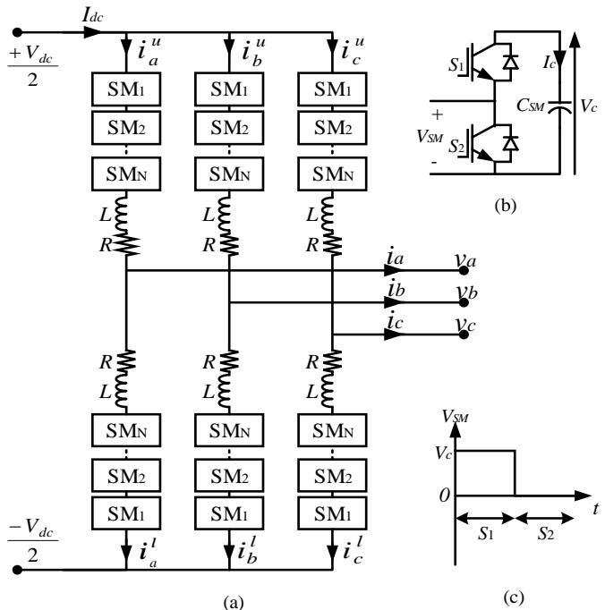  
Fig. 1. (a) Three phase MMC topology; (b) half-bridge SM configuration; (c) half-bridge SM switching pattern.

# B. Capacitor Voltage Balancing

Although the NLC (or any other PWM method) determines the number of SMs to be inserted, it does not indicate which SMs are to be used. This decision is made based upon a capacitor voltage balancing algorithm that uses the arm current direction to determine which SMs are to be inserted according to their present capacitor voltages. Sorting and balancing algorithms are widely used for this purpose [17], [20]. A block diagram of a general capacitor voltage balancing method in conjunction with NLC modulation is shown in Fig.

2. The voltages of SM capacitors are measured and sorted. If the arm current $\left( I _ { a r m } \right)$ is positive, the n(t) SMs with the lowest voltages are inserted. If the arm current is negative, n(t) SMs with the highest voltages are chosen for the insertion. This procedure guarantees that all capacitor voltages are balanced and maintained close to their nominal value.

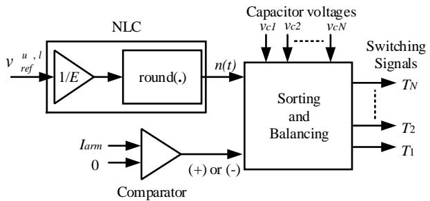  
Fig. 2. MMC capacitor voltage balancing with NLC modulation.

# III. PRINCIPLES OF MODELING USING DYNAMIC PHASORS

DPs are Fourier coefficients of the harmonic components of a quasi-periodic signal and are obtained by averaging the signal over a fixed-length window sliding over time [11]. In modeling converters, DPs provide computational advantage by ignoring fast dynamics (e.g., switching transients) and modelling only the slow dynamics. Furthermore, the ability to use a larger time-step in simulation of systems modeled in the DP domain provides computational benefits. The computational advantage of modeling and simulation with dynamic phasors may also be explained in terms of natural versus envelope waveforms. EMT simulators deal with natural waveforms of a circuit (i.e., voltages and currents in the original abc domain). In order to capture these time-varying waveforms, even during steady state operation, EMT solvers need to use small simulation time-steps. Dynamic phasors, on the other hand, deal with the phase and amplitude information of a waveform, which are commonly combined into the envelope waveform [21]. An envelope waveform remains constant during steady state and experiences low-frequency changes during transients. Therefore, its simulation does not require small time-steps, which can be used to expedite transient simulations.

# A. Conventional Dynamic Phasors

Consider a quasi-periodic signal x(t) with period T over the interval (t-T, t]; the Fourier series of x(t) is given as follows.

$$
x (t - T + s) = \sum_ {k = - \infty} ^ {+ \infty} \left\langle x \right\rangle_ {k} (t) e ^ {j k \frac {2 \pi}{T} (t - T + s)} \tag {3}
$$

where $s \in ( O , ~ T ]$ and k denotes the harmonic order. The timevarying Fourier coefficient $\langle x \rangle _ { k } ( t )$ is a representation of the magnitude and phase of $k ^ { \mathrm { { t h } } }$ frequency component of signal x(t) and it is computed as follows.

$$
\left\langle x \right\rangle_ {k} (t) = \frac {1}{T} \int_ {t - T} ^ {t} x (t - T + s) e ^ {- j k \frac {2 \pi}{T} (t - T + s)} d s \tag {4}
$$

It is readily seen that when the signal x(t) is strictly periodic (3) becomes identical to the conventional Fourier series. However, for a quasi-periodic signal, $\langle x \rangle _ { k } ( t )$ varies with time

and hence the name dynamic phasor. In DP modeling applications, the infinite series in (3) is truncated to a finite number of terms based on the desired level of accuracy.

The properties in (5)-(7) are useful in DP-based modeling.

$$
\frac {d}{d t} \left\langle x \right\rangle_ {k} (t) = \left\langle \frac {d}{d t} x \right\rangle_ {k} (t) - j k \frac {2 \pi}{T} \left\langle x \right\rangle_ {k} (t) \tag {5}
$$

$$
\left\langle x. y \right\rangle_ {k} = \sum_ {i = - \infty} ^ {+ \infty} \left\langle x \right\rangle_ {k - i} \left\langle y \right\rangle_ {i} \tag {6}
$$

$$
\left\langle x \right\rangle_ {- k} (t) = \left\langle x \right\rangle_ {k} ^ {*} (t) \tag {7}
$$

where * is the complex conjugate operator. In this paper, representation of a signal using components as in (4) is referred to as conventional DP (CDP) method, wherein each harmonic is considered separately. Despite its selectivity, this method is cumbersome and computationally inefficient when modeling systems consisting of many harmonics. A computationally efficient method to rectify this is introduced next.

# B. Base-Frequency Dynamic Phasors (BFDP)

The notion of a BFDP was introduced in [22] as an alternative to the CDP by mapping all the frequency contents of a signal (including dc) to the fundamental frequency. It was used in [22] as an efficient method for mapping EMT to DP quantities for co-simulation of large electrical networks, which were divided into an EMT portion and a DP portion and interfaced via an existing or artificial transmission line. This notion is extended to MMC modeling in this paper. Note that (3) may be rewritten in the following form.

$$
x (t - T + s) = \left\langle x \right\rangle_ {0} (t) + 2 \operatorname {R e} \left(\sum_ {k = 1} ^ {+ \infty} \left\langle x \right\rangle_ {k} (t) e ^ {j k \frac {2 \pi}{T} (t - T + s)}\right) \tag {8}
$$

Further it is possible to map each harmonic components (i.e., x0(t) and all xk(t) (k≠1)) onto the frame of the fundamental component (i.e., at a frequency of 2/T) as shown in (9).

$$
x (t - T + s) = \operatorname {R e} \left(\left( \begin{array}{l} {\left\langle x \right\rangle_ {0} (t) e ^ {- j \frac {2 \pi}{T} (t - T + s)}} \\ {+ 2 \sum_ {k = 1} ^ {+ \infty} \left\langle x \right\rangle_ {k} (t) e ^ {j (k - 1) \frac {2 \pi}{T} (t - T + s)}} \end{array} \right) e ^ {j \frac {2 \pi}{T} (t - T + s)}\right) \tag {9}
$$

The quantity in (10) is referred to as the BFDP of the signal x(t).

$$
\left\langle X \right\rangle_ {B} (t) = \left\langle x \right\rangle_ {0} (t) e ^ {- j \frac {2 \pi}{T} (t - T + s)} + 2 \sum_ {k = 1} ^ {+ \infty} \left\langle x \right\rangle_ {k} (t) e ^ {j (k - 1) \frac {2 \pi}{T} (t - T + s)} \tag {10}
$$

The notation $\left. X \right. _ { B } ( t )$ is used hereinafter to denote a BFDP.

The benefit of using a BFDP is that the network needs to be modeled only for the base frequency rather than for every harmonic component as is the case with the conventional dynamic phasors. If each harmonic component is modeled separately using a dynamic phasor, the network solution has to be obtained for each one and then combined to obtain the complete response of the system. For small networks, this may not be onerous as the admittance matrices to be inverted will not be of large dimension. In large networks, however, network admittance matrices will be of large dimensions and

inverting several such matrices will pose significant computational burden. The issue of large matric inversion is a common bottleneck in all EMT simulators. By combining all harmonic components into a dynamic phasor at a single frequency, the BFDP method circumvents solution of several harmonic-frequency networks, thereby yields large computational benefits to simulation of converters and large systems.

Although $\left. X \right. _ { B } ( t )$ denotes a DP at the fundamental frequency, it is clear from (10) that its calculation requires knowledge of all Fourier coefficients. Directly calculating these coefficients using (4) undermines the computational benefit of a BFDP. As such an efficient method is needed to calculate $\left. X \right. _ { B } ( t )$ . The Fourier series in (8) may be re-ordered as follows:

$$
\begin{array}{l} x (t - T + s) = 2 \operatorname {R e} \left(\left\langle x \right\rangle_ {1} (t) e ^ {j \frac {2 \pi}{T} (t - T + s)}\right) \\ + \sum_ {k = - \infty , k \neq - 1, 1} ^ {+ \infty} \left\langle x \right\rangle_ {k} (t) e ^ {j k \frac {2 \pi}{T} (t - T + s)} \tag {11} \\ \end{array}
$$

The series in (11) has two terms: the former is the fundamental component; the latter includes all harmonics and the dc component and may be further expressed as a composite term at the base frequency as follows:

$$
\begin{array}{l} x (t - T + s) = 2 \operatorname {R e} \left(\left\langle x \right\rangle_ {1} (t) e ^ {j \frac {2 \pi}{T} (t - T + s)}\right) \\ + \underbrace {\left(\sum_ {k = - \infty , k \neq - 1 , 1} ^ {+ \infty} \langle x \rangle_ {k} (t) e ^ {j (k - 1) \frac {2 \pi}{T} (t - T + s)}\right) e ^ {j \frac {2 \pi}{T} (t - T + s)}} _ {X _ {h} (t)} \tag {12} \\ \end{array}
$$

The formulation in (12) provides a computationally efficient way to calculate $\left. X \right. _ { B } ( t )$ . First the fundamental component, $\left. x \right. _ { 1 } ( t )$ , is calculated using (4) with $k = 1$ . It is used to form the first term on the right-hand side of (12), which is then subtracted from the original signal. This yields the second term on the right-hand side of (12), from which $\left. X \right. _ { h } ( t )$ is readily obtained. Lastly, the BFDP is obtained as follows:

$$
\left\langle X \right\rangle_ {B} (t) = \left\langle X \right\rangle_ {h} (t) + 2 \left\langle x \right\rangle_ {1} (t) \tag {13}
$$

This method of calculating $\left. X \right. _ { B } ( t )$ circumvents individual harmonic DP calculations and saves a great deal of computations.

The time-derivate of a BFDP is similar to (5). The BFDP of the product of two signals is as follows.

$$
\begin{array}{l} \left\langle x \cdot y \right\rangle_ {B} (t) = \sum_ {i = - \infty} ^ {+ \infty} \left\langle x \right\rangle_ {i} \left\langle y \right\rangle_ {- i} e ^ {- j \frac {2 \pi}{T} t} \\ + 2 \sum_ {h = 1} ^ {+ \infty} \left(\sum_ {i = - \infty} ^ {+ \infty} \left\langle x \right\rangle_ {i} \left\langle y \right\rangle_ {h - i}\right) e ^ {j (h - 1) \frac {2 \pi}{T} t} \tag {14} \\ \end{array}
$$

# IV. MODELING OF MMC USING THE BFDP CONCEPT

# A. MMC Circuit Formulation

Consider phase x $( x = a , b , c )$ of an MMC with half-bridge SMs in Fig. 1. SM capacitor voltages and arm currents for both upper arm (u) and lower arm (l) are expressed as follows.

$$
\frac {d}{d t} V _ {C x} ^ {u} = \frac {S _ {x} ^ {u}}{C _ {S M} N} i _ {x} ^ {u} \tag {15a}
$$

$$
\frac {d}{d t} V _ {C x} ^ {l} = \frac {S _ {x} ^ {l}}{C _ {S M} N} i _ {x} ^ {l} \tag {15b}
$$

$$
\frac {d}{d t} i _ {x} ^ {u} = \frac {V _ {d c}}{2 L} - \frac {1}{L} S _ {x} ^ {u} V _ {C x} ^ {u} - \frac {R}{L} i _ {x} ^ {u} - \frac {1}{L} v _ {x} \tag {16a}
$$

$$
\frac {d}{d t} i _ {x} ^ {l} = \frac {V _ {d c}}{2 L} - \frac {1}{L} S _ {x} ^ {l} V _ {C x} ^ {l} - \frac {R}{L} i _ {x} ^ {l} + \frac {1}{L} v _ {x} \tag {16b}
$$

where luCxv , , $\nu _ { C x } ^ { u , l } , \ S _ { x } ^ { u , l } , \ i _ { x } ^ { u , l }$ xS and $\nu _ { x }$ are the average voltage of SM capacitors, switching function, arm currents, and phase voltages, respectively; N denotes the number of SMs per arm. (15) and (16) may be re-written in terms of new variables defined by taking summation (s) and difference (d) of the upper and lower arm variables:

$$
\frac {d}{d t} V _ {C x} ^ {s} = \frac {1}{2 N C _ {S M}} \left(S _ {x} ^ {s} i _ {x} ^ {s} + S _ {x} ^ {d} i _ {x} ^ {d}\right) \tag {17a}
$$

$$
\frac {d}{d t} V _ {C x} ^ {d} = \frac {1}{2 N C _ {S M}} \left(S _ {x} ^ {s} i _ {x} ^ {d} + S _ {x} ^ {d} i _ {x} ^ {s}\right) \tag {17b}
$$

$$
\frac {d}{d t} i _ {x} ^ {s} = - \frac {1}{L} \left(\frac {1}{2} S _ {x} ^ {s} V _ {C x} ^ {s} + \frac {1}{2} S _ {x} ^ {d} V _ {C x} ^ {d} + R i _ {x} ^ {s} - V _ {d c}\right) \tag {18a}
$$

$$
\frac {d}{d t} i _ {x} ^ {d} = - \frac {1}{L} \left(\frac {1}{2} S _ {x} ^ {s} V _ {C x} ^ {d} + \frac {1}{2} S _ {x} ^ {d} V _ {C x} ^ {s} + R i _ {x} ^ {d} - v _ {x}\right) \tag {18b}
$$

It is important to note that the summation of arm currents is equal to double the arm’s circulating current plus two thirds of the dc current, and the difference of arm currents is equal to the AC line current. These equations may be used to describe both the internal and terminal behavior of the converter. At the AC side of the model, the line current is accessible as an input (from the EMT simulation of the connected system); therefore, once state variables $\nu _ { C x } ^ { s } , \nu _ { C x } ^ { d } , i _ { x } ^ { s }$ are found by solving (17) and (18a), one can readily use (18b) to determine the phase voltage vx. This approach eliminates solution of the system state equations thereby providing more computational advantage.

# B. Arm Switching Functions

The switching function of an individual arm is a representation of the voltage across the corresponding SM stack. Assuming that SM capacitor voltages are well balanced and are equal to the nominal capacitor voltage, the discrete switching function for the nearest level control can be written in terms of its Fourier components as follows.

$$
S _ {x} ^ {u} = \frac {N}{2} - m \frac {N}{2} \sum_ {k = 1} ^ {\infty} C _ {k} \sin (k \theta + k \delta) \tag {19a}
$$

$$
S _ {x} ^ {l} = \frac {N}{2} + m \frac {N}{2} \sum_ {k = 1} ^ {\infty} C _ {k} \sin (k \theta + k \delta) \tag {19b}
$$

Individual phase switching functions receive the proper $\pm 2 \pi / 3$ phased shift. The Fourier coefficient $C _ { k }$ is given in (20).

$$
C _ {k} = \left\{ \begin{array}{l l} \left(\frac {8}{k \pi N} \sum_ {i = 1} ^ {\frac {N + 1}{2}} \cos \left(k \alpha_ {i}\right)\right) - \cos \left(k \alpha_ {1}\right) & \text {i f N o d d} \\ \left(\frac {8}{k \pi N} \sum_ {i = 1} ^ {\frac {N}{2}} \cos \left(k \alpha_ {i}\right)\right) & \text {i f N e v e n} \end{array} \right. \tag {20}
$$

where $\alpha _ { i }$ is denotes a switching angle between two consecutive levels, and is given as follows.

$$
\alpha_ {i} = \left\{ \begin{array}{l l} \sin^ {- 1} \left(\frac {2}{m N} (i - 1)\right) & \text {i f N o d d} \\ \sin^ {- 1} \left(\frac {2}{m N} (i - \frac {1}{2})\right) & \text {i f N e v e n} \end{array} \right. \tag {21}
$$

The summation and difference of the upper and lower arms’ switching functions are given in (22).

$$
S _ {x} ^ {s} = N \tag {22a}
$$

$$
S _ {x} ^ {d} = - m N \sum_ {k = 1} ^ {\infty} C _ {k} \sin \left(k \omega_ {o} t + k \delta\right) \tag {22b}
$$

It is important to note that the summation of switching function is a dc quantity and the difference of switching function only includes odd harmonics.

It must also be noted that the developed model allows closed-loop operation of the converter in which the reference signal is not necessarily a sine-wave during system transients. This is achieved by computing the angles in (21) as a function of the time-varying modulation index (m).

# C. Dynamic Phasor Modeling of MMC

The following equations for the $k ^ { t h }$ frequency component can be found by applying CDP properties to (17) and (18).

$$
\frac {d}{d t} \left\langle V _ {C x} ^ {s} \right\rangle_ {k} = \frac {1}{2 N C _ {S M}} \left(\sum_ {i = - \infty} ^ {+ \infty} \left\langle S _ {x} ^ {s} \right\rangle_ {k - i} \left\langle i _ {x} ^ {s} \right\rangle_ {i} + \sum_ {i = - \infty} ^ {+ \infty} \left\langle S _ {x} ^ {d} \right\rangle_ {k - i} \left\langle i _ {x} ^ {d} \right\rangle_ {i}\right) - j k \omega_ {o} \left\langle V _ {C x} ^ {s} \right\rangle_ {k} \tag {23a}
$$

$$
\begin{array}{r} \frac {d}{d t} \left\langle V _ {C x} ^ {d} \right\rangle_ {k} = \frac {1}{2 N C _ {S M}} \left(\sum_ {i = - \infty} ^ {+ \infty} \left\langle S _ {x} ^ {s} \right\rangle_ {k - i} \left\langle i _ {x} ^ {d} \right\rangle_ {i} + \sum_ {i = - \infty} ^ {+ \infty} \left\langle S _ {x} ^ {d} \right\rangle_ {k - i} \left\langle i _ {x} ^ {s} \right\rangle_ {i}\right) \\ - j k \omega_ {o} \left\langle V _ {C x} ^ {d} \right\rangle_ {k} \end{array} \tag {23b}
$$

$$
\begin{array}{r} \frac {d}{d t} \left\langle i _ {x} ^ {s} \right\rangle_ {k} = - \frac {1}{2 L} \left(\sum_ {i = - \infty} ^ {+ \infty} \left\langle S _ {x} ^ {s} \right\rangle_ {k - i} \left\langle V _ {C x} ^ {s} \right\rangle_ {i} + \sum_ {i = - \infty} ^ {+ \infty} \left\langle S _ {x} ^ {d} \right\rangle_ {k - i} \left\langle V _ {C x} ^ {d} \right\rangle_ {i}\right) \\ - \left(\frac {R}{L} + j k \omega_ {o}\right) \left\langle i _ {x} ^ {s} \right\rangle_ {k} - \frac {1}{L} \left\langle V _ {d c} \right\rangle_ {k} \end{array} \tag {23c}
$$

$$
\left\langle v _ {x} \right\rangle_ {k} = - \frac {1}{4} \left(\sum_ {i = - \infty} ^ {+ \infty} \left\langle S _ {x} ^ {s} \right\rangle_ {k - i} \left\langle V _ {C x} ^ {d} \right\rangle_ {i} + \sum_ {i = - \infty} ^ {+ \infty} \left\langle S _ {x} ^ {d} \right\rangle_ {k - i} \left\langle V _ {C x} ^ {s} \right\rangle_ {i}\right) - \left(\frac {R + j k \omega_ {o}}{2}\right) \left\langle i _ {x} ^ {d} \right\rangle_ {k} - \frac {L}{2} \frac {d}{d t} \left\langle i _ {x} ^ {d} \right\rangle_ {k} \tag {24}
$$

where $\omega _ { 0 } = 2 \pi / T$ denotes the fundamental angular frequency. Similarly, DP equivalents of switching functions are as follows.

$$
\left\langle S _ {x} ^ {S} \right\rangle_ {k} = \left\{ \begin{array}{l l} N & \text {i f} k = 0 \\ 0 & \text {O t h e r w i s e} \end{array} \right. \tag {25a}
$$

$$
\left\langle S _ {x} ^ {d} \right\rangle_ {k} = \left\{ \begin{array}{l l} j \frac {m N C _ {k}}{2} e ^ {j k \delta} & \text {i f} k \text {o d d} \\ 0 & \text {O t h e r w i s e} \end{array} \right. \tag {25b}
$$

Summation of capacitor voltage and arm currents include dc and even harmonics, while phase voltage and the difference of capacitor voltages include odd harmonics. Therefore, it is vital to be cautious about the choice of frequency components when solving (23), since it increases the computational burden as the number of frequency components taken into consideration increases. $\nu _ { C x } ^ { d }$ d is a function of AC side current as seen from (23b); thus, the first two frequency components $( \mathrm { i } . \mathrm { e } . , k = 1 , 3 )$ are considered. $k = 0 , 2$ are considered for $i _ { x } ^ { s }$ and $\nu _ { C x } ^ { s }$ since they are made of dc and second-order components. Section VI shows that this is a reasonable choice as the new model is able to model accurately details of the internal dynamics of an MMC. DP quantities $\langle V _ { d c } \rangle _ { 0 } , \langle i _ { x } ^ { d } \rangle _ { 1 }$ and $\langle i _ { x } ^ { d } \rangle _ { 3 }$ can be found using instantaneous dc voltage and line current with (4). A numerical integration method such as trapezoidal method can be used to solve the system given by (23).

Even though the output voltage normally consists of only low frequency contents, during transients such as faults, manifestation of dc and significant amounts of high-frequency contents is possible. A straightforward way of extending the voltage equation to model higher frequencies is to use (24) considering each frequency separately. However, this procedure has a large computation burden as it requires conversion of instantaneous output currents at the EMT side to equivalent DP quantities and DP quantities of voltages to EMT side instantaneous values separately for each harmonic. The BFDP concept introduced earlier in Section III circumvents this by combining all harmonic components in a single DP at the fundamental frequency using the computationally low-cost method shown in Section III.B. The BFDP that includes all the harmonics of the AC voltage can be derived as follows.

$$
\begin{array}{r l} \left\langle v _ {x} \right\rangle_ {B} = & - \frac {1}{4} \left(\left\langle S _ {x} ^ {s}. V _ {C x} ^ {d} \right\rangle_ {B} + \left\langle S _ {x} ^ {d}. V _ {C x} ^ {s} \right\rangle_ {B}\right) \\ & - \left(\frac {R + j \omega_ {o} L}{2}\right) \left\langle i _ {x} ^ {d} \right\rangle_ {B} - \frac {L}{2} \frac {d}{d t} \left\langle i _ {x} ^ {d} \right\rangle_ {B} \end{array} \tag {26}
$$

The DPs of capacitor voltage summation and difference are available from the state equation solution; thus, once the DPs of the switching function are obtained, the BFDPs of both product terms can be readily found using (14). The number of frequency components in the difference term of switching functions is a matter of choice since accuracy of the voltage waveform heavily depends on the considered harmonic contents.

# V. MMC MODEL INTERFACE

A general block diagram of the proposed interface for the new MMC model is illustrated in Fig. 3. The modulation index and converter power angle are generated by a controller and taken as inputs to the MMC model. A PLL is employed to measure the phase angle at the point of common coupling. Instantaneous values of AC line currents and DC pole-to-pole voltage are measured at corresponding interfaces and then the phase voltages and DC current are fed to the AC and DC systems by means of three dependent voltage sources and a dependent current source as depicted in Fig. 4.

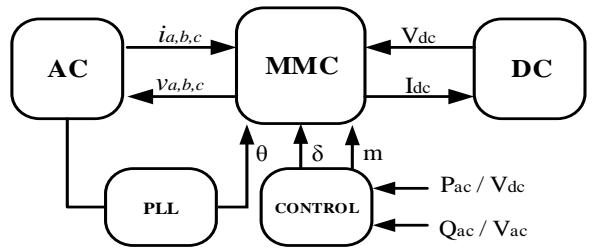  
Fig. 3. MMC model interface.

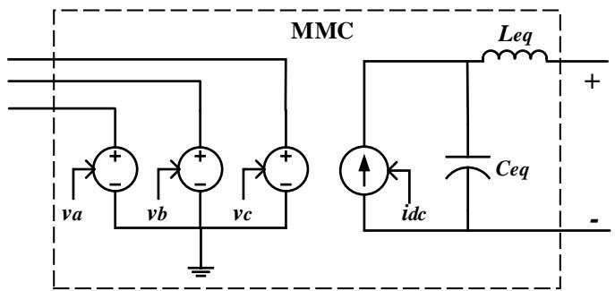  
Fig. 4. MMC model representation.

The BFDP of the AC phase voltages given in (26) must be converted to time-domain instantaneous values before being fed to the dependent sources. The DC current can be produced by either the principle of power balance or the DP solution. In the power balance approach the DC power is equal to the AC power assuming negligible losses are incurred inside the MMC.

$$
I _ {d c} (t) = \left(\sum_ {x = a, b, c} v _ {x} i _ {x}\right) / V _ {d c} (t) \tag {27}
$$

In this method, one can filter the instantaneous DC current value before it is fed to the dependent current source since the average model is not focused on fast transients. In the second method, the DC current is directly computed from the DP solution of (20c) as follows.

$$
I _ {d c} (t) = \sum_ {x = a, b, c} \left\langle i _ {x} ^ {s} \right\rangle_ {0} / 2 \tag {28}
$$

In this representation (see Fig. 4), the effect of stored energy inside SM capacitors is ignored; thus, an equivalent capacitance $C _ { e q }$ is derived using energy conservation principles and included in parallel with the current source to characterize the total energy stored inside the MMC [9].

$$
C _ {e q} = 6 C _ {S M} / N \tag {29}
$$

One third of the DC current flows through the upper and lower arms; thus, a series DC side equivalent inductor $L _ { e q }$ is added to mimic the effect of the arm inductance on the DC side.

$$
L _ {e q} = 2 L / 3 \tag {30}
$$

# VI. SIMULATION RESULTS AND MODEL VALIDATION

The developed model is validated against a detailed switching model (DSM) and a detailed equivalent model (DEM), [7] in the context of PSCAD/EMTDC simulator. In these simulation based studies, three types of test systems under various disturbances are considered. The model is further validated experimentally against a scaled-down MMC setup.

# A. Test System-1: Inverter Operation (Simulation-Based Verification)

The inverter operating mode of the MMC is investigated to validate the accuracy of the DP-MMC model against a DSM. The test system given in [16] is simulated considering ten SMs per arm for visual clarity of the output voltage levels. Test system parameters are listed in Table I. Direct controllers adjust the real power and AC bus voltage magnitude using the converter’s modulation index and phase angle.

TABLE I TEST SYSTEM-1 SPECIFICATIONS   

<table><tr><td>AC system voltage</td><td>230 kV</td></tr><tr><td>SCR</td><td>4.0∠80°</td></tr><tr><td>DC system</td><td>500 kV, 500 MW</td></tr><tr><td>Transformer turns ratio</td><td>290 kV:230 kV</td></tr><tr><td>Transformer ratings</td><td>700 MVA, 0.12 pu</td></tr><tr><td>MMC CSM,L</td><td>1800 μF, 1 mH</td></tr><tr><td>N</td><td>10</td></tr></table>

Fig. 5 illustrates a comparison of model accuracy during steady state operation of the inverter by gradually increasing the harmonic contents considered. Both models are simulated with a 5 µs time-step. It is observed that the voltage waveform consists of eleven voltage levels; thus significant amount of harmonics exists. Therefore, there is notable error in the DP waveforms when only the fundamental harmonic component (k=1) is considered. The error tends to become insignificant as the included harmonic components increase.

The influence of the simulation time-step on the accuracy of the DP model and the DSM is illustrated in Fig. 6. Results are compared with the waveforms obtained from the DSM simulated at 5 µs time-step. Fig. 6 shows that the DP model provides waveforms with reasonable accuracy even up to time-steps as large as 350 µs, while the accuracy of the DSM starts to deteriorate after around 100 µs. This is a significant achievement since it relieves the computational burden of the EMT simulator without much adverse impact on accuracy. Fig. 5 also shows other key benefits of the developed DP model. This model provides the user with the flexibility to decide what portion of the harmonic spectrum of the MMC’s output voltage to retain. As the number of included harmonic components increases, the output voltage becomes closer to

the staircase voltage. With a large enough number of harmonics (for example the plot with h = 45 in Fig. 5), the two waveforms are essentially overlapping. These are key advantages of this model over existing DP models such as [14], wherein only the low-frequency contents are considered.

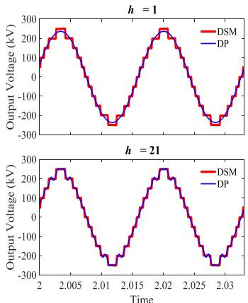

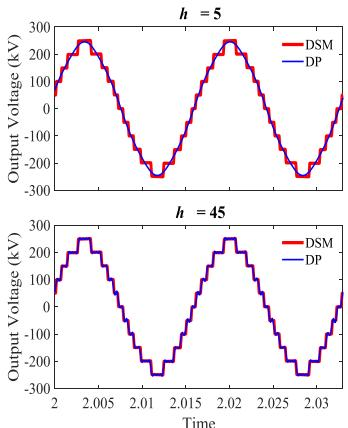  
Fig. 5. Accuracy comparison of the DP model vs. a detailed switching model.

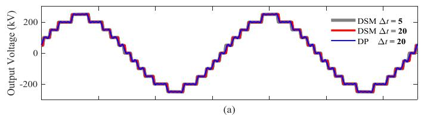

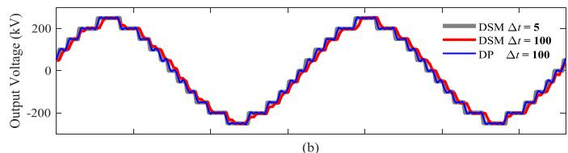

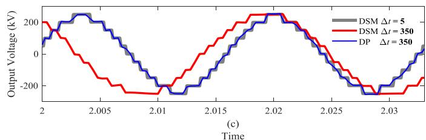  
Fig. 6. Influence of the simulation time-step on the accuracy of DSM and DP models; (a) Δt = 20 µs, (b) Δt = 100 µs, (c) Δt = 350 µs.

The transient behavior of the MMC models are observed by giving a step change to the terminal voltage reference. Harmonics up to $4 5 ^ { \mathrm { t h } }$ component are modeled and a time-step of 100 µs is used for the DP model. The DSM is simulated at 5 µs time-step. The voltage reference is reduced from 1 pu to 0.8 pu at 2.5 s and observations are shown in Fig. 7. Clearly the transients of the DP model closely match those of the DSM. The accuracy of the external waveforms of the DP model is better than that of the internal waveforms due to consideration of a larger number of harmonics. However, the accuracy of internal waveforms is expected to be improved in the presence of an arm current controller since such a controller mitigates higher order frequency components in the circulating arm current.

The developed DP-MMC model provides access to the internal dynamics of the MMC, in particular the harmonic contents of the arm currents, which are useful in designing

controllers such as second-harmonic circulating current

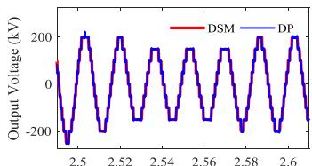

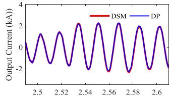

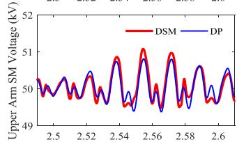

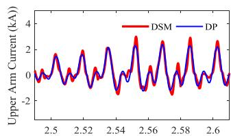

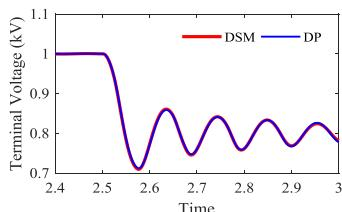

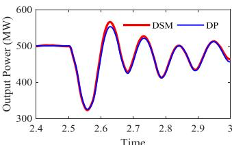  
Fig. 7. Inverter response to a step change in terminal voltage reference.

suppression. Table II shows the harmonic contents of the arm current of the MMC that are obtained by performing Fourier analysis on the arm current waveforms from the DSM and the DP-MMC model for the 500 kV, 500 MW operating point. The DP-MMC clearly provides a highly accurate prediction of the most dominant harmonics of the arm current, i.e., dc, fundamental, and second order components. The table also shows the percentage errors of the respective quantities, which are quite small.

TABLE IIHARMONIC CONTENTS OF THE ARM CURRENT FOR TEST SYSTEM-1  

<table><tr><td></td><td>Total waveform RMS</td><td>DC component</td><td>1stcomponent</td><td>2ndcomponent</td></tr><tr><td>DSM</td><td>0.7499 kA</td><td>0.3227 kA</td><td>0.4968 kA</td><td>0.35430 kA</td></tr><tr><td>DP-MMC</td><td>0.7147 kA</td><td>0.3336 kA</td><td>0.4995 kA</td><td>0.37393 kA</td></tr><tr><td>|Error| %</td><td>4.69%</td><td>3.37%</td><td>0.55%</td><td>5.54%</td></tr></table>

# B. Test System-2: Back-to-Back HVDC System (Simulation-Based Verification)

A back-to-back HVDC test system connecting two AC systems via a ±250 kV, 500 MW DC link is considered. System specifications are shown in Table III. A relatively large number of SMs per arm is selected to reduce the harmonic contents of waveforms and provide a more realistic simulation scenario; therefore, results are compared by implementing the same system with a DEM [8] of the MMC in PSCAD/EMTDC. MMC-1 controls DC voltage and reactive power, and MMC-2 controls real power and AC voltage magnitude. The DP model is simulated with a 100 µs time-step considering harmonics up to $4 5 ^ { \mathrm { t h } }$ order and the DEM is simulated at a 20 µs time-step.

Fig. 8 shows the response to a real power flow reversal order. Initially the system is set to send 500 MW to system-2 and the reference is changed to -500 MW at t = 7.5 s. AC waveforms are effectively sinusoidal in steady state due to the large number of SMs. Similar dynamic behavior is observed in

both DEM and DP models. Internal waveforms also follow the same dynamic pattern with high conformity between the two models.

TABEL III TEST SYSTEM-2 SPECIFICATIONS   

<table><tr><td>Parameter</td><td>AC System-1</td><td>AC System-2</td></tr><tr><td>System voltage</td><td>230 kV</td><td>230 kV</td></tr><tr><td>SCR</td><td>4.0∠80°</td><td>4.0∠80°</td></tr><tr><td>Transformer turns ratio</td><td>290 kV:230 kV</td><td>290 kV:230 kV</td></tr><tr><td>Transformer ratings</td><td>700 MVA, 0.12 pu</td><td>700 MVA, 0.12 pu</td></tr><tr><td>MMC CSM,L</td><td>5000 μF, 21 mH</td><td>5000 μF, 21 mH</td></tr><tr><td>N</td><td>50</td><td>50</td></tr></table>

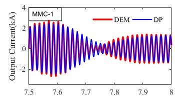

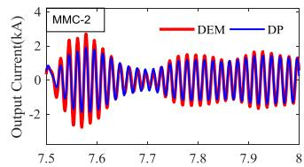

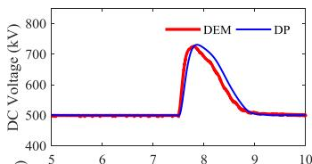

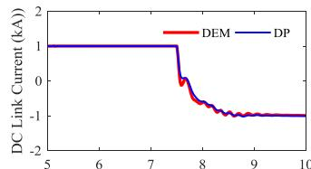

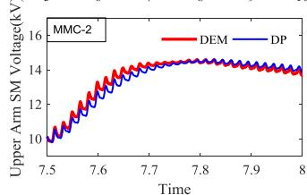

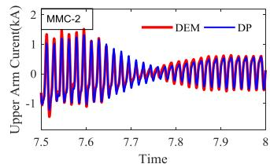  
Fig. 8. Back-to-back system response to a real power reversal.

To investigate rectifier operation and transients of the backto-back system, a step increase of DC voltage reference from 500 kV to 520 kV is given at t = 7.5 s. As illustrated from Fig. 9, the DC voltage undergoes a small oscillation and settle at 520 kV. The DC current is reduced to maintain constant power flow.

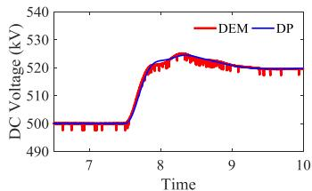

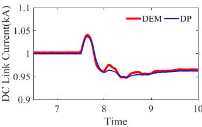  
Fig. 9. Back-to-back system response to DC voltage set-point change.

Table IV shows the assessment of the accuracy of the DP-MMC model in predicting the harmonic contents of the arm current at 500 kV, 500 MW operating point. As shown, the DP-MMC provides a high level of accuracy in predicting key internal quantities of the MMC; the total waveform RMS error incurred due to neglecting higher order harmonics of the circulating current is now reduced (compared to Table II) due to the increased number of SMs per arm.

TABLE IVHARMONIC CONTENTS OF THE ARM CURRENT FOR TEST SYSTEM-2  

<table><tr><td></td><td>Total waveform RMS</td><td>DC component</td><td>1stcomponent</td><td>2ndcomponent</td></tr><tr><td>DEM-MMC</td><td>0.7297 kA</td><td>0.3370 kA</td><td>0.4988 kA</td><td>0.3786 kA</td></tr><tr><td>DP-MMC</td><td>0.7118 kA</td><td>0.3334 kA</td><td>0.5009 kA</td><td>0.3608 kA</td></tr><tr><td>|Error| %</td><td>2.45%</td><td>1.07%</td><td>0.44%</td><td>4.69%</td></tr></table>

# C. Test System-3: A Larger AC System (Simulation-Based Verification)

A 600 km long, ±250 kV HVDC link is placed between bus-1 and bus-3 of the 12-bus power system given in [23] and 350 MW real power is sent from bus-1 to bus-3. The 12-bus system with the DP model of the MMC is simulated at 50 µs time-step considering harmonics up to 45th component and the DEM is simulated at 1 µs and its results are used for benchmarking. Controls, transformer ratings, and MMC parameters are as per the back-to-back system given in Table III. The purpose of the simulations is to study the MMC behavior and system responses in a larger power system. This case study also illustrates the ability of our model to be interfaced to arbitrary network topologies on its ac and dc sides in the context of an EMT simulator, which is a distinct advantage over DP models (see [14]-[16]) that are formulated for specific terminating ac and dc system.

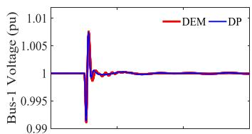

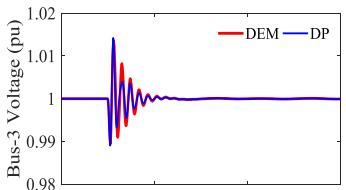

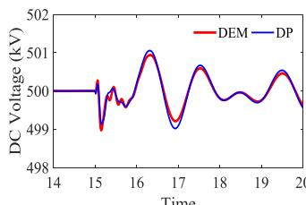

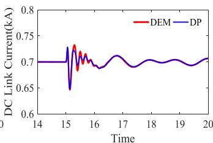  
Fig. 10. Responses to a remote three-phase fault in the IEEE 12-bus system.

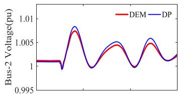

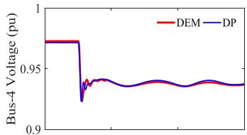

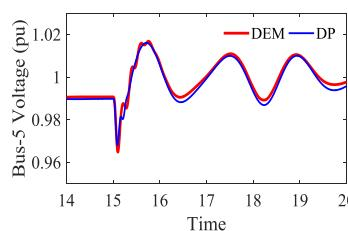

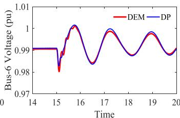  
Fig. 11. Voltage changes of the IEEE 12-bus system to a step change in MMC-2’s voltage reference.

MMC responses to a remote three-phase fault at bus-6 are given in Fig. 10; system response to a step change from 1 pu

to 0.95 pu in MMC-2’s terminal voltage order is shown in Fig. 11. The DP model shows conformity to the DEM; most importantly the peak of each transient and slow dynamics are nearly identical between the two models. Therefore, this model can be used to study the electromagnetic transients in larger power systems with reasonable accuracy by carrying out the simulations at larger time-steps.

# D. Time and Speed-Up Comparison

A simulation time comparison is done to validate the efficiency of the new DP-MMC model against DSM and the DEM. Simulations are performed on a computer with a 2.60 GHz, Intel core i5-3230M processor and 8 GB RAM.

First, simulation speed is compared with the DSM by simulating the MMC inverter (case 1) with ten SMs per arm for a 5 s duration. Simulation time is measured for different time steps and different harmonic contents in the DP-MMC model as displayed in Table V. It is observed that the DP model is about 4 times faster than the DSM when the timestep is 5 µs and it increases to around 50, when the time-step is 100 µs. Accuracy of the DSM deteriorate after around 100 µs (see Fig. 6); however, the DP model provides accurate results even up to 350 µs. This improves the speed-up factor of the DP model even further (approximately 140) thus greatly saving computational time. Another observation from Table V is that the simulation speed does not increase significantly with the increase in the harmonic contents included in the external waveforms. This is due to the fact that BFDP captures and models any given number of harmonics in one mathematical expression.

TABLE V SIMULATION TIME COMPARISON OF DP-MMC MODEL WITH DSM   

<table><tr><td rowspan="2">Δt</td><td rowspan="2">DSM of MMC simulation time (s)</td><td colspan="3">DP-MMC simulation time (s)</td></tr><tr><td>h = 1</td><td>h = 21</td><td>h = 45</td></tr><tr><td>5 μs</td><td>3336</td><td>857.47</td><td>861.94</td><td>872.32</td></tr><tr><td>100 μs</td><td>320</td><td>6.46</td><td>6.65</td><td>7.34</td></tr><tr><td>350 μs</td><td>-</td><td>2.07</td><td>2.25</td><td>2.34</td></tr></table>

TABLE VI SIMULATION TIME COMPARISON OF DP-MMC MODEL WITH DEM   

<table><tr><td>Number of SM per arm</td><td>DEM of MMC</td><td>DP-MMC</td><td>Speed-up factor</td></tr><tr><td>5</td><td>17.56 s</td><td>23.73 s</td><td>0.74</td></tr><tr><td>25</td><td>25.31 s</td><td>25.74 s</td><td>0.98</td></tr><tr><td>50</td><td>37.04 s</td><td>31.13 s</td><td>1.19</td></tr><tr><td>100</td><td>64.56 s</td><td>39.57 s</td><td>1.63</td></tr><tr><td>200</td><td>152.35 s</td><td>56.70 s</td><td>2.69</td></tr><tr><td>400</td><td>471.30 s</td><td>61.57 s</td><td>7.65</td></tr></table>

The DSM is constructed using only ten SMs per arm; however, in MMC applications this number will be much larger Therefore, the influence of the number of SMs per arm on simulation time is compared in Table VI. The back-to-back system in case 2 is simulated for a 10 s duration with a timestep of 100 µs and results are compared with the DEM. It can be seen from Table VI that the DP model is less effective compared to DEM when the number of SMs per arm is small. However, as the SM count increases, the simulation time of the DEM grows at a much faster rate than the DP model. For

400 SMs per arm, the DP model is approximately 8 times faster than the DEM with the same simulation time-step. Since real-world MMC application will have a large number of SMs, the DP model will give distinct benefits in EMT simulation of such systems.

# E. Experimental Verifications

In general, the DSM and DEM models of an MMC are accepted to be highly accurate representations of the actual behavior of an MMC, and as such they are often used to benchmark other models, as was done in the preceding sections. However, the ultimate goal of any model is to produce high-fidelity representation of the actual physical system or phenomenon of interest. In order to further validate the developed DP-MMC model, a scaled down laboratory (Opal-RT MMC) setup, shown in Fig. 12, is prepared and measurements taken on it are compared against predictions of the developed DP-MMC model for inverter mode of operation into a resistive dead load, without a circulating current suppression scheme. Other specifications of the setup and the conducted test are listed in Table VII.

TABLE VII EXPERIMENTAL TEST AND SETUP SPECIFICATIONS   

<table><tr><td>Number of SMs per arm (N)</td><td>10</td></tr><tr><td>SM capacitor [mF]</td><td>5.0</td></tr><tr><td>Arm inductor [mH]</td><td>3.5</td></tr><tr><td>Arm resistor [Ω]</td><td>0.3</td></tr><tr><td>DC voltage (pole-to-pole) [V]</td><td>300</td></tr><tr><td>Load resistance [Ω]</td><td>12.0</td></tr><tr><td>Modulation index</td><td>0.8</td></tr></table>

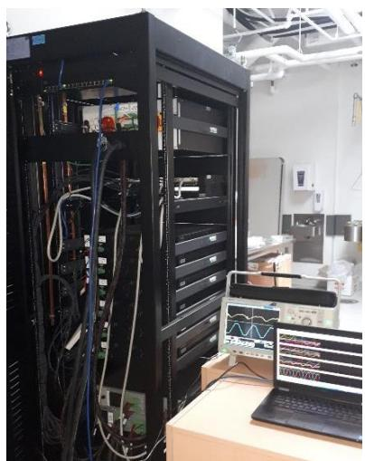  
Fig. 12. Experimental MMC setup (the cabinet on the left houses the MMC hardware).

Fig. 13 shows the average submodule capacitor voltage, arm current, load voltage, and load current traces measured on the experimental setup along with waveforms simulated using the developed DP-MMC model for the same operating conditions as listed in Table VII. The figure also shows simulation results from a detailed switching model (in PSCAD/EMTDC) as another point of verification. Clearly the DP-MMC model produces results that are in agreement with the experimental traces. The slight differences between the

simulated and experimental results originate from such factors as (i) small differences between actual and estimated model parameter values (e.g., inductance, capacitance, and resistance of the current paths), (ii) parasitic elements and highfrequency un-modeled dynamics, (iii) parameter variations with operating conditions such as temperature, and (iv) measurement error and instrumentation equipment loading effects.

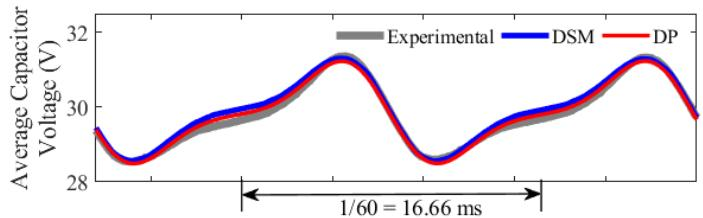

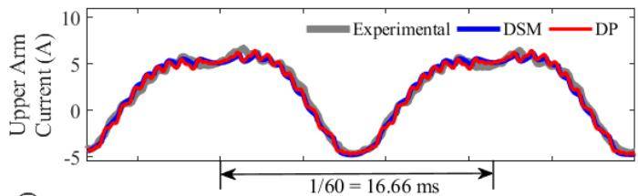

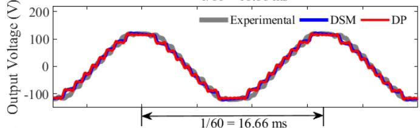

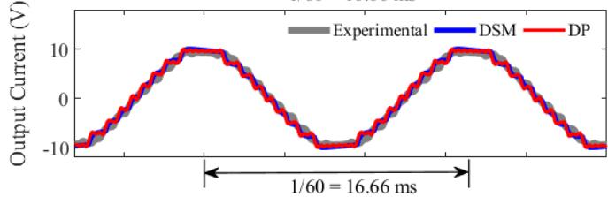  
Fig. 13. Comparison of experimental and simulated waveforms (both DP and DSM simulation results are included).

TABLE VIII   
HARMONIC CONTENTS OF THE ARM CURRENT OF THE EXPERIMENTAL SETUP  

<table><tr><td></td><td>Total waveform RMS</td><td>DC component</td><td>1stcomponent</td><td>2ndcomponent</td></tr><tr><td>Experimental</td><td>4.2545 A</td><td>2.0278 A</td><td>3.3685 A</td><td>1.2310 A</td></tr><tr><td>DP-MMC</td><td>4.1462 A</td><td>1.9648 A</td><td>3.4436 A</td><td>1.1820 A</td></tr><tr><td>|Error| %</td><td>2.55%</td><td>3.11%</td><td>2.23%</td><td>3.98%</td></tr></table>

To further illustrate the accuracy of the developed dynamic phasor model, Table VIII shows the harmonic components of the arm current waveforms from both the experiments and the DP model. The harmonic components and the total RMS of the two waveforms show high degrees of conformity.

# VII. CONCLUSION

A novel and flexible MMC model was developed for EMT simulations using base-frequency dynamic phasors. The model can produce a given harmonic spectrum of external waveforms accurately and also produces the most important details of internal waveforms. The model was successfully integrated into an EMT simulator interfacing with both AC

and DC networks, which are built in the EMT simulator. Simulation results of the new model for several HVDC systems under various disturbances validated the accuracy and efficiency of the model. The new model was shown to be several times faster than existing switching and detailed equivalent MMC models. Model validation against a scaled down laboratory setup showed close conformity to experimentally measured traces as well.

# REFERENCES

[1] N. Watson and J. Arrillaga, Power system electromagnetic transient simulation. The Institution of Engineering and Technology.   
[2] J. Mahseredjian, V. Dinavahi, and J. A. Martinez, “Simulation Tools for Electromagnetic Transients in Power Systems: Overview and Challenges,” IEEE Transactions on Power Delivery, vol. 24, no. 3, pp. 1657–1669, Jul. 2009.   
[3] A. Lesnicar and R. Marquardt, “An innovative modular multilevel converter topology suitable for a wide power range,” in 2003 IEEE Bologna Power Tech Conference Proceedings, 2003, vol. 3, pp. 6 pp. Vol.3-.   
[4] K. Sharifabadi, L. Harnefors, P. Nee, S. Norrga, and R. Teodorescu, Design, Control and Application of Modular Multilevel Converters for HVDC Transmission Systems. John Wiley & Sons, Incorporated, 2016.   
[5] S. Debnath, J. Qin, B. Bahrani, M. Saeedifard, and P. Barbosa, “Operation, Control, and Applications of the Modular Multilevel Converter: A Review,” IEEE Transactions on Power Electronics, vol. 30, no. 1, pp. 37–53, Jan. 2015.   
[6] J. Dorn, H. Huang, and D. Retzmann, “A new Multilevel Voltage-Sourced Converter Topology for HVDC Applications,” CIGRE, 2008.   
[7] U. N. Gnanarathna, A. M. Gole, and R. P. Jayasinghe, “Efficient Modeling of Modular Multilevel HVDC Converters (MMC) on Electromagnetic Transient Simulation Programs,” IEEE Transactions on Power Delivery, vol. 26, no. 1, pp. 316–324, Jan. 2011.   
[8] H. Saad et al., “Modular Multilevel Converter Models for Electromagnetic Transients,” IEEE Transactions on Power Delivery, vol. 29, no. 3, pp. 1481–1489, Jun. 2014.   
[9] J. Xu, A. M. Gole, and C. Zhao, “The Use of Averaged-Value Model of Modular Multilevel Converter in DC Grid,” IEEE Transactions on Power Delivery, vol. 30, no. 2, pp. 519–528, Apr. 2015.   
[10] H. Saad et al., “Dynamic Averaged and Simplified Models for MMC-Based HVDC Transmission Systems,” IEEE Transactions on Power Delivery, vol. 28, no. 3, pp. 1723–1730, Jul. 2013.   
[11] S. R. Sanders, J. M. Noworolski, X. Z. Liu, and G. C. Verghese, “Generalized averaging method for power conversion circuits,” IEEE Transactions on Power Electronics, vol. 6, no. 2, pp. 251–259, Apr. 1991.   
[12] M. Daryabak et al., “Modeling of LCC-HVDC Systems Using Dynamic Phasors,” IEEE Transactions on Power Delivery, vol. 29, no. 4, pp. 1989–1998, Aug. 2014.   
[13] S. Chiniforoosh et al., “Definitions and Applications of Dynamic Average Models for Analysis of Power Systems,” IEEE Transactions on Power Delivery, vol. 25, no. 4, pp. 2655–2669, Oct. 2010.   
[14] D. Jovcic and A. A. Jamshidifar, “Phasor Model of Modular Multilevel Converter With Circulating Current Suppression Control,” IEEE Transactions on Power Delivery, vol. 30, no. 4, pp. 1889–1897, Aug. 2015.   
[15] S. R. Deore, P. B. Darji, and A. M. Kulkarni, “Dynamic phasor modeling of Modular Multi-level Converters,” in 2012 IEEE 7th International Conference on Industrial and Information Systems (ICIIS), 2012, pp. 1–6.   
[16] S. Rajesvaran and S. Filizadeh, “Modeling modular multilevel converters using extended-frequency dynamic phasors,” in 2016 IEEE Power and Energy Society General Meeting (PESGM), 2016, pp. 1–5.   
[17] P. M. Meshram and V. B. Borghate, “A Simplified Nearest Level Control (NLC) Voltage Balancing Method for Modular Multilevel Converter (MMC),” IEEE Transactions on Power Electronics, vol. 30, no. 1, pp. 450–462, Jan. 2015.

[18] Q. Tu, Z. Xu, and L. Xu, “Reduced Switching-Frequency Modulation and Circulating Current Suppression for Modular Multilevel Converters,” IEEE Transactions on Power Delivery, vol. 26, no. 3, pp. 2009–2017, Jul. 2011.   
[19] G. S. Konstantinou, M. Ciobotaru, and V. G. Agelidis, “Operation of a modular multilevel converter with selective harmonic elimination PWM,” in 8th International Conference on Power Electronics - ECCE Asia, 2011, pp. 999–1004.   
[20] S. Rohner, S. Bernet, M. Hiller, and R. Sommer, “Modulation, Losses, and Semiconductor Requirements of Modular Multilevel Converters,” IEEE Transactions on Industrial Electronics, vol. 57, no. 8, pp. 2633–2642, Aug. 2010.   
[21] S. Henschel, “Analysis of electromagnetic and electromechanical power system transients with dynamic phasors,” Ph.D. dissertation, Uni. of British Columbia, 1999.   
[22] K. Mudunkotuwa, S. Filizadeh, and U. Annakkage, “Development of a hybrid simulator by interfacing dynamic phasors with electromagnetic transient simulation,” Transmission Distribution IET Generation, vol. 11, no. 12, pp. 2991–3001, 2017.   
[23] S. Jiang, U. D. Annakkage, and A. M. Gole, “A platform for validation of FACTS models,” IEEE Transactions on Power Delivery, vol. 21, no. 1, pp. 484–491, Jan. 2006.

Janesh Rupasinghe (S’16) received his B.Sc. degree in electrical engineering from University of Moratuwa, Moratuwa, Sri Lanka, in 2014, and the M.Sc. degree in electrical engineering from University of Manitoba, MB, Canada in 2018. He is presently a Ph.D. candidate in Department of Electrical and Computer Engineering in University of Manitoba since January,

2018. His research interests include advanced co-simulation algorithms, electromagnetic transient simulations, averaging techniques in power system modeling, power electronic system modeling in power system, and HVDC systems.

Shaahin Filizadeh (S’02–M’05–SM’10) received the B.Sc. and M.Sc. degrees in electrical engineering, from the Sharif University of Technology, Tehran, Iran, in 1996 and 1998, respectively, and the Ph.D. degree from the University of Manitoba, Winnipeg, MB, Canada, in 2004. He is currently a Professor with the Department of Electrical and Computer Engineering, University of Manitoba. His areas of interest include electromagnetic transient simulation and power electronics. Dr. Filizadeh is a Registered Professional Engineer in the province of Manitoba. He is active in several IEEE committees and is currently the Chair of the IEEE Task Force on Dynamic Phasor Modeling Techniques. He is an Editor for the IEEE TRANSACTIONS ON ENERGY CONVERSION and IEEE POWER ENGINEERING LETTERS.

Liwei Wang (S’04–M’10) received the M.S. degree in electrical engineering from Tianjin University, Tianjin, China, in 2004 and the Ph.D. degree in electrical and computer engineering from the University of British Columbia, Vancouver, BC, Canada, in 2010. From February 2009 to July 2009, he was an Internship Researcher with the ABB

Corporate Research Center, Baden-Dättwil, Switzerland. He

was a Postdoctoral Research Fellow with the Department of Electrical and Computer Engineering, University of British Columbia, from February 2010 to July 2010. In August 2010, he joined the ABB Corporate Research Center, Västerås, Sweden, as a Scientist and then as a Senior Scientist. In July 2014, he joined the School of Engineering, the University of British Columbia, Kelowna, BC, Canada, as an Assistant Professor. His research interests include power system analysis, operation, and simulation; electrical machines and drives; power electronics converter design, control, and topology; power semiconductor modeling and characterization; utility power electronics applications; HVDC and FACTS; renewable-energy sources; and distributed generation. He is the holder of over ten international patents.