# Real-Time Simulation of Power System Electromagnetic Transients on FPGA Using Adaptive Mixed-Precision Calculations

Xin Ma , Conghuan Yang , Xiao-Ping Zhang , Fellow, IEEE, Ying Xue , Senior Member, IEEE, and Jianing Li , Member, IEEE

Abstract—The massive integration of renewable energy sources and power electronics into the power grid leads to the strong need of real-time Electromagnetic Transients (EMT) simulation of power system using field-programmable gate array (FPGA) platform due to its high efficiency and superior performance. FPGA based EMT simulations – A key for Digital Twin were mainly based on Single-Precision calculations, but ignored potential accumulation displacement. To address this problem, this paper proposes full Double-Precision and Mixed-Precision Floating-Point schemes to achieve optimal balance between numerical accuracy and computational resource cost in FPGA-based EMT simulation even for long duration simulations. Furthermore, adjustable pipeline, address dynamic access and sequence controller techniques for solving high fanout and long datapath hardware implementation are developed to optimize resource usage and timing constraints for all schemes. For non-rotating components, full Double-Precision and full Single-Precision both shows excellent convergence. For rotating components, extra Single-Precision iteration method and Mixed-Precision calculations are compared for Synchronous Machines (SG) with strong nonlinearity, and it is found that only full Double-Precision could avoid phase shift problem. Based on component-level sensitivity analysis, proposed system-level Mixed-Precision scheme is able to achieve close accuracy to that of full Double-Precision scheme and additional average 20% resource reduction for Kundur’s system.

Index Terms—Electromagnetic Transients simulations, Real-time simulations, Field Programmable Gate Arrays (FPGA), Digital Twin, Synchronous Machines, Data format classification, Single precision Floating-Point calculations, Double precision Floating-Point calculations, Mixed precision Floating-Point calculations.

Manuscript received 6 March 2022; revised 3 July 2022; accepted 8 August 2022. Date of publication 17 August 2022; date of current version 22 June 2023. Paper no. TPWRS-00324-2022. (Corresponding author: Xiao-Ping Zhang.)

Xin Ma, Conghuan Yang, and Xiao-Ping Zhang are with the Department of Electronic, Electrical and Systems Engineering, School of Engineering, University of Birmingham, B15 2TT Birmingham, U.K. (e-mail: xxm924@student. bham.ac.uk; conghuanyang@foxmail.com; x.p.zhang@bham.ac.uk).

Ying Xue is with the Department of Electronic, Electrical and Systems Engineering, School of Engineering, University of Birmingham, B15 2TT Birmingham, U.K., and also with the School of Electric Power Engineering, South China University of Technology, Guangzhou, China (e-mail: dr.yingxue@ foxmail.com).

Jianing Li is with the Department of Electronic, Electrical and Systems Engineering, School of Engineering, University of Birmingham, B15 2TT Birmingham, U.K., and also with the WSP U.K., The Mailbox, B1 1RQ Birmingham, U.K. (e-mail: jianing.li@ieee.org).

Color versions of one or more figures in this article are available at https://doi.org/10.1109/TPWRS.2022.3199181.

Digital Object Identifier 10.1109/TPWRS.2022.3199181

# I. INTRODUCTION

W ITH the massive integration of renewable energy sourcesand power electronics into power grids [1], [2], Power System Electromagnetic Transients simulations tool has become one of the essential analysis tools for the testing and validation of design, control and protection of power systems. This also brings the strong needs of real-time Simulation of Power System Electromagnetic Transients (EMT) on FPGA platform due to its efficiency and performance [3]. In the past, FPGA based EMT simulations are mainly based on Single-Precision calculations [4], [5]. With Single-Precision Floating-Point scheme, EMT simulations were firstly implemented on a simple FPGA board based on parallel logic [5]. Then real-time modular multilevel converter (MMC) high-voltage direct current (HVDC) model was implemented on FPGA [6]. In addition, a fast fault detection and classification in transmission lines by FPGA was introduced in [7].

On the other hand, Double-Precision Floating-Point scheme has been widely adopted by off-line EMT simulation software packages for instance, PSCAD, EMTP and MATLAB. For FPGA based EMT simulations, now there is an emerging demand for long duration simulation for complex power system transients, which could last for tens of seconds or even longer [8], [9], [10]. It would be useful to investigate the accuracy and performance of EMT simulations using Double-Precision Floating-Point scheme. It can be anticipated that more computational resources will be needed when using Double-Precision Floating-Point scheme than that using Single-Precision Floating-Point scheme. Therefore, it would be attractive to study whether a mixed Single-Precision/ Double-Precision scheme is feasible to have a good balance between accuracy and required computation resources. Motivated by the above, this paper proposes full Double-Precision and Mixed-Precision schemes for FPGAbased real-time EMT simulations and the main contributions of this paper are summarized as follows:

1) The limitations of Single-Precision Floating-Point calculations on FPGA for nonlinear rotating machines have been analyzed in detail. Detailed error analysis shows how the error is accumulated over time when using Single-Precision Floating-Point calculations.

2) Along with the existing Single-Precision Floating-Point calculation scheme, two new schemes, namely Double-

Precision Floating-Point calculation scheme and Mixed-Precision Floating-Point calculation scheme are proposed. For Double-Precision Floating-Point calculation scheme, all system component models and system calculations are carried out using Double-Precision format. For Mixed-Precision Floating-Point calculation scheme, all nonrotating power system components are implemented using Single-Precision Floating-Point calculation scheme while rotating power system components – SGs are implemented using Double-Precision scheme.

3) Hardware implementation of Mixed-Precision streaming architecture with multiple types of data flow and bidirectional interface is proposed using combined short-path and long-path timing optimization in FPGA.

The rest of the paper is organized as follows. Section II shows briefly the basic power system EMT component models, then analyzes the accumulation error of Single-Precision Floating-Point calculations and hence shows the limitation of Single-Precision Floating-Point calculations for the case of nonlinear rotating components – SGs. Section III presents the subsystem classification, summary of different schemes, and proposes hardware design and implementation of adaptive Mixed-Precision algorithm. Then Section IV compares the algorithms of full Single-Precision, full Double-Precision and Mixed-Precision in terms of resource cost, accuracy and data flow throughout aspects. Section V draws the conclusions.

# II. DETAILED SINGLE-PRECISION AND DOUBLE-PRECISION ROUNDING-OFF AND TRUNCATION ERROR COMPARISON

In existing literature [4], [5], power system EMT models were implemented on FPGA using Single-Precision Floating-Point format. This section will introduce component models first, and then discuss the significant accumulated rounding-off error due to the involvement of triangular function (i.e., cos and sin) calculations when solving rotating machine model, and finally propose advanced full Double-Precision and Mixed-Precision scheme.

# A. Power System Component EMT Models for Real-Time Simulations

1) RLC Circuit Branch: According to trapezoidal rule, the history current source and updated current calculation for resistance, capacitance and inductance branch including transformer could be generally summarized as [11] follows:

$$
i _ {R L C} (t) = k _ {1} \left(v _ {1} (t) - v _ {2} (t)\right) + k _ {2} \cdot I _ {R L C} (t - \Delta t) \tag {1}
$$

$$
\begin{array}{l} I _ {R L C} (t - \Delta t) = k _ {3} (v _ {1} (t - \Delta t) - v _ {2} (t - \Delta t)) \\ + k _ {4} \cdot i _ {R L C} (t - \Delta t), \tag {2} \\ \end{array}
$$

where $\Delta t$ is the electromagnetic simulation time-step, $\boldsymbol { k } _ { 1 } , \boldsymbol { k } _ { 2 }$ , $k _ { 3 } , k _ { 4 }$ are constant parameters based on simulation step and branch type, $i _ { R L C } ( t )$ is the RLC branch current at time t, $I _ { R L C } ( t - \Delta t )$ is the history current source for RLC branch.

2) Travelling Wave Model of Transmission Line: For a distributed transmission line with losses, the calculation of terminal

currents in accordance with transmission line propagation wave [11] is given by:

$$
i _ {s} (t) = \frac {1}{Z} v _ {s} (t) - I _ {s} (t - \tau) \tag {3}
$$

$$
\begin{array}{l} I _ {s} (t - \tau) = - \frac {1 + h}{2} \cdot \left(\frac {1}{Z} v _ {r} (t - \tau) + h \cdot i _ {r} (t - \tau)\right) \\ + \frac {1 - h}{2} \cdot \left(\frac {1}{Z} v _ {s} (t - \tau) + h \cdot i _ {s} (t - \tau)\right) \tag {4} \\ \end{array}
$$

where h is the constant parameter, τ is the transport delay, $v _ { r } ( t )$ and $v _ { s } ( t )$ are the terminal voltages of transmission line between r bus and s bus at time $\mathbf { t } , i _ { r } ( t )$ and $i _ { s } ( t )$ are the real-time currents of transmission line between r bus and s bus at time t after delay time $\tau , I _ { s } ( t - \tau )$ is the history current source for s bus.

3) SG and Control System: As proposed in [10], [11], [12], the discrete-time modelling of SG consists of electrical part and mechanical part as shown in (5)–(11):

$$
\begin{array}{l} v _ {d q 0} (t) = - R _ {d q 0} i _ {d q 0} (t) - \frac {2}{\Delta t} \lambda_ {d q 0} (t) + u (t) \\ + v _ {\text {h i s t}} (t - \Delta t) \tag {5} \\ \end{array}
$$

$$
\begin{array}{l} v _ {h i s t} (t - \Delta t) = - v _ {d q 0} (t - \Delta t) - R _ {d q 0} i _ {d q 0} (t - \Delta t) \\ - \frac {2}{\Delta t} \lambda_ {d q 0} (t) + u (t - \Delta t) \tag {6} \\ \end{array}
$$

$$
R _ {d q 0} = P \cdot R _ {a b c} \cdot P ^ {- 1} \tag {7}
$$

$$
\begin{array}{l} \left(\frac {2}{\Delta t} J + D + \frac {\Delta t}{2} K\right) \cdot \omega (t) \\ = T _ {m} (t) - T _ {e} (t) + \operatorname {h i s t} (t - \Delta t) \tag {8} \\ \end{array}
$$

$$
\begin{array}{l} h i s t (t - \Delta t) = \left(\frac {2}{\Delta t} J - D - \frac {\Delta t}{2} K\right) \cdot \omega (t - \Delta t) \\ - 2 K \cdot \theta (t - \Delta t) + T _ {m} (t - \Delta t) - T _ {e} (t - \Delta t) \tag {9} \\ \end{array}
$$

$$
P = \sqrt {\frac {2}{3}} \left[ \begin{array}{c c c} \cos (\theta (t)) & \cos (\theta (t) - \frac {2}{3} \pi) & \cos (\theta (t) + \frac {2}{3} \pi) \\ \sin (\theta (t)) & \sin (\theta (t) - \frac {2}{3} \pi) & \sin (\theta (t) + \frac {2}{3} \pi) \\ \frac {1}{\sqrt {2}} & \frac {1}{\sqrt {2}} & \frac {1}{\sqrt {2}} \end{array} \right] \tag {10}
$$

$$
\theta (t) = \theta (t - \Delta t) + \omega (t) \cdot \Delta t \tag {11}
$$

where $R _ { d q 0 }$ is the resistance matrix, $i _ { d q 0 } ( t ) , \lambda _ { d q 0 } ( t )$ and $v _ { d q 0 } ( t )$ are the current vector, flux vector and voltage vector of the windings, $u ( t )$ is the speed voltages, J is the inertia, D is the damping coefficient, K is the stiffness coefficient, $\theta ( t ) , \omega ( t )$ , $T _ { m } ( t )$ and $T _ { e } ( t )$ are electrical angle, angular speed, mechanical torque and electrical torque, $h i s t ( t - \Delta t )$ is the history term for net torque.

In addition, the governor, excitation system and power system stabilizer are modelled in detail as shown in (12), (13) and (14) respectively. The multi-stage PID controllers and limiters with feedback are considered in the model.

$$
y _ {h i s t} (t - \Delta t) = m _ {1} \cdot y (t - \Delta t) + m _ {2} \cdot z (t - \Delta t) \tag {12}
$$

$$
y (t) = m _ {3} \cdot z (t) + m _ {4} \cdot y _ {\text {h i s t}} (t - \Delta t) \tag {13}
$$

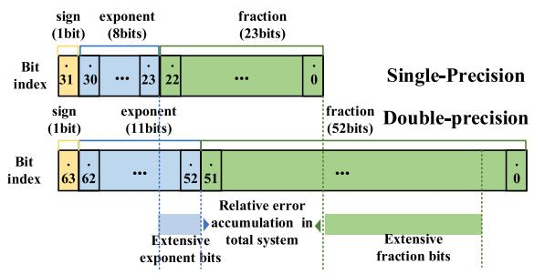  
Fig. 1. Bandwidth comparison between Single-Precision and Double-Precision floating-point.

$$
x (t) = \left\{ \begin{array}{l} g _ {1}, y (t) <   g _ {1} \\ y (t), g _ {1} \leq y (t) \leq g _ {2} \\ g _ {2}, g _ {2} <   y (t) \end{array} \right. \tag {14}
$$

where $m _ { 1 } , ~ m _ { 2 } , ~ m _ { 3 } , ~ m _ { 4 }$ are constant parameters based on simulation step and PID control block type, y(t) and $z ( t ) \mathrm { i s }$ the output and input of PID control block, $y _ { h i s t } ( t - \Delta t )$ is the history injection, $x ( t )$ is the output of limiter, g1 and $g _ { 2 }$ is the lower bound and upper bound of the given limiter.

# B. Single-Precision Floating-Point Scheme

In the previous literature, power system EMT models in Section A were implemented on FPGA using Single-Precision format. In this section, the significance of accumulated roundingoff error will be discussed. The error is mainly introduced by rotating machines involving triangular function (i.e., cos and sin) calculations.

FPGA based hardware implementation [3], [5], [6], [7] uses Single-Precision floating scheme for all data processing, transferring and storing owing to advanced computational speed performance. But apparent drawback is its limited bandwidth when compared with IEEE 754 standard Double-Precision as shown in Fig. 1. It can be seen that Single-Precision format usually consists of 1 bit for sign, 8 bits for exponent and 23 bits for fraction. By contrast, Double-Precision includes 1 bit for sign, 11 bits for exponent and 52 bits for fraction. These exponent and fraction difference leads to less effective digits when converted from real value to Single-Precision floating-point.

Another significant disadvantage is caused by rounding-off and truncation error during accumulation. Because the calculation step of Floating-Point must follow exponent matching, mantissas adding, normalization, and rounding steps, even for simple addition and subtraction. This means that some peripheral fraction bits would be abandoned in order to adjust the scale of results, which will lead to unavoidable accumulated rounding-off and truncation error after thousands of calculations. For common cumulative addition in EMT solution, the resulting difference between Single-Precision and Double-Precision can be given by:

$$
S _ {n} = \text {s i n g l e} \left(S _ {n - 1} + x _ {n}\right) = \left(S _ {n - 1} + x _ {n}\right) (1 + \varepsilon_ {n}) \tag {15}
$$

where $x _ { n }$ is addend at time $t , S _ { n - 1 }$ is history augend, $S _ { n }$ is Single-Precision addition result, $\varepsilon _ { n }$ is the error factor determined by summation order.

TABLE I ITERATION ERROR COMPARISON OF SINE WAVE FUNCTION $f = s i n ( \delta + \Delta \delta )$ BETWEEN SINGLE-PRECISION AND DOUBLE-PRECISION FORMAT   

<table><tr><td>n</td><td>1</td><td>100</td><td>1000</td><td>10000</td><td>100000</td></tr><tr><td>Time</td><td>50e-6s</td><td>50e-4s</td><td>50e-3s</td><td>0.5s</td><td>5s</td></tr><tr><td>Single-Precision angle 
Single(δ + Δδ)</td><td>0.00153</td><td>0.15300006</td><td>1.5300142</td><td>15.298924</td><td>153.06789</td></tr><tr><td>Double-Precision angle 
Double(δ + Δδ)</td><td>0.00153</td><td>0.153</td><td>1.53</td><td>15.3</td><td>153</td></tr><tr><td>Angle absolute error</td><td>-8.64E-12</td><td>-5.67E-08</td><td>-1.42E-05</td><td>0.001075554</td><td>-0.067886353</td></tr><tr><td>Single-Precision sine 
function 
Single(sin(δ + Δδ))</td><td>0.001529999</td><td>0.15240383</td><td>0.99916852</td><td>0.39772764</td><td>0.76442802</td></tr><tr><td>Double-Precision sine 
function 
Double(sin(δ + Δδ))</td><td>0.001529999</td><td>0.152403769</td><td>0.999167945</td><td>0.396740573</td><td>0.806400581</td></tr><tr><td>Sine function absolute 
error</td><td>-2.35E-11</td><td>-6.27E-08</td><td>-5.70E-07</td><td>-0.000987065</td><td>0.041972563</td></tr></table>

However, the numerical influence is unpredictable and random in scale axis when the summation result is related to limiter and triangular function, such as (7) and (14). Inaccurate limiter feedback might cause sudden zero-crossing for control action. As for triangular function, the accumulated error might exceed or lag behind the expected position. For example, if electric angle θ(t)in (10), (11) is assumed to increase along with time step with a fixed-step angular speed increment, the matrix elements including sin(θ(t)) might introduce accumulated phase shift. In addition, Table I gives accumulated Single-Precision and Double-Precision sine wave function sin $\displaystyle \bigl ( \theta ( t ) \bigr )$ simulation with fixed angle increment of $\Delta \delta = 0 . 0 1 5 7$ . Angle absolute error is calculated by the difference between the Double-Precision and Single-Precision angle, while sine function absolute error is calculated by the difference between the Double-Precision and Single-Precision sine function.

Seen from Table I, it can be found that both the Single-Precision angle and sine function absolute error are still within the range of $1 0 ^ { - 3 }$ at the beginning. But when simulation time longer than 0.5s, convergence failures gradually appear in Single-Precision sine function results, then increased to nearly 4% at 5s. This long-duration accumulation error is caused by increasing angle size and limited mantissa size in Single-Precision floating-point. Moreover, when implemented using look-up table method on FPGA, this phenomenon might appear earlier. This has increased the uncertainty for EMT solution especially with coupling triangular data flow with variable-step angle increment. Therefore, rotating component is more likely to be influenced by coordination transform displacement owing to triangular functions than non-rotating components.

# C. Double-Precision and Mixed-Precision EMT Simulation Schemes

According to accumulation error analysis in Section B, it is essential to discuss the possibility of introducing Double-Precision Floating-Point scheme in hardware based calculations.

1) Double-Precision Scheme: Full Double-Precision scheme represents dealing with all existing Floating-Point data

TABLE II FEATURES OF 3 FLOATING-POINT SCHEMES FOR EMT SIMULATIONS   

<table><tr><td>Scheme</td><td>Single-Precision</td><td>Double-precision</td><td>Iteration</td><td>Precision conversion</td></tr><tr><td>1A</td><td>Y</td><td>N</td><td>N</td><td>N</td></tr><tr><td>1B</td><td>Y</td><td>N</td><td>Y</td><td>N</td></tr><tr><td>2</td><td>N</td><td>Y</td><td>N</td><td>N</td></tr><tr><td>3A</td><td>Y</td><td>Y</td><td>N</td><td>Y</td></tr><tr><td>3B</td><td>Y</td><td>Y</td><td>N</td><td>Y</td></tr></table>

TABLE III LATENCY COMPARISON FOR DIFFERENT INTERFACE RAM TYPES   

<table><tr><td></td><td>Write ordered RAM</td><td>Write disordered RAM</td></tr><tr><td>Read ordered RAM</td><td>k</td><td>k-1</td></tr><tr><td>Read disordered RAM</td><td>k+1</td><td>k</td></tr></table>

storing, transferring and processing will be in Double-Precision format, which is already widely applied in most off-line simulators including PSCAD and MATLAB for high accuracy. But existing real-time FPGA based hardware mostly applied full Single-Precision [4], [5].

The challenge of this approach lies on the very high hardware capability requirements for accommodating all computational flows, which puts heavy burden for both resource placement and path routing of FPGA. This motivates the possibility of Mixed-Precision scheme in the next.

2) Mixed-Precision Algorithm: Limited by hardware availability, it is not always necessary to calculate all operands in high precision for large-scale system. Therefore, Mixed-Precision Floating-Point scheme is proposed to combine low computation cost resource of Single-Precision Floating-Point with high performance accuracy of Double-Precision floating-point. The displacement impact of Single-Precision could be minimized by allocating Single-Precision and Double-Precision for nonrotating and rotating components respectively.

To exploit the feasibility and practicality of Mixed-Precision scheme, SG and combined system is both selected as component-level and system-level research objective. Based on numerical consistency, data flow direction and model complexity, corresponding schemes are recommended separately. For rotating components, i.e., SGs, Double-Precision Floating-Point scheme is applied for rotation sensitivity while Single-Precision scheme is used to implement non-rotating components. The precision comparison for component-level and system-level schemes is given in Table II where Scheme 1A represents full Single-Precision without iteration, Scheme 1B represents full Single-Precision with iteration, Scheme 2 indicates full Double-Precision and Scheme 3 indicates Adaptive Mixed-Precision. For Scheme 3, it is further split into two sub schemes, namely, Scheme 3A and Scheme 3B. In Scheme 3A, full precision format is only applied for angle related calculations of SGs while in Scheme B, all the calculations of SGs are implemented in full Double-Precision. It should be mentioned only Scheme 1A has been used for FPGA based on SG EMT simulations while other schemes (1B,2,3A,3B) on FPGA have not been reported yet in open publications.

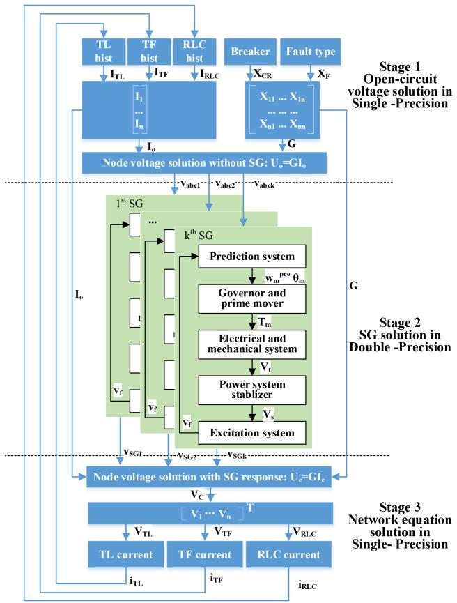  
Fig. 2. FPGA implementation structure of Adaptive Mixed-Precision EMT solution.

# III. FPGA-BASED APPLICATION OF ADAPTIVE MIXED-PRECISION ALGORITHM

Based on the Adaptive Mixed-Precision schemes, the hardware implementation structure is introduced first, then detailed hardware connection, pipeline plan, address accessibility and global controller are presented.

# A. Global Hardware Structure

Considering the numerical sensitivity difference between rotating and non-rotating models mentioned in Section I-A, Fig. 2 demonstrates the Mixed-Precision hardware structure for achieving flexible and general EMT solution. The global design has been separated as open-circuit voltage, SG with control system and network equation solutions at three sequential stages by dual conversion interfaces. Multi-precision data flow and corresponding schedule schemes are integrated for electrical, mechanical and control systems to achieve parallel and sequential processing together.

Seen from Fig. 2, in terms of selection of a suitable precision calculation scheme, lower precision format is applied for opencircuit voltage solution [12] without SG and network equation solution without Park transform. This is to reduce resource cost, memory space and translated circuit route length. In addition, Double-Precision is selected for SG subsystem to avoid potential phase shift and limiter displacement as mentioned in

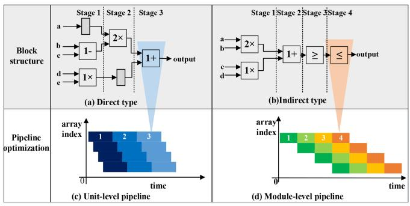  
Fig. 3. Block structure and corresponding pipeline design.

Section 2-B. Based on accumulated precision error analysis in Table I, Park’s transform in Double-Precision is recommended to solve the coupling relationship between electrical and mechanical system’s to avoid bandwidth displacement.

In terms of detailed pipeline schedule management, unit-level pipeline is applied for open-circuit voltage solution and network equation solution for improving resource utilization ratio as shown in Fig. 3(a). In other words, normalizing similar calculation operations by pre-storing address tables is an essential task for achieving high-frequency operations. For most SG subsystems, module-level pipeline is chosen to release space potential owing to long latency and complex circuit datapath as shown in Fig. 3(b) to solve the challenges of resource cost and timing constraint.

Bidirectional interfaces are arranged to allow real-time access for all kinds of data precision in spite of bandwidth, which is implemented by Floating-Point to Floating-Point IP CORE in FPGA. In this way, storing, processing and initialization of data could be adjusted flexibly without breaking the strict calculation sequence.

Optimized block connection structure, pipeline schedules, dynamic address access and sequence controllers are designed in details to avoid high fanout in Mixed-Precision hardware implementation.

# B. Block Structure and Pipeline Time Schedule Design

To simplify hardware connection and improve signal transfer efficiency, direct and indirect structures for blocks are classified according to signal route complexity and resource cost comprehensively. Corresponding unit-level and module-level pipelines structures are developed to fully utilize available resources under maximum clock frequency.

Direct structures refer to blocks of end-to-end connection without feedback, such as hardware connection of (1) as shown in Fig. 3. By contrast, indirect structure usually involves amplitude limiter, feedback or reused calculation units at single-round calculation stages, which is designed for the implementation of control systems as shown in (12) and (13), and resource-saving purpose in hardware, including gauss elimination block, park transformation block, etc.

In order to avoid pipeline hazards [13], pipeline time scaling plans are arranged for direct and indirect structure respectively. Unit-level pipeline is arranged for direct structure, in which

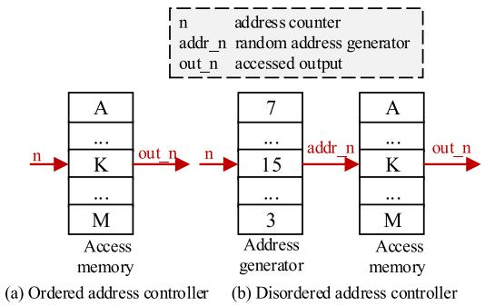  
Fig. 4. Ordered and disordered address controller comparison.

output generation frequency could be improved to nearly every clock cycle when time constraints allowed. Module-level pipeline is assigned for indirect structure, in which output generation frequency is determined by the execution time of each module. In addition, combined processing could be intensively by insert buffers.

# C. Dynamic Address Access Architecture

Combination of disordered and ordered address access are proposed to search locations of variable length transmission lines and different RLC branches dynamically, which supports high-frequency pipeline design even under maximum clock speed. This allows deterministic memory accessibility with avoiding conflicts between data reads and writes.

Most constants, parameters and variables in ROMs and RAMs are stored in in ascending, descending or other order, waiting to be collected by updating address controller intensively. As a result of that, direct and indirect address controller is illustrated in Fig. 4 in details, dealing with ordered and disordered accessing respectively.

In ordered address controller design, the index address for reads and writes is increasing or decreasing continuously, such as the accessing for RLC conductance during history current source calculation in (1), (2). Under this condition, only a corresponding address counter is needed for collecting orderly data dynamically.

In disordered address controller design, necessary index address is discretely and randomly trending, including accessing variable distance transmission line parameters at history current stage in (3), (4). Therefore, a pre-solved address table is created for accessing disorderly address in a synchronous manner, apart from an address counter.

In addition, involvement of accessing disordered address and ordered address usually comes along with registers changes in translated circuit design. Considering some blocks are interfaced with read RAM and write RAM directly in hardware, this will hold up or bring forward original latency depending on the bus type. The corresponding latency change has to be adjusted to prevent reads and writes conflicts. Table Ⅲ gives the exact latency for different calculation blocks interfaces when original latency is k.

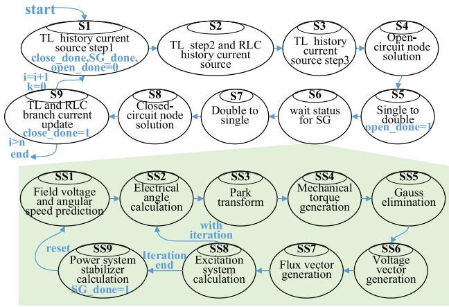  
Fig. 5. Global sequence controller by finite state machine.

# D. Global Sequence Controller

To solve timing constraint overflow and translated routing failures in comprehensive hardware design, two parallel and partitioned Finite State Machines (FSM) are developed by combining parallel and sequential logic. This design includes FSM1 of 9 states (from S1 to S9) to control external network and FSM2 of 9 states (from SS1 to SS9) to control SG from as shown in Fig. 5. The function of global sequence controller for integrated system is to reset each time-step, boost processing sequence and update memory address.

Seen from Fig. 5, at the beginning of each time step, global time step counter i is updated while local clock counter k is reset to 0 to maintain accurate time accumulation. After FSM1 finished from S1 to S5 and updated the open-circuit end signal open_done, FSM2 is allowed to move forward. If iteration is involved, FSM2 will switch into SS2 for covering previous prediction vectors otherwise move forward to SS9. Then FSM1 will process network solution from S7 to S9 when receives SG_done signal from FSM2.

# IV. SIMULATION RESULTS AND ANALYSIS

In order to evaluate the numerical accuracy and hardware resource cost performance of proposed full Double-Precision and Mixed-Precision algorithm in different scenarios, componentlevel and system-level case studies are both provided orderly in this section. Firstly, Double-Precision Scheme 2 and Single-Precision Scheme 1A comparison on a 5-bus electric network without SGs is given in Section A to validate the detailed performance when dealing with unidirectional triangular data flow. Secondly, SG in four schemes is provided to illustrate the correction effect of precision selection and iteration for multidirectional data flow. Thirdly, Mixed-Precision scheme 3B is applied in Kundur’s system to validate benefits of hardware resource optimization and high-performance accuracy compared with Full Double-Precision Scheme 2. Finally, Mixed-Precision scheme 3B and Double Precision Scheme 2 are applied on the 22-bus network to explore potential system scalability. The average error is calculated by maximum absolute error divided by maximum amplitude.

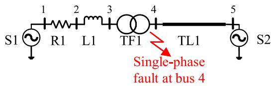  
Fig. 6. Simulation topology of no-source network.

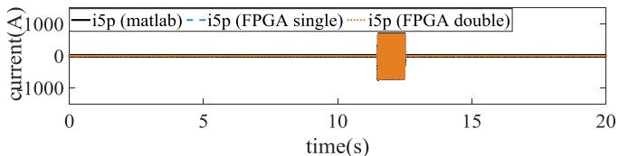

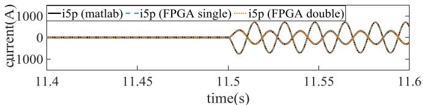  
(a) Long-duration comparison

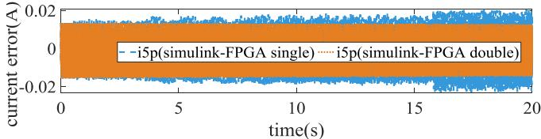  
(b) Detailed comparison   
(c)Absolute error comparison   
Fig. 7. Simulation results of currents of a 5-bus system (a) Long-duration comparison (b) Detailed comparison (c) Absolute error comparison.

TABLE IV RESOURCE COMPARISON ON A 5-BUS ELECTRIC NETWORK WITHOUT SGS   

<table><tr><td></td><td>Registers</td><td>LUTs</td><td>Memory</td><td>DSP</td></tr><tr><td>Full Single-Precision</td><td>13%</td><td>23%</td><td>1%</td><td>0%</td></tr><tr><td>Full Double-Precision</td><td>23%</td><td>30%</td><td>0%</td><td>23%</td></tr></table>

The FPGA-based simulator is implemented on a Virtex6 ML605 board, which has 768 DSPs, 416 RAMs, 301440 registers and 150720 LUTs. 100MHz clock is selected to control main module and sub-modules in FPGA board. In addition, the accuracy of FPGA-based EMT simulation is tested and compared with the benchmark off-line EMT simulation results in MATLAB.

# A. Comparison of the Schemes on A 5-Bus Electric Network Without SGs

To evaluate numerical sensitivity classification and simplify sampling process of different data flows, Single-Precision Scheme 1A and Double-Precision Scheme 2 is compared in a simple 5-bus network simulation model including RLC branch, transformer and transmission line as given in Fig. 6. A singlephase fault is applied at bus 4 from 11.5s to 12.5s. Related simulation results of current at bus 5 are shown in Fig. 7, while corresponding resource requirements are illustrated in Table IV.

It can be seen from Fig. 7 that FPGA real-time simulation results in Single-Precision and Double-Precision scheme are

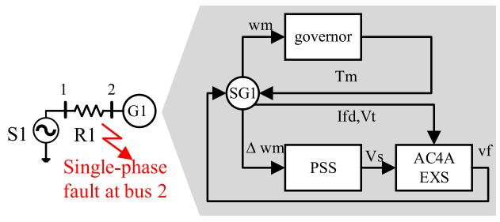  
Fig. 8. Synchronous machine with excitation, power system stabilizer and governor system.

TABLE V RESOURCE COMPARISON OF SG CASE STUDY   

<table><tr><td></td><td>Registers</td><td>LUTs</td><td>Memory</td><td>DSP</td></tr><tr><td>Full Single-Precision</td><td>19%</td><td>32%</td><td>1%</td><td>0%</td></tr><tr><td>Full Single-Precision with iteration</td><td>19%</td><td>33%</td><td>1%</td><td>0%</td></tr><tr><td>Mixed-Precision</td><td>20%</td><td>33%</td><td>1%</td><td>0%</td></tr><tr><td>Full Double-Precision</td><td>33%</td><td>52%</td><td>3%</td><td>48%</td></tr></table>

both very close to off-line MATLAB simulation results. Their absolute errors are below 0.03% and below 0.01%, respectively even during the single-phase grounding fault for 20s simulation duration. This is because existing non-rotating components are only composed of linear multipliers, adders and subtracters, except for ideal voltage source without external component feedback. It can be seen from Table IV that the slight accuracy difference lies on full Double-Precision Scheme could limit original time-expanding accumulated error even smaller than 0.01% by maintaining more memory space and using additional 7% LUTs and 10% registers resources.

Therefore, Single-Precision format is recommended for electric network without multi-directional triangular transform owing to high accuracy and optimized resource requirement.

# B. Comparison of the Schemes With SG

In order to investigate further impact of precision and iteration on coupling triangular data flows for extremes, subsequent SG with Park’s transform is selected to exploit the most costeffective algorithms. Fig. 8 gives the detailed topology where SG including excitation system, power system stabilizer and governor is operating with an external load. The SG started up from 0s and reached steady state at 10s. A single-phase fault is applied at bus 2 from 12s to 13s. Apart from previous Single-Precision including Scheme 1A, Single-Precision Scheme 1B with iteration, Double-Precision Scheme 2 and Mixed-Precision Scheme 3A are implemented for system given in Fig. 8.

In Scheme 3A, electric angle update in (11) for rotating Park’s transform in (10) is implemented in Double-Precision format, while the rest of calculations are using Single-Precision format. Different precision exchange is implemented by floating-tofloating IP COREs bidirectionally.

The simulation results and absolute error comparison for mechanical torque, d axis current and electric torque are shown from Figs. 9 to 14, respectively, while corresponding resource allocation is illustrated in Table V.

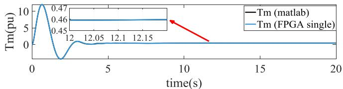  
(a) Single-Precision Scheme 1A

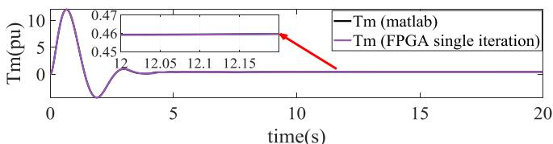  
(b) Single-Precision Scheme 1B

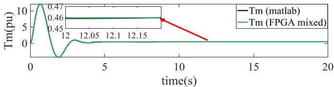  
(c) Mixed-Precision Scheme 3A

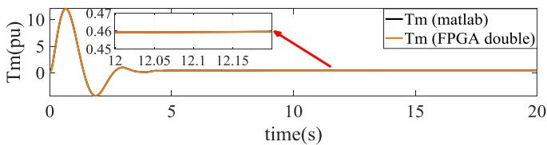  
(d) Double-Precision Scheme 2   
Fig. 9. Simulation results comparison of mechanical torque in four schemes with MATLAB model.

It can be seen from Figs. 9 to 14 that except for Double-Precision Scheme 2, other methods all have different levels of phase shift problem, owing to that abandoning bandwidth accumulation effect. By comparing this case in Figs. 9 to 14 with previous simple network case in Fig. 7, the accumulation effect is amplified when involving excitation system, governor, power system stabilizer, etc.

Firstly, iteration Scheme 1B has reduced mechanical torque around 1% relative error compared to the original Single-Precision Scheme 1A. This slight benefit of iteration method lies on prediction system error reduction by repetitive prediction variables replacement. The imitative error of linear prediction has been eliminated for some degree per time-step, although with double calculation time.

Secondly, local extensive precision Scheme 3A could reduce absolute error for electric torque and direct current to less than 1% with fault presence by improving electric angle memory space compared to Single-Precision Scheme 1A. The reason for remaining unsolved phase problem is related to the coupling relationship between Park’s transform and swing equation. Small proportion of local Double-Precision block is not able to store the complete rotor and stator information especially in the start-up process.

By contrast, full Double-Precision Floating-Point Scheme 2 has the best accuracy performance in avoiding phase shift for

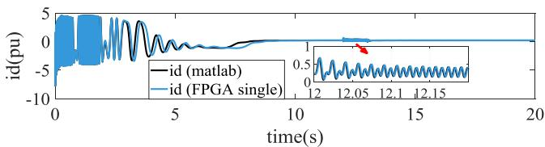

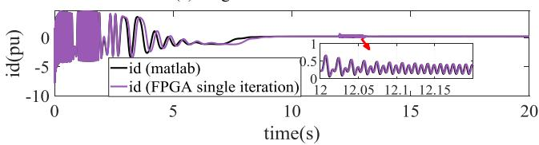  
(a) Single-Precision Scheme 1A

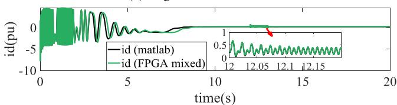  
(b) Single-Precision Scheme 1B

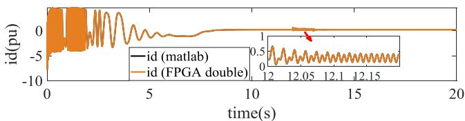  
(c) Mixed-Precision Scheme 3A   
(d) Double-Precision Scheme 2

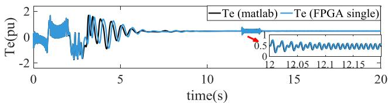  
Fig. 10. Simulation results comparison of d axis current in four schemes with MATLAB model.

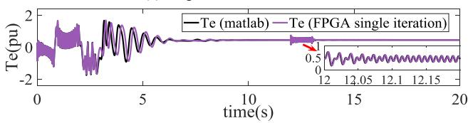  
(a) Single-Precision Scheme 1A

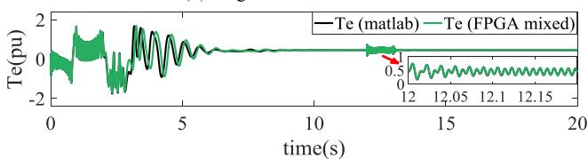  
(b) Single-Precision Scheme 1B

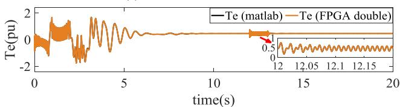  
(c) Mixed-Precision Scheme 3A   
(d) Double-Precision Scheme 2   
Fig. 11. Simulation results comparison of electric torque in four schemes with MATLAB model.

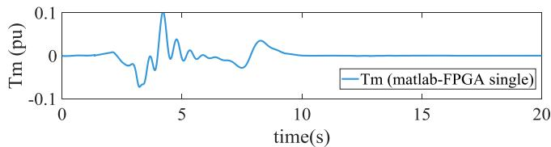

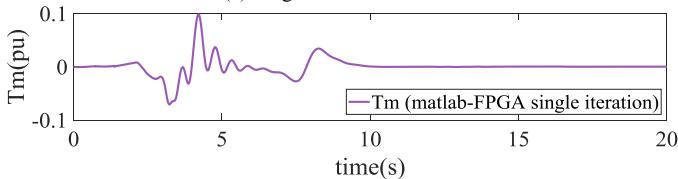  
(a) Single-Precision Scheme 1A

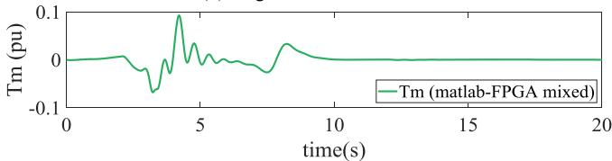  
(b) Single-Precision Scheme 1B

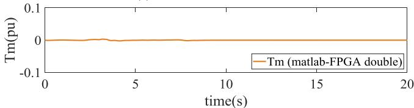  
(c) Mixed-Precision Scheme 3A   
(d) Double-Precision Scheme 2

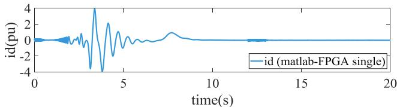  
Fig. 12. Absolute error comparison of electric torque in four schemes with MATLAB model.

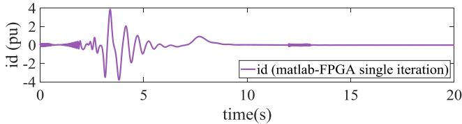  
(a) Single-Precision Scheme 1A

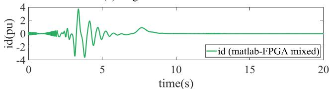  
(b) Single-Precision Scheme 1B

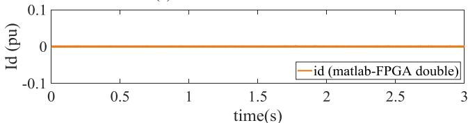  
(c) Mixed-Precision Scheme 3A   
(d) Double-Precision Scheme 2   
Fig. 13. Absolute error comparison of electric torque in four schemes with MATLAB model.

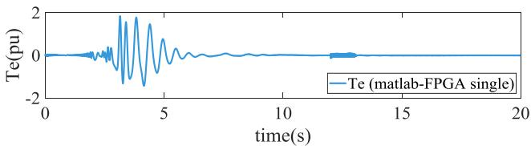  
(a) Single-Precision Scheme 1A

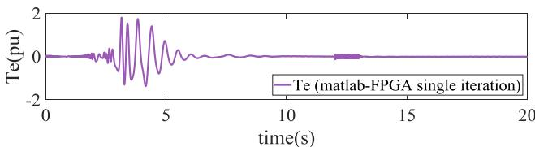  
(b) Single-Precision Scheme 1B

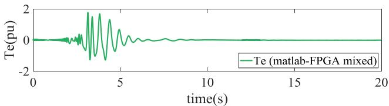  
(c) Mixed-Precision Scheme 3A

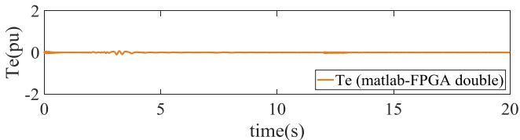  
(d) Double-Precision Scheme 2

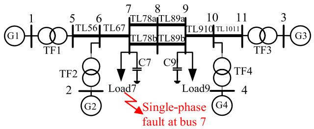  
Fig. 14. Absolute error comparison of electric torque in four schemes with MATLAB model.   
Fig. 15. The Kundur’s 4-machine 11-bus test system.

both the steady and transient solution, with average absolute error less than 0.1%. Because double extended memory space and calculation units could process nearly complete coupling data flow instead of abandon peripheral bits. This allows even triangular transform accurately, avoiding displacement between mechanical and electrical system. Existing slight difference is owing to look-up table solution for triangular function, designed for time-saving purpose. But the challenge is that high-performance accuracy is along with additional 20% LUT resource requirement, which might be a potential barrier for system expandability.

This section demonstrates that phase shift error could not be eliminated by iteration (Scheme 1B) or local embedded Double-Precision block in multidirectional triangular system (Scheme 3A). It can be concluded there that Scheme 1A and 1B

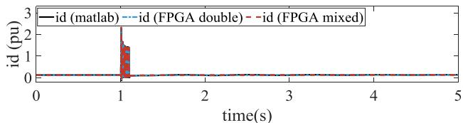

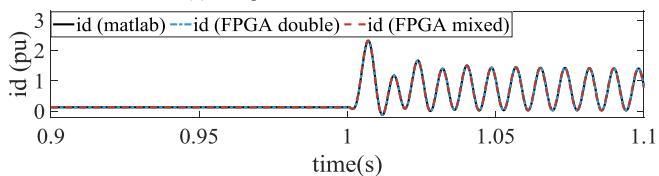  
(a)Long-duration d axis current

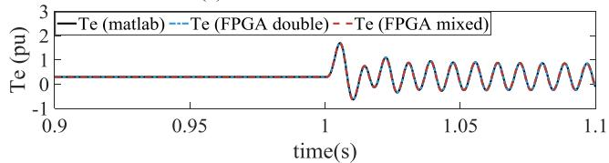  
(b)Detailed d axis current

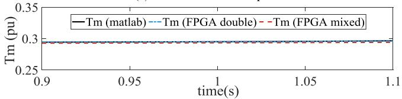  
(c) Detailed electric torque   
(d) Detailed mechanical torque

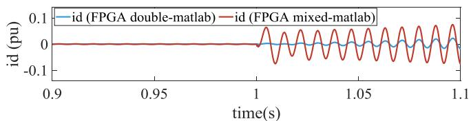  
Fig. 16. Results of synchronous machine G1 in Double-Precision Scheme 2 and Mixed-Precision Scheme 3B.   
(a)d axis current

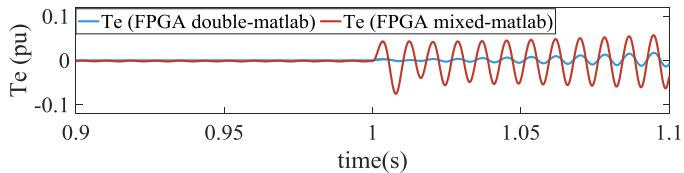

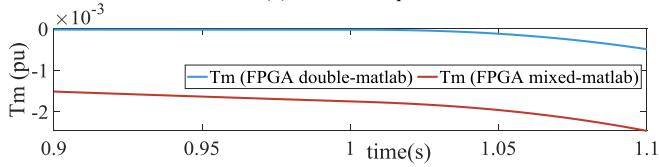  
(b) Electric torque   
(c) Mechanical torque

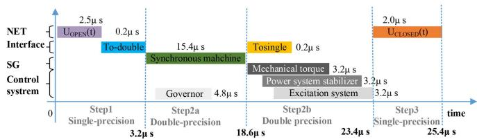  
Fig. 17. Errors of SG G1 in Double-Precision Scheme 2 and Mixed-Precision Scheme 3B.   
Fig. 18. Time schedule of Mixed-Precision structure.

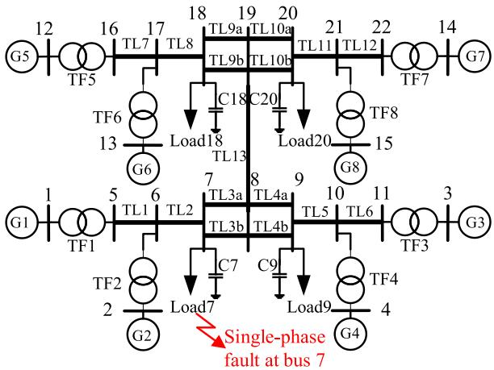  
Fig. 19. 22-bus test system.

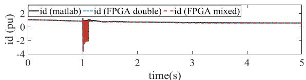

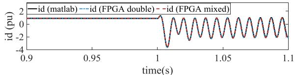  
(a) Long-duration d axis current comparison

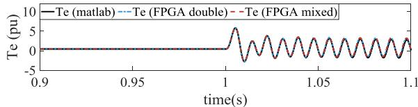  
(b) Detailed d axis current comparison

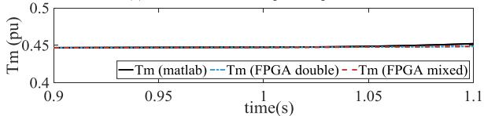  
(c) Detailed electric torque comparison   
(d) Detailed mechanical torque comparison   
Fig. 20. Results of synchronous machine G1 of 22-bus network in Double-Precision Scheme 2 and Mixed-Precision Scheme 3B.

are not suitable for power system EMT simulations with detailed synchronous machine representation requiring high accuracy. Scheme 3A is able to be applied to study power system network fault dynamics when SG internal dynamics including startup process is less concerned. Although full Double-Precision Floating-Point Scheme 2 provides good accuracy for both network and SG internal dynamics, it is facing massive resource utilization. To achieve overall high performance in terms of calculation speed, accuracy and resource cost, the remaining question to be answered is: Would Scheme 3B provide satisfactory performance in comparison to Scheme 2? In order to answer this question, further case studies are carried out to compare Scheme 3B with Scheme 2 in Section C.

TABLE VI RESOURCE COMPARISON OF KUNDUR’S SYSTEM CASE STUDY   

<table><tr><td></td><td>Registers</td><td>LUTs</td><td>Memory</td><td>DSP</td></tr><tr><td>Mixed-Precision</td><td>29%</td><td>60%</td><td>6%</td><td>78%</td></tr><tr><td>Full Double-Precision</td><td>35%</td><td>87%</td><td>9%</td><td>93%</td></tr></table>

# C. Kundur’s 11-Bus Two-Area System

To reduce resource cost, limit time constraint and avoid synthesis complexity, pipeline, control sequencer and dynamic access strategies are optimized. In Scheme 3B, Double-Precision and Single-Precision are applied to rotating components and non-rotating components respectively. In this part, Kundur’s 11-bus system given in Fig. 15 is implemented on a single FPGA platform using both Double-Precision Scheme 2 and the Mixed-Precision Scheme 3B. A single-phase fault is applied at bus 7 from 1s to 1.1s. Figs. 16 and 17 shows the detailed results and absolute error comparisons of electric torque, mechanical torque and current. In addition, Fig. 18 illustrates the time schedule allocation of structure for the Mixed-Precision Scheme 3B. Table VI gives the resource utilization comparison.

It can be seen from Figs. 16 and 17 that electric torque, currents and voltages of Mixed-Precision Scheme 3B are nearly the same as that with Double-Precision Scheme 2 where average absolute errors are below 5% and 2%, respectively. This is because Double-Precision allocation for rotating SG maintains nearly complete information of Park’s transform rotation and control system zero-crossing detection. In addition, rest Single-Precision external non-rotating network only exchanges abc phase voltage with Double-Precision SG without influencing rotating degree and zero-crossing point directly.

According to Table VI, it can be found that that Mixed-Precision allocation for Scheme 3B has reduced total LUT resource from 87% to 60% compared with full Double-Precision Scheme 2 on Kundur’s system. By using dynamic access, pipeline, and sequence controller strategies reasonably, the resource utilization is not even redoubled compared to single SG model. Seen from Fig. 18, the total simulation time for Mixed-Precision structure (Scheme 3B) only costs 25.4 μs at simulation time step 50 μs, further Single-Precision and Double-Precision calculation blocks are still allowed to be arranged at available time slots. Therefore, this proposed Mixed-Precision algorithm - Scheme 3B has brought flexible portability and expandability along with high-performance accuracy simultaneously.

# D. 22-Bus Two-Area System

To explore the potential scalability of Scheme 3B and Scheme 2, a larger system, i.e., a 22-bus network given in Fig. 19 is implemented on single FPGA board. The system is expanded by connecting two 11 buses networks in Case 3 with a transmission line. A single-grounding fault is applied at bus 7 from 1s to 1.1s.

Fig. 20 gives detailed results comparison of electric torques and d axis currents. As seen from Fig. 20, the average error of electric torque of Double-Precision Scheme 2 and Mixed Precision Scheme 3B is still 5% and 6% lower, respectively, than that of MATLAB model on the 22-bus network. Except

from high accuracy benefit, Mixed-precision Scheme 3B is still able to provide additional 15% LUT and 13% DSP resources for implementing other components on single FPGA board.

# V. CONCLUSION

Aimed at exploiting cost-effective precision allocation for various EMT models and avoiding potential limitation of traditional Single-Precision scheme (1A) in large-scale EMT solution, this paper has firstly proposed four additional different schemes (1B, 2, 3A and 3B) for component-level and system-level applications. The proposed flexible pipeline, dynamic access and sequence controller strategies have achieved FPGA-based hardware implementation structure for all possible schemes avoiding timing constraint failure and resource cost overuse. According to the comparison of rotating SG, Double-Precision scheme 3A has corrected local single-phase fault error. But still only full Double-Precision scheme 2 has solved phase shift problem for both start-up and fault process with reducing average error to 2% for rotating SG dynamics, which could not be compensated by iterations. Based on component-level sensitivity analysis, the proposed Adaptive Mixed-Precision Scheme 3B with subsystem precision partition has reduced extra 20% resource requirement compared with full Double-Precision scheme 2 and limited average error under 3%. It has been validated that the highperformance Scheme 3B can be scaled up for larger system, i.e., 22-bus network using FPGA. The proposed FPGA based real-time EMT simulation platform is a key technology for the development of Digital Twin.

# REFERENCES

[1] Y. Bai, Y. Huang, G. Xie, R. Li, and W. Chang, “ASDYS: Dynamic scheduling using active strategies for multifunctional mixed-criticality cyber– physical systems,” IEEE Trans. Ind. Inform., vol. 17, no. 8, pp. 5175–5184, Aug. 2021.   
[2] S. Xin, Q. Guo, H. Sun, B. Zhang, J. Wang, and C. Chen, “Cyber-physical modeling and cyber-contingency assessment of hierarchical control systems,” IEEE Trans. Smart Grid, vol. 6, no. 5, pp. 2375–2385, Sep. 2015.   
[3] Z. Shen and V. Dinavahi, “Dynamic variable time-stepping schemes for real-time FPGA-based nonlinear electromagnetic transient emulation,” IEEE Trans. Ind. Electron., vol. 64, no. 5, pp. 4006–4016, May 2017.   
[4] H. W. Dommel, “Digital computer solution of electromagnetic transients in single and multiphase networks,” IEEE Trans. Power App. Syst., vol. PAS-88, pp. 388–399, Apr. 1969.   
[5] Y. Chen and V. Dinavahi, “FPGA-based real-time EMTP,” IEEE Trans. Power Del., vol. 24, no. 2, pp. 892–902, Apr. 2009.   
[6] H. Saad, T. Ould-Bachir, J. Mahseredjian, C. Dufour, S. Dennetière, and S. Nguefeu, “Real-time simulation of MMCs using CPU and FPGA,” IEEE Trans. Power Electron., vol. 30, no. 1, pp. 259–267, Jan. 2015.   
[7] S. P. Valsan and K. S. Swarup, “High-speed fault classification in power lines: Theory and FPGA-based implementation,” IEEE Trans. Ind. Electron., vol. 56, no. 5, pp. 1793–1800, May 2009.   
[8] T. Duan and V. Dinavahi, “Adaptive time-stepping universal line and machine models for real time and faster-than-real-time hardware emulation,” IEEE Trans. Ind. Electron., vol. 67, no. 8, pp. 6173–6182, Aug. 2020.   
[9] N. J. Higham and T. Mary, “A new approach to probabilistic rounding error analysis,” SIAM J. Sci. Comput., vol. 41, no. 5, pp. A2815–A2835, Jan. 2019.   
[10] H. W. Dommel, “Nonlinear and time-varying elements in digital simulation of electromagnetic transients,” IEEE Trans. Power App. Syst., vol. PAS-90, no. 6, pp. 2561–2567, Nov. 1971.   
[11] H. W. Dommel and N. Sato, “Fast transient stability solutions,” IEEE Trans. Power App. Syst., vol. PAS-91, no. 4, pp. 1643–1650, Jul. 1972.   
[12] H. W. Dommel, EMTP Theory Book. Vancouver, BC, Canada: Microtran Power System Anal. Corporation, 1992, pp. 9-1–9-28.

[13] C. Yang, Y. Xue, and X. P. Zhang, “FPGA-based detailed EMTP,” in Proc. IEEE Manchester PowerTech, 2017, pp. 1–6.   
[14] C. Yang, Y. Xue, X. -P. Zhang, Y. Zhang, and Y. Chen, “Real-time FPGA-RTDS co-simulator for power systems,” IEEE Access, vol. 6, pp. 44917–44926, 2018.   
[15] G. Beliakov and Y. Matiyasevich, “A parallel algorithm for calculation of determinants and minors using arbitrary precision arithmetic,” BIT Numer. Math., vol. 56, no. 1, pp. 33–50, 2016.   
[16] C. B. Moler, “Iterative refinement in floating point,” J. ACM, vol. 14, no. 2, pp. 316–321, Apr. 1967.   
[17] M. Baboulin et al., “Accelerating scientific computations with mixedprecision algorithms,” Comput. Phys. Commun., vol. 180, no. 12, pp. 2526–2533, 2009.   
[18] E. Carson and N. J. Higham, “Accelerating the solution of linear systems by iterative refinement in three precisions,” SIAM J. Sci. Comput., vol. 40, no. 2, pp. A817–A847, Mar. 2018.   
[19] M. Le Gallo et al., “Mixed-precision in-memory computing,” Nature Electron., vol. 1, no. 4, pp. 246–253, 2018.   
[20] D. T. Nguyen, H. Kim, and H.-J. Lee, “Layer-specific optimization for mixed data flow with mixed-precision in FPGA design for CNN-based object detectors,” IEEE Trans. Circuits Syst. Video Technol., vol. 31, no. 6, pp. 2450–2464, Jun. 2021.   
[21] H. Zhang, D. Chen, and S. B. Ko, “Efficient multiple-precision floatingpoint fused multiply-add with mixed-precision support,” IEEE Trans. Comput., vol. 68, no. 7, pp. 1035–1048, Jul. 2019,.   
[22] K. Masui and M. Ogino, “Research on the convergence of iterative method using mixed-precision calculation solving complex symmetric linear equation,” IEEE Trans. Magn., vol. 56, no. 1, Jan. 2020, Art no. 7503604.   
[23] J. Sun, G. D. Peterson, and O. O. Storaasli, “High-performance mixedprecision linear solver for FPGAs,” IEEE Trans. Comput., vol. 57, no. 12, pp. 1614–1623, Dec. 2008.

Xin Ma is currently working toward the Ph.D. degree with the University of Birmingham, Birmingham, U.K.

Conghuan Yang received the Ph.D. degree from the University of Birmingham, Birmingham, U.K., in 2018. She is currently a Research Fellow with the University of Birmingham.

Xiao-Ping Zhang (Fellow, IEEE) received the Ph.D. degree from Southeast University, Nanjing, China, in 1993. He is currently a Professor of Electrical Power Systems with the University of Birmingham, Birmingham, U.K. He is the Director of Smart Grid with Birmingham Energy Institute, Birmingham, U.K., and the Co-Director of the Birmingham Energy Storage Center. Since 2020, he has been appointed to the Expert Advisory Group of U.K. Government’s Offshore Transmission Network Review. His research interests include modeling and control of HVDC, FACTS and Wind/Wave Generation, Distributed Energy Systems, Market Operations, Power System Planning, and 100% global renewable energy grid.

Ying Xue (Senior Member, IEEE) received the Ph.D. degree from the University of Birmingham, Birmingham, U.K., in 2016. From 2016 to 2022, he was with the University of Birmingham. He is now with the School of Electric Power Engineering, South China University of Technology, Guangzhou, China.

Jianing Li (Member, IEEE) received the B.Eng. degree in electrical and electronic engineering from the Huazhong University of Science and Technology, Wuhan, China and University of Birmingham, Birmingham, U.K., in 2011, and the Ph.D. degree from the School of Electronic, Electrical and Systems Engineering, University of Birmingham, in 2016. He was an Assistant Professor in Smart Energy Systems with the University of Birmingham. He joined WSP U.K. as a Principal Power Systems Engineer, in 2022. His research interests include distributed energy resources, energy storage systems, electric vehicles, energy management systems, and smart grid technology. He is currently the Chair of IEEE U.K. and Ireland Power and Energy Society.