# Time-Domain Modeling of Transmission Line Crossing Using Electromagnetic Scattering Theory

Manuja Gunawardana , Student Member, IEEE, and Behzad Kordi , Senior Member, IEEE

Abstract—Classical multiconductor transmission line (MTL) theory, which is employed in electromagnetic transient (EMT) simulators, is built on the assumptions that the wire structure is infinitely long and has a uniform cross-section. Therefore, nonuniformities which occur in physical power systems, such as transmission line crossings, are not represented in classical MTL models. A new transmission line model has been developed to calculate space varying per unit length (PUL) parameter matrices near a conductor crossing using electromagnetic scattering theory. The proposed scattered field transmission line (SFTL) model has been implemented for lossless, frequency-independent conductors, that cross each other at a variable crossing angle. A single dimensional finite difference time domain (1D-FDTD) algorithm has been used to obtain the time-domain solution at each simulation time-step. Obtained results have been compared with those from a three dimensional (3D) full-wave electromagnetic solver.

Index Terms—Transmission line theory, scattering theory, non-uniform lines.

# I. INTRODUCTION

T RANSMISSION lines play a vital role in a power systemby transmitting electrical energy over large distances. In by transmiting electrical energy over large distances. In addition to the power frequency voltage, transient over-voltages produced by various causes including switching operations, lightning strikes, and short circuit faults, also travel along transmission lines [1]. These transients can cause damage to power system components and result in massive repair and replacement costs. Transients travelling in power lines can also induce electromagnetic interference on other power lines and communication lines in close proximity [2], [3]. Therefore, it is essential to accurately model a transmission network in order to understand the transient behaviour of a power system.

The widely used method to include transmission lines in power system electromagnetic transient (EMT) type simulation models is to use multiconductor transmission line (MTL) theory based on the solution of Telegrapher’s equations and transverse electromagnetic (TEM) mode of propagation [4]. Apart from

Manuscript received March 27, 2019; revised June 11, 2019; accepted July 27, 2019. Date of publication August 9, 2019; date of current version March 24, 2020. This work was supported in part by the Natural Sciences and Engineering Research Council (NSERC) of Canada, in part by Manitoba Graduate Scholarship (MGS), and in part by the University of Manitoba Graduate Fellowship (UMGF). Paper no. TPWRD-00335-2019. (Corresponding author: Behzad Kordi.)

The authors are with the Department of Electrical and Computer Engineering, University of Manitoba, Winnipeg, MB R3T 2N2, Canada (e-mail: gunawams@myumanitoba.ca; behzad.kordi@umanitoba.ca).

Color versions of one or more of the figures in this article are available online at http://ieeexplore.ieee.org.

Digital Object Identifier 10.1109/TPWRD.2019.2934099

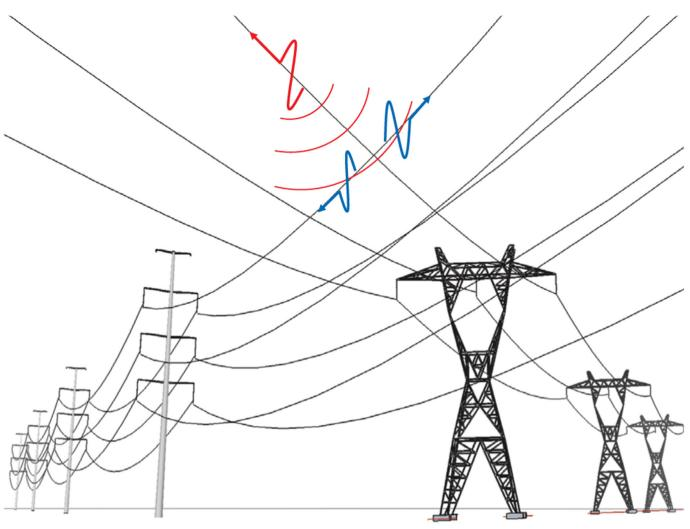  
Fig. 1. An illustration of electromagnetic interference from a power line crossing another power line.

power transmission lines, MTL models are also used to analyze a wide variety of structures ranging from transformer winding to interconnects of an electronic chip [5]–[7]. However, since the TEM mode is only valid for a system of infinitely long, uniform conductors [4], classical MTL theory cannot be used to model non-uniformities in wire structures [8].

One such non-uniformity that appears commonly in power systems, but is not accurately incorporated in current EMT simulators, is the the coupling between crossing transmission lines or a power line and a communication line. A schematic of the problem is shown in Fig. 1. With further expansion of transmission networks, more such crossings get added to the network. Although, the most accurate method to model these situations is to use full-wave electromagnetic techniques [9], [10], most of them are in the frequency domain and are computationally expensive. As such, they may not be very suitable for incorporation in power system simulation tools. Therefore a computationally efficient, enhanced model is required.

Kami et al. [11] have introduced a frequency-domain model for crossing conductors based on transmission line equations with external field excitation. Ametani et al. [12] have modelled two non-parallel conductors in free space by cascading multiple parallel sections with increasing gap distances. The impedance and admittance of each section have been calculated using Carson-Pollaczek’s impedance and space admittance [13], [14] formulae which assume the conductors are infinitely long.

As discussed in [12], segmenting the inclined wire changes its length and affects its traveling time if not addressed properly. The connections between sections have also been found to be causing unwanted oscillations due to reflections. In [15]–[17], a space-varying impedance for lines of finite length has been calculated, which has been used in a 3D finite difference time domain (FDTD) solver [18] to study non-parallel conductors and single inclined conductors above ground. In [19], [20] high frequency, transmission-line-like equations have been developed for finite-length and bent conductors using electromagnetic scattering theory. However, due to the high frequency assumption, these equations do not have a closed form and therefore are solved in the frequency domain using iterative methods. Here high frequencies are where the transverse dimensions of the line are comparable with the minimum significant wavelength of the exciting electromagnetic field [21].

In this paper, we have developed an enhanced transmission line model, which is referred to as scattered field transmission line (SFTL) model, for lossless, frequency independent, crossing transmission lines, with the crossing angle as the variable, using the electromagnetic scattering theory. The scattering equations are simplified into a closed-form based on the geometrical and frequency characteristics of typical power transmission lines. The developed model has been implemented using a 1D-FDTD algorithm [4], [8], [22], which is computationally efficient and can be included in a power system simulator. The results obtained from the developed model have been compared with those from a 3D, full-wave, finite element solver.1

# II. ELECTROMAGNETIC SCATTERING MODEL FOR TRANSMISSION LINE CROSSING

Uniform transmission line models in power system simulators use classical MTL equations given by

$$
\frac {\partial}{\partial z} \left[ \begin{array}{l} \boldsymbol {V} (z, t) \\ \boldsymbol {I} (z, t) \end{array} \right] = - \frac {\partial}{\partial t} \left[ \begin{array}{l l} \boldsymbol {L} & 0 \\ 0 & \boldsymbol {C} \end{array} \right] \left[ \begin{array}{l} \boldsymbol {V} (z, t) \\ \boldsymbol {I} (z, t) \end{array} \right]. \tag {1}
$$

In (1) the PUL inductance (L) and capacitance (C) matrices are constant in space owing to the assumption that the wire structure is uniform and infinitely long. Therefore, the classical models are unable to simulate non-uniformities such as crossings of conductors. The approach proposed in this paper is to model the wires using the scattering equations and simplify them to a transmission-line-like form based on geometry and frequency relations.

# A. Derivation of Electromagnetic Field Equations for Crossing Conductors

For a wire structure as shown in Fig. 2, under the thin wire approximation [20], the scattered electric field $\pmb { { \cal E } } ^ { s }$ at an observation point on conductor i can be represented using the vector and scalar potentials as explained in [8] (pp. 25–27)

$$
\boldsymbol {E} ^ {s} = - j \omega \boldsymbol {A} - \nabla \Phi \tag {2a}
$$

where, A and Φ are the magnetic vector potential and electric scalar potential, respectively. For the geometry shown in Fig. 2

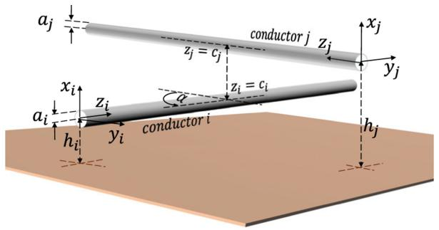  
Fig. 2. A schematic of cylindrical conductors crossing each other with a crossing angle of α.

we can write

$$
\begin{array}{l} A _ {z _ {i}} (z _ {i}) = \frac {\mu}{4 \pi} \int_ {0} ^ {\ell_ {i}} g (z _ {i}, z _ {i} ^ {\prime}) I _ {i} (z _ {i} ^ {\prime}) d z _ {i} ^ {\prime} \\ + \cos \alpha \frac {\mu}{4 \pi} \int_ {0} ^ {\ell_ {j}} g (z _ {i}, z _ {j}, \alpha) I _ {j} (z _ {j}) d z _ {j} \tag {2b} \\ \end{array}
$$

and,

$$
\begin{array}{l} \Phi \left(z _ {i}\right) = \frac {1}{4 \pi \varepsilon} \int_ {0} ^ {\ell_ {i}} g \left(z _ {i}, z _ {i} ^ {\prime}\right) \rho_ {i} \left(z _ {i} ^ {\prime}\right) d z _ {i} ^ {\prime} \\ + \frac {\mu}{4 \pi} \int_ {0} ^ {\ell_ {j}} g (z _ {i}, z _ {j}, \alpha) \rho_ {j} (z _ {j}) d z _ {j}. \tag {2c} \\ \end{array}
$$

In (2) $\ell _ { i }$ and $\ell _ { j }$ are the lengths of conductors i and $j , I _ { i }$ and $I _ { j }$ are the currents and $\rho _ { i }$ and $\rho _ { j }$ are the electric charge densities at a field point on the surface of the wires i and $j ,$ respectively. The function $g$ is the Green’s function related to a scattered field generated by a straight, cylindrical, current carrying conductor, which can be obtained using the method of images [23] as elaborated in (A.1a) and (A.1b), in the Appendix. It is a common practice in scattering problems to select source points to be on the wire axis and observation points to be on the wire surface or further in order to avoid singularity in the Green’s function [24].

Assuming that the scattered electric field lies on the transverse plain to z direction and that there are no incident fields yields [21]

$$
\hat {a} _ {z} \cdot \boldsymbol {E} ^ {s} = 0. \tag {3}
$$

Using (3), (2a) can be rewritten as

$$
\frac {\mathrm {d} \Phi}{\mathrm {d} z _ {i}} = - j \omega A _ {z _ {i}}. \tag {4}
$$

Under the thin-wire approximation, it can be assumed that the direction of the current is only along the z axis which gives

$$
A _ {x} = A _ {y} = 0. \tag {5}
$$

Since the scattered voltage is defined as [21],

$$
V \left(z _ {i}\right) = - \int_ {0} ^ {h _ {i}} E _ {x} ^ {s} d x \tag {6}
$$

(5) and (2a) can be used to rewrite (6) as,

$$
V \left(z _ {i}\right) = \Phi \left(z _ {i}\right). \tag {7}
$$

Substituting (7) in (4) gives,

$$
\frac {\mathrm {d} V \left(z _ {i}\right)}{\mathrm {d} z _ {i}} = - j \omega A _ {z _ {i}}. \tag {8}
$$

Using (2b) and (8) a transmission line like expression can be obtained as

$$
\begin{array}{l} \frac {\mathrm {d} V (z _ {i})}{\mathrm {d} z _ {i}} = - j \omega \frac {\mu}{4 \pi} \int_ {0} ^ {\ell_ {i}} g \left(z _ {i}, z _ {i} ^ {\prime}\right) I _ {i} \left(z _ {i} ^ {\prime}\right) d z _ {i} ^ {\prime} \Big | _ {x _ {i} = h _ {i}} \\ \left. - j \omega \frac {\mu}{4 \pi} \cos \alpha \int_ {0} ^ {\ell_ {j}} g \left(z _ {i}, z _ {j}, \alpha\right) I _ {j} \left(z _ {j}\right) d z _ {j} \right| _ {x _ {i} = h _ {i}}. \tag {9} \\ \end{array}
$$

Similarly, the electric charge density $\rho$ can be expressed in conductor current by applying the continuity equation as [21]

$$
\rho_ {i} \left(z _ {i}\right) = - \frac {1}{j \omega} \frac {\mathrm {d} I \left(z _ {i}\right)}{\mathrm {d} z _ {i}}. \tag {10}
$$

Equation (10) can be substituted into (2c) and re-arranged to obtain a second transmission-line-like expression as

$$
\begin{array}{l} V (z _ {i}) = - \frac {1}{4 \pi \varepsilon} \int_ {0} ^ {\ell_ {i}} g (z _ {i}, z _ {i} ^ {\prime}) \frac {1}{j \omega} \frac {\mathrm {d} I (z _ {i} ^ {\prime})}{\mathrm {d} z _ {i}} d z _ {i} ^ {\prime} \Big | _ {x _ {i} = h _ {i}} \\ \left. - \frac {1}{4 \pi \varepsilon} \int_ {0} ^ {\ell_ {j}} g \left(z _ {i}, z _ {j}, \alpha\right) \frac {1}{j \omega} \frac {\mathrm {d} I \left(z _ {j}\right)}{\mathrm {d} z _ {j}} d z _ {j} \right| _ {x _ {i} = h _ {i}}. \tag {11} \\ \end{array}
$$

The integral terms in (9) and (11) do not have analytical solutions and therefore need to be simplified before (9) and (11) can be implemented using FDTD.

# B. Closed-Form Equations Based on Structural Dimensions and Frequency

For the case of power transmission lines where the maximum cross-sectional dimension of the structure h is very small compared to the minimum wavelength of interest $( \mathrm { i . e . , } h \ll \lambda )$ , the integral terms in (9) and (11) can be simplified as [21]

$$
\begin{array}{l} \int g \left(z, z ^ {\prime}\right) I \left(z ^ {\prime}\right) d z ^ {\prime} = \int \left(\frac {e ^ {- j \beta R _ {s}}}{R _ {s}} - \frac {e ^ {- j \beta R _ {i}}}{R _ {i}}\right) I \left(z ^ {\prime}\right) d z ^ {\prime} \\ \simeq \int \left(\frac {1}{R _ {s}} - \frac {1}{R _ {i}}\right) d z ^ {\prime} I (z) \tag {12} \\ \end{array}
$$

where, $R _ { s }$ and $R _ { i }$ are respectively, the distances from the current element and the image current element at $z ^ { \prime }$ to point z. The simplified integral in (12) has a closed-form solution (see the Appendix) that allows us to write (9) and (11) as

$$
\frac {\mathrm {d} V \left(z _ {i}\right)}{\mathrm {d} z _ {i}} = \frac {- j \omega \mu}{4 \pi} \left[ \xi_ {i i} \left(z _ {i}\right) I _ {i} \left(z _ {i}\right) + \cos \alpha \xi_ {i j} \left(z _ {i}\right) I _ {j} \left(z _ {j}\right) \right] \tag {13a}
$$

and,

$$
V \left(z _ {i}\right) = - \frac {1}{j \omega 4 \pi \varepsilon} \left[ \xi_ {i i} \left(z _ {i}\right) \frac {\mathrm {d} I _ {i} \left(z _ {i}\right)}{\mathrm {d} z _ {i}} + \xi_ {i j} \left(z _ {i}\right) \frac {\mathrm {d} I _ {j} \left(z _ {j}\right)}{\mathrm {d} z _ {j}} \right] \tag {13b}
$$

where $\xi ( z )$ , given in the appendix, represents the closed form of the integrals. Similarly, the electromagnetic field equations for conductor j can be written as

$$
\frac {\mathrm {d} V \left(z _ {j}\right)}{\mathrm {d} z _ {j}} = \frac {- j \omega \mu}{4 \pi} \left[ \cos \alpha \xi_ {j i} \left(z _ {j}\right) I _ {i} \left(z _ {i}\right) + \xi_ {j j} \left(z _ {j}\right) I _ {j} \left(z _ {j}\right) \right] \tag {14a}
$$

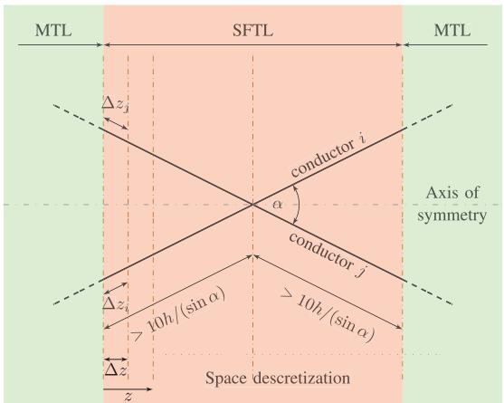  
Fig. 3. Proposed space discretization of SFTL model for FDTD implementation.

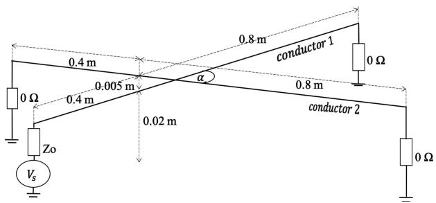  
Fig. 4. Finite length structure used for the comparison with full-wave theory.

and,

$$
V (z _ {j}) = - \frac {1}{j \omega 4 \pi \varepsilon} \left[ \xi_ {j i} \left(z _ {j}\right) \frac {\mathrm {d} I _ {i} \left(z _ {i}\right)}{\mathrm {d} z _ {i}} + \xi_ {j j} \left(z _ {j}\right) \frac {\mathrm {d} I _ {j} \left(z _ {j}\right)}{\mathrm {d} z _ {j}} \right]. \tag {14b}
$$

After rearranging, (13) and (14) can be expressed in a matrix form as

$$
\frac {\mathrm {d}}{\mathrm {d} z} \left[ \begin{array}{l} \boldsymbol {V} (z, j \omega) \\ \boldsymbol {I} (z, j \omega) \end{array} \right] = - j \omega \left[ \begin{array}{c c} \boldsymbol {L} (z) & 0 \\ 0 & \boldsymbol {C} (z) \end{array} \right] \left[ \begin{array}{l} \boldsymbol {V} (z, j \omega) \\ \boldsymbol {I} (z, j \omega) \end{array} \right] \tag {15}
$$

where L and $C$ are the matrices consisting the ξ terms. Since $\pmb { L }$ and C are frequency independent, (15) can be converted into time-domain conveniently as,

$$
\frac {\partial}{\partial z} \left[ \begin{array}{l} \boldsymbol {V} (z, t) \\ \boldsymbol {I} (z, t) \end{array} \right] = - \frac {\partial}{\partial t} \left[ \begin{array}{c c} \boldsymbol {L} (z) & 0 \\ 0 & \boldsymbol {C} (z) \end{array} \right] \left[ \begin{array}{l} \boldsymbol {V} (z, t) \\ \boldsymbol {I} (z, t) \end{array} \right] \tag {16}
$$

where,

$$
\boldsymbol {L} (z) = \frac {\mu}{4 \pi} \left[ \begin{array}{c c} \xi_ {i i} (z) & \cos \alpha \xi_ {i j} (z) \\ \cos \alpha \xi_ {j i} (z) & \xi_ {j j} (z) \end{array} \right]
$$

$$
\boldsymbol {C} (z) = \frac {4 \pi \varepsilon}{\xi_ {i i} (z) \xi_ {j j} (z) - \xi_ {i j} (z) \xi_ {j i} (z)} \left[ \begin{array}{c c} \xi_ {j j} (z) & - \xi_ {i j} (z) \\ - \xi_ {j i} (z) & \xi_ {i i} (z) \end{array} \right].
$$

Now, let’s consider two conductors crossing each other as shown in Fig. 3. The region near the crossing is where we solve (16) for, whereas the remaining of the conductors can be solved using uniform MTL equations. The system of equations (16) along with terminal constraints can be solved using a 1D FDTD

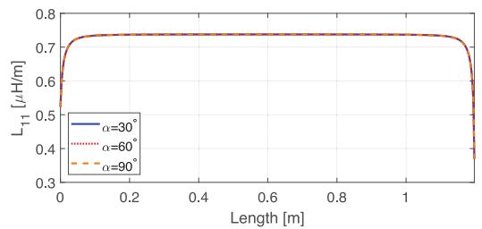

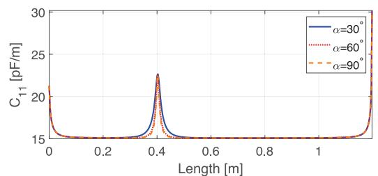

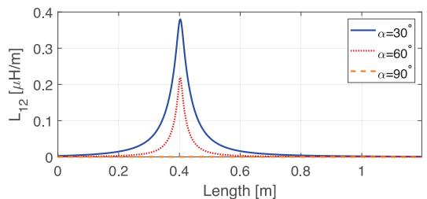  
(b)   
(c)

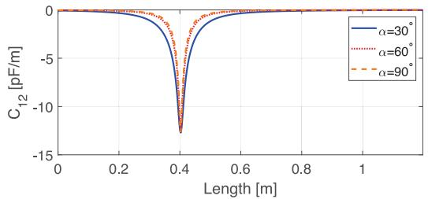  
(d)   
Fig. 5. (a) $L _ { 1 1 } ( z )$ (b) $L _ { 1 2 } ( z )$ (c) $C _ { 1 1 } ( z )$ and (d) $C _ { 1 2 } ( z )$ vs z for different values of the crossing angle α.

algorithm as explained in [4], [22] at each time step. The terminal constraints are imposed by the networks terminating the wires. The 1D FDTD technique employs a single space variable z. A common space variable z is applicable to the developed SFTL model as the region modeled using the proposed approach is symmetrical (see Fig. 3). It is now needed to identify the length of the segment of the line that should be modeled using the proposed model. It is shown in [19] that the effective distance of a current variation on its electromagnetic field is equal to its wavelength λ. On the other hand, transmission line models are applied for cases where the maximum cross sectional dimension is less than 0.1λ. Therefore, when modelling long transmission lines with a crossing, the SFTL model should be applied to at least the region that is within a distance of 10h/sin α (measured along the wires) from the crossing so that all points which are within a distance of 10h from each other are modelled using the SFTL. This region will be referred to as the critical length herein.

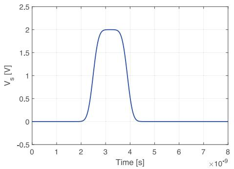  
Fig. 6. Trapezoidal excitation waveform (Vs) applied on conductor 1.

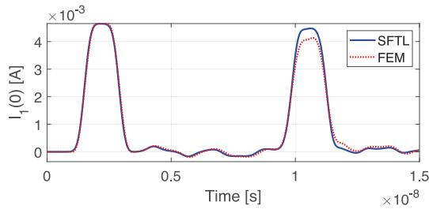  
(a)

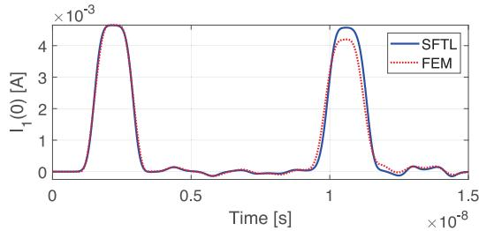  
(b)

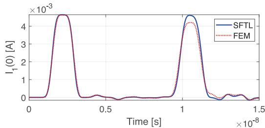  
(c)   
Fig. 7. Current at $z = 0$ on the excited conductor when (a) $\alpha = 3 0 ^ { \circ }$ , (b) $\alpha = 6 0 ^ { \circ }$ , (c) $\alpha = 9 0 ^ { \circ }$ obtained using the proposed model (SFTL) and full-wave FEM.

The points outside this area can be modelled using classical MTL theory.

# III. RESULTS AND DISCUSSION

The developed model was implemented on two examples of wire structures of finite length, where each consists of two lossless, frequency independent conductors crossing each other at a variable angle. The coupling between the conductors are obtained using the developed model and have been compared

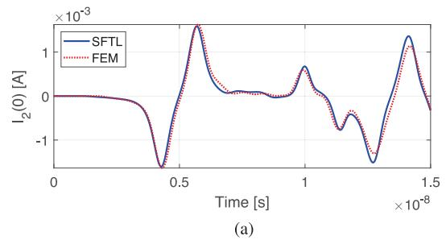

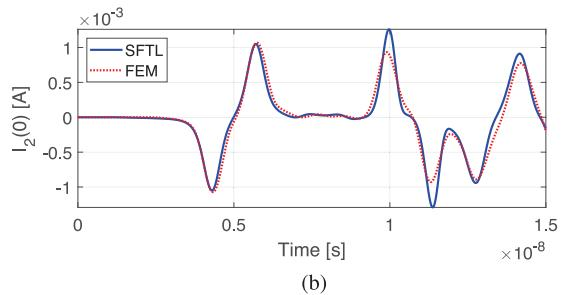

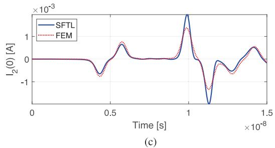  
Fig. 8. Current at z = 0 on the victim conductor when $( \mathrm { a } ) \alpha = 3 0 ^ { \circ } , ( \mathrm { b } ) \alpha =$ 60◦, (c) $\alpha = 9 0 ^ { \circ }$ obtained using the proposed model (SFTL) and full-wave FEM.

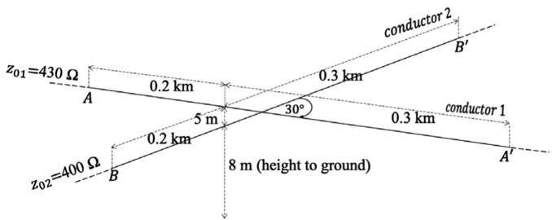  
Fig. 9. Power line crossing with a crossing angle of $3 0 ^ { \circ } .$ .

with those obtained using a 3D, full-wave, electromagnetic solver.

# A. Comparison to a Full-Wave Solver

In the structure used for the comparison given in Fig. 4, the conductors are assumed to be cylindrical with a radius of 1 mm. The whole structure from end to end was modelled using the SFTL (not only the critical region) to include the end effects of the terminals. As explained in (16) the developed model has space varying PUL parameters due to the non-uniformities along the lines. $L _ { 1 1 } ( z )$ and $C _ { 1 1 } ( z )$ which are analogous to PUL self inductance and self capacitance of wire 1, and $L _ { 1 2 } ( z )$ and $C _ { 1 2 } ( z )$ which are analogous to PUL mutual inductance and mutual

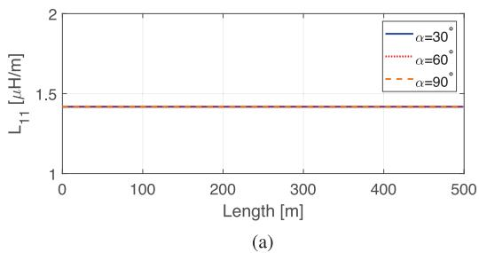

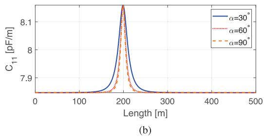

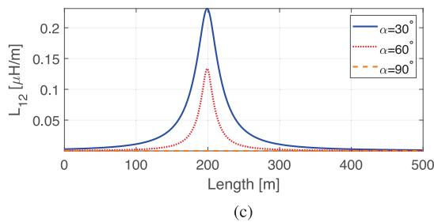

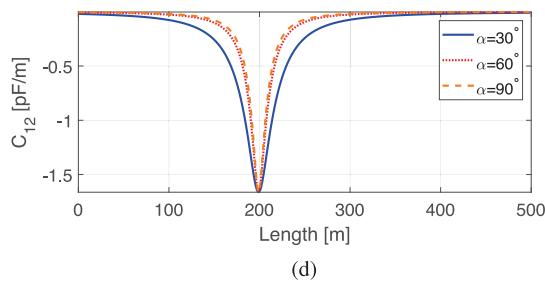  
Fig. 10. (a) $L _ { 1 1 } ( z ) .$ , (b) $L _ { 1 2 } ( z )$ , (c) $C _ { 1 1 } ( z )$ , and (d) $C _ { 1 2 } ( z )$ of the power lines vs z under different crossing angles.

capacitance between two conductors in a classical MTL model are shown in Fig. 5.

The variation in $L _ { 1 1 } ( z )$ and $C _ { 1 1 } ( z )$ closer to the terminals is due to the change of electric and magnetic fields close to an end of a cylindrical conductor, which is discussed in [21]. It is visible how the mutual parameters have an increasing value in areas closer to the crossing. The critical region and the magnitude of the variation in PUL parameters increase when the crossing angle is decreased, implying a stronger coupling. Figure 5 also justifies the choice of $1 0 h / ( \sin \alpha )$ as the critical length, which is 0.5 m, 0.29 m and 0.25 m for crossing angles of 30◦, 60◦ and $9 0 ^ { \circ }$ , respectively.

The wire structure in Fig. 4 was excited with a trapezoidal voltage source (Vs), with a rise and fall time of 0.5 ns as shown in Fig. 6. Time-domain results were obtained for crossing angles (α) of 30◦, 60◦, and $9 0 ^ { \circ }$ and compared with those obtained by a full-wave, finite-element (FEM) solver which solves

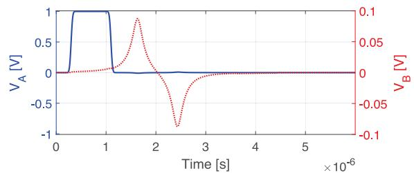  
(a)

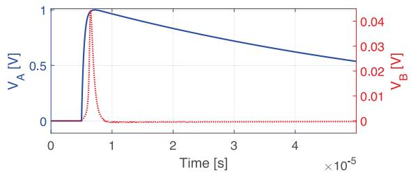  
(b)

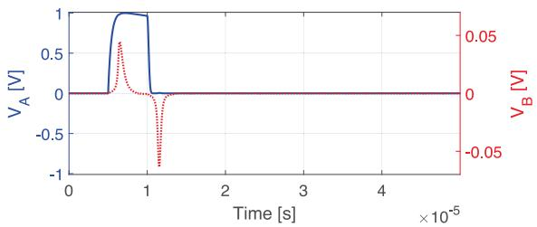

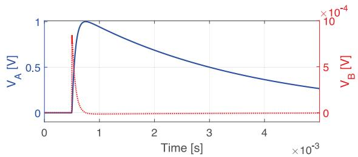  
  
Fig. 11. Voltage waveforms at terminals A and B (see Fig. 9) for excitation waveforms of (a) Trapezoidal pulse with a rise time of 50 ns, (b) Standard $1 . 2 / 5 0 \mu \mathrm { s }$ lightning impulse, (c) Standard $1 . 2 / 5 0 \mu \mathrm { s }$ lightning impulse chopped after $5 \mu \mathrm { s }$ with a chopping time of $0 . 5 \mu \mathrm { s } ,$ and (d) Standard $2 5 0 / 2 5 0 0 \mu \mathrm { s }$ switching impulse.

the Maxwell’s equations in three-dimensional space. Figures 7 and 8 show the sending end currents of the excited and victim wires, respectively for different crossing angles.

Both FEM and SFTL results show that the crossing causes induced currents on the victim wire as well as reflections occurring on the excited wire. The developed model (SFTL) has been able to capture these interferences occurring on both excited and victim wires, which are not being represented by classical transmission line theory. Full-wave results appear to be decaying despite the conductors being lossless and the terminals are short circuited to ground. This is attributed to the radiation loss occurring at the terminals which is not considered in transmission line theory.

# B. Modelling of Crossing Power Transmission Lines

This section demonstrates the changes that should be made to the developed SFTL model to enable its incorporation in an EMT simulator. Let’s consider a typical $5 0 0 \mathrm { k V } - 2 3 0 \mathrm { k V }$ transmission line crossing (see Fig. 9) whose coupling is modelled using the SFTL model. The dimensions are adopted from [25] (pp. 28 and 30). The conductor radius and the crossing angle are assumed to be 20 mm and $3 0 ^ { \circ }$ , respectively. Transient waveforms of (a) a trapezoidal pulse with a rise time of 50 ns [26] (b) a standard $1 . 2 / 5 0 \mu \mathrm { s }$ lightning impulse (c) a standard $1 . 2 / 5 0 \mu \mathrm { s }$ lightning impulse chopped after $5 \mu \mathrm { s }$ with a chopping time of $0 . 5 \mu \mathrm { s }$ and (d) a standard $2 5 0 / 2 5 0 0 \mu \mathrm { s }$ switching impulse [27] were employed as the source at terminal A of conductor 1.

Since the SFTL is to be used as a circuit component between two segments of transmission lines, the region modelled using SFTL typically would appear well away from physical ends of the conductors. To achieve this, when calculating $L ( z )$ and $C ( z )$ in (A.2), instead of integrating from $z = 0 { \mathrm { ~ t o ~ } } z = \ell .$ , integral limits were set as, $z = - 1 0 \ell { \mathrm { t o } } 1 0 \ell .$ . Figure 10 shows the calculated PUL parameters. It is seen that the effect due to the ends is no longer apparent. Figure 11 shows the voltage waveforms at terminals A and B. The voltage at terminal A is determined by the excitation waveform and the voltage at terminal B is due to the coupling between the two conductors. It can be seen that the magnitude of the induced voltage in the victim line for fast transients is approximately $5 \% \sim 1 0 \%$ of the original transient, while it is much less for slower switching transients.

# IV. CONCLUSION

Current EMT-type circuit simulators use multi-conductor transmission line theory to model transmission lines owing to its computational simplicity and availability of closed form solutions. However, the MTL theory is built on the assumption that the transmission line structure is infinitely-long with much smaller cross sectional compared to the minimum wavelength and is uniform along its entire span. Therefore, a non-uniformity such as a crossing, is not represented in current EMT models, even though they have been starting to appear frequently as transmission networks keep expanding.

This paper proposed a method to model power transmission line crossings using electromagnetic scattering theory. The thinwire electromagnetic scattering equations for crossing conductors are then simplified into closed-form, transmission-line-like equations with space varying PUL parameters based on geometrical dimensions and frequency ranges of interest in typical power transmission line transients. This simplification has allowed the proposed model to be implemented using a 1D-FDTD algorithm, which is suitable to be implemented in EMT-type simulators. Results obtained using the proposed model have been compared with those from a 3D, full-wave, electromagnetic solver. The comparison demonstrated that the proposed model has the ability to correctly model the interference occurring on both excited and victim conductors due to a conductor crossing. Once the spacing varying PUL parameters are determined for a given geometry, the proposed model has the same computational complexity of a classical MTL model which makes it a

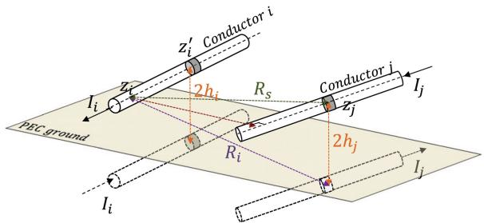  
Fig. 12. A graphical illustration of space variables used in the Green’s functions.

viable candidate for modelling non-uniform transmission lines in EMT-type simulators and other circuit simulators.

# APPENDIX

Green’s function related to a scattered field generated by a straight, cylindrical, current carrying conductor can be obtained using the method of images as [23]

$$
\begin{array}{l} g (z _ {i}, z _ {i} ^ {\prime}) = \frac {e ^ {- j \beta \sqrt {(z _ {i} ^ {\prime} - z _ {i}) ^ {2} + a _ {i} ^ {2}}}}{\sqrt {(z _ {i} ^ {\prime} - z _ {i}) ^ {2} + a _ {i} ^ {2}}} \\ - \frac {e ^ {- j \beta \sqrt {\left(z _ {i} ^ {\prime} - z _ {i}\right) ^ {2} + \left(2 h _ {i}\right) ^ {2}}}}{\sqrt {\left(z _ {i} ^ {\prime} - z _ {i}\right) ^ {2} + \left(2 h _ {i}\right) ^ {2}}} \tag {A.1a} \\ \end{array}
$$

and,

$$
g \left(z _ {i}, z _ {j}, \alpha\right) = \frac {e ^ {- j \beta R _ {s}}}{R _ {s}} - \frac {e ^ {- j \beta R _ {i}}}{R _ {i}} \tag {A.1b}
$$

where,

$$
R _ {s} =
$$

$$
\sqrt {((c _ {i} - z _ {i}) \sin \alpha) ^ {2} + ((c _ {j} - z _ {j}) + (c _ {i} - z _ {i}) \cos \alpha) ^ {2} + (h _ {i} - h _ {j}) ^ {2}}
$$

$$
R _ {i} =
$$

$$
\sqrt {((c _ {i} - z _ {i}) \sin \alpha) ^ {2} + ((c _ {j} - z _ {j}) + (c _ {i} - z _ {i}) \cos \alpha) ^ {2} + (h _ {i} + h _ {j}) ^ {2}}.
$$

The space variables used in the Green’s functions have been graphically illustrated in Fig. 12. The analytical solutions of each integral of (13) and (14) are given by [28]

$$
\begin{array}{l} \xi_ {i i} (z _ {i}) = \left[ \sinh^ {- 1} \left(\frac {\ell_ {i} - z _ {i}}{a _ {i}}\right) - \sinh^ {- 1} \left(\frac {0 - z _ {i}}{a _ {i}}\right) \right] \\ - \left[ \sinh^ {- 1} \left(\frac {\ell_ {i} - z _ {i}}{2 h _ {i}}\right) - \sinh^ {- 1} \left(\frac {0 - z _ {i}}{2 h _ {i}}\right) \right] (A. 2 a) \\ \end{array}
$$

$$
\begin{array}{l} \xi_ {i j} (z _ {i}) = \left[ \sinh^ {- 1} \left(\frac {\ell_ {j} - c _ {j} + \left(c _ {i} - z _ {i}\right) \cos \alpha}{\sqrt {\left(\left(c _ {i} - z _ {i}\right) \sin (\alpha)\right) ^ {2} + \left(h _ {i} - h _ {j}\right) ^ {2}}}\right) \right. \\ \left. - \sinh^ {- 1} \left(\frac {0 - c _ {j} + \left(c _ {i} - z _ {i}\right) \cos \alpha}{\sqrt {\left((c _ {i} - z _ {i}) \sin (\alpha)\right) ^ {2} + \left(h _ {i} - h _ {j}\right) ^ {2}}}\right) \right] \\ \end{array}
$$

$$
\begin{array}{l} - \left[ \sinh^ {- 1} \left(\frac {\ell_ {j} - c _ {j} + \left(c _ {i} - z _ {i}\right) \cos \alpha}{\sqrt {\left(\left(c _ {i} - z _ {i}\right) \sin (\alpha)\right) ^ {2} + \left(h _ {i} + h _ {j}\right) ^ {2}}}\right) \right. \\ \left. - \sinh^ {- 1} \left(\frac {0 - c _ {j} + \left(c _ {i} - z _ {i}\right) \cos \alpha}{\sqrt {\left(\left(c _ {i} - z _ {i}\right) \sin (\alpha)\right) ^ {2} + \left(h _ {i} + h _ {j}\right) ^ {2}}}\right) \right] \tag {A.2b} \\ \end{array}
$$

$$
\begin{array}{l} \xi_ {j i} (z _ {j}) = \left[ \sinh^ {- 1} \left(\frac {\ell_ {i} - c _ {i} + (c _ {j} - z _ {j}) \cos \alpha}{\sqrt {\left((c _ {j} - z _ {j}) \sin (\alpha)\right) ^ {2} + (h _ {i} - h _ {j}) ^ {2}}}\right) \right. \\ \left. - \sinh^ {- 1} \left(\frac {0 - c _ {j} + (c _ {j} - z _ {j}) \cos \alpha}{\sqrt {((c _ {j} - z _ {j}) \sin (\alpha)) ^ {2} + (h _ {i} - h _ {j}) ^ {2}}}\right) \right] \\ - \left[ \sinh^ {- 1} \left(\frac {\ell_ {i} - c _ {i} + (c _ {j} - z _ {j}) \cos \alpha}{\sqrt {((c _ {j} - z _ {j}) \sin (\alpha)) ^ {2} + (h _ {i} + h _ {j}) ^ {2}}}\right) \right. \\ \left. - \sinh^ {- 1} \left(\frac {0 - c _ {i} + \left(c _ {j} - z _ {j}\right) \cos \alpha}{\sqrt {\left(\left(c _ {j} - z _ {j}\right) \sin (\alpha)\right) ^ {2} + \left(h _ {i} + h _ {j}\right) ^ {2}}}\right) \right] \tag {A.2c} \\ \end{array}
$$

$$
\begin{array}{l} \xi_ {j j} (z _ {j}) = \left[ \sinh^ {- 1} \left(\frac {\ell_ {j} - z _ {j}}{a _ {j}}\right) - \sinh^ {- 1} \left(\frac {0 - z _ {j}}{a _ {j}}\right) \right] \\ - \left[ \sinh^ {- 1} \left(\frac {\ell_ {j} - z _ {j}}{2 h _ {j}}\right) - \sinh^ {- 1} \left(\frac {0 - z _ {j}}{2 h _ {j}}\right) \right]. \tag {A.2d} \\ \end{array}
$$

# REFERENCES

[1] A. J. Martinez-Velasco, Power System Transients:Parameter Determination. Boca Raton, FL, USA: CRC Press, 2010.   
[2] J. Tang et al., “Analysis of electromagnetic interference on dc line from parallel ac line in close proximity,” IEEE Trans. Power Del., vol. 22, no. 4, pp. 2401–2408, Oct. 2007.   
[3] J. Ma, R. D. Southey, and F. P. Dawalibi, “Measurement and computation of induced noise levels in telephone lines due to harmonics in nearby power lines,” in Proc. 4th Asia-Pacific Conf. Environmental Electromagn., Aug. 2006, pp. 577–581.   
[4] C. R. Paul, Analysis of Multiconductor Transmission Lines, 2nd ed. Hoboken, NJ, USA: Wiley, 2007.   
[5] M. M. Kane and S. V. Kulkarni, “MTL-based analysis to distinguish highfrequency behavior of interleaved windings in power transformers,” IEEE Trans. Power Del., vol. 28, no. 4, pp. 2291–2299, Oct. 2013.   
[6] K. Agarwal, D. Sylvester, and D. Blaauw, “Modeling and analysis of crosstalk noise in coupled rlc interconnects,” IEEE Trans. Comput.-Aided Des. Integr. Circuits Syst., vol. 25, no. 5, pp. 892–901, May 2006.   
[7] R. Achar and M. S. Nakhla, “Simulation of high-speed interconnects,” Proc. IEEE, vol. 89, no. 5, pp. 693–728, May 2001.   
[8] “Brochure 543: Guideline for numerical electromagnetic analysis method and its application to surge phenomena, wg c4.501,” CIGRE, Paris, France, Jun. 2013.   
[9] P. Bernardi, R. Cicchetti, and D. S. Moreolo, “A full-wave model for EMI prediction in planar microstrip circuits excited in the near-field of a short electric dipole,” IEEE Trans. Electromagn. Compat., vol. 37, no. 2, pp. 175–182, May 1995.   
[10] T. Uwano, R. Sorrentino, and T. Itoh, “Characterization of strip line crossing by transverse resonance analysis,” IEEE Trans. Microw. Theory Techn., vol. 35, no. 12, pp. 1369–1376, Dec. 1987.   
[11] Y. Kami and R. Sato, “Coupling model of crossing transmission lines,” IEEE Trans. Electromagn. Compat., vol. 28, no. 4, pp. 204–210, Nov. 1986.

[12] A. Ametani and M. Aoki, “Line parameters and transients of a non-parallel conductors systems,” IEEE Trans. Power Del., vol. 4, no. 2, pp. 1117–1126, Apr. 1989.   
[13] J. R. Carson, “Wave propagation in overhead wires with ground return,” Bell Syst. Tech. J., vol. 5, no. 4, pp. 539–554, 1926.   
[14] X. Legrand, A. XÉmard, G. Fleury, P. Auriol, and C. A. Nucci, “A quasimonte carlo integration method applied to the computation of the pollaczek integral,” IEEE Trans. Power Del., vol. 23, no. 3, pp. 1527–1534, Jul. 2008.   
[15] A. Ametani and T. Kawamura, “A method of a lightning surge analysis recommended in japan using EMTP,” IEEE Trans. Power Del., vol. 20, no. 2, pp. 867–875, Apr. 2005.   
[16] A. Ametani and A. Ishihara, “Investigation of impedance and line parameters of a finite length multiconductor system,” Elect. Eng. Japan., vol. 114, no. 4, pp. 83–92, 1993.   
[17] H. V. Nguyen, H. W. Dommel, and J. R. Marti, “Modelling of single-phase nonuniform transmission lines in electromagnetic transient simulations,” IEEE Trans. Power Del., vol. 12, no. 2, pp. 916–921, Apr. 1997.   
[18] T. Asada, A. Ametani, Y. Baba, and N. Nagaoka, “A study of transient responses on nonuniform conductors by FDTD simulations,” IEEJ Trans. Elect. Electron. Eng., vol. 11, no. 4, pp. 435–441, 2016.   
[19] S. Tkatchenko, F. Rachidi, and M. Ianoz, “Electromagnetic field coupling to a line of finite length: Theory and fast iterative solutions in frequency and time domains,” IEEE Trans. Electromagn. Compat., vol. 37, no. 4, pp. 509–518, Nov. 1995.   
[20] S. Tkachenko, F. Rachidi, and J. Nitsch, “Analytical characterization of a line bend,” in Proc. 7th Int. Conf. Comput. Exp. Methods Elect. Eng. Electromagn., 2004, vol. 39, no. 1, pp. 599–608.   
[21] F. Rachidi and S. V. Tkachenko, Electromagnetic Field Interaction with Transmission Lines From Classical Theory to HF Radiation Effects. Southampton, U.K.: WIT Press, 2008.   
[22] B. Kordi, J. LoVetri, and G. E. Bridges, “Finite-difference analysis of dispersive transmission lines within a circuit simulator,” IEEE Trans. Power Del., vol. 21, no. 1, pp. 234–242, Jan. 2006.   
[23] D. K. Cheng, Field and Wave Electromagnetics/David K. Cheng (Series Addison-Wesley Series in Electrical Engineering). Reading, MA, USA: Addison-Wesley, 1989.   
[24] A. Poggio and E. Miller, “Chapter 4—Integral equation solutions of threedimensional scattering problems,” in Proc. Comput. Techn. Electromagn., 1973, pp. 159–264.   
[25] S. Kalaga and P. Yenumula, Design of Electrical Transmission Lines:Structures and Foundations. Boca Raton, FL, USA: CRC Press, 2016.

[26] M. Popov, L. van der Sluis, R. P. P. Smeets, and J. L. Roldan, “Analysis of very fast transients in layer-type transformer windings,” IEEE Trans. Power Del., vol. 22, no. 1, pp. 238–247, Jan. 2007.   
[27] E. Kuffel, High Voltage Engineering Fundamentals, 2nd ed. Oxford, U.K.: Butterworth-Heinemann, 2000.   
[28] S. I. Abramowitz, Handbook of Mathematical Functions With Formulas, Graphs, and Mathematical Tables (Partially Mathcad-enabled), U.S. Department of Commerce, National Institute of Standards and Technology, Gaithersburg, MD, USA, 1972.

Manuja Gunawardana was born in Colombo, Sri Lanka, in 1991. He received the B.Sc. degree in electrical engineering from the University of Moratuwa, Moratuwa, Sri Lanka, in 2016, and the M.Sc. degree in electrical engineering in 2019 from the University of Manitoba, Winnipeg, MB, Canada, where he is currently working toward the Ph.D. degree. His research interests are in transient simulation models of power transformers and time-domain modeling of non-uniform transmission lines.

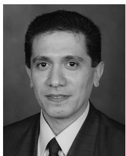

Behzad Kordi (M’05–SM’12) received the B.Sc. (with distinction), M.Sc., and Ph.D. degrees in electrical engineering from the Amirkabir University of Technology (Tehran Polytechnic), Tehran, Iran, in 1992, 1995, and 2000, respectively. During 1998 and 1999, he was with the Lightning Studies Group, University of Toronto, Canada. In 2002, he joined the Electrical and Computer Engineering Department, University of Manitoba, Canada, where he is currently a Full Professor and the Director of McMath High Voltage Laboratory. His research interests include

high voltage engineering, electromagnetic compatibility, simulation models of power transformers and transmission lines, and condition monitoring of high voltage apparatus. Dr. Kordi was the Chair of URSI Canada Commission E in 2012–2013. He is a member of a number of Cigré working groups pertinent to transient modeling of power system apparatus. He is a registered Professional Engineer in the province of Manitoba and was the recipient of 2012 IEEE EMC Richard B. Schulz Best Transactions Paper Award.