# DQ Admittance Model Extraction for IBRs via Gaussian Pulse Excitation

Lingling Fan , Fellow, IEEE, Zhixin Miao , Senior Member, IEEE, Li Bao, Student Member, IEEE, Shahil Shah , Senior Member, IEEE, and Rahul H. Ramakrishna , Student Member, IEEE

Abstract—While dq admittance models have shown to be very useful for stability analysis, extracting admittance models of inverter-based resources (IBRs) from the electromagnetic transient (EMT) simulation environment using frequency scans takes time. In this letter, a new perturbation method based on Gaussian pulses in combination with the system identification algorithms shows great promise for parametric dq admittance model extraction. We present the dq admittance model extracting method for a type-4 wind turbine. Challenges in implementing Gaussian pulse excitation are also pointed out. The extracted dq admittance model via the new method shows to have a high matching degree with the measurements obtained from frequency scans.

Index Terms—Inverter-based resources, admittance model, measurement.

# I. INTRODUCTION

W HILE dq admittance models have shown to be veryuseful for stability analysis (see e.g. [1]), extracting useful for stability analysis (see e.g. [1]), extracting admittance models of inverter-based resources (IBRs) from the electromagnetic transient (EMT) simulation environment using frequency scans takes time. The frequency scanning method may require hundreds of experiments. For each experiment, a sinusoidal perturbation with a given frequency is injected into an input portal and the measurements of the output portals are recorded and processed to extract the phasor of the harmonic component [2].

To speed up the process, alternative model extraction methods have been employed. In general, there are two categories of models that can be obtained from measurement data: non-parametric (Category 1) and parametric (Category 2) [3]. Non-parametric models can be time-domain impulse responses at discrete time points and frequency-domain responses at discrete frequency points. Frequency scans lead to non-parametric models. Parametric models include those expressed as transfer functions

Manuscript received 20 September 2022; revised 23 December 2022 and 2 February 2023; accepted 27 February 2023. Date of publication 13 March 2023; date of current version 24 April 2023. This work was supported in part by the U.S. Department of Energy SETO under Grant DE-EE-0008771, in part by the National Renewable Energy Laboratory, operated by Alliance for Sustainable Energy, LLC, for the U.S. Department of Energy (DOE) under Contract DE-AC36-08GO28308, and in part by National Science Foundation under Grants 2103480 and 1807974. Paper no. PESL-00247-2022. (Corresponding author: Lingling Fan.)

Lingling Fan, Zhixin Miao, Li Bao, and Rahul H. Ramakrishna are with the Department of Electrical Engineering, University of South Florida, Tampa, FL 33620 USA (e-mail: linglingfan@usf.edu; zmiao@usf.edu; libao@usf.edu; rahul12@usf.edu).

Shahil Shah is with the National Renewable Energy Laboratory, Golden, CO 80401 USA (e-mail: shahil.shah@nrel.gov).

Color versions of one or more figures in this article are available at https://doi.org/10.1109/TPWRS.2023.3256119.

Digital Object Identifier 10.1109/TPWRS.2023.3256119

or state-space models. To obtain parametric models from nonparametric models, a data fitting procedure has to be carried out, as shown in [4], [5].

In Category 1, speeding up can be realized by use of multitone sinusoidal or chirp signal injection followed by the crosscorrelation analysis [6], or the pseudo random binary signal (PRBS) injection followed by the cross-correlation analysis [7]. Note that for better outcomes, PRBS injection usually repeats sequences for several times. For example, in [8], five repetitions show to produce more accurate frequency responses from 0.06 to 10 rad/s with 200-s simulation data being used.

Compared to non-parametric models, parametric models have a unique advantage. They can be used directly for analysis and simulation. This feature also makes model validation very easy. After a model is obtained from a training data set, it can be used to simulate output responses for another data set. A high matching degree indicates the good quality of a model.

In Category 2, various system identification methods may be applied to extract input/output models. The authors have designed a dq admittance identification method using subspace methods in [9]. Two step response experiments are used to create two sets of output data, which were further converted to the Laplace domain expressions. Eventually, a dq admittance model in the Laplace domain can be found. This method has also been implemented to extract the dq admittance of a real-world 2.3-MW commercial battery inverter located in NREL’s Flatiron campus [5]. Experiment results show that step response experiment requires to have large enough perturbation to create output data and differentiate noise and signals. The voltage perturbation applied needs to be at 10% of the nominal voltage magnitude. Such step excitation changes the system operating conditions. Hence, impulse perturbations are preferred.

An ideal impulse injection is difficult to implement numerically. Instead, a Gaussian pulse can be used to emulate an ideal impulse. A Gaussian pulse does not have abrupt changes and has a continuous and smooth waveform.

In this letter, we present a new dq admittance extraction method based on Gaussian pulse excitation. Gaussian pulse excitation has been popularly used in physics [10]. The time-domain expression of a Gaussian pulse and its Fourier transform are as follows.

$$
g (t) = \frac {1}{\sqrt {2 \pi} \sigma} e ^ {- \frac {t ^ {2}}{2 \sigma^ {2}}}, G (f) = e ^ {- \frac {1}{2} (2 \pi \sigma f) ^ {2}}
$$

They are shown in Fig. 1. It can be seen that the Fourier transform of a Gaussian pulse is also a Gaussian pulse in the frequency

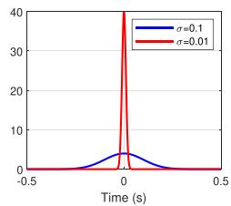

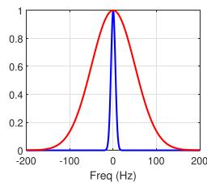  
Fig. 1. Gaussian pulses in time domain and frequency domain.

domain. σ determines the width of the time-domain pulse. A narrower time-domain pulse covers a wider frequency spectrum.

Gaussian pulses are smooth in both the time domain and frequency domain. This leads to numerical advantages in input/output model identification relying on algorithms of subspace methods and optimization.

It has to be noted that impedance measurement is an active research area in the power electronics community. Research groups in the power electronics community have explored various excitation methods, including chirp excitation [6], PRBS excitation [7], and most recently impulse excitation [11]. On the other hand, Gaussian pulse excitation has not been examined.

In the following, we present the admittance model extracting method for a type-4 wind turbine. Challenges in implementing Gaussian pulse excitation are pointed out. The extracted $d q$ admittance model via the new method shows to match the frequency-domain measurements obtained from frequency scans very well.

The three unique advantages of the proposed method based on Gaussian pulse injection are: i) a very short simulation time for data generation compared to frequency scan, ii) the outcome being a parametric model, iii) a guaranteed accuracy through validation against chirp signal-generated data.

# II. DQ ADMITTANCE OF A TYPE-4 WIND TURBINE

In dq admittance estimation, the system to be estimated is a two-input two-output system. The dq admittance relates the currents flowing into the IBR with the injection voltage as follows.

$$
\left[ \begin{array}{l} i _ {d} (s) \\ i _ {q} (s) \end{array} \right] = \underbrace {\left[ \begin{array}{l l} Y _ {d d} (s) & Y _ {d q} (s) \\ Y _ {q d} (s) & Y _ {q q} (s) \end{array} \right]} _ {Y (s)} \left[ \begin{array}{l} v _ {d} (s) \\ v _ {q} (s) \end{array} \right] \tag {1}
$$

# A. Measurement Testbed and Frequency Scan

The $d q$ admittance, notated as $Y ( f _ { i } )$ (where $f _ { i }$ is the perturbing frequency) may be measured via frequency scans. A measurement testbed for a type-4 wind turbine is shown in Fig. 2, with the turbine connected to a controllable three-phase voltage source. This testbed is implemented in MATLAB/Simscape. The wind turbine consists of a permanent synchronous generator, a rectifier, a dc-dc boost converter and a grid-side converter. The grid side converter is in the ac voltage and dc voltage control mode.

First, the d-axis of the voltage is perturbed by a sinusoidal signal with 0.1 p.u. amplitude. The $d q$ currents are recorded.

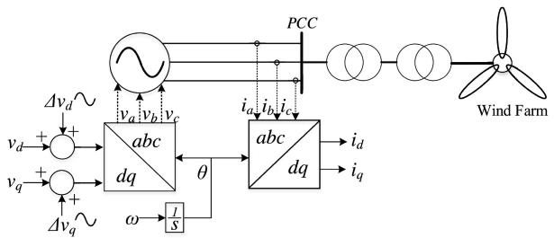  
Fig. 2. The dq admittance measurement test bed for a type-4 wind turbine.

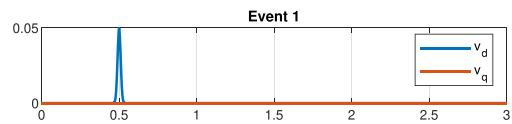

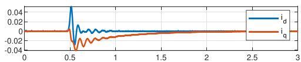

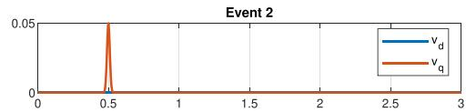

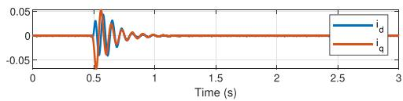  
Fig. 3. The training data set: Input and output data of Gaussian pulse injection.

The measurement data are processed to extract the Fourier coefficients at that frequency. The perturbation frequency varies from 1 Hz to 100 Hz. Next, the q-axis of the source voltage is perturbed and the similar procedure is carried out. As a total, 200 experiments are carried out.

The measurements from frequency scans are most accurate among all methods. This is due to the high signal to noise ratio of single-frequency injection signal. This dq admittance, shown as red lines in Fig. 6, will be used for comparison. This frequencyscan based $d q$ admittance has been used in our prior research [12] and the admittance-based stability analysis results corroborate the EMT simulation results.

# B. Gaussian Injection-Based Method

Using the same testbed, the perturbation now changes to a Gaussian pulse with 0.01 width. The input (dq voltages) and the output $( d q$ currents) will be recorded and used as training data. They are shown in Fig. 3. In addition, a set of validation data are generated by use of chirp signal injection (from 0.1 Hz to 30 Hz), shown in Fig. 4.

Fig. 3 shows that the magnitude of the pulse is 0.05. Event 1 is d-axis voltage perturbation and Event 2 is q-axis voltage perturbation. The input and output data have a sampling rate of 10 kHz.

Based on the two sets of the event data, two models $m _ { 1 }$ and $m _ { 2 }$ as transfer functions will be identified by use of tfest of

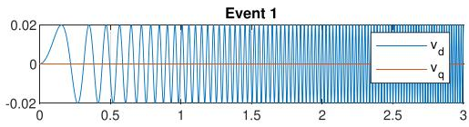

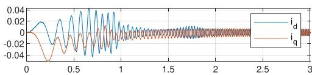

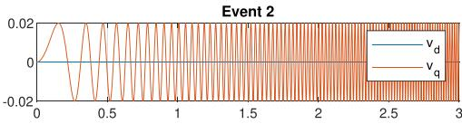

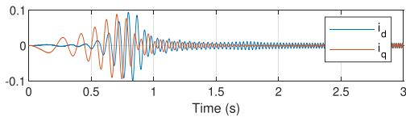  
Fig. 4. The validation data set: Input and output data of chirp signal injection.

the system identification toolbox of MATLAB.

$$
m _ {1} = \left[ \begin{array}{c} Y _ {d d} (s) \\ Y _ {q d} (s) \end{array} \right], m _ {2} = \left[ \begin{array}{c} Y _ {d q} (s) \\ Y _ {q q} (s) \end{array} \right], Y = \left[ \begin{array}{c c} m _ {1} & m _ {2} \end{array} \right]. \tag {2}
$$

This particular system identification tfest employs Instrumental Variables (IV) method, a refined method that can mitigate the effect of biased error in least square estimation [3]. Compared to the state-space model estimation function ssest which uses the prediction error method (PEM), tfest has shown to result in better matching for the training data.

An important assumption is the model order. The basic rule is to have the order as low as possible (to avoid overfitting), while the matching degree is acceptable. So we start from a very low order and gradually increase the order to have increased matching degree. Once increasing order does not help matching degree increase, we stop.

With the model order assumed, $m _ { 1 } ( s )$ and $m _ { 2 } ( s )$ can be obtained. Furthermore, they can be simulated with the input as either Gaussian pulses or chirp signals. Fig. 5 shows the comparison of the simulated responses of $m _ { 1 }$ and $m _ { 2 }$ for the training data and the validation data. The percentage shown in the legend is the normalized root mean squared error (NRMSE) fitness value. It represents how close the predicted model output is to the data.

For both the training data and the validation data, the models’ outputs match the measurement very well. Therefore, the models identified from this set of training data are considered as acceptable. The frequency response of the identified $d q$ admittance is shown in Fig. 6. This response is compared with the discrete frequency response data obtained from frequency scans. It can be seen that the model’s frequency response matches the measured response very well for frequencies below 30 Hz.

a) Challenges in Gaussian pulse injection experiment design: While it appears straightforward in experiment design and data processing, care should be taken in the pulse injection design. A narrow width is preferred to include a wider range

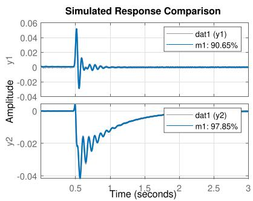

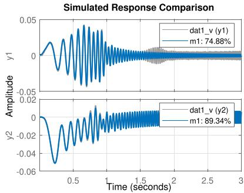  
(a)   
(b)

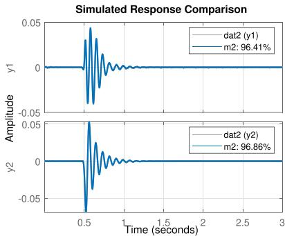

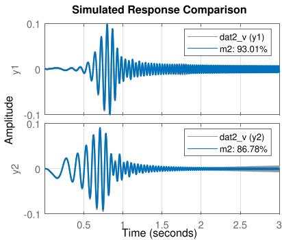  
(c)   
(d)   
Fig. 5. Comparison of the simulated responses and the measurement data. (a) $m _ { 1 }$ against the training data. (b) $m _ { 1 }$ against the validation data. (c) m2 against the training data. (d) $m _ { 2 }$ against the validation data.

of dynamics. In this case study, we use a width of 0.01 to capture dynamics up to 30 Hz. If a Gaussian pulse width of 0.1 is used, the excitation signal contains insignificant dynamics above 10 Hz and thus cannot produce output data with rich dynamics.

Also a suitable magnitude is desired. In the presented results, the pulse has a maximum value of 5% of the nominal voltage. This value guarantees that the system is operating in the small

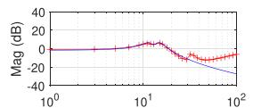

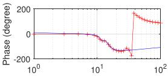

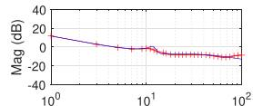

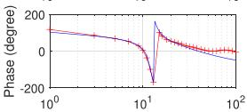  
Frequency (Hz)

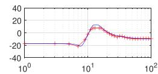

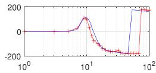

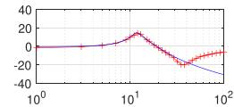

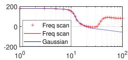  
Frequency (Hz)   
Fig. 6. Dq admittance identified from the proposed method and frequency scan.

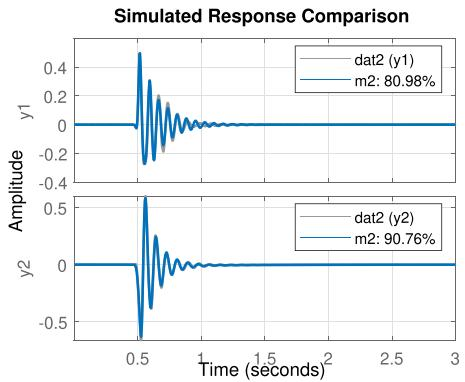

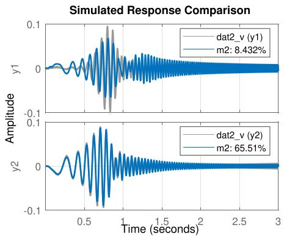  
Fig. 7. Comparison of the simulated responses and the measurement data.

disturbance range. A very large pulse will trigger nonlinearity in the system and is not desired.

Fig. 7 shows a case when the q-axis voltage is perturbed by a Gaussian pulse of 0.5 p.u. Using this data set as the training data set, the resulting model’s simulated response matches the training data very well. However, when tested for the data generated by chirp signal injection, the matching degree is as low as 8%, indicating an inaccurate model.

# III. CONCLUSION

We have introduced a new experiment data generation method to obtain the dq admittance of a black-box IBR. The method is based on Gaussian pulse excitation to create data. The input and output data are used for system identification and the outcome is a parametric low-order linear model. This paper also presents three critical components of the method: experiment design, model identification, and model validation. The frequency response of the admittance identified is shown to be accurate up to the subsynchronous frequency range. It can be seen that Gaussian pulse injection method is suitable for estimation dqLingling Fan admittance for the low frequency to subsynchronous frequency range.

# ACKNOWLEDGMENT

The authors thank William Li of M.I.T. for informing us the Gaussian pulse injection method used in photonics. The authors thank the anonymous editor and reviewers for the constructive feedback.

# REFERENCES

[1] L. Fan and Z. Miao, “Admittance-based stability analysis: Bode plots, nyquist diagrams or eigenvalue analysis?,” IEEE Trans. Power Syst., vol. 35, no. 4, pp. 3312–3315, Jul. 2020.   
[2] L. Fan, Z. Miao, S. Shah, P. Koralewicz, V. Gevorgian, and J. Fu, “Datadriven dynamic modeling in power systems: A fresh look on inverter-based resource modeling,” IEEE Power Energy Mag., vol. 20, no. 3, pp. 64–76, May/Jun. 2022.   
[3] L. Ljung, System Identification: Theory for the User, 2nd ed. Hoboken, NJ, USA: Prentice Hall, 1999.   
[4] A. Riccobono, M. Mirz, and A. Monti, “Noninvasive online parametric identification of three-phase AC power impedances to assess the stability of grid-tied power electronic inverters in LV networks,” IEEE Trans. Emerg. Sel. Topics Power Electron., vol. 6, no. 2, pp. 629–647, Jun. 2018.   
[5] L. Fan, Z. Miao, P. Koralewicz, S. Shah, and V. Gevorgian, “Identifying DQ-domain admittance models of a 2.3-MVA commercial grid-following inverter via frequency-domain and time-domain data,” IEEE Trans. Energy Convers., vol. 36, no. 3, pp. 2463–2472, Sep. 2021.   
[6] Z. Shen, M. Jaksic, P. Mattavelli, D. Boroyevich, J. Verhulst, and M. Belkhayat, “Three-phase AC system impedance measurement unit (IMU) using chirp signal injection,” in Proc. IEEE 28th Annu. Appl. Power Electron. Conf. Expo., 2013, pp. 2666–2673.   
[7] B. Miao, R. Zane, and D. Maksimovic, “System identification of power converters with digital control through cross-correlation methods,” IEEE Trans. Power Electron., vol. 20, no. 5, pp. 1093–1099, Sep. 2005.   
[8] S. Hadavi, D. B. Rathnayake, G. Jayasinghe, A. Mehrizi-Sani, and B. Bahrani, “A robust exciter controller design for synchronous condensers in weak grids,” IEEE Trans. Power Syst., vol. 37, no. 3, pp. 1857–1867, May 2022.   
[9] L. Fan and Z. Miao, “Time-domain measurement-based dq-frame admittance model identification for inverter-based resources,” IEEE Trans. Power Syst., vol. 36, no. 3, pp. 2211–2221, May 2021.   
[10] C. Bauer, R. Freeman, T. Frenkiel, J. Keeler, and A. Shaka, “Gaussian pulses,” J. Magn. Reson., vol. 58, no. 3, pp. 442–457, 1984.   
[11] Z. Liu, J. Liu, and Z. Liu, “Analysis, design, and implementation of impulse-injection-based online grid impedance identification with grid-tied converters,” IEEE Trans. Power Electron., vol. 35, no. 12, pp. 12959–12976, Dec. 2020.   
[12] L. Bao, L. Fan, and Z. Miao, “Wind farms in weak grids stability enhancement: Syncon or statcom?,” Electric Power Syst. Res., vol. 202, 2022, Art. no. 107623. [Online]. Available: https://www.sciencedirect. com/science/article/pii/S0378779621006040