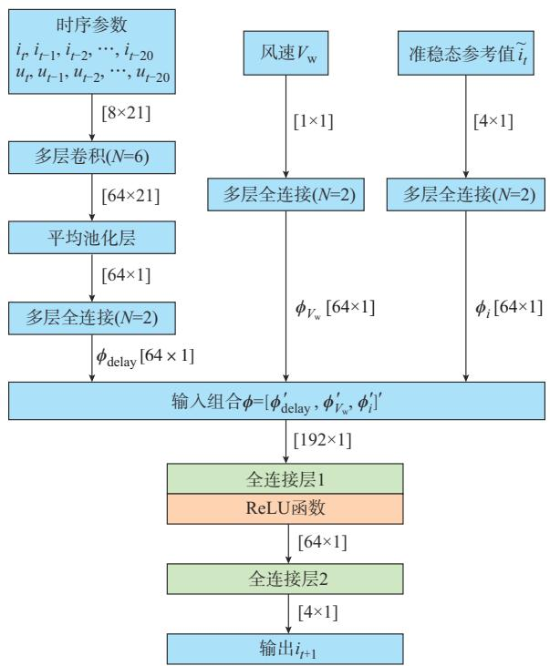
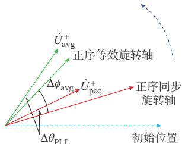
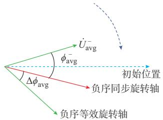
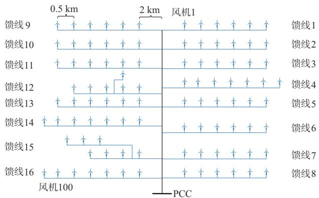
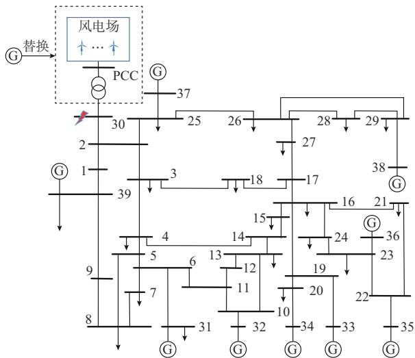
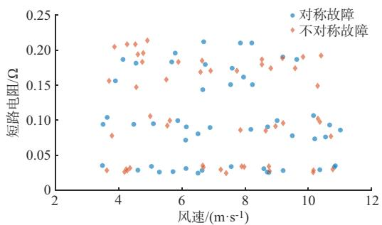

# 基于单机模型扩展的直驱风电场通用等值模型构建方法

李东晟，曹仟妮，赖启平，沈 沉

（清华大学电机工程与应用电子技术系，北京市100084）

摘要：构建风电场的动态等值模型是对风电并网系统进行分析的基础。目前常用的风电场多机等值建模方法在不同运行场景下都需要根据分群指标的变化重新对风电场进行分群等值建模，当用于在线动态安全分析时，需要不断重新构建等值模型，影响效率。因此，有必要对风电场建立适用于任意运行场景的通用等值模型。基于此，针对直驱风电场提出了通用等值模型构建方法。首先，对神经网络结构以及输入参数进行设计，构建了单台永磁直驱风机的神经网络通用模型；然后，通过对输入参数的等效计算，将单机通用模型扩展应用至风电场，形成风电场通用等值模型构建方法；最后，基于CloudPSS电磁暂态仿真平台研究了通用等值模型的仿真接入方法，并基于仿真验证了所提模型的有效性。

关键词：风电场；等值模型；神经网络；电磁暂态仿真

# 0 引 言

风能凭借其安全、清洁、高效率、低成本等优势，在许多国家备受关注［1］ 。截至2024年底，中国风电装机容量为 520 GW，占全国总风电装机容量的15.5%［2］ 。由于单台风电机组容量较小，一个风电场内一般包含几十台或上百台风电机组，若对每台风电机组都详细建模，在时域仿真分析时会大大增加计算复杂度，降低仿真效率。因此，在对风电并网系统进行分析时，需对风电场等值建模，利用少量等值机组来反映整个风电场的动态特性。

现有的风电场等值建模方法可以分为机理等值建模方法和基于数据驱动的等值建模方法。机理等值建模方法主要分为单机等值法和多机等值法，当风电场内各风电机组风速差异较大时，单机等值法准确度较低。而多机等值法通常将能够表征风电机组运行状态的特征量，如风电机组运行风速［3］ 、撬棒电路动作情况［4］、风电机组机端电压［5］等作为分群指标，将响应特性相似的风电机组分为一群，利用多台等值机组等效风电场的动态特性。但此类机理等值建模方法在不同运行场景下都需要根据各风电机组的分群指标重新对风电场进行分群等值建模，当用于在线动态安全分析时，需要不断重新构建等值

模型，影响效率。此外，在对预想故障进行分析时，故障并未实际发生，机理等值建模方法还存在分群指标或集电线路参数难以求解的问题。因此，需要对风电场建立适用于任意运行场景的通用等值模型，将其用于在线分析时无须切换，方便调度部门使用。

在基于数据驱动方法对风电场进行动态等值建模方面，目前大部分研究均是在机理等值模型的基础上，利用数据驱动方法来进一步提高模型准确度。例如，文献［6］利用深度神经网络拟合未知参数的风电机组，结合数据-物理混合驱动框架，对含未知信息的风电场实现了高精度动态等值建模；文献［7］提出基于神经网络匹配算法的机组级信息获取方法，再基于全信息对风电场进行等值建模；文献［8］在分群等值建模方法的基础上，利用数据驱动方法解决了离群值对风电场功率拟合准确度的影响。上述方法均以机理等值模型为基础，在不同工况下仍需重新分群等值建模，同样会影响在线分析的效率。

也有研究直接基于数据驱动方法对风电场进行等值建模。例如，文献［9］基于反向传播神经网络对风电场的稳态模型进行训练，得到以风速作为输入、功率作为输出的稳态通用等值模型；文献［10］基于人工神经网络构建了可用于不平衡三相潮流研究的风电场通用等值模型。但上述两种模型仅能用于稳态计算，无法用于风电场的暂态分析。文献［11］先按风速将风电场等值为 台风电机组后再生成样本

数据训练通用等值模型。但该方法在生成样本数据时仅考虑了一种短路故障和不同的风速输入，在不同故障下的有效性难以保证。文献［12］基于可量测数据对电力系统建立了可通用的微分神经网络等值模型。但该方法对于风电场的适用性还未得到验证。另外，由于风电场存在大量不同的运行方式，上述方法样本需求量大，训练速度慢，且对不同拓扑风电场进行等值时均需要利用大量样本数据重新对神经网络进行训练。

综上所述，目前风电场机理等值建模方法在不同工况下需要重新分群等值建模，不具有通用性；而基于数据驱动的等值建模方法则存在样本需求量大、训练速度慢等问题，而且此类方法对于不同风电场拓扑均需要重新对神经网络进行训练，可扩展性差。因此，本文针对永磁直驱风机（PMSG）构成的风电场，首先对单台 PMSG 建立神经网络通用模型；然后，提出输入参数等效计算方法，将等效后的参数输入单机通用等值模型，利用单机通用等值模型反映风电场的响应特性，该方法能够方便地扩展至不同拓扑的风电场而不需要重新训练；最后，基于CloudPSS 电磁暂态仿真平台（下文简称 CloudPSS平台）将该通用等值模型成功接入电磁暂态仿真，并通过算例验证了所提模型的有效性。由于所提方法仅训练了单台PMSG的通用模型，相较于直接对风电场进行训练，能够有效减少样本需求量，提高训练效率。

# 1 PMSG单机通用等值模型

本章对单台 PMSG 通用模型的神经网络结构以及输入参数进行设计，并基于不同运行场景下的样本数据对神经网络进行训练，得到了最终的单机通用等值模型。

# 1. 1 电压/电流时序参数输入模块

将PMSG以受控电流源形式接入系统后，其在下一时刻输出的电流可看作时序数据预测问题，在该问题中，可利用滑动时间窗口技术将前一段时间内观测到的历史数据作为已知量预测下一时刻的输出［13］ 。基于此，上述问题可以被建模为：

$$
\hat {i} _ {t + 1} = f \left(i _ {t - k _ {2} t}, u _ {t - k _ {2} t}, s\right) \tag {1}
$$

式中： $: \hat { i } _ { t + 1 }$ 为PMSG下一时刻输出电流的预测结果；$i _ { t - k ; t } = \{ i _ { t - k } , i _ { t - k + 1 } , \cdots , i _ { t } \} _ { \backslash } u _ { t - k ; t } = \{ u _ { t - k } , u _ { t - k + 1 } , \cdots , u _ { t } \}$ 分别为时间窗口内的历史电流、电压数据；s为对输出特性有影响的其他静态参数 $; f ( \bullet )$ 为神经网络预测模型。本节在对神经网络模型进行训练时，将电压

电流分解为正/负序、 $, d / q$ 轴分量进行分析，故式（1）中的电压/电流均包含4个分量。

卷积层具有局部特征提取的能力［14］ ，故本节利用多层卷积层来对电压/电流的时序输入参数进行特征提取，单机通用等值模型神经网络的完整结构将在1.3节中介绍。

# 1. 2　风速输入模块

神经网络的第 2部分输入为 PMSG运行风速，运行风速的大小决定了 PMSG能够捕获的风功率大小，本文所提通用等值模型主要关注PMSG的暂态响应特性，由于暂态过程持续时间较短，可认为在此期间风速大小不变，故本节将风速作为静态参数输入。对于静态参数，可以直接将其通过多个全连接层与其他部分输入相结合。

# 1. 3　准稳态参考值输入模块

神经网络的第3部分输入为PMSG的电流准稳态参考值。在对电力系统进行静态稳定性分析时，准稳态模型被提出，以实现仿真精度和仿真效率的良好折中［15］。准稳态模型的思路是假设系统的快变动态能够很快达到稳定，用暂态平衡点来代替暂态过程，而变化较慢的动态则保留其动态过程［16］ 。

利用准稳态的思想，忽略PMSG双环控制的暂态过程，假设在外部电压变化时，PMSG 总能快速完成其动态过程，运行至故障稳态。此时，PMSG的模型即为本文定义的准稳态模型，即故障稳态模型。

本文所用PMSG模型结构与文献［17］相同，该PMSG 正常运行时网侧变流器采用定直流侧电压控制，无功参考值为 0；故障期间采用无功优先控制，在输出国标要求的无功功率后，再利用变流器剩余容量输出有功功率，尽可能地维持直流侧电容电压稳定。同时，考虑PMSG负序电压补偿的负序控制策略［18］，PMSG 准稳态模型电流输出特性如下所示：

$$
\left\{ \begin{array}{l} \tilde {i} _ {d} ^ {+} = \min  \left\{\tilde {i} _ {d, \text {r e f}, 1} ^ {+}, \tilde {i} _ {d, \max } ^ {+} \right\} \\ \tilde {i} _ {q} ^ {+} = - K ^ {+} \left(0. 9 - u ^ {+}\right) I _ {\mathrm {N}} \\ \tilde {i} _ {d} ^ {-} = - K ^ {-} u _ {q} ^ {-} I _ {\mathrm {N}} \\ \tilde {i} _ {q} ^ {-} = K ^ {-} u _ {d} ^ {-} I _ {\mathrm {N}} \end{array} \right. \tag {2}
$$

式 中 ：i͂+ /i͂- 、i͂+ /i͂- 分 别 为 正 /负 序 $d , q$ 轴电流的准稳态参数； $\tilde { i } _ { d , \mathrm { r e f } , 1 } ^ { + } , \tilde { i } _ { d , \mathrm { m a x } } ^ { + }$ 分别为故障稳态下定直流电压控制下的正序 $d$ 轴电流参考值和变流器容量允许下的正序d轴电流最大值； $; u ^ { + }$ 为PMSG机端正序电压标幺值； $; u _ { d } ^ { - } , u _ { q } ^ { - }$ 分别为 PMSG 机端负序 $d , q$ 轴电压；$K ^ { + }$ 、K- 分别为 PMSG正、负序无功电流比例系数；$I _ { \mathrm { N } }$ 为变流器额定电流。

在故障稳态下，定直流侧电压控制维持直流侧电容电压稳定，会将机侧输入的有功功率全部输出至网侧，则 $\tilde { i } _ { d , \mathrm { r e f } , 1 } ^ { + }$ 可表示为：

$$
\tilde {i} _ {d, \text {r e f}, 1} ^ {+} = \frac {f _ {\mathrm {v}} \left(V _ {\mathrm {w}}\right)}{u ^ {+}} \tag {3}
$$

式中 $: f _ { \mathrm { v } } \left( \bullet \right)$ 为 PMSG风功率函数； $V _ { \mathrm { ~ w ~ } }$ 为 PMSG 运行风速。

变流器容量允许的正序d轴电流最大值为：

$$
\tilde {i} _ {d, \max } ^ {+} = \sqrt {\left(I _ {\max } - K ^ {-} u ^ {-} I _ {\mathrm {N}}\right) ^ {2} - \left(\tilde {i} _ {q} ^ {+}\right) ^ {2}} \tag {4}
$$

式中： $I _ { \mathrm { m a x } }$ 为允许通过变流器的最大电流； $u ^ { - }$ 为PMSG机端负序电压标幺值。

为了反映 PMSG 在故障结束后的斜坡恢复特性，本文在所提PMSG准稳态模型的基础上加入正序 d轴电流恢复速率限制模块，该部分仅在检测到PMSG 从低电压穿越运行状态恢复到正常运行状态时启用，速度限幅器的数学模型如下：

$$
\tilde {i} _ {d, t + 1} ^ {+} = \min  \left\{\tilde {i} _ {d, t + 1} ^ {+ \prime}, \tilde {i} _ {d, t} ^ {+} + k ^ {\prime} \Delta t \right\} \tag {5}
$$

式中： $\tilde { i } _ { d , t + 1 } ^ { + ^ { \prime } } , \tilde { i } _ { d , t + 1 } ^ { + }$ 分别为t+1时刻速度限幅器的输入和输出； $\tilde { i } _ { d , \textit { i } } ^ { + }$ 为 t 时刻速度限幅器的输出；k' 为PMSG允许的正序d轴电流最快上升速度； $\Delta t$ 为仿真步长。

由式（2）—式（5）可知，该模型的输出不再与直流侧电容电压相关，仅依靠外部量测即可进行计算。与1.2节的风速输入方法类似，可将该部分准稳态参考值经过多层全连接层后再与其他部分结合。

# 1. 4　单机神经网络结构设计及样本数据生成

神经网络通用等值模型的完整结构如图 1所示。图中：N为多层卷积及多层全连接中包含的神经网络层数；[8×21]表示时序参数输入维度，其他同理； $\phi _ { \mathrm { d e l a y } } \setminus \phi _ { V _ { \mathrm { w } } } \setminus \phi _ { i }$ i分别为时序参数输入模块、风速输入模块、准稳态参考值输入模块的输出向量； $\smash { \vdots \phi _ { \mathrm { d e l a y } } ^ { \prime } \setminus \phi _ { \mathrm { \tiny ~ V _ { \mathrm { w } } } } ^ { \prime } \setminus \phi _ { i } ^ { \prime } }$ 分别为对应向量的转置。

基于所构建的神经网络，将单台PMSG完整的详细模型经过线路接于无穷大系统，在不同风速、故障类型、故障严重程度以及系统强度下进行批量仿真生成样本数据，最终训练集包含 200个不同运行场景的仿真结果，测试集包含50个不同运行场景的仿真结果。

# 1. 5　神经网络训练及结果验证

本文针对每一段时序数据，采用连续预测的方式对神经网络进行训练，即将神经网络得到的预测电流值作为下一时刻神经网络的电流输入，使神经网络具有连续预测的能力。基于该训练方式，神经网络模型和损失函数可写为：

  
图1 神经网络结构  
Fig. 1 Structure of neural network

$$
\left\{ \begin{array}{l} \hat {i} _ {t + 1} = f \left(\hat {i} _ {t - k: t}, u _ {t - k: t}, V _ {\mathrm {w}}, \tilde {i} _ {t}\right) \quad k ^ {\prime \prime} \leqslant t <   T \\ \mathcal {L} = \frac {1}{T - k ^ {\prime \prime}} \sum_ {t = k ^ {\prime \prime} + 1} ^ {T} \| i _ {t} - \hat {i} _ {t} \| _ {2} \end{array} \right. \tag {6}
$$

式中： $\tilde { i } _ { t }$ 为 t时刻电流准稳态参考值； $\widehat { i } _ { t - k : t }$ 为时间窗口内神经网络电流预测结果；T为一条样本曲线包含的数据点数；L为神经网络损失函数； $: k ^ { \prime \prime }$ 为历史数据点采样个数，本文中 $k ^ { \prime \prime }$ 取 $2 0 ; i ,$ 为t时刻输出电流真实值。

神经网络的主要训练参数为：批大小 20、学习率 10-4 、训练轮数 2 000次，采用 Adam 优化器。在该参数设置下对神经网络进行训练，得到单台PMSG 的神经网络通用模型。为说明输入的准稳态参考值对神经网络训练的影响，将不含准稳态输入的神经网络与所提方法进行对比，结果如附录A图A1—图A4所示，证明了本章所提单机通用等值模型的有效性。

# 2 适用于PMSG风电场的通用等值模型

传统单机等值建模方法基于容量加权的方法将风电场等值为一台等值机组和一条等值线路，该方法无法反映风电场内各PMSG响应特性差异，且等值线路的参数也无法通用。本章基于所提单机通用等值模型，通过对输入电压和电流的修正来等效集电线路的影响；然后，基于准稳态参考值的修正，来反映风电场内各PMSG响应特性的差异，提高通用

等值模型的等值精度。

# 2. 1　机端电压、电流输入参数修正

在传统集电线路等值方法中，往往根据故障期间某一个时刻的工作状态对集电线路进行等值，在该时刻实现等值前后平均电压跌落相等或功率损耗相等。本节为实现模型的通用性，在每一时刻根据公共耦合点（PCC）处量测电压对各 PMSG 机端电压进行估计，并计算电压相量的平均值作为通用等值模型的输入，相当于在故障期间的每一时刻都实现了风电机组等值前后平均电压跌落相等。

本节采用文献［19］中方法，在仿真的每一时步对各风电机组机端正、负序电压进行估计。该方法将正负序网解耦，并通过构建风电机组的静态功率模型，在已知 PCC 处电压以及风电场拓扑的情况下，采用前推-回代的方法对风电场内各PMSG机端电压进行估计。

基于式（2）计算各 PMSG 电流输出特性，则PMSG输出的正/负序有功、无功功率 $( P ^ { + } / P ^ { - } , Q ^ { + } /$ Q-）可由下式计算：

$$
\left\{ \begin{array}{l} P ^ {+} = 1. 5 \left(u _ {d} ^ {+} i _ {d} ^ {+} + u _ {q} ^ {+} i _ {q} ^ {+}\right) = 1. 5 u _ {d} ^ {+} i _ {d} ^ {+} \\ Q ^ {+} = 1. 5 \left(u _ {q} ^ {+} i _ {d} ^ {+} - u _ {d} ^ {+} i _ {q} ^ {+}\right) = - 1. 5 u _ {d} ^ {+} i _ {q} ^ {+} \\ P ^ {-} = 1. 5 \left(u _ {d} ^ {-} i _ {d} ^ {-} + u _ {q} ^ {-} i _ {q} ^ {-}\right) = 0 \\ Q ^ {-} = 1. 5 \left(u _ {q} ^ {-} i _ {d} ^ {-} - u _ {d} ^ {-} i _ {q} ^ {-}\right) = - 1. 5 K ^ {-} \left(u ^ {-}\right) ^ {2} I _ {\mathrm {N}} \end{array} \right. \tag {7}
$$

式中 $: u _ { d } ^ { + } \setminus u _ { q } ^ { + }$ 分别为PMSG机端正序 $d , q$ 轴电压；i+ /$i _ { d } ^ { - } , i _ { q } ^ { + } / i _ { q } ^ { - }$ 分别为正/负序 $d , q$ 轴电流。

将各 PMSG 机端电压初始化后可前推计算各PMSG 输出功率，再利用各 PMSG 输出功率、风电场拓扑以及 PCC处电压回代计算各风电机组机端电压，重复上述前推-回代步骤直至机端电压收敛，即可认为得到了各PMSG机端电压，具体步骤可参考文献［ ］。

通过各PMSG机端正、负序电压相量可得其在PCC处同步旋转轴下的平均值分别为：

$$
\left\{ \begin{array}{l} \dot {U} _ {\text {a v g}} ^ {+} = u _ {\text {a v g}} ^ {+} \angle \phi_ {\mathrm {u}, \text {a v g}} ^ {+} = \frac {1}{N ^ {\prime}} \sum_ {i = 1} ^ {N ^ {\prime}} \dot {U} _ {t, i} ^ {+} \\ \dot {U} _ {\text {a v g}} ^ {-} = u _ {\text {a v g}} ^ {-} \angle \phi_ {\mathrm {u}, \text {a v g}} ^ {-} = \frac {1}{N ^ {\prime}} \sum_ {i = 1} ^ {N ^ {\prime}} \dot {U} _ {t, i} ^ {-} \end{array} \right. \tag {8}
$$

式 中 ： $\dot { U } _ { \mathrm { a v g } } ^ { + }$ 和 $\dot { U } _ { \mathrm { a v g } } ^ { - }$ 分 别 为 PCC 处 同 步 旋 转 轴 下PMSG机端平均正、负序电压相量； $N ^ { \prime }$ 为风电场内PMSG 数量； $\dot { U } _ { t , i } ^ { + }$ 和 $\dot { U } _ { t , i } ^ { - }$ 分别为 t时刻第 i台 PMSG的机端正序、负序电压相量； $; u _ { \mathrm { a v g } } ^ { + } / u _ { \mathrm { a v g } } ^ { - } \setminus \phi _ { \mathrm { u , a v g } } ^ { + } / \phi _ { \mathrm { u , a v g } } ^ { - }$ 分别为PMSG机端正/负序平均电压相量在同步旋转轴下的幅值和相角。

由于在单机通用等值模型中，输入模型的时序

$d q$ 轴电压/电流均由各 PMSG网侧电压定向，故在得到各 PMSG机端电压后不能直接将平均电压相量作为单机通用等值模型的输入，还需进行坐标变换。在故障瞬间，由于电压相角突变，造成锁相环无法准确对电压定向，正序电压相量与旋转轴有一定夹角。此时，若忽略风电场中各PMSG锁相环动态差异，均以PCC处锁相环动态作为各PMSG锁相环动态，那么也可利用PCC处锁相环动态代替等值机组锁相环动态，此时各旋转轴及电压相量的位置关系见图 2。图中： $\dot { U } _ { \mathrm { p c c } } ^ { + }$ 为风电场 PCC 处正序电压； $\phi _ { \mathrm { a v g } } ^ { - }$ 为PCC处负序电压在负序同步旋转轴下的相角。

  
(a) 44

  
(b) B44   
图2 机端等效旋转轴与PCC处同步旋转轴示意图  
Fig. 2 Schematic diagram of terminal equivalent rotating axis and synchronous rotating axis at PCC

因此，在对风电场进行单机等值后，输入该单机通用等值模型的正序 $d , q$ 轴电压分别为：

$$
\left\{ \begin{array}{l} u _ {d, \mathrm {n n}} ^ {+} = \left| \dot {U} _ {\text {a v g}} ^ {+} \right| \cos \left(\Delta \theta_ {\mathrm {P L L}}\right) \\ u _ {q, \mathrm {n n}} ^ {+} = \left| \dot {U} _ {\text {a v g}} ^ {+} \right| \sin \left(\Delta \theta_ {\mathrm {P L L}}\right) \end{array} \right. \tag {9}
$$

式中： $u _ { d , \mathrm { n n } } ^ { + }$ 和 $u _ { \boldsymbol { q } , \mathrm { n n } } ^ { + }$ 分别为等效正序 $d , q$ 轴电压； $: \Delta \theta _ { \mathrm { P L I } }$ 为 PCC 处锁相环锁相偏差的相角，可由 PCC 处量测的 $d q$ 轴电压得到，即

$$
\Delta \theta_ {\mathrm {P L L}} = \arctan \left(\frac {u _ {d , \mathrm {p c c}} ^ {+}}{u _ {q , \mathrm {p c c}} ^ {+}}\right) \tag {10}
$$

式中 $: u _ { d , \mathrm { p c c } } ^ { + }$ 和 $u _ { q , \mathrm { p c c } } ^ { + }$ 分别为 PCC 处正序 $d , q$ 轴电压。

由图 2 可知，等值机组的正序等效旋转轴与PCC处同步旋转轴的夹角始终为：

$$
\Delta \phi_ {\mathrm {a v g}} = \phi_ {\mathrm {u}, \mathrm {a v g}} ^ {+} - \Delta \theta_ {\mathrm {P L L}} \tag {11}
$$

式中： $\Delta \phi _ { \mathrm { a v g } }$ 为等值机组机端正序等效旋转轴与PCC处正序同步旋转轴之间的夹角。

在负序网络中，由于负序旋转轴与正序旋转轴相位相反，等效负序旋转轴和PCC处同步负序旋转轴的相对位置如图 2所示，同样应将平均负序电压相量变换至负序等效旋转轴才能输入单机通用等值模型，变换方法如下所示：

$$
\left\{ \begin{array}{l} u _ {d, \mathrm {n n}} ^ {-} = \left| \dot {U} _ {\mathrm {a v g}} ^ {-} \right| \cos \left(\phi_ {\mathrm {u}, \mathrm {a v g}} ^ {-} + \Delta \phi_ {\mathrm {a v g}}\right) \\ u _ {q, \mathrm {n n}} ^ {-} = \left| \dot {U} _ {\mathrm {a v g}} ^ {-} \right| \sin \left(\phi_ {\mathrm {u}, \mathrm {a v g}} ^ {-} + \Delta \phi_ {\mathrm {a v g}}\right) \end{array} \right. \tag {12}
$$

式中： $\bar { u _ { d , \mathrm { n n } } }$ 和 $\bar { u _ { q , \mathrm { n n } } }$ 分别为输入单机通用等值模型的负序 $d , q$ 轴电压。

进一步，对输入电流进行计算，若忽略集电线路的电容支路，则PCC处量测的电流即为单机通用等值模型的机端电流。与电压类似，同样需要将正、负序电流转换至等效旋转轴再输入神经网络模型，此处不再赘述。

上述计算仅通过 PCC处的量测以及风电场的内部拓扑信息即可完成，将单机神经网络通用等值模型接入系统后，在仿真过程中可基于PCC量测以及上述步骤对输入神经网络的机端正、负序电压/电流进行计算，该过程等效了传统等值模型中集电线路的作用。

# 2. 2　输入风速修正

在传统单机等值模型中，一般基于风功率函数求解等值风速，使得等值前后风电场在正常运行时输出的有功功率相等。基于该方法，本文所提风电场通用等值模型的等值风速计算公式为：

$$
V _ {\mathrm {w}, \mathrm {e q}} = f _ {\mathrm {v}} ^ {- 1} \left(\frac {1}{N ^ {\prime}} \sum_ {i = 1} ^ {N ^ {\prime}} f _ {\mathrm {v}} \left(V _ {\mathrm {w}, i}\right)\right) \tag {13}
$$

式中： $V _ { \mathrm { w , e q } }$ 为等值风速； $V _ { \mathrm { w } , i }$ 为第i台PMSG的运行 风速。

# 2. 3　准稳态参考值修正

文献［17］基于机理分析将 PMSG 的故障响应特性分为了 3类，进行等值建模时考虑了各 PMSG响应特性差异。本文1.3节中定义了适用于暂态过程的PMSG准稳态模型，该模型中对正序d轴电流的计算反映了风电机组在整个故障过程中的响应特性，不同的取值分别对应了文献［17］中的 3类响应特性。因此，将各PMSG的准稳态模型进行累加和平均后作为风电场通用等值模型的准稳态输入，即可使神经网络模型能够反映各 PMSG响应特性的差异。在本文2.1节中已经介绍了各PMSG机端电压估计方法，假设第i台PMSG在PCC处同步旋转轴下的机端正、负序电压相量分别为 $\dot { U } _ { t , i } ^ { + } = u _ { t , i } ^ { + } \triangle { \phi _ { t } ^ { + } } ,$ ，i和 $\dot { U } _ { t , i } ^ { - } = u _ { t , i } ^ { - } \triangle { \phi _ { t , i } ^ { - } }$ ，在计算准稳态参考值时，需要先将电压在PMSG机端的同步旋转轴上分解。此时，PMSG机端正/负序d、q轴电压分别为：

$$
\left\{ \begin{array}{l} u _ {d, i} ^ {+} = \left| \dot {U} _ {t, i} ^ {+} \right| \cos \left(\Delta \theta_ {\mathrm {P L L}}\right) \\ u _ {q, i} ^ {+} = \left| \dot {U} _ {t, i} ^ {+} \right| \sin \left(\Delta \theta_ {\mathrm {P L L}}\right) \\ u _ {d, i} ^ {-} = \left| \dot {U} _ {t, i} ^ {-} \right| \cos \left(\phi_ {t, i} ^ {-} + \phi_ {t, i} ^ {+} - \Delta \theta_ {\mathrm {P L L}}\right) \\ u _ {q, i} ^ {-} = \left| \dot {U} _ {t, i} ^ {-} \right| \sin \left(\phi_ {t, i} ^ {-} + \phi_ {t, i} ^ {+} - \Delta \theta_ {\mathrm {P L L}}\right) \end{array} \right. \tag {14}
$$

式中： $u _ { d , i } ^ { + } / u _ { d , i } ^ { - } \mathrm { , } u _ { q , i } ^ { + } / u _ { q , } ^ { - }$ 分别为第i台PMSG在其机端旋转轴下的正/负序d、q轴电压。

基于式（2）—式（5）即可计算各 PMSG 准稳态参考值为：

$$
\left[ \tilde {t} _ {d, i} ^ {+}, \tilde {t} _ {q, i} ^ {+}, \tilde {t} _ {d, i} ^ {-}, \tilde {t} _ {q, i} ^ {-} \right] ^ {\mathrm {T}} = G \left(u _ {d, i} ^ {+}, u _ {q, i} ^ {+}, u _ {d, i} ^ {-}, u _ {q, i} ^ {-}\right) \tag {15}
$$

式中：下标 i表示第 i台 PMSG 参数；G(⋅)为综合考虑式（2）—式（5）的 PMSG 准稳态参考值计算函数。

计算得到各 PMSG的 $d q$ 轴电流准稳态参考值均是在其机端旋转轴下的值，最终同样需要将各PMSG 电流参考值转换至等效同步旋转轴上求平均值，再输入神经网络等值模型。

该综合准稳态参考值包含了风电场内所有PMSG的功率响应特性，使得该单机通用等值模型能够考虑风电场内各PMSG的特性差异，相较于传统单机等值建模方法更加准确。

# 3 风电场通用等值模型仿真接入方法

由于传统仿真软件的接口原因，目前基于神经网络的等值模型还未接入电磁暂态仿真中进行计算，而CloudPSS平台为用户提供了灵活的自定义元件接口，用户可通过 C++、Python以及 MATLAB等语言构建满足需求的模块，本章介绍了基于自定义元件将神经网络通用等值模型接入CloudPSS平台的方法。

首先，利用 CloudPSS 平台中的 Python 自定义元件构建神经网络模型。在该元件中可直接利用Python语言进行编程，本文基于Pytorch搭建如图1所示神经网络框架，再加载基于单台PMSG模型训练好的神经网络权重参数即可将神经网络模型接入仿真环境。进一步，基于 CloudPSS平台自定义元件搭建等效输入参数计算模块，具体计算方法已在第 2章介绍。在设计该模块时，将风电场的阻抗矩阵作为元件的输入参数，这样通过改变输入的阻抗矩阵即可方便地将该通用等值模型扩展应用于其他拓扑结构的风电场。结合上述两个计算模块即可依据输入参数和 PCC量测计算风电场的输出电流大小，由于神经网络是基于单台 PMSG训练得到的，故其输入/输出参数都应匹配单台 PMSG 的大小，最终以受控电流源的形式将风电场通用等值模型接入仿真系统时，需要将神经网络输出电流大小倍乘后再输入受控电流源。

# 4 算例验证

本章基于CloudPSS平台来验证所提通用等值模型的有效性。采用的直驱风电场拓扑如图 3所

示，该拓扑是基于江苏如东某风电场搭建的。将该风电场详细模型通过变压器接入IEEE 39节点系统的30号节点来代替原有的发电机，形成新的测试算例，该测试算例拓扑如图4所示。

  
图3 直驱风电场拓扑

  
Fig. 3 Topology of wind farm with direct-drive turbines   
图4 测试系统拓扑  
Fig. 4 Topology of test system

# 4. 1　批量场景下模型的有效性验证

为验证所提风电场通用等值模型在不同工况下的有效性，本节基于图 4所示拓扑批量生成不同运行场景，在所生成运行场景中将不同模型仿真结果进行对比。

本节将故障设置在30号节点处，分别对风电场平均运行风速、故障类型以及故障严重程度进行随机抽样，在设置风电场平均运行风速后，进一步在该平均运行风速±2 m/s的范围内随机抽样，样本作为各风电机组的运行风速。生成的100个风电场运行场景参数如图5所示。

将所提模型、传统的单机等值模型［20］ 以及四机等值模型［21］ 的仿真结果与详细模型进行对比，并以风电场并网点处输出的有功功率为例来进行误差分

  
图5 运行场景对应参数组合  
Fig. 5 Parameter combination for various scenarios

析。需要指出的是，传统单机等值模型以及四机等值模型在对预想故障进行分析时，由于故障并未实际发生，其等值线路参数难以求解，本文进行对比时假设故障已实际发生，能够准确求解各模型等值线路参数。各等值模型有功功率的绝对百分比误差见附录B图B1，有功功率误差箱图见图B2，箱图中的底边和顶边分别代表第25个和第75个百分位数。

从附录 B图 B1和图 B2可以看出，本文模型准确度高于单机等值模型，但低于四机等值模型。其中，单机等值模型在忽略场内集电线路影响时也适用于任意工况，可以看作通用等值模型；四机等值模型基于运行风速对风电机组进行分群，在不同工况下均需重新分群等值建模，准确度较高但无法通用。本文模型在各类运行工况下均无须改变，更适用于在线应用的场景。

# 4. 2　典型场景下模型的有效性验证

本节以几个典型运行场景为例，对各等值模型进行比较。

# 4. 2. 1　算例1：对称严重故障

在 号节点处设置接地电阻为 的三相短路故障，此时风电场 PCC处电压跌落至 0.1 p.u.左右。本节设置风速在 至额定风速m/s内均匀分布，随机抽取样本作为各风电机组运行风速。

将风电场阻抗矩阵和各输入参数输入通用等值模型，在该故障下，对不同模型分别进行仿真。风电场出口处各模型输出的电流见附录C图C1，PCC处输出的有功功率和无功功率见图C2和图C3。

# 4. 2. 2　算例2：不对称严重故障

在 30号节点处设置接地电阻为 0.06 Ω的单相接地短路故障，各 PMSG运行风速与算例1情况相同。同样地，对各模型分别进行仿真，得到 PCC处输出的各电流分量见附录 C图 C4。PCC处输出的有功功率和无功功率见图 和图 ，为了更清晰

地观察有功功率差异，此处将有功功率平均分量单独提取出来进行比较，结果见图C7。

# 4. 2. 3　算例3：对称轻微故障

为证明所提方法在不同拓扑风电场下的有效性，本节将图 3所示风电场内部集电线路参数进行修改，将馈线 1~8 中的线路长度变为原模型的一半，将馈线9~16中的线路长度变为原模型的两倍，即可得到一个新的风电场拓扑，本节将基于该拓扑进一步进行算例验证。

当电压跌落不深时，各PMSG在故障持续期间的有功特性依据有功电流是否被变流器容量限制可被分为两类［17］。为体现所提通用等值模型可反映这两类特性，本节在 30号节点处设置接地电阻为0.15 Ω的三相对称短路故障。此时，故障较轻。同时，设置风电场平均风速为 9 m/s，在其±2 m/s的范围内均匀采样作为各PMSG运行风速。

在该故障下对各模型进行仿真，得到PCC处输出的各电流分量见附录C图C8，风电场输出的有功

功率及无功功率见图C9和图C10。

# 4. 2. 4　算例4：不对称轻微故障

本节仍基于修改后的风电场拓扑进行算例分析，在 30号节点处设置接地电阻为 0.1 Ω的单相接地短路故障，风速设置与算例3相同，此时各模型输出的电流见附录 C图 C11，输出的有功功率和无功功率见图 C12和图 C13。同样地，提取出有功功率的平均分量进行比较，结果见图C14。

# 4. 2. 5　不同模型对比分析

上述4个算例中各等值模型的仿真时间以及等值误差如表 1所示。从表中可以看出，所提通用等值模型准确度高于单机等值模型且与四机等值模型接近，而仿真效率相比于详细模型有较大提升。另外，本文所提通用等值建模方法能够适用于各类运行工况，在使用时无须对模型进行修改，更适用于在线应用的场景，而且由于模型始终不改变，也适用于一般性的理论研究。

表1 不同等值模型的仿真时间及等值误差  
Table 1 Simulation time and equivalence errors of different equivalent models   

<table><tr><td rowspan="2">类型</td><td colspan="2">算例1</td><td colspan="2">算例2</td><td colspan="2">算例3</td><td colspan="2">算例4</td></tr><tr><td>仿真时间/s</td><td>等值误差/%</td><td>仿真时间/s</td><td>等值误差/%</td><td>仿真时间/s</td><td>等值误差/%</td><td>仿真时间/s</td><td>等值误差/%</td></tr><tr><td>详细模型</td><td>1050.0</td><td></td><td>1064.0</td><td></td><td>1027.0</td><td></td><td>1041.0</td><td></td></tr><tr><td>通用等值模型</td><td>21.3</td><td>1.61</td><td>20.7</td><td>0.80</td><td>22.8</td><td>2.52</td><td>20.6</td><td>0.67</td></tr><tr><td>单机等值模型</td><td>8.2</td><td>6.67</td><td>8.6</td><td>5.26</td><td>7.5</td><td>4.65</td><td>9.4</td><td>3.38</td></tr><tr><td>四机等值模型</td><td>13.2</td><td>1.88</td><td>12.1</td><td>0.96</td><td>14.6</td><td>1.22</td><td>15.3</td><td>0.68</td></tr></table>

# 5 结语

本文首先基于所定义的 PMSG 暂态过程中的准稳态模型构建了单台 PMSG 神经网络模型；然后，通过输入参数的修正将该单机模型扩展应用至风电场，提出了风电场通用等值模型；最后，将所提风电场通用等值模型以受控电流源的形式接入CloudPSS平台，并基于算例分析验证了所提风电场通用等值模型在不同运行场景下的有效性。

本文所提通用等值模型在各类工况下均无须重新构建，适用于在线应用等时效性要求高的场景。此外，由于所提方法仅训练了单台PMSG的通用模型，相较于直接对风电场进行训练，有效减少了样本需求量，提高了训练效率，而且在应用于不同拓扑的风电场时仅需输入风电场阻抗矩阵即可适用，有较好的扩展能力。本文所提方法也为其他新能源场站的等值建模提供了新的思路。

本文所提等值建模方法仅考虑了风电场内风电

机组型号相同的情况，然而在实际电力系统中，同一风电场内可能包含型号不同的风电机组，对于该情况，需要先按型号对风电机组分群再分别进行等值建模，该方法的适用性还需进一步研究。此外，本文方法未考虑多重故障的情况，在同时发生和同时结束的多重故障下，由于多个故障对风电场的影响仍反映在机端电压的跌落上，本文方法仍然适用。但在相继多重故障下，可能存在风电场在第 1次故障恢复的过程中又发生另一故障的情况。该情况下等值模型的适应性也需进一步研究。

附录见本刊网络版（http：//www.aeps-info.com/aeps/ch/index.aspx），扫英文摘要后二维码可以阅读网络全文。

# 参 考 文 献

［1］ZHANG S， WEI J， CHEN X， et al. China in global windpower development： role， status and impact［J］. Renewable and

Sustainable Energy Reviews，2020，127：1-16.  
［2］国家能源局 .国家能源局发布 2024年全国电力工业统计数据［EB/OL］.（2025-01-21）［2025-04-16］. https：//www. nea. gov.cn/20250121/097bfd7c1cd3498897639857d86d5dac/c.html.  
National Energy Administration. The National Energy Administration released the national power industry statistics for 2024［EB/OL］.（2025-01-21）［2025-04-16］. https：//www. nea. gov.cn/20250121/097bfd7c1cd3498897639857d86d5dac/c.html.   
［3］苏常胜，李凤婷，晁勤，等 .异步风力发电机等值及其短路特性研究［J］. 电网技术，2011，35（3）：177-182.  
SU Changsheng， LI Fengting， CHAO Qin， et al. Research onequivalent aggregation of asynchronous wind power generatorsand its short-circuit characteristics ［J］. Power SystemTechnology，2011，35（3）：177-182.  
［4］ZHU Q L，DING M，HAN P P. Equivalent modeling of DFIGbased wind power plant considering crowbar protection ［J］. Mathematical Problems in Engineering，2016，2016：8426492.   
［5］李东晟，沈沉，吴林林，等 .考虑初始风速与机端故障稳态电压跌落程度的直驱风机故障响应特性分类及其判别方法研究［J］.中国电机工程学报，2024，44（4）：1247-1260.  
LI Dongsheng， SHEN Chen， WU Linlin， et al. Study on faultresponse characteristics classification and discriminant method ofPMSG considering initial wind speed and drop degree of terminalfault steady-state voltage［J］. Proceedings of the CSEE，2024，44（4）：1247-1260.  
［6］马贵卿.基于数据物理混合驱动的风机集群动态等值建模方法［D］.沈阳：沈阳工业大学，2023.  
MA Guiqing. Dynamic equivalence modeling method of fan cluster based on data-physical hybrid drive ［D］. Shenyang： Shenyang University of Technology，2023.   
［7］吴磊，晁璞璞，李甘，等.数据-模型混合驱动的风电场聚合等值建模方法［J］.电力系统自动化，2022，46（15）：66-74.  
WU Lei， CHAO Pupu， LI Gan， et al. Hybrid data-model-drivenaggregation equivalent modeling method for wind farm ［J］.Automation of Electric Power Systems，2022，46（15）：66-74.  
［8］ZHAO Y N，YE L，WANG W S， et al. Data-driven correction approach to refine power curve of wind farm under wind curtailment［J］. IEEE Transactions on Sustainable Energy， 2018，9（1）：95-105.   
［9］李牡丹，王印松，刘霜.基于实测数据的风电场稳态等值建模研究［J］. 可再生能源，2018，36（3）：438-445.  
LI Mudan， WANG Yinsong， LIU Shuang. Research on windfarm steady-state equivalent modeling based on measured data［J］. Renewable Energy Resources，2018，36（3）：438-445.  
［10］OPATHELLA C， CHENG D， VENKATESH B. Anintelligent wind farm model for three-phase unbalanced powerflow studies ［C］// 2014 4th International Conference onEngineering Technology and Technopreneuship （ICE2T） ，August 27-29，2014， Kuala Lumpur， Malaysia：99-104.  
［11］赖启平，肖谭南，李东晟，等.基于微分神经网络的风电机群低电压穿越特性建模［J］. 系统仿真学报，2022，34（12）：2546-2556.  
LAI Qiping， XIAO Tannan， LI Dongsheng， et al. Low voltageride-through modeling for wind turbines based on neural ODEs［J］. Journal of System Simulation，2022，34（12）：2546-2556.  
［12］XIAO T N，CHEN Y，HUANG S W， et al. Feasibility study of neural ODE and DAE modules for power system dynamic

component modeling ［J］. IEEE Transactions on PowerSystems，2023，38（3）：2666-2678.  
［13］LIM B， ZOHREN S. Time-series forecasting with deeplearning： a survey［J］. Philosophical Transactions Series A，Mathematical， Physical， and Engineering Sciences，2021，379（2194）：20200209.  
［14］LIU Y H. Feature extraction and image recognition with convolutional neural networks ［J］. Journal of Physics： Conference Series，2018，1087：062032.   
［15］VAN CUTSEM T，JACQUEMART Y，MARQUET J N，et al. A comprehensive analysis of mid-term voltage stability［J］. IEEE Transactions on Power Systems，1995，10（3）：1173-1182.  
［16］ZHAO X H， CHIANG H D. On the load margins andbifurcations of power system using quasi-steady state model［C］// 2017 IEEE Power & Energy Society General Meeting，July 16-20，2017， Chicago， USA：1-5.  
［17］LI D S， SHEN C， LIU Y， et al. A dynamic equivalent method for PMSG-WTG based wind farms considering wind speeds and fault severities［J］. IEEE Transactions on Power Systems，2024，39（2）：3738-3751.   
［18］国家市场监督管理总局，国家标准化管理委员会.风电场接入电力系统技术规定 第 1部分：陆上风电： GB/T 19963.1—2021［S］.北京：中国标准出版社，2021.  
State Administration for Market Regulation， Standardization Administration of the People’s Republic of China. Technical specification for connecting wind farm to power system Part 1： on shore wind power： GB/T 19963.1—2021［S］. Beijing： Standards Press of China，2021.   
［19］LI D S， ZHENG Z T， SHEN C. A dynamic equivalent method for PMSG based wind farms under asymmetrical faults［J/OL］. Journal of Modern Power Systems and Clean Energy［2024-07- 23］. https：//ieeexplore.ieee.org/document/10608101.   
［20］ MERCADO-VARGAS M J， GÓMEZ-LORENTE D，RABAZA O， et al. Aggregated models of permanent magnetsynchronous generators wind farms［J］. Renewable Energy，2015，83：1287-1298.  
［21］LI W X， CHAO P P， LIANG X D， et al. A practicalequivalent method for DFIG wind farms ［J］. IEEETransactions on Sustainable Energy，2018，9（2）：610-620.

（编辑 鲁尔姣）

# Generalized Equivalent Model Construction Method for Wind Farm with Direct-drive Turbines Based on Single-machine Model Extension

LI Dongsheng， CAO Qianni， LAI Qiping， SHEN Chen

(Department of Electrical Engineering, Tsinghua University, Beijing 100084, China)

Abstract: Constructing the dynamic equivalent model of wind farms is the basis for analyzing the grid-connected wind power system. Currently, the commonly used multi-machine equivalent modeling methods for wind farms need to reconstruct the equivalent model according to the clustering indicators for different operation scenarios. When used for online dynamic security analysis, the equivalent model needs to be continuously reconstructed, which affects the efficiency. Therefore, it is necessary to establish a generalized equivalent model for wind farms applicable to any operation scenario. Based on this, a generalized equivalent model construction method for wind farms with direct-drive turbines is presented. First, the neural network structure and input parameters are designed, and a generalized neural network model for the single permanent magnet synchronous generator (PMSG) is constructed. Then, through the equivalent calculation of input parameters, the single-machine generalized model is extended to wind farms,and a generalized equivalent model construction method for wind farms is developed. Finally, a simulation integration method for a generalized equivalent model is studied based on the CloudPSS electromagnetic transient simulation platform, and the effectiveness of the proposed model is verified through simulation.

This work is supported by National Natural Science Foundation of China (No. U2166601).

Key words: wind farm; equivalent model; neural network; electromagnetic transient simulation

