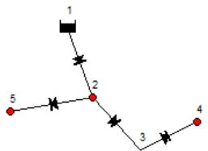
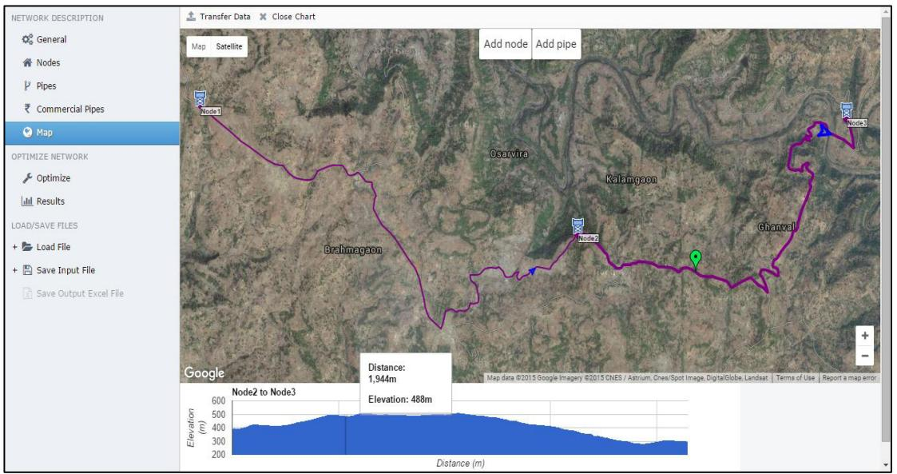

XVIII International Conference on Water Distribution Systems Analysis, WDSA2016

# A System for Optimal Design of Pressure Constrained Branched Piped Water Networks

N. Hoodaa, O. Damanib*

$^{a,b}$ Department of Computer Science and Engineering,

Indian Institute of Technology Bombay, Mumbai, India

# Abstract

Rural water networks in the developing world are typically branched networks with a single water source. The main design decision to be made for such networks is the choice of pipe diameters from a discrete set of commercially available pipe diameters. Larger the pipe diameters, better the service (pressure), but higher is the capital cost. In general, each link (connection between two nodes) in the network can consist of several pipe segments of differing diameters. For such networks, existing design tools solve the constrained-optimization problem heuristically [1] [2]. In [3], an ILP formulation is proposed for the special case of one pipe diameter per link. This means that currently one can either get an optimal solution for the special case of one piped segment per link or get a non-optimal solution for the general case of multiple pipe segments per link. In this work, we come up with a model that solves the general formulation while still maintaining optimality. Our model has an LP formulation. It not only manages to optimally solve the general case, it also has a runtime performance that is better than both the heuristic approach to the general problem as well as the optimal approach to the specific problem (one pipe per link). To aid the designers of piped water networks, we have developed an optimization system called JalTantra that implements this model. It also has GIS functionality integrated for ease of providing network details. It is publicly available at http://www.cse.iitb.ac.in/jaltantra/

© 2016 The Authors. Published by Elsevier Ltd. This is an open access article under the CC BY-NC-ND license

(http://creativecommons.org/licenses/by-nc-nd/4.0/)

Peer-review under responsibility of the organizing committee of the XVIII International Conference on Water Distribution Systems

Keywords: Water distribution network; Network cost optimization; Linear program

* Corresponding author. Tel.: +91-93230-03401. E-mail address: damani@cse.iitb.ac.in

# 1. Introduction

Piped water network cost optimization has been studied for more than 30 years now. Several constrained optimization techniques from Linear Programming [4] to Genetic Algorithms [13] have been employed to solve various variations of the cost optimization problem. In this work, we focus on the cost optimization of rural piped water networks. These networks are typically gravity fed, since reliable electricity supply is not a given. Pumps are deployed only at the water source and not in the rest of the distribution network. Acyclic (branched) networks are common since the redundancy provided by cyclic (looped) networks is an unaffordable luxury.

One of the most important aspects in the design of these systems is the choice of pipe diameters from a discrete set of commercially available pipe diameters. In general, each link (connection between two nodes) can consist of several pipe segments of differing diameters. The larger the pipe diameters, the better the service (pressure), but the higher is the capital cost. The branched piped water network cost optimization problem is the selection of pipe diameters that minimize the system cost while providing the requisite service (pressure at demand points).

BRANCH [1] is an optimization tool by the World Bank that attempts to minimize pipe cost for branched pipe networks with a single water source. Though it has limited capabilities in terms of number of pipes (at most 125), and does not guarantee optimal solution, it is used ([11], [14], [15]) in the developing world as the only alternatives are expensive commercial tools like WATERGEMS [2]. Even WATERGEMS does not guarantee optimal solution since it uses a genetic algorithm.

In [3], an ILP formulation is proposed for the special case of one pipe diameter per link. This means that currently one can either get an optimal solution for the special case of one piped segment per link [3] or get a non-optimal solution for the general case of multiple pipe segments per link [1], [2]. In this work, our aim is to come up with a formulation that solves the general formulation while still maintaining optimality.

For the general problem, in addition to the user provided pressure and flow related constraints, following additional constraint is inferred from [5]: in the optimal solution, each link consists of at most two pipe segments of adjacent diameters from the available diameter set. We take two approaches to the multiple pipes per link formulation. In the first approach, we use the fact that the optimal solution will contain at most two pipe segments per link [5]. In the other approach, we make no assumption on the number of pipe segments per link. Surprisingly, the latter formulation's runtime performance is much better than the former. But knowing the structure of the optimal solution and trying to capture that as a constraint led to a much worse runtime performance! The second formulation solves the problem optimally and efficiently. Its solution indeed only contains at most two pipe diameters for each link in the network. The structure that we were trying to enforce for the first formulation has come out naturally in the second.

Using the general formulation we have implemented a water network design system called JalTantra. The system also has GIS integration for ease of adding network details. The overall goal for JalTantra is wide reaching and will attempt to solve several network design constraints like source selection, storage location/capacity, choice of pipe diameters, water supply scheduling, cost allocation etc. The scope of the present study is restricted to determining the pipe diameters in a single source acyclic (branched) network.

The rest of the paper is structured as follows. Section 2 describes the problem formulation. Section 3 is a brief description of the environment used to build the JalTantra system. Section 4 describes the comparison results of the different models on six different networks. Conclusions and future work directions are presented in Section 5.

# Nomenclature

The total pipe cost which is a function of the pipe diameters chosen for each link

The number of links in the network

$D_{i}$ Pipe diameter for the link $i$

L i Length of link $i$

$C_i$ Cost per unit length of link $i$ , a function of the pipe diameter $D_i$

NP Number of commercially available pipe diameters

$x_{ij}$ boolean variable, 1 if the $i^{th}$ link uses the $j^{th}$ diameter, 0 otherwise

The minimum pressure that must be maintained at node $n$

The head supplied by the reference node $R$

<table><tr><td>En</td><td>The elevation of node n</td></tr><tr><td>Sn</td><td>Set of pipes that connect node n to the reference node R</td></tr><tr><td>HLij</td><td>Headloss in link i due to diameter j</td></tr></table>

# 2. Problem Formulation

# 2.1. Problem Definition

The typical rural piped water network consists of a source MBR (mass balancing reservoir), demand nodes, and pipes connecting them. If required, pumps are used to supply water from a water body to the MBR which then feeds the remaining network by gravity. A gravity fed network has its MBR located at a higher elevation so that no pumping is required for the downstream network. An example network is shown in Figure 1. It consists of 5 nodes and 4 links. Node 1 is the source for the network, and nodes 2, 4 and 5 are the demand points. Node 3 is a zero demand node. Such nodes are typically introduced at intermediate points of high elevation.

  
Fig.1.Gen_5 network

Nodes in the network have water demands and minimum pressure requirements that must be maintained. The design process involves selecting the diameters for the pipes that must be used to supply these nodes. Lower the diameter, lower is the cost of the pipes. But lower diameters cause higher friction losses in the pipes which may lead to insufficient pressures at the demand nodes. Therefore the optimization goal is to minimize pipe cost under the constraint of minimum pressure requirements at the demand nodes. The choice of diameter is to be made from a discrete set of commercial pipe diameters that are available.

Rural piped water networks are typically branched (acyclic) as compared to urban networks which are frequently looped. In our present study we restrict ourselves to single source acyclic piped water networks. Since the network is acyclic, flow in each link can be computed easily from the node demands. The pumping from source to MBR is not considered. Instead we assume a source that is able to maintain the supply of water at the given head (head at a point is the height to which water naturally rises. The pressure at a point is the difference between its head and elevation.). Formally, we are solving the following optimization problem:

- Input: Source node<head>, Nodes<elevation, water demand, minimum pressure requirement>, Link<start/end node, length>, Commercial pipe diameter<cost per unit length, roughness>   
- Output: Length and diameter of pipe segments for each link   
Objective: Minimize total pipe cost   
Constraints:

Pressure at each node must exceed minimum pressure specified   
$\bigcirc$ Water demand must be met at each node   
$\bigcirc$ Pipe diameters can only take values from provided commercial pipe diameters

# 2.2. One Pipe Per Link

[3] has an Integer Linear Programming (ILP) formulation for the problem where only one pipe diameter is used per link. It uses binary variables to represent the choice of commercial pipe to be made for each link. Henceforth we use the term OnePipe model while referring to this formulation.

# 2.2.1. The Objective Function:

The objective function to be minimized is the total cost of the pipes chosen for the links in the network. The diameters $\mathrm{D_i}$ can only be chosen from the set of available commercial pipe diameters. This restriction is represented via binary variables $x_{ij}$ . The objective function is:

$$
O (.) = \sum_ {i = 1} ^ {N L} \sum_ {j = 1} ^ {N P} L _ {i} C _ {i j} \left(D _ {i j}\right) x _ {i j}
$$

# 2.2.2. Pipe constraint:

For each link the objective function has terms for each of the available commercial pipe diameters. Since each link is to be installed with only one diameter, it means that exactly one of the binary variables corresponding to each link must be one. Therefore we get the following pipe constraint for each link $i$ :

$$
\sum_ {j = 1} ^ {N P} x _ {i j} = 1
$$

# 2.2.3. Node constraint:

At each node a minimum amount of pressure needs to be maintained. The pressure at any node is calculated from the headloss in the pipes connecting the node to the reference node i.e. the source for the network. We use the Hazen-Williams formula for headloss. Therefore the pressure constraint for each node $n$ is:

$$
P _ {n} \leq H _ {R} - E _ {n} - \sum_ {i \in S _ {n}} \sum_ {j = 1} ^ {N P} H L _ {i j} x _ {i j}
$$

$$
H L _ {i j} = \frac {1 0 . 6 8 * L _ {i} * \frac {f l o w _ {i}}{r o u g h n e s s _ {j}} ^ {1 . 8 5 2}}{d i a m e t e r _ {j} ^ {4 . 8 7}}
$$

# 2.3. Two Pipes Per Link

The previous formulation assumes a single pipe diameter for each link in the network. But this might not be (and usually isn't) the optimal solution. In the most general case, we could have several pipes of varying diameters for a single link in the network. In [5] it is shown that in the optimal solution each link will consist of at most two pipe segments of adjacent diameters. The above will hold if the commercial pipe cost is a convex function of a power of its diameter, which is the case in practice. To incorporate this knowledge about optimal solution structure we modify the objective function, as given next.

# 2.3.1. The Objective Function:

To generalize the formulation in order to account for multiple pipes per link we introduce two new continuous variables for each link: $l_{i1}$ and $l_{i2}$ . The previous boolean variable representing the choice of commercial pipe for each link is now broken into two: $x_{ij1}$ and $x_{ij2}$ . Here $l_{i1} / l_{i2}$ represent the length of the two pipes for link $i$ and $x_{ij1} / x_{ij2}$ represent the choice of diameters for the two pipes. The modified objective function is:

$$
O (.) = \sum_ {i = 1} ^ {N L} \sum_ {j = 1} ^ {N P} C _ {i j 1} \bigl (D _ {i j 1} \bigr) l _ {i 1} x _ {i j 1} + C _ {i j 2} (D _ {i j 2}) l _ {i 2} x _ {i j 2}
$$

This formulation is not linear since we have products like $l_{i1} * x_{ij1}$ both of whose terms are variables. We linearize this equation by introducing $z_{ij1}$ :

$$
z _ {i j 1} = l _ {i 1} x _ {i j 1}
$$

This nonlinear equality is represented by the following set of linear inequalities:

$$
z _ {i j 1} \leq L _ {i} x _ {i j 1}, \qquad z _ {i j 1} \leq l _ {i 1}, \qquad z _ {i j 1} \geq l _ {i 1} - L _ {i} (1 - x _ {i j 1})
$$

A similar set of inequalities will be introduced for $z_{\mathrm{ij2}}$ as well. This linearization is possible since $z$ is a product of a continuous variable and a boolean variable. Our new objective function:

$$
O (.) = \sum_ {i = 1} ^ {N L} \sum_ {j = 1} ^ {N P} C _ {i j 1} \big (D _ {i j 1} \big) z _ {i j 1} + C _ {i j 2} (D _ {i j 2}) z _ {i j 2}
$$

# 2.3.2. Pipe Constraint

As before, the choice of pipe diameter must be made from the available commercial pipe diameters.

$$
\sum_ {j = 1} ^ {N P} x _ {i j 1} = 1
$$

Similar equalities hold for $x_{ij2}$ . We also have following additional constraint for each link $i$ .

$$
l _ {i 1} + l _ {i 2} = L _ {i}
$$

# 2.3.3. Node Constraint

The node constraint for minimum pressure requirement now changes since length of each pipe segment is no longer a constant. The node constraint in each link $i$ now becomes: (possible since $HL_{ij}$ is linear in the length of the pipe)

$$
P _ {n} \leq H _ {R} - E _ {n} - \sum_ {i \in S _ {n}} \sum_ {j = 1} ^ {N P} H L _ {i j} ^ {\prime} (z _ {i j 1} + z _ {i j 2})
$$

$$
H L _ {i j} ^ {\prime} = \frac {1 0 . 6 8 * \frac {f l o w _ {i}}{r o u g h n e s s _ {j}} ^ {1 . 8 5 2}}{d i a m e t e r _ {j} ^ {4 . 8 7}}
$$

# 2.3.4. Performance

On testing the new formulation, the runtime performance is found to be very poor. Whereas for the OnePipe model a 100 node network can be solved in 1.5 seconds, the new formulation cannot solve optimally even a 10 node network before getting timed out at 100 seconds.

The reason for this is the large number of new constraints that are added to the system. Previously all constraints were linear in the number of nodes. We had only one constraint for each link and one for each node (for an acyclic network number of links is one less than the number of nodes). But now, in order to introduce $z_{ij1}$ and $z_{ij2}$ , we have introduced 6 new constraints for each (link, pipe diameter) combination.

# 2.4. Proposed Model

In the previous formulation to introduce multiple pipes per link, we determine the lengths of the two pipes in the link and independently assign a commercial pipe diameter to each. This causes a blowup in the number of constraints.

To overcome this, we ignore the two pipe segment structure and model each link as being made up of pipes for each possible commercial pipe diameter. All that remains is to determine the length of each component. No explicit choice is made as to which pipe diameter is chosen. The pipe component is chosen if it has non-zero length.

We introduce continuous variables $l_{ij}$ and do away with the binary choice variables $x_{ij}$ . Each link is made up of NP components corresponding to the NP pipe diameters. $l_{ij}$ then represents the length of each of these components.

# 2.4.1. The Objective Function:

We replace the terms $l_{i}^{*}x_{ij}$ with $l_{ij}$ in our objective cost:

$$
O (.) = \sum_ {i = 1} ^ {N L} \sum_ {j = 1} ^ {N P} C _ {i j} (D _ {i j}) l _ {i j}
$$

# 2.4.2. Pipe constraint:

Now the pipe constraint simply reduces to:

$$
\sum_ {j = 1} ^ {N P} l _ {i j} = L _ {i}
$$

# 2.4.3. Node constraint:

In the node constraint we replace $x_{ij} * L_i$ with $l_{ij}$ :

$$
P _ {n} \leq H _ {R} - E _ {n} - \sum_ {i \in S _ {n}} \sum_ {j = 1} ^ {N P} H L _ {i j} ^ {\prime} l _ {i j}
$$

We now have a more general formulation for our pipe diameter optimization problem. If the necessary convexity conditions [5] are met, our solution should naturally contain only two pipes per link with adjacent diameters.

As in the case of OnePipe the number of constraints is linear in the number of nodes and the performance turns out to be much better. Table 1 shows the size of model in terms of variables and constraints for the two approaches.

Table 1: Model Size (m is the number of pipe diameters which is taken as 10)   

<table><tr><td></td><td colspan="2">Two Pipe Approach</td><td colspan="2">General Approach</td></tr><tr><td>Node</td><td>Constraints</td><td>Variables</td><td>Constraints</td><td>Variables</td></tr><tr><td>N</td><td>6n + 8nm</td><td>2n + 4nm</td><td>2n</td><td>nm</td></tr><tr><td>10</td><td>860</td><td>420</td><td>20</td><td>200</td></tr><tr><td>100</td><td>8600</td><td>4200</td><td>200</td><td>2000</td></tr></table>

For a 100 node network we have around 200 inequalities for the general formulation. But for the two-pipe model, a network with just 10 nodes the number of constraints is around 800! Also by eliminating binary variables and replacing them with continuous variables we have converted what is an Integer Linear Program (ILP) to a Linear Program (LP). While ILPs are NP hard [12], LPs can be solved in Polynomial time [6]. This is very significant since we are able to solve the LP formulation of a 1000 node network in two seconds even though it contains 2000 constraints.

# 3. JalTantra System Description

The above model has been implemented in the JalTantra system. The implementation is done using Java 7 [9] and GLPK 4.55 [8] Linear Program Solver. Java ILP 1.2a [10] is used as the Java interface to the GLPK library. It also uses Google Maps API [7] for GIS functionality which allows the user to easily mark the network details as well as extract information like node elevation and pipe lengths. A sample use case is shown in figure 2 below. The system is freely available at http://www.cse.iitb.ac.in/jaltantra.

  
Fig. 2. GIS feature in JalTantra

# 4. Results

We have tested the OnePipe, our proposed model as well as BRANCH over six different networks. Three of these are real world examples from villages of Thane district in Maharashtra, India. The other three networks are artificially generated to test the system performance over a range of network sizes. Both the OnePipe model and the proposed model are tested using the GLPK LP solver library. A timeout of 100 seconds is used. If the timeout period elapses, the solver outputs the best feasible result found so far rather than the global optimum.

Table 2 presents the performance in terms of objective cost as well as running time of the three methods over all 6 test networks. For the Gen_100 network, BRANCH terminated with a memory overflow message. Since the stated maximum number of nodes is 125, the Gen_1000 network is not run on BRANCH.

The time taken by both the OnePipe model and our proposed model is less than half a second for the first four networks. But the ILP vs. LP nature is borne out for the two larger networks. In fact, for the Gen_1000 the OnePipe model also gets timed out.

Being optimal, our proposed model indeed outperforms both BRANCH and the OnePipe model for all six networks in terms of objective cost. Both BRANCH and our proposed model use a more general formulation and hence better cost results are to be expected. Our model performs better than BRANCH since we use a LP formulation that is solved optimally whereas BRANCH uses a heuristic approach. In fact, for two of the first four networks even the OnePipe model performs better than BRANCH.

Table 2: Comparison of Performance over all six networks

<table><tr><td rowspan="2">Network</td><td rowspan="2">Number of Nodes</td><td colspan="2">BRANCH</td><td colspan="2">OnePipe Model</td><td colspan="2">Proposed Model</td></tr><tr><td>Cost (1000 Rs)</td><td>Time (msec)</td><td>Cost (1000 Rs)</td><td>Time (msec)</td><td>Cost (1000 Rs)</td><td>Time (msec)</td></tr><tr><td>Mokhada</td><td>37</td><td>24,652</td><td>119380</td><td>24,317</td><td>429</td><td>24,181</td><td>387</td></tr><tr><td>Shahpur</td><td>21</td><td>29,082</td><td>34878</td><td>29,523</td><td>356</td><td>28,895</td><td>318</td></tr><tr><td>Khardi</td><td>11</td><td>21,281</td><td>4207</td><td>21,267</td><td>256</td><td>21,184</td><td>247</td></tr><tr><td>Gen_5</td><td>5</td><td>1958</td><td>1105</td><td>2020</td><td>243</td><td>1949</td><td>228</td></tr><tr><td>Gen_100</td><td>100</td><td>-</td><td>-</td><td>93,718</td><td>1531</td><td>90,512</td><td>628</td></tr><tr><td>Gen_1000</td><td>1000</td><td>-</td><td>-</td><td>5,80,578</td><td>Timeout</td><td>5,62,564</td><td>2023</td></tr></table>

# 5. Conclusions

For the cost optimization of piped water networks, we have presented a general formulation that is optimal as well as faster than both the previous formulations for the specific problem of one pipe segment per link, and the heuristic approach used in available software. In the process, we found that, quite counter-intuitively, modeling of inferred constraints that capture the structure of the optimal solution worsens the runtime performance. We have implemented our solution in a water network design system JalTantra. JalTantra also has GIS integration for ease of adding network details to the optimization engine.

Reservoir costs are an important component of the capital cost of a piped water network. Reservoir locations and elevations are currently inputs to the optimizer. But these can also be made variables and be part of the optimization problem by adding the reservoir costs to the objective function and adding relevant constraints relating to allocation of nodes to reservoirs.

# References

[1] Prasad M. Modak, Juzer Dhoonia, "A Computer Program in Quick BASIC for the Least Cost Design of Branched Water Distribution Networks." UNDP/ World Bank, Asia Water Supply and Sanitation Sector Development Project, RAS/86/160, December 1991.   
[2] Wu, Zheng Yi. "Genetic algorithm plays a role in municipal water systems." ACM SIGEVOLution 1.4 (2006): 2-8.   
[3] Samani, Hossein MV, and Alireza Mottaghi. "Optimization of water distribution networks using integer linear programming." Journal of Hydraulic Engineering 132.5 (2006): 501-509.   
[4] Alperovits, E., and U. Shamir. "Design of optimal water distribution systems." Water resources research 13.6 (1977): 885-900.   
[5] Fujiwara, Okitsugu, and Debashis Dey. "Two adjacent pipe diameters at the optimal solution in the water distribution network models." Water Resources Research 23.8 (1987): 1457-1460.   
[6] Karmarkar, Narendra. "A new polynomial-time algorithm for linear programming." Proceedings of the sixteenth annual ACM symposium on Theory of Computing. ACM, 1984.   
[7] Google Maps API Reference - https://developers.google.com/maps/documentation/javascript/reference (May, 2016)   
[8] GLPK (GNU Linear Programming Kit) - https://www.gnu.org/software/glpk/ (May, 2016)   
[9] Java 7 - https://java.com/en/download/index.jsp (September, 2014)   
[10] Java ILP, Java interface to ILP solvers - http://javilp.sourceforge.net/ (May, 2016)   
[11] Nikhil Hooda, Rajaram Desai, and Om P. Damani. "Design and Optimization of Piped Water Network for Tanker Fed Villages in Mokhada Taluka" Technical Report No. TR-CSE-2013e-55, 2013, Dept. of Computer Science and Engineering, IIT Bombay.   
[12] Papadimitriou, Christos H. "On the complexity of integer programming." Journal of the ACM (JACM) 28.4 (1981): 765-768.   
[13] Savic, Dragan A., and Godfrey A. Walters. "Genetic algorithms for least-cost design of water distribution networks." Journal of Water Resources Planning and Management 123.2 (1997): 67-77.   
[14] Vyas, Janki H., Narendra J. Shrimali, and Mukesh A. Modi. "Optimization of Dhrafad Regional Water Supply Scheme using Branch 3.0." IJIRSET 2014   
[15] Yugandhara Lad, J S Main, and S D Chawathe. "Optimization of Hydraulic Design of Water Supply Tree Network Based on Present Worth Analysis." Journal of Indian Water Works Association. 2012