# 基于一致性算法的多虚拟同步机功率振荡协调抑制

林继灿，刘沈全，王钢，黄敏

（华南理工大学电力学院，广东省 广州市 510640）

# Coordinated Power Oscillation Suppression of Multi-VSG Based on Consensus Algorithm

LIN Jican, LIU Shenquan, WANG Gang, HUANG Min

(School of Electric Power Engineering, South China University of Technology, Guangzhou 510640, Guangdong Province, China)

ABSTRACT: While simulating the characteristics of synchronous generators to provide the inertia support, the virtual synchronous generator (VSG) inevitably leads to the problem of active power oscillation. Especially in the case of multi-VSG interacting, the low mutual damping between VSGs intensifies the oscillation volatility, which may damage the stable operation of the system and the effective regulation of the renewable energy. Currently, in the methods of using the distributed communication architectures to suppress the multi-VSG active power oscillation, the optimization of active power output and the algorithm convergence under the non-ideal communication conditions are often neglected. Hence, to suppress the power oscillations of the system and improve the mutual damping, firstly, the principle of parallel and interactive oscillation of the VSG system is analyzed. Simultaneously, the performance evaluation function constructed by using the power angle is applied to derive the consensus algorithm for increasing the mutual damping so that the frequency of VSG in the system under disturbance may converge more quickly and achieve consensus. Secondly, the stability of the system is proved by constructing the Lyapunov energy function. On this basis, the influence of mutual damping parameters on the stability of the system is analyzed by using the Nyquist curve in the frequency domain. Finally, the electromagnetic transient simulation proves that the mutual damping consistency algorithm is able to effectively suppress the power oscillation of the parallel VSG system, and also ensure the effectiveness of the algorithm in the non-ideal communication environment.

KEY WORDS: virtual synchronous generator; power oscillation; mutual damping; consensus algorithm; Lyapunov function

摘要：虚拟同步机控制(virtual synchronous generator，VSG)在模拟同步发电机特性以提供惯量支撑的同时，不可避免地引入了有功功率振荡的问题，特别在多个 VSG 交互的情形

下，VSG 之间较低的互阻尼加剧了振荡的波动性，这些振荡将损害系统的稳定运行和可再生能源的有效调节。目前，在采用分布式通信架构抑制多 VSG 并联有功振荡的方法中，未考虑有功合理出力以及非理想通信条件下算法收敛等问题。因此，为抑制系统功率振荡，提高系统之间的互阻尼，首先分析了 VSG 系统并联交互振荡的原理，同时利用功角构造性能评价函数，推导出一种增加互阻尼的一致性算法，使得扰动下系统内 VSG 的频率快速收敛达到一致。其次通过构造李雅普诺夫能量函数的方法证明了所提方法的稳定性，在此基础上，利用频域的 Nyquist曲线分析互阻尼参数对系统稳定性的影响。最后，通过电磁暂态仿真证明了互阻尼的一致性算法能有效抑制并联 VSG 系统的功率振荡，同时在非理想通信环境下也能保证算法的有效性。

关键词：虚拟同步机；功率振荡；互阻尼；一致性算法；李雅普诺夫能量函数

DOI：10.13335/j.1000-3673.pst.2022.1847

# 0 引言

随着不同一次能源(风能、太阳能、水、天然气、燃料电池等)的逆变器接口分布式能源(distributedenergy resources，DER)发电在电力系统中的普及，给传统电力系统的运行带来了新的挑战。虚拟同步发电机(virtual synchronous generator，VSG)[1-6]为电网提供惯性支持，使得逆 变 型 分 布 式 电 源(distributed generator, DG)的 VSG 控制成为全球关注的焦点。

然而，VSG控制技术在改善系统暂态响应特性的同时，也引入了同步机的振荡特性, 这些新出现的振荡将损害系统的稳定运行和可再生能源的有效调节。为此，许多附加阻尼的方法被提出。在文献[7]中，通过使用锁相环估计频率来实现额外的阻尼效应。但是这种方法需要考虑锁相环的稳定性问题。文献[8-9]中引入了实际功率和虚拟功率的导

数，其效果与增加阻尼系数的效果相同。文献[10-11]探讨了虚拟阻抗的阻尼效应，并提出了一种动态虚拟阻抗来抑制振荡，但是，此方法容易造成电能质量下降，同时影响微电网整体的稳定裕度。此外，一系列利用角速度和角加速度的自适应惯性方法[12-13] 被提出。然而，上述研究针对的是单逆变器系统，没有考虑多逆变器之间的相互作用。

与单个 VSG 对比，多个 VSG 中的功率振荡更为剧烈[14]。文献[15-16]指出，当多个 VSG 并联运行时，由于并联的 VSGs 间缺乏互阻尼而容易引起功率振荡。文献[17]利用惯性中心来抑制 VSGs 并联系统的功率振荡。但是，它必须依赖于中央控制器，缺乏扩展的灵活性。文献[18]利用广义 Nyquist判据分析建立的阻抗模型，认为系统中的惯性和阻尼是造成系统振荡的主要原因，同时利用阻尼比改善系统的动态稳定性，但是文献中对阻尼比的选取没有明确的结论。文献[19]提出了一种粒子群优化算法来寻找最佳参数，以提高系统稳定性。然而，没有进一步分析振荡期间 DG 之间的相互作用。文献[20]利用发电频率过渡的一致性进行惯量的匹配，提高 VSG 并联系统的暂态稳定性。但是这种策略对系统参数精度要求较高，鲁棒性弱。文献[21]使用分散式互阻尼控制，利用功率的微分进行互阻尼的增加，有效抑制了多VSG系统的功率振荡。但是没有考虑有功出力合理分配的问题。文献[22-23]提出了具有更简单通信网络的分布式控制，有效地实现系统二次控制的同时提高了系统的暂态稳定性。其使用的模态分析方法只是对 2 个交互系统进行分析，无法分析多个 VSG 的并联振荡问题，同时也没有考虑到系统有功出力合理分配的问题。文献[24]利用一致性算法构造二次调频控制策略，抑制了多 VSG 系统的功率振荡，同时合理分配有功功率。但是其中的功率分配并没有考虑到有功调度优化问题，也没有对算法在非理想通信环境下进行分析。基于一致性算法的分布式控制在利用简单的通信网络后，只需对相互通信的网络进行点对点的交互，即可实现协调优化控制，是解决多 VSG 协调运行控制的有效解决手段[25]。部分结合一致性算法抑制 VSG 功率振荡的控制策略，能在一定程度上解决多台 VSG 并联运行时的有功振荡问题，但同时考虑有功出力合理分配以及改善算法在非理想通信环境下的收敛性上研究仍有不足。

目前基于有功调度一致性算法中都需要进行全局功率信息的求和，以功率的变化值作为调整项，完成系统的全局供需功率平衡[26]。文献[27]利

用一致性协同控制方法来进行多 VSG 的有功和无功的功率分配，但是算法仍需要计算出公共节点(point of common coupling，PCC)的总功率值。文献[28-30]在DGs中使用有功调度一致性算法时，同样需要对所有当前的发电机输出功率进行求和。这些算法，都需要一个集中式处理器对智能体信息进行求和，这就使得算法并不是完全意义上的分布式。为此，文献[31-32]提出利用频率交互信息代替功率交互信息，有效实现了算法的分布式控制。

综上所述，一致性分布式算法在微电网运行控制与调度中已经取得了广泛应用，但应用于多 VSG系统中功率振荡以及互阻尼的研究仍然不足。为改善 VSGs 间的功率振荡，实现有功功率的分布式控制，本文利用 VSG 的功角构造性能评价函数，对一致性算法中的调整项进行改进，增加系统间的互阻尼，解决了扰动下 VSG 之间的瞬时有功功率振荡问题。通过构造能量函数的方法证明了控制系统的稳定性以及利用 Nyquist 曲线分析互阻尼参数的特性。同时，考虑非理想通信网络下算法的收敛性，利用增益调整函数，提高算法的收敛鲁棒性。最后，通过电磁暂态仿真，验证所提方法的正确性和有效性。

# 1 VSG 功率振荡分析

# 1.1 VSG 控制

附录图 A1显示的是 VSG控制的原理图。VSG通过模拟同步电机的转子运动方程来模拟同步电机的惯量和阻尼，转子运动方程如下：

$$
\left\{ \begin{array}{l} J \frac {\mathrm {d} \omega}{\mathrm {d} t} = \frac {P _ {\mathrm {m}}}{\omega_ {0}} - \frac {P _ {\mathrm {e}}}{\omega_ {0}} - D \left(\omega - \omega_ {0}\right) \\ \frac {\mathrm {d} \theta}{\mathrm {d} t} = \omega \end{array} \right. \tag {1}
$$

式中：J 为虚拟的转动惯量；D 为阻尼系数；和$\omega _ { 0 }$ 分别为虚拟的角频率和角频率初值；为同步发电机相角度。VSG 输出的有功功率为 $P _ { \mathrm { ~ e ~ } }$ ，有功功率参考值 $P _ { \mathrm { { m } } }$ 可以用方程 $P _ { \mathrm { m } } { = } P _ { \mathrm { r e f } } { + } K _ { \mathrm { f } } ( \omega _ { n } { - } \omega )$ 来获得，$K _ { \mathrm { f } }$ 为频率下垂系数， $P _ { \mathrm { r e f } }$ 为有功功率的给定值。

VSG 通常采用积分下垂控制模拟同步电机励磁器的无功-电压下垂特性，表达式为

$$
\left\{ \begin{array}{l} Q _ {\mathrm {m}} = Q _ {\mathrm {r e f}} + K _ {v} \left(U _ {\mathrm {n}} - U\right) \\ e _ {d} = \frac {K}{s} \left(Q _ {\mathrm {m}} - Q _ {\mathrm {e}}\right) \end{array} \right. \tag {2}
$$

式中： $e _ { d - q }$ 为无功–电压下垂控制输出的电压值；K为积分系数； $U _ { \mathfrak { n } }$ 为电压额定值；U 为 VSG 的输出电压； $K _ { \nu }$ 为下垂系数； $\mathcal { Q } _ { \mathrm { m } }$ 为无功功率参考值； $\mathcal { Q } _ { \mathrm { r e f } }$

为有功功率的给定值； $\mathcal { Q } _ { \mathrm { e } }$ 为 VSG 的无功功率输出。

虚拟阻抗回路用于调整逆变器的输出阻抗，其状态方程为

$$
\left\{ \begin{array}{l} u _ {o d} ^ {*} = e _ {d} - r _ {v} i _ {o d} + \omega L _ {v} i _ {o q} \\ u _ {o q} ^ {*} = e _ {q} - r _ {v} i _ {o q} - \omega L _ {v} i _ {o d} \end{array} \right. \tag {3}
$$

式中： $r _ { \nu }$ 和 $L _ { \nu }$ 分别为虚拟电阻和电感； $\dot { u _ { o d - q } } ^ { \dot { } }$ 为 $d q$ 轴上电压环的输入； $i _ { o d - q }$ 为 VSG 在 $d q$ 轴上的输出电流。

电压控制和电流控制使用传统的 PI 控制器，VSG 输出的有功功率和无功功率，由 VSG 的瞬时功率通过低通滤波器(low pass filter，LPF)得到。

# 1.2 振荡分析

以图 1 所示的 2 个并联 VSG 之间的负载分担进行分析，各 DG 连接在同一条交流母线上。 $X _ { \mathrm { l s } }$ 和 $X _ { 2 \mathrm { s } }$ 是相应的输出滤波器电抗， $X _ { \mathrm { l g } }$ 和 $X _ { 2 \mathrm { g } }$ 为线路阻抗。虽然微网电阻比例较高，但电抗项仍然是线路阻抗特性的主导成分，线路传输功率更多受两端相差影响。因此，为简化分析，考虑线路阻抗为感性[17]，第 i个 VSG 系统输出的有功功率描述为

$$
P _ {e i} = \sum_ {j = 1, \dots n} ^ {j \neq i} \frac {U _ {i} U _ {j}}{X _ {i j}} \sin \left(\delta_ {i j}\right) \tag {4}
$$

式中： $X _ { i j }$ 为第 i 个 VSG 和节点 j 之间的总阻抗；$U _ { i }$ 和 $U _ { j }$ 分别为第 i 个 VSG 和节点 j 的电压值； $\delta _ { i j }$ 为功角。

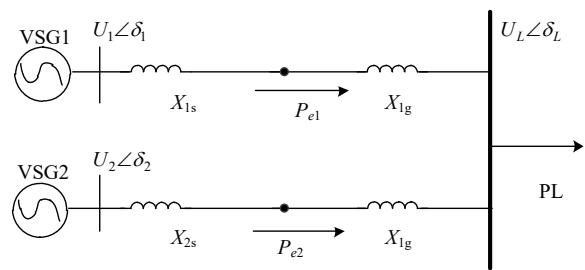  
图1 VSG 并联系统简化拓扑结构  
Fig. 1 Simplified topology of VSG parallel system

当负载扰动加入时，功角的变化可以描述为$\delta _ { i j } { = } \delta _ { i j 0 } { + } \Delta \delta _ { i j }$ $\delta _ { i j 0 }$ 为初始值， $\Delta \delta _ { i j }$ 为偏差量。式(4)可以描述为

$$
P _ {e i} = \sum_ {j = 1, \dots , n} ^ {j \neq i} \frac {U _ {i} U _ {j}}{X _ {i j}} \sin \left(\delta_ {i j 0}\right) + \sum_ {j = 1, \dots , n} ^ {j \neq i} \frac {U _ {i} U _ {j}}{X _ {i j}} \cos \left(\delta_ {i j 0}\right) \Delta \delta_ {i j} \tag {5}
$$

式(5)中第 1 项表示扰动前的潮流状态，第 2项表示第 i 个 VSG 的功率偏差。定义 $k _ { i j } { = } U _ { i } U _ { j } { \cos } ( \delta _ { i j 0 } ) /$ $X _ { i j } { \mathrm { : } }$ ，则功率偏差可以描述为

$$
\Delta P _ {e i} = \sum_ {j = 1, \dots n} ^ {j \neq i} k _ {i j} \Delta \delta_ {i j} = \sum_ {j = 1, \dots n} ^ {j \neq i} k _ {i j} \frac {\Delta \omega_ {i} - \Delta \omega_ {j}}{s} \tag {6}
$$

式中： $k _ { i j }$ 是一个同步转矩系数，它决定了 VSG 保持与电网同步的强度； $\Delta \omega _ { i }$ 为 $\mathrm { V S G } _ { i }$ 的角频率偏差。

由式(6)可知， $\delta _ { i } = \int ( \omega _ { i } - \omega _ { 0 } ) \mathrm { d } t .$ 。 $\omega _ { i }$ 可以由式(1)获得，因此， $\delta _ { i j }$ 的动态特能由 VSG 的转子运动方程决定。结合文献[17]和[23]可得，多 VSG 并联运行时，控制参数不同会造成各 VSG 产生的角加速度不同，从而具不同的动态响应速度。直接导致 VSG并联运行的频率振荡进而引起了有功振荡。当 VSG之间的互阻尼足够大，在负载扰动加入时， $\Delta P _ { e i }$ 发生的振荡衰减会更快，系统输出功率则越平滑。

由式(1)可得系统在负荷波动情况下 VSG 的输出频率特性传递函数：

$$
G _ {i} (s) = \frac {\Delta \omega_ {i}}{\Delta P _ {e i}} = - \frac {1}{J _ {i} \omega_ {0} s + \left(K _ {f i} + D _ {i} \omega_ {0}\right)} \tag {7}
$$

结合式(4)和式(7)，可得 VSG 的小信号状态空间方程为

$$
\left[ \begin{array}{l} \frac {\mathrm {d} \Delta \delta_ {i}}{\mathrm {d} t} \\ \frac {\mathrm {d} \Delta \omega_ {i}}{\mathrm {d} t} \end{array} \right] = \left[ \begin{array}{c c} 0 & 1 \\ - \frac {S _ {a i}}{J _ {i} \omega_ {0}} & - \frac {S _ {b i}}{J _ {i} \omega_ {0}} \end{array} \right] \left[ \begin{array}{l} \Delta \delta_ {i} \\ \Delta \omega_ {i} \end{array} \right] \tag {8}
$$

式中： ${ \cal S } _ { a i } { = } U _ { i } U _ { j } / X _ { i j } ;$ ； $S _ { b i } { = } K _ { f i } { + } D _ { i } \omega _ { 0 }$ 。

根据式(8)可知系统的特征值为 $\lambda _ { i } { = } { - } S _ { b i } / ( J _ { i } \omega _ { 0 } ) { \pm }$ $[ ( S _ { b i } / ( J _ { i } \omega _ { 0 } ) ) ^ { 2 } - S _ { a i } / ( J _ { i } \omega _ { 0 } ) ] ^ { 1 / 2 }$ 。在考虑阻尼对系统稳定性的影响时，固定 $J _ { i }$ 的值。由系统的特征值可知， $S _ { b i }$ 决定了系统阻尼对稳定性的影响。当给 VSG 附加阻尼时，可以利用相邻的频率信息构造新的交互阻尼项，改进 $S _ { b i }$ 。使得系统在发生振荡时，定量增大自阻尼，此增大部分为机组间的交互阻尼。

VSG的转动惯量可用惯性时间常数 H衡量：

$$
H = \frac {J \omega_ {0} {} ^ {2}}{S _ {\text {b a s e}}} \tag {9}
$$

式中：H 为惯性时间常数， $S _ { \mathrm { b a s e } }$ 为 VSG 的额定容量。

根据文献[33]可知，H 越大，VSG 的惯性越大，在变化或扰动后，响应越慢，频率偏差越小。此时，VSG 只需要具有较小的阻尼即可。反之同理。

综上所述，为了提升多机交互系统在扰动介入时的动态性能，本文利用一致性算法对相邻的频率信息进行交互，在控制中增加交互阻尼。一致性算法在迭代过程中，会使得一致性变量趋近于 0。当以频率变化作为一致性变量时，可以加快频率达到稳定时的状态，即 $\Delta \omega { = } 0$ 。使得 VSG 在动态运行过程中，惯性较小的 VSG 同时具有较大的阻尼，惯性较大的 VSG 具有较小的阻尼。此时，在动态过程中各 VSG 的输出频率变化差异减小，从而快速

收敛达到一致，提升系统的动态性能。

# 2 一致性互阻尼算法

# 2.1 一致性算法

如果存在传输线路 ij 连接 DGi 和 DGj，则 DGj被视为在 $N _ { i }$ 的邻域集中，表示 $j \in N _ { i }$ 。DGi 只能从通信系数 $a _ { i j } { = } 1$ 的相邻 $N _ { i }$ 中接收信息，否则 $a _ { i j } { = } 0$ 。可用对称 nn 阶邻接方程 $\scriptstyle A = ( a _ { i j } ) _ { n \times n }$ 表示。定义通信机组间的权重：

$$
d _ {i j} = a _ {i j} / \left(\sum_ {j = 1} ^ {N _ {i}} a _ {i j}\right) \tag {10}
$$

此外，系统的 Laplacian 矩阵为 $\pmb { L } \mathrm { = } ( l _ { i j } ) _ { n \times n } ,$ ，其中，$l _ { i j } { = } { - } a _ { i j } , l _ { i i } = \sum _ { j = 1 , j \neq i } ^ { n } a _ { i j }$ 。本文采用一致性算法设计相邻信息的交互。对于 n节点的分布式系统，各节点的一致性变量 $x _ { i }$ 根据其邻接节点的一致性变量进行调整，随着迭代次数的逐步增加，任意相邻节点的一致性变量 $x _ { i } , ~ x _ { j }$ 趋于一致，满足 $| x _ { i } ( k ) - x _ { j } ( k ) |  0$ ，当所有节点的状态变量在收敛条件范围内达到一致时系统收敛[29]，一阶一致性算法描述为

$$
\dot {x} _ {i} = - \sum_ {j = 1} ^ {N _ {i}} d _ {i j} \left(x _ {i} - x _ {j}\right) \tag {11}
$$

式中： $i { = } 1 , 2 , . . . , n$ ，n 为网络中的机组总数； $x _ { i }$ 为迭代的信息。

对式(11)进行离散化可得：

$$
x _ {i} (k + 1) = x _ {i} (k) + \sum_ {j = 1} ^ {N _ {i}} d _ {i j} \left(x _ {j} (k) - x _ {i} (k)\right) \tag {12}
$$

# 2.2 互阻尼策略

结合离散型一致性算法，传统的以有功功率为调节项的分布式一致性算法可表示[31]为

$$
\left\{ \begin{array}{l} \lambda_ {i} (k + 1) = \sum_ {j = 1} ^ {N _ {i}} d _ {i j} \lambda_ {j} (k) + f _ {\mathrm {o b} - i} (k) \\ f _ {\mathrm {o b} - i} (k) = \varepsilon \Delta P _ {m i} (k) \\ \lambda_ {i} (k) = 2 a _ {i} P _ {m i} (k) + b _ {i} \\ C _ {i} \left(P _ {m i}\right) = a _ {i} P _ {m i} ^ {2} + b _ {i} P _ {m i} + c _ {i} \end{array} \right. \tag {13}
$$

式中： $C _ { i }$ 为每个发电机组的成本函数； $\Delta P _ { m i }$ 为功率不平衡值；为收敛因子； $a _ { i } , b _ { i }$ 和 $c _ { i }$ 代表成本系数；$f _ { \mathrm { o b } \ i } ( k )$ 代表调整项，主要描述一致性变量收敛过程中与理想值的差距。当目标达到理想变量时，调整项 $f _ { \mathrm { o b } \_ i } ( k ) { = } 0$ 。在一致性算法迭代过程中，一致性项$\sum _ { j = 1 } ^ { N i } d _ { i j } \lambda _ { j } ( k )$ 可以在较短的迭代次数内收敛，因此，可以近似得到 $\lambda _ { j } ( k ) { = } \lambda _ { j } ( k { - } 1 ) { + } f _ { \mathrm { o b } } \ _ { i } ( k )$ 。

从式(13)可以看出，利用功率信息进行交互时，需要对各 DG 的实时功率进行收集，计算总的供需功率偏差。因此，利用 DG 的频率信息来获取相关的全局功率不平衡信息是实现完全分布式控制的有效手段。

根据式(7)可知，功率的微增量可以通过角频率来获得。当 DG 的功率供需不平衡时，可以利用DG 对自身的频率变化来调整相应的功率输出。根据文献[31]可得：

$$
f _ {\mathrm {o b} \_ i} (k) = \Delta \lambda_ {i} (k) = \frac {\mathrm {d} \lambda}{\mathrm {d} P _ {m i}} \Delta P _ {m i} (k) = 2 a _ {i} \Delta P _ {m i} (k) \tag {14}
$$

根据式(1)，利用交互的机组将得到的输出频率@进行信息交互，即可实现完全分布式控制，同时也可以实现控制互阻尼的效果。增加互阻尼项后的等式变化为

$$
J \frac {\mathrm {d} \omega}{\mathrm {d} t} = \frac {P _ {\mathrm {m}}}{\omega_ {n}} - \frac {P _ {\mathrm {e}}}{\omega_ {n}} - D \left(\omega - \omega_ {n}\right) + \lambda_ {j} (k) \tag {15}
$$

为使系统输出频率的差异快速减小，定义性能评价函数：

$$
f _ {\text {p e r}} = \delta_ {i j} \tag {16}
$$

$$
\delta_ {i j} = \int (\omega_ {i} - \omega_ {0}) d t - \int (\omega_ {j} - \omega_ {0}) d t =
$$

$$
\int \Delta \omega_ {i} \mathrm {d} t - \int \Delta \omega_ {j} \mathrm {d} t \tag {17}
$$

调整项为 $f _ { \mathrm { p e r } }$ 对 $f _ { \mathrm { o b } }$ _i的偏导数，即

$$
f _ {\mathrm {o b} _ {- i}} (k) = \frac {\partial f _ {\text {p e r}}}{\partial f _ {\mathrm {o b} _ {- i}}} \mid_ {f _ {\mathrm {o b} _ {- i}} (k)} \tag {18}
$$

根据式(7)(14)，功率不匹配值项 $\Delta P$ 与角频率偏差 $\Delta \omega _ { \mathrm { { \scriptscriptstyle \mathscr { ~ \circ ~ } } } }$ 具有线性关系，因此，式(18)可化简为

$$
\frac {\partial f _ {\text {p e r}}}{\partial f _ {\mathrm {o b} _ {- i}}} = \frac {\partial f _ {\text {p e r}}}{\partial \delta_ {i j}} \frac {\partial \delta_ {i j}}{\partial f _ {\mathrm {o b} _ {- i}}} = - D _ {m i} \Delta \omega_ {i} (k) (\Delta \omega_ {i} (k) - \Delta \omega_ {j} (k)) \tag {19}
$$

相关化简过程如附录 A所示。在多个机组交互过程中， $\Delta \omega _ { i } – \Delta \omega _ { j }$ 可以利用一致性算法中的通信权重进行信息交互，结合式(11)，为了使 $| \Delta \omega _ { i } - \Delta \omega _ { j } |  0$ ，对式(19)进行改写可得：

$$
\frac {\partial f _ {\text {p e r}}}{\partial f _ {\mathrm {o b} - i}} = - D _ {m i} \sum_ {j = 1} ^ {N _ {i}} d _ {i j} (\Delta \omega_ {i} (k) - \Delta \omega_ {j} (k)) \tag {20}
$$

式中 $D _ { m i }$ 为互阻尼系数。

综上，所提互阻尼一致性算法如式(21)所示，控制框图如图 2 所示。

$$
\lambda_ {i} (k + 1) =
$$

$$
\left\{ \begin{array}{l} \sum_ {j = 1} ^ {N _ {i}} d _ {i j} \lambda_ {j} (k) - D _ {m i} \sum_ {j = 1} ^ {N _ {i}} d _ {i j} \left(\Delta \omega_ {i} (k) - \Delta \omega_ {j} (k)\right), \text {M o d e l} \\ - D _ {m i} \sum_ {j = 1} ^ {N _ {i}} d _ {i j} \left(\Delta \omega_ {i} (k) - \Delta \omega_ {j} (k)\right), \quad \text {M o d e 2} \end{array} \right. \tag {21}
$$

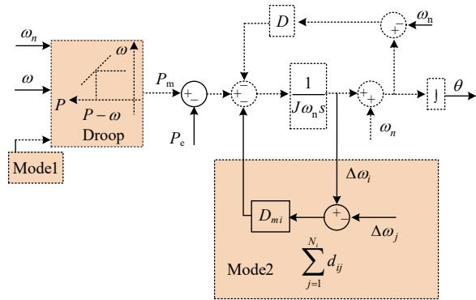  
图2 一致性互阻尼方法的框图  
Fig. 2 Diagram of consensus mutual damping method

图 2 中 Mode1 表示考虑经济调度的一致性互阻尼方法，Mode2 表示 DG 根据自身的容量和控制参数进行功率分配下，增加互阻尼的一致性方法。

结合式(8)可知，此时 ${ S _ { b i } } \mathrm { { = } } { K _ { f i } } \mathrm { { + } } { D _ { i } } \omega _ { 0 } \mathrm { { + } } { D _ { m i } } \omega _ { 0 }$ $\sum _ { j = 1 } ^ { N _ { i } } d _ { i j } ( \Delta \omega _ { i } - \Delta \omega _ { j } )$ 。系统阻尼对稳定性的影响，由新增的互阻尼项进行调整。同时也从整体上调整了系统的自阻尼。

当系统负载增大时，VSG 的输出功率由 $P _ { 0 }$ 到$P _ { 1 }$ ，经过动态调整后重新达到新的稳态。根据式(1)可以得到动态调整过程如图 3 所示。由式(1)可知，a→b 是加速过程，当 VSG 到达点b 时，VSG 的角频率将大于额定值。由于惯性的影响，VSG 将穿过点 b 到点 c，这将导致频率和功率振荡。在调整过程中，一致性算法利用调整项进行二次控制，利用角频率变化改善系统间的相互阻尼，当 VSG从点 a运行到点 b 时，新的调整项进行两次调整，系统的暂态能量加速减少，以减缓角频率的增加速度，从而有效抑制频率和功率振荡。

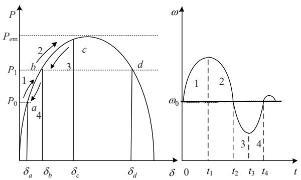  
图3 VSG 功率角和角频率曲线  
Fig. 3 VSG power angle and angular frequency curve

综上所述，多 VSG 并联系统中，根据一致性算法，利用邻接机组进行信息交互，附加互阻尼算法的框图如图 4 所示。

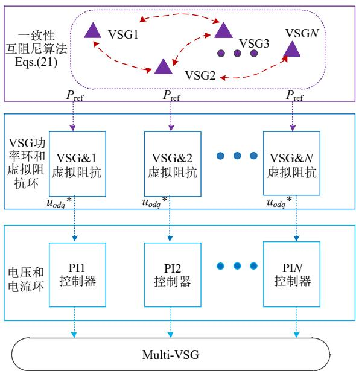  
图4 基于VSG的分布式一致性控制  
Fig. 4 Distributed consensus control based on VSG

# 3 参数与非理想通信分析

# 3.1 李雅普诺夫能量构造

根据式(20)，改善后的转子方程可以描述为

$$
\begin{array}{l} J _ {i} \frac {\mathrm {d} \omega_ {i}}{\mathrm {d} t} = \frac {P _ {m i}}{\omega_ {0}} - \frac {P _ {e i}}{\omega_ {0}} - D _ {i} \left(\omega_ {i} - \omega_ {0}\right) - \\ D _ {m i} \sum_ {j = 1} ^ {N _ {i}} d _ {i j} \left(\Delta \omega_ {i} - \Delta \omega_ {j}\right) \tag {22} \\ \end{array}
$$

以网络中每一台 VSG 作为一个节点，根据潮流方程可得每台 VSG 输出功率为

$$
P _ {e i} = \sum_ {j \neq 1} ^ {N} U _ {i} U _ {j} G _ {i j} \cos \left(\delta_ {i j}\right) + \sum_ {j \neq i} ^ {N} U _ {i} U _ {j} B _ {i j} \sin \left(\delta_ {i j}\right) \tag {23}
$$

式中：N 为 VSG 的数目； $G _ { i j } \setminus B _ { i j }$ 分别为第 i、j 节点 之 间 的 互 电 导 和 互 电 纳 。 定 义 $P _ { e i 0 } =$ $\sum _ { j \neq 1 } ^ { N } U _ { i } U _ { j } G _ { i j } \cos ( \delta _ { i j } )$ ，则式(22)可以改为

$$
\begin{array}{l} J _ {i} \omega_ {0} \frac {\mathrm {d} \omega_ {i}}{\mathrm {d} t} = \left(P _ {m i} - P _ {e i 0}\right) - \sum_ {j \neq i} ^ {N} U _ {i} U _ {j} B _ {i j} \sin \left(\delta_ {i j}\right) - \\ D _ {i} \omega_ {0} \Delta \omega_ {i} - D _ {m i} \omega_ {0} \sum_ {j = 1} ^ {N _ {i}} d _ {i j} (\Delta \omega_ {i} - \Delta \omega_ {j}) \tag {24} \\ \end{array}
$$

结合式(22)和(24)，构造 VSG 运行时的能量函数 $V ( \delta , \Delta \omega ) = E _ { k } + E _ { p }$ ， $E _ { k }$ 是系统的虚拟动能， $E _ { p }$ 是系统的势能[34]。

$$
E _ {k} = \frac {1}{2} \sum_ {i = 1} ^ {N} J _ {i} \omega_ {0} \Delta \omega_ {i} ^ {2} + \frac {\omega_ {0}}{2} \sum_ {i = 1} ^ {N} \sum_ {j = 1} ^ {N _ {i}} d _ {i j} \Delta \omega_ {i} ^ {2} \tag {25}
$$

$$
\begin{array}{l} E _ {p} = - 2 \sum_ {i = 1} ^ {N} \left(P _ {m i} - P _ {e i 0}\right) \left(\delta_ {i} - \delta_ {i 0}\right) - \\ 2 \sum_ {i = 1} ^ {N - 1} \sum_ {j = 1} ^ {N} U _ {i} U _ {j} B _ {i j} \left(\cos \left(\delta_ {i j} - \delta_ {i 0 j 0}\right)\right) \tag {26} \\ \end{array}
$$

对于每个 VSG，在 $\delta _ { i j } { < } \pi / 2$ 的情况下，V 满足作为 Lyapunov 函数的正定条件[21]。考虑 Lyapunov 函数的第3个准则，该准则要求能量函数的导数为负，结合式(24)—(26)可得：

$$
\begin{array}{l} \dot {V} = \frac {\mathrm {d} E _ {k}}{\mathrm {d} t} + \frac {\mathrm {d} E _ {p}}{\mathrm {d} t} = - \omega_ {0} \sum_ {i = 1} ^ {N} D _ {i} \Delta \omega_ {i} ^ {2} - \\ D _ {m i} \omega_ {0} \sum_ {i = 1} ^ {N} \Delta \omega_ {i} \sum_ {j = 1} ^ {N _ {i}} d _ {i j} (\Delta \omega_ {i} - \Delta \omega_ {j}) - \frac {\omega_ {0}}{J _ {i}} \sum_ {i = 1} ^ {N} \sum_ {j = 1} ^ {N _ {i}} d _ {i j} D _ {i} \Delta \omega_ {i} ^ {2} - \\ \frac {D _ {m i}}{J _ {i}} \omega_ {0} \sum_ {i = 1} ^ {N} \sum_ {j = 1} ^ {N _ {i}} d _ {i j} \Delta \omega_ {i} \sum_ {j = 1} ^ {N _ {i}} d _ {i j} (\Delta \omega_ {i} - \Delta \omega_ {j}) = - \\ \omega_ {0} \sum_ {i = 1} ^ {N} D _ {i} \Delta \omega_ {i} ^ {2} - D _ {m i} \omega_ {0} \sum_ {i = 1} ^ {N} \sum_ {j = 1} ^ {N _ {i}} d _ {i j} \left(\Delta \omega_ {i} - \Delta \omega_ {j}\right) ^ {2} - \\ \frac {\omega_ {0}}{J _ {i}} \sum_ {i = 1} ^ {N} \sum_ {j = 1} ^ {N _ {i}} d _ {i j} D _ {i} \Delta \omega_ {i} ^ {2} - \frac {D _ {m i}}{J _ {i}} \omega_ {0} \sum_ {i = 1} ^ {N} \sum_ {j = 1} ^ {N _ {i}} d _ {i j} ^ {2} (\Delta \omega_ {i} - \Delta \omega_ {j}) ^ {2} <   0 \tag {27} \\ \end{array}
$$

根据式(27)可知，只要互阻尼系数大于 0，系统将稳定。此外，在相互阻尼的作用下，系统的暂态能量将随着 $D _ { m i }$ 的增大而降低得更快。结合图 3可知，系统趋近稳定时，增加的互阻尼效果也逐渐消失，不影响系统的稳定运行。

# 3.2 互阻尼参数分析

以 4 机 VSG 并联系统进行分析，系统结构如附录图 A2所示。

根据式(1)，VSG 的频率环可以描述为

$$
\omega_ {\text {r e f} i} = \omega_ {0 i} + \frac {\Delta P _ {i}}{J _ {i} s + D _ {i}} \tag {28}
$$

根据式(22)(28)得到输出频率的小信号状态矩阵方程：

$$
\Delta \boldsymbol {\omega} _ {\text {r e f}} = \boldsymbol {G} _ {p} \Delta \boldsymbol {P} _ {i} + \boldsymbol {G} _ {\omega} \Delta \boldsymbol {\omega} _ {0 i} \tag {29}
$$

式中： $\Delta \omega _ { \mathrm { r e f } } = \left[ \Delta \omega _ { \mathrm { r e f 1 } } \ \Delta \omega _ { \mathrm { r e f 2 } } \ \Delta \omega _ { \mathrm { r e f 3 } } \ \Delta \omega _ { \mathrm { r e f 4 } } \right] ^ { \mathrm { T } } ; \Delta P _ { i } = \left[ \Delta P _ { 1 } \right.$ $\Delta P _ { 2 } \Delta P _ { 3 } \Delta P _ { 4 } ] ^ { \mathrm { T } }$ ； $\Delta \omega _ { 0 i } { = } [ \Delta \omega _ { 0 1 } \Delta \omega _ { 0 2 } \Delta \omega _ { 0 3 } \Delta \omega _ { 0 4 } ] ^ { \mathrm { T } } ;$ ； $G _ { p }$ 表示频率 $\varXi$ 输出功率关系的传递函数矩阵。系统中使用了一致性控制策略来增加系统的互阻尼，该控制策略将使系统出现控制上的交互，这种交互将影响系统的稳定性以及系统的暂态特性。为分析控制的交互特性，揭示互阻尼参数的性能，对式(29)进行考察。

$$
\boldsymbol {G} _ {\omega A} =
$$

$$
\left[ \begin{array}{c c c c} 1 & \frac {\left(- D _ {m 1} d _ {1 2}\right)}{G _ {p n 1}} & 0 & \frac {\left(- D _ {m 1} d _ {1 4}\right)}{G _ {p n 1}} \\ \frac {\left(- D _ {m 2} d _ {2 1}\right)}{G _ {p n 2}} & 1 & \frac {\left(- D _ {m 2} d _ {2 3}\right)}{G _ {p n 2}} & 0 \\ 0 & \frac {\left(- D _ {m 3} d _ {3 2}\right)}{G _ {p n 3}} & 1 & \frac {\left(- D _ {m 3} d _ {3 4}\right)}{G _ {p n 3}} \\ \frac {\left(- D _ {m 4} d _ {4 1}\right)}{G _ {p n 4}} & 0 & \frac {\left(- D _ {m 4} d _ {4 3}\right)}{G _ {p n 4}} & 1 \end{array} \right] \tag {30}
$$

$$
G _ {p n i} = J _ {1} s + D _ {1} + D _ {m i} \sum_ {j} ^ {N _ {i}} d _ {i j}
$$

$$
\boldsymbol {G} _ {\omega} = \boldsymbol {G} _ {\omega A} ^ {- 1} \boldsymbol {G} _ {\omega A} = \operatorname {d i a g} \left\{ \begin{array}{l l l l} 1 & 1 & 1 & 1 \end{array} \right\}
$$

$$
\boldsymbol {G} _ {p A} = \operatorname {d i a g} \left\{ \begin{array}{l l l l} G _ {p A 1} & G _ {p A 2} & G _ {p A 3} & G _ {p A 4} \end{array} \right\}
$$

$$
G _ {p A i} = \omega_ {0} / \left(J _ {i} s + D _ {i} + D _ {m i} \sum_ {j} ^ {N _ {i}} d _ {i j}\right)
$$

$$
\boldsymbol {G} _ {p} = \boldsymbol {G} _ {\omega A} ^ {- 1} \boldsymbol {G} _ {p A}
$$

不失一般性地以 VSG1 进行控制交互分析，分析 $\Delta \omega _ { \mathrm { r e f l } }$ 中参数在频域上的特性。对传递函数$G _ { p 1 , i } ( s ) ( i { = } 1 , 2 , 3 , 4 )$ 进行分析，可得到 4 个 DGs的输出功率对 VSG1 频率环的影响。

$$
\Delta \omega_ {\text {r e f l}} = \sum_ {i = 1} ^ {4} \boldsymbol {G} _ {p 1, i} (s) \Delta \boldsymbol {P} _ {i} + \Delta \omega_ {0 1} \tag {31}
$$

分析式(31)中传递函数(transfer function，TF)的阶跃响应，对比时域上的仿真结果。如图 5所示，2 个响应具有相同的趋势，验证了模型的有效性。

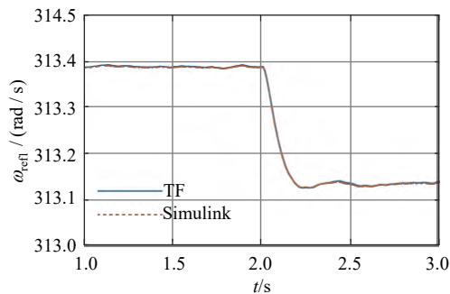  
图 5 ${ \pmb \omega } _ { \bf { r e f 1 } }$ 的阶跃响应 $( D _ { m i } { = } 1 0 )$ 号  
Fig. 5 Step response of ${ \pmb \omega } _ { \mathrm { r e f 1 } } \left( { \pmb D } _ { m i } { \ = } { \pmb 1 0 } \right)$

取不同的互阻尼系数 $D _ { m 1 }$ 进行 Nyquist 曲线绘制，如图 6 所示。

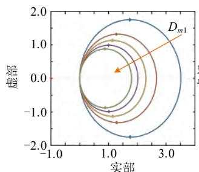  
(a) $G _ { p 1 , 1 } ( s )$

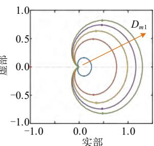  
(b) $G _ { p 1 , 2 } ( s )$

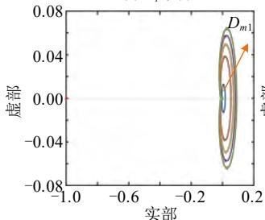  
$G _ { p 1 , 3 } ( s )$

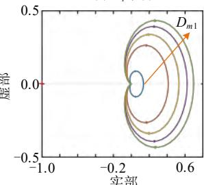  
(d) $G _ { p 1 , 4 } ( s )$   
图 6 $\scriptstyle D _ { m 1 }$ 变化时的 Nyquist 曲线  
Fig. 6 Nyquist curve when $\scriptstyle D _ { m 1 }$ changes

根据图 6 可得，随着 $D _ { m 1 }$ 的增大，交互项$G _ { p 1 , 1 } ( s )$ 逐渐减小，但远离点(1, j0)。说明 $D _ { m 1 }$ 的增大有利于提高 VSG1 的稳定裕度。交互项 $G _ { p 1 , 2 } ( s )$ 、$G _ { p 1 , 4 } ( s )$ 逐渐增大并靠近点(1, j0)，由于机组间具有直接通信效果， $D _ { m 1 }$ 的变化对其影响较大，同时，$D _ { m 1 }$ 过大容易造成相邻 DG 在稳态工作点附近波动而降低系统的稳定性。由于 VSG3 和VSG1不具有直接通信效果，因此交互项 $G _ { p 1 , 3 } ( s )$ 变化幅度较小。根据图 6 可知， $D _ { m i }$ 的值在调整过程中不易造成系统的失稳，具有容易调整的特点，因此，本文选取$D _ { m 1 } { = } D _ { m 2 } { = } D _ { m 3 } { = } D _ { m 4 }$ 。

# 3.3 非理想通信网络分析

在智能体之间进行通信时，通信网络中不可避免地出现通信时延和信道噪声问题,定义此非理想通信环境下节点 i 接收到节点 j 发送的通信信息描述为

$$
x _ {i j} (k) = x _ {j} \left(k - \tau_ {i j} (k)\right) + v _ {i j} (k) \tag {32}
$$

式中： $\tau _ { i j } ( k )$ 为通信时延； $\upsilon _ { i j } ( k )$ 为信道噪音。根据Central Limit 理论，合成的信道噪音的归一化和随着噪音源数量的上升，趋近于一个高斯分布。因此，$\upsilon _ { i j } ( k )$ 采用高斯噪音进行模拟。

为加快算法在非理想通信环境下的收敛速度，根据文献[35-36]，引入的增益的调整函数应满足：

$$
\sum_ {k = 0} ^ {\infty} c (k) = + \infty , \sum_ {k = 0} ^ {\infty} c ^ {2} (k) <   + \infty \tag {33}
$$

式(33)为收敛条件，可使智能体的一致性变量以合适的速率趋于一致同时保证了收敛的鲁棒性.

根据式(21)(32)，考虑非理想通信网络的一致性算法可以表示为

$$
\lambda_ {i} (k + 1) =
$$

$$
\lambda_ {i} (k) - c (k) D _ {m i} \sum_ {j = 1} ^ {N _ {i}} d _ {i j} (\Delta \omega_ {i j} (k) - \Delta \omega_ {j} (k)) \tag {34}
$$

根据文献[36]可知，引入的 c(k)具有单调递减的效果，为了使算法快速达到收敛，减小增益调整函数对系统的影响，引入的增益调整函数为$c ( k ) { = } 0 . 5 ( 1 / ( 0 . 5 k { + } 1 ) { + } \ln ( 0 . 5 k { + } 1 ) / ( 0 . 5 k { + } 1 ) )$ 。

# 4 算例分析

为验证所提出方法的有效性，使用 MATLAB/Simulink软件模拟了图6所示的IEEE7系统的详细模型[27]，系统参数如表 1所示，系统运行于孤岛状态下。

表1 初始参数  
Table 1 Initial parameters   

<table><tr><td>VSG</td><td>有功功率
容量/kW</td><td>无功功率
容量/kvar</td><td>转动惯量J</td><td>阻尼系数D</td><td>下垂系数-1(Kf)</td><td>下垂系数-1(Kv)</td><td>积分系数K</td><td>虚拟阻抗</td><td>电压环PI参数</td><td>电流化PI参数</td><td>LPF时间常数</td></tr><tr><td>VSG1</td><td>50</td><td>16</td><td>3.03</td><td>80</td><td>9.8×10-3</td><td>1.9×10-3</td><td>1/15</td><td></td><td></td><td></td><td></td></tr><tr><td>VSG2</td><td>40</td><td>12.5</td><td>1.6</td><td>60</td><td>1.2×10-2</td><td>2.4×10-3</td><td>1/12</td><td rowspan="2">[0.1 2×10-3]</td><td rowspan="2">[2 100]</td><td rowspan="2">[0.32 100]</td><td rowspan="2">0.05</td></tr><tr><td>VSG3</td><td>55</td><td>17.5</td><td>3.5</td><td>100</td><td>8.9×10-3</td><td>1.7×10-3</td><td>1/18</td></tr><tr><td>VSG4</td><td>65</td><td>20.3</td><td>4.7</td><td>120</td><td>7.5×10-3</td><td>1.5×10-3</td><td>1/22</td><td></td><td></td><td></td><td></td></tr></table>

# 4.1 与传统 VSG 控制的比较

在开始时，附加了 50kW (由 bus6 上的负载 1表示)和40kW(由bus5上的负载3表示)的恒定功率负载，在 t2.0s后，bus6 上增加 30kW 的功率负载，不增加一致性互阻尼时，系统的输出如图 7 所示。

如图 7 所示，当逆变器采用常规 VSG 控制时，VSG输出的有功功率和频率振荡明显。当频率动态性能较差(如频率偏差较大)时，会使系统面临意外甩负荷或大面积停电的风险。

结合 3.2 节的分析，本文选取的互阻尼参数在较大的变化范围内对系统具有较强的稳定性。根据式(29)，增大互阻尼系数 $D _ { m 1 }$ 时的极点变化如图 8所示。根据图 8可知，随着互阻尼系数 $D _ { m 1 }$ 的增大，主导极点渐渐远离虚轴，系统阻尼增大。

选取 $D _ { m 1 } { = } D _ { m 2 } { = } D _ { m 3 } { = } D _ { m 4 } { = } 1 0 0$ ，增加互阻尼的控制系统输出如图 $9 ( \mathrm { a } ) ( \mathrm { b } )$ 所示。与图 7 相比，当逆变器采用所提出的增加互阻尼的 VSG 控制方法时，

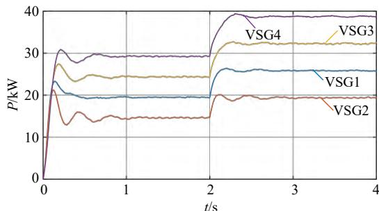

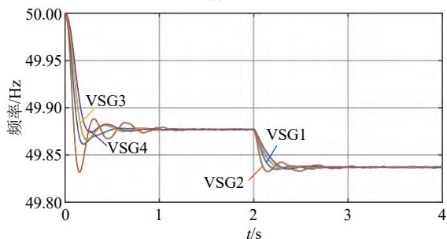  
(a) 有功功率  
(b) 输出频率   
图7 传统VSG控制下的仿真结果  
Fig. 7 Simulation results of the traditional VSG control

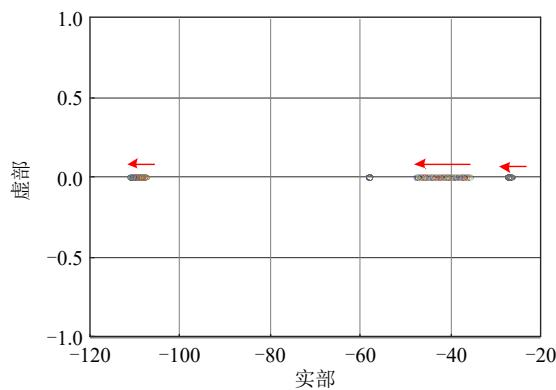  
图 8 $\scriptstyle D _ { m 1 }$ 增大时极点分布

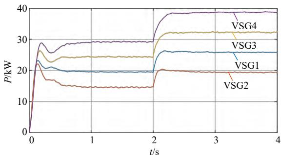  
Fig. 8 Pole distribution when $\scriptstyle D _ { m 1 }$ increases   
(a) 有功功率

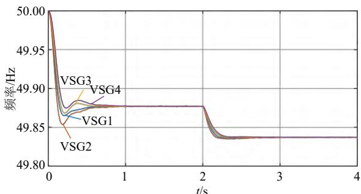  
(b) 输出频率

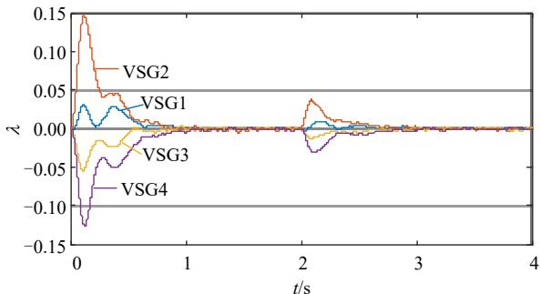

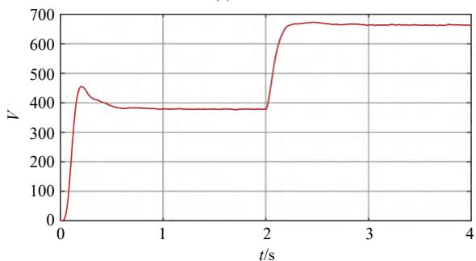  
(c) 一致性变量  
(d) 能量函数   
图 9 所提方法的仿真结果  
Fig. 9 Simulation results of the proposed method

功率振荡已被深度抑制。结合式(21)(25)和(26)可以获得系统一致性变量变化曲线以及附加阻尼时能量函数的变化曲线，如图 9(c)(d)所示。由图 9(c)可知，系统稳定后，一致性变量趋近 $\mp 0 ,$ ，因此，增加的互阻尼对系统的影响也逐渐趋近于 0。由图9(d)可知，随着时间的增加，系统能量增加，VSG之间的互阻尼加速系统暂态能量的消减，当系统达到稳定时，系统能量也趋近一个平衡值，说明系统能量不变，互阻尼带来的能量不再影响系统的稳定性。同时能量函数也满足李雅普诺夫直接法的稳定性判据。

附录图A3—A4为非理想通信网络环境下增益函数对系统的收敛鲁棒性测试。图 A3 为通信延时$\tau _ { i j } { = } 5 0 \mathrm { m s }$ 时输出曲线对比， $\upsilon _ { i j } ( k )$ 如图 A3(d)所示。根据图 A3 可得，当在通信延时较小的非理想通信环境下时，不增加增益调整函数时，算法同样有效，增加的增益函数对系统的收敛效果较小。图 A4 为通信延时 $\tau _ { i j } { = } 5 0 0 \mathrm { m s }$ 时输出曲线对比。此时，增益调整函数对系统有功输出和频率输出的收敛效果比较明显。虽然频率输出发生波动，产生不连续的变化，但是系统最终能恢复稳态运行。本文所提一致性互阻尼控制策略，能在较少的数据传输中完成。因此，本文所提控制策略的通信延时裕度较高，在较大通信延时下仍然能稳定运行。同时，增加的增益调整函数后能有效加速算法的收敛性，证明增加的增益调整函数的有效性。

# 4.2 考虑经济性的一致性控制性能评估

VSG的参数如表 2所示[37]，为进一步验证对不同通信方式下一致性算法的有效性，线路的通信场景如图 10 所示，机组间权重根据式(6)进行更新。此时的 $D _ { m }$ 选取参考收敛因子的大小，选择${ \cal D } _ { m } { = } 5 { \times } 1 0 ^ { - 3 }$ 。图 11显示了所提出的一致性控制前后多个 VSG的性能比较。在 t2.0 s 之前，仅应用初级控制，系统中的负荷根据 VSG 的容量和控制在DG 之间分配，每个 DG 的增量成本不同，这说明电力调度效果不是最优的。

表2 机组参数  
Table 2 Unit parameters  

<table><tr><td>VSG No.</td><td>功率范围/kW</td><td>\( a_i/(\mathbf{\Sigma}/\mathbf{kW}^2 \cdot \mathbf{h})) \)</td><td>\( b_i/(\mathbf{\Sigma}/\mathbf{kW} \cdot \mathbf{h})) \)</td><td>\( c_i/(\mathbf{\Sigma}/\mathbf{h}) \)</td></tr><tr><td>1</td><td>[0,50]</td><td>0.0001</td><td>0.0490</td><td>0.3</td></tr><tr><td>2</td><td>[0,40]</td><td>0.0001</td><td>0.0438</td><td>0.4</td></tr><tr><td>3</td><td>[0,55]</td><td>0.0001</td><td>0.0479</td><td>0.5</td></tr><tr><td>4</td><td>[0,65]</td><td>0.0001</td><td>0.0417</td><td>0.2</td></tr></table>

t2.0s 后，应用所提的一致性控制。经过一个短暂的暂态过程，每个 VSG 的成本增量收敛到相同的值，这意味着电力调度是最优的。这证明了所

提的一致性控制的有效性。

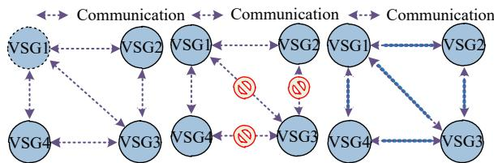  
(a) 通信方式  
(b) 通信丢失  
(c) 非理想通信环境  
图 10 系统通信案例

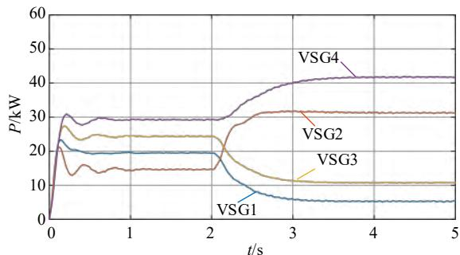  
Fig. 10 System communication cases

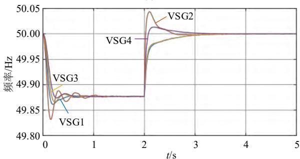  
(a) 有功功率  
(b) 输出频率

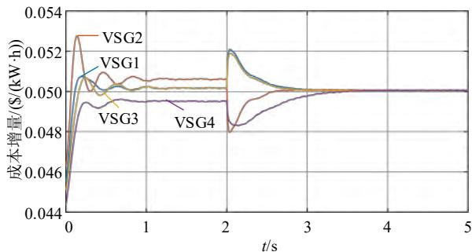  
(c) 成本曲线  
图 11 应用一致性算法前后的性能对比  
Fig. 11 Performance comparison before and after applying the consensus algorithm

# 4.3 不同场景下一致性控制性能评估

1）Case1：负载变化的性能评估。

附录图 A5 显示了所提出的一致性控制在可变负载条件下的性能评估。t5s 时，bus6 上增加 30kW的功率负载，与图 9 相比，多个 VSG 在达到稳定之前的振荡也降低。t7s 时切除负载，在此期间，所有 VSG 的增量成本等于最佳值。分析表明，所提出的一致性控制在小干扰下是有效的，同时为系统提供了互阻尼，功率振荡能被有效的抑制。

如图 A5 所示，即使在可变负载条件下，每个VSG 的频率可以通过一个短的过渡过程恢复到其标准值，这证明了所提出的一致控制对负载变化的鲁棒性。

2）Case2：通信丢失下的一致性控制的性能评估。

附录图A6—A7展示出了在通信丢失的情况下对一致性控制的性能评估。在图 A6 中，t10s 后，VSG3没有与其他机组通信，模拟通信丢失的场景。代理的开-关状态由其邻居从代理发送给这些邻居的数据包中获取，同时 $d _ { i j }$ 根据式(10)更新。此时，其余 DG 仍然可以正常工作，而 VSG3 可以根据代理丢失条件预定义和指定的默认有功功率参考(0kW)继续工作。t11s 后，VSG3 恢复，系统在短暂的瞬态过程后收敛到新的稳态。在图A7中，t10s后，VSG2和 VSG3 同时通信丢失，t12s 时恢复工作。同样在机组恢复工作后，经过短暂的瞬态过程后收敛到新的稳态。这证明了所提出的一致性控制对通信丢失的鲁棒性。

3）Case3：非理想通信网络下的性能评估。

设置通信延时 50ms。附录图 A8展示出了在非理想通信网络下对所提的一致性控制的性能评估。所提的一致性算法能在非理想通信网络下保证系统的稳定，在增加了增益函数后，根据图 A8(b)可以明显看出系统频率振荡变小。这证明了增益函数对算法具有收敛鲁棒性。

# 5 结论

本文研究了基于一致性算法的多 VSG 并联运行控制。针对系统内负荷波动引起的暂态过程中功率振荡问题，通过引入性能评价函数，提出利用一致性算法增加互阻尼控制策略。通过研究分析，结论如下：

1）提出的一致性互阻尼控制策略，利用相邻VSG 之间的频率作调整项来附加阻尼，改善系统的动态响应性能。该控制策略仅需要较少的通信信息即可完成。  
2）利用构造能量函数的方法验证系统的可行性。在互阻尼作用下，系统的暂态能量快速减少，加快了暂态过程的收敛，最终稳定时，互阻尼效果消失，不影响系统的稳定运行。  
3）通过构造功率环的小信号模型得到了互阻尼系数对各 VSG 的频率响应状况。互阻尼效果在相邻通信链接的机组间具有较为明显的影响。同时，互阻尼参数具有调整裕度宽、容易整定等特点，

对系统频率振荡具有明显的抑制效果。

4）仿真验证可得，与传统 VSG 控制相比，本文的一致性互阻尼控制策略能有效缩短系统的暂态响应时间，同时能考虑到有功功率经济出力的问题。在通信丢失的工况下和非理想通信环境下，算法同样有效，具有较高的延时裕度和收敛鲁棒性。

附录见本刊网络版(http://www.dwjs.com.cn/CN/1000-3673/current.shtml)。

# 参考文献

[1] 程雪坤，刘辉，田云峰，等．基于虚拟同步控制的双馈风电并网系统暂态功角稳定研究综述与展望[J]．电网技术，2021，45(2)：518-525  
CHENG Xuekun，LIU Hui，TIAN Yunfeng，et al．Review of transient power angle stability of doubly-fed induction generator with virtual synchronous generator technology integration system[J] ． Power System Technology，2021，45(2)：518-525(in Chinese)   
[2] 侍乔明，王刚，付立军，等．基于虚拟同步发电机原理的模拟同步发电机设计方法[J]．电网技术，2015，39(3)：783-790  
SHI Qiaoming，WANG Gang，FU Lijun，et al．A design method of simulative synchronous generator based on virtual synchronous generator theory[J]．Power System Technology，2015，39(3)： 783-790(in Chinese)   
[3] 王帅，荆龙，王静，等．VSG 型的 UPFC 容量优化及控制策略[J]电网技术，2022，46(6)：2308-2316  
WANG Shuai，JING Long，WANG Jing，et al．Optimal capacity design and control strategy on UPFC with VSG algorithm[J]．Power System Technology，2022，46(6)：2308-2316(in Chinese)．.   
[4] ZHONG Qingchang，WEISS G．Synchronverters：inverters that mimicsynchronous generators[J] ． IEEE Transactions on IndustrialElectronics，2011，58(4)：1259-1267  
[5] 姜静雅，王玮，唐芬，等．优化储能 VSG动态特性的 d 轴电流微分前馈控制[J]．电网技术，2022，46(7)：2510-2519  
JIANG Jingya，WANG Wei，TANG Fen，et al．Current differential feed forward control of d-axis for improving dynamic characteristics of energy storage virtual synchronous generator[J]．Power System Technology，2022，46(7)：2510-2519(in Chinese)   
[6] 杨帆，邵银龙，李东东，等．一种计及储能容量和 SOC 约束的模糊自适应 VSG 控制策略[J]．电网技术，2021，45(5)：1869-1876  
YANG Fan，SHAO Yinlong，LI Dongdong，et al．Fuzzy adaptive VSG control strategy considering energy storage capacity and SOC constraint[J]．Power System Technology，2021，45(5)：1869-1876(in Chinese)．   
[7] SHINTAI T，MIURA Y，ISE T．Oscillation damping of a distributedgenerator using a virtual synchronous generator[J]．IEEE Transactionson Power Delivery，2014，29(2)：668-676  
[8] DONG Shuan，CHEN Y C．Adjusting synchronverter dynamic response speed via damping correction loop[J]．IEEE Transactions on Energy Conversion，2017，32(2)：608-619   
[9] KARIMI-GHARTEMANI M．Universal integrated synchronization and control for single-phase DC/AC converters[J]．IEEE Transactions on Power Electronics，2015，30(3)：1544-1557   
[10] HUANG Linbin，XIN Huanhai，YUAN Hui，et al．Damping effect of virtual synchronous machines provided by a dynamical virtual impedance[J]．IEEE Transactions on Energy Conversion，2021，36(1)： 570-573．   
[11] 马铱林，杨欢，屈子森，等．改善虚拟同步发电机阻尼特性的设

计方法[J]．电网技术，2021，45(1)：269-275  
MA Yilin，YANG Huan，QU Zisen，et al．Design method forimproving damping characteristics of virtual synchronousgenerator[J]．Power System Technology，2021，45(1)：269-275(inChinese)  
[12] KARIMI A，KHAYAT Y，NADERI M，et al．Inertia response improvement in AC microgrids：a fuzzy-based virtual synchronous generator control[J]．IEEE Transactions on Power Electronics，2020， 35(4)：4321-4331．   
[13] HOU Xiaochao，SUN Yao，ZHANG Xin，et al．Improvement of frequency regulation in VSG-based AC microgrid via adaptive virtual inertia[J]．IEEE Transactions on Power Electronics，2020，35(2)： 1589-1602   
[14] 曾德银，姚骏，张田，等．虚拟同步发电机多机并联系统的频率小信号稳定性分析研究[J]．中国电机工程学报，2020，40(7)：2048-2061  
ZENG Deyin，YAO Jun，ZHANG Tian，et al．Research on frequencysmall-signal stability analysis of multi-parallel virtual synchronousgenerator-based system[J]．Proceedings of the CSEE，2020，40(7)：2048-2061(in Chinese)  
[15] 李辉，王坤，胡玉，等．双馈风电系统虚拟同步控制的阻抗建模及稳定性分析[J]．中国电机工程学报，2019，39(12)：3434-3442LI Hui，WANG Kun，HU Yu，et al．Impedance modeling and stabilityanalysis of virtual synchronous control based on doubly-fed windgeneration systems[J]．Proceedings of the CSEE，2019，39(12)：3434-3442(in Chinese)  
[16] LIU Jia ， MIURA Y ， BEVRANI H ， et al ． Enhanced virtualsynchronous generator control for parallel inverters in microgrids[J]IEEE Transactions on Smart Grid，2017，8(5)：2268-2277  
[17] CHOOPANI M ， HOSSEINAIN S H ， VAHIDI B ． A novelcomprehensive method to enhance stability of multi-VSG grids[J]International Journal of Electrical Power & Energy Systems，2019，104：502-514  
[18] LIU Huakun，XIE Xiaorong，LIU Wei．An oscillatory stability criterion based on the unified dq-frame impedance network model for power systems with high-penetration renewables[J] ． IEEE Transactions on Power Systems，2018，33(3)：3472-3485   
[19] ALIPOOR J，MIURA Y，ISE T．Stability assessment and optimization methods for microgrid with multiple VSG units[J]．IEEE Transactions on Smart Grid，2018，9(2)：1462-1471   
[20] 张波，颜湘武，黄毅斌，等．虚拟同步机多机并联稳定控制及其惯量匹配方法[J]．电工技术学报，2017，32(10)：42-52  
ZHANG Bo，YAN Xiangwu，HUANG Yibin，et al．Stability control and inertia matching method of multi-parallel virtual synchronous generators[J]．Transactions of China Electrotechnical Society，2017， 32(10)：42-52(in Chinese)   
[21] FU Siqi，SUN Yao，LI Lang，et al．Power oscillation suppression of multi-VSG grid via decentralized mutual damping control[J]．IEEE Transactions on Industrial Electronics，2022，69(10)：10202-10214   
[22] SHI Mengxuan，CHEN Xia，ZHOU Jianyu，et al．Frequencyrestoration and oscillation damping of distributed VSGs in microgridwith low bandwidth communication[J]．IEEE Transactions on SmartGrid，2021，12(2)：1011-1021  
[23] 洪灏灏，顾伟，黄强，等．微电网中多虚拟同步机并联运行有功振荡阻尼控制[J]．中国电机工程学报，2019，39(21)：6247-6255HONG Haohao，GU Wei，HUANG Qiang，et al．Power oscillationdamping control for microgrid with multiple VSG units[J]Proceedings of the CSEE，2019，39(21)：6247-6255(in Chinese)  
[24] 许振宇，陈殷，石梦璇，等．基于一致性算法的并联虚拟同步机系统小信号模型分析[J]．中国电机工程学报，2022，42(7)：

2427-2437．   
XU Zhenyu，CHEN Yin，SHI Mengxuan，et al．Small-signal analysisof consensus-algorithm-based parallel virtual synchronizationgenerators system[J]．Proceedings of the CSEE，2022，42(7)：2427-2437(in Chinese)  
[25] 何红玉，范丽，韩蓓，等．基于一致性协议的多微网协调控制[J]电网技术，2017，41(4)：1269-1276  
HE Hongyu，FAN Li，HAN Bei，et al．A consensus protocol based control method for coordinated multi-microgrid control[J]．Power System Technology，2017，41(4)：1269-1276(in Chinese)   
[26] KAR S，HUG G，MOHAMMADI J，et al．Distributed state estimation and energy management in smart grids：a consensus +innovations approach[J]．IEEE Journal of Selected Topics in Signal Processing， 2014，8(6)：1022-1038   
[27] FAHAD S，GOUDARZI A，XIANG Ji．Demand management ofactive distribution network using coordination of virtual synchronousgenerators[J]．IEEE Transactions on Sustainable Energy，2021，12(1)：250-261．  
[28] XU Yinliang，LI Zhicheng．Distributed optimal resource management based on the consensus algorithm in a microgrid[J] ． IEEE Transactions on Industrial Electronics，2015，62(4)：2584-2592   
[29] 蒲天骄，刘威，陈乃仕，等．基于一致性算法的主动配电网分布式优化调度[J]．中国电机工程学报，2017，37(6)：1579-1589  
PU Tianjiao，LIU Wei，CHEN Naishi，et al．Distributed optimal dispatching of active distribution network based on consensus algorithm[J]．Proceedings of the CSEE，2017，37(6)：1579-1589(in Chinese)．   
[30] YANG Shiping，TAN Sicong，XU Jianxin．Consensus based approach for economic dispatch problem in a smart grid[J]．IEEE Transactions on Power Systems，2013，28(4)：4416-4426   
[31] LI Qiao，GAO D W，ZHANG Huaguang，et al．Consensus-based distributed economic dispatch control method in power systems[J] IEEE Transactions on Smart Grid，2019，10(1)：941-954   
[32] 边晓燕，孙明琦，赵健，等．基于一致性算法的源–荷协同分布式优化调控策略[J]．中国电机工程学报，2021，41(4)：1334-1347BIAN Xiaoyan，SUN Mingqi，ZHAO Jian，et al．Distributedcoordinative optimal dispatch and control of source and load based onconsensus algorithm[J]．Proceedings of the CSEE，2021，41(4)：1334-1347(in Chinese)

[33] LIU Jia，MIURA Y，ISE T．Comparison of dynamic characteristics between virtual synchronous generator and droop control in inverter-based distributed generators[J]．IEEE Transactions on Power Electronics，2016，31(5)：3600-3611   
[34] ALIPOOR J，MIURA Y，ISE T．Power system stabilization using virtual synchronous generator with alternating moment of inertia[J] IEEE Journal of Emerging and Selected Topics in Power Electronics， 2015，3(2)：451-458   
[35] LIU Shuai，XIE Lihua，ZHANG Huanshui．Distributed consensus for multi-agent systems with delays and noises in transmission channels[J]．Automatica，2011，47(5)：920-934   
[36] 徐豪，张孝顺，余涛．非理想通信网络条件下的经济调度鲁棒协同一致性算法[J]．电力系统自动化，2016，40(14)：15-24，57XU Hao，ZHANG Xiaoshun，YU Tao．Robust collaborative consensusalgorithm for economic dispatch under non-ideal communicationnetwork[J]．Automation of Electric Power Systems，2016，40(14)：15-24，57(in Chinese)  
[37] LI Zhongwen，ZANG Chuanzhi，ZENG Peng，et al．Fully distributed hierarchical control of parallel grid-supporting inverters in islanded AC microgrids[J]．IEEE Transactions on Industrial Informatics，2018， 14(2)：679-690

  
林继灿

在线出版日期：2022-12-01。

收稿日期：2022-09-13。

作者简介：

林继灿(1991)，男，博士研究生，研究方向为智能配电网、微电网稳定性分析与协同控制，E-mail：linjican@126.com；

刘沈全(1990)，男，博士后，主要研究方向为高压直流输电、柔性分频输电和电力电子技术，E-mail：sqliu@scut.edu.cn；

王钢(1966)，男，通信作者，博士，教授，博士生导师，研究方向为电力系统控制与保护、高压直流输电技术，E-mail：wangg@scut.edu.cn；

黄敏(1998)，男，硕士研究生，研究方向为电力系统控制与保护，E-mail：hm13804072933@163.com。

（责任编辑 邱丽萍 马晓华）

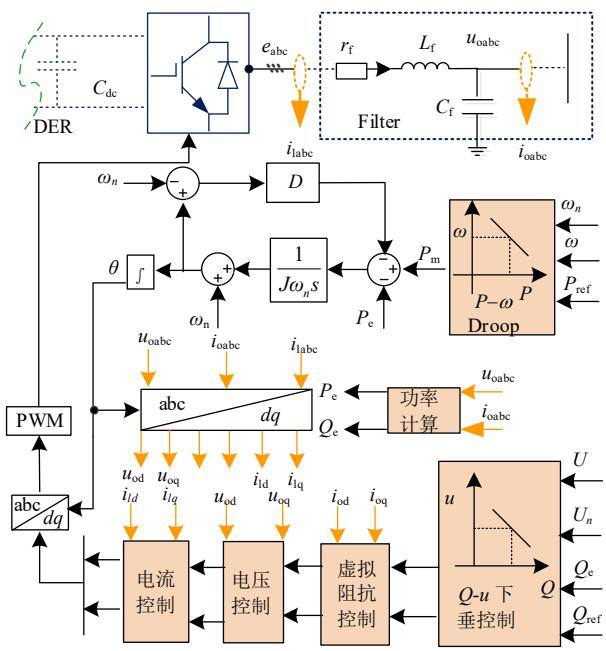  
附录 A  
图 A1 VSG 控制原理图  
Fig. A1 VSG control schematic diagram

图中： $L _ { \mathrm { f } }$ 和 $C _ { \mathrm { f } }$ 分别为VSG输出的滤波电感和电容；$r _ { \mathrm { f } }$ 为 VSG 滤波器电感的等效电阻； $e _ { \mathrm { a b c } }$ 和 $i _ { l \mathrm { a b c } }$ 为VSG终端的电压和电流； $u _ { o \mathrm { a b c } }$ 和 $i _ { o \mathrm { a b c } }$ 为 VSG 的输出电压和电流；下标 $\operatorname { a b c } ( d q )$ 表示 abc(dq)坐标轴中的相关变量。

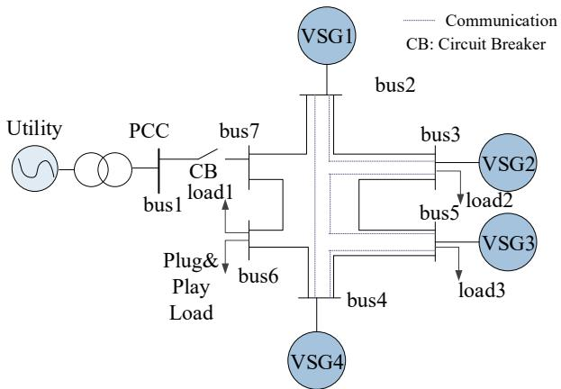  
图A2 系统结构

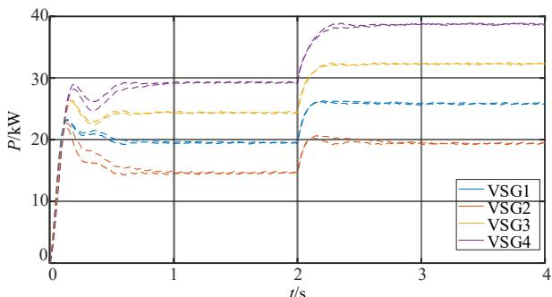  
Fig. A2 System structure diagram   
(a) 有功功率

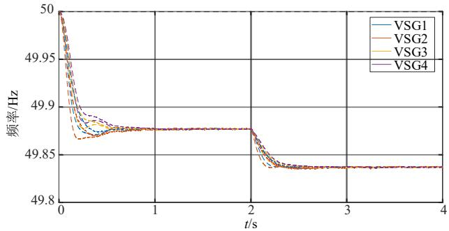

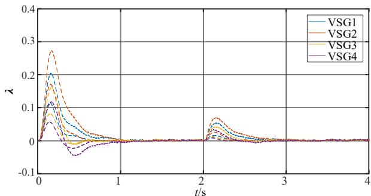  
(b) 输出频率

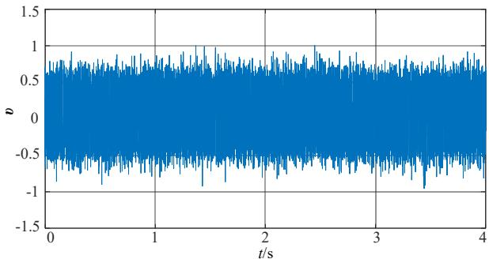  
(c) 一致性变量  
(d) 通信噪声   
图 A3 $\pmb { \tau } _ { i j } { = } 5 0 \mathbf { m s }$ 时增加增益函数前(实线)后(虚线)对比

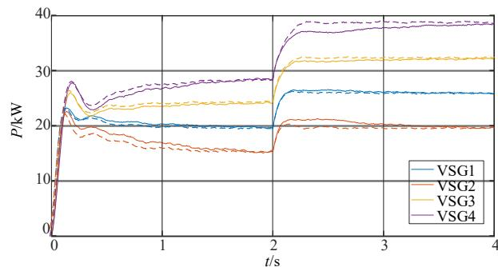  
Fig. A3 Comparison before (solid line) and after (dashed line) adding gain function in in $\pmb { \tau } _ { i j } { = } 5 0 \mathbf { m s }$

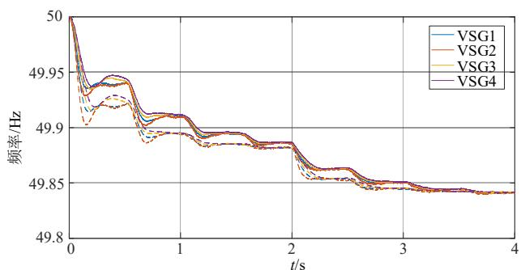  
(a) 有功功率  
(b) 输出频率

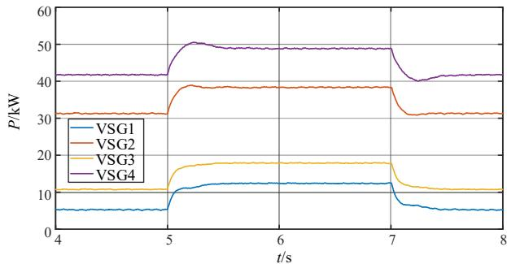  
图 A4 τij=500ms 时增加增益函数前(实线)后(虚线)对比  
Fig. A4 Comparison before (solid line) and after (dashed line) adding gain function in $\pmb { \tau } _ { i j } { = } 1 0 0 \mathbf { m s }$   
(a) 有功功率

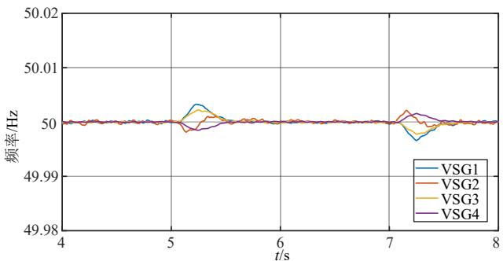

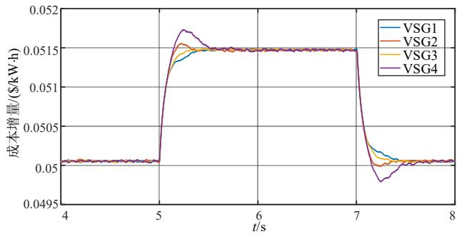  
(b) 输出频率   
(c) 成本曲线

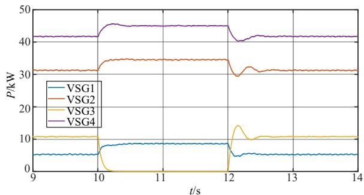  
图 A5 负载变化下动态性能输出曲线  
Fig. A5 Dynamic performance under load change

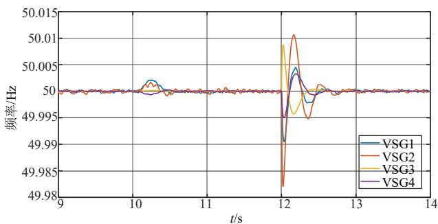  
(a) 有功功率

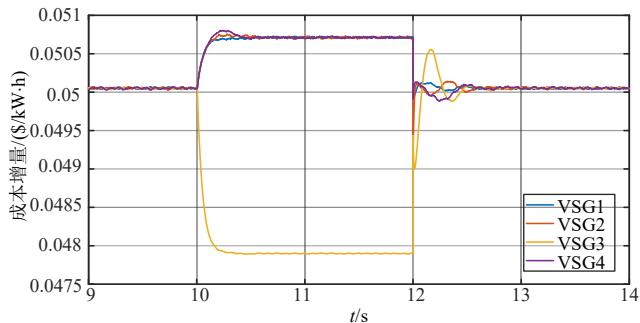  
(b) 输出频率   
(c) 成本曲线  
图 A6 VSG3 通信丢失下动态性能输出曲线

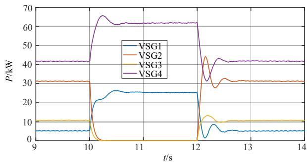  
Fig. A6 Dynamic performance output curve under VSG3 communication loss

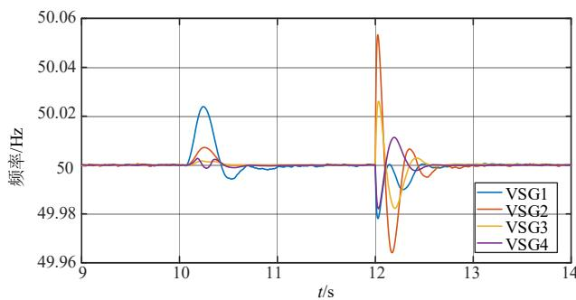  
(a) 有功功率

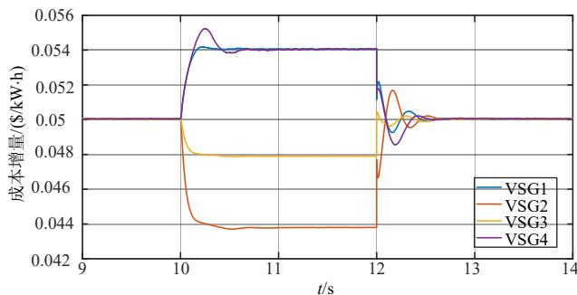  
(b) 输出频率   
(c) 成本曲线  
图 A7 VSG2和VSG3同时通信丢失下动态性能输出曲线  
Fig. A7 Dynamic performance output curve under both VSG2 and VSG3 communication loss

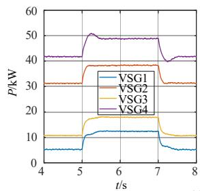

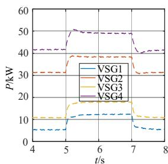  
(a) 有功功率

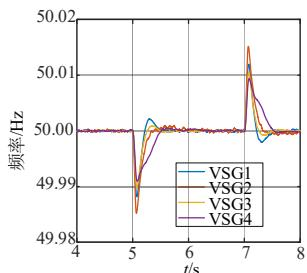

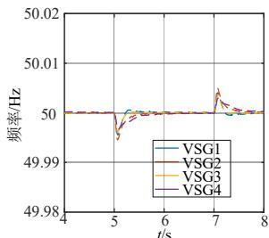  
(b) 输出频率

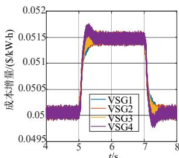

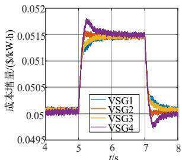  
(c) 成本曲线  
图 A8 非理想通信环境增加增益函数前(实线)后(虚线)对比  
Fig. A8 Comparison before (solid line) and after (dashed line) adding gain function in non-ideal communication environment

附加阻尼表达式推导：

根据等式(17)可得∂ $\mathcal { f } _ { \mathrm { p e r } } / \partial \delta _ { i j } { = } \Delta \omega _ { i } { - } \Delta \omega _ { j }$ 。结合等式(7)和(14)可得：

$$
\begin{array}{l} f _ {\mathrm {o b} _ {- 1}} (k) = 2 a _ {i} \Delta P _ {m i} (k) = - \frac {2 a _ {i}}{J _ {i} \omega_ {0} s + \left(K _ {f i} + D _ {i}\right)} \Delta \omega_ {i} (k) = \\ - f _ {A} \Delta \omega_ {i} (k) \tag {A1} \\ \end{array}
$$

等式(18)的化简过程：

$$
\begin{array}{l} \frac {\partial f _ {\text {p e r}}}{\partial f _ {\text {o b} _ {i}}} = \frac {\partial f _ {\text {p e r}}}{\partial \delta_ {i j}} \frac {\partial \delta_ {i j}}{\partial f _ {\text {o b} _ {i}}} = - \frac {1}{f _ {A}} \left(\Delta \omega_ {i} (k) - \Delta \omega_ {j} (k)\right) \Delta \omega_ {i} (k) = \\ - \left(\frac {J _ {i} \omega_ {0} s}{2 a _ {i}} + \frac {\left(K _ {f i} + D _ {i}\right)}{2 a _ {i}}\right) \Delta \omega_ {i} (k) \left(\Delta \omega_ {i} (k) - \Delta \omega_ {j} (k)\right) = \\ - \left(\frac {J _ {i} \omega_ {0}}{2 a _ {i}} \frac {\mathrm {d} \omega_ {i}}{\mathrm {d} t} + \frac {\left(K _ {f i} + D _ {i}\right)}{2 a _ {i}}\right) \Delta \omega_ {i} (k) \left(\Delta \omega_ {i} (k) - \Delta \omega_ {j} (k)\right) \tag {A2} \\ \end{array}
$$

等式中 $\frac { ( K _ { f i } + D _ { i } ) } { 2 a _ { i } }$ 2  ia 为常数项，根据 VSG 中转动惯量和阻尼系数的选取中， $\frac { J _ { i } \omega _ { 0 } } { 2 a _ { i } } \frac { \mathrm { d } \omega _ { i } } { \mathrm { d } t }$ 的数值要远小于 $\mp \frac { ( K _ { \hbar } + D _ { i } ) } { 2 a _ { i } }$ 。定义互阻尼系数 $D _ { m i }$ ，(A2)可以简化2  ia为：

$$
\frac {\partial f _ {\text {p e r}}}{\partial f _ {\text {o b} - i}} = - D _ {m i} \Delta \omega_ {i} (k) [ \Delta \omega_ {i} (k) - \Delta \omega_ {j} (k) ] \tag {A3}
$$

# Coordinated Power Oscillation Suppression of Multi-VSG Based on Consensus Algorithm

LIN Jican, LIU Shenquan, WANG Gang, HUANG Min

(School of Electric Power Engineering, South China University of Technology, Guangzhou 510640, Guangdong Province, China)

KEY WORDS: virtual synchronous generator; power oscillation; mutual damping; consensus algorithm; Lyapunov function

The virtual synchronous generator (VSG) simulates the characteristics of synchronous generators to provide inertia support, but inevitably lead into the problem of active power oscillation. The low mutual damping between VSGs intensifies the oscillation volatility, which will damage the stable operation of the system and the effective regulation of renewable energy.

This paper proposes a mutual damping method based on the consensus algorithm for suppressing the oscillation of the multi-VSG system. The consistency algorithm will add the interaction damping by using the adjacent frequency information. During the dynamic operation of VSG, the VSG with smaller inertia has larger damping, and the VSG with larger inertia has smaller damping. Simultaneously, the difference of output frequency changes of each VSG decreases during the dynamic process, so that the rapid convergence can reach a consensus and the dynamic performance of the system can be improved.

The key of consensus control strategy is to suppress the oscillation of VSG by adding mutual damping terms, which is presented as follows:

$$
\lambda_ {1} (k + 1) = \left\{ \begin{array}{l l} \sum_ {j = 1} ^ {N _ {t}} d _ {i j} \lambda_ {j} (k) - D _ {m i} \sum_ {j = 1} ^ {N _ {t}} d _ {i j} \left(\Delta \omega_ {i} (k) - \Delta \omega_ {j} (k)\right) & \text {M o d e l} \\ - D _ {m i} \sum_ {j = 1} ^ {N _ {t}} d _ {i j} \left(\Delta \omega_ {i} (k) - \Delta \omega_ {j} (k)\right) & \text {M o d e 2} \end{array} \right. \tag {1}
$$

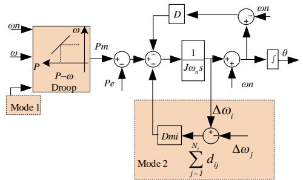  
Fig. 1 Control algorithm of consensus mutual damping method

Mode 1 represents the consistent cross damping method considering economic dispatch, and Mode 2 represents the

consistent method of adding cross damping when DG carries out power allocation according to its own capacity and control parameters. The schematic diagram is shown in Fig. 1.

Lyapunov energy function is constructed to prove the stability of the system as shown in (2), where Ek is the virtual kinetic energy and Ep is the potential energy of the system. The differential function is always negative shown in (3), which demonstrated the proposed method is stable and effective according to the analysis of Lyapunov function

$$
V (\delta , \Delta \omega) = E _ {k} + E _ {p} \tag {2}
$$

$$
\begin{array}{l} \dot {V} = \frac {d E _ {k}}{d t} + \frac {d E _ {p}}{d t} \\ = - \omega_ {0} \sum_ {i = 1} ^ {N} D _ {i} \Delta \omega_ {i} ^ {2} - D _ {m i} \omega_ {0} \sum_ {i = 1} ^ {N} \sum_ {j = 1} ^ {N _ {i}} d _ {i j} \left(\Delta \omega_ {i} - \Delta \omega_ {j}\right) ^ {2} \tag {3} \\ - \frac {\omega_ {0}}{J _ {i}} \sum_ {i = 1} ^ {N} \sum_ {j = 1} ^ {N _ {i}} d _ {i j} D _ {i} \Delta \omega_ {i} ^ {2} - \frac {D _ {m i}}{J _ {i}} \omega_ {0} \sum_ {i = 1} ^ {N} \sum_ {j = 1} ^ {N _ {i}} d _ {i j} ^ {2} (\Delta \omega_ {i} - \Delta \omega_ {j}) ^ {2} <   0 \\ \end{array}
$$

The damping parameter is easy to adjust through analysis based on small signal state matrix equation as shown in (4).

$$
\Delta \boldsymbol {\omega} _ {i e f} = \mathbf {G} _ {p} \Delta \mathbf {P} _ {i} + \mathbf {G} _ {\omega} \Delta \boldsymbol {\omega} _ {i i} \tag {4}
$$

Compared with the traditional VSG control, the consensus damping control strategy proposed in this paper can effectively shorten the transient response time of the system, while taking into account the economic output of active power. In the case of communication loss and non-ideal communication environment, the algorithm is also effective, with high delay margin and convergence robustness.

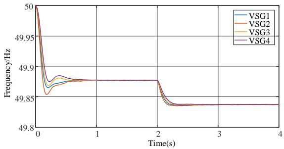  
Fig. 2 The simulation results of the proposed method