# Equivalent Circuit Model of a Transmission Tower Considering a Lightning Struck Point and Cross-arms

Akifumi Yamanaka a,* , Naoto Nagaoka a , Yoshihiro Baba a

a Doshisha University, 1-3 Miyakodani, Tatara, Kyotanabe, Kyoto, Japan

# A R T I C L E I N F O

Keywords:

Lightning

Transmission tower

EMT-type simulator

FDTD method

Back-flashover

# A B S T R A C T

This paper studies voltages generated across the insulators of a vertical double-circuit transmission tower due to a lightning strike to a tip of the tower top cross-arm, and presents a circuit analysis model of the tower considering the cross-arms. When lightning strikes the tip of tower top cross-arm, insulator voltages on the lightning-struck side are higher than those on the other side. This is because the electromagnetic field is more intense on the struck-side and it is weakened on the other side. The voltage difference can have an effect on the back-flashover occurrence. Most of existing equivalent circuits of transmission tower cannot consider the difference of electromagnetic field or its resultant voltages depending on the side of lightning strike. Here, a new equivalent circuit model, which can consider the difference of voltages depending on the side of lightning strike, is proposed for electromagnetic transient simulators. The validity of the proposed equivalent circuit model is confirmed by comparing waveforms of insulator voltages computed using the FDTD method in this paper and those measured on an actual ultra-high voltage transmission tower in the past.

# 1. Introduction

Lightning strike to a transmission tower and resultant lightning overvoltages and currents can interrupt the operation of power systems. The reliable and economical countermeasures against lightning strikes should be prepared. Accurate and practical numerical models of power systems help to achieve the reasonable lightning protection or insulation design [1, 2].

Developments in both the numerical techniques and computational resources enable us to perform the three-dimensional numerical electromagnetic field analysis for lightning surges [3]. The methods do not need the quasi-TEM (transverse electromagnetic) mode assumption, which numerical circuit analysis by electromagnetic transient (EMT) simulators with single-dimension distributed-parameter line model is based on [4]. Thus, the field analysis methods are suitable for lightning transient studies in transmission systems, and various methods, namely, the finite-difference time-domain (FDTD) method, the method of Moments (MoM), the partial element equivalent circuit (PEEC) method, and hybrid electromagnetic model (HEM) have been employed [3]. Especially the FDTD method [5] has been applied to the practical back-flashover analysis of transmission systems taking advantage of its time-domain modeling and flexibility [3, 6, 7, 8, 9]. The method,

however, requires much more computation resources and time than those the circuit analysis requires. The circuit analysis by EMT-type simulators can execute the statistical or iterative analysis speedily with various conditions including nonlinearities. Therefore, it enables the investigation of the probability of lightning faults and the proposal of the economical and effective strategy for reducing them [10, 11, 12, 13, 14, 15]: for instance the installation of transmission line surge arresters. Accurate and reasonable modeling of the transmission tower further enhances the advantage and usefulness of the circuit analysis method.

In circuit analysis, transmission towers have been represented by a lossless short distributed-parameter line with surge impedances derived based on the electromagnetic field theory (e. g. [16]) or circuit theory (e. g. [17]), or the multistory tower model composed of four-cascaded line with damping RL circuits [18]. These models have given practical information for considering lightning protection of transmission systems as mentioned above. Further in the tower modeling for circuit analysis, a modification of the multistory tower model, a multistair tower model based on the circuit theory, and transmission tower and line models considering the TEM-mode formation process have been presented recently [19, 20, 21]. One of the remaining important factors in circuit modeling of the tower is consideration of cross-arms to analyze the

lightning strike to the tip of tower top and resultant back-flashovers. The strike point and the presence of the tower cross-arms can be quite important in discussing characteristic of multiphase or concurrent back-flashovers [22], in addition to the characteristic of the tower itself.

In this paper, vertical double-circuit transmission towers of extraand ultra-high voltage class (EHV/UHV) are studied. The electromagnetic field and resultant insulator voltages of a transmission tower due to a lightning strike to the tip of tower top cross-arm are discussed using the FDTD method. Then, a circuit analysis model considering the tower cross-arms is proposed. Finally, the validity of the proposed equivalent circuit model is confirmed by comparing waveforms of insulator voltages computed using the FDTD method in this paper and those measured on an actual UHV transmission tower, which were reported in the past.

# 2. Numerical electromagnetic field analysis

# 2.1. FDTD analysis model

In this paper, Virtual Surge Test Lab. (VSTL) developed by the Central Research Institute of Electric Power Industry (CRIEPI), is used for FDTD simulations [23,24]. Fig. 1 shows the FDTD analysis model of a 76-m high vertical double-circuit transmission tower. The FDTD analysis space of $6 0 0 \times 6 0 0 \times 4 0 0$ m is uniformly divided into $1 \times 1 \times 1$ m cubic cells, and the boundary of the space is set to Liao’s second order absorbing boundary [25] to model the opened simulation space, except for the bottom perfectly-conducting plane. The tower structure is modeled using thin wires including its inclined part against x-y-z axis by the stair-case approximation method [26]. The radii of the overhead ground-wires, which are smaller than the cell size, are modeled by the thin wire representation method [27]. Note that each of the bundled

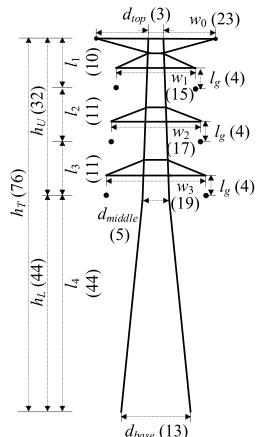

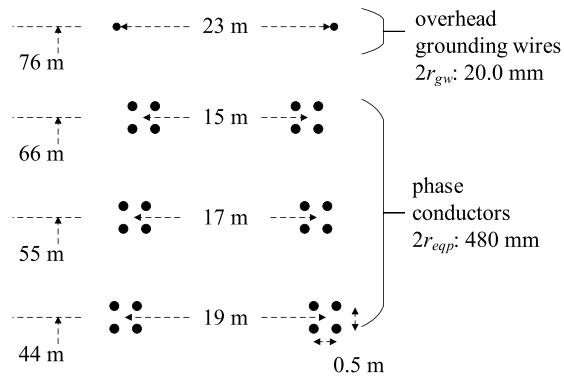

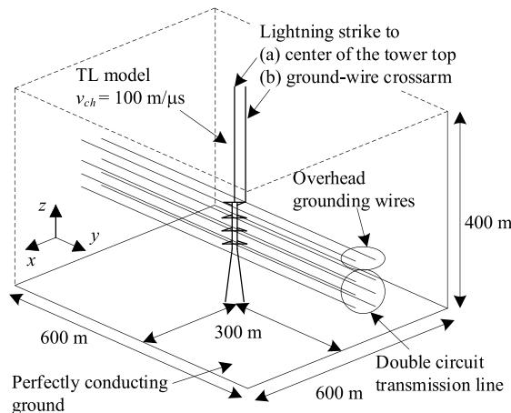  
  
（c）

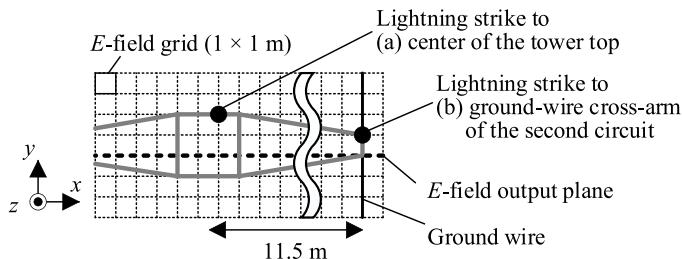  
  
Fig. 1. 500-kV class vertical double-circuit transmission tower to be studied. (a) Structure of the tower (units in meters). (b) Arrangement of overhead lines. (c) 3D view of the FDTD analysis model. (d) Top view of the FDTD model showing the strike points. The tower is represented by thin wires using a stair-case approximation method.

conductors is modeled by a single wire having the geometrical mean radius. The computation time step is set to 1.35 ns, which is 0.7 times of the upper limit of the Courant stability conduction, to avoid numerical instability [28]. The 600-m long overhead ground-wires and phase conductors are connected to the absorbing boundary, and thus they perform as two semi-infinitely long lines seen from the tower [6].

The lightning channel is represented by the transmission line model with current propagation speed of 100 m/μs [29], and is attached to (i) the center of the tower top, and (ii) the ground-wire cross-arm of the second circuit as shown in Fig. 1(c) and (d). The injected current is a step-like current with constant rise time of 1 μs or 2 μs, which is typically used in Japan [1]. Since any nonlinearity is not considered in this paper, the injected current magnitude is normalized to 1 A. This FDTD analysis yields voltages across the string of insulator, which are defined by the integration of the electric field between each power line and tip of the tower cross-arm (no capacitor or resistor representing the string of the insulator is considered).

In this paper, the transmission tower legs are directly connected to the perfectly conducting plane, and the grounding impedance becomes zero while some literatures (e.g. [30,31]) have dedicated to consider the soil characteristics and foundations at the same time. Upon the assumption of the perfectly conducting plane, the characteristic of the transmission tower itself can be clarified [21]. Once the tower model is derived, any tower foot model can be connected and lightning performance of transmission lines can be analyzed speedily using EMT-simulators.

# 2.2. Discussions on insulator voltages

Fig. 2 shows the FDTD-computed voltages across the strings of insulator generated by lightning strikes to (a) the center of the tower top and (b) the ground-wire cross-arm of the second circuit. In the case where lightning strikes the center of the tower top, insulator voltages in both sides are identical as expected. On the other hand, in the case where lightning strikes the ground-wire cross-arm, higher voltages are generated across insulators located on the lightning struck-side. Table 1 shows the peak voltages of the insulators in case the lightning strikes the ground-wire cross-arm of the second circuit. The maximum difference between the voltages of the struck side and the other side is 6.6%. This difference is not so large, but can affect the back-flashover phase. In [15], it has been shown that the 2% variation of the flashover voltage can result in the back-flashovers in different phases. The magnitude of the voltage across insulator when the rise time of the lightning is 2 μs is lower than that of 1 μs since the surge impedances of the transmission tower and line just after the lightning strike have time-dependent characteristics [21]. Note that the effect of the adjacent towers can be evaluated using circuit models presented in the next section.

Fig. 3 shows the distribution of electric-field strength in x-z plane of the FDTD analysis space generated by a 1-μs rising current at a time of 0.16 μs after the current injection. In case that lightning strikes the center of the tower top, the electric field propagates symmetrically. On the other hand, in case that lightning strikes the ground-wire cross-arm of the second circuit (Fig. 3(b)), the electric field is more intense in the struck-side and the field is weakened in the other side due to the shielding effect by the tower body and farther distances. This difference in spatial distribution of the electric field results in the difference in the insulator voltages shown in Fig. 2. The circuit analysis model of the tower with cross-arms, which can equivalently represent this nonsymmetrical spatial distribution of the electric field, can further enhance the validity of the circuit analysis in discussing lightning surges.

# 3. Circuit model of a transmission tower

# 3.1. Model definitions

Fig. 4 shows an EHV/UHV class transmission tower in the left side

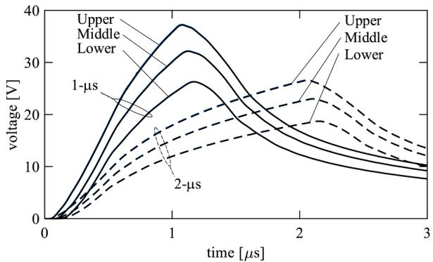

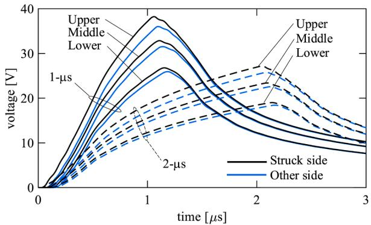  
  
Fig. 2. FDTD analysis results of a lightning strike to the 76-m high transmission tower. (a) Voltages across insulator strings generated by a lightning strike to the center of the tower top, and (b) those generated by a lightning strike to the ground-wire cross-arm of the second circuit. In (a), the voltages in one side and the other are almost overlapped since the lightning strikes the center of the tower top (see Fig. 1(d) for lightning struck-point). Voltages generated by a 1-μs ramp current are shown with solid lines, and those by 2-μs currents are shown with dashed-lines. The current peak is normalized to 1 A.

Table 1 Insulator voltages generated by lightning strike to the ground-wire cross-arm of the second circuit with lightning currents having a rise time of 1 or 2 μs.   

<table><tr><td>Rise rime [μs]</td><td>Phase</td><td>Struck side [V]</td><td>Other side [V]</td><td>Diff.,%</td></tr><tr><td rowspan="3">1 μs</td><td>Upper</td><td>37.7</td><td>35.2</td><td>6.6</td></tr><tr><td>Middle</td><td>32.2</td><td>30.7</td><td>4.4</td></tr><tr><td>Lower</td><td>26.3</td><td>25.4</td><td>3.6</td></tr><tr><td rowspan="3">2 μs</td><td>Upper</td><td>26.9</td><td>25.3</td><td>5.6</td></tr><tr><td>Middle</td><td>23.0</td><td>22.1</td><td>3.9</td></tr><tr><td>Lower</td><td>18.7</td><td>18.1</td><td>3.3</td></tr></table>

and its equivalent circuit model presented in this paper in the right side. In this model, the tower body and main legs are represented by fourcascaded frequency-dependent transmission lines. The cross-arms are represented by mutually-coupled multiphase line models, not by the single-phase constant line as presented in [32]. This configuration of the tower model enables to approximately take into account the non-symmetrical spatial distribution of the electric field and the resultant insulator voltages in the case of lightning strike to one side of the ground-wire cross-arm. The non-TEM characteristics of the transmission tower and line struck by lightning are introduced by considering the surge impedances and propagation characteristics presented in [21].

The surge impedance of the tower body is given by:

$$
Z _ {T} (s) = 6 0 \left\{\ln \left(4 h _ {T} / r _ {e q}\right) - 1 \right\} / \left(1 + \tau_ {T} s\right),
$$

$$
\tau_ {T} = h _ {T} / c _ {0}, r _ {e q} = \left(r _ {\text {t o p}} h _ {U} + r _ {\text {m i d d l e}} h _ {T} + r _ {\text {b a s e}} h _ {L}\right) / 2 h _ {T}, \tag {1}
$$

$$
r _ {t o p} = d _ {t o p} / \sqrt {\pi}, r _ {m i d d l e} = d _ {m i d d l e} / \sqrt {\pi}, r _ {b a s e} = d _ {b a s e} / \sqrt {\pi}.
$$

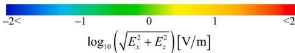

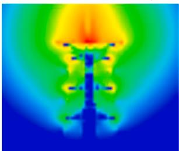

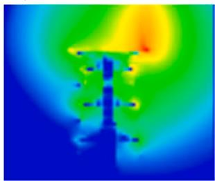  
  
Fig. 3. Distribution of electric-field strength in logarithmic scale, log $_ { 1 0 } ( ( E _ { x } ^ { 2 } \mathrm { ~ + ~ }$ $E _ { z } ^ { 2 } ) ^ { 1 / 2 } )$ , on an x-z plane around the tower yielded by the FDTD analysis at $t =$ 0.16 μs. (a) Lightning strike to the center of the tower top and (b) that to the ground-wire cross-arm of the second circuit. The color scale bar for the electric field strength (shown in the above) is valid for the both cases.

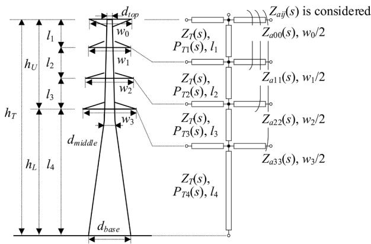  
Fig. 4. TEM-delay circuit model of an EHV/UHV transmission tower considering tower cross-arms. The tower main legs are represented by a four-cascaded frequency- (time-) dependent line with attenuation. The cross-arms are represented by mutually-coupled frequency- (time-) dependent lines without attenuation.

Definitions of $h _ { T } ,$ hU, hL, $d _ { t o p } , d _ { m i d d l e } ,$ and $d _ { b a s e }$ are found in Fig. 4. The radii, $r _ { t o p } ,$ rmiddle, and $r _ { b a s e }$ are obtained such that the circuital crosssection of the circuit model has the same area as the square crosssection of the tower. The radius $r _ { e q }$ is weighted-equivalent radius of the whole tower.

The first-order delay function in (1) is introduced to consider the TEM-mode formation [21]. The surge impedance is assumed to be the same for each segment of the tower. The step-current response of the propagation characteristic of the tower body and main legs is given as:

$$
p _ {T} (t) = 1 - p _ {T a} \exp (- t / \beta_ {T a}) - (1 - p _ {T a}) \exp (- t / \beta_ {T b}), \tag {2}
$$

where $p _ { T a } = 0 . 8 , \beta _ { T a } = 0 . 1 h _ { U } / c _ { 0 } , \beta _ { T b } = 2 0 h _ { L } / c _ { 0 } .$

The coefficient of $\beta _ { T a }$ is set a smaller value than the value in the model that does not consider the tower cross-arms explicitly (it was $0 . 5 h _ { U } / c _ { 0 }$ in [21]). The propagation characteristic of the tower along each section in s-domain, $P _ { T k } ( s )$ , has to be obtained from the characteristic of the whole length given by (2). It is derived by: (i) transforming (2) by Laplace transform and impulse response $P _ { T } ( s )$ is derived, (ii) taking the root function of the transformed one considering the section length $( P _ { T k } ' ( s ) = P _ { T } ( s ) ^ { [ k / h T } )$ , and (iii) applying an approximation technique to $P _ { T k } \mathrm { ' } ( s )$ for deriving rational functions $P _ { T k } ( s )$ that can be interfaced to a circuit simulator.

Each tower cross-arm is represented by the TEM-delay transmission line model [21, 33]. In this model, surge impedances $Z _ { a i i } ( s )$ and $Z _ { a i j } ( s )$ are given by:

$$
Z _ {a i i} (s) = 6 0 \ln \left(2 h _ {i} / r _ {i}\right) / \left(1 + \tau_ {i i} s\right), \tau_ {i i} = h _ {i} / c _ {0}, \tag {3}
$$

$$
Z _ {a i j} (s) = 6 0 \ln \left(D _ {i j} / d _ {i j}\right) \times \left\{ \begin{array}{l} d _ {i j} / \left(D _ {i j} + d _ {i j}\right) \left(1 + \tau_ {i j d} s\right) \\ + D _ {i j} / \left(D _ {i j} + d _ {i j}\right) \left(1 + \tau_ {i j D} s\right) \end{array} \right\}, \tag {4}
$$

$$
\tau_ {i j d} = 2 d _ {i j} / c _ {0}, \tau_ {i j D} = 2 D _ {i j} / c _ {0},
$$

where $d _ { i j }$ is a physical distance between cross-arms, and $D _ { i j }$ is a distance between cross-arms in real and imaginary plane for calculating surge impedances. In (3), radius $r _ { i }$ of the tower cross-arm is given by $( S _ { i } / \pi ) ^ { 1 / 2 } ,$ , where S is the average area of the cross-section of each cross-arm at junctions. The cross-arm is assumed to be a lossless line.

In the TEM-delay transmission line model, the time delays of mutual coupling between one phase and the others are considered by the phase domain modeling [33], in addition to the gradual rise of the surge impedance with time due to the TEM-mode formation [21]. Table 2 shows the convergence values of the self- and mutual-surge impedances. In the circuit model, the ground wires and phase conductors are also represented by the TEM-delay line model. The presented model can be built on EMTP-ATP or other EMT-simulators having a multiphase distributed-parameter line model and a control circuit model.

# 3.2. Discussions on circuit analysis models

The FDTD analysis results presented in Section II.B are discussed using the proposed circuit analysis model. In the circuit analysis, two models of the transmission tower are used: a four-cascaded frequencydependent tower with cross-arms without considering the mutual coupling, and a four-cascaded frequency-dependent tower with crossarms considering the mutual coupling illustrated in Fig. 4. In both models, a current source representing the lightning channel is connected to the tip of the ground-wire cross-arm of the second circuit. Note that the capacitance of the string of insulators is not considered in the presented simulation.

Fig. 5(a) shows the voltages across insulators computed by the model without considering the mutual coupling among the tower cross-arms. In this case, almost the same insulator voltages are yielded in both sides, although the lightning current is injected into the tip of the ground-wire cross-arm. This is because the voltages of the upper, middle and lower cross-arms in both sides are completely identical each other. In other words, the consideration of the cross-arms simply following the tower shape cannot reproduce the effect of asymmetrical lightning strike. Note that the slight difference in computed insulator voltages arises since the voltage rise of the lightning struck-side ground-wire and phase conductors are slightly higher than those of the other side. The voltages, however, still agree well with the FDTD computed results. Thus, in analyzing a smaller tower, a tower with short cross-arms for ground wires, or that with a single ground wire, the simple tower representation (a four-cascaded frequency-dependent line tower model with cross-arms without considering the mutual coupling) or the model without cross-arms [21] can yield sufficiently accurate insulator voltages.

Fig. 5(b) shows the voltages across insulator strings computed by the model considering the mutual coupling among the tower cross-arms. This model yields higher voltages across the insulators located on the lightning-struck side than those on the other side as the FDTD analysis results. The difference in the voltage peaks between the circuit analysis and FDTD analysis results is less than 10%, as summarized in Table 3.

Table 2 Convergence values of cross-arms’ self and mutual surge impedances in Ohm.   

<table><tr><td></td><td>GW</td><td>Upper</td><td>Middle</td><td>Lower</td></tr><tr><td>GW</td><td>294</td><td>159</td><td>110</td><td>79.3</td></tr><tr><td>Upper</td><td>159</td><td>261</td><td>144</td><td>96.6</td></tr><tr><td>Middle</td><td>110</td><td>144</td><td>250</td><td>132</td></tr><tr><td>Lower</td><td>79.3</td><td>96.6</td><td>132</td><td>228</td></tr></table>

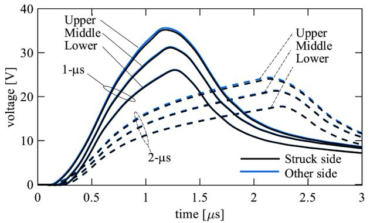

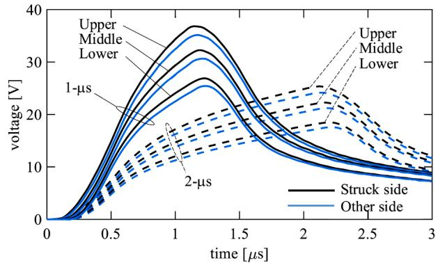  
(a)   
(b)   
Fig. 5. Circuit analysis results of insulator voltages of a 76-m high tower whose ground-wire cross-arm is struck by lightning. (a) Voltages yielded by the simpler TEM-delay model without the mutual coupling among the cross-arms, and (b) those by the presented model with the mutual couplings. The waveforms are to be compared with those shown in Fig. 2(b) (not Fig. 2(a), in which the lightning strikes the center of the tower top). Voltages yielded by a 1-μs current are plotted by solid lines, and those by a 2-μs current are plotted by dashed lines. The current peak is normalized to 1 A. (For interpretation of the references to colour in this figure legend, the reader is referred to the web version of this article.)

Table 3 Insulator voltages computed by the FDTD method and the proposed circuit model.   

<table><tr><td rowspan="2">Rise rime [μs]</td><td rowspan="2">Phase</td><td colspan="2">Struck side [V]</td><td colspan="2">Other side [V]</td></tr><tr><td>FDTD</td><td>Proposed</td><td>FDTD</td><td>Proposed</td></tr><tr><td rowspan="3">1 μs</td><td>Upper</td><td>37.7</td><td>38.3</td><td>35.2</td><td>36.4</td></tr><tr><td>Middle</td><td>32.2</td><td>33.4</td><td>30.7</td><td>31.7</td></tr><tr><td>Lower</td><td>26.3</td><td>27.9</td><td>25.4</td><td>26.4</td></tr><tr><td rowspan="3">2 μs</td><td>Upper</td><td>26.9</td><td>26.7</td><td>25.3</td><td>25.3</td></tr><tr><td>Middle</td><td>23.0</td><td>23.3</td><td>22.1</td><td>22.1</td></tr><tr><td>Lower</td><td>18.7</td><td>19.3</td><td>18.1</td><td>18.3</td></tr></table>

The presented tower model can approximately consider the presence of the tower cross-arms and even the influence of the difference of electromagnetic field depending on the side of the lightning strike. The proposed model extends the model in [21] for considering lightning-struck point and cross-arms. The proposed model enables in-depth analysis of lightning surges considering lightning-struck point and back-flashover phases.

# 4. Validation of the circuit analysis model

In this section, waveforms of insulator voltages measured at an actual 140-m high UHV transmission tower [34] is reproduced using the proposed tower model considering the mutual couplings among the

tower cross-arms. Fig. 6 shows the setup of an experiment performed for the UHV transmission tower. In this experiment, a step-like current was injected into the center of the tower top through a horizontally tensioned injection wire. No experiment was carried out for a current injection to one side of the ground-wire cross-arm. The voltages of the tower cross-arms and power lines are measured using an auxiliary potential wire. In addition, the voltages across insulator strings were measured (but only in one side). The other measurement conditions such as the detailed shape of the tower, transmission line configurations, and current injection circuit are found in [34].

In [34], circuit analysis results with a multistory transmission tower model for UHV-class towers were also presented. In this model, both the tower surge impedances, $Z _ { T 1 }$ and $Z _ { T 2 } ,$ , for the upper and lower parts of the tower were set to 120 $\Omega ,$ and the attenuation coefficient, $\gamma ,$ was set to 0.7 so that the measured peaks of insulator voltages could be reproduced well with circuit analysis. Note that in the original model for 500 kV towers, $Z _ { T 1 }$ and $Z _ { T 2 }$ were set to 220 and 150 Ω, and $\gamma$ was set to 0.8. Here, a circuit analysis is performed using this model and using the presented model in this paper. In the analysis using the multistory tower model, the transmission line is represented by JMarti’s line model [34]. Also note that in the presented model, the tower surge impedance is multiplied by 0.7 in order to consider the effect of the horizontally arranged current injection wire [35]. The DC grounding resistance was 2.0 Ω for the studied tower. The injected current waveform is the 1/70 μs triangular current with 1-A peak, and the source circuit shown in [34] is employed.

Fig. 7 shows the measured and simulated voltages of the upper-phase cross-arm, insulator, and power line, and Table 4 shows the peak insulator voltages in the upper to lower phase given by the experiment and simulations. In the measured waveforms, the voltages decay after taking their peaks. For instance, the voltage of the upper-phase cross-arm crosses zero at around 2.8 μs in the measured waveform, while the simulated voltages do not cross at that time. This difference is caused by the effect of the auxiliary potential wire as discussed in [34]. It has been also shown in [35,36] that the tower voltages decay faster with the horizontal current injection comparing to those induced by the current injection from the upper angles. As shown in the figure and the table, both the proposed tower model and the multistory tower model yield similar peaks for voltages in any observation point. This results show the applicability of the proposed tower model for the actual towers. In addition, the proposed model yields a more similar rising part to the corresponding measured one because of its inclusion of the delay of the TEM-mode formation, and does not need any trial-and-error process for determining the model parameters since they are given by the configuration of the tower. This fact shows the rationality and usefulness of the proposed model.

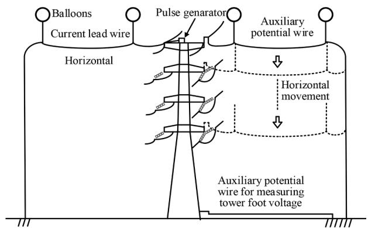  
Fig. 6. Setups of the experiment performed for an actual UHV transmission tower [34].

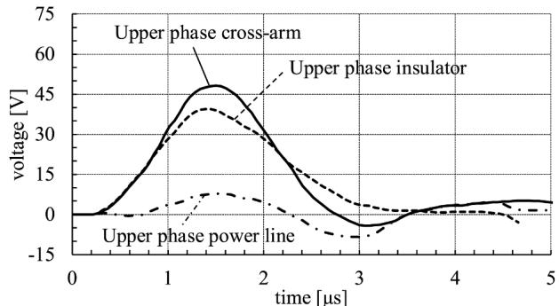

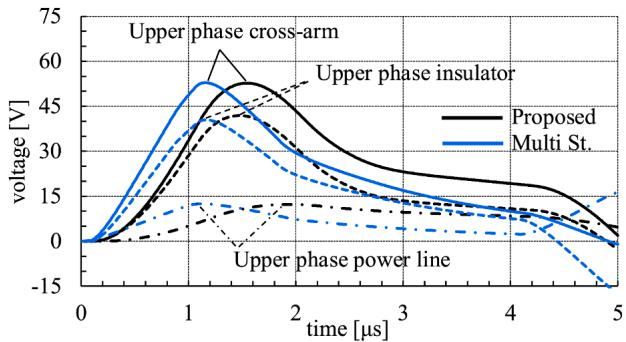  
  
(b)   
Fig. 7. Comparison of the voltages of tower upper-phase cross-arm, insulator string, and power line induced by 1/70 μs, 1-A peak current obtained by (a) the measurement [34], and (b) circuit simulation performed with the proposed tower model (see Fig. 4) and the multistory transmission tower model with the surge impedance $Z _ { T 1 } = Z _ { T 2 } = 1 2 0 ~ \Omega ~ [ 3 4 ]$ .

Table 4 Comparison of peak voltages across insulator strings induced by 1-A peak current obtained by the measurement and circuit analysis models.   

<table><tr><td>Phase</td><td>Measured [34]</td><td>Proposed model</td><td>Multistory model (120 / 120) [34]</td></tr><tr><td>Upper</td><td>39.2 V</td><td>41.9 V (+6.7%)</td><td>41.6 V (+6.1%)</td></tr><tr><td>Middle</td><td>34.9 V</td><td>38.1 V (+9.3%)</td><td>39.1 V (+12%)</td></tr><tr><td>Lower</td><td>30.6 V</td><td>33.5 V (+9.6%)</td><td>33.7 V (+10%)</td></tr></table>

# 5. Conclusions

Voltages generated across insulator strings of a vertical doublecircuit transmission tower, when lightning strikes the tip of groundwire cross-arm, were studied using the FDTD method in the present paper. The FDTD analysis has revealed that when lightning strikes one side of ground-wire cross-arm, insulator voltages of the lightning-struck side are up to 7% higher than those in the other side. This is because the electromagnetic field is more intense in the struck-side. The voltage difference can have an effect on the back-flashover phases. Most of existing equivalent circuits of transmission tower cannot consider the difference of electromagnetic field or its resultant voltages depending on the side of lightning strike. In this paper, a new equivalent circuit model, which can consider the difference of voltages depending on the side of lightning strike, was proposed for circuit analysis. The validity of the proposed equivalent circuit model was shown by reproducing waveforms of insulator voltages computed using the FDTD method in this paper and those measured on an actual UHV transmission tower already available in the literature with less than 10% differences. The proposed model does no need any trial-and-error process or numerical electromagnetic analysis in determining the circuit parameters.

# CRediT authorship contribution statement

Akifumi Yamanaka: Conceptualization, Methodology, Software, Validation, Formal analysis, Data curtion, Investigation, Writing – original draft, Visualization. Naoto Nagaoka: Resources, Writing – review & editing, Supervision, Funding acquisition, Project administration. Yoshihiro Baba: Writing – review & editing, Supervision.

# Declaration of Competing Interest

The authors declare that they have no known competing financial interests or personal relationships that could have appeared to influence the work reported in this paper.

# References

[1] Subcommittee for power stations and substations, Study committee on lightning risk, “Guide to lightning protection design of power stations, substations and underground transmission lines (rev. 2011),” CRIEPI Report, no. H06, Sep. 2012.   
[2] IEEE Standards Board, “IEEE guide for improving the lightning performance of transmission lines,” IEEE Std., no. 1243–1997, Jun. 1997.   
[3] CIGRE WG C4.37, “Electromagnetic computation methods for lightning surge studies with emphasis on the FDTD method,” CIGRE Tech. Brochure, no. 785, Dec. 2019.   
[4] H.W. Dommel, Digital computer solution of electromagnetic transients in singleand multiphase networks, IEEE Trans. Power App. Syst. PAS-88 (4) (1969) 388–399. Apr.   
[5] K.S. Yee, Numerical solution of initial boundary value problems involving Maxwell’s equation in isotropic media, IEEE Trans. Antennas Propag. 14 (3) (1966) 302–307. May.   
[6] T. Noda, A tower model for lightning overvoltage studies based on the result of an FDTD simulation, Electr. Eng. Jpn. 164 (1) (2008) 8–20. Jan.   
[7] J. Takami, T. Tsuboi, K. Yamamoto, S. Okabe, Y. Baba, FDTD simulation considering an AC operating voltage for air-insulation substation in terms of lightning protective level, IEEE Trans. Dielectr. Electr. Insul. 22 (2) (2015) 806–814. Apr.   
[8] A. Tatematsu, T. Ueda, FDTD-based lightning surge simulation of an HV airinsulated substation with back-flashover phenomena, IEEE Trans. Electromagn. Compat. 58 (5) (2016) 1549–1560. Oct.   
[9] T.H. Thang, Y. Baba, N. Itamoto, V.A. Rakov, FDTD simulation of back-flashover at the transmission-line tower struck by lightning considering ground-wire corona and operating voltages, Electr. Power Syst. Res. 159 (2018) 17–23. Jun.   
[10] J.A. Martinez, F.C. Aranada, Lightning performance analysis of overhead transmission lines using the EMTP, IEEE Trans. Power Del. 20 (3) (2005) 2200–2210. Jul.   
[11] K. Munukutla, V. Vittal, G. Heydt, D. Chipman, B. Keel, A practical evaluation of surge arrester placement for transmission line lightning protection, IEEE Trans. Power Del. 25 (3) (2010) 1742–1748. Jul.   
[12] H. Kawamura, M. Kozuka, N. Itamoto, K. Shinjo, M. Ishii, Evaluation of relative lightning fault rate of transmission lines depending on line design and lightning activity, IEEJ Trans. Power and Energy 130 (10) (2010) 895–902. Oct.   
[13] Z.G. Datsios, P.N. Mikropoulos, T.E. Tsovilis, Effects of lightning channel equivalent impedance on lightning performance of overhead transmission lines, IEEE Trans. Electromagn. Compat. 61 (3) (2019) 623–630. Jun.   
[14] Z. G. Datsios, P. N. Mikropoulos and T. E. Tsovilis, "Closed-form expressions for the estimation of the minimum backflashover current of overhead transmission lines," in IEEE Transactions on Power Delivery, vol. 36, no. 2, pp. 522-532, April 2021.   
[15] N. Itamoto, H. Kawamura, K. Shinjo, Y. Tanaka, T. Noda, Lightning fault rate calculation of transmission lines taking statistical variation of arching-horn flashovers into account, IEEJ Trans. Power and Energy 140 (2) (2020) 126–133. Feb.   
[16] M.A. Sargent, M. Darveniza, Tower surge impedance, IEEE Trans. Power App. Syst. PAS-88 (5) (1969) 680–687. May.   
[17] A. Ametani, Y. Kasai, J. Sawada, A. Mochizuki, T. Yamada, Frequency-dependent impedance of vertical conductors and a multiconductor tower model, IEE Proc.- Gener. Transm. Distrib. 141 (4) (1994) 339–345. Jul.   
[18] M. Ishii, T. Kawamura, T. Kouno, E. Ohsaki, K. Murotani, T. Higuchi, Multistory transmission tower model for lightning surge analysis, IEEE Trans. Power Del. 6 (3) (1991) 1327–1335. Jul.   
[19] M. Saito, M. Ishii, M. Miki and K. Tsuge, "On the evaluation of the voltage rise on transmission line tower struck by lightning using electromagnetic and circuit-based analyses," in IEEE Transactions on Power Delivery, vol. 36, no. 2, pp. 627-638, April 2021.   
[20] A. Ametani, N. Triruttanapiruk, K. Yamamoto, Y. Baba, F. Rachidi, Impedance and admittance formulas for a multistair model of transmission towers, IEEE Trans. Electromagn. Compat. 62 (6) (2020) 2491–2502. Dec.   
[21] N.Nagaoka Yamanaka, Y. Baba, Circuit model of vertical double-circuit transmission tower and line for lightning surge analysis considering TEM-mode formation, IEEE Trans. Power Del. 35 (5) (2020) 2471–2480. Oct.

[22] H. Motoyama, K. Shinjo, Y. Matsumoto, N. Itamoto, Observation and analysis of multiphase back flashover on the Okushishiku Test Transmission Line caused by winter lightning, IEEE Trans. Power Del. 13 (4) (1998) 1391–1398. Oct.   
[23] T. Noda, S. Yokoyama, Development of a general surge analysis program based on the FDTD method, IEEJ Trans. Power and Energy 121 (5) (2001) 625–632. May.   
[24] A. Tatematsu, “Development of a surge simulation code VSTL REV based on the 3D FDTD method,” in Proc. Joint IEEE Int. Symp. Electromagn. Compat., pp. 1111–1116, 2015.   
[25] Z.P. Liao, H.L. Wong, B.P. Yang, Y.F. Yuan, A transmitting boundary for transient wave analysis, Sci. Sin. A27 (10) (1984) 1063–1076. Oct.   
[26] T. Noda, R. Yonezawa, S. Yokoyama, Y. Takahashi, Error in propagation velocity due to staircase approximation of an inclined thin wire in FDTD surge simulation, IEEE Trans. Power Del. 19 (4) (2004) 1913–1918. Oct.   
[27] T. Noda, S. Yokoyama, Thin wire representation in finite difference time domain surge simulation, IEEE Trans. Power Del. 19 (3) (2002) 840–847. Jul.   
[28] Y. Taniguchi, Y. Baba, N. Nagaoka, A. Ametani, An improved thin wire representation for FDTD computations, IEEE Trans. Antennas Propag. 56 (10) (2008) 3248–3252. Oct.   
[29] Y. Baba, V.A. Rakov, On the transmission line model for lightning return stroke representation, Geophys. Res. Lett. 30 (24–2294) (2003) 13–1–13–14. Dec.

[30] S. Visacro, F.H. Silveira, Lightning performance of transmission lines: methodology to design grounding electrodes to ensure an expected outage rate, IEEE Trans. Power Del. 30 (1) (2015) 237–245. Feb.   
[31] B. Salarieh, H.M.J. De Silva, A.M. Gole, A. Ametani, B. Kordi, An electromagnetic model for the calculation of tower surge impedance based on thin wire approximation," in, IEEE Transactions on Power Delivery 36 (2) (2021) 1173–1182. April.   
[32] T. Hara, O. Yamamoto, Modelling of a transmission tower for lightning-surge analysis, IEE Proc.-Gener. Transm. Distrib. 143 (3) (1996) 283–289. May.   
[33] A. Yamanaka, N. Nagaoka, and Y. Baba, “Circuit model of an overhead line considering the TEM-mode formation delay,” IEEJ Trans. Elect. Electron. Eng. (in press).   
[34] T. Yamada, A. Mochizuki, J. Sawada, E. Zaima, T. Kawamura, A. Ametani, Ishii M, S. Kato, Experimental evaluation of a UHV tower model for lightning surge analysis, IEEE Trans. Power Del. 10 (1) (1995) 393–402. Jan.   
[35] H. Motoyama, Kinoshita Y, K. Nonaka, Y. Baba, Experimental and analytical studies on lightning surge response of 500-kV transmission tower, IEEE Trans. Power Del. 24 (4) (2009) 2232–2239. Oct.   
[36] A. Yamanaka, N. Nagaoka, Y. Baba, H. Motoyama, T. Ueda, Lightning surge response of a transmission tower with overhead lines analyzed by TEM-delay model, IEEJ Trans. Power Energy 141 (2) (2021) 145–153. Feb.