# Comparison of dynamic phasor, discrete-time and frequency scanning based SSR models of a TCSC☆

Kaustav Dey *,a , Mukesh Kumar Das b , A.M. Kulkarni a

a Department of Electrical Engineering, Indian Institute of Technology Bombay, Mumbai, India b ELECTRANIX Corporation, Winnipeg, Manitoba, Canada

# A R T I C L E I N F O

Keywords: Frequency scanning Sub-synchronous resonance Sub-synchronous damping control TCSC Dynamic phasors Discrete-time modelling

# A B S T R A C T

Sub-synchronous Control/Torsional Interactions occur in a power system due to adverse interactions between the electrical network, turbine-generators and power-electronic systems. The extraction of time-invariant models of the system for analysis and design is often an onerous task due to the complex dynamics associated with powerelectronic systems. The modelling techniques proposed in the literature include the use of discrete-time mapping, dynamic phasors and frequency scanning. Frequency scanning is a black-box approach, wherein a time-invariant model is extracted from the simulated response of the system to a probing signal. The first two techniques derive the model directly from the analytical equations (with several simplifying assumptions). This paper compares the accuracy of these models using the example of a SSR-vulnerable system which includes a TCSC. The presence of several poorly damped torsional modes and the use of a TCSC to damp them make this an excellent test case for modelling accuracy. It is seen that the frequency scanning based state-space model is quite accurate and its extraction using simulation and the vector fitting technique presents no significant difficulties, irrespective of the extent of modelling detail. The results demonstrate that this approach can be both convenient and accurate for sub-synchronous interaction studies.

# 1. Introduction

A power system consists of components like synchronous generators, loads, FACTS devices, HVDC converters, renewable sources and storage elements, which are connected to a transmission and distribution network. Sometimes, adverse interactions between these devices result in oscillatory instabilities. Phenomena like Power Swings, Sub-Synchronous Resonance (SSR), Sub-synchronous torsional interactions (SSTI), Sub-synchronous control interactions (SSCI), Induction Generator Effect and Harmonic Instability [1–4] are manifestations of such adverse interactions. Power swings are of relatively lower frequency (0.1 − 2 Hz), and therefore can be analyzed using quasi-sinusoidal steady-state (phasor) models. On the other hand, the other instabilities mentioned here are of higher frequency (typically greater than 10 Hz), and require higher bandwidth models.

Eigenvalue analysis of a linear time-invariant (LTI) model of the system is often used to study these interactions. While detailed time domain simulations of the system using Electromagnetic Transients (EMT) programs can also capture the instabilities, the advantages of

eigenvalue analysis are that (a) it provides insight into the participation of the different states in different modes, and (b) it facilitates the selection of feedback signals, controller structure, and the design of feedback controllers to alleviate instabilities, using well-established techniques. This motivates us to seek accurate LTI models of power system components.

The models of Power Electronic Systems (PES) are time-variant in the phase variables due to switching action. However, they are also timeperiodic, which allows us to obtain LTI models by suitably transforming the variables. In situations where the lower-order switching harmonics are very small and switching is done in a balanced fashion across the three phases, a fundamental frequency approximation of the switching function may be used. It is then possible to obtain a LTI model using the well-known D-Q transformation [5]. For thyristor based PES like HVDC converters, TCSCs and SVCs, which have significant lower order harmonics that may overlap with the controller bandwidth, such approximations may cause inaccuracies in the analysis of sub-synchronous interactions and harmonic instabilities.

To overcome this problem, two general analytical techniques have

been developed for modelling time-periodic systems, namely, (a) discrete-time modelling [6–9] and (b) dynamic phasor modelling [10, 11]. The disadvantages of these analytically derived models are that (a) the derivations have to be customized to the specific PESs, whose controllers may also be non-standard, and (b) the derivations invariably involve several simplifying assumptions in order to make them convenient to incorporate in practical programs. Making these assumptions requires good engineering judgement, as the accuracy of the models for sub-synchronous interaction studies can be quite sensitive to how the control and synchronization schemes are represented. Notwithstanding these challenges, dynamic phasor modelling has been used recently for a variety of PESs [12–17], while discrete-time techniques have been mainly used for the modelling of TCSC [6–9] and LCC-HVDC schemes [18,19].

Frequency scanning is a numerical model identification technique [4], which uses a simulation model of the system. The frequency response of the system is obtained from the simulated response to a known small-amplitude, wide-band periodic probing signal. As this is a black-box technique, there is no limitation on the extent of detail in the simulation model. Frequency scanning is being utilized as a screening tool for sub-synchronous interaction analyses [20–24], especially for wind farms. Typically these screening tools directly utilize the frequency domain information like impedance or damping and synchronizing torques. However, one can go a step further: the numerically obtained frequency response can be fitted to a rational transfer function using a vector fitting algorithm [25], from which an equivalent state space model can be obtained. The state-space model can then be interfaced with the model of the rest of the system. This facilitates a quantitative analysis of stability through the computation of the eigenvalues and their sensitivities to various parameters, thus bringing the frequency scanning model on par with the analytically derived models.

Motivated by the foregoing discussion, this paper compares the accuracy of the frequency scanning and the analytically derived models using a detailed case study on the impact of a TCSC on a SSR-vulnerable system. The overall complexity of the system, coupled with the low damping ratios of multiple torsional modes make this an ideal “stress test” for evaluating the accuracy of the techniques.

The main contribution of this paper is to put the different models on the same level and compare their predictions in a rigorous, quantitative manner. The results indicate that the discrete-time and the frequency scanning models give good accuracy, which is confirmed by simulation studies. The numerical extraction of the state-space model of the system through frequency scanning and vector fitting is found to be a feasible, convenient and accurate approach for sub-synchronous interaction studies.

# 2. TCSC: A brief description

A TCSC consists of a fixed capacitor in parallel with a controllable reactor, as shown schematically in Fig. 1. The firing angle delay of the thyristors can be adjusted to control the equivalent reactance offered by the device. The reactance is usually capacitive. Thus a TCSC can provide variable series compensation of a transmission line. The dynamical equations for one phase of a TCSC are:

$$
C \frac {d v _ {T}}{d t} = \left(i _ {L} - i _ {T}\right), \quad L \frac {d i _ {T}}{d t} = q v _ {T}
$$

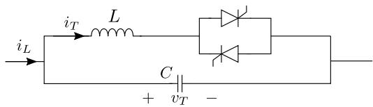  
Fig. 1. A TCSC.

where q is a switching function depending on thyristor status. $q = 1$ when any one thyristor is conducting, and q = 0 when none of the thyristors are conducting.

The steady state waveforms of the inductor current and the capacitor voltage with respect to the line current are shown in Fig. 2. The conduction period σ is symmetric about the peak of the line current in steady state, but this may not be satisfied during transients.

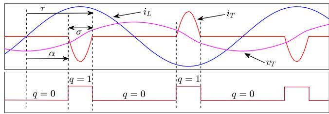  
Fig. 2. TCSC steady-state waveforms.

A TCSC can be controlled using feedback controllers, as shown in Fig. 3, and may include an auxiliary SSR Damping Controller (SSDC) and a Power Swing Damping Controller (PSDC). The line current has lower harmonic distortion as compared to the voltage, and is usually used as the input to the Phase Locked Loop (PLL). The firing angle controller and PLL may be done at the individual phase level. The TCSC normally operates in the capacitive vernier region, wherein the equivalent reactance is capacitive and can be smoothly varied. It can also operate in the bypass mode or the blocked mode (wherein q is one or zero throughout the cycle respectively) under special conditions like faults.

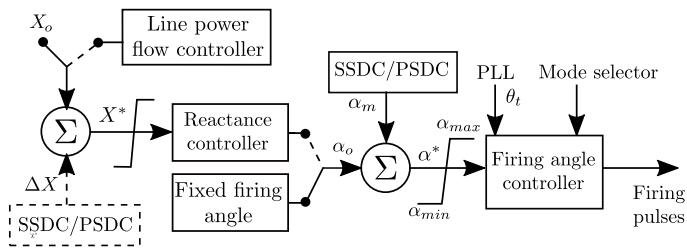  
Fig. 3. TCSC controller.

# 3. Modelling techniques

# 3.1. Discrete-Time model

Consider a power system with an embedded PES. If the continuoustime model of the entire system is linearized around the steady-state trajectory, then the resulting equations are generally time-periodic, that is, $\begin{array} { r } { \boldsymbol { A } ( t ) = \boldsymbol { A } ( t + T ) } \end{array}$ , where T is the time-period of the system. The response of the time-variant system can be represented by the state transition matrix of the system [26], Φ, as follows:

$$
\Delta x (t) = \Phi (t, t _ {o}) \Delta x (t _ {o})
$$

Since the system is time-periodic, it follows that Φ(t + T, t) is independent of t. Therefore, the mapping between successive samples of Δx can be expressed as $\Delta x _ { k + 1 } = A _ { d } \Delta x _ { k }$ , where $A _ { d }$ is sample-invariant (not dependent on k).

# 3.1.1. Choice of sampling instants for a TCSC

The model is generally derived in the synchronously rotating frame of reference (having a constant frequency), for which sample invariance can be achieved for a time period which is one-sixth of the fundamental period [27,28]. For this, the zero sequence variables (denoted by fo) may either be neglected or transformed using the transformation $f _ { z k } =$

$( - 1 ) ^ { k } f _ { o k }$ . The derivation assumes that the TCSC is in the capacitive vernier operating mode with conduction angle limited to 60◦. The sampling instants are chosen such that the conduction period of the thyristors lie within the sampling intervals, as shown in Fig. 4.

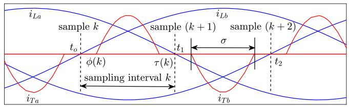  
Fig. 4. Timing diagram depicting sampling instants.

# 3.1.2. Modularity and interfacing issues

The derivation of $A _ { d }$ generally requires the evaluation of the state transition matrix of the entire system including the TCSC. Significant simplicity and convenience can be achieved if line currents in the synchronously rotating frame are assumed to be constant [8] or linearly varying [27] between the samples. This is a reasonable assumption since the sampling interval is small. The TCSC model can then be derived independent of the rest of the system, i.e., in a modular fashion. The general form of this model is as given in (1).

$$
\Delta z _ {k + 1} = A _ {d t} \Delta z _ {k} + B _ {d t} \Delta u _ {k} + B _ {d c} \Delta u _ {c k} \tag {1}
$$

Here, $z _ { k } = { [ \nu _ { T D k } \nu _ { T Q _ { k } } \nu _ { T z k } ] } ^ { T }$ denotes the TCSC capacitor voltages, while $u _ { k } =$ [iLDk $i _ { L Q _ { k } } \ i _ { L z { k } } \big ] ^ { T }$ denotes the line currents. The ‘D’ and $\mathbf { \bar { Q } } ^ { \prime }$ subscripts indicate that the variables are in the synchronously rotating frame of reference. The controller may be modelled separately (especially in the design phase) or may be subsumed in the TCSC model by augmenting its states. In the former case $u _ { c }$ denotes the input from the controller to the TCSC (the change in firing instant, $\Delta \phi _ { k } ) ;$ ; in the latter case uc denotes any feedback signal to the controller that is external to the TCSC.

The overall system model may be obtained either by interfacing the modular TCSC model with the discrete-time model of the rest of the system [27], or by converting the TCSC model to an equivalent continuous-time model [8] and interfacing it with the continuous-time model of the rest of the system. Note that the model of the rest of the system is derived in the same synchronously rotating frame of reference as the TCSC.

# 3.2. Dynamic phasor based model

Consider a continuous time signal $x ( t )$ . The $k ^ { \mathrm { { t h } } }$ Fourier co-efficient or “Dynamic Phasor”, $\langle x \rangle _ { k }$ corresponding to a signal x(t) is defined as given below [11].

$$
\langle x \rangle_ {k} (t) = \frac {1}{T} \int_ {t - T} ^ {t} x (\zeta) e ^ {- j k \omega_ {s} \zeta} d \zeta
$$

where $\begin{array} { r } { \omega _ { s } = \frac { 2 \pi } { T } } \end{array}$ corresponds to the nominal frequency in rad/s. x(t) can then be represented in terms of complex Fourier co-efficients over a window of length T as given in (2).

$$
x (t) = \sum_ {k = - \infty} ^ {\infty} \langle x \rangle_ {k} (t) e ^ {j k \omega_ {s} \zeta} \quad \zeta \in [ t - T, t) \tag {2}
$$

Important properties of dynamic phasors are as follows.

(a) The derivative of a dynamic phasor is given as follows.

$$
\frac {d \langle x \rangle_ {k}}{d t} = \left\langle \frac {d x}{d t} \right\rangle_ {k} - j k \omega_ {s} \langle x \rangle_ {k} \tag {3}
$$

This may be re-written by separating out the real and imaginary terms to obtain a real state-space model.

(b) If $y ( t ) = u ( t ) \nu ( t )$ , then

$$
\langle y \rangle_ {k} = \langle u v \rangle_ {k} = \sum_ {l = - \infty} ^ {\infty} \langle u \rangle_ {k - l} \langle v \rangle_ {l} \tag {4}
$$

(c) If x(t) is real, then $\langle \pmb { x } \rangle _ { - l } = \langle \pmb { x } \rangle _ { l } ^ { H }$ , where ‘H’ indicates the complex conjugate of the variable.

For time-periodic systems, dynamic phasors are constant in the steady-state. The dynamic phasor model of a system in terms of the dynamic phasor variables $\langle x \rangle _ { k } ,$ can be obtained from the original model which is in terms of x, using (3). The relationship given in (4) is useful if multiplicative switching functions (which are time-periodic in steadystate) are present in the original model. The presence of these multiplicative terms causes a coupling between the dynamic phasors corresponding to the different harmonic components k. Since k varies from − ∞ to ∞, a dynamic phasor model is a coupled system of infinite order. Therefore, reducing the model order by considering only a few values of k is necessary for practical studies. The order of reduction depends on the nature of study and requires good engineering judgement.

# 3.2.1. Fundamental frequency dynamic phasor model

The behaviour of a TCSC can be approximated (for each phase) by the fundamental dynamical phasor equation given below [11].

$$
\begin{array}{l} C \frac {d \left\langle v _ {T} \right\rangle_ {1}}{d t} = - \left(j \omega_ {s} C + \frac {1}{j \omega_ {s} L _ {e q} (\sigma)}\right) \left\langle v _ {T} \right\rangle_ {1} + \left\langle i _ {L} \right\rangle_ {1} \\ = - j \omega_ {s} C _ {e q} (\sigma) \left\langle v _ {T} \right\rangle_ {1} + \left\langle i _ {L} \right\rangle_ {1} \\ \end{array}
$$

The equation can be split into real and imaginary parts to obtain a state space model with real variables.

The conduction angle σ is approximated as follows.

$$
\sigma = 2 \times \left[ \frac {\pi}{2} - \alpha^ {*} + \arg \left(- j \langle i _ {L} \rangle_ {1} \langle v _ {T} \rangle_ {1} ^ {H}\right) \right] \tag {5}
$$

where $\alpha ^ { * }$ is the firing angle set-point of the controller. This may be modulated by higher level controllers like a SSDC as shown in Fig. 3. The expression for $C _ { e q } ( \sigma )$ is given by

$$
\begin{array}{l} \frac {C}{C _ {e q} (\sigma)} = 1 + \frac {2}{\pi} \frac {\beta^ {2}}{(\beta^ {2} - 1)} \left[ \frac {2 \cos^ {2} \frac {\sigma}{2}}{(\beta^ {2} - 1)} \left(\beta \tan \frac {\beta \sigma}{2} - \tan \frac {\sigma}{2}\right) \right. \\ \left. - \frac {\sigma}{2} - \frac {\sin \sigma}{2} \right], \text {w h e r e} \beta = \frac {1}{\omega_ {s} \sqrt {L C}} \\ \end{array}
$$

The inductor current $\left. i _ { T } \right. _ { 1 }$ is predominantly associated with transients that are faster than the sub-synchronous variations. Therefore in this model it is assumed that $\left. i _ { T } \right. _ { 1 }$ can be described by an algebraic relationship with $\left. \nu _ { T } \right. _ { 1 }$ . Consequently $\left. i _ { T } \right. .$ does not appear in the model as an independent state variable.

The dynamic phasors of the phase variables are related to the dynamic phasors of the D-Q components as shown below.

$$
\left\langle f _ {Q} \right\rangle_ {0} + j \left\langle f _ {D} \right\rangle_ {0} = j \sqrt {\frac {2}{3}} \left(\left\langle f _ {a} \right\rangle_ {1} + \gamma \left\langle f _ {b} \right\rangle_ {1} + \gamma^ {2} \left\langle f _ {c} \right\rangle_ {1}\right)
$$

where $\gamma = e ^ { j { \frac { 2 \pi } { 3 } } }$ . The dynamic phasors corresponding to $k = 0$ are real, and are the moving average of the corresponding variables over a cycle.

If we assume that the variations within a cycle are small, then $\langle f _ { Q } \rangle _ { 0 } \approx f _ { Q }$ , $\langle f _ { D } \rangle _ { 0 } \approx f _ { D }$ . This facilitates the direct interfacing of the dynamic phasor model with the rest of the system, which is formulated in the D-Q variables.

# 3.2.2. A Higher Order dynamic phasor model

A dynamic phasor model of the TCSC which includes $k = \{ 1 , 3 , 5 \}$ is described by the following equations.

$$
\frac {d \langle v _ {T} \rangle_ {1}}{d t} = - \frac {1}{C} \langle i _ {T} \rangle_ {1} - j \omega_ {s} \langle v _ {T} \rangle_ {1} + \frac {1}{C} \langle i _ {L} \rangle_ {1}
$$

$$
\frac {d \langle i _ {T} \rangle_ {1}}{d t} = \frac {1}{L} \langle q v _ {T} \rangle_ {1} - j \omega_ {s} \langle i _ {T} \rangle_ {1}
$$

$$
\frac {d \langle v _ {T} \rangle_ {3}}{d t} = \frac {j}{3 \omega_ {s} L C} \langle q v _ {T} \rangle_ {3} - j 3 \omega_ {s} \langle v _ {T} \rangle_ {3}
$$

$$
\frac {d \langle v _ {T} \rangle_ {5}}{d t} = \frac {j}{5 \omega_ {s} L C} \langle q v _ {T} \rangle_ {5} - j 5 \omega_ {s} \langle v _ {T} \rangle_ {5}
$$

This model is obtained by making the following simplifying assump tions:

(i) The line current is relatively free of harmonic phasor components. Therefore $\langle i _ { L } \rangle _ { k } = 0$ for $k \neq 1$ .   
(ii) $\langle i _ { T } \rangle _ { 3 }$ and $\langle i _ { T } \rangle _ { 5 }$ are relatively fast-changing variables. Therefore, for sub-synchronous oscillations they can be algebraically related to the states $\langle q \nu _ { T } \rangle _ { 3 }$ and $\langle q \nu _ { T } \rangle _ { 5 }$ as follows, instead of being independent states.

$$
\langle i _ {T} \rangle_ {3} = \frac {1}{j 3 \omega_ {s} L} \langle q v _ {T} \rangle_ {3}, \langle i _ {T} \rangle_ {5} = \frac {1}{j 5 \omega_ {s} L} \langle q v _ {T} \rangle_ {5}
$$

(iii) The dynamic phasors corresponding to q are given by:

$$
\begin{array}{l} \langle q \rangle_ {k} = \frac {\sin \left(\frac {k \sigma}{2}\right)}{\frac {k \pi}{2}} e ^ {- j k (\pi - \kappa)}, \quad k = 0, 2, 4 \dots \\ = 0, \quad k = 1, 3, 5 \dots \\ \end{array}
$$

where $\begin{array} { r } { \pi - \kappa = \alpha ^ { * } + \frac { \sigma } { 2 } , } \end{array}$ and σ is as given in (5).

Note that the expression for $\langle q \rangle _ { k }$ given above is the steady state expression and is not, strictly speaking, valid under transient conditions. However this is a useful expedient that facilitates the model development, given that a general analytical expression for $\langle q \rangle _ { k }$ is difficult to derive1 .

The dynamic phasors of $q \nu _ { T }$ can now be calculated using (4) and the dynamic phasors of vT and q. As a result of the assumptions (i) and (iii), the even harmonic phasors $( k = 0 , 2 , 4 , . )$ ) of vT and $i _ { T }$ are decoupled from the odd harmonic phasors $( k = 1 , 3 , 5 , . )$ of the TCSC and are also decoupled from the rest of the system. Hence they do not affect the dynamics of the rest of the system, and may be neglected.

The dynamic phasor model of the TCSC is interfaced with a dynamic phasor model of the rest of the system, as depicted in Fig. 5. A dynamic phasor model of the rest of the system, consisting of synchronous generator(s) and a transmission network, can be derived as given in [29].

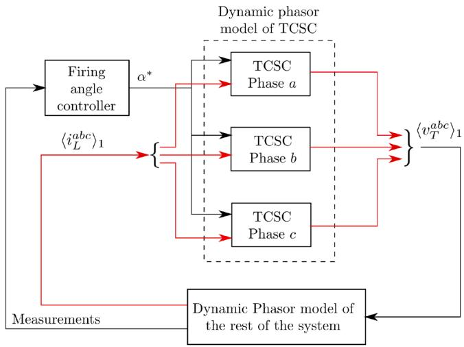  
Fig. 5. Interfacing a TCSC with the rest of the system.

Note that the choice of a reduced set of dynamic phasors for the rest of the system is also not unique. However, to be consistent with the earlier assumption (i), only the fundamental dynamic phasors for generator stator fluxes and transmission network currents and voltages are considered here. The generator rotor fluxes are modelled by the dynamic phasors corresponding to $k = 0$ and $k = 2 ,$ while the generator rotor angle and speed are only modelled by their k = 0 dynamic phasors.

# 3.3. Numerical frequency scanning

Frequency scanning involves the use of a time-domain simulation program to numerically obtain the small-signal frequency response of a system [4]. In this technique, a small-amplitude, wide-band periodic signal is injected as an input in the time-domain simulation of the system. This injection is superimposed upon the existing sources (as shown in Fig. 6), which are required to set up the equilibrium conditions around which the response is obtained. The small-signal frequency response of the system is obtained in the periodic steady-state by computing the frequency components of the input signal and the output variables. Examples of inputs and outputs are current and voltage (to obtain the impedance), and generator speed and electrical torque (to obtain synchronizing/damping torques).

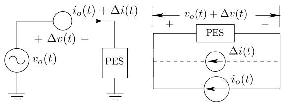  
Fig. 6. Voltage and current injection based frequency scanning.

A frequency scanning scheme to obtain the frequency response of the impedance of a PES in the D-Q variables is shown in Fig. 7. The implicit assumption here is that the underlying model is time-invariant in the D-Q variables (synchronously rotating frame of reference), and the PES which is being probed is stable when connected to a voltage/current source. The zero sequence variables are assumed to be negligible. A wide-band, small-magnitude periodic signal is injected one at a time at the D-Q current ports as shown in the figure. To obtain this matrix transfer function, the multi-sine signal of the form given in (6) is used.

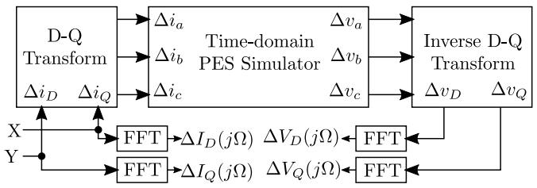  
Fig. 7. D-Q based injection for frequency scanning. The multi-sine signal is injected one at a time at X and Y.

$$
u (t) = a \sum_ {l = N _ {1}} ^ {N _ {2}} \sin \left(2 \pi l f _ {d} t + \phi_ {l}\right) \tag {6}
$$

where $\phi _ { l }$ may be chosen such that the maximum amplitude of $u ( t )$ is small. An example of such a choice is $\begin{array} { r } { \phi _ { l } \ = \ - \frac { ( l - N _ { 1 } ) ( l - N _ { 1 } + 1 ) } { N _ { 2 } - N _ { 1 } + 1 } \times \pi \ : [ 3 0 ] } \end{array}$ (l− N1)(l− N1+1) × π [30]. The system is simulated using a time-domain simulator and ΔvD and $\Delta \nu _ { Q }$ are measured. Once we have the individual measurements of all outputs and the inputs, we can find the frequency response of the inputs and outputs using the Fast-Fourier Transform (FFT) algorithm, as shown in Fig. 7. A frequency dependent impedance matrix may be then be formed as depicted in Fig. 8.

The well-known vector fitting technique [25] may be used to obtain a state-space model of the PES. The state-space model derived in this manner can then be interfaced with the state-space model of the rest of the system in the same synchronously rotating frame of reference, as shown in Fig. 8.

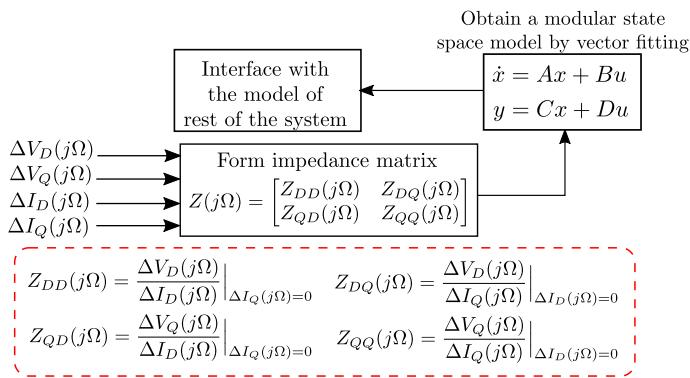  
Fig. 8. Schematic of model extraction and interfacing with the rest of the system.

Note: In addition to the terminal currents and voltages, other inputs and outputs may also be considered. For example, the set-points of the controllers and feedback signals could be added to the vector of inputs and outputs respectively. This could be useful for design of feedback controllers. In particular for a TCSC, an expanded transfer function may be obtained as follows by considering α as an additional input variable.

$$
\left[ \begin{array}{c} \Delta V _ {T D} (s) \\ \Delta V _ {T Q} (s) \end{array} \right] = \left[ \begin{array}{c c c} Z _ {D D} (s) & Z _ {D Q} (s) & G _ {1 1} (s) \\ Z _ {Q D} (s) & Z _ {Q Q} (s) & G _ {2 1} (s) \end{array} \right] \left[ \begin{array}{c} \Delta I _ {L D} (s) \\ \Delta I _ {L Q} (s) \\ \Delta \alpha (s) \end{array} \right]
$$

# 4. Case study

# 4.1. System description

Consider the series compensated single-machine infinite bus system shown in Fig. 9. The series compensation consists of a fixed capacitor component and a variable (TCSC) component.

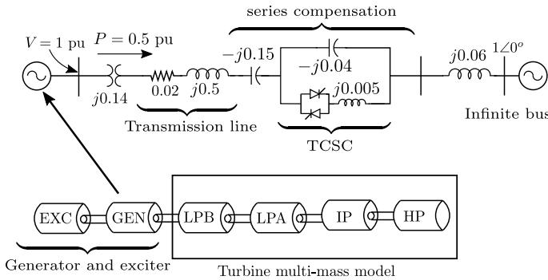

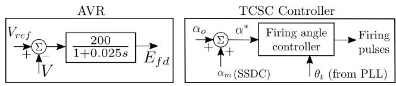  
Fig. 9. System under study.

The parameters of the generator, network and multi-mass turbine model are taken from the IEEE First Benchmark Model for SSR [31]. The Automatic Voltage Regulator (AVR) parameters and the quiescent values of power flow and terminal voltage are indicated in the figure. The time constants of the different components are in seconds. The network components are represented by their impedances in per unit. The block diagram of the PLL used for the studies is shown in Fig. 10.

The system has five torsional modes of which one is insensitive to the electrical network. In addition, there is one sub-synchronous network mode and one super-synchronous mode due to the series capacitor. The system is vulnerable to SSR due to the proximity of one or more torsional modes to the sub-synchronous network mode. The aim of this case study is to test how accurately the models described in the previous section are able to capture the impact of the TCSC on the torsional damping. A comparison between the eigenvalues obtained from the state-space models is presented. The results are also compared with the response

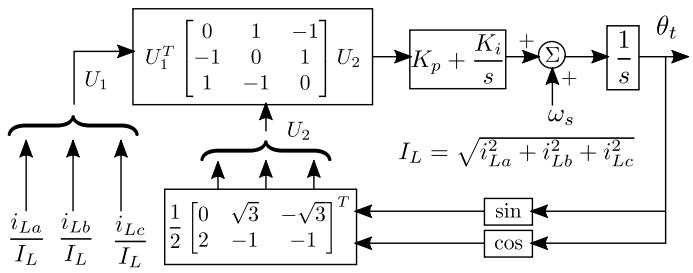  
Fig. 10. Current-input based PLL.

obtained from a simulation study.

# 4.2. Model and simulation parameters

# 4.2.1. Discrete-Time model

The discrete-time model is a six-sample per cycle model. The synchronization scheme (PLL) and controller are modelled in detail. The interfacing with the rest of the system is done in the discrete domain as given in [27].

# 4.2.2. Dynamic phasor model

The fundamental frequency and the higher order dynamic phasor models (given in Section 3.2.1 and 3.2.2 respectively) are used here. Note that the PLL is not represented in detail in both the models; the synchronization is modelled in an approximate fashion, as given in (5).

# 4.2.3. Frequency scanning

The frequency scanning model is obtained using a PSCAD simulation [32], with a time-step of 5 μs. The parameters of the multi-sine injection are as follows: $N _ { 1 } = 1 , N _ { 2 } = 2 3 9 0 , f _ { d } = 0 . 1 \mathrm { H z } , a = 0 . 0 0 0 0 8 7$ rad for Δα input, a = 0.1 A for $\Delta \dot { \boldsymbol { { i } } } _ { D }$ and $\Delta i _ { Q }$ input. The elements of the numerically obtained frequency response matrix of the TCSC, are fitted to rational transfer functions using the vector fitting technique. An eighteenth order model is found to give a good fit of all the elements of the transfer function matrix.

For illustration, the frequency response of $Z _ { D D } ( s )$ obtained by frequency scanning is shown in Fig. 11. The frequency response of the rational transfer function approximation is also shown. It is seen that the rational transfer function fits the frequency response obtained by scanning quite well. The rational transfer function matrix is converted to a minimal state-space form and combined with the state-space model of the rest of the system.

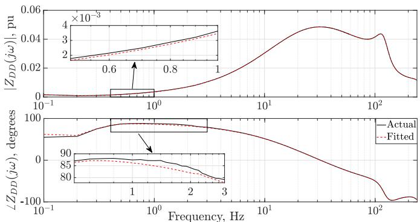  
Fig. 11. Actual and Fitted $Z _ { D D } ( s )$ for $\alpha _ { o } = 7 0 ^ { o }$ .

# 4.3. Fixed firing angle control

The eigenvalues of the combined system are shown in Table 1, for constant $\alpha _ { o } = 7 0 ^ { o }$ . The effect of different PLL parameters on the system eigenvalues are shown. The eigenvalues obtained from the frequency scanning results match quite well with the eigenvalues obtained from the discrete-time model. The dynamic phasor models which are based on many simplifications give significantly different damping values of the torsional modes. As expected, all models give nearly the same result for the low frequency “swing” mode.

# 4.4. Slip input SSDC

The TCSC is now equipped with the slip-input SSDC shown in Fig. 12 and the high bandwidth PLL. The eigenvalues are obtained for different SSDC gains and are shown in Table 2.

As before, the discrete-time and frequency scanning models give similar results, while the dynamic phasor models give significantly different damping values for the torsional modes. To determine the correctness of the results, a simulation study is done. The response to a − 20% pulse in the infinite bus voltage magnitude at t = 10 s for a

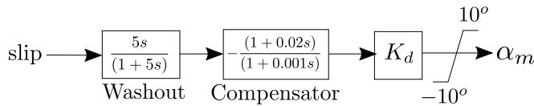  
Fig. 12. Block diagram of slip input SSDC.

duration of 0.01 s, are shown in Figs. 13 and 14. The SSDC is activated at t = 20 s (i.e. 10 s after the disturbance has been initiated).

The responses clearly show the growth of oscillations after the disturbance. The slip-input SSDC is able to damp out this effectively when it is activated. The decay of the envelopes in the simulated responses can be used to estimate the real part of the corresponding eigenvalue $\left( \lambda _ { e s t } \right)$ , which is indicated in Fig. 14. This is found to be consistent with the damping and the frequency of the critical eigenvalues obtained from the discrete-time and frequency scanning models in Table 2. On the other hand, both the fundamental frequency and the higher order dynamic phasor models are significantly off-the-mark. The higher order dynamic phasor model is only marginally better than the fundamental frequency dynamic phasor model.

# 4.5. Line current input SSDC

The TCSC is now equipped with the line current input SSDC shown in Fig. 15 and the high bandwidth PLL. The eigenvalues that are obtained for different SSDC gains are shown in Table 3. As before, a simulation study is done to determine the accuracy of the eigenvalue analysis. The responses are shown in Figs. 16, 17 and 18.

The current-input SSDC at the higher gain (Fig. 18) causes an unstable oscillation, which is evident in the line current magnitude but is not observable in the same manner in the shaft torque. This oscillation seems to be the unstable network mode that is predicted by the eigenvalue analysis of Table 3. The eigenvalue estimated from the simulated

Table 1 Relevant eigenvalues with constant α control $( \alpha _ { o } = 7 0 ^ { o } )$ .   

<table><tr><td colspan="2">Low Bandwidth PLL Kp = 36.1 rad/s, Ki = 14.44 rad/s2</td><td colspan="2">High Bandwidth PLL Kp = 144.34 rad/s, Ki = 57.74 rad/s2</td><td>Fundamental frequency Dynamic Phasor Model</td><td>Higher order Dynamic Phasor Model</td><td>Modes</td></tr><tr><td>Discrete-Time Model</td><td>Frequency Scanning</td><td>Discrete-Time Model</td><td>Frequency Scanning</td><td></td><td></td><td></td></tr><tr><td>-0.59 ± j9.6</td><td>-0.609 ± j9.59</td><td>-0.63 ± j9.6</td><td>-0.627 ± j9.59</td><td>-0.636 ± j9.59</td><td>-0.61 ± j9.526</td><td>Swing</td></tr><tr><td>0.011 ± j99.24</td><td>0.018 ± j99.24</td><td>0.019 ± j99.26</td><td>0.020 ± j99.26</td><td>-0.016 ± j99.27</td><td>0.011 ± j99.25</td><td>Torsional 1</td></tr><tr><td>0.002 ± j127.0</td><td>0.003 ± j127.07</td><td>0.004 ± j127.0</td><td>0.004 ± j127.06</td><td>0.003 ± j127.07</td><td>0.003 ± j127.03</td><td>Torsional 2</td></tr><tr><td>0.019 ± j160.7</td><td>0.023 ± j160.68</td><td>0.028 ± j160.7</td><td>0.032 ± j160.68</td><td>0.03 ± j160.68</td><td>0.025 ± j160.68</td><td>Torsional 3</td></tr><tr><td>0.17 ± j203.16</td><td>0.188 ± j203.12</td><td>0.24 ± j203.1</td><td>0.264 ± j203.08</td><td>0.34 ± j203.11</td><td>0.285 ± j203.15</td><td>Torsional 4</td></tr><tr><td>-12.95 ± j221.24</td><td>-16.86 ± j219.66</td><td>-17.3 ± j216.0</td><td>-18.71 ± j212.41</td><td>-13.83 ± j211.3</td><td>-13.04 ± j214.09</td><td>Network 1</td></tr><tr><td>-10.61 ± j533.15</td><td>-15.15 ± j533.61</td><td>-13.3 ± j534.6</td><td>-19.36 ± j533.64</td><td>-12.72 ± j532.3</td><td>-18.12 ± j523.63</td><td>Network 2</td></tr></table>

Table 2 Relevant eigenvalues with slip-input SSDC.   

<table><tr><td>Models</td><td>With Kd=10</td><td>With Kd=30</td></tr><tr><td rowspan="7">Discrete-Time Model</td><td>-0.693 ± j9.58</td><td>-0.86 ± j9.5</td></tr><tr><td>-0.158 ± j99.25</td><td>-0.51 ± j99.3</td></tr><tr><td>-0.019 ± j127.04</td><td>-0.06 ± j127.0</td></tr><tr><td>-0.097 ± j160.72</td><td>-0.34 ± j160.7</td></tr><tr><td>-0.089 ± j203.69</td><td>-0.84 ± j205.0</td></tr><tr><td>-13.96 ± j216.72</td><td>-12.3 ± j214.9</td></tr><tr><td>-11.5 ± j532.5</td><td>-11.2 ± j531.9</td></tr><tr><td rowspan="7">Frequency Scanning</td><td>-0.680 ± j9.586</td><td>-0.786 ± j9.56</td></tr><tr><td>-0.119 ± j99.227</td><td>-0.397 ± j99.15</td></tr><tr><td>-0.016 ± j127.06</td><td>-0.055 ± j127.06</td></tr><tr><td>-0.098 ± j160.70</td><td>-0.359 ± j160.73</td></tr><tr><td>-0.018 ± j203.65</td><td>-0.731 ± j205.07</td></tr><tr><td>-17.817 ± j211.66</td><td>-15.97 ± j209.9</td></tr><tr><td>-19.074 ± j533.22</td><td>-18.51 ± j532.39</td></tr><tr><td rowspan="7">Fundamental frequency Dynamic Phasor Model</td><td>-0.7 ± j9.579</td><td>-0.845 ± j9.525</td></tr><tr><td>-0.175 ± j99.2</td><td>-0.553 ± j99.06</td></tr><tr><td>-0.024 ± j127.06</td><td>-0.08 ± j127.05</td></tr><tr><td>-0.168 ± j160.69</td><td>-0.568 ± j160.68</td></tr><tr><td>-0.31 ± j204.28</td><td>-1.16 ± j208.34</td></tr><tr><td>-12.29 ± j209.96</td><td>-9.637 ± j205.49</td></tr><tr><td>-12.445 ± j531.97</td><td>-11.93 ± j531.31</td></tr><tr><td rowspan="7">Higher order Dynamic Phasor Model</td><td>-0.677 ± j9.52</td><td>-0.793 ± j9.49</td></tr><tr><td>-0.155 ± j99.207</td><td>-0.485 ± j99.105</td></tr><tr><td>-0.021 ± j127.03</td><td>-0.069 ± j127.023</td></tr><tr><td>-0.138 ± j160.69</td><td>-0.467 ± j160.69</td></tr><tr><td>-0.374±j203.98</td><td>-2.694±j206.75</td></tr><tr><td>-11.611 ± j213.05</td><td>-7.758 ± j209.906</td></tr><tr><td>-18.375 ± j532.16</td><td>-17.823 ± j522.23</td></tr></table>

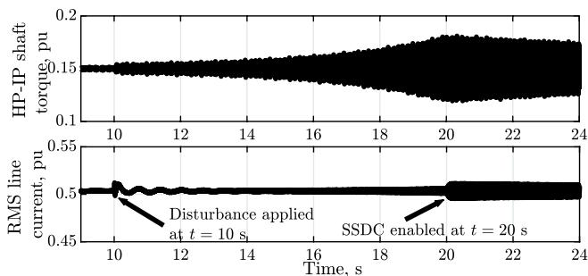  
Fig. 13. With slip-input SSDC $( K _ { \mathrm { d } } = 1 0 ) .$

response $\left( \lambda _ { e s t } \right)$ (indicated in Figs. 16, 17 and 18) is close to the corresponding unstable eigenvalue in Table $^ { 3 , }$ thereby attesting to the accuracy of the frequency scanning model.

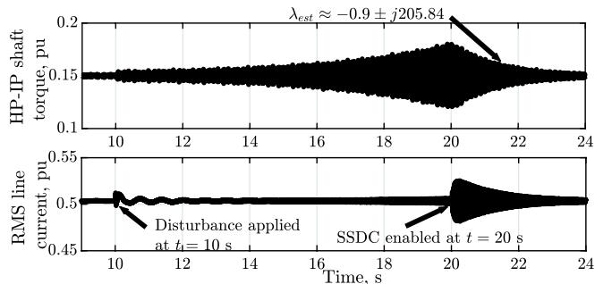  
Fig. 14. With slip-input SSDC $\left( K _ { \mathrm { d } } \right) = 3 0 )$ .

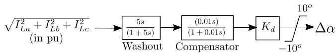  
Fig. 15. Block diagram of line current input SSDC.

Table 3 Relevant eigenvalues corresponding to a current input SSDC (obtained from Frequency Scanning Model).   

<table><tr><td>With Kd=2</td><td>With Kd=3</td><td>With Kd=4.5</td></tr><tr><td>-0.556 ± j9.59</td><td>-0.52 ± j9.59</td><td>-0.467 ± j9.59</td></tr><tr><td>0.019 ± j99.20</td><td>0.018 ± j99.18</td><td>0.018 ± j99.14</td></tr><tr><td>0.001 ± j127.06</td><td>0.001 ± j127.06</td><td>0.000 ± j127.06</td></tr><tr><td>0.008 ± j160.65</td><td>0.002 ± j160.64</td><td>-0.004 ± j160.63</td></tr><tr><td>0.128 ± j203.12</td><td>0.043 ± j203.16</td><td>-0.046 ± j203.10</td></tr><tr><td>-10.05 ± j218.52</td><td>-6.146 ± j221.32</td><td>0.726 ± j223.02</td></tr><tr><td>-9.69 ± j529.84</td><td>-5.347 ± j527.9</td><td>-0.605 ± j522.66</td></tr></table>

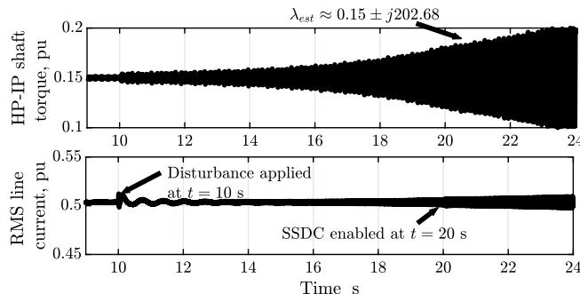  
Fig. 16. With current-input SSDC $\left( K _ { \mathrm { d } } \right) = 2 )$

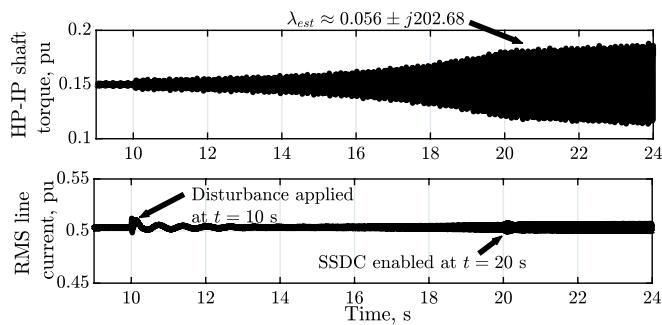  
Fig. 17. With current-input SSDC $( K _ { \mathrm { d } } = 3 ) \quad$

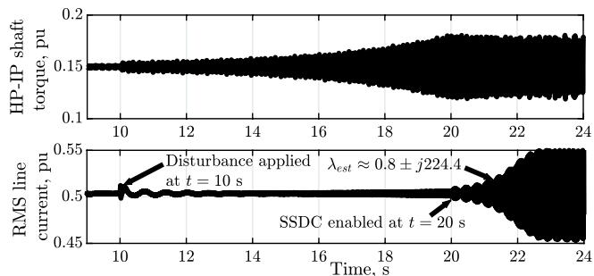  
Fig. 18. With current-input SSDC $( K _ { \mathrm { d } } = 4 . 5 )$ .

# 5. Conclusion

The paper has analyzed the accuracy of LTI models of a TCSC by comparing them to simulated responses. For the frequency scanning technique, vector fitting is used to obtain a state-space model, which can be interfaced with other components for eigenvalue analysis. A case study involving a SSR-vulnerable system which is stabilized using a SSR damping controller is used to carry out this analysis. Based on the comparison with simulations, it is found that the discrete-time model and the frequency scanning based model are reasonably accurate. Several assumptions were necessary to facilitate the derivation of the analytical dynamic phasor models considered in this paper. As a result, these dynamic phasor models cannot accurately capture the effects of the SSDC on torsional damping.

In general, the frequency scanning based technique is not inhibited by the extent of detail in the model or the nature of the controller or power electronic system. On the other hand, the derivation of a discretetime model would need to be customized for different situations. Thus, it can be concluded that the frequency scanning and vector fitting technique for extracting the state-space model scores well both on convenience and accuracy as compared to the discrete-time and dynamic phasor models.

# CRediT authorship contribution statement

Kaustav Dey: Conceptualization, Methodology, Software, Writing - original draft, Visualization, Investigation, Validation, Writing - review & editing. Mukesh Kumar Das: Conceptualization, Methodology, Writing - original draft, Software, Visualization, Investigation, Validation. A.M. Kulkarni: Conceptualization, Methodology, Writing - original draft, Visualization, Investigation, Supervision, Validation, Writing - review & editing, Project administration.

# Declaration of Competing Interest

The authors declare that they have no known competing financial interests or personal relationships that could have appeared to influence the work reported in this paper.

# References

[1] K.R. Padiyar, Analysis of subsynchronous resonance in power systems, 3, Springer Science & Business Media, 2012.   
[2] J.D. Ainsworth, Harmonic instability between controlled static convertors and ac networks, Proc. Inst. Electr. Eng. 114 (7) (1967) 949–957.   
[3] G.D. Irwin, A.K. Jindal, A.L. Isaacs, Sub-synchronous control interactions between type 3 wind turbines and series compensated AC transmission systems, Power and Energy Society General Meeting, 2011 IEEE (2011) 1–6.

[4] X. Jiang, A.M. Gole, A frequency scanning method for the identification of harmonic instabilities in HVDC systems, IEEE Trans. Power Delivery 10 (4) (1995) 1875–1881.   
[5] C. Schauder, H. Mehta, Vector analysis and control of advanced static VAR compensators. IEE Proceedings C-Generation, Transmission and Distribution volume 140, IET, 1993, pp. 299–306.   
[6] S.G. Jalali, R.H. Lasseter, I. Dobson, Dynamic response of a thyristor controlled switched capacitor, IEEE Trans. Power Delivery 9 (3) (1994) 1609–1615.   
[7] A. Ghosh, G. Ledwich, Modelling and control of thyristor-controlled series compensators, IEE Proceedings-Generation, Transmission and Distribution 142 (3) (1995) 297–304.   
[8] H.A. Othman, L. Angquist, Analytical modeling of thyristor-controlled series capacitors for SSR studies, IEEE Trans. Power Syst. 11 (1) (1996) 119–127.   
[9] B.K. Perkins, M.R. Iravani, Dynamic modeling of a TCSC with application to SSR analysis, IEEE Trans. Power Syst. 12 (4) (1997) 1619–1625, https://doi.org/ 10.1109/59.627867.   
[10] S.R. Sanders, J.M. Noworolski, X.Z. Liu, G.C. Verghese, Generalized averaging method for power conversion circuits, IEEE Trans. Power Electron. 6 (2) (1991) 251–259.   
[11] P. Mattavelli, A.M. Stankovic, G.C. Verghese, SSR Analysis with dynamic phasor model of thyristor-controlled series capacitor, IEEE Trans. Power Syst. 14 (1) (1999) 200–208.   
[12] S. Yao, M. Bao, y. Hu, M. Han, J. Hou, L. Wan, Modeling for VSC-HVDC electromechanical transient based on dynamic phasor method. 2nd IET Renewable Power Generation Conference (RPG 2013), 2013, pp. 1–4, https://doi.org/ 10.1049/cp.2013.1795.   
[13] S.R. Deore, P.B. Darji, A.M. Kulkarni, Dynamic phasor modeling of Modular Multilevel Converters. IEEE 7th International Conference on Industrial and Information Systems, 2012, pp. 1–6.   
[14] O.C. Sakinci, J. Beerten, Generalized dynamic phasor modeling of the MMC for 991–1000.   
[15] X. Lu, W. Lin, J. Wen, W. Yao, T. An, Y. Li, Dynamic phasor modelling and operating characteristic analysis of half-bridge MMC. 2016 IEEE 8th International Power Electronics and Motion Control Conference (IPEMC-ECCE Asia), 2016, pp. 2615–2621.   
[16] J. Rupasinghe, S. Filizadeh, L. Wang, A dynamic phasor model of an MMC with extended frequency range for EMT simulations, IEEE J. Emerg. Sel. Top. Power Electron. 7 (1) (2019) 30–40.   
[17] T. Li, A.M. Gole, C. Zhao, Harmonic instability in MMC-HVDC converters resulting from internal dynamics, IEEE Trans. Power Delivery 31 (4) (2016) 1738–1747.   
[18] R.K. Pandey, Stability analysis of AC/DC system with multirate discrete-Time HVDC converter model, IEEE Trans. Power Delivery 23 (1) (2008) 311–318.   
[19] A. Ghosh, I.N. Kar, R.K. Pandey, A Comparative Study of Two Discrete-time HVDC Converter Models. TENCON ’91. Region 10 International Conference on EC3- Energy, Computer, Communication and Control Systems volume 1, 1991, pp. 154–158.   
[20] M. Sahni, D. Muthumuni, B. Badrzadeh, A. Gole, A. Kulkarni, Advanced screening techniques for Sub-Synchronous Interaction in wind farms. PES T & D 2012, 2012, pp. 1–9.   
[21] Y. Cheng, S. Huang, J. Rose, V.A. Pappu, J. Conto, ERCOT subsynchronous resonance topology and frequency scan tool development. 2016 IEEE Power and Energy Society General Meeting (PESGM), 2016, pp. 1–5.   
[22] W. Ren, E. Larsen, A refined frequency scan approach to sub-Synchronous control interaction (SSCI) study of wind farms, IEEE Trans. Power Syst. 31 (5) (2016) 3904–3912.   
[23] M.K. Das, A.M. Kulkarni, A.M. Gole, A screening technique for anticipating network instabilities in AC-DC systems using sequence impedances obtained by frequency scanning. 10th IET International Conference on AC and DC Power Transmission, 2012, pp. 1–6.   
[24] SSCI and SSR Modeling Requirements., Accessed: 23-02-2021, https://www.elect ranix.com/publication/technical-memo-ssci-ssr-screening-and-modeling-requre ments_rev-0/.   
[25] B. Gustavsen, A. Semlyen, Rational approximation of frequency domain responses by vector fitting, IEEE Trans. Power Delivery 14 (3) (1999) 1052–1061.   
[26] T. Kailath, Linear systems, Prentice Hall, Englewood Cliffs, NJ, 1980.   
[27] S.R. Joshi, A.M. Kulkarni, Analysis of SSR performance of TCSC control schemes using a modular high bandwidth discrete-Time dynamic model, IEEE Trans. Power Syst. 24 (2) (2009) 840–848.   
[28] L. Angquist. Synchronous voltage reversal control of thyristor controlled capacitor, Ph. D. dissertation, Royal Inst. Technol., Stockholm, Sweden, 2002. Ph.D. thesis.   
[29] M.C. Chudasama, A.M. Kulkarni, Dynamic phasor analysis of SSR mitigation schemes based on passive phase imbalance, IEEE Trans. Power Syst. 26 (3) (2011) 1668–1676.   
[30] R. Pintelon, J. Schoukens, System identification: A frequency domain approach, 2nd, John Wiley & Sons, Hoboken, New Jersey, 2012.   
[31] First benchmark model for computer simulation of subsynchronous resonance, IEEE Transactions on Power Apparatus and Systems 96 (5) (1977) 1565–1572.   
[32] Manitoba HVDC Research Centre, PSCAD/EMTDC Users guide, Winnipeg, Canada, 2010.