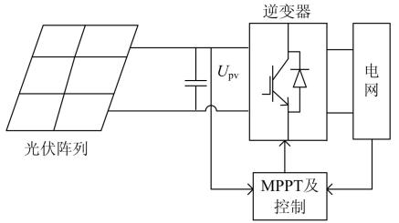
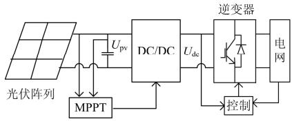
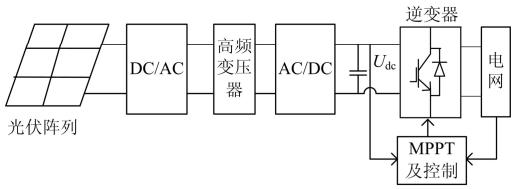
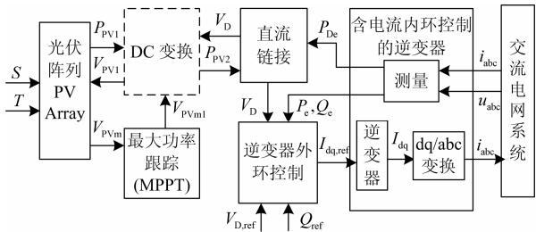
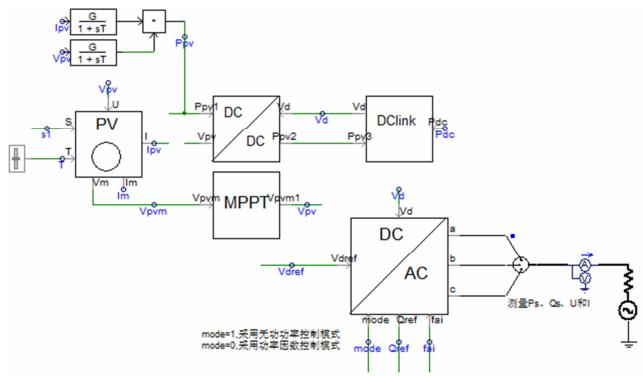
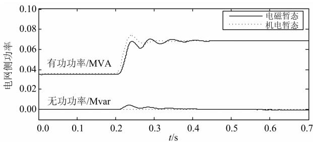
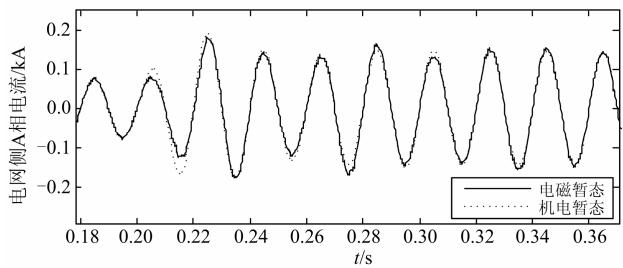
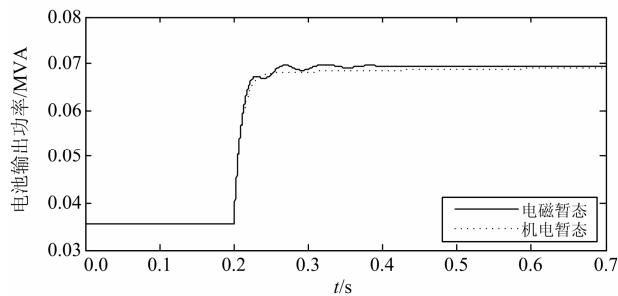
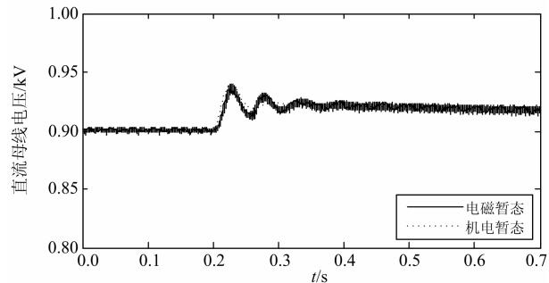

# 并网光伏发电系统的通用性机电暂态模型及其与电磁暂态模型的对比分析

孙 浩 1，张 曼 2，陈志刚 1，刘志文 1，谢小荣 2，姜齐荣 2

（1.中国能源建设集团广东省电力设计研究院，广东 广州 510600；  
2.电力系统国家重点实验室, 清华大学电机系，北京 100084）

摘要：针对并网光伏发电系统电磁暂态模型复杂、计算速度慢的问题，提出了一种并网光伏发电系统的通用性机电暂态模型。该模型不包含电器元件及高频开关器件，由纯粹的数学计算完成，模型简单、计算速度快。在PSCAD/EMTDC中对该机电暂态模型进行了仿真，得到的结果与电磁暂态模型的仿真结果吻合，且仿真时间大大减少，从而验证了该机电暂态模型的正确性及有效性。该通用性机电暂态模型为大规模并网光伏电站的仿真建模等提供了模型参考，具有实用价值。

关键词：光伏发电；并网；机电暂态模型；电磁暂态模型；仿真对比

# Comparative study on electromechanical and electromagnetic transient model for grid-connected photovoltaic power system

SUN Hao 1, ZHANG Man2, CHEN Zhi-gang 1, LIU Zhi-wen 1, XIE Xiao-rong 2, JIANG Qi-rong2

(1. Guangdong Electric Power Design Institute, China Energy Engineering Group Co., Ltd, Guangzhou 510600, China;   
2. State Key Lab of Power Systems Department of Electrical Engineering, Tsinghua University, Beijing 100084, China)

Abstract: The computing speed of electromagnetic transient model for grid-connected photovoltaic power system is very slow because of its complexity. To solve this problem, a general electromechanical transient model for grid-connected photovoltaic power system is proposed, in which there are not electrical components and high frequency switching device, and it only consists of pure mathematic calculations, is simple and has fast calculation speed. By comparing the simulation results of this electromechanical transient model with electromagnetic transient model in PSCAD/EMTDC, we found that the simulation time is reduced greatly and the results are agreeable basically, which verifies the correctness and validity of the electromechanical transient model. The electromechanical transient model provides reference model for simulation and modeling of large scale grid-connected photovoltaic power station and is of great practical value.

This work is supported by National Natural Science Foundation of China (No. 51322701).

Key words: photovoltaic power; grid-connected; electromagnetic transient model; electromechanical transient model; simulation comparison

中图分类号： TM76；TM743 文献标识码：A 文章编号： 1674-3415(2014)03-0128-06

# 0 引言

随着新能源、智能电网和微电网技术的发展，并网光伏发电系统已经取得广泛的应用，并具有广阔的发展前景[1-2]。在含光伏发电系统的电网动态分析中需要采用兼具精度和效率的暂态模型，在既往研究中，光伏发电系统模型通常采用两类模型，一

类是潮流模型[3]，即将其建模成简单的功率源，不考虑其动态过程，该模型仅适用于潮流分析，而不能用于暂态分析；另一类是基于特定的光伏发电系统建立对应的电路或电磁模型[4-5]，严格体现光伏发电系统中具体的最大功率点跟踪（MPPT）控制算法和逆变器电路及其控制逻辑，这类模型非常详实，理论上能满足电网机电暂态分析要求，但也存在诸多问题，如：1）由于光伏发电系统的内部结构和控制方法因厂家不同而具体各异，导致其电路或电磁

模型的通用性差，如果对不同厂家、型号的光伏发电系统均如此建模，则工作量极大，不现实；2）电路或电磁模型涉及各厂家专有的设备内部参数，往往难以取得相关的模型参数；3）电路或电磁模型复杂度高，为保证精度，计算步长往往设置得非常低，从而严重制约计算的速度。而且，电力系统机电暂态仿真往往只需要光伏发电系统的有效值电压/电流输出，并不需要其三相动态过程。加上目前大电网分析计算多采用商业或工程化仿真软件，亟需一种相对通用的光伏发电系统模型，以提高仿真分析的自动化水平和扩大计算规模。综上所述，亟需分析已有各类光伏发电系统的共性特征，并针对电力系统机电暂态仿真的需求，形成一种通用性的建模方法。

目前关于并网光伏发电系统的研究多集中在单台电磁暂态模型的建模仿真，而在实际的光伏发电站中，有多台光伏阵列同时工作。在研究光伏电站模型或者光伏电站并网给电网带来的影响时，如果对多台光伏发电系统的电磁暂态模型同时进行仿真，则仿真速度将会很慢。因此，研究并网光伏发电系统的通用性机电暂态模型对于提高仿真速度来说是非常有意义的。

本文首先简要介绍了并网光伏发电系统的构成，然后提出了一种并网光伏发电系统的通用性机电暂态模型，并对其内部结构进行了详细介绍，最后通过 PSCAD/EMTDC 对该机电暂态模型进行仿真，并与电磁暂态模型仿真的结果进行对比，验证了该机电暂态模型的正确性及有效性。

# 1 并网光伏发电系统构成

目前常见的并网光伏发电系统有单级式并网光伏发电系统、两级式并网光伏发电系统和多级式并网光伏发电系统，如图1 所示。单级式并网光伏发电系统中，光伏阵列直接与DC/AC逆变器相连，逆变器将光伏阵列输出的直流电能转换为满足电网需求的交流电，逆变器不仅需要变换电能，还需要实现 MPPT。两级式并网光伏发电系统中，光伏阵列输出的电能经过DC/DC电路、DC/AC逆变器并网，DC/DC 电路实现 MPPT 及升压作用，逆变器实现电能变换。多级式并网光伏发电系统中，光伏阵列输出的电能首先经过DC/AC 逆变器成高频交流电，然后经过高频变压器升压到目标电压等级，再经过高频整流器将电能转换成高压直流电，最后经过DC/AC 逆变器将电能转换成符合电网要求的交流电。

不论采取何种拓扑结构，MPPT及并网 DC/AC逆变器都是必不可少的部分，其控制直接关系到并网系统接入电网的电能质量。MPPT 的控制方法多

种多样[6]，如固定电压法、电导增量法、扰动观察法等。DC/AC 并网逆变器多采用电压型逆变器，主要的控制方式有电压控制和电流控制，电压控制是将系统作为受控电压源处理，要求其输出电压与电网电压同频同相；电流源控制是将系统作为受控电流源，要求其输出的电流与电网电压同频同相。目前的并网光伏发电系统中，DC/AC逆变器多采用图1 所示的电压源输入、电流源输出的连接方式。

  
(a)单级式并网光伏发电系统  
(b)两级式并网光伏发电系统

  
(c)多级式并网光伏发电系统   
图1 常见光伏发电系统结构  
Fig. 1 Structure of common photovoltaic system

对于电压源输入、电流源输出的 DC/AC 并网逆变器，其控制方法有多种[7-8]。用的比较多的是基于旋转坐标系的 PQ 解耦控制，主要包括外环功率控制和内环电流控制。本文后面算例中使用的即为PQ 解耦控制。

# 2 光伏发电系统机电暂态模型

由前述知，并网光伏发电系统可能是单级的、双级或多级的，MPPT 算法多种多样，逆变器及其控制方法也千差万别，为了规避这些内部的差别，而更多地关注其机电暂态特性，本文提出一种通用性机电暂态模型，如图2所示，S、T分别为光伏阵列所处环境的光照强度和温度， $V _ { \mathrm { p v m } }$ 为光伏阵列最大功率点处的电压，其由光伏阵列的特性决定，并作为 MPPT 模块的输入参考电压，MPPT 的输出$V _ { \mathrm { p v m 1 } }$ 及直流链接的输出电压 $V _ { \mathrm { D } } .$ 、光伏阵列输出功率 $P _ { \mathrm { p v 1 } }$ 作为 DC 变换的输入，共同决定光伏阵列的

端电压，即 $V _ { \mathrm { p v l } } .$ 。直流链接的作用是通过平衡直流侧功率 $P _ { \mathrm { p v } 2 }$ 和交流侧功率 $P _ { \mathrm { D e } }$ 来维持直流母线电压为恒定值，为后级逆变器提供直流电压，逆变器的控制分为外环和内环控制，具体控制原理将在后文介绍。

  
图2 机电暂态模型信号传递关系图  
Fig. 2 Signal relationship of electromechanical transient model

该机电暂态模型较多地屏蔽了光伏发电系统千差万别的内部特性，而以外特性动态方程为主，不包含电器元件、更没有高频开关器件，可大大提高分析速度。以下将对该模型中的模块及其之间的关系进行介绍。

# 2.1 光伏电池模型

为了规避不同光伏电池对建模的影响，采用光伏电池通用性行为模型[9]。该模型对应的数学方程如式（1）~式（6），其建模参数仅包括：标准环境下电池的短路电流 $I _ { \mathrm { s c } } .$ 、开路电压 $U _ { \mathrm { o c } } .$ 、最大功率电压 $U _ { \mathrm { m } }$ 和最大功率电流 $I _ { \mathrm { m } }$ 这 4 个参数，由此即可得到光伏电池的输出特性，即 U-I曲线。

$$
I = I _ {\mathrm {s c}} ^ {\prime} \left\{1 - C _ {1} \left[ \mathrm {e} ^ {U / \left(C _ {2} U _ {\mathrm {o c}}\right)} - 1 \right] \right\} \tag {1}
$$

$$
C _ {1} = \left(1 - I _ {\mathrm {m}} ^ {\prime} / I _ {\mathrm {s c}} ^ {\prime}\right) \mathrm {e} ^ {- U _ {\mathrm {m}} ^ {\prime} / \left(C _ {2} U _ {\mathrm {o c}}\right)} \tag {2}
$$

$$
C _ {2} = \left(U _ {\mathrm {m}} ^ {\prime} / U _ {\mathrm {o c}} ^ {\prime} - 1\right) \left[ \ln \left(1 - I _ {\mathrm {m}} ^ {\prime} / I _ {\mathrm {s c}} ^ {\prime}\right) \right] ^ {- 1} \tag {3}
$$

$$
I _ {\mathrm {s c}} ^ {\prime} = I _ {\mathrm {s c}} \Delta I, I _ {\mathrm {m}} ^ {\prime} = I _ {\mathrm {m}} \Delta I, U _ {\mathrm {o c}} ^ {\prime} = U _ {\mathrm {o c}} \Delta U, U _ {\mathrm {m}} ^ {\prime} = U _ {\mathrm {m}} \Delta U \tag {4}
$$

$$
\Delta I = \left[ 1 + \alpha \left(T - T _ {\text {r e f}}\right) \right] S / S _ {\text {r e f}} \tag {5}
$$

$$
\Delta U = \left[ 1 - \gamma \left(T - T _ {\text {r e f}}\right) \right] \ln \left[ e + \beta \left(S - S _ {\text {r e f}}\right) \right] \tag {6}
$$

式中： $S _ { \mathrm { r e f } }$ 为标准环境下的光照强度，为 $1 \ \mathrm { k W / m } ^ { 2 }$ ；$T _ { \mathrm { r e f } }$ 为标准环境下的温度，为 $2 5 ^ { \mathrm { \scriptsize ~ { \circ } C } } ; I _ { \mathrm { s c } } ^ { 2 } \setminus U _ { \mathrm { o c } } ^ { \prime } \setminus I _ { \mathrm { m } } ^ { \mathrm { \scriptsize ~ { \prime } } } .$ 、$U _ { \mathrm { m } }$ ′分别为 $I _ { \mathrm { s c } } \setminus U _ { \mathrm { o c } \setminus I _ { \mathrm { m } } \setminus U _ { \mathrm { m } } }$ 在不同环境下的修正值；α、γ为温度补偿系数； $\beta$ 为光强补偿系数。

# 2.2 MPPT 模型

MPPT 控制的方式虽然多种多样，但其目的都是使光伏阵列输出电压跟踪最大功率点电压，以输出不同环境下的最大功率。MPPT 实现的效果可视为：光伏阵列输出电压一阶滞后于参考电压，稳态时存在固定的跟踪误差。因此，MPPT 控制的模型可以主要由一阶惯性环节、滞后环节及跟踪误差组成，设控制器的纯滞后时间常数为，一阶时间常

数为 T，则 MPPT 模型可以表示为

$$
V _ {\mathrm {p v m l}} = \frac {\mathrm {e} ^ {- \gamma s}}{1 + T s} V _ {\mathrm {p v m}} + \Delta V _ {\mathrm {p v m}} \tag {7}
$$

其中， $\Delta V _ { \mathrm { p v m } }$ 为跟踪误差。

# 2.3 DC/DC 变换器模型

以 Boost电路为例，DC/DC变换器主要起到了升压及功率变换的作用，DC/DC 变换的输入输出量之间的关系分为两种情况。

于单级式并网光伏发电系统，为

$$
\left\{ \begin{array}{l} P _ {\mathrm {p v 2}} = f _ {1} \left(P _ {\mathrm {p v l}}\right) = P _ {\mathrm {p v l}} \\ V _ {\mathrm {p v l}} = f _ {2} \left(V _ {\mathrm {D}}, V _ {\mathrm {p v m l}}\right) = V _ {\mathrm {D}} \end{array} \right. \tag {8}
$$

对于双级式和多级式并网光伏发电系统，为

$$
\left\{ \begin{array}{l} P _ {\mathrm {p v 2}} = f _ {1} \left(P _ {\mathrm {p v l}}\right) = P _ {\mathrm {p v l}} \eta \\ V _ {\mathrm {p v l}} = f _ {2} \left(V _ {\mathrm {D}}, V _ {\mathrm {p v m l}}\right) = V _ {\mathrm {p v m l}} \end{array} \right. \tag {9}
$$

其中， 为 DC 变换的效率。

# 2.4 直流链接模型

直流链接是连接直流侧与交流侧的中间环节，即直流母线电容的模型，根据电容的能量与电压关系，得到直流链接模型为

$$
\left\{ \begin{array}{l} \frac {\mathrm {d} E _ {\mathrm {C}}}{\mathrm {d} t} = P _ {\mathrm {P V 2}} - P _ {\mathrm {D e}} \\ E _ {\mathrm {C}} = 1 / 2 C V _ {\mathrm {D}} ^ {2} \end{array} \right. \tag {10}
$$

式中： $P _ { \mathrm { p v } 2 }$ 为直流链接的直流侧输入功率； $P _ { \mathrm { D e } }$ 为直流链接逆变器侧的输出功率；C 为直流链接电容的容值； $V _ { \mathrm { { D } } }$ 为直流链接的电压值； $E _ { \mathrm { C } }$ 为电容上存储的能量。

# 2.5 逆变器外环模型

逆变器通常是由电力电子器件构成的逆变电路，其目标是通过控制逆变电路输出电压的频率、幅值和相位，实现向电网注入特定的电流和功率。逆变器的控制包括外环控制和内环控制。

外环控制为功率控制，目的是实现 PQ 解耦控制，其中有功控制通过直流母线电压的闭环控制实现，无功控制通过无功功率的闭环控制实现，外环控制的输出量为 d、q 轴电流的参考值。因此，逆变器外环控制的传递函数模型的一般形式如式(11)、式(12)。

$$
\left\{ \begin{array}{l} I _ {\mathrm {d}, \text {r e f}} ^ {1} = \frac {B _ {\mathrm {d} 2} s ^ {2} + B _ {\mathrm {d} 1} s + B _ {\mathrm {d} 0}}{A _ {\mathrm {d} 2} s ^ {2} + A _ {\mathrm {d} 1} s + A _ {\mathrm {d} 0}} \left(V _ {\mathrm {D}, \text {r e f}} - V _ {\mathrm {D}}\right) \\ I _ {\mathrm {d}, \text {r e f}} = \operatorname {S a t} \left(I _ {\mathrm {d}, \text {r e f}} ^ {1}, I _ {\mathrm {d}, \max }, I _ {\mathrm {d}, \min }\right) \end{array} \right. \tag {11}
$$

$$
\left\{ \begin{array}{l} I _ {\mathrm {q}, \text {r e f}} ^ {1} = \frac {B _ {\mathrm {q} 2} s ^ {2} + B _ {\mathrm {q} 1} s + B _ {\mathrm {q} 0}}{A _ {\mathrm {q} 2} s ^ {2} + A _ {\mathrm {q} 1} s + A _ {\mathrm {q} 0}} \left(Q _ {\text {r e f}} ^ {\prime} - Q _ {\mathrm {e}}\right) \\ I _ {\mathrm {q}, \text {r e f}} = \operatorname {S a t} \left(I _ {\mathrm {q}, \text {r e f}} ^ {1}, I _ {\mathrm {q}, \max }, I _ {\mathrm {q}, \min }\right) \end{array} \right. \tag {12}
$$

其中，（1） $\mathrm { S a t } \left( x , x _ { \mathrm { m a x } } , x _ { \mathrm { m i n } } \right)$ 是饱和函数，作用是对输出量进行限幅，其定义如下：

$$
\operatorname {S a t} \left(x, x _ {\max }, x _ {\min }\right) = \left\{ \begin{array}{l l} x _ {\max } & x > x _ {\max } \\ x _ {\min } & x <   x _ {\min } \\ x & x _ {\min } \leq x \leq x _ {\max } \end{array} \right.
$$

（2） $I _ { \mathrm { d , m a x } } \setminus I _ { \mathrm { d , m i n } } \setminus I _ { \mathrm { q , m a x } } \setminus I _ { \mathrm { q , m i n } }$ 可以单独由建模参数给出，也可以只给出逆变器的最大限流值 $I _ { \mathrm { m a x } }$ ，则

$$
\left\{ \begin{array}{l} I _ {\mathrm {d}, \max } = I _ {\max } \\ I _ {\mathrm {d}, \min } = - I _ {\max } \end{array} \left\{ \begin{array}{l} I _ {\mathrm {q}, \max } = \sqrt {I _ {\max } ^ {2} - I _ {\mathrm {d} , \text {r e f}}} \\ I _ {\mathrm {q}, \min } = - I _ {\mathrm {q}, \max } \end{array} \right. \right.
$$

（3）当参数 $A _ { i 2 } = B _ { i 2 } = A _ { i 0 } = 0 ( i = \mathrm { d } , \mathrm { q } )$ 时，外环控制简化为PI控制。

# 2.6 逆变器内环模型

逆变器的内环控制为电流控制，控制目标是使得 d、q 轴电流实际值跟踪参考值，从而使光伏发电系统输入到电网侧的电流及功率符合要求。内环模型的输入量为d、q轴电流的参考值，输出量为d、q 轴电流的实际值。

下面推导逆变器内环模型的传递函数。记 $i _ { \mathrm { a } } ,$ 、$i _ { \mathrm { b } } , \ i _ { \mathrm { c } }$ 为逆变器输出电流， $U _ { \mathrm { a } } , \ U _ { \mathrm { b } } , \ U _ { \mathrm { c } }$ 为逆变器输出相电压， $e _ { \mathrm { g a } } , e _ { \mathrm { g b } } , e _ { \mathrm { g c } }$ 为电网相电压，L 为输出滤波电感，R 为电感内阻和开关管等效内阻。

在静止abc坐标系下，根据电路定律有

$$
\frac {d}{\mathrm {d} t} \left[ \begin{array}{l} i _ {\mathrm {a}} \\ i _ {\mathrm {b}} \\ i _ {\mathrm {c}} \end{array} \right] = \frac {1}{L + R} \left[ \begin{array}{l} u _ {\mathrm {a}} \\ u _ {\mathrm {b}} \\ u _ {\mathrm {c}} \end{array} \right] - \frac {1}{L + R} \left[ \begin{array}{l} e _ {\mathrm {g a}} \\ e _ {\mathrm {g b}} \\ e _ {\mathrm {g c}} \end{array} \right] \tag {13}
$$

将式（13）进行dq变换得到

$$
\left\{ \begin{array}{l} e _ {\mathrm {g d}} = u _ {\mathrm {d}} - \left(L \frac {\mathrm {d} i _ {\mathrm {d}}}{\mathrm {d} t} + R i _ {\mathrm {d}}\right) + L \omega i _ {\mathrm {q}} \\ e _ {\mathrm {g q}} = u _ {\mathrm {q}} - \left(L \frac {\mathrm {d} i _ {\mathrm {q}}}{\mathrm {d} t} + R i _ {\mathrm {q}}\right) - L \omega i _ {\mathrm {d}} \end{array} \right. \tag {14}
$$

将式（14）进行拉普拉斯变换得到

$$
\left[ \begin{array}{l} e _ {\mathrm {g d}} \\ e _ {\mathrm {g q}} \end{array} \right] - \left[ \begin{array}{l} u _ {\mathrm {d}} \\ u _ {\mathrm {q}} \end{array} \right] = \left[ \begin{array}{c c} - (L s + R) & \omega L \\ - \omega L & - (L s + R) \end{array} \right] \left[ \begin{array}{l} i _ {\mathrm {d}} \\ i _ {\mathrm {q}} \end{array} \right] \tag {15}
$$

若采用 PI 控制器，逆变器输出电压参考值为

$$
\left\{ \begin{array}{l} u _ {\mathrm {d}, \text {r e f}} = u _ {\mathrm {d}} + \left(K _ {1 \mathrm {p}} + \frac {K _ {1 i}}{s}\right) \left(i _ {\mathrm {d}, \text {r e f}} - i _ {\mathrm {d}}\right) + L \omega i _ {\mathrm {q}} \\ u _ {\mathrm {q}, \text {r e f}} = u _ {\mathrm {q}} + \left(K _ {2 \mathrm {p}} + \frac {K _ {2 i}}{s}\right) \left(i _ {\mathrm {q}, \text {r e f}} - i _ {\mathrm {q}}\right) - L \omega i _ {\mathrm {d}} \end{array} \right. \tag {16}
$$

将其写成矩阵形式并与式（15）对比得到

$$
\left\{ \begin{array}{l} i _ {\mathrm {d}} = \frac {P I _ {1} (s)}{- (L s + R) + P I _ {1} (s)} i _ {\mathrm {d , r e f}} \\ i _ {\mathrm {q}} = \frac {P I _ {2} (s)}{- (L s + R) + P I _ {2} (s)} i _ {\mathrm {q , r e f}} \end{array} \right. \tag {17}
$$

将 $P I _ { 1 } ( s ) = K _ { 1 \mathrm { p } } + \frac { K _ { 1 i } } { s } \ , P I _ { 2 } ( s ) = K _ { 2 \mathrm { p } } + \frac { K _ { 2 i } } { s }$ 1K i  、 2 2p( )= PI s K 2 K i 代入式（17）s s并化简，用一般形式表示如下

$$
\left\{ \begin{array}{l} i _ {\mathrm {d}} = \frac {b _ {\mathrm {d} 2} s ^ {2} + b _ {\mathrm {d} 1} s + 1}{a _ {\mathrm {d} 2} s ^ {2} + a _ {\mathrm {d} 1} s + 1} i _ {\mathrm {d}, \text {r e f}} \\ i _ {\mathrm {q}} = \frac {b _ {\mathrm {q} 2} s ^ {2} + b _ {\mathrm {q} 1} s + 1}{a _ {\mathrm {q} 2} s ^ {2} + a _ {\mathrm {q} 1} s + 1} i _ {\mathrm {q}, \text {r e f}} \end{array} \right. \tag {18}
$$

其中， $a _ { i j } \circ b _ { i j } ( i = \mathrm { d } , \mathrm { q } ; j = 1 , 2 )$ 为参数。式(18)即为逆变器内环电流模型的传递函数。模型内部还包含有dq/abc 变换、锁相环、电气量测量等环节，在仿真建模时可以利用PSCAD 已有的模块实现。

# 2.7 通用性机电暂态模型的整体实现

在模型整体实现的过程中，要注意根据实际选取合适的模型参数，包括设备参数和外特性参数，设备参数可以由厂家提供，如光伏阵列的特性参数，外特性参数可以通过一定的外特性测试获得，如MPPT 跟踪器的纯滞后时间常数及惯性时间常数、逆变器的跟踪时间常数等。不同的光伏发电系统的参数可能有所差别，但是均可用于该机电暂态模型，充分体现了该机电暂态模型的通用性。就实现方法而言，该机电暂态模型由纯数学算法实现，可以非常灵活地应用于PSASP、PSS/E 等各种商业软件，通过嵌入式建模来实现。而电磁暂态模型由于含有电力电子器件，只能用于少数对电力电子器件能进行仿真的软件，具有局限性。

为了验证上述所提出的机电暂态模型的正确性及有效性，将其与电磁暂态模型进行仿真对比，本论文在 PSCAD/EMTDC 中建立了并网三相光伏发电系统的电磁暂态和机电暂态模型，以双级式并网光伏发电系统为例，逆变器外环采用PI控制，内环参数 $a _ { i 2 } = b _ { i 2 } = 0 ( i = { \mathrm { d } } , \mathrm { q } )$ ，机电暂态模型的仿真电路如图3 所示，模型参数如表1。

  
图3 机电暂态模型仿真电路图  
Fig. 3 Simulation circuit of electromechanical transient model

表1 机电暂态模型参数  
Table 1 Parameters of electromechanical transient model   

<table><tr><td>模块</td><td>符号</td><td>意义</td><td>数值</td></tr><tr><td rowspan="2">光伏阵列</td><td>Um</td><td>最大功率点电压</td><td>17.4 V</td></tr><tr><td>Im</td><td>最大功率点电流</td><td>3.56 A</td></tr><tr><td>STP062-12/Sc</td><td>Uoc</td><td>开路电压</td><td>21.8 V</td></tr><tr><td rowspan="3">多晶硅</td><td>Isc</td><td>短路电流</td><td>3.78 A</td></tr><tr><td>Np</td><td>并联数目</td><td>30</td></tr><tr><td>Ns</td><td>串联数目</td><td>24</td></tr><tr><td rowspan="2">MPPT</td><td>γ</td><td>纯滞后时间常数</td><td>0.05 s</td></tr><tr><td>T</td><td>一阶时间常数</td><td>0.7 s</td></tr><tr><td rowspan="2">逆变器外环</td><td>Kp</td><td>比例系数</td><td>3</td></tr><tr><td>Ki</td><td>积分系数</td><td>0.5</td></tr><tr><td rowspan="2">逆变器内环</td><td>bd1,bq1</td><td>超前时间常数</td><td>0.003 s</td></tr><tr><td>ad1,aq1</td><td>滞后时间常数</td><td>0.000 8 s</td></tr></table>

# 3 机电暂态与电磁暂态仿真结果对比

仿真中 MPPT 算法采用改进扰动观察法[9]。两种模型的仿真总时间均为10 s，电磁暂态模型中含有开关频率为2 000 Hz 的电力电子器件，因此设置其仿真步长为 50 μs，机电暂态模型中不含高频器件，设置其仿真步长为1 ms。将系统的无功功率参考值设置为0 Mvar，且当系统达到稳态后，将光照强度从 $8 0 0 \ \mathrm { W / m } ^ { 2 }$ 增加到 $1 \ 5 0 0 \ \mathrm { W / m } ^ { 2 }$ ，比较两种模型所得的仿真结果。

图 4 给出了系统侧的功率曲线，在光照强度增加后，有功功率增大，无功功率经过短暂的暂态过程后仍稳定在0，即系统侧功率因数为1，符合控制目标。当光照强度增大时，光伏阵列输出功率增大，系统侧电流增大，从图 5、图 6 中可以看出。图 7是直流母线电压曲线，直流母线电压在光强变化时经过一个短暂的暂态过程重新达到稳态。另外，从图 4 到图7 的对比中可以看出，电磁暂态和机电暂态所得的仿真结果吻合得很好，说明该机电暂态模型是合理的。

  
图4 电网侧功率  
Fig. 4 Power of grid side

  
图5 电网侧A相电流

  
Fig. 5 Current of phase A   
图6 光伏电池输出功率

  
Fig. 6 Photovoltaic output power   
图7 直流母线电压  
Fig. 7 DC bus voltage

从仿真时间上来看，电磁暂态模型完成仿真用了 46.6 s，而机电暂态模型完成仿真仅用了 4.1 s，说明机电暂态模型计算速度快得多，大大节省了仿真时间。

# 4 结论

本文提出了一种并网光伏发电系统的通用性机电暂态模型，并在 PSCAD/EMTDC 中建立了光伏发电系统机电暂态和电磁暂态的模型，将两种模型的仿真结果进行了对比。从本文可以得出以下几点结论：

1）该机电暂态模型从并网光伏发电系统各个模块的外部特性出发，避免了因内部结构不同导致的建模复杂性问题，具有很好的通用性，且模型实现简单。

2）该机电暂态模型与电磁暂态模型仿真结果一致，说明了其有效性和精确性，能够满足电力系统暂态分析的需要。  
3）该机电暂态模型不含电器元件及高频开关器件，大大增大了仿真步长，提高了计算速度，与电磁暂态模型相比，大大节省了仿真时间。

该机电暂态模型可用于大规模光伏发电系统的暂态仿真，为光伏电站建模仿真及并网光伏发电系统带给电网的暂态稳定性研究等问题提供了模型参考。

# 参考文献

[1] 李冬辉, 王鹤雄, 朱晓丹, 等. 光伏并网发电系统几个关键问题研究[J]. 电力系统保护与控制, 2010, 38(21):208-214.  
LI Dong-hui, WANG He-xiong, ZHU Xiao-dan, et al. Research on several critical problems of photovoltaic grid-connected generation system[J]. Power System Protection and Control, 2010, 38(21): 208-214.   
[2] 张浙波, 刘建政, 梅红明. 两级式三相光伏并网发电系统无功补偿特性[J]. 电工技术学报, 2011, 26(1):242-246.  
ZHANG Zhe-bo, LIU Jian-zheng, MEI Hong-ming. Study of reactive power compensation characteristics on a three-phase double-stage grid-connected photovoltaic power system[J]. Transactions of China Electrotechnical Society, 2011, 26(1): 242-246.   
[3] Varma R K, Khadkikar V, Seethapathy R. Nighttime application of PV solar farm as STATCOM to regulate grid voltage[J]. IEEE Trans on Energy Conversion, 2009, 24(4): 983-985.   
[4] 姚致清, 张茜, 刘喜梅. 基于 PSCAD/EMTDC 的三相光伏并网发电系统仿真研究[J]. 电力系统保护与控制,2010, 38(17): 76-81.  
YAO Zhi-qing, ZHANG Qian, LIU Xi-mei. Research on simulation of a three-phase grid-connected photovoltaic generation system based on PSCAD/EMTDC[J]. Power System Protection and Control, 2010, 38(17): 76-81.   
[5] 杜春水, 张承慧, 刘鑫正, 等. 带有源电力滤波功能的三相光伏并网发电系统控制策略[J]. 电工技术学报,

2010, 25(9): 164-168.   
DU Chun-shui, ZHANG Cheng-hui, LIU Xin-zheng, et al. Control strategy on the three-phase grid-connected photovoltaic generation system with shunt active power filter[J]. Transactions of China Electrotechnical Society, 2010, 25(9): 164-168.   
[6] 高金辉, 唐静. 一种新型光伏系统最大功率跟踪算法的研究[J]. 电力系统保护与控制, 2011, 39(23): 21-29.  
GAO Jin-hui, TANG Jing. A novel MPPT method for PV systems[J]. Power System Protection and Control, 2011, 39(23): 21-29.   
[7] 胡雪峰, 龚春英. 光伏并网逆变器的直接预测控制策略及其 DSP 实现[J]. 电工技术学报, 2011, 26(1):102-106.  
HU Xue-feng, GONG Chun-ying. A new predictive contril strategy for photovoltaic grid-connected inverters and its DSP implementation[J]. Transactions of China Electrotechnical Society, 2011, 26(1): 102-106.   
[8] 芮骐骅, 杜少武, 姜卫东, 等. 三相光伏并网逆变器SVPWM 电流控制技术研究[J]. 电力电子技术, 2010,44(4): 4-6.  
RUI Qi-hua, DU Shao-wu, JIANG Wei-dong, et al. Current regulation for three-phase grid-connected inverter based on SVPWM control[J]. Power Electrics, 2010, 44(4): 4-6.   
[9] 焦阳, 宋强, 刘文华. 光伏电池实用仿真模型及光伏发电系统仿真[J]. 电网技术, 2010, 34(11): 199-202.  
JIAO Yang, SONG Qiang, LIU Wen-hua. Practical simulation model of photovoltaic cells in photovoltaic generation system and simulation[J]. Power System Technology, 2010, 34(11): 199-202.

收稿日期：2013-05-17； 修回日期：2013-06-18

作者简介：

孙 浩(1976-),男,硕士,高级工程师,研究方向为电力系统自动化技术；E-mail: sunhao@gedi.com.cn

张 曼(1991-),女,硕士,研究方向为柔性交流输配电技术。