# 适用于电磁暂态高效仿真的变流器分段广义状态空间平均模型

王磊 1 ，邓新昌 1*，侯俊贤 2 ，穆世霞 2 ，董毅峰 2 ，王铁柱 2

(1．可再生能源与工业节能安徽省工程实验室(合肥工业大学)，安徽省 合肥市 230009；

2．中国电力科学研究院有限公司，北京市 海淀区 100192)

# A Piecewise Generalized State Space Model of Power Converters for Electromagnetic Transient Efficient Simulation

WANG Lei1 , DENG Xinchang1*, HOU Junxian2 , MU Shixia2 , DONG Yifeng2 , WANG Tiezhu2

(1. An Hui Provincial Engineering Laboratory for Renewable Energy and Energy Saving (Hefei University of Technology), Hefei

230009, Anhui Province, China; 2. China Electric Power Research Institution, Haidian District, Beijing 100192, China)

ABSTRACT: Common averaging methods were studied for modeling the grid-connected converter in new energy domain to balance the accuracy and efficiency in electromagnetic transient simulation. A piecewise generalized state space averaging (P-GSSA) method was proposed for converters with the large-scale new energy connected to grid. The piecewise technique was applied to generalized state space averaging (GSSA) model of the converters in this method, which combines the time slot with similar operating characteristic together to study. And multi time scale modeling was successfully achieved in the grid-connected converter of new energy domain. An example was simulated according to the P-GSSA model proposed in this paper, and the simulation results show that the model can adapt to the efficient simulation of power converters in the domain of large-scale new energy connected to grid.

KEY WORDS: converter; piecewise generalized state space averaging (P-GSSA); multi time scale; electromagnetic transient model; efficient simulation

摘要：针对新能源并网变流器电磁暂态仿真精度和效率的平衡问题，研究新能源并网变流器的常用平均化建模方法，提出适应大规模新能源并网电磁暂态高效仿真的变流器分段广义状态空间平均建模方法。该方法将分段技术应用于变流器广义状态空间模型中，将变流器动作特性一致的时间段合并研究，实现分段时间上变流器电磁暂态的变尺度建模。应

用提出的变流器分段广义状态空间平均模型进行算例仿真，结果表明该模型实现了变流器暂态仿真中效率和精度的平衡，能够适应大规模新能源并网变流器的高效仿真。

关键词：变流器；分段广义状态空间平均；多时间尺度；电磁暂态模型；高效仿真

# 0 引言

新能源发电的规模化接入导致电力系统运行方式的变化[1-3]，而并网变流器的暂态特性则直接影响含大规模新能源发电的电力系统动态特性[4-5]。变流器动作特性复杂，建立能够兼顾精度和效率的变流器仿真模型一直是学术界研究的焦点。迄今，已建立多种变流器仿真模型以适应不同应用场合，但现有模型均不能完全满足电磁暂态高效仿真的要求。因而无法适应规模化新能源发电接入电力系统的仿真场景。

规模化新能源发电接入电力系统的电磁暂态仿真，其核心是计及精度和效率的并网变流器电磁暂态建模[6-9]。变流器的建模方法主要包括解析建模法、数字仿真法等。其中，属于解析建模法的平均化方法对于电力系统建模的发展，尤其对暂态建模效率的提升具有推动作用[10]。平均化方法平衡了模型的效率和精度，有利于建立适用于不同场合的变流器仿真模型。

目前，变流器建模的平均化建模方法主要有动态相量法、电路平均法、状态空间平均法和广义状态空间平均法等[11-14]。动态相量法基于傅里叶变

换，能够在“毫秒”级时间尺度上描述变流器的开关动作特性，在机电暂态建模与仿真等领域具有明显优势[15-16]，但难以适用于电磁暂态的“微秒”级仿真。电路平均法采用体现外特性的等效电路模型代替变流器的开关模型，适用于稳态建模和外特性研究[17]，但等效电路模型难以计及电路内部的动态特性，无法体现变流器内部开关的高频动作。状态空间平均法在开关周期上对状态方程平均化，其中状态平均向量场的变化趋势易于实现电气量和系统参数的预测功能。该方法与 Dommel 算法结合形成的暂态模型被广泛认可并应用于变流器稳态设计与暂态稳定性研究[18]。状态空间平均法提高变流器建模效率，保留状态变量的基频特性，却难以精确仿真变流器电磁暂态过程中产生的谐波，一般适用于周期性开关动作的变流器建模。文献[19]基于状态空间平均法，将分段方法融入状态空间平均模型，利用单个开关周期进行分段，能计及不同开关周期内开关动作不一致的情况，然而该方法需要另行考虑纹波问题。广义状态空间平均法以傅里叶变换为基础[20]，能够计及高频分量及谐波的影响，对时域状态变量进行傅里叶变换，展开到所需阶数，在保证精度要求的前提下，忽略影响不大的高阶分量而用适量的低阶傅里叶变换系数重构原始电气状态变量。当保留阶数较低时，广义状态空间平均模型可有效提升仿真效率，只保留基频分量时即为状态空间平均法；当保留阶数较高时，可接近于详细模型的精度，但模型复杂无法适用于电磁暂态高效仿真。

本文基于现有变流器平均化建模方法，将分段方法和广义状态空间平均法有机结合，建立变流器的分段广义状态空间平均模型。阐述了该模型的物理意义，提出并分析一种直接针对状态变量的模型验证和误差分析方法，避免复杂的误差分析方法。基于本文提出的分段广义状态空间平均法对三相PWM AC/DC 逆变器进行建模，并对小型光伏系统进行仿真验证。仿真结果表明，该模型能精确反映变流器电磁暂态特性，保证模型精度的同时提高了仿真效率，适用于大规模变流器电磁暂态仿真。

# 1 变流器平均化建模方法

# 1.1 状态空间平均法

将变流器不同工作模式下的状态方程进行加权平均的状态空间平均法(state space averaging，SSA)通常用于周期性开关动作的变流器建模[18,21]。设载波为 $\nu _ { \mathrm { c } }$ ，调制波为 $\nu _ { \mathrm { m } }$ ，得到开关函数 $S _ { i }$ 如下：

$$
S _ {i} = \left\{ \begin{array}{l l} 1, & v _ {\mathrm {m}} > v _ {\mathrm {c}} \\ 0, & v _ {\mathrm {m}} \leq v _ {\mathrm {c}} \end{array} \right. \tag {1}
$$

式中 $i { = } a , b , c$ 分别代表 A、B、C 三相。

考虑低频分量时，变流器非连续系统状态的微分方程为：

$$
\dot {x} (t) = f (x) + b u (d (x) - \operatorname {t r i} (t, T)) \tag {2}
$$

式中 u 为系统输入函数，与 d(x)及 tri(t, T)有关。

对于特定开关电路的非连续系统，给定 $t _ { 0 }$ 时刻状态变量值 $x ( t _ { 0 } )$ ，将式(2)改写为

$$
\begin{array}{l} x (t) = x \left(t, t _ {0}, x \left(t _ {0}\right)\right) \equiv x \left(t _ {0}\right) + \int_ {t _ {0}} ^ {t} [ f (x (s)) + \\ \sum_ {i = 1} ^ {N} f _ {i} (x (s)) \cdot b u \left(d _ {i} (x (s)) - \operatorname {t r i} (s, T)\right) ] d s \tag {3} \\ \end{array}
$$

式中 N 为开关组数。

由开关函数 $S _ { i }$ 和开关周期 $T _ { \mathrm { s } }$ 可以得到周期性开关函数占空比 $d _ { i \mathrm { c } }$ 。

$$
d _ {i} = \frac {1}{T _ {s}} \int_ {t - T s} ^ {t} S _ {i} (\tau) \mathrm {d} \tau , \quad i = a, b, c \tag {4}
$$

周期性开关函数的占空比在每一开关周期 $T _ { s }$ 上是恒定的，因此将状态变量用平均值 y 表示为

$$
\begin{array}{l} y (t) = y \left(t; t _ {0}, y \left(t _ {0}\right)\right) \equiv y \left(t _ {0}\right) + \int_ {t _ {0}} ^ {t} f _ {0} (y (s)) d s + \\ \sum_ {i = 1} ^ {N} \int_ {t _ {0}} ^ {t} f _ {i} (y (s)) d _ {i} (y (s)) d s \tag {5} \\ \end{array}
$$

式(4)、(5)即为变流器状态空间平均模型，与占空比 $d _ { i }$ 有关，是对开关导通和关断时 2 组不同的线性状态方程进行状态平均的非线性模型。

# 1.2 分段状态空间平均法

文献[19,22]介绍了分段状态空间平均法(piecewise state space averaging，P-SSA)，其核心是将仿真时间分解成合理的子区间。与传统平均化建模方法在单个状态变量周期(通常为工频周期)的平均化不同，该方法在分段子区间对 PWM 变流器的状态方程进行平均化。

对于一个非线性系统，若已知系统的初始状态以及任意时刻的变化趋势，利用式(3)可以推知任意时刻的状态。文献[19]中给出系统状态标准形式：

$$
\left\{ \begin{array}{l} \dot {x} = \varepsilon f (t, x) \\ x (0) = a \end{array} \right. \tag {6}
$$

式中是与系统所在时间区间 T相关小参数， $\varepsilon T { = } 1$ 。

为准确模拟暂态过程，需将仿真步长设为开关周期的十分之一甚至更小，而一般平均化建模与仿真的步长通常设为开关周期。分段状态空间平均法

将仿真时间 $L _ { \mathrm { s } }$ 分为若干个子区间的并集，再对每一个子区间建立分段平均方程，具体如式(7)所示。

$$
\left\{ \begin{array}{l} \dot {y} = \varepsilon f _ {\mathrm {p}} (t, y) \\ y (0) = a \end{array} \right. \tag {7}
$$

根据开关函数 $S _ { i }$ 得到变流器的具体状态方程为

$$
\dot {x} (t) = A _ {0} x (t) + b _ {0} + \sum_ {i = 1} ^ {m} \left(A _ {i} x (t) + b _ {i}\right) S _ {i} (t) \tag {8}
$$

式(8)是变流器的详细模型。

对相应分段时间进行尺度变换得到分段状态空间平均模型如式(9)—(11)。

$$
\dot {y} (\tau) = T _ {s} \left[ A _ {0} y (\tau) + b _ {0} + \sum_ {i = 1} ^ {m} \left(A _ {i} y (\tau) + b _ {i}\right) D _ {i} (\tau) \right] \tag {9}
$$

$$
D _ {i} (\tau) =
$$

$$
\left\{ \begin{array}{l} \int_ {k} ^ {k + 1} S _ {i} (\tau) \mathrm {d} \tau , \tau \in [ k, k + 1), k = 0, 1, \dots , N - 1 \\ \frac {1}{L _ {s} / T _ {s} - N} \int_ {N} ^ {L _ {s} / T _ {s}} S _ {i} (\tau) \mathrm {d} \tau , \tau \in [ N, L _ {s} / T _ {s} ] \end{array} \right. \tag {10}
$$

$$
\dot {y} (t) = A _ {0} y (t) + b _ {0} + \sum_ {i = 1} ^ {m} \left(A _ {i} y (t) + b _ {i}\right) D _ {i} (t) \tag {11}
$$

分段状态空间平均法基于状态空间平均法，因而涵盖状态空间平均法的优点，且分段方法的应用易于实现多时间尺度建模。但是分段状态空间平均法建模过程中单个分段所含开关周期数一般是固定的(通常为 1 或 2 个开关周期)，这种分段方法缺乏严格的分段依据，并且扩大时间尺度造成的误差和纹波需要另行考虑[23-24]。

# 1.3 广义状态空间平均法

广义状态空间平均法(generalized state spaceaverage，GSSA)建模是状态空间平均法的扩展，不同之处在于状态空间平均法本身难以反映谐波问题，其本质是广义状态空间平均法傅里叶级数只考虑基波的情况[25-26]。 。

广义状态空间平均法计及状态变量的高、低频分量。其中，高频分量能体现状态变量的高频响应特性，对精度影响却较小[25]。因此，广义状态空间法忽略不影响精度的高阶分量而选用合适的低阶分量重构状态变量[27]。

若时域周期信号 $x ( t )$ 满足 $\int _ { 0 } ^ { T } \left| x ( t ) \right| ^ { 2 } \mathrm { d } t < \infty$ ，则在某一周期(t−T, t)内可变换为

$$
x (t) = \sum_ {k = - \infty} ^ {\infty} \left\langle x \right\rangle_ {k} (t) e ^ {j \omega_ {s} t} \tag {12}
$$

式中 x(t)的 k阶傅里叶系数为

$$
\left\langle x \right\rangle_ {k} (t) = \frac {1}{T} \int_ {t - T} ^ {t} x (t) \mathrm {e} ^ {- \mathrm {j} k \omega_ {s} t} \mathrm {d} t \tag {13}
$$

若 $x ( t )$ 为实信号，则其 k 阶傅里叶系数可按实部和虚部展开：

$$
\left\langle x \right\rangle_ {k} = \left\langle x \right\rangle_ {k} ^ {\text {R e}} + \mathrm {j} \left\langle x \right\rangle_ {k} ^ {\text {I m}} = \left\langle x \right\rangle_ {- k} ^ {*} = \left\langle x \right\rangle_ {- k} ^ {\text {R e}} + \mathrm {j} \left\langle x \right\rangle_ {- k} ^ {\text {I m}} \tag {14}
$$

广义状态空间平均法建模过程中用到傅里叶变换的线性和卷积性质，即

$$
\frac {\mathrm {d}}{\mathrm {d} t} \left\langle x \right\rangle_ {q} = \left\langle \frac {\mathrm {d} x}{\mathrm {d} t} \right\rangle_ {q} - \mathrm {j} \omega_ {q} \left\langle x \right\rangle_ {q} \tag {15}
$$

$$
\left\langle x y \right\rangle_ {q} = \sum_ {i = - \infty} ^ {\infty} \left(\left\langle x \right\rangle_ {q - i} + \left\langle y \right\rangle_ {i}\right) \tag {16}
$$

利用傅里叶变换的微分和卷积性质，分别以状态变量所需阶数的实部和虚部建立变流器的广义状态空间模型为

$$
\frac {\mathrm {d}}{\mathrm {d} t} \left\langle x \right\rangle_ {k} (t) = \left\langle f (x (t), u (t)) \right\rangle_ {k} (t) - \mathrm {j} k \omega \left\langle x \right\rangle_ {k} (t) \tag {17}
$$

广义状态空间平均模型介于准稳态模型和详细模型之间。理论上模型可以包含任意高频分量，进而反映出直流和交流的各个成分，突破了状态平均法的局限，适用于类似谐振变换器、变流器故障建模等波动较大的变流器电路。但是该模型要求状态变量在开关周期内满足傅里叶变换条件，且模型阶数难以合理选择，通常选取较多阶数以满足精度要求，从而导致求解运算量增大。

# 2 分段广义状态空间平均法

# 2.1 分段方法

由PWM的基本原理并根据式(1)可得到开关函数 $S _ { i }$ 的瞬时值。DC/DC 斩波器开关数较少，拓扑简单，利用 PWM 技术所得开关函数呈周期性变化。但是采用正弦脉宽调制技术的 DC/AC 逆变器，其开关函数在每个开关周期无法体现出周期性变化。因此，对不同开关周期可利用分段方法进行研究。

给定开关函数占空比方差的限值为 $\varepsilon _ { 1 }$ ，若连续r 个开关周期上开关函数占空比的方差小于1，则认为该连续 r 个周期上的开关函数具有“近周期性”，r 越大则“近周期性”越强。如图 1 所示，正弦调制波波峰和波谷附近，开关函数有“近周期性”，波峰和波谷之间的线段近似为直线，开关函数的“近周期性”更强。本文所用分段的实质是将多个占空比相似、动作特性一致的开关周期合并，在保证精度的前提下实现变步长建模仿真，提高电

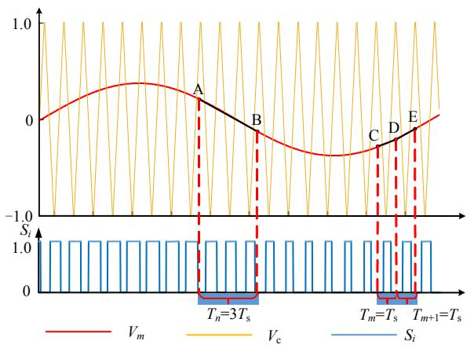  
图1 基于幅值预测的PWM变流器分段示意图  
Fig.1 Piecewise technique based on amplitude prediction for PWM converters

磁暂态的建模效率。

基于幅值预测确定分段时间是一种有效的分段方式，其具体步骤如图 2 所示。图 1 是基于幅值分布的 PWM 变流器分段示意图，比较图中正弦调制波 $\nu _ { m }$ 和三角载波 $\nu _ { c }$ 的波形可以得到开关函数 $S _ { i }$ 的波形。虽然开关函数未表现出明显的周期性，但是正弦调制波波峰和波谷之间，开关函数在图 1 所示的连续 3 个开关周期上有“近周期性”。根据开关周期 $T _ { \mathrm { s } }$ 及开关函数波形可以计算各开关周期占空比，通过比较可将 3个占空比相似、动作特性一致的开关周期合并为第 n 个时间分段 $T _ { n }$ ，而占空比相差较大的开关周期则分别为第 m 个时间分段 $T _ { m }$ 和第 m+1 个时间分段 $T _ { m + 1 \circ }$ 。单个分段时间越长，模型计算效率越高，但是为了保证模型精度满足要求，各时间分段不宜过长，一般为 1~3个载波周期。

# 2.2 分段广义状态空间平均模型

分段广义状态空间平均法的提出主要针对2个问题：一是状态空间平均法对于误差和纹波等问题需要单独处理，此方法在高频分量及谐波方面具有局限性；二是变流器暂态动作情况复杂，合理的分段方法可以计及变流器的特殊动作情况。

分段广义状态空间平均法将分段方法和广义状态空间平均法结合进行建模，主要原理是在分段子区间上采用可描述变流器暂态动作高频分量的广义状态空间方程对 PWM 变流器系统进行建模。

其基本原理如下：

将仿真时间 $L _ { \mathrm { s } }$ 分为若干段子区间的并集，即$L _ { \mathrm { s } } { = } T _ { 1 } \cup T _ { 2 } \cup \ldots \cup T _ { n } \cup \ldots \cup T _ { m }$ ，根据式(7)在任意分段子区间 $T _ { n } { = } [ t _ { n } , t _ { n + 1 } ]$ 上建立分段状态方程：

$$
\left\{ \begin{array}{l} \dot {y} = \varepsilon f _ {\mathrm {P}} (t, y) \\ y (0) = a \end{array} , \quad t \in T _ {n} \right. \tag {18}
$$

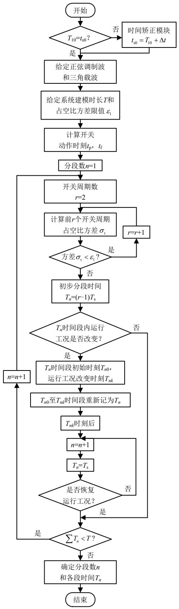  
图2 确定多分段时间流程图  
Fig. 2 Flow chart of obtaining piecewise time

三相 PWM 逆变器的分段状态方程为

$$
\dot {x} (t) = A _ {0} x (t) + b _ {0} + \sum_ {i = 1} ^ {m} \left(A _ {i} x (t) + b _ {i}\right) S _ {i} (t), t \in T _ {n} \tag {19}
$$

若状态变量 $x ( t )$ 在分段区间 $T _ { n }$ 满足傅里叶变换 条件 $\int _ { 0 } ^ { T } \left| x ( t ) \right| ^ { 2 } \mathrm { d } t < \infty$ ，则在区间 $T _ { n }$ 上对状态变量进

行傅里叶展开。当选取的交流分量次数 q 满足精度要求时，变流器分段广义状态空间平均模型的具体状态方程为

$$
\left\{ \begin{array}{c} \left\langle \dot {x} \right\rangle_ {0} (t) = A _ {0} \left\langle x \right\rangle_ {0} (t) + b _ {0} + \sum_ {i = 1} ^ {m} \left(A _ {i} \left\langle x \right\rangle_ {0} (t) + \right. \\ \left. b _ {i}\right) S _ {i} (t) \\ \left\langle \dot {x} \right\rangle_ {1} (t) = A _ {0} \left\langle x \right\rangle_ {1} (t) + b _ {0} + \sum_ {i = 1} ^ {m} \left(A _ {i} \left\langle x \right\rangle_ {1} (t) + \right. \\ \left. b _ {i}\right) S _ {i} (t) - j \omega \left\langle x \right\rangle_ {1} (t) \\ \vdots \\ \left\langle \dot {x} \right\rangle_ {q} (t) = A _ {0} \left\langle x \right\rangle_ {q} (t) + b _ {0} + \sum_ {i = 1} ^ {m} \left(A _ {i} \left\langle x \right\rangle_ {q} (t) + \right. \\ \left. b _ {i}\right) S _ {i} (t) - j q \omega \left\langle x \right\rangle_ {q} (t) \\ \vdots \end{array} , t \in T _ {n} \quad (2 0) \right.
$$

状态变量在分段区间 $T _ { n }$ 上可利用傅里叶级数系数按式(21)构建。

$$
x (t) = \sum_ {q = - \infty} ^ {\infty} \left\langle x \right\rangle_ {q} (t) e ^ {j q \omega_ {s} t}, \quad t \in T _ {n} \tag {21}
$$

在分段区间 $T _ { n }$ 上可以定义分段平均向量场为

$$
f _ {P} (t, y) = \frac {1}{t _ {n} - t _ {n + 1}} \sum_ {q = - \infty} ^ {\infty} \int_ {t _ {n}} ^ {t _ {n + 1}} \left\langle f (s, x) \right\rangle_ {q} d s, \quad t \in T _ {n} \tag {22}
$$

若 $x ( t )$ 为实信号，按式(19)对其 q 阶傅里叶系数$< x > _ { q } ( t )$ 按实部和虚部展开。令 ${ \tau } { - } t / T _ { n }$ ，则 $\scriptstyle { t = T _ { n } \tau } ,$ ，对式(24)进行傅里叶展开，可得

$$
\left\{ \begin{array}{l} \left\langle \dot {x} \right\rangle_ {0} (\tau) = T _ {n} \left[ A _ {0} \left\langle x \right\rangle_ {0} (\tau) + b _ {0} \right] + \\ T _ {n} \left[ \sum_ {i = 1} ^ {m} \left(A _ {i} \left\langle x \right\rangle_ {0} (\tau) + b _ {i}\right) S _ {i} (\tau) \right] \\ \left\langle \dot {x} \right\rangle_ {1} (\tau) = T _ {n} \left[ A _ {0} \left\langle x \right\rangle_ {1} (\tau) + b _ {0} \right] + \\ T _ {n} \left[ \sum_ {i = 1} ^ {m} \left(A _ {i} \left\langle x \right\rangle_ {1} (\tau) + b _ {i}\right) S _ {i} (\tau) - j \omega \left\langle x \right\rangle_ {1} (\tau) \right], \\ \vdots \\ \left\langle \dot {x} \right\rangle_ {q} (\tau) = T _ {n} \left[ A _ {0} \left\langle x \right\rangle_ {q} (\tau) + b _ {0} \right] + \\ T _ {n} \left[ \sum_ {i = 1} ^ {m} \left(A _ {i} \left\langle x \right\rangle_ {q} (\tau) + b _ {i}\right) S _ {i} (\tau) - j q \omega \left\langle x \right\rangle_ {q} (\tau) \right] \\ \vdots \end{array} , \tau = \frac {t}{T _ {n}} (2 3) \right.
$$

对应分段广义状态平均向量场为

$$
f _ {P} (\tau , y) = \sum_ {q = - \infty} ^ {\infty} \int_ {k} ^ {k + 1} \left[ A _ {0} \left\langle y (\tau) \right\rangle_ {q} + b _ {0} \right] \mathrm {d} \tau +
$$

$$
\sum_ {q = - \infty} ^ {\infty} \int_ {k} ^ {k + 1} \sum_ {i = 1} ^ {m} \left[ \left(A _ {i} \left\langle y (\tau) \right\rangle_ {q} + b _ {i}\right) S _ {i} (\tau) \right] d \tau , \tau = \frac {t}{T _ {n}} \tag {24}
$$

用这种分段平均化方法，在每个小的积分区间内，有

$$
\dot {y} (\tau) = T _ {n} f _ {P} (\tau , y) \tag {25}
$$

联立式(23)、(24)，有

$$
\dot {y} (\tau) = T _ {n} \sum_ {q = - \infty} ^ {\infty} \left[ A _ {0} \left\langle y (\tau) \right\rangle_ {q} + b _ {0} \right] +
$$

$$
T _ {n} \sum_ {q = - \infty} ^ {\infty} \left[ \sum_ {i = 1} ^ {m} \left(A _ {i} \left\langle y (\tau) \right\rangle_ {q} + b _ {i}\right) D _ {i} (\tau) \right] \tag {26}
$$

$$
D _ {i} (\tau) =
$$

$$
\left\{ \begin{array}{l} \int_ {k} ^ {k + 1} S _ {i} (\tau) \mathrm {d} \tau , \tau \in [ k, k + 1), k = 0, 1, \dots , N - 1 \\ \frac {1}{L _ {\mathrm {s}} / T _ {n} - N} \int_ {N} ^ {L _ {\mathrm {s}} / T _ {n}} S _ {i} (\tau) \mathrm {d} \tau , \tau \in [ N, L _ {\mathrm {s}} / T _ {n} ] \end{array} \right. \tag {27}
$$

$$
\dot {y} (t) = \sum_ {q = - \infty} ^ {\infty} \left[ A _ {0} \left\langle y (t) \right\rangle_ {q} + b _ {0} + \sum_ {i = 1} ^ {m} \left(A _ {i} \left\langle y (t) \right\rangle_ {q} + b _ {i}\right) D _ {i} (t) \right] \tag {28}
$$

式(26)—(28)是变流器分段广义状态空间平均模型。

# 2.3 分段广义状态空间平均模型的物理意义

分段方法从时间尺度上将模型细化以提高精度，与广义状态空间平均法结合的作用主要体现在两方面：一是对于固定频率的电气量，合理的分段能减少广义状态空间平均傅里叶级数展开的阶数，更精确地直接反映状态量的变化；二是对于不同频率的电气量，合理的分段能够体现频率变化特征，进而体现出系统变化。

分段广义状态空间平均法对变流器稳态和暂态运行工况实现了变时间尺度仿真。稳态工况下，将变流器占空比和开关动作具有“近周期性”的开关周期合并进行分段。暂态工况下以单个开关周期作为分段依据。一般稳态工况的时间分段不超过 3 个开关周期，暂态工况的时间分段为单个开关周期。分段广义平均模型有效地提升了模型仿真效率。

分段广义状态空间平均法体现了“变频”的思想。对于某 10kHz 开关频率的变流器而言，其开关周期为 $1 0 0 \mu \mathrm { s }$ 。若进行合理分段，取分段时间为 2个周期仍能保证模型仿真结果的正确性，此时分段时间为 $2 0 0 \mu \mathrm { s }$ ，相当于周期为 $2 0 0 \mu \mathrm { s }$ ，即频率相当于 5kHz。运用图 2 所示方法，可以实现动态“变频”，提高模型的仿真效率。

# 2.4 分段广义状态空间平均模型的误差分析

分段广义状态空间平均法基于广义状态空间平均法，核心思想是在相应分段时间上对状态变量进行傅里叶变换，保留误差允许范围内的傅里叶系数进行计算。图 3 是模型求解验证及误差确定模块流程图。利用图 3 所示的模型求解验证及误差确定方法可以验证模型的正确性。模型误差确定的核心

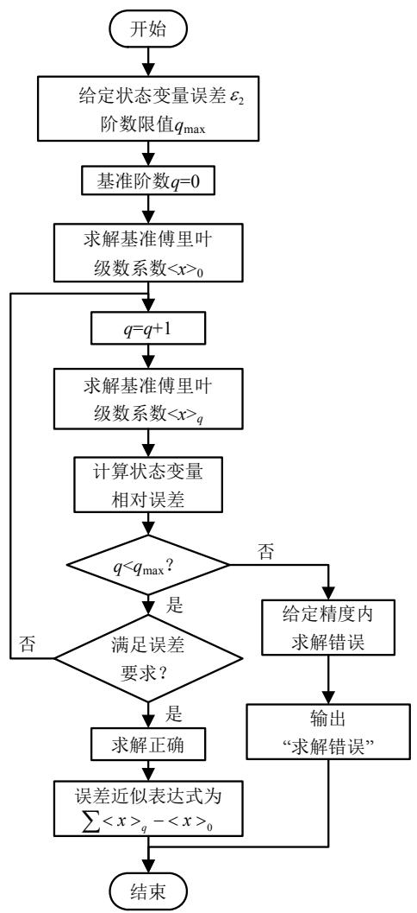  
图 3 模型求解验证及误差确定模块流程图  
Fig. 3 Flow chart of error analysis of P-GSSA method思想是根据不同精度要求确定分段时间上状态变量的傅里叶展开阶数。

按图 3 所述流程，在第 n 个分段时间区间 $T _ { n }$ 内的某一时刻 t，若误差不满足精度要求，状态变量的傅里叶展开阶数增加一阶，再求相应的近似误差和相对误差。相对误差的求解方式定义为：

$$
\bar {o} = \frac {\sum \left\langle y \right\rangle_ {q} \mathrm {e} ^ {\mathrm {j} q \omega_ {s} t} - \left\langle y \right\rangle_ {0}}{\sum \left\langle y \right\rangle_ {q} \mathrm {e} ^ {\mathrm {j} q \omega_ {s} t}} \tag {29}
$$

由相对误差 和相对误差范围参考值 $\varepsilon _ { 2 }$ 可进行广义状态空间平均模型求解验证。若分段时间 $T _ { n }$ 上傅里叶展开阶数较高仍不满足误差要求，则认为求解错误，一般傅里叶展开阶数限值不超过 10。

# 3 算例测试

# 3.1 三相 PWM DC/AC 逆变器算例分析

# 3.1.1 稳态工况仿真及开关频率对模型的影响

P-GSSA 模型基于 GSSA 频率变换的思想，稳态工况下，由于进行分段，根据“等效”思想，相

当于开关频率降低。设计如下仿真方案，研究稳态工况下开关频率对模型的影响。

算例信息见附录 A，仿真时长为 0~0.2s，分别设置开关频率为 1，2，5，10kHz，设置仿真步长为开关周期的百分之一，即相应仿真步长分别为10，5，2，1s。设 P-GSSA 模型的状态变量为 $x _ { P } ,$ ，详细模型的状态变量为 $x _ { D } ,$ 。取各时间段上 P-GSSA模型和详细模型的相对误差最大值作为模型误差$\sigma ,$ 即

$$
\sigma = \max  \left\| \frac {x _ {\mathrm {P}} - x _ {\mathrm {D}}}{x _ {\mathrm {D}}} \right\| \tag {30}
$$

表1是不同开关频率稳态工况下的分段数和模型误差。

表1 稳态工况下不同开关频率分段数与状态变量误差  
Tab. 1 Segment number and state variables error of different switching frequency in steady state conditions   

<table><tr><td>开关频率/kHz</td><td>分段数</td><td>误差σ/%</td></tr><tr><td>1</td><td>100</td><td>5.7003</td></tr><tr><td>2</td><td>200</td><td>3.3994</td></tr><tr><td>5</td><td>500</td><td>1.9412</td></tr><tr><td>10</td><td>989</td><td>1.3166</td></tr></table>

# 3.1.2 暂态工况仿真及开关频率对模型影响

仿真时长为 0.2~0.4s，暂态工况为电网电压幅值在 0.21s 从 0.4kV 跌落到 0.15kV，并在 0.26s 恢复到 0.4kV。分别设置开关频率为 1，2，5，10kHz，仿真步长为开关周期的百分之一，暂态仿真过程中分段时间不超过一个开关周期。表 2 为不同开关频率暂态工况下的分段数和误差。

表2 暂态工况下不同开关频率分段数与状态变量误差  
Tab. 2 Segment number and state variables error of different switching frequency in transient state   

<table><tr><td>开关频率/kHz</td><td>分段数</td><td>误差σ/%</td></tr><tr><td>1</td><td>126</td><td>4.0820</td></tr><tr><td>2</td><td>251</td><td>2.2865</td></tr><tr><td>5</td><td>626</td><td>1.0170</td></tr><tr><td>10</td><td>1243</td><td>0.4913</td></tr></table>

由表 1、2 可知，分段广义状态空间模型的误差随频率升高而减小，与 T=1/fC大致成正比关系。误差最大值均出现在暂态工况中。图4、5中P-GSSA模型与详细模型仿真波形的对比表明分段广义状态空间平均模型的正确性。

此外，模型分段数直接影响计算量，分段数与开关频率成正相关。暂态工况中以单个开关周期为分段时间，稳态工况中以 2~3 个开关周期作为分段

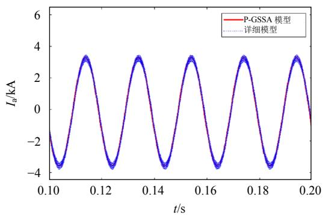  
(a) 整体波形

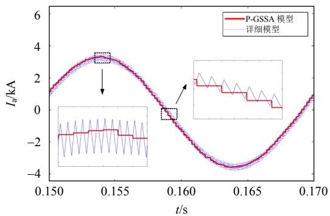  
(b) 局部放大波形  
图4 稳态工况A 相电感电流波形

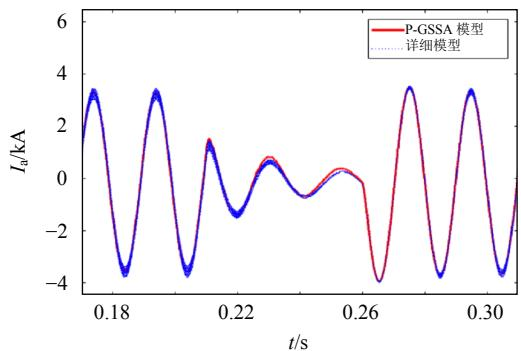  
Fig. 4 Waveforms of the inductor current of phase A in steady state   
(a) 整体波形

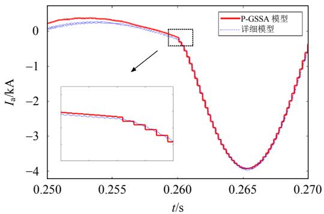  
(b) 局部放大波形  
图5 暂态工况A 相电感电流波形  
Fig. 5 Waveforms of the inductor current of phase A in transient state

时间。仿真过程中取模型的平均值，不必单独计算模型的具体时刻值。

# 3.2 光伏并网发电系统仿真算例分析

本文以附录 B所示光伏并网发电系统为算例，基于 S 函数在 Simulink 中建立变流器 P-GSSA 模型。设置电网在 0.2s时发生三相短路，电压跌落深度为 70%，持续时间 0.15s。采用基于注入无功实现的低压穿越控制策略。图 6、7 分别是采用低压穿越控制策略前后的并网交流电流波形。

由图 6、7 可知，电网发生对称三相短路故障时，光伏系统中并网电流上升至额定电流的 2.5 倍以上。电网故障切除时，光伏的输出功率小于逆变器的并网功率，随着系统功率达到平衡，并网电流逐渐趋于稳态。当采取向电网注入无功电流的低压穿越控制策略时，逆变器并网功率和光伏输出功率之间存在缺额，故障期间的并网电流得到了有效的抑制，其幅值被控制在 0.9~1.1 倍标幺值之间。可

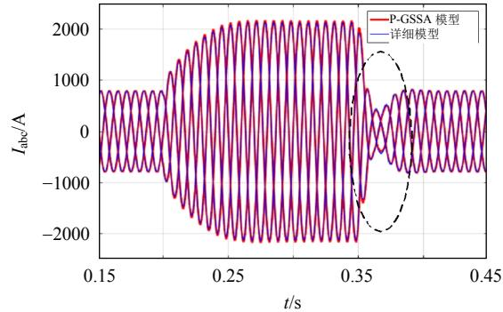

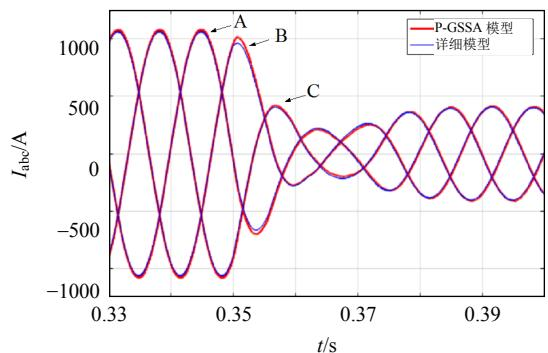  
(a) 并网电流整体波形  
(b) 并网电流局部放大波形  
图 6 电网三相短路时未采用低穿控制的并网交流电流

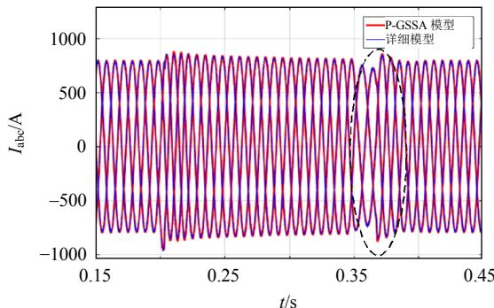  
Fig. 6 Grid-connected current waveforms (with no LVRT control strategy)   
(a) 并网电流整体波形

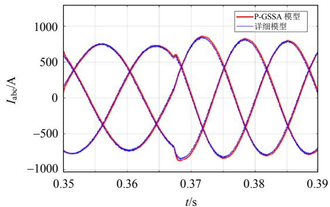  
(b) 并网电流局部放大波形  
图7 电网三相短路时采用低穿控制的并网交流电流  
Fig. 7 Grid-connected current waveforms (with LVRT control strategy)

见，基于无功注入的控制策略可实现光伏系统的低压穿越。

仿真结果显示，在低压穿越过程中 P-GSSA模型的误差始终小于 5%，且误差随分段数增加而减小。本文提出的 P-GSSA模型与详细模型相比，无论是否采用低压穿越控制策略均可有效体现光伏系统的暂态特性。

# 3.4 模型效率分析

设置仿真时长为 3s，模型仿真的耗时如表 3所示。

表3 模型仿真耗时对比  
Tab. 3 Consumed time of different models   

<table><tr><td>开关频率/kHz</td><td>详细模型耗时/s</td><td>P-GSSA 模型耗时/s</td><td>误差σ/%</td></tr><tr><td>1</td><td>12.115</td><td>9.628</td><td>4.0299</td></tr><tr><td>2</td><td>24.120</td><td>19.146</td><td>2.2234</td></tr><tr><td>5</td><td>60.220</td><td>47.966</td><td>0.9959</td></tr><tr><td>10</td><td>119.673</td><td>95.354</td><td>0.4795</td></tr></table>

详细模型的计算次数主要是仿真步长上的微分方程求解次数，P-GSSA 模型的计算次数主要包括模型分段求解次数和微分方程求解次数。模型仿真的耗时对比显示，P-GSSA 模型在保证精度的前提下有效地提升了仿真效率，仿真耗时提升均超过20%。当 P-GSSA 模型用于大规模光伏并网的电磁暂态仿真时，效率提升将更明显。

# 4 结论

本文基于分段广义状态空间平均法建立了PWM 变流器 P-GSSA 模型。模型相关仿真表明：

1）本文建立的 P-GSSA 模型能准确反映变流器稳态和暂态特性，尤其能精确反映低压穿越等电磁暂态过程。针对该模型的求解验证和误差确定方法简单准确。  
2）该模型适用于电磁暂态高效仿真。与详细

模型相比，P-GSSA 模型能有效提升仿真效率，同时保证较高精度。

3）该模型将分段方法和广义状态空间平均法结合，基于 P-GSSA模型可以针对不同运行工况实现变尺度仿真。

本文工作完善了变流器平均化建模和仿真理论，给出了分段方法和平均化建模方法在变流器电磁暂态领域的适用性，有效地提高了变流器电磁暂态仿真效率。为后续变流器电磁暂态建模与控制方法研究，以及含大规模新能源并网电磁暂态快速仿真奠定了基础。

# 参考文献

[1] 丁明，王伟胜，王秀丽，等．大规模光伏发电对电力系统影响综述[J]．中国电机工程学报，2014，34(1)：1-14Ding Ming，Wang Weisheng，Wang Xiuli，et al．A reviewon the effect of large-scale PV generation on powersystems[J]．Proceedings of the CSEE，2014，34(1)：1-14(inChinese)．  
[2] Ekström J，Koivisto M，Mellin I，et al．A statistical model for hourly large-scale wind and photovoltaic generation in new locations[J] ． IEEE Transactions on Sustainable Energy，2017，8(4)：1383-1393   
[3] Remon D，Cantarellas A M，Mauricio J M，et al．Power system stability analysis under increasing penetration of photovoltaic power plants with synchronous power controllers[J]．IET Renewable Power Generation，2017， 11(6)：733-741   
[4] 刘璐，耿华，马少康，等．低电压穿越过程中DFIG型 风电场同步稳定及无功电流控制方法[J]．中国电机工程 学报，2017，37(15)：4399-4407 Liu Lu，Geng Hua，Ma Shaokang，et al．Synchronization stability and reactive current control method of DFIG wind farm during low voltage ride through[J]．Proceedings of the CSEE，2017，37(15)：4399-4407(in Chinese)   
[5] Oguma K，Akagi H． Low-voltage-ride-through (LVRT)control of an HVDC transmission system using twomodular multilevel DSCC converters[J] ． IEEETransactions on Power Electronics ， 2017 ， 32(8) ：5931-5942  
[6] 李乃永，梁军，赵义术．并网光伏电站的动态建模与稳定性研究[J]．中国电机工程学报，2011，31(10)：12-18．Li Naiyong，Liang Jun，Zhao Yishu．Research on dynamicmodeling and stability of grid-connected photovoltaicpower station[J]．Proceedings of the CSEE，2011，31(10)：12-18(in Chinese)  
[7] 訾鹏，周孝信，安宁，等．提高双馈式风力发电机机电暂态模型crowbar保护仿真精度的方法[J]．中国电机工程学报，2015，35(6)：1322-1328

Zi Peng，Zhou Xiaoxin，An Ning，et al．A method of improving the accuracy of DFIG electromechanical transient model considering crowbar protection [J]．Proceedings of the CSEE，2015，35(6)：1322-1328(in Chinese)   
[8] 李鹏，丁承第，王成山，等．基于多核心处理器的分布式发电微网系统暂态并行仿真方法[J]．中国电机工程学报，2013，33(16)：171-178  
Li Peng，Ding Chengdi，Wang Chengshan，et al．A parallel algorithm of transient simulation for distributed generation system based on multi-core CPU[J]．Proceedings of the CSEE，2013，33(16)：171-178(in Chinese)   
[9] 叶华，安婷，裴玮，等．含 VSC-HVDC交直流系统多尺度暂态建模与仿真研究[J]．中国电机工程学报，2017，37(7)：1897-1908  
Ye Hua，An Ting，Pei Wei，et al．Multi-scale modelingand simulation of transients for VSC-HVDC and ACsystems[J]．Proceedings of the CSEE，2017，37(7)：1897-1908(in Chinese)  
[10] Chiniforoosh S，Atighechi H，Davoudi A，et al． Steadystate and dynamic performance of front-end diode rectifier loads as predicted by dynamic average-value models [J]．IEEE Transactions on Power Delivery，2013，28(3)： 1533-1541   
[11] 张卫平，吴兆麟，李洁．开关变换器建模方法综述[J]．浙江大学学报：自然科学版，1999，33(2)：169-175  
Zhang Weiping，Wu Zhaolin，Li Jie．Review of modeling for power converter[J]．Journal of Zhejiang University： Natural Science，1999，33(2)：169-175(in Chinese)   
[12] 朱桂萍，陈建业．电力电子电路的计算机仿真[M]．2版．北京：清华大学出版社，2010：146-154  
Zhu Guiping，Chen Jianye．The application of computer simulation in power system[M]．2nd ed．Beijing：Tsinghua University Press，2010：146-154(in Chinese)   
[13] Behjati H，Niu Lei，Davoudi A，et al．Alternative time-invariant multi-frequency modeling of PWM DC-DC converters[J]．IEEE Transactions on Circuits and Systems I：Regular Papers，2013，60(11)：3069-3079   
[14] 王成山，高菲，李鹏，等．电力电子装置典型模型的适应性分析[J]．电力系统自动化，2012，36(6)：63-68  
Wang Chengshan，Gao Fei，Li Peng，et al．Adaptability analysis of typical power electronic device models [J]．Automation of Electric Power Systems，2012，36(6)： 63-68(in Chinese)   
[15] Daryabak M，Filizadeh S，Jatskevich J，et al．Modelingof LCC-HVDC systems using dynamic phasors[J]．IEEETransactions on Power Delivery，2014，29(4)：1989-1998  
[16] 王钢，李志铿，李海锋，等．交直流系统的换流器动态相量模型[J]．中国电机工程学报，2010，30(1)：59-64Wang Gang，Li Zhikeng，Li Haifeng，et al．Dynamic

phasor model of the converter of the AC/DC system [J]．Proceedings of the CSEE，2010，30(1)：59-64(in Chinese)   
[17] 杨洋，肖湘宁，廖坤玉，等．机电-电磁暂态混合仿真多端口模型的比较分析[J]．电力系统自动化，2017，41(7)：127-134  
Yang Yang ， Xiao Xiangning ， Liao Kunyu ， etal ． Comparative analysis of multi-port model forelectromechanical-electromagnetic transient hybridsimulation[J]．Automation of Electric Power Systems，2017，41(7)：127-134(in Chinese)  
[18] Lehman B，Bass R M．Extensions of averaging theory for power electronic systems[J]．IEEE Transactions on Power Electronics，1996，11(4)：542-553   
[19] 许寅，陈颖，陈来军，等．基于平均化理论的PWM变流器电磁暂态快速仿真方法(一)PWM 变流器分段平均模型的建立[J]．电力系统自动化，2013，37(11)：58-64  
Xu Yin ， Chen Ying ， Chen Laijun ， et al ． Fast electromagnetic transient simulation method for PWM converters based on averaging theory Part One Establishment of piecewise averaged model for PWM converters[J]．Automation of Electric Power Systems， 2013，37(11)：58-64(in Chinese)   
[20] Bagheri A，Mardaneh M，Rajaei A，et al．Detection of grid voltage fundamental and harmonic components using Kalman filter and generalized averaging method[J]．IEEE Transactions on Power Electronics ， 2016 ， 31(2) ： 1064-1073   
[21] 王瑶．基于状态空间平均模型的电压控制 SIDO Buck变换器稳定性分析[J]．中国电机工程学报，2018，38(6)：1810-1817  
Wang Yao ． Stability analysis for voltage controlled single-inductor dual-output buck converter based on state space average model[J]，Proceedings of the CSEE，2018， 38(6)：1810-1817(in Chinese)   
[22] 许寅，陈颖，陈来军，等．基于平均化理论的 PWM 变流器电磁暂态快速仿真方法(二)适用 PWM 变流器分段平均模型的改进EMTP算法[J]．电力系统自动化，2013，37(12)：51-56  
Xu Yin ， Chen Ying ， Chen Laijun ， et al ． Fast electromagnetic transient simulation method for PWM converters based on averaging theory Part Two Improved EMTP algorithm suitable for piecewise averaged model of PWM converters[J] ． Automation of Electric Power Systems，2013，37(12)：51-56(in Chinese)   
[23] 许寅，陈颖，陈来军，等．PWM变流器分段平均模型中的纹波估计方法[J]．电网技术，2013，37(8)：2143-2150  
Xu Yin，Chen Ying，Chen Laijun，et al．A ripple estimation method for piecewise averaged model of PWM

converters[J]．Power System Technology，2013，37(8)：2143-2150(in Chinese)  
[24] Xu Yin ， Chen Ying ， Liu C C ， et al ． Piecewiseaverage-value model of PWM converters withapplications to large-signal transient simulations[J]．IEEETransactions on Power Electronics ， 2016 ， 31(2) ：1304-1321．  
[25] Yahyaie F ， Lehn P W ． On dynamic evaluation ofharmonics using generalized averaging techniques[J]．IEEE Transactions on Power Systems，2015，30(5)：2216-2224  
[26] Sanders S R，Noworolski J M，Liu X Z，et al．Generalized averaging method for power conversion circuits[J]．IEEE Transactions on Power Electronics，1991，6(2)：251-259   
[27] 马皓，林钊，王小瑞．不平衡非线性负载下三相逆变器 的建模与控制[J]．电工技术学报，2015，30(18)：83-95 Ma Hao，Lin Zhao，Wang Xiaorui．Modeling and control of three-phase inverter powering unbalanced and nonlinear loads[J]．Transactions of China Electrotechnical Society．2015，30(18)：83-95(in Chinese)

# 附录 A 三相 PWM 逆变器仿真算例及其参数

本文采用的三相 PWM DC/AC 逆变器仿真算例及其参数如图A1与表A1所示。

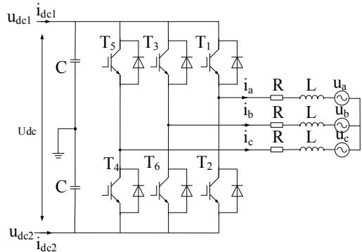  
图 A1 三相 PWM 逆变器仿真算例  
Fig. A1 Three-phase PWM AC-DC converter

表 A1 三相 PWM 逆变器仿真算例参数  
Tab. A1 Parameters of the PWM converter   

<table><tr><td>参数</td><td>数值</td></tr><tr><td>系统频率、电网频率fs/Hz</td><td>50</td></tr><tr><td>开关频率、载波频率fc/Hz</td><td>10000</td></tr><tr><td>直流电容C/F</td><td>0.032</td></tr><tr><td>滤波电感L/H</td><td>0.0006</td></tr><tr><td>电阻R/Ω</td><td>0.1</td></tr><tr><td>调制信号幅值A/pu</td><td>0.35</td></tr><tr><td>调制信号角频率ω1(rad/s)</td><td>100π</td></tr><tr><td>调制信号相角ψ1/rad</td><td>-π/3</td></tr><tr><td>电网电压幅值Um/kV</td><td>0.4</td></tr></table>

<table><tr><td>参数</td><td>数值</td></tr><tr><td>电网电压相角 θ(rad</td><td>0</td></tr><tr><td>直流负载电阻 R1/Ω</td><td>2</td></tr></table>

其中电压基值 $V _ { \mathrm { b a s e } } { = } 0 . 4 \mathrm { k V } ;$ ；电流基值 $I _ { \mathrm { b a s e } } { = } 2 . 0 \mathrm { k A }$ 。

# 附录B 光伏系统仿真算例及其参数

本文采用的光伏系统仿真算例及其参数如图 A2 与表A2所示。

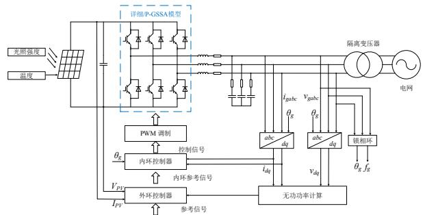  
图A2 光伏系统仿真算例拓扑  
Fig. A2 Simulation example of a photovoltaic system

表A2 光伏系统仿真算例参数  
Tab. A2 Parameters of the photovoltaic system   

<table><tr><td>参数</td><td>数值</td></tr><tr><td>系统频率 Fnom/Hz</td><td>50</td></tr><tr><td>载波频率 Fc/Hz</td><td>1950</td></tr><tr><td>逆变器基准功率 Pnom/kVA</td><td>365</td></tr><tr><td>直流电压基准值 Vnom_prim/V</td><td>730</td></tr><tr><td>逆变器基准电压 Vnom_prim/V</td><td>380</td></tr><tr><td>变压器基准功率/kVA</td><td>365</td></tr><tr><td>容性无功功率 Qc/var</td><td>36 500</td></tr><tr><td>容性有功功率 Pc/W</td><td>730</td></tr><tr><td>直流电压上限/V</td><td>830</td></tr><tr><td>直流电压下限/V</td><td>600</td></tr><tr><td>比例增益 Kp</td><td>0.3</td></tr><tr><td>积分增益 Ki</td><td>20</td></tr></table>

  
王磊

# 收稿日期：2018-05-25。

# 作者简介：

王磊(1978)，男，博士，副教授，主要研究方向为新能源及其利用、柔性输电系统仿真与控制，lwang_hf@126.com；

*通信作者：邓新昌(1993)，男，硕士研究生，研究方向为新能源并网电磁暂态建模，hfutdxc2012@126.com；

侯俊贤(1978)，男，高级工程师，主要研究方向为电力系统分析软件开发和电力系统分析工程等，houjx@epri.sgcc.com.cn。

(责任编辑 邱丽萍)

# A Piecewise Generalized State Space Model of Power Converters for Electromagnetic Transient Efficient Simulation

WANG Lei1 , DENG Xinchang1 , HOU Junxian2 , MU Shixia2 , DONG Yifeng2 , WANG Tiezhu2

(1. Hefei University of Technology; 2. China Electric Power Research Institution)

KEY WORDS: converter; piecewise generalized state space averaging (P-GSSA); multi time scale; electromagnetic transient model; efficient simulation.

The transient behavior of converters in large-scale renewable energy generation is complicated, and a simulation model of converters is different for every situation because it depends on a balance of accuracy and efficiency. The present model of converters cannot be fully applied to the efficient electromagnetic transient simulation of electric power system wherein large-scale renewable energy is connected to the grid.

Therefore, it is very urgent to model converters that balance accuracy and efficiency of the electromagnetic transient area in the electric power systems, wherein a large-scale renewable energy is connected to the grid. A piecewise generalized state space averaging (P-GSSA) model is proposed as follows:

The simulation time $L _ { \mathrm { s } }$ can be divided into several subintervals as $L _ { \mathrm { s } } { = } T _ { 1 } \cup T _ { 2 } \cup \ldots \cup T _ { n } \cup \ldots \cup T _ { m } .$ . The state variable can be constructed by Fourier coefficients in subinterval $T _ { \mathrm { n } } \mathrm { : }$

$$
x (t) = \sum_ {q = - \infty} ^ {\infty} \left\langle x \right\rangle_ {q} (t) e ^ {j q \omega_ {1} t}, \quad t \in T _ {n} \tag {1}
$$

If the Fourier transform is applied and ${ \tau } { = } t / T _ { \mathrm { n } }$ is taken:

$$
\begin{array}{l} \dot {y} (\tau) = T _ {n} \sum_ {q = - \infty} ^ {\infty} \left[ A _ {0} \left\langle y (\tau) \right\rangle_ {q} + b _ {0} \right] + \\ T _ {n} \sum_ {q = - \infty} ^ {\infty} \left[ \sum_ {i = 1} ^ {m} \left(A _ {i} \left\langle y (\tau) \right\rangle_ {q} + b _ {i}\right) D _ {i} (\tau) \right] (2) \\ D _ {i} (\tau) = \\ \left\{ \begin{array}{l} \int_ {k} ^ {k + 1} S _ {i} (\tau) \mathrm {d} \tau , \tau \in [ k, k + 1), k = 0, 1, \dots , N - 1 \\ \frac {1}{L _ {\mathrm {s}} / T _ {n} - N} \int_ {N} ^ {L _ {\mathrm {s}} / T _ {n}} S _ {i} (\tau) \mathrm {d} \tau , \tau \in [ N, L _ {\mathrm {s}} / T _ {n} ] \end{array} \right. (3) \\ \end{array}
$$

The basic step of the P-GSSA method is to obtain the piecewise time, and then apply Fourier transform to state variables, and calculate model equations in the

corresponding piecewise time for required error range. A model error analysis of P-GSSA method is proposed according to the Fourier series of state variables.

The simulation study shows that the P-GSSA model established in this paper can accurately reflect the steady-state and transient characteristics (particularly under LVRT condition) of a converter in renewable energy system. The error analysis and determination of P-GSSA model are simple and precise, as shown in Tab. 1.

Tab. 1 Consumed time of different models   

<table><tr><td>Switching frequency/kHz</td><td>Consumed Time of the detailed model/s</td><td>Consumed time of the P-GSSA model/s</td><td>Model error/%</td></tr><tr><td>1</td><td>12.115</td><td>9.628</td><td>4.0229</td></tr><tr><td>2</td><td>24.120</td><td>19.146</td><td>2.2234</td></tr><tr><td>5</td><td>60.220</td><td>47.966</td><td>0.9959</td></tr><tr><td>10</td><td>119.673</td><td>95.354</td><td>0.4795</td></tr></table>

The P-GSSA model combines the piecewise technique with the GSSA method, and a multiple time scale simulation of converters in different operation modes can be realized based on the P-GSSA model. It is suitable for the efficient simulation. Compared with the detailed model, the P-GSSA model improves the simulation efficiency while ensuring high accuracy, as shown in Fig. 1.

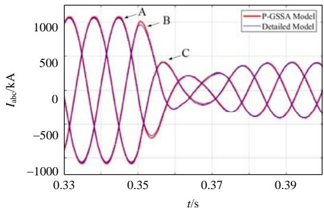  
Fig. 1 Grid-connected current waveforms der LVRT condition but with no LVRT control strategy)