# A state-space approach for accelerated simulation of modular multilevel converters

Jinli Zhao a , Manjiang Li a , Xiaopeng Fu a,* , Peng Li a , Jean Mahseredjian b

a State Key Laboratory of Smart Power Distribution Equipment and System, Tianjin University, Tianjin 300072, China   
b Department of Electrical Engineering, Poly-technique Montr´eal, Montr´eal, Qu´ebec H3T 1J4, Canada

# A R T I C L E I N F O

Keywords:

Modular multilevel converter (MMC)

State-space

Electromagnetic transient (EMT) simulation

Acceleration model

# A B S T R A C T

Modular multilevel converter (MMC) based high-voltage direct current (HVDC) transmission technology has been widely applied in practical engineering. With the continuous increase in transmission voltage and capacity, a growing number of MMC submodules (SMs) is utilized. To meet the demands for fast electromagnetic transient (EMT) simulation of large-scale power electronic systems, this paper proposes a simulation acceleration approach based on the state-space framework and applies it to MMCs. By grouping SMs according to switching state combinations and introducing auxiliary state variables, the dimension of the state matrix is significantly reduced, thereby accelerating numerical integration. Leveraging the characteristics of state variable grouping, an efficient capacitor voltage balancing algorithm is proposed. Finally, the accuracy and effectiveness of the proposed model are validated through simulation case studies.

# 1. Introduction

With the increasing capacity of renewable energy integration, transmission, and consumption, power systems are exhibiting a pronounced trend of high renewable energy penetration and high proportion of power electronics. The fast dynamic response characteristics and the large scale of the system present new challenges and urgent demands for improvements in simulation technology. In recent years, accelerating the simulation of large-scale power electronic systems has become a research focus [1–3].

Aligned with the trend of high penetration of power electronic devices, the primary challenge for electromagnetic transient (EMT) simulation is modeling the diverse range of power electronic equipment. Modular multilevel converter (MMC) based high-voltage direct current (HVDC) transmission offers flexible control and low harmonic content, making it a key technology for transporting large-scale renewable energy. With rapid development of MMC–HVDC transmission technologies, transmission voltage and capacity continue to rise. Typically, MMCs need to reach hundreds of levels to meet the requirements of practical engineering, and each submodule (SM) contains multiple power electronic switches [4,5]. The large number of power electronic

devices operating at high frequency seriously affects the simulation speed, posing a great challenge for EMT simulation [6,7]. To address the issue of slow EMT simulation of high-level MMCs in practical power system studies, it is essential to develop an improved simulation approach for MMC–HVDC systems.

For EMT simulation, there are mainly two algorithm frameworks—state-space analysis and nodal analysis. Most existing acceleration models of MMC were proposed in the nodal analysis framework. In [8], the MMC Thevenin equivalent model is introduced that balances simulation accuracy and speed while retaining the internal information of each SM. This approach is now widely used in practice. Further optimized equivalent models were recently proposed in [9] and [10] to improve simulation speed. Thevenin equivalent models were also implemented for variant of converter topologies, e.g. hybrid MMC composed of both half-bridge and full-bridge SMs [11], and cascaded power electronic devices [12], improving simulation efficiency by eliminating internal nodes.

The nodal analysis framework is efficient in model construction, but its discretization formula effectively hard-codes the simulation step and integration scheme, which limits its flexibility in some scenarios. In contrast, the state-space analysis framework is advantageous in that the

numerical method and simulation model are relatively independent, allowing for flexible adaption for suitable numerical integration algorithm and simulation parameters $[ 7 , 1 3 ]$ . Several equivalent models of MMC were proposed in this framework. A generic state-space model of MMC with full current and all capacitor dynamics was derived in [14], which was a switching function model, but its simulation time increases significantly with the number of MMC levels. By grouping identical MMC SMs, the model in [15] requires only one calculation for the same type of SMs. Since no circuit simplification is performed, its accuracy matches that of the original model. But its efficiency depends on the equivalent approach used. Another MMC state-space acceleration model was proposed in [16], which assumes balanced capacitor voltage, limiting its applicability. To the best of authors’ knowledge, while the Thevenin equivalent approach for MMC in nodal analysis is well recognized, a comparably efficient yet general approach within the state-space framework remains lacking. This work addresses this gap by proposing a novel method that improves simulation speed and accurately preserves individual SM information, without sacrificing flexibility of state-space analysis.

The core idea of the proposed method is to group SMs based on the combination of switching states, and define low-order surrogate state variables that represent different groups and participate system-level solution of reduced matrix dimension. A dedicated mechanism is carefully designed for accurate back-mapping to the full states, ensuring no added accuracy loss even in combination with high-order integration schemes like the exponential integrator [13]. In addition, efficient capacitor voltage balancing algorithm is proposed based on properties of the established state variable groups. The proposed method exhibits logarithmic growth in computation time with respect to MMC levels, making it suitable for EMT simulation of large-scale MMC–HVDC transmission systems. Since many large-scale power electronic systems share similar modular structure with MMC, the proposed simulation acceleration approach can be generalized to broader applications.

The remainder of the paper is organized as follows. Section II briefly reviews the topology of MMC and its SMs. Section III develops the accelerated state-space model for MMC under both normal operation and blocked modes. Section IV presents the capacitor voltage balancing algorithm based on state variable grouping. Section V demonstrates the accuracy and efficiency of the proposed method. Section VI draws conclusions.

# 2. Topology of MMC and SM

The topology of MMC is shown in Fig. 1. It consists of three phase units, each comprising an upper arm and a lower arm. Each arm is composed of N SMs connected in series with an arm inductor L. At any time, half of the SMs in each phase unit are inserted to maintain a constant DC voltage. Desired three-phase AC voltage is achieved by controlling the number of SMs inserted in the upper and lower arms.

The MMC commonly uses half-bridge SMs (HBSMs), as shown in Fig. 2. It is composed of two insulated gate bipolar transistors (IGBTs), two diodes, and an energy storage capacitor C. In the detailed equivalent model of MMC, variable resistors $R _ { \mathrm { o n } }$ and $R _ { \mathrm { o f f } }$ are used to represent the switch group formed by the IGBT and the anti-parallel diode [17]. This paper adopts this simplified piecewise linear approach. All SMs referred to in this paper are HBSMs.

# 3. State-Space MMC simulation acceleration model

The MMC Thevenin equivalent model in nodal analysis is derived by circuit laws on the static circuit of MMC arms formed by companion circuits of LC elements, which is in turn results of branch-level discretization of the nodal analysis. On the other hand, no static circuit or simple theoretic tool are readily available in the state-space analysis, as it uses differential or differential-algebraic equations to represent the system as a dynamic one, the equivalence and order reduction of which

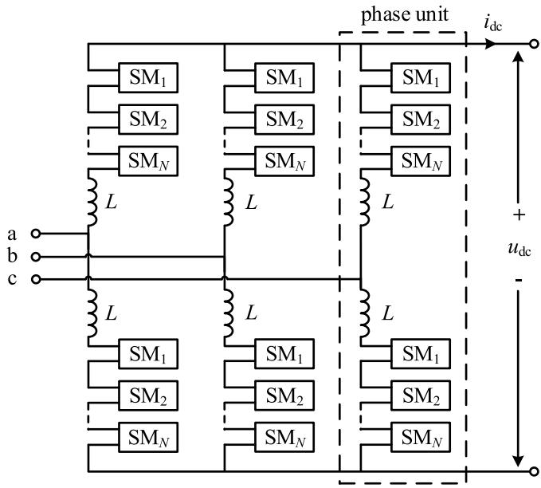  
Fig. 1. The topology of MMC.

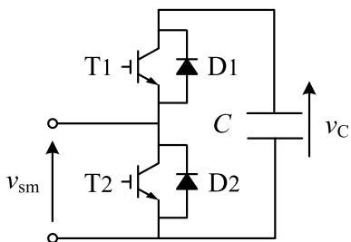  
Fig. 2. The topology of HBSM.

are theoretically more complex. The Thevenin equivalent approach cannot be applied in the state-space framework.

If each SM capacitor is treated as a state variable, the state-space equation matrices will be high dimensional, making it difficult to solve efficiently. Thus, it is necessary to investigate a reduced order modeling method suitable for this framework.

# 3.1. Normal operation state

For power systems with three-phase MMCs, we assume the following state-space equation form for the power network.

$$
\left\{ \begin{array}{c} \dot {\boldsymbol {x}} = \boldsymbol {A} _ {\mathrm {e}} \boldsymbol {x} + \boldsymbol {B} _ {\mathrm {e v}} \boldsymbol {v} _ {\mathrm {M}} + \boldsymbol {B} _ {\mathrm {e u}} \boldsymbol {u} \\ \boldsymbol {i} _ {\mathrm {M}} = \boldsymbol {C} _ {\mathrm {e}} \boldsymbol {x} \end{array} \right. \tag {1}
$$

where x is the power network state vector, M is the total number of MMC arms, $\nu _ { M }$ is the input vector containing port voltage of all arms and is M-dimensional, u contains other external input to the network, i is the output vector containing currents of all arms, also M-dimensional, and $A _ { \mathrm { e } } , B _ { \mathrm { e v } } , B _ { \mathrm { e u } } ,$ and $C _ { \mathrm { e } }$ are coefficient matrices. For systems containing nonlinear components, their piecewise linear representation makes these matrices time-variant.

For an MMC SM on arm $k ,$ its state equation is as follows:

$$
\left\{\dot {v} _ {\mathrm {C}} = A _ {\mathrm {s m}} v _ {\mathrm {C}} + B _ {\mathrm {s m}} i _ {k} v _ {\mathrm {s m}} = C _ {\mathrm {s m}} v _ {\mathrm {C}} + D _ {\mathrm {s m}} i _ {k} \right. \tag {2}
$$

where $A _ { \mathrm { s m } } , \ B _ { \mathrm { s m } } , \ C _ { \mathrm { s m } } ,$ and $D _ { \mathrm { s m } }$ are coefficients that change with the switching state of the SM. When the SM is inserted, the coefficients take a subscript p and the following form:

$$
\left[ \begin{array}{l l} A _ {\mathrm {p}} & B _ {\mathrm {p}} \\ C _ {\mathrm {p}} & D _ {\mathrm {p}} \end{array} \right] = \frac {1}{R _ {\mathrm {o n}} + R _ {\mathrm {o f f}}} \left[ \begin{array}{c c} - \frac {1}{C} & \frac {R _ {\mathrm {o f f}}}{C} \\ R _ {\mathrm {o f f}} & R _ {\mathrm {o n}} R _ {\mathrm {o f f}} \end{array} \right] \tag {3}
$$

When the SM is bypassed, the coefficients take a subscript q and are:

$$
\left[ \begin{array}{l l} A _ {\mathrm {q}} & B _ {\mathrm {q}} \\ C _ {\mathrm {q}} & D _ {\mathrm {q}} \end{array} \right] = \frac {1}{R _ {\mathrm {o n}} + R _ {\mathrm {o f f}}} \left[ \begin{array}{c c} - \frac {1}{C} & \frac {R _ {\mathrm {o n}}}{C} \\ R _ {\mathrm {o n}} & R _ {\mathrm {o n}} R _ {\mathrm {o f f}} \end{array} \right] \tag {4}
$$

For an arm containing N SMs, the same current flows through all SMs in the arm, and the physical ordering of SMs does not influence the external behavior of the arm. Therefore, SMs in identical switching state can be conceptually regrouped, partitioning the SMs within each arm into two groups: the inserted SM group and the bypassed SM group, as shown in Fig. 3. Since SMs in the same group have identical state-space equation coefficients, a virtual state variable is introduced for each group as the sum of capacitor voltages within the group. The virtual state-space equations are derived by summing up those of all SMs within the group and are shown to have simple form.

For arm $k ,$ suppose there are $\alpha _ { k }$ SMs in the inserted group. The new state variables for the inserted group, Pk, and the bypassed group, $Q _ { k } ,$ , has the following state-space equation, where $\nu _ { k }$ is the port voltage of arm $k ,$ and an element of ${ \nu } _ { M } \mathbf { : } $

$$
\left\{ \begin{array}{l} \dot {P} _ {k} = A _ {\mathrm {p}} P _ {k} + \alpha_ {k} B _ {\mathrm {p}} i _ {k} \dot {Q} _ {k} = A _ {\mathrm {q}} Q _ {k} + (N - \alpha_ {k}) B _ {\mathrm {q}} i _ {k} v _ {k} = C _ {\mathrm {p}} P _ {k} + C _ {\mathrm {q}} Q _ {k} + N D _ {\mathrm {p}} i _ {k} \end{array} \right. \tag {5}
$$

By combining the state-space equations for all arms with (1) and eliminating the intermediate variables, the overall state-space equation for the power system is derived:

$$
\left[ \begin{array}{l} \dot {\boldsymbol {P}} \\ \dot {\boldsymbol {Q}} \\ \dot {\boldsymbol {x}} \end{array} \right] = \left[ \begin{array}{c c c} A _ {\mathrm {p}} \boldsymbol {I} _ {M} & \boldsymbol {0} & B _ {\mathrm {p}} \boldsymbol {E} _ {P} \boldsymbol {C} _ {\mathrm {e}} \\ \boldsymbol {0} & A _ {\mathrm {q}} \boldsymbol {I} _ {M} & B _ {\mathrm {q}} \boldsymbol {E} _ {Q} \boldsymbol {C} _ {\mathrm {e}} \\ C _ {\mathrm {p}} \boldsymbol {B} _ {\mathrm {e v}} & C _ {\mathrm {q}} \boldsymbol {B} _ {\mathrm {e v}} & \boldsymbol {A} _ {\mathrm {e}} + N D _ {\mathrm {p}} \boldsymbol {B} _ {\mathrm {e v}} \boldsymbol {C} _ {\mathrm {e}} \end{array} \right] \left[ \begin{array}{l} \boldsymbol {P} \\ \boldsymbol {Q} \\ \boldsymbol {x} \end{array} \right] + \left[ \begin{array}{l} \boldsymbol {0} \\ \boldsymbol {0} \\ \boldsymbol {B} _ {\mathrm {e u}} \end{array} \right] \boldsymbol {u} \tag {6}
$$

where P and Q are M-dimensional vectors composed of all the surrogate state variables. $I _ { M }$ is the identity matrix, ${ \pmb E } _ { P } = \mathrm { d i a g } ( \alpha _ { 1 } , \cdots , \alpha _ { M } )$ , $E _ { Q } \ =$ dia $\mathfrak { g } ( N - \alpha _ { 1 } , \cdots , N - \alpha _ { M } )$ . The state-space model represented by (6) has only 2 state variables per arm. For the three-phase MMC system shown in Fig. 1, compared to taking all capacitor voltage of SMs as state variables, this approach reduces the matrix dimension by M(N − 2), significantly improving the solving speed. Accurate solution of the statespace model of the system is referred to [13].

# 3.2. Blocked state

When in situations such as startup or DC faults, the MMC needs to enter the blocked mode, where all IGBTs are turned off, and the SMs’ operating states are determined by the diodes. All SMs in the same arm share the same current, so they will have the same operating state.

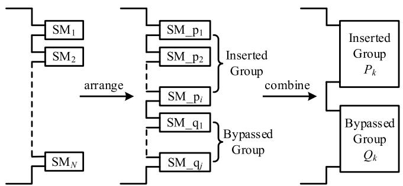  
Fig. 3. The process of grouping and merging arm SMs.

Table 1 SM Blocked Operating State.   

<table><tr><td>Condition</td><td>D1</td><td>D2</td><td>SM State</td></tr><tr><td>ik(t) &gt; 0 andvm(t - Δt) &gt; vC(t - Δt)</td><td>1</td><td>0</td><td>Inserted</td></tr><tr><td>ik(t) &lt; 0 andvm(t - Δt) &lt; 0</td><td>0</td><td>1</td><td>Bypassed</td></tr><tr><td>Else</td><td>0</td><td>0</td><td>Open circuit</td></tr></table>

Table 1 shows the blocked operating state of the SMs and their corresponding judgment conditions.

As shown in Table 1, in the blocked mode, there are three operating states: inserted, bypassed, and open circuit. The grouping method used in normal state is not applicable in the blocked mode. However, all SMs in the same arm share the same state, meaning that the three groups will not appear simultaneously. Therefore, the two state variables for each arm in the normal state can still be retained. The open-circuit group can be treated as a bypassed group, and only the coefficients of the state equations need to be modified during the calculation. The open-circuit coefficients can be derived as follows:

$$
\left[ \begin{array}{l l} A _ {\mathrm {q}} ^ {\prime} & B _ {\mathrm {q}} ^ {\prime} \\ C _ {\mathrm {q}} ^ {\prime} & D _ {\mathrm {q}} ^ {\prime} \end{array} \right] = \frac {1}{2} \left[ \begin{array}{c c} \frac {1}{R _ {\text {o f f}} C} & \frac {1}{C} \\ 1 & R _ {\text {o f f}} \end{array} \right] \tag {7}
$$

In the blocked mode, switching actions could occur between integer time step nodes. It is necessary to perform interpolation on the switching moments and state variables to capture the accurate dynamics. Fig. 4 illustrates the process of linear interpolation, where wi(t) represents the switching condition obtained from Table 1. If a zero-crossing of wi(t) is observed within the time step $[ t , t + \Delta t ]$ , the actual switching time moment is estimated by:

$$
t _ {\mathrm {Z C}} = t + \rho \Delta t, \quad \rho = \frac {\left| w _ {i} (t) \right|}{\left| w _ {i} (t) \right| + \left| w _ {i} (t + \Delta t) \right|} \tag {8}
$$

This paper utilizes linear interpolation to obtain the SM state transition time and recover state variables, which is then followed by numerical integration and resynchronization to the original time grid, achieving precise blocked mode simulation. Alternative methods for switch action handling are available in [7] and [18] to enable higher precision simulation.

# 3.3. Capacitor voltage calculation

After solving the main system using the equivalent model, to retain information about each SM, it is necessary to calculate the capacitor voltage of each SM. By incorporating the coefficients of (3) into (2), the capacitor voltages of the inserted SMs can be calculated. Additionally, by applying the inserted group’s state-space equation from (5), the following results can be obtained:

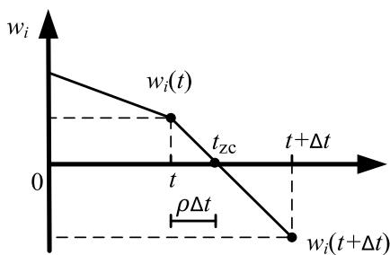  
Fig. 4. Linear interpolation of switching moment.

$$
\left\{ \begin{array}{l} p _ {s _ {a}} (t) = e ^ {A _ {\mathrm {p}} (t - t _ {0})} p _ {s _ {a}} (t _ {0}) + B _ {\mathrm {p}} \int_ {t _ {0}} ^ {t} e ^ {A _ {\mathrm {p}} (t - \tau)} i _ {k} (\tau) d \tau \\ P _ {k} (t) = e ^ {A _ {\mathrm {p}} (t - t _ {0})} P _ {k} (t _ {0}) + \alpha_ {k} B _ {\mathrm {p}} \int_ {t _ {0}} ^ {t} e ^ {A _ {\mathrm {p}} (t - \tau)} i _ {k} (\tau) d \tau \end{array} \right. \tag {9}
$$

where $p _ { s _ { a } }$ represents the capacitor voltage of the inserted ${ \mathrm { { S M } } } s _ { a } ,$ , with $a =$ $1 , 2 , \cdots , \alpha _ { k } .$ . Since both equations contain the same integral term of the arm current $i _ { k } ,$ after eliminating this term, the capacitor voltage calculation formula for the inserted group can be obtained as follows:

$$
p _ {s _ {a}} (t) = e ^ {A _ {\mathrm {p}} (t - t _ {0})} p _ {s _ {a}} \left(t _ {0}\right) + \frac {1}{\alpha_ {k}} \left(P _ {k} (t) - e ^ {A _ {\mathrm {p}} (t - t _ {0})} P _ {k} \left(t _ {0}\right)\right) \tag {10}
$$

Similarly, the capacitor voltage calculation formula for the bypassed group can be obtained as follows:

$$
q _ {s _ {b}} (t) = e ^ {A _ {q} (t - t _ {0})} q _ {s _ {b}} \left(t _ {0}\right) + \frac {1}{N - \alpha_ {k}} \left(Q _ {k} (t) - e ^ {A _ {q} (t - t _ {0})} Q _ {k} \left(t _ {0}\right)\right) \tag {11}
$$

where $q _ { s _ { b } }$ represents the capacitor voltage of the bypassed SM ${ \bf { S } } _ { b } ,$ with b $= 1 , 2 , \cdots , ( N - \alpha _ { k } )$ . By replacing $A _ { \mathrm { q } } ^ { \prime }$ with $A _ { \mathfrak { q } } ,$ the capacitor voltages for the open-circuit group can be calculated.

# 4. Capacitor voltage balancing algorithm based on state variable grouping

Capacitor voltage balancing control is essential for maintaining stable capacitor voltages across the SMs and ensuring the high performance operation of the MMC. In high-voltage large-capacity DC transmission systems, each converter comprises hundreds of SMs, and traditional sorting methods result in exponentially increasing computational complexity, which fails to meet the demands for fast simulation.

Based on the backward Euler method and the assumption that the switch in off state is an ideal open circuit, [10] similarly divides the SMs into two groups and proposes a linear sorting method. However, changes in the numerical integration method make the grouping approach more complex, rendering this method less universal. Therefore, it is necessary to develop a voltage balancing algorithm suitable for the proposed model to further enhance simulation efficiency.

Let the $\mathbf { S M s } \mathbf { s } _ { 1 } , \mathbf { s } _ { 2 } , \cdots , \mathbf { s } _ { n }$ remain in the inserted group during $\left( t _ { 0 } , t _ { 1 } \right)$ . It can be seen from (10) that all inserted SMs in the same arm use the same state variables $P _ { k }$ for calculations. For any two SMs $s _ { i }$ and $s _ { j } ,$ with capacitor voltages $p _ { s _ { i } } ( t _ { 0 } )$ and $p _ { s _ { j } } ( t _ { 0 } )$ at $t = t _ { 0 } ,$ the difference in capacitor voltages at any time $t \in \left( t _ { 0 } , t _ { 1 } \right)$ is given by:

$$
p _ {s _ {i}} (t) - p _ {s _ {j}} (t) = e ^ {A _ {p} (t - t _ {0})} \left[ p _ {s _ {i}} \left(t _ {0}\right) - p _ {s _ {j}} \left(t _ {0}\right) \right] \tag {12}
$$

From (12), it can be concluded that i $\begin{array} { r } { \mathrm { f } p _ { s _ { i } } ( t _ { 0 } ) - p _ { s _ { i } } ( t _ { 0 } ) > 0 , } \end{array}$ , then for any $t \in ( t _ { 0 } , t _ { 1 } ) , p _ { s _ { i } } ( t ) - p _ { s _ { j } } ( t ) > 0 .$ . The same applies to the bypassed group. Therefore, the order of capacitor voltages among SMs within the same group remains unchanged. Specifically, if the capacitor voltage order at t $= t _ { 0 } \ { \mathrm { i } } s \ s _ { 1 } , s _ { 2 } , \cdots , s _ { n }$ , then this order will remain $s _ { 1 } , s _ { 2 } , \cdots , s _ { n }$ at any time within $\left( t _ { 0 } , t _ { 1 } \right)$ ). Based on the above property, the SM voltage balancing algorithm is transformed into the problem of obtaining an ordered queue at $t = t _ { 1 }$ from two ordered queues at $t = t _ { 0 } .$ .

In microsecond-level simulation, the change in capacitor voltages during each time step is minimal, meaning the voltage ranking of some SMs remains unchanged. This property can be utilized to reduce the number of SMs participating in the sorting process, thereby improving efficiency.

According to these two advantageous properties, the capacitor voltage balancing algorithm based on state variable grouping can be proposed. The input of algorithm requires two variables from the arm k: $\mathbb { P } ( t _ { n - 1 } ) , \mathbb { Q } ( t _ { n - 1 } ) .$ , which are vectors containing the indices of the inserted

and bypassed SMs in previous time step.

Algorithm: Capacitor voltage balancing for MMC control   
Input: $\mathbb{P}(t_{n - 1}),\mathbb{Q}(t_{n - 1})$ 1 if $i_k(t_{n - 1}) > 0$ then   
2 $\pmb {G}_1 = \mathbb{P}(t_{n - 1});\pmb {G}_2 = \mathbb{Q}(t_{n - 1})$ 3 else   
4 $\pmb {G}_1 = \mathbb{Q}(t_{n - 1});\pmb {G}_2 = \mathbb{P}(t_{n - 1})$ 5 end   
6 rank $= [G_1,G_2]$ 7 $T_{m} =$ length $(G_{1})$ . $T_{n} = 1$ . $T_{m0} = T_{m}$ . $T_{n0} = T_{n}$ 8 $m = G_{1}(T_{m})$ . $n = G_{2}(T_{n})$ 9 while $\boldsymbol {v}_{\mathrm{C}}(\boldsymbol {m}) > \boldsymbol {v}_{\mathrm{C}}(\boldsymbol {n})$ then   
10 while $\boldsymbol {v}_{\mathrm{C}}(\boldsymbol {m}) > \boldsymbol {v}_{\mathrm{C}}(\boldsymbol {n})$ then   
11 exchange rank $(T_m)$ and rank $(T_m + 1)$ 12 $T_{m} = T_{m} + 1;T_{n} = T_{n} + 1;n = G_{2}(T_{n})$ 13 end   
14 $T_{m} = T_{m0} - 1;T_{n} = T_{n0}$ 15 $m = G_1(T_m);n = G_2(T_n)$ 16 end   
17 if $i_k(t_n) > 0$ then   
18 $\mathbb{P}(t_n) = \text{rank}(1;\alpha_k);\mathbb{Q}(t_n) = \text{rank} (\alpha_k + 1:N)$ 19 else   
20 $\mathbb{Q}(t_n) = \text{rank}(1:N - \alpha_k)$ 21 $\mathbb{P}(t_n) = \text{rank}(N - \alpha_k + 1:N)$ 22 end   
23 return $\mathbb{P}(t_n),\mathbb{Q}(t_n)$

Fig. 5 illustrates an example of capacitor voltage balancing. In Fig. 5, since $i _ { k } ( t _ { n - 1 } ) > 0 ,$ it can be determined that $\mathbb { P } ( t _ { n - 1 } )$ is the lower voltage group $\pmb { G } _ { 1 }$ and $\mathbb { Q } ( t _ { n - 1 } )$ is the higher voltage group $\pmb { G } _ { 2 }$ . The algorithm sets pointers $m , T _ { m }$ to indicate $\mathsf { s } _ { \mathsf { w } - 1 }$ and its position, which has the highest capacitor voltage in $^ { G _ { 1 , } }$ , while $n , T _ { n }$ indicate $\scriptstyle { \mathsf { S } } _ { \mathsf { W } }$ and its position, which has the lowest capacitor voltage in $\pmb { G } _ { 2 } .$ . By moving the pointers and continuously comparing $\nu _ { \mathrm { C } } ( m )$ and $\nu _ { \mathrm { C } } ( n ) _ { \cdot }$ , SMs that require position changes are rearranged. The newly order of SMs involved in the voltage comparison process is ${ \mathsf { s } } _ { \mathrm { j } } , { \mathsf { s } } _ { \mathrm { w } } , { \mathsf { s } } _ { \mathrm { j } + 1 } , \cdots , { \mathsf { s } } _ { \mathrm { w } - 1 } , { \mathsf { s } } _ { \mathrm { z } } ,$ , while the positions of SMs not participating in the comparison remain unchanged. ${ \mathrm { A t ~ } } t = t _ { n } ,$ $i _ { k } ( t _ { n } ) > 0$ and $\alpha _ { k } = \mathrm { j }$ , then the first j SMs in the newly order are selected as the inserted group, while the remaining SMs belong to the bypassed group.

This approach generates the complete order of SMs for the current time step. It not only converts the sorting problem into sorting two ordered queues but also avoids re-sorting SMs whose orders have not changed. This method significantly improves the speed of voltage balancing control.

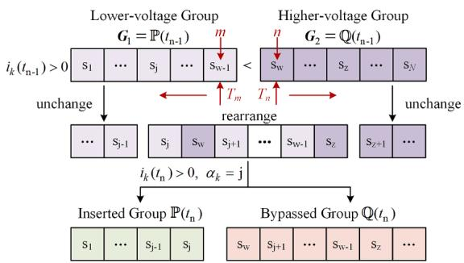  
Fig. 5. Capacitor voltage balancing algorithm for MMC control.

# 5. Case studies

To validate the accuracy and efficiency of the proposed model, a state-space MMC acceleration model is developed in MATLAB based on the approach proposed in this paper. Additionally, a two-terminal MMC–HVDC simulation case and a multi-terminal MMC–HVDC simulation case are constructed in both MATLAB and EMTP, with EMTP using the MMC Thevenin equivalent model. All studies are conducted on a personal computer with an Intel Core i5–9300H CPU, 16 GB RAM and 64-bit MATLAB R2024a software.

# 5.1. Two-Terminal MMC-HDVC system

The topology of the two-terminal MMC–HVDC system is shown in Fig. 6. The rectifier-side $\mathrm { M M C _ { 1 } }$ employs active and reactive power control, while the inverter-side MMC adopts DC voltage and reactive power control. The main system parameters are listed in Table 2. With the simulation step of 20 μs, the accuracy of the proposed model is verified by comparing simulation results under different transient scenarios.

# 5.1.1. Scenario 1: increase in transmission power

At 1 s, the active power reference of MMC is increased from 500 MW to 1000 MW. A comparison of the simulation results between the statespace acceleration model and the EMTP Thevenin equivalent model is shown in Fig. 7.

As shown in Fig. 7, the state-space MMC acceleration model demonstrates results that are highly consistent with the EMTP model, with the deviation within 1 %, indicating high accuracy.

# 5.1.2. Scenario 2: three-phase ground fault

At 2 s, a three-phase short-circuit ground fault occurs at the AC bus of MMC1 and is cleared after 0.1 s. The simulation results of the fault-point voltage and AC current for the state-space MMC acceleration model and the EMTP model are shown in Fig. 8.

From Fig. 7 and Fig. 8, it can be concluded that the state-space MMC acceleration model proposed in this paper accurately simulates both the steady-state and transient characteristics after faults. The results are in close agreement with the EMTP Thevenin equivalent model, with minimal simulation error, meeting the accuracy requirements for EMT simulation.

# 5.1.3. Scenario 3: DC short-circuit fault

At 3 s, a bipolar permanent DC short-circuit fault occurs at the DC bus of $\bf { M M C } _ { 1 }$ in the MMC–HVDC system. After a 2 ms delay, all MMCs are blocked. The simulation results of the DC voltage at the MMC side and the phase A upper arm current for the state-space MMC acceleration model and the EMTP model are shown in Fig. 9.

Fig. 9 indicates that the proposed MMC acceleration model and blocked state modeling method can accurately simulate the transient process during DC faults and the uncontrolled rectification process after blocked. The use of linear interpolation calculations effectively determines the SM state transition times with high simulation accuracy.

# 5.1.4. Computation efficiency

To evaluate the acceleration effect of the proposed model, the

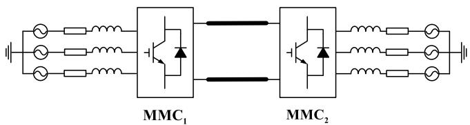  
Fig. 6. Two-terminal MMC–HVDC system.

Table 2 Parameters of the two-terminal MMC–HVDC system.   

<table><tr><td>Type</td><td>Quantity</td><td>Value</td></tr><tr><td rowspan="5">System</td><td>AC source voltage</td><td>400 kV</td></tr><tr><td>AC system nominal frequency</td><td>50 Hz</td></tr><tr><td>Transformer voltage rating</td><td>400 kV/320 kV</td></tr><tr><td>Rated active power</td><td>1000 MW</td></tr><tr><td>Rated DC voltage</td><td>640 kV</td></tr><tr><td rowspan="4">MMC</td><td>Arm inductance</td><td>0.04 H</td></tr><tr><td>The number of SMs in an MMC arm</td><td>20</td></tr><tr><td>SM capacitance</td><td>0.013 F</td></tr><tr><td>Initial voltage of the capacitors</td><td>32 kV</td></tr></table>

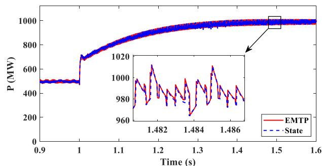

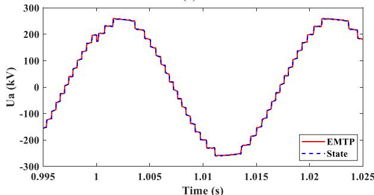

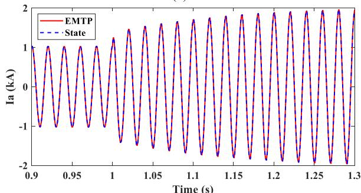  
(b)

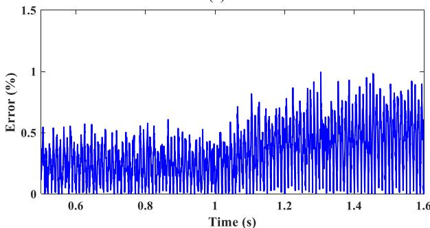  
（c）  
  
Fig. 7. Comparison of simulation results for scenario 1: (a) $\bf { M M C } _ { 1 }$ active power, (b) MMC AC voltage, (c) MMC AC current, (d) relative error of MMC AC current.

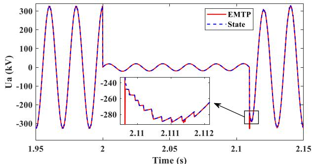

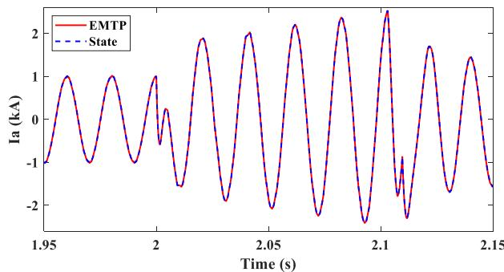  
  
  
Fig. 8. Comparison of simulation results for scenario 2: (a) fault-point voltage, (b) MMC AC current.

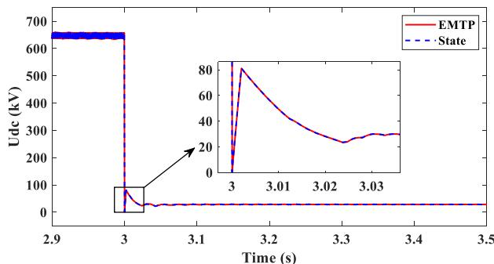

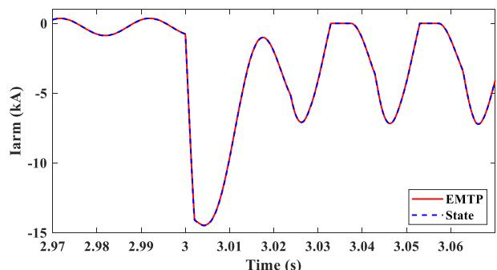  
(b)   
Fig. 9. Comparison of simulation results for scenario 3: (a) DC voltage, (b) phase A upper arm current.

running time of the detailed MMC model and the acceleration model under the state-space framework is compared by increasing the number of MMC levels. With the simulation step of 20 μs and a simulation duration of 1 s, repeat the simulation 10 times for each MMC level. Due to the excessive number of state variables in the detailed model at high MMC levels, resulting in prolonged simulation time, the test is limited to 101 levels.

Fig. 10 shows the box plots of the running time based on the two models. It can be observed that the running time of the detailed model grows approximately exponentially, while the acceleration model grows approximately logarithmically. After removing outliers from the box plots, the average running time for each MMC level is calculated. The comparison results are shown in Table 3.

As shown in Table 3 and Fig. 11, the running time gap between the detailed model and the acceleration model increases significantly with the number of levels, and the speedup factor exhibits approximately exponential growth. The sorting time increases linearly, which is consistent with the theoretical analysis. This validates that the acceleration model can significantly enhance simulation speed.

# 5.2. Multi-Terminal MMC-HVDC system

To further verify the simulation accuracy of the proposed model in the multi-terminal MMC system, a four-terminal MMC–HVDC simulation case is built in MATLAB and EMTP, as shown in Fig. 12. The structure and parameters of this case study are based on the CIGRE B4–57 MMC–HVDC grids with 4 MMCs [19]. The main system parameters are listed in Table 4. The active power reference of station Cm-F1 is set to decrease from 500 MW to 200 MW at 2 s, and the simulation results are compared as shown in Fig. 13.

As shown in Fig. 13, the proposed model maintains high simulation accuracy in the multi-terminal MMC–HVDC system and is suitable for high-accuracy simulation of large-scale power system networks.

With the simulation step of 20 μs and a simulation duration of 1 s, the running time comparison between this case and the 101-level twoterminal MMC–HVDC system is shown in Table 5. It can be observed that the simulation time is approximately twice that of the two-terminal MMC–HVDC system. This validates that the proposed model can improve simulation efficiency and meet the simulation speed requirements for large networks with multiple MMCs.

# 6. Conclusions

To address the issue of slow EMT simulation in MMC, this paper

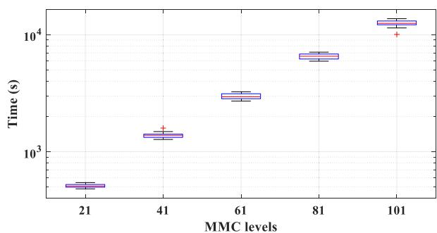

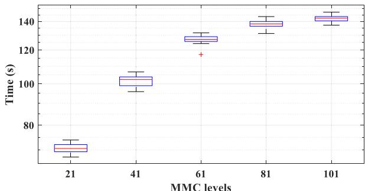  
  
  
Fig. 10. The box plot of two-terminal MMC–HVDC system running time: (a) detailed model, (b) acceleration model.

Table 3 Running Time for Two-Terminal MMC–HVDC System.   

<table><tr><td rowspan="2">MMC levels</td><td rowspan="2">Detailed model (s)</td><td colspan="2">Acceleration model (s)</td><td rowspan="2">Speedup factor</td></tr><tr><td>running time</td><td>sorting time</td></tr><tr><td>21</td><td>513.4</td><td>70.5</td><td>2.9</td><td>7.3</td></tr><tr><td>41</td><td>1393.2</td><td>102.3</td><td>3.5</td><td>13.6</td></tr><tr><td>61</td><td>3009.7</td><td>126.6</td><td>4.0</td><td>23.8</td></tr><tr><td>81</td><td>6353.8</td><td>137.8</td><td>4.6</td><td>46.1</td></tr><tr><td>101</td><td>12,572.5</td><td>142.3</td><td>5.3</td><td>88.4</td></tr></table>

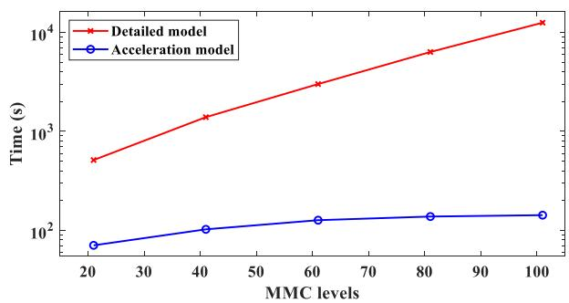  
Fig. 11. Running time for two-terminal MMC–HVDC system.

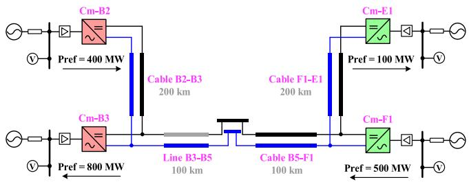  
Fig. 12. Four-terminal MMC–HVDC system.

Table 4 Parameters of the four-terminal MMC–HVDC system.   

<table><tr><td>Quantity</td><td>Cm-B2</td><td>Cm-B3</td><td>Cm-F1</td><td>Cm-E1</td></tr><tr><td>Control mode</td><td>PV/Q</td><td>PV/Q</td><td>P/Q</td><td>P/Q</td></tr><tr><td rowspan="2">Transformer voltages (kV)</td><td>380/</td><td>380/</td><td>145/</td><td>145/</td></tr><tr><td>220</td><td>220</td><td>220</td><td>220</td></tr><tr><td>Rated active power (MW)</td><td>800</td><td>1200</td><td>800</td><td>200</td></tr><tr><td>Rated DC voltage (kV)</td><td>400</td><td>400</td><td>400</td><td>400</td></tr><tr><td>Operating condition (MW)</td><td>400</td><td>-800</td><td>500</td><td>-100</td></tr><tr><td>Arm inductance (H)</td><td>0.029</td><td>0.019</td><td>0.019</td><td>0.116</td></tr><tr><td>The number of SMs in an MMC arm</td><td>100</td><td>100</td><td>100</td><td>100</td></tr><tr><td>SM capacitance (F)</td><td>0.01</td><td>0.01</td><td>0.01</td><td>0.01</td></tr><tr><td>Initial voltage of the capacitors (kV)</td><td>4</td><td>4</td><td>4</td><td>4</td></tr></table>

proposes a simulation acceleration approach under the state-space framework. It optimizes the MMC equivalent approach and voltage balancing algorithm, significantly improving simulation speed.

1) By combining the switching states, SMs are grouped into an inserted group and a bypassed group, with auxiliary state variables defined. This significantly reduces the dimensionality of the state matrix, thus accelerating the integration calculations.   
2) Based on the property that the order of the capacitor voltages in the same group does not change under the state-space framework, a capacitor voltage balancing algorithm based on state variable grouping is proposed. This reduces unnecessary sorting and further improves the solution speed.

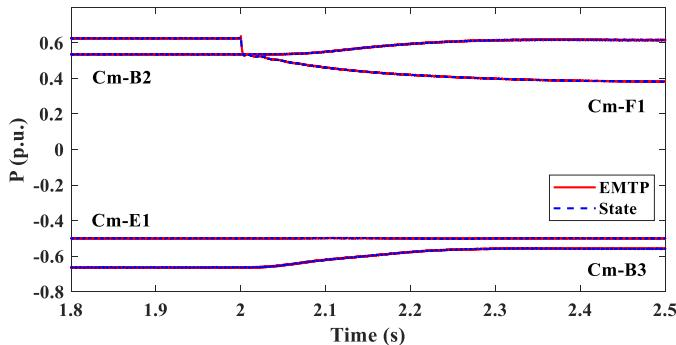  
(a)

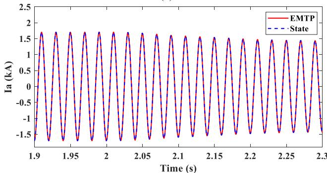  
(b)   
Fig. 13. Comparison of simulation results for scenario 4: (a) active power, (b) AC current of station Cm-B3.

Table 5 Running Time for Four-Terminal MMC–HVDC System.   

<table><tr><td>System</td><td>Running time (s)</td><td>Sorting time (s)</td></tr><tr><td>two-terminal</td><td>142.3</td><td>5.3</td></tr><tr><td>four-terminal</td><td>256</td><td>10.1</td></tr></table>

By comparing the simulation results with the EMTP model and the detailed state-space model, the proposed approach is validated to maintain model accuracy while improving computational efficiency. It enables rapid simulation of high-level MMC systems and is well-suited for EMT simulation of large-scale HVDC transmission systems under the state-space framework. Since power electronic devices in highvoltage scenarios often adopt a cascaded topology which is similar to MMC, the proposed modeling approach can also be considered for efficient EMT simulation of cascaded power electronic devices.

# CRediT authorship contribution statement

Jinli Zhao: Resources, Writing – review & editing, Supervision, Funding acquisition. Manjiang Li: Writing – original draft. Xiaopeng Fu: Conceptualization, Validation, Funding acquisition, Writing – review & editing. Peng Li: Funding acquisition, Supervision, Resources, Writing – review & editing. Jean Mahseredjian: Validation, Investigation, Resources, Methodology, Supervision.

# Declaration of competing interest

The authors declare that they have no known competing financial interests or personal relationships that could have appeared to influence the work reported in this paper.

# Data availability

Data will be made available on request.

# References

[1] C. Jin, Z. Ji, K. Liu, W. Chen, J. Zhao, A region-folding electromagnetic transient simulation approach for large-scale power electronics system, IEEE Trans. Power Electron. 38 (8) (Aug. 2023) 9755–9766.   
[2] B. Shi, Z. Zhao, Y. Zhu, Z. Yu, J. Ju, Discrete state event-driven simulation approach with a state-variable-interfaced decoupling strategy for large-scale power electronics systems, IEEE Trans. Ind Electron. 68 (12) (Dec. 2021) 11673–11683.   
[3] C. Gao, J. Xu, K. Wang, P. Wu, Z. Li, J. Zhou, R. Yokoyama, Portal analysis approach used for the efficient electromagnetic transient (EMT) simulation of power electronic systems, IEEE Trans. Power Del. 38 (6) (Dec. 2023) 4213–4225.   
[4] S. Debnath, J. Qin, B. Bahrani, M. Saeedifard, P. Barbosa, Operation, control, and applications of the modular multilevel converter: a review, IEEE Trans. Power Electron. 30 (1) (Jan. 2015) 37–53.   
[5] A. Dekka, B. Wu, R.L. Fuentes, M. Perez, N.R. Zargari, Evolution of topologies, modeling, control schemes, and applications of modular multilevel converters, IEEE J. Emerg. Sel. Top. Power Electron. 5 (4) (Dec. 2017) 1631–1656.   
[6] X. Fu, W. Wu, P. Li, J. Mahseredjian, J. Wu, C. Wang, Splitting state-space method for converter-integrated power systems EMT simulations, IEEE Trans. Power Del. 40 (1) (Feb. 2025) 584–595.   
[7] P. Li, Z. Meng, X. Fu, H. Yu, C. Wang, Interpolation for power electronic circuit simulation revisited with matrix exponential and dense outputs, Electr. Power Syst. Res. 189 (Dec. 2020) 106714. Art. no.   
[8] U.N. Gnanarathna, A.M. Gole, R.P. Jayasinghe, Efficient modeling of modular multilevel HVDC converters (MMC) on electromagnetic transient simulation programs, IEEE Trans. Power Del. 26 (1) (Jan. 2011) 316–324.   
[9] S. Gao, Y. Chen, Y. Song, Z. Yu, Y. Wang, An efficient half-bridge MMC model for EMTP-type simulation based on hybrid numerical integration, IEEE Trans. Power Syst. 39 (1) (Jan. 2024) 1162–1177.

[10] J. Xu, H. Ding, S. Fan, A.M. Gole, C. Zhao, Enhanced high-speed electromagnetic transient simulation of MMC-MTdc grid, Int. J. Electr. Power Energy Syst. 83 (Dec. 2016) 7–14.   
[11] P. Lian, W. Liu, Z. Yang, Y. Tang, S. Yu, X. Li, K. Xu, Research on hybrid MMC fullstate efficient electromagnetic transient simulation method, Chin. Soc. Elect. Eng. 41 (24) (Dec. 2021) 8520–8530.   
[12] J. Xu, P. Wu, K. Wang, C. Gao, Z. Li, A general equivalent modeling method of Nport networks suitable for the electromagnetic transient simulation of cascading power electronic topologies, Chin. Soc. Elect. Eng. 44 (9) (May. 2024) 3632–3644.   
[13] C. Wang, X. Fu, P. Li, J. Wu, L. Wang, Multiscale simulation of power system transients based on the matrix exponential function, IEEE Trans. Power Syst. 32 (3) (May 2017) 1913–1926.   
[14] J. Wang, R. Burgos, D. Boroyevich, Switching-cycle state-space modeling and control of the modular multilevel converter, IEEE J. Emerg. Sel. Top. Power Electron. 2 (4) (Dec. 2014) 1159–1170.   
[15] D. del Giudice, A. Brambilla, D. Linaro, F. Bizzarri, Isomorphic circuit clustering for fast and accurate electromagnetic transient simulations of MMCs, IEEE Trans. Energy Convers. 37 (2) (2022) 800–810. June.   
[16] S. Huang, J. Xu, K. Wang, G. Li, F. Xing, Harmonic space-state based analytical modeling of modular multilevel converters for fast simulation, in: Proc. IEEE 14th Int. Symp. Power Electron. Distrib. Gener. Syst., 2023, pp. 1059–1066.   
[17] H. Saad, et al., Dynamic averaged and simplified models for MMC-based HVDC transmission systems, IEEE Trans. Power Del. 28 (3) (July 2013) 1723–1730.   
[18] J. Wang, X. Fu, P. Li, J. Mahseredjian, Reduced-order and simultaneous solution of power and control system equations in EMT simulations, in: Proc. Int. Conf. Power Syst. Transients (IPST), 2025, pp. 1–8.   
[19] T.K. Vrana, Y. Yang, D. Jovcic, S. Dennetiere, J. Jardini, H. Saad, The CIGRE B4 DC grid test system, CIGRE Electra 270 (9) (Oct. 2013) 10–19.