# 电压源型直流输电的动态相量建模与仿真

姚 伟‚程时杰‚文劲宇

（华中科技大学电力安全与高效湖北省重点实验室‚武汉430074）

摘 要：为适应电力系统快速精确仿真和分析控制的需要‚采用了一种新的建模方法—基于时变傅立叶级数的动态相量法 对电压源型直流输电 进行建模和仿真 该方法通过保留与系统状态变量相对应的时变傅立叶级数中的重要项对原系统进行简化 首先建立用开关函数描述的 换流站详细时域模型 在此基础上‚给出 VSC-HVDC 动态相量模型的详细推导过程。在对 VSC-HVDC 进行动态相量建模的过程中‚换流站的开关函数考虑直流分量和基频分量‚直流传输线路只考虑直流分量‚从而大大简化高频开关过程‚在保证仿真精度的同时 大大缩短了仿真时间 通过 仿真软件用动态相量模型与详细时域电磁暂态 模型分别对VSC-HVDC 进行仿真比较的结果表明‚动态相量模型精确而有效‚不仅可以精确描述 VSC-HVDC 的暂态变化过程‚而且可以大大节省仿真计算时间。

关键词 电力系统 电压源型直流输电 动态相量模型 时变傅立叶级数 开关函数 电磁暂态模型

中图分类号 文献标志码：A 文章编号：1003-6520（2008）06-1115-06

# Modeling and Simulation of VSC-HVDC with Dynamic Phasors

YAO Wei‚C HENG Sh-i jie‚WEN Jin-yu （Electric Pow er Security and High Efficiency Lab‚Huazhong U niversity of Science and T echnology‚Wuhan430074‚China）

Abstract： T o meet the needs of rapid accurate simulation and analysis of the pow er system‚a newly developed method-dynamic phasors method is applied to a model voltage sources converter based HVDC（VSC-HVDC） transmission system ．T his method is based on the time-varying Fourier coefficients series of the system variables‚and focuses on the dynamics behavior of the Fourier coefficients．By truncating unimportant higher order series and keep only those significant series‚this method can catch the dynamic behavior of the original detail model．T he complexity of dynamic phasors model can be adjusted according to different application requirements．T herefore‚it can significantly improve computational efficiency and maintain a good engineering precision w hen it is used for transient simulation Follow ed by the time-domain converter station model for VSC-HVDC described by switch f unction‚detailed analysis of the VSC-HVDC dynamic phasors model is presented．T he VSC-HVDC model is simplified by keeping important system state variables corresponding to the time-varying Fourier series‚w hich include the converter station switching f unction considering both the DC component and basic f requency component‚and the DC transmission line considering only the DC component．T herefore‚high f requency switching process is greatly simplified．T he dynamic phasors model and a detailed time domain electromagnetic transient （E MT ） model for the VSC-HVDC are simulated by the M AT L AB soft w are‚and simulation results show that this method can ensure simulation accuracy and reduce computational cost．

Key words： pow er system；VSC-HVDC；dynamic phasors model；time-varying Fourier coefficients；switch f unction；electromagnetic transient model

# 0 引 言

随着电力电子技术的发展 大功率门极可关断晶闸管 和随后的绝缘双极晶体管 等全控型器件的商业化应用‚使得基于电压源型换流器（Voltage Sources Converter‚VSC）的 HVDC 技术 即 的应用成为可能［1］ 与传统相比 采用全控型器件的 具有独特的优点‚不仅可以同时独立控制有功和无功功率 还可以向无源网络供电 稳定交流母线电压等

在未来城市供电和新型能源发电 如风能发电 光伏发电和小水电等）并网中有着广阔的应用前景［2］。

在过去的近 年中 国内外已有学者对的建模和控制策略进行了比较深入的研究［1-4］ 但是 在这些研究中 换流站的建模大多采用准稳态模型或过于复杂的模型 不适于大系统的分析 而随着 的研究和应用的不断深入 对含有 大规模电力系统分析方法的研究将成为新的热点。由于电力系统的庞大和复杂性以及计算规模和时间的限制 不可能对系统中所有开关器件都采用包含详细开关过程的电磁暂态仿真模型 而采用过于简化的模型又会导致缺乏准确性‚动态相量（dynamic phasors ） 法就是在此需求下提出来的。

动态相量法的思想来源于传统的平均值法‚是基于时变傅里叶系数推导出的一种建模方法 它可以在需要的精度上近似时域模型 又可以避免其非自治性‚其概念首次在文献［5］中被引入。已经被成功用于同步感应电机［6］、STATCOM ［7］、传统 HVDC［8‚9］、可控串联补偿器（TCSC）［10-12］、统一潮流控制器（UP-FC）［13-15］及电力系统次同步谐振［1］ 的建模和研究中。研究表明 将这种模型用于电力系统暂态仿真 可以大大提高计算效率又不失准确性 近几年来 我国科研人员也逐渐开展了有关研究［7-9］

本文首次将动态相量法应用于 输电系统的建模中 在建立了用开关函数描述的换流站详细时域模型的基础上 给出了VSC-HVDC 动态相量模型的详细推导过程。该模型具有可扩展性 能依据不同开关控制策略推导相应的动态相量模型 最后 论文给出了所建立的模型在不同情况下的仿真验证结果。本文的工作是分析含有 的大规模电力系统动态性的一项基础性工作 其成果可以直接用于这种系统的仿真研究。

# 1 动态相量法简介

动态相量法以时变 变换为基础［8‚16］ 对于时域中以 T 为周期的函数 x（τ） 在任一区间τ（t—T‚t］中‚其时变Fourier 级数可表示为

$$
x (\tau) = \sum_ {k = - \infty} ^ {\infty} X _ {k} (t) \mathrm {e} ^ {\mathrm {j} k \omega \tau} 。 \tag {1}
$$

式中： $\infty { = } 2 \pi / T ; X _ { k } ( t )$ 为一系列时变Fourier 系数称之为动态相量。

不同阶次 k 的 系数称为不同的相 其第 k 次系数 或称为第 k 阶相量可由式 导出为

$$
X _ {k} (t) = \frac {1}{T} \int_ {t} ^ {t + T} x (\tau) \mathrm {e} ^ {- \mathrm {j} k \omega \tau} d \tau = \langle x \rangle_ {k} (t) 。 \tag {2}
$$

这里的相量都为复数‚并具有以下关系（以基波相量为例）：

$$
\begin{array}{l} \langle x \rangle_ {1} = \langle x \rangle_ {1} ^ {i} + j _ {x} \quad i = \langle x \rangle_ {- 1} ^ {*} = \\ \left(\langle x \rangle^ {r _ {- 1}} + j (x) ^ {i _ {- 1}}\right) ^ {*} 。 \tag {3} \\ \end{array}
$$

式（3）中‚r 和 i 分别表示实部和虚部；“∗”表示复数共轭。

动态相量具备以下 个重要特性

相量的微分特性 对于第 k 阶傅里叶系数其微分形式满足

$$
\frac {\mathrm {d} X _ {k}}{\mathrm {d} t} (t) = \left\langle \frac {\mathrm {d} x}{\mathrm {d} t} \right\rangle_ {k} (t) - \mathrm {j} k \omega X _ {k} (t) 。 \tag {4}
$$

2）相量的乘积特性。对于2个波形 x （t）、x（t）‚其时域乘积的动态相量可由2个变量对应的动

图1 电压源型直流输电系统结构示意图  
Fig．1 Configuration of VSC-HVDC  
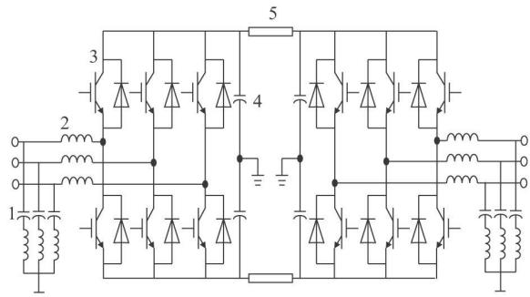  
滤波器 换流电抗 全控器件 直流电容 传输电缆

态相量卷积而得‚即

$$
\langle x _ {1} x _ {2} \rangle_ {k} = \sum_ {i = - \infty} ^ {\infty} \langle x _ {1} \rangle_ {k - i} \langle x _ {2} \rangle_ {i 。} \tag {5}
$$

动态相量法基于频率分解的思想 希望仅保留时变 级数中相对较大的系数来近似原始信号 以抓住系统的主要特征 将与所保留系数对应的相量作为系统变量‚就可得到系统的动态相量模型 这种模型保留了原时域模型的非线性 动态相量法特别适合于含电力电子开关器件的设备建模如 等 具有比传统的准稳态建模方法精确的优点

在多相不平衡的系统中‚也可以用动态相量法分相建模 本文主要针对三相平衡系统的建模 建模方法可推广到三相不平衡状态的分相建模。

# 2 VSC-HVDC 的动态相量法建模

# 2．1 VSC-HVDC 的简化等效电路

两端 输电系统如图 所示 位于两端的换流器均采用 型变换器 具有相同的结构‚均采用正弦脉宽调制（SPWM）。换流电抗用于实现换流器与交流侧能量交换 同时起滤波的作用直流侧电容器的作用是为换流器提供电压支撑 同时减少直流侧谐波 交流滤波器的作用是滤除交流侧谐波

为了简化推导过程 在以下的模型推导过程中作如下假设［17］

交流系统中的电压和电流均满足三相平衡条件 为工频正弦波  
2）桥臂为理想开关元件‚正向漏电流为0；  
各桥臂上的参数 电阻 电抗 平衡

基于以上假设 可以得到如图 所示的等效电路图 图中 $U _ { \mathrm { s [ a b c ] ^ { 1 } } } \mathrm { , } U _ { \mathrm { s [ a b c ] ^ { 3 } } }$ 为整流 逆变侧的三相交流无穷大系统的电压； $u _ { \mathrm { s } } [ \mathrm { a b c } ] 1  u _ { \mathrm { s } } [ \mathrm { a b c } ] 3$ 为整流 逆变交流侧的三相电压 i 为直流电流 R 、

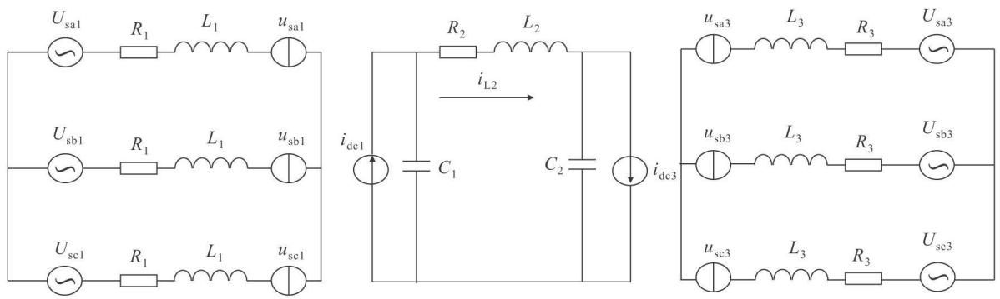  
图2 VSC-HVDC等效电路图  
Fig．2 Equivalent circuit diagram of VSC-HVDC

$L 1 \AA , R 3 \AA , L 3$ 为整流和逆变侧变压器的等效电阻和电感 R 、L 为直流线路等效电阻 电感 C 、C 为整流 逆变侧的电容

# 2．2 VSC-HVDC 的时域动态建模

由于三相平衡‚这里仅以 a 相为参考相进行推导 的 相等值电路如图 所示［8‚14］

为简单起见‚将 i（t）、u（t）简写为 i、u‚有

$$
L _ {1} \frac {\mathrm {d} i _ {\mathrm {a l}}}{\mathrm {d} t} + R _ {1} i _ {\mathrm {a l}} = U _ {\mathrm {s a l}} - u _ {\mathrm {f a}} 。 \tag {6}
$$

式中： $u _ { \mathrm { F a } } = U _ { \mathrm { C 1 } } S _ { \mathrm { a l } } + u _ { \mathrm { H n } } ; u _ { \mathrm { H n } } , u _ { \mathrm { F a } }$ 分别为图3中 H 点与F 点的电压。

$S _ { \mathrm { a l } } \ , S _ { \mathrm { a l } } ^ { ' }$ 分别为 a 相上下2个桥臂的开关函数（开断为0‚闭合为1）‚满足

$$
S _ {\mathrm {a} 1} + S _ {\mathrm {a} 1} ^ {\prime} = 1 。 \tag {7}
$$

因为系统三相平衡 可推导得到

$$
u _ {\mathrm {H n}} = - \frac {1}{3} U _ {\mathrm {C l}} \sum_ {j = \mathrm {a}, \mathrm {b}, \mathrm {c}} S _ {j 1} 。 \tag {8}
$$

可以看出 为描述系统中的离散开关事情 需要借助于开关函数 以 的整流侧为例有：

$$
\left\{ \begin{array}{l} L _ {1} \frac {\mathrm {d} i _ {\mathrm {a l}}}{\mathrm {d} t} = - R _ {1} i _ {\mathrm {a l}} - U _ {\mathrm {C l}} S _ {\mathrm {a l}} + \frac {1}{3} U _ {\mathrm {C l}} \sum_ {j = \mathrm {a}, \mathrm {b}, \mathrm {c}} S _ {j 1} + U _ {\mathrm {s a l}}; \\ L _ {1} \frac {\mathrm {d} i _ {\mathrm {b l}}}{\mathrm {d} t} = - R _ {1} i _ {\mathrm {b l}} - U _ {\mathrm {C l}} S _ {\mathrm {b l}} + \frac {1}{3} U _ {\mathrm {C l}} \sum_ {j = \mathrm {a}, \mathrm {b}, \mathrm {c}} S _ {j 1} + U _ {\mathrm {s b l}}; \\ L _ {1} \frac {\mathrm {d} i _ {\mathrm {c l}}}{\mathrm {d} t} = - R _ {1} i _ {\mathrm {c l}} - U _ {\mathrm {C l}} S _ {\mathrm {c l}} + \frac {1}{3} U _ {\mathrm {C l}} \sum_ {j = \mathrm {a}, \mathrm {b}, \mathrm {c}} S _ {j 1} + U _ {\mathrm {s c l}} 。 \end{array} \right. \tag {9}
$$

而开关函数 $S _ { j ^ { 1 } }$ 为周期函数 与脉宽调制 的控制有关 必须针对实际的开关控制策略对开关函数进行描述 开关函数模型尽管物理意义明确 但模型较为复杂且不易分析和实现 为此 用每一个开关周期内 $S _ { j ^ { 1 } }$ 平均值构成波形的基波来代替 $S _ { j ^ { 1 } }$ 在逆变侧也进行相同的处理 分别用 $d _ { j ^ { 1 } } , d _ { j ^ { 3 } }$ 代替$S _ { j ^ { 1 } } , S _ { j ^ { 3 } }$ 可得

$$
\left\{ \begin{array}{l} d _ {j 1} = \frac {1}{2} m _ {1} \cos \left(\omega t - \delta_ {1} - \rho_ {j}\right) + \frac {1}{2}; \\ d _ {j 3} = \frac {1}{2} m _ {2} \cos \left(\omega t - \delta_ {2} - \rho_ {j}\right) + \frac {1}{2}. \end{array} \right. \tag {10}
$$

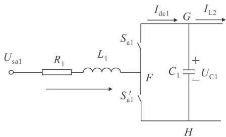  
图3 整流侧换流器的 a相等值电路图  
Fig．3 Equivalent circuit of phase a of rectifier

式中 m 、δ分别为整流侧的调制比和触发滞后角；m 、δ分别为逆变侧的调制比和触发滞后角； $\rho _ { \mathrm { a } } = 0$ $\ell _ { \mathrm { { b } } } = 2 \pi / 3 , \ell _ { \mathrm { { c } } } = 4 \pi / 3$

最后 可以得到 交流部分的动态方程为

$$
\left\{ \begin{array}{l} L _ {1} \frac {\mathrm {d} i _ {\mathrm {a} 1}}{\mathrm {d} t} = - R _ {1} i _ {\mathrm {a} 1} - \frac {1}{2} m _ {1} \cos \left(\omega t - \delta_ {1}\right) U _ {\mathrm {C} 1} + U _ {\mathrm {s a} 1}; \\ L _ {1} \frac {\mathrm {d} i _ {\mathrm {b} 1}}{\mathrm {d} t} = - R _ {1} i _ {\mathrm {b} 1} - \frac {1}{2} m _ {1} \cos \left(\omega t - \delta_ {1} - \frac {2 \pi}{3}\right) U _ {\mathrm {C} 1} + U _ {\mathrm {s b} 1}; \\ L _ {1} \frac {\mathrm {d} i _ {\mathrm {c l}}}{\mathrm {d} t} = - R _ {1} i _ {\mathrm {c l}} - \frac {1}{2} m _ {1} \cos \left(\omega t - \delta_ {1} - \frac {4 \pi}{3}\right) U _ {\mathrm {C} 1} + U _ {\mathrm {s c l}}; \\ L _ {1} \frac {\mathrm {d} i _ {\mathrm {a} 3}}{\mathrm {d} t} = - R _ {3} i _ {\mathrm {a} 3} + \frac {1}{2} m _ {1} \cos \left(\omega t - \delta_ {2}\right) U _ {\mathrm {C} 2} - U _ {\mathrm {s a} 3}; \\ L _ {1} \frac {\mathrm {d} i _ {\mathrm {b} 3}}{\mathrm {d} t} = - R _ {3} i _ {\mathrm {b} 3} + \frac {1}{2} m _ {1} \cos \left(\omega t - \delta_ {2} - \frac {2 \pi}{3}\right) U _ {\mathrm {C} 2} - U _ {\mathrm {s b} 3}; \\ L _ {1} \frac {\mathrm {d} i _ {\mathrm {c} 3}}{\mathrm {d} t} = - R _ {3} i _ {\mathrm {c} 3} + \frac {1}{2} m _ {1} \cos \left(\omega t - \delta_ {2} - \frac {4 \pi}{3}\right) U _ {\mathrm {C} 2} - U _ {\mathrm {s c} 3}. \end{array} \right. \tag {11}
$$

由图 可得出直流部分的动态方程为

$$
\left\{ \begin{array}{l} C _ {1} \frac {\mathrm {d} U _ {\mathrm {C} 1}}{\mathrm {d} t} = i _ {\mathrm {d c} 1} - i _ {\mathrm {L} 2} = \sum_ {j = \mathrm {a}, \mathrm {b}, \mathrm {c}} i _ {j 1} d _ {j 1} - i _ {\mathrm {L} 2}; \\ L _ {2} \frac {\mathrm {d} i _ {\mathrm {L} 2}}{\mathrm {d} t} = U _ {\mathrm {C} 1} - U _ {\mathrm {C} 2} - i _ {\mathrm {L} 2} R _ {2}; \\ C _ {2} \frac {\mathrm {d} U _ {\mathrm {C} 2}}{\mathrm {d} t} = i _ {\mathrm {L} 2} - i _ {\mathrm {d c} 3} = i _ {\mathrm {L} 2} - \sum_ {j = \mathrm {a}, \mathrm {b}, \mathrm {c}} i _ {j 3} d _ {j 3}. \end{array} \right. \tag {12}
$$

三相平衡条件下 动态相量模型式（11）和（12）给出了 VSC-HVDC 的时域动态

方程。下面根据动态相量的计算公式推导 VSC-的动态相量方程 在推导过程中 交流侧电流只考虑其基频分量 直流电压只考虑其直流分量对于开关函数同时考虑直流分量和基频分量。

整流侧 相的动态相量特性为

$$
\left\{ \begin{array}{l} \langle \frac {\mathrm {d} i _ {\mathrm {a} 1}}{\mathrm {d} t} \rangle_ {1} (t) = \frac {\mathrm {d} \langle i _ {\mathrm {a} 1} \rangle_ {1}}{\mathrm {d} t} + \mathrm {j} k \omega \langle i _ {\mathrm {a} 1} \rangle_ {1}; \\ \langle \frac {\mathrm {d} i _ {\mathrm {a} 1}}{\mathrm {d} t} \rangle^ {- 1} (t) = \frac {\mathrm {d} \langle i _ {\mathrm {a} 1} \rangle^ {- 1}}{\mathrm {d} t} + \mathrm {j} k \omega \langle i _ {\mathrm {a} 1} \rangle^ {- 1} 。 \end{array} \right. \tag {13}
$$

由于 $i _ { \mathrm { a } 1 } \left( t \right)$ 为实数信号‚有〈 $i _ { \mathrm { a } } 1 \rangle \ - _ { k } { = } \langle \ i _ { \mathrm { a } } \rangle \ _ { k } ^ { * }$ ‚设 $I _ { \mathrm { L a 1 } }$ ＝$\langle \dot { \ } _ { i _ { \mathrm { a } } 1 } \rangle \ , I _ { \mathrm { L a } 1 } ^ { * } = \langle \ \dot { \iota } _ { \mathrm { a } 1 } \rangle \ - 1$ ‚所以

$$
\frac {\mathrm {d} I _ {\mathrm {L a l}}}{\mathrm {d} t} = - \mathrm {j} \omega I _ {\mathrm {L a l}} - \frac {R _ {1}}{L _ {1}} I _ {\mathrm {L a l}} - \frac {1}{4 L _ {1}} m _ {1} \left\langle U _ {\mathrm {C l}} \right\rangle_ {0} \mathrm {e} ^ {- \mathrm {j} \delta_ {1}} + \frac {1}{L _ {1}} U _ {\mathrm {s a l}} 。 \tag {14}
$$

同理 对于 和 相 有

$$
\begin{array}{l} \frac {\mathrm {d} I _ {\mathrm {L b 1}}}{\mathrm {d} t} = - \mathrm {j} \omega I _ {\mathrm {L b 1}} - \frac {R _ {1}}{L _ {1}} I _ {\mathrm {L b 1}} - \frac {1}{4 L _ {1}} m _ {1} \langle U _ {\mathrm {C l 1}} \rangle_ {0}. \\ \mathrm {e} ^ {- \mathrm {j} \left(\delta_ {1} + \frac {2 \pi}{3}\right)} + \frac {1}{L _ {1}} U _ {\mathrm {s b} 1}; \tag {15} \\ \end{array}
$$

$$
\begin{array}{l} \frac {\mathrm {d} I _ {\mathrm {L c l}}}{\mathrm {d} t} = - \mathrm {j} \omega I _ {\mathrm {L c l}} - \frac {R _ {1}}{L _ {1}} I _ {\mathrm {L c l}} - \frac {1}{4 L _ {1}} m _ {1} \langle U _ {\mathrm {C l}} \rangle_ {0}. \\ \mathbf {e} ^ {- \mathrm {j} \left(\delta_ {1} + \frac {4 \pi}{3}\right)} + \frac {1}{L _ {1}} U _ {\mathrm {s c} 1} 。 \tag {16} \\ \end{array}
$$

在三相平衡的条件下 可以得到 $I _ { \mathrm { L b l } } { = } I _ { \mathrm { L a l } } \mathbf { e } ^ { - \mathrm { i } \frac { 2 \pi } { 3 } }$ $U _ { \mathrm { s b } 1 } = U _ { \mathrm { s a } 1 } \mathbf { e } ^ { - \mathrm { j } \frac { 2 \pi } { 3 } } , I _ { \mathrm { L c } 1 } = I _ { \mathrm { L a l } } \mathbf { e } ^ { - \mathrm { j } \frac { 4 \pi } { 3 } } , U _ { \mathrm { s c } 1 } = U _ { \mathrm { s a } 1 } \mathbf { e } ^ { - \mathrm { j } \frac { 4 \pi } { 3 } }$ .2π ‚代入式（15）、（16）‚得到与 a 相相同的结果‚因此可以只讨论其中的a 相。

可以推导出整流侧电容的动态相量方程为

$$
\begin{array}{l} \frac {\mathrm {d} \left. U _ {\mathrm {C l}} \right\rangle_ {0}}{\mathrm {d} t} = \langle \frac {\mathrm {d} U _ {\mathrm {C l}}}{\mathrm {d} t} \rangle_ {0} = \\ \frac {1}{C _ {1}} \left(\langle \sum_ {j = a, b, c} i _ {j 1} d _ {j 1} \rangle_ {0} - \langle i _ {\mathrm {L} 2} \rangle_ {0}\right) 。 \tag {17} \\ \end{array}
$$

其中：

下标 表示 次分量

$$
\begin{array}{l} \langle i _ {a 1} d _ {a 1} \rangle_ {0} = \langle i _ {a 1} \rangle_ {1} \langle d _ {a 1} \rangle_ {- 1} + \langle i _ {a 1} \rangle_ {- 1} \langle d _ {a 1} \rangle_ {1} = \\ I _ {\mathrm {L a l}} \langle d _ {\mathrm {a l}} \rangle_ {- 1} + I _ {\mathrm {L a l}} ^ {*} \langle d _ {\mathrm {a l}} \rangle_ {1}; \\ \end{array}
$$

$$
\begin{array}{l} \langle i _ {\mathrm {a l}} d _ {\mathrm {a l}} \rangle_ {0} = \langle i _ {\mathrm {b l}} d _ {\mathrm {b l}} \rangle_ {0} = \langle i _ {\mathrm {c l}} d _ {\mathrm {c l}} \rangle_ {0}; \quad \langle d _ {\mathrm {a l}} \rangle_ {0} = \frac {1}{2}; \\ \langle d _ {a 1} \rangle_ {1} = \frac {1}{4} m _ {1} e ^ {- j \delta_ {1}}; \langle d _ {a 1} \rangle_ {- 1} = \frac {1}{4} m _ {1} e ^ {j \delta_ {1}}; \\ I _ {\mathrm {L a} 1} = I _ {\mathrm {L a} 1} ^ {r} + \mathrm {j} I _ {\mathrm {L a} 1} ^ {i} 。 \tag {18} \\ \end{array}
$$

将上式代入得

$$
\frac {\mathrm {d} U _ {\mathrm {C} 1 0}}{\mathrm {d} t} = \frac {3 m _ {1} \cos \delta_ {1}}{2 C _ {1}} I _ {\mathrm {L a l}} ^ {r} - \frac {3 m _ {1} \sin \delta_ {1}}{2 C _ {1}} I _ {\mathrm {L a l}} ^ {i} - \frac {I _ {\mathrm {L} 2 0}}{C _ {1}} 。 \tag {19}
$$

同理可以得到线路电感和逆变侧电容的动态相量方程

$$
\frac {\mathrm {d} I _ {\mathrm {L} 2 0}}{\mathrm {d} t} = \frac {U _ {\mathrm {C} 1 0} - U _ {\mathrm {C} 2 0}}{L _ {2}} - \frac {R _ {2} I _ {\mathrm {L} 2 0}}{L _ {2}} 。 \tag {20}
$$

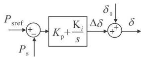  
(a)有功功率控制器

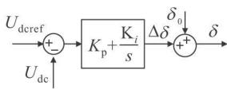  
(c)直流电压控制器

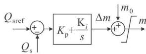  
(b)无功功率控制器

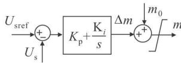  
(d)交流电压控制器   
图4 VSC-HVDC控制系统  
Fig．4 Control system of VSC-HVDC

$$
\frac {\mathrm {d} U _ {\mathrm {C} 2 0}}{\mathrm {d} t} = \frac {I _ {\mathrm {L} 2 0}}{C _ {2}} - \frac {3 m _ {2} \cos \delta_ {2}}{2 C _ {2}} I _ {\mathrm {L a} ^ {3}} ^ {r} + \frac {3 m _ {2} \sin \delta_ {2}}{2 C _ {2}} I _ {\mathrm {L a} ^ {3}} ^ {i} 。 \tag {21}
$$

由式（14）～（21）可以得到整个 VSC-HVDC 的动态相量方程：

$$
\left\{ \begin{array}{l} \frac {\mathrm {d} I _ {\mathrm {L a 1}} ^ {r}}{\mathrm {d} t} = - \frac {R _ {1}}{L _ {1}} I _ {\mathrm {L a 1}} ^ {r} + \omega I _ {\mathrm {L a 1}} ^ {i} - \frac {m _ {1} \cos \delta_ {1}}{4 L _ {1}} U _ {\mathrm {C l 0}} + \frac {U _ {\mathrm {s l}} ^ {r}}{L _ {1}}; \\ \frac {\mathrm {d} I _ {\mathrm {L a 1}} ^ {i}}{\mathrm {d} t} = - \omega I _ {\mathrm {L a 1}} ^ {r} - \frac {R _ {1}}{L _ {1}} I _ {\mathrm {L a 1}} ^ {i} + \frac {m _ {1} \sin \delta_ {1}}{4 L _ {1}} U _ {\mathrm {C l 0}} + \frac {U _ {\mathrm {s l}} ^ {i}}{L _ {1}}; \\ \frac {\mathrm {d} U _ {\mathrm {C l 0}}}{\mathrm {d} t} = \frac {3 m _ {1} \cos \delta_ {1}}{2 C _ {1}} I _ {\mathrm {L a 1}} ^ {r} - \frac {3 m _ {1} \sin \delta_ {1}}{2 C _ {1}} I _ {\mathrm {L a 1}} ^ {i} - \frac {I _ {\mathrm {L 2 0}}}{C _ {1}}; \\ \frac {\mathrm {d} I _ {\mathrm {L 2 0}}}{\mathrm {d} t} = \frac {U _ {\mathrm {C l 0}} - U _ {\mathrm {C 2 0}}}{L _ {2}} - \frac {R _ {2} I _ {\mathrm {L 2 0}}}{L _ {2}}; \\ \frac {\mathrm {d} U _ {\mathrm {C 2 0}}}{\mathrm {d} t} = \frac {I _ {\mathrm {L 2 0}}}{C _ {2}} - \frac {3 m _ {2} \cos \delta_ {2}}{2 C _ {2}} I _ {\mathrm {L a 3}} ^ {r} + \frac {3 m _ {2} \sin \delta_ {2}}{2 C _ {2}} I _ {\mathrm {L a 3}} ^ {i}; \\ \frac {\mathrm {d} I _ {\mathrm {L a 3}} ^ {r}}{\mathrm {d} t} = - \frac {R _ {3}}{L _ {3}} I _ {\mathrm {L a 3}} ^ {r} + \omega I _ {\mathrm {L a 3}} ^ {i} + \frac {m _ {2} \cos \delta_ {2}}{4 L _ {3}} U _ {\mathrm {C 2 0}} - \frac {U _ {\mathrm {s 3}} ^ {r}}{L _ {3}}; \\ \frac {\mathrm {d} I _ {\mathrm {L a 3}} ^ {i}}{\mathrm {d} t} = - \omega I _ {\mathrm {L a 3}} ^ {r} - \frac {R _ {3}}{L _ {3}} I _ {\mathrm {L 3}} ^ {i} - \frac {m _ {2} \sin \delta_ {2}}{4 L _ {3}} U _ {\mathrm {C 2 0}} - \frac {U _ {\mathrm {s 3}} ^ {i}}{L _ {3}} 。 \end{array} \right. \tag {22}
$$

其矩阵形式为

$$
\frac {\mathrm {d} \boldsymbol {X}}{\mathrm {d} t} = \boldsymbol {A} \boldsymbol {X} + \boldsymbol {B} \boldsymbol {U} 。 \tag {23}
$$

其中 矩阵 A 由式 求得

$$
\boldsymbol {X} = \left[ \begin{array}{l l l l l l} I _ {\mathrm {L a}} ^ {1} & I _ {\mathrm {L a}} ^ {1} & U _ {\mathrm {C} 1 0} & I _ {\mathrm {L} 2 0} & U _ {\mathrm {C} 2 0} & I _ {\mathrm {L a}} ^ {3} & I _ {\mathrm {L a}} ^ {3} \end{array} \right] ^ {\mathrm {T}};
$$

$\begin{array} { r } { \pmb { U } = [ U _ { \mathrm { s 1 } } ^ { r } ~ U _ { \mathrm { s 1 } } ^ { i } ~ U _ { \mathrm { s 3 } } ^ { r } ~ U _ { \mathrm { s 3 } } ^ { i } ] ^ { \mathrm { T } } ; m \mathrm { 1 } , \hat { \mathrm { 0 } } _ { \mathrm { l } } , m \mathrm { 2 } , \hat { \mathrm { 0 } } _ { \mathrm { 2 } } } \end{array}$ 可由的控制系统给出

# 2．4 VSC-HVDC 的控制系统

通过 能够调节其交流输出电压的幅值与相角 实现对有功功率 无功功率 直流电压和交流电压的控制 本文的控制系统均采用比例积分调节 有功功率 无功功率 直流电压及交流电压的控制器如图 $4 ( \mathbf { a } ) \sim ( \mathbf { d } )$ 所示 其中 $K _ { \mathrm { p } } , K _ { \mathrm { i } }$ 分别为环节的比例系数和积分常数 下标 代表参考值 $\delta _ { \mathrm { 0 } } \ : , m \mathrm { 0 }$ 为 稳态运行的移相角度及调制比$\Delta \delta _ { \setminus } \Delta _ { m }$ 为 调节的输出量

正常运行时 系统必需有一端VSC 采用定直流电压控制‚充当直流网络的有功平

衡换流器‚其余3个控制器可以根据实际需要进行选择。

# 3 仿真结果

仿真系统为如图1所示的简单 VSC-HVDC 传输系统 的参数给定为 $U _ { \mathrm { s 1 } } { = } 3 \mathrm { \mathbf { k } V }$ 幅值 $U _ { \mathrm { s } 3 } = 3$ kV(幅值), $f = 5 0 \ \mathrm { H z } , R \mathrm { 1 } = R \mathrm { 3 } = 0 . 2 0$ $\Omega , R _ { 2 } = 1 . \ 0 \ \Omega , C _ { 1 } = C _ { 2 } = 7 \ \mathrm { m F } , L _ { 1 } = L _ { 3 } = 7 \ \mathrm { m H } , L _ { 2 } =$ $7 _ { \mathrm { ~ m H } }$ 。

为了验证本文导出的 动态相量模型的有效性‚本文采用 Matlab／Simulink 的信号处理模块构建了 系统的动态相量模型同时采用 Matlab／SimPowerSystem 建立了相应的详细电磁暂态模型 进行了典型的潮流调节仿真试验 并对 种模型的仿真结果进行了比较分析。电磁暂态模型中 SPWM 的载波比 $N { = }  { f _ { \mathrm { r } } } / f$ ＝21。在本文的仿真中‚VSC-HVDC 系统的整流侧采用定直流电压和定无功功率控制‚逆变侧采用定有功和定无功功率控制

算例 逆变侧有功功率指令 $P _ { \mathrm { s r e f 3 } }$ 在 时由阶跃到 在 时跳变到 逆变侧有功 $P _ { \mathrm { s 3 } }$ 和无功 $Q \mathrm { s 3 }$ 的响应曲线如图5所示‚图中实线为指令值‚虚线为实际测量值。其中：图 $5 ( \mathbf { a } )$ 为采用动态相量模型仿真的结果 图 为采用详细电磁暂态模型仿真的结果 由图 可知 在本算例中‚采用动态相量模型仿真的结果和采用详细电磁暂态模型仿真的结果非常符合

算例 逆变侧无功功率指令 $Q \mathrm { { s r e f ^ { 3 } } }$ 在 时由阶跃到 在 时跳变到 $0 _ { \circ }$ 其它仿真条件和算例 完全相同 逆变侧有功 $P _ { \mathrm { s 3 } }$ 和无功$Q \mathrm { s 3 }$ 的响应曲线如图 所示 其中 图 $6 ( \mathbf { a } )$ 为采用动态相量模型仿真的结果 图 $6 ( \mathbf { b } )$ 为采用详细电磁暂态模型仿真的结果 由图 可知 在本算例中 采用动态相量模型仿真的结果和采用详细电磁暂态模型仿真的结果也非常符合

在相同的仿真条件下 分别采用 种模型仿真所需时间如表 所示 可以看出 动态相量法可以大大减少仿真时间 精确地反映系统的动态变化过程 从而有望在含有 系统的大规模电力系统仿真中得到应用

表1 两种模型仿真所需时间对比  
Tab．1 Comparison of the simulation time of the two models   

<table><tr><td>仿真模型</td><td>仿真区间/s</td><td>仿真耗时/s</td></tr><tr><td>动态相量模型</td><td>0~5</td><td>6.1480</td></tr><tr><td>电磁暂态模型</td><td>0~5</td><td>393.0233</td></tr></table>

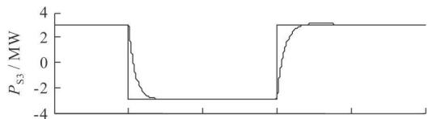

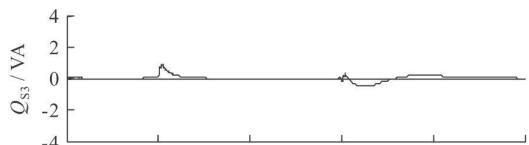  
(a)动态相量仿真结果

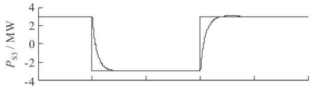

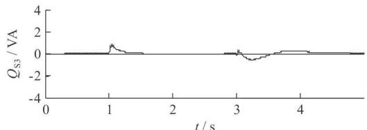  
(b)详细的电磁暂态仿真结果   
图5 算例1仿真结果

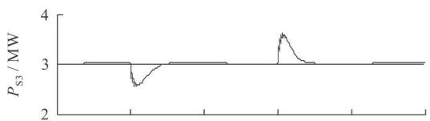  
Fig．5 Simulation results of case1

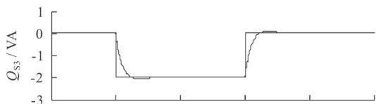  
(a)动态相量仿真结果

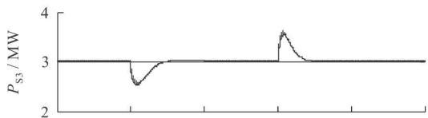

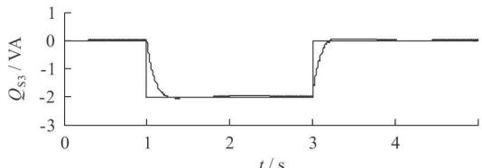  
(b)详细的电磁暂态仿真结果   
图6 算例2仿真结果  
Fig．6 Simulation results of case2

# 4 结 论

a）动态相量模型可以很好地反映 VSC-HVDC的主要动态特性。  
动态相量法可以作为电力系统中电磁暂态模型和机电暂态模型的补充 可以有效地与电磁暂

态和机电暂态仿真程序结合‚对含 VSC-HVDC 电力系统进行仿真研究。

动态相量模型由于考虑了相量的动态 因此比准稳态模型准确‚并且比详细时域模型简单易用。  
d）动态相量模型的使用可以大大提高计算速度 节省计算时间

# 参 考 文 献

张桂斌 徐 政 王广柱 基于 的直流输电系统的稳态建模及其非线性控制 中国电机工程学报  
Z HANG Gu-i bin‚XU Zheng‚WANG Guang-zhu．Steady statemodel and it s nonlinear cont rol of VSC-HV DC system ［J ］．Pro-ceedings of the CSEE，2002，22(1)：17-22.  
［2］ 赵成勇‚李金丰‚李广凯．基于有功和无功独立调节的 VSC-HVDC控制策略[J].电力系统自动化，2005,29(9).20-24.  
Z HAO Cheng-yong‚LI Jin-feng‚LI Guang-kai．VSC-HVDC cont rol st rategy based on respective adjustment of active and reactive pow er ［J ］．Automation of Elect ric Pow er Systems‚2005 29（9）：20-24．   
郑 超 周孝信 李若梅 新型高压直流输电的开关函数建模与分析 电力系统自动化  
Z HENG Chao‚Z HOU Xiao-xin‚LI Ruo-mei．Modeling and analysis for VSC-HV DC using t he switching f unction ［ J ］．Automation of Electric Power Systems‚2005‚29（8）：32-35   
陈 谦 唐国庆 胡 铭 采用 坐标的 稳态模型与控制器设计 电力系统自动化  
C HEN Qian‚T ANG Guo-qing‚HU Ming．Steady state model and cont roller design of a VSC-HV DC converter based on dq0- axis[J]:Automation of Electric Power Systems，2OO4,28(16); 61-66.   
［5］ Sanders S R‚Now orolski J M‚Liu X Z‚et al．Generalized averaging met hod for pow er conversion circuit s ［ J ］．IEEE T rans on Power Electronics，1991，6(2).251-259.   
［6］ 戚庆茹‚焦连伟‚陈寿孙‚等．运用动态相量法对电力电子装置建模与仿真初探 电力系统自动化  
QI Qing-ru‚JIAO Lian-wei‚C HEN Shou-sun‚et al．Application of the dynamic phasors in modeling and simulation of elec tronic converters[J].Automation of Electric Power Systems, 2003，27(9)：6-10.   
刘皓明 戚庆茹 李 扬 等 中点钳位式三电平 的动态相量建模与仿真[I]:电力自动化设备，2005,25(8).18-22.  
LIU Hao-ming‚QI Qing-ru‚LI Yang‚et al．Modeling and simulation of ST AT CO M system based on 3-level NPC inverter using dynamic phasors ［ J ］．Elect ric Pow er Automation Equipment，2005，25(8)：18-22.   
戚庆茹 焦连伟 严 正 等 高压直流输电动态相量建模与仿真 中国电机工程学报  
QI Qing-ru，JIAO Lian-wei，YAN Zheng，et al．Modeling andsimulation of HVDC with dynamic phasors[J]. Proceedinqs ofthe CSEE，2003，23(12)：28-32.  
黄胜利 宋瑞华 赵宏图 等 应用动态相量模型分析高压直流输电引起的次同步振荡现象 中国电机工程学报  
HU ANG Sheng-li‚SONG Ru-i hua‚ZHAO Hong-tu‚et al．Analysis and simulating the SSO caused by HVDC using the time-varying dynamic phasor[J].Proceedinqs of the CSEE，2OO3,23(7)；1-4.   
［10］ Mattavelli P‚Verghese G C‚Stankovic A M．Phasor dynamicsof t ry rist or cont rolled series capacit or sy stems ［J ］．IEEE T ranson Power Svstems，1997,12(3)：1259-1267.  
［11］ Mattavelli P‚Stankovic A M‚Verghese G C．SSR analysis with 111MattayellPStankovicAMadergheseGC.Sanalysis with

dynamic phasor model of thyristor-controlled series capacitor ［ J ］IEEE Transactions on Power Systems，1999,14(l)：200-208.  
何瑞文 蔡泽祥 结合谐波特征的可控串补动态相量法建模与特性分析 中国电机工程学报  
HE Ru-i w en‚CAI Ze-xiang．Modeling and analysis of t hyristor cont rolled series capacitor wit h dynamic phasors considering harmonic characteristics ［J ］．Proceedings of t he CSEE‚2005‚ 25（5）：28-32．   
［13］ Niaki A N‚Iravani M R．Steady state and dynamic models of uni-fied power flow controller （UPFC） for power system studies ［ J ］IEEE Trans on Power Systems，1996,1l(4)：1937-1943.  
［14］ 戚庆茹‚焦连伟‚严 正‚等．统一潮流控制器的动态相量建模与仿真 电力系统自动化  
QI Qing-ru‚JIAO Lian-wei‚Y AN Zheng‚et al．Modeling andsimulationof UPFC wit h dynamic phasors ［ J ］．Automation ofElectric Power Systems，2003，27(15)：10-14.  
［15］ Stefanov P C‚Stankovic A M．Modeling of UPFC operation under unbalanced conditions wit h dynamic phasors ［ J ］．IEEE Trans on Power Systems，2002，17(2).395-403.   
刘皓明 朱浩骏 严 正 等 含统一潮流控制器装置的电力系统动态混合仿真接口算法研究 中国电机工程学报25(16):1-7.  
LIU Hao-ming‚Z HU Hao-jun‚Y AN Zheng‚et al．Study on interface algorit hm for pow er system t ransient stability hybridmodel simulation wit h UPFC device ［ J ］．Proceedings of t he CSEE，2005，25(16)；1-7.   
李国栋 毛承雄 陆继明 等 基于逆系统理论的 新型控制 高电压技术  
LI Guo-dong‚M AO Cheng-xiong‚LU J-i ming‚et al．New cont rol of VSC-HV DC based on t he inverse system t heory ［J ］ High Voltage Engineering‚2005‚31（8）：45-47

# 姚 伟

男 博士生

主要从轻型直流输电在电力系统中应用研究

E-mail：yao＿ wei＠163．com

YAO Wei

Ph·D·candidate

  
C HENG Sh-i jie

Ph·D.,CAS member

  
WEN Jin-yu

Ph．D．‚Professor

# 程时杰

男 博士 中国科学院院士 博导高级会员

主要从事电力系统的稳定分析与控制 超导和 技术在电力系统中的应用人工智能及其在电力系统中的应用 电力线载波通信等方面的研究

# 文劲宇

男 博士 教授 博导

主要研究方向为电力系统控制 人工智能和 技术在电力系统中的应用