# 适用于鼠笼异步发电机的多功能串联补偿器

姜飞，涂春鸣，帅智康，侯尊，刘子维，郭祺

(国家电能变换与控制工程技术研究中心(湖南大学), 湖南省 长沙市 410082)

# A Multi-Functional Series Compensator to Squirrel Cage Induction Generator

JIANG Fei, TU Chunming, SHUAI Zhikang, HOU Zun, LIU Ziwei, GUO Qi

(National Electric Power Conversion Control Engineering Technology Research Center (Hunan University),

Changsha 410082, Hunan Province, China)

ABSTRACT: To enhance low-voltage ride through (LVRT) capability of squirrel cage induction generator (SCIG), a multi-functional series compensator (MFSC) is proposed. MFSC is connected in series with SCIG stator to grid connection point. MFSC has multiple functions, such as LVRT capability improvement of wind farm during faults, fast voltage recovery at point of common coupling after faults and fault-current limiting. By analyzing SCIG working mechanism, mathematic models of MFSC are established under different modes. In addition, control strategies and operational algorithm for different modes are provided. Control strategies of thyristors are presented briefly. Finally, effectiveness of multiple functions of MFSC is verified with PSCAD/EMTDC simulation.

KEY WORDS: squirrel cage induction generator; multi-function; series compensator; LVRT

摘要：为改善鼠笼型异步风电机(squirrel cage induction generator，SCIG)的低电压穿越能力，提出了一种适用于SCIG的多功能串联补偿器(multi-functional series compensator，MFSC)。MFSC可连接于风机定子与并网点之间，能够实现风电场低电压穿越、故障后风机并网点电压快速恢复、系统短路故障限流等多种功能。通过分析电网故障下的SCIG风机工作特性，给出了MFSC功能实现的数学模型；重点介绍了MFSC的不同功能控制策略、多模式切换流程及新增晶闸管控制短路支路优化控制策略。采用PSCAD/EMTDC软件建立了仿真系统，仿真结果验证了MFSC多种功能应用的有效性。

关键词：鼠笼型异步风电机；多功能；串联补偿器；低电压穿越

DOI: 10.13335/j.1000-3673.pst.2015.12.010

# 0 引言

近年来，随着风电装机容量在电力系统所占比

重不断增大[1]，并网风电机组与系统的交互影响不容忽视[2]。统计发现，已建成的风电场中还存在着大量较早投产的异步风机，这些机组生产时并未考虑低电压穿越(low-voltage ride through，LVRT)技术[3-4]。为保障电网安全稳定运行，国家电监会明确规定风电场必须进行LVRT改造[4]。

常用风电机组中永磁直驱同步发电机和双馈异步风电机均可通过改进变换器控制或简单自身拓扑结构实现LVRT功能。但鼠笼异步发电机(squirrelcageinductiongenerator，SCIG)由于定子侧直接与电网连接，缺乏对转矩和转速的有效控制，系统故障产生的电磁转矩波动将对风机齿轮箱等机械部件造成冲击[5]；其在故障消除后的系统电压恢复过程中需吸收大量无功，引起机端出口电压进一步降低[6]，所导致的发电机转子转速飞升是此类机组脱网的主要原因。

国内外学者对于SCIG型风机的低电压穿越技术已经有较多研究。传统桨距控制调节可减少输入机械功率，限制转速上升[7]。但变桨距调节缓慢，对于风电机组故障穿越作用有限，且转速上升使得电机吸收无功增大，将导致电网电压恶化[8]。静止无功补偿器(static var compensator，SVC)、静止同步补偿器(static synchronous compensator，STATCOM)、超级电容等[9-11]在电压跌落期间投入运行，可为故障期间的风电机组提供无功支持，有助于实现LVRT功能。文献[12]表明同容量STATCOM在维持节点电压、暂稳定极限及阻尼效果上明显优于SVC，但故障期间的低电压限制了无功补偿能力发挥，且在短路容量较大的系统中无功补偿效果并不理想。动态电压调节器(dynamic voltage restorer，DVR)串联于风电机组与电网之间，能够保持机端电压恒定；但正常运行时的器件损耗不容忽视，尤其故障期间系统快速上升的短路电流易造成功率

器件损坏[6,13]，且直流侧需安装耗能元件，如卸荷电阻。通过串、并联制动电阻可有效改善风电场稳定性[14]。串联制动电阻(series braking resistors, SBR)作用发挥依赖电流大小而非电压大小，其在低电压环境下机端电压恢复、机组暂态稳定性能力更加突出[15-17]；但制动电阻切入时间受开关动作时间限制，过晚切除也可能导致电阻箱发热严重，缩短设备寿命。

考虑到单种技术提高风电机组LVRT能力的局限性，联合补偿方法将成为一个研究方向。文献[18]提出了采用可控硅串联补偿器(thyristor controlled series compensator, TCSC)和SVC的联合补偿技术，仿真表明此方案相比于单个设备具有更好效果。文献[4]提出一种串联限流电抗的无功补偿方案，可实现电压跌落时维持机端电压相对恒定和无功电流注入功能；但该方案中电抗器投切可能产生较大冲击，对风机本身将产生不良影响。文献[19]提出了采用电容器与静止无功补偿器构成混合无功补偿系统。以上联合补偿策略一定程度上提高了笼型异步风机暂态稳定性，但补偿方案涉及新增设备及多个设备联合运行与控制，可能导致综合系统的控制复杂、成本高、体积大等问题，增加了实际推广难度。

具有限流功能的动态电压恢复器拓扑及运行分析已逐步开展[20-22]，本文在已有研究工作基础上，提出了适用于SCIG风电场的多功能串联补偿器(multi-functional series compensator, MFSC)拓扑，并给出MFSC系统的多功能灵活切换策略：当电网正常运行时，MFSC被旁路开关短路，减小对系统运行影响；当并网点发生小扰动时，作为DVR维持端口电压恒定；当电网发生严重故障时，作为串联阻抗抬升风机端口电压，且限制故障电流，保证极端情况下风机不脱网运行，在故障清除后立即从串联阻抗模式切换至电压补偿模式，采用DVR功能实现风机端口电压加速恢复。其次，给出了多模式切换策略及新增晶闸管支路的控制策略。

# 1 电网故障下SCIG型风机特性

并网型异步风机结构和控制简单，但其不具备LVRT功能。忽略每相定子电阻 $R_{s}$ ，由于激励电感 $X_{\mathrm{m}}$ 远远大于定子电感 $X_{s}$ ，可忽略激磁支路的分流系数，将其转移至定子外侧。若所有量均折算到定子侧，并网点电压为 $U_{\mathrm{pcc}}$ ，转差率为 $s$ 。 $X_{\mathrm{s}}$ 、 $R_{\mathrm{r}}$ 、 $X_{\mathrm{r}}$ 分别为每相定子漏感、转子电阻、转子漏感。定义流向电网功率为正，则发电机有功功率 $P_{\mathrm{G}}$ 、无功功率 $Q_{\mathrm{G}}^{[23]}$ 分别为

$$
P _ {\mathrm {G}} = - \frac {U _ {\mathrm {p c c}} ^ {2} R _ {\mathrm {r}} s}{R _ {\mathrm {r}} ^ {2} + s ^ {2} \left(X _ {\mathrm {s}} + X _ {\mathrm {r}}\right) ^ {2}} \tag {1}
$$

$$
Q _ {\mathrm {G}} = - \frac {U _ {\mathrm {p c c}} ^ {2}}{X _ {\mathrm {m}}} + \frac {s \left(X _ {\mathrm {s}} + X _ {\mathrm {r}}\right) P _ {\mathrm {G}}}{R _ {\mathrm {r}}} \tag {2}
$$

其中，转差率 $s$ 为

$$
s = \frac {- U _ {\mathrm {p c c}} ^ {2} R _ {\mathrm {r}} + R _ {\mathrm {r}} \sqrt {U _ {\mathrm {p c c}} ^ {4} - 4 \left(X _ {\mathrm {s}} + X _ {\mathrm {r}}\right) ^ {2} P _ {\mathrm {G}} ^ {2}}}{2 \left(X _ {\mathrm {r}} + X _ {\mathrm {s}}\right)} \tag {3}
$$

由式(1)—(3)可知，考虑到发电方式下 $s < 0$ ，因此异步风机输出的有功功率为正、无功功率为负。

# 1.1 故障期间分析

当电网发生故障后，风机并网点电压迅速降低，将使得SCIG型风机产生电磁转矩与机械转矩不平衡。由于风机转子运动方程

$$
J \frac {\mathrm {d} \omega_ {\mathrm {m}}}{\mathrm {d} t} = T _ {\mathrm {m}} - T _ {\mathrm {e}} \tag {4}
$$

式中： $T_{\mathrm{m}}$ 为机械转矩； $T_{\mathrm{e}}$ 为电磁转矩； $J$ 为发电机旋转模块的转动惯量； $\omega_{\mathrm{m}}$ 为转子机械速度。电磁转矩可表示为

$$
T _ {\mathrm {e}} = \frac {3 p}{2} \cdot \frac {R _ {\mathrm {r}}}{s \omega_ {\mathrm {s}}} \cdot \frac {U _ {\mathrm {p c c}} ^ {2}}{\left(R _ {\mathrm {s}} + R _ {\mathrm {r}} / s\right) ^ {2} + \left(X _ {\mathrm {s}} + X _ {\mathrm {r}}\right) ^ {2}} \tag {5}
$$

式中 $p$ 为极对数。若电网故障引起并网点电压 $U_{\mathrm{pcc}}$ 降低， $T_{\mathrm{e}}$ 减小，当机械转矩 $T_{\mathrm{m}}$ 不变时，造成 $(T_{\mathrm{m}} - T_{\mathrm{e}})$ 差值增大，风力机所产生的有功不能及时送到电网，系统通过转子加速消耗多余有功功率。

# 1.2 故障恢复分析

当电网故障消失后，风机并网点电压恢复需要经历一个暂态过程，应当采用必要的措施尽量缩短该恢复过程时间。

在式(2)中，将风电场输出无功功率 $Q_{\mathrm{G}}$ 对有功功率 $P_{\mathrm{G}}$ 求偏导[23]

$$
\frac {\partial Q _ {\mathrm {G}}}{\partial P _ {\mathrm {G}}} = - \frac {2 \left(X _ {\mathrm {s}} + X _ {\mathrm {r}}\right) P _ {\mathrm {G}}}{\sqrt {U _ {\mathrm {p c c}} ^ {4} - 4 \left(X _ {\mathrm {s}} + X _ {\mathrm {r}}\right) ^ {2} P _ {\mathrm {G}} ^ {2}}} \tag {6}
$$

若正常运行时，风机端电压接近于额定电压(若 $U_{\mathrm{pcc}} = 1$ )，假设电抗 $(X_{\mathrm{s}} + X_{\mathrm{r}})$ 很小，则

$$
\frac {\partial Q _ {\mathrm {G}}}{\partial P _ {\mathrm {G}}} = - 2 \left(X _ {\mathrm {s}} + X _ {\mathrm {r}}\right) P _ {\mathrm {G}} \tag {7}
$$

可知，若故障期间，风机端电压降低，造成有功输出减少，进而无功输出增大，即吸收更少的无功功率；故障恢复期间，风机端电压逐步恢复，有功功率输出增大，而无功功率输出减少，即吸收更多的无功功率。

# 2 MFSC运行机理

# 2.1 MFSC的拓扑结构

含SCIG型风机的风电场通过升压变与电网相

连，风机出口并联补偿电容 $C$ ，单相MFSC结构示意图如图1所示。MFSC采用三单相形式，可实现分相独立控制，其包括了反并联晶闸管旁路开关K、串联变压器T、串联变流器、LC型输出滤波器、反并联晶闸管短路支路S。串联变流器输出口与输出滤波电感之间设置晶闸管短路支路S，通过控制晶闸管通断实现不同功能间的切换。图1中： $Z_{\mathrm{at}}$ 为晶闸管支路S上的串联阻抗； $u_{s}$ 为系统额定电压。

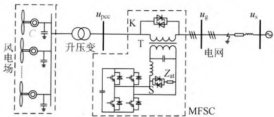  
图1 基于MFSC的结构示意图  
Fig. 1 Structure diagram of wind farm based on MFSC

当电网正常运行时，通过晶闸管旁路开关K将串联逆变模块短路，线路电流流过支路K，实现减少串联变压器漏抗等器件的损耗；当电网受到小扰动时，晶闸管支路K、S均断开，通过串联变流器补偿电网电压 $u_{\mathrm{g}}$ 的跌落，保证风机机端电压 $u_{\mathrm{pcc}}$ 恒定；当电网发生不同类型短路故障时，立即封锁故障相的IGBT脉冲，然后通过控制晶闸管短路支路S导通，使得滤波电感与晶闸管支路一起通过变压器T串联耦合至线路，增大故障点与风机的电气距离，提高机端电压，实现SCIG故障期间的低电压穿越。此外，可通过调节晶闸管导通角实现改变串联等效阻抗的大小，起到调节补偿电压的目的；电网故障排除后，迅速恢复至电压调节模式，提供可调的串联电压快速补偿，缩短风机转子加速时间，提高暂态稳定性。

# 2.2 MFSC的LVRT功能实现

# 2.2.1 串联阻抗补偿模式

当电网出现大扰动(风机并网点附近发生短路故障), 故障期间电压严重跌落, 控制系统检测到短路故障发生后, 立即闭锁故障相的所有 IGBT 信号, 延迟给出晶闸管导通信号, 此刻采用串联制动阻抗原理改善暂态稳定性[17]。单相等值电路如图2所示。图2中: $Z_{\mathrm{Tl}}$ 为变压器 $T_{1}$ 的等效阻抗; $U_{s}$ 为系统额

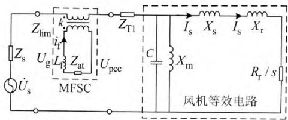  
图2 电网故障期间系统等值电路  
Fig. 2 Equivalent circuit of the system during the fault

定电压。

由于滤波电容 $C_{\mathrm{f}}$ 的基波阻抗较大，短路时流过滤波电容 $C_{\mathrm{f}}$ 上的电流很小，串联变压器 $T_{1}$ 二次侧电流近似等于流过滤波电感 $L_{\mathrm{f}}$ 上的电流，定义 $i_{\mathrm{f}}$ 为变压器二次侧电流。则LC输出滤波器的滤波电感与串联变压器耦合为一个大的补偿阻抗 $Z_{\mathrm{lim}}$ ，晶闸管完全导通时的值为

$$
Z _ {\lim } = k ^ {2} \left(\omega L _ {\mathrm {f}} + Z _ {\mathrm {a t}}\right) \tag {8}
$$

式中： $\omega$ 为基波角频率； $k$ 为串联变压器变比。此外，通过调节反并联晶闸管的触发角可改变等效补偿阻抗大小，如

$$
Z _ {\lim } = k ^ {2} \left(\omega L _ {\mathrm {c}} + Z _ {\mathrm {a t}}\right) \cdot \frac {\pi}{2 \pi - 2 \alpha + \sin (2 \alpha)} \tag {9}
$$

式中 $\alpha$ 为晶闸管的触发延迟角。忽略系统阻抗 $Z_{s}$ $T_{1}$ 上的压降为

$$
\dot {U} _ {\lim } = Z _ {\lim } \dot {I} _ {\mathrm {s}} \tag {10}
$$

利用MFSC提升故障期间机端电压的原理如图3所示。故障前风机并网点电压为 $U_{\mathrm{pcc}}$ （假设电网正常运行时，其值取额定电压)，故障后，若不采取任何补偿措施，则并网点电压为 $U_{\mathrm{g}}$ ，定子电流为 $I_{s}$ 。当补偿阻抗接入后，发电机机端电压为

$$
\dot {U} _ {\mathrm {p c c}} = \dot {U} _ {\mathrm {g}} + \dot {U} _ {\lim } \tag {11}
$$

可见，电网故障期间通过串入补偿阻抗，可有效支撑风机端电压。

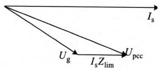  
图3 故障期间MFSC对风机端电压作用示意图  
Fig. 3 Diagram of the effect of MFSC on the terminal voltage during the fault

# 2.2.2 动态电压补偿模式

虽然故障期间，能够通过串联阻抗方式来提高风机端口电压，提升低电压穿越能力。然而，串联补偿阻抗并不能提供无功补偿，当电网功率因数偏低时，故障后节点电压恢复较慢[17]。本文所提出的MFSC能够在电网大扰动消失后，当控制系统检测到故障消除时发出指令将晶闸管控制信号去除，让其承受反向电压且电流降到维持电流以下自关断；然后恢复故障相逆变器的IGBT动作信号，切换至DVR模式。DVR模式的单相等值电路如图4所示。

# 3 MFSC控制策略分析

由于晶闸管的半控特性，必须等到系统电压下一个过零点方可关断。因此，正确设计晶闸管支路K、S的控制策略，对于MFSC的多功能实现十分

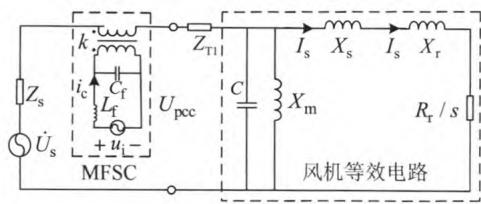  
图4 电网故障排除后系统拓扑图  
Fig. 4 Topology of the system after the fault

重要。本文采用文献[6-7]所提出的强制换流法，当检测故障发生后，控制逆变器输出与晶闸管导通电流方向相反的电压，强制晶闸管旁路支路K迅速关断，使得MFSC由待机模式切换至多功能补偿模式，而晶闸管短路支路S控制策略下文详细介绍。

# 3.1 小扰动控制策略

当系统发生小扰动时，风机并网点电压产生暂降，本文采用完全补偿法维持风机并网点电压恒定，补偿关系相量图如图5所示。图5中： $U_{\mathrm{pcc}}$ 为正常时并网点电压； $U_{\mathrm{pcc}(1)}$ 为发生小扰动后的并网点电压； $U_{\mathrm{pcc}(2)}$ 为补偿后的并网点电压； $U_{\mathrm{dvr}}$ 为MFSC输出补偿电压； $\alpha$ 为负载功率因数角； $\theta$ 为跳变因数角； $\varphi$ 为跌落后的电压相角。有

$$
U _ {\mathrm {d v r}} = \sqrt {U _ {\mathrm {p c c} (2)} ^ {2} + U _ {\mathrm {p c c} (1)} ^ {2} - 2 U _ {\mathrm {p c c} (2)} U _ {\mathrm {p c c} (1)} \cos (\theta - \varphi)} \tag {12}
$$

采用全补偿策略时， $\theta = 0$ 。忽略流过滤波电容的基波电流，因此补偿电压满足

$$
\dot {U} _ {\mathrm {d v r}} = k \dot {U} _ {\mathrm {c}} = k \left(\dot {U} _ {\mathrm {i}} - L _ {\mathrm {f}} \frac {\mathrm {d} i _ {\mathrm {c}}}{\mathrm {d} t}\right) \tag {13}
$$

式中： $i_{\mathrm{c}}$ 为逆变器输出电流； $U_{\mathrm{c}}$ 为串联变压器二次侧电压； $U_{\mathrm{i}}$ 为逆变器输出电压。

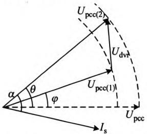  
图5DVR模式下MFSC对风机端电压作用示意图  
Fig. 5 Diagram of the effect of MFSC on the terminal voltage in the DVR mode

# 3.2 大扰动控制策略

大扰动下的LVRT控制策略如图6所示。系统处于待机模式或小扰动模式时，线路电流处于正常范围，则触发器置位 $Q$ 为低电平。当风机并网点附近出现大扰动时，将故障线路电流 $i_{\mathrm{L}}$ 与控制系统故障电流设定值 $i_{\mathrm{op}}$ 比较。当 $i_{\mathrm{L}}$ 绝对值大于 $i_{\mathrm{op}}$ 时，且经过时间 $\Delta t_1$ 延迟后， $i_{\mathrm{L}}$ 绝对值仍大于 $I_{\mathrm{op}}$ ， $S_{1}$ 为高电平，则此时 $S$ 为高电平(由于RS触发器初始置位 $Q$ 为低电平)；同时，将 $i_{\mathrm{L}}$ 与2倍幅值的基波正余弦相乘，经低通滤波器(low-pass filter，LPF)后得到

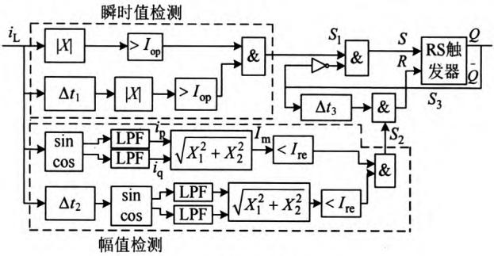  
图6 LVRT控制策略  
Fig. 6 Control strategy of LVRT

直流分量 $i_{\mathrm{q}}$ 、 $i_{\mathrm{p}}$ ，计算其均方根值，即得到 $i_{\mathrm{L}}$ 的幅值 $I_{\mathrm{m}}$ ，此时 $I_{\mathrm{m}}$ 若大于故障电流返回设定值 $I_{\mathrm{re}}$ ，且经过时间 $\Delta t_2$ 延迟后的 $I_{\mathrm{m}}$ 仍大于 $I_{\mathrm{re}}$ ，则 $S_{2}$ 为低电平。由图6可知， $Q$ 经过时间 $\Delta t_3$ 延迟后与 $S_{2}$ 信号相与形成 $R$ 的低电平。此时， $R$ 为低电平、 $S$ 为高电平，则触发器RS输出的 $Q$ 为高电平。该高电平一方面输入到逆变器控制回路，对逆变器IGBT进行封锁；另一方面控制故障相短路支路 $S$ 导通，逆变器的滤波电感与晶闸管支路阻抗串入电路，限制故障短路电流，同时可抬升风机端口并网点电压。

当大扰动消失后， $I_{\mathrm{m}}$ 小于 $I_{\mathrm{re}}$ ，且经过时间 $\Delta t_2$ 延迟后的 $I_{\mathrm{m}}$ 仍小于 $I_{\mathrm{re}}$ ，有 $S_{2}$ 为高电平；假设 $Q$ 在较短时间仍是高电平，则 $R$ 为高电平。同时，瞬时值检测得到的 $S_{1}$ 为低电平，则 $S$ 为低电平。此刻， $R$ 为高电平、 $S$ 为低电平，则RS触发器重新置位 $Q$ 为低电平，可知，晶闸管导通信号消失，控制系统转入小扰动检测。

故障期间，采取了串联补偿阻抗的LVRT控制策略，风机并网点电压可以维持在较高水平。当系统大扰动消失后，系统应退出串联补偿阻抗，转换为电压快速恢复控制。由于系统大扰动已经消失，系统电压、电流在正常值附近震荡，因此，MFSC在该时间段的控制类似于小扰动控制策略。由于晶闸管需过零关断，上述功能切换应在检测晶闸管短路支路电流 $i_{\mathrm{SCR}}$ 过零后，方可再次触发IGBT导通信号，进行电压快速补偿。

# 3.3 晶闸管短路支路控制

晶闸管控制短路支路K的合理投退对于串联阻抗补偿模式与待机模式、串联阻抗补偿模式与DVR模式间的可靠切换十分重要。由于半控器件晶闸管开通时间可控，因此，待机模式至SBR模式、DVR模式有效可控。但对于串联阻抗补偿模式至待机模式、DVR模式，则须在触发信号去除后，待电压下一过零点方可关断。可见，MFSC控制系统需增加晶闸管短路支路电流为0判断，延迟等待故障相晶闸管完全关断，避免未完全关断时MFSC切换

至DVR模式后逆变器输出端通过晶闸管短路支路导通，造成极大的短路冲击电流，损坏逆变器模块。3.4 MFSC切换控制流程

MFSC在多模式间的切换控制流程如图7所示。电网正常运行时，反并联晶闸管旁路支路K导通，MFSC运行在待机模式(模式1)；当电网发生小扰动，风机并网点电压在小范围波动，MFSC切换至DVR补偿模式(模式2)，图7中， $d_{\%}$ 为模式2下DVR最大补偿电压幅度(取 $d_{\%} = 15\%$ )。当并网点附近发生短路故障，造成风机并网点电压严重跌落，继电保护装置检测线路故障电流超过阈值[20]，MFSC迅速进入串联阻抗补偿模式(模式3)，故障消失后，若检测小扰动消失，则MFSC切换至待机模式(模式1)；若检测存在小扰动，则MFSC切换至DVR模式(模式2)，加速并网点电压恢复，直至系统恢复稳定。

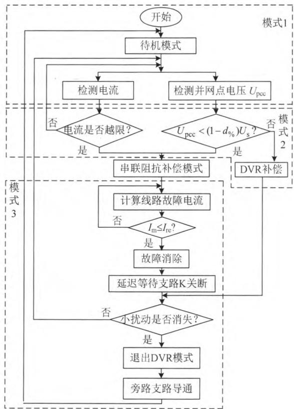  
图7 多模式切换控制流程  
Fig. 7 Flow chart of switching control among different modes

# 4 仿真分析

为验证本文所提多功能串联补偿器在含笼型异步风机电网运行的有效性，采用PSCAD/EMTDC仿真软件建立测试系统，如图8所示。由于本文主要研究MFSC对含SCIG型风机的作用，因此保持风速不变，不计桨距角调节作用。仿真参数见附录表1。

1）MFSC的DVR模式实现仿真。

MFSC 的动态电压补偿功能仿真波形如图 9 所

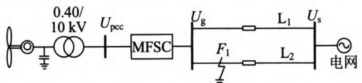  
图8仿真系统

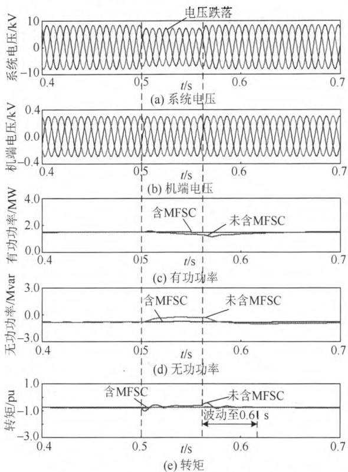  
Fig. 8 Simulation system   
图9 MFSC的电压补偿功能仿真波形  
Fig. 9 Simulation results of the voltage compensation function of MFSC

示。由图9(a)波形可知，0.50—0.56s电网侧电压发生暂降，跌落幅度为 $15\%$ ，MFSC立即切换至电压补偿模式，维持风机出口电压保持恒定，如图9(b)所示。整个电压波动过程中，含MFSC的风机系统有功、无功功率输出波动不明显；相反，未含MFSC的风电场有功输出下降，吸收无功减小，如图9(c)、(d)所示；由于受电压暂降影响，故障后，未含MFSC的风电场稳定恢复时间较长，转矩波动持续至约0.61s，而含MFSC的系统能够较好地维持电磁转矩与机械转矩平衡，保证风机正常运行，见图9(e)。

2）MFSC的LVRT功能实现仿真。

若仿真系统在输电线路 $\mathbf{L}_2$ 的 $F_{1}$ 处发生三相短路故障，持续时间分别为0.1s、0.16s，仿真波形如图10、11所示。以故障持续时间0.1s为例，由图10(a)波形可知，0.9s系统故障发生，系统电压迅速降低。当MFSC控制系统检测到故障发生后，迅速导通晶闸管控制短路支路，补偿阻抗串入线路，等效增加电气距离，风机并网点电压能够得到较好恢复，如图10(b)所示。由于风机接口电压得到了改善，输出有功、无功影响不大，机械转矩与电磁转矩相对于未含MFSC的系统波动较小，故障

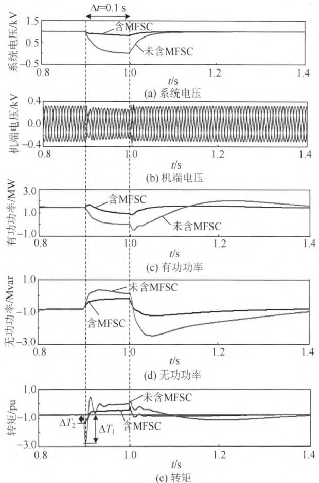

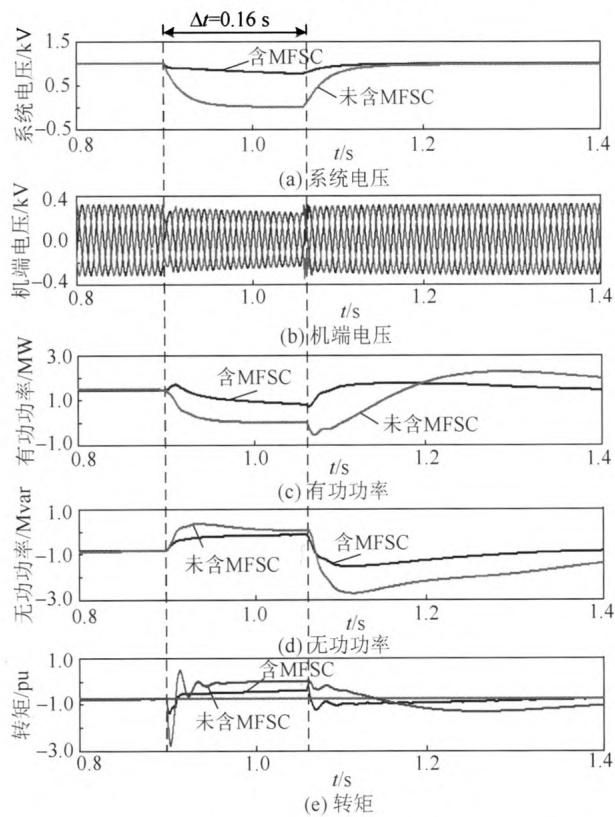  
图10 含MFSC的电网对称故障仿真波形 $(\Delta t = 0.1s)$ Fig.10 Simulation results of system with MFSC during symmetric fault $(\Delta t = 0.1s)$   
图11含MFSC的电网对称故障仿真波形 $(\Delta t = 0.16\mathrm{s})$   
Fig. 11 Simulation results of system with MFSC during symmetric fault $(\Delta t = 0.16$ s)

发生时刻的转矩差值 $\Delta T_{2}$ 也明显小于未含MFSC系

统下的 $\Delta T_{1}$ , 能够维持风机不脱网。故障消失后, MFSC 检测故障消失, 等待晶闸管短路支路延时关断后, 由串联阻抗补偿模式切换至 DVR 模式, 加速故障恢复。由图 11 可知, 当三相短路故障持续时间为 $0.16 \mathrm{~s}$ 时, MFSC 仍然能够起到良好的补偿作用。

若仿真系统在输电线路 $\mathbf{L}_2$ 的 $F_{1}$ 处发生不对称两相接地短路故障，持续时间分别为0.1、0.16s，仿真波形见图12、13。以故障时间0.1s为例，仿真波形见图12。由图12(a)可知，0.9s系统发生两相接地短路故障，系统A、B两相电压降至接近0，C相电压升高。当MFSC控制系统检测到故障发生后，迅速抬升故障相风机端口电压，如图12(b)所示；含MFSC的仿真系统中风机输出有功、无功可得到较好改善，而未含MFSC系统的有功输出最低已至0，故障后恢复期间需要吸收大量无功，严重时将造成并电网点电压进一步降低，如图12(c)(d)所示；而故障期间与故障后，含MFSC系统的电磁转矩与机械转矩不平衡度得到了一定程度改善，尤其在故障发生时刻，冲击明显较小。可见，MFSC可实现分相控制。由图13可知，当两相短路故障持续时间为0.16s时，MFSC仍然能够起到良好的补偿作用。

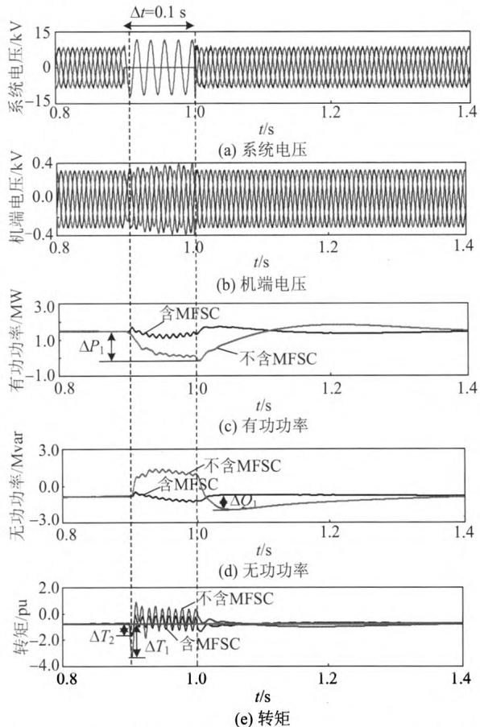  
图12含MFSC的电网不对称故障仿真波形 $(\Delta t = 0.1s)$   
Fig. 12 Simulation results of system with MFSC during asymmetric fault $(\Delta t = 0.1$ s)

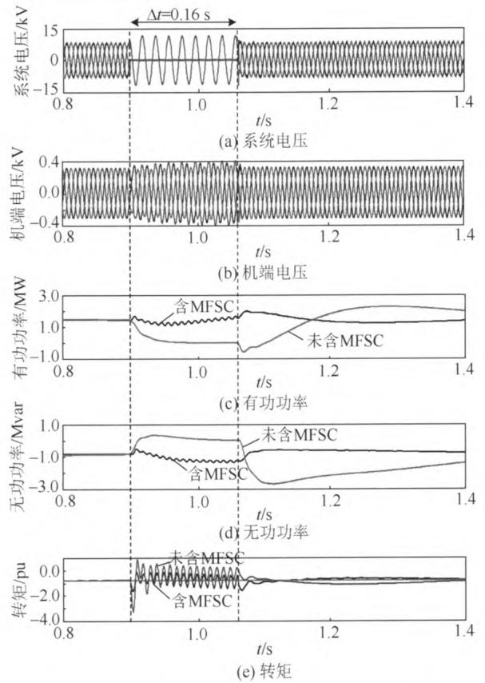  
图13含MFSC的电网不对称故障仿真波形 $(\Delta t = 0.16s)$ Fig.13 Simulation results of system with MFSC during asymmetric fault $(\Delta t = 0.16s)$

# 3）MFSC的电流限制实现仿真。

MFSC 的故障电流限制功能仿真波形如图 14 所示。0.9 s 系统发生对称三相短路故障，在故障发生时刻与故障消除时刻，风机并网点电流存在 2 个明显的冲击。MFSC 的投入能够快速限制暂态故障电流的峰值，冲击电流最大峰值降至 $0.31 \mathrm{kA}$ 左右，如图 14(a) 所示；而未含 MFSC 的系统，故障消除时刻的电流冲击达到了 $1.02 \mathrm{kA}$ ，这将对电网中串联设备造成一定危害，如图 14(b) 所示。可见，MFSC 能够对故障冲击电流起到限制作用。

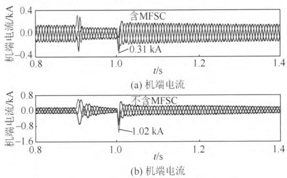  
图14 MFSC的电流限制功能仿真波形  
Fig. 14 Simulation results of the fault current-limiting function of MFSC

# 5 结论

（1）本文提出了一种适用于鼠笼异步发电机的

多功能串联补偿器，能够满足SCIG型风电场并网运行的低电压穿越需求，且该装置能够依据电网运行状态，实现电压补偿、故障电流限制等多种功能。同时，MFSC能够加速故障后系统电压的快速恢复，有利于电网稳定高效运行。

2）本文采用强制换流法保证晶闸管旁路支路迅速关断，采用电压过零法判断晶闸管短路支路完全关断，确保多种功能间的正确切换。  
3）由于MFSC综合了动态电压补偿器、故障限流器、串联阻抗补偿等多种设备功能，且切换灵活，因此更加适用于分布式电源并网运行。但考虑到电力电子器件现行发展水平，MFSC仍将主要应用于配电网系统，下一步研究重点将为MFSC设备选型及其与配电网交互影响的作用机理。

附录见本刊网络版(http://www.dwjs.com.cn/CN/volume/ current.shtml)。

# 参考文献

[1] 刘振亚，张启平，董存，等．通过特高压直流实现大型能源基地风、光、火电力大规模高效率安全外送研究[J].中国电机工程学报，2014，34(16)：2513-2522.  
Liu Zhenya, Zhang Qiping, Dong Cun, et al. Efficient and security transmission of wind, photovoltaic and thermal power of large-scale energy resource bases through UHVDC projects[J]. Proceedings of the CSEE, 2014, 34 (16): 2513-2522(in Chinese).   
[2] 艾斯卡尔，朱永利，唐斌伟.风力发电机组故障穿越问题综述[J].电力系统保护与控制，2013，41(19)：147-153.  
Aisikaer, Zhu Yongli, Tang Binwei. Summarizing for fault ride through characteristics of wind turbines[J]. Power System Protection and Control, 2013, 41(19): 147-153(in Chinese).   
[3] 张丽英，叶廷路，辛耀中，等．大规模风电接入电网的相关问题及措施[J].中国电机工程学报，2010，30(25)：1-9.  
Zhang Liying, Ye Tinglu, Xin Yaozhong, et al. Problems and measures of power grid accommodating large scale wind power[J]. Proceedings of the CSEE, 2010, 30(25): 1-9(in Chinese).   
[4] 张元栋，秦世耀，李庆，等．笼型异步风电机组低电压穿越改造方案的比较研究[J].电网技术，2013，37(1)：235-241.  
Zhang Yuandong, Qin Shiyao, Li Qing, et al. Comparative study on renovation schemes of low voltage ride through for squirrel cage induction generator wind turbine[J]. Power System Technology, 2013, 37(1): 235-241(in Chinese).   
[5] 熊良根，张建忠，程明，等．笼型异步风电机组串联耦合补偿低电压穿越研究[J].电网技术，2013，37(11)：3060-3066  
Xiong Lianggen, Zhang Jianzhong, Cheng Ming, et al. Low voltage ride-through of squirrel cage induction generator with series coupled compensation[J]. Power System Technology, 2013, 37(11): 3060-3066(in Chinese).   
[6] 洪芦诚，魏应冬，姜齐荣，等. 基于动态电压调节器的风电机组低电压穿越策略[J]. 电力系统自动化，2011，25(16)：32-37，53. Hong Lucheng, Wei Yingdong, Jiang Qirong, et al. Low voltage ride through strategy for wind turbine using dynamic voltage restorers[J]. Automation of Electric Power Systems, 2011, 25(16): 32-37, 53(in Chinese).   
[7] 关宏亮，迟永宁，戴慧珠，等. 异步风电机组接入系统的小干扰

稳定及控制[J].电力系统自动化，2008，32(4)：54-58.  
Guan Hongliang, Chi Yongning, Dai Huizhu, et al. Small signal stability and control of wind turbine with asynchronous generator integration into power system[J]. Automation of Electric Power Systems, 2008, 32(4): 54-58(in Chinese).   
[8] Holdsworth L, Wu X G, Ekanayake J B, et al. Comparison of fixed speed and doubly fed induction wind during power system disturbances[J]. IEEE Proceeding-Generation, Transmission and Distribution, 2003, 150 (33): 343-352.   
[9] 张锋，晁勤. STATCOM 改善风电场暂态电压稳定性的研究[J]. 电网技术，2008，32(9)：70-73.  
Zhang Feng, Chao Qin. Research on improving transient voltage stability of wind farm by STATCOM[J]. Power System Technology, 2008, 32 (9): 70-73 (in Chinese).   
[10] 迟永宁，关宏亮，王伟胜，等．SVC与桨距叫控制改善异步机风电场暂态电压稳定性[J].电力系统自动化，2007，31(3)：95-104. Chi Yongning, Guan Hongliang, Wang Weisheng, et al. Enhancement of transient voltage stability of induction generator based wind farm by SVC and pitch control[J]. Automation of Electric Power Systems, 2007, 31(3): 95-104(in Chinese).   
[11] 李霄，胡长生，刘昌金，等．基于超级电容储能的风电场功率调节系统建模与控制[J].电力系统自动化，2009，33(9)：86-90.  
Li Xiao, Hu Changsheng, Liu Changjin, et al. Modelling and controlling of SCES based wind farm power regulation system[J]. Automation of Electric Power Systems, 2009, 33(9): 86-90(in Chinese).   
[12] 丁理杰，杜新伟，周惟婧．SVC与STATCOM在大容量输电通道上的应用比较[J].电力系统保护与控制，2010，38(24)：77-81，87.  
Ding Lijie, Du Xinwei, Zhou Weijing. Comparison of application of SVC and STATCOM to large capacity transmission path of power system[J]. Power System Protection and Control, 2010, 38(24): 77-81, 87(in Chinese).   
[13] Abdel B O, Nasiri A. A dynamic LVRT solution doubly fed induction generators[J]. IEEE Transactions on Power Electronics, 2010, 25(1): 193-196.   
[14] Walmir F, Morelato A, Xu W. Improvement of induction generator stability using braking resistors[J]. IEEE Transactions on Power Systems, 2004, 19(2): 1247-1249.   
[15] 肖兰，赵斌，李建，等．基于串联动态制动电阻的异步风电机组暂态稳定性研究[J].可再生能源，2011，29(6)：48-52.  
Xiao Lan, Zhao Bin, Li Jian, et al. Study on transient stability of asynchronous wind turbine based on series dynamic braking resistor [J]. Renewable Energy Resources, 2011, 29(6): 48-52 (in Chinese).   
[16] Causebrook A, Atkinson D J, Jack A G. Fault ride-through of large wind farms using series dynamic braking resistors[J]. IEEE Transactions on Power Systems, 2007, 22(3): 966-975.   
[17] 汤凡，刘天琪，李兴源．通过串联制动电阻改善恒速异步发电机

风电场的暂态稳定性[J]. 电网技术，2010，34(4)：163-167.  
Tang Fan, Liu Tianqi, Li Xingyuan. Improving transient stability of wind farm consisting of fixed speed induction generator by series connected dynamic braking resistors[J]. Power System Technology, 2010, 34(4): 163-167(in Chinese).   
[18] 魏宏芬，邱晓燕，徐建，等．通过SVC和TCSC联合改善异步风电场暂态电压稳定性研究[J].可再生能源，2011，29(4)：20-23，27. Wei Hongfen，Qiu Xiaoyan，Xu Jian，etal. Study on improvement of transient voltage stability of the wind farm using SVC and TCSC [J].Renewable Energy Resources，2011，29(4)：20-23，27(in Chinese).  
[19] 王成福，梁军，孙宏斌，等．风电场混合无功功率补偿系统及其控制策略研究[J].电机与控制学报，2013，17(5)：38-44.  
Wang Chengfu, Liang Jun, Sun Hongbin, et al. Hybrid reactive power compensation system and its control strategy for wind farm[J]. Electric Machines and Control, 2013, 17(5): 38-44(in Chinese).   
[20] Shuai Z K, Yao P, Shen Z J, et al. Design considerations of a fault current limiting dynamic voltage restorer[J]. IEEE Transactions on Smart Grid, 2015, 6(1): 14-25.   
[21] 帅智康，姚鹏，涂春鸣，等．一种新型多功能电力电子限流器的工作机理及仿真分析[J].电力系统自动化，2014，38(23)：85-90. Shuai Zhikang，Yao Peng，Tu Chunming，et al.Mechanism and simulation analysis of a novel multi-functional power electronic current limiter[J].Automation of Electric Power Systems，2014，38 (23):85-90(in Chinese).  
[22] 涂春鸣，邓树，郭成，等．新型多功能固态限流器及其限流滤波器选型分析[J]. 电网技术，2014，38(6)：1634-1638.  
Tu Chunming, Deng Shu, Guo Cheng, et al. A novel multi-function solid-state fault current limiter and its analysis of current-limiting filter selection[J]. Power System Technology, 2014, 38(6): 1634-1638(in Chinese).   
[23] 李生虎. 风力发电系统分析[M]. 北京：科学出版社，2012：61-70.

  
姜飞

收稿日期：2015-04-28。

作者简介：

姜飞(1985)，男，博士研究生，研究方向为电力电子技术在电力系统中的应用、配电网电气节能技术，E-mail: jiamg85521@126.com;

涂春鸣(1976)，男，博士，教授，博士生导师，研究方向为电力电子技术在电力系统中的应用；

帅智康(1982)，男，博士，教授，博士生导师，

研究方向为电力电子技术在电力系统中的应用；

侯尊(1989)，男，硕士研究生，研究方向为电力电子技术在电力系统中的应用。

（责任编辑 徐梅）