# A Hybrid Simulation Tool for the Study of PV Integration Impacts on Distribution Networks

Ali Hariri, Student Member, IEEE, M. Omar Faruque, Senior Member, IEEE

Abstract—This paper introduces a hybrid simulation tool that is used to study the impacts of integration of photovoltaic (PV) systems on distribution networks. The tool is composed of an electromagnetic transient (EMT) simulation tool interfaced with an open-source phasor analysis tool, OpenDSS. The purpose of this tool is to provide detailed modeling along with fast and accurate simulation of electric systems with interconnected PV systems. The developed tool models the PV energy system using detailed EMTP-type algorithms, while the rest of the distribution system is modeled in phasor domain using OpenDSS. This paper demonstrates some of the functions, applications, and advantages of the hybrid tool. The tool has been tested with a real Florida-based distribution feeder with multiple PV energy systems. A full EMT model of the feeder has been developed in SimPowerSystems to compare and validate the results. The results suggest that the hybrid tool offers significant benefits and functionality over OpenDSS.

Keywords—Electromagnetic transients, Power system simulation, Photovoltaic systems, Photovoltaic effects.

# I. INTRODUCTION

Power system simulations have always faced computational limitations due to the volume of the required mathematical operations, especially in complex networks [1]. Different computational tools and techniques have been developed to address these constraints [1]. The selection of a suitable simulation tool is generally dictated by the type of the study to be conducted. While quasi-static time-series (QSTS) simulation is the most frequently used technique for integration of distributed generation (DG) studies, the need for detailed study using EMT simulation is growing due to the complex dynamics introduced by the DG.

EMT simulation using digital computers was first set forth by H. W. Dommel [2] and it has been traditionally applied to power system transient analysis in circuits involving switching events. EMT simulation tools provide accurate results, but they introduce some restrictions on the size of the modeled system and the simulation time-step. EMT simulation of modern power electronic-based DG requires time-steps in the range of a few microseconds or less. This makes the EMT simulations computationally intensive, requiring both large processing power and long simulation time.

QSTS simulation produces sequential steady state power flow solutions where the converged state of one iteration is used as the initial state of the next [3]. The accuracy of the QSTS analysis depends on the time period between the steady state power flow solutions and the settling time after a dynamic

event occurs. QSTS simulations are phasor-based solutions that are much faster and require less computational power than EMT simulations. Consequently, QSTS simulation has gained acceptance as a way to study the preliminary impacts of DG integration.

EMT simulation is required for protection design, insulation coordination, fault rating, converter design, islanding detection, etc. On the other hand, QSTS simulations can be used for voltage regulation studies, reactive power management, storage management, etc. For this purpose, it is not always necessary to simulate the entire system in EMT; only the parts that require detailed study would require EMT simulation. Therefore, a hybrid simulation tool would be very useful to perform different types of studies where EMT is adopted with QSTS for certain parts of the network.

The concept of hybrid simulation is based on splitting the system into two subsystems modeled in different simulation engines based on the accuracy requirements of each part. The first digital hybrid simulator was proposed in 1981 by Heffernan et al. for AC/DC system simulation through combining transient stability analysis (TSA) and EMT programs [4]. Hybrid simulators involving TSA and EMT were first introduced for the analysis of power systems with high voltage direct current (HVDC) links [5]. Different hybrid tools were then developed to study transients in power systems involving flexible AC transmission system (FACTS) devices [6], static VAR compensator (SVC) devices [7], and HVDC systems [8], [9]. The development of hybrid simulation tools was accompanied with advancements in research areas that would help improve the accuracy and speed of hybrid simulation, for instance, in introducing frequency-dependent network equivalents [10], [6] and improving network equivalent circuits for specific applications [11]. Other improvements focused on the data interaction protocols [12], [13] such as introducing the parallel interaction protocols [14]. The most recent advancements in hybrid simulation still mainly focus on HVDC systems using EMT-TS simulation platforms [13]. Some recent work has introduced a relaxation approach for co-simulation of EMT and phasor models that is mainly concerned with transmission systems [15]. Moreover, with the advancement of real-time simulation, some real-time hybrid simulators and techniques are being researched [16]-[18]. Nearly all of these tools are developed for transmission line analysis.

Hybrid simulation has not been applied yet to DG interconnection studies. There is a great potential for applying hybrid simulation to PV impact studies. Currently, there are no hybrid simulation tools dedicated for PV penetration studies in distribution networks. This paper proposes a tool that integrates EMT and phasor solvers to perform QSTS and EMT-type

studies simultaneously. This tool allows the simulation of relatively large distribution systems with high PV penetration. The suggested hybrid tool provides detailed information about the behavior of the PV up to the point of common coupling (PCC). The tool also offers faster simulation time and less computational complexity compared to a full blown EMTP solution.

This paper is organized as follows: Section II discusses the need for the application of hybrid simulation in PV impact studies. Section III introduces the development of the proposed hybrid tool. Section IV focuses on testing the tool under different scenarios and case studies. A comparison of solution accuracy and simulation time will be presented by comparing with a detailed EMT model that is simulated entirely in SimPowerSystems.

# II. THE NEED FOR HYBRID SIMULATION IN PV IMPACT STUDIES

The introduction of PV systems on the distribution side is expected to have potential impacts on the network [19]. Some of these impacts require EMT simulation with a very small time-step; while other impacts have slower dynamics and could be analyzed with larger time-steps. For instance, PV impacts on power quality such as harmonic distortion [20], resonance [21], and voltage sag [22], [23] require EMT studies with high accuracy to represent high frequency dynamics. Moreover, EMT is also important for testing voltage and active/reactive power control algorithms using smart inverters which is an important approach for networks with high PV penetration [24], [25]. On the other hand, QSTS simulation is sufficient for studying voltage fluctuation and flicker [3] caused by variations in the PV system output. It is also used for studying impacts on voltage regulation devices [26] and many other phenomena. It is clear that the potential impacts span a wide range of impacts on a varying time scale.

EMT simulation offers the required accuracy, while, QSTS is adequate for studying some PV impacts caused by the variation in PV generation since it can capture slow dynamics. In [20], impacts on power quality were studied using an EMT tool, where a one hour off-line simulation required four hours of simulation time with 2µs time-step. In [26], impacts on voltage regulation devices were studied using QSTS simulation that took thirty minutes simulation time to simulate one week’s worth of data with fifteen minute intervals. This shows the effect of the simulation type and time-step size on the simulation time. Therefore, a hybrid simulation tool is important for multi-rate simulations that could optimize the simulation time. Table I shows a quick summary and comparison of the main types of simulations involved in the development of this hybrid simulation tool.

Some commercial software companies are starting to gain interest in multi-rate hybrid co-simulation techniques and algorithms. For instance, PSCAD-PSS/E co-simulation module from E-TRAN Plus was developed to allow the interface between PSCAD, an EMT tool, and PSS/E, a TS tool. However, this module employs a parallel processing interaction protocol that works mainly for transmission systems where

TABLE I. COMPARISON OF SIMULATION TYPES   

<table><tr><td>Simulation type</td><td>Advantages</td><td>Disadvantages</td></tr><tr><td>QSTS</td><td>Fast 
Captures slow dynamics</td><td>Does not capture fast transients</td></tr><tr><td>EMT</td><td>Accurate 
Captures fast transients</td><td>Long simulation time 
Computationally exhaustive</td></tr><tr><td>Hybrid</td><td>Faster than EMT 
Captures fast local dynamics</td><td>Slightly lower accuracy than EMT</td></tr></table>

the simulations are separated at transmission line boundaries to run at multiple processors [27]. DIgSILENT PowerFactory has developed interfaces that a user could take advantage of for cosimulation (Matlab/Simulink, DLL, OPC, RCOM, API, etc.) [28]. However, neither tool is made to handle large distribution level systems with high PV penetration.

Currently, there is no simulation tool available that can be used to do both studies at the same time while offering reasonable accuracy and simulation speed. The hybrid simulation divides the network into two parts. It assigns the appropriate simulator to the respective zone based on the model accuracy and time-step [12]. This type of simulation will be very useful in PV integration studies that use multi-rate timesteps due to the inefficiency of using a single time-step for the entire simulation. In this technique, some parts of the system that require detailed study (in this case the grid-tied PV system) will be solved using a small time-step, while other parts (distribution system) will be executed using a larger time-step. Hybrid simulation is very important for analyzing large systems with high PV penetration that could be timeconsuming and computationally expensive to fully simulate in EMT. This paper applies the concept of hybrid simulation to develop a tool that is capable of performing QSTS and EMT studies at the same time. The tool offers faster simulation and very good accuracy compared to EMT simulation (as shown in Section IV).

# III. DEVELOPMENT OF THE HYBRID SIMULATION TOOL

# A. Generalized Approach of Hybrid Simulation

The hybrid tool interfaces an EMT tool with a phasor tool. The EMT tool solves the time-domain differential equations using the difference equations (discrete-time domain) approach with a very short time-step. The phasor tool uses phasor representation at fundamental frequency and solves the power flow equations sequentially at a larger time-step. A specific interface protocol governs the exchange of data between the two simulations to ensure accuracy of results. Fig. 1 shows the generalized structure of a hybrid tool that interfaces Matlab and OpenDSS. Fig. 2 summarizes the generalized approach of the flow of the hybrid simulation that employs a serial interface platform.

# B. Specific Application of Hybrid Simulation

The developed tool is built to specifically handle PV impact studies in distribution networks. It consists of a detailed EMT model of a grid-tied PV system interfaced with a phasor model of a distribution network built in OpenDSS. The tool can support multiple PV systems with no restrictions on the size

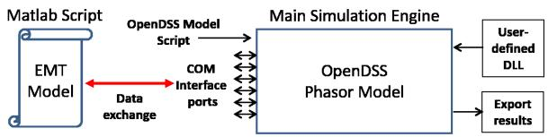  
Fig. 1. Generalized structure of a Matlab-OpenDSS hybrid simulation tool

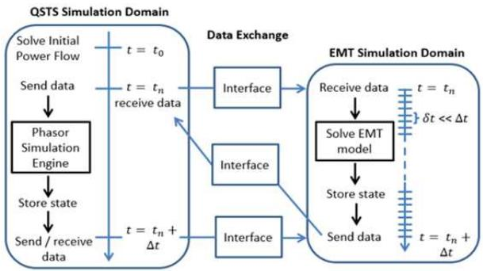  
Fig. 2. Generalized hybrid simulation flow chart with serial interface

of the distribution network since it is solved in OpenDSS. Moreover, the tool supports the solution of both balanced and unbalanced systems since OpenDSS can also support both types of systems. The following subsections will discuss the three main parts that constitute this hybrid tool: (1) the detailed EMT model of the grid-tied PV system, (2) the phasor model of the distribution network modeled in OpenDSS, (3) and the interface section where the two models exchange data. Fig. 3 shows the concept of the developed hybrid simulation tool.

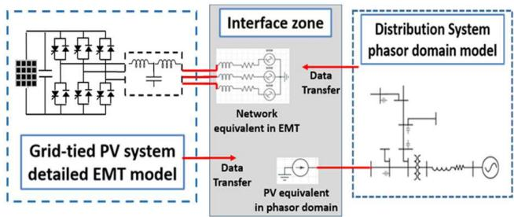  
Fig. 3. Top-level interface diagram of the hybrid simulation tool

C. Discrete-time Modeling of the Grid-tied PV System and its Implementation in MATLAB

The modeled PV system shown in Fig. 4 is composed of a PV array with maximum power point tracking (MPPT) control, a capacitor at the DC link, a three phase pulse width modulated (PWM) voltage source inverter (VSI) with decoupled control scheme, LCL filter, and the grid equivalent model. All elements are modeled in details for the EMT simulation. The time domain equations are discretized and solved using specific discretization techniques. Discrete-time models are used to approximate the continuous-time equations that describe the

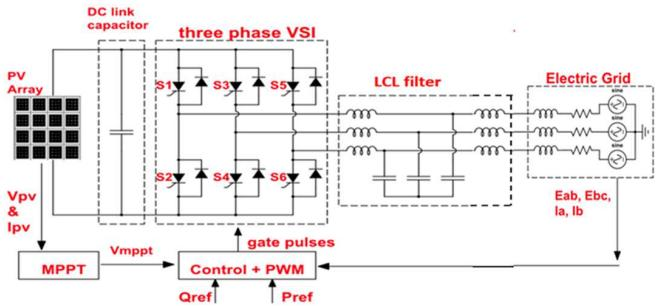  
Fig. 4. Grid-tied PV system modeled in EMT-domain

dynamics of the power system. The discretization technique implemented in this tool uses the trapezoidal rule.

# 1) Modeling of PV Array

PV array models vary depending on the required level of accuracy and detail for a specific application or study. One of the most commonly adopted models in engineering practice and system level studies is the five-parameter model [29]. This hybrid tool is meant to be easily tuned for different ratings for realistic studies. Therefore the model adopted in this tool is a mathematical model based on [30] which utilizes data available from the manufacturer datasheet. The model is described by the following mathematical expressions:

$$
i _ {p v} (t) = I _ {s c} ^ {\prime} \left[ 1 - C _ {1} \left(\exp \left(\frac {v _ {p v} (t)}{C _ {2} V _ {o c} ^ {\prime}}\right) - 1\right) \right] \tag {1}
$$

Where $C _ { 2 }$ and $C _ { 1 }$ are defined as:

$$
C _ {2} = \left(\frac {V _ {m} ^ {\prime}}{V _ {o c} ^ {\prime}} - 1\right) \left[ L n \left(1 - \frac {I _ {m} ^ {\prime}}{I _ {s c} ^ {\prime}}\right) \right] ^ {- 1} \tag {2}
$$

$$
C _ {1} = \left(1 - \frac {I _ {m} ^ {\prime}}{I _ {s c} ^ {\prime}}\right) e x p \left(\frac {- V _ {m} ^ {\prime}}{C _ {2} V _ {o c} ^ {\prime}}\right) \tag {3}
$$

These equations capture the changes in the weather irradiance and temperature through $V _ { m } ^ { \prime } , V _ { o c } ^ { \prime } , I _ { m } ^ { \prime }$ and $I _ { s c } ^ { \prime }$ which are PV cell parameters calculated for the actual physical conditions according to the following relations:

$$
V _ {m} ^ {\prime} = V _ {m} \left(1 + c \left(T - T _ {r e f}\right)\right) L n \left(1 + b \left(\frac {W}{W _ {r e f}} - 1\right)\right) \tag {4}
$$

$$
V _ {o c} ^ {\prime} = V _ {o c} \left(1 + c \left(T - T _ {r e f}\right)\right) L n \left(1 + b \left(\frac {W}{W _ {r e f}} - 1\right)\right) \tag {5}
$$

$$
I _ {m} ^ {\prime} = I _ {m} \left(1 + a \left(T - T _ {r e f}\right)\right) \frac {W}{W _ {r e f}} \tag {6}
$$

$$
I _ {s c} ^ {\prime} = I _ {s c} \left(1 + a \left(T - T _ {r e f}\right)\right) \frac {W}{W _ {r e f}} \tag {7}
$$

Where $V _ { m } , \ V _ { o c } , \ I _ { m }$ and $I _ { s c }$ are the maximum voltage at reference operating point, open-circuit voltage, maximum current at reference operating point, and short-circuit current respectively, and are available from the manufacturer catalogue. $\dot { T }$ and $\breve { W }$ are the physical temperature and irradiance while $T _ { r e f }$ and $W _ { r e f }$ are the reference values. Finally, $( a , b , c )$ are constants obtained experimentally and are tested in [30].

# 2) Modeling of DC Link Capacitor

The DC link capacitor links the PV array to the inverter DC input. This capacitor serves to minimize the ripple in the DC voltage and is controlled to keep the DC voltage $( v _ { d c } ( t ) )$ 号 constant. The discrete-time equation of the current passing through a capacitor $( i _ { c a p } ( t ) )$ , with δt being the time-step, is given by 8:

$$
i _ {c a p} (t) = \frac {2 C}{\delta t} \left[ v _ {d c} (t) - v _ {d c} (t - \delta t) \right] - i _ {c a p} (t - \delta t) \tag {8}
$$

# 3) Modeling of Three-Phase VSI with Decoupled Control and PWM Signal Generation

A three-phase VSI is used to connect the DC output of the PV to the AC side of the grid. The developed model is a detailed switching model based on switching functions that account for the switching events in digital simulation. The modeled inverter is a two-level, three-phase inverter as shown in Fig. 4. In this model, the switching devices are gate driven devices assumed to be ideal i.e., switches have zero ”on” resistance and infinite ”off” resistance and have zero turnon and turn-off times. The technique used for handling the switching events is a fixed time-step digital simulation similar to those implemented in EMTP programs. The advantage of this technique is that it is easy to implement. However, the drawback is that the events that occur between two time-steps are accounted for at the next step. This might introduce some errors due to the delayed switching which can be reduced by using smaller time-steps.

The controller adopted is a very common decoupled control scheme presented and explained thoroughly in [31]. Other new schemes are being developed based on new advancements and applications [32]. The scheme is based on the representation of the Park dq-transform of the AC side inverter voltage as: $E _ { d } ~ = ~ m _ { a } \bar { v } _ { d c } c o s ( \delta )$ and $E _ { q } ~ = ~ m _ { a } v _ { d c } s i n ( \delta )$ where δ and $m _ { a }$ can be controlled separately. The controller produces the desired reference signals used to generate the inverter gate switching patterns. The implemented control algorithm is shown in Fig. 5. It controls the d-q components of the inverter current (real and reactive power) and regulates the DC bus voltage. An MPPT algorithm based on the incremental conductance method is integrated with the inverter control in order to avoid an extra DC-DC converter stage. The DC voltage is thus controlled to follow the voltage of the maximum operating point at any given condition. Coordinate transformation from abc to dq frame of the measured quantities ensures a decoupled control scheme. Sinusoidal PWM (SPWM) is achieved by comparing the low frequency sinusoidal modulating signals to a high frequency carrier triangular signal. The sampling technique in [34] is used to generate the firing pulses of the switching gates. It comprises of computing the intersection points of the two signals in each controller sampling period rather than comparing the two signals at every time-step. This technique shown in Fig. 6 offers faster solutions and less computations since the control loop calculations are performed at every controller sampling time rather than at every time-step. Where $t _ { d o w n }$ and $t _ { u p }$ are the switching times [33]:

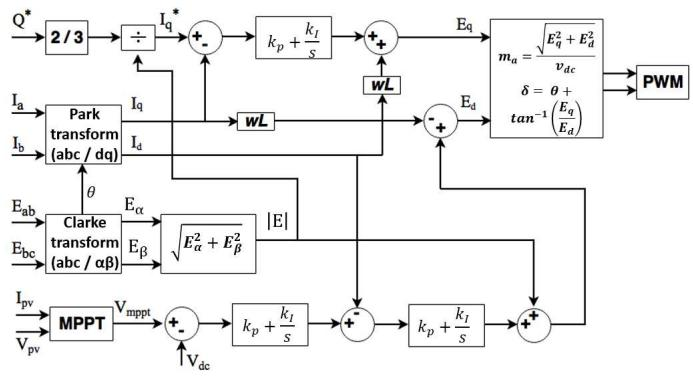  
Fig. 5. Control scheme for the PV plant

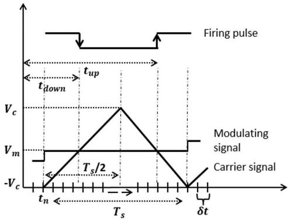  
Fig. 6. SPWM digital implementation

$$
t _ {d o w n} = t _ {n} + \frac {T _ {s}}{4 V _ {c}} (V _ {m} + V _ {c}) \tag {9}
$$

$$
t _ {u p} = t _ {n} + T _ {s} - t _ {d o w n} \tag {10}
$$

# 4) Modeling of the AC Network Side

The PV system is connected to the grid through an LCL filter. The grid is represented by a Thevenin equivalent circuit composed of a series impedance and an AC voltage source. The LCL filter is used to filter out high frequency harmonics in the inverter output signals that are introduced by the PWM switching actions. The LCL filter design implemented in this case is based on [35].

Since the model is assumed to be balanced and wye connected, the derivation of AC system equations is performed for a single phase and then duplicated for the other phases with the consideration of the phase angle shift. The AC network single phase representation is shown in Fig. 7

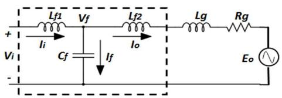  
Fig. 7. Per-phase inverter AC-side network diagram with LCL filter

The network presented in Fig. 7 consists of interconnections of passive electric elements that are assumed to be linear. The EMT solution of such networks is based on Kirchhoff’s current and voltage laws, KVL and KCL. The time-domain expressions of the branch currents are derived using KVL. Trapezoidal integration rule is used to discretize the timedomain equations over a very small time-step of δt. The resulting current equations are shown below:

$$
\begin{array}{l} i _ {i} (t) = i _ {i} (t - \delta t) + \frac {\delta t}{2 L _ {f 1}} \left[ v _ {i} (t) + v _ {i} (t - \delta t) \right. \tag {11} \\ \left. - v _ {f} (t) - v _ {f} (t - \delta t) \right] \\ \end{array}
$$

$$
i _ {f} (t) = - i _ {f} (t - \delta t) + \frac {2 C _ {f}}{\delta t} [ v _ {f} (t) - v _ {f} (t - \delta t) ] \tag {12}
$$

$$
\begin{array}{l} i _ {o} (t) = \left(A _ {2}\right) i _ {o} (t - \delta t) + \left(A _ {1}\right) \left[ v _ {f} (t) + v _ {f} (t - \delta t) \right. \tag {13} \\ \left. - e (t) - e (t - \delta t) \right] \\ \end{array}
$$

where A1 = (1+ Rδt ) δt2L 2L , $\begin{array} { r } { A _ { 2 } \ = \ \frac { \left( 1 - \frac { R \delta t } { 2 L } \right) } { \left( 1 + \frac { R \delta t } { 2 L } \right) } } \end{array}$ (1− Rδt ) and ${ \cal L } = { \cal L } _ { f 2 } + { \cal L } g$ . Applying KCL:

$$
i _ {i} (t) = i _ {o} (t) + i _ {f} (t) \tag {14}
$$

Substituting (11), (12) and (13) into (14) to get the expression of $v _ { f } ( t ) { : }$ :

$$
\begin{array}{l} v _ {f} (t) = \left(1 / A _ {3}\right) \left[ i _ {i} (t - \delta t) + i _ {f} (t - \delta t) - (A 2) i _ {o} (t - \delta t) \right. \\ + \frac {\delta t}{2 L _ {f 1}} [ v _ {i} (t) + v _ {i} (t - \delta t) ] \\ + (A _ {4}) v _ {f} (t - \delta t) + (A _ {1}) [ e (t) + e (t - \delta t) ] ] \tag {15} \\ \end{array}
$$

where, A3 = $\begin{array} { r } { A _ { 3 } = \frac { \delta t } { 2 L _ { f 1 } } + \frac { 2 C _ { f } } { \delta t } + A _ { 1 } } \end{array}$ 2Lf1 2Cf and $\begin{array} { r } { A _ { 4 } = \frac { 2 C _ { f } } { \delta t } - \frac { \delta t } { 2 L _ { f 1 } } - A _ { 1 } } \end{array}$ 2Lf1 − A1.

# D. Modeling of Distribution Systems Using OpenDSS

OpenDSS is used to run the power flow solutions of the QSTS simulation. OpenDSS is an open-source distribution system simulator that is mainly used to perform steady-state analysis in the frequency domain [36]. It has a component object model (COM) server dynamic linked library (DLL) that allows it to be driven from external software [36]. This software is designed to support DG interconnection analysis and large distribution network studies.

OpenDSS can be used to perform power flow simulations, fault studies, limited dynamic simulations and harmonic flow analysis. The fault study calculates the root mean square (RMS) values of voltages and fault currents. The dynamic simulation is comprised of limited electromechanical transients described by a simple single-mass swing equation generator model. The harmonic analysis is done by defining a harmonic spectra that includes the harmonics of interest. The harmonic spectra are then associated with the harmonic sources in the feeder, and then OpenDSS solves for each frequency in the defined spectra.

OpenDSS has a lot of capabilities and advantages over traditional frequency domain software. However, because OpenDSS is not an EMT solver, the harmonic analysis requires the user to define a specific frequency spectrum, while the dynamic

analysis is confined to the generator model swing equation. Therefore, OpenDSS and other transient stability programs often do not support islanding detection studies for inverterbased DG such as PV systems, as well as protection device testing and power quality related harmonic studies.

# E. Matlab-OpenDSS Interface

A crucial part of the hybrid simulation is the interchange of information between the two simulation domains. This interface is governed by the following tasks:

# 1) Selection of the interface bus:

Choosing the interface bus location is determined by the part of the system that requires detailed study. The further the interface bus is in the network, the more complex the EMT part becomes. In this hybrid simulation tool, the grid-tied PV system is the part required for EMT simulation. Therefore, the interface bus is chosen to be at the PCC where the PV system is connected to the network. However, it is possible to extend the scope of the EMT model beyond the PCC if needed.

# 2) Modeling of the equivalent systems:

In a hybrid simulation, the EMT part and the phasor part are solved separately. Therefore, each part has to be represented to the other by an equivalent that replicates the characteristics of that part [12]. The accuracy of the equivalent model is reflected in the accuracy of the overall results of the hybrid tool. The first hybrid tool [4] used a fundamental frequency Norton equivalent circuit for the detailed model. Then the same Norton equivalent circuit was used in [8] and was found to be relatively accurate. A more accurate approach would be to use a Frequency-Dependant Norton Equivalent (FDNE) [12]. In this tool, a fundamental frequency Thevenin equivalent circuit composed of an R-L impedance in series with a voltage source is used to represent the external network. This equivalent was found to be satisfactory for the purpose of the conducted studies. The EMT model of the PV system is represented in the phasor domain by a generator injecting a certain real and reactive power which is sufficient for QSTS studies [26].

# 3) Selection of the exchanged data variables:

The data required for building each of the equivalent systems needs to be exchanged between the two simulation platforms. The Thevenin equivalent circuit representing the grid requires the RMS voltage at the PCC and the resistance and inductance values of the series impedance. The network impedance values of the Thevenin equivalent circuit are calculated by executing a power flow in fault mode before the simulation starts in OpenDSS. This allows OpenDSS to calculate the network impedance as seen from the fault location, which in this case is the PCC. Thus, the network equivalent resistance (in ohms) and inductance (in Henry, H) are then extracted from OpenDSS through the COM interface and are fed into the EMT equivalent model. The RMS value of the voltage is then

calculated with every time-step and fed into the Thevenin equivalent during the data exchange. It is important to note that the QSTS simulation time-step ∆t is a multiple of the fundamental frequency period, i.e. $\Delta t ~ = ~ n T _ { f }$ . The data required to be transferred to the phasor equivalent of the PV system in OpenDSS are the RMS values of the real (kW) and reactive (kVAr) power for the given time period. Therefore, at every $\Delta t$ time-step, the RMS values of the real and reactive power of the previous time-step are calculated in the EMT tool and are sent through the COM interface to update the PV generator output values in OpenDSS.

# 4) Interaction protocol governing the data exchange:

The data transfer occurs at the end of the larger time-step (∆t). A thorough review of the several protocols that have been presented in literature is discussed in [12]. The protocols are divided into serial and parallel. The data exchange protocol used in this tool is shown in Fig. 8. In this tool, a serial protocol is implemented where only one of the QSTS or EMT simulations executes at each time instant while the other is idle [12]. This approach does not require synchronization. The interface steps are illustrated below:

1) Solve power flow in OpenDSS and transfer data to EMT at $t _ { 0 }$ .   
2) Execute EMT simulation from $t _ { 0 }$ to $t _ { 1 }$ using time-step δt.   
3) Transfer data back to OpenDSS.   
4) Execute QSTS simulation from $t _ { 0 }$ to $t _ { 1 }$   
5) Solve power flow in OpenDSS at $t _ { 1 }$ and transfer data to EMT for the next step calculations.   
6) the same process is repeated till $t _ { n } .$

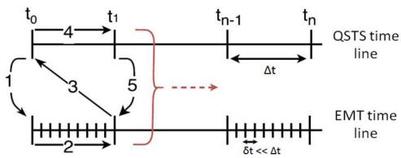  
Fig. 8. Data exchange time line for the hybrid tool

A graphical user interface (GUI) has been developed to facilitate the use of the hybrid tool [37]. The user can enter the required ratings for the PV system and choose the OpenDSS file where the distribution network is modeled. Moreover, the interface allows the user to execute different studies and load the output data and plot the necessary outputs.

# IV. TESTING AND VALIDATION OF THE TOOL: CASE STUDIES

This section presents the output results of three case studies: (1) steady state analysis, (2) fault study, and (3) islanding detection. All studies were performed on a realistic distribution network with three PV systems connected at different locations to demonstrate the ability of the tool to handle high PV penetration. Moreover, the results were validated against a full

EMT model of the distribution network with switching models of the PV systems implemented in SimPowerSystems.

# A. Modeling of the Distribution Network

The feeder model is a reduced model of an unbalanced Florida-based utility feeder model. The feeder is modeled in phasor-mode using OpenDSS and in detailed EMT-mode using SimPowerSystems. The reduced model was tested, validated and released as part of a Departmetn of Energy (DOE) funded project, Sunshine State Grid Initiative, at the Center for Advanced Power Systems. Fig. 9 shows the diagram of the unbalanced feeder model. The feeder primary voltage is

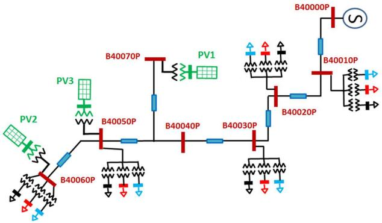  
Fig. 9. Diagram of the test feeder

12.47kV with a peak loading of around 1MV A. Three PV systems with a total rating of 150kW were connected to the feeder at the locations shown in Fig. 9. This feeder is modeled using OpenDSS and interfaced with three PV systems modeled in the EMT tool for the hybrid simulation. The same system was also modeled using SimPowerSystems for the full blown EMT simulation. The EMT simulation time-step δt must be at least 50 to 100 times smaller than the controller sampling $T _ { s }$ for accurate results [33]. For a 1kHz switching frequency, the EMT time-step is chosen to be $\delta t = 5 \mu s$ , and the QSTS simulation is solved with a $\Delta t = 5 0 m s$ time-step.

# B. Steady State Analysis

The steady-state analysis is performed using both the hybrid tool and the SimPowerSystems tool. The validation of the tool is done by comparing the voltage and current signals produced by both simulations, as well as frequency spectrum and total harmonic distortion (THD) levels of the signals. Fig. 10 shows the phase A currents at the output of the inverter for all three PV systems found from the two simulations. It shows that the inverter AC current signals match with negligible error in terms of phase-shift and magnitude. Fig. 11 shows the frequency spectrum of the currents of Fig. 10. It shows that the inverter currents from both simulations have the same frequency components and very close THD levels. Similar comparisons are shown in Fig. 12 and Fig. 13 which show matching results in the PCC voltage and current with negligible errors in phase and magnitude.

A major advantage of the hybrid tool is that it is able to show the exact harmonics injected by the inverter current which would not be possible by using only OpenDSS or any other phasor-based tool. The comparison of the results show that the hybrid tool accurately replicates the results of the EMT simulation with less model complexity and faster simulation time. Table II shows the total simulation time required to finish a four seconds simulation. The hybrid tool reduces the simulation time by almost 83%, from 19 minutes to almost 3 minutes. This becomes especially important when the feeder size grows larger and when more PV systems are added.

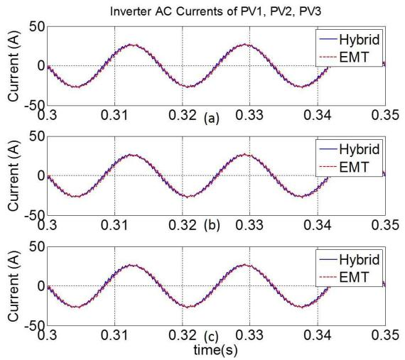  
Fig. 10. Phase A inverter output currents at steady state for (a) PV1, (b) PV2, (c) PV3

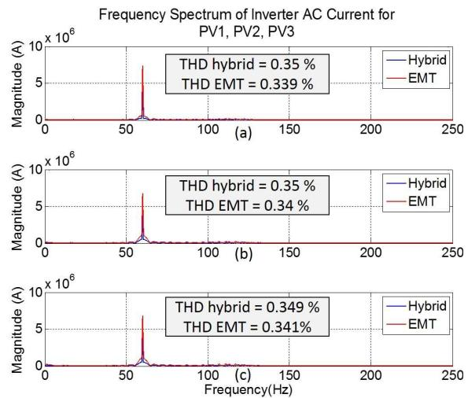  
Fig. 11. Frequency spectrum of inverter currents at steady state for (a) PV1, (b) PV2, (c) PV3

TABLE II. COMPARISON OF SIMULATION TIME   

<table><tr><td></td><td>EMT</td><td>Hybrid Tool</td></tr><tr><td>time</td><td>19 minutes,</td><td>3 minutes, 10 seconds</td></tr></table>

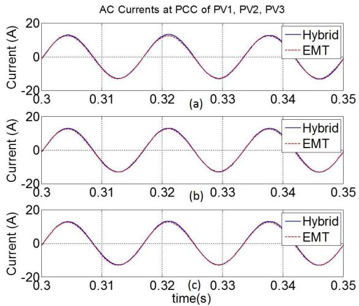  
Fig. 12. Phase A current at the PCC at steady state for (a) PV1, (b) PV2, (c) PV3

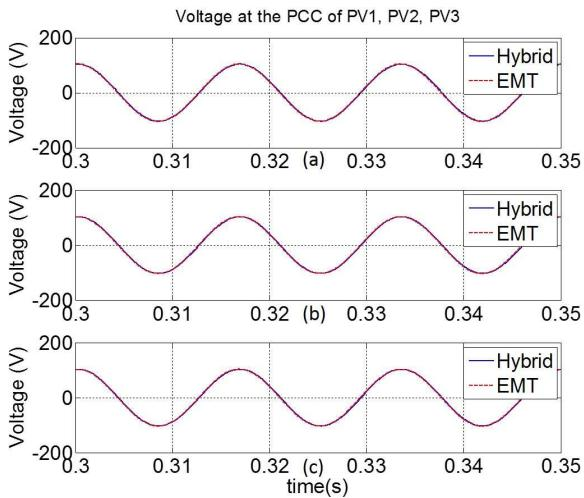  
Fig. 13. Phase A voltage at the PCC at steady state for (a) PV1, (b) PV2, (c) PV3

# C. Fault Study

A three-phase bolted fault at bus B40050 where PV3 is connected is simulated at t = 1s lasting for 0.2 seconds. The same fault is simulated using a full EMT model and the hybrid tool. Fig. 14 shows the voltage at the PCC for all three PV systems. Fig. 15 shows the output currents of all PV systems. Both Fig. 14 and Fig. 15 show that the results match with high accuracy before and after the fault. During the fault, a small phase shift of 0.00648 degrees appears in the voltage, and a phase shift of 0.1296 degrees appears in the current leading to minor difference during the transient. It is important to stress again that these results cannot be obtained using OpenDSS or another transient stability program alone, and that the results show a very good level of accuracy.

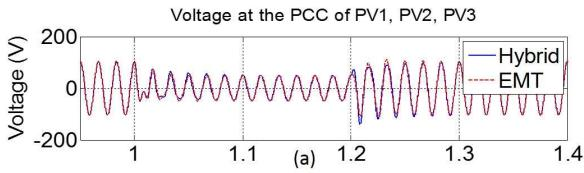

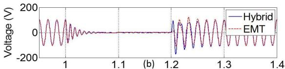

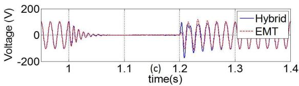  
Fig. 14. Phase A voltage at the PCC during a fault for (a) PV1, (b) PV2, (c) PV3

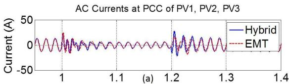

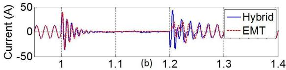

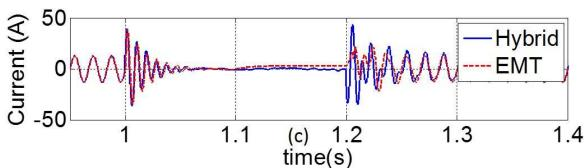  
Fig. 15. Phase A current at the PCC during a fault for (a) PV1, (b) PV2, (c) PV3

# D. Islanding Detection

A thorough discussion of the application of this hybrid tool to islanding detection has been presented in [38] where this tool has also been validated using a different distribution system. In this case, an island is created by disconnecting a switch at bus B40050P leaving PV2 and PV3 in an islanded mode. A passive detection method (Harmonic Detection) is implemented for all the PV systems. This method monitors the THD of the voltage at the PCC and disconnects the PV system if the THD exceeds a certain threshold. This method requires an EMT simulation for accurate results in order to precisely capture the harmonic components in the system. OpenDSS does not have the capability to implement this type of study for inverter-based DG at the moment [38]. Therefore, the hybrid tool developed in this paper provides a methodology to accurately perform islanding detection studies without having to resort to EMT tools.

The island is created at time t = 1s. Fig. 16 shows that at the time the island happens, the THD levels for PV2 and PV3 increase beyond the 5% allowed limit. This increase in THD is detected by the harmonic detection method and thus PV2 and PV3 are disconnected while PV1 remains active since it is not connected to the islanded region as shown in Fig. 17. Fig. 17 shows the behavior of the output current in all three PV systems compared to the full EMT model. As in the previous cases, the results provided accurate representation of the EMT behavior.

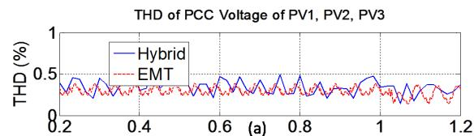

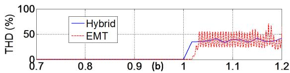

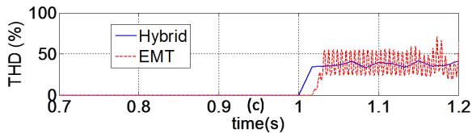  
Fig. 16. PCC voltage THD level during islanding for (a) PV1, (b) PV2, (c) PV3

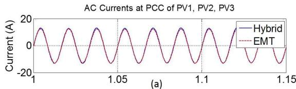

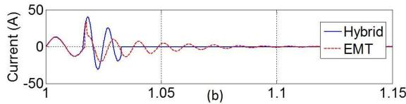

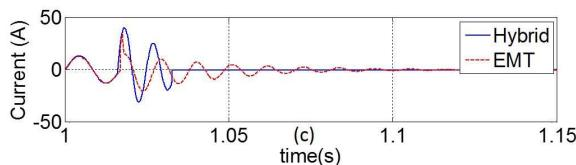  
Fig. 17. Phase A current at the PCC during islanding for (a) PV1, (b) PV2, (c) PV3

In summary, this section presented the validation and application of the tool. The validation was done by comparing the performance of the tool with a full EMT model built in SimPowerSystems. The criteria for validation is comparing the time-domain waveforms of voltages and currents, as well as the frequency domain behavior through frequency spectrum

plots and THD calculation. The case studies included a steady state normal operation, fault case, and an islanding case to test and validate the behavior of the tool under fast transient operations and highlight the advantages that are not present in TS and phasor tools.

# V. APPLICATION TO A LARGE DISTRIBUTION NETWORKS

This section presents the use of the tool in a large network simulation. The objective is to show the advantages that the tool offers which are not possible using OpenDSS nor feasible with any EMT-type tool. For this purpose, the IEEE 8500 node unbalanced system is used and modeled in OpenDSS. Two PV systems located at different locations were added to the system. Fig. 18 (a) shows the current injected by PV1 inverter, (b) shows the PV1 voltage at the primary side of the transformer, (c) shows the current injected by PV2 inverter, and (d) shows the PV2 AC side voltage. All quantities are for phase A. It is very time consuming to model the full IEEE 8500 node system in EMT and compare with the hybrid tool results. However, it is important to note that this one second simulation took only one minute eleven seconds to simulate in the hybrid tool. This shows the scale of the advantages the tool offers when the network contains thousands of nodes with multiple PV systems. Existing tools do not offer this benefit.

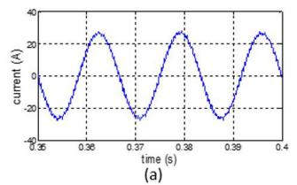

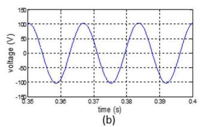

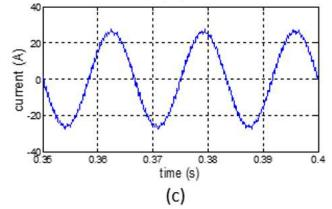

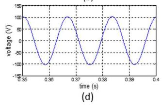  
Fig. 18. IEEE 8500 node system steady state results (a) PV1 inverter current, (b) PV1 AC voltage, (c) PV2 inverter current, (d) PV2 AC voltage

# VI. CONCLUSIONS

This paper presented the development of a hybrid simulation tool that interfaces a phasor-based simulation tool, OpenDSS with an EMT-type simulation of a detailed PV system using Matlab scripts. The tool is validated using a detailed model developed in SimPowerSystems tool. The comparison of results showed a very good agreement between the two simulations. The tool proved to be much faster than a full EMT tool since the majority of the network is modeled in phasor domain using OpenDSS. Moreover, the tool was used to perform a fault study and an islanding detection study to show the various applications and advantages of this tool. Those studies cannot be done using only OpenDSS which gives this tool extra advantage over phasor-based tools. Other than

the applications implemented in this paper, the tool can also be used for power quality studies, testing control algorithms, unbalanced faults analysis, voltage regulation studies, impact studies for large systems with high PV penetration, etc. Future work will include the application of the tool to various types of renewable integration studies such as wind park, energy storage integration, etc.

# REFERENCES

[1] J. P. Barret, P. Bornard, and B. Meyer, Power System Simulation, 1st ed. London, England: Chapman & Hall, 1997, ch. 1.   
[2] H. W. Dommel, ”Digital Computer Solution of Electromagnetic Transients in Single-and Multiphase Networks,” IEEE Trans. on Power Apparatus and Systems, vol. 88, no.4, pp.388-399, April 1969.   
[3] R. Broderick, J. Quiroz, M. Reno, A. Ellis, J. Smith, and R. Dugan, ”Time Series Power Flow Analysis for Distribution Connected PV Generation,” SANDIA National Laboratories, Tech. Rep., 2013.   
[4] M. D. Heffernan, K. S. Turner, J. Arrillaga and C. P. Arnold, ”Computation of A.C.-D.C. System Disturbances: Part I, II and III,” IEEE Trans. on Power App. Syst., vol. 100, no. 11, pp. 4341-4363, 1981.   
[5] J. Reeve and R. Adapa, ”A New Approach to Dynamic Analysis of AC Networks Incorporating Detialed Modeling of DC Systems. Part I: Principles and Implementation,” IEEE Trans. on Power Delivery, vol. 3, 1988.   
[6] G. W. J. Anderson, N. R. Watson, C. P. Arnold, and J. Arrillaga, ”A New Hybrid Algorithm for Analysis of HVdc and FACTs Systems,” Proc. 1995 Energy Management and Power Delivery, International Conf., vol. 2, pp. 462-467.   
[7] H. Su, K. W. Chan, and L. A. Snider, ”Interfacing an Electromagnetic SVC Model into the Transient Stability Simulation,” Proc. Int. Conf. Power Syst. Technology, vol. 3, pp. 1568-1572.   
[8] H. Su, L. A. Snider, K. W. Chan, and B. Zhou, ”A New Approach for Integration of Two Distinct Types of Numerical Simulator,” Proc. 2003 Power Systems Transients, International Conf.   
[9] Y. Zhang, A. M. Gole, W. Wu, B. Zhang, and H. Sun, ”Development and Analysis of Applicability of a Hybrid Transient Simulation Platform Combining TSA and EMT Elements,” IEEE Trans. on Power Systems, vol. 28, No. 1, 2013.   
[10] N. R. Watson and B. E. Hons, ”Frequency-Dependent AC System Equivalents for Harmonic Studies and Transient Converter Simulation,” Ph.D. dissertation, Dept. ECE, Univ. Canterbury, New Zealand, 1987.   
[11] Q. Huang and V. Vittal, ”Application of Electromagnetic Transient-Transient Stability Hybrid Simulation to FIDVR Study,” IEEE Trans. on Power System, vol. 31, no. 4, pp. 2634-2646, July 2016.   
[12] V. J. Marandi, V. Dinavahi, K. Strunz, J. A. Martinez, and A. Ramirez, ”Interfacing Techniques for Transient Stability and Electromagnetic Transient Programs,” IEEE Trans. on Power Delivery, vol. 24, No. 4, October 2009.   
[13] A. A. Van Der Meer, M. Gibescu, A. M. M. Van Der Meijden, W. L. Kling, and J. A. Ferreira, ”Advanced Hybrid Transient Stability and EMT Simulation for VSC-HVDC Systems,” IEEE Trans. on Power Delivery, vol. 30, no. 3, pp. 1057-1066, June 2015.   
[14] H. T. Su, K. W. Chan, L. A. Snider, T. S. Chung, and D. Z. Fang, ”Recent Advancements in Electromagnetic and Electromechanical Hybrid Simulation,” Proc. International Conference on Power System Technology, vol. 2, pp. 1479-1484, 2004.   
[15] P. Aristidou, C. Geuzaine, and T. Van Cutsem, ”Co-simulation of Electromagnetic Transients and Phasor Models: a Relaxation Approach,” IEEE Trans. on Power Delivery, vol. 99, 2016.   
[16] X. Lin, A. M. Gole, and M. Yu, ”A Wide-Band Multi-Port System Equivalent for Real-Time Digital Power Simulators,” IEEE Trans. Power System, vol. 24, No. 1, pp. 237-249, 2009.

[17] Y. F. Liang, X. Lin, A. M. Gole, and M. Yu, ”Improved Coherence-Based Wide-Band Equivalents for Real-Time Digital Simulators,” IEEE Trans. Power System, vol. 26, No. 3, pp. 1410-1417, 2011.   
[18] S. C. Muller, H. Georg, C. Rehtanz, and C. Wietfeld, ”Hybrid Simulation of Power Systems and ICT for Real-Time Applications,” Proc. IEEE PES ISGT Europe, 2012.   
[19] IEEE Guide for Conducting Distribution Impact Studies for Distributed Resource Interconnection, IEEE Stdandard 1547.7, 2014   
[20] A. Hariri and M. O. Faruque, ”Impacts of Distributed Generation on Power Quality,” North American Power Symposium (NAPS), 2014.   
[21] J. He, Y. W. Li, D. Bosnjak, and B. Harris, ”Investigation and resounance damping of multiple PV inverters,” Applied Power Electronics Conference and Exposition (APEC), 2012.   
[22] B. Delfino, F. Fornari, and R. Procopio, ”An Effective SSC Control Scheme for Voltage Sag Compensation”, IEEE Trans. On Power Delivery, vol.20, no.3, pp. 2100-2107, 2005.   
[23] F. Fornari, R. Procopio, and M. H. J. Bollen, ”SSC Compensation Capability of Unbalanced Voltage Sags,” IEEE Trans. On Power Delivery, vol.20, no.3, pp.2030-2037, 2005.   
[24] F. Delfino, R. Procopio, M. Rossi, and G. Ronda, ”Integration of largesize PV systems into the distribution grids: a P-Q chart approach to assess reactive support capability,” IET Renewable Power Generation, vol. 4, no. 4, pp. 329-340, July 2010.   
[25] F. Delfino, G. B. Denegri, M. Invernizzi, and R. Procopio, ”Feedback linearisation oriented approach to Q-V control of grid connected photovoltaic units,” IET Renew. Power Gener. 2012, Vol. 6, No. 5, pp. 324339, 2012.   
[26] A. Hariri, M. O. Faruque, R. Suman, and R. Meeker, ”Impacts and Interactions of Voltage Regulators on Distribution Networks with High PV Penetration,” North American Power Symposium (NAPS), 2015.   
[27] S. Hay and A. Ferguson, ”A Review of Power System Modelling Platforms and Capabilities,” The Institute of Engineering and Technology, Tech. Rep., March 2015.   
[28] M. Stifter, R. Schwalbe, F. Andren, and T. Strasser, ”Steady-State Co-Simulation with PowerFactory,” Workshop on Modeling and Simulation of Cyber-physical Energy Systems, 2013.   
[29] M. G. Villalva, J. R. Gazoli, and E. R. Filho, ”Comprehensive Approach of Modeling and Simulation of Photovoltaic Arrays,” IEEE Trans. on Power Electronics, vol. 24, No. 5, pp. 1198-1208, May 2009.   
[30] J. Xue, Z. Yin, B. Wu, and J. Peng, ”Design of PV Array Model Based On EMTDC/PSCAD,” Asia-Pacific Power and Energy Engineering Conf., March 2009.   
[31] C. Schauder and H. Mehta, ”Vector Analysis and Control of Advanced Static VAR Compensators,” Proc. IEE Generation, Transmission and Distribution Conf., pp. 299-306, 1993.   
[32] A. Bonfiglio, M. Brignone, F. Delfino, and R. Procopio, ”Optimal Control and Operation of Grid-Connected Photovoltaic Production Units for Voltage Support in Medium Voltage Networks”. IEEE Trans. on Sustainable Energy, Vol. 5, No. 1, pp. 254-263, 2013.   
[33] V. R. Dinavahi, ”Real-time Digital Simulation of Switching Power Circuits,” Ph.D. dissertation, Dept. Electrical and Computer Eng., Univ. of Toronto, 2000.   
[34] J. Holtz, ”Pulse Width Modulation - a survey,” IEEE Trans. on Industrial Electronics, vol. 39, no. 5, pp. 410-419, 1992.   
[35] A. Reznik, M. G. Simoes, A. Al-Durra, and S. M. Muyeen, ”LCL Filter Design and Performance Analysis for Grid-Interconnected Systems,” IEEE Trans. on Industry Applications, vol. 50, No. 2, pp. 1225-1232, March 2014.   
[36] R. C. Dugan, ”Reference Guide: The Open Distribution System Simulator (OpenDSS),” EPRI, Tech. Rep. June, 2013.   
[37] A. Hariri, A. Newaz and M. O. Faruque, ”A Matlab-OpenDSS Hybrid Simulation Software for the Analysis of PV Impacts on Distribution Networks,” ISA 59th POWID Symposium, 2016.

[38] A. Hariri and M. O. Faruque, ”Performing Islanding Detection in Distribution Networks with Interconnected Photovoltaic Systems Using a Hybrid Simulation Tool,” PES General Meeting, 2016.

Ali Hariri (S14) received the B.Sc. degree in electrical engineering from Lebanese American University, Beirut, Lebanon, in 2013. He is currently pursuing the Ph.D. degree with Florida State University, Tallahassee, FL, USA. He is a Research Assistant with the Center for Advanced Power Systems, Florida State University, Tallahassee, FL, USA. His current research interests include the impacts of high penetration PV in distribution networks, integration of DG, power system modeling and simulation, renewable energy, and smart grid research.

M. Omar Faruque (S03-M08-SM14) obtained the Ph.D. degree from the University of Alberta in 2008 and since then he has been working with the Department of Electrical and Computer Engineering at FAMU-FSU College of Engineering, Florida State University and the Center for Advanced Power Systems. His research areas are modeling and simulation (offline and real-time), smart grid and renewable energy integration, all-electric-ship power system, and hardware-in-the-loop based experiments. He is the Chair of the IEEE PES Task Force on Real-time

Simulation of Power and Energy Systems.