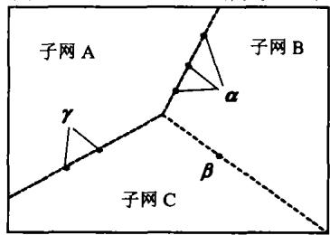
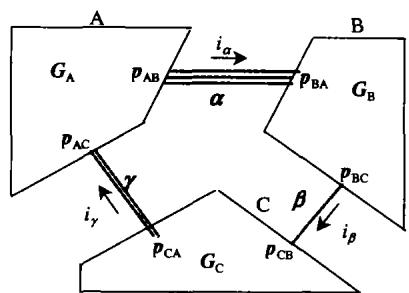
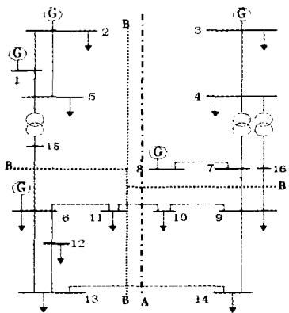
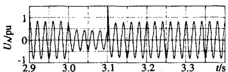
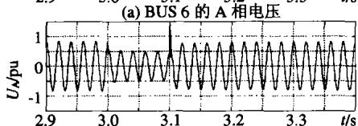
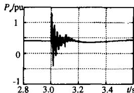
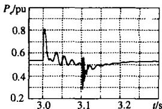
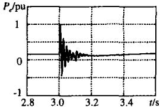
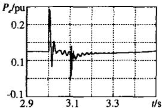

# 电力系统电磁暂态实时仿真中并行算法的研究

岳程燕，周孝信，李若梅

(中国电力科学研究院，北京市海淀区100085)

# STUDY OF PARALLEL APPROACHES TO POWER SYSTEM ELECTROMAGNETIC TRANSIENT REAL-TIME SIMULATION

YUE Cheng-yan, ZHOU Xiao-xin, LI Ruo-mei

(Electric Power Research Institute, Haidian District, Beijing 100085, China)

ABSTRACT: In this paper, a new method named "node-splitting algorithm" is presented to deal with the power system electromagnetic transient network partition and parallel simulation. According to this method, network partition can be applied in each bus. Combined with the other method-decoupling method through long transmission lines, not only the electro magnetic transient simulation's speed will rise a lot, but also the network partition will become very flexible. As a general interface method, this method also can be used in the hybrid simulation of electromagnetic transient and electromechanical transient simulation. This paper also presents the realization approach and result analysis. Through the modified IEEE 14-Bus system and North East China-North China-Center China-Chuanyu system's realization, this method has been validated.

KEY WORDS: Electric power engineering; Power system; Real-time digital simulation; Electromagnetic transient; Network partition; Parallel simulation; PC Cluster

摘要：该文从软件开发的角度出发，提出了一种解决电磁暂态实时仿真问题的分网并行算法。算法中采用“节点分裂”进行网络分割，采用子网内部节点电压方程与子网之间边界点电压相等的关系联合求解网络，并结合长输电线解耦法，在电科院开发的实时仿真器ADPSS中实现了电磁暂态分网并行计算，使网络中任意点都可以作为边界点进行网络分割。该算法不但能保持长输电线解耦法并行计算的较高并行效率，还能提高分网并行的灵活性。实际系统的计算结果表明：文中所提出的网络并行算法是正确和有效的；节点分裂法即可用于交直流电力系统实时仿真分网并行计算，以实现交直流系统实时仿真。也可应用于电力系统电磁暂态仿真与机电暂态仿真接口计算中，实现电力系统电磁暂态仿真与

基金项目：国家电力公司科学技术项目(SP11J-2001-01;SP11-2001-01-06)。

机电暂态仿真的混合仿真。

关键词：电力工程；电力系统；实时数字仿真；电磁暂态；网络分割；并行处理；集群计算机

# 1 引言

随着电力系统规模的不断扩大及新的电力电子装置的采用，电网动态特性变得越来越复杂[1]。在这种情况下，电力系统仿真，特别是实时仿真引起了广泛的关注[2-8]。

在分析电力系统快速暂态过程的电磁暂态仿真领域，目前世界上存在的实时数字仿真装置主要有RTDS[9]、ARENE、HYPERSIM，以及UBC和TAMU等开发的全数字实时仿真装置[10,11]。

进行电磁暂态实时仿真需要解决：① 如何在电磁暂态经典模型和算法的基础上开发出适合快速计算的新方法，以满足实时仿真的需要；② 如何解决电磁暂态与机电暂态的接口，使电磁暂态与机电暂态能联合计算，以扩大仿真规模。

本文就提高电磁暂态数字仿真速度的主要途径——电磁暂态分网并行计算方法进行了分析，并提出一种通过节点分裂进行分网并行计算的新方法。结合另一种电磁暂态分网并行计算方法——长输电线解耦法进行电磁暂态网络分割和并行计算，不但能保持长输电线解耦法并行计算的较高并行效率，还能提高分网并行的灵活性，使网络中任意点都可以作为边界点进行网络分割。

同时文中还提出，作为一种通用网络接口方法，“节点分裂方法”还可以用于解决电磁暂态仿真与机电暂态仿真联合计算的接口问题中。

# 2 算法回顾及问题的提出

为提高电力系统电磁暂态仿真速度，总结近年来国内外学者的研究成果主要有以下几个方面：

（1）充分利用电力系统网络稀疏性，采用稀疏技术；  
（2）仿真开始前，对系统所有可能的拓扑结构变化带来的电导矩阵的变化进行统计，并计算其对应于每种情况下的电导矩阵的逆矩阵。在仿真过程中，当网络拓扑改变时，直接采用预先计算的对应电导矩阵的逆矩阵进行网络节点方程的求解[10]；  
（3）采用网络分割的办法，将整个网络分块后，由多个处理器并行计算，子网之间通过通讯完成各部分信息的交互。

其中，分网并行计算是实时仿真中提高仿真速度的一条较好的途径。许多学者在这方面作了深入研究[12~15]。目前，电磁暂态分网并行计算通常采用长输电线解耦法。即：利用波动方程描述的分布参数线路模型可将两端网络自然解耦的特点进行网络分割和并行计算。该方法对通讯量的要求较少，并行计算效率较高。但该方法要求网络分割时必须在长距离输电线路上进行，而实际电网并不一定都能满足这一条件，因而在方法上缺少灵活性。

在文献[12]、[13]中，J.R.Marti等人将修正节点分析方法[16]、多端口戴维南等值概念与Diakoptics[14]概念相结合，提出MATE（Multi-Area Thevenin Equivalent）方法，用于解决电力系统仿真中网络接口问题。其主要思想是：通过系统中某些支路，将大规模电力系统分割成多个部分(称为子网络)(DIAKOPTICS思想)，然后，利用MNA方法，将子网络内部的节点电压方程和连接各个子网络的支路电流方程联立求解，方程降阶简化后，先求出子网之间联络支路上流过的电流，再将联络支路电流纳入各个子网的节点电压方程，最终完成整个网络的求解。从物理意义上描述，各个子网络之间的支路电流方程正好描述了子网络之间的多端口戴维南等值特性。采用这种方法，可以利用网络中存在的集中参数线路或元件将网络分割、并行计算。该方法为我们进行网络分割提供了又一个选择，但采用该方法进行网络分割时，必须在集中参数元件上进行，仍缺少灵活性。并且，当子网之间采用不同的计算理论如：一个子网采用ABC相瞬时值理论的电磁暂态模型，另一个子网采用正负零序基波相量有效值理论的机电暂态模型进行求解

时，将存在困难。

针对上述问题，本文在MATE方法的基础上，提出一种新的分网并行计算方法，称之为节点分裂法。采用这种方法后，网络分割可以在系统中任意点进行，大大提高网络分割的灵活性。

# 3 利用节点分裂法进行网络分割和并行计算

# 3.1 算法描述

对于任一电力系统，假设根据网络分布可以将网络通过任意节点划分为子网A、子网B、子网C，它们之间通过边界节点 $\alpha$ 、 $\beta$ 、 $\gamma$ 相连，如图1所示，图中 $\alpha$ 、 $\beta$ 、 $\gamma$ 为边界点的集合。将边界点一分为二，图1所示的电力系统又可以图2所示的形式表示。

  
图1电力系统网络分割示意图  
Fig. 1 Sketch Map of network partition-1

  
图2系统分网示意图  
Fig. 2 Sketch Map of network partition-2

图中 $i_{\alpha}, i_{\beta}, i_{\gamma}$ 为电磁暂态子网 A、B、C 之间的联络电流相量，电流方向任意，假定其流向如图 2 中箭头所示。那么，电磁暂态子网 A、B、C 的网络方程可写为

$$
\boldsymbol {G} _ {\mathrm {A}} \boldsymbol {V} _ {\mathrm {A}} + \boldsymbol {p} _ {\mathrm {A B}} \boldsymbol {i} _ {\alpha} - \boldsymbol {p} _ {\mathrm {A C}} \boldsymbol {i} _ {\gamma} = \boldsymbol {h} _ {\mathrm {A}} \tag {1}
$$

$$
\boldsymbol {G} _ {\mathrm {B}} \boldsymbol {V} _ {\mathrm {B}} - \boldsymbol {p} _ {\mathrm {B A}} \boldsymbol {i} _ {\alpha} + \boldsymbol {p} _ {\mathrm {B C}} \boldsymbol {i} _ {\beta} = \boldsymbol {h} _ {\mathrm {B}} \tag {2}
$$

$$
\boldsymbol {G} _ {\mathrm {C}} \boldsymbol {V} _ {\mathrm {C}} + \boldsymbol {p} _ {\mathrm {C A}} \boldsymbol {i} _ {\gamma} - \boldsymbol {p} _ {\mathrm {C B}} \boldsymbol {i} _ {\beta} = \boldsymbol {h} _ {\mathrm {C}} \tag {3}
$$

式中 $G_{\mathrm{A}}, G_{\mathrm{B}}, G_{\mathrm{C}}$ 分别为电磁暂态子网 A、B、C 的节点导纳矩阵， $V_{\mathrm{A}}, V_{\mathrm{B}}, V_{\mathrm{C}}$ 分别为电磁暂态子网 A、B、C 的节点电压相量， $h_{\mathrm{A}}, h_{\mathrm{B}}, h_{\mathrm{C}}$ 分别为电磁暂态子网 A、B、C 的等值历史电流源相量（按传统电磁暂态计算方法获取，具体求解方法见文献[8]）， $P_{\mathrm{AB}}, P_{\mathrm{AC}}$ 为反映电磁暂态子网 A 中某些

节点与连线电流相量 $i_{\alpha}, i_{\gamma}$ 的关联关系的关联阵， $P_{\mathrm{BA}}, P_{\mathrm{BC}}$ 为反映电磁暂态子网B中某些交流节点与联络电流 $i_{\alpha}, i_{\beta}$ 相量关联关系的关联阵， $P_{\mathrm{CB}}, P_{\mathrm{CA}}$ 为反映电磁暂态子网C中某些交流节点与联络电流 $i_{\beta}, i_{\gamma}$ 相量关联关系的关联阵， $P_{\mathrm{AB}}, P_{\mathrm{AC}}, P_{\mathrm{BA}}, P_{\mathrm{BC}}, P_{\mathrm{CB}}, P_{\mathrm{CA}}$ 中的元素非0即1。

由于本文采用节点分裂法进行分网并行计算，

由同一边界点在不同子网中计算所得电压应该相等的关系，又可得

$$
\boldsymbol {p} _ {\mathrm {A B}} ^ {\mathrm {T}} \boldsymbol {V} _ {\mathrm {A}} = \boldsymbol {p} _ {\mathrm {B A}} ^ {\mathrm {T}} \boldsymbol {V} _ {\mathrm {B}} \tag {4}
$$

$$
\boldsymbol {p} _ {\mathrm {B C}} ^ {\mathrm {T}} \boldsymbol {V} _ {\mathrm {B}} = \boldsymbol {p} _ {\mathrm {C B}} ^ {\mathrm {T}} \boldsymbol {V} _ {\mathrm {C}} \tag {5}
$$

$$
\boldsymbol {p} _ {\mathrm {C A}} ^ {\mathrm {T}} \boldsymbol {V} _ {\mathrm {C}} = \boldsymbol {p} _ {\mathrm {A C}} ^ {\mathrm {T}} \boldsymbol {V} _ {\mathrm {A}} \tag {6}
$$

将式(1)~(6)联立，可得增广方程为

$$
\left[ \begin{array}{c c c c c c} G _ {\mathrm {A}} & & & p _ {\mathrm {A B}} & 0 & - p _ {\mathrm {A C}} \\ & G _ {\mathrm {B}} & & - p _ {\mathrm {B A}} & p _ {\mathrm {B C}} & 0 \\ & & G _ {\mathrm {C}} & 0 & - p _ {\mathrm {C B}} & p _ {\mathrm {C A}} \\ p _ {\mathrm {A B}} ^ {\mathrm {T}} & - p _ {\mathrm {B A}} ^ {\mathrm {T}} & 0 & 0 & & \\ 0 & p _ {\mathrm {B C}} ^ {\mathrm {T}} & - p _ {\mathrm {C B}} ^ {\mathrm {T}} & & 0 & \\ - p _ {\mathrm {A C}} ^ {\mathrm {T}} & 0 & p _ {\mathrm {C A}} ^ {\mathrm {T}} & & & 0 \end{array} \right] \left[ \begin{array}{l} V _ {\mathrm {A}} \\ V _ {\mathrm {B}} \\ V _ {\mathrm {C}} \\ i _ {\alpha} \\ i _ {\beta} \\ i _ {\gamma} \end{array} \right] = \left[ \begin{array}{l} h _ {\mathrm {A}} \\ h _ {\mathrm {B}} \\ h _ {\mathrm {C}} \\ 0 \\ 0 \\ 0 \end{array} \right] \tag {7}
$$

式(7)降阶简化可得

$$
\left[ \begin{array}{c c c} \boldsymbol {p} _ {\mathrm {A B}} ^ {\mathrm {T}} \boldsymbol {G} _ {\mathrm {A}} ^ {- 1} \boldsymbol {p} _ {\mathrm {A B}} + \boldsymbol {p} _ {\mathrm {B A}} ^ {\mathrm {T}} \boldsymbol {G} _ {\mathrm {B}} ^ {- 1} \boldsymbol {p} _ {\mathrm {B A}} & - \boldsymbol {p} _ {\mathrm {B A}} ^ {\mathrm {T}} \boldsymbol {G} _ {\mathrm {B}} ^ {- 1} \boldsymbol {p} _ {\mathrm {B C}} & - \boldsymbol {P} _ {\mathrm {A B}} ^ {\mathrm {T}} \boldsymbol {G} _ {\mathrm {A}} ^ {- 1} \boldsymbol {p} _ {\mathrm {A C}} \\ - \boldsymbol {p} _ {\mathrm {B C}} ^ {\mathrm {T}} \boldsymbol {G} _ {\mathrm {B}} ^ {- 1} \boldsymbol {p} _ {\mathrm {B A}} & \boldsymbol {p} _ {\mathrm {B C}} ^ {\mathrm {T}} \boldsymbol {G} _ {\mathrm {B}} ^ {- 1} \boldsymbol {p} _ {\mathrm {B C}} + \boldsymbol {p} _ {\mathrm {C B}} ^ {\mathrm {T}} \boldsymbol {G} _ {\mathrm {C}} ^ {- 1} \boldsymbol {p} _ {\mathrm {C B}} & - \boldsymbol {p} _ {\mathrm {C B}} ^ {\mathrm {T}} \boldsymbol {G} _ {\mathrm {C}} ^ {- 1} \boldsymbol {p} _ {\mathrm {C A}} \\ - \boldsymbol {p} _ {\mathrm {A C}} ^ {\mathrm {T}} \boldsymbol {G} _ {\mathrm {A}} ^ {- 1} \boldsymbol {p} _ {\mathrm {A B}} & - \boldsymbol {p} _ {\mathrm {C A}} ^ {\mathrm {T}} \boldsymbol {G} _ {\mathrm {C}} ^ {- 1} \boldsymbol {p} _ {\mathrm {C B}} & \boldsymbol {p} _ {\mathrm {A C}} ^ {\mathrm {T}} \boldsymbol {G} _ {\mathrm {A}} ^ {- 1} \boldsymbol {p} _ {\mathrm {A C}} + \boldsymbol {p} _ {\mathrm {C A}} ^ {\mathrm {T}} \boldsymbol {G} _ {\mathrm {C}} ^ {- 1} \boldsymbol {p} _ {\mathrm {C A}} \end{array} \right] \cdot \left[ \begin{array}{c} i _ {\alpha} \\ i _ {\beta} \\ i _ {\gamma} \end{array} \right] =
$$

$$
\left[ \begin{array}{l} \boldsymbol {P} _ {\mathrm {A B}} ^ {\mathrm {T}} \boldsymbol {G} _ {\mathrm {A}} ^ {- 1} \boldsymbol {h} _ {\mathrm {A}} - \boldsymbol {p} _ {\mathrm {B A}} ^ {\mathrm {T}} \boldsymbol {G} _ {\mathrm {B}} ^ {- 1} h _ {\mathrm {B}} \\ \boldsymbol {p} _ {\mathrm {B C}} ^ {\mathrm {T}} \boldsymbol {G} _ {\mathrm {B}} ^ {- 1} \boldsymbol {h} _ {\mathrm {B}} - \boldsymbol {p} _ {\mathrm {C B}} ^ {\mathrm {T}} \boldsymbol {G} _ {\mathrm {C}} ^ {- 1} h _ {\mathrm {C}} \\ \boldsymbol {p} _ {\mathrm {C A}} ^ {\mathrm {T}} \boldsymbol {G} _ {\mathrm {C}} ^ {- 1} \boldsymbol {h} _ {\mathrm {C}} - \boldsymbol {p} _ {\mathrm {A C}} ^ {\mathrm {T}} \boldsymbol {G} _ {\mathrm {A}} ^ {- 1} h _ {\mathrm {A}} \end{array} \right] \tag {8}
$$

解降阶方程式(8)可得联络电流相量 $i_{\alpha}, i_{\beta}, i_{\gamma}$ ，将其代入式(1)~(3)，便可得出各个电磁暂态子网的节点电压。其中，解出联络电流相量 $i_{\alpha}, i_{\beta}, i_{\gamma}$ 后，各子网之间相互独立，子网获取自己需要的联络电流后，各子网的计算就可以在不同的进程上并行推进，提高计算速度。由于式(8)的阶数由边界母线数决定，其阶数不可能太高，因此，求解联络电流的计算量并不大。

# 3.2 计算步骤与策略

采用上述原理进行电网的并行计算时，其计算步骤如下：

（1）将整个网络按照拓扑结构分为多个子网，并将各子网的计算任务分配到PC Clsuter系统对应的各节点机上（或多CPU机器的各个CPU上）；  
(2)各子网根据初始条件计算其等值历史电流源相量 $h_{\mathrm{A}}$ 、 $h_{\mathrm{B}}$ 、 $h_{\mathrm{C}}$ ，并对其节点导纳矩阵 $\pmb{G}_{\mathrm{A}}$ 、 $\pmb{G}_{\mathrm{B}}$ 、 $\pmb{G}_{\mathrm{C}}$ 进行三角分解，为以后求解线性方程做准备；  
（3）根据子网间相连关系，建立降阶方程(8)等式左边的系数矩阵，并对其进行三角分解，为以后求解联络电流 $i_{\alpha}$ 、 $i_{\beta}$ 、 $i_{\gamma}$ 做准备；

(4)将各子网在本步长计算得出的等值电流源相量信息送入主进程，带入式(8)中等式右端项，并对式(8)进行回代计算，求出子网间联络电流 $i_{\alpha}$ 、 $i_{\beta}$ 、 $i_{\gamma}$   
(5)各子网计算进程从主进程获取各自相关的联络电流，分别带入各自的网络方程(1)~(3)，进行回代计算，求解本步的节点电压；  
（6）更新各子网的等值历史电流源，令 $T = T + \Delta t$ （ $T$ 为计算时刻， $\Delta t$ 为计算步长）；  
（7）重复步骤(4)~(6)，直到仿真结束。

以上对计算步骤的描述中，步骤(1)~(3)在初始化过程中计算，不计入仿真时间；步骤(4)~(6)为循环计算环节，其中，步骤(4)在主进程上串行计算，步骤(5)和(6)在各子进程上并行进行。

采用上述方法进行计算时，仿真开始时刻和网络拓扑结构变化时刻对式(8)进行1次三角分解，其它时刻只需进行回代计算，并且，还需注意到，式(8)线性方程系数矩阵为对称矩阵。采用对称矩阵的求解方法，可以进一步提高计算速度。另外，式(8)中多处用到子网电导矩阵的逆矩阵。如果对矩阵直

接求逆，当矩阵规模比较大时，计算量是相当大的，利用等值戴维南定理进行推导后能够通过较简便的方法直接求出式(8)的系数矩阵和右端项，并且其求解为显式方法，不需预测和迭代，从而减少了计算量，提高了计算速度。限于篇幅，具体方法将在随后的文章中阐述。

采用节点分裂法进行分网并行计算，方法简单，分网灵活。但正如所有的方法都不是完美的，这种方法也有其局限性。从以上描述中可以看出：为了获得子网独立求解所需的网间电流，必须利用所有子网相关信息求解整个网络的降阶方程。这个过程必须串行完成，也就是说，计算降阶方程的过程中，各子网的独立计算都需等待，直到获得其下一步计算所需的网间联络电流。串行过程的存在降低了整个系统的并行计算效率。因此，电磁暂态分网并行计算时，如果能将节点分裂法分网并行计算和长输电线解耦法分网并行计算相结合，就能扬长避短，既发挥长输电线解耦法并行效率高的优点，又能在不满足其分网条件的情况下，采用节点分裂分网，提高分网并行的灵活性。

节点分裂法和长输电线解耦法两种分网并行计算方法都已在中国电力科学研究院最近开发的全数字电力系统仿真器（Advanced Digital Power System Simulator, ADPSS）中得以实现。由于长输电线解耦法与节点分裂法互不矛盾，互不影响，用户进行分网并行计算时，可以在一个计算任务中根据需要，在网络的不同位置选择点分裂分网或线路分割分网，以完成计算任务。ADPSS采用PC Cluster集群计算机系统作为仿真硬件平台，其中，每个计算节点的CPU频率为 $2.4\mathrm{GHz}$ ，操作系统采用稳定性较好的LINUX，而通讯网络提供以太网和MYRINET网两种通讯方式。

# 4 算例分析

本文采用的基本测试算例系统为IEEE14节点系统[17]。由于其网络相关性很强，采用长输电线进行网络分割比较困难，因而只能采取节点分裂法分网并行计算。为了验证节点分裂法的正确性以及将两种分网方式联合使用的正确性，并比较各种不同的分网方式在计算速度上的差别，本文将IEEE14系统做了以下修改：

（1）停运IEEE14系统中BUS2与BUS3之间、BUS2与BUS4之间、BUS4与BUS5之间的

3条线路；

(2) 在 BUS 5 和 BUS 6 之间添加节点 BUS 15 及线路 BUS 15-BUS 6;  
(3) 在 BUS 4 和 BUS 9 之间添加节点 BUS 16 及线路 BUS 16-BUS 9;  
（4）调整BUS3、BUS4母线上所带负荷，并相应调整发电机出力及系统潮流。

修改后的 IEEE14 节点系统如图 3 所示。该系统包含 48（ $16 \times 3$ ）个节点、48（ $16 \times 3$ ）条线路、5 个电源、3 台变压器以及 12 个负荷。系统仿真中，BUS 1 上的电源采用三相交流电压源模拟，其它 4 个电源都采用由详细 PARK 方程描述的发电机模型模拟。另外，线路 BUS 5-BUS 6、BUS 16-BUS 9、BUS 10-BUS 11、BUS 13-BUS 14 采用分布参数线路模拟，其它线路采用 $\pi$ 型线路模拟。

系统仿真时施加的故障为母线Bus5处发生三相接地短路0.1s，计算步长 $50\mu s$ ，仿真模拟时间为10s。对该系统进行并行仿真计算时采取了以下3种方式进行：

（1）串行仿真。即：系统不分网，在一个CPU上串行计算，为传统的计算方式。  
（2）分2个网并行仿真。如图3所示，在点划线A处将系统一分为二。此时采用长输电线解耦法进行计算，以比较并行分网效率。  
（3）分4个网并行仿真。如图3所示，在虚线B处将系统分为4个子网。这种情况下，又采用3种方式进行计算：① 采用长输电线解耦法，在线路BUS10-BUS11，BUS13-BUS14，BUS6-BUS15以及BUS7-BUS9，BUS9-BUS16处将系统一分为四；② 采用节点分裂方法，在节点BUS6，BUS11，BUS13，BUS9处将系统一分为四；③ 采用前2种分网方法混合使用的方法，在线路BUS10-BUS11，BUS13-BUS14，BUS7-BUS9，BUS9-BUS16和节点BUS6处将系统一分为四。

以下主要从2个方面对仿真结果进行分析：

（1）并行计算方法的正确性，主要通过串行不分网计算与并行计算结果的比较进行并行计算方法的正确性验证；  
（2）并行计算性能分析。所考虑的因素包括不同的分网方式；采用不同的通讯网络；子网分割的数目的影响。

# 1）正确性验证

对修改后的IEEE14节点系统，采用以上3种

分网方式、共5种情况进行仿真计算后，对母线BUS6、BUS11的三相电压，以及4台发电机的电磁功率、转子角度、转子角速度等作了比较。结果表明：在不同分网情况下，分网并行计算结果与不分网串行计算结果的各项曲线已经完全重合。分网并行计算时，计算精度没有任何损失（目前仅输出小数点后7位数字，结果完全一致），分网并行计算正确。图4、5分别表示母线BUS6，BUS11的A相电压，以及4台发电机的电磁功率曲线。

  
图3修改后的IEEE14节点系统单线图

  
Fig. 3 Modified IEEE 14 bus system single-line diagram

  
(b)BUS11的A相电压   
图4节点电压的比较（串行、并行已重合）  
Fig. 4 Comparisons of voltages at Bus6 and Bus11

# 2）实时性验证如下：

因不同的分网方式并行计算速度不同，采用长输电线解耦法分网并行速度较快，节点分裂法分网并行速度较慢，若将2种分网方式混合采用，其并行计算的速度也介于二者之间。对仿真计算方式(3)的3种情况并行仿真计算的执行时间以及平均每一计算时步的执行时间统计如表1，此时网络分成4个子网，仿真10s的暂态过程，计算步长 $50\mu s$ ，实际计算结果与理论分析相吻合。

  
(a) 2号发电机的电磁功率曲线

  
(b)3号发电机的电磁功率曲线

  
(c)6号发电机的电磁功率曲线

  
(d)8号发电机的电磁功率曲线   
图5 发电机电磁功率的比较（串行、并行已重合）  
Fig. 5 Comparisons of generator's electric power Pe

表 1 不同分网方法的仿真计算执行时间比较  
Tab. 1 Comparison of execution time for three methods   

<table><tr><td>仿真计算方法</td><td>并行计算执行时间/s</td><td>每步计算执行时间/μs</td></tr><tr><td>长输电线解耦法</td><td>7.71</td><td>38.55</td></tr><tr><td>节点分裂法</td><td>17.62</td><td>88.10</td></tr><tr><td>混合方法</td><td>8.81</td><td>44.05</td></tr></table>

对 IEEE 14 节点系统进行网络分割时，可采用仿真计算方式(2)将系统分为 2 个子网并行计算，也可进一步采用仿真计算方式(3)将系统分成 4 个子网并行计算。对每种情况还可采用以太网或 Myrinet 网作为网间通讯方式。对以上不同分网情况的计算时间与不分网串行计算时间比较见表 2。

表2还将采用Myrinet网通讯时，不同分网情况下的并行分网计算加速比 $S(P)$ 和并行效率 $E(P)$ 进行了比较。

加速比 $S(P)$ 是指在给定的并行计算系统上对给定的应用，其并行算法执行速度相对于串行算法加快的倍数。其定义如下：

$$
S (P) = t _ {s} / p _ {s}
$$

式中 $t_s$ 为单台CPU串行计算执行时间； $t_p$ 为 $p$ 台CPU并行计算执行时间。

并行效率 $E(P)$ 则是用来表示并行计算时每个处理器实际使用率的量值，其定义如下：

$$
\text{并行效率:} E(p) = S(P) / p\times 100\%
$$

由表2可以看出，采用传统方法对IEEE14节点系统做电磁暂态仿真，步长采用 $50\mu s$ 时，10s的暂态过程需要13.87s才能仿真完，不能满足实时仿真的需要。但采用本文所述方法进行并行仿真、并采用MYRINET网作为网间通讯方式后，不论分2个网还是4个网都在10s以内完成了仿真计算。并且分4个网进行仿真计算的时间要少于分2个网并行仿真。同时也可以注意到，分网并行计算时，计

算时间并不是随着子网个数的增加呈线性降低，这是由于网络分割的数目越多，网间通讯和各子网计算相互等待所花的时间就越多。

另外，由表2也可以看出，电磁暂态仿真步长短，网间通讯非常频繁，用以太网作为网间通讯方式，通讯所花时间过长，不能满足电磁暂态实时仿真的需求。

表 2 不同分网情况下计算时间的比较  
Tab. 2 Execution time comparison of three cases   

<table><tr><td rowspan="2">比较项目</td><td rowspan="2">串行</td><td colspan="2">并行计算分网情况</td></tr><tr><td>分2个子网</td><td>分4个子网</td></tr><tr><td>以太网计算时间/s</td><td>13.870</td><td>11.240</td><td>23.996</td></tr><tr><td>Myrinet网计算时间/s</td><td>13.870</td><td>8.667</td><td>7.710</td></tr><tr><td>加速比(Myrinet网)</td><td></td><td>1.6</td><td>1.8</td></tr><tr><td>并行效率(Myrinet网)/%</td><td></td><td>80</td><td>45</td></tr></table>

# 5 节点分裂法性能分析

# 5.1 计算时间

分网并行计算，其实质是将原来由一台机承担的计算任务分摊到多台机共同完成，总的计算量并没有减少，甚至还增加了一个各子网之间相互通讯、协调并求解联络电流的工作量。如果假设系统不分网串行计算执行时间为 $T_{S}$ ，当系统采用节点分裂法分网并行计算时，系统分 $N$ 个子网并行计算的执行时间 $T_{P1}$ 可写为

$$
T _ {P 1} = T _ {S} / N + T _ {c o m 1} + T _ {c a l} + T _ {w 1} \tag {9}
$$

当系统采用长输电线解耦法分网并行时，系统分 $N$ 个子网并行计算的执行时间 $T_{P2}$ 可写为

$$
T _ {P 2} = T _ {S} / N + T _ {\text {c o m} 2} + T _ {w 2} \tag {10}
$$

式中 $T_{com1}$ 、 $T_{com2}$ 为并行通讯时间，主要由所选的通讯网络速度决定； $T_{w1}$ 、 $T_{w2}$ 为子网间为了同步而相互等待的时间，网络分得越均匀即：各子网规模基本一致， $T_{w1}$ 、 $T_{w2}$ 就越小； $T_{cal}$ 为节点分裂法并行计算中串行部分的计算时间（用于计算网间联络电流），基本与网络大小和子网数目无关，而与网络边界母线数目成正比。

要想使并行计算时间小于串行计算时间，即

$$
T _ {P 1} <   T _ {S}, \quad T _ {P 2} <   T _ {S} \tag {11}
$$

则需要 $T_{com1} + T_{cal} + T_{w1} < (1 - 1 / N)T_{S}$ (12)

$$
T _ {c o m 2} + T _ {w 2} <   (1 - 1 / N) T _ {S} \tag {13}
$$

从式(9)~(13)可知

（1）当并行计算任务一定时，即网络规模一定时，系统分得越均匀、分网边界点越少，选择的通讯网络速度越快，并行计算时间也越快；而在其它条件一定的情况下，网络规模越大，分网并行计算

的效果也越明显；

(2)如果进行并行计算的附加工作如子网之间相互通讯 $T_{com1}$ 、 $T_{com2}$ 、协调 $T_{w1}$ 、 $T_{w2}$ ，并求解联络电流 $T_{cal}$ 等所花的时间超过网络规模缩减 $1 / N$ 后串行计算所需时间，即：并行计算额外支出的执行时间超过它节省了的串行计算时间，则分网并行计算效率反而会比不分网串行计算效率还低；  
（3）相比较节点分裂法与长输电线解耦法，从算法本身特点来说，长输电线解耦法通讯量小，通讯所花的时间少 $(T_{com1} < T_{com2})$ ；另外，长输电线解耦法不需要计算子网间联络电流，节省了时间 $T_{cal}$ 。

对本文所列算例，从表1和表2中可以看出：纯粹采用节点分裂法进行并行分网计算的执行时间(17.62s)甚至超过了系统不分网串行计算的执行时间（13.87s）。这一部分是由于网络分割不够均匀，另外也由于网络规模不够大，节点分裂法分网并行效率不能充分体现。当网络规模扩大时，分网降低计算总时间的效果便会呈现出来。

中国电网实际系统——东北-华北-华中-川渝四区联网系统在ADPSS上进行计算时，牡二电厂附近网络计算电磁暂态过程，剩余网络计算机电暂态过程，其中电磁暂态网络（牡二电厂附近网络）包括：57（ $19\times 3$ ）个节点、42（ $14\times 3$ ）条线路、5台发电机（其中4台采用详细Park方程模型）、11台三相变压器、14个三相负荷。如果电磁暂态网络不分网，直接与机电暂态网络联合计算，40s的仿真过程总耗时为51.49s，不能满足实时要求；但是，如果采用节点分裂法将电磁暂态网络分成2个子网并行计算，同时与机电暂态网络联合计算时，40s的仿真过程，总耗时为39.41s，已经达到了实时仿真的要求。节点分裂法并行计算的优越性凸显出来。5.2其它应用

通过以上阐述可以看出，节点分裂法不仅能用于电磁暂态网络并行计算，还可以作为一种通用接口方法，用于任何2个网络的联合计算，即使这2个网络的计算采用不同的理论和方法，以及不同的步长，只要能够获得边界点电压信息，就可以利用边界点在不同子网中求出的电压应该相等的关系联立网络，从而获得整个网络的真正解。

本文作者已利用上述方法实现了电磁暂态和机电暂态混合仿真，并取得了理想的效果。另外，在直流输电实时仿真领域，以目前计算机速度，要想在一台机上完成直流输电实时仿真困难很大，分网

并行计算是一个提高计算速度可行的方法。但是，在直流输电仿真中，要想完全采用长输电线解耦法分网并行计算存在一定的困难，因为影响直流系统计算速度的瓶颈在于换流阀组的模拟，而直流系统整流或逆变侧内部多个阀组之间联系非常紧密，如果采用虚拟的长距离输电线将它们相连，必将影响计算准确性。在这种情况下，要想分网并行计算，只能采用本文提出的节点分裂法。

# 6 结论

本文在总结现有电磁暂态分网并行方法的基础上，提出一种通过节点分裂进行分网并行计算的方法。采用这种方法对电磁暂态分网并行计算，边界点选择任意、网络划分灵活。与另一种分网方法——长输电线解耦法相结合，既能发挥长输电线解耦法并行计算效率高的优点，又能在不满足其分网条件的情况下，采用节点分裂法分网，以提高分网并行计算的灵活性。

通过该方法在修改后的IEEE14节点系统及东北-华北-华中-川渝四区联网系统上的应用表明，文中所提的网络并行计算方法是正确和有效的。

本文还指出，节点分裂法既可以用于电力系统电磁暂态仿真与机电暂态仿真接口计算中，实现电力系统电磁暂态仿真与机电暂态仿真的混合仿真，也可应用于直流输电实时仿真分网并行计算中，实现直流系统实时仿真。

# 参考文献

[1] 郑宝森，郭日彩. 中国互联电网的发展[J]. 电网技术，2003,23(2): 1-3.  
Zheng Baosen, Guo Ricai, Development of china nationwide interconnection[J]. Power System Technology, 2003,23(2): 1-3.  
[2] 贺仁睦，周庆捷，郝玉国．电力系统机-网暂态仿真的并行算法[J]. 中国电机工程学报，1995,15(3)：179-184. He Renmu, Zhou Qingjie, Hao Yuguo. Parallel algorithm used in the machine-network transient stability simulation[J]. Proceedings of the CSEE, 1995,15(3): 179-184.   
[3] 向春, 王心丰. 用调度员培训系统建立电网实时仿真的方法研究[J]. 电网技术, 2000,(5): 30-33.  
Xiang Chun, Wang Xinfeng. Study of the power system real-time simulation by DTS[J]. Power System Technology, 2000,(5): 30-33.   
[4] 曾昭华, 蒋卫平, 等. 伊冯 $500\mathrm{kV}$ 可控串补装置中限压器工作方式的实时仿真研究[J]. 电网技术, 2000,(11): 23-27. Zeng Zhaohua, Jiang Weiping et al. Real-time simulation of voltage limiter device in Yi-Feng $500\mathrm{kV}$ TCSC system, Power System

Technology, 2000,(11): 23-27.   
[5] 李亚楼, 周孝信, 吴中习. 基于 PC 机群的电力系统机电暂态仿真并行算法[J]. 电网技术, 2003,27(11): 6-12. Li Yalou, Zhou Xiaoxin, Wu Zhongxi. PC cluster based power system transient stability parallel simulaiton[J]. Power System Technology, 2003,27(11): 6-12.  
[6] 李亚楼, 周孝信, 吴中习. 一种可用于大型电力系统数字仿真的复杂故障并行计算方法[J]. 中国电机工程学报, 2003,23(12): 1-5. Li Yalou, Zhou Xiaoxin, Wu Zhongxi. Parallel simulation algorithm used in the complex failure study of large-scale power system digital simulation[J]. Proceedings of the CSEE, 2003,23(12): 1-5.   
[7] 薛巍，舒继武，等. 基于集群机的大规模电力系统暂态过程并行仿真[J]. 中国电机工程学报，2003,23(8)：38-43. Xuwei, shujiwu, et al.PC cluster based parallel simulation for large-scale power system transient stability study[J]. Proceedings of the CSEE, 2003, 23(8): 38-43.   
[8] H.W. Dommel 著, 李永庄, 林集明, 曾昭华译. 电力系统电磁暂态计算理论[M]. 水利电力出版社, 1991.  
[9] P.G.McLaren, R.Kuffel, R.Wierckx, et al. A real time digital simulator for testing relays[J]. IEEE Trans on Power Delivery, 1992, 7(1): 207-213.   
[10] J.R.Marti, L.R.Linares. Real-time EMTP-based transients simulation [J]. IEEE Trans on Power Systems, 1994, 9(3): 1309-1317.   
[11] M.Kezunovic, M.Aganagic, V.Skendzic, et al. Transients computation for relay testing in real-time[J]. IEEE Trans on Power Delivery, 1994, 9(3): 1298-1307.   
[12] J.R.Marti, L.R.Linares, J.Calvino, et al. OVNI: An object appro-ach to real-time power system simulators[C]. Proceedings of the 1998 International Conference On Power System Technology, Powercon'98, Beijing, China, August 18-21, 1998: 977-981.   
[13] Jose R.Marti, Luis R. Linares, Jorge A. Hollman, et al. OVN1: Integrated software/hardware solution for real-time simulation of large power systems[C]. 14th PSCC, Sevilla, 24-28 June 2002.   
[14] Gabrel Kron. Tensorial analysis of integrated transmission systems, part III-the primitive division[J]. AIEE Transactions, 1952,71(3): 814-821.   
[15] Harvey H. Happ. Diakoptics - The solution of system problems by tearing[J]. Proceedings of the IEEE, 1974,62(7): 930-940.   
[16] C.W.Ho, A.E. Ruehli, P.A.Brennan. The modified nodal approach to network analysis[J]. IEEE Transactions Circuits And Systems, CAS-1975,(22): 504-509.   
[17] Sameh Kamel Mena Kodsi, Claudio A. Ca~nizares. modeling and simulation of IEEE 14 bus system with facts controllers [R]. University of Waterloo, E&CE Department, Technical Report, 2003-3.

收稿日期：2004-10-08。

作者简介：

岳程燕，女，博士研究生，研究方向为电力系统分析与仿真；周孝信，男，中国科学院院士，研究领域为电力系统分析与控制，电力系统仿真以及FACTS技术等；

李若梅，女，博士，研究领域为电力系统分析与控制，电力系统实时仿真等。