# The Impact of Frame Transformations on Power System EMT Simulation

Jiahang Li , Student Member, IEEE, Yitong Li , Member, IEEE, and Yunjie Gu , Senior Member, IEEE

Abstract—This article investigates the impact of frame transformations on the accuracy of numerical discretization in power system transient and stability studies. As analysed, frame transformations influence the convergence of the numerical discretization. Specifically, for an explicit discretization method (e.g., forward Euler method), the stability of the original system is best preserved in the frame where the system eigenvalue is closer to the origin of the complex plane, e.g., in the stationary frame for inductors and capacitors, and in the synchronous frame for dq-frame controllers of inverters. Simulation results are given to validate the theoretical analysis.

Index Terms—Power system stability, electromagnetic transients, frame transformation, numerical simulation.

# I. INTRODUCTION

N UMERICAL simulation is an important tool for powersystem transient stability analysis. With the increasing system transient stability analysis.With the increasing penetration of inverter-based resources (IBRs), electromagnetic transients (EMTs) are becoming increasingly prominent and ubiquitous in stability problems [1], [2], [3], [4], [5], [6], [7]. The resulted largescale (very high dimensional) and stiff (multiple timescales) model poses a challenge to numerical simulation. This challenge has been recognised by system operators and simulation software suppliers. For example, National Grid, the major transmission system operator-owner in the U.K., is collaborating with PSCAD to develop a U.K.-wide EMT simulation tool [8].

There are two streams of numerical method for transient simulation: variable-step method, and fix-step method. The variable-step method is more suitable for stiff systems because this method adjusts the time step adaptively according to the minimum timescale in the system dynamics [9], [10], [11]. Fix-step method, on the other hand, uses a single time step for

Manuscript received 22 July 2022; revised 10 December 2022; accepted 19 January 2023. Date of publication 10 February 2023; date of current version 26 December 2023. Paper no. TPWRS-01076-2022. (Corresponding author: Yitong Li.)

Jiahang Li is with the Department of Electronic and Electrical Engineering, University of Bath, Bath BA2 7AY, U.K. (e-mail: jl3370@bath.ac.uk).

Yitong Li is with the School of Electrical Engineering, Xi’an Jiaotong University, Xi’an 710049, China (e-mail: yitong.li15@imperial.ac.uk).

Yunjie Gu is with the Department of Electrical and Electronic Engineering, Imperial College London, London SW7 2AZ, U.K. (e-mail: yunjie. gu@imperial.ac.uk).

Color versions of one or more figures in this article are available at https://doi.org/10.1109/TPWRS.2023.3242823.

Digital Object Identifier 10.1109/TPWRS.2023.3242823

the entire simulation, and may be non-converging when the time step is not sufficiently small compared to the timescale of the system dynamics. That said, the fix-step method ensures fixed computation time and therefore is the unique method that can be used for real-time simulation [9], [10], [11], [12], [13], [14].

A common technique to improve the convergence of fix-step method for stiff systems is to use implicit discretization, the most well-known example of which is the trapezoidal method [9], [13], [15], [16]. In the implicit discretization, an algebraic function must be solved at each simulation step, which is known as the algebraic loop [9], [11], [17]. The algebraic loop can be easily solved for a linear system via matrix inversion. For a linear time-invariant system, the solution of the algebraic loop can be done one-off at the beginning of the simulation and does not to be repeated each step [13], [15]. For non-linear systems, solving an algebraic loop can be rather time consuming and therefore may substantially increase the simulation time [9], [11], [18]. For such non-linear systems, it is often necessary to insert extra delays to break the algebraic loop, but the extra delay may compromise convergence [13], [18], [19].

While the ongoing efforts of EMT software suppliers (e.g., PSCAD, DigSILENT, Simulink, and OPAL-RT) are largely focused on developing new discretization method for stiff systems [13], [18], [19], [20], [21], [22], [23], [24], [25], this paper takes a different perspective by investigating the effects of the reference frames on the convergence of numerical discretization. We illustrate that, by performing discretization in a proper reference frame (stationary or synchronous), an explicit (e.g., forward Euler) method can have comparable convergence to implicit methods for some EMT studies. This may resolve the dilemma between convergence and algebraic loops and provide a new way for EMT simulation of stiff inverter-based power systems.

This article is organized as follows: Section II presents a quantitative model for the discretization in the synchronous and stationary frames. Section III evaluates the convergence of the discretization in different frames. Case studies are shown in Section IV and Section V concludes the article.

# II. DISCRETIZATION WITH FRAME TRANSFORMATION

For power system modelling, three-phase current or voltage is normally transformed from ac variables in natural stationary frame (also known as $\alpha \beta$ frame for two-axis analysis or abc frame for three-axis analysis) into dc variables in synchronous

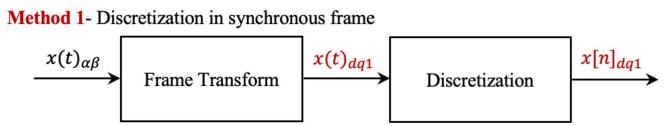  
(a)

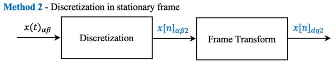  
(b)   
Fig. 1. The sequence of frame transformation and discretization. (a) method 1: discretization in synchronous frame. (b) method 2: discretization in stationary frame. We use x(t) and x[n] to denote continuous and discretised variables. The subscripts αβ and dq donate the reference frames of the variables, and the subscripts 1 and 2 denote the discretization method.

frame (also known as dq frame or rotating frame). There are two discretization choices in different frames, as follows:

Method 1 - discretization in synchronous frame: The system variables are transformed from original stationary frame to synchronous frame first, and the discretization performed in the synchronous frame, as shown in Fig. 1(a). This method is normally adopted in conventional numerical simulation.   
- Method 2 - discretization in stationary frame: The system is discretized in stationary frame first, and the discrete variables are transformed into the synchronous frame for consistent frame comparison, as shown in Fig. 1(b).

# A. Discretization and Frame Transformation

The dynamic behaviour of a power system is described by a set of ordinary differential equations [2]

$$
\frac {d x}{d t} = f (x, u) \tag {1}
$$

where x is the state variable and u is the input. At the core of numerical simulation is to discretize the ordinary differential equations into difference equations. There are various discretization methods available and we focus on the forward Euler method in this paper [9], [26]. The time-derivative of the state variable x is estimated by the difference between two simple points

$$
\frac {x [ n + 1 ] - x [ n ]}{T} = f (x [ n ], u [ n ]) \tag {2}
$$

where T denotes the sample period (time step) of simulation. Forward Euler is an explicit method since the next step x[n+1] is an explicit function of the previous step x[n] and u[n]. For a linear system, the forward Euler method can be represented in the frequency domain as

$$
z = s T + 1 \tag {3}
$$

where z and s are the operators in Z and Laplace transforms.

The frame transformations between the stationary (αβ) and synchronous (dq) are defined by the Park transformation. The orthogonal coordinates in both the $\alpha \beta$ and $d q$ frame can be

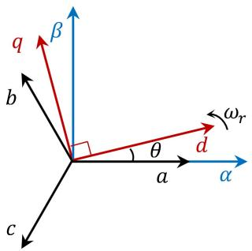  
Fig. 2. Frame transformation diagram.

represented as a complex number

$$
x _ {\alpha \beta} = x _ {\alpha} + j x _ {\beta}
$$

$$
x _ {d q} = x _ {d} + j x _ {q} \tag {4}
$$

where j is the imaginary unit. The Park transformation becomes a rather simple expression in complex numbers

$$
x _ {\alpha \beta} = e ^ {j \theta} x _ {d q}
$$

$$
x _ {d q} = e ^ {- j \theta} x _ {\alpha \beta} \tag {5}
$$

where θ is the angle difference between dq and $\alpha \beta$ frames, as shown in Fig. 2, and $\theta = \omega _ { r }$ t for a constant angular speed $\omega _ { r } .$ .

# B. Eigenvalue Mapping

Eigenvalue analysis is a useful method to evaluate the convergence of a numerical method. Indeed, eigenvalue is only available for linear systems, but such evaluation provides a good estimation for the convergence of the discretization method for generic systems [27], [16]. For non-linear systems, the eigenvalues can be calculated from the linearised systems along the dynamic trajectory [28].

Based on (3), the eigenvalue mapping from s domain $\mathrm { ~ t o ~ } z$ domain for the forward Euler method is

$$
\lambda_ {z} = 1 + \lambda_ {s} T \tag {6}
$$

where $\lambda _ { s }$ and $\lambda _ { z }$ are the eigenvalues of the differential equation and difference equation respectively. The natural mapping between s and z domain is given by Laplace transformation

$$
z = e ^ {s T} \tag {7}
$$

from which yields the natural eigenvalue mappings

$$
\lambda_ {z} = e ^ {\lambda_ {s} \mathrm {T}} \tag {8}
$$

$$
\lambda_ {s} = \left(\ln \lambda_ {z}\right) / T. \tag {9}
$$

The natural mapping provides an authentic (stability preserving) relationship between the z and s domains, and it is clear that forward Euler method is essentially a first-order Taylor approximation of the natural mapping.

Now we identify the effect of frame transformations on system eigenvalues.

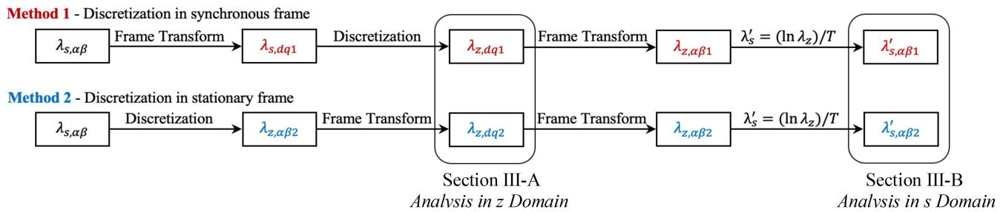  
Fig. 3. Eigenvalue mapping of discretization in synchronous frame and discretization in stationary frame in frequency domain. Method 2 is equivalent to the discretization in stationary frame directly without additional frame transform. The frame transform in method 2 is added only for consistent comparison with method 1 and analysis in Section III.

1) Frame Transformation on Differential Equations: For a linearised differential equation in synchronous frame

$$
\frac {d x _ {d q}}{d t} = A x _ {d q} + B u _ {d q} \tag {10}
$$

the corresponding stationary frame equation is

$$
\frac {d x _ {\alpha \beta}}{d t} = (A + j \omega_ {r}) x _ {\alpha \beta} + B u _ {\alpha \beta} \tag {11}
$$

where we make use of the fact that

$$
\frac {d x _ {d q}}{d t} = e ^ {- j \omega_ {r} t} \frac {d x _ {\alpha \beta}}{d t} - j \omega_ {r} e ^ {- j \omega_ {r} t} x _ {\alpha \beta}. \tag {12}
$$

The eigenvalue of (9) and (12) is defined by

$$
\left| \lambda_ {s, d q} I - A \right| = 0
$$

$$
\left| \lambda_ {s, \alpha \beta} I - (A + j \omega_ {r} I) \right| = 0. \tag {13}
$$

where $\lambda _ { s , \ d q }$ and $\lambda _ { s , \alpha \beta }$ denotes the eigenvalues of different frame in s domain. It follows that the eigenvalue relationship in s domain between the stationary and synchronous frames is

$$
\lambda_ {s, d q} = \lambda_ {s, \alpha \beta} - j \omega_ {r} \tag {14}
$$

2) Frame Transformation on Difference Equations: For method 2, we have the forward Euler difference equation in synchronous frame as

$$
\frac {x [ n + 1 ] _ {d q} - x [ n ] _ {d q}}{T} = A x [ n ] _ {d q} + B u [ n ] _ {d q}. \tag {15}
$$

It can be transformed to stationary frame as

$$
\frac {e ^ {- j \omega_ {r} T} x [ n + 1 ] _ {\alpha \beta} - x [ n ] _ {\alpha \beta}}{T} = A x [ n ] _ {\alpha \beta} + B u [ n ] _ {\alpha \beta}. \tag {16}
$$

Taking Z-transform on (15) in synchronous frame and (16) in stationary frame, the characteristic equations defining the corresponding eigenvalues are

$$
\left| \left(z _ {d q} - 1\right) I / T - A \right| = 0 \tag {17}
$$

$$
\left| \left(e ^ {- j \omega_ {r} T} z _ {\alpha \beta} - 1\right) I / T - A \right| = 0 \tag {18}
$$

from which follow the eigenvalue relationship between dq and $\alpha \beta$ frames in z domain

$$
\lambda_ {z, d q} = e ^ {- j \omega_ {r} T} \lambda_ {z, \alpha \beta} \tag {19}
$$

where $\lambda _ { z , \ d q }$ and $\lambda _ { z , \alpha \beta }$ denotes the eigenvalues of synchronous and stationary frames in z domain.

TABLE IEIGENVALUE MAPPING OF DISCRETIZATION IN SYNCHRONOUS FRAME(METHOD 1) AND DISCRETIZATION IN STATIONARY FRAME (METHOD 2)  

<table><tr><td rowspan="2">Method 1</td><td>Frame Transform</td><td>Discretization</td></tr><tr><td>λs,dq1 = λs,αβ - jωr</td><td>λz,dq1 = 1 + λs,dq1T</td></tr><tr><td rowspan="2">Method 2</td><td>Discretization</td><td>Frame Transform</td></tr><tr><td>λz,αβ2 = 1 + λs,αβT</td><td>λz,dq2 = e−jωrTλz,αβ2</td></tr></table>

An s-domain system is stable if all its eigenvalues are in the left-half plane, i.e., $\operatorname { R e } ( \lambda _ { s } ) \leq 0 . \mathrm { A } z \ – \mathrm { d o m a i n }$ system is stable if all its eigenvalues (modes) are located inside the unit circle, i.e., $| \lambda _ { z } | \leq 1$ . It is clear from (14) and (19) that the frame transformations on the differential and difference equations do not change their stability by themselves. That said, the transformations do have impacts on the convergence of discretization, to follow.

# III. CONVERGENCE EVALUATION

Now we have all the ingredients ready to evaluate the convergence of discretization in a synchronous frame (method 1) and discretization in a stationary frame (method 2). The chain of eigenvalue mapping for the two methods are illustrated in Fig. 3 and summarised in Table I.

# A. Analysis in z Domain

Based on Table I and Fig. 3, the relationship between z-domain eigenvalue and original s-domain eigenvalue can be found as

$$
\lambda_ {z, d q 1} = \lambda_ {z, \alpha \beta} - j \omega_ {r} T
$$

$$
\lambda_ {z, d q 2} = e ^ {- j \omega_ {r} T} \lambda_ {z, \alpha \beta} \tag {20}
$$

where $\lambda _ { z , \alpha \beta }$ is the z-domain eigenvalue obtained from the original s-domain eigenvalue $\lambda _ { s , \alpha \beta }$ as $\lambda _ { z , \alpha \beta } = 1 + \lambda _ { s , \alpha \beta } T$ .

The z-domain eigenvalue trajectory diagram is captured in Fig. 4 with $\lambda _ { z , \ d q 1 }$ in red line, $\lambda _ { z , \ d q 2 }$ in blue line and $\lambda _ { z , \alpha \beta }$ in black line. The analysis is divided into two different types of original eigenvalue $\lambda _ { s , \alpha \beta }$ of original system mode:

Case 1: real eigenvalue, $\lambda _ { s , ~ \alpha \beta } = \sigma \mathrm { a n d } \lambda _ { z , ~ \alpha \beta } = 1 + \sigma T$ in Fig. 4(a).

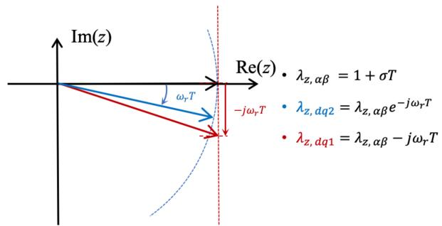

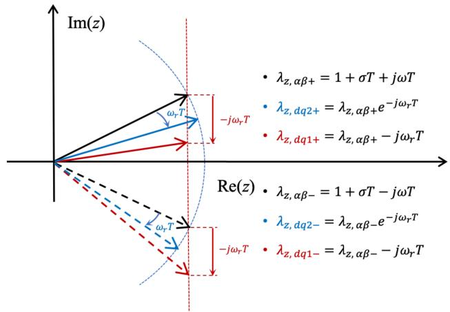  
(a) Case 1: real eigenvalue   
(b) Case 2: complex eigenvalue

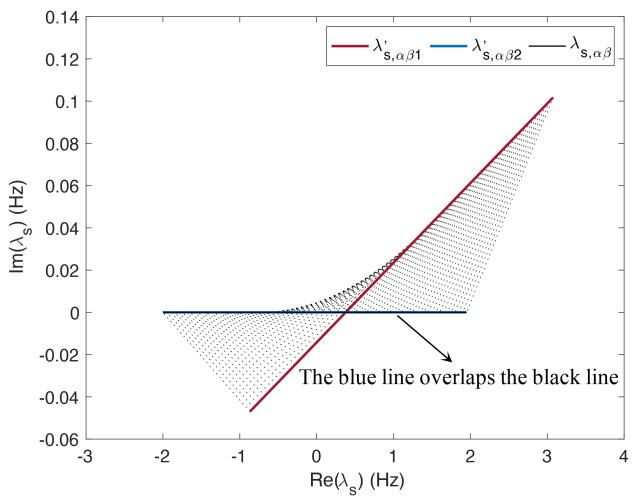  
Fig. 4. Eigenvalue trajectory analysis in z domain.   
Fig. 5. Horizontal line eigenvalue mapping of method 1 in red line and method 2 in blue line in s domain of stationary frame.

- Case 2: complex eigenvalues, $\begin{array} { r l } { \lambda _ { s , \alpha \beta } = } & { { } \sigma \pm j \omega } \end{array}$ and $\lambda _ { z , \alpha \beta } = 1 + \sigma T \pm j \omega T$ (negative frequency and positive frequency distinguished with subscripts and + in dashed and solid respectively) in Fig. 4(b).

As indicated from the eigenvalue trajectory diagram, the numerical discretization in method 1 takes the frequency $\omega _ { r }$ of synchronous frame into consideration. Compared to $\lambda _ { z , \alpha \beta }$ ,

the imaginary part of $\lambda _ { z , \ d q 1 }$ is shifted down vertically with a step of $\omega _ { r } T$ , which changes the magnitude correspondingly. For case 1 in Fig. 4(a), the z-domain eigenvalue magnitude $\left| \lambda _ { z , \ d q 1 } \right|$ | of method 1 is prolonged compared to $| \lambda _ { z , \alpha \beta } |$ . For case 2 in Fig. 4(b), the negative-frequency magnitude $| \lambda _ { z , \ d q 1 - } |$ of method 2 is also increased than $| \lambda _ { z , \alpha \beta - } | .$ . By contrast, $\lambda _ { z , \ d q 2 }$ of method 2 remains the same magnitude as $\lambda _ { z , \alpha \beta }$ and only rotates with an angle of $\omega _ { r } T$ in both cases.

To sum up, method 1 (conventional discretization in synchronous frame) changes the numerical stability with the magnitude of z-domain eigenvalue changing accordingly, i.e., $\lambda _ { z , \ d q 1 }$ and $\lambda _ { z , \alpha \beta }$ indicate different system stability. But by contrast, method 2 (discretization in stationary frame) reveals the same stability as the original system, i.e., $\lambda _ { z , \ d q 2 }$ and $\lambda _ { z , \alpha \beta }$ indicate the same system stability.

# B. Analysis in s Domain

As shown in Fig. 3, the s-domain systems for two methods can be reconstructed from z-domain using (9) which leads to

$$
\begin{array}{l} \lambda_ {s, \alpha \beta 1} ^ {\prime} = \frac {\ln \sqrt {(1 + \sigma T) ^ {2} + ((\pm \omega - \omega_ {r}) T) ^ {2}}}{T} \\ + j \left(\frac {\tan^ {- 1} \frac {(\pm \omega - \omega_ {r}) T}{1 + \sigma T}}{T} + \omega_ {r}\right) \\ \end{array}
$$

$$
\lambda_ {s, \alpha \beta 2} ^ {\prime} = \frac {\ln \sqrt {(1 + \sigma T) ^ {2} + (\pm \omega T) ^ {2}}}{T} + j \frac {\tan^ {- 1} \frac {\pm \omega T}{1 + \sigma T}}{T} \tag {21}
$$

It also indicates that the numerical discretization performance is affected by the synchronous frame frequency ωr in discretization in synchronous frame due to ωr existing.

The eigenvalue relationship between an original eigenvalue $\lambda _ { s , \alpha \beta } = \sigma + j \omega$ and the reconstructed system eigenvalues with method 1 and method 2 are visualized in line mapping and plane mapping as follows:

1) Real Part Analysis: Horizontal Line Mapping: Supposing the original eigenvalue with only real value in s domain as $\lambda _ { s , \alpha \beta } = \sigma$ , where $\sigma$ varying in [ 5,5] as shown in black line in Fig. 5. The numerical mapping with method 1 and 2 in red and blue lines is represented respectively. Obviously, the blue line of method 2 almost overlaps the original black line, which means method 2 (discretization stationary frame) reconstructs the signal with an extremely small error in frequency and an almost equivalent numerical stability. By contrast, for method 1, with each λs, dq1 $\lambda _ { s , \ d q 1 } ^ { \prime }$ linked to the corresponding $\lambda _ { s , \alpha \beta }$ with a dashed line, the whole mapping is right shifted in the real value part, which means the numerical stability error in method 1 (discretization in synchronous frame) is increased.

With $\mathrm { R e } ( \lambda _ { s , \alpha \beta 1 } ^ { \prime } )$ set to 0 in (21), the stable boundary real eigenvalue $\sigma _ { b 1 }$ for method 1 is defined as

$$
\sigma_ {b 1} = \left(\sqrt {1 - \left(\omega_ {r} T\right) ^ {2}} - 1\right) / T. \tag {22}
$$

The stable range of real eigenvalue in method 1 can be yielded with $[ - \infty , \sigma _ { b 1 } ]$ . However, the stable range for method 2 is

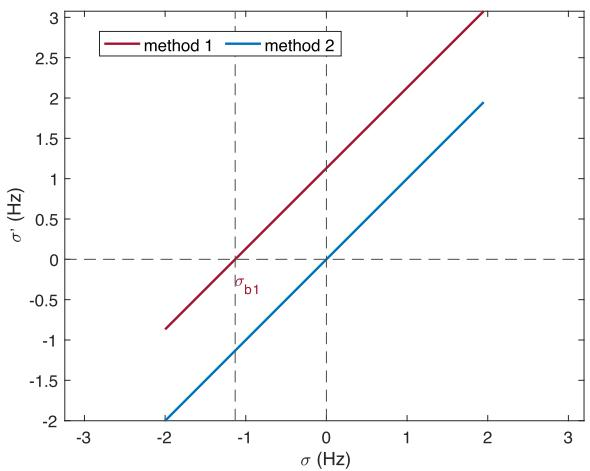  
Fig. 6. Real part of reconstructed eigenvalues with method 1 and method 2 with original σ changing.

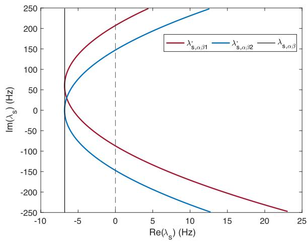  
Fig. 7. Vertical line eigenvalue mapping of method 1 and method 2 in s domain of stationary frame.

$[ - \infty , 0 ]$ , which maintains the numerical stability with $\sigma \leq 0$ in original modes.

Based on Fig. 5, Fig. 6 further focuses on the real part relationship, i.e., relationship between $\sigma ^ { \prime } = \operatorname { R e } ( \lambda _ { s , \ d q } ^ { \prime } )$ of the two methods and original $\sigma ~ = ~ \operatorname { R e } ( \lambda _ { s , \alpha \beta } )$ . It shows that the numerical stability of method 2 is almost unchanged because $\mathrm { R e } ( \lambda _ { s , \ d q 2 } ^ { \prime } )$ ≈ $\operatorname { R e } ( \lambda _ { s , \alpha \beta } )$ . However, for method 1, $\mathrm { R e } ( \lambda _ { s , \ d q 1 } ^ { \prime } ) > \mathrm { R e } ( \lambda _ { s , \ \alpha \beta } )$ with right shifting, which means the system stability is worsening.

2) Imaginary Part Analysis: Vertical Line Mapping: If an original system is stable with a fixed negative real part of eigenvalue (vertical line in s domain), the discretized system is stable only under some range of the original system oscillating at frequency ω. As shown in Fig. $7 \ : ( \sigma \ : = \ : - 6 . 8 )$ as an example, the original eigenvalue with a vertical line in s domain $\lambda _ { s , \alpha \beta } = \sigma \pm j \omega$ with σ fixed and ωvarying in [ 250, 250] is in black line.

To further highlight the influence on the system stability, the real part of the reconstructed system mode $\sigma ^ { \prime } = \mathrm { ~ R e } ( \lambda _ { s , \alpha \beta } ^ { \prime } )$

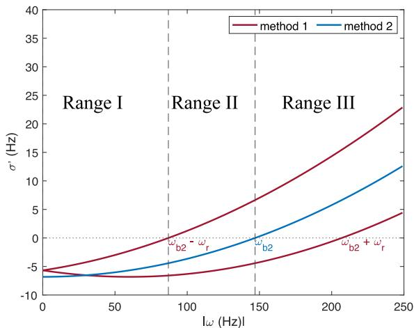  
Fig. 8. Real part of reconstructed eigenvalues in method 1 and method 2 with the original ωchanging in stationary frame.

of two methods with changing the frequency ω of the original system mode $\lambda _ { s , \alpha \beta }$ is shown in Fig. 8.

According to $\sigma ^ { \prime } =$ Re $( \lambda _ { s , \alpha \beta 2 } ^ { \prime } ) = 0$ in (21), the boundary frequency for method 2 is defined as

$$
\omega_ {b 2} = \sqrt {1 - \left(1 + \sigma_ {0} T\right) ^ {2}} / T. \tag {23}
$$

Similarly, the boundary frequency for method 1 is deduced as

$$
\omega_ {b 1} = \omega_ {b 2} \pm \omega_ {r}. \tag {24}
$$

As shown in Fig. 8 with absolute value of oscillating frequency |ω|, the stable range of |ω| for the two methods is achieved with $\sigma ^ { \prime } \le 0$ , which is divided into three regions by $\omega _ { b 2 }$ and $\omega _ { b 2 } - \omega _ { r }$ in the vertical line mapping:

- Range I $\left[ 0 , \omega _ { b 2 } - \omega _ { r } \right] .$ - both methods stable   
- Range II $[ \omega _ { b 2 } - \omega _ { r } , \omega _ { b 2 } ]$ - method 2 stable and method 1 unstable   
- Range III $\left[ \omega _ { b 2 } , \ + \infty \right]$ - both unstable

3) Complex Number Analysis: Plane Mapping: Supposing original eigenvalues of stationary frame in s domain $\lambda _ { s , \alpha \beta } =$ $\sigma \pm j \omega$ with σ varying in [−2,2] Hz and ω varying in [0,100] Hz shown as black plane in Fig. 9, the mapping planes with method 1 and method 2 are visualized as the blue area and red area respectively. The overall numerical performance of method 2 is better than that of method 1 because the red area shifts to right more than the blue area.

# C. Practical Recommendations

From the eigenvalue mapping, we see that discretization in the stationary and synchronous frames each has regions with superior convergence. It is preferred to perform discretization in the frame where the eigenvalue of the continuous system (s-domain) is closer to the origin of the complex plane, so that the discretization has higher fidelity in approximating the natural mapping. In power systems, physical inductors and capacitors present eigenvalues close to origin in the stationary frame, whereas integral controllers (such as the current control in gridfollowing inverters [29], [30], [31]) present eigenvalues close to

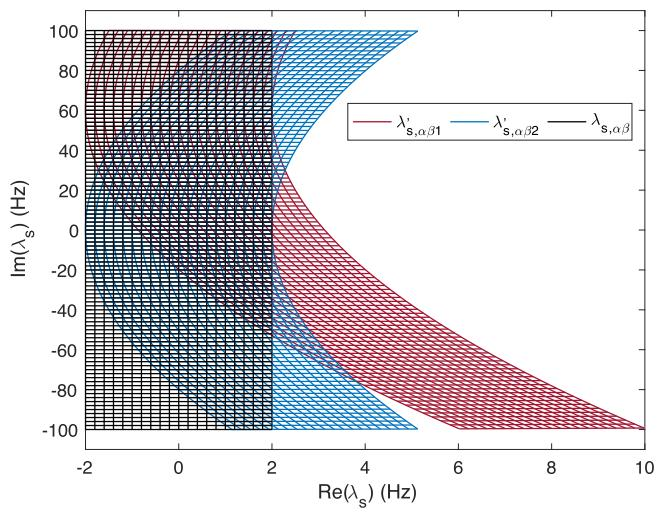  
Fig. 9. Plane eigenvalue mapping with method 1 and method 2 in s domain of stationary frame.

origin in the synchronous frame. It is therefore recommended to discretize inductors and capacitors in a stationary frame, and to discretize integral related control in a synchronous frame. This is especially important where explicit discretization is used.

It is worth mentioning that inverters in practice are normally digitally controlled and discretized by themselves. The inner current and voltage loops consist of digital (discretized) proportional-integral controllers in dq frames in most cases [29], [30], [31]. This is consistent with our recommendations.

If the time step (sample period) is sufficiently small, the difference between discretization methods vanishes according to the zero-stability of Euler method [27]. This, however, comes at the expense of long computation time. A proper discretization method allows for a higher time step without compromising accuracy.

# IV. CASE STUDY RESULTS

Single-machine-infinite-bus system [32] and modified IEEE 57-bus with multi-inverters are simulated to identify the impact of frame transformation via the Simplus Grid Tool [33]. The discretization in synchronous frame (method 1) and discretization in stationary frame (method 2) are implemented in each case study.

# A. Single-Machine-Infinite-Bus System

The stationary eigenvalue in the single-machine-infinite-bus model is a pure real value, which can be adjusted by changing the equivalent inner resistor value R of the output inductor of synchronous machine. The inductor value of SM model and line are $X = 0 . 3 \mathrm { p u }$ and $X _ { l } = 0 . 6 5$ pu respectively.

Case A.1 with $R = 0 . 0 0 3$ pu and Case A.2 with $R = 0 . 0 3$ pu are simulated, which is designed to achieve two different real eigenvalues located in $[ - \infty , \sigma _ { b 1 } ]$ and $[ \sigma _ { b 1 } , 0 ]$ respectively, where $\sigma _ { b 1 } = - 1 . 1 3 1 4$ in (22) shown in Fig. 6 of the horizontal mapping. The original eigenvalue $\lambda _ { s , \alpha \beta }$ and reconstructed eigenvalues $\lambda _ { s , d q 1 } ^ { \prime }$ and $\lambda _ { s , d q 2 } ^ { \prime }$ are summarized in Table II. And

TABLE II PARAMETER AND EIGENVALUES IN CASE A   

<table><tr><td>Case</td><td>R (pu)</td><td>λs,αβ (Hz)</td><td>Re(λ&#x27;s,dq1) (Hz)</td><td>Re(λ&#x27;s,dq2) (Hz)</td></tr><tr><td>A.1</td><td>0.003</td><td>-0.1895</td><td>0.9409</td><td>-0.1895</td></tr><tr><td>A.2</td><td>0.03</td><td>-1.8955</td><td>-0.7638</td><td>-1.8966</td></tr></table>

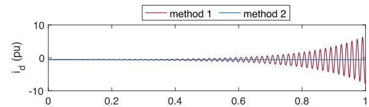

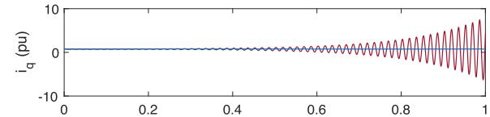

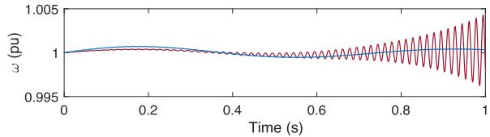  
(a) Case A.1

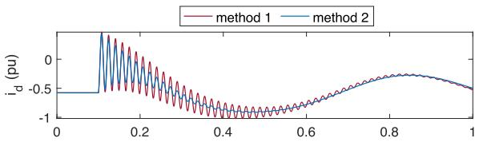

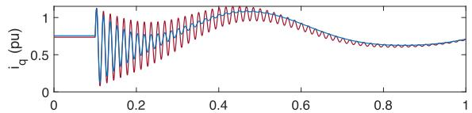

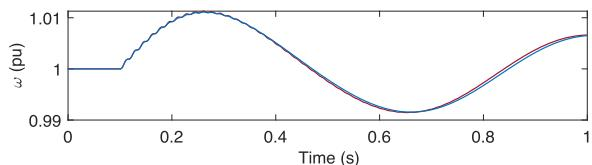  
(b) Case A.2   
Fig. 10. Case A system responses with methods 1 and 2.

the responses of synchronous currents $( i _ { d }$ and $i _ { q } )$ and system frequency ω with the two methods are collected to analyse in all cases.

1) Stability Validation: As can be seen from Table II, for case A.1, method 2 indicates the same stability as the original system (a stable system), but method 1 indicates an unstable system which worsens the system stability, as validated by simulation in Fig. 10(a). The eigenvalues of method 2 is also quite close

TABLE III PARAMETER AND EIGENVALUE IN CASE B   

<table><tr><td>Case</td><td>ωC (pu)</td><td>λs,αβ (Hz)</td><td></td><td>λ&#x27;s,dq1 (Hz)</td><td>λ&#x27;s,dq2 (Hz)</td></tr><tr><td rowspan="2">B.1</td><td rowspan="2">2.45</td><td rowspan="2">-6.8 + 83j</td><td>λ&#x27;s,dq+</td><td>-6.6470 + 23.0971j</td><td>-4.6347 + 23.2801j</td></tr><tr><td>λ&#x27;s,dq-</td><td>-0.36136 + 143.2257j</td><td>-4.6347 + 143.2801j</td></tr><tr><td rowspan="2">B.2</td><td rowspan="2">1.2</td><td rowspan="2">-6.8 + 120j</td><td>λ&#x27;s,dq+</td><td>-5.6748 + 60.2287j</td><td>-2.2648 + 60.2854j</td></tr><tr><td>λ&#x27;s,dq-</td><td>3.3860 + 180.0009j</td><td>-2.2649 + 180.2854j</td></tr><tr><td rowspan="2">B.3</td><td rowspan="2">0.1</td><td rowspan="2">-6.8 + 418j</td><td>λ&#x27;s,dq+</td><td>32.7933 + 353.6009j</td><td>46.7077 + 350.4456j</td></tr><tr><td>λ&#x27;s,dq-</td><td>62.4769 + 466.2395j</td><td>46.7077 + 470.4456j</td></tr></table>

to the original system eigenvalue. For Case A.2, both methods indicate a stable system, as validated by simulation in Fig. 10(b).

2) Transient Response: In Fig. 10(b), a disturbance (a 30-degree phase jump) is simulated to compare the system dynamic transient stability of the two methods. As can be seen, method 2 has a faster transient than method 1 which also indicates the better system stability, i.e., more damped system mode shown in Table II.

# B. Single-Machine-Infinite-Bus System With A Parallel Capacitor

A capacitor is further added in parallel with the synchronous machine with fixed parameters $R = 0 . 0 1 \mathrm { p u } , X = 0 . 3$ pu and $X _ { l } = 0 . 6 5 \mathrm { p u t o } ^ { \circ }$ “create” an oscillation mode with an imaginary part. The oscillation frequency can be adjusted by the capacitor.

The vertical line mapping in Fig. 8 in s domain with σ fixed can be applied with method 1 and method 2 to find the stable range of oscillation frequency (imaginary part of $\lambda _ { s , \alpha \beta } )$ with $\omega _ { b 2 } = 1 4 6 . 9 6 4$ calculated in (23). The oscillating frequency of Case B.1, Case B.2 and Case B.3 is designed in Range I, II and II correspondingly with different capacitor values, as summarized in Table III. The calculated s-domain eigenvalues with the two methods are also listed.

1) Stability Validation: The response results shown in Fig. 11 follow the numerical stability as deduced in the mathematical analysis in Case B.1 (both stable), Case B.2 (method 1 unstable and method 2 stable) and Case B.3 (both unstable). It is worth highlighted that, in Case B.2, an originally stable system does

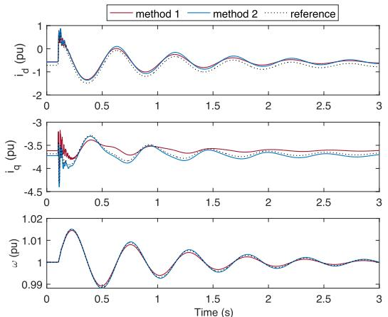  
(a) Case B.1

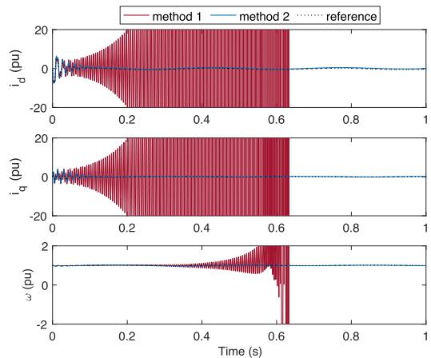  
(b) Case B.2

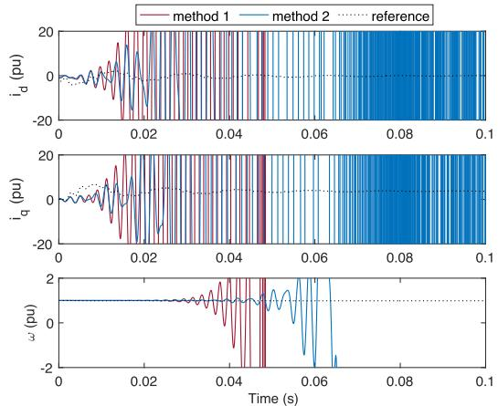  
(c) Case B.3   
Fig. 11. Case B system responses with methods 1 and 2. The reference is obtained by setting a very small time step in simulation, which is a good approximation of the real continuous response according to the zero-stability theorem [27].

not converge when discretized in synchronous frame (method 1) and would still be stable when discretized in stationary frame (method 2). In other words, method 2 reflects the stability of the original system better than method 1.   
2) Transient Response: The disturbance of a 30-degree phase jump is simulated at 0.1 s of Case B.1, as shown in Fig. 11(a).

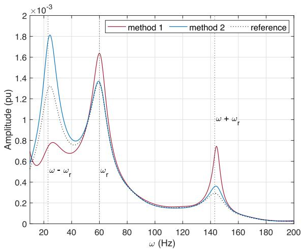  
Fig. 12. Spectral plot with Fourier analysis for Case B.1.

When the phase jump occurs, method 1 oscillates more in $i _ { d q }$ response in 143 Hz oscillation mode.

As shown in Fig. 12, Fourier analysis is performed on current responses for Case B.1 in Fig. 11(a). In the 60Hz mode, stationary discretization also has less oscillation, with the same conclusion as Case A.2. In the oscillation mode caused by the additional capacitor, the oscillation amplitude in method 1 (synchronization discretization) is larger at 143Hz and smaller at 23Hz than method 2 (stationary discretization), which can be explained in z-domain eigenvalue trajectory analysis of Fig. 4(b) with the prolonged and shrunk magnitude of method 1.

# C. IEEE 57-bus Multi-Inverter System

To further show the effectiveness of the proposed theory in an inverter-based system, a modified IEEE 57-bus system with inverters is simulated. The system parameters are exactly same to a standard IEEE 57-bus system [34], except that apparatuses at bus 2 and 12 are replaced by grid-following inverters and apparatuses at bus 1, 3, 6, 8 and 9 are replaced by grid-forming inverters. The transient responses of currents $( i _ { d }$ and $i _ { q } )$ and frequency ω with the two discretization methods are collected on all buses with inverters.

The integral control of inverters is all discretised in the synchronous frame. The filtering inductors of grid-forming inverters are discretised in either the synchronous frame (method 1) or stationary frame (method 2), and the results are compared.

As can been seen in Fig. 13(a), for the sampling rate of 60 kHz and sampling period T of 16.667 µs, the discretization in method 1 (all elements are discretized in synchronous frame) leads to unstable collapse but the method 2 (all elements is discretized in the stationary frame except integral controllers) gives a stable result.

A discretized system can always reflect the original system stability if the sampling period T is sufficiently small, regardless of the discretization method [27]. Here, we dramatically increase the sampling rate to 3000k Hz or equivalently reduce the sampling period T to 0.333 µs. The simulation results are

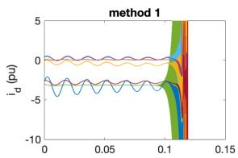

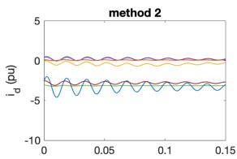

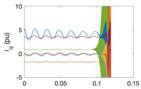

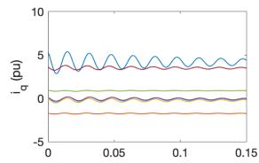

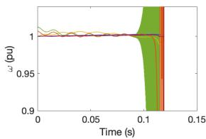

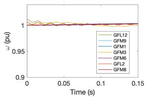  
(a)Case C.1

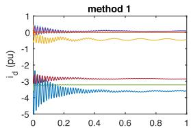

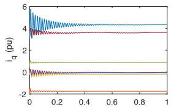

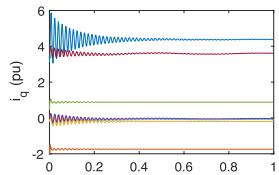

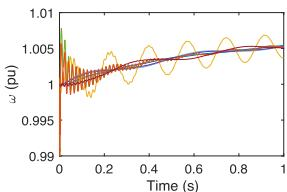

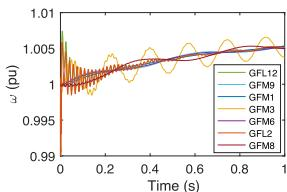  
(b）Case C.2   
Fig. 13. Case C IEEE 57-bus with inverters system response. (a) Case C.1 with sampling period 16.667 µs; (b) Case C.2 with sampling period 0.333 µs. The current and frequency waveforms of all inverters are illustrated. GFL and GFM represents gird following inverter and grid-forming inverter respectively. The number after GFM or GFL indicates the bus that the inverter is connected, e.g., GFL12 means the grid following inverter on bus 12.

shown in Fig. 13(b). Noticeably, both methods are stable now and the responses are almost similar.

However, an excessively small sampling period T dramatically slows down the computation speed, as compared in Table IV with Case C.1 (sampling period 16.667 µs) and case C.2 (0.333 µs) in Matlab. In addition, this sampling period 0.333 µs is even smaller than the minimal sampling period of some real-time simulation systems (e.g., Opal-RT has a minimal time step of 1 µs [12] for CPU based simulation), and therefore is not acceptable in certain practical applications.

TABLE IV COMPUTATION TIME COMPARISON FOR CASE C   

<table><tr><td>Case</td><td>Sampling Period</td><td>Computation Time</td><td>Method 1</td><td>Method 2</td></tr><tr><td rowspan="4">C.1</td><td rowspan="4">16.667 μs</td><td>No.1</td><td>82.620 s</td><td>74.381 s</td></tr><tr><td>No.2</td><td>81.642 s</td><td>73.171 s</td></tr><tr><td>No.3</td><td>80.887 s</td><td>73.571 s</td></tr><tr><td>Average</td><td>81.716 s</td><td>73.708 s</td></tr><tr><td rowspan="4">C.2</td><td rowspan="4">0.333 μs</td><td>No.1</td><td>3930.409 s</td><td>3740.620 s</td></tr><tr><td>No.2</td><td>4229.443 s</td><td>3607.101 s</td></tr><tr><td>No.3</td><td>4155.294 s</td><td>3758.425 s</td></tr><tr><td>Average</td><td>4105.048 s</td><td>3702.049 s</td></tr></table>

Additionally, from Table IV, we can observe that the computation time for methods 2 is slightly smaller than method 1 if the sampling period T and other parameters fixed. This is intuitive because the only difference between two methods is the frame transform which costs some extra computation efforts in simulation especially for method 1 which discretizes the system in synchronous frame rather than its original frame. This is another advantage of method 2.

# V. CONCLUSION

Power system numerical discretization is evaluated considering the impact of frame transformation in this article. The conclusion has been reached that, for an explicit discretization (e.g., forward Euler method), the stability of the original system is best preserved in the frame where the system eigenvalue is closer to the origin of the complex plane. For example, most electrical elements (e.g., inductors and capacitors of transmission lines and inverter filters, and flux inductors of grid-forming apparatuses) should be discretized in stationary frame directly. By contrast, dq-frame integral control (e.g., inner current controller for gridfollowing inverters) should be discretized in synchronous frame. This reduces the numerical error and improves the convergence of numerical analysis.

# REFERENCES

[1] M. O’Malley et al., “Enabling power system transformation globally: A system operator research agenda for bulk power system issues,” IEEE Power Energy Mag., vol. 19, no. 6, pp. 45–55, Nov./Dec. 2021.

[2] P. Kundur, N. J. Balu, and M. G. Lauby, Power System Stability and Control. New York, NY, USA: McGraw-hill, 1994.   
[3] R. Kuffel, P. Forsyth, and C. Peters, “The role and importance of real time digital simulation in the development and testing of power system control and protection equipment,” IFAC-PapersOnLine, vol. 49, no. 27, pp. 178–182, Jan. 2016.   
[4] Y. Gu and T. C. Green, “Power system stability with a high penetration of inverter-based resources,” Proc. IEEE, early access, Jun. 15, 2022, doi: 10.1109/JPROC.2022.3179826.   
[5] Y. Li, Y. Gu, and T. C. Green, “Mapping of dynamics between mechanical and electrical ports in SG-IBR composite grids,” IEEE Trans. Power Syst., vol. 37, no. 5, pp. 3423–3433, Sep. 2022.   
[6] Y. Li, Y. Gu, and T. C. Green, “Interpreting frame transformations in AC systems as diagonalization of harmonic transfer functions,” IEEE Trans. Circuits Syst. I: Regular Papers, vol. 67, no. 7, pp. 2481–2491, Jul. 2020.   
[7] Y. Gu, J. Liu, T. C. Green, W. Li, and X. He, “Motion-induction compensation to mitigate sub-synchronous oscillation in wind farms,” IEEE Trans. Sustain. Energy, vol. 11, no. 3, pp. 1247–1256, Jul. 2020.   
[8] “TOTEM (Transmission owner tools for EMT modelling) Extension | ENA innovation portal.” Accessed: Dec. 9, 2022. [Online]. Available: https: //smarter.energynetworks.org/projects/nia_shet_0035/   
[9] U. M. Ascher and L. R. Petzold, Computer Methods for Ordinary Differential Equations and Differential-Algebraic Equations, Philadelphia, PA, USA: Soc. Ind. Appl. Math. (SIAM), 1998.   
[10] F. Arredondo, E. D. Castronuovo, P. Ledesma, and Z. Leonowicz, “Analysis of numerical methods to include dynamic constraints in an optimal power flow model,” Energies, vol. 12, no. 5, pp. 2–3, 2019.   
[11] A. Iserles, A First Course in the Numerical Analysis of Differential Equations, 2nd ed. Cambridge, U.K.: Cambridge Univ. Press, 2008.   
[12] “Software simulation │ real time applications │ RT labs.” Accessed: Nov. 23, 2022. [Online]. Available: https://www.opal-rt.com/software-rt-lab/   
[13] J. Mahseredjian, V. Dinavahi, and J. A. Martinez, “Simulation tools for electromagnetic transients in power systems: Overview and challenges,” IEEE Trans. Power Del., vol. 24, no. 3, pp. 1657–1669, Jul. 2009.   
[14] G. F. Lauss, M. O. Faruque, K. Schoder, C. Dufour, A. Viehweider, and J. Langston, “Characteristics and design of power hardware-in-the -loop simulations for electrical power systems,” IEEE Trans. Ind. Electron., vol. 63, no. 1, pp. 406–417, Jan. 2016.   
[15] H. W. Dommel, “Digital computer solution of electromagnetic transients in single-and multiphase networks,” IEEE Trans. Power App. Syst., vol. PAS-88, no. 4, pp. 388–399, Apr. 1969.   
[16] G. Tzounas, I. Dassios, and F. Milano, “Small-signal stability analysis of numerical integration methods,” IEEE Trans. Power Syst., vol. 37, no. 6, pp. 4796–4806, Jan. 2022.   
[17] E. Süli and D. F. Mayers, An Introduction to Numerical Analysis. Cambridge, U.K.: Cambridge Univ. Press, 2003.   
[18] “Simulating discretized electrical systems - MATLAB & simulink - mathworks United Kingdom.” Accessed: Dec. 10, 2022. [Online]. Available: https://uk.mathworks.com/help/sps/powersys/ug/simulatingdiscretized-electrical-systems.html#btb4ucb-1   
[19] “Powergui - environment block for Simscape Electrical Specialized Power Systems models - Simulink.” Accessed: Dec. 10, 2022. [Online]. Available: https://uk.mathworks.com/help/sps/powersys/ref/powergui.html   
[20] M. O. Faruque, Y. Zhang, and V. Dinavahi, “Detailed modeling of CIGRÉ HVDC benchmark system using PSCAD/EMTDC and PSB/SIMULINK,” IEEE Trans. Power Deliv., vol. 21, no. 1, pp. 378–387, Jan. 2006.   
[21] J. Mahseredjian and F. Alvarado, “Creating an electromagnetic transients program in MATLAB: MatEMTP,” IEEE Trans. Power Deliv., vol. 12, no. 1, pp. 380–387, Jan. 1997.   
[22] “Overview | PSCAD.” Accessed: Nov. 22, 2022. [Online]. Available: https: //www.pscad.com/software/pscad/overview   
[23] “Solve stiff odes - MATLAB & Simulink - MathWorks United Kingdom.” Accessed: Dec. 9, 2022. [Online]. Available: https://uk.mathworks.com/ help/matlab/math/solve-stiff-odes.html   
[24] “Electromagnetic transients (EMT) - DIgSILENT.” Accessed: Nov. 22, 2022. [Online]. Available: https://www.digsilent.de/en/ electromagnetic-transients-emt.html   
[25] “Real-time simulation - Real-Time Solutions - OPAL-RT.” Accessed: Nov. 22, 2022. [Online]. Available: https://www.opal-rt.com/   
[26] F. Li et al., “Review of real-time simulation of power electronics,” J. Modern Power Syst. Clean Energy, vol. 8, no. 4, pp. 796–808, Jul. 2020.   
[27] L. F. Shampine, Numerical Solution of Ordinary Differential Equations. Abingdon, U.K.: Routledge, 1994.   
[28] K. D. Mease, S. Bharadwaj, and S. Iravanchy, “Timescale analysis for nonlinear dynamical systems,” J. Guid., Control, Dyn., vol. 26, no. 2, pp. 318–330, 2003.

[29] Y. Li, Y. Gu, and T. C. Green, “Revisiting grid-forming and grid-following inverters: A duality theory,” IEEE Trans. Power Syst., vol. 37, no. 6, pp. 4541–4554, Nov. 2022.   
[30] Y. Li, Y. Gu, Y. Zhu, A. Junyent-Ferre, X. Xiang, and T. C. Green, “Impedance circuit model of grid-forming inverter: Visualizing control algorithms as circuit elements,” IEEE Trans. Power Electron., vol. 36, no. 3, pp. 3377–3395, Mar. 2021.   
[31] J. Rocabert, A. Luna, F. Blaabjerg, and P. Rodríguez, “Control of power converters in AC microgrids,” IEEE Trans. Power Electron., vol. 27, no. 11, pp. 4734–4749, Nov. 2012.   
[32] Y. Gu, Y. Li, Y. Zhu, and T. C. Green, “Impedance-based whole-system modeling for a composite grid via embedding of frame dynamics,” IEEE Trans. Power Syst., vol. 36, no. 1, pp. 336–345, Jan. 2021.   
[33] “GitHub - future-power-networks/simplus-grid-tool.” Accessed: Jul. 21, 2022. [Online]. Available: https://github.com/Future-Power-Networks/Simplus-Grid-Tool   
[34] “IEEE 57-Bus System - Illinois Center for a smarter Electric Grid (IC-SEG).” Accessed: Nov. 22, 2022. [Online]. Available: https://icseg.iti. illinois.edu/ieee-57-bus-system/

Jiahang Li (Student Member, IEEE) received the B.Eng. degree from North China Electric Power University, Baoding, China, and the University of Manchester, Manchester, U.K., in 2018. He is currently working toward the Ph.D. degree with the University of Bath, Bath, U.K. His research interests include data analysis and numerical integration in power system.

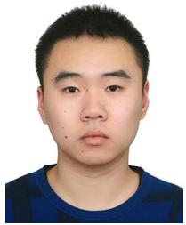

Yitong Li (Member, IEEE) received the B.Eng. degrees in electrical engineering from the Huazhong University of Science and Technology, Wuhan, China, and the University of Birmingham, Birmingham, U.K., in 2015, and the M.Sc. degree in future power networks and the Ph.D. degree in electrical engineering from Imperial College London, London, U.K., in 2016 and 2021, respectively. His research interests include control of power electronic converters and analysis of power system dynamics.

Yunjie Gu (Senior Member, IEEE) received the B.Sc. and Ph.D. degrees in electrical engineering from Zhejiang University, Hangzhou, China, in 2010 and 2015, respectively. He was a UKRI Innovation Fellow with Imperial College London, London, U.K., where he is currently a Lecturer of power systems. Before his academic career, he was with General Electric Global Research Centre, Shanghai. His research interests include the fundamental theories and computational tools for stability analysis of power-electronic-based low-carbon power systems, and new technologies for stability enhancement.