# Implementation of the universal line model in the alternative transients program✰

Felipe O.S. Zanon a,* , Osis E.S. Leal b , Alberto De Conti

a Graduate Program of Electrical Engineering (PPGEE), UFMG, Brazil   
b UTFPR – Federal University of Technology – Parana, ´ Pato Branco, Brazil   
c Department of Electrical Engineering (DEE), Federal University of Minas Gerais (UFMG), Brazil

# A R T I C L E I N F O

# Keywords:

Electromagnetic transients

Transmission line models

Phase-domain models

EMT-type programs

Frequency-dependent soil parameters

# A B S T R A C T

The universal line model (ULM) is a transmission line model developed directly in the phase domain that is recognized for its accuracy and generality. It is currently the reference model for transient studies, but is exclusively found on commercial electromagnetic transients programs. This paper describes an implementation of ULM in the Alternative Transients Program (ATP), which is free for licensed users, using the foreign models tool and the type-94 component available in this platform. The implemented model is validated through comparisons with EMTP-RV. Then, it is used to investigate transients on overhead transmission lines considering a rigorous representation of the ground return impedance and ground admittance assuming frequency-dependent ground parameters.

# 1. Introduction

The analysis of transients on realistic power systems is usually performed in electromagnetic transient (EMT) simulators. For this, the correct modeling of the system components is crucial, especially the solution of the transmission line equations in the time domain. The two most popular transmission line models currently available in EMT-type tools are the frequency-dependent model proposed by Marti (JMarti) [1] and the Universal Line Model (ULM) [2].

Marti’s model solves the transmission line equations in the modal domain considering a real and constant transformation matrix. The magnitudes of the propagation function and characteristic impedance of each line mode are represented as rational functions using Bode’s asymptotic fitting [3]. The resulting model can accurately simulate a number of overhead line configurations [4], even if frequency-dependent ground parameters are considered [5]. However, it is not recommended to simulate underground cable systems and strongly asymmetric overhead transmission lines because the associated eigenvectors present a strong variation with frequency. In this case, the assumption of a real and constant transformation matrix no longer holds.

ULM circumvents the limitations of Marti’s model by solving telegrapher’s equations directly in the phase domain. It has been successfully used to simulate transients on overhead transmission lines and underground cables [6]. The model is based on the fitting of both the characteristic admittance matrix $Y _ { C }$ and the propagation matrix H with complex poles and zeros [7]. The development of ULM is relatively recent and the model has been continuously improved [8].

Despite its advantages over Marti’s model, ULM is only available in commercial EMT simulators (e.g., [9, 10]). Its absence in the Alternative Transients Program (ATP), which is free to licensed users, frequently poses difficulties to the analysis of transient phenomena for which Marti’s model is not sufficiently accurate. In principle, this problem could be overcome with Noda’s phase-domain transmission line model [11], which is available in ATP. However, this model is sensitive to the selected time step and prone to fitting errors [12]. As a consequence, it is often difficult for ATP users to deal with cases that require a phase-domain line model. This context has motivated this paper, which presents an implementation of ULM in ATP. In this proposal, the line parameters are first calculated and fitted in MATLAB. The fitted parameters are then used as input parameters of a code written in C language that implements the ULM equations. The code is finally interfaced

with ATP as a foreign model using a type-94 component [13].

This paper is organized as follows. Section II discusses ULM in brief. Section III presents its implementation in ATP. Section IV validates the implemented model using EMTP-RV as a reference. Section V evaluates the impact of considering more rigorous formulations for the calculation of the ground return impedance and per-unit-length admittance including frequency-dependent soil electrical parameters. Finally, Section VI presents the conclusions.

# 2. ULM

ULM is presented in detail in [2]. This section aims to highlight the aspects of the model that are the most important for its implementation.

# 2.1. Model formulation

The currents and voltages at terminals k and m of a transmission line of length ℓ with $N _ { C }$ conductors (see Fig. 1) are related in the frequency domain as [7]

$$
\boldsymbol {I} _ {k} - \boldsymbol {Y} _ {c} \boldsymbol {V} _ {k} = - \boldsymbol {H} \left(\boldsymbol {I} _ {m} + \boldsymbol {Y} _ {c} \boldsymbol {V} _ {m}\right), \tag {1}
$$

$$
\boldsymbol {I} _ {m} - \boldsymbol {Y} _ {c} \boldsymbol {V} _ {m} = - \boldsymbol {H} (\boldsymbol {I} _ {k} + \boldsymbol {Y} _ {c} \boldsymbol {V} _ {k}), \tag {2}
$$

where $V _ { k }$ and $I _ { k }$ are the voltage and current vectors at the sending end of the line, $V _ { m }$ and $I _ { m }$ are the voltage and current vectors at the receiving end of the line, $Y _ { c }$ is the characteristic admittance matrix, given by

$$
\boldsymbol {Y} _ {C} = \boldsymbol {Y} ^ {- 1} \sqrt {\boldsymbol {Y Z}}, \tag {3}
$$

and H is the propagation function, given by

$$
\boldsymbol {H} = e ^ {\sqrt {\mathrm {Y Z}} \ell}, \tag {4}
$$

where Z and Y are respectively the per-unit-length series impedance and shunt admittance of the line, both square matrices of order $N _ { C }$ .

Eqs. (1) and (2) are the basis of ULM. They lead to the equivalent circuit shown in Fig. 2, where $\scriptstyle B _ { k }$ and $\scriptstyle { B _ { m } }$ are

$$
\boldsymbol {B} _ {k} = \boldsymbol {H} \left(\boldsymbol {I} _ {m} + \boldsymbol {Y} _ {c} \boldsymbol {V} _ {m}\right), \tag {5}
$$

$$
\boldsymbol {B} _ {m} = \boldsymbol {H} \left(\boldsymbol {I} _ {k} + \boldsymbol {Y} _ {c} \boldsymbol {V} _ {k}\right). \tag {6}
$$

The time-domain equivalents of (1) and (2) read

$$
\boldsymbol {i} _ {\boldsymbol {k}} (t) - \boldsymbol {y} _ {\boldsymbol {C}} (t) * \boldsymbol {v} _ {\boldsymbol {k}} (t) = - \boldsymbol {b} _ {\boldsymbol {k}} (t), \tag {7}
$$

$$
\boldsymbol {i} _ {m} (t) - \boldsymbol {y} _ {C} (t) * \boldsymbol {v} _ {m} (t) = - \boldsymbol {b} _ {m} (t), \tag {8}
$$

$$
\boldsymbol {b} _ {k} (t) = \boldsymbol {h} (t) * \left[ \boldsymbol {i} _ {m} (t) + \boldsymbol {y} _ {c} (t) * \boldsymbol {v} _ {m} (t) \right], \tag {9}
$$

$$
\boldsymbol {b} _ {m} (t) = \boldsymbol {h} (t) * [ \boldsymbol {i} _ {k} (t) + \boldsymbol {y} _ {c} (t) * \boldsymbol {v} _ {k} (t) ], \tag {10}
$$

where the variables represented with lowercase letters are the timedomain counterparts of the respective quantities in $\left( 1 \right) - \left( 6 \right) ,$ , and the symbol ‘*’ indicates the convolution operation. To solve the convolutions in (7)-(10) efficiently, it is necessary to approximate $y _ { C } ( t )$ and ${ \mathbf { } } h ( t )$ as sums of exponentials [7]. In ULM, this process is performed in the frequency domain by fitting $Y _ { C }$ and H as sums of rational functions as

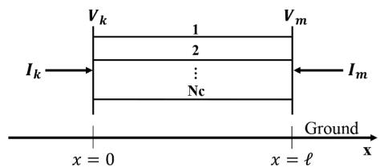  
Fig. 1. Transmission line of length ℓ.

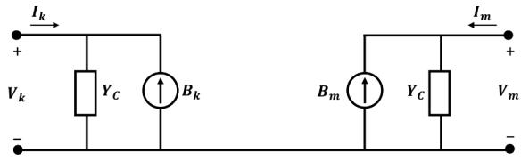  
Fig. 2. Frequency-domain equivalent circuit of ULM.

described in the next sections.

# 2.2. Characteristic admittance matrix $\mathbf { Y } _ { \mathbf { C } }$

The characteristic admittance matrix presents a smooth behavior and can be fitted directly in the phase domain with a relatively small number of poles [14]. The poles of the approximate matrix $\widetilde { Y } _ { C }$ are obtained by fitting the trace of $\scriptstyle \mathbf { Y } _ { C } $ with the vector fitting technique [15]. Thereby, all elements of $\widetilde { Y } _ { C }$ are represented using a single set of poles. The residuals associated with each element of $\widetilde { Y } _ { C }$ are obtained as the solution of a weighted least squares problem. The approximate matrix is represented as

$$
\boldsymbol {Y} _ {C} \approx \widetilde {\boldsymbol {Y}} _ {C} = \boldsymbol {k} _ {0} + \sum_ {n = 1} ^ {N _ {p Y}} \frac {\boldsymbol {k} _ {n}}{s - a _ {n}} \tag {11}
$$

where s is the complex frequency, k is a real matrix, k : $k _ { N p Y }$ are real or complex matrices of residues associated with each element of $\mathit { r } _ { c } ,$ and a1 : aNpY are the $N _ { p Y }$ poles required for fitting $Y _ { C }$ .

# 2.3. Propagation matrix H

The fitting of the propagation matrix first requires H to be transformed to its modal domain equivalent $e ^ { - { \sqrt { \lambda } } \ell }$ as

$$
e ^ {- \sqrt {\lambda} \ell} = T _ {I} ^ {- 1} H T _ {I} \tag {12}
$$

where the columns of matrix $T _ { I }$ contain the eigenvectors of YZ and λ is a diagonal matrix with the eigenvalues of $\mathbf { \mathit { 1 Z } } ,$ both calculated using the Newton-Raphson method as in [16]. Eq. (12) can then be rewritten as [2]

$$
\boldsymbol {H} = \sum_ {j = 1} ^ {N _ {\text {m o d}}} \boldsymbol {D} _ {j} e ^ {- \sqrt {\lambda_ {j}} \ell}, \tag {13}
$$

where the index j refers to the j-th transmission line mode, and $N _ { m o d }$ is the total number of modes. Matrices $D _ { j }$ are obtained by multiplying the jth column of $T _ { I }$ by the j-th row of $\left( T _ { I } \right) ^ { - 1 }$ [2]. Each exponential term in (13) corresponds to the propagation function associated with a given mode, whose fitting is performed indirectly by defining $P _ { j }$ as [1]

$$
P _ {j} = e ^ {- \sqrt {j _ {j}} \ell} e ^ {\mathrm {s t} j}, \tag {14}
$$

where $\tau _ { j }$ is the minimum time delay associated with j-th mode. The use of the lossless propagation time delay for τ can lead to a significant loss of accuracy in the fitting process. The procedure proposed in [8] was adopted in this paper to determine the time delay that generates the smallest fitting error for a given approximation order.

The approximate matrix H ̃ can then be represented as

$$
\boldsymbol {H} \approx \widetilde {\boldsymbol {H}} = \sum_ {j = 1} ^ {N _ {m o d}} \left(\sum_ {i = 1} ^ {N _ {p H}} \frac {\overline {{\boldsymbol {c}}} _ {i j}}{s - \overline {{\boldsymbol {a}}} _ {i}}\right) e ^ {- s \tau_ {j}}, \tag {15}
$$

where $\overline { { a } } _ { 1 } : \overline { { a } } _ { N p H }$ are the $N _ { p H }$ poles required for fitting $P _ { j }$ using the vector fitting technique, and $\overline { { c } } _ { i j }$ are matrices of residuals that approximate $D _ { j } P _ { j }$ assuming the same poles of $P _ { j }$ [2].

# 2.4. Time domain implementation

The numerical solution of (7)-(10) in the time domain using recursive convolutions results in the Norton-equivalent circuit shown in Fig. 3, where G is the conductance matrix defined as

$$
\boldsymbol {G} = \boldsymbol {k} _ {0} + \sum_ {n = 1} ^ {N _ {p Y}} \boldsymbol {q} _ {n}, \tag {16}
$$

and $i _ { k h i s t } ( t )$ is the historical current source calculated as

$$
\boldsymbol {i} _ {\text {k h i s t}} (t) = - \boldsymbol {j} _ {\boldsymbol {k h}} (t - \Delta t) + \boldsymbol {b} _ {\boldsymbol {k}} (t). \tag {17}
$$

The term $j _ { k h } ( t )$ is calculated as follows

$$
\boldsymbol {j} _ {k h} (t - \Delta t) = \sum_ {n = 1} ^ {N _ {p Y}} \left[ p _ {n} \boldsymbol {j} _ {k n} (t - \Delta t) \right] + \left(\sum_ {n = 1} ^ {N _ {p Y}} \boldsymbol {r} _ {n}\right) \boldsymbol {v} _ {k} (t - \Delta t). \tag {18}
$$

where

$$
\boldsymbol {j} _ {k n} (t) = p _ {n} \boldsymbol {j} _ {k n} (t - \Delta t) + \boldsymbol {q} _ {n} \cdot \boldsymbol {v} _ {k} (t) + \boldsymbol {r} _ {n} \cdot \boldsymbol {v} _ {k} (t - \Delta t). \tag {19}
$$

The constants $p _ { n } , q _ { n }$ and $r _ { n }$ are given by [17]

$$
p _ {n} = \left(2 + a _ {n} \Delta t\right) / \left(2 - a _ {n} \Delta t\right), \tag {20}
$$

$$
\boldsymbol {q} _ {n} = \boldsymbol {r} _ {n} = \boldsymbol {k} _ {n} \Delta t / 2 - a _ {n} \Delta t. \tag {21}
$$

where Δt is the simulation step. The term ${ \pmb b } _ { k } ( t )$ , in turn, is calculated as follows

$$
\boldsymbol {b} _ {\boldsymbol {k}} (t) = \sum_ {j = 1} ^ {N _ {m o d}} \sum_ {i = 1} ^ {N _ {p H}} \bar {p} _ {i} \bar {\boldsymbol {b}} _ {i j} (t - \Delta t) + \sum_ {j = 1} ^ {N _ {m o d}} \left[ \left(\sum_ {i = 1} ^ {N _ {p H}} \bar {\boldsymbol {q}} _ {i j}\right) \boldsymbol {f} _ {k, j} (t) \right] \tag {22}
$$

where

$$
\overline {{\boldsymbol {b}}} _ {i j} (t) = \bar {p} _ {i} \bar {\boldsymbol {b}} _ {i j} (t - \Delta t) + \bar {\boldsymbol {q}} _ {i j} \boldsymbol {f} _ {k, j} (t), \tag {23}
$$

$$
\boldsymbol {f} _ {k j} (t) = \bar {\boldsymbol {f}} _ {k j} (t - \tau_ {j}) + \bar {\boldsymbol {f}} _ {k j} (t - \Delta t - \tau_ {j}), \tag {24}
$$

$$
\bar {f} _ {k, j} (t) = i _ {m, h i s t} (t) + 2 i _ {m} (t). \tag {25}
$$

The constants $\overline { { p } } _ { i }$ and $\overline { { \pmb { q } } } _ { j i }$ are given by [17]

$$
\bar {p} _ {i} = \left(2 + \bar {a} _ {i} \Delta t\right) / \left(2 - \bar {a} _ {i} \Delta t\right), \tag {26}
$$

$$
\bar {\boldsymbol {q}} _ {i j} = \bar {\boldsymbol {c}} _ {i j} \Delta t / \left(2 - \bar {a} _ {i} \Delta t\right). \tag {27}
$$

For the calculation of $i _ { m h i s t } ( t ) _ { ; }$ , it suffices to change subscript k to m (17)-(27), and vice-versa. Since there is no way to ensure that $\tau _ { j }$ is an integer multiple of $\Delta t ,$ the computational implementation of the equations for calculating ${ \pmb b } _ { k } ( t )$ and $\boldsymbol { b } _ { m } ( t )$ requires interpolation. In this paper, linear interpolation was adopted in order to sample the values of $f _ { k , j } ( t )$ and $f _ { m , j } ( t )$ at instants (t − Δt − τ ) and (t − τ ).

# 3. Implementation strategy

The implementation of ULM in ATP follows a strategy that combines the use of MATLAB, in a first stage, and ATP, in a second stage, as shown in Fig. 4. Initially, the user enters the transmission line data through a

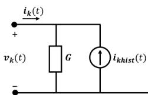

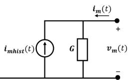  
Fig. 3. Time-domain equivalent circuit of ULM.

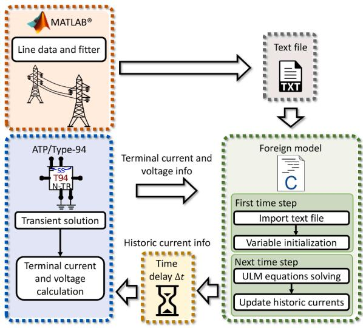  
Fig. 4. Diagram of the strategy used in the implementation of ULM in ATP.

graphical interface developed in the GUIDE environment of MATLAB. The associated code is responsible for calculating the line parameters, the time delays, and the functions Y and H plus their fitting. In the end, a text file is generated containing the poles and residues of $Y _ { c }$ and $H ,$ the elements of G, and the minimum time delays associated with each mode. This file acts as a link between MATLAB and ATP, containing all information necessary to perform the transient simulation in ULM.

In the second stage, a foreign model implemented in ATP reads the text file generated by MATLAB. In this model, the ULM Eqs. (16)-(27) were implemented in ANSI C language. The program initializes the variables necessary for calculating the transient in the first time step. From the voltages and currents at the line terminals, the foreign model calculates the historical currents, feeding back a type-94 component in ATP at each time step. Since the communication of the foreign model with ATP occurs with a delay of one time step [13], this effect is compensated in the calculation of the historical current sources. Finally, ATP returns the values of the terminal voltages and currents to the foreign model. More details on the implemented foreign model are presented in the next subsection.

# 3.1. Foreign model

Foreign model is a tool available in ATP which allows the creation of new models using high-level programming languages such as $\mathrm { C } / C { + + } .$ . The use of the foreign model in this paper required the manipulation of the following three files:

• ULM.c: source code of the ULM written in ANSI C. The program follows all the syntax and programming of a common ANSI C code. However, its structure must contain the functions “ULM_i” (function executed in the first time step) and “ULM_m” (executed in the next time steps). These functions must be registered in the file “fgnmod.f”. The variables xdata, xin, xout, xvar are ATP standards and must be present in the C program because they link ATP information with the foreign model. The flowchart of ULM.c is presented in Fig. 5.   
• makefile_c: This file is responsible for telling the compiler which files and libraries are linked to ATP, including saying which compiler will do that task.   
• fgnmod.f: this is where the foreign model is registered. In the subroutine "FGNMOD" it is possible to register foreign models as they are declared in the models present in ATP.

The program is compiled and linked to tpbig.exe, which now contains the developed foreign model.

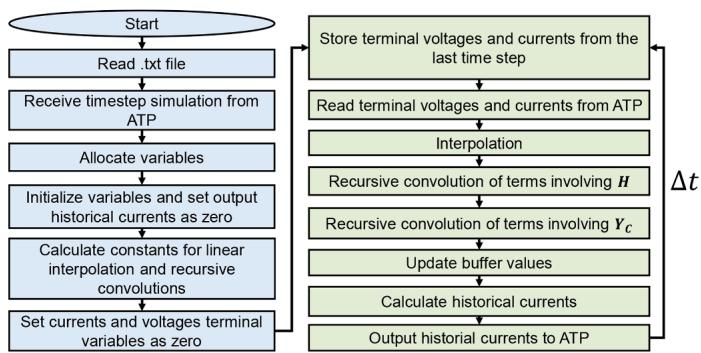  
Fig. 5. Flowchart of ULM.c.

# 3.2. Norton type-94 with transmission

The equivalent circuit shown in Fig. 3 is the basis for implementing ULM in ATP, and “Norton type-94 with transmission” is the most suitable component in ATP to model this circuit. The type-94 component is a user-defined multi-branch circuit component. The operation of the component is completely described in the MODELS section of the data case. The model can be written as a native model using the MODELS language, or it can call a foreign model using other programming languages [13]. The inputs, outputs and internal default variables described below are intrinsic to the component (including the names of the variables):

• Input: left-node voltage and right-node voltage at time t; vectors if multi-node;   
• Output: two Norton equivalent circuits of the component in the form of a current source in parallel with the equivalent conductance of the component; if multi-node, the current source is a vector, and the conductance is a matrix; values of current source and admittance are predicted for next time step.   
• Internal variables: Norton source values and conductances at left and right terminals.

Fig. 6 shows the equivalence between the default variables required by the type-94 component and the time-domain equivalent circuit of ULM, shown in Fig. 3. The variables starting with ‘r’ refer to the right terminal, and those starting with ‘l’ refer to the left terminal. The number of phases is represented by the variable ‘n’, which cannot be changed, and ‘ng’ is the number of elements to represent the conductance required by the type-94 component. The historical current sources are represented by the variables ‘lis’ and ‘ris’, which receive their values through the foreign model. The foreign model, in turn, receives the voltage (lv, rv) and current (li, ri) signals from the transmission line terminations. Since the output of the foreign model is sent to ATP with one time step delay, the historical currents are advanced by one time step in the memory buffer used in the program. The terms related to the conductance matrix G are calculated by ATP from ‘lg’ and ‘rg’. Fig. 7 illustrates the use of a type-94 element to represent a six-phase transmission line modeled with ULM in ATPDraw.

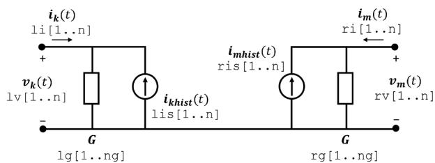  
Fig. 6. n-phase equivalent circuit of ULM in ATPDraw.

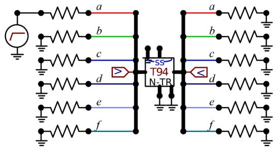  
Fig. 7. Six-phase equivalent circuit of ULM implemented in ATPDraw using a type-94 element.

# 3.3. Per-unit-length parameter calculation

The per-unit-length parameter calculation is performed in MATLAB considering expressions for the external inductance and capacitance of the line that are based on the assumption of widely-spaced conductors [18]. The internal impedance is calculated using the approximate expression given in [18], which presents a good agreement with the exact solution valid for tubular conductors in the whole frequency range.

The modeling of a lossy soil is relevant for the analysis of transients in transmission lines. Traditionally, in EMT simulation tools either Carson’s equations [19] or their logarithmic approximations [20] are used for representing the ground return impedance. Also, the ground admittance is neglected. Finally, constant soil parameters are assumed. This set of assumptions is only valid if the soil is a good conductor, that is, if σ≫ωε, where σ is the soil conductivity, ω is the angular frequency, and ε is the soil permittivity. This poses restrictions to the simulation of high-frequency transients on transmission lines located above a poorly conducting soil.

In the ULM implementation presented this paper, the limitations above are overcome by calculating the ground-return impedance with Nakagawa’s integral equation [21], which is a quasi-TEM approximation of the full wave model proposed by Kikuchi [22]. As opposed to Carson’s equations, this equation can be used for simulating high-frequency transients even in poorly conducting soils. Also, it allows the consideration of values of relative permittivity other than unity, which is implicitly assumed in Carson’s work [5]. If σ≫ωε is assumed, Nakagawa’s equations reduce to Carson’s equations [5]. Similarly as in [5], the ground admittance was considered using Wise’s integral equation [21,23]. For representing a frequency-dependent soil, the causal model of Alipio and Visacro was used [24].

# 4. Model validation

# 4.1. Case A: Double-circuit transmission line

Case A considers a 10-km long 230-kV three-phase line with two shield wires and a 115-kV three-phase horizontal line running in parallel [25], as shown in Fig. 8. In this test case, a step voltage was applied at the sending end of the 230-kV line, on phase a, assuming all remaining line terminals to be grounded on terminal k and open-ended on terminal m. The voltages induced on the 115-kV line were calculated considering terminal k grounded and terminal m open-ended, as shown in Fig. 9. In all simulations, the fitting was performed from $1 0 ^ { - 1 }$ to ${ 1 0 } ^ { 8 }$ Hz considering a shunt conductance of $0 . 2 \times 1 0 ^ { - 9 } \ \mathrm { S / m }$ . The fitting process considered 20 poles for $Y _ { C }$ and H, and the ground return impedance was calculated using Carson’s integral equations [19]. In order to provide a fair comparison with the transmission line models available in EMT simulators, the ground admittance was neglected.

Fig. 10 shows voltages calculated on phase d at terminal m of the 115-kV line considering the ULM component implemented in ATP (ULM-ATP), ULM available in EMTP-RV (ULM-RV), and JMarti model

available in ATP. The simulations considered a soil resistivity of 100 Ωm and constant soil parameters. It is observed that the voltage waveforms calculated with ULM-ATP and ULM-RV are coincident, which validates the implemented model. Although not shown, similar results were ob tained for the remaining phase conductors. The voltage waveform calculated with Marti’s model exhibits some deviations when compared with ULM, but the model performance can be considered acceptable. The observed differences are due to the fact that the eigenvectors associated with the line configuration shown in Fig. 8 present a nonnegligible variation with frequency.

Fig. 11 repeats the previous simulation, except that now a 10,000 Ωm soil resistivity is considered. Once again, an overlapping is observed between the curves calculated with ULM-ATP and ULM-RV, whereas the voltage waveform calculated with Marti’s model present small deviations due to the use of a real and constant transformation matrix.

# 4.2. Case B: Rural distribution line parallel with a fence

Case B considers a 3-km long rural distribution line 2-m apart from a fence, as shown in Fig. 12. A step voltage was applied at the sending end of the line, on phase a, assuming the remaining line terminals to be grounded on terminal k and open-ended on terminal m. The fence conductors were left open-ended at both terminations, as shown in Fig. 13. In all simulations, the fitting was performed from $1 0 ^ { - 1 }$ to $1 0 ^ { 8 }$ Hz considering a shunt conductance of $0 . 2 \times 1 0 ^ { - 9 }$ S/m. The fitting process considered 25 poles for $Y _ { C }$ and 12 poles for H. The ground return impedance was calculated using Carson’s integral equations [19] and the ground admittance was neglected.

Fig. 14 shows voltages calculated on the fence (conductor d) at terminal m considering the following models: ULM-ATP, ULM-RV, and JMarti. The simulations considered a soil resistivity of 500 Ωm and constant soil parameters. The voltage waveform calculated with ULM-ATP overlaps with the voltage waveform calculated with ULM-RV, which confirms the validity of the implemented model. Similar results were obtained for the remaining conductors, although not shown. The voltage waveform calculated with Marti’s model exhibits some deviations when compared with those calculated with ULM-ATP and ULM-RV because a real and constant transformation matrix is used.

Fig. 15 repeats the previous simulation, except that the soil resistivity is now increased to 5,000 Ωm. Once again, the waveforms calculated with ULM-ATP and ULM-RV are coincident, while the voltage waveform calculated with Marti’s model present minor deviations.

# 5. Analysis for frequency-dependent parameters considering the ground admittance

# 5.1. Case A: Double-circuit transmission line

Case A used to validate the implemented model in Section 4.1 is now re-evaluated considering Nakagawa’s equation to calculate the ground return impedance [21], Wise’s equation [23] to calculate the ground admittance, and frequency-dependent soil parameters. The models are now named ULM-ATP* and JMarti* to stress the fact that a more rigorous formulation is considered in the per-unit-length parameter calculation. The procedure described in [5] was initially considered to simulate the test case using JMarti* in ATP. However, it was found that the limitation of using strictly real poles in the fitting of the modal characteristic impedance and modal propagation function for simulation with Marti’s model in ATP has significantly reduced the model accuracy. For this reason, the results presented in this section considered a version of Marti’s model implemented by the authors in MATLAB that enables the use of both real and complex conjugate poles. For comparison purposes, the same test case was simulated using ULM available in EMTP-RV (ULM-RV), whose implementation assumes constant soil parameters, neglects the ground admittance, and considers the logarithmic approximation of Carson’s equations to calculate the ground return

impedance.

Fig. 16 shows the voltage waveforms calculated on phase d at the receiving end of the 115-kV line of Fig. 8 considering a 100-Ωm soil. It is observed that for a low-resistivity soil the results obtained with ULM-$\mathbf { A T P ^ { * } }$ are practically coincident with those obtained with ULM-RV. This indicates that, in this situation, the use of the model available in EMTP-RV leads to good results in the simulation of electromagnetic transients. This result was expected because for low-resistivity soils the influence of the ground admittance and of frequency-dependent soil parameters is negligible [5, 21, 24]. Furthermore, the voltage waveform calculated with the JMarti* model is comparable to that shown in Fig. 10, and despite the observed deviations the model performance is once again considered acceptable.

Fig. 17 illustrates the results obtained for a 10,000 Ωm soil. In this case, it is noticed that ULM-RV leads to overvoltages with deviations compared to the reference case, ULM-ATP*. This happens because ULM-RV calculates the ground return impedance and admittance using a less rigorous formulation than ULM-ATP*. Also, it assumes constant ground parameters, which is not realistic for high-resistivity soils. It is observed that the voltage waveform calculated with JMarti* is similar to the ones calculated with the remaining models until 0.2 ms. As time elapses, it presents greater deviations. This is related to the loss of accuracy associated with the use of a real and constant transformation matrix. This simplifying assumption becomes more critical in this particular case because the effect of frequency-dependent ground parameters is stronger for high-resistivity soils. The use of ULM- ${ \bf \nabla } \cdot { \bf A T P ^ { * } }$ is recommended in this case.

# 5.2. Case B: Rural distribution line parallel with a fence

Case B previously considered in Section 4.2 is now re-evaluated assuming frequency-dependent parameters, Nakagawa’s equations for calculating the ground return impedance, and Wise’s equation for calculating the ground admittance. Once again, the models considering a more rigorous per-unit-length parameter calculation are named ULM-ATP* and JMarti*.

Fig. 18 shows the voltage waveforms calculated on conductor d at the receiving end of the fence for a 500-Ωm soil. It is observed that for this soil resistivity the results obtained with ULM-ATP* are practically coincident with those obtained with ULM-RV. Furthermore, the voltage waveform calculated with the JMarti* model is comparable to that shown in Fig. 14, and the model performance is considered acceptable.

Fig. 19 illustrates the results obtained for a 5,000 Ωm soil, for which the effect of frequency-dependent soil parameters and ground admittance is more significant [5, 21, 24]. ULM-RV leads now to overvoltages with clear deviations compared to the reference case, ULM-ATP*, exactly because it assumes constant soil parameters and considers a less rigorous formulation for calculating the ground return impedance and admittance. The voltage waveform obtained with JMarti* also presents deviations compared to the reference curve, although such deviations are not as significant as those observed for ULM-RV. This is an interesting result that indicates that in certain conditions neglecting the ground admittance and the variation of the soil electrical parameters with frequency could have a detrimental effect on the performance of

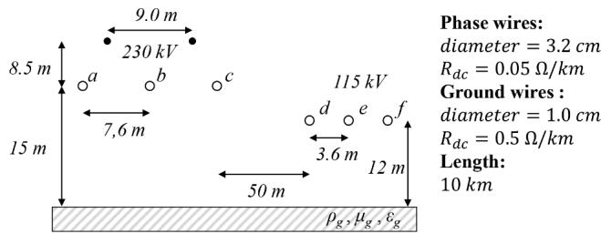  
Fig. 8. Parallel line configuration considered in case A.

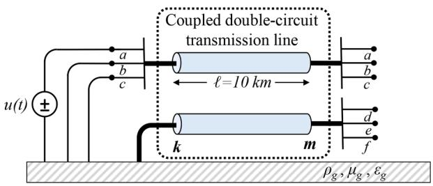  
Fig. 9. Equivalent circuit for case A.

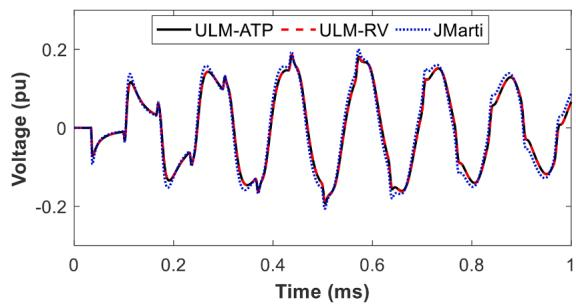  
Fig. 10. Case A: voltage at the receiving end of the 115-kV line (phase d). Simulation for 100-Ωm soil assuming constant soil parameters.

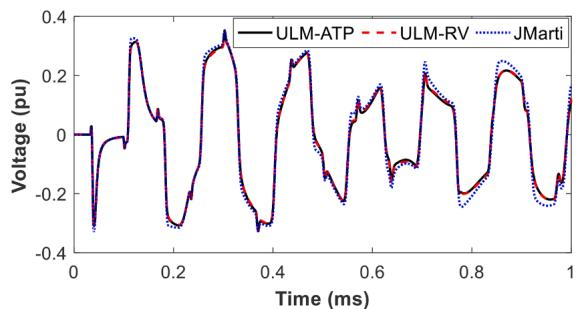  
Fig. 11. Case A: voltage at the receiving end of the 115-kV line (phase d). Simulation for 10,000-Ωm soil assuming constant soil parameters.

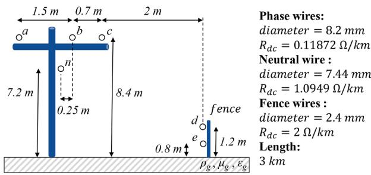  
Fig. 12. Distribution line parallel to a fence considered in Case B.

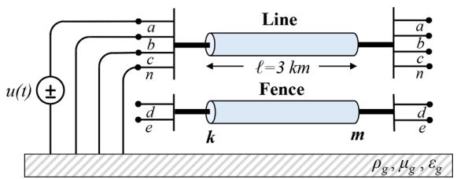  
Fig. 13. Equivalent circuit for Case B.

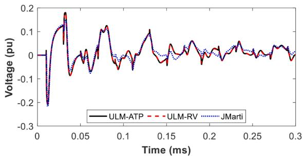  
Fig. 14. Case B: voltage at the receiving end of the fence (conductor d). Simulation for 500-Ωm soil assuming constant soil parameters.

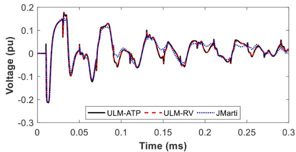  
Fig. 15. Case B: voltage at the receiving end of the fence (condutor d). Simulation for 5,000-Ωm soil assuming constant soil parameters.

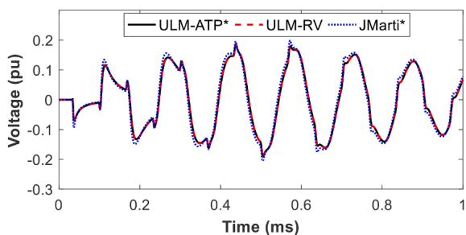  
Fig. 16. Case A: voltage at the receiving end of the 115-kV line (phase d). Simulation for 100-Ωm soil assuming frequency-dependent soil parameters, plus Nakagawa’s and Wise’s equations in ULM-ATP* and JMarti*.

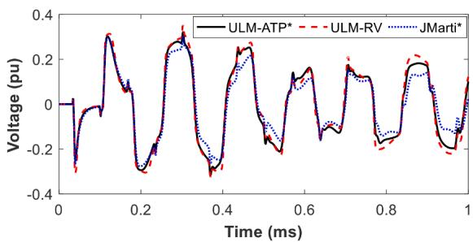  
Fig. 17. Case A: voltage at the receiving end of the 115-kV line (phase d). Simulation for 10,000-Ωm soil assuming frequency-dependent soil parameters, plus Nakagawa’s and Wise’s equations in ULM-ATP* and JMarti*.   
ULM that is possibly more critical than ultimately assuming a less rigorous transmission line model such as Marti’s model for the calculation of transient phenomena.

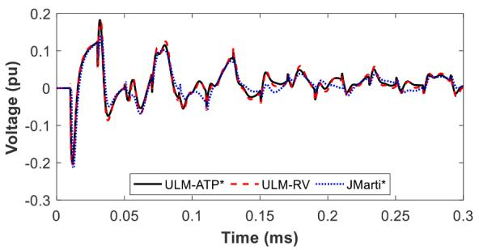  
Fig. 18. Case B: voltage at the receiving end of the fence (conductor d). Simulation for 500-Ωm soil assuming frequency-dependent soil parameters, plus Nakagawa’s and Wise’s equations in ULM-ATP* and JMarti*.

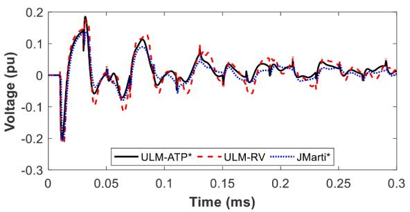  
Fig. 19. Case B: voltage at the receiving end of the fence (conductor d). Simulation for 5,000-Ωm soil assuming frequency-dependent soil parameters, plus Nakagawa’s and Wise’s equations in ULM-ATP* and JMarti*.

# 6. Conclusions

This paper demonstrated an implementation of ULM in ATP as a foreign model coupled with a type-94 component. The per-unit-length parameter calculation and fitting are performed in MATLAB, which allows a greater degree of control and flexibility in the selection of model parameters and equations. The implemented model was shown to reproduce results obtained with ULM available in EMTP-RV with great accuracy. This indicates that the proposed ULM implementation in ATP leads to reliable results and can be used in the evaluation of transient phenomena on overhead lines with strongly asymmetric geometry. In addition, it incorporates rigorous expressions for the calculation of the ground return impedance and ground admittance, as well as frequencydependent soil parameters, which is shown to be important for the simulation of high-frequency transients on transmission lines above a poorly-conducting ground. The proposed implementation is flexible and can be easily adapted to accommodate different parameter calculation strategies and different fitting techniques. Future works include the use of ULM-ATP in the simulation of transients in underground cables and compact distribution lines, as well as lightning-induced voltage calculations.

The support files and instructions for implementing ULM in ATP are available on the following link: https://github.com/zanonfelipe/ ULMAtp

# CRediT authorship contribution statement

Felipe O.S. Zanon: Conceptualization, Methodology, Software, Formal analysis, Writing - original draft, Visualization. Osis E.S. Leal:

Conceptualization, Methodology, Software, Formal analysis, Writing - original draft, Visualization. Alberto De Conti: Conceptualization, Methodology, Formal analysis, Writing - original draft, Visualization, Supervision, Funding acquisition.

# Declaration of Competing Interest

The authors declare that they have no known competing financial interests or personal relationships that could have appeared to influence the work reported in this paper.

# References

[1] J.R. Marti, The Problem of Frequency Dependence in Transmission Line modelling, Ph.D. Dissertation, Dept. Electrical. Eng., Univ. British Columbia, Vancouver, Canada, 1981, pp. 1–208.   
[2] A. Morched, B. Gustavsen, M. Tartibi, A universal model for accurate calculation of electromagnetic transients on overhead lines and underground cables, IEEE Trans. Power Deliv. 14 (3) (1999) 1032–1038.   
[3] J.R. Marti, Accurate modelling of frequency-dependent transmission lines in electromagnetic transient simulations, IEEE Trans. Power Appar. Syst. PAS 101 (1) (1982) 147–157.   
[4] A. Tavighi, J.R. Martí, J.A.G. Robles, Comparison of the fdLine and ULM frequency dependent EMTP line models with a reference laplace solution, Proc. Int. Conf. Power Syst. Transients (2015) 1–8.   
[5] A. De Conti, M.P.S. Emídio, Extension of a modal-domain transmission line model to include frequency-dependent ground parameters, Electr. Power Syst. Res. 138 (2016) 120–130.   
[6] M. Cervantes, I. Kocar, J. Mahseredjian, A. Ramirez, Partitioned fitting and DC correction in transmission line/cable models, Proc. Int. Conf. Power Syst. Transients (2019) 1–6.   
[7] J.L. Naredo, J. Mahseredjian, O. Ramos-leanos, ˜ C. Dufour, J. Belanger, ´ Improving the numerical performance of transmission line models in EMTP, Proc. Int. Conf. Power Syst. Transients (2011) 1–8.   
[8] B. Gustavsen, Optimal time delay extraction for transmission line modeling, IEEE   
[9] EMTP-RV. http://emtp.com/, 2021 (accessed 28 February 2021).   
[10] Manitoba HVDC Research Centre Inc, PSCAD-EMTDC Version 4.5 The Professional’s Tool for Electromagnetic Transients Simulation, Manitoba HVDC Research Centre, Inc, Winnipeg, Canada, 2008.   
[11] T. Noda, N. Nagaoka, A. Ametani, Further improvements to a phase-domain ARMA line model in terms of convolution, steady-state initialization, and stability, IEEE Trans. Power Deliv. 12 (1997) 1327–1334.   
[12] H.K. Høidalen, A.H. Soloot, Cable modelling in ATP – from NODA to TYPE94, EEUG Meet. 2010,European EMTP-ATP Conf (2010).   
[13] L. Dub´e, Models in ATP: language manual, (1996) pp. 1–169.   
[14] B. Gustavsen, A. Semlyen, Combined phase and modal domain calculation of transmission line transients based on vector fitting, IEEE Trans. Power Deliv. 13 (1998) 596–604.   
[15] B. Gustavsen, A. Semlyen, Rational approximation of frequency domain responses by vector fitting, IEEE Trans. Power Deliv. 14 (1999) 1052–1059.   
[16] L.M. Wedepohl, H.V. Nguyen, G.D. Irwin, Frequency-dependent transformation matrices for untransposed transmission lines using Newton-Raphson method, IEEE Trans. Power Syst. 11 (1996) 1538–1546.   
[17] H.W. Dommel, EMTP Theory Book, Second Ed., Microtran Power System Analisys, 1996.   
[18] J.M. Velasco, Power System Transients: Parameter Determination, First Ed., CRC Press, 2010.   
[19] J.R. Carson, Wave propagation in overhead wires with ground return, Bell Syst. Tech. J. 5 (4) (1926) 539–554.   
[20] A. Deri, G. Tevan, A. Semlyen, A. Castanheira, The complex ground return plane a simplified model for homogeneous and multi-laver earth return, IEEE Trans. Power Appar. Syst. PAS 100 (1981) 3686–3693.   
[21] M. Nakagawa, Admittance correction effects of a single overhead line, IEEE Trans. Power Appar. Syst. PAS 100 (1981) 1154–1161.   
[22] H. Kikuchi, Wave propagation along an infinite wire above ground at high frequencies, J. Electrotech. 2 (1956) 73–78.   
[23] W.H. Wise, Potential coefficients for ground return circuits, Bell Syst. Tech. J. 27 (1948) 365–371.   
[24] R. Alipio, S. Visacro, Modeling the frequency dependence of electrical parameters of soil, IEEE Trans. Electromagn. Compat. 56 (2014) 1163–1171.   
[25] B. Gustavsen, Modal domain-based modeling of parallel transmission lines with emphasis on accurate representation of mutual coupling effects, IEEE Trans. Power Deliv. 27 (2012) 2159–2167.