# Modeling Synchronous Voltage Source Converters in Transmission System Planning Studies

D.N.Kosterev Oregon State University

Abstract: A Voltage Source Converter (VSC) can be beneficial to power utilities in many ways [1, 2, 3, 4]. To evaluate the VSC performance in potential applications, the device has to be represented appropriately in planning studies. This paper addresses VSC modeling for EMTP, powerflow, and transient stability studies. First, the VSC operating principles are overviewed, and the device model for EMTP studies is presented. The ratings of VSC components are discussed, and the device operating characteristics are derived based on these ratings. A powerflow model is presented and various control modes are proposed. A detailed stability model is developed, and its step-by-step initialization procedure is described. A simplified stability model is also derived under stated assumptions. Finally, validation studies are performed to demonstrate performance of developed stability models and to compare it with EMTP simulations.

Keyword3: transmission system planning, reactive power compensation, EMTP, transient stability.

# 1. Introduction

Acquiring new rights of way is becoming more difficult due to environmental and economical reasons. New transmission lines are expensive and it takes considerable time to permit and to build them. Power transfer capability of a transmission system is constrained by line design limitations (such as its thermal capacity) and system stability requirements (such as voltage stability, transient stability, sub-synchronous resonance, etc.). Typically, transmission lines are loaded below their thermal capacities due to the system stability requirements. Reducing stability constraints will result in better utilization of the existing transmission facilities and mitigate building new lines. Controllable network devices can improve the system stability [1, 2, 3, 9], and in many cases are economically advantageous over new transmission lines.

Voltage stability is one of major constraints limiting power transfer capability in developed systems [2, 4]. Various reactive power compensators can be employed to enhance voltage stability. A Synchronous Voltage Source Converter is one of them [1, 2, 3, 4]. To evaluate the VSC applicability to present and future projects, the device has to be represented appropriately in planning studies. Unlike conventional shunt compensators, VSCs are complex dynamical systems and require comprehensive representation in the time-domain studies. This paper addresses issues of VSC modeling for EMTP, powerflow, and transient stability studies.

To achieve full utilization of the VSC control capabilities, the device should be equipped with real-time controllers [2, 4, 7]. Developed models should provide an interface for such user-defined controls.

96 SM 465-5 PWRD A paper recommended and approved by the IEEE Transmission and Distribution Committee of the IEEE Power Engineering Society for presentation at the 1996 IEEE/PES Summer Meeting, July 28 - August 1, 1996, Denver, Colorado. Manuscript submitted January 2, 1996; made available for printing May 7, 1996.

# 2. Operating Principles

A block-diagram of a Voltage Source Converter is depicted in Figure 1. The DC voltage source supplies voltage to a power converter array. The DC batteries and DC capacitors can be used as DC voltage sources. By controlling current flow at the DC bus, the DC source can either supply or absorb active power, and the power converter can operate as an inverter or a rectifier respectively. The converter array typically consists of several power conversion modules (PCMs). PCMs include basic six-pulse converters, in which gate-turn-off (GTO) thyristors are used as power switches. Typically, several thyristors are connected in series to form a valve. The converter output voltages are combined electro-magnetically by means of a coupling transformer array to form a multi-pulse "sinusoidal" voltage.

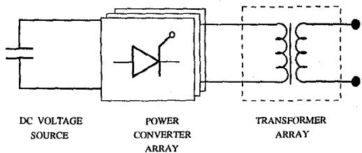  
Figure 1. Voltage Source Converter block diagram

The coupling transformers use harmonic neutralization techniques [3, 5, 10], so that only $Pk \pm 1$ ( $k = 1,2,\ldots$ ) harmonics are present in $P$ -pulse waveform, $P = 6N$ , where $N$ is a number of PCMs. Both, power converter and coupling transformer arrays can be implemented by a variety of circuits. Although the designs can be different, the converter output voltage waveforms and DC currents are essentially the same.

The VSC can be connected either in shunt or in series with the transmission line. This paper considers only shunt-connected devices. These are Battery Energy Storage (BES)-device [5] and Static Condenser (Statcon) [1, 6]. A Statcon uses only capacitors as a DC voltage source, while a BES-device has also DC batteries.

# 2.1 Converter Control

There are two levels of the converter controls: internal and external. The internal control provides gating signals to the thyristor valves in order to form a desired converter voltage waveform. The external controller determines parameters of the synthesized converter voltage (magnitude and phase of the fundamental component) required to meet specified performance objectives. These parameters are translated into thyristor firing angles and passed to the internal controls. Controllability of the synthesized voltage magnitude and phase is discussed below.

# Voltage Magnitude Controllability

The fundamental component of the converter voltage magnitude $V_{CV}$ (line-to-line value) is proportional to the DC-bus voltage $E_{DC}$ . Thus, the converter voltage magnitude can be controlled by the DC source voltage. This method is effec

tive only for a Statcon, because battery voltage changes very slowly. The rate of change of the DC voltage depends on the DC capacitor size, the smaller capacitance, the faster response is, however at the expense of larger voltage ripples. For a fixed DC voltage, the converter voltage magnitude can be controlled also by a zero-dwell period $\beta$ in a PCM output voltage waveform [5, 7, 10]. Although controls of $\beta$ can be different for various converter implementations, the resulting effect on the converter voltage is the same

$$
V _ {C V} = K _ {V} E _ {D C} \cos (\beta / 2), \tag {1}
$$

where $K_V$ is the coefficient representing the fundamental component in a multi-pulse waveform, rms values. $K_V$ also includes the coupling transformer ratio.

# Voltage Phase Controllability

The phase angle $\gamma$ is the angle between fundamental components of the converter voltage $\tilde{V}_{CV}$ and the AC-bus voltage $\tilde{V}_{AC}$ . The angle $\gamma$ is called "power angle," since it determines the active power exchange in the converter [5]. For a Statcon, power angle control has indirect effect on the converter voltage magnitude. Since the angle $\gamma$ controls active power exchange in the converter, it controls charge and discharge of DC capacitors, and consequently DC-bus voltage $E_{DC}$ and converter voltage magnitude $V_{CV}$ according to (1). Both, magnitude and phase of the synthesized converter voltage are controllable independently.

Internal controls provide gating signals for thyristor valves. The thyristor firing is synchronized with the AC-bus voltage. Each gating sequence is advanced by the power angle $\gamma$ with respect to the AC-voltage phase reference. Within a PCM gating sequence, thyristor firing of complementary GTO-thyristors can be displaced by angle $\beta$ to introduce a zero-voltage dwell.

# 2.2 EMTP Model

A VSC is modeled using EMTP (BPA-ATP version). The device is rated at $12.5\mathrm{kV}$ (transmission side) voltage and 10MVA power. The DC-bus is normally charged to $5\mathrm{kV}$ , and the DC capacitors are sized at $200\mu \mathrm{F}$ .

Power Circuits The 18-pulse converter array is modeled according to [5]. Six basic six-pulse converters are used, where the GTO-thyristors are represented by type-11 TACS-controlled switches. Snubber RC circuits are used in parallel with the thyristor switches. A coupling transformer array has a two-step transformer configuration. Advantages of such arrangement are discussed in [6, 7]. The first inter-phase transformer consists of single-phase transformers, where transformer secondaries are zig-zag connected with ratios and winding connections arranged to neutralize harmonics less than 17th in the secondary line-to-line voltage [5]. Transformer connections and ratios are given in [5]. The main $\Delta /Y$ transformer connects the VSC to the transmission network. No AC capacitors or passive filters are used in the presented design. For a Statcon, only DC capacitors are used at the DC bus, for a BES-device, a constant voltage source is connected to the DC bus. The steady-state operating waveforms of the Statcon connected to a simple transmission network (Figure 7) are presented in Figure 2: (a) DC-bus voltage, (b) AC side phase-to-ground voltage, (c) Statcon phase current.

# Converter Controls

Control, synchronization and firing angle circuits are modeled using control language ATP-Models [8]. A digital scheme is used to synchronize thyristor firing with the AC-bus voltage.

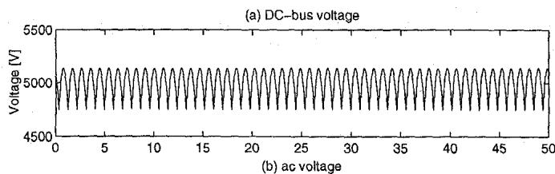

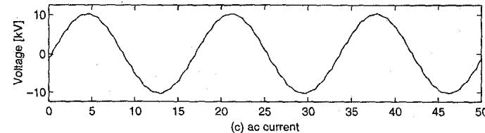

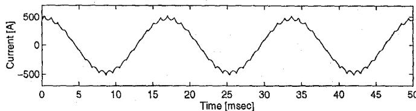  
Figure 2. Static Condenser steady-state waveforms, EMTP model

For a Statcon, a DC voltage controller is used, it determines the power angle $\gamma$ required to keep DC-bus voltage at a specified set-point. The power angle $\gamma$ , the zero-dwell angle $\beta$ , and a synchronization signal are passed to the firing angle logic which determines the status of the GTO switches. Firing angles are updated every quarter of an electrical cycle.

# 2.3 VSC Representation at the Fundamental Frequency

The VSC representation at the fundamental frequency is shown in Figure 3. The VSC affects the transmission network through the AC-bus voltage $\bar{V}_{AC}$ (line-to-line value).

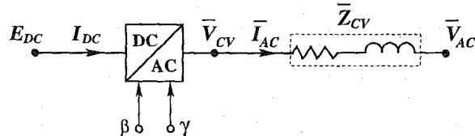  
Figure 3. VSC representation at the fundamental frequency

# DC Source.

The DC voltage source is represented by voltage $E_{DC}$ and current $I_{DC}$ . The DC power output is

$$
P _ {D C} = E _ {D C} I _ {D C}. \tag {2}
$$

# Coupling Transformer.

The coupling transformer array is represented by an equivalent impedance $\bar{Z}_{CV} = R_{CV} + jX_{CV}$

The AC-bus current (phase value) is

$$
\bar {I} _ {A C} = \frac {1}{\sqrt {3}} \quad \frac {\bar {V} _ {C V} - \bar {V} _ {A C}}{\bar {Z} _ {C V}}. \tag {3}
$$

# Power Converter.

For a given DC source voltage $E_{DC}$ , the converter output voltage magnitude $V_{CV}$ can be computed according to (1). The power angle $\gamma = \delta_{CV} - \delta_{AC}$ , where $\delta_{CV}$ is the converter voltage phase and $\delta_{AC}$ is the phase of the AC-bus voltage $\tilde{V}_{AC}$ .

Converter active power is

$$
P _ {C V} = \frac {V _ {C V} V _ {A C}}{Z _ {C V}} \sin (\gamma - \alpha) + \frac {V _ {C V} ^ {2}}{Z _ {C V}} \sin \alpha = \sqrt {3} V _ {C V} I _ {A C} \cos \varphi \tag {4}
$$

where $\alpha$ is the conductance angle of impedance $\bar{Z}_{CV}$ , and $\varphi$ is the angle between converter voltage and AC current.

Active power exchange in converter is

$$
P _ {C V} = P _ {D C}. \tag {5}
$$

# Transmission Network.

Active and reactive powers at AC transmission bus are

$$
P _ {A C} = \frac {V _ {C V} V _ {A C}}{Z _ {C V}} \sin (\gamma + \alpha) - \frac {V _ {A C} ^ {2}}{Z _ {C V}} \sin \alpha , \tag {6}
$$

and

$$
Q _ {A C} = \frac {V _ {C V} V _ {A C}}{Z _ {C V}} \cos (\gamma + \alpha) - \frac {V _ {A C} ^ {2}}{Z _ {C V}} \cos \alpha , \tag {7}
$$

respectively.

# 3. VSC Ratings and Capability Characteristics

To evaluate the VSC appropriately in planning studies, its control capabilities and operating characteristics should be derived based on the device ratings.

# 3.1 VSC Ratings

The VSC equipment ratings are determined by those of its components: DC voltage source, power converter, coupling transformers.

# DC voltage source

The DC voltage source is characterized by its voltage and current ratings. The DC-bus voltage $E_{DC}$ should not exceed the voltage rating of the DC voltage source, $E_{DC} \leq E_{DC}^{max}$ . Over-voltage arresters can be used in parallel with the voltage source, keeping voltage $E_{DC}$ below the protective level. For BES devices, there is also a constraint on how low the DC battery can be discharged, $E_{DC} \geq E_{DC}^{min}$ . The DC voltage has to be constantly above a certain level to avoid thyristor firing failure due to low voltage conditions.

DC current ratings determine how fast the voltage source can be charged and discharged, $I_{DC}^{min} \leq I_{DC} \leq I_{DC}^{max}$ . Typically, DC batteries and capacitors are protected by overcurrent fuses.

# Power Converter Valves.

Power converter valves are characterized by their current and voltage ratings. The thyristor valves are composed of several GTO-thyristors connected in series, and the voltage rating of the valve is the sum of rated voltages of individual thyristors in the valve minus a derating factor. Typically, a redundant thyristor is added to the valve for reliability reasons [5, 6, 7].

The valve current ratings include both, instantaneous and RMS currents. The RMS current ratings are constrained by the device thermal capabilities and depend on the design of GTO-thyristor heat sinks and their cooling systems. The valve has short time-overcurrent capabilities, typically up to $25\%$ for several seconds [6]. The RMS current ratings translate in restrictions on the converter currents at AC side: $I_{AC} \leq I_{rat}$ for continuous operation, and $I_{AC} \leq I_{tran}$ for 10-second transient overload.

Peak current ratings relate to the device turn-off capabilities and represent the maximum instantaneous turn-off current. Instantaneous overcurrent protection is built in the firing angle control logic [5]. When the valve instantaneous current reaches the protection level, the thyristors are blocked.

# 3.2 VSC Operating Characteristic

The VSC operating characteristic defines a region where the converter voltage phasor $\bar{V}_{CV}$ can reside depending on the operating conditions, subject to the rating constraints. The operating conditions are determined by the AC-bus voltage $\bar{V}_{AC}$ and the DC-bus voltage $E_{DC}$ . The VSC operating characteristic is shown in Figure 4 using the complex plane.

Given the converter RMS current ratings, the magnitude of the maximum voltage drop across transformer impedance $\tilde{Z}_{CV}$ is $\Delta V_{rat} = \sqrt{3} I_{rat} Z_{CV}$ for continuous loading, and $\Delta V_{tran} = \sqrt{3} I_{tran} Z_{CV}$ for transient overload. Phasor $\tilde{V}_{CV}$ should stay within a circle centered at the end of the phasor $\tilde{V}_{AC}$ and of a radius $\Delta V$ . The magnitude of the VSC current is independent on the AC-bus voltage, the VSC current versus terminal voltage characteristics are presented in [1, 3, 6].

Given the DC-bus voltage $E_{DC}$ , the maximum magnitude of the converter voltage is $V_{CV}^{max} = K_{V}E_{DC}$ . Thus, the phasor $\bar{V}_{CV}$ has to stay within a circle centered at the origin and of a radius $V_{CV}^{max}$ . If there is an upper limit on the angle $\beta \leq \beta^{max}$ , the converter voltage $\bar{V}_{CV}$ should stay outside a circle centered at the origin and of a radius $V_{CV}^{min} = K_{V}E_{DC}\cos(\beta^{max}/2)$ .

The DC-bus current ratings translate in restrictions on active power exchange in the converter. This condition is represented by a blinder for a lossless VSC $(\alpha = 0)$ .

Proper device ratings should be selected to ensure sufficient operating region. This region changes with the operating point $(\tilde{V}_{AC},E_{DC})$

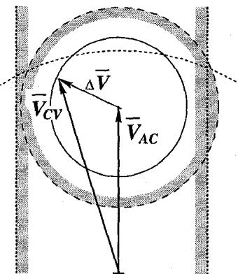  
Figure 4. VSC operating characteristics

# 4. Powerflow Model and Control Modes

# 4.1 Powerflow Model

Existing powerflow programs do not include specific VSC models. In the Bonneville Power Administration Powerflow program [11], the device can be modeled by a generator (G) bus behind a coupling transformer impedance. At the G-bus, the active power is scheduled, and the reactive power can be controlled within specified limits to keep voltage at either local or remote bus at a given set-point. Since the G-bus has reactive power limits independent of the terminal voltage, modeling errors will be introduced when representing the device capacitive current limit at voltages lower than a set-point [9]. This is illustrated in Figure 5(A). The modeled controlled VAR range is significantly larger than that of a Statcon. The problem can be solved by modeling a Statcon by a G-bus with a constant current load. The current load is set to the Statcon capacitive current limit, while the controllable VAR limits are set only

for the inductive region from zero to twice the VAR rating. As shown in Figure 5(B), the Statcon capacitive current limit is represented correctly.

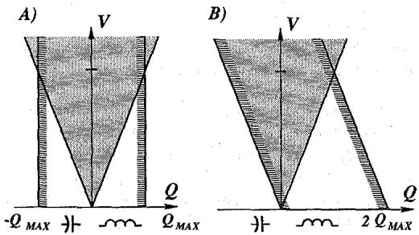  
Statcon   
powerflow model   
Figure 5. Statcon powerflow models

# 4.2 Powerflow Control Modes

For a BES device, the DC battery voltage is constant in powerflow studies. Thus, the BES device has two independently controllable variables: converter voltage magnitude and phase, and two control modes can be implemented independently and simultaneously, subject to the device control capabilities. There may be operational constraints on active power exchange in the converter, $P_{CV}$ , depending on the DC battery charge conditions. For a Statcon, the DC-bus time constant (DC capacitance) is significantly less than a time frame of powerflow studies. To keep the DC capacitor voltage at a controlled value, the active power exchange in the converter has to be terminated, $P_{CV} = 0$ . This condition eliminates one independent control variable, and consequently only one control mode can be implemented at a time.

Active Power Control. This is the basic control mode for the BES device. The active power output is held at a given set-point $P_{SET}$ :

$$
P _ {A C} \left(\bar {V} _ {C V}, \bar {V} _ {A C}\right) = P _ {S E T}.
$$

This mode is not applicable for a Statcon.

Constant AC bus Voltage. Either local or remote bus voltage is held at a given set-point $V_{SET} : V_{AC} = V_{SET}$ .

Constant Current. The AC output current is held at a given set-point $I_{SET}$ :

$$
I _ {A C} \left(\bar {V} _ {C V}, \bar {V} _ {A C}\right) = I _ {S E T}.
$$

Constant Power Factor. Load power factor is held as a given set-point $\mathbf{PF}_{SET}$ :

$$
\mathrm {P F} \left(\bar {V} _ {C V}, \bar {V} _ {A C}\right) = \mathrm {P F} _ {S E T}.
$$

The above modes are active only within the device operating region, Figure 4.

# 5. Transient Stability Model

The VSC model for transient stability studies is derived based on the device representation at the fundamental frequency, Figures 3, and also includes protection, controls, synchronization circuits, and transducers.

# 5.1 Detailed Stability Model

The block-diagram of the VSC stability model is shown in Figure 6. The upper part represents power circuits, while the lower part represents controls.

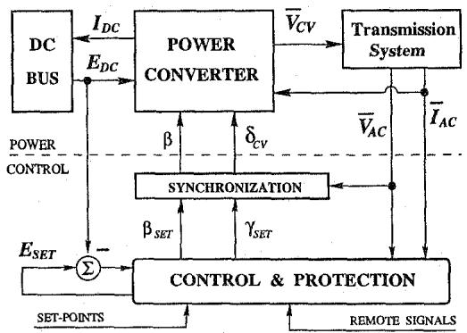  
Figure 6. VSC model for stability studies

DC bus.

The DC source is assumed to be charged initially to voltage $E_{DC}(0)$ . The source can be charged and discharged by the current $I_{DC}$ . The DC source dynamics are represented by a first-order system

$$
C _ {D C} \dot {E} _ {D C} = - Y _ {D C} E _ {D C} - I _ {D C}, \tag {8}
$$

where $C_{DC}$ is the DC source capacitance, and $Y_{DC}$ is a shunt conductance representing active power losses in the DC source and converter. For a BES-device, $C_{DC}$ is very large, so that the DC battery voltage can be assumed constant in the transient stability studies. For a Statcon, overvoltage arresters can be used in parallel with capacitors, keeping their voltage below the protective level $E_{DC}^{max}$ . The arrester can be modeled as a dynamic limiter on $E_{DC}$ in equation (8).

# DC voltage control

For a Statcon, the converter voltage magnitude is controlled by the DC-bus voltage (1), and consequently DC voltage control is an important part of a Statcon stability model, particularly if the capacitance of DC capacitors is large. Measured DC voltage is pre-filtered and subtracted from a set-point $E_{SET}$ , and the error signal is fed to the controller. The voltage reference can be determined by user-defined controls, otherwise is held at its steady-state value. The controller output translates into the power angle set-point

$$
\gamma_ {S E T} = \mathcal {F} \left(E _ {S E T} - E _ {D C}, \bullet\right),
$$

where $\mathcal{F}$ is a dynamic control operator. The power angle determines the active power exchange in the converter, and consequently the DC current flow and the DC capacitor voltage.

# Power Converter.

Power converter is represented by algebraic equation (1) for voltage synthesis, and equations (2,4,5) for power conversion. Angles $\beta$ and $\gamma$ are updated at every step of transmission network solution.

# Synchronization.

Imperfect synchronization during transient swings should be also taken into account in the stability model. The AC-bus voltage $\bar{V}_{AC}$ phasor is used as an input to the synchronization circuit. The synchronization circuit estimates the phase of the AC voltage

$$
\hat {\delta} _ {A C} = \operatorname {s y n c h} (\bar {V} _ {A C}).
$$

Values of $\bar{V}_{AC}$ are updated after each network solution step. The phase angle of the converter voltage is $\delta_{CV} = \gamma_{SET} + \hat{\delta}_{AC}$ . The actual power angle is $\gamma = \delta_{CV} - \delta_{AC} = \gamma_{SET} + (\hat{\delta}_{AC} - \delta_{AC})$ . Angle $\beta$ is not affected by the synchronization errors, $\beta = \beta_{SET}$ .

# Controls.

Various user-defined controls can be implemented using this model to achieve full utilization of the device control capabilities. Local voltages and currents, DC voltage, as well as remote signals can be used as controller inputs. The controller determines magnitude and phase of the converter voltage which are required to meet the control objectives. This desired voltage should stay with the operating capabilities of the device, Figure 4. The desired converter voltage is translated in set-points $\beta_{SET}$ , $\gamma_{SET}$ , and $E_{SET}$ .

# 5.2 Stability Model Initialization

The transient stability model is initialized based on powerflow results. The initialization should be performed for all dynamical elements of the model: DC bus, voltage and synchronization controls, and user-defined controls. Powerflow studies determine AC-bus voltage $\bar{V}_{AC}$ and converter voltage $\bar{V}_{CV}$ at $t = 0$ .   
1. The steady-state voltage $E_{DC}(0)$ is determined first. Unless specified explicitly, the worst-case voltage $E_{DC}(0)$ is assumed, $E_{DC}(0) = V_{CV} / K_V$ (using (1) with $\beta = 0$ ).   
2. In steady-state, the converter firing is synchronized perfectly with AC-bus voltage, $\hat{\delta}_{AC}(0) = \delta_{AC}(0)$ . Then, the synchronization circuit is initialized based on the known input and output. Knowing the converter voltage phase $\delta_{CV}(0)$ , the power angle set-point can be determined $\gamma_{SET}(0) = \delta_{CV}(0) - \hat{\delta}_{AC}(0)$ .   
3. For a Statcon, the DC voltage controller can be initialized and the steady-state voltage set-point $E_{SET}$ is determined based on known DC-bus voltage $E_{DC}(0)$ (input) and power angle set-point $\gamma_{SET}(0)$ (output).   
4. Finally, the user-defined controls can be initialized using input (bus voltage, converter current, remote signals) and output (angles $\beta_{SET}$ , $\gamma_{SET}$ , $E_{SET}$ ) signals.

# 5.3 Simplified Models

Simplified models can be used depending on the study purpose. First simplification is achieved by assuming perfect synchronization, $\hat{\delta}_{AC} = \delta_{AC}$ . For a Statcon with a small DC capacitor, the DC-bus dynamics and DC voltage controls can be approximated by a lower-order equivalent system

$$
E _ {D C} = \mathcal {G} (E _ {S E T}),
$$

where $\mathcal{G}$ is a dynamic operator. This assumes that the controller response is sufficiently fast to keep the DC voltage at a controlled value. In this case, a Statcon is represented as a voltage source with controllable magnitude $V_{CV}(E_{DC})$ and phase subject to constraint $P_{CV} = 0$ .

# 6. Model Validation: A Case Study

Stability model has to represent correctly the fundamental components of the AC-bus voltage and the compensator current in the frequency range of interest [9]. For transient voltage stability studies, the frequency range of interest can be up to $5\mathrm{Hz}$ .

The model validation studies are performed for a $12.5\mathrm{kV}$ subtransmission system depicted in Figure 7. First, the system is modeled using EMTP. Transmission lines are modeled by R-L circuits and the load is assumed to be resistive. The system is fed by a sinusoidal AC-voltage source. The VSC is modeled in detail as described in section 2.2. The fundamental components of voltage and current waveforms are obtained by a phasor measurement algorithm, which includes signal transformation from a stationary ABC reference frame to a synchronous DQO reference frame and post-filtering by a moving-average filter over one electrical cycle.

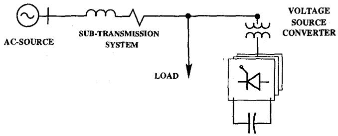  
Figure 7. System used for model validation studies

In the transient stability model, the transmission network is modeled by algebraic equations, and the VSC is represented by the detailed model. Synchronization and DC-voltage controls are identical to those in the EMTP model. For the purpose of this study, no user-defined controls are modeled, to eliminate their effects on the model performance. Thus, all presented responses are open-loop. To account for delays in phasor computations in EMTP, the phasors computed by stability program are passed through a one-cycle moving-average filter. The simulation step used in stability studies is 1/720 sec to be consistent with sampling rates of synchronization and DC voltage controllers used in the EMTP model.

A BES-device is considered first. The results are shown in Figure 8, the solid lines show the EMTP model response, and the broken lines show the stability model response: (a) step change is control angle $\beta$ from $20^{\circ}$ to $0^{\circ}$ and to $20^{\circ}$ ; (b) step change in the power angle $\gamma$ from $3^{\circ}$ to $4^{\circ}$ ; (c) AC-voltage magnitude; (d) injected active power; (e) injected reactive power. There is a very good correlation between EMTP and stability model traces. The responses of EMTP and stability models to the power angle step are delayed mainly because of the synchronization circuit response. In addition, a one cycle delay is introduced by phasor measurement transducers.

A Statcon is considered next. The test is performed for a step change in the DC voltage set-point from 5000V to 3500V and back. The results are shown in Figure 9. The solid lines show the EMTP model responses, and the broken lines represent response of the detailed stability model responses: (a) DC voltage, (b) AC-voltage magnitude, (c) Statcon reactive power, (d) the DC active power. The response delay is mainly to the DC voltage controller.

# 7. Conclusions

The paper presents models of Synchronous Voltage Source Converters for EMTP, powerflow, and transient stability studies. The EMTP model is presented first. Power (converters, coupling transformers, DC bus) and control (synchronization, DC voltage, firing angle logic) circuits are represented in detail. The EMTP model performance is used as a reference.

Next, the device ratings are overviewed, and the VSC operating characteristics are derived. These characteristics determine a region where the converter voltage phasor can reside depending on the operating conditions. Since there are no specific VSC models in existing powerflow programs, a generation bus with a constant current load is proposed to model a Statcon in powerflow studies. By setting the current load to a capacitive current rating and controlled reactive power to inductive region only, the Statcon capacitive current limit is represented correctly at all voltages. Various powerflow modes are discussed.

Finally, a VSC model for transient stability studies is devel

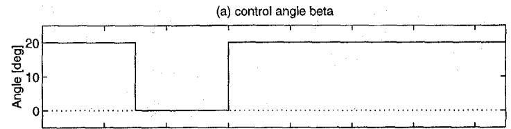

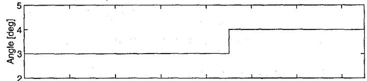  
(b) control angle gamma

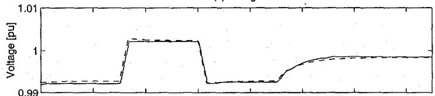  
(c) voltage

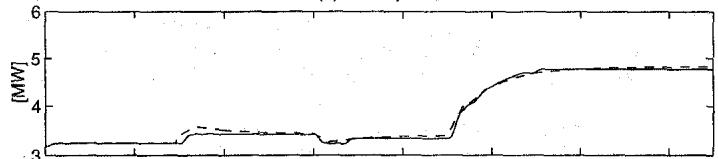  
(d) active power

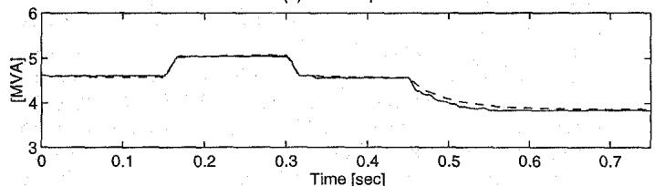  
(e) reactive power   
Figure 8. Battery Energy Storage device responses

oped. The detailed model includes representation of power circuits at the fundamental frequency, DC bus dynamics, as well as control and synchronization circuits. Validation studies performed to compare responses of stability models with EMTP simulations demonstrated good correlation between EMTP and stability model results.

# Acknowledgment

The author is gratefully thankful to Mr. William Mittelstadt at the Bonneville Power Administration and Dr. Alan Wallace at Oregon State University for valuable comments.

# References

[1] E.Larsen, N.Miller, S.Nilsson, S.Lindgren, “Benefits of GTO-based Compensation Systems for Electric Utility Applications,” IEEE Transactions on Power Delivery, vol.7, pp.2056-2062, October 1992.   
[2] A.Hammad, “Comparing the Voltage Control Capabilities of Present and Future VAR Compensating Techniques in Transmission Systems,” IEEE Transactions on Power Delivery, vol.11, pp.475-484, January 1996.   
[3] L.Gyugui, "Dynamic Compensation of AC Transmission Lines by Solid-State Synchronous Voltage Sources," IEEE Transactions on Power Delivery, vol.9, pp.904-911, April 1994.   
[4] CIGRE Task Force 38.02.12, Criteria and Countermeasures for Voltage Collapse, edited by C.W.Taylor, June 1995.

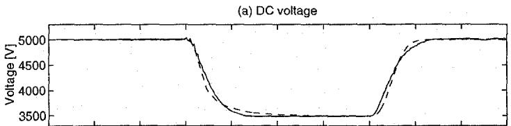

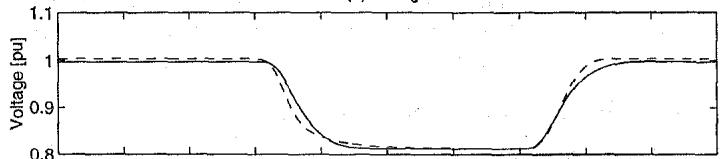  
(b) voltage

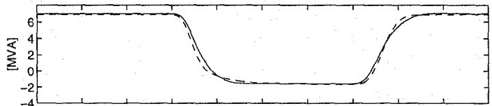  
(c) reactive power   
(d) DC-bus power

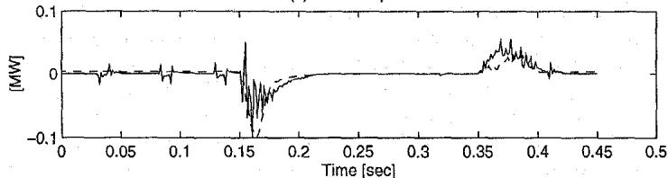  
Figure 9. Statcon responses

[5] L.H. Walker, “10-MW GTO Converter for Battery Peaking Service,” IEEE Transactions on Industry Applications, vol.26, pp.63-72, January/February 1990.   
[6] C.Schauder, M.Gernhardt, E.Stacey, T.Lemak, L.Gyugyi, T.W.Cease, A.Edris, “Development of a ±100 MVAr Static Condenser for Voltage Control of Transmission System,” IEEE Transactions on Power Delivery, vol.10, pp.1486-1496, July 1995.   
[7] S.Mori, K.Matsuno,T.Hasegawa, S.Ohnishi, M.Takeda, M.Seto, S.Murakami, F.Ishiguro, "Development of a Large Static VAR Generator using Self-Commutated Inverters for Improving Power System Stability," IEEE Transactions on Power Systems, vol.8, pp.371-377, February 1993.   
[8] L.Dube,I.Bonanti, "MODELS: A New Simulation Tool in EMTP," European Transactions on Electrical Power Engineering, vol.2, no.1, pp.45-50, January/February 1992.   
[9] IEEE Special Stability Controls Working Group (Power System Engineering Committee), "Static Var Compensator Models for Power Flow and Dynamic Performance Simulation," edited by C.W.Taylor, IEEE Transactions on Power Systems, vol.9, pp.229-240, February 1994.   
[10] G.Seguier, F.Labrique, Power Electronic Converters, DC-AC Conversion, Springer-Verlag, 1993.   
[11] Bonneville Power Administration, BPA Powerflow Program: User's Guide, 1995.

Dmitry Kosterev(S'93) received BSEE and Ph.D. degrees from Oregon State University in 1992 and 1996 respectively. Dr.Kosterev is currently with Control Technologies, Inc., Montana company, working at the Bonneville Power Administration site on design of new response-based systems for generator dropping and load shedding. His other work includes transmission system planning for controllable network devices, voltage stability studies, wide-area measurement systems, power system protection, equipment modeling for EMTP and stability studies.