# Fast investigation of control interaction risks in PV parks using eigenvalue analysis in Modelica


A. Masoom a, , J. Mahseredjian b , U. Karaagac c

a Hydro-Qu´ebec Research Institute, Varennes, QC J3 × 1S1, Canada   
b Department of Electrical Engineering, Polytechnique Montr´eal, Montreal, QC H3T 1J4, Canada   
c Department of Electrical and Electronics Engineering, Middle East Technical University, Turkey

# A R T I C L E I N F O

Keywords:

Modelica

Equation-based modeling

PV park

Eigenvalue analysis

State-space equations

Linearization

Stability analysis

Impedance scanning

Phase margin

Modal Analysis

# A B S T R A C T

This paper contributes to the fast detection of control interaction risk in a PV park using the eigenvalue analysis in Modelica. The entire PV park and its interconnected network are represented by time-domain equations in Modelica, then linearized state space equations are extracted directly by leveraging the Modelica features. This constitutes an advantageous approach for fast finding eigenvalues and extracting potential instability conditions. The presented approach is verified with electromagnetic transient (EMT) simulation and impedance-based stability analysis (IBSA) that uses EMT-type impedance scanning methods. The results show an outstanding improvement in the simulation time and accuracy.

# 1. Introduction

# 1.1. Literature review

The controllers of inverter-based resources (IBRs) with full-size converter (FSC), such as type-4 wind or photovoltaic (PV) parks, can interact with the transmission grid, potentially causing instability. The control interaction (CI) in weakly tied IBRs (either with doubly-fed induction generator (DFIG) or FSC) may occur due to the resonance formed by the capacitive IBR and the inductive grid [1,2]. This phenomenon has been confirmed with several real-world incidents [3]. In addition, the recent research in [4] identified a new CI phenomenon between a large-scale type-4 wind park and a 500 kV transmission grid in which one of the parallel transmission lines interacts with the wind park in super-synchronous frequency range.

Several methods have been evolved for the prediction of CI risks in IBR integrated systems [5]. The widely used methods include impedance-based stability analysis (IBSA) [6,7] in various reference frames [8], state-space model-based eigenvalue analysis (EV) [9–11],

and electromagnetic transient (EMT) simulation [12].

The IBSA-based methods are well-defined in the literature [8]; whilst it is appropriate for large-scale power systems with black box models. The modern transmission grids employ several IBRs in addition to conventional generating units (such as thermal power plants). However, the IBSA can identify only the CI risk of the IBR under study as all other IBRs in the grid subsystem are indirectly represented in equivalent grid impedance. Hence, IBSA does not give any insight regarding CI mechanisms and any hints for its mitigation. It should be noted that the IBSA was born for analyzing two terminal systems and it is hard to extend this method for analyzing multi-terminal systems [13].

The EMT studies offer a valid and direct EMT simulations on the risk of instability; however, they are not also able to identify and explain the causes and nature of problem. The EMT simulation-based assessment is typically performed to validate either the IBSA or EV results [14].

# 1.2. Motivation

The EV analysis has been earlier employed and well documented for

exploring the CI risk in the WPs [15–18]. The generic solutions presented in the literature are usually based on a simplification of each component of a system to a linear time-invariant one and representing them with its state space equations in dq-frame, finally combining them based on their actual connections to form the whole system. The state-space representation of large-scale systems is complicated. Each change of circuit topology leads to a new extraction of system equations, where this approach is not implemented in a graphical interface, and mostly relies on laborious manipulation of the adjacency matrices and equations in procedural programming languages, such as MATLAB or Julia [19]. In addition, the simplifications in the linearization process of generic models, such as ignoring input measuring filters cause significant accuracy problems even for small perturbation scenarios that do not activate any non-linearity such as saturation of converters or activation fault-ride-through (FRT) function [20]. Therefore, eigenvalue analysis is mainly used for mitigation design rather than identification of CI risks.

Modelica [21] is a declarative programming language allowing to set the focus on equations describing a model, i.e., differential-algebraic equations (DAEs). Such an approach helps the modeler to concentrate on modeling rather than numerical methods. The workflow is such that the DAEs are sorted vertically and horizontally to form the block lower triangular matrix. For this purpose, various algorithms are automatically used for breaking algebraic loops and decreasing the index of DAEs. Different solvers (i.e., fixed/variable step) are available in commercial or open-source Modelica compilers, in which DASSL [22] and IDA [23] are well known for solving stiff DAEs. The language provides a user-friendly environment for the modeler to design the graphical user interface and associate documentation for each model. The circuit can be constructed by dragging and dropping the component models and connecting them as a physical system. Any modification of circuit is very straightforward in this environment.

Recently, we introduced the Modelica Simulator Electromagnetic Transients (MSEMT) [24] tool. It was the first detailed EMT library in Modelica, validated with EMTP® [25]. The library includes models for various power and control components.

# 1.3. Contributions

The paper contributes to developing a generic EMT-detailed PV park model in Modelica that can be used for the integration studies of PV parks, i.e. transient and stability analyses. It is demonstrated how Modelica can be leveraged for the fast detection of CI scenarios without any simplification of models and compromising the presence of nonlinearities and accuracy. One goal of this paper is to use detailed IBR controller models for ultimate accuracy not only in small perturbation scenarios but also in large disturbance scenarios which result in quasi steady-state operation conditions.

The technique allows for the analysis of numerous operating conditions in the search for CI risk. The potentially unstable cases are validated using Modelica or EMTP simulations. All case studies are designed using MSEMT components in Modelica.

# 1.4. Paper organization

The paper is organized as follows. Section II reviews the methodology of EV analysis, and Section III describes the modeling of PV parks. In Section IV, the results are presented and discussed.

# 2. Methodology

Extracting the explicit state-space equations for large nonlinear circuits is a challenge for most software. In Modelica, the solution method is such that EMT-detailed linear/nonlinear equations describing system components including PV arrays, controllers (i.e., PLLs, outer and inner current control loops, etc.), electronic components, and power compo-

nents (i.e. loads, transformers, lines, etc.) are first flattened and represented through a system of DAEs:

$$
\mathbf {F} (t, \dot {\mathbf {x}}, \mathbf {x}, \mathbf {y}, \mathbf {z}) = 0 \tag {1}
$$

where t denotes time, x is the vector of state variables, y is the vector of algebraic variables and z is the vector of input variables. Eq. (1) can be reformulated as:

$$
\begin{array}{l} \dot {\mathbf {x}} = \mathbf {h} (t, \mathbf {x}, \mathbf {u}) \\ \mathbf {y} = \mathbf {k} (t, \mathbf {x}, \mathbf {u}) \end{array} \tag {2}
$$

It is possible to linearize (2) using the Taylor series around an arbitrary time point, t , (i.e., different operating conditions and contingencies such as before and after disturbances) as:

$$
\begin{array}{l} \mathbf {u} _ {0} = \mathbf {u} (t _ {l}) \\ \mathbf {y} _ {0} = \mathbf {y} (t _ {l}) \\ \mathbf {x} _ {0} = \mathbf {x} (t _ {l}) \end{array} \tag {3}
$$

neglecting higher order terms, we have:

$$
\frac {d}{d t} \left(\mathbf {x} _ {0} + \delta \mathbf {x}\right) \approx \mathbf {h} \left(\mathbf {x} _ {0}, \mathbf {u} _ {0}\right) + \frac {\partial \mathbf {h} (\mathbf {x} , \mathbf {u})}{\partial \mathbf {x}} \delta \mathbf {x} + \frac {\partial \mathbf {h} (\mathbf {x} , \mathbf {u})}{\partial \mathbf {u}} \delta \mathbf {u} \tag {4}
$$

$$
\mathbf {y} _ {0} + \delta \mathbf {y} \quad \approx \mathbf {k} (\mathbf {x} _ {0}, \mathbf {u} _ {0}) + \frac {\partial \mathbf {k} (\mathbf {x} , \mathbf {u})}{\partial \mathbf {x}} \delta \mathbf {x} + \frac {\partial \mathbf {k} (\mathbf {x} , \mathbf {u})}{\partial \mathbf {u}} \delta \mathbf {u}
$$

re-ordering of (4) yields the following equations:

$$
\frac {d}{d t} (\delta \mathbf {x}) = \frac {\partial \mathbf {h} (\mathbf {x} , \mathbf {u})}{\partial \mathbf {x}} \delta \mathbf {x} + \frac {\partial \mathbf {h} (\mathbf {x} , \mathbf {u})}{\partial \mathbf {u}} \delta \mathbf {u} + \mathbf {h} \left(\mathbf {x} _ {0}, \mathbf {u} _ {0}\right) \tag {5}
$$

$$
\delta \mathbf {y} = \frac {\partial \mathbf {k} (\mathbf {x} , \mathbf {u})}{\partial \mathbf {x}} \delta \mathbf {x} + \frac {\partial \mathbf {k} (\mathbf {x} , \mathbf {u})}{\partial \mathbf {u}} \delta \mathbf {u} + \left(\mathbf {k} \left(\mathbf {x} _ {0}, \mathbf {u} _ {0}\right) - \mathbf {y} _ {0}\right)
$$

Finally, this function returns the matrices A, B, C, and D in the following explicit form:

$$
\frac {\delta \dot {\mathbf {x}}}{\delta s} = \mathbf {A} \delta \mathbf {x} + \mathbf {B} \delta \mathbf {u} \tag {6}
$$

$$
\delta \mathbf {y} = \mathbf {C} \delta \mathbf {x} + \mathbf {D} \delta \mathbf {u}
$$

where the partial derivatives are computed at the linearization time point as per (3), whether $\mathbf { x } _ { 0 }$ is an equilibrium point, $\mathbf { x } _ { e } ,$ or not. For stability analysis, if at least one of the eigenvalues of A(xe) has positive real part, it is an unstable equilibrium point for the nonlinear system. One challenge for nonlinear Modelica models is to investigate the linearization carried out at an equilibrium point. One approach is to compare the linearized matrix A for two arbitrary time points during contingency. The state matrix is identical for a steady state or quasisteady state operating point.

Each complex eigenvalue corresponds to an oscillatory mode. If an eigenvalue within the resonance frequency range contains a positive real part, the damping at the frequency is negative, indicating that there might be risk of instability. This technique overcomes the challenges and complexities related to the linearization of detailed models for PV plants and large-scale circuits.

# 3. PV park equations and modeling

The complete design and implementation of PV park is based on the hierarchical blocks with masking in Modelica. Fig. 1. (a) shows the model and sub-models. In general, a PV park model comprises the following sub-systems:

1). Aggregated PV array,   
2). DC-AC converter: there is an option to use the detailed [26] or average model,   
3). LV/MV converter transformer [24],   
4). MV collector grid equivalent circuit, which is modeled by a PIsection line model,   
5). MV/HV park transformer,

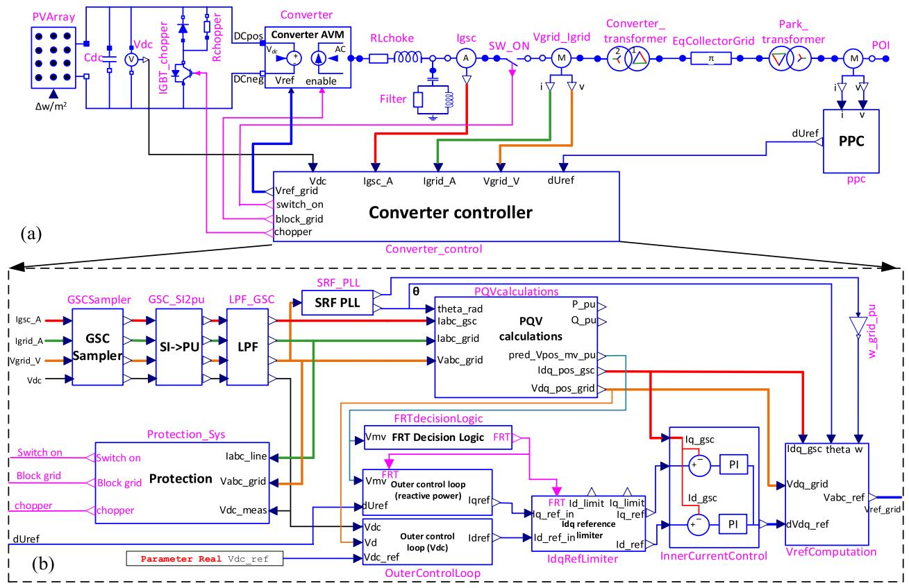  
Fig. 1. (a): PV park model implemented in Modelica; (b): PV park controller.

6). Converter controller with fault-ride-through (FRT) logic,   
7). Protection system which consists of overvoltage and low voltage ride-through (OVRT and LVRT respectively), chopper protection and overcurrent function,   
8). The Power Plant Controller (PPC) for computation of reference reactive power based on selected control modes.

# 3.1. PV characteristics and mathematics

The PV array is a nonlinear DC element composed of several solar cells connected in series and parallel. The equivalent model of a PV array can be represented by a current source with a diode, shunt and series resistances, as shown in Fig. 2. The relation between PV array voltage and current (denoted by V and I , respectively) can be defined as

$$
\mathrm {I} _ {P V} = \mathrm {I} _ {p h} - \mathrm {I} _ {d} - \frac {\mathrm {V} _ {P V} + \mathrm {I} _ {P V} \mathrm {R} _ {s}}{\mathrm {R} _ {p}} \tag {7}
$$

The photoelectric current $\mathrm { I } _ { p h } ,$ the diode reverse saturation current $\mathrm { I } _ { 0 }$ and the series and parallel resistancesR and $\mathrm { R } _ { p } ,$ can be computed from open- and short-circuit tests (denoted by OC and SC subscripts hereafter) in standard test conditions (STC), at 25◦C (indicated $\mathrm { { b y T } } _ { r e f } )$ and

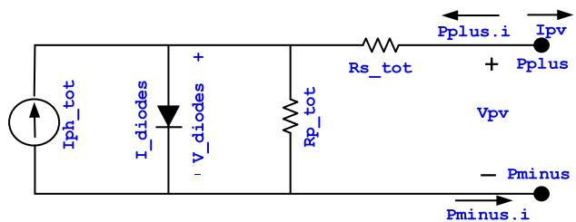  
Fig. 2. Schematic of a single diode PV park in Modelica.

irradiance of 1000 $\mathrm { { w / m ^ { 2 } } }$ (indicated ${ \sf b y G } _ { r e f } ) .$ . The diode equation is substituted into (7), to give

$$
\mathrm {I} _ {P V} = \mathrm {I} _ {p h} - \mathrm {I} _ {0} \left[ e ^ {\left(\frac {\mathrm {V} _ {P V} + \mathrm {I} _ {P V} \mathrm {R} _ {s}}{\mathrm {a N} _ {s} \mathrm {V} _ {t h}}\right)} - 1 \right] - \frac {\mathrm {V} _ {P V} + \mathrm {I} _ {P V} \mathrm {R} _ {s}}{\mathrm {R} _ {p}} \tag {8}
$$

$$
V _ {t h} = k \frac {T _ {r e f}}{q} \tag {9}
$$

where $\Nu _ { s }$ is the number of cells per module, a denotes the ideal factor $\mathrm { \Delta V } _ { t h }$ is the diode threshold voltage, k and q are Boltzmann’s constant and charge of an electron, respectively. The diode reverse saturation current can be obtained from open circuit data:

$$
I _ {0} = \frac {I _ {S C}}{e ^ {\left(\frac {V _ {O C}}{a N _ {i} V _ {t h}}\right)} - 1} \tag {10}
$$

For the computation of $\mathrm { R } _ { p } ,$ another equation is required. The derivative of power with respect to voltage for a module is zero at maximum power point, therefore:

$$
\left. \frac {d \left(\mathrm {V} _ {P V} \mathrm {I} _ {P V}\right)}{\mathrm {V} _ {P V}} \right| _ {\text {m a x}} = \mathrm {I} _ {\text {m a x}, P V} + \mathrm {V} _ {\text {m a x}, P V} = \left. \left(\frac {d \mathrm {I} _ {P V}}{d \mathrm {V} _ {P V}}\right) \right| _ {\text {m a x}} 0 \tag {11}
$$

By inserting the derivative of (8) in (11), $\mathrm { R } _ { p }$ is obtained:

$$
\mathrm {R} _ {p} = \frac {1}{\frac {\mathrm {I} _ {\text {m a x} , \mathrm {P V}}}{\mathrm {V} _ {\text {m a x} , \mathrm {P V}} - \mathrm {R} _ {\mathrm {s}} \mathrm {I} _ {\text {m a x} , \mathrm {P V}}} - \frac {\mathrm {I} _ {0}}{\mathrm {a N} _ {\mathrm {s}} \mathrm {V} _ {\mathrm {t h}}} e ^ {\left(\frac {\mathrm {V} _ {\text {m a x} , \mathrm {P V}} + \mathrm {I} _ {\text {m a x} , \mathrm {P V}} \mathrm {R} _ {\mathrm {s}}}{\mathrm {a N} _ {\mathrm {s}} \mathrm {V} _ {\mathrm {t h}}}\right)}} \tag {12}
$$

Assuming that the diode current is negligible in the short-circuit test, $\mathrm { I } _ { p h }$ can be computed as per:

$$
\mathrm {I} _ {p h} = \mathrm {I} _ {S C} \left[ \frac {\mathrm {V} _ {m a x , P V}}{\mathrm {V} _ {m a x , P V} - \mathrm {R} _ {s} \mathrm {I} _ {m a x , P V}} - \frac {\mathrm {I} _ {0} \mathrm {R} _ {s}}{a \mathrm {N} _ {s} \mathrm {V} _ {t h}} e ^ {\left(\frac {\mathrm {V} _ {m a x , P V} + \mathrm {I} _ {m a x , P V} \mathrm {R} _ {s}}{a \mathrm {N} _ {s} \mathrm {V} _ {t h}}\right)} \right] \tag {13}
$$

Reformulating for the maximum power operating point and inserting (12) and (13) into (8) yields (14). Rs can be obtained by solving the nonlinear equation:

$$
\begin{array}{l} f \left(\mathrm {R} _ {s}\right) = \frac {\mathrm {V} _ {\text {m a x} , P V} \left(\mathrm {I} _ {S C} + \mathrm {I} _ {0} - 2 \mathrm {I} _ {\text {m a x} , P V}\right) - \mathrm {I} _ {0} \mathrm {I} _ {\text {m a x} , P V} \mathrm {R} _ {s}}{\mathrm {V} _ {\text {m a x} , P V} - \mathrm {R} _ {s} \mathrm {I} _ {\text {m a x} , P V}} + \\ I _ {0} e ^ {\left(\frac {V _ {\text {m a x} , P V} + I _ {\text {m a x} , P V} R _ {s}}{a N _ {s} V _ {t h}}\right)} \frac {R _ {s} \left(I _ {\text {m a x} , P V} - I _ {S C}\right) + V _ {\text {m a x} , P V} - a N _ {s} V _ {t h}}{a N _ {s} V _ {t h}} \tag {14} \\ \end{array}
$$

It is noted that all unknown variables are computed for one PV module in STC, and they should be adjusted for actual atmospheric temperature and irradiance (indexed byTand G, respectively). The diode threshold voltage and reverse saturation current at actual temperature are given by:

$$
I _ {0} = \frac {I _ {S C} + K _ {i} (T - T _ {r e f})}{e ^ {\left(\frac {V _ {O C} + K _ {v} (T - T _ {r e f})}{a N _ {s} V _ {t h}}\right)} - 1} \tag {15}
$$

whereK andK are the temperature coefficients of SC current and OC voltage, respectively. The photoelectric current obtained through (13) for STC is $\mathrm { I } _ { p h \_ S T C }$ and the current for actual conditions can be computed by

$$
\mathrm {I} _ {p h - T} = \mathrm {I} _ {p h - S T C} + \mathrm {K} _ {i} (\mathrm {T} - \mathrm {T} _ {\text {r e f}}) \tag {16}
$$

$$
I _ {p h} = I _ {p h - T} \frac {G + \Delta G}{G _ {r e f}} \tag {17}
$$

A PV park with nominal voltage, $\mathrm { { { J } } } _ { n } ,$ and nominal power ${ \bf { { \mathcal P } } } _ { n } ,$ are composed of $\mathrm { \bf N } _ { \mathrm { \ m o d } }$ , and $\mathrm { \Delta N } _ { \mathrm { \ m o d } \ , p }$ modules respectively connected in series and parallel. The variables of the models are defined as below:

$$
\mathrm {N} _ {\text {m o d}, s} = \frac {\mathrm {V} _ {n}}{\mathrm {V} _ {\text {m a x} , P V}} \quad \mathrm {N} _ {\text {m o d}, p} = \frac {\mathrm {P} _ {n}}{\mathrm {V} _ {n} \mathrm {I} _ {\text {m a x} , P V}} \tag {18}
$$

$$
\mathrm {R} _ {s \_ t o t} = \frac {\mathrm {N} _ {m o d , s}}{\mathrm {N} _ {m o d , p}} \mathrm {R} _ {s} \quad \mathrm {R} _ {p \_ t o t} = \frac {\mathrm {N} _ {m o d , s}}{\mathrm {N} _ {m o d , p}} \mathrm {R} _ {p} \tag {19}
$$

$$
\mathrm {I} _ {\text {p h}, \text {t o t}} = \mathrm {I} _ {\text {p h}} \mathrm {N} _ {\text {m o d}, p} \quad \mathrm {I} _ {0, \text {t o t}} = \mathrm {N} _ {\text {m o d}, p} \mathrm {I} _ {0} \tag {20}
$$

$$
\mathrm {N} _ {s \_ t o t} = \mathrm {N} _ {\text {m o d}, s} \mathrm {N} _ {s} \tag {21}
$$

$$
I _ {d - t o t} = I _ {0 - t o t} e ^ {\left(\frac {V _ {d}}{a N _ {s - t o t} V _ {t h}}\right)} \tag {22}
$$

Fig. 3 shows the piece of Modelica code for the implementation of the

```txt
initial equation  
(VmaxP * (Isc + I0(diode - 2 * ImaxP) - ImaxP * I0(diode * Rs) / (VmaxP - Rs * ImaxP) + I0(diode * exp((VmaxP + Rs * ImaxP) / (a * Ncell_series * Vth(diode)) * (Rs * (ImaxP - ISC) + VmaxP - a * Ncell_series * Vth(diode) / (a * Ncell_series * Vth(diode))) = 0;  
equation  
I diodes = I0_total * exp(V.diodes / (a *Ns_total*Vth));  
Iph = Iph_T * (G + dG)/Gref;  
Iph_total = Iph*Nmod_p;  
Pplus.i = -Ipv;  
Pplus.i + Pminus.i = 0;  
Vpv = Pplus.v - Pminus.v;  
V diodes = Vpv - Rs_total * Pplus.i;  
Pplus.i = -Iph_total + I.diodes + V.diodes / Rp_total;  
end FVarray; 
```

Fig. 3. Piece of Modelica code for PV array modeling.

PV array. In the initial equation, the series resistance, $\mathrm { R } _ { s } ,$ is calculated as per (14). In the equation section, the main PV array equations are coded. The same notations of Fig. 2 are used in the codes. The other parts of code related to the computations of model parameters, e.g. $\mathrm { N } _ { m o d , s } , \mathrm { R } _ { p } ,$ etc. are hidden due to space constraints. It is observed that the codes are almost identical to the corresponding equations, there is no need to sort the codes in order of execution, and they are more readable.

# 3.2. DC-AC converter

The DC converter system can be represented by its detailed model (DM) or average value model (AVM). The detailed model consists of a 2- level voltage source converter and a pulse with modulator [26]. The AVM converter is modeled by a controlled voltage source.

# 3.3. Grid side converter control

Fig. 1. (b) shows the grid side converter (GSC) control system which includes several subblocks such as electrical protection, outer and inner current control loops, phase-locked loop (PLL), PQV calculations and Idq reference limiter. In the section, the implementation of the coupled controller is explained.

First, the signals are sampled and converted into per unit respectively in “GSCSampler” and “GSC_SI2pu” blocks. The sampling rate can be set by user, e.g. 22.5 kHz and sampling function is disabled when AVM is used. The output signals are filtered in “LPF_GSC” block. The Bessel lowpass filter (LPF) with different orders, i.e. up to 8 are available. The cutoff frequency of the filters is set to 4.5 kHz. This block is bypassed in the coupled mode. The filter parameters have significant impact on PV park behavior in some control interactions. The synchronous reference frame (SRF) algorithm is used for the PLL to synchronize the grid and track the phase angle $\theta _ { P L L }$ . Eq. (23-25) show the relations between input and output of block SRF PLL.

$$
\widehat {\mathrm {V}} _ {q - P L L} = \operatorname {L P F} \left(\mathrm {V} _ {q - \text {g r i d}}, \omega_ {f - P L L}\right) \tag {23}
$$

$$
\omega_ {P L L} = \int \mathrm {K} _ {i - P L L} \widehat {\mathrm {v}} _ {q - P L L} + \mathrm {K} _ {p - P L L} \widehat {\mathrm {v}} _ {q - P L L} \tag {24}
$$

$$
\theta_ {P L L} = \operatorname {m o d u l o} \left(\int \omega_ {P L L}, 2 \pi\right) \tag {25}
$$

where Ki PLLandKp PLL are PLL integral and proportional gains and ωf PLL indicates the PLL cut-off frequency.

In the “PQVcalculations” block, the input signals, i.e. the grid voltage and currents, and convertor side current, respectively denoted by vabc grid,iabc gridand $\mathbf { i } _ { a b c \_ g s c }$ are transformed from the abc to the dq frame using the Park transform $\mathbf { P } _ { d q 0 } ( \theta _ { P L L } )$ .

$$
\mathbf {V} _ {d q \_ g r i d} = \mathbf {v} _ {a b c \_ g r i d} \mathbf {P} _ {d q} \left(\theta_ {P L L}\right) \tag {26}
$$

$$
\mathbf {I} _ {d q \_ g r i d} = \mathbf {i} _ {a b c \_ g r i d} \mathbf {P} _ {d q} \left(\theta_ {P L L}\right) \tag {27}
$$

$$
\mathbf {I} _ {d q - g s c} = \mathbf {i} _ {a b c - g s c} \mathbf {P} _ {d q} \left(\theta_ {P L L}\right) \tag {28}
$$

Then, these signals are filtered, and the following signals are generated:

$$
\widehat {\mathbf {V}} _ {d q \_ p o s \_ g r i d} = \operatorname {L P F} \left(\mathbf {V} _ {d q \_ g r i d}, \omega_ {f}\right) \tag {29}
$$

$$
\widehat {\mathbf {I}} _ {d q - \text {g r i d}} = \operatorname {L P F} \left(\mathbf {I} _ {d q - \text {g r i d}}, \omega_ {f}\right) \tag {30}
$$

$$
\widehat {\mathbf {I}} _ {d q - p o s - g s c} = \operatorname {L P F} \left(\mathbf {I} _ {d q - g s c}, \omega_ {f}\right) \tag {31}
$$

$$
\widehat {\mathbf {I}} _ {d q - g s c} = \operatorname {L P F} \left(\mathbf {I} _ {d q - g s c}, \omega_ {f - P Q V}\right) \tag {32}
$$

where ωf and ωf PQVare the LPF cut-off frequencies.

The d-axis and q-axis positive sequence voltages of the converter referred to the medium voltage (MV) side of the converter transformer (represented in pu by $Z _ { T x f } = \mathrm { R } _ { T x f } + j \mathrm { X } _ { T x f } )$ are computed:

$$
\widehat {\mathbf {V}} _ {d - p o s - M V} = \widehat {\mathbf {V}} _ {d - p o s - g r i d} + \mathrm {R} _ {T x f} \widehat {\mathbf {I}} _ {d - g r i d} - \mathrm {X} _ {T x f} \widehat {\mathbf {I}} _ {q - g r i d} \tag {33}
$$

$$
\widehat {\mathrm {V}} _ {q - p o s - M V} = \widehat {\mathrm {V}} _ {q - p o s - g r i d} + \mathrm {R} _ {T x f} \widehat {\mathrm {I}} _ {q - g r i d} + \mathrm {X} _ {T x f} \widehat {\mathrm {I}} _ {d - g r i d} \tag {34}
$$

therefore, the positive sequence voltage is:

$$
V _ {p o s - M V - p u} = \sqrt {\widehat {V} _ {d - p o s - M V} ^ {2} + \widehat {V} _ {q - p o s - M V} ^ {2}} \tag {35}
$$

# 3.4. Outer current control loop

Fig. 4 shows the block of “OuterControlLoop”, which contains the dc voltage control loop (Fig. 4.(a)) and the reactive power control loop $( \mathrm { F i g . 4 . ( b ) } )$ ). In the dc voltage control loop, the d-axis reference current is calculated by a PI dc voltage controller.

$$
\widehat {\mathrm {I}} _ {d} ^ {r e f} = \mathrm {K} _ {i, d c} \int \left[ \Delta \mathrm {V} _ {d c} + \left(\mathrm {I} _ {d} ^ {r e f} - \widehat {\mathrm {I}} _ {d} ^ {r e f}\right) \right] d t + \mathrm {K} _ {p, d c} \Delta \mathrm {V} _ {d c} \tag {36}
$$

$$
\Delta \mathrm {V} _ {d c} = \mathrm {V} _ {d c} ^ {\text {r e f}} - \mathrm {V} _ {d c} \tag {37}
$$

$$
- \mathrm {I} _ {d} ^ {\text {m a x}} <   \mathrm {I} _ {d} ^ {\text {r e f}} <   \mathrm {I} _ {d} ^ {\text {m a x}} \tag {38}
$$

where $\hat { V } _ { d c } ^ { r e f }$ and $\mathrm { V } _ { d c }$ are the reference and measured dc voltages, respecinertia emulation:

$$
\mathrm {K} _ {i \_ d c} = 2 \xi \omega_ {0} (2 \mathrm {H} _ {\mathrm {C d c}}), \quad \mathrm {K} _ {p \_ d c} = \omega_ {0} ^ {2} (2 \mathrm {H} _ {\mathrm {C d c}}) \tag {39}
$$

$$
\mathrm {H} _ {\text {C d c}} = \frac {\mathrm {E} _ {\text {C d c}}}{\mathrm {S} _ {\text {P a r k}}} \tag {40}
$$

whereω0is the natural frequency of the closed loop system and ξis the damping factor. $\operatorname { E } _ { C d c }$ andSParkare the stored energy in dc bus capacitor and PV park rated power, respectively.

The reactive power control loop contains an automatic voltage regulator (AVR) for adjusting the reactive current. The q-axis reference current, $\mathrm { I } _ { q } ^ { r e f }$ , is computed by a proportional controller:

$$
\mathrm {U} ^ {\text {r e f}} = 1 + \mathrm {d U} ^ {\text {r e f}} \tag {41}
$$

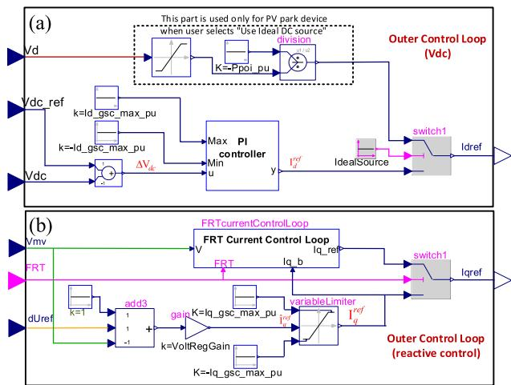  
Fig. 4. The block diagram of outer control loop of controller in Modelica.

$$
\widehat {\mathrm {I}} _ {q} ^ {\text {r e f}} = \mathrm {K} _ {\text {R e g V o l t}} \left(\mathrm {U} ^ {\text {r e f}} - \mathrm {V} _ {\text {p o s} - M V - p u}\right) \tag {42}
$$

$$
- \mathrm {I} _ {q} ^ {\max } <   \mathrm {I} _ {q} ^ {\text {r e f}} <   \mathrm {I} _ {q} ^ {\max } \tag {43}
$$

where $\mathrm { K } _ { R e g V o l t }$ is the voltage regulator gain. The signal ${ \mathrm { d } } \mathrm { U } ^ { r e f }$ is calculated in the PPC by (54).

# 3.5. Fault-ride-through (FRT) function

The PV converter is protected by the FRT function in compliance with the grid regulations. Fig. 5 shows the scheme of FRT implemented in Modelica. The FRT is activated $\mathrm { i f } | \mathrm { V } _ { p o s . }$ MV $_ { - p u } - 1 | > \mathsf { V } _ { F R T } ^ { O N }$ and deactivated when

$| \mathbf { V } _ { p o s \_ M V \_ p u } - |$ 1|is below the pre-defined value $\mathsf { V } _ { F R T } ^ { O F F }$ . After release time, e.g. 0.1 s, the FRT is triggered. The FRT decision signal is sent to the blocks reactive power control loop (see also Fig. 4.(b)) and Idq reference limiter (see Fig. 6). When FRT function is on, the q-axis reference current $\mathrm { I } _ { q } ^ { r e f }$ in (42) is calculated in the “FRT current control loop” block as per:

$$
\mathrm {I} _ {q} ^ {\text {r e f}} = \mathrm {K} _ {F R T - g a i n} \mathrm {V} _ {\text {p o s} - M V - p u} \tag {44}
$$

$\mathrm { I } _ { q } ^ { r e f }$ is continuously controlled to remain between the upper and lower limits.

$$
\mathrm {I} _ {q, F R T} ^ {\min } - \mathrm {I} _ {q} ^ {r e f} <   \mathrm {I} _ {q, F R T} ^ {\max } \tag {45}
$$

where ${ \mathrm { K } } _ { F R T - g a i n }$ denotes the FRT voltage gain, $\mathrm { I } _ { q , \phantom { } } ^ { m a x } { } _ { F R T }$ and I minq, FRT are the $\Gamma _ { q , \quad F R T } ^ { \mathrm { m i n } }$ FRT q-axis current limits.

# 3.6. Idq reference limiter

Fig. 6 illustrates the implementation of “Idq reference limiter” block. The functionality of this block is to correct the final $\Gamma _ { d } ^ { r e f } \mathrm { a n d I } _ { q } ^ { r e f }$ based on the status of FRT. When FRT function is active, the controller gives the priority to the reactive current by reversing the d- and q-axis current limits. The logic of this block is implemented using Modelica components.

# 3.7. Inner current control loop

In the block, d- and q-axis reference currents are compared with dand q-axis grid currents and the errors are computed. i.e.

$$
\Delta \mathrm {I} _ {d} = \mathrm {I} _ {d} ^ {\text {r e f}} - \mathrm {I} _ {d - p o s - g s c} \tag {46}
$$

$$
\Delta \mathrm {I} _ {q} = \mathrm {I} _ {q} ^ {\text {r e f}} - \mathrm {I} _ {q - p o s - g s c} \tag {47}
$$

the d-axis reference voltage difference is calculated via a PI controller:

$$
\mathrm {d} \hat {\mathbf {V}} _ {d} ^ {r e f} = \mathrm {K} _ {i - G S C} \int \left[ \Delta \mathrm {I} _ {d} + \left(\mathrm {d} \mathbf {V} _ {d} ^ {r e f} - \mathrm {d} \hat {\mathbf {V}} _ {d} ^ {r e f}\right) \right] d t + \mathrm {K} _ {p - G S C} \Delta \mathrm {I} _ {d} \tag {48}
$$

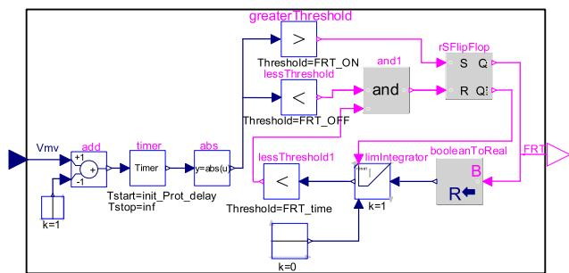  
Fig. 5. Fault ride-through logic in Modelica.

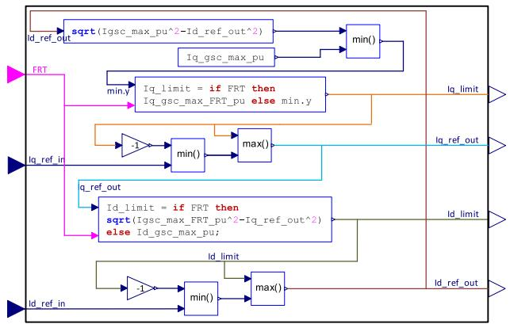  
Fig. 6. Idq reference limiter block diagram.

The d-axis reference voltage difference, ${ \mathrm { d } } { \mathrm { V } } _ { d } ^ { r e f }$ , is obtained by continuously controlling $\mathrm { d } \widehat { \mathsf { V } } _ { d } ^ { r e f }$ to be between the upper and lower limits.

$$
- \mathrm {V} _ {d, g s c} ^ {\max } <   \mathrm {d V} _ {d} ^ {\text {r e f}} <   \mathrm {V} _ {d, g s c} ^ {\text {m a x}} \tag {49}
$$

Similarly, the q-axis reference voltage difference, $\mathsf { d V } _ { q } ^ { r e f }$ is computed by replacing the indices of d with q in the above equations:

$$
\mathrm {d} \widehat {\mathrm {V}} _ {q} ^ {r e f} = \mathrm {K} _ {i, G S C} \int \left[ \Delta \mathrm {I} _ {q} + \left(\mathrm {d V} _ {q} ^ {r e f} - \mathrm {d} \widehat {\mathrm {V}} _ {q} ^ {r e f}\right) \right] d t + \mathrm {K} _ {p, G S C} \Delta \mathrm {I} _ {q} \tag {50}
$$

$$
- \mathrm {V} _ {\mathrm {q}, \text {g s c}} ^ {\max } <   \mathrm {d V} _ {\mathrm {q}} ^ {\text {r e f}} <   \mathrm {V} _ {\mathrm {q}, \text {g s c}} ^ {\text {m a x}} \tag {51}
$$

In “Vref_computation” block, the d-axis and q-axis grid voltage is computed as per (52) and (53).

$$
\overline {{\mathbf {V}}} _ {d \_ g r i d} = \widehat {\mathbf {V}} _ {d \_ p o s \_ g r i d} + \omega \mathrm {L} _ {\text {c h o c k}} \mathbf {I} _ {q} ^ {\text {r e f}} \tag {52}
$$

$$
\bar {\mathrm {V}} _ {q - \text {g r i d}} = \widehat {\mathrm {V}} _ {q - \text {p o s - g r i d}} - \omega \mathrm {L} _ {\text {c h o c k}} \mathrm {I} _ {d} ^ {\text {r e f}} \tag {53}
$$

The above d- and q-axis grid voltage are added to the d- and q-axis voltages, $\mathsf { d V } _ { d } ^ { r e f }$ and $\mathbf { d V } _ { q } ^ { r e f } :$ , respectively. Finally, the reference voltage in the abc frame, ${ \bf v } _ { a b c } ^ { r e f } ,$ , is calculated by applying inverse Park transform.

# 3.8. Electrical protections

The protection system block includes a low/high voltage ridethrough relay (LVRT/HVRT), deep voltage sag detector, dc overvoltage protection and an overcurrent relay. all protection systems, except for DC chopper protection, are activated after 300 ms of simulation. For LVRT and HVRT protections, the settings are configured based on [27]. The “Deep Voltage Sag Detector” temporary blocks the GSC to prevent potential overcurrent and restrict the FRT operation to the faults that occur outside the PV park.

The function of the dc chopper is to limit the dc bus voltage. It is activated when the dc bus voltage exceeds the pickup setting and deactivated when the dc bus is below the reset setting. The overcurrent protection is temporarily triggered when the converter current exceeds the pickup current. The relay is reset after a preset time release_delay.

# 3.9. Power plant controller

The output active power of a PV park at point of interconnection (POI) depends mainly on solar irradiation. However, the PV park should be able to control the reactive power at the POI to the grid. The PPC system first adjusts the reference reactive power based on the selected mode: Q-control, V-control, PF-control and QV curve-control; then controls the PV inverter reference voltage via a proportional-integral reactive power regulator as below:

$$
\mathrm {d} \widehat {\mathbf {U}} ^ {r e f} = \mathrm {K} _ {i - P P C} \int \left[ \Delta \mathrm {Q} ^ {r e f} + \left(\mathrm {d} \mathrm {U} ^ {r e f} - \mathrm {d} \widehat {\mathbf {U}} ^ {r e f}\right) \right] d t + \mathrm {K} _ {p - P P C} \Delta \mathrm {Q} ^ {r e f} \tag {54}
$$

$$
\Delta \mathbf {Q} ^ {\text {r e f}} = \mathbf {Q} ^ {\text {r e f}} - \mathbf {Q} _ {\text {p o i}} \tag {55}
$$

The reference voltage $\mathrm { , d U ^ { \it r e f } }$ is obtained by controlling of $\mathsf { d } \widehat { \mathsf { U } } ^ { r e f }$ to be between the upper and lower limits.

$$
\mathrm {d} \mathrm {U} _ {\text {m i n}} ^ {\text {r e f}} <   \mathrm {d} \mathrm {U} ^ {\text {r e f}} <   \mathrm {d} \mathrm {U} _ {\text {m a x}} ^ {\text {r e f}} \tag {56}
$$

The reference reactive power in (55) is computed from following modes:

• Q-control mode: the reference reactive power is defined by the user.   
• V-control mode:

$$
Q ^ {r e f} = K _ {\nu_ {- p o i}} \left(V _ {p o i} ^ {r e f} - V _ {p o i}\right) \tag {57}
$$

• PF-control mode:

$$
\mathrm {Q} ^ {\text {r e f}} = \frac {\mathrm {P} _ {\text {p o i}}}{\mathrm {P F} _ {\text {p o i}} ^ {\text {r e f}}} \sqrt {1 - \mathrm {P F} _ {\text {p o i}} ^ {\text {r e f}}} \tag {58}
$$

• $\mathrm { Q V }$ curve-control, $Q ^ { r e f } \mathrm { i }$ is a function of voltage. i.e. $Q ^ { r e f } = f ( \mathrm { V } _ { p o i } )$

in above equations $, \mathrm { P F } _ { p o i } ^ { r e f } , \ \mathrm { V } _ { p o i } \mathrm { a n d P } _ { p o i } \mathrm { a r e }$ the reference power factor, measured voltage and active power in the POI, respectively. $\mathrm { K } _ { \nu _ { - } p o i }$ denotes the PPC voltage regulator gain.

If a severe voltage sag occurs at the POI due to a fault, the PI regulator output is kept constant by blocking its input. This is to avoid overvoltage after fault removal.

# 4. Test study and validation

To introduce the Modelica approach for studying CI problems, we used the test system in [3] after replacing the type-4 wind park with a similar size PV park as shown in Fig. 7. The test circuit is designed with the components of the MSEMT library. The PV park, with nominal power of 666.8 MW, consists of an aggregated model of 400 PV arrays (each 1.667 MW). The PV park converter is modeled with an average value model (the parameters are given in Appendix, Table 3). The PV park operates at the irradiance and ambient temperature of 100 $\mathrm { { W / m ^ { 2 } } }$ and of $3 0 ^ { \circ } \mathrm { C } ,$ respectively and injects 52 MW to the network. The park works in Q-control mode, with $Q ^ { r e f } = 0 .$ . Each of BUS 1 and BUS 2 is connected to an ideal voltage source through a coupled RL in series representing the Thevenin equivalents of Network-1 and Network-2, respectively. The two transmission lines are represented by distributed constant parameter models. The length of TLM1 is 500 km and compensated by two identical capacitor banks located at its ends, providing 50 % compensation. The line also contains 230 Mvar shunt reactors at both ends. The TLM2 of 100 km connects Network-2 to the PV park. The internal network of PV park includes the collector network

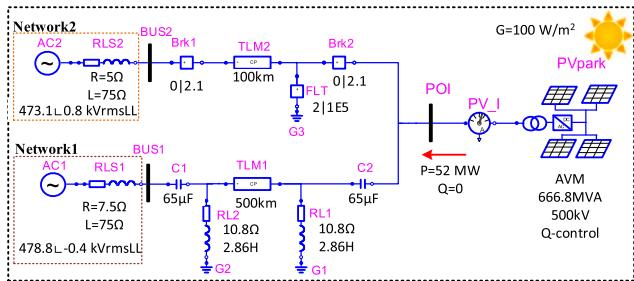  
Fig. 7. PV park test case designed by MSEMT elements.

(34.5 kV) and two transformers; 0.575/34.5 kV and 34.5/500 kV.

It is assumed that a three-phase to ground fault occurs on TLM2 at t = 2 s, then TLM2 is disconnected from both sides at t = 2.1 s. Henceforth, the PV park is radially connected to the series capacitor of TLM1. The capacitors of TLM1 interact with the PV park in super-synchronous frequency range and causes instability.

# 4.1. Time-domain evaluation and validation

For validation of the developed Modelica models, a simulation is first conducted in OpenModelica, using the variable step solver IDA with the tolerance of 1e-6. This tolerance is selected to offer the best accuracy. The simulation is run with the timestep of 1 μs in EMTP® [25] to have results as accurate as Modelica. One such resolution is not needed for stability analysis; therefore, the simulations are repeated with the tolerance of 1e-3 and the timestep of 20 μs; respectively in Modelica and EMTP. The EMTP solver is trapezoidal/Backward Euler. The simulation time is 3 s for both simulations. Fig. 8. (a) shows the phase-a PV park current waveform obtained from MSEMT and EMTP. The EMTP solutions are distinguished by blue and black curves for the timesteps of 1 μs and 20 μs, respectively. The red curve shows the solutions of Modelica. It is observed that before the fault, the system is in steady state and all curves are identical. After the fault, the transients appear and continue by the end of simulation. Fig. 8. (b) shows the zoomed view of transients after the disconnection of TLM2. One can see that the EMTP solutions with a smaller timestep present the closest results to Modelica. The differences are mainly due to error control and accuracy of the IDA solver against the fixed-step trapezoidal one. The integration method of IDA is based on variable-order, variable-coefficient BDF method [28], in which the control error mechanism adjusts the timestep and order such that the local truncation error during one step is below the user-prescribed tolerance; i.e. 1e-6. The minimum and maximum step sizes are 3.36e-11 and 20e-06, respectively. The number of Jacobian, ODE evaluations and error test failures are 461,530, 2,226,915, and 149, 403; respectively in Modelica. Moreover, the number of time-point

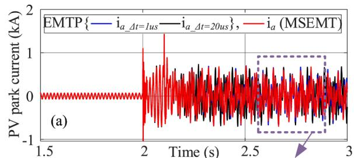

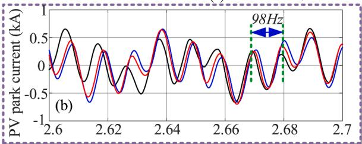

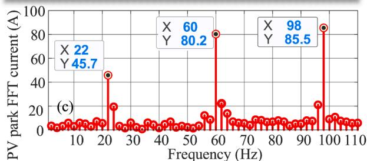  
Fig. 8. (a): Comparison of PV park phase-a current obtained from MSEMT and EMTP. (b): the zoom-in view. (c): the FFT of PV park current.

solutions in Modelica is 1,284,756, which is much less than EMTP, i.e. 3, 001,895. The average number of iterations per time-point is 1.001315 in EMTP.

Fig. 8. (c) reveals the FFT of PV park current. Besides the fundamental frequency component, two other oscillating frequencies are observed. The 98 Hz component is the resonance frequency, and the 22 Hz component is the mirror frequency, which is due to the asymmetric structure of controller [29]. In addition, it is seen in Fig. 9 that the output active power of PV park is 0.07 pu and the reactive power is zero during the normal operation of PV park. The active/reactive power start fluctuating immediately after t = 2.1 s, confirming an instable power delivery.

# 4.2. Eigenvalue analysis

The resulting nonlinear circuit of Fig. 7 is represented by a set of $n =$ 98 differential equations in the form of (2) in Modelica. The analysis of this section is carried out by the linearization and extracting of matrix $\mathbf { A } _ { n \times n }$ at two points of t = 2.5 s and t = 3 s. This is simply obtained by executing a function that return the output in the form of (6). The matrix analysis shows that the elements of both matrices are similar. Therefore, it is concluded that linearization is carried out in an equilibrium point, moreover, Fig. 8. (a) shows that the system reaches a quasi-steady state after $t = 2 . 2 5 s$ . Thus, both state matrices are valid for stability analysis. Now, the eigenvalues are computed. Fig. 10. (a) shows the eigenvalues ofA. The eigenloci of A(t = 2.5 s)andA(t = 3 s)are distinguished by red and blue crosses, respectively. It is seen that the eigenvalues for both cases are identical as well. It is observed on Fig. 10. (b) that four eigenvalues are in the right-half side of the complex plane, indicating an instable case.

For EV analysis and to find the causes of instability, the state variables are categorized into 11 subsets. Table 1 shows the classifications, e.g. network components, transformers, GSC controller, DC capacitor, and filters. It is seen that all the eigenvalues lie on the left half of the complex plane except the oscillating modes λ49,50 and λ51,52. Since the electrical variables are in the dq frame (with $\omega _ { s } = 3 7 7 \mathrm { r a d } / s )$ , the natural frequencies of these oscillating modes $( 6 . 3 9 \pm 1 0 2 2 i \mathrm { a n d } 2 . 6 9 \pm 1 0 2 2 i )$ in the abc frame is $\omega _ { n } = 6 4 5 \mathrm { r a d / } s \mathrm { o r } f _ { n } \simeq 1 0 2 \mathrm { H z } ;$ which is close to the FFT results obtained from time-domain simulations.

Moreover, the activity of the k-th state variable $( x _ { k } )$ on the i-th eigenvalue (λi) are measured by participation factors, $p _ { k i } =$ w v wherew andv are the k-th entries of the left $w _ { i k }$ and right $\nu _ { k i }$ eigenvectors associated to the i-th eigenvalue of A. The eigenvectors are normalized such that $\begin{array} { r } { \sum _ { k = 1 } ^ { N } p _ { k i } = \sum _ { i = 1 } ^ { N } p _ { k i } = 1 } \end{array}$ . Therefore $, p _ { k i } < < 1$ means that the effect ofx onλiis negligible. Participation factors computed for these four modes reveal that state variables associated with dc capacitor voltage and PLL (first order filter, integrator and PI controller) are dominant with $p _ { k i } > 0 . 5$ . Other participation factors are almost zero $( p _ { k i } \approx 0 )$ .

The system is stable if it operates in the irradiance of $1 0 0 0 \mathrm { { W / m ^ { 2 } } }$ . In

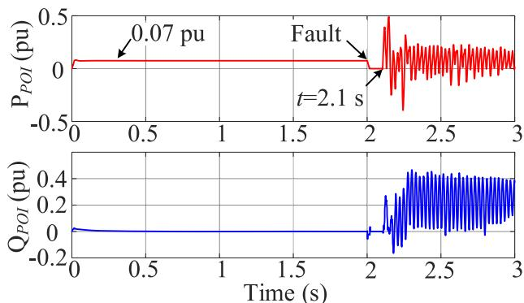  
Fig. 9. The active and reactive power curves of PV park.

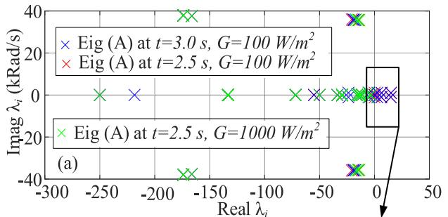

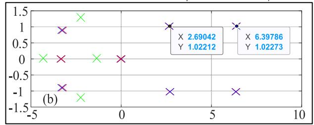  
Fig. 10. (a): Eigenloci of instable scenario at $t = 2 . 5 ~ s$ and $t = 3 \ \mathsf { s } ,$ and stable scenario at $t = 2 . 5 \ s \ \mathrm { ( b ) } \colon$ zoomed view.

Table 1 Categorization of state variables.   

<table><tr><td>State variable</td><td>Mode (i)</td><td>Unstable pole</td><td>pki</td></tr><tr><td>Comp. capacitor volt.</td><td>1-6</td><td>-</td><td>0</td></tr><tr><td>Reactive comp. currents</td><td>7-12</td><td>-</td><td>0</td></tr><tr><td>Network current</td><td>13-18</td><td>-</td><td>0</td></tr><tr><td>Conv. Transf. current</td><td>19-21</td><td>-</td><td>0</td></tr><tr><td>Collector volt./current</td><td>22-30</td><td>-</td><td>0</td></tr><tr><td>Filter volt./current</td><td>31-42</td><td>-</td><td>0</td></tr><tr><td>Park transfor. current</td><td>43-45</td><td>-</td><td>0</td></tr><tr><td>Choke current</td><td>46-48</td><td>-</td><td>0</td></tr><tr><td>DC capacitor</td><td>49</td><td>λ49= 6.39 + 1022.7i</td><td>0.8</td></tr><tr><td>GSCounter</td><td>50-85</td><td>λ50= 6.39 - 1022.7i</td><td>0.95</td></tr><tr><td></td><td></td><td>λ51,52= 2.69 ± 1022.1i</td><td>0.94/0.99</td></tr><tr><td>PPC controller</td><td>86-98</td><td>-</td><td>0</td></tr></table>

this condition, the PV park injects 651 MW to the network. Fig. 10. (a) illustrates the eigenloci of the stable system at t = 2.5 s distinguished by green crosses. One can see that all poles are in the left-half of the complex plane. The equivalent resistance of PV park increases with the increase of solar irradiance. Therefore, the risk that the total equivalent system impedance $( Z _ { P V } + Z _ { g r i d } )$ becomes purely resistive with a negative value in a specific frequency decrease.

# 4.3. Impedance scanning and bode diagram analysis

For this purpose, the system is divided into two subsystems, grid-side and PV park side [1]. The phasor-domain impedance scanning tool available in EMTP® is used for obtaining the positive frequency response of the grid $, Z _ { g r i d } ( f ) ( \mathrm { T L M 2 }$ is disconnected). The PV park impedance ${ \cal J } _ { P V } ( f )$ , is computed through time-domain impedance scanning by injecting sinusoidal current perturbations with an amplitude of 0.01 pu. Fig. 11 shows the Bode diagrams o $\mathrm { f } Z _ { g r i d } ( f )$ )and $Z _ { P V } ( f )$ . Bode plot analysis [30] shows that the phase margin is -0.3 degree at 650 rad/s (or 103 Hz), indicating a critical instable frequency. The result confirms the results obtained from time-domain solution and EV analysis as well.

# 4.4. Performance analysis

This section aims to compare the performance of the methods used for the stability analysis of the above testcase. Table 2 compares the CPU times for each method. In time domain simulation, Modelica with the tolerance of 1e-6, and the maximum time step of 20 µs outperforms

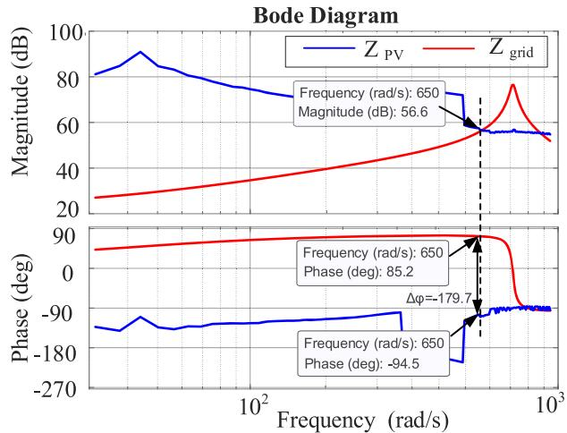  
Fig. 11. Bode diagram of grid-side and PV park-side impedances.

Table 2 The Performance Comparison Between Different Methods.   

<table><tr><td>Simulation type</td><td>Software</td><td>Conditions</td><td>CPU time</td></tr><tr><td rowspan="3">Time-domain</td><td>OpenModelica</td><td>Tol:1e-6</td><td>21.1 s</td></tr><tr><td>EMTP</td><td>Δt = 1 μs</td><td>164.2 s</td></tr><tr><td>EMTP</td><td>Δt = 20 μs</td><td>10.4 s</td></tr><tr><td>EV analysis</td><td>OpenModelica</td><td>Tol:1e-3</td><td>14.2</td></tr><tr><td rowspan="3">Frequency scan</td><td rowspan="3">EMTP</td><td>fmax = 150 Hz</td><td>76.8 s</td></tr><tr><td>Δf = 5 Hz</td><td></td></tr><tr><td>Δt = 50 μs</td><td></td></tr></table>

EMTP with time step is 1 µs. For EV analysis and frequency scanning, the simulations are carried out with a larger tolerance/time step, since higher resolutions are not required. One can see the EV method outperforms the frequency scan method, with the ratio of 1:5.4, recalling time-domain impedance scanning is a time-consuming approach, because the simulation should run in time-domain for a range of frequencies.

# 5. Conclusion

This paper discussed EMT modeling, simulation and investigation of control interaction instability risks in PV parks using Modelica. The time-domain simulation in Modelica is validated against EMTP®, showing identical results and good performance. Stability analysis is carried out using EV analysis, and results are validated with EMT-type impedance scanning. It is observed that linearization of a nonlinear system is fast in Modelica, and the linearization is able to provide accurate results for stability analysis at the quasi steady-state operating conditions after a large disturbance. Modelica offers a user-friendly environment for changing the parameters, and modifications of circuits. The proposed approach can be extended to other types of IBR and control interactions. The future work addresses control interaction risk in a multi-IBR large scale system.

# CRediT authorship contribution statement

A. Masoom: Software, Formal analysis, Writing – original draft, Methodology, Conceptualization. J. Mahseredjian: Writing – review & editing, Supervision, Validation. U. Karaagac: Validation, Writing – review & editing, Supervision.

# Declaration of competing interest

The authors declare that they have no known competing financial

interests or personal relationships that could have appeared to influence

the work reported in this paper.

# Appendix

Table 3 The parameters of PV park used in the case study.   

<table><tr><td>Controller parameters</td><td>Controller parameters</td><td>Controller parameters</td></tr><tr><td>Ki_PLL = 33</td><td>FRTON = 0.09</td><td>Rchoke = 0.015 pu</td></tr><tr><td>Kp_PLL = 100</td><td>FRTOFF = 0.07</td><td>Lchoke = 1.5 pu</td></tr><tr><td>ωf_PLL = 1332 Hz</td><td>FRTime = 0.25</td><td>Pickup DVS voltage = 0.01 pu</td></tr><tr><td>Ki_GSC = 8.3</td><td>Iq_gsc_max_FRT_pu = 0.4</td><td>Reset DVS voltage = 0.1 pu</td></tr><tr><td>Kp_PLL = 1.05</td><td>Igsc_max_FRT_pu = 0.6</td><td>Pickup VDC = 1.075 pu</td></tr><tr><td>Ki(dc) = 55.1</td><td>Ki_PPC = 0.15</td><td>Reset VDC = 1.025 pu</td></tr><tr><td>Kp(dc) = 1.8</td><td>Kp_PPC = 0</td><td></td></tr><tr><td>KRegVolt = 2</td><td>Vdc = 1.264 kV</td><td></td></tr><tr><td>KFRT_gain = 2</td><td>Qfilter = 75 MVAR</td><td></td></tr></table>

# Data availability

The authors do not have permission to share data.

# References

[1] IEEE-PES Wind SSO Task Force, Wind energy systems sub-synchronous oscillations: events and modeling, Tech. Rep. PES-TR80 AMPS Comm. (2020).   
[2] T. Xue, U. Karaagac, H. Xue, J. Mahseredjian, Re-examination of small-signal instability in weak grid-connected voltage source converters, Electr, Power Syst, Res 223 (2023) 109625, https://doi.org/10.1016/j.epsr.2023.109625 articleOct.   
[3] Y. Cheng, et al., Real-world subsynchronous oscillation events in power grids with high penetrations of inverter-based resources, IEEE Trans. Power Syst. 38 (1) (2023) 316–330, https://doi.org/10.1109/TPWRS.2022.3161418. Jan.   
[4] L. Meng, U. Karaagac, I. Kocar, M. Ghafouri, A. Stepanov, J. Mahseredjian, A new control interaction phenomenon in large-scale type-4 wind park, IEEe Access 11 (2023) 132822–132832, https://doi.org/10.1109/ACCESS.2023.3334153.   
[5] R.N. Damas, Y. Son, M. Yoon, S.-Y. Kim, S. Choi, Subsynchronous oscillation and advanced analysis: a review, IEEe Access 8 (2020) 224020–224032, https://doi. org/10.1109/ACCESS.2020.3044634.   
[6] J. Sun, Small-signal methods for AC distributed power systems–a review, IEEE Trans, Power Electron. 24 (11) (2009) 2545–2554, https://doi.org/10.1109/ TPEL.2009.2029859. Nov.   
[7] J. Sun, Impedance-based stability criterion for grid-connected inverters, IEEE Trans. Power Electron. 26 (11) (2011) 3075–3078, https://doi.org/10.1109/ TPEL.2011.2136439. Nov.   
[8] Keijo Jacobs, Younes Seyedi, Lei Meng, Ulas Karaagac, Jean Mahseredjian, A comparative study on frequency scanning techniques for stability assessment in power systems incorporating wind parks, Electr. Power Syst. Res. 220 (2023) 109311, https://doi.org/10.1016/j.epsr.2023.109311 articleJuly.   
[9] N. Pogaku, M. Prodanovic, T.C. Green, Modeling, analysis and testing of autonomous operation of an inverter-based microgrid, IEEE Trans. Power Electron. 22 (2) (2007) 613–625, https://doi.org/10.1109/TPEL.2006.890003. March.   
[10] L. Fan, C. Zhu, Z. Miao, M. Hu, Modal analysis of a DFIG-based wind farm interfaced with a series compensated network, IEEE Trans. Energy Convers. 26 (4) (2011) 1010–1020, https://doi.org/10.1109/TEC.2011.2160995. Dec.   
[11] L. Fan, Modeling type-4 wind in weak grids, IEEE Trans. Sustain. Energy 10 (2) (2019) 853–864, https://doi.org/10.1109/TSTE.2018.2849849. April.   
[12] X. Xie, Y. Dong, K. Bai, X. Gao, and P. Liu. “The improved SSR electromagnetic simulation model and its comparison with field measurements.” SIMULTECH 2012, Rome, Italy, July 2012.   
[13] J.-S. Kim, J. Mahseredjian, U. Karaagac, A. Lesage-Landry, A. Grilo-Pavani, C.- H. Kim, State-space models for control interaction analysis of DFIG and FSC wind parks, in: 50th Annual Conference of the IEEE Industrial Electronics Society (IECON 2024), Chicago, IL, USA, Nov. 2024.   
[14] T. Xue, U. Karaagac, I. Kocar, L. Cai, Reader’s guide to sub-synchronous interactions in DFIG-based wind parks, in: 2023 International Conference on Electrical, Communication and Computer Engineering (ICECCE), Dubai, United Arab Emirates, 2023, pp. 1–6, https://doi.org/10.1109/ ICECCE61019.2023.10442170.   
[15] A. Ostadi, A. Yazdani, R.K. Varma, Modeling and stability analysis of a DFIG-based wind-power generator interfaced with a series-compensated line, IEEE Trans.

Power Deliv. 24 (3) (2009) 1504–1514, https://doi.org/10.1109/ TPWRD.2009.2013667. July.   
[16] L. Fan, R. Kavasseri, Z.L. Miao, C. Zhu, Modeling of DFIG-based wind farms for SSR analysis, IEEE Trans. Power Deliv. 25 (4) (2010) 2073–2082, https://doi.org/ 10.1109/TPWRD.2010.2050912. Oct.   
[17] A.S. Trevisan, M. Fecteau, A. Mendonça, R. Gagnon, J. Mahseredjian, Analysis of low frequency interactions of DFIG wind turbine systems in series compensated grids, Electr. Power Syst. Res. 191 (2021) 106845, https://doi.org/10.1016/j. epsr.2020.106845.   
[18] X. Gao, D. Zhou, A. Anvari-Moghaddam, F. Blaabjerg, Stability analysis of gridfollowing and grid-forming converters based on State-space modelling, IEEe Trans. Ind. Appl. 60 (3) (2024) 4910–4920, https://doi.org/10.1109/TIA.2024.3353158. May-June.   
[19] Julia language [Available online:] https://julialang.org/.   
[20] U. Karaagac, J. Mahseredjian, S. Jensen, R. Gagnon, M. Fecteau, I. Kocar, Safe operation of DFIG-based wind parks in series-compensated systems, IEEE Trans. Power Deliv. 33 (2) (2018) 709–718, https://doi.org/10.1109/ TPWRD.2017.2689792. April.   
[21] Modelica® – A Unified object-oriented language for Systems modeling, language specification, Version 3.5, February 18, 2021.   
[22] L.R Petzold, Description of DASSL: a differential/algebraic system solver (No. SAND-82-8637; CONF-820810-21). Sandia National Labs., Livermore, CA (USA).   
[23] A.C. Hindmarsh, P.N. Brown, K.E. Grant, S.L. Lee, R. Serban, D.E. Shumaker, C. S. Woodward, SUNDIALS: suite of nonlinear and differential/algebraic equation solvers, ACM Trans. Math. Softw. 31 (3) (2005) 363–396. Also available as LLNL technical report UCRL-JP-200037.   
[24] A. Masoom, J. Mahseredjian, T. Ould-Bachir, A. Guironnet, MSEMT: an Advanced Modelica Library for Power system electromagnetic transient studies, IEEE Trans. Power Deliv. 37 (4) (2022) 2453–2463, https://doi.org/10.1109/ TPWRD.2021.3111127. Aug.   
[25] J. Mahseredjian, S. Denneti`ere, L. Dub´e, B. Khodabakhchian, L. G´erin-Lajoie, On a new approach for the simulation of transients in power systems, Electr. Power Syst. Res. 77 (11) (2007) 1514–1520, https://doi.org/10.1016/j.epsr.2006.08.027. IssueSeptember.   
[26] A Masoom, J. Gholinezhad, T. Ould-Bachir, and J. Mahseredjian. "Electromagnetic transient modeling of power electronics in modelica, accuracy and performance assessment." In International Conference of the IMACS TC1 Committee, pp. 275- 288, doi: 10.1007/978-3-031-24837-521_21.   
[27] Transmission provider technical requirements for the connection of power plants to the Hydro-Quebec transmission system, Hydro Quebec Transenergie (2009).   
[28] C.W. Gear, The numerical integration of ordinary differential equations, Math. Comput. 21 (98) (1967) 146–156, https://doi.org/10.2307/2004155.   
[29] A. Rygg, M. Molinas, C. Zhang, X. Cai, A modified sequence-domain impedance definition and its equivalence to the dq-domain impedance definition for the stability analysis of AC Power Electronic Systems, IEEe J. Emerg. Sel. Top. Power. Electron. 4 (4) (2016) 1383–1396, https://doi.org/10.1109/ JESTPE.2016.2588733. Dec.   
[30] L. Meng, U. Karaagac, K. Jacobs, T. Xue, R.M. Furlaneto, J. Mahseredjian, Comparative analysis of impedance-based stability assessment methods for inverter-based resources, in: 50th Annual Conference of the IEEE Industrial Electronics Society (IECON 2024), Chicago, IL, USA, 2024. Nov.