# Revisiting dynamic phasors and their efficacy in simulating electric circuits✩,✩✩

Ramin Parvari, Shaahin Filizadeh ∗, Dilsha Kuranage

University of Manitoba, Winnipeg, MB R3T 5V6, Canada

# A R T I C L E I N F O

Keywords:

Dynamic phasors (DP)

Electromagnetic transient (EMT) simulations

Companion circuit

Eigenvalues

# A B S T R A C T

In this paper, the theory and application of dynamic phasors (DPs) to model and simulate electrical circuits are revisited. The paper reveals foundational conditions that must be in place so that DPs are able to offer computational benefits that are commonly, yet incorrectly, attributed to them as universal characteristics. Following a companion model-based approach using DPs, eigenvalue and steady-state analyses are conducted to assess the precision of EMT and DP modeling methods as a function of the simulation time step. Through a case study of the IEEE 9-bus system, the effects of large time-steps on simulation accuracy are illustrated. The findings demonstrate that while DP-based modeling can accurately represent steady-state behavior of circuits with large time-steps, its accuracy is limited during transients conditions, highlighting the importance of judicious time-step selection for accurate simulations.

# 1. Introduction

Several methods with varying degrees of accuracy and computational complexity exist for modeling and simulation of power systems [1–3]. For instance, transient stability (TS) programs ignore the fast dynamics of the electrical network, focusing instead on the relatively slow electromechanical interactions in large, interconnected systems. TS-type solvers benefit from large simulation time-steps (in the milliseconds range), thereby reducing the run time. Electromagnetic Transients (EMT) solvers, on the other hand, capture the fast dynamics of circuits, e.g., switching transients, in great detail [4,5]. EMT solvers typically require small time-steps (in the microseconds range), which significantly extend the run time, especially for large power system with sophisticated components such as high-frequency power-electronic converters.

One approach to bridge the gap between the accuracy of an EMT solver and the computational efficiency of a TS solver is to use the concept of dynamic phasors, in which frequency-shifting is used to focus on the low-frequency content of a band-pass signal [6,7]. In this approach, the circuit’s natural quantities, i.e., branch voltages and currents, are assumed to be sinusoidal but modulated with a lowfrequency signal that characterizes the dynamics of the power system. Mathematically, an arbitrary voltage or current, ??(??), is assumed to take on the form

$$
x (t) = \mathbf {X} (t) e ^ {\mathrm {j} \omega_ {0} t} \tag {1}
$$

where ??(??) is the dynamic phasor, and $e ^ { \mathrm { j } \omega _ { 0 } t }$ represents the sinusoidal signal of the base (i.e., shift) frequency $\omega _ { 0 } .$ . Dynamic phasor analysis is based upon solving for the dynamic phasors of a network’s voltages and currents, whereas an EMT simulator solves the circuit for its natural quantities.

This approach has been applied to a wide range of systems, including line-commutated and modular multilevel converters (LCCs and MMCs) [8–10], flexible AC transmission systems (FACTS) [11,12], induction machines [13,14], and hybrid simulations [15–18]. Dynamic phasors have also been utilized to expand the frequency bandwidth of TS-type simulations [19].

Dynamic phasors are widely believed to substantially reduce the computational burden of discrete-time EMT-type simulations. This belief stems from the notion that simulating circuits to find a lowfrequency signal, i.e., the dynamic phasor or $\mathbf { X } ( t ) ,$ , does not require the small time-steps that an EMT solver needs to use to capture the natural signal. Thus, larger time-steps can be used to speed up the simulation [3,6,20,21]. However, as this paper demonstrates, this statement is not universally valid and is subject to specific conditions that are imposed by the circuit that is modeled. In particular, the paper shows that the eigenvalues of the circuit play a crucial role in whether or not modeling in the DP domain may offer benefits without considerable loss of accuracy.

A generalized theory of dynamic phasors is developed in Section 2 using the concept of an integrating factor. It is demonstrated that the commonly-used term $e ^ { \mathrm { j } \omega _ { 0 } t }$ is a special case where the shift frequency remains constant over time. Additionally, a generalized continuoustime companion circuit is developed in this section. Section 3 presents the shift in eigenvalues using state-space analysis and the steady-state accuracy of both EMT and DP formulations are compared against the analytical solution of a second-order RLC circuit. In Section 4, a case study of the IEEE 9-bus system is presented, demonstrating the core contributions of this work. Section 5 concludes the paper.

# 2. A general theory of dynamic phasors

Let ??(??) be a natural signal that represents a voltage or a current in a circuit. This signal can be written as the product of two signals as follows:

$$
x (t) = \mu (t) \mathbf {X} (t) \tag {2}
$$

where $\mu ( t )$ is an arbitrary unit-less signal, and ??(??) is called a transformed version of ??(??). To ensure bounded signals both in the original and transformed domains, the multiplying signal $\mu ( t )$ must satisfy the following conditions:

$$
\mu (t) \neq 0, \pm \infty \quad \forall t \tag {3}
$$

Additionally, to maintain identical initial conditions for ??(??) and $\mathbf { X } ( t )$ the values of ??(??) at ?? = 0 is considered to be unity:

$$
\mu (0) = 1 \tag {4}
$$

Hereinafter, the following notation is used to show the correspondence between ??(??) and ??(??):

$$
x (t) \longleftrightarrow \mathbf {X} (t) \tag {5}
$$

An important feature of the above transformation is the derivative property, which can be readily expressed as follows:

$$
\frac {\mathrm {d} x (t)}{\mathrm {d} t} \longleftrightarrow \frac {\mathrm {d} \mathbf {X} (t)}{\mathrm {d} t} + \frac {\mu^ {\prime} (t)}{\mu (t)} \mathbf {X} (t) \tag {6}
$$

where $\mu ^ { \prime } ( t )$ is the time derivative of $\mu ( t ) .$ . Note that the term $\frac { \mu ^ { \prime } ( t ) } { \mu ( t ) }$ is ??(??)in Hz; accordingly a new variable, ??(??), which implies time-dependent frequency, may be defined as follows.

$$
s (t) \triangleq \frac {\mu^ {\prime} (t)}{\mu (t)} \tag {7}
$$

Note that for a given ??(??), (7) may also be viewed as a differential equation to be solved for ??(??) with the initial condition stated in (4). The solution of this differential equation is expressed in (8), which is commonly known as the integrating factor in the theory of differential equations.

$$
\mu (t) = \mathrm {e} ^ {\int_ {0} ^ {t} s (\tau) \mathrm {d} \tau} \tag {8}
$$

It is important to note that due to their linear nature the Kirchhoff’s Voltage and Current Laws (KVL and KCL) remain invariant under the transformation in (5), indicating that the transformed voltages and currents continue to satisfy the original KVL and KCL equations. The transformed circuit retains the original topology but features elements whose characteristics are modified as a result of the transformation. Hereinafter, such a transformed circuit is called a continuous-time companion circuit. The behavior of elementary circuit elements in the companion circuit is discussed in the following subsections.

# 2.1. Independent voltage and current sources

For a voltage source, ??(??), or a current source, ??(??), the respective transformed signals ??(??) and ??(??) are as follows.

$$
\mathbf {E} (t) = \frac {e (t)}{\mu (t)} = e (t) \mathrm {e} ^ {- \int_ {0} ^ {t} s (\tau) \mathrm {d} \tau}
$$

$$
\mathbf {J} (t) = \frac {j (t)}{\mu (t)} = j (t) \mathrm {e} ^ {- \int_ {0} ^ {t} s (\tau) \mathrm {d} \tau} \tag {9}
$$

Table 1 Basic elements in original and companion circuit domains.   

<table><tr><td>Original Circuit</td><td>Continuous-time Companion Circuit</td></tr><tr><td>e(t)</td><td>e(t)e-∫0&#x27;s(τ)dτ</td></tr><tr><td>+1</td><td>+1</td></tr><tr><td>j(t)</td><td>j(t)e-∫0&#x27;s(τ)dτ</td></tr><tr><td>R</td><td>R</td></tr><tr><td>L</td><td>L</td></tr><tr><td>C</td><td>1/(Cs(t))</td></tr><tr><td>i(km(t)+ZC)</td><td>i(mk(t)+ZC)</td></tr></table>

Fig. 1. The transmission line model.

# 2.2. Resistors

A resistor’s ?? − ?? characteristics can be simply transformed as given in (10). It is important to note that the resistor may be time-varying; however, its instantaneous resistance remains unaffected by the transformation.

$$
v (t) = R i (t) \quad \longleftrightarrow \quad \mathbf {V} (t) = R \mathbf {I} (t) \tag {10}
$$

# 2.3. Inductors and capacitors

Inductors and capacitors in the original and companion circuits are affected by the derivative property of the transformation. Eqs. (11) and (12) describe the behavior of inductors and capacitors in both the original and companion circuits, respectively.

$$
v (t) = L \frac {\mathrm {d} i (t)}{\mathrm {d} t} \quad \longleftrightarrow \quad \mathbf {V} (t) = L \frac {\mathrm {d} \mathbf {I} (t)}{\mathrm {d} t} + L s (t) \mathbf {I} (\mathbf {t}) \tag {11}
$$

$$
i (t) = C \frac {\mathrm {d} v (t)}{\mathrm {d} t} \quad \longleftrightarrow \quad \mathbf {I} (t) = C \frac {\mathrm {d} \mathbf {V} (t)}{\mathrm {d} t} + C s (t) \mathbf {V} (\mathbf {t}) \tag {12}
$$

These indicate that (i) an inductor is transformed into an inductor of the same inductance in series with a resistor with a resistance of ????(??); (ii) a capacitor is transformed into a capacitor of the same capacitance in parallel with a resistor with a conductance of ????(??). Table 1 provides a summary of the original and companion models.

# 2.4. Lossless transmission lines

Fig. 1 shows the model of a lossless line where $Z _ { \mathrm { C } }$ and $\tau _ { \mathrm { d } }$ are the characteristic impedance and traveling time [22].

The two current sources are determined using past values of voltages and currents, as follows.

$$
j _ {\mathrm {k}} (t) = - \frac {1}{Z _ {\mathrm {C}}} v _ {\mathrm {m}} \left(t - \tau_ {\mathrm {d}}\right) - i _ {\mathrm {m k}} \left(t - \tau_ {\mathrm {d}}\right) \tag {13}
$$

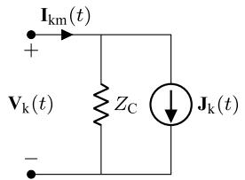

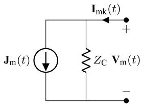  
Fig. 2. The companion model of the transmission line.

$$
j _ {\mathrm {m}} (t) = - \frac {1}{Z _ {\mathrm {C}}} v _ {\mathrm {k}} (t - \tau_ {\mathrm {d}}) - i _ {\mathrm {k m}} (t - \tau_ {\mathrm {d}}) \tag {14}
$$

The DP model of the line is obtained by converting the circuit in Fig. 1 into its companion equivalent, as in Fig. 2.

The history current $\mathbf { J } _ { \mathrm { k } } ( t )$ is calculated as follows.

$$
\begin{array}{l} \mathbf {J} _ {\mathrm {k}} (t) = j _ {\mathrm {k}} (t) \mathrm {e} ^ {- \int_ {0} ^ {t} s (\tau) \mathrm {d} \tau} \\ = \left(- \frac {1}{Z _ {\mathrm {C}}} v _ {\mathrm {m}} (t - \tau_ {\mathrm {d}}) - i _ {\mathrm {m k}} (t - \tau_ {\mathrm {d}})\right) \mathrm {e} ^ {- \int_ {0} ^ {t} s (\tau) \mathrm {d} \tau} \\ = \left(- \frac {1}{Z _ {\mathrm {C}}} v _ {\mathrm {m}} (t - \tau_ {\mathrm {d}}) - i _ {\mathrm {m k}} (t - \tau_ {\mathrm {d}})\right) \mathrm {e} ^ {- \left(\int_ {0} ^ {t - \tau_ {\mathrm {d}}} + \int_ {t - \tau_ {\mathrm {d}}} ^ {t}\right) s (\tau) \mathrm {d} \tau} \\ = \left(- \frac {1}{Z _ {\mathrm {C}}} \mathbf {V} _ {\mathrm {m}} \left(t - \tau_ {\mathrm {d}}\right) - \mathbf {I} _ {\mathrm {m k}} \left(t - \tau_ {\mathrm {d}}\right)\right) \mathrm {e} ^ {- \int_ {t - \tau_ {\mathrm {d}}} ^ {t} s (\tau) \mathrm {d} \tau} \tag {15} \\ \end{array}
$$

Similarly, the history current $\mathbf { J } _ { \mathrm { m } } ( t )$ is calculated as follows.

$$
\mathbf {J} _ {\mathrm {m}} (t) = \left(- \frac {1}{Z _ {\mathrm {C}}} \mathbf {V} _ {\mathrm {k}} \left(t - \tau_ {\mathrm {d}}\right) - \mathbf {I} _ {\mathrm {k m}} \left(t - \tau_ {\mathrm {d}}\right)\right) \mathrm {e} ^ {- \int_ {t - \tau_ {\mathrm {d}}} ^ {t} s (\tau) \mathrm {d} \tau} \tag {16}
$$

The companion circuit is generally time-varying, which increases the computational complexity of its solution. The only scenario where the circuit remains time-invariant occurs when ??(??) is a complex constant as follows:

$$
s (t) = \sigma_ {0} + \mathrm {j} \omega_ {0} \tag {17}
$$

where $\sigma _ { 0 }$ and $\omega _ { 0 }$ are constant values. Given the conditions in (3), $\sigma _ { 0 }$ must be zero to prevent $\mu ( t )$ from becoming zero or reaching infinite magnitude at any point in time. Thus, the integrating factor simplifies to the following:

$$
\mu (t) = \mathrm {e} ^ {\mathrm {j} \omega_ {0} t} \tag {18}
$$

which is the widely accepted and commonly used form in the literature on dynamic phasors, although it is only a particular case of the general theory presented above. In the analysis of power systems, the parameter $\omega _ { 0 }$ is usually selected as the nominal excitation frequency of the circuit, which transforms sinusoidal source(s) to dc-type quantities. Note that for certain circuits, ??(??) may take a time-varying form. However, such special cases are not discussed due to space limitations.

An example of ac-excited circuit is shown in Fig. 3. Note that the source is shown as a complex sinusoid rather than in a real-valued format. By converting the elements to DP equivalents, the continuous-time companion circuit model in Fig. 4 is obtained. Note that the companion circuit is excited with a dc-type source and as such simplifies to the one commonly used in conventional phasor analysis of ac circuits when, in steady state, the inductor is short-circuited and the capacitor is opencircuited. It must be noted that circuit in Fig. 4 is able to represent the transients before steady state, a feature that is not available using conventional phasors.

Computer-based simulation of networks using dynamic phasors requires the development of discretized models for basic circuit elements in a similar fashion to conventional EMT models. These models are typically implemented as Norton equivalents to facilitate nodal analysis. By applying the trapezoidal integration method with a time-step of $^ { \varDelta t , }$ the discretized companion model of a generic element is obtained as shown in Fig. 5, with the corresponding values for RLC elements listed

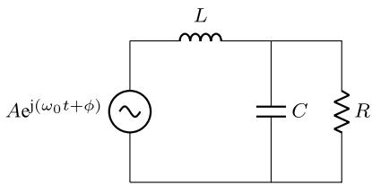  
Fig. 3. An exemplar AC circuit with RLC elements.

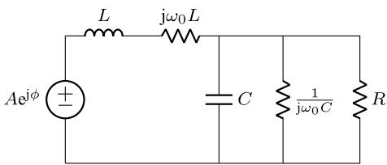  
Fig. 4. Continuous-time companion circuit model of Fig. 3.

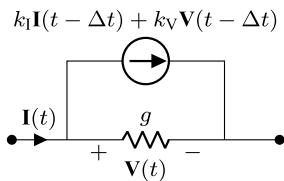  
Fig. 5. Discretized companion model of a basic element.

Table 2 Parameters of discretized companion models.   

<table><tr><td>Element</td><td>g</td><td>k1</td><td>kV</td></tr><tr><td>R</td><td>1/R</td><td>0</td><td>0</td></tr><tr><td rowspan="2">L</td><td>Δt/2L</td><td>1 - jω0Δt/2</td><td>Δt/2L</td></tr><tr><td>1 + jω0Δt/2</td><td>1 + jω0Δt/2</td><td>1 + jω0Δt/2</td></tr><tr><td>C</td><td>2C/Δt(1 + jω0Δt/2)</td><td>-1</td><td>-2C/Δt(1 + jω0Δt/2)</td></tr></table>

in Table 2. The parameter $g$ in Fig. 5 represents the conductance of the companion model. The transmission line DP model shown in Fig. 2 is still valid. However, the Eqs. (15) and (16) are modified as follows.

$$
\mathbf {J} _ {\mathrm {k}} (t) = \left(- \frac {1}{Z _ {\mathrm {C}}} \mathbf {V} _ {\mathrm {m}} \left(t - \tau_ {\mathrm {d}}\right) - \mathbf {I} _ {\mathrm {m k}} \left(t - \tau_ {\mathrm {d}}\right)\right) \mathrm {e} ^ {- \mathrm {j} \omega_ {0} \tau_ {\mathrm {d}}} \tag {19}
$$

$$
\mathbf {J} _ {\mathrm {m}} (t) = \left(- \frac {1}{Z _ {\mathrm {C}}} \mathbf {V} _ {\mathrm {k}} \left(t - \tau_ {\mathrm {d}}\right) - \mathbf {I} _ {\mathrm {k m}} \left(t - \tau_ {\mathrm {d}}\right)\right) \mathrm {e} ^ {- \mathrm {j} \omega_ {0} \tau_ {\mathrm {d}}} \tag {20}
$$

# 3. Selection of the time-step and the role of circuit’s eigenvalue

Selection of the time-step size for time-domain simulation of circuit is heavily influenced by the frequency of source(s) and more importantly by the natural frequencies of the circuit itself. It is widely believed that since dynamic phasors shift the frequency of the sources and track the envelope of the natural waveform, they inherently allow much large time-step sizes than EMT solvers. This is not generally valid as it ignores the impact of frequency shifting on the natural frequencies of the circuit. This section presents the impact of transformation to the dynamic phasor domain on the eigenvalues of the circuit.

The state-space equations of a (linear) circuit without its sources are as follows.

$$
\frac {\mathrm {d} \mathbf {x} (t)}{\mathrm {d} t} = \mathbf {A} \mathbf {x} (t) \tag {21}
$$

where ??(??) is the state-space vector and ?? is the state matrix, whose eigenvalues are the natural frequencies of the original circuit. Transforming (21) into the continuous-time dynamic phasor domain results in the state-space equations of the companion circuit as follows.

$$
\frac {\mathrm {d} \mathbf {X} (t)}{\mathrm {d} t} + \mathrm {j} \omega_ {0} \mathbf {X} (t) = \mathbf {A X} (t) \tag {22}
$$

where ??(??) is the transformed state vector. By separating the real and imaginary components of (22) into two sets of equations, the state equations of the companion circuit my be written as follows:

$$
\frac {\mathrm {d}}{\mathrm {d} t} \left[ \begin{array}{l} \mathbf {X} _ {\mathrm {R}} (t) \\ \mathbf {X} _ {\mathrm {I}} (t) \end{array} \right] = \left[ \begin{array}{c c} \mathbf {A} & \omega_ {0} \mathbf {I} \\ - \omega_ {0} \mathbf {I} & \mathbf {A} \end{array} \right] \left[ \begin{array}{l} \mathbf {X} _ {\mathrm {R}} (t) \\ \mathbf {X} _ {\mathrm {I}} (t) \end{array} \right] \tag {23}
$$

where ${ \mathbf { X } } _ { \mathrm { R } } ( t )$ and $\mathbf { X } _ { \mathrm { I } } ( t )$ are the real and imaginary components of $\mathbf { X } ( t ) ,$ , and ?? is the identity matrix of the same size as ??. The eigenvalues of the companion circuit are computed by solving the following equation for ??.

$$
\det  \left[ \begin{array}{l l} \mathbf {A} - \lambda \mathbf {I} & \omega_ {0} \mathbf {I} \\ - \omega_ {0} \mathbf {I} & \mathbf {A} - \lambda \mathbf {I} \end{array} \right] = 0 \tag {24}
$$

Using block matrix algebra, (24) simplifies to

$$
\det \left[ (\mathbf {A} - \lambda \mathbf {I}) ^ {2} + \omega_ {0} ^ {2} \mathbf {I} \right] = 0 \tag {25}
$$

which further simplifies to

$$
\det  \left[ \mathbf {A} - (\lambda + \mathrm {j} \omega_ {0}) \mathbf {I} \right] \times \det  \left[ \mathbf {A} - (\lambda - \mathrm {j} \omega_ {0}) \mathbf {I} \right] = 0 \tag {26}
$$

which shows that the eigenvalues of the companion circuit are identical to those of the main circuit, but are shifted $ { \mathbf { b } }  { \mathbf { y } } \pm  { \mathbf { j } } \omega _ { 0 }$ . Thus, if $\varLambda _ { \mathrm { m a i n } }$ is the set of eigenvalues for the main (i.e., original) circuit, the eigenvalue set for the companion circuit in the dynamic phasor domain is

$$
\Lambda_ {\text {c o m p}} = \left\{\lambda \pm \mathrm {j} \omega_ {0}: \lambda \in \Lambda_ {\text {m a i n}} \right\} \tag {27}
$$

The simulation time-step for a system modeled in the time domain using natural quantities must be significantly smaller than the reciprocal of the maximum eigenvalue. This is a well-known fact as a large eigenvalue denotes a short transient or high-frequency oscillations or both; hence

$$
\Delta t _ {\mathrm {E M T}} \ll \frac {1}{\operatorname* {m a x} \left(\{\left| \lambda \right| : \lambda \in \Lambda_ {\text {m a i n}} \}\right)} \tag {28}
$$

For a DP solution to produce equally accurate results, the simulation time step must satisfy the following condition, which takes into account the shift in the eigenvalues of the original circuit after transformation to the DP domain.

$$
\Delta t _ {\mathrm {D P}} \ll \frac {1}{\operatorname* {m a x} \left(\left\{\left| \lambda \pm \mathrm {j} \omega_ {0} \right| : \lambda \in \Lambda_ {\text {m a i n}} \right\}\right)} \tag {29}
$$

This clearly proves that for an equally accurate solution, the $\mathrm { d y } .$ - namic phasor model requires an even smaller time-step size than the EMT solver, which is contrary to the widely-held notion that dynamic phasors inherently allow usage of a larger time step. It is, therefore, evident that simulating a dynamic phasor model with a time step calculated as per (28), or a larger time step as it is often practiced, is bound to produce inaccurate results. How ‘noticeable’ these inaccuracies are also depends on the eigenvalues of the circuit. This fundamental concept may be readily illustrated using an example.

Figs. 6, 7, and 8 show the traces of the voltage across the resistor in circuit in Fig. 3 for different parameters as in Table 3, which also lists the eigenvalues of the circuit for the given parameter values. Note that the input voltage is sinusoidal, with a unity amplitude and a frequency of 60 Hz. Each figure presents the analytical response of the circuit, which can be easily obtained and is used as the benchmark, alongside the EMT and DP simulation results. The DP model is created with a shift frequency of $\omega _ { 0 } = 2 \pi \times 6 0 = 3 7 7$ rad/s. For all simulations, a timestep of $\begin{array} { r } { \Delta t = \frac { 1 } { 2 0 | \lambda | _ { \operatorname* { m a x } } } } \end{array}$ 20|??| is used for both EMT and DP models. Time steps maxcalculated in this manner satisfy (28), and produce EMT simulation results that closely match the benchmark analytical results. Due to the

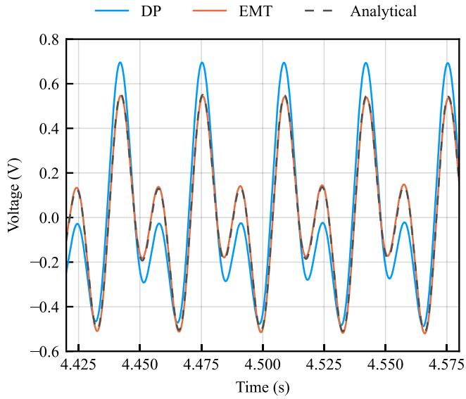  
Fig. 6. Voltage of resistor with $\lambda = - 0 . 0 5 \pm j 1 8 8$ and $\begin{array} { r } { \Delta t = 2 6 6 \mu \mathrm { s } . } \end{array}$

shift in eigenvalues after the circuit is transformed to the dynamic phasor domain (see Table 3) the time-step sizes selected based upon the original eigenvalues are not small enough to produce equally accurate results for the dynamic phasor model. The discrepancies between the dynamic phasor and benchmark results are particularly pronounced in Fig. 6, and are also visible in Fig. 7. The mismatch decreases when the circuit’s damping, $\mathrm { i . e . , ~ } \sigma ,$ is increased tenfold as shown in Fig. 7, and becomes negligible when the damping is 100 times larger, as shown in Fig. 8. It is clear that the damping of the eigenvalues has a profound impact on whether the selected time step results in any noticeable inaccuracies for the dynamic phasor solution of the circuit. With a large damping, the transients associated with a particular natural frequency die out faster and as such the inaccuracy caused by a larger time step will be negligible. This observation reconfirms that claim made in this paper that the ability to use large time steps for dynamic phasor models is not a universal possibility and is only available when the eigenvalues of the circuit have adequately large damping.

For switching circuits, all possible combinations of switch states can be considered, yielding corresponding sets of eigenvalues. For saturation-type nonlinearities, $\mathrm { e . g . , }$ , in transformers and machines, a piecewise linear representation may be used, where each piece produces a set of eigenvalues. The maximum of |??| or $\lvert \lambda \pm \mathrm { j } \omega _ { 0 } \rvert$ (for EMT or DP simulations) across all combinations is used for selecting the time-step.

Transmission lines with distributed parameters consist of infinitely many cascaded LC circuits, yielding an infinite number of poles. As such, the previous analysis is not applicable, as it would yield a time step of zero $\left( \varDelta t = 0 \right)$ . However, note that both the original and companion models (Figs. 1 and $^ { 2 ) , }$ are formulated in the continuous-time domain. Consequently, the time step in their discretized simulation is constrained only by the delay time, $\tau _ { \mathrm { d } } .$ . Therefore, transmission lines do not introduce any additional constraints other than that the simulation time step must be smaller than the line latency. It must be noted that a line’s latency imposes an upper time-step size limit that must not be violated. In practice, however, much smaller simulation time-steps are often needed due to the presence of other elements in the network and/or high-frequency sources, such as power-electronic converters.

# 4. Accuracy of the steady-state solution

While sufficiently small time steps are needed in both EMT and dynamic phasor solutions in order to accurately represent the transient

Table 3 Parameter and Eigenvalues for the Circuit in Fig. 3.   

<table><tr><td>R [Ω]</td><td>L [mH]</td><td>C[F]</td><td>Eigenvalues</td><td>Recommended ΔtEMT [μs]</td><td>Shifted Eigenvalues</td><td>Recommended ΔtDP [μs]</td><td>Results in</td></tr><tr><td rowspan="2">1.0</td><td rowspan="2">0.00282</td><td rowspan="2">10.0</td><td rowspan="2">-0.05 ± j188</td><td rowspan="2">266</td><td>-0.05 ± j565</td><td rowspan="2">88</td><td rowspan="2">Fig. 6</td></tr><tr><td>-0.05 ± j189</td></tr><tr><td rowspan="2">1.0</td><td rowspan="2">0.02829</td><td rowspan="2">1.0</td><td rowspan="2">-0.5 ± j188</td><td rowspan="2">266</td><td>-0.5 ± j565</td><td rowspan="2">88</td><td rowspan="2">Fig. 7</td></tr><tr><td>-0.5 ± j189</td></tr><tr><td rowspan="2">1.0</td><td rowspan="2">0.2827</td><td rowspan="2">0.1</td><td rowspan="2">-5.0 ± j188</td><td rowspan="2">266</td><td>-5.0 ± j565</td><td rowspan="2">88</td><td rowspan="2">Fig. 8</td></tr><tr><td>-5.0 ± j189</td></tr></table>

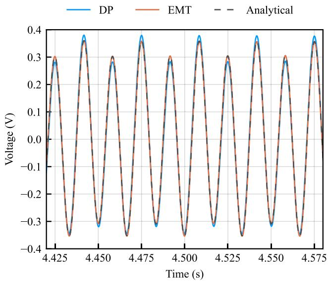  
Fig. 7. Voltage of resistor with $\lambda = - 0 . 5 \pm j 1 8 8$ and $\Delta t = 2 6 6$ μs.

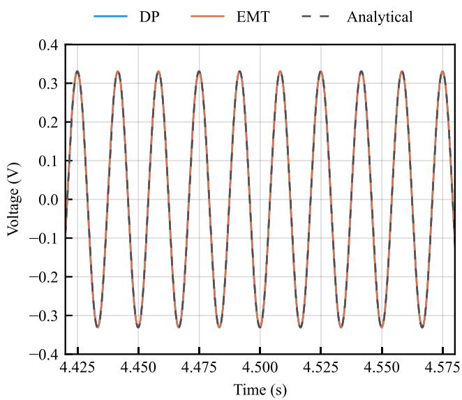  
Fig. 8. Voltage of resistor with $\lambda = - 5 \pm j 1 8 8$ and $\Delta t = 2 6 6 \mu \mathrm { s } .$

behavior of a circuit, it is also important to note the impact of the simulation time step on the accuracy of the solutions in steady state. Solutions in steady state of the continuous-time state equations of the original circuit and of the circuit transformed to the dynamic phasor domain are shown next. It is followed by their solutions when the equations are discretized using the trapezoidal integration rule.

# 4.1. Solution of continuous-time state equations

Consider the state equations of a linear circuit with sinusoidal inputs as follows:

$$
\frac {\mathrm {d} \mathbf {x} ^ {\mathrm {c}} (t)}{\mathrm {d} t} = \mathbf {A} \mathbf {x} ^ {\mathrm {c}} (t) + \mathbf {B} \mathbf {u} (t); \quad \mathbf {u} (t) = \alpha \mathrm {e} ^ {\mathrm {j} \omega_ {0} t} \tag {30}
$$

where ${ \bf x } ^ { \mathrm { c } } ( t )$ is the state vector, ?? is the state matrix, ?? is the input matrix, and ?? is a constant matrix of the magnitudes of the sinusoidal sources. The superscript c is used to denote the fact that these equations represent the continuous-time model. The solution of (30) in steady state will be of the sinusoidal form and may be readily obtained as follows:

$$
\mathbf {x} _ {\mathrm {S S}} ^ {\mathrm {c}} (t) = \left(\mathrm {j} \omega_ {0} \mathbf {I} - \mathbf {A}\right) ^ {- 1} \mathbf {B} \alpha \mathrm {e} ^ {\mathrm {j} \omega_ {0} t} \tag {31}
$$

The subscript ss denotes the solution in steady state. Note that statespace analysis and nodal analysis in EMT can be used interchangeably due to the equivalence between state-space models and EMT companion circuit models [23]. Transforming (30) into the continuous-time dynamic phasor domain results in the continuous-time companion circuit’s state-space equations as follows:

$$
\frac {\mathrm {d} \mathbf {X} ^ {\mathrm {c}} (t)}{\mathrm {d} t} = (\mathbf {A} - \mathrm {j} \omega_ {0} \mathbf {I}) \mathbf {X} ^ {\mathrm {c}} (t) + \mathbf {B} \mathbf {U} (t); \quad \mathbf {U} (t) = \boldsymbol {\alpha} \tag {32}
$$

where $\mathbf { X } ^ { \mathrm { c } } ( t )$ is the transformed state vector. Note that all sources in the companion circuit are dc. The steady-state response obtained from (32) is expressed as follows:

$$
\mathbf {X} _ {\mathrm {s s}} ^ {\mathrm {c}} = \left(\mathrm {j} \omega_ {0} \mathbf {I} - \mathbf {A}\right) ^ {- 1} \mathbf {B} \boldsymbol {\alpha} \tag {33}
$$

As expected, (31) and (33) yield results that show conformity, thanks to the representation and solution of both in the continuous time domain.

# 4.2. Solution of discretized state equations

The state equations of both of original and transformed circuits may be discretized using an integration rule for computerized simulation. Discretization of (30) using the trapezoidal method yields the following equations. Note that the superscript d denotes discretized values.

$$
\mathbf {x} ^ {\mathrm {d}} (t) = \mathbf {x} ^ {\mathrm {d}} (t - \Delta t) + \frac {\Delta t}{2} \left(\mathbf {A x} ^ {\mathrm {d}} (t) + \mathbf {A x} ^ {\mathrm {d}} (t - \Delta t) + \right. \tag {34}
$$

$$
\left. \mathbf {B} \mathbf {u} (t) + \mathbf {B} \mathbf {u} (t - \Delta t)\right)
$$

The solution of the above state equations to sinusoidal inputs in steady state may be readily obtained as follows:

$$
\mathbf {x} _ {\mathrm {s s}} ^ {\mathrm {d}} (t) = \left(\mathrm {j} \omega_ {0} \frac {\tan \beta}{\beta} \mathbf {I} - \mathbf {A}\right) ^ {- 1} \mathbf {B} \alpha \mathrm {e} ^ {\mathrm {j} \omega_ {0} t} \tag {35}
$$

where

$$
\beta = \frac {\omega_ {0} \Delta t}{2} \tag {36}
$$

Similarly, the discretized version of (32) using the trapezoidal rule is obtained as follows:

$$
\mathbf {X} ^ {\mathrm {d}} (t) = \mathbf {X} ^ {\mathrm {d}} (t - \Delta t) + \frac {\Delta t}{2} \left((\mathbf {A} - \mathrm {j} \omega_ {0} \mathbf {I}) \mathbf {X} ^ {\mathrm {d}} (t) + \right. \tag {37}
$$

$$
(\mathbf {A} - \mathrm {j} \omega_ {0} \mathbf {I}) \mathbf {X} ^ {\mathrm {d}} (t - \Delta t) +
$$

$$
\left. \mathbf {B} \mathbf {U} (t) + \mathbf {B} \mathbf {U} (t - \Delta t)\right)
$$

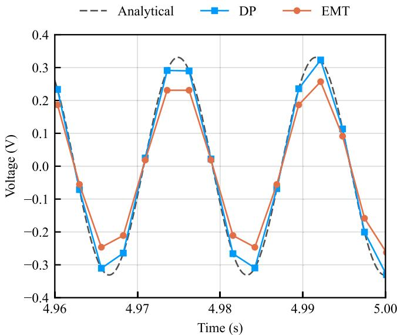  
Fig. 9. Steady state response of resistor voltage with $\lambda ~ = ~ - 5 \pm j 1 8 8$ and ???? = 2.652 ms.

The solution of these equations in steady state to sinusoidal inputs are as follows:

$$
\mathbf {X} _ {\mathrm {s s}} ^ {\mathrm {d}} = \left(\mathrm {j} \omega_ {0} \mathbf {I} - \mathbf {A}\right) ^ {- 1} \mathbf {B} \boldsymbol {\alpha} \tag {38}
$$

Comparing the solutions of the continuous-time and discrete-time dynamic phasor models in (33) and (38) shows that discretization does not affect the accuracy of the steady state solution. Therefore, regardless of the time-step size, it is expected that the dynamic phasor model produces correct samples of the steady state response. Examining the solutions of the original model, i.e., (31) and (35), clearly shows that the time-step size has a direct impact on the ability of the EMT solution to correctly estimate the steady state response. It is clearly seen that the EMT solver is reasonably accurate (but not exact) only when the time step, ????, is sufficiently small so that tan $\beta / \beta \approx 1$ .

Fig. 9 presents the steady-state response of the RLC circuit of Fig. 3 with parameters corresponding to the last row of Table 3 for a large time step of 2.652 ms, which greatly exceeds the minimum required time step for accuracy during transients. As seen, the dynamic phasor solution samples perfectly match the analytical result, while the EMT solution fails to generate an accurate result with the same time-step. The time-step is chosen to be large enough to magnify the discrepancies.

# 5. Case study

The IEEE 9-bus system [24] (Fig. 10), is considered for EMT and DP simulations. The transmission lines and transformers are modeled using ??−sections and coupled circuits, respectively. All data for this example is adopted from [24]. The simulations consider the normal operation of the systems as well as its response to a symmetrical fault at bus 8. The eigenvalues under normal and fault operating modes are presented in Table 4. The maximum absolute eigenvalue is identified in each case and used to calculate the time-steps, defined as one-twentieth of the reciprocal of the magnitude of the critical eigenvalue (see Table 5). EMT simulations with a time-step of 8 μs are taken as the benchmark.

The phase-a voltage of bus 7 under normal operation is plotted in Fig. 11. As the system reaches steady-state, the waveform from the DP simulation produce samples that perfectly lie on the benchmark waveform, despite the fact that the time step of the DP simulation (4000 μs) is significantly larger than that of the EMT simulation. This confirms the observation made earlier that DP simulations produce accurate results in steady state regardless of the time-step size.

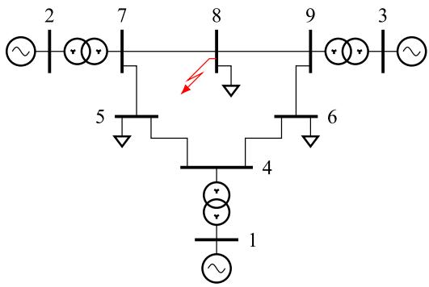  
Fig. 10. Schematic diagram of the IEEE 9-bus system.

Table 4 Eigenvalues of the IEEE 9-bus System.   

<table><tr><td colspan="3">Normal Operation</td></tr><tr><td>-405.9 ± 5591.5j</td><td>-651.1 ± 5694.4j</td><td>-69.2</td></tr><tr><td>-450.7 ± 3587.5j</td><td>-559.9 ± 2818.6j</td><td>-43.7</td></tr><tr><td>-553.8 ± 2330.2j</td><td>-531.5 ± 772.8j</td><td>-39.7</td></tr><tr><td>-6.5</td><td>-1.68</td><td>-1.38</td></tr><tr><td>-0.0581</td><td>-0.0405</td><td>-0.0414</td></tr><tr><td colspan="3">Faulted Operation</td></tr><tr><td>-371.5 ± 5619.7j</td><td>-194.6 ± 4193.1j</td><td>-69.2</td></tr><tr><td>-439.7 ± 3202.1j</td><td>-465.3 ± 2853.7j</td><td>-46.5</td></tr><tr><td>-613.7 ± 1437.3j</td><td>-40.3</td><td>-39.0</td></tr><tr><td>-4.2</td><td>-1.4</td><td>-0.0595</td></tr><tr><td>-0.04256</td><td>-0.04053</td><td>-0.0002492</td></tr></table>

Table 5 Time-Step Calculation for IEEE 9-Bus System.   

<table><tr><td>Condition</td><td>|λ|max</td><td>ΔtEMT [μs]</td><td>|λ|max</td><td>ΔtDP [μs]</td></tr><tr><td>Normal</td><td>5731.48</td><td>8.7</td><td>6106.18</td><td>8.2</td></tr><tr><td>Faulted</td><td>5631.99</td><td>8.8</td><td>6008.21</td><td>8.3</td></tr></table>

On the contrary, and as shown in Fig. 12, the transient response of the same voltage using DP simulations deviates from the benchmark EMT results with a 8 μs for a solid fault at ?? = 0.037 s at bus 8, with the use of a sub-millisecond time-step (200 μs) in the DP simulation. This is because the DP solver indeed requires a simulation time-step less than 8.2 μs (see Table 5) and shows the invalidity of commonly held notion that DP simulations can be conducted with large time steps reaching into the millisecond range.

Close examination of the oscillations during fault in Fig. 12 reveal a frequency of $\frac { 2 \pi } { 1 . 4 8 ~ \mathrm { m s } } ~ = ~ 4 2 4 5 ~ \mathrm { r a d s ^ { - 1 } }$ 1.48 ms , which corresponds to the pair of eigenvalues $- 1 9 4 . 6 \pm 4 1 9 3 . 1 \mathrm { j }$ , highlighted in gray in Table 4. This oscillation dissipates within five times its associated time constant, which is $\begin{array} { r } { 5 \times \frac { 1 } { 1 9 4 . 6 \mathrm { { s } } ^ { - 1 } } \approx 2 5 } \end{array}$ ms, which is significantly longer than the time step of 200 μs. This clearly shows that the low damping of this critical eigenvalue is the reason why the selected time step of 200 μs does not generate conforming results.

These observations clearly show that DP simulations cannot accurately reproduce electromagnetic transient responses when using larger time-steps. This invalidates the common notion that larger time-steps can be inherently employed in dynamic phasor simulations to improve computational efficiency. The ability to use larger time steps and still produce reasonably accurate results directly depends on the damping of natural frequencies of the circuit.

# 6. Considerations for converters

Power electronic converters generate harmonics that excite the network at different frequencies. Converters are often treated as sources,

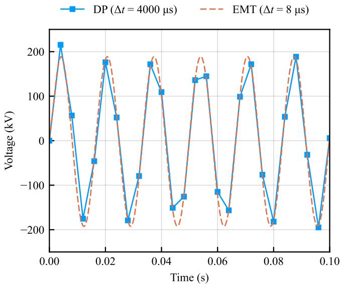  
Fig. 11. Voltage of bus 7 voltage during normal operation.

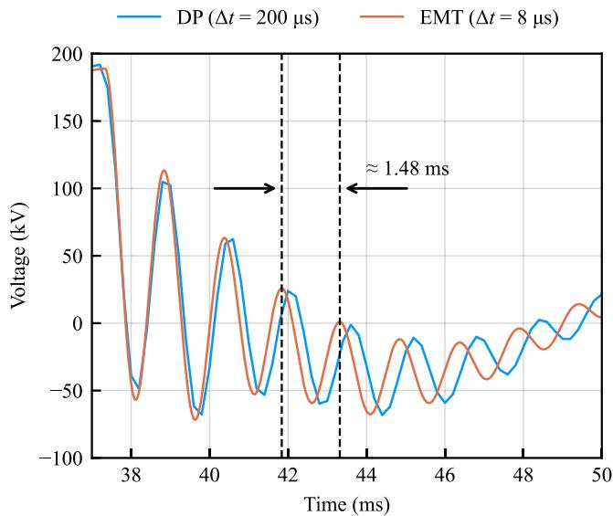  
Fig. 12. Voltage of bus 7 during the fault.

and depending on the way they are modeled may or may not be included in the network’s admittance matrix. In general, the harmonics generated by converters can be treated in two ways in the DP domain. Let $\omega _ { 0 }$ be the fundamental frequency and $n \omega _ { 0 }$ be a harmonic frequency of interest. The shift frequency, $\omega _ { \mathrm { s h } } \mathrm { . }$ , can be selected to be either $\omega _ { 0 }$ or ±???? .

For $\omega _ { \mathrm { s h } } = \omega _ { 0 }$ the eigenvalues of the companion circuit will be ??±j??0. This also shifts the harmonics of the source $( \mathrm { i . e . }$ , the converter) by $\omega _ { 0 } ,$ resulting in $( \pm n \pm 1 ) \omega _ { 0 }$ . Therefore, the time step must not only satisfy (29) but also must satisfy the following inequality:

$$
\Delta t _ {\mathrm {D P}} \ll \frac {1}{(n + 1) \omega_ {0}} \tag {39}
$$

which indicates that the time step must be small enough to capture the highest frequencies in the source. For example, consider the two lowest-order harmonics in a 12-pulse line-commutated converter (LCC), i.e., 11 and 13. For a 60 Hz system, $n = 1 3$ yields

$$
\Delta t _ {\mathrm {D P}} \ll 1 8 9 \mu \mathrm {s} \tag {40}
$$

A simulation time-step in the range of 10–20 μs, which is normally used in the simulation of LCCs would easily satisfy this condition.

Clearly, shifting the source harmonics by $\omega _ { 0 }$ and leaving high-frequency components in the source will not improve the time-step requirements and one has to select small time-steps to capture the source harmonics.

For $\omega _ { \mathrm { s h } } ~ = ~ n \omega _ { 0 }$ the eigenvalues of the companion circuit will be $\lambda \pm \mathrm { j } n \omega _ { 0 }$ . Note that, $| \lambda \pm \mathrm { j } n \omega _ { 0 } | \geq n \omega _ { 0 } ;$ thus,

$$
\Delta t _ {\mathrm {D P}} \ll \frac {1}{| \lambda \pm \mathrm {j} n \omega_ {0} |} \leq \frac {1}{n \omega_ {0}} \tag {41}
$$

For the same harmonic, i.e., ?? = 13 and $\omega _ { 0 } = 2 \times \pi \times 6 0$ rad ${ \mathbf { } } / s ,$ the time-step must satisfy following inequality for an accurate simulation.

$$
\Delta t _ {\mathrm {D P}} \ll 2 0 4 \mu \mathrm {s} \tag {42}
$$

The recommended time-step is again in the 10–20 μs range.

The situation becomes even more challenging when two-level voltage source converters (VSCs) are employed in the network. Consider operation of a two-level VSC under sinusoidal pulse-width modulation (PWM) with a frequency modulation index of $m _ { \mathrm { f } } .$ Considering the same line of reasoning as outlined above for an LCC, the time-step of simulations must be selected such that

$$
\Delta t _ {\mathrm {D P}} \ll \left\{ \begin{array}{l l} \frac {1}{(m _ {\mathrm {f}} + 1) \omega_ {0}} & ; \quad \omega_ {\mathrm {s h}} = \omega_ {0} \\ \frac {1}{m _ {\mathrm {f}} \omega_ {0}} & ; \quad \omega_ {\mathrm {s h}} = m _ {\mathrm {f}} \omega_ {0} \end{array} \right. \tag {43}
$$

For a frequency modulation index of $m _ { \mathrm { f } } ~ = ~ 2 1$ in a 60 Hz system, $\begin{array} { r } { \varDelta t _ { \mathrm { D P } } \ll 1 2 6 \mu \mathrm { s } , } \end{array}$ , and therefore, the recommended time-step, irrespective of the effects of circuit eigenvalues, is approximately 10–20 μs.

In modular multi-level voltage source converters (MMCs), with ?? sub-modules per arm and a system frequency of $f ,$ time intervals in the order of $\frac { 1 } { N f }$ must be resolved to accurately simulate the staircase sinusoidal waveform produced at the AC terminal of the converter. This requirement applies regardless of the simulation method, whether EMT or DP. It is also worth noting that, in DP simulation, the staircase sinusoidal waveform appears as a DC-type signal superimposed with small ripples at a frequency of ????. For example, if $N ~ = ~ 2 0 0$ and $f = 6 0 ,$ , the time-step must be significantly less than 83 μs, irrespective of the simulation method and without accounting for the network eigenvalues.

Clearly converters further constrain the time-step size in DP simulations. Depending on the shift frequency, this restriction may arise from the remaining source harmonics or the shift in the eigenvalues of the companion circuit.

# 7. Conclusion

A comprehensive analysis of modeling using of DPs was presented, yielding important insights into their accuracy and applicability. The core contribution of the paper was to demonstrate that modeling a dynamical system in the DP domain introduces a shift in the eigenvalues of the system, which necessitates usage of smaller-than-EMT time-steps. This underlying limitation, which was analytically proven in this paper, stems from the eigenvalues of the circuit and the shift frequency that is sued to form dynamic phasors. The findings of the paper invalidate the widely-held notion that DPs inherently support higher time-steps for all scenarios. Exemplar circuits, including the IEEE 9-bus system, for which the eigenvalues can be readily calculated were used to illustrate the theory presented in the paper. It was shown that use of DPs with large time steps can produce reasonably accurate results only when the damping of critical natural frequencies is sufficient so that the transient associated with the natural frequency dies out rapidly enough. Only in systems where eigenvalues do have enough damping, does the simulation of the companion model in the DP domain using large time-steps produce results that do not deviate significantly from EMT results. The paper also demonstrated that DPs produce exact results for the simulation of steady-state operation at arbitrarily large time steps, while EMT simulations fail to do so.

# CRediT authorship contribution statement

Ramin Parvari: Software, Investigation, Methodology, Writing – review & editing, Visualization, Validation, Writing – original draft, Formal analysis. Shaahin Filizadeh: Writing – original draft, Funding acquisition, Visualization, Supervision, Formal analysis, Project administration, Writing – review & editing, Validation.

# Declaration of competing interest

The authors declare that they have no known competing financial interests or personal relationships that could have appeared to influence the work reported in this paper.

# Data availability

No data was used for the research described in the article.

# References

[1] J.R. Martí, H.W. Dommel, B.D. Bonatto, A.F.R. Barrete, Shifted frequency analysis (SFA) concepts for EMTP modelling and simulation of power system dynamics, in: Power Sys. Comp. Conf., 2014, pp. 1–8.   
[2] P. Zhang, J.R. Marti, H.W. Dommel, Shifted-frequency analysis for EMTP simulation of power-system dynamics, IEEE Trans. Circuits Syst. I: Reg. Pap. 57 (9) (2010) 2564–2574.   
[3] P. Zhang, Shifted Frequency Analysis for EMTP Simulation of Power System Dynamics (Ph.D. thesis), UBC, Van., BC, Canada, 2009.   
[4] H.W. Dommel, Digital computer solution of electromagnetic transients in singleand multiphase networks, IEEE Trans. Power App. Sys. PAS-88 (4) (1969) 388–399.   
[5] H. Dommel, S. Bhattacharya, EMTP Theory Book, Microtran Power System Analysis Corporation, 1992.   
[6] S. Almer, U. Jonsson, Dynamic phasor analysis of periodic systems, IEEE Trans. Auto. Con. 54 (8) (2009) 2007–2012.   
[7] J. Rupasinghe, S. Filizadeh, K. Strunz, Assessment of dynamic phasor extraction methods for power system co-simulation applications, Electr. Pow. Sys. Res. 197 (2021) 107319.   
[8] M. Daryabak, S. Filizadeh, J. Jatskevich, A. Davoudi, M. Saeedifard, V.K. Sood, J.A. Martinez, D. Aliprantis, J. Cano, A. Mehrizi-Sani, Modeling of LCC-HVDC systems using dynamic phasors, IEEE Trans. Power Deliv. 29 (4) (2014) 1989–1998.

[9] M. Daryabak, S. Filizadeh, A. Bagheri Vandaei, Dynamic phasor modeling of LCC-HVDC systems: Unbalanced operation and commutation failure, Can. J. Elec. & Comp. Eng. 42 (2) (2019) 121–131.   
[10] X. Mao, Y. Wen, L. Wu, B. Zhou, Simulation of LCC-mmc HVDC systems using dynamic phasors, IEEE Access 9 (2021) 122819–122828.   
[11] H. Liu, H. Zhu, Y. Li, Y. Ni, Including UPFC dynamic phasor model into transient stability program, in: IEEE Power Engineering Society GM, vol. 1, 2005, pp. 302–307.   
[12] E. Zhijun, K.W. Chan, D. Fang, A practical dynamic phasor model of static VAR compensator, in: International Conf. on Power Electronics Systems and Applications, 2006, pp. 23–27.   
[13] P. Zhang, J.R. Marti, H.W. Dommel, Induction machine modeling based on shifted frequency analysis, IEEE Trans. Power Sys. 24 (1) (2009) 157–164.   
[14] Y. Xia, P. Zhao, K. Strunz, Y. Chen, Y. Jin, Multiple frequency shifting and its application to accurate multi-scale modeling of induction machine, IEEE Trans. Power Sys. 39 (1) (2024) 2349–2352.   
[15] D. Shu, X. Xie, V. Dinavahi, C. Zhang, X. Ye, Q. Jiang, Dynamic phasor based interface model for EMT and transient stability hybrid simulations, IEEE Trans. Power Sys. 33 (4) (2018) 3930–3939.   
[16] Y. Zhu, S. Zhang, S. Yu, Y. Wei, J. Zhang, J. Xu, J. Zhou, Interface displacement and dynamic phasor mapping equivalence based hybrid simulation for HVAC/DC power grids, IEEE Trans. Pow. Del. 36 (4) (2021) 1932–1942.   
[17] D. Shu, Z. Ouyang, Z. Yan, Multirate and mixed solver based cosimulation of combined transient stability, shifted-frequency phasor, and electromagnetic models: A practical LCC HVDC simulation study, IEEE Trans. Ind. Elec. 68 (6) (2021) 4954–4965.   
[18] D. Shu, H. Yang, X. Xie, X. Ye, S. Yu, Q. Jiang, A novel dynamic phasor based interface models for hybrid simulations of EMT and transient stability models, in: IEEE PES GM, 2017, pp. 1–5.   
[19] M.A. Kulasza, U.D. Annakkage, C. Karawita, Extending the frequency bandwidth of transient stability simulation using dynamic phasors, IEEE Trans. Power Sys. 37 (1) (2022) 249–259.   
[20] T. Demiray, Simulation of Power System Dynamics using Dynamic Phasors (Ph.D. thesis), Swiss Federal Institute of Technology, Zurich, Switzerland, 2008.   
[21] F. Gao, K. Strunz, Frequency-adaptive power system modeling for multiscale simulation of transients, IEEE Trans. Power Sys. 24 (2) (2009) 561–571.   
[22] J. Arrillaga, N. Watson, Electromagnetic transients, in: Computer Modelling of Electrical Power Systems, John Wiley & Sons, Ltd, 2001, pp. 161–227, [Online]. Available: https://onlinelibrary.wiley.com/doi/abs/10.1002/ 9781118878286.ch6.   
[23] A.M.G. Huanfeng Zhao, Equivalency of state space models and EMT companion circuit models, in: Intl. Conf. on Pow. Sys. Trans., 2019, pp. 1–5.   
[24] IEEE 9 Bus System, Manitoba Hydro International Ltd., Winnipeg, MB, Canada, 2022, [Online]. Available: https://www.pscad.com/knowledge-base/article/25.