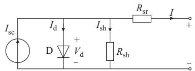
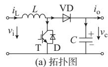
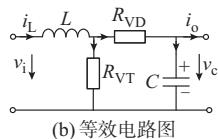
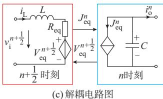
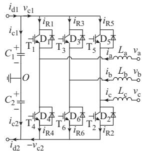
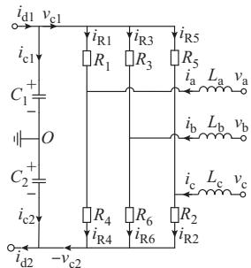
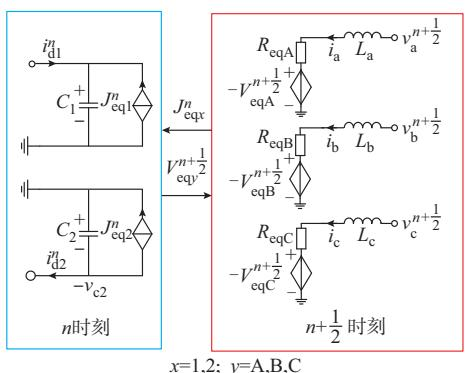
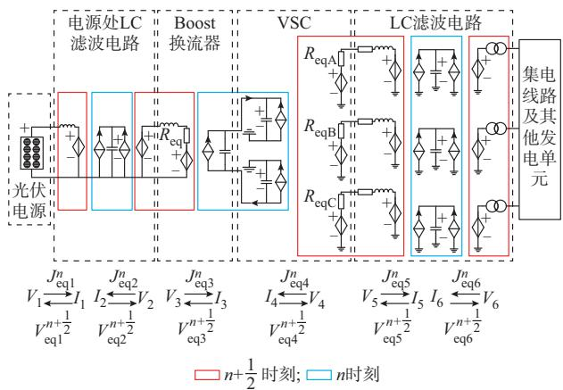
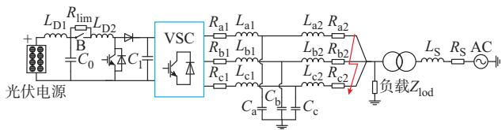

# 光伏发电单元电磁暂态解耦与快速仿真方法

姚蜀军，张春强，刘 刚，马嘉昊，汪 燕

（华北电力大学电气与电子工程学院，北京市 102206）

摘要：针对光伏发电单元详细模型电磁暂态仿真时速度慢的问题，基于半隐式延迟解耦原理，提出了光伏发电单元的新型解耦模型与并行仿真方法。首先，建立光伏发电单元各设备的状态方程，采用矩阵分裂和延迟技术构建各设备的半步时延解耦模型，实现发电单元内部及不同发电单元之间的解耦与并行计算；其次，根据电压源型换流器（VSC）和Boost电路的工作特点，简化解耦模型参数计算过程，使系统导纳矩阵恒定以提高计算效率；然后，分析了该模型的特点，设计了计算时序和流程；最后，通过光伏电站的计算实例检验了模型的准确性和计算效率。

关键词：光伏发电单元；电磁暂态仿真；半隐式延迟解耦；并行计算；细粒度解耦

# 0 引 言

近年来，随着能源危机与环境问题的加剧，新能源发电不断受到重视，光伏新增装机容量不断攀升，电站规模向着大型化、集中化、光伏基地方向发展［1-2］ 。但是，光伏电站中所含非线性电池组件和电力电子换流器等设备数目较多，基于详细模型的电磁暂态仿真的仿真速度较慢［3-4］ 。

电力电子换流器作为光伏电站的重要设备，其详细模型精度较高，但仿真速度慢。为了提高仿真速度，文献［5-6］提出基于电感/电容等效的恒导纳开关模型，计算过程中开关切换时无须重新形成节点导纳矩阵，提高了仿真速度。然而，由于该模型存在暂态过程，会在开关动作后产生大于实际的虚拟功率损耗［7］。文献［8］进一步提出了基于响应匹配的恒导纳换流器建模方法，该方法可以消除暂态过程导致的误差，但在开关状态切换时会存在数值振荡问题。外特性建模仿真精度不如详细模型，但仿真 速 度 快 。 文 献［9］提 出 了 电 压 源 型 换 流 器（voltage source converter，VSC）的平均值模型，文献［10］提出了换流器的分段平均化模型，文献［11］提出了分段广义状态空间平均模型。这类模型的仿真步长会受到窗口长度（开关周期）的限定。文献［12-13］建立了 VSC的动态相量模型，文献［14］提出动态/扩展谐波域法，以上两种方法通过傅里叶变换将实数高频信号变换为复数低频信号，从而增大了仿

真步长。当计及足够阶数时，动态相量法可接近详细模型的精度。但在实际应用中，为了保证仿真速度会忽略高频谐波和高阶向量，导致模型的谐波截断误差较大。

考虑光伏发电系统的建模问题，文献［15］采用详细模型建模，该模型仿真精度高、内部故障及变量易于观察，但模型复杂、仿真需要的时间长，不能满足大电网仿真的需要。文献［16-18］使用容量加权法对光伏发电单元进行单机等效，等效模型简单，可以适用于一些较为严重的运行工况，但只能用于精度要求不高的场合。文献［19-20］使用参数辨识法进行单机等效，该方法提高了仿真精度，但无法顾及逆变器类型及光伏电站内部结构。针对光伏电站采用单机等值误差较大的情况，文献［21-23］分别采用不同的方法以逆变器为核心对光伏组件进行分群聚类，建立了光伏电站的多机等效模型，该类方法考虑了不同群组的运行参数，也能较好地模拟光伏电站的动态响应过程，但如何基于实际工程易于观测的量来提取分群指标值，以及寻找合适的分群方法仍有待进一步研究。

文献［ ］提出电磁暂态半隐式延迟解耦并行仿 真 方 法 （semi-implicit latency decoupling andparalleling，SILDP），并验证了其应用于交流电网的高效性和准确性，附录 A中给出了该方法的原理。本文将其应用于光伏电站的电磁暂态解耦与快速仿真方法研究，通过建立光伏发电单元各设备的解耦模型，既实现了各设备间的并行计算，又保证了开关动作时节点导纳矩阵不变，提高了计算效率。最后，通过光伏电站的算例验证了本文所建立模型的有效性和准确性。

# 1 光伏发电单元的解耦

文献［24］提出了半隐式延迟解耦法，并给出了其在交流系统分网中的应用。本文利用该方法实现了光伏发电单元的解耦。

# 1. 1 光伏电站的结构

光伏发电系统由光伏阵列将太阳能转化为直流电能，直流电能经逆变器转换为交流电能并网发电。如附录 B图 B1所示，光伏阵列、逆变器、滤波器、变压器共同构成一个光伏发电单元，大量光伏发电单元并联汇流组成光伏电站。

# 1. 2 光伏阵列的数学模型

光伏电池模型如图1所示。该等效电路包含电流源 $I _ { \mathrm { s c } }$ 、反并联的二极管 D、分流电阻 $R _ { \mathrm { s h } }$ 和串联电阻 $R _ { \mathrm { s r } } { \mathrm { c } }$ 。当光伏电池暴露于光照下时，二极管两端产生电压 $V _ { \mathrm { d } }$ ，流过分流电阻 $R _ { \mathrm { s h } }$ 的电流为 $I _ { \mathrm { s h } }$ ，流过二极管的电流 $I _ { \mathrm { d } }$ 产生光伏电池的非线性特性，输出直流电流I随光照强度而变化。

  
图1 光伏电池模型  
Fig. 1 Model of photovoltaic cell

由文献［25］可知，光伏电池的输出电流与输出电压之间有如下关系：

$$
I = I _ {\mathrm {s c}} - I _ {\mathrm {o}} \left(\exp \left(\frac {V + I R _ {\mathrm {s r}}}{\frac {\eta k T _ {\mathrm {c}}}{q}}\right) - 1\right) - \frac {V + I R _ {\mathrm {s r}}}{R _ {\mathrm {s h}}} \tag {1}
$$

式中 $\colon q$ 为电子电荷；k 为玻尔兹曼常数；η 为二极管理想因子；V为光伏电池输出电压；I 为光电流，是太阳能电池平面上的太阳辐射 G和电池表面温度T 的函数，即

$$
I _ {\mathrm {s c}} = I _ {\mathrm {s c R}} \frac {G}{G _ {\mathrm {R}}} \left[ 1 + \alpha_ {\mathrm {T}} \left(T _ {\mathrm {c}} - T _ {\mathrm {c R}}\right) \right] \tag {2}
$$

$I _ { \mathrm { s c R } }$ 为参考太阳辐射 $G _ { \mathrm { R } }$ 和参考电池温度 $T _ { \mathrm { c R } }$ 下的短路电流； $\alpha _ { \mathrm { T } }$ 为光电流的温度系数。

式（1）中的电流 $I _ { \mathrm { o } }$ 称为暗电流，如式（3）所示。

$$
I _ {\mathrm {o}} = I _ {\mathrm {o R}} \left(\frac {T _ {\mathrm {c}} ^ {3}}{T _ {\mathrm {c R}} ^ {3}}\right) \exp \left(\left(\frac {1}{T _ {\mathrm {c R}}} - \frac {1}{T _ {\mathrm {c}}}\right) \frac {q e _ {\mathrm {g}}}{\eta k}\right) \tag {3}
$$

式中： $I _ { \mathrm { o R } }$ 为参考温度下的暗电流 $\ \bullet \ e _ { \mathrm { g } }$ 为太阳能电池材料的带隙能量。

# 1. 3 Boost换流器解耦模型

图2（a）为Boost换流器拓扑，该电路由电感L、二极管VD、输出电容C，以及反并联二极管D与绝缘栅双极型晶体管 T构成的开关组 VT共同组成。

电路中v 为输入电压，i 为输入电流，v 为输出电压，i 为输出电流，二极管VD及开关组VT均采用二值电阻模型，导通时电阻 $R _ { \mathrm { o n } } { = } 0 . 0 1 \ \Omega$ ，关断时电阻$R _ { \mathrm { o f f } } = 1 0 ^ { 6 } \Omega$ 。Boost换流器的二值电阻等效电路如图2（b）所示， $R _ { \mathrm { V D } }$ 和 $R _ { \mathrm { V T } }$ 分别表示二极管及开关组的等值电阻。

  
图2 Boost换流器电路图  
Fig. 2 Circuit diagram of Boost converter

以图 2 中的电感电流和电容电压为状态变量，列写Boost连续工作模式下的状态方程：

$$
\left\{ \begin{array}{l} L \frac {\mathrm {d} i _ {\mathrm {L}}}{\mathrm {d} t} = - \frac {R _ {\mathrm {V T}} R _ {\mathrm {V D}}}{R _ {\mathrm {V T}} + R _ {\mathrm {V D}}} i _ {\mathrm {L}} - \frac {R _ {\mathrm {V T}}}{R _ {\mathrm {V T}} + R _ {\mathrm {V D}}} v _ {\mathrm {c}} + v _ {\mathrm {i}} \\ C \frac {\mathrm {d} v _ {\mathrm {c}}}{\mathrm {d} t} = - \frac {v _ {\mathrm {c}}}{R _ {\mathrm {V T}} + R _ {\mathrm {V D}}} + \frac {R _ {\mathrm {V T}}}{R _ {\mathrm {V T}} + R _ {\mathrm {V D}}} i _ {\mathrm {L}} - i _ {\mathrm {o}} \end{array} \right. \tag {4}
$$

二极管与开关组通常互斥导通，令 $R _ { \mathrm { s u m } } { = } R _ { \mathrm { V T } } { + }$ +$R _ { \mathrm { { v D } } } { = } R _ { \mathrm { { o n } } } { + } R _ { \mathrm { { o f f } } } , R _ { \mathrm { { m u l } } } { = } R _ { \mathrm { { v T } } } R _ { \mathrm { { V D } } } { = } R _ { \mathrm { { o n } } } R _ { \mathrm { { o f f } } } ,$ ，则式（4）的状态空间表达式为：

$$
\left[ \begin{array}{l} L \frac {\mathrm {d} i _ {\mathrm {L}}}{\mathrm {d} t} \\ C \frac {\mathrm {d} v _ {\mathrm {c}}}{\mathrm {d} t} \end{array} \right] = \left[ \begin{array}{l l} - R _ {\mathrm {e q}} & - k _ {\mathrm {v}} \\ k _ {\mathrm {i}} & - G _ {\mathrm {e q}} \end{array} \right] \left[ \begin{array}{l} i _ {\mathrm {L}} \\ v _ {\mathrm {c}} \end{array} \right] + \left[ \begin{array}{l} v _ {\mathrm {i}} \\ - i _ {\mathrm {o}} \end{array} \right] \tag {5}
$$

式中 ： $R _ { \mathrm { e q } }$ 为解耦电路中输入侧的等效电阻 ， $R _ { \mathrm { e q } } =$ $R _ { \mathrm { m u l } } / R _ { \mathrm { s u m } } ; G _ { \mathrm { e q } }$ 为解耦电路输出侧的等效并联导纳，$G _ { \mathrm { e q } } { = } 1 / R _ { \mathrm { s u m } } ; k _ { \mathrm { \iota } }$ 和k 分别为受控电压源和受控电流源的 系 数 ， $k _ { \mathrm { v } } { = } k _ { \mathrm { i } } { = } R _ { \mathrm { v T } } / R _ { \mathrm { s u m } }$ 。由 于 $R _ { \mathrm { o f f } } \gg R _ { \mathrm { o t } }$ ，若 将 $R _ { \mathrm { o f f } }$ 看作无穷大，则 $R _ { \mathrm { e q } } { \approx } R _ { \mathrm { o n } } , G _ { \mathrm { e q } } { \approx } 0$ 。

根据半隐式延迟解耦法，对式（5）进行矩阵分裂 并计及 $G _ { \mathrm { e q } } \approx 0$ ，则可得

$$
\left[ \begin{array}{l} L \frac {\mathrm {d} i _ {\mathrm {L}}}{\mathrm {d} t} \\ C \frac {\mathrm {d} v _ {\mathrm {c}}}{\mathrm {d} t} \end{array} \right] = \left[ \begin{array}{l l} - R _ {\mathrm {e q}} & 0 \\ 0 & 0 \end{array} \right] \left[ \begin{array}{l} i _ {\mathrm {L}} \\ v _ {\mathrm {c}} \end{array} \right] + \left[ \begin{array}{l l} 0 & - k _ {\mathrm {v}} \\ k _ {\mathrm {i}} & 0 \end{array} \right] \left[ \begin{array}{l} i _ {\mathrm {L}} \\ v _ {\mathrm {c}} \end{array} \right] + \left[ \begin{array}{l} v _ {\mathrm {i}} \\ - i _ {\mathrm {o}} \end{array} \right] \tag {6}
$$

根据半隐式延迟解耦法，对式（6）进行半步延

时，得到其差分方程为：

$$
\begin{array}{l} \left[ \begin{array}{l l} L & 0 \\ 0 & C \end{array} \right] \left[ \begin{array}{c} i _ {\mathrm {L}} ^ {n + 1} - i _ {\mathrm {L}} ^ {n} \\ v _ {\mathrm {c}} ^ {n + \frac {1}{2}} - v _ {\mathrm {c}} ^ {n - \frac {1}{2}} \end{array} \right] = \left[ \begin{array}{l l} - R _ {\text {e q}} & 0 \\ 0 & 0 \end{array} \right] \left[ \begin{array}{l} i _ {\mathrm {L}} ^ {n + 1} + i _ {\mathrm {L}} ^ {n} \\ v _ {\mathrm {c}} ^ {n + \frac {1}{2}} + v _ {\mathrm {c}} ^ {n - \frac {1}{2}} \end{array} \right]. \\ \frac {\Delta t}{2} + \left[ \begin{array}{l l} 0 & - k _ {\mathrm {v}} \\ k _ {\mathrm {i}} & 0 \end{array} \right] \left[ \begin{array}{c} i _ {\mathrm {L}} ^ {n} \\ v _ {\mathrm {c}} ^ {n + \frac {1}{2}} \end{array} \right] \Delta t + \left[ \begin{array}{l} v _ {\mathrm {i}} ^ {n + \frac {1}{2}} \\ - i _ {\mathrm {o}} ^ {n} \end{array} \right] \Delta t \tag {7} \\ \end{array}
$$

式中：上标n-1/2、n、n+1/2和n+1分别表示变量在第 $n { - } 1 / 2 , n , n { + } 1 / 2$ 和 n+1时刻的值；Δt为仿真步长。由式（6）和式（7）可得图2（c）所示的 Boost换流器半隐式延迟解耦等效电路图。图中： $V _ { \mathrm { e q } }$ 为解耦电路输入侧的受控电压源， $V _ { \mathrm { e q } } { = } k _ { \mathrm { v } } v _ { \mathrm { c } } { = } J _ { \mathrm { e q } }$ 为解耦电路输出侧的受控电流源， $J _ { \mathrm { e q } } = k _ { \mathrm { i } } i _ { \mathrm { L } } \circ$ 。开关的切换表现为k 、k 的改变，而开关损耗表现为电阻 $R _ { \mathrm { e q } }$ 的损耗。各状态变量的迭代式见附录C式（C1）。

# 1. 4 VSC 的解耦模型

VSC结构如图3（a）所示。图中： $\mathrm { T } _ { 1 } { \sim } \mathrm { T } _ { 6 }$ 为各桥臂绝缘栅双极型晶体管； $\mathrm { D } _ { 1 } { \sim } \mathrm { D } _ { 6 }$ 为各桥臂反并联二极管； $i _ { \mathrm { R 1 } } { \sim } i _ { \mathrm { R 6 } }$ 为各桥臂电流； $L _ { \mathrm { a } } , L _ { \mathrm { b } }$ 和 $L _ { \mathrm { c } }$ 为交流侧等效电感； $\dag \mathcal { V } _ { \mathrm { a } } \setminus \mathcal { V } _ { \mathrm { b } } \setminus \mathcal { V } _ { \mathrm { c } }$ 为交流侧相电压； $i _ { \mathrm { a } } , i _ { \mathrm { b } } , i _ { \mathrm { c } }$ 为交流侧流入电流；O点为接地点； $C _ { 1 }$ 和 $C _ { 2 }$ 为直流侧正负极电容； $\mathcal { V } _ { \mathrm { c 1 } }$ 和 $\mathcal { V } _ { \mathrm { c 2 } }$ 为直流侧电容电压； $i _ { \mathrm { c l } }$ 和 $i _ { \mathrm { c 2 } }$ 为直流侧电容电流； $; i _ { \mathrm { d 1 } }$ 和 $i _ { \mathrm { d 2 } }$ 为直流侧输入电流。图3（b）为逆变器的等效电路，反并联的绝缘栅双极型晶体管和二极管构成的开关组以二值电阻 $R _ { 1 } { \sim } R _ { \ell }$ 代替。

以电感电流和电容电压为状态变量，列写图 3

  
(a) 拓扑图

  
(b) 等效电路图

  
(c)解耦电路   
图 3 VSC电路图  
Fig. 3 Circuit diagram of VSC

电路的状态方程可得：

$$
\left\{ \begin{array}{l} L _ {\mathrm {a}} \frac {\mathrm {d} i _ {\mathrm {a}}}{\mathrm {d} t} = \\ - \frac {R _ {1} R _ {4}}{R _ {1} + R _ {4}} i _ {\mathrm {a}} - \frac {R _ {4}}{R _ {1} + R _ {4}} v _ {\mathrm {c l}} + \frac {R _ {1}}{R _ {1} + R _ {4}} v _ {\mathrm {c 2}} + v _ {\mathrm {a}} \\ L _ {\mathrm {b}} \frac {\mathrm {d} i _ {\mathrm {b}}}{\mathrm {d} t} = \\ - \frac {R _ {3} R _ {6}}{R _ {3} + R _ {6}} i _ {\mathrm {b}} - \frac {R _ {6}}{R _ {3} + R _ {6}} v _ {\mathrm {c l}} + \frac {R _ {3}}{R _ {3} + R _ {6}} v _ {\mathrm {c 2}} + v _ {\mathrm {b}} \\ L _ {\mathrm {c}} \frac {\mathrm {d} i _ {\mathrm {c}}}{\mathrm {d} t} = \\ - \frac {R _ {2} R _ {5}}{R _ {2} + R _ {5}} i _ {\mathrm {c}} - \frac {R _ {2}}{R _ {2} + R _ {5}} v _ {\mathrm {c l}} + \frac {R _ {5}}{R _ {2} + R _ {5}} v _ {\mathrm {c 2}} + v _ {\mathrm {c}} \\ C _ {1} \frac {\mathrm {d} v _ {\mathrm {c l}}}{\mathrm {d} t} = \frac {R _ {4}}{R _ {1} + R _ {4}} i _ {\mathrm {a}} + \frac {R _ {6}}{R _ {3} + R _ {6}} i _ {\mathrm {b}} + \frac {R _ {2}}{R _ {2} + R _ {5}} i _ {\mathrm {c}} - \\ G _ {\mathrm {e q l}} v _ {\mathrm {c l}} - K _ {\mathrm {v c 2}} v _ {\mathrm {c 2}} + i _ {\mathrm {d 1}} \\ C _ {2} \frac {\mathrm {d} v _ {\mathrm {c 2}}}{\mathrm {d} t} = - \frac {R _ {1}}{R _ {1} + R _ {4}} i _ {\mathrm {a}} - \frac {R _ {3}}{R _ {3} + R _ {6}} i _ {\mathrm {b}} - \\ \frac {R _ {5}}{R _ {2} + R _ {5}} i _ {\mathrm {c}} - K _ {\mathrm {v c l}} v _ {\mathrm {c l}} - G _ {\mathrm {e q 2}} v _ {\mathrm {c 2}} + i _ {\mathrm {d 2}} \end{array} \right. \tag {8}
$$

式中： $: G _ { \mathrm { e q 1 } }$ 和 $G _ { \mathrm { e q 2 } }$ 为解耦电路中直流侧并联导纳， $K _ { \mathrm { v c } }$ 和 $K _ { \mathrm { v c 2 } }$ 为解耦电路中直流侧并联电流源的系数，$G _ { \mathrm { e q 1 } } = G _ { \mathrm { e q 2 } } = K _ { \mathrm { v c 1 } } = K _ { \mathrm { v c 2 } } = 1 / ( R _ { 1 } + R _ { 4 } ) + 1 / ( R _ { 3 } + R _ { 6 } ) +$ $1 / ( R _ { 5 } { + } R _ { 2 } )$ 。

正常工作时，由于 VSC中每相的上、下桥臂互斥导通，令 $R _ { 1 } + R _ { 4 } = R _ { 3 } + R _ { 6 } = R _ { 5 } + R _ { 2 } = R _ { \mathrm { o n } } + R _ { \mathrm { o f f } }$ ，则可得式（8）的状态空间方程为：

$$
\begin{array}{l} \left[ L _ {\mathrm {a}} \frac {\mathrm {d} i _ {\mathrm {a}}}{\mathrm {d} t} \quad L _ {\mathrm {b}} \frac {\mathrm {d} i _ {\mathrm {b}}}{\mathrm {d} t} \quad L _ {\mathrm {c}} \frac {\mathrm {d} i _ {\mathrm {c}}}{\mathrm {d} t} \quad C _ {1} \frac {\mathrm {d} v _ {\mathrm {c 1}}}{\mathrm {d} t} \quad C _ {2} \frac {\mathrm {d} v _ {\mathrm {c 2}}}{\mathrm {d} t} \right] ^ {\mathrm {T}} = \\ \left[ \begin{array}{c c c c c} - R _ {\mathrm {e q A}} & 0 & 0 & - K _ {\mathrm {v 4}} & K _ {\mathrm {v 1}} \\ 0 & - R _ {\mathrm {e q B}} & 0 & - K _ {\mathrm {v 6}} & K _ {\mathrm {v 3}} \\ 0 & 0 & - R _ {\mathrm {e q C}} & - K _ {\mathrm {v 2}} & K _ {\mathrm {v 5}} \\ \dots \dots \dots \dots \dots \dots \dots \dots \dots \dots \dots \dots \dots \dots \dots \dots \dots \dots \dots \dots \dots \dots \dots \dots \dots \dots \dots \dots \dots \dots \dots \dots \dots \dots \dots \dots \dots \dots \dots \dots \dots \dots \dots \dots \dots \dots \dots \dots \dots \dots \tag {9} \\ \end{array}
$$

其 中 ： R = $R _ { \mathrm { e q A } } = \frac { R _ { 1 } R _ { 4 } } { R _ { \mathrm { o n } } + R _ { \mathrm { o f f } } } , R _ { \mathrm { e q B } } = \frac { R _ { 3 } R _ { 6 } } { R _ { \mathrm { o n } } + R _ { \mathrm { o f f } } } , R _ { \mathrm { e q c } } =$ ，R eqB

$$
\frac {R _ {2} R _ {5}}{R _ {\mathrm {o n}} + R _ {\mathrm {o f f}}}, K _ {\mathrm {v 4}} = K _ {\mathrm {i 4}} = \frac {R _ {4}}{R _ {\mathrm {o n}} + R _ {\mathrm {o f f}}}, K _ {\mathrm {v 1}} = K _ {\mathrm {i 1}} =
$$

$$
\frac {R _ {1}}{R _ {\mathrm {o n}} + R _ {\mathrm {o f f}}}, K _ {\mathrm {v 6}} = K _ {\mathrm {i 6}} = \frac {R _ {6}}{R _ {\mathrm {o n}} + R _ {\mathrm {o f f}}}, K _ {\mathrm {v 3}} = K _ {\mathrm {i 3}} =
$$

$$
\frac {R _ {3}}{R _ {\mathrm {o n}} + R _ {\mathrm {o f f}}}, K _ {\mathrm {v} 2} = K _ {\mathrm {i} 2} = \frac {R _ {2}}{R _ {\mathrm {o n}} + R _ {\mathrm {o f f}}}, K _ {\mathrm {v} 5} = K _ {\mathrm {i} 5} = \frac {R _ {5}}{R _ {\mathrm {o n}} + R _ {\mathrm {o f f}}}
$$

$R _ { \mathrm { e q A } } \setminus R _ { \mathrm { e q B } } \setminus R _ { \mathrm { e q C } }$ 分别为 VSC解耦电路交流侧 A、B、C

相的等效电阻； $K _ { \mathrm { v 1 } } { \sim } K _ { \mathrm { v 6 } }$ 为解耦电路中交流侧受控电压源系数； $K _ { \mathrm { i 1 } } { \sim } K _ { \mathrm { i 6 } }$ 为解耦电路中交流侧受控电流源系数。类似的，由于 $R _ { \mathrm { o f f } } \gg R _ { \mathrm { o r } }$ ，如将 $R _ { \mathrm { o f f } }$ 看作无穷大，则 $R _ { \mathrm { e q A } } = R _ { \mathrm { e q B } } = R _ { \mathrm { e q C } } \approx R _ { \mathrm { o n } } , G _ { \mathrm { e q 1 } } \setminus G _ { \mathrm { e q 2 } } \setminus K _ { \mathrm { v c l } } \setminus K _ { \mathrm { v c 2 } }$ 均 可 近似为 $0 _ { c }$ 。

根据半隐式延迟解耦方法，状态变量以电感电流和电容电压分组，对式（9）进行矩阵分裂可得：

$$
\begin{array}{l} \left[ \begin{array}{c c c c} L _ {\mathrm {a}} \frac {\mathrm {d} i _ {\mathrm {a}}}{\mathrm {d} t} & L _ {\mathrm {b}} \frac {\mathrm {d} i _ {\mathrm {b}}}{\mathrm {d} t} & L _ {\mathrm {c}} \frac {\mathrm {d} i _ {\mathrm {c}}}{\mathrm {d} t} & C _ {1} \frac {\mathrm {d} v _ {\mathrm {c 1}}}{\mathrm {d} t} \\ & & C _ {2} \frac {\mathrm {d} v _ {\mathrm {c 2}}}{\mathrm {d} t} \end{array} \right] ^ {\mathrm {T}} = \\ \left[ \begin{array}{c c c c c} - R _ {\mathrm {e q A}} & 0 & 0 & 0 & 0 \\ 0 & - R _ {\mathrm {e q B}} & 0 & 0 & 0 \\ 0 & 0 & - R _ {\mathrm {e q C}} & 0 & 0 \\ \hline 0 & 0 & 0 & 0 & 0 \\ 0 & 0 & 0 & 0 & 0 \end{array} \right] \left[ \begin{array}{c} i _ {\mathrm {a}} \\ i _ {\mathrm {b}} \\ i _ {\mathrm {c}} \\ v _ {\mathrm {c} 1} \\ v _ {\mathrm {c} 2} \end{array} \right] + \\ \left[ \begin{array}{c c c c} 0 & 0 & 0 & - K _ {\mathrm {v} 4} & K _ {\mathrm {v} 1} \\ 0 & 0 & 0 & - K _ {\mathrm {v} 6} & K _ {\mathrm {v} 3} \\ 0 & 0 & 0 & - K _ {\mathrm {v} 2} & K _ {\mathrm {v} 5} \\ \hline K _ {\mathrm {i} 4} & K _ {\mathrm {i} 6} & K _ {\mathrm {i} 2} & 0 & 0 \\ - K _ {\mathrm {i} 1} & - K _ {\mathrm {i} 3} & - K _ {\mathrm {i} 5} & 0 & 0 \end{array} \right] \left[ \begin{array}{l} i _ {\mathrm {a}} \\ i _ {\mathrm {b}} \\ i _ {\mathrm {c}} \\ v _ {\mathrm {c} 1} \\ v _ {\mathrm {c} 2} \end{array} \right] + \left[ \begin{array}{l} v _ {\mathrm {a}} \\ v _ {\mathrm {b}} \\ v _ {\mathrm {c}} \\ i _ {\mathrm {d} 1} \\ i _ {\mathrm {d} 2} \end{array} \right] \tag {10} \\ \end{array}
$$

根据半隐式延迟解耦方法，可得式（10）的半步延时差分方程为：

$$
\begin{array}{l} \left[ \begin{array}{c} L _ {\mathrm {a}} \left(i _ {\mathrm {a}} ^ {n + 1} - i _ {\mathrm {a}} ^ {n}\right) \\ L _ {\mathrm {b}} \left(i _ {\mathrm {b}} ^ {n + 1} - i _ {\mathrm {b}} ^ {n}\right) \\ L _ {\mathrm {c}} \left(i _ {\mathrm {c}} ^ {n + 1} - i _ {\mathrm {c}} ^ {n}\right) \\ C _ {1} \left(v _ {\mathrm {c l}} ^ {n + \frac {1}{2}} - v _ {\mathrm {c l}} ^ {n - \frac {1}{2}}\right) \\ C _ {2} \left(v _ {\mathrm {c 2}} ^ {n + \frac {1}{2}} - v _ {\mathrm {c 2}} ^ {n - \frac {1}{2}}\right) \end{array} \right] = \left[ \begin{array}{c c c c c} - R _ {\mathrm {e q A}} & 0 & 0 & 0 & 0 \\ 0 & - R _ {\mathrm {e q B}} & 0 & 0 & 0 \\ 0 & 0 & - R _ {\mathrm {e q C}} & 0 & 0 \\ 0 & 0 & 0 & 0 & 0 \\ 0 & 0 & 0 & 0 & 0 \end{array} \right]. \\ \left[ \begin{array}{l} \left(i _ {\mathrm {a}} ^ {n + 1} + i _ {\mathrm {a}} ^ {n}\right) \\ \left(i _ {\mathrm {b}} ^ {n + 1} + i _ {\mathrm {b}} ^ {n}\right) \\ \left(i _ {\mathrm {c}} ^ {n + 1} + i _ {\mathrm {c}} ^ {n}\right) \\ v _ {\mathrm {c} 1} ^ {n + \frac {1}{2}} + v _ {\mathrm {c} 1} ^ {n - \frac {1}{2}} \\ v _ {\mathrm {c} 2} ^ {n + \frac {1}{2}} + v _ {\mathrm {c} 2} ^ {n - \frac {1}{2}} \end{array} \right] \frac {\Delta t}{2} + \left[ \begin{array}{c c c c c} 0 & 0 & 0 & - K _ {\mathrm {v} 4} & K _ {\mathrm {v} 1} \\ 0 & 0 & 0 & - K _ {\mathrm {v} 6} & K _ {\mathrm {v} 3} \\ 0 & 0 & 0 & - K _ {\mathrm {v} 2} & K _ {\mathrm {v} 5} \\ K _ {\mathrm {i} 4} & K _ {\mathrm {i} 6} & K _ {\mathrm {i} 2} & 0 & 0 \\ - K _ {\mathrm {i} 1} & - K _ {\mathrm {i} 3} & - K _ {\mathrm {i} 5} & 0 & 0 \end{array} \right]. \\ \left[ \begin{array}{l} i _ {\mathrm {a}} ^ {n} \\ i _ {\mathrm {b}} ^ {n} \\ i _ {\mathrm {c}} ^ {n} \\ v _ {\mathrm {c} 1} ^ {n + \frac {1}{2}} \\ v _ {\mathrm {c} 2} ^ {n + \frac {1}{2}} \end{array} \right] \Delta t + \left[ \begin{array}{l} v _ {\mathrm {a}} ^ {n + \frac {1}{2}} \\ v _ {\mathrm {b}} ^ {n + \frac {1}{2}} \\ v _ {\mathrm {c}} ^ {n + \frac {1}{2}} \\ i _ {\mathrm {d} 1} ^ {n} \\ i _ {\mathrm {d} 2} ^ {n} \end{array} \right] \Delta t \tag {11} \\ \end{array}
$$

与式（10）和式（11）对应的解耦电路如图 3（c）所示。图中： $V _ { \mathrm { e q A } } \setminus V _ { \mathrm { e q B } } \setminus V _ { \mathrm { e q C } }$ 分别为解耦电路交流侧A、B、C相的受控电压源； $; J _ { \mathrm { e q 1 } }$ 和 $J _ { \mathrm { e q 2 } }$ 分别为VSC解耦电路直流侧的两个受控电流源。开关的切换表现为$K _ { \mathrm { v l } } { \sim } K _ { \mathrm { v 4 } } \setminus K _ { \mathrm { i l } } { \sim } K _ { \mathrm { i } }$ 的改变，而开关损耗表现为电阻

$R _ { \mathrm { e q A } } \setminus R _ { \mathrm { e q B } }$ 和 $R _ { \mathrm { e q C } }$ 的损耗。附录 C 式（C2）给出了相关变量的表达式和各状态变量的迭代式。

# 1. 5 LC/LCL 滤波器的解耦模型

光伏发电单元中，LC滤波器和与其相连的电感（或变压器）一起构成 LCL电路。为了实现细粒度解耦，进一步提高计算的并行性，可按文献［24］中的T形电路进行解耦，其解耦模型见附录B图B2。

# 1. 6 光伏发电单元解耦电路

如图4所示，分别对LC滤波器、Boost换流器和VSC进行解耦，得到各设备的半隐式延迟解耦等效电路，前一设备的输出与后一设备的输入在计算上属于同一时刻，共同构成子电路，可以将光伏发电单元解耦成以受控源为激励的多个独立子系统。图中： $: R _ { \mathrm { e q } }$ 为Boost解耦电路输入侧的等效电阻； $V _ { 1 } { \sim } V _ { 6 }$ 为解耦电路中的受控电压源； $J _ { 1 } { \sim } I _ { 6 }$ 为解耦电路中的受控电流源； $V _ { \mathrm { e q 1 } } { \sim } V _ { \mathrm { e q 6 } }$ 为传递到受控电压源的电压值 ${ \mathsf { ; } } J _ { \mathrm { e q } } { \mathsf { \sim } } J _ { \mathrm { e q 6 } }$ 为传递到受控电流源的电流值。如果整个光伏电站内的发电单元都按这种方式解耦，将极大地提高光伏电站的仿真效率。

  
图4 光伏发电单元解耦等效电路  
Fig. 4 Equivalent decoupling circuit of photovoltaic power generation unit

# 1. 7 解耦模型的稳定性分析

关于本文方法的数值稳定性，文献［26］已进行了分析，这里以Boost电路为例，简述如下。

Boost换流器的差分方程式（7）可重写为：

$$
\boldsymbol {x} _ {1} ^ {n + 1} = A _ {1} \boldsymbol {x} _ {1} ^ {n} + B _ {1} \boldsymbol {u} _ {1} ^ {n} \tag {12}
$$

其中

$$
\boldsymbol {x} _ {1} ^ {n} = \left[ \begin{array}{l l} i _ {\mathrm {L}} ^ {n} & v _ {\mathrm {o}} ^ {n - \frac {1}{2}} \end{array} \right] ^ {\mathrm {T}} \quad \boldsymbol {u} _ {1} ^ {n} = \left[ \begin{array}{l l} v _ {\mathrm {i}} ^ {n + \frac {1}{2}} & i _ {\mathrm {o}} ^ {n} \end{array} \right] ^ {\mathrm {T}}
$$

$$
A _ {1} = \left[ \begin{array}{c c} \frac {2 L C - C \Delta t R _ {\mathrm {e q}} - 2 k _ {\mathrm {i}} k _ {\mathrm {v}} \Delta t ^ {2}}{2 C L + C \Delta t R _ {\mathrm {e q}}} & - \frac {2 k _ {\mathrm {v}} \Delta t}{2 L + \Delta t R _ {\mathrm {e q}}} \\ \frac {k _ {\mathrm {i}} \Delta t}{C} & 1 \end{array} \right]
$$

$B _ { 1 }$ 为矩阵 $\pmb { u } _ { 1 }$ 对应的系数矩阵。

由线性系统的稳定性判据可知，若要保持系统稳定，需要满足矩阵A 的所有特征值的幅值应小于$1 _ { \circ }$ 当仿真步长 $\Delta t$ 取50 μs时，可得矩阵 $A _ { 1 }$ 的特征值幅值|λ $( A _ { 1 } ( t ) ) | = 0 . 9 9 5 { < } 1$ ，该参数可以保证稳定性。对于 VSC采用同样的方法，其证明过程见附录 D。可见，在Boost电路及VSC均满足稳定性判据的情况下，采用本文参数的串联电路仍然满足稳定性。因此，当光伏电站运行在算例所示的常用参数附近时，本文方法可满足稳定性。

# 1. 8 计算时序及流程

将图4解耦电路中的各子系统按受控电流源和受控电压源分成两组。不失一般性，令 $x _ { 1 }$ 包含所有受控电流源子系统； $; x _ { 2 }$ 包含所有受控电压源子系统。按照半隐式延迟解耦法的并行计算原理， $x _ { 1 }$ 和 $x _ { 2 }$ 两组变量之间使用 1/2步长顺序求解，而 $x _ { 1 }$ 和 $x _ { 2 }$ 内部的变量之间可并行求解。该方法的时序图如附录E图 E1 所示，将各独立子电路依次编号为子系统1~N，并行计算流程如附录E图E2所示。

# 2 模型特点分析

本文所建立的光伏电站半隐式延迟解耦模型的特点如下：

1）传统的平均值和动态相量模型难以计及设备的内部特性，开关函数模型可计及内部动作过程，但忽略了换流器损耗。此外，这 3种模型交直流侧均耦合，没有解耦。而本文的解耦模型在实现交直流侧解耦的同时，还考虑了解耦模型内部的动态过程及开关的损耗，计算结果接近于详细模型。  
2）发电单元各部分解耦，在实现大系统的分解从而减小计算规模的同时，子系统间又可并行，进一步提高了计算效率。此外，解耦模型中，等效电阻$R _ { \mathrm { e q } } { \approx } R _ { \mathrm { o n } }$ 为定值，电导 $G _ { \mathrm { e q } } \approx 0$ ，开关动作导致的系统拓扑变化只体现在受控源的系数上。  
3）PSCAD为了避免在开关动作时非状态变量突变引发的数值振荡，采用了半步插值法。每次开关 动 作 都 需 进 行 插 值 回 退 ，EMTP-RV 以 及PSModel采用了半步长的后退欧拉法，而半隐式延迟解耦法对系统的状态变量（电感电流和电容电压）进行分组和延时，解耦的状态变量间不会由于开关动作而突变，数值稳定性好，当换流器开关状态改变时无须切换积分格式而改变解耦形式，也无须进行后向的半步插值。因此，能始终保持计算过程中解耦的一致性和并行性。  
4）解耦时采用的中心积分形式，其面积与隐式梯形积分的面积等效（电磁暂态仿真尺度下），也使得解耦模型与详细模型的精度相仿。

5）与 LC恒导纳模型相比，本文方法在保证节点导纳矩阵恒定的同时不会引入小电感及电容。因此，在开关切换过程中不存在虚拟损耗的问题，在相同精度下可以采用相对较大的步长进行仿真。

# 3 算例验证

以图 5 所示拓扑作为算例验证系统。图中： $L _ { \mathrm { D 1 } }$ 为直流侧滤波电路电感； $C _ { 0 }$ 为直流侧滤波电路电容； $L _ { \mathrm { D 2 } }$ 为 Boost 电路电感； $C _ { 1 }$ 为 Boost 电路电容；$R _ { \mathrm { a l } } \setminus R _ { \mathrm { b l } } \setminus R _ { \mathrm { c } }$ 为交流侧 LC 滤波电路电阻； $: L _ { \mathrm { a 1 } } \setminus L _ { \mathrm { b 1 } } \setminus L _ { \mathrm { c 1 } }$ 为交流侧LC滤波电路电感； $\smash { \vdots C _ { \mathrm { a } \setminus } C _ { \mathrm { b } } \setminus C _ { \mathrm { c } } }$ 为交流侧LC滤波电路电容； $L _ { \mathrm { a 2 } } \setminus L _ { \mathrm { b 2 } } \setminus L _ { \mathrm { c 2 } }$ 为变压器及线路的等效总电感； $R _ { \mathrm { a 2 } } \Omega \setminus R _ { \mathrm { b 2 } } \setminus R _ { \mathrm { c 2 } }$ 为变压器及线路的等效总电阻；$R _ { \mathrm { i m } }$ 为限流电阻； $L _ { \mathrm { s } }$ 为外电路电感； $R _ { \mathrm { s } }$ 为外电路电阻；AC 为外部无穷大电源。采用 C++编程实现本文解耦模型，系统参数如表 1所示。计算结果与详细模型的仿真结果进行对比。计算平台为 PC机 ，CPU 为 Intel Core i5-6300HQ（4 核 心 、4 线 程），RAM 为 16 GB。

  
图5 系统拓扑  
Fig. 5 System topology

表1 并网光伏发电单元参数  
Table 1 Parameters of grid-connected photovoltaic power generation unit   

<table><tr><td>设备</td><td>参数名称</td><td>参数值</td></tr><tr><td rowspan="2">光伏电源</td><td>光照强度</td><td>1000 W/m²</td></tr><tr><td>温度</td><td>25℃</td></tr><tr><td rowspan="2">直流侧滤波电路</td><td>电感LD1</td><td>0.1 mH</td></tr><tr><td>电容C0</td><td>10 mF</td></tr><tr><td rowspan="2">Boost电路</td><td>电感LD2</td><td>0.5 mH</td></tr><tr><td>电容C1</td><td>3 mF</td></tr><tr><td>VSC</td><td>接地电容</td><td>4 mF</td></tr><tr><td rowspan="3">交流侧LC滤波电路</td><td>电阻Ra1、Rb1、Rc1</td><td>0.1Ω</td></tr><tr><td>电感La1、Lb1、Lc1</td><td>2 mH</td></tr><tr><td>电容Ca、Cb、Cc</td><td>0.3 mF</td></tr><tr><td>变压器及线路的等效</td><td>电感La2、Lb2、Lc2</td><td>0.5 mH</td></tr><tr><td>总电感及电阻</td><td>电阻Ra2、Rb2、Rc2</td><td>0.5Ω</td></tr><tr><td>本地负载</td><td>阻抗</td><td>(10+j0)Ω</td></tr><tr><td rowspan="4">外电路</td><td>变压器变比</td><td>3:38</td></tr><tr><td>电感LS</td><td>1 mH</td></tr><tr><td>电阻RS</td><td>1.32Ω</td></tr><tr><td>无穷大电源AC有效值</td><td>35 kV</td></tr></table>

仿真过程设置如下：仿真总时长为1.5 s。开始时刻，接入限流电阻 $R _ { \mathrm { i m } }$ （即断开断路器B）；0.05 s时切断限流电阻 $R _ { \mathrm { i m } }$ （即闭合断路器B）；0.6 s时交流侧负载处发生 a 相接地短路故障，持续时间为 20 ms；1 s时交流侧负载处发生三相接地短路故障，持续时间为20 ms；以上故障发生后，系统中均未采取任何保护措施。光伏电源及Boost电路采用最大功率点跟踪（maximum power point tracking，MPPT）算法。

# 3. 1 仿真精度验证

以国际通用的电磁暂态仿真程序 PSCAD/EMTDC 的 计 算 结 果 为 基 准 ，计 算 本 文 方 法 与PSCAD 仿真波形的均方根相对误差，其中均方根相对误差的计算公式详见附录F。

开关频率设置为20 kHz，仿真波形对比见附录G图G1。无论是在暂态还是稳态情况下，各处的电压、电流以及有功功率误差均在0.6%以内，可以满足仿真精度的要求。为了验证大步长情况下解耦模型的准确性，以 PSCAD 中 1 μs步长的仿真结果为基准，列出解耦模型在1 μs及50 μs步长下的最大误差，作为对比列出PSCAD在50 $\mu \mathrm { s }$ 步长下的仿真结果，如表2所示。

表2 不同仿真步长下的最大误差  
Table 2 Maximum error with different simulation steps   

<table><tr><td rowspan="2">变量</td><td colspan="3">最大误差/%</td></tr><tr><td>SILDP(1 μs)</td><td>PSCAD(50 μs)</td><td>SILDP(50 μs)</td></tr><tr><td>Boost输出电压</td><td>0.200</td><td>3.20</td><td>3.00</td></tr><tr><td>Boost输出电压</td><td>0.400</td><td>10.30</td><td>8.20</td></tr><tr><td>VSC处a相电压</td><td>0.200</td><td>4.20</td><td>3.50</td></tr><tr><td>VSC处a相电流</td><td>0.600</td><td>14.60</td><td>10.80</td></tr><tr><td>负载处a相电压</td><td>0.005</td><td>0.23</td><td>0.15</td></tr><tr><td>负载处有功功率</td><td>0.300</td><td>1.10</td><td>1.40</td></tr><tr><td>电容C1电压</td><td>0.150</td><td>4.30</td><td>3.30</td></tr></table>

由表 2可见，在 50 μs的仿真步长下，负载处有功功率解耦模型误差略大于详细模型，其他变量的误差二者接近。因此，该解耦模型在较大步长的情况下仍然可以保证与详细模型接近的仿真精度。

相比于传统的开关函数模型、平均值模型、动态相量模型等方法，本文模型保留了内部开关损耗信息。附录 G 图 G2为开关频率为 20 kHz、仿真步长为 1 $\mu \mathrm { s }$ 的情况下，详细模型、半隐式延迟解耦模型以及开关函数模型的交流侧与直流侧功率比较。可见，本文提出的半隐式延迟解耦模型，其交流侧的有功和无功功率以及直流侧有功功率误差相比于开关函数模型具有显著优势。

# 3. 2 仿真效率验证

分别在不同仿真步长、不同开关频率以及不同发电单元个数情况下进行仿真效率对比。在解耦模型并行求解过程中，使用 ${ \mathrm { O p e n M P } }$ 将解耦后形成的多个小系统的求解任务分配至4个核心。为了减小控制部分求解对结果的影响，在 3个算例中采用同样的方法将控制系统中光伏电源及不同换流器的PQ控制等自然解耦部分分配给4个核心并行计算。在每一步的计算过程中，先进行控制系统的求解，控制系统求解完成后求解一次系统。本算例中总仿真时间为1 s，表3所示为不同仿真步长下两种模型的CPU用时和加速比。表4所示为不同开关频率下两种模型的 CPU 用时和加速比。表 5所示为不同光伏发电单元个数下的 CPU 用时和加速比。表中，SSR（serial speedup ratio）为 C++实现的详细模型串行计算用时与C++实现的解耦模型串行方式的CPU 用 时 之 比 ，PSR（parallel speedup ratio）为C++实现的详细模型串行计算用时与C++实现的解耦模型并行仿真的CPU用时之比。

表3 不同仿真步长下的用时和加速比  
Table 3 Time consumption and acceleration ratio with different simulation steps   
表4 不同开关频率下的用时和加速比  

<table><tr><td rowspan="2">仿真步 长/μs</td><td colspan="3">仿真用时/s</td><td rowspan="2">SSR</td><td rowspan="2">PSR</td></tr><tr><td>详细模型</td><td>解耦串行</td><td>解耦并行</td></tr><tr><td>20</td><td>8.48</td><td>7.31</td><td>4.56</td><td>1.16</td><td>1.86</td></tr><tr><td>10</td><td>14.92</td><td>11.93</td><td>7.54</td><td>1.25</td><td>1.98</td></tr><tr><td>5</td><td>25.70</td><td>19.91</td><td>12.11</td><td>1.29</td><td>2.12</td></tr><tr><td>1</td><td>98.66</td><td>69.98</td><td>40.09</td><td>1.41</td><td>2.46</td></tr><tr><td>0.5</td><td>187.53</td><td>125.87</td><td>69.97</td><td>1.49</td><td>2.68</td></tr></table>

Table 4 Time consumption and acceleration ratio at different switching frequencies   
表5 不同发电单元个数下的用时和加速比  

<table><tr><td rowspan="2">开关频率/kHz</td><td colspan="3">仿真用时/s</td><td rowspan="2">SSR</td><td rowspan="2">PSR</td></tr><tr><td>详细模型</td><td>解耦串行</td><td>解耦并行</td></tr><tr><td>2</td><td>82.98</td><td>68.33</td><td>38.41</td><td>1.21</td><td>2.16</td></tr><tr><td>10</td><td>92.72</td><td>68.68</td><td>39.97</td><td>1.35</td><td>2.32</td></tr><tr><td>20</td><td>98.66</td><td>69.98</td><td>40.09</td><td>1.41</td><td>2.46</td></tr></table>

Table 5 Time consumption and acceleration ratio with different number of power generation units   

<table><tr><td rowspan="2">发电单元个数</td><td colspan="3">仿真用时/s</td><td rowspan="2">SSR</td><td rowspan="2">PSR</td></tr><tr><td>详细模型</td><td>解耦串行</td><td>解耦并行</td></tr><tr><td>1</td><td>98.66</td><td>69.98</td><td>40.09</td><td>1.41</td><td>2.46</td></tr><tr><td>5</td><td>370.50</td><td>208.15</td><td>100.92</td><td>1.78</td><td>3.67</td></tr><tr><td>10</td><td>1009.30</td><td>298.03</td><td>209.06</td><td>3.39</td><td>4.83</td></tr><tr><td>20</td><td>4973.44</td><td>1051.38</td><td>463.37</td><td>4.73</td><td>10.73</td></tr></table>

由表3至表5可以看出，本文所提方法在不同仿真步长、不同开关频率及不同发电单元个数的情况下都可以较大地提高仿真速度。当发电单元个数增加时，解耦并行计算相对于解耦串行计算有较大优势。解耦电路在求解过程中无须计算大矩阵求逆，可以预存 LU分解的结果，每一步只需多个前代回代运算，故解耦串行计算得以加速。在并行计算中将任务同时分配至 4个核心，相比于解耦串行计算理论加速比可以接近4。实际仿真结果并没有达到理论值，其主要原因是因为控制系统没有进行细粒度解耦，当一次系统进行细粒度解耦后，控制系统的求解用时成为限制进一步加速的主要因素。如果对控制系统进行细粒度解耦，使用核心数更高的CPU、GPU计算，仿真速度提升将会更加显著。

# 4 结语

本文基于电磁暂态半隐式延迟解耦并行仿真方法，建立了光伏发电单元各换流环节和整体的半隐式延迟解耦模型，并进行了算例验证。所提出的解耦模型，一方面通过解耦，将发电单元分解以减小系统规模，并实现子系统间并行计算以提高仿真效率；另一方面，解耦电路的导纳矩阵恒定，在含有大量高频电力电子开关的电路仿真中，极大地简化了计算过程。当光伏电站进行扩展时，通过对电站不同部分进行划分，只要可以列写各部分设备及拓扑的状态方程，仍可用本文方法进行等效。

算例结果表明，本文提出的解耦模型能够兼顾仿真的精度与效率。当光伏发电系统规模增大时，该模型计算效率高、系统导纳矩阵恒定的优势更加显著。此外，本文提出的解耦方法实现了光伏发电单元的细粒度解耦，既可应用于离线仿真，也为实时仿真提供了算法支持，可基于该方法研究相应的实时仿真器。另外，本文模型及算法难以在已有的仿真软件中直接实现，兼容本文方法的通用电磁暂态仿真软件将会在后续工作中进行开发。

附录见本刊网络版（http：//www.aeps-info.com/aeps/ch/index.aspx），扫英文摘要后二维码可以阅读网络全文。

# 参 考 文 献

［1］卓振宇，张宁，谢小荣，等 .高比例可再生能源电力系统关键技术及发展挑战［J］.电力系统自动化，2021，45（9）：171-191.  
ZHUO Zhenyu， ZHANG Ning， XIE Xiaorong， et al. Keytechnologies and developing challenges of power system withhigh proportion of renewable energy［J］. Automation of ElectricPower Systems，2021，45（9）：171-191.  
［ ］黄欣科，王环，周宇，等 兆瓦级光伏中压直流并网变换器研制

及实证应用［J］.电力系统自动化，2022，46（14）：150-157.  
HUANG Xinke，WANG Huan，ZHOU Yu，et al. Development and empirical application of megawatt-level medium-voltage DC photovoltaic grid-connected converter［J］. Automation of Electric Power Systems，2022，46（14）：150-157.   
［3］张桦，谢开贵.基于PSCAD的光伏电站仿真与分析［J］.电网技术，2014，38（7）：1848-1852.  
ZHANG Hua， XIE Kaigui. PSCAD based simulation andanalysis on PV power station［J］. Power System Technology，2014，38（7）：1848-1852.  
［4］王成山，李鹏，王立伟 .电力系统电磁暂态仿真算法研究进展［J］. 电力系统自动化，2009，33（7）：97-103.  
WANG Chengshan， LI Peng， WANG Liwei. Progresses onalgorithm of electromagnetic transient simulation for electricpower system［J］. Automation of Electric Power Systems，2009，33（7）：97-103.  
［5］HUI S Y R， MORRALL S. Generalised associated discretecircuit model for switching devices ［J］. IEE Proceedings-Science，Measurement and Technology，1994，141（1）：57-64.  
［6］PEJOVIC P， MAKSIMOVIC D. A method for fast time-domain simulation of networks with switches ［J］. IEEETransactions on Power Electronics，1994，9（4）：449-456.  
［7］QI L，WOODRUFF S，STEURER M. Study of power loss of small time-step VSC model in RTDS［C］// 2007 IEEE Power Engineering Society General Meeting， June 24-28， 2007， Tampa，USA：1-7.   
［8］徐晋，汪可友，李国杰，等 .基于响应匹配的电力电子换流器恒导纳建模［J］. 中国电机工程学报，2019，39（13）：3879-3889.  
XU Jin， WANG Keyou， LI Guojie， et al. Fixed-admittancemodeling of power electronic converters using response-matchingtechnique［J］. Proceedings of the CSEE，2019，39（13）：3879-3889.  
［9］舒德兀，李琰，张春朋，等 .基于幅值分布函数的换流器平均化模型及其应用［J］.电力系统自动化，2016，40（15）：73-78.  
SHU Dewu， LI Yan， ZHANG Chunpeng， et al. Converteraveraged model based on amplitude distribution function and itsapplications［J］. Automation of Electric Power Systems，2016，40（15）：73-78.  
［10］许寅，陈颖，陈来军，等.基于平均化理论的PWM变流器电磁暂态快速仿真方法：（一）PWM 变流器分段平均模型的建立［］电力系统自动化， ，（ ）： -  
XU Yin， CHEN Ying， CHEN Laijun， et al. Fast electromagnetic transient simulation method for PWM converters based on averaging theory：Part one establishment of piecewise averaged model for PWM converters ［J］. Automation of Electric Power Systems，2013，37（11）：58-64.   
［11］王磊，邓新昌，侯俊贤，等.适用于电磁暂态高效仿真的变流器分段广义状态空间平均模型［J］.中国电机工程学报，2019，39（11）：3130-3140.  
WANG Lei， DENG Xinchang， HOU Junxian， et al. A piecewise generalized state space model of power converters for electromagnetic transient efficient simulation［J］. Proceedings of

the CSEE，2019，39（11）：3130-3140.  
［12］YAO S J，BAO M R，HU Y N，et al. Modeling for VSC-HVDC electromechanical transient based on dynamic phasor method ［C］// 2nd IET Renewable Power Generation Conference （RPG 2013）， September 9-11， 2013， Beijing， China：1-4.   
［13］王振浩，李博文，成龙，等.多电压等级直流配电网平均动态相量建模及稳定性分析［J］. 电力系统自动化，2021，45（10）：50-58.  
WANG Zhenhao，LI Bowen，CHENG Long，et al. Average dynamic phasor modeling and stability analysis of multi-voltagelevel DC distribution network ［J］. Automation of Electric Power Systems，2021，45（10）：50-58.   
［14］MAZHARI S M，KOUHSARI S M，RAMIREZ A，et al.Interfacing transient stability and extended harmonic domain fordynamic harmonic analysis of power systems ［J］. IETGeneration， Transmission & Distribution， 2016， 10（11）：2720-2730.  
［15］KIM S K， JEON J H， CHO C H， et al. Modeling andsimulation of a grid-connected PV generation system forelectromagnetic transient analysis［J］. Solar Energy，2009，83（5）：664-678.  
［16］闫凯，张保会，瞿继平，等.光伏发电系统暂态建模与等值［J］.电力系统保护与控制，2015，43（1）：1-8.  
YAN Kai，ZHANG Baohui，QU Jiping，et al. Photovoltaic power system transient modeling and equivalents［J］. Power System Protection and Control，2015，43（1）：1-8.   
［17］张剑，孙元章.三相单级光伏并网系统对配电网侧负荷建模的影响［J］.电力系统自动化，2011，35（2）：73-78.  
ZHANG Jian，SUN Yuanzhang. Impact of three-phase single-stage photovoltaic system on distribution network load modeling［J］. Automation of Electric Power Systems，2011，35（2）：73-78.  
［18］王皓怀，汤涌，侯俊贤，等.潮流计算和机电暂态仿真中风光储联合发电系统的实用等值方法［J］.中国电机工程学报，2012，32（1）：1-8.  
WANG Haohuai， TANG Yong， HOU Junxian， et al.Equivalent method of integrated power generation system ofwind，photovoltaic and energy storage in power flow calculationand transient simulation［J］. Proceedings of the CSEE，2012，32（1）：1-8.  
［ ］吴峰，李玮 含高渗透率分布式光伏发电系统的配电网动态等值分析［］电力系统自动化， ，（ ）： -  
WU Feng，LI Wei. Dynamic equivalence analysis of distribution network integrated with high-penetration distributed photovoltaic generation system ［J］. Automation of Electric Power Systems，2017，41（9）：65-70.   
［ ］郑伟，熊小伏 基于 模型的光伏并网逆变器模型辨识方法［］中国电机工程学报， ，（ ）： -  
ZHENG Wei，XIONG Xiaofu. A model identification method for photovoltaic grid-connected inverters based on the Wiener

model［J］. Proceedings of the CSEE，2013，33（36）：18-26.  
［21］崔晓丹，李威，李兆伟，等.适用于机电暂态仿真的大型光伏电站在线动态等值方法［］ 电力系统自动化， ， （ ）：21-26.  
CUI Xiaodan，LI Wei，LI Zhaowei，et al. An online dynamic equivalent method for large-scale photovoltaic power plant suitable for electromechanical transient stability simulation［J］. Automation of Electric Power Systems，2015，39（12）：21-26.   
［22］李春来，王晶，杨立滨 .典型并网光伏电站的等值建模研究及应用［J］. 电力建设，2015，36（8）：114-121.  
LI Chunlai，WANG Jing，YANG Libin. Equivalent modeling research and application of typical grid connected photovoltaic power station［J］. Electric Power Construction，2015，36（8）： 114-121.   
［23］晁璞璞，李卫星，金小明 .关于双馈风电场动态等值的认识和探讨［］电力系统自动化， ，（ ）： -  
CHAO Pupu， LI Weixing， JIN Xiaoming. Views anddiscussions on dynamic equivalent of DFIG wind farms［J］.Automation of Electric Power Systems， 2016， 40 （12） ：194-199.  
［24］姚蜀军，庞博涵，吴国旸，等.半隐式延迟解耦电磁暂态并行仿真方法：（一）原理及交流分网与并行［J］.中国电机工程学报，2022，42（7）：2486-2497.  
YAO Shujun，PANG Bohan，WU Guoyang，et al. A method of parallel computing for electromagnetic transient simulation based on semi-implicit latency decoupling technology：Part Ⅰ theory and AC network partitioning and parallel［J］. Proceedings of the CSEE，2022，42（7）：2486-2497.   
［25］Athula Rajapakse： simulation of grid connected photovoltaic systems［EB/OL］. ［2021-04-13］. https：//www. pscad. com/ knowledge-base/article/176.   
［26］陈蔚然，徐晋，汪可友，等.基于分块延迟插入法的三相输电网络细粒度并行化电磁暂态仿真［J］.中国电机工程学报，2022，（ ）： -  
CHEN Weiran，XU Jin，WANG Keyou，et al. Fine-grained parallel electromagnetic transient simulation of three-phase transmission network based on block latency insertion method ［J］. Proceedings of the CSEE，2022，42（7）：2577-2588.

（编辑 章黎）

# Electromagnetic Transient Decoupling of Photovoltaic Power Generation Units and Fast Simulation Method

YAO Shujun，ZHANG Chunqiang，LIU Gang，MA Jiahao，WANG Yan

(School of Electrical and Electronic Engineering, North China Electric Power University, Beijing 102206, China)

Abstract: To address the problem of slow speed in the electromagnetic transient simulation of detailed model of photovoltaic (PV) power generation units, a new decoupling model and parallel simulation method for PV power generation units are proposed based on the principle of semi-implicit latency decoupling. Firstly, the state equations of each device of PV power generation unit are established. The matrix splitting and latency techniques are used to construct the half-step time-delay decoupling model of each device, so as to realize the decoupling and parallel computing within the power generation unit and between different power generation units. Secondly, according to the working characteristics of voltage source converter (VSC) and Boost circuit, the computation process of decoupling model parameters is simplified, and the system conduction matrix is kept constant to improve the computational efficiency. Then, the characteristics of the model are analyzed and the computation timing and flow are designed. Finally, the accuracy and computational efficiency of the model are tested by the actual computing example of PV power station.

This work is supported by National Key R&D Program of China (No. 2021YFB2400500).

Key words: photovoltaic power generation unit; electromagnetic transient simulation; semi-implicit latency decoupling; parallel computing; fine-grained decoupling

