# 含VSC-HVDC 交直流系统多尺度暂态建模与仿真研究

叶华1, 安婷2, 裴玮1, 韩丛达2, 齐智平1

(1. 中国科学院电工研究所, 北京市 海淀区 100190; 2. 全球能源互联网研究院, 北京市 昌平区 102211)

# Multi-scale Modeling and Simulation of Transients for VSC-HVDC and AC Systems

YE Hua1, AN Ting2, PEI Wei1, HAN Congda2, QI Zhiping1

(1. Institute of Electrical Engineering, Chinese Academy of Sciences, Haidian District, Beijing 100190, China;

2. Global Energy Interconnection Research Institute, Changping District, Beijing 102211, China)

ABSTRACT: To meet the needs of accurate, fast and flexible simulation of electromagnetic and electromechanical transients in AC/DC systems, methods such as shifted-frequency analysis were developed for multi-scale modeling of voltage source converter-based high voltage direct current (VSC-HVDC)-embedded AC system. The shifted-frequency method uses the Hilbert transform, and then removes or retains the carrier at power-frequency to track slow or fast-changing transients, respectively. A shifted-frequency- based VSC model was first established, mathematical relationships of transforming the SFA-domain and $dq$ -domain quantities were derived, then selective insertion of a $\pi$ -segment leaded to a multi-scale model of DC line, and finally a multi-scale model of VSC-HVDC/AC systems was constructed. By adjusting simulation parameters such as time-step sizes, diverse transients with multiple time-scales and in different network positions can be simulated. The simulation results show that multi-time-scale transients can be simulated accurately in which the computational cost is reduced significantly. In addition, the flexibility of simulating electromagnetic and electromechanical transients in AC/DC systems is enhanced.

KEY WORDS: voltage source converter-based high voltage direct current (VSC-HVDC); multi-scale transient model; shifted-frequency analysis; electromagnetic transients; electromechanical transients; Hilbert transform

摘要：为满足对交直流系统电磁-机电暂态特性准确、快速和灵活仿真的需要，提出基于移频分析等方法的含柔性高压直流(voltage source converter-based high voltage direct

current, VSC-HVDC)输电交直流电力系统多尺度暂态模型。移频分析法采用希尔伯特变换，通过移除或保留交流信号基频载波实现慢-快变化暂态的模拟。该文建立了VSC移频相量模型，推导出VSC移频域与其控制系统 $dq$ 域的转换关系，选择性插入 $\pi$ 模型获得直流输电线多尺度暂态模型，进而构建了全系统多尺度暂态模型。该模型通过设置仿真参数(如时间步长)能够满足不同时间、不同电网位置电磁或机电暂态仿真的需求。仿真结果表明，所提模型不仅准确描述了VSC-HVDC多尺度暂态过程，节省了计算时间，而且增强了交直流系统电磁-机电暂态混合仿真的灵活性。

关键词：柔性直流输电；多尺度暂态模型；移频分析；电磁暂态；机电暂态；希尔伯特变换

# 0 引言

柔性高压直流输电(voltage source converter based-high voltage direct current, VSC-HVDC)因具备独立控制有功无功、易实现多端直流(multiterminal DC, MTDC)输电等特征，将被广泛应用于工程实际[1]。为适用于高压远距离大容量柔性直流输电，基于模块化多电平换流器(modular multilevel converter，MMC)的多端直流输电或直流电网已成为当前研究热点[1-2]。

为准确、快速分析 VSC-HVDC 复杂暂态特性及其与交流系统相互影响，合理设计控制器，保证交直流电网安全稳定运行，有必要开展含 VSC-HVDC 交直流系统的电磁与机电暂态仿真[3-4]。电磁暂态程序(electromagnetic transients program, EMTP)被广泛用于非线性元件高频暂态仿真，但其易受电网规模、仿真速度等方面的限制[5]。为加快电力电子开关特性仿真速度，通常基于换流器平均

值模型(averaged-value model, AVM)构建柔性直流输电系统等效模型[6-8], 该模型仍属于电磁暂态模型的范畴。另一方面, 机电暂态稳定程序(如PSS/E)关注电力系统慢变化低频暂态过程, 通常忽略电力电子高频暂态特性[9]。该类程序算法难以精确模拟VSC等非线性系统的暂态特性, 并且在模拟换流器交流侧不对称故障、高频谐波等方面存在一定不足[10-11]。

为准确模拟直流系统高频暂态并提高交流系统暂态稳定仿真速度，国内外学者针对传统直流输电(line-commutated converter, LCC-HVDC)的电磁-机电混合仿真开展了大量工作[12-15]。文献[16]借鉴上述工作提出了柔性直流输电系统的电磁-机电混合仿真算法并给出几种接口方案。联合两类程序因两者建模机理不同会面临接口复杂、数据交换繁琐、仿真灵活性差等问题。

近年来，动态相量(dynamic phasor)理论被应用于含LCC-HVDC或VSC-HVDC交直流系统电磁-机电暂态建模与仿真中[17-20]。动态相量理论基于时变傅里叶变换，根据研究目的选择不同频段进行暂态建模。采用高阶傅里叶系数模拟详细的电磁暂态过程，但阶数对应的方程数目增多会影响计算速度，对于在仿真进程中确定时变的主导频率也较为困难。另外，动态相量模型不能完全有效仿真交流系统不对称故障以及存在与准稳态模型接口不准确等问题。

移频适应暂态仿真(frequency-adaptive simulation of transients, FAST)理论为解决上述电磁-机电多尺度暂态建模与仿真问题提供了新思路[21]。该理论以希尔伯特变换为基本原理，建立的交流系统FAST模型不忽略快速暂态特性，也能够提高模型计算速度。文献[22-24]建立了交流系统分布参数传输线、同步发电机等元件的移频多尺度暂态仿真模型。但上述工作主要针对纯交流系统，目前基于移频等方法的HVDC交直流系统多尺度暂态建模与仿真还鲜有报道[25-27]。

针对上述问题，本文提出含VSC-HVDC交直流系统多尺度暂态模型。基于VSC-HVDC动态平均值模型建立VSC移频相量模型，推导VSC移频域与控制系统 $dq$ 域的转换关系，提出直流输电线多尺度暂态模型，进而结合纯交流系统移频模型构建全系统多尺度暂态模型，并将其用于不同电网位置的电磁-机电暂态混合仿真。采用该模型模拟风

电经VSC-HVDC并网多尺度暂态现象如风功率波动期间发生的不对称故障等，并将其用于CIGRE B4多端直流测试系统电磁-机电暂态混合仿真。通过与电磁暂态模型仿真结果比较，验证所提模型的准确性、有效性和灵活性。

# 1 柔性直流输电系统动态平均值模型

为阐述方便, 下文柔性直流输电系统中 AC/DC 换流器指两电平、三电平 VSC 或 MMC-VSC。为提高计算效率, 通常忽略电力电子元件物理特性,采用平均值方法建立换流器等效AVM如图1所示[6-8]。该模型处理时域瞬时值, 交流侧电压和电流在稳态时表现为基频正弦波。

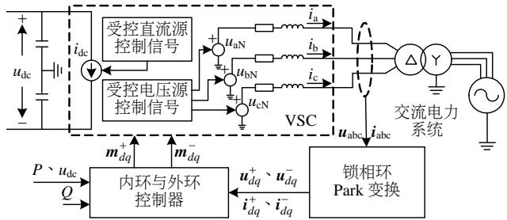  
图1 换流器动态平均值模型及其控制系统  
Fig. 1 Dynamic AVM of typical converters and corresponding control system

由图1可见，换流器交流侧等效为三相受控电压源：

$$
\boldsymbol {u} _ {\mathrm {a b c N}} = \frac {1}{2} u _ {\mathrm {d c}} (\boldsymbol {T} (\theta) \boldsymbol {m} _ {d q} ^ {+} + \boldsymbol {T} (- \theta) \boldsymbol {m} _ {d q} ^ {-}) \tag {1}
$$

其中：

$$
\boldsymbol {T} (\theta) = \left[ \begin{array}{c c} \cos \theta & - \sin \theta \\ \cos \left(\theta - \frac {2 \pi}{3}\right) & - \sin \left(\theta - \frac {2 \pi}{3}\right) \\ \cos \left(\theta + \frac {2 \pi}{3}\right) & - \sin \left(\theta + \frac {2 \pi}{3}\right) \end{array} \right] \tag {2}
$$

式中： $u_{\mathrm{abcN}} = [u_{\mathrm{aN}}, u_{\mathrm{bN}}, u_{\mathrm{cN}}]^{\mathrm{T}}$ ； $u_{\mathrm{dc}}$ 为该换流器直流侧电压； $\pmb{T}$ 为Park变换； $m_{dq}^{+} = [m_{d}^{+} m_{q}^{+}]^{\mathrm{T}}$ 和 $m_{dq}^{-} = [m_d^{-} m_q^{-}]^{\mathrm{T}}$ 为控制系统输出的调制函数 $dq$ 分量，两者可用于多种调制方式如MMC中最近电平逼近调制等；上标“ $+$ ”、“-”分别表示正负序分量，本文考虑换流变压器阻断了网侧零序分量通路，所以并未计及零序分量。将直流侧等效为受控直流电流源：

$$
i _ {\mathrm {d c}} = \frac {1}{2} \boldsymbol {i} _ {\mathrm {a b c}} (\boldsymbol {T} (\theta) \boldsymbol {m} _ {d q} ^ {+} + \boldsymbol {T} (- \theta) \boldsymbol {m} _ {d q} ^ {-}) \tag {3}
$$

式中 $i_{\mathrm{abc}} = [i_{\mathrm{a}}, i_{\mathrm{b}}, i_{\mathrm{c}}]$ 为换流器交流侧三相电流(以流向

交流侧为正)。由文献[6-8]可知, 两电平、三电平以及MMC类型VSC动态AVM可统一为如图1所示(式(1)、(3)中的受控电压源、电流源形式)。因此,后文将推导三者通用的多尺度暂态模型。

动态平均值建模一般仅针对换流器开关部分，并不改变控制系统模型。本文中，VSC控制系统内环控制器采用典型正负序 $dq$ 电流矢量控制，而外环控制器根据交直流系统动态特性采取相应的控制方式[28]。若VSC交流侧系统为弱系统，外环一般为频率与交流电压控制；若为强系统，则采用直流电压与无功控制。

多个换流站通过直流电缆/架空输电线互联。通常采用直流输电线单个或串接 $\pi$ 型电路研究直流电网暂态特性。也有文献采用输电线分布参数或频率相关参数模型模拟直流输电线特性[3]。

# 2 含 VSC-HVDC 交直流系统多尺度暂态模型

# 2.1 移频分析法

交流系统电气量如电压或电流 $x(t)$ 含有 $f_{0} = 50\mathrm{Hz}$ 或 $60\mathrm{Hz}$ )基频载波，角频率 $\omega_0 = 2\pi f_0$ 。当系统遭受扰动并处于暂态时， $x(t)$ 可表达为

$$
x (t) = A (t) \cos \left[ \left(\omega_ {0} + \Delta \omega (t)\right) t + \phi_ {0} \right] \tag {4}
$$

式中： $\phi_0$ 为初始相位角且为定值，而幅值 $A(t)$ 和频率 $\omega_{s}(t) = \omega_{0} + \Delta \omega (t)$ 可变，均为时间的函数。采用三角函数变换：

$$
x (t) = x _ {\mathrm {R}} (t) \cos \left(\omega_ {0} t\right) - x _ {\mathrm {I}} (t) \sin \left(\omega_ {0} t\right) \tag {5}
$$

其中：

$$
\left\{ \begin{array}{l} x _ {\mathrm {R}} (t) = A (t) \cos \left(\Delta \omega (t) t + \phi_ {0}\right) \\ x _ {\mathrm {I}} (t) = A (t) \sin \left(\Delta \omega (t) t + \phi_ {0}\right) \end{array} \right. \tag {6}
$$

当系统表现为机电暂态，即 $A(t)$ 和 $\Delta \omega (t)$ 变化相对较慢时， $x(t)$ 频谱具有窄带通特性，如图2(a)所示。对 $x(t)$ 采用如附录A所示的希尔伯特变换，得其解析信号[29]如下：

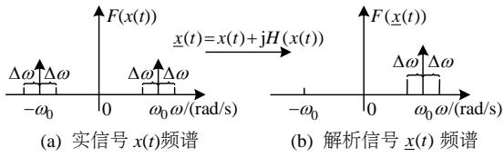  
图2 实信号经希尔伯特变换后的解析信号频谱  
Fig. 2 Frequency spectra of real to analytic signals using Hilbert transform

$$
\begin{array}{l} \underline {{x}} (t) = x _ {R} (t) \cos (\omega_ {0} t) - x _ {I} (t) \sin (\omega_ {0} t) + \\ \mathrm {j} \left[ x _ {\mathrm {R}} (t) \sin \left(\omega_ {0} t\right) + x _ {\mathrm {I}} (t) \cos \left(\omega_ {0} t\right) \right] = \\ \left(x _ {\mathrm {R}} (t) + \mathrm {j} x _ {\mathrm {I}} (t)\right) \left[ \cos \left(\omega_ {0} t\right) + \mathrm {j} \sin \left(\omega_ {0} t\right) \right] \tag {7} \\ \end{array}
$$

解析信号 $\underline{x}(t)$ 频谱如图2(b)所示。由图2可见，实信号 $x(t)$ 的频谱位于正负半轴，而通过希尔伯特变换得到解析信号 $\underline{x}(t)$ 频谱仅存在于实半轴。

将图2(b)所示的单带通信号频谱沿频率轴左右移动，可使信号频率改变。若向负轴移动至坐标原点，最大频率减小，这样能够增加信号的采样步长。定义移频相量 $S(\underline{x}(t)) = x_{\mathrm{R}}(t) + \mathrm{j}x_{\mathrm{I}}(t)$ ，并对式(7)两边同乘 $\mathrm{e}^{-\mathrm{j}\omega_0t}$ ，可得：

$$
S (\underline {{x}} (t)) = \underline {{x}} (t) \mathrm {e} ^ {- \mathrm {j} \omega_ {0} t} \tag {8}
$$

将式(8)的实部和虚部表达为矩阵形式：

$$
\left[ \begin{array}{l} x _ {\mathrm {R}} (t) \\ x _ {\mathrm {I}} (t) \end{array} \right] = \left[ \begin{array}{l l} \cos \left(\omega_ {0} t\right) & \sin \left(\omega_ {0} t\right) \\ - \sin \left(\omega_ {0} t\right) & \cos \left(\omega_ {0} t\right) \end{array} \right] \left[ \begin{array}{l} x (t) \\ H (x (t)) \end{array} \right] \tag {9}
$$

式中： $H(x(t))$ 如附录A所示； $x_{\mathrm{R}}(t)$ 与 $x_{\mathrm{I}}(t)$ 分别为 $S(\underline{x} (t))$ 的实部和虚部。式(8)中， $S(\underline{x} (t))$ 频谱如图3(b)所示，由图3可见，通过频率移动即 $\mathrm{e}^{-\mathrm{j}\omega_0t}$ ，电力系统解析信号频谱以 $\omega_0$ 为中心变为以坐标轴原点为中心。 $\underline{x} (t)$ 通过 $\mathrm{e}^{-\mathrm{j}\omega_0t}$ 仅移除了基频载波，此时 $S(\underline{x}(t))$ 含有的最大频率为 $\Delta \omega$ 。值得注意的是，传统动态相量法[17-20]保留主导频率分量(如基频、二次谐波)，忽略高次谐波频率信息，而移频分析法在该方面与其有本质区别，移频法移除基频量，保留其他所有频率信息。

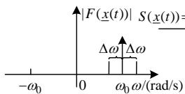  
(a) 解析信号 $\underline{x}(t)$ 频谱

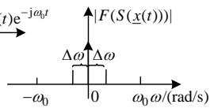  
(b) 移频信号 $S(\underline{x}(t))$ 频谱  
图3 频谱移动  
Fig. 3 Frequency spectra shifting

根据香浓(Shannon)采样定理[30]，理论上采样 $S(\underline{x}(t))$ 最大时间步长限制为

$$
\max  \tau (t) = \frac {1}{2 \Delta f (t)} = \frac {\pi}{\Delta \omega (t)} \tag {10}
$$

式(10)表明，最大采样时间步长 $\max \tau (t)$ 与 $\Delta \omega (t)$ 成反比。当 $\Delta \omega (t)\rightarrow 0$ ，采样步长理论上可无限大。当系统表现为低频机电暂态时， $\Delta \omega (t)$ 取值较小 $(0 <   \Delta \omega <  \omega_0)$ ，仿真时间步长一般取为毫秒级。当系统表现为高频电磁暂态时， $\Delta \omega$ 取值较大，此时仅仅移除基频载波不足以减小采样频率。需考虑

的谐波分量等电磁暂态表现为快速变化，一般采用微秒级仿真时间步长模拟。根据式(8)，电磁暂态瞬时值可通过移频反变换得到：

$$
\left[ \begin{array}{c} x (t) \\ H (x (t)) \end{array} \right] = \left[ \begin{array}{l l} \cos \left(\omega_ {0} t\right) & - \sin \left(\omega_ {0} t\right) \\ \sin \left(\omega_ {0} t\right) & \cos \left(\omega_ {0} t\right) \end{array} \right] \left[ \begin{array}{l} x _ {\mathrm {R}} (t) \\ x _ {\mathrm {I}} (t) \end{array} \right] \tag {11}
$$

# 2.2 基于移频分析法的VSC多尺度暂态模型

基于第1节的动态平均值模型，下文将推导换流器交流侧等效受控电压源和直流侧等效直流电流源的移频相量模型。

# 2.2.1 换流器交流侧等效电压源

由于本文换流器控制系统采用典型 $dq$ 解耦正负序控制策略，动态平均值模型受控电压源a相正序电压由式(1)得：

$$
u _ {\mathrm {a N}} ^ {+} = \frac {1}{2} u _ {\mathrm {d c}} \left(m _ {d} ^ {+} \cos \theta - m _ {q} ^ {+} \sin \theta\right) \tag {12}
$$

假定锁相环(phase-locked loop, PLL)完全锁定换流器交流侧系统频率 $\omega_0$ ，并定义 $\theta = \omega_0 t + \Delta \theta(t)$ 其中， $\Delta \theta$ 为PLL检测三相交流电压的累计相位角度差。对式(12)进行希尔伯特变换，得解析信号：

$$
\begin{array}{l} \underline {{u}} _ {\mathrm {a N}} ^ {+} = \frac {1}{2} u _ {\mathrm {d c}} [ (m _ {d} ^ {+} \cos \theta - m _ {q} ^ {+} \sin \theta) + \mathrm {j} (m _ {d} ^ {+} \sin \theta + \\ \left. m _ {q} ^ {+} \cos \theta) \right] = \frac {1}{2} u _ {\mathrm {d c}} \left(m _ {d} ^ {+} + \mathrm {j} m _ {q} ^ {+}\right) \mathrm {e} ^ {\mathrm {j} \left(\omega_ {0} t + \Delta \theta (t)\right)} \tag {13} \\ \end{array}
$$

对式(13)两边同乘以 $\mathrm{e}^{-\mathrm{j}\omega_0t}$ ，即移频处理得：

$$
S \left(\underline {{u}} _ {\mathrm {a N}} ^ {+}\right) = \frac {1}{2} u _ {\mathrm {d c}} \left(m _ {d} ^ {+} + \mathrm {j} m _ {q} ^ {+}\right) \mathrm {e} ^ {\mathrm {j} \Delta \theta (t)} \tag {14}
$$

将式(14)实部和虚部表达为矩阵形式：

$$
\left[ \begin{array}{l} u _ {\mathrm {a N} _ {-} \mathrm {R}} ^ {+} \\ u _ {\mathrm {a N} _ {-} \mathrm {I}} ^ {+} \end{array} \right] = \frac {1}{2} u _ {\mathrm {d c}} \boldsymbol {T} _ {\mathrm {s}} ^ {+} (\Delta \theta) \left[ \begin{array}{l} m _ {d} ^ {+} \\ m _ {q} ^ {+} \end{array} \right] \tag {15}
$$

式中 $u_{\mathrm{aN\_R}}^{+}$ 和 $u_{\mathrm{aN\_I}}^{+}$ 分别为 $S(\underline{u}_{\mathrm{aN}}^{+})$ 的实部和虚部，

$$
\boldsymbol {T} _ {\mathrm {s}} ^ {+} (\Delta \theta) = \left[ \begin{array}{l l} \cos (\Delta \theta) & - \sin (\Delta \theta) \\ \sin (\Delta \theta) & \cos (\Delta \theta) \end{array} \right] \tag {16}
$$

同理，将式(12)—(16)推导过程用于换流器交流侧等效受控电压源b相正序电压 $\underline{u}_{\mathrm{bN}}^{+}$ 和c相 $\underline{u}_{\mathrm{cN}}^{+}$ 的移频相量推导。另一方面，基于 $dq$ 解耦控制负序输出量 $m_{d}^{-}$ 和 $m_{q}^{-}$ ，推导等效受控电压源三相负序电压的移频相量。将abc三相移频相量记为矢量形式，定义为

$$
\boldsymbol {u} _ {\mathrm {N} - \mathrm {R}} = \left[ \begin{array}{l} u _ {\mathrm {a N} - \mathrm {R}} ^ {+} + u _ {\mathrm {a N} - \mathrm {R}} ^ {-} \\ u _ {\mathrm {b N} - \mathrm {R}} ^ {+} + u _ {\mathrm {b N} - \mathrm {R}} ^ {-} \\ u _ {\mathrm {c N} - \mathrm {R}} ^ {+} + u _ {\mathrm {c N} - \mathrm {R}} ^ {-} \end{array} \right], \quad \boldsymbol {u} _ {\mathrm {N} - \mathrm {I}} = \left[ \begin{array}{l} u _ {\mathrm {a N} - \mathrm {I}} ^ {+} + u _ {\mathrm {a N} - \mathrm {I}} ^ {-} \\ u _ {\mathrm {b N} - \mathrm {I}} ^ {+} + u _ {\mathrm {b N} - \mathrm {I}} ^ {-} \\ u _ {\mathrm {c N} - \mathrm {I}} ^ {+} + u _ {\mathrm {c N} - \mathrm {I}} ^ {-} \end{array} \right] \tag {17}
$$

将上述推导结果如式(15)代入式(17)，求得换流器交流侧三相等效受控电压源移频相量如下：

$$
\left[\begin{array}{l}\boldsymbol {u} _ {\mathrm {N} - \mathrm {R}}\\\boldsymbol {u} _ {\mathrm {N} - \mathrm {I}}\end{array}\right] = \frac {1}{2} u _ {\mathrm {d c}} \boldsymbol {T} _ {d q \rightarrow \mathrm {S F}} \left[\begin{array}{l}\boldsymbol {m} _ {d q} ^ {+}\\\boldsymbol {m} _ {d q} ^ {-}\end{array}\right] \tag {18}
$$

其中：

$$
\boldsymbol {T} _ {d q \rightarrow \mathrm {S F}} = \left[\begin{array}{c c}\boldsymbol {T} (\Delta \theta)&\boldsymbol {T} (- \Delta \theta)\\\boldsymbol {T} (\Delta \theta - \frac {\pi}{2})&\boldsymbol {T} (\frac {\pi}{2} - \Delta \theta)\end{array}\right] \tag {19}
$$

式中 $\pmb{T}$ 为如式(2)所示的Park变换。

# 2.2.2 换流器直流侧等效电流源

换流器交流侧电流同上述交流电压也被表达为移频相量。根据换流器交流侧电压和电流移频相量，计算出换流器交流侧输出有功功率 $P$ 和无功功率 $Q$ ，两者分别表达为矢量形式如下：

$$
\left\{ \begin{array}{l} P = \left[ \begin{array}{l l} \boldsymbol {i} _ {\mathrm {R}} & \boldsymbol {i} _ {\mathrm {I}} \end{array} \right] \left[ \begin{array}{l} \boldsymbol {u} _ {\mathrm {N} - \mathrm {R}} \\ \boldsymbol {u} _ {\mathrm {N} - \mathrm {I}} \end{array} \right] \\ Q = \left[ \begin{array}{l l} \boldsymbol {i} _ {\mathrm {R}} & - \boldsymbol {i} _ {\mathrm {I}} \end{array} \right] \left[ \begin{array}{l} \boldsymbol {u} _ {\mathrm {N} - \mathrm {I}} \\ \boldsymbol {u} _ {\mathrm {N} - \mathrm {R}} \end{array} \right] \end{array} \right. \tag {20}
$$

式中： $i_{\mathrm{R}} = \left[ \begin{array}{ccc}i_{\mathrm{a\_R}} & i_{\mathrm{b\_R}} & i_{\mathrm{c\_R}} \end{array} \right]$ ； $i_{\mathrm{I}} = \left[ \begin{array}{ccc}i_{\mathrm{a\_I}} & i_{\mathrm{b\_I}} & i_{\mathrm{c\_I}} \end{array} \right]$ 。将式(18)代入式(20)有功表达式中，并根据换流器两侧功率平衡原则即 $i_{\mathrm{dc}} = P / u_{\mathrm{dc}}$ ，直流侧电流源表达为

$$
i _ {\mathrm {d c}} = \frac {1}{2} \left[\begin{array}{l l}\boldsymbol {i} _ {\mathrm {R}}&\boldsymbol {i} _ {\mathrm {I}}\end{array}\right] \boldsymbol {T} _ {d q \rightarrow \mathrm {S F}} \left[\begin{array}{l}\boldsymbol {m} _ {d q} ^ {+}\\\boldsymbol {m} _ {d q} ^ {-}\end{array}\right] \tag {21}
$$

# 2.3 控制系统暂态模型

柔性直流输电系统换流站高度可控，其中控制系统通常采用 $dq$ 解耦矢量控制策略。PLL测量换流站交流侧电压和电流，经Park变换向控制系统提供 $dq$ 解耦量。为处理换流站交流侧系统不对称故障，交流量一般分解为正负序。根据对称分量法，换流站交流侧电压正序分量为

$$
\underline {{u}} _ {\mathrm {a}} ^ {+} = \frac {1}{3} \left(\underline {{u}} _ {\mathrm {a}} + \alpha \underline {{u}} _ {\mathrm {b}} + \alpha^ {2} \underline {{u}} _ {\mathrm {c}}\right) \tag {22}
$$

式中 $\alpha = \mathrm{e}^{\mathrm{j}2\pi /3}$ 。定义 $S(\underline{u}_{\mathrm{a}}^{+}) = u_{\mathrm{a\_R}}^{+} + \mathrm{j}u_{\mathrm{a\_I}}^{+}$ ，根据式(7)和(8)对式(22)移频得：

$$
S \left(\underline {{u}} _ {\mathrm {a}} ^ {+}\right) = \frac {1}{3} \left(S \left(\underline {{u}} _ {\mathrm {a}}\right) + \alpha S \left(\underline {{u}} _ {\mathrm {b}}\right) + \alpha^ {2} S \left(\underline {{u}} _ {\mathrm {c}}\right)\right) \tag {23}
$$

将式(23)中的三相移频相量即 $S(\underline{u}_{\mathrm{a}}) = u_{\mathrm{a\_R}} + \mathrm{j}u_{\mathrm{a\_I}}, S(\underline{u}_{\mathrm{b}}) = u_{\mathrm{b\_R}} + \mathrm{j}u_{\mathrm{b\_I}}$ 和 $S(\underline{u}_{\mathrm{c}}) = u_{\mathrm{c\_R}} + \mathrm{j}u_{\mathrm{c\_I}}$ 重新组合为实部 $\boldsymbol{u}_{\mathrm{R}} = [u_{\mathrm{a\_R}} u_{\mathrm{b\_R}} u_{\mathrm{c\_R}}]^{\mathrm{T}}$ 和虚部 $\boldsymbol{v}_{\mathrm{R}} =$

$[\nu_{\mathrm{a\_I}} \quad \nu_{\mathrm{b\_I}} \quad \nu_{\mathrm{c\_I}}]^{\mathrm{T}}$ 。为得到控制系统 $dq$ 坐标分量，采用如附录B所示移频域与 $dq$ 域的变换关系，将式(B1)代入式(B4)，求得 $dq$ 域正序量与三相移频相量的直接关系如下：

$$
\left[ \begin{array}{l} u _ {d} ^ {+} \\ u _ {q} ^ {+} \end{array} \right] = \frac {1}{3} \boldsymbol {T} _ {\mathrm {s}} ^ {+} (- \Delta \theta) [ \boldsymbol {T} (0) \quad \boldsymbol {T} (- \frac {\pi}{2}) ] \left[ \begin{array}{l} u _ {\mathrm {R}} \\ u _ {\mathrm {I}} \end{array} \right] \tag {24}
$$

式中 $T(0)$ 与 $T(-\pi /2)$ 如附录B所示。同式(24)，可建立 $dq$ 负序量与移频相量之间的关系。这里，定义 $\pmb{u}_{dq}^{+} = [u_{d}^{+}\quad u_{q}^{+}]^{\mathrm{T}}$ ， $\pmb{u}_{dq}^{-} = [u_{d}^{-}\quad u_{q}^{-}]^{\mathrm{T}}$ ，给出交流电压正负序 $dq$ 分量与移频相量(对称情况为平衡量，不对称情况为不平衡量)之间的数学关系式：

$$
\left[\begin{array}{l}\boldsymbol {u} _ {d q} ^ {+}\\\boldsymbol {u} _ {d q} ^ {-}\end{array}\right] = \boldsymbol {T} _ {\mathrm {S F} \rightarrow d q} \left[\begin{array}{l}u _ {\mathrm {R}}\\u _ {\mathrm {I}}\end{array}\right] \tag {25}
$$

其中：

$$
\boldsymbol {T} _ {\mathrm {S F} \rightarrow d q} = \frac {1}{3} \left[\begin{array}{l l}\boldsymbol {T} (\Delta \theta) ^ {\mathrm {T}}&\boldsymbol {T} (\Delta \theta - \frac {\pi}{2}) ^ {\mathrm {T}}\\\boldsymbol {T} (- \Delta \theta) ^ {\mathrm {T}}&- \boldsymbol {T} (\frac {\pi}{2} - \Delta \theta) ^ {\mathrm {T}}\end{array}\right] \tag {26}
$$

值得注意的是： $T_{dq\rightarrow \mathrm{SF}}$ 和 $T_{\mathrm{SF}\rightarrow dq}$ 互为可逆，两者给出了换流器交流侧移频相量与控制系统 $dq$ 解耦量之间的量化转换关系。

根据第2.2和2.3节中换流器移频相量模型及其与控制系统变量之间的数学关系，构建换流器及其控制系统多尺度暂态模型，如图4所示。在该模型中，采用 $T_{\mathrm{SF} \rightarrow dq}$ 将移频相量 $u_{\mathrm{R}} \sim u_{\mathrm{I}} \sim i_{\mathrm{R}}$ 和 $i_{\mathrm{I}}$ 变换为 $dq$ 分量，即向控制系统提供正负序 $dq$ 电压和电

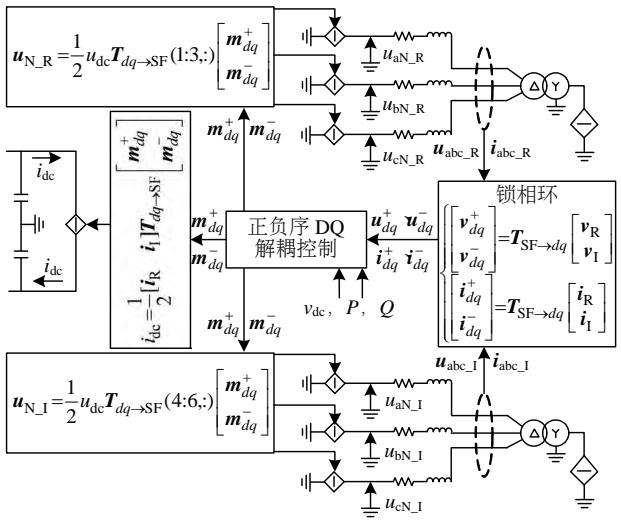  
图4VSC及其控制系统多尺度暂态模型  
Fig. 4 Multi-scale transient model of VSC and its controller

流信息。经过控制系统内、外环控制器控制调节，输出正负序调制信号 $\pmb{m}_{dq}^{+}$ 和 $\pmb{m}_{dq}^{-}$ 。进而采用 $T_{dq\rightarrow \mathrm{SF}}$ 构建换流器交流侧等效电压源移频相量 $\pmb{u}_{\mathrm{N\_R}}$ 和 $\pmb{u}_{\mathrm{N\_I}}$ 以及直流侧等效电流源。

# 2.4 直流输电线多尺度暂态模型

模拟电力系统机电暂态通常采用电缆/架空输电线 $\pi$ 模型，但该模型难以模拟输电线波过程等高频电磁暂态现象。长距离直流输电线考虑线路损耗，模拟电磁暂态通常采用串接集中电阻的单根无损导线分布参数模型较为合理[3,5]。若忽略输电线对地电导，考虑输电线分布电感 $L_{0}$ 和分布电容 $C_{0}$ ，输电线波过程方程由线两端电压和电流表示为

$$
\left\{ \begin{array}{l} i _ {1 1} (t) = \frac {1}{z _ {0}} v _ {1 1} (t) - i _ {1 2} \left(t - T _ {\mathrm {w p}}\right) - \frac {1}{z _ {0}} v _ {1 2} \left(t - T _ {\mathrm {w p}}\right) \\ i _ {1 2} (t) = \frac {1}{z _ {0}} v _ {1 2} (t) - i _ {1 1} \left(t - T _ {\mathrm {w p}}\right) - \frac {1}{z _ {0}} v _ {1 1} \left(t - T _ {\mathrm {w p}}\right) \end{array} \right. \tag {27}
$$

式中：波阻抗 $Z_{0} = \sqrt{L_{0} / C_{0}}$ ； $T_{\mathrm{wp}} = \ell / \sqrt{L_{0}C_{0}}$ ，为传输波在该导线上由一端传播到另一端所需时间，其中 $\ell$ 为该线路长度。

采用方程(27)模拟电磁暂态过程，假设仿真步长为 $\tau$ ，若 $\tau < T_{\mathrm{wp}}$ ，建立的电磁暂态模型两端解耦。在模拟机电暂态时，通常 $\tau \geq T_{\mathrm{wp}}$ ，此时输电线模型两端处于耦合状态，表现为等值 $\pi$ 模型。一般 $T_{\mathrm{wp}}$ 并不是 $\tau$ 的整数倍，在仿真计算中需对 $t - T_{\mathrm{wp}}$ 时刻输电线两端电压和电流采用插值计算方法处理，如 $i_{11}(t - T_{\mathrm{wp}})$

$$
i _ {1 1} (t - T _ {\mathrm {w p}}) = \rho i _ {1 1} ((k - \kappa + 1) \tau) + \sigma i _ {1 1} ((k - \kappa) \tau) \tag {28}
$$

其中：

$$
\left\{ \begin{array}{l} \rho = \kappa - \frac {T _ {\mathrm {w p}}}{\tau} \\ \sigma = \frac {T _ {\mathrm {w p}}}{\tau} - \kappa + 1 \end{array} \right. \tag {29}
$$

式中 $\kappa = \mathrm{ceil}(T_{\mathrm{wp}} / \tau)$ ，其中ceil表示向正无穷方向取整。式(28)中的线性插值方法也用于式(27)中 $\nu_{11}(t - T_{\mathrm{wp}})\setminus i_{12}(t - T_{\mathrm{wp}})$ 和 $\nu_{12}(t - T_{\mathrm{wp}})$ 的处理。

将输电线两端电压和电流插值结果代入式(27)，建立输电线的多尺度暂态模型如图5所示(端点1和2之外接入集中电阻支路，图5中略)。

当模拟电磁暂态, $\kappa > 1$ , 图5中开关断开, 输电线模型两端解耦, 图5中注入电流源 $\eta_{11}$ 和 $\eta_{12}$ 为

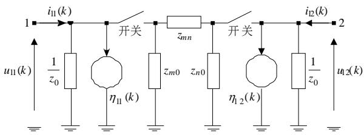  
图5 直流输电线多尺度暂态模型  
Fig. 5 Multi-scale transients model of DC transmission line

$$
\begin{array}{l} \left[ \begin{array}{l} \eta_ {1 1} (k) \\ \eta_ {1 2} (k) \end{array} \right] = - \rho \left[ \begin{array}{l} i _ {1 2} (k - \kappa + 1) \\ i _ {1 1} (k - \kappa + 1) \end{array} \right] - \sigma \left[ \begin{array}{l} i _ {1 2} (k - \kappa) \\ i _ {1 1} (k - \kappa) \end{array} \right] - \\ \frac {\rho}{z _ {0}} \left[ \begin{array}{l} v _ {1 2} (k - \kappa + 1) \\ v _ {1 1} (k - \kappa + 1) \end{array} \right] - \frac {\sigma}{z _ {0}} \left[ \begin{array}{l} v _ {1 2} (k - \kappa) \\ v _ {1 1} (k - \kappa) \end{array} \right] \tag {30} \\ \end{array}
$$

当模拟机电暂态时， $\kappa = 1$ ，开关闭合，将推导的 $\pi$ 模型插入电磁暂态解耦模型构成两端耦合模型。该 $\pi$ 模型两端之间及其对地阻抗为

$$
\left\{ \begin{array}{l} z _ {m n} = \frac {2 \rho}{z _ {0} \left(1 - \rho^ {2}\right)} \\ z _ {m 0} = z _ {n 0} = \frac {- 2 \rho}{z _ {0} (1 + \rho)} \end{array} \right. \tag {31}
$$

值得注意的是，在模拟机电暂态时，注入电流源 $\eta_{11}$ 和 $\eta_{12}$ 由式(30)更新为

$$
\begin{array}{l} \left[ \begin{array}{c} \eta_ {1 1} (k) \\ \eta_ {1 2} (k) \end{array} \right] = \frac {\sigma}{1 - \rho^ {2}} \left[ \begin{array}{c c} \rho & - 1 \\ - 1 & \rho \end{array} \right]. \\ \left(\left[ \begin{array}{l} i _ {1 1} (k - 1) \\ i _ {1 2} (k - 1) \end{array} \right] + \frac {1}{z _ {0}} \left[ \begin{array}{l} v _ {1 1} (k - 1) \\ v _ {1 2} (k - 1) \end{array} \right]\right) \tag {32} \\ \end{array}
$$

# 2.5 交流系统多尺度暂态模型

当系统经历暂态，直流部分的电气量表现出振荡过程。假设振荡频率为 $\Delta \omega$ ，则交流系统电压或电流表现为基频 $\omega_0$ 分量与 $\Delta \omega$ 偏差量的叠加。采用第2.1节中移频原理，可移除交流系统电压或电流基频分量，仅模拟表现为 $\Delta \omega$ 的振荡分量。传统交流系统分布参数输电线、同步发电机、三相变压器等元件移频多尺度暂态模型已在文献[21-24]中建立。为方便理解，本文以集中元件电感为例阐述交流系统元件的移频暂态建模过程，如附录C所示。

# 2.6 电磁-机电暂态分区混合仿真技术

根据第2.2—2.4节建立的VSC、控制环节、直流输电线及交流系统多尺度暂态模型，构建VSC-HVDC交直流全系统电磁-机电暂态多尺度模型。通常面向不同时间区段仿真电磁或机电暂态：1）当模拟机电暂态时，设置毫秒级仿真时间步长，闭合图5中直流线模型开关；2）当关注电磁暂态

现象时，移频相量保留了高频信息，表现为快变化，设置微秒级时间步长，图5中直流线模型开关断开。

另一方面，多端直流与直流电网的规模化对电磁-机电暂态混合仿真也提出了挑战。本文提出面向电网位置的不同暂态类型，调整仿真参数，如时间步长，实现电磁-机电暂态的电网分区仿真。为方便数据交换，通常将机电区仿真时间步长取为电磁区域的整数倍，即：

$$
\tau_ {\mathrm {T S}} = n \tau_ {\mathrm {E M T}}, \quad n \in 2, 3, \dots , N \tag {33}
$$

式中： $\tau_{\mathrm{TS}}$ 为机电暂态区仿真时间步长，通常取毫秒级别时间步长； $\tau_{\mathrm{EMT}}$ 一般采用微秒级别。

柔性直流输电各换流站之间及其与交流系统之间存在着比较复杂的电磁-机电暂态耦合作用。尽管VSC-HVDC交直流系统电磁与机电暂态区划分的理论依据有待进一步研究，但两区接口位置主要有两种情况，两者数据交换分析如下。

情况1：接口位于VSC交流侧或交流系统。电磁与机电区主要交换交流信号，接口两侧处理移频相量，在建模机理、数据类型等方面一致，因此两区接口处理较为简单。两区交互如图6(a)所示，步骤①：当电磁区执行 $t + \tau_{\mathrm{EMT}}$ 时刻仿真，机电区电压或电流移频相量通过补偿 $S(\underline{u})\mathrm{e}^{\mathrm{j}\omega_0k\tau_{\mathrm{EMT}}}$ 或 $S(\underline{i})\mathrm{e}^{\mathrm{j}\omega_0k\tau_{\mathrm{EMT}}}$ 传递给电磁区，则有：

$$
\left[ \begin{array}{l} \boldsymbol {v} _ {\mathrm {R}} ^ {\text {n e w}} \\ \boldsymbol {v} _ {\mathrm {I}} ^ {\text {n e w}} \end{array} \right] = \left[ \begin{array}{l l} \boldsymbol {E} \cos \Delta \delta & - \boldsymbol {E} \sin \Delta \delta \\ \boldsymbol {E} \sin \Delta \delta & \boldsymbol {E} \cos \Delta \delta \end{array} \right] \left[ \begin{array}{l} \boldsymbol {v} _ {\mathrm {R}} \\ \boldsymbol {v} _ {\mathrm {I}} \end{array} \right] \tag {34}
$$

式中： $E = \mathrm{diag}[1,1,1]$ ； $\Delta \delta = \omega_0k\tau_{\mathrm{EMT}}$ ，电流量更新与式(34)相似。步骤②：电磁区向机电区传递电压

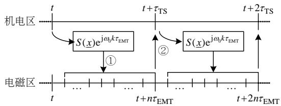  
(a) 交流系统中电磁-机电区信息交互

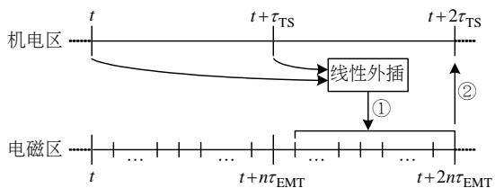  
(b) 直流系统中电磁-机电区接口信息交互  
图6 电磁-机电区接口数据交互时序  
Fig. 6 Interaction protocols between zones of electromagnetic and electromechanical transients

或电流量，电磁瞬时值通过式(9)变换为移频相量，直接传递给机电区域使用。

情况2：接口位于VSC直流侧或直流系统。接口处理直流信号，当信号处于稳态或准稳态时，直流侧接口作为电磁与机电暂态仿真接口点更为合理。该情况下，电磁与机电仿真区交互时序如图6(b)所示。步骤①中，已知机电区 $t$ 和 $t + \tau_{\mathrm{TS}}$ 时刻值，采用线性外推插值或线性三点预报公式等方法，求得电磁区所需 $t + \tau_{\mathrm{TS}} + k\tau_{\mathrm{EMT}}$ 时刻的机电区移频相量。其中，采用线性外插：

$$
u \left(t + \tau_ {\mathrm {T S}} + k \tau_ {\mathrm {E M T}}\right) = \left(1 + \frac {k \tau_ {\mathrm {E M T}}}{\tau_ {\mathrm {T S}}}\right) u \left(t + \tau_ {\mathrm {T S}}\right) - \frac {k \tau_ {\mathrm {E M T}}}{\tau_ {\mathrm {T S}}} u (t) \tag {35}
$$

类似式(35)，计算电流线性外插值。在步骤②中，现求得电磁区域 $t + 2n\tau_{\mathrm{EMT}}$ 时刻解，直接传递给机电区域，计算此时刻机电区域解。

# 3 算例验证

将所提模型应用于柔性直流输电系统电磁-机电暂态特性的计算与分析中，并与电磁暂态(electromagnetic transient，EMT)动态平均值模型计算结果比较。值得注意的是，所提模型输出结果能够表现为电磁瞬时值或机电暂态RMS值，以交流侧a相电压为例。当模拟机电暂态时，交流侧a相电压RMS值为

$$
u _ {\mathrm {a}} ^ {\mathrm {R M S}} (t) = \sqrt {u _ {\mathrm {a} - \mathrm {R}} ^ {2} (t) + u _ {\mathrm {a} - \mathrm {I}} ^ {2} (t)} \tag {36}
$$

当仿真电磁暂态时，通过式(11)将交流侧移频相量变换为瞬时值：

$$
u _ {\mathrm {a}} (t) = u _ {\mathrm {a} - \mathrm {R}} (t) \cos \left(\omega_ {0} t\right) - u _ {\mathrm {a} - \mathrm {I}} (t) \sin \left(\omega_ {0} t\right) \tag {37}
$$

# 3.1 风电经VSC-HVDC并网多尺度暂态仿真

某风电场经两端VSC-HVDC接入交流系统，如图7所示[28]。两端换流站通过 $30\mathrm{km}$ 直流电缆连接，直流额定电压为 $\pm 200\mathrm{kV}$ ，额定传输功率为400MW。送端VSC控制系统采用交流电压幅值和频率控制，而受端VSC采用定直流电压和定无功控制。为简化分析，网侧外部无穷大交流系统采用

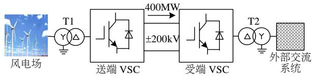  
图7 风电场经VSC-HVDC接入电网示意图  
Fig. 7 Integration of wind farm via VSC-HVDC

等值电压源等效，风电场采用单台直驱全功率风电机组模型等效。

# 3.1.1 功率阶跃与不对称故障

取决于受端VSC侧天气恶劣等原因，控制送端VSC输出功率在0.2s时由400MW降至240MW，但在0.5s逆变侧交流系统突然发生单相接地故障，持续0.2s后被清除。采用多尺度暂态模型模拟最常见的单相接地故障测试VSC-HVDC在电网不对称条件下的暂态特性。

采用多尺度暂态模型和EMT模型对上述暂态现象进行仿真，仿真步长均为 $50\mu \mathrm{s}$ 。图8(a)、(b)分别给出了两种模型获得的流经网侧换流器的a相电流。多尺度暂态模型同时显示交流瞬时值波形及其包络线，而EMT模型仅给出瞬时值。图9(a)给出了两种模型在单相故障期间所得结果比较的放大图。由该图可见，两种模型给出的瞬时值曲线吻合，瞬时值偏差如图9(b)所示在千分之五以内。图10给出了两种模型提供的传输功率曲线非常接

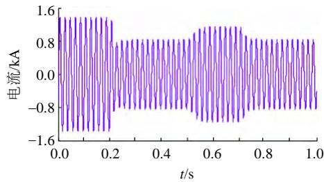  
(a) 电磁暂态(EMT)模型

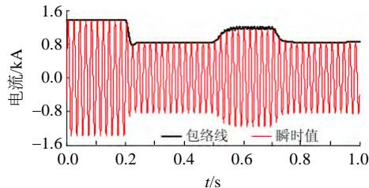  
(b) 多尺度暂态模型  
图8 流经网侧换流器交流电流两种模型仿真结果比较

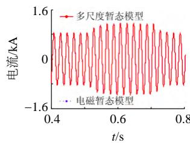  
Fig. 8 Comparison of ac currents through grid-side VSC using different models   
(a) EMT与所提模型故障电流比较

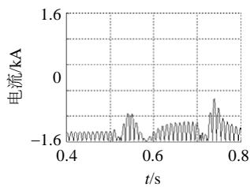  
(b) 结果偏差   
图9 故障期间仿真结果局部放大对比  
Fig. 9 Zoom-in currents during faults

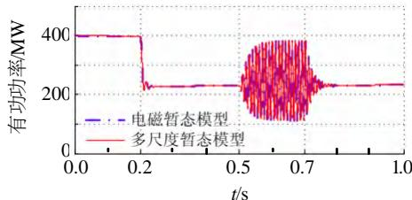  
(a) EMT 与所提模型获得传输功率比较

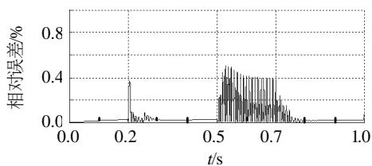  
(b) 功率曲线偏差百分比  
图10 流经换流器有功功率曲线  
Fig. 10 Active power transferred by the VSC

表 1 模拟故障计算时间比较  
Tab. 1 Comparison of CPU time during faults   

<table><tr><td>模型</td><td>仿真步长/μs</td><td>计算时间/s</td></tr><tr><td>电磁暂态模型</td><td>50</td><td>8.2</td></tr><tr><td>多尺度暂态模型</td><td>50</td><td>7.5</td></tr></table>

近，两者偏差在千分之五以内。以上结果验证了本文所提多尺度暂态模型在模拟换流器电磁暂态过程中的准确性。另外，上述两种模型在仿真故障过程所需 CPU 时间如表 1 所示，因采用相同时间步长，两种模型计算时间相差不。

# 3.1.2 风功率短期波动

风电场风功率波动引起的HVDC暂态过程可作为机电暂态研究。这里，风速的变化情况如图11所示。采用上述两种模型对风功率波动引起的暂态现象进行仿真，模拟受端VSC向电网注入的交流电流情况如图12所示。图12(a)给出了EMT模型采用时间步长 $\tau = 50\mu s$ ，多尺度暂态模型采用 $\tau = 2\mathrm{ms}$ ，多尺度暂态模型输出的交流电流峰值包络线完全包络EMT模型输出的瞬时值。在图12(b)中，两种模型均采用 $\tau = 2\mathrm{ms}$ ，相比图12(a)结果，EMT模型采用 $2\mathrm{ms}$ 时间步长的仿真结果并不正确(仿真

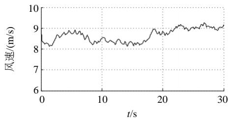  
图11 风速变化情况  
Fig. 11 Profile of wind speed fluctuations

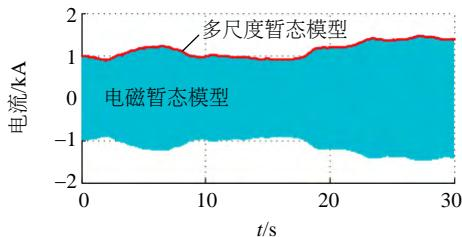  
(a) 不同步步长比较(EMT模型 $\tau = 50\mu s$ ，多尺度模型 $\tau = 2\mathrm{ms}$ )

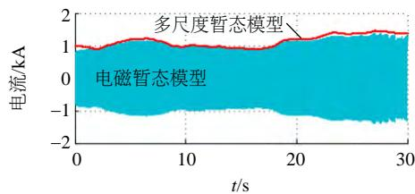  
(b) 相同步步长比较(EMT与多尺度模型均采用 $\tau = 2\mathrm{ms}$ )  
图12 风功率波动下网侧VSC交流侧注入系统电流  
Fig. 12 Ac currents through grid-side VSC under wind power fluctuations

20s后出现虚拟振荡)。结果表明不能简单通过提高EMT模型仿真步长加速仿真,而所提多尺度暂态模型相比EMT模型的加速仿真是准确的。

上述两种模型仿真计算所需CPU时间比较如表2所示。可见，多尺度暂态模型采用时间步长 $2\mathrm{ms},30\mathrm{s}$ 仿真过程计算量仅占EMT模型 $50\mu \mathrm{s}$ 仿真计算量的 $1.55\%$ 。因此，多尺度暂态模型在保证计算精度的同时明显提高了计算速度。

表 2 模拟风功率波动计算时间比较  
Tab. 2 Comparison of CPU time using different models   

<table><tr><td>模型</td><td>仿真步长/μs</td><td>计算时间/s</td></tr><tr><td>电磁暂态模型</td><td>50</td><td>223.65</td></tr><tr><td>多尺度暂态模型</td><td>2000</td><td>3.35</td></tr></table>

# 3.2 MMC-MTDC系统电磁-机电暂态混合仿真

为验证多尺度暂态模型在开展交直流系统电磁-机电暂态混合仿真的灵活性，以CIGRE B4直流电网测试系统为例。为简化分析，本算例仅对如图13所示的CIGRE B4 DCS3系统建模与仿真。这

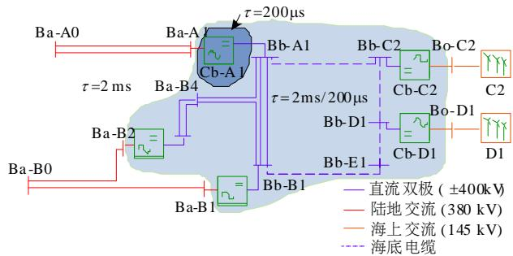  
图13 CIGRE B4直流电网DCS3测试系统  
Fig. 13 CIGRE B4 DCS3 DC grid test system

里，风电场 C2 与 D1 以及有源孤岛 Ba-A0 经五端直流网向外部交流系统 Ba-B0 送电。换流站 MMC 及其控制系统参数参见文献[31]。

假设在 $t = 0.2s$ 时，换流器Cb-A1发生内部故障，这导致该换流器向直流电网转移功率下降，0.2s后故障切除，换流器转移功率逐渐恢复。Cb-A1换流器表现出快速暂态，外部系统包括风电场在内的交流部分在系统层面表现为低频暂态过程。故障情况下的换流器暂态时间常数小于直流网暂态响应时间常数，而后者小于交流系统动态特性时间常数。在保证仿真精度的同时提高计算速度，可以考虑将故障下的换流器作为电磁仿真区域，采用微秒级时间步长，而外部交流系统采用毫秒级时间步长仿真，直流网可选择作为电磁区或机电区。因此，采用下述3种方案。

方案一：对全系统开展电磁暂态仿真，仿真步长为 $\tau = 200\mu \mathrm{s}$ 。

方案二：将MTDC系统中所有换流器以及直流网作为EMT仿真区域， $\tau = 200\mu s$ （如图13浅色阴影区）；外部系统包括风电场在内的交流系统作为机电暂态仿真区域，仿真步长为 $\tau = 2\mathrm{ms}$ 。

方案三：仅将Cb-A1处换流器作为电磁暂态仿真区域， $\tau = 200\mu s$ （深色阴影区），而外围区域开展机电暂态仿真， $\tau = 2\mathrm{ms}$ 。

图14、15分别给出了Cb-A1换流器的输出功率和直流电网Bb-B1处的直流电压，3种方案给出的仿真结果非常相似，进一步可由图14局部放大得以验证。图16给出了Ba-B1处注入交流系统电

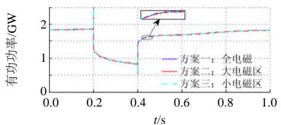  
图14 Cb-A1VSC传输有功功率

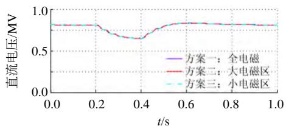  
Fig. 14 Active power transferred by the VSC at Cb-A1   
图15 直流网Bb-B1节点直流电压  
Fig. 15 DC-link voltage at DC-bus Bb-B1

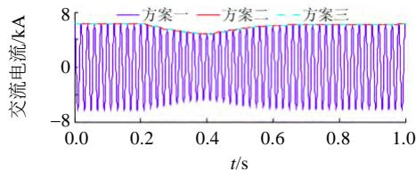  
图16 Bb-B1处VSC流入交流侧电流  
Fig. 16 Injected currents to ac-side of Bb-B1 VSC

流a相情况，方案二和三均采用2ms仿真步长并给出包络线，两者包络线完全包络方案一提供的电磁暂态正弦波瞬时值，同时方案二和三提供的包络线一致。上述仿真结果对比验证了所提模型在混合模拟电磁-机电暂态时的准确性。

在图13中，电磁暂态区由方案一覆盖全系统，减小至方案二浅色阴影区，并进一步减小至方案三Cb-A1处换流器(深色阴影区)，同时机电暂态仿真区域逐步扩大。电磁暂态仿真采用 $\tau = 200\mu s$ ，机电暂态仿真采用 $\tau = 2\mathrm{ms}$ ，这意味着方案一、二和三仿真所需时间依次降低。表3给出了3种方案仿真1s所需CPU时间的比较。若将该测试系统交流部分扩大并进行机电暂态仿真，3种方案所需CPU时间降低将更明显。这些结果验证了所提模型在电磁-机电混合仿真的提速效果和区域划分仿真的灵活性。

表 3 所提模型与 EMT 模型暂态仿真 CPU 耗时比较  
Tab. 3 Comparison of CPU time between EMT and proposed transient models   

<table><tr><td>模型</td><td>方案</td><td>计算时间/s</td></tr><tr><td>EMT 模型</td><td>方案一</td><td>13.26</td></tr><tr><td rowspan="2">多尺度暂态模型</td><td>方案二</td><td>7.36</td></tr><tr><td>方案三</td><td>3.32</td></tr></table>

# 4 结论

本文提出了含VSC-HVDC交直流系统的多尺度暂态模型并将其应用于电磁-机电暂态仿真，相比传统建模方法与仿真技术，具有以下优势。

1）相比传统动态相量法根据研究目的建立不同阶数的相量方程，移频方法通过移除交流系统基频载波，保留其他所有频率信息，模拟机电和电磁暂态特性更加完整和灵活。  
2）相比传统电磁或机电暂态模型，提出的多尺度暂态模型在电磁-机电暂态建模机理上一致，采用单一模型模拟电磁或机电暂态，避免了不同模型仿真多尺度暂态的局限性。  
3）基于动态平均值电磁模型，建立了VSC移频相量模型，实现了VSC移频坐标与其控制系统

dq 坐标的相互转换。该模型易在电磁暂态仿真程序上(如 Matlab/Sim Power Systems)实现，便于交直流系统非线性特性分析与控制系统设计。

4）通过与电磁暂态模型仿真结果比较，多尺度暂态模型在保证电磁暂态仿真精度的同时，提高了机电暂态仿真速度。该模型能够同时提供瞬时值和RMS值(或峰值包络线)。  
5）相比以往联合电磁与机电暂态程序开展混合仿真，本文所提模型通过设置仿真参数开展电磁与机电暂态混合仿真，具有接口相对简单、分区更加灵活等优点。

本文研究工作有利于下一步基于嵌套快速同步求解算法[32]实现MMC内部不同拓扑的电磁暂态详细计算，也为未来大规模多端柔性直流输电以及大型交直流系统(几千节点交流系统)电磁与机电暂态实时混合仿真奠定理论与技术基础。

# 参考文献

[1] 姚良忠，吴婧，王志冰，等．未来高压直流电网发展形态分析[J].中国电机工程学报，2014,34(34):6007-6020. Yao Liangzhong，Wu Jing，Wang Zhibing，etal.Pattern analysis of future HVDC grid development[J]. Proceedings of the CSEE，2014，34(34):6007-6020(in Chinese).  
[2] 汤广福，罗湘，魏晓光．多端直流输电与直流电网技术[J].中国电机工程学报，2013，33(10)：8-17. Tang Guangfu，Luo Xiang，Wei Xiaoguang. Multi-terminal HVDC and DC-grid technology[J]. Proceedings of the CSEE, 2013, 33(10): 8-17(in Chinese).   
[3] Beerten J, Gomis-Bellmunt O, Guillaud X, et al. Modelling and control of HVDC grids: a key challenge for the future power system[C]/Proceedings of the 18th Power System Computation Conference. Wroclaw: PSCC, 2014: 1-21.   
[4] 李亚楼，穆清，安宁，等．直流电网模型和仿真的发展与挑战[J．电力系统自动化，2014，38(4)：127-135．LiYalou，MuQing，An Ning，et al．Development and challenge of modeling and simulation of DC grid[J]. Automation of Electric Power Systems，2014，38(4): 127-135(in Chinese).  
[5] Dommel H W. EMTP theory book[M]. Vancouver, BC, Canada: Microtran Power System Analysis Corporation, 1992.   
[6] Chiniforoosh S, Jatskevich J, Yazdani A, et al. Definitions and applications of dynamic average models for analysis of power systems[J]. IEEE Transactions on Power

Delivery，2010，25(4)：2655-2669.  
[7] Saad H, Peralta J, Dennetiere S, et al. Dynamic averaged and simplified models for MMC-based HVDC transmission systems[J]. IEEE Transactions on Power Delivery, 2013, 28(3): 1723-1730.   
[8] Xu J, Gole A M, Zhao C Y. The use of averaged-value model of modular multilevel converter in DC grid[J]. IEEE Transactions on Power Delivery, 2015, 30(2): 519-528.   
[9] Kundur P. Power system stability and control[M]. New York: McGraw-Hill, 1993.   
[10] Liu S, Xu Z, Hua W, et al. Electromechanical transient modeling of modular multilevel converter based multi-terminal HVDC systems[J]. IEEE Transactions on Power Systems, 2014, 29(1): 72-83.   
[11] Trinh N T, Zeller M, Wuerflinger K, et al. Generic model of MMC-VSC-HVDC for interaction study with AC power system[J]. IEEE Transactions on Power Systems, 2016, 31(1): 27-34.   
[12] Jalili-Marandi V, Dinavahi V, Strunz K, et al. Interfacing techniques for transient stability and electromagnetic transient programs[J]. IEEE Transactions on Power Delivery, 2009, 24(4): 2385-2395.   
[13] Sultan M, Reeve J, Adapa R. Combined transient and dynamic analysis of HVDC and FACTS systems[J]. IEEE Transactions on Power Delivery, 2006, 30(13): 38-43.   
[14] 刘文焯，侯俊贤，汤涌，等．考虑不对称故障的机电暂态-电磁暂态混合仿真方法[J].中国电机工程学报，2010，30(13)：8-15. Liu Wenzhuo，Hou Junxian，Tang Yong，et al. Electromechanical transient/electromagnetic transient hybrid considering asymmetric faults[J]. Proceedings of the CSEE，2010，30(13)：8-15(in Chinese).  
[15] 张怡，吴文传，张伯明，等．基于频率相关网络等值的电磁-机电暂态解耦混合仿真[J].中国电机工程学报，2012，16(32)：107-114. Zhang Yi, Wu Wenchuan, Zhang Boming, et al. Frequency dependent network equivalent based electromagnetic and electromechanical decoupled hybrid simulation[J]. Proceedings of the CSEE，2012，16(32): 107-114(in Chinese).  
[16] Arjen A, Gibescu M, Mart A A M, et al. Advanced hybrid transient stability and EMT simulation for VSC-HVDC systems[J]. IEEE Transactions on Power Delivery, 2015, 30(3): 1057-1066.   
[17] 孙栩，孔力．VSC-HVDC系统的动态相量法建模仿真分析[J].电力系统自动化，2008，32(1)：44-47. Sun Xu, Kong Li. Modeling and Simulation analysis of

VSC-HVDC system with dynamic phasors method[J]. Automation of Electric Power Systems, 2008, 32(1): 44-47(in Chinese).   
[18] 鄂志君，应迪生，陈家荣，等．动态相量法在电力系统仿真中的应用[J]. 中国电机工程学报，2008，28(31)：42-47. E Zhijun, Ying Disheng, Chan Kawing, et al. Application of dynamic phasor in power system simulation[J]. Proceedings of the CSEE, 2008, 28(31): 42-47(in Chinese).  
[19] 潘武略，徐政，张静．不对称运行条件下VSC-HVDC动态相量建模[J].高电压技术，2009,35(7):1705-1710. Pan Wulue，Xu Zheng，Zhang Jing. Dynamic phasors modeling of the VSC-HVDC under unbalanced conditions[J]. High Voltage Engineering，2009,35(7):1705-1710(in Chinese).   
[20] 王钢，李志铿，李海锋，等．交直流系统的换流器动态相量模型[J]. 中国电机工程学报，2010，30(1)：59-64. Wang Gang，Li Zhikeng，Li Haifeng，et al．Dynamic phasor model of the converter of the AC/DC system[J]. Proceedings of the CSEE, 2010, 30(1): 59-64(in Chinese).  
[21] Strunz K, Shintaku R, Gao F. Frequency-adaptive network modeling for integrative simulation of natural and envelope waveforms in power systems and circuits[J]. IEEE Transactions on Circuits and Systems I, 2006, 53(12): 2788-2803.   
[22] Gao F, Strunz K. Frequency-adaptive power system modeling for multi-scale simulation of transients[J]. IEEE Transactions on Power Systems, 2009, 24(2): 561-571.   
[23] Ye H. Multi-scale frequency and location adaptive simulation of power system transients[D]. Berlin: Technical University of Berlin, 2013.   
[24] Ye H, Gao F, Strunz K, et al. Multi-scale modeling and simulation of synchronous machine in phase-domain[C]// Proceedings of the 3rd IEEE PES International Conference on Innovative Smart Grid Technologies (ISGT). Berlin: IEEE, 2012: 1-6.   
[25] Zhang P, Marti JR, Dommel HW. Shifted-frequency analysis for EMTP simulation of power-system dynamics[J]. IEEE Transactions on Circuits and Systems I: Regular Papers, 2010, 57(9): 2564-2574.   
[26] Fan S, Ding H. Time domain transformation method for accelerating EMTP simulation of power system dynamics[J]. IEEE Transactions on Power Systems, 2012, 27(4), 1778-1787.   
[27] Marti J R, Dommel H W, Bonatto B D, et al. Shifted frequency analysis (SFA) concepts for EMTP modelling and simulation of Power System Dynamics[C]//

Proceedings of the 18th Power Systems Computation Conference. Wroclaw: PSCC, 2014: 1-8.   
[28] 徐政，屠卿瑞，管敏渊，等．柔性直流输电系统[M].北京：机械工业出版社，2013.  
Xu Zheng, Tu Qingrui, Guan Minyuan, et al. Voltage source converter based HVDC power transmission systems[M]. Beijing: China Machine Press, 2013(in Chinese).   
[29] Mitra S K. Digital signal processing: A computer-based approach[M]. New York: McGraw-Hill, 2001.   
[30] Lüke H D. Signal übertragung[M]. Berlin: Springer-Verlag, 1990.   
[31] CIGRE Working Group B4-57 and B4-58. The CIGRE B4 DC grid test system[EB/OL]. [2013-9-19]. http: //b4.cigre.org/publicaitons.   
[32] Strunz K, Carlson E. Nested fast and simultaneous solution for time-domain simulation of integrative power-electric and electronic systems[J]. IEEE Transactions on Power Delivery, 2007, 22(1): 277-287.

# 附录A

将实信号 $x(t)$ 经希尔伯特变换(Hilbert transform)，即 $H(x(t))$ 后，构建其解析信号 $\underline{x} (t)$ 如下：

$$
\underline {{x}} (t) = x (t) + \mathrm {j} H (x (t)) \tag {A1}
$$

其中：

$$
H (x (t)) = \frac {1}{\pi} \int_ {- \infty} ^ {+ \infty} \frac {x (\mu)}{t - \mu} d \mu \tag {A2}
$$

式中： $H(\cdot)$ 为希尔伯特变换；下划线表示该信号为复数值，且 $\underline{x}(t)$ 的虚部滞后实部 $90^{\circ}$ 。

# 附录B

将式(23)表达为矩阵形式如下：

$$
\left[ \begin{array}{l} u _ {\mathrm {a} _ {-} \mathrm {R}} ^ {+} \\ u _ {\mathrm {a} _ {-} \mathrm {I}} ^ {+} \end{array} \right] = \frac {1}{3} [ T (0) ^ {\mathrm {T}}, T (- \frac {\pi}{2}) ^ {\mathrm {T}} ] \left[ \begin{array}{l} u _ {\mathrm {R}} \\ u _ {\mathrm {I}} \end{array} \right] \tag {B1}
$$

其中：

$$
\left\{ \begin{array}{l} \boldsymbol {T} (0) ^ {\mathrm {T}} = \left[ \begin{array}{c c c} 1 & - \frac {1}{2} & - \frac {1}{2} \\ 0 & \frac {\sqrt {3}}{2} & - \frac {\sqrt {3}}{2} \end{array} \right] \\ \boldsymbol {T} (- \frac {\pi}{2}) ^ {\mathrm {T}} = \left[ \begin{array}{c c c} 1 & - \frac {\sqrt {3}}{2} & - \frac {\sqrt {3}}{2} \\ 0 & - \frac {1}{2} & - \frac {1}{2} \end{array} \right] \end{array} \right. \tag {B2}
$$

式(B2)方便地从三相移频相量分离出单相正序分量。考虑Park变换：

$$
u _ {\mathrm {a}} ^ {+} = u _ {d} ^ {+} \cos (\omega_ {0} t + \Delta \theta) - u _ {q} ^ {+} \sin (\omega_ {0} t + \Delta \theta) \tag {B3}
$$

对式(B3)进行移频处理，即 $S[u_{\mathrm{a}}^{+}] = (u_{d}^{+} + \mathrm{j}u_{q}^{+})\mathrm{e}^{\mathrm{j}\Delta \theta}$ ，建立

电气量交流信号移频坐标系与 $dq$ 坐标系下的数学关系，进一步将式(B3)移频后表达为矩阵形式如下：

$$
\left[ \begin{array}{l} v _ {d} ^ {+} \\ v _ {q} ^ {+} \end{array} \right] = \left[ \begin{array}{l l} \cos \Delta \theta & \sin \Delta \theta \\ - \sin \Delta \theta & \cos \Delta \theta \end{array} \right] \left[ \begin{array}{l} v _ {\mathrm {a} _ {-} \mathrm {R}} ^ {+} \\ v _ {\mathrm {a} _ {-} \mathrm {I}} ^ {+} \end{array} \right] \tag {B4}
$$

附录C

交流系统中，电感暂态行为由其微分方程描述为 $L\mathrm{d}i(t) / \mathrm{d}t = u(t)$ ， $u(t)$ 和 $i(t)$ 为三相交流信号。根据式(7)，通过希尔伯特变换，得其解析信号：

$$
\boldsymbol {L} \frac {\mathrm {d} \underline {{\boldsymbol {i}}} (t)}{\mathrm {d} t} = \underline {{\boldsymbol {u}}} (t) \tag {C1}
$$

根据式(8)，将移频相量代入式(C1)中，得：

$$
\boldsymbol {L} \frac {\mathrm {d} S (\underline {{\boldsymbol {i}}} (t)) \mathrm {e} ^ {\mathrm {j} \omega_ {0} t}}{\mathrm {d} t} = \underline {{\boldsymbol {u}}} (t) \tag {C2}
$$

进一步将该式扩展为

$$
\boldsymbol {L} \frac {\mathrm {d} S (\underline {{\boldsymbol {i}}} (t))}{\mathrm {d} t} = - \mathrm {j} \omega_ {0} L S (\underline {{\boldsymbol {i}}} (t)) + S (\underline {{\boldsymbol {u}}} (t)) \tag {C3}
$$

式中： $S(\underline{i}(t)) = \dot{\pmb{i}}_{\mathrm{R}}(t) + \mathbf{j}\dot{\pmb{i}}_{\mathrm{I}}(t)$ ； $S(\underline{u}(t)) = \pmb{u}_{\mathrm{R}}(t) + \mathbf{j}\pmb{u}_{\mathrm{I}}(t)$ 。将式(C3)分解成实部和虚部如下：

$$
\left\{ \begin{array}{l} \boldsymbol {L} \frac {\mathrm {d} \boldsymbol {i} _ {\mathrm {R}} (t)}{\mathrm {d} t} = \omega \boldsymbol {L} \boldsymbol {i} _ {\mathrm {I}} (t) + \boldsymbol {v} _ {\mathrm {R}} (t) \\ \boldsymbol {L} \frac {\mathrm {d} \boldsymbol {i} _ {\mathrm {I}} (t)}{\mathrm {d} t} = - \omega \boldsymbol {L} \boldsymbol {i} _ {\mathrm {R}} (t) + \boldsymbol {v} _ {\mathrm {I}} (t) \end{array} \right. \tag {C4}
$$

  
叶华

收稿日期：2016-06-26。

作者简介：

叶华(1982)，男，博士，助理研究员，主要从事电力系统建模、仿真算法、柔性直流输电、大规模风电并网等方面的研究工作，yehua@mail.iee.ac.cn;

安婷(1960)，女，博士，CEng、FIET，国家“千人计划”特聘专家，中国科学院电工研究所客座研究员，主要研究方向为柔性直流输电及直流电网；

裴玮(1982)，男，博士，研究员，主要从事分布式电力与储能、微电网、智能电网的研究。

(编辑 李蕊)

# Multi-scale Modeling and Simulation of Transients for VSC-HVDC and AC Systems

YE Hua1, AN Ting2, PEI Wei1, HAN Congda2, QI Zhiping1

(1. Institute of Electrical Engineering, Chinese Academy of Sciences; 2. Global Energy Interconnection Research Institute)

KEY WORDS: voltage source converter-based high voltage direct current (VSC-HVDC); multi-scale transient model; shifted-frequency analysis; electromagnetic transients; electromechanical transients; Hilbert transform

The voltage source converter (VSC)-based high voltage direct current (HVDC) technologies have been widely used in the fields of wind power integration, interconnection of ac power systems, etc. To ensure an improved planning design and operation of related applications, multi-scale modeling of VSC-HVDC and AC systems is a prominent concern for simulating electromagnetic and electromechanical transients within the same study.

The method of shifted-frequency analysis (SFA) is developed for multi-scale modeling of the VSC. The SFA uses the Hilbert transform on the quantities at VSC ac-side, and removes or retains the carrier of power-frequency to track slow or fast-changing transients, respectively. It results in a SFA-based VSC multi-scale model as shown in Fig. 1. Mathematical relationships of transforming the SFA-domain and DQ-domain quantities are derived, leading to a seamless integration of vector-based controller in multi-scale simulation environments. To simulate both traveling wave effects and slow-changing oscillations, selective insertion of a $\pi$ -segment in Fig. 2 is proposed to form a

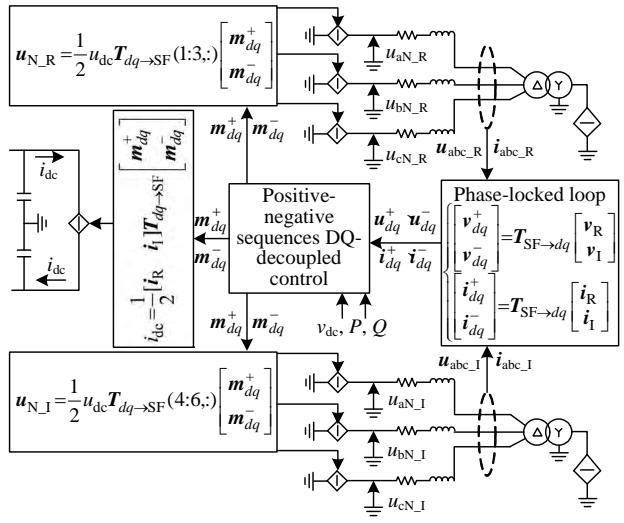  
Fig. 1 Multi-scale transient model of VSC and its controller

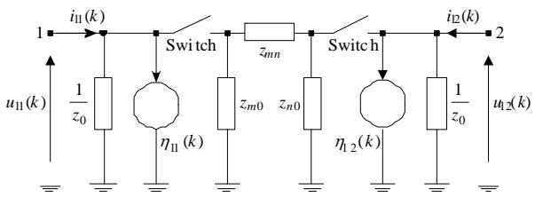  
Fig. 2 Multi-scale transient model of DC transmission line multi-scale model of DC line.

By adjusting simulation parameters of time-step sizes, diverse transients with multiple time-scales and in different network-positions are simulated within the same study. The simulation results show that high-frequency transients caused by single-phase to ground fault can be simulated accurately as compared with EMT results as shown in Fig. 3. As shown in Fig. 4, the multi-scale model provides the envelopes of transient currents through ac grid-side VSC at time-step sizes on the order of milliseconds, reducing the computational cost significantly. Moreover, the flexibility of simulating hybrid electromagnetic and mechanical transients in AC/DC systems is enhanced.

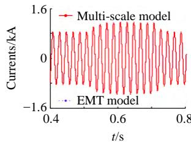  
(a) Currents during faults

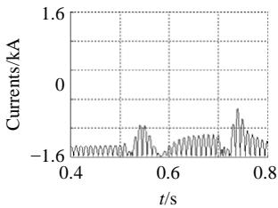  
(b) Errors of current curves

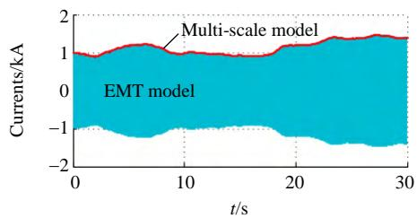  
Fig. 3 Comparison of EMT and proposed model results   
Fig. 4 Comparison of currents under wind fluctuations