Received January 13, 2022, accepted January 24, 2022, date of publication January 27, 2022, date of current version February 11, 2022.

Digital Object Identifier 10.1109/ACCESS.2022.3146880

# Implementation of Modal Domain Transmission Line Models in the ATP Software

JAIMIS SAJID LEON COLQUI 1, LUIS CARLOS TIMANÁ ERASO2, PABLO TORREZ CABALLERO 1,3, JOSÉ PISSOLATO FILHO1, (Senior Member, IEEE), AND SÉRGIO KUROKAW A 4, (Member, IEEE)

1School of Electrical and Computer Engineering, State University of Campinas—UNICAMP, Campinas 13083-852, Brazil   
2Department of Electronic and Telecommunications Engineering, Catholic University of Colombia, Bogotá 110231, Colombia   
3Centro de Pesquisa e Desenvolvimento em Telecomunicações—CPQD, Campinas 13086-902, Brazil   
4Department of Electrical Engineering, São Paulo State University—UNESP, Ilha Solteira 15385-000, Brazil

Corresponding author: Jaimis Sajid Leon Colqui (jaimis.leon@unesp.br)

This work was supported in part by the Coordenação de Aperfeiçoamento de Pessoal de Nível Superior—Brazil (CAPES)—Finance Code 001, in part by the São Paulo Research Foundation (FAPESP) under Grant 2021/06157-5, and in part by the Centro de Pesquisa e Desenvolvimento em Telecomunicações (CPQD).

ABSTRACT Electromagnetic Transients Program make extensive use of transmission line models for the simulation of electromagnetic transients. This paper proposes a circuit representation of the modal transformation, more specifically Clarke’s matrix. The arrangement of ideal transformers we propose allows modal transformation to be directly implemented in software such as Alternative Transient Program - Electromagnetic Transients Program. We combined the proposed circuit with single-phase transmission line models that consider frequency independent and frequency dependent parameters to represent transposed three-phase transmission lines. The main advantage of the proposed approach is that it allows the implementation of new transmission line models without depending on models provided in applications. To show this capability, we included the frequency dependence of soil parameters in the simulations. Results show that the proposed model is accurate both in the frequency domain and in the time domain.

INDEX TERMS Transmission line model, Clarke transformation matrix, electromagnetic transients, EMT-type programs.

# I. INTRODUCTION

Transmission line (TL) modeling had been widely studied in the last decades for fault detection [1], analysis of electromagnetic transients in the frequency domain [2], fault prevention [3], medicine [4], and other applications. Several TL models had been developed and implemented in software for the simulation of electromagnetic transients such as Alternative Transient Program - Electromagnetic Transients Program (ATP-EMTP), Power Systems Computer Aided Design (PSCAD), Electromagnetic Transients Program - Restructured Version (EMTP-RV), and others. The ATP-EMTP, the PSCAD, and the EMTP-RV are specialized software for the simulation of transient phenomena of electromagnetic and electromechanical nature in power systems.

The associate editor coordinating the review of this manuscript and approving it for publication was Youngjin Kim

They include specialized libraries containing state-of-theart models that represent power electronics, transmission lines, transformers, mechanical equipment, and many other devices. The user may employ these models to perform time-domain simulations of power system networks. The software usually connects these models in the nodal admittance matrix of the circuit and solves it in the time domain [5].

TL models implemented in the ATP-EMTP software have their phase domain equations embedded in the nodal equations of the entire circuit. These equations implicitly contain the equations of each propagation mode and the modal transformation matrix used to decouple the TL in its modes [5].

One way to represent transposed and non-transposed TLs with vertical symmetry in the ATP software is to independently draw each mode and use an interface to transform voltages and currents from the phase domain to the mode domain [6], [7].

One way to achieve this transformation is using ideal transformers. The polarity and turns ratio of each transformer is associated with the components of the modal transformation matrix. Clarke’s matrix decouples a perfectly transposed TL into its exact modes. The circuit representation of Clarke’s matrix had been previously proposed in [7]. However, in [7], the polarity of one of the transformers is reversed, two phases are switched, and the equations provided do not match the circuit representation. The authors presented the frequency domain representation of modes α, β, and 0 using this model in [8] and applied it to double-circuit and DC lines in [9]. However, in all three papers, no time domain validation of the proposed circuit had been provided.

Power systems are designed to work close to balanced conditions. For this purpose, in practice, transmission lines are usually transposed at substations [10]. Considering that transmission lines are usually transposed, we capitalize on the fact that Clarke’s matrix is real and constant and use it to decompose three-phase transmission lines into their exact modes directly in the simulations. In this paper, we propose to use an arrangement of ideal transformers to decouple transposed three-phase TLs into their exact modes. The turns ratio and polarity of each ideal transformer represent one component of Clarke’s matrix [11]. When combined with single-phase TL models, the proposed approach results in multiconductor TL models that can be implemented in any EMTP-like simulation software. To show results, we combine the proposed approach with the Bergeron model (section VI-B) and the JMarti model (section VI-C) and compare its results against those obtained using their built-in equivalents in the ATPDraw. Furthermore, the single-phase TL model used to represent the modes can be fully customized, allowing the inclusion of customized line parameters. For instance, in section VI-E, we consider the frequency dependence of the soil parameters on the calculation of line parameters and include these customized parameters in the simulations. Results show that the proposed approach is accurate.

Additional advantages of the proposed approach include:

• Voltages and currents can be directly obtained in the frequency domain. Therefore, by using a frequency sweep, we can check if new TL models are correct in the frequency domain.   
• Voltages and currents are simultaneously available in the phase and mode domain, eliminating the need to apply a post-processing transformation stage.   
• There is no coupling between modes. Single-phase TL models are easier to handle and faster to solve.   
• The resulting multiconductor models inherit the benefits of models used to represent the modes. For instance, the combination of the proposed approach with the Folded Line Equivalent [12] results in a multiconductor TL model that works with time steps greater than the propagation time of the TL. Other TL models such as the one presented in [13] can also be combined with the proposed approach.

# II. REPRESENTATION OF A PERFECTLY TRANSPOSED TL IN THE MODE DOMAIN

The multiconductor transmission line theory complies with the Baum-Liu-Tesche equation formalism because it describes voltages and currents based on the observable voltages and currents along the line [14]. For instance, in [15], the Baum-Liu-Tesche equation formalism was included in the CRIPTE (Calcul sur Réseaux des Interactions Perturbatrices en Topologie Electromagnétique/Calculation for Networks of Interference Interactions in Electromagnetic Topology) software. The CRIPTE software performs a frequency analysis of MTLs in the frequency domain in the presence of different types of sources such as voltage sources, current sources, and electromagnetic fields.

The longitudinal impedance matrix and transversal admittance matrix of a transposed TL that has its ground wires embedded using Kron’s reduction [16] are, respectively, given by

$$
\mathbf {Z} = \left[ \begin{array}{l l l} Z _ {p} & Z _ {m} & Z _ {m} \\ Z _ {m} & Z _ {p} & Z _ {m} \\ Z _ {m} & Z _ {m} & Z _ {p} \end{array} \right], \quad \mathbf {Y} = \left[ \begin{array}{l l l} Y _ {p} & Y _ {m} & Y _ {m} \\ Y _ {m} & Y _ {p} & Y _ {m} \\ Y _ {m} & Y _ {m} & Y _ {p} \end{array} \right] \tag {1}
$$

where subscripts p and m represent, respectively, the diagonal and non-diagonal elements of the impedance matrix Z and admittance matrix Y . We use Clarke’s matrix, which is given by

$$
\boldsymbol {T} _ {\text {c l k}} = \left[ \begin{array}{c c c} \frac {2}{\sqrt {6}} & 0 & \frac {1}{\sqrt {3}} \\ - \frac {1}{\sqrt {6}} & \frac {1}{\sqrt {2}} & \frac {1}{\sqrt {3}} \\ - \frac {1}{\sqrt {6}} & - \frac {1}{\sqrt {2}} & \frac {1}{\sqrt {3}} \end{array} \right], \tag {2}
$$

to decouple Z and Y into its modes as follows

$$
\boldsymbol {Z} _ {\boldsymbol {m}} = \boldsymbol {T} _ {\text {c l k}} ^ {T} \boldsymbol {Z} \boldsymbol {T} _ {\text {c l k}} = \left[ \begin{array}{l l l} Z _ {\alpha} & 0 & 0 \\ 0 & Z _ {\beta} & 0 \\ 0 & 0 & Z _ {0} \end{array} \right] \tag {3a}
$$

$$
\boldsymbol {Y} _ {\boldsymbol {m}} = \boldsymbol {T} _ {\text {c l k}} ^ {- 1} \boldsymbol {Y} \boldsymbol {T} _ {\text {c l k}} ^ {- T} = \left[ \begin{array}{l l l} Y _ {\alpha} & 0 & 0 \\ 0 & Y _ {\beta} & 0 \\ 0 & 0 & Y _ {0} \end{array} \right] \tag {3b}
$$

where

$$
Z _ {\alpha} = Z _ {p} - Z _ {m} \quad Y _ {\alpha} = Y _ {p} - Y _ {m} \tag {4a}
$$

$$
Z _ {\beta} = Z _ {p} - Z _ {m}, \quad Y _ {\beta} = Y _ {p} - Y _ {m} \tag {4b}
$$

$$
Z _ {0} = Z _ {p} + 2 Z _ {m}, \quad Y _ {0} = Y _ {p} + 2 Y _ {m}. \tag {4c}
$$

Clarke’s matrix is frequency independent and decouples perfectly transposed lines into its exact modes, irrespective of its geometry, as shown in Fig. 1 [11]. Furthermore, in transposed lines, modes α and β have the same impedance and admittance.

# III. REPRESENTATION OF ELECTRICAL CIRCUITS IN THE ATP SOFTWARE

The ATP-EMTP software (version 7.0p7) discretizes ordinary differential equations (ODE) into a set of algebraic

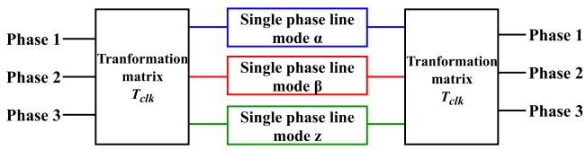  
FIGURE 1. Representation of a three-phase transmission line in the mode domain.

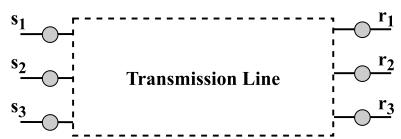  
(a)

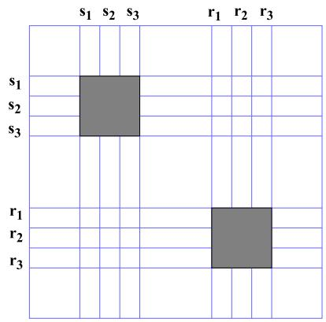  
(b)   
FIGURE 2. Addition of a TL model to the nodal admittance matrix: (a) Three-phase TL model, and (b) their place in the nodal admittance matrix G.

equations (known as network nodal equations) that are given by

$$
G v = i - I \tag {5}
$$

where G is the nodal admittance matrix, v is the vector containing voltages at each node, i is the vector containing currents at each node at a given time step, and I is the vector containing historic currents at each node. Nodal admittance matrix G is symmetrical and remains constant during the entire simulation because time steps are constant.

TL models represented by electric circuits (e.g. [12], [13], [17]) are described by their ODEs. These ODEs relate voltages and currents at the line terminals as shown in Fig. 2a. For instance, the ODEs that describe the lumped parameter model (LPM) are calculated from the longitudinal resistance, inductance, and capacitance of the TL. The ATP-EMTP discretizes these ODEs and embeds them in the nodal admittance matrix as illustrated in Fig. 2b. The discretized equations that describe the JMarti model and the Bergeron model are written in the phase domain. However, they implicitly contain information about the propagation modes α, β, 0, and its modal transformation matrices.

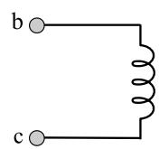

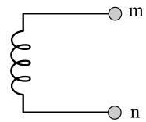

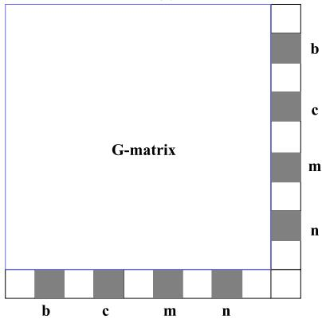  
  
  
FIGURE 3. Addition of an ideal two-coil transformer to the nodal admittance matrix (a) ideal two-coil transformer, and (b) their place in the nodal admittance matrix G.

The addition of a two-coil ideal transformer to the model increases the size of the nodal admittance matrix by 1 as shown in Fig. 3b.

# IV. REPRESENTATION OF THE MODAL TRANSFORMATION MATRIX WITH IDEAL TRANSFORMERS

Clarke’s transformation computes mode voltages and currents as a linear combination of phase voltages and currents. Because this transformation is lossless, we represent Clarke’s matrix by an arrangement of ideal transformers. Due to its nature, the proposed arrangement of ideal transformers can be implemented in any circuit simulation software such as the ATP-EMTP. Including losses to each transformer would detriment the accuracy of the transformation and add unnecessary complexity to the overall model. One advantage of using ideal transformers is that they can be represented using resistors in the nodal admittance matrix. Therefore they do not add discontinous nodes and can be embedded in the addmitance matrix of Fig. 2 [5].

Clarke’s matrix relates voltages and currents in the phase domain and in the mode domain. We represent each of the components of Clarke’s matrix using an ideal two-coil transformer. The signs of the components of Clarke’s matrix determine the polarity of each transformer. Since Clarke’s matrix contains 8 non-zero elements, then voltages and currents are related by 8 transformers.

Fig. 4 shows the arrangement of transformers that represents Clarke’s matrix. Primary winding are connected in series, whereas secondary windings are connected in parallel.

In Fig. 4, phase voltages and mode currents are given by

$$
v _ {a} = v _ {a 1} + v _ {a 3}, \quad i _ {\alpha} = i _ {\alpha 1} + i _ {\alpha 2} + i _ {\alpha 3} \tag {6a}
$$

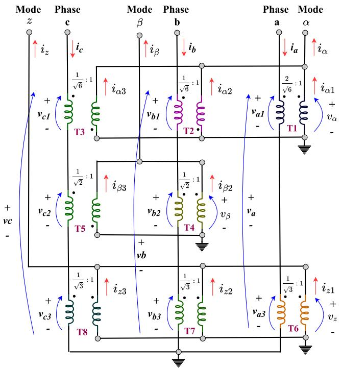  
FIGURE 4. Representation of Clarke’s matrix by 8 ideal two-coil transformers.

$$
v _ {b} = v _ {b 1} + v _ {b 2} + v _ {b 3}, \quad i _ {\beta} = i _ {\beta 2} + i _ {\beta 3} \tag {6b}
$$

$$
v _ {z} = v _ {c 1} + v _ {c 2} + v _ {c 3}, \quad i _ {z} = i _ {z 1} + i _ {z 2} + i _ {z 3}. \tag {6c}
$$

Furthermore, in matrix form, voltages and currents at line terminals of Fig. 4 can be grouped as follows

$$
\boldsymbol {v} = \left[ \begin{array}{l} v _ {a} \\ v _ {b} \\ v _ {c} \end{array} \right]; \quad \boldsymbol {i} = \left[ \begin{array}{l} i _ {a} \\ i _ {b} \\ i _ {c} \end{array} \right]; \boldsymbol {v} _ {\alpha \beta z} = \left[ \begin{array}{l} v _ {\alpha} \\ v _ {\beta} \\ v _ {z} \end{array} \right]; \boldsymbol {i} _ {\alpha \beta z} = \left[ \begin{array}{l} i _ {\alpha} \\ i _ {\beta} \\ i _ {z} \end{array} \right] \tag {7}
$$

The turns-ratio of each of the transformers of:

• phase a: T1 and T6 in Fig. 4, are respectively√ $2 / \sqrt { 6 }$ : 1 and $1 / { \sqrt { 3 } } : 1$   
• phase b: T2, T4, and T7 in Fig. 4, are respectively $1 / \sqrt { 6 }$ : 1, $1 / { \sqrt { 2 } } : 1$ , and $1 / \sqrt { 3 }$ : 1   
• phase c: T3, T5, and T8 in Fig. 4, are respectively√ √ $1 / \sqrt { 6 }$ : 1, $1 / { \sqrt { 2 } } : 1$ , and $1 / { \sqrt { 3 } } : 1$

In matrix form, currents and voltages in the primary and secondary windings of each transformer in Fig. 4 are related by

$$
\boldsymbol {v} = \boldsymbol {T} _ {\text {c l k}} \boldsymbol {v} _ {\alpha \beta z} \quad \text {a n d} \quad \boldsymbol {i} _ {\alpha \beta z} = \boldsymbol {T} _ {\text {c l k}} ^ {- 1} \boldsymbol {i} \tag {8}
$$

Eq. (8) shows that the arrangement of transformers of Fig. 4 transforms voltages and currents from the phase domain to the mode domain and vice-versa.

# V. ATPDRAW AND ATP-EMTP

The ATP-EMTP and its GUI, the ATPDraw, model TLs using the lumped parameter model (LPM), the Bergeron model, and the JMarti model [18]. A full description of these built-in models can be found at [19]. The proposed approach

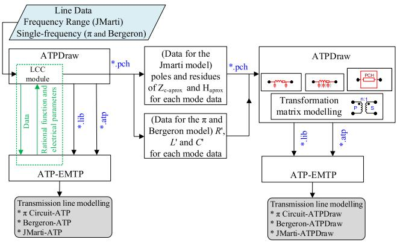  
FIGURE 5. Flowchart showing the testing methodology.

transforms voltages and currents from the phase domain to the mode domain using circuit elements. To show results, we combine the Bergeron model and the JMarti model with the proposed arrangement of Fig. 4 to simulate three-phase TLs. The responses of each TL model were compared to the models available in the ATP-EMTP [18], as shown in the flowchart presented in Fig. 5.

In Fig. 5, the Line/Cable Constants (LCC) module of the ATPDraw receives information from the user about the geometry and physical properties of an overhead TL. ATP’s LCC module computes the per-unit-length parameters of a TL from its cross-section, conductor parameters, soil resistivity, and operation frequency. To perform these calculations, it represents the soil as a uniform medium and approximates Carson’s correction term by a power series expansion. The LINE CONSTANTS routine of the ATP-EMTP processes the information in the .lib file and returns the line parameters in a pch file [18]. For the Bergeron model, the LINE CONSTANTS routine calculates the per-unit-length resistance, inductance, and capacitance of the TL for a given frequency. For the JMarti model, the LINE CONSTANTS routine fits the transfer matrix H and characteristic impedance $\mathbf { Z } _ { c }$ of the TL for the specified range of frequencies.

# VI. RESULTS

To show results, we combined the proposed approach with the single-phase Bergeron line model and single-phase JMarti model. We used these models to represent the ideally transposed tree-phase TL of Fig. 6 and compared their outputs to ATP’s built-in Bergeron model and JMarti model, respectively. The results presented in this section are organized as shown in Table 1.

To show results, we represented the ideally transposed tree-phase TL of Fig. 6 by ATP’s Bergeron model and JMarti model. We compared each of these representations with the proposed approach

# A. THREE-PHASE TRANSMISSION LINE

We used the ATP-EMTP to calculate the line parameters of the ideally transposed tree-phase TL of Fig. 6. Then, we used

TABLE 1. Organization of results.   

<table><tr><td>TL Model</td><td>Description</td><td>Figure</td></tr><tr><td rowspan="7">Bergeron</td><td>ATP&#x27;s Bergeron line model</td><td>Fig. 9a</td></tr><tr><td>Implementation of the PM</td><td>Fig. 9b</td></tr><tr><td>Voltage at the receiving terminal-phase 1</td><td>Fig. 10a</td></tr><tr><td>Voltage at the receiving terminal-phases 2&amp;3</td><td>Fig. 10b</td></tr><tr><td>Voltage at the receiving terminal-modes αβ0</td><td>Fig. 11</td></tr><tr><td>Input impedance-phase 1</td><td>Fig. 12</td></tr><tr><td>Input impedance-modes α and 0</td><td>Fig. 13</td></tr><tr><td rowspan="7">JMarti</td><td>ATP&#x27;s JMarti line model</td><td>Fig. 14a</td></tr><tr><td>Implementation of the PM</td><td>Fig. 14b</td></tr><tr><td>Phase 1 - voltages</td><td>Fig. 15a</td></tr><tr><td>Phases 2&amp;3 - voltages</td><td>Fig. 15b</td></tr><tr><td>modes α, β, 0 - voltages</td><td>Fig. 16</td></tr><tr><td>Input impedance of phase 1</td><td>Fig. 17</td></tr><tr><td>Input impedances of modes α and 0</td><td>Fig. 18</td></tr></table>

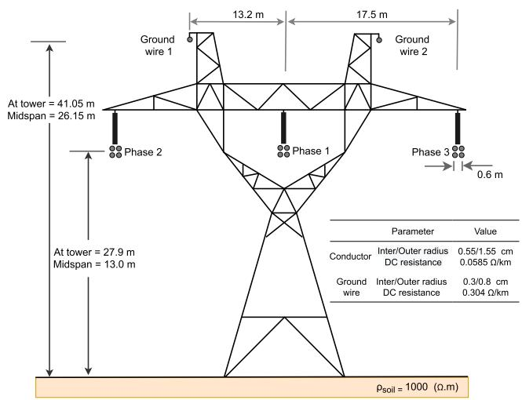  
FIGURE 6. Ideally transposed three-phase transmission line geometry [18].

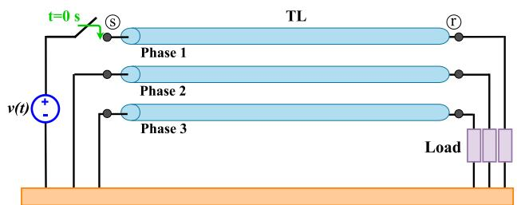  
FIGURE 7. Time domain layout.

the proposed approach to transform voltages and currents from the phase domain to the mode domain and vice-versa. Each independent mode was represented by the Bergeron model and the JMarti model. We compared the voltages and currents obtained from these models to the models available in the EMTP-ATP.

In the time domain, we connected one of the line terminals to a balanced load of 3 k so that the TL reaches steady-state conditions in one cycle (16ms). At the other terminal, we connected one phase to a 1 p.u. DC voltage source and short-circuited the other 2 phases as shown in Fig. 7.

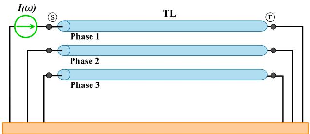  
FIGURE 8. Frequency domain layout.

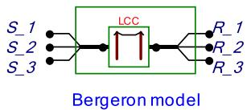  
(a)

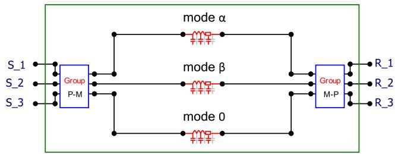  
(b)   
FIGURE 9. Three-phase transmission line model: (a) ATP’s Bergeron line model, and (b) the proposed approach.

In the frequency domain, we connected one terminal of phase 1 to an AC current source and short-circuited all other line terminals, as shown in Fig. 8. To show results, we used a frequency sweep to calculate the line’s input impedance at the terminal where the AC source is connected.

# B. THE BERGERON MODEL

In Fig. 9, we show two line representations based on the Bergeron model:

• ATP - Fig. 9a shows the ATP-EMTP three-phase TL model based on the Bergeron model   
• Proposed model - Fig. 9b shows the proposed interface that transforms voltages and currents from the phase domain to the mode domain (section IV) at each of the line terminals. Each of the line modes is independently represented.

# 1) TIME DOMAIN ANALYSIS

We exhibit in Fig. 10 the voltages at the receiving end of the TL of Fig. 6 when its terminals are connected as shown in Fig. 7. In Fig. 10, voltages were simulated using the proposed model (PM) and the ATP’s Bergeron line model (ATP). The blue dashed curve portrays the voltages obtained by the PM, whereas the red continuous curve portrays the voltages obtained by the ATP.

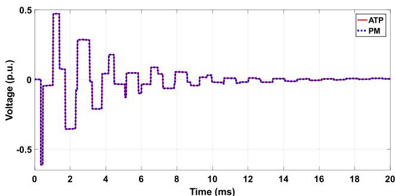

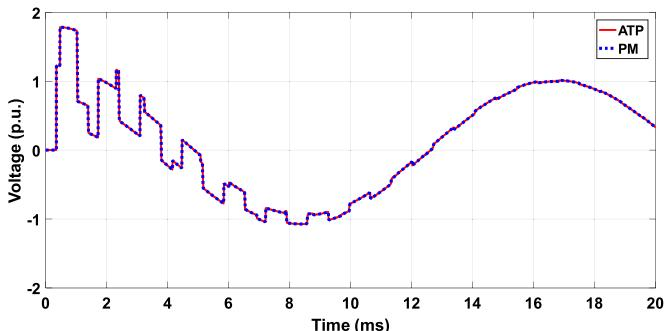  
(a)   
(b)

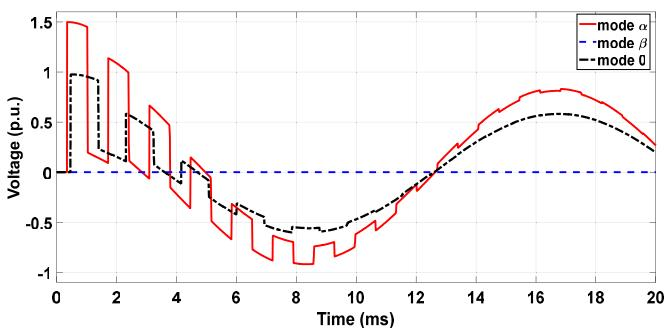  
FIGURE 10. Voltages at the receiving end: (a) Phase 1, (b) Phases 2 and 3.   
FIGURE 11. Voltages at the receiving end of each mode, obtained by combining the proposed approach with the Bergeron model.

Fig. 10 shows that the proposed arrangement of ideal transformers provides an accurate phase-mode transformation using circuit elements. The main advantage of the proposed approach is that each mode can be individually analyzed. For instance, in Fig. 11, we show the voltages at the receiving end of each mode before they are transformed back to the phase domain. Note that mode $\beta$ has no voltage because the voltage at the sending end of mode 0 is zero, whereas the voltages√ √ at the sending ends of mode α and $\beta$ are $2 / \sqrt { 6 }$ and $1 / \sqrt { 3 }$ , respectively.

# 2) FREQUENCY DOMAIN ANALYSIS

We simulated the TL of Fig. 6 when its terminals are connected as shown in Fig. 8. We used the frequency sweep function of the ATP-EMTP to obtain the input impedance of phase 1 (shown in Fig. 12) when the TL is represented by the proposed model (PM) and the ATP’s Bergeron line model (ATP).

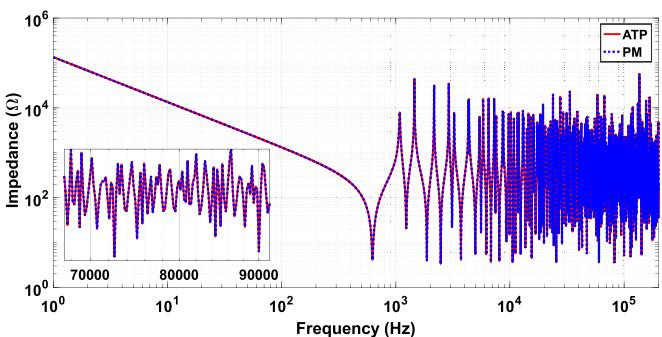  
(a)

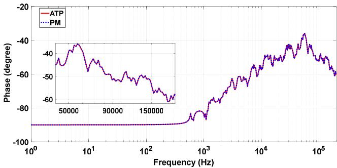  
  
FIGURE 12. Input impedance of phase 1 (a) magnitude and (b) phase.

In the frequency domain, Fig. 12 shows that the proposed arrangement of ideal transformers is accurate in all the power frequency ranges. As stated before, one advantage of the proposed approach is that each mode can be individually analyzed. To show this, in Fig. 13 we show the input impedance of modes α and 0 measured at the sending end of each mode.

In general, the arrangement of ideal transformers proposed in this paper is accurate when used in combination with frequency independent TL models.

# C. THE JMarti MODEL

Similar to the results shown in the previous subsection, we decoupled the TL of Fig. 6 using the proposed arrangement of transformers and simulated each mode using the JMarti model of the ATP, both shown in Fig. 14.

The JMarti model had been widely used for the simulation of electromagnetic transients in TLs [20]. This distributed parameter model considers the frequency dependence of line parameters. The JMarti model available in the ATP-EMTP uses a real and constant transformation matrix to solve TL equations in the mode domain. It uses Bode’s asymptotic method to approximate the characteristic impedance and propagation function of the TL as a sum of minimum phase rational functions. One issue with this method is that it incurs errors because it generates numerous poles and zeros [21], [22].

Results are presented in the time domain and frequency domain.

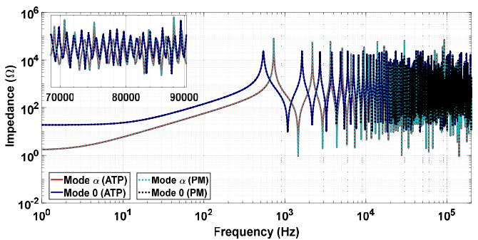  
(a)

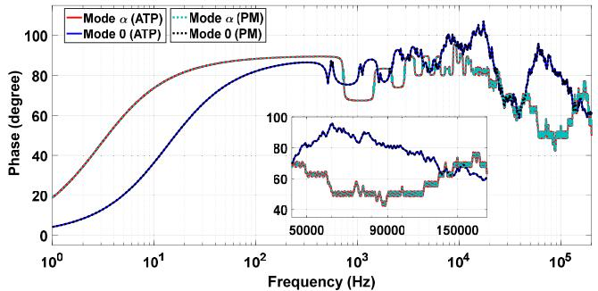  
(b)

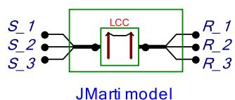  
FIGURE 13. Input impedance of modes α and 0: (a) magnitude and (b) phase.   
(a)

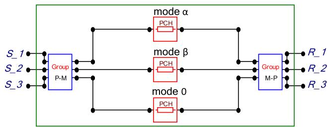  
(b)   
FIGURE 14. Three-phase transmission line model: (a) ATP’s JMarti model, and (b) proposed approach.

# 1) TIME DOMAIN ANALYSIS

Fig. 15 shows the voltages at the receiving end of the TL of Fig. 6 when its terminals are connected as shown in Fig. 7. In Fig. 15, voltage curves were obtained by the proposed model (PM) and ATP’s JMarti model (ATP). The PM uses the proposed arrangement of ideal transformers to transform voltages and currents from the frequency domain to the time domain. Then, each mode is independently solved. Note that the curves are smoother than the ones presented in Fig. 10 because the frequency dependence of line parameters are taken into account.

One advantage of the proposed arrangement of ideal transformers is that modes are independent from each other.

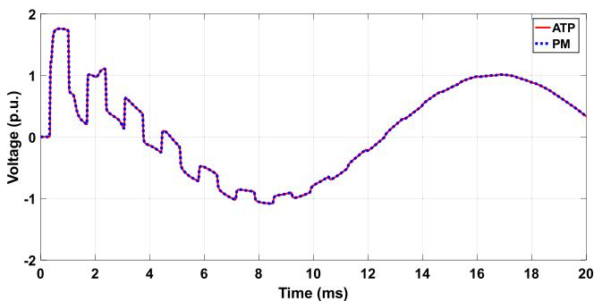

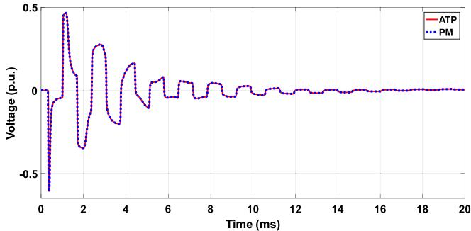  
(a)   
(b)

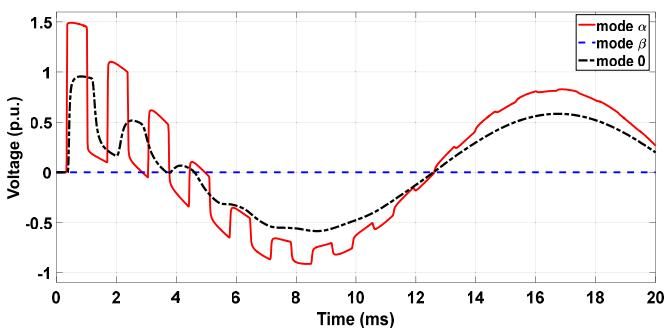  
FIGURE 15. Voltage curves at the receiving terminals: (a) Phase 1, (b) Phases 2 and 3.   
FIGURE 16. Voltages at the receiving end of each mode, obtained by combining the proposed approach with the JMarti model.

To show this, we present in Fig. 16 the voltages at the receiving terminal of the TL of Fig. 6 in the mode domain.

# 2) FREQUENCY DOMAIN ANALYSIS

We used the frequency sweep function of the ATP to simulate the TL of Fig. 6 when its terminals are connected as shown in Fig. 8. Fig. 17 shows the input impedance measured from phase 1 obtained by the proposed model (PM) and the ATP’s JMarti model (ATP) in the frequency domain. Both curves overlap.

We also show in Fig. 18 the input impedance of modes α and 0 at the sending ends of the TL.

# D. ERROR

Sections VI-B and VI-C show the results obtained using ATP’s built-in implementations of the Bergeron line model and the JMarti model (labeled as ATP) to those obtained using the proposed approach (labeled as PM). We measure

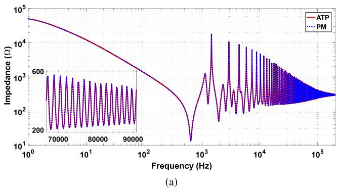

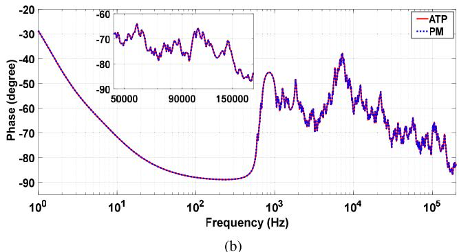  
FIGURE 17. Input impedance at the sending end of phase 1: (a) magnitude and (b) phase.

TABLE 2. NRMSD of the voltage curves obtained with the PM with respect to the voltage curves obtained with the ATP.   

<table><tr><td>TL Model</td><td>Phase(s)</td><td>NRMSD</td></tr><tr><td rowspan="2">Bergeron</td><td>1 (Fig. 10a)</td><td>0.002</td></tr><tr><td>2 and 3 (Fig. 10b)</td><td>0.003</td></tr><tr><td rowspan="2">JMarti</td><td>1 (Fig. 15a)</td><td>0.003</td></tr><tr><td>2 and 3 (Fig. 15b)</td><td>0.005</td></tr></table>

TABLE 3. NRMSD of the input impedances obtained with the PM with respect to the input impedances obtained with the ATP.   

<table><tr><td>TL Model</td><td>Mode(s)</td><td>NRMSD</td></tr><tr><td rowspan="2">Bergeron</td><td>α and β (Fig. 13)</td><td>0.003</td></tr><tr><td>0 (Fig. 13)</td><td>0.005</td></tr><tr><td rowspan="2">JMarti</td><td>α and β (Fig. 18)</td><td>0.003</td></tr><tr><td>0 (Fig. 18)</td><td>0.002</td></tr></table>

the error of the proposed approach using the Normalized Root-Mean-Square Deviation (NRMSD), which is given by

$$
\mathrm {N R M S D} = \frac {\sqrt {\frac {1}{N} \sum_ {i = 1} ^ {N} \left(y _ {P M , i} - y _ {A T P , i}\right) ^ {2}}}{\max  \left\{y _ {A T P} \right\} - \min  \left\{y _ {A T P} \right\}} \tag {9}
$$

where N is the number of points of y.

Table 2 shows the NRMSD of the phase voltages at the receiving end of the TL of Figs 10 and 15.

Table 3 shows the NRMSD of the input impedances of each mode of Figs 13 and 18. We measure the NRMSD of Figs. 13 and 18 instead of Figs. 12 and 17 because Figs. 13 and 18 contain information about all modes, whereas Figs. 12 and 17 only contain information about phase 1.

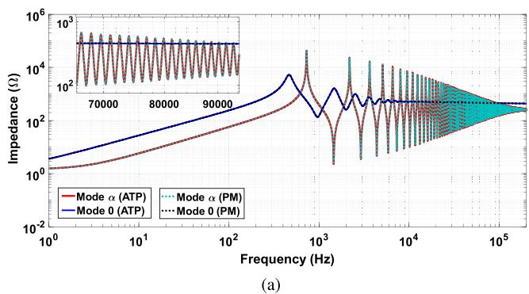

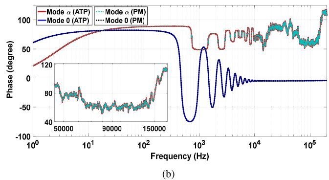  
FIGURE 18. Input impedance of modes α and 0: (a) magnitude and (b) phase.

# E. CUSTOMIZATION OF THE TL MODEL AND TL PARAMETERS

The main advantage of the proposed arrangement of transformers is that it gives the user complete control over the TL parameters and TL models used in the simulations. As a result, new TL can be implemented without depending on built-in models already available in software such as Simulink, PSCAD, ATP-EMTP. This is because the proposed approach can be implemented in any circuit solver using basic circuit elements. For instance, we combine the extended JMarti model [21], [22] and the proposed arrangement of transformers to simulate a TL whose parameters consider the frequency dependence of the soil resistivity and permittivity. We compare the results obtained to those obtained using built-in TL parameters calculation tools.

The LCC module of the ATP-EMTP uses Carson’s equations to estimate the TL parameters from the data entered by the user [18]. Since the GUI used to receive the data from the user does not receive other arguments or equations, the TL parameters can only be calculated assuming a relative permittivity of the soil of one (Carson’s equations). To overcome this limitation, we adapt the extended JMarti model proposed in [21], [22]. Here, we include the frequency dependence of the line parameters using Sunde’s equations and decouple the TL using Clarke’s matrix [23]. Then, the vector fitting routine [24] fits the characteristic impedance and propagation function of each mode. Finally, we write the poles, residues, and minimum delays of each mode into a pch file. The ATP-EMTP reads this pch file and runs its built-in JMarti model using these parameters.

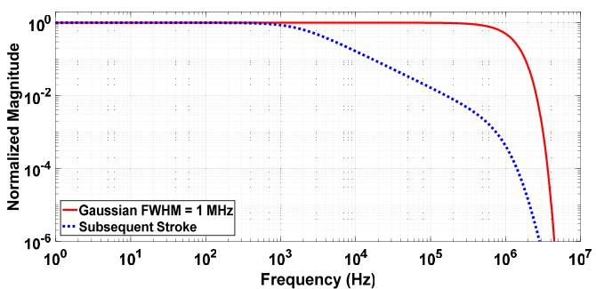

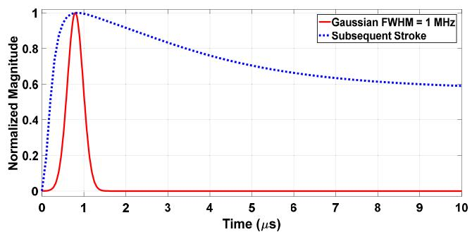  
(@)   
(b)

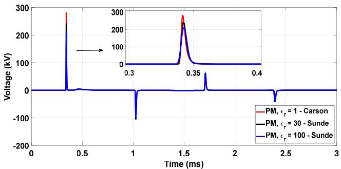  
FIGURE 19. 1MHz gaussian waveform vs Subsequent stroke: (a) frequency domain and (b) time domain.   
(a)

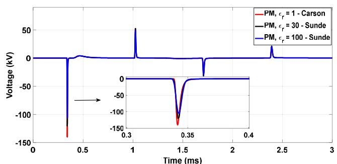  
(b)   
FIGURE 20. Transient voltages at the receiving terminal: (a) Phase 1, (b) phases 2 and 3.

We vary the permittivity of the soil using Sunde’s equations, which computes the longitudinal impedance of the line as follows [21], [23]

$$
Z _ {\mathrm {g} _ {\mathrm {i j}}} = j \frac {\omega \mu_ {0}}{\pi} \int_ {0} ^ {\infty} \frac {e ^ {- (h _ {\mathrm {i}} + h _ {\mathrm {j}}) \lambda}}{\sqrt {\lambda^ {2} + \gamma_ {\mathrm {g}} ^ {2}} + \lambda} \cos \left(r _ {\mathrm {i j}} \lambda\right) d \lambda \tag {10}
$$

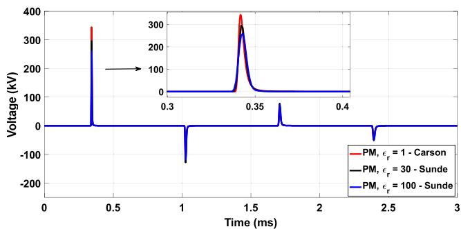  
(a)

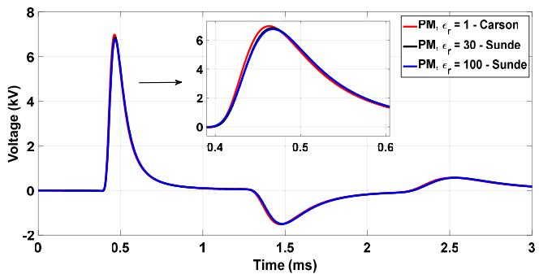  
  
FIGURE 21. Transient voltage simulated using the extended JMarti line model: (a) mode α and (b) mode 0.

where the propagation constant of the soil $\begin{array} { r l } { \gamma _ { \mathrm { g } } } & { { } = } \end{array}$ $\sqrt { j \omega \mu _ { 0 } ( \sigma _ { \mathrm { g } } ( \omega ) + j \omega \varepsilon _ { \mathrm { r } } ( \omega ) \varepsilon _ { 0 } ) }$ .

# 1) TIME DOMAIN ANALYSIS

To illustrate the capabilities of the proposed model, we simulated the TL of Fig. 6 when its terminals are connected as shown in Fig. 7 but with a Gaussian voltage source that has a full width at half maximum (FWHM) of 1MHz connected to phase 1. We chose to use a 1 MHz FWHM Gaussian waveform because it contains components that have higher frequencies than common lightning waveforms such as the Subsequent stroke waveform. To show this, we compare in Fig. 19 the Subsequent stroke waveform to the 1MHz FWHM Gaussian waveform in the frequency domain and time domain.

The impedance of the soil was calculated using [23], [25]:

• Carson’s equations   
• Sunde’s equations, and a relative permittivity of the soil of 30   
• Sunde’s equations, and a relative permittivity of the soil of 100

In general, Sunde’s equations are more accurate than Carson’s equations [21].

Fig. 20 shows the voltage curves at the receiving terminal of the TL for all 3 equations used to calculate the impedance of the soil. Voltage peaks are very important because they are used to determine the number of insulators and protection devices the TL will have. Voltage peaks simulated using Carson’s equations were up to 35% higher than the voltage peaks simulated using Sunde’s equations. Fig. 20 also shows

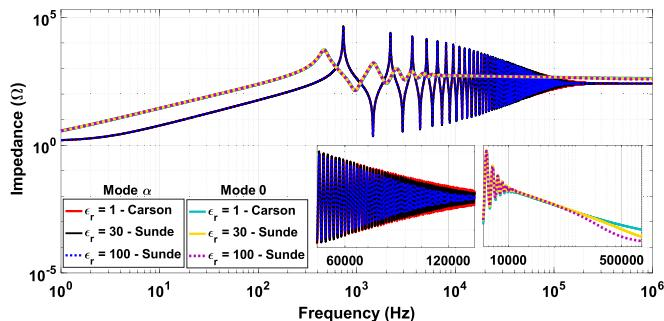

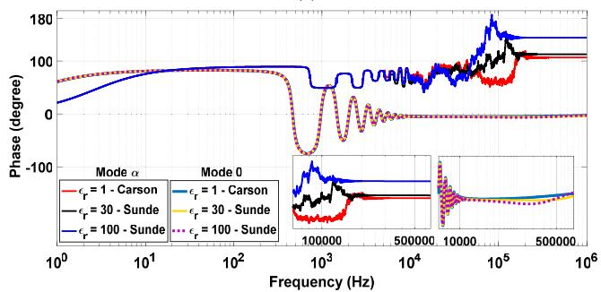  
(a)   
(b)   
FIGURE 22. Input impedance of modes α and 0: (a) magnitude and (b) phase.

that soils with lower relative permittivity have higher voltage peaks.

Fig. 21 shows the voltage curves at the receiving end of modes α and 0, which can only be obtained using the proposed arrangement of transformers.

# 2) FREQUENCY DOMAIN ANALYSIS

Fig. 22 shows the input impedance of modes α and 0 in the frequency domain. The input impedance of each mode was calculated using Carson’s equations, and Sunde’s equations with $\varepsilon _ { \mathrm { r } } = 3 0$ and $\varepsilon _ { \mathrm { r } } = 1 0 0$ . For both modes, Fig. 22 shows that Carson’s equations have a higher input impedance at high frequencies.

# VII. CONCLUSION

This paper proposes a circuit representation of Clarke’s matrix. The proposed interface transforms voltages and currents from the mode domain to the phase domain and vice-versa using ideal transformers. The proposed circuit can be implemented in most circuit-solving software such as the ATP-EMTP.

The proposed representation decomposes a perfectly transposed three-phase TL into its exact modes using ideal transformers, making it easy to implement in EMTP-like software. Numerical methods based on integral convolutions or fitting techniques are commonly used to represent each mode [12], [17], [20]. Our approach capitalizes on the fact that Clarke’s matrix is real and constant and associates those values to the turns ratio of each of the ideal transformers. Combined with single-phase TL models, the proposed model

accurately represents transposed TLs and gives good results for untransposed TLs with vertical symmetry. We combined the proposed approach with frequency independent and frequency-dependent TL models and compared their outputs to their built-in equivalents in the ATPDraw. Results show that the proposed approach is accurate.

The proposed model allows the implementation of new TL models in software such as Simulink, PSCAD, ATP-EMTP, etc. As a result, it gives the user complete control over the calculation of line parameters and the representation of the TL. For instance, section VI-E shows how to customize the calculation of line parameters to include the frequency dependence of the soil parameters. Voltage and currents are simultaneously available in the mode and phase domain, without requiring any post-processing transformation stage. Another advantage of the proposed approach is that it eliminates the coupling between phases directly in the time domain, making simulations simpler.

# REFERENCES

[1] A. Saber, H. H. Zeineldin, T. H. M. El-Fouly, and A. Al-Durra, ‘‘Time-domain fault location algorithm for double-circuit transmission lines connected to large scale wind farms,’’ IEEE Access, vol. 9, pp. 11393–11404, 2021.   
[2] K. K. Challa and G. Gurrala, ‘‘Development of an experimental scaleddown frequency dependent transmission line model,’’ IEEE Access, vol. 9, pp. 64639–64652, 2021.   
[3] B. Yang, H. Yu, G. Li, A. Hu, and H. Li, ‘‘Energy storage system control strategy for restraining overvoltage caused by switching non-load power transmission lines,’’ IEEE Access, vol. 9, pp. 60215–60222, 2021.   
[4] M. B. Lodi, N. Curreli, A. Fanti, C. Cuccu, D. Pani, A. Sanginario, A. Spanu, P. M. Ros, M. Crepaldi, D. Demarchi, and G. Mazzarella, ‘‘A periodic transmission line model for body channel communication,’’ IEEE Access, vol. 8, pp. 160099–160115, 2020.   
[5] H. W. Dommel, EMTP Theory Book. Vancouver, BC, Canada: Microtran Power System Analysis Corporation, 1996.   
[6] M. C. Tavares, J. Pissolato, and C. M. Portela, ‘‘New mode domain multiphase transmission line model-transformation matrix modeling,’’ in Proc. Int. Conf. Power Syst. Technol., vol. 2, Aug. 1998, pp. 855–859.   
[7] M. C. Tavares, J. Pissolato, and C. M. Portela, ‘‘New mode domain multiphase transmission line model applied to transient studies,’’ in Proc. Int. Conf. Power Syst. Technol., vol. 2, Aug. 1998, pp. 865–869.   
[8] M. C. Tavares, J. Pissolato, and C. M. Portela, ‘‘New mode domain multiphase transmission line model-Clarke transformation evaluation,’’ in Proc. Int. Conf. Power Syst. Technol., vol. 2, Aug. 1998, pp. 860–864.   
[9] M. C. Tavares, J. Pissolato, and C. M. Portela, ‘‘New multiphase transmission line model,’’ in Proc. 8th Int. Conf. Harmon. Qual. Power, vol. 1, 1998, pp. 489–494.   
[10] M. Ghiafeh Davoudi, A. Bashian, and J. Ebadi, ‘‘Effects of unsymmetrical power transmission system on the voltage balance and power flow capacity of the lines,’’ in Proc. 11th Int. Conf. Environ. Electr. Eng., May 2012, pp. 860–863.   
[11] E. Clarke, Circuit Analysis of AC Power Systems; Symmetrical and Related Components, vol. 1. Hoboken, NJ, USA: Wiley, 1943.   
[12] B. Gustavsen and A. Semlyen, ‘‘Admittance-based modeling of transmission lines by a folded line equivalent,’’ IEEE Trans. Power Del., vol. 24, no. 1, pp. 231–239, Jan. 2009.   
[13] P. Torrez Caballero, E. C. Marques Costa, and S. Kurokawa, ‘‘Frequencydependent line model in the time domain for simulation of fast and impulsive transients,’’ Int. J. Electr. Power Energy Syst., vol. 80, pp. 179–189, Sep. 2016.   
[14] C. E. Baum, T. K. Liu, and F. M. Tesche, ‘‘On the analysis of general multiconductor transmission-line networks,’’ Tech. Rep., 1978, pp. 467–547. [Online]. Available: http://ace.unm.edu/summa/notes/In/0350.pdf   
[15] J. P. Parmantier, ‘‘Numerical coupling models for complex systems and results,’’ IEEE Trans. Electromagn. Compat., vol. 46, no. 3, pp. 359–367, Aug. 2004.

[16] G. Kron, Tensor Analysis of Networks. New York, NY, USA: Wiley, 1939.   
[17] S. Kurokawa, F. N. R. Yamanaka, A. J. Prado, and J. Pissolato, ‘‘Inclusion of the frequency effect in the lumped parameters transmission line model: State space formulation,’’ Electr. Power Syst. Res., vol. 79, no. 7, pp. 1155–1163, Jul. 2009.   
[18] (2019). The ATPDraw Simulation Software (2019), Version 7.0. Accessed: Sep. 30, 2010. [Online]. Available: https://www.atpdraw.net/   
[19] Lines/Cables. Accessed: Jan. 11, 2022. [Online]. Available: https://www.atpdraw.net/help7/lines_cables.html   
[20] J. R. Marti, ‘‘Accurate modelling of frequency-dependent transmission lines in electromagnetic transient simulations,’’ IEEE Trans. Power App. Syst., vol. PAS-101, no. 1, pp. 147–157, Jan. 1982.   
[21] A. De Conti and M. P. S. Emídio, ‘‘Extension of a modal-domain transmission line model to include frequency-dependent ground parameters,’’ Electric Power Syst. Res., vol. 138, pp. 120–130, Sep. 2016.   
[22] E. S. Bañuelos-Cabral, J. A. Gutiérrez-Robles, J. L. García-Sánchez, J. Sotelo-Castañón, and V. A. Galván-Sánchez, ‘‘Accuracy enhancement of the JMarti model by using real poles through vector fitting,’’ Electr. Eng., vol. 101, no. 2, pp. 635–646, Jun. 2019.   
[23] E. D. Sunde, Earth Conduction Effects in Transmission Systems. New York, NY, USA: Dover, 1968.   
[24] B. Gustavsen and A. Semlyen, ‘‘Rational approximation of frequency domain responses by vector fitting,’’ IEEE Trans. Power Del., vol. 14, no. 3, pp. 1052–1061, Jul. 1999.   
[25] J. R. Carson, ‘‘Wave propagation in overhead wires with ground return,’’ Bell Syst. Tech. J., vol. 5, no. 4, pp. 539–554, Oct. 1926.

JAIMIS SAJID LEON COLQUI received the B.Sc. degree in electrical engineering from the National University Engineering (UNI), Peru, in 2014, and the M.Sc. and Ph.D. degrees in electrical engineering from São Paulo State University, in 2017 and 2021, respectively. He is currently a Postdoctoral Researcher with the State University of Campinas, Campinas, Brazil. His research interests include transmission tower and line modeling for electromagnetic transient simulations in power systems.

LUIS CARLOS TIMANÁ ERASO received the B.Sc. degree in electrical engineering from the National University of Colombia, Bogotá D.C., Colombia, in 2016, and the M.S. degree in electrical engineering from the University of São Paulo, São Paulo, Brazil, in 2019. His research interests include modeling and analysis of power systems with a focus on renewable integration, distributed energy management, and electromagnetic transients.

PABLO TORREZ CABALLERO received the B.Sc. degree in electromechanical engineering from Bolivian Private University, in 2011, and the M.Sc. and Ph.D. degrees in electrical engineering from São Paulo State University, Ilha Solteira, Brazil, in 2014 and 2018, respectively. He was a Postdoctoral Researcher at São Paulo State University, from 2019 to 2021. He is currently a Postdoctoral Researcher with the State University of Campinas and the Centro de Pesquisa

e Desenvolvimento em telecomunicações–CPQD. His research interests include power systems modeling, time-domain representation of frequency dependent functions, and electromagnetic compatibility.

JOSÉ PISSOLATO FILHO (Senior Member, IEEE) was born in Campinas, São Paulo, Brazil. He received the Ph.D. degree in electrical engineering from Université Paul Sabatier, France, in 1986. Since 1979, he has been with the Department of Energy and Systems, UNICAMP. His research interests include high voltage engineering, electromagnetic transients, and electromagnetic compatibility.

SÉRGIO KUROKAWA (Member, IEEE) received the B.Sc. degree in electrical engineering from São Paulo State University (UNESP), Campus of Ilha Solteira, in 1990, the M.Sc. degree from the Federal University of Uberlandia (UFU), in 1994, and the Ph.D. degree from the University of Campinas (Unicamp), in 2003. Since 1994, he has been working as a Professor and a Researcher at UNESP. His current interests include electromagnetic transients in power systems and transmission line modeling.