# MODELING OF AC MACHINES USING A VOLTAGE-BEHIND-REACTANCE FORMULATION FOR SIMULATION OF ELECTROMAGNETIC TRANSIENTS IN POWER SYSTEMS

by

LIWEI WANG

B. Eng., Hebei University of Technology, 2001

M. Eng., Tianjian University, 2004

A THESIS SUBMITTED IN PARTIAL FULFILMENT OF THE REQUIREMENTS FOR THE DEGREE OF

DOCTOR OF PHILOSOPHY

in

THE FACULTY OF GRADUATE STUDIES

(Electrical and Computer Engineering)

THE UNIVERSITY OF BRITISH COLUMBIA

(Vancouver)

February 2010

# ABSTRACT

Modeling of electrical machines for power system's electromagnetic transient programs (EMTP) has been an active area of research since the late 1970s. Most machine models are based on the $qd$ reference frame. The phase-domain (PD) model was also proposed wherein the direct interface with the external network is achieved at a price of increased the computational cost.

This thesis focuses on improving the numerical efficiency and accuracy of machine models for power systems transient simulation. The modeling approach developed in this thesis is based on the so-called voltage-behind-reactance (VBR) formulation. The new VBR models of synchronous and induction machines are proposed for EMTP-type solution. It is shown that the proposed VBR models significantly improve the overall numerical accuracy and efficiency, compared with the traditional $qd$ and PD models, due to the direct machine-network interface and better-scaled eigenvalues. The proposed implementations of the new models require as little as 240 flops for synchronous and 108 flops for induction machines, per time-step, respectively. This amounts to $3.75\mu s$ and $1.6\mu s$ (per time-step) of the CPU time on a modest personal computer and represents a significant improvement over existing EMTP machine models. Magnetic saturation has been incorporated into the VBR models for EMTP-type solution. Computer studies demonstrate that the proposed saturable VBR model in addition of being very efficient also preserves good numerical accuracy and stability even at very large time step. A new full-order VBR induction machine model is also proposed for state-variable simulation languages, wherein three practical equivalent circuits have been introduced. Computer studies demonstrate that the proposed models achieve a $740\%$ improvement in computational efficiency as compared with the traditional coupled-circuit models used in state-variable simulation languages. Finally, an approximate VBR induction machine model is proposed for the discretized EMTP solution wherein a constant equivalent conductance matrix is achieved. This further improves the efficiency of the machine-network solution since it avoids the re-factorization of the network conductance matrix at every time step. It is envisioned by the author that due to structural and numerical advantages, the proposed VBR models will find wide application in simulation packages and tools widely used in the power industry.

# TABLE OF CONTENTS

Abstract ii

Table of Contents iii

List of Tables vii

List of Figures viii

Acknowledgements xiii

Co-Authorship Statement XV

1 INTRODUCTION 1

1.1 The qd Model 2   
1.2 The Coupled-Circuit Phase-Domain Model 3   
1.3 The Voltage-Behind-Reactance Model 5   
1.4 Summary of Results and Contributions 6   
1.5 Thesis Organization 8   
1.6 References 9

# 2 A VOLTAGE-BEHIND-REACTANCE SYNCHRONOUS MACHINE MODEL FOR THE EMTP-TYPE SOLUTION 13

2.1 Introduction 13   
2.2 Synchronous Machine Models 15

2.2.1 Traditional qd Model 16   
2.2.2 Phase-Domain Model 17   
2.2.3 Voltage-Behind-Reactance Model 17

2.3 Discrete-Time Model Representations 19

2.3.1 Discrete-Time Phase-Domain Model 20   
2.3.2 Discrete-Time Voltage-Behind-Reactance Model 21   
2.3.3 Model Complexity 23

2.4 Interface Procedure 24   
2.5 Computer Studies 25

2.5.1 Model Verification 25   
2.5.2 Numerical Accuracy 27   
2.5.3 Model Efficiency 29

2.6 Error Analysis 30

2.7 Discussion of Network Solution 32   
2.8 Conclusion 33   
2.9 References 34

# 3 MODELING OF INDUCTION MACHINES USING A VOLTAGE-BEHIND-REACTANCE FORMULATION 37

3.1 Introduction 37   
3.2 Coupled-Circuit Machine Model 39   
3.3 QD Machine Model in ARF 41   
3.4 Voltage-Behind-Reactance Models in ARF 42

3.4.1 Voltage-Behind-Reactance Model I 42   
3.4.2 Voltage-Behind-Reactance Model II 46   
3.4.3 Voltage-Behind-Reactance Model III 46

3.5 Computer Studies 48

3.5.1 Variable-Step Method 49   
3.5.2 Fixed-Step Method 50

3.6 Eigensystem Analysis 53   
3.7 Discussion 55   
3.8 Conclusion 59   
3.9 References 60

# 4 A VOLTAGE-BEHIND-RREACTANCE INDUCTION MACHINE MODEL FOR THE EMTP-TYPE SOLUTION 63

4.1 Introduction 63   
4.2 Machine Models 65

4.2.1 Phase-Domain Model 66   
4.2.2 Voltage-Behind-Reactance Model 66

4.3 Model Discretization for the EMTP Solution 68

4.3.1 Discretized Phase-Domain Model 69   
4.3.2 Discretized Voltage-Behind-Reactance Model 70   
4.3.3 Machine-Network Interface 71

4.4 Efficient Implementation and Model Complexity 73

4.4.1 Trigonometric Functions 74   
4.4.2 Symmetry of Coefficient Matrices 75   
4.4.3 Model Complexity 76

4.5 Computer Studies 77

4.5.1 Small Time-Step Study 77   
4.5.2 Large Time-Step Study 79   
4.5.3 Error Analysis 83   
4.5.4 Choice of Reference Frame and Model Accuracy 84

4.6 Discussion 87   
4.7 Conclusion 88   
4.8 References 89

# 5 INCLUDING MAGNETIC SATURATION IN VOLTAGE-BEHIND-REACTANCE INDUCTION MACHINE MODEL FOR EMTP-TYPE SOLUTION 92

5.1 Introduction 92   
5.2 Magnetically Linear Machine Models 93

5.2.1 The qd Model 94   
5.2.2 Voltage-Behind-Reactance Model 95

5.3 Representation of Magnetic Saturation 96   
5.4 Voltage-Behind-Reactance Formulation Including Magnetic Saturation 99   
5.5 Model Implementation in EMTP 102

5.6 Case Studies 105

5.6.1 Model Verification for Two-Slope Saturation Curve 107   
5.6.2 Model Accuracy for Large Time Step 109   
5.6.3 Computational Efficiency 111

5.7 Discussion 112

5.7.1 Saturation Representation 112   
5.7.2 Comparison with PSCAD 114

5.8 Conclusion 116   
5.9 References 117

# 6 APPROXIMATE VOLTAGE-BEHIND-REACTANCE INDUCTION MACHINE MODEL FOR EFFICIENT INTERFACE WITH EMTP NETWORK SOLUTION 120

6.1 Introduction 120   
6.2 Machine-Network Conductance Matrix 122   
6.3 Discretized Machine Models 124

6.3.1 Discretized Phase-Domain Model 125   
6.3.2 Discretized Voltage-Behind-Reactance Model 126

6.4 Approximate Voltage-Behind-Reactance Model 128

6.4.1 AVBR Model Formulation 128   
6.4.2 Approximation Error Bound 133

6.5 Case Studies 135

6.5.1 Large Time-Step Study 135   
6.5.2 Model Accuracy 139   
6.5.3 Model Efficiency 140

6.6 Approximation Accuracy Analysis 141

6.6.1 Effect of Machine Parameters and Rotor Speed 141   
6.6.2 Case Studies with Machines of Different Ratings 143

6.7 Discussion 148

6.7.1 Accuracy and Numerical Stability of the AVBR Model 148   
6.7.2 Effect of Short-Circuit Ratio 149   
6.7.3 Application of the Proposed AVBR Model 150

6.8 Conclusion 151   
6.9 References 152

# 7 CONCLUSIONS AND FUTURE WORK 154

7.1 Scope and Application of the Proposed VBR Models 154   
7.2 Summary of Work Accomplished 156   
7.3 Future Work 158   
7.4 References 160

# APPENDICES 163

# LIST OF TABLES

Table 2.1 Flops and Trig Functions Count per Time Step.. 24   
Table 2.2 Comparison of CPU Times 29   
Table 2.3 Eigenvalues of Machine Models 32   
Table 3.1 Simulation Efficiency Comparisons 50   
Table 3.2 Eigenvalues of Machine models 54   
Table 3.3 Simulation Efficiency Comparisons 57   
Table 3.4 Eigenvalues of Machine Models 58   
Table 4.1 Comparison of Trig Functions Implementations 75   
Table 4.2 Flops and Trig Functions Count per Iteration 76   
Table 4.3 Comparison of CPU Times Per Time Step 79   
Table 4.4 Relative Errors of Machine Models for Time Step of $10^{-4}$ s. 86   
Table 4.5 Discrete Time Eigenvalues in Steady State 88   
Table 5.1 Comparison of CPU Times Per Time Step 112   
Table 6.1 Parameters of Induction Machines 130   
Table 6.2 Comparison of CPU Times Per Time Step 140   
Table 6.3 Parameters of Exact VBR Model for Induction Machines. 141

# LIST OF FIGURES

Figure 2.1 Thevenin equivalent circuit of the proposed VBR model. 24   
Figure 2.2 Simulation results with time-step of $50\mu s$ 26   
Figure 2.3 Simulation results with time-step of 1ms . 27   
Figure 2.4 Detailed view of the portion of $i_{as}$ with the time-step of $1ms$ 28   
Figure 2.5 Propagation of numerical errors in $i_{as}$ 29   
Figure 2.6 Comparison of time-steps and numerical errors in $i_{as}$ 30   
Figure 3.1 Basic structure of an induction machine model. 40   
Figure 3.2 Coupled-circuit model of induction machine. 40   
Figure 3.3 Proposed voltage-behind-reactance model formulation. 48   
Figure 3.4 Simulation results for five models using variable-step method. 49   
Figure 3.5 Rotor current $i_{ar}$ with time step of 1ms 51   
Figure 3.6 Rotor rotating speed $\omega_{r}$ with time step of 1ms .52   
Figure 3.7 Electromagnetic torque $T_{e}$ with time step of 1ms .52   
Figure 3.8 Detailed view of rotor current $i_{ar}$ with time step of 1ms . 52   
Figure 3.9 Numerical error propagation of $i_{ar}$ 53   
Figure 3.10 Induction machine is fed from a voltage source with inductive impedance: Artificial shunt resistors are used to interface the model. 56   
Figure 3.11 Rotor current $i_{ar}$ with variable-step method. 57   
Figure 3.12 Magnified portion of rotor current $i_{ar}$ in Figure 3.11. 57   
Figure 3.13 Relative errors and stiffness of the SPS model for different snubber resistances. ....59   
Figure 3.14 Numbers of time steps required by the SPS model for different snubber resistances. 59   
Figure 4.1 Interface of machine model with external network. 71   
Figure 4.2 Machine-network solution loop depicting optional iterations. 73   
Figure 4.3 Startup transient simulation results for the time step of $50\mu s$ 78   
Figure 4.4 Stator current startup transient simulation using time-step of 1ms .80   
Figure 4.5 Rotor speed startup transient simulation using time-step of 1ms 80   
Figure 4.6 Electromagnetic torque startup transient using time-step of 1ms .80   
Figure 4.7 Magnified transient stator currents of Figure 4.4. 81   
Figure 4.8 Magnified plot of steady-state stator currents $i_{as}$ from Figure 4.4. 82

Figure 4.9 Magnified plot of peak of steady-state stator currents from Figure 4.8. 82   
Figure 4.10 Magnified plot of electromagnetic torques from Figure 4.6. 82   
Figure 4.11 Relative numerical errors in $i_{as}$ for different steps. 84   
Figure 4.12 Magnified numerical error propagation of Figure 4.11. 84   
Figure 4.13 Stator current startup transient for the time-step of 1ms .85   
Figure 4.14 Magnified plot of steady-state stator currents $i_{as}$ from Figure 4.13.86   
Figure 4.15 Electromagnetic torque startup transient for the time-step of 1ms 86   
Figure 5.1 Piecewise-linear representation of magnetic saturation. 98   
Figure 5.2 Main magnetizing flux in isotropic round-rotor induction machine. 99   
Figure 5.3 The $qd$ projections of the magnetizing fluxes and currents. 99   
Figure 5.4 Implementation of piecewise-linear saturation using implicit trapezoidal rule. ....103   
Figure 5.5 Saturation function approximation using two-slope and smooth curves. 106   
Figure 5.6 Currents $i_{as}$ predicted by various models using time-step of $50\mu s$ 107   
Figure 5.7 Speeds $\omega_{r}$ predicted by various models using time-step of $50\mu s$ 108   
Figure 5.8 Electromagnetic torques $T_{e}$ predicted by various models using time-step of $50\mu s$ .108   
Figure 5.9 Flux linkages $\lambda_{m}$ predicted by various models using time-step of $50\mu s$ 108   
Figure 5.10 Stator currents $i_{as}$ predicted by saturable VBR models. 109   
Figure 5.11 Rotor speeds $\omega_{r}$ predicted by saturable VBR models. 110   
Figure 5.12 Electromagnetic torques $T_{e}$ predicted by saturable VBR models. 110   
Figure 5.13 Main flux linkages $\lambda_{m}$ predicted by saturable VBR models. 110   
Figure 5.14 Stator currents during start-up transient as predicted by various models using time step of 1ms 115   
Figure 5.15 Magnified plot of transient stator currents from Figure 5.14. 115   
Figure 5.16 Magnified plot of steady-state stator currents from Figure 5.14. 116   
Figure 6.1 Diagram depicting interface of machines and external network. 122   
Figure 6.2 Network nodal equation including machine equivalent conductance sub-matrix and history current source. 124   
Figure 6.3 Ratio of $|k_{2} / d|$ for the machine M2. 131   
Figure 6.4 Ratio of $|k_{3} / d|$ for the machine M2. 131   
Figure 6.5 Ratio of $|k_{2} / d|$ for the four machines with three different time-steps. 132   
Figure 6.6 Ratio of $|k_{3} / d|$ for the four machines with three different time-steps. 132   
Figure 6.7 Approximation error bounds for the four machines considered. 135   
Figure 6.8 Stator current transient for 50 HP machine using time-step of $500\mu s$ 136

Figure 6.9 Magnified fragment of transient stator currents from Figure 6.8. 137   
Figure 6.10 Magnified fragment of steady-state stator currents from Figure 6.8. 137   
Figure 6.11 Rotor speed transient for 50 HP machine using time-step of $500\mu s$ 138   
Figure 6.12 Electromagnetic torque for 50 HP machine using time-step of $500\mu s$ 138   
Figure 6.13 Magnified fragment of electromagnetic torque from Figure 6.12. 138   
Figure 6.14 Relative numerical errors observed in electromagnetic torque $T_{e}$ 140   
Figure 6.15 Stator current transient for 3 HP machine using time-step of 1ms . 144   
Figure 6.16 Magnified fragment of transient stator currents from Figure 6.15 for 3 HP machine using time-step of $1ms$ 144   
Figure 6.17 Rotor speed transient for 3 HP machine using time-step of 1ms 145   
Figure 6.18 Electromagnetic torque for 3 HP machine using time-step of 1ms. 145   
Figure 6.19 Magnified fragment of electromagnetic torque from Figure 6.18 for 3 HP machine using time-step of 1ms 145   
Figure 6.20 Stator currents for 500 HP machine using time-step of $500\mu s$ 146   
Figure 6.21 Magnified fragment of transient stator currents from Figure 6.20 for 500 HP machine using time-step of $500\mu s$ 146   
Figure 6.22 Magnified fragment of steady-state stator currents from Figure 6.20 for 500 HP machine using time-step of $500\mu s$ 147   
Figure 6.23 Stator currents for 2250 HP machine using time-step of $500\mu s$ 147   
Figure 6.24 Magnified fragment of transient stator currents from Figure 6.23 for 2250 HP machine using time-step of $500\mu s$ 147   
Figure 6.25 Magnified fragment of steady-state stator currents from Figure 6.23 for 2250 HP machine using time-step of $500\mu s$ 148   
Figure 7.1 Comparison of arctangent function saturation representation with hardware measurements for a 3 HP induction machine [13]. 155   
Figure 7.2 Comparison of arctangent function saturation representation with hardware measurements for a 50 HP induction machine [15]. 156

# ACKNOWLEDGEMENTS

I would like to express my deep and sincere gratitude to my research supervisor Dr. Juri Jatskevich for his excellent guidance, detailed and constructive comments and continuous support throughout this work. He continuously offered me advice, valuable feedback and suggestions which make the thesis possible.

I would also like to express my sincere appreciation to Dr. Steven D. Pekarek. His original research work in voltage-behind-reactance machine modeling greatly inspires me to extend the modeling methodology to power system electromagnetic transient simulation.

My warm and sincere thanks are due to Dr. Hermann W. Dommel for the numerous discussions on machine modeling, parameter conversion and machine-network interface methods for power system electromagnetic transient simulation.

I owe my sincere gratitude to Dr. Jose R. Marti for constructive discussions on the phase-domain machine modeling methodology. In addition, his graduate course Network Analysis and Simulation revealed me the details of modeling algorithms and implementations of power system electromagnetic transient simulations.

To my wife Yaolan Wang

and our daughter Spring Wang

# CO-AUTHORSHIP STATEMENT

I am the first author and principal contributor of all manuscript chapters. I have developed all models, derived equations, implemented the models in ANSI C language, compiled the models, and performed all computer simulations and benchmark studies with other programs including EMTP-RV, PSCAD/EMTDC, ATP, MicroTran, SimPowerSystems, PLECS, ASMG, and Matlab/Simulink. I have initiated and lead the work on all manuscripts. All chapters are co-authored with Dr. Juri Jatskevich, who closely supervised my entire research work presented in all manuscript chapters. Chapter 3 is co-authored with Dr. Steven D. Pekarek, who collaborated with us and contributed to the formulation of the voltage-behind-reactance model III of induction machines. Chapter 4 is co-authored with Drs. Chengshan Wang and Peng Li, who contributed to the simulation studies of induction machines using the EMTP-RV.

# 1 INTRODUCTION

In the $21^{\mathrm{st}}$ century, the integration of renewable and clean energy has been receiving extensive attentions from power industry and utility companies. More renewable energy sources and the associated enabling power-electronic-based equipments are being integrated into the modern power grid to ensure greener energy generation, reliable and efficient energy transmission and distribution. With these changes, the complexity of modern power grid is rapidly increasing.

Modeling and simulation of power systems' transients has been a vital tool for power system design, planning, control, and protection. The increased complexity of modern power grid also requires the advancement of transient simulation tools with higher simulation efficiency and modeling accuracy for the studied systems. The simulation tools that have been developed for studying power systems' transients can be generally categorized as nodal-equation-based and state-variable (SV)-based simulators. The Electro-Magnetic Transients Program (EMTP), originated by H. W. Dommel in Bonneville Power Administration (BPA), represents the solution approach based on solving the discretized branch and nodal equations. Presently, there are many EMTP-based programs/software packages including MicroTran, ATP/EMTP, PSCAD/EMTDC, EMTP-RV. The SV approach is also widely used for the analysis of power system dynamics and transient phenomena. The examples of SV-based simulators include acslX, Easy5, Eurostag, MATLAB/Simulink, and specialized toolboxes such as SimPowerSystems, PLECS and ASMG.

Rotating electrical machines have been an integral part of power systems for as long as the latter have existed. The electrical machines are used as generators and motors in numerous applications in power systems in a wide range of voltage and power levels. Modeling of rotating electrical machines has been an active research subject for quite a long time. The EMTP- and SV-based computer tools are used very extensively by many engineers and researchers around the world. Within EMTP and SV solution methodologies, numerous machine models were implemented as standard built-in library components. However, the machine models are also often become a limiting factor that imposes very small integration time step and/or limits the practical size of the system that can be simulated in a reasonable amount of time using available computational resources. From this point of view, improving numerical accuracy and efficiency of such models will have very significant impact on the range of applications of transient simulation tools.

Depending on the objective of studies and the required level of fidelity, the modeling approaches may be roughly divided into three categories: finite element (or difference) method [1]; equivalent magnetic circuit approach [2], [3]; and lumped-parameter coupled electric circuit

approach. This thesis mainly considers the so-called general-purpose machine models that are based on the coupled electric circuit approach, which leads to a relatively small number of equations and have been very effectively utilized for analyzing power systems transients [4]–[7]. The common assumptions of the general-purpose lumped-parameter coupled-circuit models are [5]–[7]:

- The stator windings are symmetrical about abc -phase coordinates.   
- The rotor windings of synchronous/induction machines are symmetrical about $qd$ -rotor axes/ $abc$ -phase coordinates.   
- The windings' magneto-motive forces (MMFs) are sinusoidally distributed along the air gap of the machine and the spatial harmonics produced by the non-sinusoidal field are neglected.

The validity of this type of models for both balanced and unbalanced power system operations has been confirmed [8], [9]. Over time, numerous models have been developed concurrently with the development of digital computer programs. The modeling methods were influenced by many factors such as type and size of the machine, objectives of the power system study, and the method of exchanging data between the machine and the network. Despite of various machine models implemented in power system transient programs and software packages, two types of models are used, namely, the $qd$ model and the coupled-circuit phase-domain model.

# 1.1 The qd Model

The basic techniques of representing the machine variables in the $qd$ reference frame along the quadrature axis and direct rotor magnetic axis date back to the early years of the last century as proposed by R. H. Park [10], H. C. Stanley [11] and the followers [12], [13]. P. C. Krause further generalized the reference-frame transformation theory to the arbitrary reference frame that unified the analysis of electrical machines and drive systems [14].

With the advent of digital computers in the 1960's, developing relatively complex power system models for transient analysis became feasible. A very powerful simulation methodology of transient and dynamic behavior for power system operations was first proposed by H. W. Dommel [15] and further developed by following researchers [16]-[19] as the Electromagnetic Transient Program (EMTP) which made it possible for accurate simulation of machine's dynamic behaviors in power system transients.

V. Brandwajn in 1977 first implemented a synchronous machine model in EMTP now known and

widely used as the Type-59 synchronous machine model [20]. The model is represented as Thevenin equivalent circuit in abc phase coordinates in which the voltage source contains the predicted machine electrical and mechanical variables and the equivalent resistances are averaged to incorporate the rotor saliency. A prediction-correction scheme is used for the machine variables, whereas the network variables are solved without iterations. Thus, the prediction-based machine model is subjected to the interfacing errors which may degrade the simulation accuracy especially when larger time steps are used.

H. K. Lauw and W. S. Meyer proposed a universal machine model in 1982 [21]. The model is based on compensation method which is often used in EMTP to implement nonlinear components. The external ac system is represented as the Thevenin equivalent circuit with which the synchronous machine is interfaced in $qd$ coordinates. Iterative solution is applied to machine variables without prediction of the electrical variables. The compensation method works well as long as the machine models are separated by distributed-parameter lines. When it is not the case, artificial "stub-lines" are needed which complicates the network modeling and reduces the accuracy.

In PSCAD and EMTDC programs, the machine model is interfaced with the network as a compensated current source with special terminating impedance [22]. The machine model is represented as Norton current source which is calculated using the terminal bus voltages from the previous time step. Therefore, one time-step delay exists in this type of models which causes additional interface error and may constrain the simulation time steps to be very small.

The advantages of $qd$ models are that the coefficient matrices of stator and rotor dynamic equations are constant and that the stator quantities in $qd$ coordinates have constant dc values in steady state (in synchronous reference frame) and vary slowly during the transients. This may allow larger simulation time step when integrating the machine differential equations numerically. However, the machine-network interface is complicated since the external network is given in abc phase coordinates. As a result, the numerical accuracy and stability of overall simulation deteriorates due to the interfacing errors as has been discovered and documented in various sources, e.g. [23], [24]. To mitigate these difficulties, the coupled-circuit phase-domain models were proposed by the following researchers [25], [26].

# 1.2 The Coupled-Circuit Phase-Domain Model

The theory of coupled-circuit phase-domain (PD) model has been established in 1970s in [27],

[28], wherein the ac machine is represented in the original physical variables without the $qd$ transformation. For example of synchronous machines, the 3-phase stator circuit coupled with the self- and mutual-inductances between the stator and the rotor circuit is represented in stationary reference frame and the rotor is represented by one field winding and an arbitrary numbers of damper windings along $q$ and $d$ rotating rotor axes. Coupled-circuit phase-domain model can facilitate representation of internal machine phenomena such as internal faults [29], magnetic saturation along all possible flux-path directions, claw-pole alternator [30], etc. More importantly, the coupled-circuit phase-domain model can also be directly interfaced with the external network and represent the machine variables in their physical form instead of the transformed $qd$ variables. Therefore, the simultaneous solution of machine and network electrical variables can be achieved without prediction-correction and/or time-step delay, which improves numerical accuracy and stability of electromagnetic transient simulations. However, the time variant self and mutual inductances of the PD model stator and rotor circuits complicates the modeling and increase the computational cost.

In [25], J. R. Marti and T. O. Myers presented a general induction motor model directly based on phase coordinates to eliminate iteration procedure of the machine-network interface and to avoid numerical stability problems that exist with traditional $qd$ machine models implemented for EMTP-type solution. The phase-domain synchronous generator model including saturation effects was proposed in 1997 by J. R. Marti and K. W. Louie [26] which includes saturation and variable reluctance effects.

In Virtual Test Bed (VTB) - a power system and power electronic simulation software developed at the University of South Carolina, the induction machine model is viewed as nonlinear dynamic system [32] because of the coupling of the time-variant electrical subsystem and the mechanical subsystem. Therein, the machine is represented as the phase-domain model with the nonlinear differential terms being approximated/simplified using quadratic equations. The equations are discretized in resistive-companion form (RCF) and interfaced with the external network. The methodology of RCF is quite similar to EMTP as it solves the discretized network nodal equations to obtain the system transients. However, due to approximation of nonlinear equations, the induction machine model implemented in VTB may become inaccurate as shown by the simulation results in [33].

# 1.3 The Voltage-Behind-Reactance Model

The concept of voltage-behind-reactance (VBR) is very intuitive and natural for representing electrical machines, and it is not surprising that it has deep roots going into the beginning of $20^{\text{th}}$ century. In order to integrate the advantages of the PD model with the benefit of the $qd$ transformation, the VBR-type machine models were used for simulations of power systems' transients for quite some time. It seems that R. E. Doherty and C. A. Nickle [34] were the first to establish this concept in 1927 for representation of synchronous machines. In [34], a simple method of approximating the transient torque-angle characteristic was developed based on the assumption that the rotor flux linkage may be considered constant right after the transient happens. In this way, a constant voltage source behind a series reactance was used to represent a synchronous machine. In 1929, R. H. Park [35] proposed a coordinate transformation technique (now widely known as Park's Transformation) which projects the stator physical abc variables onto the $qd$ coordinates that are fixed on the rotor and yields a greatly simplified model for the synchronous machine. Later, C. H. Thomas [36] manipulated the Park's equations and expressed the state model with flux linkages as the independent variables, which became the basis for many computer simulations including that of induction machines [37].

Further simplification of Park's equations by neglecting the fast stator transients (the terms $p\lambda_{ds}$ and $p\lambda_{qs}$ ) and the rotor speed variation have been extensively used in power systems and transient stability analysis [38]–[42]. Depending on representation of rotor flux linkages and amortisseur (damper) windings, several reduced-order models have been derived and used in the literature resulting in constant and/or time-variant voltage behind transient and/or subtransient reactance formulations. The VBR formulation was also found very convenient for simulations of synchronous-machine converter systems [43]–[44], where an approximate model with stator transients included was used for obtaining the average-value models.

The full-order voltage-behind-reactance state-variable model was first developed by S. D. Pekarek in [45], where it was proposed for efficient and accurate simulation of synchronous machine converter systems. This work was further extended by including the saturation into the $d$ -axis [46]. The full-order VBR model also partitions the machine into fast (stator) and slow (rotor) subsystems, which has been utilized very effectively for multi-rate integration and simulation of multi-machine power systems [47]. The full-order VBR model was also used for real-time and hardware-in-the-loop (HIL) simulations [48], as well as for elimination of dynamic saliency of synchronous machines [49]–[50]. A higher-order VBR synchronous machine model

for representation of arbitrary rotor network and saturation effects has been proposed in [51].

# 1.4 Summary of Results and Contributions

This thesis extends the voltage-behind-reactance formulation to the EMTP solution algorithm and various EMTP-based state-of-the-art simulation programs. Compared to the traditional $qd$ and PD models implemented in EMTP-type programs, the newly developed VBR models significantly improve the overall numerical accuracy and efficiency. Throughout the manuscript, the number of floating point operations (flops) is used as an effective means to evaluate the computational complexity or efficiency of a given algorithm (model). For this purpose, one flop is defined as one addition, subtraction, multiplication, or division of two floating-point numbers [52]. Therefore, the flop count per time step provides an absolute and objective measure of numerical efficiency for various machine models. In addition to the flop count, wherever appropriate, the CPU times per time step are also used as a relative measure of numerical efficiency of the respective machine models. In the thesis, all the PD and VBR machine models are implemented using ANSI C language and are compiled with the Microsoft VC++ 6.0. For the purpose of benchmarking, the compiled models are executed on the same personal computer (PC) platform with a Pentium 4, 2.66-GHz processor and 512M RAM. These steps were taken to ensure that the presented research results are objectively evaluated and compared to the state-of-the-art available models and approaches. The overall contributions and results of the thesis are as follows:

- Chapter 2 presents a full-order, voltage-behind-reactance synchronous machine model for the EMTP-type solution [53]. Similar to the established PD model, the stator circuit is expressed in abc phase coordinates using currents as the independent variables, which achieves direct interface with the external EMTP network. Thereby, simultaneous solution of machine and network electrical variables is achieved. The rotor equations of the VBR model are expressed in qd rotor reference frame using flux linkages as the independent variables, which greatly reduces the computational burden as compared to the PD model. It is shown that the proposed VBR model significantly improves the overall numerical accuracy, compared with the traditional qd and PD models, due to the direct machine-network interface and the better-scaled eigenvalues. The proposed synchronous machine VBR model requires only 240 flops (which amounts to approximately $3.75\mu s$ of CPU time) per time step. This also represents an appreciable improvement compared with the PD model, which is in its best

implementation requires 546 flops and $7.75\mu s$ of CPU time per time step, respectively.

- Chapter 3 presents induction machine modeling using VBR formulation for state-variable modeling languages [54]. Similar to synchronous machine VBR model, the stator is expressed in abc phase coordinates, and the rotor is expressed in transformed qd coordinates. However, the induction machine VBR model in arbitrary reference frame (ARF) possesses unique feature such as constant stator subtransient inductance matrix. The proposed VBR model formulation enables a very straightforward and efficient interconnection of the stator RL circuit-branches with the external circuit-network, which is an advantage over all previously-developed induction machine models. The computer studies and eigenvalue analysis demonstrate that the proposed VBR machine model is computationally more efficient and accurate than the traditional PD model (that is typically used to achieve the direct interface) and/or or the classical qd model when it is interfaced using fictitious snubbers.   
- The work of Chapter 3 is extended in Chapter 4, where we present a voltage-behind-reactance induction machine model for the EMTP-type solution [55]. For generality, the proposed VBR model is derived in ARF. It is observed that the stationary reference frame (StaRF) can be used to reduce the number of trigonometric function evaluations and achieve faster execution times. A very efficient numerical implementation of the VBR model is proposed which takes advantage of the symmetry of machine coefficient matrices as well as indirect calculation of trigonometric functions. In the proposed implementation, one time-step calculation requires as little as 108 flops, taking $1.6\mu s$ of CPU time. The computer studies show that the proposed VBR model has overall improved numerical accuracy and efficiency compared with the existing state-of-the-art PD model and the traditional $qd$ model.   
- Chapter 5 extends the previous work of Chapter 4 and presents the VBR induction machine model with magnetic saturation [56]. The developed model takes into account the $qd$ axes static and dynamic cross saturation, based on the saturation of the main magnetizing flux. The piecewise-linear approach is utilized to include the magnetic saturation characteristic into the EMTP solution of this model. The method can include arbitrary number of piecewise-linear segments as to approach the smooth saturation characteristic with any desirable accuracy. Case studies verify the new saturable VBR model and show that it has improved numerical stability and accuracy even at large time steps. Similar approach has been successfully extended to the VBR synchronous machine model as documented in [57].

- Chapter 6 focuses on achieving an efficient interface of the machine models with the EMTP network [58]. It is first shown that a discretized induction machine PD model can be formulated to have a constant machine conductance sub-matrix, which is a very desirable numerical property that allows avoiding the re-factorization of the network conductance matrix at every time step. Furthermore, an approximate VBR (AVBR) induction machine model is proposed where the rotor-speed-dependent coefficients are neglected, thus leading to a similar constant machine conductance sub-matrix and efficient interface. Case studies demonstrate that the new AVBR model represents a significant improvement in terms of numerical accuracy and efficiency over other established state-of-the-art models used in EMTP. The approach presented in this Chapter is presently being extended to the approximate VBR synchronous machine model that achieves a constant machine conductance matrix. The successful results of this work are documented in [59].

# 1.5 Thesis Organization

This thesis is written in the manuscript format as per recently adopted UBC's Faculty of Graduate Studies guidelines1. In particular, the Chapters 2 through 6 are comprised of selected journal publications that describe our research on VBR modeling of rotating electrical machines for simulations of electromagnetic transients in power systems. Chapter 7 concludes the thesis by summarizing the overall results and contributions, and describes the directions for the future research work. Since the papers are dealing with closely-related subjects, it is therefore natural that there exists certain amount of overlap of the introductory material among several Chapters/papers. However, the UBC's Faculty of Graduate Studies guidelines instruct the author not to remove such overlapping material and instead include the published material unaltered. Therefore, the reader is asked to take these formatting guidelines into consideration and not to hold it against the author and/or the technical contributions presented herein.

# 1.6 References

[1] S. J. Salon, Finite Element Analysis of Electrical Machines, Kluwer Academic Publishers, 1995.   
[2] G. R. Slemon, "An equivalent circuit approach to analysis of synchronous machines with saliency and saturation," IEEE Trans. Energy Conversion, vol. 5, no. 3, pp. 538-545, Sept. 1990.   
[3] Y. Xiao, G. R. Slemon, and M. R. Iravani, “Implementation of an equivalent circuit approach to the analysis of synchronous machines,” IEEE Trans. Energy Conversion, vol. 9, no. 4, pp.717-723, Dec. 1994.   
[4] R. H. Park, “Two-reaction theory of synchronous machines-generalized method of analysis,” AIEE Transactions, Vol. 48, pp. 716–727, Jul. 1929.   
[5] P. Kundur, Power System Stability and Control, McGraw-Hill, New York, 1994, ch. 4.   
[6] P. C. Krause, O. Wasynczuk, and S. D. Sudhoff, Analysis of Electric Machinery and Drive Systems, 2nd Edition, IEEE Press, Piscataway, NJ, 2002.   
[7] H. W. Dommel, EMTP Theory Book, MicroTran Power System Analysis Corporation, Vancouver, Canada, May 1992, ch. 8.   
[8] Y. Cui, H. W. Dommel and W. Xu, “A comparative study of two synchronous machine modeling techniques for EMTP simulation,” IEEE Trans. Energy Conversion, vol. 19, No. 2, pp. 462–463, June 2004.   
[9] E. Kyriakides, G. T. Heydt and V. Vittal, “On-line estimation of synchronous generator parameters using a damper current observer and a graphic user interface,” IEEE Trans. Energy Conversion, vol. 19, No. 3, pp. 499–507, Sept 2004.   
[10] R. H. Park, “Two-reaction theory of synchronous machines-generalized method of analysis,” AIEE Transactions, vol. 48, pp. 716-727, Jul. 1929.   
[11] H. C. Stanley, “An analysis of the induction motor,” AIEE Transactions, vol. 57 pp. 751-755, 1938.   
[12] G. Kron, "Equivalent circuits of electric machinery," John Wiley and Sons, New York, 1951.   
[13] D. S. Brereton, D. G. Lewis, and C. G. Young, “Representation of induction motor loads during power system stability studies,” AIEE Transactions, vol. 76, pp.451-461, Aug. 1957.   
[14] P. C. Krause and C. H. Thomas, “Simulation of symmetrical induction machinery,” IEEE Trans. Power Apparatus. and Systems, vol. 84, pp.1038-1053, Nov. 1965.   
[15] H. W. Dommel, "Digital computer solution of electromagnetic transients in single- and multiphase networks," IEEE Trans. on Power Apparatus and Systems, Vol. PAS-88, No. 4, April 1969, pp. 388-399.   
[16]J. R. Marti and J. Lin, "Suppression of numerical oscillations in the EMTP power systems," IEEE Trans. Power Systems, vol 4, no 2, pp. 739-747, May 1989.   
[17]L. Marti, “Simulation of electromagnetic transients in underground cables using the EMTP,” Advances in Power System Control, Operation and Management, vol.1, pp. 147-152, Dec. 1993.

[18]J. R. Marti and L. R. Linares, “Real-time EMTP-based transients simulation,” IEEE Trans. Power Systems, vol. 9, no. 3, pp. 1309-1317, Aug. 1994.   
[19] F. Castellanos and J. R. Marti, “Full frequency-dependent phase-domain transmission line model,” IEEE Trans. Power Systems, vol. 12, no. 3, pp.1331-1339, Aug. 1997.   
[20] V. Brandwajn, "Synchronous generator models for the analysis of electromagnetic transients," Ph.D. dissertation, the University of British Columbia, 1977.   
[21] H. K. Lauw and W. S. Meyer, “Universal machine modeling for the representation of rotating electrical machinery in an electromagnetic transients program,” IEEE Trans. Power Apparatus and Systems, Vol. PAS-101, pp. 1342-1351, 1982.   
[22] Manitoba HVDC Research Center Inc., EMTDC User's Guide. Winnipeg, Canada, 2004, ch. 8.   
[23] X. Cao, A. Kurita, H. Mitsuma, Y. Tada and H. Okamoto, “Improvements of numerical stability of electromagnetic transient simulation by use of phase-domain synchronous machine models,” Electrical Engineering in Japan, vol. 128, no. 3, April, 1999.   
[24] A. B. Dehkordi, A. M. Gole and T. L. Maguire, “Permanent magnet synchronous machine model for real-time simulation,” in International Conference on Power Systems Transients (IPST'05), Montreal, Canada, June, 2005.   
[25] J. R. Marti and T. O. Myers, "Phase-domain induction motor model for power system simulators," IEEE Conference Communications, Power, and Computing, vol. 2, pp. 276-282, May 1995.   
[26] J. R. Marti and K. W. Louie, “A phase-domain synchronous generator model including saturation effects,” IEEE Trans. Power Systems, vol. 12, no. 1, pp. 222-229, Feb. 1997.   
[27] P. Subramaniam and O. P. Malik, "Digital simulation of a synchronous generator in the direct-phase quantities," Proc. Inst. Elect. Eng., vol. 118, no. 1, pp. 153-160, Jan. 1971.   
[28] M. Rafian and M. A. Laughton, “Determination of synchronous machine phase coordinate parameters,” Proc. Inst. Elect. Eng., vol. 123, no. 8, pp. 818-824, Aug. 1976.   
[29] D. Muthumuni, P. G. McLaren, E. Dirks and V. Pathirana, “A synchronous machine model to analyze internal faults,” in Conf. Rec. 2001 IEEE Industry Application Conf. Thirty-Sixth IAS Annual Meeting, vol.3, pp. 1595-1600, Oct. 2001.   
[30] H. Bai, S. D. Pekarek, J. Tichenor, W. Eversman, D. J. Buening, G. R. Holbrook, M. L. Hull, R. J. Krefta, and S. J. Shields, "Analytical derivation of a coupled-circuit model of a claw-pole alternator with concentrated stator windings," IEEE Trans. Energy Conversion, vol. 17, no. 1, pp. 32-38, Mar. 2002.   
[31] J. R. Marti, L. R. Linares, J. Calvino, H. W. Dommel, and J. Lin, "OVNI: an object approach to real-time power system simulators," 1998 International Conference on Power System Technology, vol. 2, pp. 977-981, Aug. 1998.   
[32] W. Gao, “New methodology for power system modeling and its application in machine modeling and simulation,” Ph.D. dissertation, Georgia Institute of Technology, 2002.

[33] W. Gao, E. V. Solodovnik, R. A. Dougal, "Symbolically aided model development for an induction machine in virtual test bed," IEEE Trans. Energy Conversion, vol. 19, no 1, pp.125-135, Mar. 2004.   
[34] R. E. Doherty and C. A. Nickle, "Synchronous machines - III, torque-angle characteristics under transient conditions," AIEE Transactions, vol. 46, pp. 1-8, Jan. 1927.   
[35] R. H. Park, “Two-reaction theory of synchronous machines – generalized method of analysis,” Part I, AIEE Transactions, vol. 48, pp. 716–727, Jul. 1929.   
[36] C. H. Thomas, “Discussion of analog computer representations of synchronous generators in voltage-regulation studies,” AIEE Transactions, vol. 75, pp. 1182–1184, Dec. 1956.   
[37] P. C. Krause and C. H. Thomas, “Simulation of symmetrical induction machinery,” IEEE Transaction on Power Apparatus and Systems, vol. 84, pp. 1038–1053, Nov. 1965.   
[38] P. Kundur, Power System Stability and Control, New York: McGraw-Hill, 1994.   
[39] E. W. Kimbark, Power System Stability: Synchronous Machines, Dover Publications, New York, 1956.   
[40] B. Adkins, General Theory of Electrical Machines, Chapman & Hall Ltd., London, 1964.   
[41] W. Janischewskyj and P. Kundur, “Simulation of the nonlinear dynamic response of interconnected synchronous machines Part I,” IEEE Transaction on Power Apparatus and Systems, vol. 91, pp. 2064–2069, Sept./Oct. 1972.   
[42] F. P. deMello and J. R. Ribeiro, “Derivation of synchronous machine parameters from tests,” IEEE Transaction on Power Apparatus and Systems, vol. 96, no. 4, pp. 1211–1218, Jul./ Aug. 1977.   
[43] S. D. Sudhoff and O. Wasynczuk, "Analysis of average value modeling of line commuted converter-synchronous machine systems," IEEE Transaction on Energy Conversion, vol. 8, no. 1, pp. 92-99, Mar. 1993.   
[44] S. D. Sudhoff, "Waveform reconstruction from the average-value model of line commuted converter-synchronous machine systems," IEEE Transaction on Energy Conversion, vol. 8, no. 3, pp. 404-410, Mar. 1993.   
[45] S. D. Pekarek, “A partitioned state model of synchronous machines for simulation and analysis of power/drive systems,” Ph.D. thesis, Purdue University, West Lafayette, USA, 1996.   
[46] S. D. Pekarek, E. A. Walters, and B. T. Kuhn, “An efficient and accurate method of representing magnetic saturation in physical-variable models of synchronous machines,” IEEE Trans. on Energy Conversion, vol. 14, no. 1, pp. 72-79, 1999.   
[47] S. D. Pekarek, O. Wasynczuk, E. A. Walters, J. Jatskevich, C. E. Lucas, N. Wu, and P. T. Lamm, “An efficient multi-rate simulation technique for power-electronic-based systems,” IEEE Trans. Power System, vol. 19 no. 1, pp. 399–409, Feb. 2004.

[48] W. Zhu, S. D. Pekarek, J. Jatskevich, O. Wasynczuk, and D. Delisle, “A model-in-the-loop interface to emulate source dynamics in a zonal DC distribution system,” IEEE Trans. Power Electronics., vol. 20 no. 2, Mar. 2005, pp. 438–445.   
[49] S. D. Pekarek and E. A. Walters, “An accurate method of neglecting dynamic saliency of synchronous machines in power electronic based systems,” IEEE Trans. Energy Conversion, vol. 14, no. 4, pp. 1177–1183, Dec. 1999.   
[50] S. D. Pekarek, M.T. Lemanski, and E. A. Walters, “On the use of singular perturbations to neglect the dynamic saliency of synchronous machines,” IEEE Trans. Energy Conversion, vol. 17, no. 3, pp. 385–391, Sept. 2002.   
[51] D. C. Aliprantis, O. Wasynczuk, and C. D. Rodriguez Valdez, “A voltage-behind-reactance synchronous machine model with saturation and arbitrary rotor network representation,” IEEE Trans. Energy Conversion, vol. 23, no. 2, pp. 499–508, Jun. 2008.   
[52] S. Boyd and L. Vandenberghe, Convex Optimization, Cambridge University Press, Cambridge, UK, 2004, pp. 662-664.   
[53] L. Wang and J. Jatskevich, “A Voltage-Behind-Reactance Synchronous Machine Model for the EMTP-Type Solution,” IEEE Transaction on Power Systems, vol. 21, no. 4, Nov. 2006.   
[54] L. Wang, J. Jatskevich, and S. D. Pekarek, "Modeling of induction machines using a voltage-behind-reactance formulation," IEEE Transaction on Energy Conversion, vol. 23, no.2, Jun. 2008.   
[55] L. Wang, J. Jatskevich, C. Wang and P. Li, “A Voltage-Behind-Reactance Induction Machine Model for the EMTP-Type Solution,” IEEE Transaction on Power Systems, vol. 23, no. 3, Aug. 2008.   
[56] L. Wang, J. Jatskevich, “Including Magnetic Saturation in Voltage-Behind-Reactance Induction Machine Model for EMTP-Type Solution,” to appear in IEEE Transaction on Power Systems, 2009 (Paper number: TPWRS 00744-2008).   
[57] L. Wang, J. Jatskevich, “A Magnetically Saturable Voltage-Behind-Reactance Synchronous Machine Model for EMTP-Type Solution,” to be submitted to IEEE Transaction on Power Systems.   
[58] L. Wang, J. Jatskevich, “Approximate Voltage-Behind-Reactance Induction Machine Model for Efficient Interface with EMTP Network Solution,” to appear in IEEE Transaction on Power Systems, 2009 (Paper number: TPWRS 00910-2008).   
[59] L. Wang, J. Jatskevich, "Approximate Voltage-Behind-Reactance Synchronous Machine Model for Efficient Interface with EMTP Network Solution," to be submitted to IEEE Transaction on Power Systems.

# 2 A VOLTAGE-BEHIND-REACTANCE SYNCHRONOUS MACHINE MODEL FOR THE EMTP-TYPE SOLUTION²

# 2.1 Introduction

There have been numerous models proposed to represent synchronous machines for power-system analysis. For transient stability studies, reduced-order machine models that neglect stator transients are commonly used [1]. However, for electromagnetic transient studies [2], full-order models are often used, due to their greater accuracy. Depending on the modeling languages, various machine models have been developed using the state-variable approach [3]–[5] (wherein the discretization is performed at the system-level by the ODE solver) and the nodal-analysis approach [6], [7] (wherein the discretization is done at the component/branch-level using a particular integration rule).

In this paper, synchronous machine models suitable for the electromagnetic transient program (EMTP) solution are investigated. The EMTP and its derivative programs are extensively used by industry and academia as powerful and standard simulation tools, wherein the classical full-order $qd$ synchronous machine model is available.

In the existing EMTP-type software packages, there are three commonly used methods for interfacing the $qd$ machine model with the external network. In the first approach, the machine is represented internally in $qd$ coordinates but it is interfaced with the external network using a Thevenin equivalent circuit in phase coordinates. The voltage sources of the Thevenin equivalent contain predicted machine electrical and mechanical variables, and the equivalent resistances are averaged to incorporate rotor saliency [8]. A prediction-correction scheme is used for the machine variables, whereas the network variables are solved without iterations. The synchronous machine models Type-50 in MicroTran [9] and Type-59 in DCG/EPRI EMTP [10] fall into this category.

The second approach is based on the compensation method, in which the external ac system is represented as a Thevenin equivalent circuit and is interfaced with the synchronous machine in $qd$ axes. Linear extrapolation of the rotor speed is used at the beginning of each time step. To

obtain the solution, iterations are applied to both machine's electrical and mechanical variables. The compensation method works well as long as the distributed-parameter transmission lines separate the machines. When this is not the case, artificial "stub lines" are sometimes used, complicating the network modeling and reducing its accuracy. The universal machine model in the ATP is implemented using this method [11].

In the third method, used in PSCAD/EMTDC [12], the machine model is interfaced with the network as a compensation current source and a special terminating impedance [13]. The machine model is represented as a Norton current source that is calculated using the terminal bus voltages from the previous time step. Therefore, a one-time-step delay exists in this type of machine model.

The key advantage of the $qd$ model is that it uses a constant inductance matrix, making it numerically efficient. Also, the $qd$ model structure makes it possible to incorporate the magnetic saturation in a number of convenient ways [2], [11]. However, the three methods of interfacing the traditional $qd$ machine model with the EMTP network solution artificially reduce simulation efficiency by requiring a small time-step $\Delta t$ to keep the interfacing error under certain tolerance. When larger time-steps are used, the accuracy of the simulation deteriorates. Moreover, the existing interfacing methods have been shown to cause numerical instability problems [14], [15], which is especially undesirable in real-time simulations [16].

As an alternative to the classical $qd$ model, some researchers have turned to the original coupled-circuit machine model formulation, in which the model is expressed in physical variables and phase coordinates [17]–[21]. In the EMTP community, this approach is known as the phase-domain (PD) model, and may provide more accurate representation of machine internal phenomena, such as internal machine faults [20]. Because the stator circuit is directly interfaced to the rest of the network, no predictions and/or iterations of electrical variables are needed and the numerical stability is improved. However, the existence of time-variant self and mutual inductances increases the computational burden of this model. Present implementations include Type-58 in ATP [21] (which requires re-triangulation at each time step [22], [23]) and the recently developed VTB model [24].

In order to improve simulation efficiency, a so-called voltage-behind-reactance (VBR) synchronous machine model was proposed in [25] for the state-variable approach. In [26], the VBR synchronous machine model was demonstrated in the hardware-in-the-loop application. This paper extends the VBR model formulation for the EMTP-type solution that is the basis of the

real-time power systems simulator at the University of British Columbia [27]. The simulation studies presented provide CPU times and an error analysis that demonstrate the improvement of numerical efficiency and accuracy of the proposed VBR model over several commonly used models, including the PD model. The advantages of the proposed VBR model include the following:

(i) Similar to the PD model, the stator circuit is expressed in phase coordinates using the physical currents as the independent variables, and is directly interfaced with the external network. A simultaneous EMTP solution is thereby achieved.   
(ii) The rotor equations are expressed in qd-rotor reference frame using flux linkages as the independent variables, which significantly reduces the computational burden as compared to the PD model. The VBR model is also shown to have improved numerical accuracy due to better scaled eigenvalues.   
(iii) The model formulation is very flexible and can be readily extended to include an arbitrary number of electrical phases and/or damper windings.   
(iv) Partitioning of the stator and rotor equations provides a natural decoupling of the time scales. Simulation speed may be further improved through the multi-rate integration [28] and latency techniques [29], which we will investigate in future studies.

# 2.2 Synchronous Machine Models

The dynamics of synchronous machines can be represented by equations of corresponding electrical and mechanical subsystems. Without loss of generality, this paper considers a three-phase synchronous machine with one field winding, fd, and one damper winding, kd, in the $d$ -axis, and two damper windings, kq1 and kq2, in the $q$ -axis. Motor convention is used for all models, wherein the $q$ -axis of the rotor reference frame is assumed to be $90^{\circ}$ leading the $d$ -axis [30]. Throughout this manuscript, bold capital case is used to denote matrices and bold lower case is used to denote vectors. Also, the operator $p = d / dt$ . The equations for mechanical subsystems are assumed to be the same for all models considered here, specifically

$$
p \theta_ {r} = \omega_ {r} \tag {2.1}
$$

$$
p \omega_ {r} = \frac {P}{2 J} \left(T _ {e} - T _ {m}\right) \tag {2.2}
$$

Here, $\theta_r$ and $\omega_r$ are the rotor position and the angular electrical speed; $T_m$ and $T_e$ are the

mechanical torque and electromagnetic torque, respectively. For the purpose of consistency and further discussion, the relevant machine models in their general form are briefly reviewed below.

# 2.2.1 Traditional qd Model

To obtain the $qd$ model, the equations of the coupled-circuit machine model in physical variables are transformed to the rotor reference frame (Park's transformation). The resulting voltage equation, which includes the stator and rotor, may be compactly expressed as

$$
\mathbf {v} _ {q d 0} = \mathbf {R i} _ {q d 0} + p \boldsymbol {\lambda} _ {q d 0} + \mathbf {u} \tag {2.3}
$$

where

$$
\mathbf {v} _ {q d 0} = \left[ \begin{array}{l l l l l l l} v _ {q s} & v _ {d s} & v _ {0 s} & 0 & 0 & v _ {f d} & 0 \end{array} \right] ^ {T} \tag {2.4}
$$

$$
\mathbf {i} _ {q d 0} = \left[ \begin{array}{l l l l l l l} i _ {q s} & i _ {d s} & i _ {0 s} & i _ {k q 1} & i _ {k q 2} & i _ {f d} & i _ {k d} \end{array} \right] ^ {T} \tag {2.5}
$$

$$
\mathbf {u} = \left[ \begin{array}{l l l l l l l} \omega_ {r} \lambda_ {d s} & - \omega_ {r} \lambda_ {q s} & 0 & 0 & 0 & 0 & 0 \end{array} \right] ^ {T} \tag {2.6}
$$

$$
\lambda_ {q d 0} = \left[ \begin{array}{l l l l l l l} \lambda_ {q s} & \lambda_ {d s} & \lambda_ {0 s} & \lambda_ {k q 1} & \lambda_ {k q 2} & \lambda_ {f d} & \lambda_ {k d} \end{array} \right] ^ {T} \tag {2.7}
$$

$$
\mathbf {R} = \left[ \begin{array}{c c} \mathbf {R} _ {s} & \\ & \mathbf {R} _ {r} \end{array} \right] \tag {2.8}
$$

Here, $\mathbf{v}_{qd0}$ and $\mathbf{i}_{qd0}$ are the vectors of voltages and currents, respectively; $\nu_{fd}$ represents the field winding voltage, $\mathbf{u}$ includes the speed voltage terms; and $\mathbf{R}$ is a constant diagonal matrix containing the stator and rotor resistances. The flux linkage equations may be expressed as

$$
\boldsymbol {\lambda} _ {q d 0} = \mathbf {L} _ {q d 0} \mathbf {i} _ {q d 0} \tag {2.9}
$$

where

$$
\mathbf {L} _ {q d 0} = \left[ \begin{array}{l l} \mathbf {L} _ {q d 0 s} & \mathbf {L} _ {q d 0 s r} \\ \mathbf {L} _ {q d 0 r s} & \mathbf {L} _ {q d 0 r} \end{array} \right] \tag {2.10}
$$

Note that the inductance matrix, $\mathbf{L}_{qd0}$ , does not depend on the rotor position. Finally, the electromagnetic torque is expressed as

$$
T _ {e} = \frac {3 P}{4} \left(\lambda_ {d s} i _ {q s} - \lambda_ {q s} i _ {d s}\right) \tag {2.11}
$$

# 2.2.2 Phase-Domain Model

The general form of the PD synchronous machine model is the coupled-circuit model, expressed in physical variables and coordinates. In particular, the voltage equation can be expressed as

$$
\left[ \begin{array}{l} \mathbf {v} _ {a b c s} \\ \mathbf {v} _ {q d r} \end{array} \right] = \mathbf {R} \left[ \begin{array}{l} \mathbf {i} _ {a b c s} \\ \mathbf {i} _ {q d r} \end{array} \right] + p \left[ \begin{array}{l} \boldsymbol {\lambda} _ {a b c s} \\ \boldsymbol {\lambda} _ {q d r} \end{array} \right] \tag {2.12}
$$

The flux linkages are given as

$$
\left[ \begin{array}{l} \boldsymbol {\lambda} _ {a b c s} \\ \boldsymbol {\lambda} _ {q d r} \end{array} \right] = \mathbf {L} \left(\theta_ {r}\right) \left[ \begin{array}{l} \mathbf {i} _ {a b c s} \\ \mathbf {i} _ {q d r} \end{array} \right] \tag {2.13}
$$

with the inductance matrix now depending on the position of the rotor:

$$
\mathbf {L} \left(\theta_ {r}\right) = \left[ \begin{array}{c c} \mathbf {L} _ {s} \left(\theta_ {r}\right) & \mathbf {L} _ {s r} \left(\theta_ {r}\right) \\ \mathbf {L} _ {r s} \left(\theta_ {r}\right) & \mathbf {L} _ {r} \end{array} \right] \tag {2.14}
$$

The developed electromagnetic torque is

$$
T _ {e} = \frac {1}{2} \left[ \begin{array}{l} \mathbf {i} _ {a b c s} \\ \mathbf {i} _ {q d r} \end{array} \right] ^ {T} \frac {\partial}{\partial \theta_ {r}} \mathbf {L} \left(\theta_ {r}\right) \left[ \begin{array}{l} \mathbf {i} _ {a b c s} \\ \mathbf {i} _ {q d r} \end{array} \right] \tag {2.15}
$$

The main advantage of this model for the EMTP solution is that the stator circuit is directly integrated with the electrical network, thereby avoiding the interfacing and stability problems common in the $qd$ model. However, the terms dependent on rotor position in (2.13)-(2.15) result in an additional computational burden and complexity of the final discretized model.

# 2.2.3 Voltage-Behind-Reactance Model

The VBR formulation decouples the synchronous machine model into stator and rotor subsystems. Since the stator network is interfaced with the EMTP solution, the stator phase currents are used as the independent variables. However, the rotor subsystem is expressed in $qd$ rotor reference frame, with the flux linkages used as the independent variables. A detailed derivation of the VBR model can be found in [25]. For completeness, only the final form suitable for the EMTP solution is given here. In particular, the stator voltage equation can be expressed as

$$
\mathbf {v} _ {a b c s} = \mathbf {R} _ {s} \mathbf {i} _ {a b c s} + p \left[ \mathbf {L} _ {a b c s} ^ {\prime \prime} \left(\theta_ {r}\right) \mathbf {i} _ {a b c s} \right] + \mathbf {v} _ {a b c s} ^ {\prime \prime} \tag {2.16}
$$

where $\mathbf{R}_s$ is a constant diagonal matrix representing stator resistances [26], and $\mathbf{L}_{abcd}^{\prime \prime}(\theta_r)$ is

the so-called subtransient inductance matrix, defined as

$$
\mathbf {L} _ {a b c s} ^ {"} \left(\theta_ {r}\right) = \left[ \begin{array}{c c c} L _ {S} \left(2 \theta_ {r}\right) & L _ {M} \left(2 \theta_ {r} - \frac {2 \pi}{3}\right) & L _ {M} \left(2 \theta_ {r} + \frac {2 \pi}{3}\right) \\ L _ {M} \left(2 \theta_ {r} - \frac {2 \pi}{3}\right) & L _ {S} \left(2 \theta_ {r} - \frac {4 \pi}{3}\right) & L _ {M} \left(2 \theta_ {r}\right) \\ L _ {M} \left(2 \theta_ {r} + \frac {2 \pi}{3}\right) & L _ {M} \left(2 \theta_ {r}\right) & L _ {S} \left(2 \theta_ {r} + \frac {4 \pi}{3}\right) \end{array} \right] \tag {2.17}
$$

where

$$
L _ {S} (\cdot) = L _ {l s} + L _ {a} - L _ {b} \cos (\cdot) \tag {2.18}
$$

$$
L _ {M} (\cdot) = - \frac {L _ {a}}{2} - L _ {b} \cos (\cdot) \tag {2.19}
$$

$$
L _ {a} = \frac {\bar {L} _ {m q} ^ {\prime \prime} + \bar {L} _ {m d} ^ {\prime \prime}}{3} \tag {2.20}
$$

$$
L _ {b} = \frac {\bar {L} _ {m d} ^ {\prime \prime} - \bar {L} _ {m q} ^ {\prime \prime}}{3} \tag {2.21}
$$

The inductances $L_{md}^{\prime \prime}$ and $L_{mq}^{\prime \prime}$ are calculated as

$$
L _ {m d} ^ {\prime \prime} = \left[ \frac {1}{L _ {m d}} + \frac {1}{L _ {l f d}} + \frac {1}{L _ {l k d}} \right] ^ {- 1} \tag {2.22}
$$

$$
L _ {m q} ^ {\prime \prime} = \left[ \frac {1}{L _ {m q}} + \frac {1}{L _ {l k q 1}} + \frac {1}{L _ {l k q 2}} \right] ^ {- 1} \tag {2.23}
$$

The subtransient voltages $\mathbf{v}_{abcs}^{\prime}(t)$ in (2.16) are defined as

$$
\mathbf {v} _ {a b c s} ^ {\prime \prime} = \left[ \mathbf {K} _ {s} ^ {r} \left(\theta_ {r}\right) \right] ^ {- 1} \left[ v _ {q} ^ {\prime \prime} v _ {d} ^ {\prime \prime} 0 \right] ^ {T} \tag {2.24}
$$

where

$$
v _ {q} ^ {\prime \prime} = \omega_ {r} \lambda_ {d} ^ {\prime \prime} + \frac {L _ {m q} ^ {\prime \prime} r _ {k q 1} \left(\lambda_ {q} ^ {\prime \prime} - \lambda_ {k q 1}\right)}{L _ {l k q 1} ^ {2}} + \frac {L _ {m q} ^ {\prime \prime} r _ {k q 2} \left(\lambda_ {q} ^ {\prime \prime} - \lambda_ {k q 2}\right)}{L _ {l k q 2} ^ {2}} + \left(\frac {r _ {k q 1}}{L _ {l k q 1} ^ {2}} + \frac {r _ {k q 2}}{L _ {l k q 2} ^ {2}}\right) L _ {m q} ^ {\prime 2} i _ {q s} \tag {2.25}
$$

$$
v _ {d} ^ {"} = - \omega_ {r} \lambda_ {q} ^ {"} + \frac {L _ {m d} ^ {"} r _ {k d} \left(\lambda_ {d} ^ {"} - \lambda_ {k d}\right)}{L _ {l k d} ^ {2}} + \frac {L _ {m d} ^ {"}}{L _ {l f d}} v _ {f d} + \frac {L _ {m d} ^ {"} r _ {f d} \left(\lambda_ {d} ^ {"} - \lambda_ {f d}\right)}{L _ {l f d} ^ {2}} + \left(\frac {r _ {f d}}{L _ {l f d} ^ {2}} + \frac {r _ {k d}}{L _ {l k d} ^ {2}}\right) L _ {m d} ^ {" 2} i _ {d s} \tag {2.26}
$$

with

$$
\lambda_ {q} ^ {\prime \prime} = L _ {m q} ^ {\prime \prime} \frac {\lambda_ {k q 1}}{L _ {l k q 1}} + L _ {m q} ^ {\prime \prime} \frac {\lambda_ {k q 2}}{L _ {l k q 2}} \tag {2.27}
$$

$$
\lambda_ {d} ^ {\prime \prime} = L _ {m d} ^ {\prime \prime} \frac {\lambda_ {f d}}{L _ {l f d}} + L _ {m d} ^ {\prime \prime} \frac {\lambda_ {k d}}{L _ {l k d}} \tag {2.28}
$$

Rotor dynamics are represented by the following equations

$$
p \lambda_ {j} = - \frac {r _ {j}}{L _ {l j}} \left(\lambda_ {j} - \lambda_ {m q}\right); \quad j = k q 1, k q 2 \tag {2.29}
$$

$$
p \lambda_ {j} = - \frac {r _ {j}}{L _ {l j}} \left(\lambda_ {j} - \lambda_ {m d}\right) + v _ {j}; \quad j = f d, k d \tag {2.30}
$$

where

$$
\lambda_ {m q} = L _ {m q} ^ {\prime \prime} \left(\frac {\lambda_ {k q 1}}{L _ {l k q 1}} + \frac {\lambda_ {k q 2}}{L _ {l k q 2}} + i _ {q s}\right) \tag {2.31}
$$

$$
\lambda_ {m d} = L _ {m d} ^ {\prime \prime} \left(\frac {\lambda_ {f d}}{L _ {l f d}} + \frac {\lambda_ {k d}}{L _ {l k d}} + i _ {d s}\right) \tag {2.32}
$$

Here, $\lambda_{j}$ denotes the rotor flux linkages, and $\lambda_{mq}$ and $\lambda_{md}$ are the magnetizing flux linkages in $qd$ axes, respectively.

The mechanical equations for the VBR model are identical to (2.1) and (2.2). The electromagnetic torque may be calculated as [30]

$$
T _ {e} = \frac {3 P}{4} \left(\lambda_ {m d} i _ {q s} - \lambda_ {m q} i _ {d s}\right) \tag {2.33}
$$

# 2.3 Discrete-Time Model Representations

In order to obtain numerical solutions of the synchronous machine model within the EMTP, the implicit trapezoidal rule is applied to obtain the corresponding difference equations. In particular, discretizing (2.1) and (2.2), the difference equations for the rotor position and speed are obtained as

$$
\theta_ {r} (t) = \theta_ {r} (t - \Delta t) + \frac {\Delta t}{2} \left(\omega_ {r} (t) + \omega_ {r} (t - \Delta t)\right) \tag {2.34}
$$

$$
\omega_ {r} (t) = \omega_ {r} (t - \Delta t) + \frac {\Delta t P}{4 J} \left(T _ {e} (t) + T _ {e} (t - \Delta t)\right) - \frac {\Delta t P}{2 J} T _ {m} \tag {2.35}
$$

which are common to all models considered here. The discretized forms of the $qd$ synchronous machine model [8] are not included in this paper due to space considerations. Instead, the PD and the proposed VBR models are compared, since these two models have similar interfaces with the network. In particular, the general form of these models interfaced into the external network for the EMTP solution can be represented as

$$
\mathbf {v} _ {a b c s} (t) = \mathbf {R} _ {e q} (t) \mathbf {i} _ {a b c s} (t) + \mathbf {e} _ {h} (t) \tag {2.36}
$$

where $\mathbf{R}_{eq}(t)$ is the equivalent resistance matrix (which may need to be inverted) and $\mathbf{e}_h(t)$ is the final history source term.

# 2.3.1 Discrete-Time Phase-Domain Model

Applying the implicit trapezoidal rule with time-step $\Delta t$ to the voltage equation (2.12) gives the following difference equation for the stator voltages of the PD model:

$$
\mathbf {v} _ {a b c s} (t) = \left(\mathbf {R} _ {s} + \frac {2}{\Delta t} \mathbf {L} _ {s} (t)\right) \mathbf {i} _ {a b c s} (t) + \frac {2}{\Delta t} \mathbf {L} _ {s r} (t) \mathbf {i} _ {q d r} (t) + \mathbf {e} _ {s h} ^ {p d} (t) \tag {2.37}
$$

where

$$
\mathbf {e} _ {s h} ^ {p d} (t) = \left(\mathbf {R} _ {s} - \frac {2}{\Delta t} \mathbf {L} _ {s} (t - \Delta t)\right) \mathbf {i} _ {a b c s} (t - \Delta t) - \frac {2}{\Delta t} \mathbf {L} _ {s r} (t - \Delta t) \mathbf {i} _ {q d r} (t - \Delta t) - \mathbf {v} _ {a b c s} (t - \Delta t) \tag {2.38}
$$

The rotor difference equation can be expressed as

$$
\mathbf {i} _ {q d r} (t) = \left(\mathbf {R} _ {r} + \frac {2}{\Delta t} \mathbf {L} _ {r}\right) ^ {- 1} \left(\mathbf {v} _ {q d r} (t) - \frac {2}{\Delta t} \mathbf {L} _ {r s} (t) \mathbf {i} _ {a b c s} (t) - \mathbf {e} _ {r h} ^ {p d} (t)\right) \tag {2.39}
$$

where

$$
\mathbf {e} _ {r h} ^ {p d} (t) = \left(\mathbf {R} _ {r} - \frac {2}{\Delta t} \mathbf {L} _ {r}\right) \mathbf {i} _ {q d r} (t - \Delta t) - \frac {2}{\Delta t} \mathbf {L} _ {r s} (t - \Delta t) \mathbf {i} _ {a b c s} (t - \Delta t) - \mathbf {v} _ {q d r} (t - \Delta t) \tag {2.40}
$$

Substituting (2.39) into (2.37), the PD synchronous machine model can be finally interfaced into the external network as

$$
\mathbf {v} _ {a b c s} (t) = \mathbf {R} _ {e q} ^ {p d} (t) \mathbf {i} _ {a b c s} (t) + \mathbf {e} _ {h} ^ {p d} (t) \tag {2.41}
$$

where

$$
\mathbf {R} _ {e q} ^ {p d} (t) = \mathbf {R} _ {s} + \frac {2}{\Delta t} \mathbf {L} _ {s} (t) - \frac {4}{\Delta t ^ {2}} \mathbf {L} _ {s r} (t) \left(\mathbf {R} _ {r} + \frac {2}{\Delta t} \mathbf {L} _ {r}\right) ^ {- 1} \mathbf {L} _ {r s} (t) \tag {2.42}
$$

and

$$
\mathbf {e} _ {h} ^ {p d} (t) = \mathbf {e} _ {r} ^ {p d} (t) + \mathbf {e} _ {s h} ^ {p d} (t) \tag {2.43}
$$

with

$$
\mathbf {e} _ {r} ^ {p d} (t) = \frac {2}{\Delta t} \mathbf {L} _ {s r} (t) \left(\mathbf {R} _ {r} + \frac {2}{\Delta t} \mathbf {L} _ {r}\right) ^ {- 1} \left(\mathbf {v} _ {q d r} (t) - \mathbf {e} _ {r h} ^ {p d} (t)\right) \tag {2.44}
$$

The electromagnetic torque is calculated in phase variables according to (2.15) or its expended form [30, eq. 5.3-4]. The mechanical subsystem is solved using (2.34) and (2.35).

# 2.3.2 Discrete-Time Voltage-Behind-Reactance Model

Discretizing the VBR stator voltage equation (2.16) using the implicit trapezoidal rule gives the following equation:

$$
\mathbf {v} _ {a b c s} (t) = \left(\mathbf {R} _ {s} + \frac {2}{\Delta t} \mathbf {L} _ {a b c s} ^ {\prime \prime} (t)\right) \mathbf {i} _ {a b c s} (t) + \mathbf {v} _ {a b c s} ^ {\prime \prime} (t) + \mathbf {e} _ {s h} ^ {v b r} (t) \tag {2.45}
$$

where

$$
\mathbf {e} _ {s h} ^ {v b r} (t) = \left(\mathbf {R} _ {s} - \frac {2}{\Delta t} \mathbf {L} _ {a b c s} ^ {"} (t - \Delta t)\right) \mathbf {i} _ {a b c s} (t - \Delta t) + \mathbf {v} _ {a b c s} ^ {"} (t - \Delta t) - \mathbf {v} _ {a b c s} (t - \Delta t) \tag {2.46}
$$

To interface the VBR model into the external network, (2.45) should be put into form of (2.36). Therefore, $\mathbf{v}_{abcs}^{\prime \prime}$ should be expressed in terms of $\mathbf{i}_{abcs}$ . This step can be achieved by discretizing the rotor state equations and solving for the rotor subsystem output variables. After some algebraic manipulation, the difference equations for the rotor flux linkages may be expressed as

$$
\left[ \begin{array}{l} \lambda_ {k q 1} (t) \\ \lambda_ {k q 2} (t) \end{array} \right] = \mathbf {E} _ {1} i _ {q s} (t) + \mathbf {E} _ {2} \left[ \begin{array}{l} \lambda_ {k q 1} (t - \Delta t) \\ \lambda_ {k q 2} (t - \Delta t) \end{array} \right] + \mathbf {E} _ {1} i _ {q s} (t - \Delta t) \tag {2.47}
$$

$$
\left[ \begin{array}{l} \lambda_ {f d} (t) \\ \lambda_ {k d} (t) \end{array} \right] = \mathbf {F} _ {1} i _ {d s} (t) + \mathbf {F} _ {2} \left[ \begin{array}{l} \lambda_ {f d} (t - \Delta t) \\ \lambda_ {k d} (t - \Delta t) \end{array} \right] + \mathbf {F} _ {1} i _ {d s} (t - \Delta t) + \mathbf {F} _ {3} v _ {f d} \tag {2.48}
$$

Here, constant matrices $\mathbf{E}_1$ , $\mathbf{E}_2$ , $\mathbf{F}_1$ , $\mathbf{F}_2$ , and $\mathbf{F}_3$ are due to the $qd$ transformation, and are

given in Appendix A. Further, substituting (2.47), (2.48), (2.27) and (2.28) into the rotor output equations (2.25) and (2.26), $\mathbf{v}_{qd}^{\prime \prime}$ may be expressed as

$$
\mathbf {v} _ {q d} ^ {\prime \prime} (t) = \left( \begin{array}{l l} \mathbf {k} _ {1} \left(\omega_ {r}\right) & \mathbf {k} _ {2} \left(\omega_ {r}\right) \end{array} \right) \mathbf {i} _ {q d s} (t) + \mathbf {h} _ {q d r} (t) \tag {2.49}
$$

Here, $\mathbf{k}_1(\omega_r)$ and $\mathbf{k}_2(\omega_r)$ are vectors that depend on the rotor speed $\omega_r$ ; $\mathbf{h}_{qdr}$ is equivalent history source, including the excitation voltage and the history values of the stator currents and the rotor flux linkages, respectively. These variables are also defined in Appendix A.

After $\mathbf{v}_{qd}^{\prime \prime}$ and $\mathbf{i}_{qdr}$ are transformed into abc phase coordinates, the subtransient voltages $\mathbf{v}_{abcs}^{\prime \prime}$ are expressed as

$$
\mathbf {v} _ {a b c s} ^ {\prime \prime} (t) = \mathbf {K} (t) \mathbf {i} _ {a b c s} (t) + \mathbf {e} _ {r} ^ {v b r} (t) \tag {2.50}
$$

where

$$
\mathbf {K} (t) = \left[ \mathbf {K} _ {s} ^ {r} \left(\theta_ {r}\right) \right] ^ {- 1} \left[ \begin{array}{c c c} \mathbf {k} _ {1} \left(\omega_ {r}\right) & \mathbf {k} _ {2} \left(\omega_ {r}\right) & 0 _ {2 \times 1} \\ 0 & 0 & 0 \end{array} \right] \mathbf {K} _ {s} ^ {r} \left(\theta_ {r}\right) \tag {2.51}
$$

and

$$
\mathbf {e} _ {r} ^ {v b r} (t) = \left[ \mathbf {K} _ {s} ^ {r} \left(\theta_ {r}\right) \right] ^ {- 1} \left[ \begin{array}{c} \mathbf {h} _ {q d r} (t) \\ 0 \end{array} \right] \tag {2.52}
$$

Finally, substituting (2.50) into (2.45), the VBR model can be interfaced into the external network as

$$
\mathbf {v} _ {a b c s} (t) = \mathbf {R} _ {e q} ^ {v b r} (t) \mathbf {i} _ {a b c s} (t) + \mathbf {e} _ {h} ^ {v b r} (t) \tag {2.53}
$$

where

$$
\mathbf {R} _ {e q} ^ {v b r} (t) = \mathbf {R} _ {s} + \frac {2}{\Delta t} \mathbf {L} _ {a b c s} ^ {\prime \prime} (t) + \mathbf {K} (t) \tag {2.54}
$$

and

$$
\mathbf {e} _ {h} ^ {v b r} (t) = \mathbf {e} _ {r} ^ {v b r} (t) + \mathbf {e} _ {s h} ^ {v b r} (t) \tag {2.55}
$$

Similar to the PD model, the rotor position and speed are calculated using (2.34) and (2.35). However, the electromagnetic torque, $T_{e}$ , is calculated using (2.33).

# 2.3.3 Model Complexity

The difference equations of the PD and VBR models have similar forms, since (2.41), (2.42), and (2.43) are analogous to (2.53), (2.54), and (2.55). However, the computational cost associated with these equations is substantially different. The number of floating point operations (flops) required to complete the calculations is often used as a measure of numerical complexity and/or efficiency of a given algorithm. Here, we use the definition of a flop as one addition, subtraction, multiplication, or division of two floating-point numbers [31]. The number of flops for one trigonometric function (trig) evaluation (cos or sin) depends on the floating-point-unit (FPU) processor and/or internal implementation, and may cost several flops. After very careful evaluation of the model equations (taking into account that many coefficients and terms can be pre-calculated and stored for better speed), the number of flops and trigs for the PD and VBR models are summarized in Table 2.1. The total number of flops is also roughly divided among the different terms/equations to better understand where the computational enhancement is achieved.

As can be seen in Table 2.1, a significant number of flops is spent on computing the history terms $\mathbf{e}_h^{pd}$ and $\mathbf{e}_h^{vbr}$ . Because the VBR model utilizes $qd$ transformation for the rotor part, most of the terms and/or coefficients in the discretized rotor equations (2.47)-(2.49), are constant and therefore pre-calculated outside and before the major time step loop. At the same time, many of the terms and/or equations in the PD model contain time-variant coefficients that must be re-calculated due to changing inductances. Another significant saving is achieved in calculating the electromagnetic torque using (2.33) instead of (2.15). The difference in the total number of flops will further increase to the benefit of VBR model if one considers a synchronous machine with larger number of damper windings (e.g., 6 in [25]). This can be clearly observed as the dimensions of matrices $\mathbf{L}_{sr}(\theta_r)$ , $\mathbf{L}_{rs}(\theta_r)$ , and $\mathbf{L}_r$ will increase for the PD model, which further increases the computational costs. However, the dimensions of $\mathbf{L}_{abcs}^{\prime}(\theta_r)$ , $\mathbf{K}_s^r (\theta_r)$ , $[\mathbf{K}_s^r (\theta_r)]^{-1}$ do not change and there will be less of an increase in the number of flops for the VBR model.

Table 2.1 Flops and Trig Functions Count per Time Step   

<table><tr><td colspan="3">PD Model</td><td colspan="3">VBR Model</td></tr><tr><td>Ls(θr)</td><td>flop</td><td>trig</td><td>L&quot;abcs(θr)</td><td>flop</td><td>trig</td></tr><tr><td>Lsr(θr)</td><td>33</td><td>9</td><td>Krs(θr)</td><td>20</td><td>9</td></tr><tr><td>Lrs(θr)</td><td></td><td></td><td>[Ks(r(θr)]-1</td><td></td><td></td></tr><tr><td>Rpd eq</td><td>96</td><td>-</td><td>Rvbr eq</td><td>76</td><td>-</td></tr><tr><td>ehpd</td><td>280</td><td>-</td><td>e vbr h</td><td>105</td><td>-</td></tr><tr><td>iqdr</td><td>76</td><td>-</td><td>λqdr</td><td>46</td><td>-</td></tr><tr><td>Tepd</td><td>62</td><td>1</td><td>Te vbr</td><td>4</td><td>-</td></tr><tr><td></td><td>546</td><td>10</td><td>Total</td><td>241</td><td>9</td></tr></table>

# 2.4 Interface Procedure

The method used for interfacing the VBR synchronous machine model is similar to that of the PD model. In particular, the machine is connected to the external network as a three-phase Thevenin equivalent circuit, as shown in Fig. 2.1. Without loss of generality, the machine windings are assumed to be Y-connected, with the neutral grounded, although any other connection of windings is possible. The sequence of calculation steps in interfacing the VBR model is briefly described here, assuming that the solution at time-step $t - \Delta t$ is known and that the solution at $t$ is to be found.

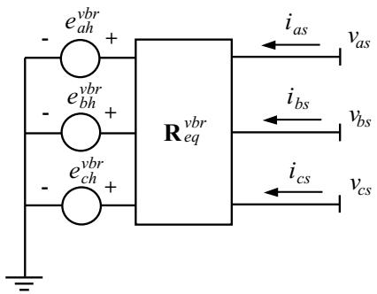  
Figure 2.1 Thevenin equivalent circuit of the proposed VBR model.

(1) Predict the mechanical variables: As the mechanical equations are nonlinear, the exact and simultaneous solution of the mechanical and electrical variables, in general, would require iterations. However, since the mechanical variables change relatively slowly compared to the electrical variables, the linear extrapolation of $\theta_r$ and $\omega_r$ used in [2] and [20], is also applied here as

$$
\theta_ {r} (t) = 2 \theta_ {r} (t - \Delta t) - \theta_ {r} (t - 2 \Delta t) \tag {2.56}
$$

$$
\omega_ {r} (t) = 2 \omega_ {r} (t - \Delta t) - \omega_ {r} (t - 2 \Delta t) \tag {2.57}
$$

(2) Form the Thevenin equivalent circuit: Equations (2.54) and (2.55) are evaluated to assemble the Thevenin equivalent circuit of the synchronous machine.   
(3) Solve the network equations: The network conductance matrix $\mathbf{G}$ is triangularized and the network variables are solved.   
(4) Update machine's stator and rotor variables: Stator currents and rotor flux linkages are calculated according to (2.53), (2.47), and (2.48). Subtransient voltages $\mathbf{v}_{abcs}^{\prime \prime}$ and equivalent history terms are also calculated by (2.50), (2.46), (2.52).   
(5) Update the machine's mechanical part: The electromagnetic torque $T_{e}$ is calculated using (33). Then, the rotor displacement $\theta_{r}$ , and speed, $\omega_{r}$ , are re-calculated using (2.34) and (2.35).

# 2.5 Computer Studies

A single-machine infinite-bus case system is assumed here to compare the different models. The machine parameters obtained from [30] are summarized in Appendix B. To validate the proposed VBR model, the case system has been implemented using various simulation packages, including MicroTran, ATP, and MATLAB/Simulink. In the transient study considered here, the machine initially operates in an idle steady-state mode with load torque $T_{m} = 0$ , and the nominal excitation is kept constant. At $t = 0$ , a symmetric three-phase fault is applied at the machine terminals. The dynamic responses produced by various models using different time steps are plotted in Figs. 2.2 and 2.3. The studies of unbalance operations are discussed in [32].

# 2.5.1 Model Verification

Figure 2.2 depicts the fault transient observed in the field current $i_{fd}$ , $a$ -phase current $i_{as}$ , and the electromagnetic torque $T_e$ . Other variables are not shown due to space limitations. Since the analytical solution is not available, a reference solution was obtained using the $qd$ model implemented in MATLAB/Simulink (state-variable approach) and solved with the Runge-Kutta $4^{\text{th}}$ order method with an integration time-step $\Delta t = 1\mu s$ . This solution is considered a trustworthy reference because it was obtained with a high-order method using a very small time-step. The same transient study was reproduced by different models using the time-step $\Delta t = 50\mu s$ . The

corresponding results are superimposed with the reference solutions in Fig. 2.2, wherein it is shown that the responses predicted by the above-mentioned models are visibly indistinguishable from the reference solution and each other. This result indicates that the $qd$ model, the PD model, and the VBR model are all equivalent despite the different simulation languages and integration methods used. This study also validates the proposed VBR model.

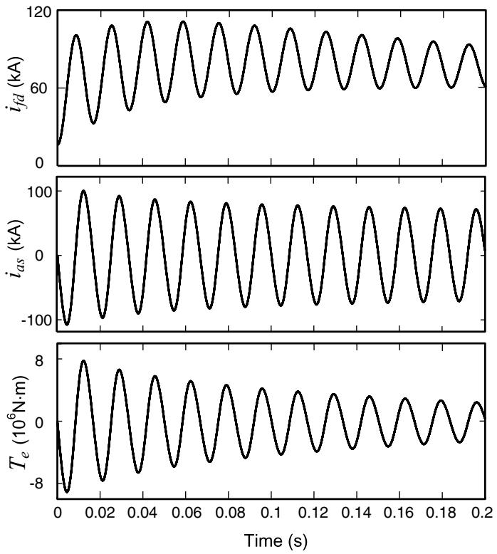  
Figure 2.2 Simulation results with time-step of $50\mu s$

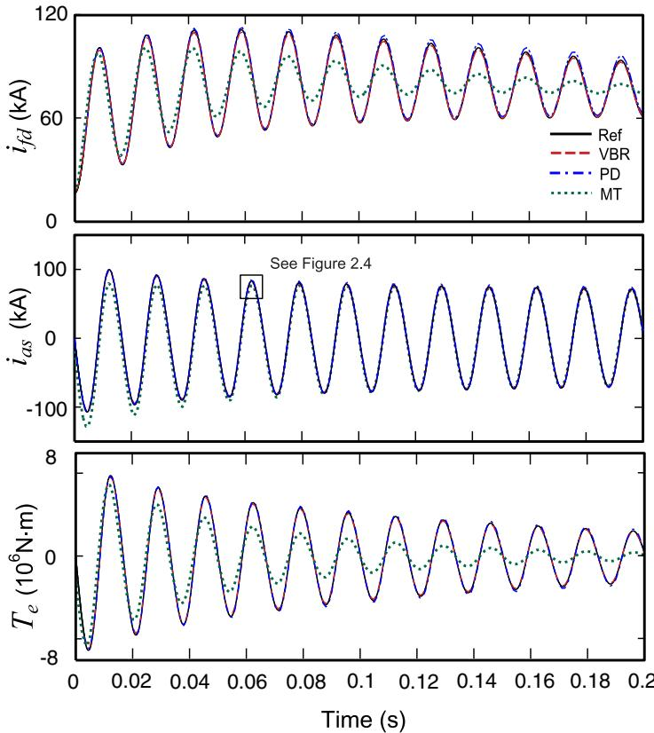  
Figure 2.3 Simulation results with time-step of $1ms$ .

# 2.5.2 Numerical Accuracy

Although the simulation results obtained by different models are all convergent to the reference solution when the step size is small, error between the solutions still exists. To study the error behavior and stability of different models, the same simulation study was run with different integration time steps. An example study performed with a larger time-step ( $\Delta t = 1ms$ ) is shown in Fig. 2.3, wherein the general trend of error produced by different models can be observed. Here, and in other figures, the legend MT denotes the results obtained using MicroTran. Studies with other time-steps are not included due to space limitations. Fig. 2.3 shows that at such a large time-step the MicroTran's Type-50 machine model (see dotted-line MT) has a large error, while the ATP Type-59 model was no longer convergent. This behavior is mainly due to the interface of the $qd$ model with the external network, which quickly deteriorates the simulation accuracy as the time-step increases. At the same time, the PD and VBR models remain stable at this large $\Delta t$ and still produce results reasonably close to the reference solution. To see the details among the simulation results produced by the stable models, a fragment of the peak of current $i_{as}$ is shown in Fig. 2.4. As can be seen, the solution points obtained by the VBR model are closer to the reference solution than the results of either the PD model or the MT model.

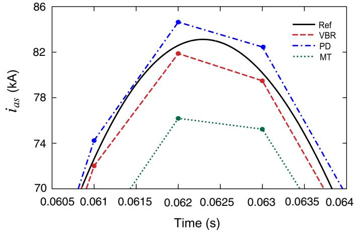  
Figure 2.4 Detailed view of the portion of $i_{as}$ with the time-step of $1ms$ .

To evaluate the accuracy of different numerical solutions, a relative error between the reference solution trajectory and a given numerical solution may be considered. The relative error is calculated here using the 2-norm [33] as

$$
\% \text {error} = \frac {\left\| \widetilde {\mathbf {f}} - \mathbf {f} \right\| _ {2}}{\left\| \mathbf {f} \right\| _ {2}} \times 100 \tag{2.58}
$$

where $\mathbf{f}$ denotes the reference solution and $\widetilde{\mathbf{f}}$ is the numerical solution. Without loss of generality, the relative error was calculated for one variable only, stator current $i_{as}$ , since the error of the other variables is similar. The error was calculated for different time-step sizes. The results for the different models are shown in Figs. 2.5 and 2.6.

As can be seen in Fig. 2.5, the PD and the VBR models are all noticeably more accurate than the $qd$ models of MicroTran and ATP. In particular, when the time-step $\Delta t$ is larger than $0.2ms$ , the MicroTran's $qd$ model will have an error exceeding $4\%$ and the ATP's $qd$ model is no longer convergent. Although the $qd$ model implemented in MicroTran appears to be stable even after $\Delta t = 0.2ms$ , the large error observed in other variables (see Fig. 2.3, $i_{fd}$ and $T_e$ ) supports the conclusion that the traditional $qd$ models should preferably be used with small step size and with caution.

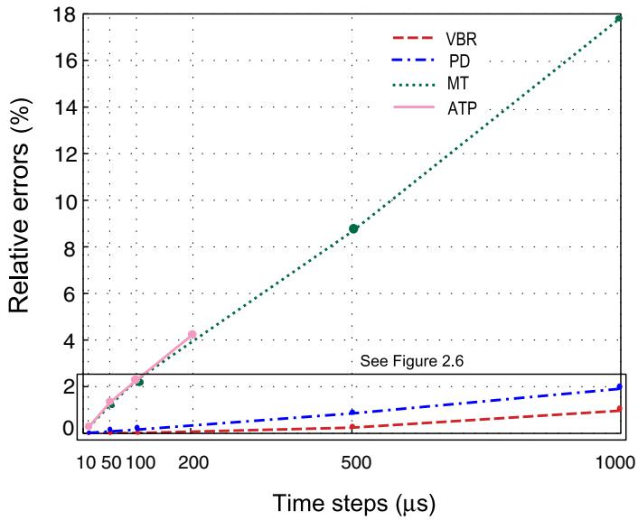  
Figure 2.5 Propagation of numerical errors in $i_{as}$ .

# 2.5.3 Model Efficiency

The proposed VBR and PD models were both implemented in standard C language and compiled for the purpose of benchmark comparisons. The compiled models were executed on a personal computer (PC) with a Pentium 4, 2.66GHz processor and 512M RAM. The CPU times required by the two models for the 0.2s case study with the integration time-step $\Delta t = 50\mu s$ are summarized in Table 2.2. It can be seen that although both models can realize a faster than real-time simulation speed, the proposed VBR model achieves a roughly $200\%$ improvement of simulation speed over the PD model. This result is very much consistent with the flops count provided in Table 2.1 for the two models.

Table 2.2 Comparison of CPU Times   

<table><tr><td>CPU times</td><td>PD Model</td><td>VBR Model</td></tr><tr><td>0.2s study</td><td>0.031s</td><td>0.015s</td></tr><tr><td>Per time-step</td><td>7.75μs</td><td>3.75μs</td></tr></table>

To compare the overall simulation efficiency, some common error tolerance should be assumed. Herein, a relative error tolerance of $0.25\%$ is considered. To achieve this tolerance, MicroTran's and ATP's $qd$ models require a time-step $\Delta t = 10\mu s$ and the PD model needs a time-step $\Delta t = 150\mu s$ , as shown in Fig. 2.6. However, the proposed VBR model may use the time-step as large as $500\mu s$ , which outperforms the PD model by 3.3 times and the traditional $qd$ models by about 50 times. Altogether, taking into account the CPU times in Table 2.2, the VBR model

demonstrates a $660\%$ improvement over the PD model for the same relative tolerance of $0.25\%$ .

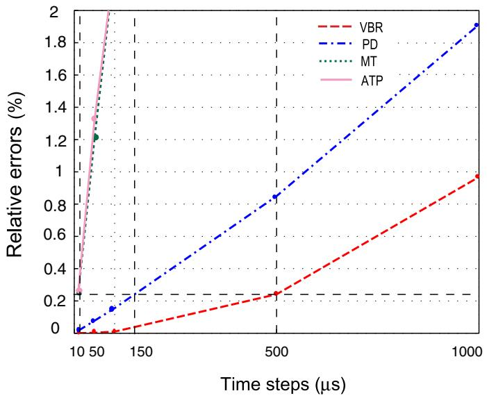  
Figure 2.6 Comparison of time-steps and numerical errors in $i_{as}$ .

# 2.6 Error Analysis

It is important to point out that the standard $qd$ model, the PD model, and the VBR model are all equivalent for continuous-time analysis since no approximation is made when these models are algebraically derived from each other. However, when these models are discretized using a specific integration rule and interfaced into the EMTP network solution, their numerical properties are different.

As shown in Figs. 2.5 and 2.6, the $qd$ models (MT and ATP) quickly lose accuracy compared to the PD and the VBR models. Such behavior is due to the interface of the $qd$ models and the prediction of fast electrical variables such as stator currents and speed voltages [2].

The accuracy of PD and VBR models should be examined in more detail. As was shown in [25], the choice of independent variables and the structure of the model change the system's eigenvalues, which are linked to the accuracy and performance of different numerical solvers.

To achieve the EMTP solution, the PD and VBR models are discretized using the same implicit trapezoidal integration rule as described in Section III. To further compare the numerical property of these two models, the corresponding difference equations should be analyzed. Since the trapezoidal rule is a one-step integration scheme, the model equations may be expressed in the form of a one-step update formula as [33]

$$
\mathbf {x} _ {n} = \boldsymbol {\Phi} (\Delta t, t, \mathbf {x} _ {n - 1}) \mathbf {x} _ {n - 1} + \mathbf {f} (\Delta t, t) \tag {2.59}
$$

Here, the vector $\mathbf{x}$ contains combined independent variables (currents and/or flux linkages); $\mathbf{f}(\Delta t,t)$ represents the forcing function that includes the terminal voltages, $\mathbf{v}_{abs}$ , and the excitation voltage, $\nu_{fd}$ . Thereafter, the numerical behavior and the local error propagation can be related to the eigenvalues of the update matrix $\Phi (\Delta t,t,\mathbf{x}_{n - 1})$ , as this matrix directly relates the present step solution (error) to the next step solution (error). After extensive algebraic manipulations with the equations of Section III, both PD and VBR models can be put into the form of (2.59). Only the final update matrices $\Phi^{pd}(\Delta t,t,\mathbf{x}_{n - 1}^{pd})$ and $\Phi^{vbr}(\Delta t,t,\mathbf{x}_{n - 1}^{vbr})$ are given in Appendix A. The corresponding discrete-time eigenvalues are calculated for $\Delta t = 1ms$ and summarized in Table 2.3. For consistency, the continuous-time eigenvalues were also calculated using the methodology described in [25] and are included as well.

It is interesting to note that although both PD and VBR models have rotor-position-dependent terms, the respective systems have time-invariant eigenvalues due to the machine symmetry. Another important observation is that both models, when expressed in continuous time, have some eigenvalues with positive real parts. Contrary to the linear time-invariant systems, positive eigenvalues do not imply instability of the time-varying systems [34]. Although it is preferable to have eigenvalues with negative real part, the existence of positive eigenvalues may increase the propagation of local errors when a particular numerical solution scheme is used [35]. In this regard, the positive eigenvalues of the VBR model are much smaller than those of the PD model, which indicates a potentially better numerical conditioning of the VBR model.

When the models are discretized, the eigenvalues of the corresponding difference equation (2.59) should be compared against the unit circle on the complex plane. Here, by analogy with continuous-time systems, the eigenvalues outside of the unit circle do not imply the system's instability, because both models are time-varying. However, for numerical considerations, it is desirable to have the eigenvalues inside the unit circle (or closer to the origin). In this regard, the magnitude of the largest eigenvalue of the VBR model (1.031) is roughly two times smaller than the largest eigenvalue of the PD model (2.498). This observation again indicates a better numerical conditioning of the VBR model and is completely consistent with the relative error results shown in Figs. 2.5 and 2.6.

Table 2.3 Eigenvalues of Machine Models   

<table><tr><td colspan="2">Continuous Time</td><td colspan="2">Discrete Time</td></tr><tr><td>PD</td><td>VBR</td><td>PD</td><td>VBR</td></tr><tr><td>954.2</td><td>32.0+j26.4</td><td>0.395</td><td>0.945-j0.028</td></tr><tr><td>890.3</td><td>32.0-j26.4</td><td>0.418</td><td>0.945+j0.028</td></tr><tr><td>-4.2</td><td>-0.88</td><td>0.976</td><td>0.994</td></tr><tr><td>-6.00</td><td>-5.39</td><td>0.994</td><td>0.995</td></tr><tr><td>-24.2</td><td>-5.96</td><td>0.996</td><td>0.999</td></tr><tr><td>-904.6</td><td>-57.3+j30.6</td><td>2.358</td><td>1.031-j0.027</td></tr><tr><td>-968.3</td><td>-57.3-j30.6</td><td>2.498</td><td>1.031+j0.027</td></tr></table>

# 2.7 Discussion of Network Solution

Although the focus of this paper is the VBR synchronous machine model, it is also of interest and importance to develop an efficient network solution approach to integrate the VBR machine model in EMTP-type programs. Similar to the PD model, the VBR machine model introduces time-varying elements in the network conductance matrix, which may lead to an increase of the execution time if the entire network conductance matrix is re-factorized at each time step (see step 3, Section IV). Some case studies presented in [14] compare the calculation times and the number of triangulations when using type-58 (PD model) and type-59 (qd model) synchronous machine models, respectively. For a 190-bus 3-generator system, the ratio of 308.3/70.1 (about 4.4 times) of increased calculation time due to re-triangulation was reported [14, see Table I].

The impact of time-varying elements on the efficiency of EMTP solution depends on the relative proportion of machines verses other components and the overall system size [36]. If there are only one or a few synchronous machines in the network, the extra computation effort can be reduced by using the compensation method [2]. To get an idea about the increase in execution time with the compensation method, the IEEE First Benchmark Model for SSR [37] was considered, wherein an increase by about $15\%$ per-time-step was observed. Another method is to place the nodes with synchronous machines as the last nodes in the nodal equations, and triangularize first the upper part of the conductance matrix before the time-step loop starts. That will produce a small lower sub-matrix [38, see Fig. 7], which can then be modified with the time-varying values and solved at each time step to minimize computational overhead of the entire system. The use of advanced factorization techniques [38]-[39] will become particularly important for larger networks. On the positive side, the solution obtained by the VBR model using the same time step will be more accurate, which may often justify the extra computational effort.

A more detailed analysis of the impact of using the VBR or PD models may be carried out using

several typical systems (perhaps at least two - one with small proportion on machines, and another with many machines). When conducting such studies, in addition to comparing the CPU cost per-time-step, one should also consider that both PD and VBR models permit much larger time-step and/or better accuracy (see Fig. 2.6), which is an advantage that was not utilized in [14] and should be fully exploited. Further investigation into this matter is of definite interest and significance that may be properly addressed in a dedicated publication.

# 2.8 Conclusion

This paper presented a voltage-behind-reactance (VBR) synchronous machine model for the nodal analysis method and EMTP-type programs. The VBR model interface with the electric network is non-iterative, and simultaneous solution of the machine variables and the network variables is achieved similar to the known phase-domain (PD) model. Case studies of a single-machine, infinite-bus system demonstrate that the proposed model has computational advantages over the existing EMTP machine models.

# 2.9 References

[1] P. Kundur, Power System Stability and Control, McGraw-Hill, New York, 1994, ch. 5.   
[2] H. W. Dommel, EMTP Theory Book, MicroTran Power System Analysis Corporation, Vancouver, Canada, May 1992, ch. 8.   
[3] Simulink Dynamic System Simulation Software - Users Manual, MathWorks, Inc., Natick, Massachusetts, 2005.   
[4] Advanced Continuous Simulation Language (ACSL) Reference Manual, Mitchell and Gauthier Associates, Concord, MA, 1995.   
[5] O. Wasynczuk and S. D. Sudhoff, "Automated state model generation algorithm for power circuits and systems," IEEE Trans. Power Syst., vol. 11, no.4, pp. 1951-1956, Nov. 1996.   
[6] H. W. Dommel, "Digital computer solution of electromagnetic transients in single- and multiphase networks," IEEE Trans. on Power Apparatus and Systems, Vol. PAS-88, No. 4, pp. 388-399, April 1969.   
[7] L. W. Nagel and D. O. Pederson, “Simulation Program with Integrated Circuit Emphasis,” University of California Electronic Research Laboratory, Memorandum EAL-M382, April 1973.   
[8] V. Brandwajn, "Synchronous generator models for the analysis of electromagnetic transients," Ph.D. thesis, University of British Columbia, Vancouver, Canada, 1977.   
[9] MicroTran Reference Manual, MicroTran Power System Analysis Corp., Vancouver, Canada, 1997.   
[10] Electromagnetic Transient Programs (EMTP96) rule book I, EMTP Development Coordination Group (DCG) and Electric Power Research Institute (EPRI), Inc., 1999.   
[11] H. K. Lauw and W. S. Meyer, "Universal machine modeling for the representation of rotating electrical machinery in an electromagnetic transients program," IEEE Trans. Power Apparatus and Systems, vol. PAS-101, pp. 1342-1351, 1982.   
[12] EMTDC User's Guide, Manitoba HVDC Research Center Inc., Winnipeg, Canada, 2004, ch. 8.   
[13]A. M. Gole, R. W. Menzies, D. A. Woodford and H. Turanli, “Improved interfacing of electrical machine models in electromagnetic transient programs,” IEEE Trans. Power Apparatus and Systems, vol. PAS-103, no. 9, pp. 2446–2451, Sept. 1984.   
[14]X. Cao, A. Kurita, H. Mitsuma, Y. Tada and H. Okamoto, “Improvements of numerical stability of electromagnetic transient simulation by use of phase-domain synchronous machine models,” Electrical Engineering in Japan, vol. 128, no. 3, April, 1999.   
[15] A. B. Dehkordi, A. M. Gole and T. L. Maguire, “Permanent magnet synchronous machine model for real-time simulation,” Proc. of *Interracial Conference on Power Systems Transients (IPST'05)*, Montreal, Canada, June, 2005.

[16]J. Hollman and J. Marti, "Real Time Network Simulation with PC -Cluster," IEEE Trans. Power Syst., vol.18, No. 2, May, 2003, pp. 563-569.   
[17]P. Subramaniam and O. P. Malik, "Digital simulation of a synchronous generator in the direct-phase quantities," Proc. Inst. Elect. Eng., vol. 118, no. 1, pp. 153-160, Jan. 1971.   
[18] M. Rafian and M. A. Laughton, “Determination of synchronous machine phase coordinate parameters,” Proc. Inst. Elect. Eng., vol. 123, no. 8, pp. 818–824, Aug. 1976.   
[19] J. R. Marti and K. W. Louie, “A phase-domain synchronous generator model including saturation effects,” IEEE Trans. Power Syst., vol.12, Feb., 1997, pp. 222–229.   
[20]D. Muthumuni, P. G. McLaren, E. Dirks and V. Pathirana, “A synchronous machine model to analyze internal faults,” in Conf. Rec. 2001 IEEE Industry Application Conf. Thirty-Sixth IAS Annual Meeting, vol.3, Oct. 2001, pp. 1595–1600.   
[21] “New S.M. Model from Tokyo Electric” [Online]. Available: http://www.jaug.jp/~atp/index-e.htm   
[22] Can / Am EMTP News, Voice of the Canadian / American EMTP User Group, Vol. 97-2, April, 1997.   
[23] Can / Am EMTP News, Voice of the Canadian / American EMTP User Group, Vol. 99 - 3, July, 1999.   
[24] W. Gao, E. V. Solodovnik and R. A. Dougal, "Symbolically aided model development for an induction machine in virtual test bed," IEEE Trans. Energy Conv., vol. 19 no. 1, pp. 125-135, Mar. 2004.   
[25]S. D. Pekarek, O. Wasynczuk, and H. J. Hegner, “An efficient and accurate model for the simulation and analysis of synchronous machine/converter systems,” IEEE Trans. Energy Conv., vol. 13 no. 1, Mar. 1998, pp. 42–48.   
[26] W. Zhu, S. D. Pekarek, J. Jatskevich, O. Wasynczuk, and D. Delisle, “A model-in-the-loop interface to emulate source dynamics in a zonal DC distribution system,” IEEE Trans. Power Electr., vol. 20 no. 2, Mar. 2005, pp. 438–445.   
[27]J. R. Marti, L. R. Linares, J. Calvino, H. W. Dommel and J. Lin, “OVNI: an object approach to real-time power system simulators,” in Proc. 1998 Int. Conf. Power System Technology, Beijing, China, pp. 977-981, Apr. 1998.   
[28] S. D. Pekarek, O. Wasynczuk, E. A. Walters, J. Jatskevich, C. E. Lucas, N. Wu, and P. T. Lamm, "An efficient multi-rate simulation technique for power-electronic-based systems," IEEE Trans. Power Syst., vol. 19 no. 1, pp. 399-409, Feb. 2004.   
[29]F. A. Moreira and J. R. Marti “Latency techniques for time-domain power system transients simulation,” IEEE Trans. Power Syst., vol. 20 no. 1, pp. 246–253, Feb. 2005.   
[30] P. C. Krause, O. Wasynczuk, and S. D. Sudhoff, Analysis of Electric Machine, $2^{\text{nd}}$ Edition, IEEE Press, Piscataway, NJ, 2002.   
[31]S. Boyd and L. Vandenberghe, Convex Optimization, Cambridge University Press, Cambridge, UK, 2004, pp. 662-664.

[32]L. Wang, J. Jatskevich and H. W. Dommel, "Reexamination of synchronous machine modeling techniques for electromagnetic transient simulations," IEEE Trans. Power Syst., in preparation.   
[33] W. Gautchi, Numerical Analysis: An Introduction, Birkhauser, Boston, Massachusetts, 1997.   
[34]R. A. DeCarlo, Linear systems: A State Variable Approach With Numerical Implementation, Prentice-Hall, New Jersey, 1989, p. 457.   
[35]L. O. Chua and P-M Lin, Computer Aided Analysis of Electronic Circuit: Algorithms and Computational Techniques, Prentice-Hall, Englewood Cliffs, New Jersey, 1975, pp. 43-45.   
[36] Private notes and discussions with H. W. Dommel.   
[37]IEEE Task Force, "First benchmark model for computer simulation of subsynchronous resonance", IEEE Trans. Power App. Syst., vol. PAS-96, pp. 1565-1572, Sept./Oct. 1977.   
[38]H. W. Dommel, “Nonlinear and time-varying elements in digital simulation of electromagnetic transients,” IEEE Trans. Power Apparatus and Systems, Vol. PAS-90, pp. 2561–2567, Nov./Dec. 1971.   
[39]S. M. Chan, V. Brandwajn, “Partial Matrix Refactorization,” IEEE Trans. Power Apparatus and Systems, Vol. PWRs-1, No. 1, pp. 193–200, Feb. 1986. “SimPowerSystems: Model and simulate electrical power systems”, User’s Guide, The MathWorks Inc., 2006 (www.mathworks.com).

# 3 MODELING OF INDUCTION MACHINES USING A VOLTAGE-BEHIND-REACTANCE FORMULATION3

# 3.1 Introduction

The modeling of induction machines dates back to the early years of the $20^{\text{th}}$ century [1]–[3]. Depending on the objective of studies and the required level of fidelity, the modeling approaches may be roughly divided into three categories: finite element (or difference) method [4]; equivalent magnetic circuit approach [5]–[6]; and coupled electric circuit approach. This paper mainly considers the last approach, which leads to a relatively small number of equations. In particular, this paper focuses on the so-called general purpose models that are available in numerous simulation languages as built-in library components and by far the most commonly used by engineers and researchers in industry or academia (or at least attempted first, prior to constructing custom models). From this point of view, improving numerical accuracy and efficiency of such models even by a fraction may result in very significant savings of the engineering time worldwide.

Among the many methods developed, a key concept has been to transform physical (abc) variables of the machine into fictitious (qd) variables using rotating reference frames, e.g., stationary, rotor, or synchronous. The arbitrary reference frame (ARF) theory proposed in [7] generalized the $qd$ modeling approach by showing that one can assign an appropriate reference speed $\omega$ to transform machine physical variables to a particular reference frame. The ARF provides a direct means of obtaining the machine equations in the above-mentioned frames of reference.

The advantages of the $qd$ induction machine models include the following: (i) the time-varying inductances between stator and rotor windings are eliminated; (ii) the flux linkage equations are decoupled; (iii) zero sequence quantities disappear for balanced operation and may be removed to reduce the number of state equations [8]; (iv) the design of controls for machine drive systems can be conveniently developed in a reference frame in which variables become constant in the steady-state [9]; (v) the average-value modeling of machine-converter systems is simplified when expressing the machine in terms of $qd$ variables [10]-[14].

Despite the many important advantages of using reference frame transformations, when modeling systems that contain more than just a single machine, the $qd$ model requires an interface with the external components or power electronics circuits. In many instances, the external components are modeled in $abc$ physical variables (coordinates). Therefore, an interface is formed by the transformation (and inverse transformation), which poses an algebraic constraint.

For circuit- and/or nodal-analysis-based simulation languages, it is not easy to interface the $qd$ equivalent circuits of the machine with the external network. Therefore, in simulation programs such as EMTP [15] prediction methods are often used [16], which reduce the simulation accuracy and efficiency by requiring small time-steps and/or iterations. Interested reader may find more detailed discussions of the challenges associated with interfacing the $qd$ model in [17]-[20], wherein the loss of stability and numerical accuracy has been documented.

In the state-variable languages, such as the widely-used packages SimPowerSystem (SPS) [21] and PLECS [22], the $qd$ models are typically represented as voltage-controlled current sources [22]-[23]. Therefore, such built-in $qd$ models may not be directly interfaced with external circuits terminating with inductive branches, in which case fictitious snubbers are often used to create the necessary voltages and enable the interface [21]-[24]. Discretizing the machine models separately from the main system-circuit is possible to avoid algebraic loops. For example, [19] permits discretizing the machine models using the Forward Euler method, while the external circuit may be discretized using a fixed-step trapezoidal (Tustin) integration rule.

To simplify the machine model-network interface, several authors have suggested using the coupled-circuit phase-domain machine models [22]–[24], wherein the stator and rotor circuits are represented in abc phase coordinates. Using such an approach enables a direct connection between a machine and an external circuit. However, this approach comes at the cost of using a time-varying inductance matrix, which complicates the model and reduces its simulation efficiency. A hybrid approach that uses both abc phase variables for the stator circuit and $qd$ stationary reference frame for the rotor circuit was proposed in [28]–[30]. Although the resulting machine inductance matrix does not depend on rotor position, these models use structural coupling between the stator and rotor and do not have a convenient equivalent-circuit representation. Therefore, it is a challenge to integrate these models with the external network systems using commonly available simulation languages.

A voltage-behind-reactance (VBR) model formulation was proposed for synchronous machines in [31]-[32] that also achieves the direct interface sought by the coupled-circuit phase-domain

model. As documented in [19], the VBR-based models are also very convenient for implementation in various nodal analysis- and circuit-based simulation packages and offer advantages in terms of numerical accuracy and efficiency.

This paper makes the following contributions in the area of modeling and numerical analysis of electrical machines:

1) We show that it is possible to extend the VBR formulation to a full-order induction machine model. In this formulation, the stator is expressed in $abc$ direct-phase coordinates as 3-phase dependent subtransient emf sources behind an $RL$ circuit, and the rotor is expressed in transformed $qd$ coordinates using fluxes as the independent variables.   
2) It is also shown that the resulting VBR model can be expressed in several different forms, wherein, depending on the need, the $RL$ circuit may be coupled or decoupled with an option of including the zero sequence wherever appropriate.   
3) The proposed VBR model formulation enables a very straightforward and efficient interconnection of the stator $RL$ circuit with the external circuit-network, which is an advantage over all previously developed induction machine models.   
4) The computer studies and eigenvalue analysis demonstrate that the proposed VBR machine model is computationally more efficient and accurate than the traditional coupled-circuit model (that is typically used to achieve the direct interface) and/or or the classical $qd$ model when it is interfaced using fictitious snubbers.

# 3.2 Coupled-Circuit Machine Model

To better understand the proposed advanced models, and for consistency purposes, the coupled-circuit (CC) model is reviewed here. Without loss of generality, this paper assumes a 3-phase, wye-connected, induction machine [9], whose cross-sectional view is shown in Fig. 3.1.

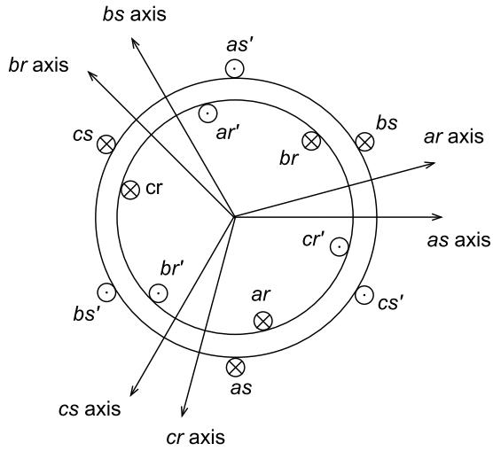  
Figure 3.1 Basic structure of an induction machine model.

The stator and rotor windings are assumed to be symmetric, sinusoidally distributed with resistance denoted by $\mathbf{r}_s$ and $\mathbf{r}_r$ , respectively. The positive direction of the magnetic axes corresponds to the direction of flux linkages induced by the positive phase currents. The induction machine may be represented in terms of coupled electric circuits, shown in Fig. 3.2. In this manuscript, motor convention is used which assumes that positive stator and rotor currents flow into the machine when positive phase voltages are applied, as depicted in Fig. 3.2. For convenience, all rotor variables and parameters are referred to the stator side using an appropriate turns-ratio.

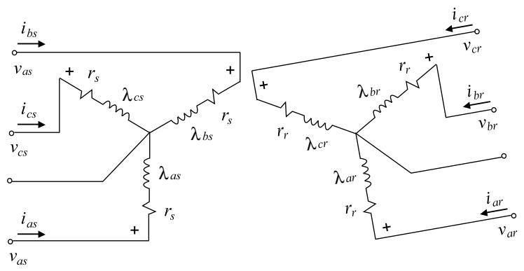  
Figure 3.2 Coupled-circuit model of induction machine.

The corresponding voltage equation may be expressed in matrix form as

$$
\left[ \begin{array}{l} \mathbf {v} _ {a b c s} \\ \mathbf {v} _ {a b c r} \end{array} \right] = \left[ \begin{array}{c c} \mathbf {r} _ {s} & \\ & \mathbf {r} _ {r} \end{array} \right] \left[ \begin{array}{l} \mathbf {i} _ {a b c s} \\ \mathbf {i} _ {a b c r} \end{array} \right] + p \left[ \begin{array}{l} \boldsymbol {\lambda} _ {a b c s} \\ \boldsymbol {\lambda} _ {a b c r} \end{array} \right] \tag {3.1}
$$

where the stator and rotor diagonal resistance matrices are $3 \times 3$ and denoted by $\mathbf{r}_s$ , $\mathbf{r}_r$ ,

respectively. The operator $p$ denotes $d / dt$ . The corresponding flux linkage equation is

$$
\left[ \begin{array}{l} \boldsymbol {\lambda} _ {a b c s} \\ \boldsymbol {\lambda} _ {q d r} \end{array} \right] = \left[ \begin{array}{l l} \mathbf {L} _ {s} & \mathbf {L} _ {s r} \\ \mathbf {L} _ {s r} ^ {T} & \mathbf {L} _ {r} \end{array} \right] \left[ \begin{array}{l} \mathbf {i} _ {a b c s} \\ \mathbf {i} _ {q d r} \end{array} \right] \tag {3.2}
$$

where the stator and rotor self-inductance matrices are $\mathbf{L}_s$ and $\mathbf{L}_r$ , respectively, and are constant due to machine symmetry. The expressions for $\mathbf{L}_s$ and $\mathbf{L}_r$ can be found in [9] and are not included here due to space limitations. The mutual inductance matrix has the following form:

$$
\mathbf {L} _ {s r} = L _ {m s} \left[ \begin{array}{c c c} \cos \theta_ {r} & \cos \left(\theta_ {r} + \frac {2 \pi}{3}\right) & \cos \left(\theta_ {r} - \frac {2 \pi}{3}\right) \\ \cos \left(\theta_ {r} - \frac {2 \pi}{3}\right) & \cos \theta_ {r} & \cos \left(\theta_ {r} + \frac {2 \pi}{3}\right) \\ \cos \left(\theta_ {r} + \frac {2 \pi}{3}\right) & \cos \left(\theta_ {r} - \frac {2 \pi}{3}\right) & \cos \theta_ {r} \end{array} \right] \tag {3.3}
$$

The developed electromagnetic torque may be expressed in direct physical machine variables as

$$
T _ {e} = \left(\frac {P}{2}\right) \left(\mathbf {i} _ {a b c s}\right) ^ {T} \frac {\partial}{\partial \theta_ {r}} \left[ \mathbf {L} _ {s r} \right] \mathbf {i} _ {a b c r} \tag {3.4}
$$

# 3.3 QD Machine Model in ARF

The coupled-circuit induction machine model is often transformed into the $qd$ arbitrary reference frame [9], where the flux linkages become decoupled. For convenient derivation of the VBR models, the $qd$ model is included here in decoupled form. In particular, the voltage equations in the ARF are given as

$$
v _ {q s} = r _ {s} i _ {q s} + \omega \lambda_ {d s} + p \lambda_ {q s} \tag {3.5}
$$

$$
v _ {d s} = r _ {s} i _ {d s} - \omega \lambda_ {q s} + p \lambda_ {d s} \tag {3.6}
$$

$$
v _ {0 s} = r _ {s} i _ {0 s} + p \lambda_ {0 s} \tag {3.7}
$$

$$
v _ {q r} = r _ {r} i _ {q r} + \left(\omega - \omega_ {r}\right) \lambda_ {d r} + p \lambda_ {q r} \tag {3.8}
$$

$$
v _ {d r} = r _ {r} i _ {d r} - \left(\omega - \omega_ {r}\right) \lambda_ {q r} + p \lambda_ {d r} \tag {3.9}
$$

$$
v _ {0 r} = r _ {r} i _ {0 r} + p \lambda_ {0 r}. \tag {3.10}
$$

The flux linkage equations are expressed as

$$
\lambda_ {q s} = L _ {l s} i _ {q s} + \lambda_ {m q} \tag {3.11}
$$

$$
\lambda_ {d s} = L _ {l s} i _ {d s} + \lambda_ {m d} \tag {3.12}
$$

$$
\lambda_ {0 s} = L _ {l s} i _ {0 s} \tag {3.13}
$$

$$
\lambda_ {q r} = L _ {l r} i _ {q r} + \lambda_ {m q} \tag {3.14}
$$

$$
\lambda_ {d r} = L _ {l r} i _ {d r} + \lambda_ {m d} \tag {3.15}
$$

$$
\lambda_ {0 r} = L _ {l r} i _ {0 r} \tag {3.16}
$$

where magnetizing fluxes are defined as

$$
\lambda_ {m q} = L _ {m} \left(i _ {q s} + i _ {q r}\right) \tag {3.17}
$$

$$
\lambda_ {m d} = L _ {m} \left(i _ {d s} + i _ {d r}\right) \tag {3.18}
$$

and

$$
L _ {m} = \frac {3}{2} L _ {m s} \tag {3.19}
$$

The developed electromagnetic torque in terms of transformed $qd$ variables is given as

$$
T _ {e} = \frac {3 P}{4} \left(\lambda_ {d s} i _ {q s} - \lambda_ {q s} i _ {d s}\right). \tag {3.20}
$$

# 3.4 Voltage-Behind-Reactance Models in ARF

To derive the VBR model, it is necessary to formulate the stator voltage equation so that it appears similar to that of $RL$ -branches, whereas the contribution due to the rotor subsystem is expressed in terms of dependent voltage sources. Since for an induction machine such model formulation is not unique, several models have been derived that may be of practical use, depending on the application.

# 3.4.1 Voltage-Behind-Reactance Model I

Derivation of the first model is performed by first solving (3.14), (3.15) for currents and substituting the result into (3.17), (3.18). The, magnetizing fluxes are then expressed as

$$
\lambda_ {m q} = L _ {m} ^ {\prime \prime} \left(i _ {q s} + \frac {\lambda_ {q r}}{L _ {l r}}\right) \tag {3.21}
$$

$$
\lambda_ {m d} = L _ {m} ^ {\prime \prime} \left(i _ {d s} + \frac {\lambda_ {d r}}{L _ {l r}}\right) \tag {3.22}
$$

where

$$
L _ {m} ^ {"} = \left(\frac {1}{L _ {m}} + \frac {1}{L _ {l r}}\right) ^ {- 1} \tag {3.23}
$$

Substituting (3.21) and (3.22) into (3.11) and (3.12), respectively, the stator flux linkage equations may be rewritten as

$$
\lambda_ {q s} = L ^ {\prime \prime} i _ {q s} + \lambda_ {q} ^ {\prime \prime} \tag {3.24}
$$

$$
\lambda_ {d s} = L ^ {\prime \prime} i _ {d s} + \lambda_ {d} ^ {\prime \prime} \tag {3.25}
$$

where the subtransient inductances are defined by

$$
\bar {L} ^ {\prime \prime} = L _ {l s} + \bar {L} _ {m} ^ {\prime \prime} \tag {3.26}
$$

The subtransient flux linkages are defined as

$$
\lambda_ {q} ^ {\prime \prime} = L _ {m} ^ {\prime \prime} \frac {\lambda_ {q r}}{L _ {l r}} \tag {3.27}
$$

$$
\lambda_ {d} ^ {\prime \prime} = L _ {m} ^ {\prime \prime} \frac {\lambda_ {d r}}{L _ {l r}} \tag {3.28}
$$

Substituting (3.24) and (3.25) into (3.5) and (3.6), respectively, the stator voltage equations may be represented as

$$
v _ {q s} = r _ {s} i _ {q s} + \omega L ^ {\prime \prime} i _ {d s} + p L ^ {\prime \prime} i _ {q s} + \omega \lambda_ {d} ^ {\prime \prime} + p \lambda_ {q} ^ {\prime \prime} \tag {3.29}
$$

$$
v _ {d s} = r _ {s} i _ {d s} - \omega L ^ {\prime \prime} i _ {q s} + p L ^ {\prime \prime} i _ {d s} - \omega \lambda_ {q} ^ {\prime \prime} + p \lambda_ {d} ^ {\prime \prime} \tag {3.30}
$$

The rotor currents are derived from (3.14), (3.15) and are given by

$$
i _ {q r} = \frac {1}{L _ {l r}} \left(\lambda_ {q r} - \lambda_ {m q}\right) \tag {3.31}
$$

$$
i _ {d r} = \frac {1}{L _ {l r}} \left(\lambda_ {d r} - \lambda_ {m d}\right) \tag {3.32}
$$

From (3.8), (3.9), and (3.31), (3.32), the rotor voltage equations may be rewritten as the following

state equations

$$
p \lambda_ {q r} = - \frac {r _ {r}}{L _ {l r}} \left(\lambda_ {q r} - \lambda_ {m q}\right) - \left(\omega - \omega_ {r}\right) \lambda_ {d r} + v _ {q r} \tag {3.33}
$$

$$
p \lambda_ {d r} = - \frac {r _ {r}}{L _ {l r}} \left(\lambda_ {d r} - \lambda_ {m d}\right) + \left(\omega - \omega_ {r}\right) \lambda_ {q r} + v _ {d r} \tag {3.34}
$$

The terms $p\lambda_q^{\prime \prime}$ and $p\lambda_d^{\prime \prime}$ in the respective stator voltage equations (3.29), (3.30) may be eliminated by taking the derivatives of (3.27), (3.28) and substituting (3.33), (3.34) into the resulting equations. After some algebraic manipulations, the stator voltage equations (3.29), (3.30) may be rewritten in the following form:

$$
v _ {q s} = r ^ {"} i _ {q s} + \omega L ^ {"} i _ {d s} + p L ^ {"} i _ {q s} + e _ {q} ^ {"} \tag {3.35}
$$

$$
v _ {d s} = r ^ {\prime \prime} i _ {d s} - \omega L ^ {\prime \prime} i _ {q s} + p L ^ {\prime \prime} i _ {d s} + e _ {d} ^ {\prime \prime} \tag {3.36}
$$

where

$$
r ^ {"} = r _ {s} + \frac {L _ {m} ^ {\prime 2}}{L _ {l r} ^ {2}} r _ {r} \tag {3.37}
$$

and

$$
e _ {q} ^ {"} = \omega_ {r} \lambda_ {d} ^ {"} + \frac {L _ {m} ^ {"} r _ {r}}{L _ {l r} ^ {2}} \left(\lambda_ {q} ^ {"} - \lambda_ {q r}\right) + \frac {L _ {m} ^ {"}}{L _ {l r}} v _ {q r} \tag {3.38}
$$

$$
e _ {d} ^ {"} = - \omega_ {r} \lambda_ {q} ^ {"} + \frac {L _ {m} ^ {"} r _ {r}}{L _ {l r} ^ {2}} \left(\lambda_ {d} ^ {"} - \lambda_ {d r}\right) + \frac {L _ {m} ^ {"}}{L _ {l r}} v _ {d r} \tag {3.39}
$$

The stator voltage equations (3.7), (3.35) and (3.36), may now be transformed back into the abc phase coordinates by applying inverse arbitrary reference transformation $\left(\mathbf{K}_s\right)^{-1}$ . This final step gives the voltage equation in voltage-behind-reactance form as

$$
\mathbf {v} _ {a b c s} = \mathbf {r} _ {a b c s} ^ {"} \mathbf {i} _ {a b c s} + \mathbf {L} _ {a b c s} ^ {"} p \mathbf {i} _ {a b c s} + \mathbf {e} _ {a b c s} ^ {"} \tag {3.40}
$$

where

$$
\mathbf {e} _ {a b c s} ^ {"} = \left[ \mathbf {K} _ {s} \right] ^ {- 1} \left[ \begin{array}{l l l} e _ {q} ^ {"} & e _ {d} ^ {"} & 0 \end{array} \right] ^ {T} \tag {3.41}
$$

Here, the resistance matrix is given by

$$
\mathbf {r} _ {a b c s} ^ {"} = \left[ \begin{array}{l l l} r _ {S} & r _ {M} & r _ {M} \\ r _ {M} & r _ {S} & r _ {M} \\ r _ {M} & r _ {M} & r _ {S} \end{array} \right] \tag {3.42}
$$

where

$$
r _ {S} = r _ {s} + r _ {a} \tag {3.43}
$$

$$
r _ {M} = - \frac {r _ {a}}{2} \tag {3.44}
$$

$$
r _ {a} = \frac {2}{3} \frac {L _ {m} ^ {\prime 2}}{L _ {l r} ^ {2}} r _ {r} \tag {3.45}
$$

The new inductance matrix is

$$
\mathbf {L} _ {a b c s} ^ {"} = \left[ \begin{array}{l l l} L _ {S} & L _ {M} & L _ {M} \\ L _ {M} & L _ {S} & L _ {M} \\ L _ {M} & L _ {M} & L _ {S} \end{array} \right] \tag {3.46}
$$

where

$$
L _ {S} = L _ {l s} + L _ {a} \tag {3.47}
$$

$$
L _ {M} = - \frac {L _ {a}}{2} \tag {3.48}
$$

$$
L _ {M} = - \frac {L _ {a}}{2} \tag {3.49}
$$

Note that, in (3.40), subtransient resistance matrix (3.42) and inductance matrix (3.46) are constant due to machine symmetry, and are independent of any reference frame. These are very desirable properties that make the VBR model more efficient than the coupled-circuit model. Thus, equations (3.40), (3.33), (3.34), (3.10), (3.38) and (3.39) define the so-called voltage-behind-reactance model formulation I (VBR-I).

Since in the VBR model formulation there is no direct need to calculate the stator flux linkages $\lambda_{qs}$ and $\lambda_{ds}$ , the developed electromagnetic torque may be expressed using the magnetizing fluxes as [9]

$$
T _ {e} = \frac {3 P}{4} \left(\lambda_ {m d} i _ {q s} - \lambda_ {m q} i _ {d s}\right) \tag {3.50}
$$

# 3.4.2 Voltage-Behind-Reactance Model II

The VBR-I contains a full resistance matrix (3.42), which may be difficult to implement in some simulation languages. As shown in [32], the model may be further simplified by using the diagonal stator resistance matrix $\mathbf{r}_s$ and moving the rotor resistance terms multiplied by stator currents $i_{qs}$ and $i_{ds}$ in (3.35) and (3.36), respectively, back into $e_q^{\prime \prime}$ and $e_d^{\prime \prime}$ . This formulation constitutes the second voltage-behind-reactance model II (VBR-II), which is expressed as

$$
\mathbf {v} _ {a b c s} = \mathbf {r} _ {s} \mathbf {i} _ {a b c s} + \mathbf {L} _ {a b c s} ^ {\prime \prime} p \mathbf {i} _ {a b c s} + \mathbf {v} _ {a b c s} ^ {\prime \prime} \tag {3.51}
$$

Here, other equations are the same as in VBR-I, except that the back emf $\mathbf{v}_{abcs}^{\prime \prime}$ is defined as

$$
\mathbf {v} _ {a b c s} ^ {"} = \left[ \mathbf {K} _ {s} \right] ^ {- 1} \left[ \begin{array}{l l l} v _ {q} ^ {"} & v _ {d} ^ {"} & 0 \end{array} \right] ^ {T} \tag {3.52}
$$

where

$$
v _ {q} ^ {\prime \prime} = \omega_ {r} \lambda_ {d} ^ {\prime \prime} + \frac {L _ {m} ^ {\prime \prime} r _ {r}}{L _ {l r} ^ {2}} \left(\lambda_ {q} ^ {\prime \prime} - \lambda_ {q r}\right) + \frac {L _ {m} ^ {\prime \prime}}{L _ {l r}} v _ {q r} + \frac {L _ {m} ^ {\prime \prime 2} r _ {r}}{L _ {l r} ^ {2}} i _ {q s} \tag {3.53}
$$

$$
v _ {d} ^ {"} = - \omega_ {r} \lambda_ {q} ^ {"} + \frac {L _ {m} ^ {"}}{L _ {l r} ^ {2}} \left(\lambda_ {d} ^ {"} - \lambda_ {d r}\right) + \frac {L _ {m} ^ {"}}{L _ {l r}} v _ {d r} + \frac {L _ {m} ^ {" 2}}{L _ {l r} ^ {2}} i _ {d s} \tag {3.54}
$$

Thus, the need for a mutual resistance matrix has been avoided [32].

# 3.4.3 Voltage-Behind-Reactance Model III

In both previous formulations, the stator inductive branches are coupled. A further simplification may be achieved if the stator inductance matrix (3.46) and resistance matrix (3.42) (in VBR-I) are made diagonal. The diagonalization may be carried out by first relating the stator current and zero-sequence current as [33]

$$
i _ {a s} + i _ {b s} + i _ {c s} = 3 i _ {0 s} \tag {3.55}
$$

$$
p i _ {a s} + p i _ {b s} + p i _ {c s} = 3 p i _ {0 s} \tag {3.56}
$$

Here, we use (3.55) and (3.56) to reconsider the VBR-I formulation. The off-diagonal terms in the subtransient resistance and inductance matrices in (3.40) may be eliminated by expressing the stator currents associated with the off-diagonal entries in terms of the zero sequence current and the remaining phase (diagonal) current. After algebraic manipulations, (3.40) can be rewritten as

$$
\mathbf {v} _ {a b c s} = \left[ \begin{array}{l l l} r _ {D} & 0 & 0 \\ 0 & r _ {D} & 0 \\ 0 & 0 & r _ {D} \end{array} \right] \mathbf {i} _ {a b c s} + \left[ \begin{array}{l l l} L _ {D} & 0 & 0 \\ 0 & L _ {D} & 0 \\ 0 & 0 & L _ {D} \end{array} \right] p \mathbf {i} _ {a b c s} + \mathbf {e} _ {a b c s} ^ {\prime \prime} + \left(3 r _ {M} \left[ \begin{array}{l} i _ {0 s} \\ i _ {0 s} \\ i _ {0 s} \end{array} \right] + 3 L _ {M} \left[ \begin{array}{l} p i _ {0 s} \\ p i _ {0 s} \\ p i _ {0 s} \end{array} \right]\right) \tag {3.57}
$$

where

$$
r _ {D} = r _ {S} - r _ {M} \tag {3.58}
$$

and

$$
L _ {D} = L _ {S} - L _ {M} \tag {3.59}
$$

The voltage equation for the stator zero sequence is

$$
v _ {0 s} = r _ {s} i _ {0 s} + L _ {l s} p i _ {0 s} \tag {3.60}
$$

which gives the following state equation

$$
p i _ {0 s} = \frac {1}{L _ {l s}} \left(v _ {0 s} - r _ {s} i _ {0 s}\right) \tag {3.61}
$$

Substituting (3.61) into (3.57), the voltage-behind-reactance model formulation III (VBR-III) has the following form

$$
\begin{array}{l} \mathbf {v} _ {a b c s} = \left[ \begin{array}{c c c} r _ {D} & 0 & 0 \\ 0 & r _ {D} & 0 \\ 0 & 0 & r _ {D} \end{array} \right] \mathbf {i} _ {a b c s} + \left[ \begin{array}{c c c} L _ {D} & 0 & 0 \\ 0 & L _ {D} & 0 \\ 0 & 0 & L _ {D} \end{array} \right] p \mathbf {i} _ {a b c s} \tag {3.62} \\ + \mathbf {e} _ {a b c s} ^ {"} + \left(3 r _ {M} - \frac {3 L _ {M} r _ {s}}{L _ {l s}}\right) \left[ \begin{array}{c} i _ {0 s} \\ i _ {0 s} \\ i _ {0 s} \end{array} \right] + \frac {3 L _ {M}}{L _ {l s}} \left[ \begin{array}{c} v _ {0 s} \\ v _ {0 s} \\ v _ {0 s} \end{array} \right] \\ \end{array}
$$

while other equations are the same as in VBR-I.

The same diagonalization procedure may be carried out with VBR-II to get its diagonal version, herein referred to as VBR-IV. However, it is not included here as the model structure of VBR-IV is very similar to VBR-III and no new features are added. As can be seen in (3.62), VBR-III has diagonal resistance and inductance matrices. A circuit-block diagram of the final VBR-III model is shown in Fig. 3.3. It should be noted that in this formulation the $RL$ circuit branches are decoupled from each other and have constant parameters. This feature provides a direct interface of the stator circuit with the external network, which makes it simpler to implement the induction machine in circuit-based simulation packages.

The VBR-III formulation depicted in Fig. 3.3 can be readily simplified if one assumes the wye-connected stator windings with a floating neutral, which is very common. In this case, the zero sequence variables simply disappear from (3.62) and Fig. 3.3, but the back emf $e_{abcs}^{\prime \prime}$ remains the same as in VBR-I, (3.38), (3.39), and (3.41).

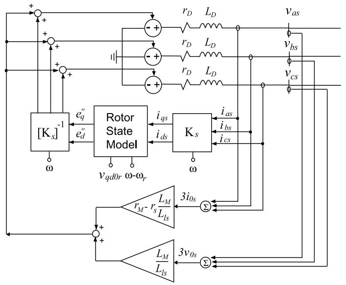  
Figure 3.3 Proposed voltage-behind-reactance model formulation.

# 3.5 Computer Studies

All previously described models were implemented using MATLAB/Simulink [34]. Two types of $qd$ model were used. The first one was a proper state-variable model implemented using standard/basic Simulink blocks. The resulting model/subsystem requires voltages as inputs and currents as outputs and has no circuit interface. The second $qd$ machine model was the built-in SPS model [24]. SPS is a circuits-based simulation toolbox widely used for power- and power-electronic-systems transient simulations using Matlab/Simulink environment. The VBR models and the CC model were implemented using the circuit-based approach described in [35] and the toolbox [36]. In general, similar to a synchronous machine [31, see Sec. V], the CC model could be implemented using either currents or the flux linkages as the state variables. However, if the stator circuit is to be interfaced with the external network where the currents are used as the independent variables, then machine currents must be considered as the state variables.

An induction machine with parameters summarized in Appendix D is considered here for simulating a no-load start-up transient. Since the focus of this section is on component level, in the studies presented here the machine is directly fed from an ideal balance three-phase voltage

source. To evaluate the accuracy and efficiency of all models considered in this paper, the simulation studies were carried out using variable- as well as fixed-time-step integration methods.

# 3.5.1 Variable-Step Method

To make a fair comparison among the models, the same solver, ODE15s, was used for each model. To ensure smooth and accurate solution, the relative and absolute error tolerances were set to $10^{-4}$ and $10^{-6}$ , respectively. Also, the maximum and minimum time-step limits were set to $10^{-3}$ and $10^{-10}$ s, respectively, while the initial step was set to $10^{-5}$ s.

The transient responses produced by the $qd$ models, three types of VBR models, and the CC model using the variable-step integration method are depicted in Fig. 3.4. Due to space limitations, only the rotor current $i_{ar}$ , the speed $\omega_r$ , and the electromagnetic torque $T_e$ are shown. As can be seen in Fig. 3.4, all responses are visibly indistinguishable from each other. This result confirms that all models are consistent and equivalent, provided sufficiently small error tolerances and/or integration step size.

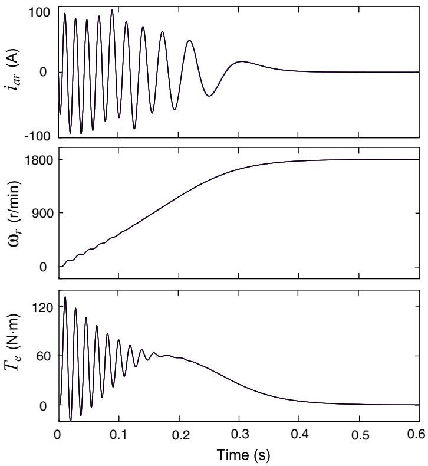  
Figure 3.4 Simulation results for five models using variable-step method.

Assuming the same simulation accuracy for each model, the numerical efficiency of the models relative to each other may be evaluated by considering two factors: (i) the total number of integration steps taken to complete the study; and (ii) the computational load/cost per time step.

The studies were run on a personal computer with an AMD 2200 processor using standard (not compiled, non-real-time) Simulink. The total CPU times, number of integration steps, and CPU times per step required to complete the study of Fig. 3.4 are summarized in Table 3.1.

As can be seen in Table 3.1, the bare-bones $qd$ model, implemented in Simulink directly without circuit interface, has the fastest simulation speed (0.062s) and the lowest computational cost requiring only 744 steps. The time-varying inductance matrix $\mathbf{L}(t)$ and the $p\mathbf{L}_{abc}$ term in the CC model (see Appendix C) leads to a significant increase in the CPU time per step (218.8 μs) compared with the $qd$ model (83.3 μs). In addition, the CC model requires significantly more time steps (5283) to achieve the same accuracy. The SPS machine model, when fed by ideal voltage sources, preserves the advantage of the $qd$ model and takes small number of time steps (1105), although some computational overhead exist in SPS that cause its model run slower (0.313s) than the bare-bones Simulink $qd$ model (0.062s).

At the same time, all three VBR models performed very similarly to each other, which is expected since these models are algebraically equivalent, with only structural differences. The VBR models required more steps (1036 - 1082) and CPU time (0.157s) than the bare-bones $qd$ model, but generally performed by a factor of 2 faster than the SPS model (0.313s). The proposed VBR models also demonstrated about 7.4 times improvement compared with the CC model in terms of the overall CPU time required for the given study.

Table 3.1 Simulation Efficiency Comparisons   

<table><tr><td>Model</td><td>CPU Time, s</td><td>Num. of Steps</td><td>CPU Time per Step, μs</td></tr><tr><td>QD</td><td>0.062</td><td>744</td><td>83.3</td></tr><tr><td>CC</td><td>1.156</td><td>5283</td><td>218.8</td></tr><tr><td>SPS</td><td>0.313</td><td>1105</td><td>283.3</td></tr><tr><td>VBR-I</td><td>0.156</td><td>1036</td><td>150.6</td></tr><tr><td>VBR-II</td><td>0.157</td><td>1082</td><td>145.1</td></tr><tr><td>VBR-III</td><td>0.157</td><td>1075</td><td>146.0</td></tr></table>

# 3.5.2 Fixed-Step Method

To further compare the numerical properties of the different models, the same case study is simulated with the fixed time-step integration method. To have a benchmark for comparing the simulation accuracy, a reference solution was obtained using the $qd$ model with the fixed-step $4^{\text{th}}$ -order Runge-Kutta integration method and a very small time step of $1\mu s$ . The study was

repeated for all considered models using the same $4^{\text{th}}$ -order Runge-Kutta method, but with a much larger time step of 1ms. The simulation results are shown in Figs. 3.5 - 3.7, where it can be seen that all models predict a similar response. However, it now becomes noticeable that the CC model (dotted line) is the farthest from the reference solution (solid line). A detailed view of the rotor current plot is shown in Fig. 3.8, wherein the plot is magnified to clearly show this difference.

Without loss of generality, the rotor current trajectory is considered here to further quantify the numerical accuracy, since the other variables show a similar trend. The cumulative relative error between the reference solution $\tilde{i}_{ar}$ and a given numerical solution $i_{ar}$ , as defined in terms of 2-norm [37], is evaluated as

$$
\varepsilon (h) = \frac {\left\| \widetilde {i} _ {a r} - i _ {a r} \right\| _ {2}}{\left\| \widetilde {i} _ {a r} \right\| _ {2}} \times 100 \% \tag{3.63}
$$

for different time steps $h$ .

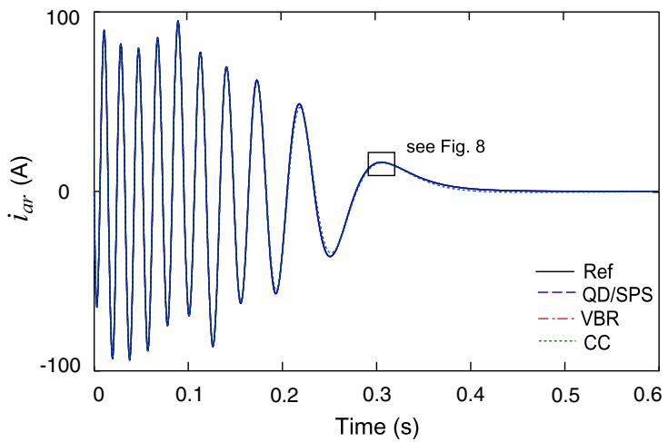  
Figure 3.5 Rotor current $i_{ar}$ with time step of $1ms$ .

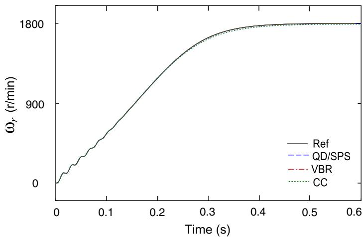

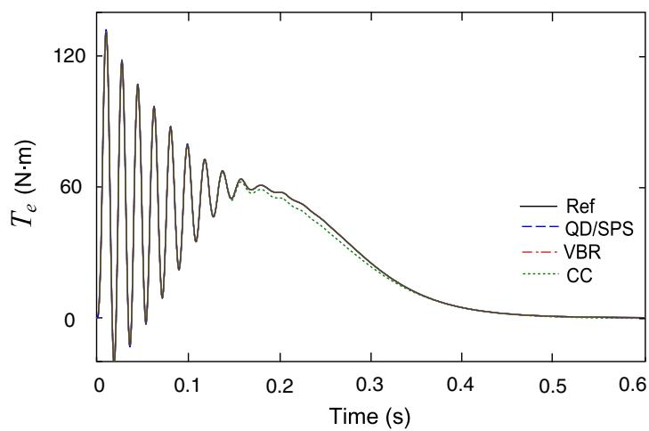  
Figure 3.6 Rotor rotating speed $\omega_{r}$ with time step of $1ms$ .

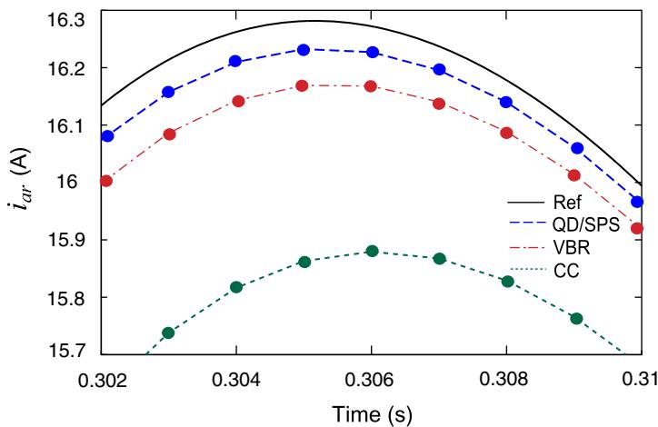  
Figure 3.7 Electromagnetic torque $T_{e}$ with time step of 1ms.   
Figure 3.8 Detailed view of rotor current $i_{ar}$ with time step of 1ms.

The simulation was run using time steps of $0.1ms$ , $0.5ms$ , and $1ms$ . The calculated errors for the different models are shown in Fig. 3.9. As shown in Figs. 3.8 and 3.9, the bare-bones

$qd$ model and the SPS $qd$ model produce exactly the same simulation results (shown in dashed line), and gave the smallest errors compared with the other models. This is expected since the SPS uses the $qd$ model internally and the external circuit was just the ideal voltage sources. All of the VBR models (dash/dotted line) demonstrated identical results and accuracy, as these models all use similar state-space equations and differ only in the form of stator branches. The least accurate performance was demonstrated by the CC model (dotted line).

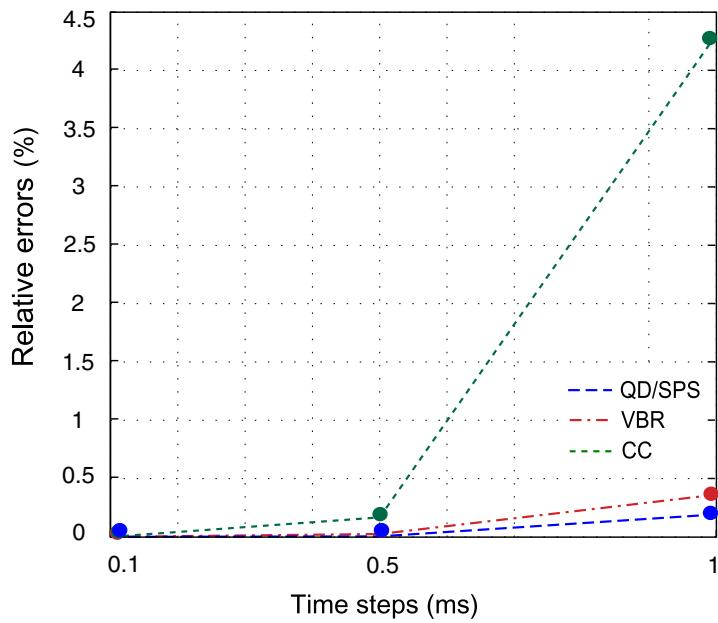  
Figure 3.9 Numerical error propagation of $i_{ar}$ .

# 3.6 Eigensystem Analysis

The $qd$ models, the CC model, and the VBR models are all equivalent in the continuous time domain since these models are derived from each other without approximations. However, as demonstrated in Section V, the numerical properties of these models are quite different when the corresponding differential equations are discretized using an integration rule. In general, for non-linear time-varying systems, the choice of state variables and/or the model structure may result in different eigenvalues of the system. The eigenvalues may influence the propagation of local errors and therefore affect the simulation accuracy when the differential equations are integrated numerically [38].

To gain some qualitative information and understanding of the numerical properties of the machine models described here, one may consider the state equations formed by the electrical circuit (see Fig. 2) of the machine [31]. In particular, if the rotor speed is assumed to be constant,

the machine's nonlinear equations become linear, which allows one to express the corresponding system matrices. The resulting system matrices of various machine models are summarized in Appendix C, based on which the eigenvalues can be readily calculated. Alternatively, the respective models can be numerically linearized using a standard Matlab subroutine. Regardless of the approach, one should bear in mind that the eigenvalues of the induction machine model change quite significantly with speed [9, see Chap. 8]. For comparison, the eigenvalues of all models were computed at an operating point close to steady state at no load (operating point corresponding to $t = 0.6s$ in the study shown in Fig. 3.4). The resulting eigenvalues are summarized in Table 3.2.

Table 3.2 Eigenvalues of Machine models   

<table><tr><td>QD/SPS</td><td>CC</td><td>VBR-I, -II, -III</td></tr><tr><td>-19.52</td><td>1407</td><td>-0.016</td></tr><tr><td>-89.3 + j315.9</td><td>1406</td><td>-90.9 + j54.2</td></tr><tr><td>-89.3 - j315.9</td><td>0</td><td>-90.9 - j54.2</td></tr><tr><td>-218.1 + j60.4</td><td>-1723</td><td>-226.3 + j322.9</td></tr><tr><td>-218.1 - j60.4</td><td>-1724</td><td>-226.3 - j322.9</td></tr><tr><td>-217.5 / (N/A)</td><td>-217.5</td><td>-217.5</td></tr><tr><td>-408 / (N/A)</td><td>-408</td><td>-408</td></tr></table>

In general, the negative real part of the eigenvalues is desirable for better damping, whereas positive eigenvalues tend to increase the local errors [39]. From this viewpoint, the $qd$ model is well-structured, since all of its eigenvalues are relatively far to the left-side of the complex plane, as can be seen in Table 3.2. However, the CC model uses currents as state variables and has positive eigenvalues, which increases propagation of local errors and therefore reduces the simulation accuracy. A similar observation regarding the synchronous machine models has been made in [31].

An important observation can be made regarding the bare-bones $qd$ model and the SPS $qd$ model. In particular, the eigenvalues of these two models are identical which also explains their identical simulation results in the previous studies. However, it should be noted that the SPS $qd$ model ignores the stator and rotor zero sequence modes and that the two associated eigenvalues -217.5 and -408 are not present here.

Similar observation may be made for VBR models. Structurally, all three VBR models result in stator circuits (with constant stator inductances and resistances) that use currents as the independent variables, whereas the rotor subsystem uses flux linkages as the independent variables. Since these models are using the same set of state variables, their eigenvalues are identical, as shown in Table II. More importantly, the VBR models have negative eigenvalues and

therefore their numerical properties are similar to those of the $qd$ model, as was confirmed in Section V.

# 3.7 Discussion

The induction-machine models discussed in this paper may find their use depending on the modeling environment and application. For example, in differential-equation- or state-variable-based simulators (wherever there is no need to have a circuit interface) the machines may be considered as proper subsystems described by their corresponding equations. For these simulators, the $qd$ model is perhaps the most accurate and simplest to use. However, for circuit-based simulation language, the machine stator windings must be made available for the interface with the external network. The coupled-circuit phase-domain machine models are often used to fulfill this requirement, however, they are computationally more expensive and less accurate. The VBR models derived in this paper provide a good compromise among the models and offer very good structural as well numerical properties. Moreover, the final formulation VBR-III results in a decoupled (diagonal inductance and resistance matrices) time-invariant stator circuit, which allows a direct and simple interface of the stator branches with an external network. To demonstrate the advantages of the VBR model over the $qd$ model in terms of the model interface with the external network, it is sufficient to include small inductive impedance in the source as shown in Fig. 3.10. Without loss of generality, we conduct studies using the SPS and the proposed VBR model. The same machine as in Section V is used here, except that the voltage source has series inductance of $10^{-3}\mathrm{H}$ in each phase. In the state-variable languages, the typical $qd$ model is viewed and interfaced as a voltage-controlled current source (voltage input and current output). Therefore, the direct connection of machine terminals with inductive braches (or current sources) is not possible as it create difficulties for forming the system's state space equations [21]–[24]. An approach that is often considered and suggested to the users for interfacing the machine models [22]–[23], is to use an artificial shunt snubber circuit (very large resistors and/or small capacitors), which makes it possible to calculate the voltages at the interconnection point of the machine model and the external circuit, and therefore completes the interface. In the studies presented here, to enable the SPS model interface, a shunt resistive branch was connected as shown in Fig. 3.10. In general, the values of such artificial snubbers are chosen large enough as to minimize their effect on the simulation accuracy. However, when the VBR model is used, the stator $RL$ branches are directly included into the external

circuit-network (see Fig. 3.3) and no artificial components are required.

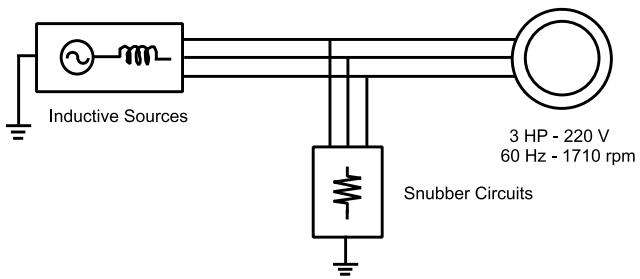  
Figure 3.10 Induction machine is fed from a voltage source with inductive impedance: Artificial shunt resistors are used to interface the model.

The same start-up transient study is performed for this case using the SPS $qd$ model with snubber resistors of $10^{3}\Omega$ and the proposed VBR-III model. The same variable-step ODE solver and integration parameters (error tolerances and time-step limits) as in Section V.A are used here. The predicted responses are overlapped with the reference solution and shown in Fig. 3.11 - 3.12. Due to space limitation, only the rotor current $i_{ar}$ is shown here. The reference solution are obtained using the barebone $qd$ model with the fixed-step $4^{\text{th}}$ -order Runge-Kutta integration method and a very small time step of $1\mu s$ . In general, the transient trend is very similar to that shown in Section V (see Figs. 3.4 and 3.5) and the difference among the models is not noticed. This has been achieved by using relatively large values for the snubber resistors in the SPS model. However, the magnified plot of $i_{ar}$ shown in Fig. 3.12 demonstrates that the SPS model actually converges to a different solution, which is shifted from the reference.

Another important observation that can be made based on Fig. 3.12 is that the SPS $qd$ model uses significantly more time steps than the VBR model. To give the reader a better idea, the CPU times and the number of steps taken by the two models are summarized in Table 3.3 where a very significant difference (an order of magnitude) can be seen.

The presence of fictitious resistors also changes the network topology, as well as increases the total number of state variables due to the source inductance. Moreover, the resulting equations become very stiff, which can be noted by evaluating the eigenvalues summarized in Table 3.4, where it is shown that the SPS model now has three additional eigenvalues with very large magnitude on the order of $10^{6}$ . At the same time, for the VBR model, the source inductances do not increase the numbers of the eigenvalues and/or affect the stiffness. It may be noted that the VBR model in Table 3.3 doesn't include the eigenvalues corresponding to stator and rotor zero

sequences as it does in Table 3.2. For discussion in this Section and consistency with the SPS model, here, the zero sequence was not included in the VBR model.

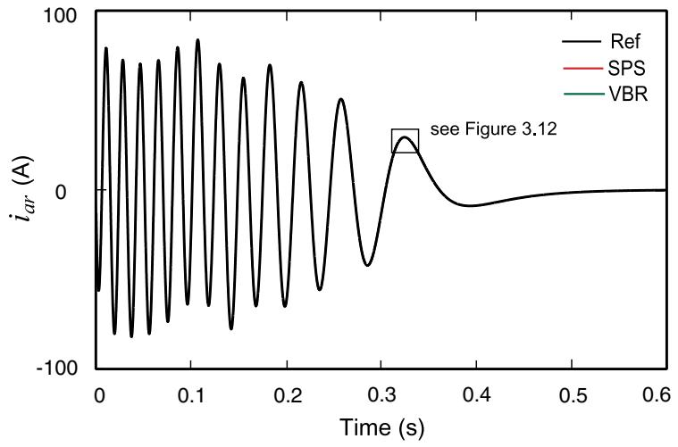  
Figure 3.11 Rotor current $i_{ar}$ with variable-step method.

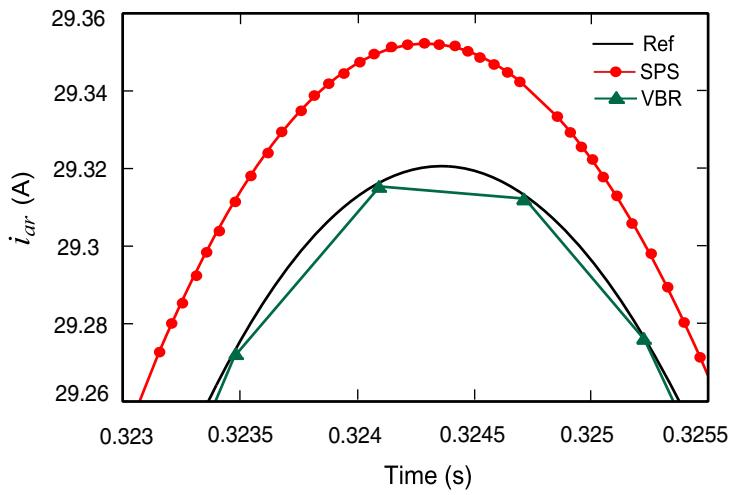  
Figure 3.12 Magnified portion of rotor current $i_{ar}$ in Figure 3.11.

Table 3.3 Simulation Efficiency Comparisons   

<table><tr><td>Model</td><td>CPU Time, s</td><td>Num. of Steps</td><td>CPU Time per Step, μs</td></tr><tr><td>SPS</td><td>1.828</td><td>11504</td><td>158.9</td></tr><tr><td>VBR-III</td><td>0.156</td><td>1058</td><td>147.7</td></tr></table>

Table 3.4 Eigenvalues of Machine Models   

<table><tr><td>SPS</td><td>VBR</td></tr><tr><td>-18.93</td><td>-0.016</td></tr><tr><td>-33.44 + j275.7</td><td>-79.5 + j33.6</td></tr><tr><td>-33.44 - j275.7</td><td>-79.5 - j33.6</td></tr><tr><td>-212.45 + j23.47</td><td>-175.9 + j343.5</td></tr><tr><td>-212.45 - j23.47</td><td>-175.9 - j343.5</td></tr><tr><td>-1.00e6</td><td>N/A</td></tr><tr><td>-1.25e6 + j76.27</td><td>N/A</td></tr><tr><td>-1.25e6 - j76.27</td><td>N/A</td></tr></table>

The affects of the snubber circuits on the simulation accuracy and efficiency may be further investigated by varying the values of resistors from 10 to $10^{5}\Omega$ . Without loss of generality, here we again consider the relative errors for rotor current $i_{ar}$ , which are calculated for the SPS model according to (3.63) and are plotted in Fig. 3.13. The magnitude of the largest negative eigenvalue is also plotted in Fig. 3.13 for the same range of snubber resistance. As can be seen here, it is possible to use very large resistors and achieve a high accuracy of such interface bring the errors below few percent. However, such improvement in accuracy comes at a price of making the system very stiff numerically.

The result of increasing numerical stiffness is that the ODE solver requires smaller and smaller time-steps to satisfy the absolute and relative tolerances, which slows down the overall simulation. To give the reader a better idea, the number of time steps taken by the SPS model to complete the same transient study for the same range of snubber resistors is summarized in Fig. 3.14. As can be seen in Figs. 3.13 and 3.14, to achieve the solution within $1\%$ of the reference solution, the SPS model requires the subbers of $10^{5}\Omega$ which makes the system very stiff and bring the number of time steps to the range of $10^{5}$ . At the same time, as evident from Fig. 3.9, the VBR model can achieve an even better accuracy with time steps as large as 1ms requiring 600 steps total.

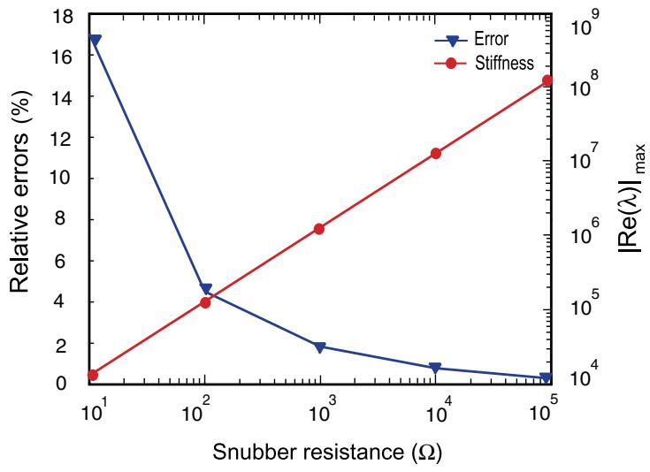

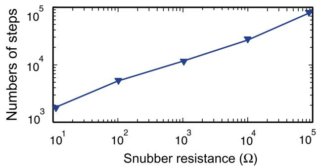  
Figure 3.13 Relative errors and stiffness of the SPS model for different snubber resistances.   
Figure 3.14 Numbers of time steps required by the SPS model for different snubber resistances.

# 3.8 Conclusion

This paper presents a voltage-behind-reactance induction machine model that can be of great benefit in applications where a direct interface of the stator phase branches with an external network-circuit is required. Traditionally, in such applications the coupled-circuit phase-domain models are used, which results in significant increase in computational cost due to time-varying inductances. A method of interfacing the $qd$ machine models with external inductive circuits in state-variable languages often requires artificial snubbers that also increase computational burden. However, the proposed VBR model, in addition to achieving the required direct interface of the stator circuit, also provides an improved numerical accuracy with greatly reduced computational overhead.

# 3.9 References

[1] S H. C. Stanley, "An analysis of the induction motor," AIEEE Transactions, vol. 57, pp 751-755, 1938.   
[2] D. S. Brereton, D. G. Lewis, and C. G. Young, “Representation of induction motor loads during power system stability studies,” AIEEE Transactions, vol. 76, pp. 451–461, Aug. 1957.   
[3] G. Kron, Equivalent Circuit of Electric Machinery. John Wiley and Sons, New York, 1951.   
[4] S. J. Salon, Finite Element Analysis of Electrical Machines, Kluwer Academic Publishers, 1995.   
[5] G. R. Slemon, “An equivalent circuit approach to analysis of synchronous machines with saliency and saturation,” IEEE Trans. Energy Conversion, vol. 5, no. 3, pp. 538–545, Sept. 1990.   
[6] Y. Xiao, G. R. Slemon, and M. R. Iravani, “Implementation of an equivalent circuit approach to the analysis of synchronous machines,” IEEE Trans. Energy Conversion, vol. 9, no. 4, pp. 717–723, Dec. 1994.   
[7] P. C. Krause and C. H. Thomas, “Simulation of symmetrical induction machinery,” IEEE Trans. Power Apparatus and Systems, vol. 84, pp. 1038–1053, Nov. 1965.   
[8] P. Kundur, Power System Stability and Control, McGraw-Hill, New York, 1994, ch. 3.   
[9] P. C. Krause, O. Wasynczuk, and S. D. Sudhoff, Analysis of Electric Machinery and Drive Systems, $2^{\mathrm{nd}}$ Edition, IEEE Press, Piscataway, NJ, 2002.   
[10]S. D. Sudhoff, O.Wasynczuk, "Analysis and average-value modeling of line-commutated converter-synchronous machine systems," IEEE Trans. on Energy Conversion, vol. 8, no. 1, pp. 92-99, Mar. 1993.   
[11]S. D. Sudhoff, K. A. Corzine, H. J. Hegner, D. E. Delisle, “Transient and dynamic average-value modeling of synchronous machine fed load-commutated converters,” IEEE Trans. on Energy Conversion, vol. 11, no. 3, pp. 508–514, Sept. 1996.   
[12] B. T. Kuhn, S. D. Sudhoff, C. A. Whitcomb, “Performance characteristics and average-value modeling of auxiliary resonant commutated pole converter based induction motor drives,” IEEE Trans. on Energy Conversion, vol. 14, no. 3, pp. 493–499, Sept. 1999.   
[13]J. Jatskevich, S.D. Pekarek, A. Davoudi, “Parametric average-value model of synchronous machine-rectifier systems,” IEEE Trans. on Energy Conversion, vol. 21, no. 1, pp. 9–18, Mar. 2006.   
[14]J. Jatskevich, S.D. Pekarek, A. Davoudi, “Fast procedure for constructing an accurate dynamic average-value model of synchronous machine-rectifier systems,” IEEE Trans. on Energy Conversion, vol. 21, no. 2, pp. 435–441, Jun. 2006.   
[15] H. W. Dommel, EMTP Theory Book, MicroTran Power System Analysis Corporation, Vancouver, Canada, May 1992, ch. 8.   
[16] V. Brandwajn, "Synchronous generator models for the analysis of electromagnetic transients," Ph.D. thesis, University of British Columbia, Vancouver, Canada, 1977.   
[17]X. Cao, A. Kurita, H. Mitsuma, Y. Tada and H. Okamoto, “Improvements of numerical stability of electromagnetic transient simulation by use of phase-domain synchronous machine models,” Electrical

Engineering in Japan, vol. 128, no. 3, April, 1999.   
[18] A. B. Dehkordi, A. M. Gole and T. L. Maguire, “Permanent magnet synchronous machine model for real-time simulation,” Proc. of *Interracial Conference on Power Systems Transients (IPST'05)*, Montreal, Canada, June, 2005.   
[19]L. Wang and J. Jatskevich, “A voltage-behind-reactance synchronous machine model for the EMTP-type solution,” IEEE Trans. on Power Systems, vol. 21, no. 4, pp. 1539–1549, Nov. 2006.   
[20]L. Wang, J. Jatskevich and H. W. Dommel, "Re-examination of Synchronous Machine Modeling Techniques for Electromagnetic Transient Simulations," IEEE Trans. on Power Systems, vol. 22, no. 3, pp. 516-527, Aug. 2007.   
[21]SimPowerSystems 4 - User Guide, The MathWorks, Inc., Natick, Massachusetts, 2007. Available: www.mathworks.com.   
[22] Piecewise Linear Electrical Circuit Simulation (PLECS) User Manual, Version. 1.5, Plexim GmbH, 2006. Available at: www.plexim.com.   
[23] R. Champagne, L.-A. Dessaint, H. Fortin-Blanchette and G. Sybille, “Analysis and validation of a real-time AC drive simulator,” IEEE Trans. on Power Electronics, vol. 19, no. 2, pp. 336–345, Mar. 2004.   
[24]SimPowerSystems 4 - Reference Manual, The MathWorks, Inc., Natick, Massachusetts, 2007. Available: www.mathworks.com.   
[25] J. R. Marti and T. O. Myers, "Phase-domain induction motor model for power system simulators," IEEE Conference Communications, Power, and Computing, vol. 2, pp. 276-282, May 1995.   
[26] J. R. Marti and K. W. Louie, “A phase-domain synchronous generator model including saturation effects,” IEEE Trans. Power Systems, vol. 12, no. 1, pp. 222–229, Feb. 1997.   
[27] W. Gao, E. V. Solodovnik and R. A. Dougal, "Symbolically aided model development for an induction machine in virtual test bed," IEEE Trans. Energy Conversion, vol. 19 no. 1, pp. 125-135, Mar. 2004.   
[28] R. W. Y. Cheung, H. Jin, B. Wu, J. D. Lavers, "A generalized computer-aided formulation for the dynamic and steady state analysis of induction machine inverter drive systems," IEEE Trans. on Energy Conversion, vol. 5 no. 2, pp. 337-343, Jun. 1990.   
[29]C. T. Liu, W. L. Chang, “A generalized technique for modeling switch-controlled induction machine circuits,” IEEE Trans. on Energy Conversion, vol. 7, no. 1, pp. 168–176, Mar. 1992.   
[30]P. Pillay, V. Levin, "Mathematical models for induction machines," in Conf. Rec. 1995 IEEE Industry Applications Conf., Thirtieth IAS Annual Meeting, vol. 1, 8-12, pp. 606-616, Oct. 1995.   
[31] S. D. Pekarek, O. Wasynczuk, and H. J. Hegner, "An efficient and accurate model for the simulation and analysis of synchronous machine/converter systems," IEEE Trans. Energy Conv., vol. 13 no. 1, pp. 42-48, Mar. 1998.   
[32] W. Zhu, S. D. Pekarek, J. Jatskevich, O. Wasynczuk, and D. Delisle, “A model-in-the-loop interface to emulate source dynamics in a zonal DC distribution system,” IEEE Trans. Power Electronics., vol. 20 no. 2, pp. 438–445, Mar. 2005.

[33]R. R. Nucera, S. D. Sudhoff, P. C. Krause, “Computation of steady-state performance of an electronically commutated motor,” IEEE Trans. on Industry Application, vol. 25, no. 6, pp. 1110–1117, Nov. / Dec. 1989.   
[34]Simulink Dynamic System Simulation Software - Users Manual, MathWorks, Inc., Natick, Massachusetts, 2005.   
[35] O. Wasynczuk, S. D. Sudhoff, "Automated state model generation algorithm for power circuits and systems," IEEE Trans. on Power Systems, vol. 11, no. 4, pp. 1951-1956, Nov. 1996.   
[36] Automated State Model Generator (ASMG), Reference Manual, Version 2, PC Krause and Associates Inc., 2002. Available at: www.pcka.com   
[37] W. Gautchi, Numerical Analysis: An Introduction, Birkhauser, Boston, Massachusetts, 1997.   
[38]L. O. Chua and P-M Lin, Computer Aided Analysis of Electronic Circuit: Algorithms and Computational Techniques. Prentice-Hall, Englewood Cliffs, New Jersey, pp. 43-45, 1975.   
[39]Uri Ascher and Linda R. Petzold, Computer Methods for Ordinary Differential Equations and Differential-Algebraic Equations. SIAM, Philadelphia, 1998, ch. 2.

# 4 A VOLTAGE-BEHIND-RREACTANCE INDUCTION MACHINE MODEL FOR THE EMTP-TYPE SOLUTION

# 4.1 Introduction

Induction machines are widely used in power systems, primarily as traditional industrial loads but also as generators in some energy sources, as well as in many other applications. Depending on the required accuracy and the objectives of studies, various models have been proposed in the literature. This paper focuses on the full-order general purpose induction machine models that are suitable for the Electro-Magnetic Transient Program (EMTP) [1]. The EMTP and its derivative programs are extensively used by many engineers and researchers in industry and academia as powerful and standard simulation tools, wherein the classical full-order machine models are often available as built-in components. Improving the numerical efficiency and accuracy of the induction machine models for EMTP-type solutions has been attractive for a long time and will potentially have a very significant impact, since these models are widely used.

Most machine models used in standard EMTP software packages [2]–[5] are based on $qd$ reference frame. These models include the universal machine (UM) model in ATP [6], the Type-50 induction machine model in MicroTran [7]–[8], the built-in induction machine model in PSCAD/EMTDC [9], and the asynchronous machine model (ASM) model in EMTP-RV [10].

The main advantage of using the $qd$ transformation in the above-mentioned models is that it results in constant inductance matrices, which simplifies its implementation. However, since the external circuit-network is represented in physical abc-variables (coordinates), the interface of the machine-network becomes complicated by the $qd / abc$ transformations.

In ATP, the induction machine is represented using the UM model and the interface is achieved using the compensation method, in which the external ac system is represented as a Thevenin equivalent in $qd$ axes [6]. In this method, the machines are required to be separated by transmission lines or artificially inserted "stub lines" to avoid solving a system of nonlinear equations. In MicroTran, the Type-50 machine model is interfaced using the three-phase Thevenin

equivalent circuits of machine and the prediction of machine electrical and mechanical variables. In PSCAD/EMTDC, the induction machine model is represented as Norton current sources that are updated according to the terminal voltages in the previous time step [9]. The above-mentioned methods of interfacing the traditional $qd$ machine model with the EMTP network solution artificially reduce simulation efficiency by requiring a small time-step $\Delta t$ to keep the interfacing error under a certain tolerance. However, when larger time-steps are used, the simulation accuracy quickly deteriorates and may even cause numerical instability [11]-[13]. In a newer program, EMTP-RV, the induction machine model may be treated as a true nonlinear component, and the network-machine equations may be solved simultaneously using Newton's iterative method [14]-[15], which results in additional computational expense.

To avoid the complex interface of traditional $qd$ machine models, several researchers have proposed using the coupled-circuit model in physical abc -variables (coordinates) for the EMTP solution [16]-[19]. In the EMTP community, this approach is known as the phase-domain (PD) model, which naturally results in a direct interface of the machine's windings with the external network and achieves the desired simultaneous solution. However, the direct interface offered by the PD model comes at a price of rotor-position-dependent inductances and the increased computational overhead.

In the search for more efficient machine models, the so-called voltage-behind-reactance (VBR) model was originally derived for synchronous machines and implemented using the state-variable approach [20]–[21]. The implementation of the VBR synchronous machine model for EMTP-type solution is documented in [22]. Similar to the coupled-circuit PD model, the VBR model also provides the stator $RL$ -branches available for direct interface with the external circuit, but has improved structural and numerical properties. The interested reader may find a very detailed analysis and comparison of the VBR and PD synchronous machine models in [20], [22]. In [23], VBR model formulation has been extended to the induction machine using the state-variable approach, offering several VBR models based on the structure of the stator $RL$ -branches.

This paper extends the previous work of [20]–[23] and presents a VBR induction machine model for the EMTP-type solution. Similar to the synchronous machine VBR model [22], the new induction machine model also achieves simultaneous solution of the machine-network electrical variables. However, a number of additional improvements become possible by taking advantage of the rotor's symmetry. To the best of the authors' knowledge, similar models or results have not been previously reported in the literature. The properties of the proposed model and the overall contributions of this paper can be summarized as follows:

- For generality, the proposed VBR model is derived in arbitrary reference frame (ARF) [24]. It is noted that the stationary reference frame (StaRF) may be used to reduce the number of trigonometric function evaluations and achieve faster execution times.   
- We describe a very efficient numerical implementation of the proposed VBR and the established PD models by taking advantage of the symmetry of coefficient matrices as well as indirect calculation of trigonometric functions.   
- We provide both iterative and non-iterative solution methods of the machine-network equations. However, the proposed model is shown to achieve satisfactory accuracy without iterations on mechanical variables, even at very large time steps.   
- We present computer studies and show that the proposed model has overall improved numerical accuracy and efficiency compared with the existing PD model and the traditional $qd$ model. We also present efficient numerical implementation of the proposed model, in which one time-step requires as little as 108 floating-point operations (flops) using ANSI C code, taking $1.6\mu s$ of CPU time on a modest personal computer (PC).

# 4.2 Machine Models

Without loss of generality, in this paper we assume a full-order 3-phase symmetrical induction machine model [25], where the rotor circuit may be short-circuited to represent the squirrel-cage induction machines. To simplify the notations, all rotor variables are referred to the stator side using an appropriate turn ratio. Motor convention is used for the direction of currents and developed electromagnetic torque. The associated coupled-circuit diagram may be found in [25, chap. 4] and is not included here due to space limitations.

For the purpose of comparison and evaluation of the models considered in this paper, the mechanical dynamics is assumed to be defined by a single rigid body system described by the following equations:

$$
p \theta_ {r} = \omega_ {r} \tag {4.1}
$$

$$
p \omega_ {r} = \frac {P}{2 J} \left(T _ {e} - T _ {m}\right) \tag {4.2}
$$

Here, the operator $p = d / dt$ ; $\theta_r$ and $\omega_r$ are the rotor position and angular electrical speed,

respectively; and $T_{m}$ and $T_{e}$ are the combined mechanical torque and developed electromagnetic torque, respectively. However, the electrical subsystem of induction machine models may be represented in several different ways. The description of conventional $qd$ model may be found in [25], and it is not included here due to limited space. However, to facilitate further discussion, the PD and VBR models are briefly described below.

# 4.2.1 Phase-Domain Model

The PD model of induction machines is defined by the corresponding voltage and flux linkage equations, as

$$
\left[ \begin{array}{l} \mathbf {v} _ {a b c s} \\ 0 _ {3 \times 1} \end{array} \right] = \mathbf {R} \left[ \begin{array}{l} \mathbf {i} _ {a b c s} \\ \mathbf {i} _ {a b c r} \end{array} \right] + p \left[ \begin{array}{l} \boldsymbol {\lambda} _ {a b c s} \\ \boldsymbol {\lambda} _ {a b c r} \end{array} \right] \tag {4.3}
$$

and

$$
\left[ \begin{array}{l} \boldsymbol {\lambda} _ {a b c s} \\ \boldsymbol {\lambda} _ {a b c r} \end{array} \right] = \mathbf {L} \left(\theta_ {r}\right) \left[ \begin{array}{l} \mathbf {i} _ {a b c s} \\ \mathbf {i} _ {a b c r} \end{array} \right] \tag {4.4}
$$

where the machine's inductance matrix is

$$
\mathbf {L} \left(\theta_ {r}\right) = \left[ \begin{array}{c c} \mathbf {L} _ {s} & \mathbf {L} _ {s r} \left(\theta_ {r}\right) \\ \mathbf {L} _ {r s} \left(\theta_ {r}\right) & \mathbf {L} _ {r} \end{array} \right] \tag {4.5}
$$

The expressions for the stator and rotor self and mutual inductance matrices can be found in [25, chap. 4] and are not included here due to space considerations. However, it is important to note that the mutual inductance matrices $\mathbf{L}_{sr}(\theta_r)$ and $\mathbf{L}_{rs}(\theta_r)$ in the PD model are dependent on rotor position. The developed electromagnetic torque is

$$
T _ {e} = \left(\frac {P}{2}\right) \left[ \mathbf {i} _ {a b c s} \right] ^ {T} \frac {\partial}{\partial \theta_ {r}} \left[ \mathbf {L} _ {s r} \left(\theta_ {r}\right) \right] \mathbf {i} _ {a b c r} \tag {4.6}
$$

# 4.2.2 Voltage-Behind-Reactance Model

As shown in [23], several VBR models may be derived for the induction machine. Without loss of generality, this paper utilizes the voltage-behind-reactance formulation [23, see VBR-III], which assumes ungrounded stator windings and results in diagonal stator resistance and inductance matrices - an advantageous structural property of the model. To consider grounded stator windings, other VBR formulations are possible to appropriately include the zero sequence [23]. In

the model considered here, ARF is assumed and the stator voltage equation may be represented as

$$
\mathbf {v} _ {a b c s} = \mathbf {R} _ {D} \mathbf {i} _ {a b c s} + \mathbf {L} _ {D} p \mathbf {i} _ {a b c s} + \mathbf {e} _ {a b c s} ^ {\prime \prime} \tag {4.7}
$$

where

$$
\mathbf {R} _ {D} = \operatorname {d i a g} \left(r _ {D}, r _ {D}, r _ {D}\right) \tag {4.8}
$$

$$
\mathbf {L} _ {D} = \operatorname {d i a g} \left(L _ {D}, L _ {D}, L _ {D}\right) \tag {4.9}
$$

with

$$
r _ {D} = r _ {s} + \frac {L _ {m} ^ {\prime \prime 2}}{L _ {l r} ^ {2}} r _ {r} \tag {4.10}
$$

$$
L _ {D} = L _ {l s} + L _ {m} ^ {\prime \prime} \tag {4.11}
$$

$$
L _ {m} ^ {\prime \prime} = \left(\frac {1}{L _ {m}} + \frac {1}{L _ {l r}}\right) ^ {- 1} \tag {4.12}
$$

The so-called subtransient voltages $\mathbf{e}_{abc}^{\prime \prime}$ in (4.7) are

$$
\mathbf {e} _ {a b c s} ^ {\prime \prime} = \mathbf {K} _ {s} ^ {- 1} \left[ \begin{array}{l l l} e _ {q} ^ {\prime \prime} & e _ {d} ^ {\prime \prime} & 0 \end{array} \right] ^ {T} \tag {4.13}
$$

where

$$
\mathbf {K} _ {s} ^ {- 1} = \left[ \begin{array}{c c c} \cos \theta & \sin \theta & 1 \\ \cos \left(\theta - \frac {2 \pi}{3}\right) & \sin \left(\theta - \frac {2 \pi}{3}\right) & 1 \\ \cos \left(\theta + \frac {2 \pi}{3}\right) & \sin \left(\theta + \frac {2 \pi}{3}\right) & 1 \end{array} \right] \tag {4.14}
$$

and

$$
e _ {q} ^ {\prime \prime} = \omega_ {r} L _ {m} ^ {\prime \prime} \frac {\lambda_ {d r}}{L _ {l r}} + \frac {L _ {m} ^ {\prime \prime} r _ {r}}{L _ {l r} ^ {2}} \left(L _ {m} ^ {\prime \prime} \frac {\lambda_ {q r}}{L _ {l r}} - \lambda_ {q r}\right) \tag {4.15}
$$

$$
e _ {d} ^ {\prime \prime} = - \omega_ {r} L _ {m} ^ {\prime \prime} \frac {\lambda_ {q r}}{L _ {l r}} + \frac {L _ {m} ^ {\prime \prime} r _ {r}}{L _ {l r} ^ {2}} \left(L _ {m} ^ {\prime \prime} \frac {\lambda_ {d r}}{L _ {l r}} - \lambda_ {d r}\right) \tag {4.16}
$$

The rotor state equations are expressed using flux linkages as

$$
p \lambda_ {q r} = - \frac {r _ {r}}{L _ {l r}} \left(\lambda_ {q r} - \lambda_ {m q}\right) - \left(\omega - \omega_ {r}\right) \lambda_ {d r} \tag {4.17}
$$

$$
p \lambda_ {d r} = - \frac {r _ {r}}{L _ {l r}} \left(\lambda_ {d r} - \lambda_ {m d}\right) + \left(\omega - \omega_ {r}\right) \lambda_ {q r} \tag {4.18}
$$

where

$$
\lambda_ {m q} = L _ {m} ^ {\prime \prime} \left(i _ {q s} + \frac {\lambda_ {q r}}{L _ {l r}}\right) \tag {4.19}
$$

$$
\lambda_ {m d} = L _ {m} ^ {\prime \prime} \left(i _ {d s} + \frac {\lambda_ {d r}}{L _ {l r}}\right) \tag {4.20}
$$

The electromagnetic torque is expressed directly in terms of mutual flux linkages and stator currents as

$$
T _ {e} = \frac {3 P}{4} \left(\lambda_ {m d} i _ {q s} - \lambda_ {m q} i _ {d s}\right) \tag {4.21}
$$

# 4.3 Model Discretization for the EMTP Solution

The EMTP algorithm requires discretization of the machine's differential equations by applying the implicit trapezoidal rule and forming the corresponding difference equations. For the $qd$ machine model, the discretization procedure may be found in [7] and is not included in this paper. However, since the PD and VBR models have similar model structures and interface with the EMTP, the implementation of these two models is described in this section.

The differential equations of mechanical subsystem (4.1)-(4.2) are discretized as

$$
\theta_ {r} (t) = \theta_ {r} (t - \Delta t) + \frac {\Delta t}{2} \left(\omega_ {r} (t) + \omega_ {r} (t - \Delta t)\right) \tag {4.22}
$$

$$
\omega_ {r} (t) = \omega_ {r} (t - \Delta t) + \frac {\Delta t P}{4 J} \left(T _ {e} (t) + T _ {e} (t - \Delta t)\right) - \frac {\Delta t P}{2 J} T _ {m} \tag {4.23}
$$

which are used by both PD and VBR models. In order to interface the machine's electrical subsystem into the EMTP network, the stator branch difference equations are required to be formulated in the following form:

$$
\mathbf {v} _ {a b c s} (t) = \mathbf {R} _ {e q} (t) \mathbf {i} _ {a b c s} (t) + \mathbf {e} _ {h} (t) \tag {4.24}
$$

where $\mathbf{R}_{eq}(t)$ is the machine branch equivalent resistance matrix and $\mathbf{e}_h(t)$ is the branch

history term.

# 4.3.1 Discretized Phase-Domain Model

The differential equations of the PD model are also discretized using the implicit trapezoidal rule. The resulting stator voltage equation may be derived as

$$
\mathbf {v} _ {a b c s} (t) = \left(\mathbf {r} _ {s} + \frac {2}{\Delta t} \mathbf {L} _ {s}\right) \mathbf {i} _ {a b c s} (t) + \frac {2}{\Delta t} \mathbf {L} _ {s r} (t) \mathbf {i} _ {a b c r} (t) + \mathbf {e} _ {s h} ^ {p d} (t) \tag {4.25}
$$

where

$$
\mathbf {e} _ {s h} ^ {p d} (t) = \left(\mathbf {r} _ {s} - \frac {2}{\Delta t} \mathbf {L} _ {s}\right) \mathbf {i} _ {a b c s} (t - \Delta t) - \frac {2}{\Delta t} \mathbf {L} _ {s r} (t - \Delta t) \mathbf {i} _ {a b c r} (t - \Delta t) - \mathbf {v} _ {a b c s} (t - \Delta t) \tag {4.26}
$$

Discretizing the rotor voltage equation and solving for the rotor currents results in the following:

$$
\mathbf {i} _ {a b c r} (t) = \left(\mathbf {r} _ {r} + \frac {2}{\Delta t} \mathbf {L} _ {r}\right) ^ {- 1} \left(- \frac {2}{\Delta t} \mathbf {L} _ {r s} (t) \mathbf {i} _ {a b c s} (t) - \mathbf {e} _ {r h} ^ {p d} (t)\right) \tag {4.27}
$$

where

$$
\mathbf {e} _ {r h} ^ {p d} (t) = \left(\mathbf {r} _ {r} - \frac {2}{\Delta t} \mathbf {L} _ {r}\right) \mathbf {i} _ {a b c r} (t - \Delta t) - \frac {2}{\Delta t} \mathbf {L} _ {r s} (t - \Delta t) \mathbf {i} _ {a b c s} (t - \Delta t) \tag {4.28}
$$

Substituting (4.27) into (4.25), the stator equation is then formulated as

$$
\mathbf {v} _ {a b c s} (t) = \mathbf {R} _ {e q} ^ {p d} (t) \mathbf {i} _ {a b c s} (t) + \mathbf {e} _ {h} ^ {p d} (t) \tag {4.29}
$$

where

$$
\mathbf {R} _ {e q} ^ {p d} (t) = \mathbf {r} _ {s} + \frac {2}{\Delta t} \mathbf {L} _ {s} - \frac {4}{\Delta t ^ {2}} \mathbf {L} _ {s r} (t) \left(\mathbf {r} _ {r} + \frac {2}{\Delta t} \mathbf {L} _ {r}\right) ^ {- 1} \mathbf {L} _ {r s} (t) \tag {4.30}
$$

and

$$
\mathbf {e} _ {h} ^ {p d} (t) = - \frac {2}{\Delta t} \mathbf {L} _ {s r} (t) \left(\mathbf {r} _ {r} + \frac {2}{\Delta t} \mathbf {L} _ {r}\right) ^ {- 1} \mathbf {e} _ {r h} ^ {p d} (t) + \mathbf {e} _ {s h} ^ {p d} (t) \tag {4.31}
$$

The electromagnetic torque $T_{e}$ is calculated using (4.6) or the corresponding expanded form given in [25, 4.3-7]. Equations (4.29)-(4.31) along with (4.26), (4.28) and the mechanical equations (4.6), (4.22)-(4.23) define the discretized PD model.

# 4.3.2 Discretized Voltage-Behind-Reactance Model

The discretization of induction machine VBR model is very similar to the synchronous machine model presented in [22]. In particular, the stator voltage equation (4.7) is discretized using the implicit trapezoidal rule, resulting in the following difference equation:

$$
\mathbf {v} _ {a b c s} (t) = \left(\mathbf {R} _ {D} + \frac {2}{\Delta t} \mathbf {L} _ {D}\right) \mathbf {i} _ {a b c s} (t) + \mathbf {e} _ {a b c s} ^ {\prime \prime} (t) + \mathbf {e} _ {s h} ^ {v b r} (t) \tag {4.32}
$$

where

$$
\mathbf {e} _ {s h} ^ {v b r} (t) = \left(\mathbf {R} _ {D} - \frac {2}{\Delta t} \mathbf {L} _ {D}\right) \mathbf {i} _ {a b c s} (t - \Delta t) + \mathbf {e} _ {a b c s} ^ {\prime \prime} (t - \Delta t) - \mathbf {v} _ {a b c s} (t - \Delta t) \tag {4.33}
$$

The rotor state equations (4.8)-(4.11) are also discretized using the implicit trapezoid rule as

$$
\boldsymbol {\lambda} _ {q d r} (t) = \mathbf {E} \mathbf {i} _ {q d s} (t) + \mathbf {E} \mathbf {i} _ {q d s} (t - \Delta t) + \mathbf {F} \boldsymbol {\lambda} _ {q d r} (t - \Delta t) \tag {4.34}
$$

where the $2 \times 2$ coefficient matrices $\mathbf{E}$ and $\mathbf{F}$ are dependent on the reference frame speed $\omega$ and the rotor speed $\omega_{r}$ . These coefficient matrices are given in Appendix E. It is important to note that $\mathbf{E}$ and $\mathbf{F}$ are constant in rotor reference frame (RotRF), which then may be utilized to reduce the numerical calculations.

The subtransient voltages $\mathbf{e}_{qd}^{\prime \prime}$ are then found by substituting the rotor state equation (4.34) into (4.15)-(4.16) as

$$
\mathbf {e} _ {q d} ^ {\prime \prime} (t) = \mathbf {M i} _ {q d s} (t) + \mathbf {h} _ {q d r} (t) \tag {4.35}
$$

where

$$
\mathbf {h} _ {q d r} (t) = \mathbf {M} \left[ \begin{array}{l} i _ {q s} (t - \Delta t) \\ i _ {d s} (t - \Delta t) \end{array} \right] + \mathbf {N} \left[ \begin{array}{l} \lambda_ {q r} (t - \Delta t) \\ \lambda_ {d r} (t - \Delta t) \end{array} \right] \tag {4.36}
$$

Here, the $2 \times 2$ coefficient matrices $\mathbf{M}$ and $\mathbf{N}$ are also listed in Appendix E. The subtransient voltages $\mathbf{e}_{qd}^{\prime \prime}$ may be transformed back to abc coordinates using (4.13) as

$$
\mathbf {e} _ {a b c s} ^ {\prime \prime} (t) = \mathbf {K i} _ {a b c s} (t) + \mathbf {e} _ {r} ^ {v b r} (t) \tag {4.37}
$$

where

$$
\mathbf {K} = \mathbf {K} _ {s} ^ {- 1} \left[ \begin{array}{c c} \mathbf {M} & 0 _ {2 \times 1} \\ 0 _ {1 \times 2} & 0 \end{array} \right] \mathbf {K} _ {s} \tag {4.38}
$$

and

$$
\mathbf {e} _ {r} ^ {v b r} (t) = \mathbf {K} _ {s} ^ {- 1} \left[ \begin{array}{c} \mathbf {h} _ {q d r} (t) \\ 0 \end{array} \right] \tag {4.39}
$$

Finally, substituting (4.37) into (4.32), the VBR model can be expressed in the required form as

$$
\mathbf {v} _ {a b c s} (t) = \mathbf {R} _ {e q} ^ {v b r} (t) \mathbf {i} _ {a b c s} (t) + \mathbf {e} _ {h} ^ {v b r} (t) \tag {4.40}
$$

where

$$
\mathbf {R} _ {e q} ^ {v b r} (t) = \mathbf {R} _ {D} + \frac {2}{\Delta t} \mathbf {L} _ {D} + \mathbf {K} \tag {4.41}
$$

and

$$
\mathbf {e} _ {h} ^ {v b r} (t) = \mathbf {e} _ {r} ^ {v b r} (t) + \mathbf {e} _ {s h} ^ {v b r} (t) \tag {4.42}
$$

The electromagnetic torque is calculated using (4.21). Equations (4.40)-(4.42) along with (4.33), (4.36), (4.39) and the mechanical equations (4.21)-(4.23) define the discretized VBR model.

# 4.3.3 Machine-Network Interface

For the purposes of discussion, in this section a single machine is assumed to be connected with the external power system network, with the interface procedure similar for multi-machine systems. Since the PD and VBR models use the same interface method, only the VBR model is discussed here. The machine model is connected to the external network in the discretized branch voltage equations form as shown in Fig. 4.1.

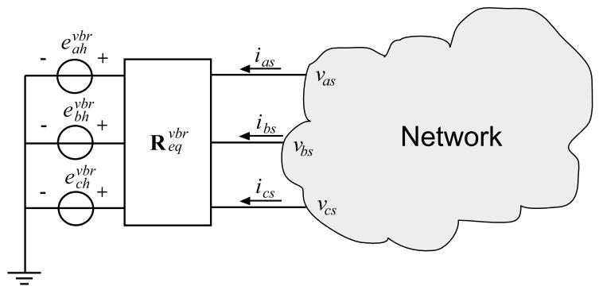  
Figure 4.1 Interface of machine model with external network.

The solution procedure described here assumes that the numerical solution at time step $t - \Delta t$ is known and that the solution at $t$ is to be calculated. The procedure is depicted in Fig. 4.2 and proceeds as follows:

1) Predict mechanical variables: Since the resistance matrix $\mathbf{R}_{eq}^{vbr}$ and history term $\mathbf{e}_h^{vbr}$ in Fig. 4.1 are functions of rotor speed $\omega_r$ for stationary reference frame (and rotor position $\theta_r$ for rotor and synchronous reference frame), the rotor speed $\omega_r$ is predicted using linear extrapolation as

$$
\omega_ {r} (t) = 2 \omega_ {r} (t - \Delta t) - \omega_ {r} (t - 2 \Delta t) \tag {4.43}
$$

Then, the rotor position $\theta_r$ is calculated using (4.22) [16].

2) Update machine and network $G$ matrices and history terms: The machine conductance sub-matrix and history terms are calculated from the Thevenin equivalent circuit and are used to update the network $G$ matrix and the corresponding history terms.   
3) Solve the network nodal equations: The network $G$ matrix is re-factorized for efficient solution of the nodal voltages.   
4) Calculate the machine variables: The machine electrical and mechanical variables are calculated using the equations given in Section III.   
5) Determine the convergence of rotor speed: Assuming an iterative approach (see Fig. 4.2, dashed line) and a given error tolerance, the calculated and predicted rotor speeds $\omega_{r}$ are compared to decide if iterations of the machine-network equations are required. If the error is greater than the tolerance, the newly calculated $\omega_{r}$ is used as a better approximation to the speed and the iterative calculation of machine and network equations continues until it converges to a solution point within the specified error tolerance.   
6) Update machine and network history terms: The machine and network history terms are updated for the next time-step solution.

The above-mentioned machine-network solution procedure was originally proposed for interfacing the PD model with the EMTP-type solution [17]–[18]. The prediction of the mechanical variable $\omega_{r}$ facilitates the solution of nonlinear machine equations. However, the iterations of the machine and network equations greatly increase the overall computational cost.

In [17]–[18], such iterations with small error tolerances are typically used to reduce the interfacing errors. In [16], it is assumed that the dynamics of the mechanical system is much slower than that of the electrical system, and the iteration loop shown in Fig. 4.2 (see dashed line) is not enforced. This paper confirms the effectiveness of such a non-iterative approach to the machine-network interface [16], provided the simulation time step is sufficiently small (such as $\Delta t = 50\mu s$ ). When larger time steps are used (for example, $\Delta t = 1ms$ ), the non-iterative PD (NPD) model produces a much larger error.

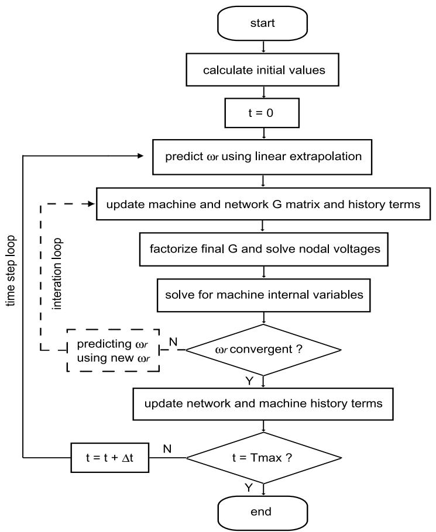  
Figure 4.2 Machine-network solution loop depicting optional iterations.

# 4.4 Efficient Implementation and Model Complexity

To achieve the fastest possible simulation speed, it is important to optimize the model implementation and utilize all possible computational savings. The computational techniques described in this section apply to both PD and VBR models and include efficient calculation of trigonometric functions as well as taking advantage of the structural properties of the matrices. Finally, the complexity of the two models is compared in terms of flops.

# 4.4.1 Trigonometric Functions

From Section III, Subsections A and B, it is observed that the PD and VBR models require evaluation of trigonometric functions (trigs) for calculating the machine resistance matrix and history terms. In particular, the PD model requires $\cos\theta_r$ , $\cos(\theta_r - 2\pi/3)$ , $\cos(\theta_r + 2\pi/3)$ in $\mathbf{L}_{sr}(\theta_r)$ or $\mathbf{L}_{rs}(\theta_r)$ and $\sin\theta_r$ in (4.6) or [25, eq. (4.3-7)]. The VBR model implemented in RotRF requires $\cos\theta$ , $\cos(\theta - 2\pi/3)$ , $\cos(\theta + 2\pi/3)$ , and $\sin\theta$ , $\sin(\theta - 2\pi/3)$ , $\sin(\theta + 2\pi/3)$ in $\mathbf{K}_s$ and $\mathbf{K}_s^{-1}$ , respectively.

The evaluation of trig functions depends on many factors, including the CPU hardware Floating Point Unit (FPU), and the low-level software implementation of math functions on a specific computer platform. Usually, high ( $13^{\text{th}}$ or $14^{\text{th}}$ ) order polynomial approximation or look-up table methods are used to evaluate these functions [26]. The computer studies presented in this paper were conducted using a personal computer (PC) with a Pentium 4, 2.66 GHz processor with 512MB RAM. The standard ANSI C code was complied using Microsoft Visual Studio, Version 7, and executed under Windows XP. The studies show that evaluation of a single trig function may cost several (as many as twenty) equivalent flops, where one flop is defined as one addition, subtraction, multiplication, or division of two floating-point numbers [27].

As the evaluation of trig functions in general is more expensive than performing simple additions and multiplications, efficient use of these functions is important. In this paper, an efficient method of using and calculating the trigs is proposed. Specifically, instead of calculating these functions by directly calling $\cos(\cdot)$ and $\sin(\cdot)$ each time for different arguments, only two functions $\cos\theta$ and $\sin\theta$ for a given angle $\theta$ are evaluated. Thereafter, the remaining trigs are calculated indirectly using appropriate trigonometric relations. For example,

$$
\cos \left(\theta_ {r} \pm 2 \pi / 3\right) = - 1 / 2 \cos \theta_ {r} \mp \sqrt {3} / 2 \sin \theta_ {r} \tag {4.44}
$$

$$
\sin \left(\theta_ {r} \pm 2 \pi / 3\right) = - 1 / 2 \sin \theta_ {r} \pm \sqrt {3} / 2 \cos \theta_ {r} \tag {4.45}
$$

Evaluating (4.44) and (4.45) requires very little additional work - only 2 multiplication and 1 addition operations, instead of directly calculating $\cos (\theta_r - 2\pi /3)$ and $\sin (\theta_r - 2\pi /3)$ which requires one trig and one flop for each case. For comparison purposes, the required number of trig functions for both PD and VBR models using both direct and indirect

Table 4.1 Comparison of Trig Functions Implementations   

<table><tr><td>Model</td><td colspan="2">PD</td><td colspan="2">VBR</td></tr><tr><td>Method</td><td>Direct</td><td>Indirect</td><td>Direct</td><td>Indirect</td></tr><tr><td rowspan="3">Functions</td><td>cos(θr), sin(θr)</td><td>cos(θr), sin(θr)</td><td>cos(θ), sin(θ)</td><td>cos(θ), sin(θ)</td></tr><tr><td>cos(θr - 2π/3)</td><td>plus additional operations</td><td>cos(θ - 2π/3)</td><td>plus additional operations</td></tr><tr><td>cos(θr + 2π/3)</td><td>2 ⊕ + 2 ⊕</td><td>cos(θ + 2π/3)</td><td>4 ⊕ + 4 ⊕</td></tr><tr><td>Total cost</td><td>4 trigs + 2 flops</td><td>2 trigs + 4 flops</td><td>6 trigs + 2 flops</td><td>2 trigs + 8 flops</td></tr><tr><td>Equiv. flops</td><td>82</td><td>44</td><td>122</td><td>48</td></tr></table>

Here, $\otimes$ and $\oplus$ denote multiplication and addition/subtraction operations, respectively.

approaches is summarized in Table 4.1. As can be seen in Table 4.1, the indirect implementation of trigs offers significant computational savings in terms of equivalent number of flops for both models, and is therefore considered in the actual final implementations.

# 4.4.2 Symmetry of Coefficient Matrices

To further improve the implementation of the proposed VBR model, the symmetry in structure and parameters of induction machines should be exploited. As shown in Section III-B, the coefficient matrices $\mathbf{E}$ , $\mathbf{F}$ in (4.34) and $\mathbf{M}$ , $\mathbf{N}$ in (4.35)-(4.36) need to be updated at each iteration step. It can be seen from the expressions (E1)-(E4) given in Appendix E that these matrices have very convenient properties. For example, matrix $\mathbf{E}$ has the following final form:

$$
\mathbf {E} = \left[ \begin{array}{l l} e _ {1} & e _ {2} \\ - e _ {2} & e _ {1} \end{array} \right] \tag {4.46}
$$

The product matrix $\mathbf{M}$ has a similar form:

$$
\mathbf {M} = \left[ \begin{array}{l l} m _ {1} & m _ {2} \\ - m _ {2} & m _ {1} \end{array} \right] \tag {4.47}
$$

Here, $e_1$ , $e_2$ and $m_1$ , $m_2$ are derived from (E1) and (E3), respectively, and may be functions of $\omega$ and $\omega_r$ . The coefficient matrices $\mathbf{F}$ and $\mathbf{N}$ have similar form. Substituting (4.47) into (4.38), the trig functions existing in $\mathbf{K}_s$ and $\mathbf{K}_s^{-1}$ (when RotRF or SynRF are used) are eliminated from the final triple-matrix-product $\mathbf{K}$ , which becomes

$$
\mathbf {K} = \left[ \begin{array}{l l l} k _ {1} & k _ {2} & k _ {3} \\ k _ {3} & k _ {1} & k _ {2} \\ k _ {2} & k _ {3} & k _ {1} \end{array} \right] \tag {4.48}
$$

where

$$
k _ {1} = \frac {2}{3} m _ {1}, k _ {2} = - \frac {1}{3} m _ {1} - \frac {\sqrt {3}}{3} m _ {2}, k _ {3} = - \frac {1}{3} m _ {1} + \frac {\sqrt {3}}{3} m _ {2} \tag {4.49}
$$

Therefore, when implementing (4.34)-(4.38), only a small number of elements are required to be re-calculated. This level of care significantly reduces the computational costs of the models.

# 4.4.3 Model Complexity

The computational costs of the PD and VBR models are compared here in terms of flops required for a single time-step and/or iteration. To maximize the simulation efficiency of both models, it is best to pre-calculate all constant terms and coefficients outside of the simulation time-step loop (see Fig. 4.2). Based on all of the above-mentioned techniques, the total flops required by the PD and VBR models have been carefully counted and are listed in Table 4.2. Here, for better comparison and understanding of the achieved gains, the flops are roughly assigned to several terms for the respective models. For the VBR model, the flops are counted considering two possible implementations – one using RotRF and the other using StaRF, as described in Section III-B. The implementation in the synchronous reference frame is not included since it leads to a similar discrete-time formulation as the RotRF.

Table 4.2 Flops and Trig Functions Count per Iteration   

<table><tr><td colspan="3">PD Model</td><td colspan="3">VBR Model RotRF/StaRF</td></tr><tr><td>Terms</td><td>flops</td><td>trig</td><td>Terms</td><td>flops</td><td>trig</td></tr><tr><td>Predicted θr, ωr</td><td>5</td><td>-</td><td>Predicted θr, θr/ωr</td><td>5/2</td><td>-</td></tr><tr><td>Lsr(θr)</td><td rowspan="2">4</td><td rowspan="2">2</td><td>Ks</td><td rowspan="2">8/0</td><td rowspan="2">2/0</td></tr><tr><td>Lrs(θr)</td><td>Ks-1</td></tr><tr><td>Rpd eq</td><td>54</td><td>-</td><td>Rvbr eq</td><td>8/30</td><td>-</td></tr><tr><td>epd h</td><td>132</td><td>-</td><td>evbr h</td><td>50/46</td><td>-</td></tr><tr><td>iqdr</td><td>42</td><td>-</td><td>λqdr</td><td>26</td><td>-</td></tr><tr><td>Tpeh</td><td>23</td><td>-</td><td>Tevh</td><td>4</td><td>-</td></tr><tr><td>Total</td><td>260</td><td>2</td><td>Total</td><td>101/108</td><td>2/0</td></tr><tr><td>Eq. flops</td><td colspan="2">300</td><td>Eq. flops</td><td colspan="2">141/108</td></tr></table>

Analysis of Table 4.2 shows that the proposed VBR model requires significantly fewer flops in all equations, particularly in calculating the equivalent resistance matrix $\mathbf{R}_{eq}$ , history term $\mathbf{e}_h$ , and torque $T_{e}$ . Moreover, implementation of the VBR model using the StaRF is more efficient than using the RotRF, and overall requires almost one-third of the flops required by the PD model.

# 4.5 Computer Studies

The proposed VBR and the PD models were implemented using standard ANSI C language according to the methodology described in Sections III and IV. To benchmark with the standard EMTP tool, the $qd$ models of the induction machine available in PSCAD/EMTDC and EMTP-RV have been considered in the studies. The corresponding machine parameters are summarized in Appendix F for completeness.

Start-up transient studies are often considered in the literature (e.g. see [8], [16]–[17], [19]) for analysis and comparison of models. The advantage of using this particular transient study over a load-change and/or short-circuit study is that it represents a large-signal electromechanical disturbance which spans the entire speed range (from zero to nominal). Therefore, for comparison purposes of this paper, a no-load start-up transient of an induction machine has been simulated using different models. Since the exact analytical solution is not available, the same study has been simulated using the standard $qd$ model, which has been implemented in MATLAB/Simulink using the state-variable approach and the standard library blocks. To obtain a very accurate solution, this model was solved using the fourth-order Runge-Kutta method with a very small integration time step of $1\mu s$ . This solution is therefore considered here as a reference.

# 4.5.1 Small Time-Step Study

To verify the proposed VBR model, the start-up transient was simulated using a time-step of $50\mu s$ , which is typical for EMTP. Since the time-step is small, both the PD and VBR models were implemented without iterations of the mechanical variables, i.e., (non-iterative) NPD and NVBR models, as described in Section III and Fig. 4.2. Moreover, since the VBR model may be implemented using different frames of reference, the NVBR model has been implemented using both RotRF and StaRF. The responses predicted by the two NVBR models, the NPD model, the $qd$ models in PSCAD and EMTP-RV, and the reference solution are all superimposed in Fig. 4.3. Due to limited space, only the stator current $i_{as}$ , rotor speed $\omega_r$ , and electromagnetic torque $T_e$ are shown here. As can be seen in Fig. 4.3, when a small time-step is used, all models produce

numerical solutions that are convergent and visibly indistinguishable from the reference solution, which in turn validates the new VBR model. This study also confirmed the effectiveness of a non-iterative approach to the machine-network interface [16] when the simulation time-step is sufficiently small.

Since the VBR model is similar to the well-established PD model in terms of its direct network interface, it makes sense to further compare the numerical efficiency of these two models on an equal basis. Moreover, since implementing the VBR model using RotRF and StaRF results in different numbers of flops, as shown in Table II, both implementations are considered. All simulation studies described here were run on a PC with a Pentium-4 2.66GHz processor with 512MB RAM. The measured CPU times taken by the considered models to complete the 0.8s study using a time-step of $50\mu s$ are summarized in Table 4.3.

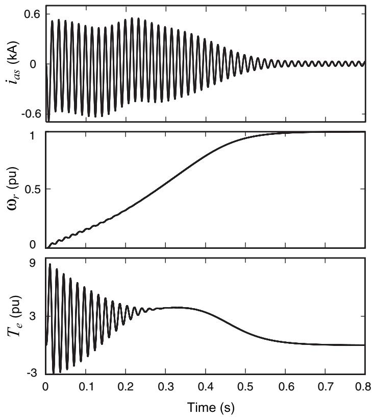  
Figure 4.3 Startup transient simulation results for the time step of $50\mu s$

As can be seen in Table 4.3 that all models demonstrate very fast simulation speeds, with the NPD model requiring $4.6\mu s$ per time-step, being the slowest. The proposed NVBR model in RotRF required $2.2\mu s$ per-step and is 2.3 times faster than the NPD model. However, when the NVBR model uses StaRF, the transformation matrix becomes constant and many trigonometric functions are avoided, as described in Sections II and III. The overall model efficiency is thereby

improved to $1.6\mu s$ per-step, demonstrating a 2.9 times improvement over the NPD model.

Table 4.3 Comparison of CPU Times Per Time Step   

<table><tr><td>Model</td><td>NPD</td><td>NVBR RotRF / StaRF</td></tr><tr><td>0.8s study</td><td>0.0736s</td><td>0.0352s / 0.0256s</td></tr><tr><td>Per time-step</td><td>4.6μs</td><td>2.2μs / 1.6μs</td></tr></table>

# 4.5.2 Large Time-Step Study

It is important to point out that the standard $qd$ model, the PD model, and the newly proposed VBR model are all equivalent for continuous-time analysis since they are algebraically derived from each other, with no approximations. However, when these models are discretized using a specific integration rule and interfaced into the EMTP network solution, their numerical properties are in fact different. To exemplify these differences, the discretization time-step may be increased. Using large time steps is also very advantageous for achieving faster simulation times. Moreover, the ability to use larger time steps is desirable for multi-rate simulation techniques [28]–[29] as well as real-time applications. However, it is important that the models (and simulation overall) maintain numerical stability and sufficient accuracy for the results to remain valid.

To examine the numerical properties and differences of the considered models, the same startup transient study is repeated here with a much larger time-step of $1ms$ . Here, in addition to the models previously included in Subsection A, the PD and VBR models were also implemented with iterations of mechanical variables (see Fig. 4.2, dashed line), with the absolute error tolerance of the iteration set to $10^{-8}$ ; the iterative models are denoted by the abbreviations IPD and IVBR, respectively. For the purpose of consistency, the rotor reference frame has been used in all models in this Subsection, except the PSCAD's $qd$ model. PSCAD uses its default reference frame for the $qd$ model, and the reference-frame information is not explicitly provided to the user. The results of the simulations are shown in Figs. 4.4 - 4.6. As can be seen from the figures, the responses predicted by the various models are now even visibly different, and more importantly deviate from the reference solution. To show the details of the simulation results presented in Figs. 4.4 - 4.6, the magnified plots of stator current $i_{as}$ and the electromagnetic torque $T_e$ are displayed in Figs. 4.7 - 4.10.

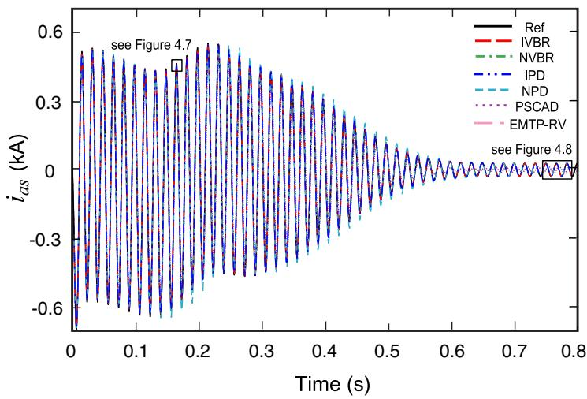

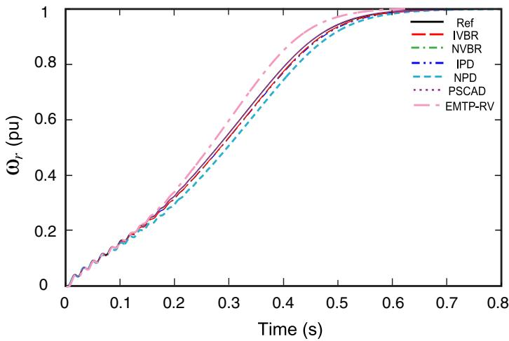  
Figure 4.4 Stator current startup transient simulation using time-step of $1ms$ .   
Figure 4.5 Rotor speed startup transient simulation using time-step of $1ms$ .

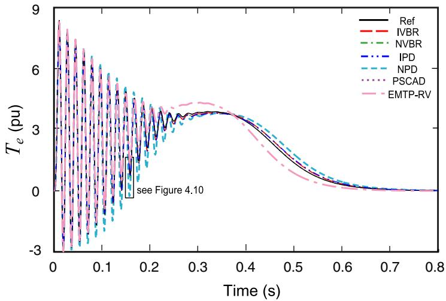  
Figure 4.6 Electromagnetic torque startup transient using time-step of $1ms$ .

In particular, Fig. 4.7 shows the stator current $i_{as}$ during the initial part of the startup transient. As can be seen in Fig. 4.7, both IVBR and NVBR models produce very accurate results close to the reference solutions. Similar accuracy is also demonstrated by the IPD model, which iterates on the rotor speed. However, when iterations are not used with the PD model, its accuracy clearly degrades. The $qd$ model of PSCAD also produces errors that are very noticeable in Fig. 4.7. Here, the numerical accuracy of the EMTP-RV is slightly improved compared to the PSCAD's $qd$ model. Nevertheless, both $qd$ models are still less accurate than the NVBR and IVBR models. Next, Fig. 8 shows the stator current $i_{as}$ at the end of startup when a close to steady state condition is achieved. As can be clearly observed in Fig. 4.8, the $qd$ model of PSCAD has very large errors in both phase and magnitude. However, all other models produce results close to the reference solution. To reveal greater detail of the steady state solution, a fragment of Fig. 4.8 is magnified and shown in Fig. 4.9. As is demonstrated in Fig. 4.9, the NVBR and IVBR models are still closer to the reference solution than the NPD and IPD models, as well as the EMTP-RV $qd$ model.

Similar observations can be made regarding the rotor speed and the electromagnetic torque shown in Figs. 4.5 - 4.6. In particular, the simulation results predicted by the PSCAD and EMTP-RV $qd$ models demonstrate much larger numerical errors compared to the proposed VBR models. Here, the $qd$ model of EMTP-RV predicts the least accurate results for the rotor speed $\omega_r$ and the electromagnetic torque $T_e$ .

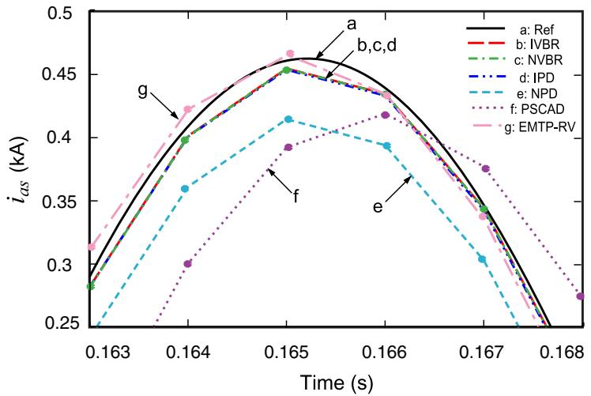  
Figure 4.7 Magnified transient stator currents of Figure 4.4.

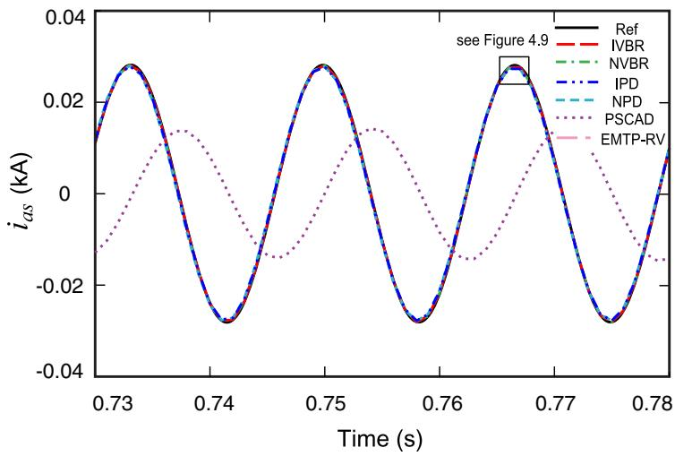

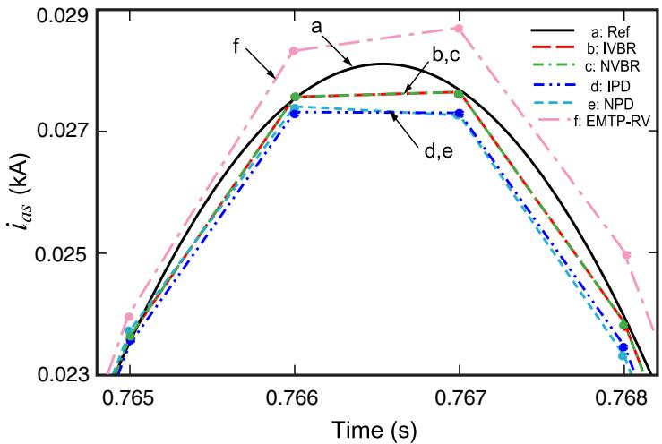  
Figure 4.8 Magnified plot of steady-state stator currents $i_{as}$ from Figure 4.4.

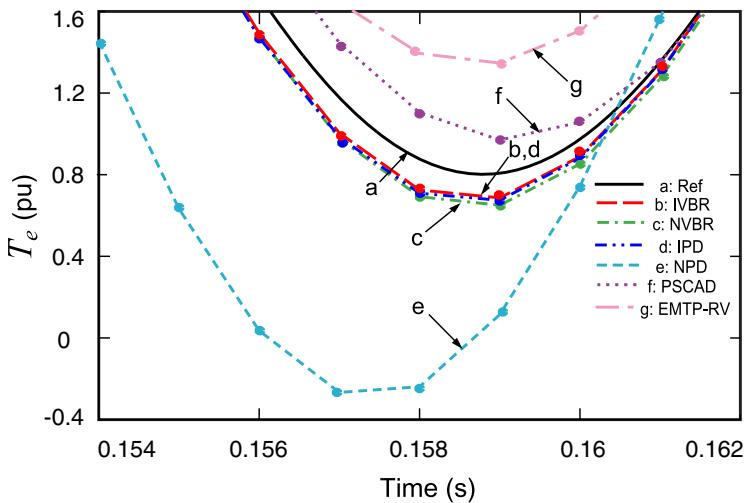  
Figure 4.9 Magnified plot of peak of steady-state stator currents from Figure 4.8.   
Figure 4.10 Magnified plot of electromagnetic torques from Figure 4.6.

To better display the errors for $T_{e}$ in Fig. 4.6, a magnified fragment of this plot is given in Fig. 4.10. It is seen that both the NVBR and IVBR models produce more accurate solutions than the NPD model and the $qd$ models of PSCAD and EMTP-RV. The accuracy of the PD model is improved by imposing iterations, i.e., the IPD model.

# 4.5.3 Error Analysis

The accuracy of various machine models studied in Section V, Subsection B, is further quantified by means of comparing the numerical errors for different integration time steps $\Delta t$ . Herein, the non-iterative VBR and PD models are considered, whereas the iterative versions of these models are not included due to space limitation. The $qd$ models of PSCAD and EMTP-RV are also considered. Without loss of generality, the stator current $i_{as}$ is considered here. The relative numerical error of the stator current solution trajectory for various machine models is calculated using the 2-norm [30] as

$$
e (\Delta t) = \frac {\left\| \widetilde {i} _ {a s} - i _ {a s} \right\| _ {2}}{\left\| \widetilde {i} _ {a s} \right\| _ {2}} \cdot 100 \% \tag{4.50}
$$

where $\widetilde{i}_{as}$ denoted the reference solution as defined in Section V (see second paragraph), and $i_{as}$ is a given numerical solution using time step $\Delta t$ , respectively.

The calculated relative errors versus integration time step are plotted in Fig. 4.11. As Fig. 4.11 shows, the proposed NVBR model produces the smallest (the slowest growing) error among the compared models. The next-best is the NPD model, which is followed by the EMTP-RV and PSCAD $qd$ models. This observation is consistent with results discussed in Section V, Subsection B.

To compare the simulation efficiency, a fragment of Fig. 4.11 is magnified and shown in Fig. 4.12. For the purpose of discussion, we assume that, for example, a $3\%$ or better accuracy is required for the simulation solution. To achieve this accuracy, the $qd$ models of PSCAD and EMTP-RV will require the time steps of at least $100\mu s$ and $200\mu s$ , respectively. The NPD model can achieve the same accuracy with the time steps of about $600\mu s$ . However, the proposed NVBR model achieves an even better accuracy of $2.5\%$ and may use the time steps as large as $1ms$ . This demonstrates an improvement by a factor of 10 and 5 compared to the PSCAD and EMTP-RV models, respectively.

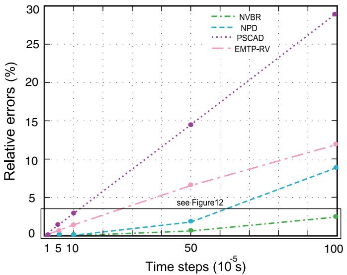

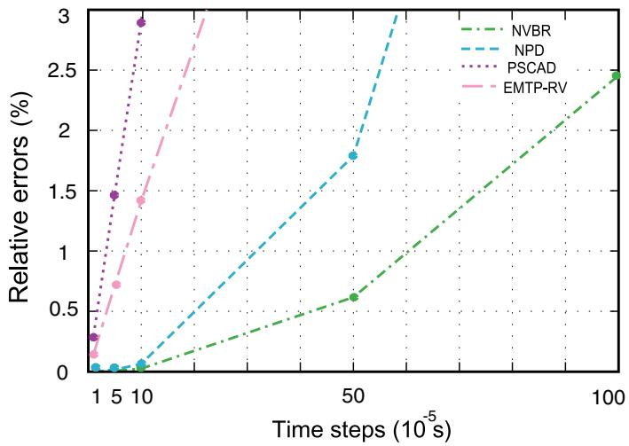  
Figure 4.11 Relative numerical errors in $i_{as}$ for different steps.   
Figure 4.12 Magnified numerical error propagation of Figure 4.11.

# 4.5.4 Choice of Reference Frame and Model Accuracy

As one might suspect, the choice of reference frame has an impact on the simulation accuracy. However, this relationship in general depends on the type of study and many other factors, and is very difficult (if not impossible) to analyze analytically. For the considered start-up transient study, the effect of reference frame is particularly difficult to assess since the rotor speed changes in wide range. In Section V, Subsections B and C, the RotRF was used with EMTP-RV and the proposed VBR models. Here, we conduct additional studies using stationary (StaRF) and synchronous (SynRF) reference frames, respectively. As expected, it is found that all models converge to the same reference solution as the time-step is reduced. However, the error behavior is very different for the different models. To demonstrate this point and the general trend among

the models we include the start-up simulation study obtained with time step of $1ms$ . In particular, the stator current $i_{as}$ and the electromagnetic torques $T_{e}$ predicted by various models are shown in Figs. 4.13 - 4.15. A magnified plot of the steady state current is shown in Fig. 4.14.

As can be seen in Figs. 4.13 and 4.14, the $qd$ model with stationary reference frame (see EMTP-RV-Sta) produces the numerical solution for the stator current $i_{as}$ with very noticeable errors in both in magnitude and phase. Fig. 4.14 shows that the use of synchronous reference frame (see EMTP-RV-Syn) improves the accuracy of the stator current $i_{as}$ in steady state. However, as seen in Fig. 4.15, noticeable errors are present in the electromagnetic torque $T_e$ predicted by the $qd$ model using either StaRF (see EMTP-RV-Sta) or SynRF (see EMTP-RV-Syn). Similar loss of accuracy of the $qd$ model using RotRF is shown in Fig. 4.6 (see EMTP-RV). At the same time, the results predicted by the VBR models with StaRF (see VBR-Sta) and SynRF (see VBR-Syn) remain very close to the reference solution even at such a large time step. As was observed, the numerical errors are somewhat different among different variables, although the general trend of loosing the simulation accuracy for larger time steps remains the same.

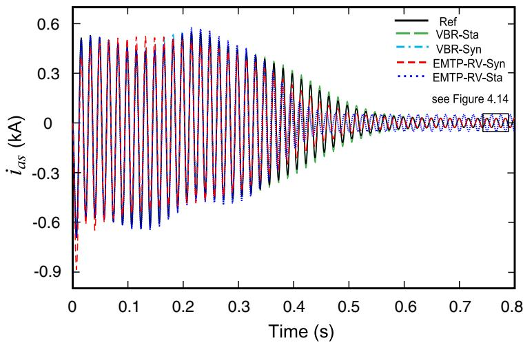  
Figure 4.13 Stator current startup transient for the time-step of $1ms$ .

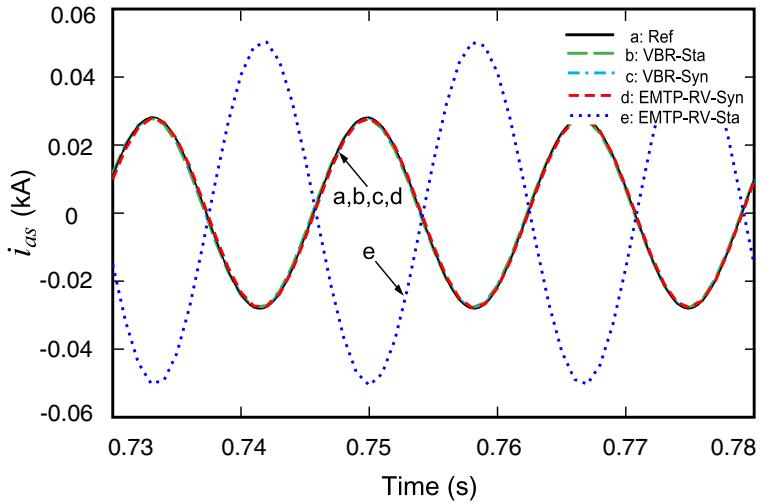

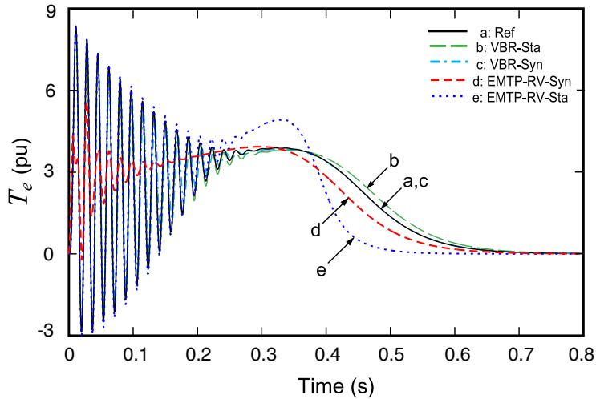  
Figure 4.14 Magnified plot of steady-state stator currents $i_{as}$ from Figure 4.13.   
Figure 4.15 Electromagnetic torque startup transient for the time-step of $1ms$ .

Table 4.4 Relative Errors of Machine Models for Time Step of ${10}^{-4}\mathrm{\;s}$   

<table><tr><td>Models</td><td>i as</td><td>ωr</td><td>Te</td></tr><tr><td>NVBR-Rot</td><td>0.025%</td><td>0.011%</td><td>0.034%</td></tr><tr><td>NVBR-Sta</td><td>0.074%</td><td>0.009%</td><td>0.162%</td></tr><tr><td>NVBR-Syn</td><td>0.146%</td><td>0.013%</td><td>0.316%</td></tr><tr><td>PSCAD</td><td>2.9%</td><td>0.062%</td><td>0.439%</td></tr><tr><td>EMTP-RV-Rot</td><td>1.41%</td><td>0.43%</td><td>1.406%</td></tr><tr><td>EMTP-RV-Sta</td><td>0.189%</td><td>0.091%</td><td>0.208%</td></tr><tr><td>EMTP-RV-Syn</td><td>4.88%</td><td>1.865%</td><td>10.4%</td></tr></table>

To give the reader a better picture of the numerical accuracy achieved using a practical time step of $100\mu s$ we have ran numerous studies using the models discussed in this paper considering the commonly used reference frames, i.e. RotRF, StaRF, and SynRF. The results are summarized in Table 4.4. As Table 4.4 shows, given a choice of reference frame, the NVBR model produces

results that are significantly more accurate than the $qd$ models of PSCAD and EMTP-RV.

# 4.6 Discussion

The numerical properties of the induction machine models presented in this paper are in fact similar to and consistent with the synchronous machine models. Interested reader can find the synchronous machine models discussed in greater detail in [20], [22]. In this Section, we extend the analogy to the induction machines. In particular, the improved simulation accuracy of the both PD and VBR models over the conventional $qd$ models implemented in EMTP-type programs is mainly attributed to the direct interface with the network solution [13], [22] achieved by these two models. None of the $qd$ models have a direct interface with the external network regardless of the reference frame used therein. The studies with synchronous machines [13], [22] as well as the studies with induction machine presented in Section V of this paper clearly demonstrate the advantage of machine models with direct interface. Interested reader should follow up the work related to PD model documented in [16]-[19] and other literature sources.

However, the proposed VBR model offers more advantages even over the established PD model. These advantages are two fold. First, the VBR model requires fewer calculations (flops) per time-step as explained and demonstrated in Sections IV and V. Second, it outperforms the PD model in terms of numerical accuracy due to its advance structural property as explained below.

When analyzing the numerical properties of the VBR and PD models, their corresponding discrete-time difference equations can be reformulated into a one-step update formula as [22], [30]

$$
\mathbf {x} _ {n} = \boldsymbol {\Phi} (\Delta t, t, \mathbf {x} _ {n - 1}) \mathbf {x} _ {n - 1} + \mathbf {f} (\Delta t, t) \tag {4.51}
$$

where $\mathbf{x}$ denotes independent variables - currents and/or flux linkages; and $\mathbf{f}(\Delta t, t)$ represents the forcing function introduced by stator voltages $\mathbf{v}_{abs}$ . As can be seen in (4.51), the update matrix $\Phi(\Delta t, t, \mathbf{x}_{n-1})$ relates the independent variables from the previous time-step to the present time-step. This matrix also relates the propagation of the local numerical errors from $\mathbf{x}_{n-1}$ to $\mathbf{x}_n$ . Based on the derivations presented in Section III, the respective matrices $\Phi^{pd}(\Delta t, t, \mathbf{x}_{n-1})$ and $\Phi^{vbr}(\Delta t, t, \mathbf{x}_{n-1})$ for the PD and VBR models have been determined and are given in Appendix (E5)-(E7). The eigenvalues of these matrices correspond to the discrete-time eigenvalues of the PD and VBR models. These eigenvalues were calculated at the point

corresponding to the end of the transient at $t = 0.8s$ (almost steady state) using the time-step of $1ms$ and are summarized in Table 4.5.

Table 4.5 Discrete Time Eigenvalues in Steady State   

<table><tr><td>PD</td><td>VBR</td></tr><tr><td>0.1878</td><td>0.7526 – j0.1110</td></tr><tr><td>0.1878</td><td>0.7526 + j0.1110</td></tr><tr><td>0.7508</td><td>0.7508</td></tr><tr><td>0.8970</td><td>0.8245</td></tr><tr><td>4.3622</td><td>1.0657 – j0.1543</td></tr><tr><td>4.3622</td><td>1.0657 + j0.1543</td></tr></table>

It is interesting to observe in Table 4.5 that both the PD and VBR models have discrete-time eigenvalues outside the unit circle on the complex plane. In the case of linear time invariant (LTI) systems, such eigenvalues would imply instability. However, since the induction machine is a time-varying system, the discrete-time eigenvalues outside the unit circle do not imply instability [31]. At the same time, for better numerical accuracy, it is desirable to have eigenvalues with smaller magnitude [32]–[33]. For the induction machine considered here, the largest eigenvalue of the PD model (4.3622) is about four times larger than that of the VBR model $(1.0657 \pm \mathrm{j}0.1543)$ . Hence, the VBR model formulation is more advantageous. This observation supports the numerical results of comparing the PD and VBR models as documented in Section 4.5.

# 4.7 Conclusion

This paper extends the recent work on modeling of synchronous machines and presents a new voltage-behind-reactance induction machine model for the EMTP-type solution. Efficient numerical implementations of the proposed voltage-behind-reactance model and existing phase-domain model, including iterative/non-iterative approaches have been presented and compared. Computer studies demonstrate that a non-iterative voltage-behind-reactance model is more accurate and computationally efficient than several existing and/or established EMTP induction machine models. The improved numerical properties of the proposed model are attributed to its advanced structure and better-scaled eigenvalues.

# 4.8 References

[1] H. W. Dommel, EMTP Theory Book, MicroTran Power System Analysis Corporation, Vancouver, Canada, May 1992.   
[2] MicroTran Reference Manual, MicroTran Power System Analysis Corp., Vancouver, Canada, 1997. Available: http://www.microtran.com.   
[3] Electromagnetic Transient Program, EMTP RV, CEA Technologies Inc., 2007. Available: http://www.emtp.com.   
[4] Alternative Transients Programs, ATP-EMTP, ATP User Group, 2007. Available: http://www.emtp.org.   
[5] PSCAD/EMTDC, Manitoba HVDC Research Centre and RTDS Technologies Inc., 2007. Available: http://www.pscad.com.   
[6] H. K. Lauw and W. S. Meyer, “Universal machine modeling for the representation of rotating electrical machinery in an electromagnetic transients program,” IEEE Trans. Power Apparatus and Systems, vol. PAS-101, pp. 1342–1351, 1982.   
[7] V. Brandwajn, "Synchronous generator models for the analysis of electromagnetic transients," Ph.D. thesis, University of British Columbia, Vancouver, Canada, 1977.   
[8] R. Hung, H.W. Dommel, "Synchronous machine models for simulation of induction motor transients," IEEE Trans. Power Systems, vol. 11, no. 2, pp. 833-838, May 1996.   
[9] PSCAD/EMTDC V4.0 On-Line Help, Manitoba HVDC Research Centre and RTDS Technologies Inc., 2005.   
[10]J. Mahseredjian, S. Dennetiere, B. Khodabakhchian and A. Xemard, "Induction machine modeling for distribution system analysis using initialization and time-domain methods," IEEE PES Transmission and Distribution Conference, pp. 588-591, May 2006.   
[11]X. Cao, A. Kurita, H. Mitsuma, Y. Tada and H. Okamoto, “Improvements of numerical stability of electromagnetic transient simulation by use of phase-domain synchronous machine models,” Electrical Engineering in Japan, vol. 128, no. 3, pp. 53–62, Apr., 1999.   
[12] A. B. Dehkordi, A. M. Gole and T. L. Maguire, "Permanent magnet synchronous machine model for real-time simulation," Proc. of International Conference on Power Systems Transients (IPST'05), Montreal, Canada, Jun., 2005.   
[13]L. Wang, J. Jatskevich, and H. W. Dommel, “Reexamination of synchronous machine modeling techniques for electromagnetic transient simulations,” IEEE Trans. Power Systems, vol. 22, no. 3, pp. 1221–1230, Aug. 2007.   
[14]J. Mahseredjian, L. Dube, M. Zou, S. Dennetiere and G. Joos, "Simultaneous solution of control system equations in EMTP," IEEE Trans. Power Systems, vol. 21, no. 1, pp. 117-124, Feb. 2006.

[15] J. Mahseredjian, S. Dennetiere, L. Dube, B. Khodabakhchian and L. Gerin-Lajoie, “On a new approach for the simulation of transients in power systems,” Proc. of International Conference on Power Systems Transients (IPST'05), Montreal, Canada, June, 2005.   
[16]J. R. Marti and T. O. Myers, “Phase-domain induction motor model for power system simulators,” IEEE Conference Communications, Power, and Computing, vol. 2, pp. 276–282, May 1995.   
[17]R. Takahashi, J. Tamura, Y. Tada, A. Kurita, “Derivation of phase-domain model of an induction generator in terms of instantaneous values,” IEEE Power Engineering Society Winter Meeting, vol. 1, 23–27, pp. 359–364, Jan. 2000.   
[18]R. Takahashi, J. Tamura, Y. Tada, and A. Kurita, "Model derivation of an adjustable speed generator and its excitation control system," Proceedings of $14^{\text{th}}$ Power Systems Computation Conference (PSCC02), Sevilla, June, 2002.   
[19] W. Gao, E. V. Solodovnik and R. A. Dougal, “Symbolically aided model development for an induction machine in virtual test bed,” IEEE Trans. Energy Conversion, vol. 19, no. 1, pp. 125–135, Mar. 2004.   
[20]S. D. Pekarek, O. Wasynczuk, and H. J. Hegner, “An efficient and accurate model for the simulation and analysis of synchronous machine/converter systems,” IEEE Trans. Energy Conversion, vol. 13, no. 1, pp. 42–48, Mar. 1998.   
[21] W. Zhu, S. D. Pekarek, J. Jatskevich, O. Wasynczuk, and D. Delisle, “A model-in-the-loop interface to emulate source dynamics in a zonal DC distribution system,” IEEE Trans. Power Electronics, vol. 20, no. 2, pp. 438–445, Mar. 2005.   
[22]L. Wang and J. Jatskevich, “A voltage-behind-reactance synchronous machine model for the EMTP-type solution,” IEEE Trans. Power Systems, vol. 21, no. 4, pp. 1539–1549, Nov. 2006.   
[23]L. Wang, J. Jatskevich, and S. Pekarek, "Modeling of induction machines using a voltage-behind-reactance formulation," Accepted by IEEE Trans. Energy Conversion 2007 (paper: TEC-00124-2007).   
[24] P. C. Krause and C. H. Thomas, "Simulation of symmetrical induction machinery and drive systems," IEEE Trans. Power Apparatus and Systems, vol. 84, pp.1038-1053, Nov. 1965.   
[25]P. C. Krause, O. Wasynczuk, and S. D. Sudhoff, Analysis of Electric Machine, $2^{\mathrm{nd}}$ Edition, IEEE Press, Piscataway, NJ, 2002.   
[26] T. Ito, and S. Kojima, “Inaccuracies of trigonometric functions in computer mathematical libraries,” Publications of the National Astronomical Observatory of Japan, vol. 8, no. 1–4, pp. 17–31, 2005.   
[27]S. Boyd and L. Vandenberghe, Convex Optimization, Cambridge University Press, Cambridge, UK, 2004, pp. 662-664.   
[28] S. D. Pekarek, O. Wasynczuk, E. A. Walters, J. Jatskevich, C. E. Lucas, N. Wu, and P. T. Lamm, “An efficient multi-rate simulation technique for power-electronic-based systems,” IEEE Trans. Power Syst., vol. 19 no. 1, pp. 399–409, Feb. 2004.   
[29]F. A. Moreira and J. R. Marti “Latency techniques for time-domain power system transients simulation,” IEEE Trans. Power Syst., vol. 20 no. 1, pp. 246–253, Feb. 2005.

[30] W. Gautchi, Numerical Analysis: An Introduction, Birkhauser, Boston, Massachusetts, 1997.   
[31]R. A. DeCarlo, Linear systems: A State Variable Approach with Numerical Implementation, Prentice-Hall, New Jersey, 1989, pp. 457.   
[32]L. O. Chua and P-M Lin, Computer Aided Analysis of Electronic Circuit: Algorithms and Computational Techniques, Prentice-Hall, Englewood Cliffs, New Jersey, 1975, pp. 43-45.   
[33]Uri Ascher and Linda R. Petzold, Computer Methods for Ordinary Differential Equations and Differential-algebraic Equations. Society for Industrial and Applied Mathematics, Philadelphia, 1998, ch. 2.

# 5 INCLUDING MAGNETIC SATURATION IN VOLTAGE-BEHIND-REACTANCE INDUCTION MACHINE MODEL FOR EMTP-TYPE SOLUTION

# 5.1 Introduction

Representing magnetic saturation in induction machine models greatly improves the modeling accuracy for both steady states and transients. Depending on the modeling fidelity and applications, various models and approaches have been proposed to represent the machine magnetic saturation. To depict very fine geometrical/structural details and material characteristics, Finite Element (FE) models [1] and Magnetic Equivalent Circuit (MEC) models [2]-[3] are often used. For system studies, numerous induction machine models have been proposed to represent main magnetizing flux path saturation [4]-[7], leakage flux path saturation [8]-[9], the deep-bar effects [10]-[11], etc. Higher-order $qd$ models capable of predicting the magnetic saturation and machine-inverter interaction at high switching frequency have been proposed in [12]-[13].

The electro-magnetic transient programs (EMTP) [14] are often used for studying power systems transients, wherein the classical full-order machine models are typically considered sufficient [15]–[16]. In the EMTP community, the magnetic saturation phenomena have also been included in various machine models [17]–[21] and software packages [22]–[25]. Examples of saturable models include the ATP's universal machine model [17] and MicroTran model Type 50 [18]. Other commonly-used EMTP software packages such as PSCAD/EMTDC [22] and EMTP-RV [24] also include saturable models of induction machine.

These programs typically use built-in $qd$ models and permit saturation of the main magnetizing flux and sometimes even leakage fluxes. In EMTP, the nonlinear magnetic saturation characteristic is often represented using a piecewise-linear approximation. Based upon this approach, a very efficient non-iterative solution of the machine-network equations may be achieved.

The model formulations commonly used with the EMTP solution approach include the $qd$ [26]–[28] or the phase-domain (PD) [29]–[30] models. Recently, the so-called

voltage-behind-reactance (VBR) models have been proposed in [31]–[34]. The VBR models provide many desirable properties, e.g., direct model interface with the external network, greatly improved numerical accuracy and simulation efficiency. Interested reader will find discussions and studies revealing the properties of VBR models in [31]–[35] and the references therein. Inspired by advantageous properties of the magnetically linear induction machine VBR model [34], this paper is focused on formulating a saturable VBR model for the EMTP-type solution. Here, we extend the previous work and make the following contributions:

- The proposed approach is derived to include the $qd$ axes static and dynamic cross-saturation phenomenon based on the saturation of the main magnetizing flux, which is typically adequate for most power systems studies with induction machines. If required, the saturation can be readily extended to include the leakage flux if such refinement is necessary.   
- The piecewise-linear approach is utilized to include the magnetic saturation characteristic into the VBR model. However, the method can include arbitrary number of piecewise-linear segments as to approach the smooth saturation characteristic with any desirable accuracy.   
- The new model is compared with several established models to verify its correctness and demonstrate its numerical advantages such as accuracy and CPU time.

# 5.2 Magnetically Linear Machine Models

To facilitate the derivation of the new model and for the purpose of completeness, the magnetically linear $qd$ and VBR models are briefly reviewed in this section. The mechanical subsystem for all models is represented by the following:

$$
p \theta_ {r} = \omega_ {r} \tag {5.1}
$$

$$
p \omega_ {r} = \frac {P}{2 J} \left(T _ {e} - T _ {m}\right) \tag {5.2}
$$

Here, operator $p = d / dt$ ; the rotor position and speed are denoted by $\theta_r$ and $\omega_r$ , respectively; the number of magnetic poles is $P$ ; and the rotor inertia is $J$ . The developed electromagnetic torque and the mechanical load torque are denoted by $T_e$ and $T_m$ , respectively. The electromagnetic torque $T_e$ is expressed directly in terms of mutual flux linkages and stator currents as

$$
T _ {e} = \frac {3 P}{4} \left(\lambda_ {m d} i _ {q s} - \lambda_ {m q} i _ {d s}\right) \tag {5.3}
$$

# 5.2.1 The qd Model

The voltage equations of the $qd$ induction machine model in arbitrary reference frame (ARF) are represented as [15]

$$
v _ {q s} = r _ {s} i _ {q s} + \omega \lambda_ {d s} + p \lambda_ {q s} \tag {5.4}
$$

$$
v _ {d s} = r _ {s} i _ {d s} - \omega \lambda_ {q s} + p \lambda_ {d s} \tag {5.5}
$$

$$
v _ {0 s} = r _ {s} i _ {0 s} + p \lambda_ {0 s} \tag {5.6}
$$

$$
0 = r _ {r} i _ {q r} + \left(\omega - \omega_ {r}\right) \lambda_ {d r} + p \lambda_ {q r} \tag {5.7}
$$

$$
0 = r _ {r} i _ {d r} - \left(\omega - \omega_ {r}\right) \lambda_ {q r} + p \lambda_ {d r} \tag {5.8}
$$

$$
0 = r _ {r} i _ {0 r} + p \lambda_ {0 r}. \tag {5.9}
$$

where $\omega$ is the reference frame speed.

The flux linkage equations of the stator and rotor windings are expressed as

$$
\lambda_ {q s} = L _ {l s} i _ {q s} + \lambda_ {m q} \tag {5.10}
$$

$$
\lambda_ {d s} = L _ {l s} i _ {d s} + \lambda_ {m d} \tag {5.11}
$$

$$
\lambda_ {0 s} = L _ {l s} i _ {0 s} \tag {5.12}
$$

$$
\lambda_ {q r} = L _ {l r} i _ {q r} + \lambda_ {m q} \tag {5.13}
$$

$$
\lambda_ {d r} = L _ {l r} i _ {d r} + \lambda_ {m d} \tag {5.14}
$$

$$
\lambda_ {0 r} = L _ {l r} i _ {0 r} \tag {5.15}
$$

where

$$
\lambda_ {m q} = L _ {m} i _ {m q} = L _ {m} \left(i _ {q s} + i _ {q r}\right) \tag {5.16}
$$

$$
\lambda_ {m d} = L _ {m} i _ {m d} = L _ {m} \left(i _ {d s} + i _ {d r}\right) \tag {5.17}
$$

where $L_{m}$ is the unsaturated magnetizing inductance or the steady-state saturated magnetizing inductance obtained from the equivalent air-gap line (i.e. $L_{m} = \lambda_{m} / i_{m}$ ).

# 5.2.2 Voltage-Behind-Reactance Model

As shown in [32], several VBR formulations may be derived for the induction machine resulting in slightly different $RL$ -branches to represent the required configuration of the stator winding. Without loss of generality, the second VBR formulation (see [32], Section IV B) is utilized in the paper where the resulting $RL$ -branches have magnetic coupling only. The corresponding stator voltage equation is given as

$$
\mathbf {v} _ {a b c s} = \mathbf {r} _ {s} \mathbf {i} _ {a b c s} + \mathbf {L} _ {a b c} ^ {\prime \prime} p \mathbf {i} _ {a b c s} + \mathbf {v} _ {a b c} ^ {\prime \prime} \tag {5.18}
$$

where

$$
\mathbf {r} _ {s} = \operatorname {d i a g} \left[ r _ {s}, r _ {s}, r _ {s} \right] \tag {5.19}
$$

and

$$
\mathbf {L} _ {a b c} ^ {\prime \prime} = \left[ \begin{array}{l l l} L _ {S} & L _ {M} & L _ {M} \\ L _ {M} & L _ {S} & L _ {M} \\ L _ {M} & L _ {M} & L _ {S} \end{array} \right] \tag {5.20}
$$

Here, the entries of inductance matrix (5.20) are defined as

$$
L _ {S} = L _ {l s} + L _ {a} \tag {5.21}
$$

$$
L _ {M} = - \frac {L _ {a}}{2} \tag {5.22}
$$

$$
L _ {a} = \frac {2}{3} L _ {m} ^ {\prime \prime} \tag {5.23}
$$

$$
L _ {m} ^ {\prime \prime} = \left(\frac {1}{L _ {m}} + \frac {1}{L _ {l r}}\right) ^ {- 1} \tag {5.24}
$$

The so-called subtransient voltages $\mathbf{v}_{abc}^{\prime \prime}$ in (5.18) are defined as follows:

$$
\mathbf {v} _ {a b c} ^ {\prime \prime} = \mathbf {K} _ {s} ^ {- 1} \left[ \begin{array}{l l l} v _ {q} ^ {\prime \prime} & v _ {d} ^ {\prime \prime} & 0 \end{array} \right] ^ {T} \tag {5.25}
$$

where

$$
\mathbf {K} _ {s} ^ {- 1} = \left[ \begin{array}{c c c} \cos \theta & \sin \theta & 1 \\ \cos \left(\theta - \frac {2 \pi}{3}\right) & \sin \left(\theta - \frac {2 \pi}{3}\right) & 1 \\ \cos \left(\theta + \frac {2 \pi}{3}\right) & \sin \left(\theta + \frac {2 \pi}{3}\right) & 1 \end{array} \right] \tag {5.26}
$$

and

$$
v _ {q} ^ {\prime \prime} = \omega_ {r} \frac {L _ {m} ^ {\prime \prime}}{L _ {l r}} \lambda_ {d r} + \frac {L _ {m} ^ {\prime \prime} r _ {r}}{L _ {l r} ^ {2}} \left(\frac {L _ {m} ^ {\prime \prime}}{L _ {l r}} - 1\right) \lambda_ {q r} + \frac {L _ {m} ^ {\prime \prime 2} r _ {r}}{L _ {l r} ^ {2}} i _ {q s} \tag {5.27}
$$

$$
v _ {d} ^ {\prime \prime} = - \omega_ {r} \frac {L _ {m} ^ {\prime \prime}}{L _ {l r}} \lambda_ {q r} + \frac {L _ {m} ^ {\prime \prime} r _ {r}}{L _ {l r} ^ {2}} \left(\frac {L _ {m} ^ {\prime \prime}}{L _ {l r}} - 1\right) \lambda_ {d r} + \frac {L _ {m} ^ {\prime \prime 2} r _ {r}}{L _ {l r} ^ {2}} i _ {d s} \tag {5.28}
$$

The rotor state equations are expressed in terms of rotor flux linkages and stator currents as

$$
p \lambda_ {q r} = - \frac {r _ {r}}{L _ {l r}} \left(\lambda_ {q r} - \lambda_ {m q}\right) - (\omega - \omega_ {r}) \lambda_ {d r} \tag {5.29}
$$

$$
p \lambda_ {d r} = - \frac {r _ {r}}{L _ {l r}} \left(\lambda_ {d r} - \lambda_ {m d}\right) + \left(\omega - \omega_ {r}\right) \lambda_ {q r} \tag {5.30}
$$

where

$$
\lambda_ {m q} = L _ {m} ^ {\prime \prime} \left(i _ {q s} + \frac {\lambda_ {q r}}{L _ {l r}}\right) \tag {5.31}
$$

$$
\lambda_ {m d} = L _ {m} ^ {\prime \prime} \left(i _ {d s} + \frac {\lambda_ {d r}}{L _ {l r}}\right) \tag {5.32}
$$

# 5.3 Representation of Magnetic Saturation

For the purpose of this paper, the magnetic saturations of main flux path and leakage flux path are treated independently. This is a common practice for modeling saturation of induction machines in both state variable approach [6]–[7] and EMTP approach [17]–[18], [22]–[24]. For simplicity and without loss of generality, only the main flux saturation is discussed here and represented in the VBR model. The stator and rotor leakage flux saturation can be easily included using the same general approach described in the paper.

For state variable modeling languages, the flux correction methods [5], [8], [15], and the generalized flux space vector method [6]-[7] are often utilized to represent the saturation of the main flux. In the first method, the classical $qd$ model is used with the stator and rotor flux

linkages as the state variables. Magnetic saturation is taken into account by correcting the main flux of the otherwise magnetically linear model. In the second method, the generalized flux space vector and the magnetizing current space vector are defined as linear combinations of the machine flux linkages or currents [6]–[7]. To complete the saturable model, a saturation-dependent equivalent inductance $\Lambda$ or its reciprocal $(1 / \Lambda)$ is derived in terms of the selected state variables.

However, in the nodal analysis (or modified nodal analysis) languages such as EMTP, the magnetic saturation is usually implemented using a piecewise-linear representation of the nonlinear magnetic characteristic [19], [21]–[24]. The advantages of such approach include the following: (i) The simplicity and structure of the magnetically linear machine model is partly preserved; (ii) The iterative solution of saturation function with the machine-network equations can be avoided; (iii) The piecewise-linear saturated magnetizing inductances, the nodal conductance matrix (the G matrix), and many other coefficient matrices in the discretized machine equations may be pre-calculated outside of the main time-step loop which may further improve the simulation efficiency.

The saturation may be represented by nonlinear functions such as high order polynomials [29] or arctangent functions [36] that may be fitted into the measured saturation data. Here, the main flux saturation is represented by a nonlinear monotonic function in terms of the total magnetizing current $i_{m}$ as

$$
\lambda_ {m} = \lambda \left(i _ {m}\right) \tag {5.33}
$$

Calculating the partial derivative of (5.33) with respect to the magnetizing current $i_{m}$ , the so-called dynamic inductance [6] or incremental inductance [12] is obtained as

$$
L = \frac {\partial \lambda_ {m}}{\partial i _ {m}} \tag {5.34}
$$

The partial differential equation (5.34) is then discretized into the difference equation using a numerical integration rule as

$$
L _ {D} = \frac {\Delta \lambda_ {m}}{\Delta i _ {m}}. \tag {5.35}
$$

For the EMTP solution, the nonlinear magnetizing inductance $L$ in (5.34) may be well

approximated by $L_{D}$ within a very small range $\Delta i_{m}$ as shown in Fig. 1. The saturation function (5.33) is then represented by the following linear characteristic as

$$
\lambda_ {m} (t) = L _ {D} i _ {m} (t) + \lambda_ {r e s} \tag {5.36}
$$

where $\lambda_{res}$ is the residual flux.

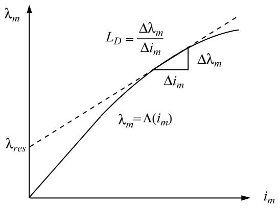  
Figure 5.1 Piecewise-linear representation of magnetic saturation.

Induction machines usually have round isotropic rotor. Therefore, the main flux linkage vector $\lambda_{m}$ is assumed to be aligned with the magnetizing current vector $i_{m}$ as shown in Fig. 5.2. The flux linkages $\lambda_{mq}$ and $\lambda_{md}$ are the projections of the main flux linkage $\lambda_{m}$ onto the $q$ and $d$ axes, respectively, as shown in Fig. 5.3. These projections may be expressed in terms of incremental magnetizing inductances and residual fluxes as following:

$$
\lambda_ {m q} = L _ {D} i _ {m q} + \lambda_ {r e s q} \tag {5.37}
$$

$$
\lambda_ {m d} = L _ {D} i _ {m d} + \lambda_ {\text {r e s d}} \tag {5.38}
$$

where

$$
\lambda_ {r e s q} = \lambda_ {r e s} \cos \phi \tag {5.39}
$$

$$
\lambda_ {r e s d} = \lambda_ {r e s} \sin \phi . \tag {5.40}
$$

Therefore, the main flux $\lambda_{m}$ and the total magnetizing current $i_{m}$ may be expressed in terms of their the $qd$ axes components as

$$
\lambda_ {m} = \sqrt {\lambda_ {m q} ^ {2} + \lambda_ {m d} ^ {2}} \tag {5.41}
$$

$$
i _ {m} = \sqrt {i _ {m q} ^ {2} + i _ {m d} ^ {2}}. \tag {5.42}
$$

This method captures the so-called cross saturation effect [4], [6]–[7] which consists of magnetic coupling between $q$ and $d$ axes due to the presence of magnetic saturation.

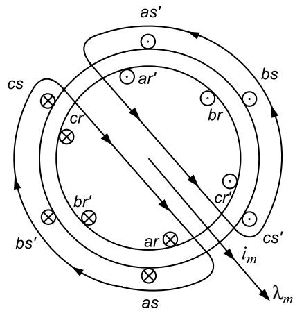

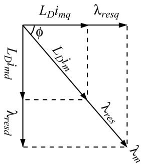  
Figure 5.2 Main magnetizing flux in isotropic round-rotor induction machine.   
Figure 5.3 The $qd$ projections of the magnetizing fluxes and currents.

# 5.4 Voltage-Behind-Reactance Formulation Including Magnetic Saturation

Based on the approach described in Section III, the saturable VBR model can be derived from the $qd$ model using a similar procedure as in [32]. In particular, the $q$ and $d$ axes magnetizing flux linkages (5.37) and (5.38) are expressed in terms of stator currents and rotor flux linkages as

$$
\lambda_ {m q} = L _ {D} ^ {\prime \prime} \left(i _ {q s} + \frac {\lambda_ {q r}}{L _ {l r}}\right) + \frac {L _ {D} ^ {\prime \prime}}{L _ {D}} \lambda_ {r e s q} \tag {5.43}
$$

$$
\lambda_ {m d} = L _ {D} ^ {\prime \prime} \left(i _ {d s} + \frac {\lambda_ {d r}}{L _ {l r}}\right) + \frac {L _ {D} ^ {\prime \prime}}{L _ {D}} \lambda_ {r e s d} \tag {5.44}
$$

where

$$
L _ {D} ^ {\prime \prime} = \left(\frac {1}{L _ {D}} + \frac {1}{L _ {l r}}\right) ^ {- 1}. \tag {5.45}
$$

Substituting (5.43) and (5.44) into (5.10) and (5.11), respectively, the stator flux linkages are expressed as

$$
\lambda_ {q s} = L ^ {\prime \prime} i _ {q s} + \lambda_ {q} ^ {\prime \prime} \tag {5.46}
$$

$$
\lambda_ {d s} = L ^ {\prime \prime} i _ {d s} + \lambda_ {d} ^ {\prime \prime} \tag {5.47}
$$

where

$$
L ^ {\prime \prime} = L _ {l s} + L _ {D} ^ {\prime \prime} \tag {5.48}
$$

and

$$
\lambda_ {q} ^ {\prime \prime} = \frac {L _ {D} ^ {\prime \prime}}{L _ {l r}} \lambda_ {q r} + \frac {L _ {D} ^ {\prime \prime}}{L _ {D}} \lambda_ {r e s q} \tag {5.49}
$$

$$
\lambda_ {d} ^ {\prime \prime} = \frac {L _ {D} ^ {\prime \prime}}{L _ {l r}} \lambda_ {d r} + \frac {L _ {D} ^ {\prime \prime}}{L _ {D}} \lambda_ {r e s d}. \tag {5.50}
$$

Then, substituting (5.46) and (5.47) into (5.4) and (5.5), respectively, the stator voltage equations can be rewritten as

$$
v _ {q s} = r _ {s} i _ {q s} + \omega L ^ {\prime \prime} i _ {d s} + p L ^ {\prime \prime} i _ {q s} + \omega \lambda_ {d} ^ {\prime \prime} + p \lambda_ {q} ^ {\prime \prime} \tag {5.51}
$$

$$
v _ {d s} = r _ {s} i _ {d s} - \omega L ^ {\prime \prime} i _ {q s} + p L ^ {\prime \prime} i _ {d s} - \omega \lambda_ {q} ^ {\prime \prime} + p \lambda_ {d} ^ {\prime \prime}. \tag {5.52}
$$

The term $p\lambda_q''$ in (5.51) is calculated by taking the derivatives of (5.49) as

$$
p \lambda_ {q} ^ {\prime \prime} = \frac {L _ {D} ^ {\prime \prime}}{L _ {l r}} p \lambda_ {q r} + \frac {L _ {D} ^ {\prime \prime}}{L _ {D}} p \lambda_ {r e s q} \tag {5.53}
$$

In (5.53), $p\lambda_{qr}$ is eliminated by using the rotor voltage equation (5.7). The term $p\lambda_{resq}$ is derived by calculating the derivative of (5.39). These algebraic manipulations result in the following:

$$
\begin{array}{l} p \lambda_ {q} ^ {\prime \prime} = \frac {L _ {D} ^ {\prime \prime} r _ {r}}{L _ {l r} ^ {2}} \left(\frac {L _ {D} ^ {\prime \prime}}{L _ {l r}} - 1\right) \lambda_ {q r} + \frac {L _ {D} ^ {\prime \prime} {} ^ {2} r _ {r}}{L _ {l r} ^ {2}} i _ {q s} + \frac {L _ {D} ^ {\prime \prime} {} ^ {2} r _ {r}}{L _ {l r} ^ {2} L _ {D}} \lambda_ {r e s q} \tag {5.54} \\ - \frac {L _ {D} ^ {\prime \prime}}{L _ {l r}} \left(\omega - \omega_ {r}\right) \lambda_ {d r} - \frac {L _ {D} ^ {\prime \prime}}{L _ {D}} \lambda_ {r e s d} \frac {d \phi}{d t} \\ \end{array}
$$

A similar process is applied to the $d$ axis which gives

$$
\begin{array}{l} p \lambda_ {d} ^ {\prime \prime} = \frac {L _ {D} ^ {\prime \prime} r _ {r}}{L _ {l r} ^ {2}} \left(\frac {L _ {D} ^ {\prime \prime}}{L _ {l r}} - 1\right) \lambda_ {d r} + \frac {L _ {D} ^ {\prime \prime} {} ^ {2} r _ {r}}{L _ {l r} ^ {2}} i _ {d s} + \frac {L _ {D} ^ {\prime \prime} {} ^ {2} r _ {r}}{L _ {l r} ^ {2} L _ {D}} \lambda_ {\text {r e s d}} \tag {5.55} \\ + \frac {L _ {D} ^ {\prime \prime}}{L _ {l r}} (\omega - \omega_ {r}) \lambda_ {q r} + \frac {L _ {D} ^ {\prime \prime}}{L _ {D}} \lambda_ {r e s q} \frac {d \phi}{d t} \\ \end{array}
$$

The stator voltage equations are then reformulated by substituting (5.54) and (5.55) into (5.51) and (5.52), respectively, as

$$
v _ {q s} = r _ {s} i _ {q s} + \omega L ^ {\prime \prime} i _ {d s} + p L ^ {\prime \prime} i _ {q s} + v _ {q s a t} ^ {\prime \prime} \tag {5.56}
$$

$$
v _ {d s} = r _ {s} i _ {d s} - \omega L ^ {\prime \prime} i _ {q s} + p L ^ {\prime \prime} i _ {d s} + v _ {d s a t} ^ {\prime \prime} \tag {5.57}
$$

where

$$
\begin{array}{l} v _ {q s a t} ^ {\prime \prime} = \omega_ {r} \frac {L _ {D} ^ {\prime \prime}}{L _ {l r}} \lambda_ {d r} + \frac {L _ {D} ^ {\prime \prime} r _ {r}}{L _ {l r} ^ {2}} \left(\frac {L _ {D} ^ {\prime \prime}}{L _ {l r}} - 1\right) \lambda_ {q r} + \frac {L _ {D} ^ {\prime \prime} {} ^ {2} r _ {r}}{L _ {l r} ^ {2}} i _ {q s} \tag {5.58} \\ + \frac {L _ {D} ^ {\prime \prime} {} ^ {2} r _ {r}}{L _ {l r} ^ {2} L _ {D}} \lambda_ {r e s q} + (\omega - \omega_ {\phi}) \frac {L _ {D} ^ {\prime \prime}}{L _ {D}} \lambda_ {r e s d} \\ \end{array}
$$

$$
\begin{array}{l} v _ {d s a t} ^ {\prime \prime} = - \omega_ {r} \frac {L _ {D} ^ {\prime \prime}}{L _ {l r}} \lambda_ {q r} + \frac {L _ {D} ^ {\prime \prime} r _ {r}}{L _ {l r} ^ {2}} \left(\frac {L _ {D} ^ {\prime \prime}}{L _ {l r}} - 1\right) \lambda_ {d r} + \frac {L _ {D} ^ {\prime \prime} {} ^ {2} r _ {r}}{L _ {l r} ^ {2}} i _ {d s} \tag {5.59} \\ + \frac {L _ {D} ^ {\prime \prime} {} ^ {2} r _ {r}}{L _ {l r} ^ {2} L _ {D}} \lambda_ {r e s d} - \left(\omega - \omega_ {\phi}\right) \frac {L _ {D} ^ {\prime \prime}}{L _ {D}} \lambda_ {r e s q} \\ \end{array}
$$

with

$$
\omega_ {\phi} = \frac {d \phi}{d t} \tag {5.60}
$$

The stator voltage equations of the VBR model are obtained by transforming (5.56) and (5.57) back to $abc$ coordinates. The result has the following form

$$
\mathbf {v} _ {a b c s} = \mathbf {r} _ {s} \mathbf {i} _ {a b c s} + \mathbf {L} _ {a b c s a t} ^ {\prime \prime} p \mathbf {i} _ {a b c s} + \mathbf {v} _ {a b c s a t} ^ {\prime \prime} \tag {5.61}
$$

where

$$
\mathbf {L} _ {a b c s a t} ^ {\prime \prime} = \left[ \begin{array}{l l l} L _ {S s a t} & L _ {M s a t} & L _ {M s a t} \\ L _ {M s a t} & L _ {S s a t} & L _ {M s a t} \\ L _ {M s a t} & L _ {M s a t} & L _ {S s a t} \end{array} \right] \tag {5.62}
$$

with

$$
L _ {S s a t} = L _ {l s} + L _ {a s a t} \tag {5.63}
$$

$$
L _ {M s a t} = - \frac {L _ {a s a t}}{2} \tag {5.64}
$$

$$
L _ {a s a t} = \frac {2}{3} L _ {D} ^ {\prime \prime} \tag {5.65}
$$

and

$$
\mathbf {v} _ {a b c s a t} ^ {\prime \prime} = \mathbf {K} _ {s} ^ {- 1} \left[ \begin{array}{l l l} v _ {q s a t} ^ {\prime \prime} & v _ {d s a t} ^ {\prime \prime} & 0 \end{array} \right] ^ {T} \tag {5.66}
$$

Finally, the stator voltage equations (5.61), the rotor voltage equations (5.29)-(5.30) along with the magnetizing flux linkages given by (5.43)-(5.44), the back emf (5.58)-(5.59), (5.66) and the mechanical equations (5.1)-(5.3) define the new VBR model that includes saturation.

# 5.5 Model Implementation in EMTP

The implementation of saturable VBR model for the EMTP-type solution parallels that of magnetically linear model [34]. In particular, it involves discretization of the machine differential equations and the interfacing of the machine model with the external network. For this purpose, the nonlinear magnetic saturation characteristic (5.34) is discretized using the implicit trapezoidal rule as

$$
\frac {L (t) + L (t - \Delta t)}{2} = \frac {\lambda_ {m} (t) - \lambda_ {m} (t - \Delta t)}{i _ {m} (t) - i _ {m} (t - \Delta t)}. \tag {5.67}
$$

The discretization of nonlinear magnetic saturation characteristic and the formulation of the linear magnetic relationship are shown in Fig. 5.4. Furthermore, based on (5.67), the piecewise-linear saturation representation is formulated at the time point $t$ as

$$
\lambda_ {m} (t) = L _ {D j} i _ {m} (t) + \lambda_ {r e s j} \tag {5.68}
$$

where

$$
L _ {D j} = \frac {L (t) + L (t - \Delta t)}{2} \tag {5.69}
$$

and

$$
\lambda_ {r e s j} = \lambda_ {m} (t - \Delta t) - L _ {D j} i _ {m} (t - \Delta t). \tag {5.70}
$$

The subscript $j$ in (5.68)-(5.70) represents an arbitrary machine operation point corresponding to the discretized time point $t$ . Here, $L_{Dj}$ represents the averaged magnetizing inductance at a given time step and is assumed constant within one time step $\Delta t$ . The residual flux $\lambda_{resj}$ represents the contribution of the history terms $\lambda_m(t - \Delta t)$ and $i_m(t - \Delta t)$ .

It is noted that the equivalent magnetizing inductance $L_{Dj}$ in (5.69) is not known due to the unknown dynamic inductance $L(t)$ . Therefore, a linear prediction of the main flux linkage $\lambda_{m}(t)$ is used to calculate $L(t)$ in (5.34). Finally, the nonlinear magnetic saturation function (5.33) is approximated by a finite number of pieces of the linear magnetic characteristic (5.68), provided the time step $\Delta t$ is sufficiently small.

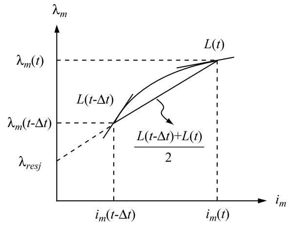  
Figure 5.4 Implementation of piecewise-linear saturation using implicit trapezoidal rule.

Next step is to discretize the equations for electrical subsystem considering the piecewise-linear saturation. In particular, the stator voltage equation (5.61) is discretized using implicit trapezoidal rule resulting in the following

$$
\mathbf {v} _ {a b c s} (t) = \left(\mathbf {r} _ {s} + \frac {2}{\Delta t} \mathbf {L} _ {a b c s a t} ^ {\prime \prime}\right) \mathbf {i} _ {a b c s} (t) + \mathbf {v} _ {a b c s a t} ^ {\prime \prime} (t) + \mathbf {e} _ {s h} (t) \tag {5.71}
$$

where

$$
\mathbf {e} _ {s h} (t) = \left(\mathbf {r} _ {s} - \frac {2}{\Delta t} \mathbf {L} _ {a b c s a t} ^ {\prime \prime}\right) \mathbf {i} _ {a b c s} (t - \Delta t) + \mathbf {v} _ {a b c s a t} ^ {\prime \prime} (t - \Delta t) - \mathbf {v} _ {a b c s} (t - \Delta t) \tag {5.72}
$$

Substituting the magnetizing flux linkages (5.43), (5.44) into rotor state equations (5.29), (5.30), and discretizing the resulting differential equations gives

$$
\boldsymbol {\lambda} _ {q d r} (t) = \mathbf {E} \mathbf {i} _ {q d s} (t) + \mathbf {E} \mathbf {i} _ {q d s} (t - \Delta t) + \mathbf {F} \boldsymbol {\lambda} _ {q d r} (t - \Delta t) + \mathbf {D} \boldsymbol {\lambda} _ {r e s j q d} (t) \tag {5.73}
$$

where the matrices $\mathbf{E}$ , $\mathbf{F}$ and $\mathbf{D}$ are defined in Appendix G.

Furthermore, note that $\lambda_{resj}(t)$ is known as it is defined by (5.70). In order to calculate $\lambda_{resjqd}(t)$ in (5.73), the residual flux $\lambda_{resj}(t)$ is projected along the $qd$ axes as shown in Fig. 5.3. The flux angle $\phi$ between $\lambda_{mq}$ and $\lambda_{m}$ is also required. Discretizing (5.60) using implicit trapezoidal rule we obtain

$$
\phi (t) = \phi (t - \Delta t) + \frac {\Delta t}{2} \left(\omega_ {\phi} (t) + \omega_ {\phi} (t - \Delta t)\right) \tag {5.74}
$$

where the rotating speed $\omega_{\phi}(t)$ of the flux angle $\phi$ is predicted by the linear extrapolation.

By substituting (5.73) into (5.58) and (5.59), the subtransient voltages are expressed as

$$
\mathbf {v} _ {q d s a t} ^ {\prime \prime} (t) = \mathbf {H i} _ {q d s} (t) + \mathbf {h} _ {q d r} (t) \tag {5.75}
$$

where

$$
\mathbf {h} _ {q d r} (t) = \mathbf {M} \mathbf {i} _ {q d s} (t - \Delta t) + \mathbf {N} \lambda_ {q d r} (t - \Delta t) + \mathbf {P} \lambda_ {\text {r e s j q d}} (t). \tag {5.76}
$$

Here, the coefficient matrices $\mathbf{H}$ , $\mathbf{M}$ , $\mathbf{N}$ and $\mathbf{P}$ are given in Appendix G. It is noted that all the coefficient matrices in (G1)-(G7) have a similarly desirable structure with many repeated entries. For example, the matrix $\mathbf{H}$ can be expressed as

$$
\mathbf {H} = \left[ \begin{array}{l l} h _ {1} & h _ {2} \\ - h _ {2} & h _ {1} \end{array} \right]. \tag {5.77}
$$

This convenient property is used to achieve fast calculation of these coefficient matrices.

The subtransient voltages $\mathbf{v}_{qdj}^{\prime \prime}$ are transformed back to $abc$ coordinates by (5.26) as

$$
\mathbf {v} _ {a b c s a t} ^ {\prime \prime} (t) = \mathbf {K i} _ {a b c s} (t) + \mathbf {e} _ {r} (t) \tag {5.78}
$$

where

$$
\mathbf {K} = \left[ \begin{array}{l l l} k _ {1} & k _ {2} & k _ {3} \\ k _ {3} & k _ {1} & k _ {2} \\ k _ {2} & k _ {3} & k _ {1} \end{array} \right] \tag {5.79}
$$

with $k_{1} = \frac{2}{3} h_{1}, k_{2} = -\frac{1}{3} h_{1} - \frac{\sqrt{3}}{3} h_{2}, k_{3} = -\frac{1}{3} h_{1} + \frac{\sqrt{3}}{3} h_{2}$

and

$$
\mathbf {e} _ {r} (t) = \mathbf {K} _ {s} ^ {- 1} \left[ \begin{array}{c} \mathbf {h} _ {q d r} (t) \\ 0 \end{array} \right]. \tag {5.80}
$$

The quasi-symmetrical property of $\mathbf{H}$ in (5.75) and (5.77) results in the simplified matrix $\mathbf{K}$ in (5.79). In particular, the trigonometric functions introduced by $\mathbf{K}_s$ and $\mathbf{K}_s^{-1}$ are eliminated from (5.79) resulting in simple and fast calculation of $\mathbf{K}$ . In this way, the numerical efficiency of the proposed saturable VBR model is further improved by utilizing the symmetrical/structural properties of all matrices.

Substituting subtransient voltages (5.78) into stator voltage equations (5.71), the saturable VBR machine model is integrated into the external network as

$$
\mathbf {v} _ {a b c s} (t) = \mathbf {R} _ {e q} (t) \mathbf {i} _ {a b c s} (t) + \mathbf {e} _ {h} (t) \tag {5.81}
$$

where

$$
\mathbf {R} _ {e q} ^ {v b r} (t) = \mathbf {r} _ {s} + \frac {2}{\Delta t} \mathbf {L} _ {a b c s a t} ^ {\prime \prime} + \mathbf {K} \tag {5.82}
$$

and

$$
\mathbf {e} _ {h} (t) = \mathbf {e} _ {r} (t) + \mathbf {e} _ {s h} (t). \tag {5.83}
$$

The machine mechanical equations (5.1)-(5.2) are also discretized using implicit trapezoidal rule. These equations can be found in [34] and are not included here due to space limitation.

# 5.6 Case Studies

To demonstrate the effectiveness of the proposed model, a single induction machine infinite bus system is used here for the case studies. The induction machine parameters and the nonlinear saturation characteristic are summarized in Appendix H. Here we used the same 50 HP induction machine as was used in [34]. Both saturable and magnetically linear VBR models were implemented using the non-iterative method [34] for EMTP-type solutions. To benchmark the proposed model, a built-in saturable $qd$ machine model of PSCAD/EMTDC is also used. In addition, a saturable $qd$ machine model based on the state variable approach using Levi's formulation [6] was implemented in Matlab/Simulink. It is noted that there are several models derived according to Levi's generalized flux vector approach [6]. Without loss of generality, the

stator-current stator-flux model is utilized in this paper where the state variables are $i_{ds}$ , $i_{qs}$ , $\psi_{ds}$ and $\psi_{qs}$ as documented in Section III-A in [6]. This model was solved using the fourth-order Runge-Kutta method with a very small time step of $1\mu s$ to obtain very accurate numerical solutions. These solutions were used as a reference for the purpose of comparison.

In general, one may consider many case studies that can be used to demonstrate the machine saturation phenomenon. For example, stepping up the machine's terminal voltage is a good choice for study as in this case the saturation can be made well pronounced. This type of study is therefore considered here. Thus, it is assumed that the induction machine is initially operating in no-load steady state. At 0.036s, the stator terminal voltages are stepped up from $80\%$ to $100\%$ of the rated value (from 0.8 to 1.0 pu). Similar case studies have been also used in [37]–[38] for investigating synchronous machine saturation and are considered very appropriate and informative. Other studies, such as variation of load that influences the patterns of main and leakage fluxes may also be used. However, those are not included here due to space limitation.

Since most EMTP languages allow only small and finite number of slopes to define the magnetic saturation, the two-slope piecewise-linear method and the smooth saturation characteristic with arctangent function representation [36] were used to validate the proposed model. The corresponding magnetizing curves are shown in Fig. 5.5. Here, the values of unsaturated and saturated inductances define the two slopes, respectively. The corresponding saturation parameters are summarized in Appendix H. The details of the arctangent function representation can be found in [36] and are also included in Appendix I for completeness.

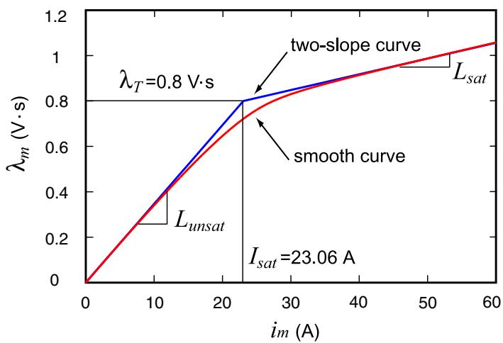  
Figure 5.5 Saturation function approximation using two-slope and smooth curves.

# 5.6.1 Model Verification for Two-Slope Saturation Curve

To verify the new model, a typical time step of $50\mu s$ is used for the three models, i.e., the saturable and linear VBR models and the saturable $qd$ model in PSCAD/EMTDC. Without loss of generality, two-slope piecewise linear saturation representation is utilized here since the saturable machine model in PSCAD/EMTDC permits only few pieces of linear magnetic characteristics. However, the two-slope magnetic characteristic is also convenient to compare the linear and saturable models as the same initial operating point may be established when the applied voltages are only $80\%$ .

From Figs. 5.6-5.8, it may be seen that the proposed saturable VBR model predicted responses that are visually identical to those of the $qd$ model of PSCAD/EMTDC and the reference solution produced by model [6]. The difference between the saturable and magnetically-linear VBR models is also pronounced. In particular, prior to the voltage increase, all models operate in magnetically linear region. Stepping up the stator voltages at 0.036s increases the main flux $\lambda_{m}$ and therefore drives the machine magnetizing path into saturation. As shown in Fig. 5.6, the saturable models predict slightly higher stator current following the voltage increase. The transients observed in speed and electromagnetic torque are shown in Figs. 5.7 and 5.8, respectively, where the differences between the linear and saturable models are visible but much less pronounced. Fig. 5.9 shows the predicted main flux $\lambda_{m}$ , where one can clearly see that the saturable models show a smaller flux increase as compared to the magnetically-linear model. Such results are expected and they verify the proposed saturable VBR induction machine model.

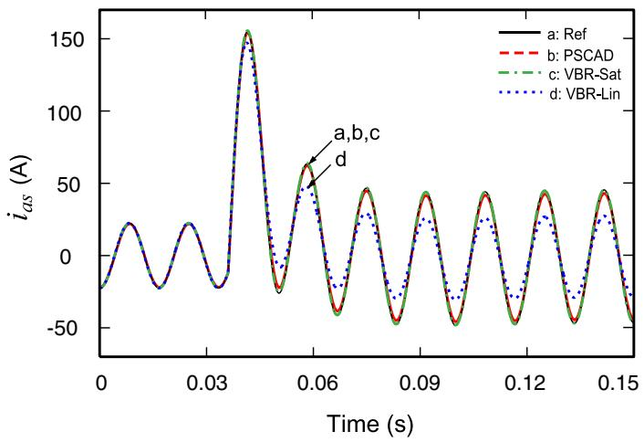  
Figure 5.6 Currents $i_{as}$ predicted by various models using time-step of $50\mu s$ .

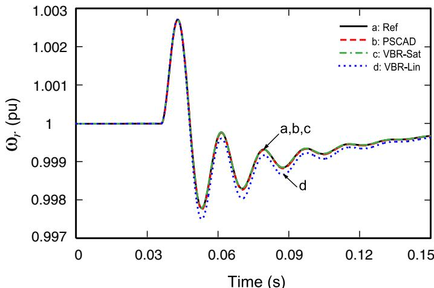  
Figure 5.7 Speeds $\omega_{r}$ predicted by various models using time-step of $50\mu s$

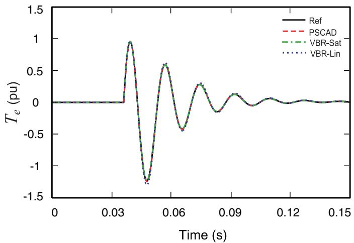

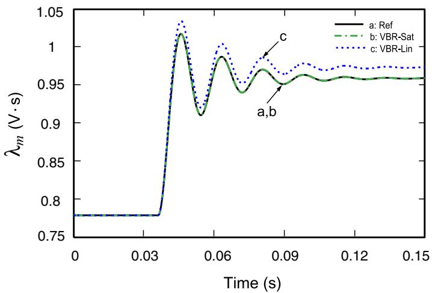  
Figure 5.8 Electromagnetic torques $T_{e}$ predicted by various models using time-step of $50\mu s$ .   
Figure 5.9 Flux linkages $\lambda_{m}$ predicted by various models using time-step of $50\mu s$

# 5.6.2 Model Accuracy for Large Time Step

To investigate the numerical accuracy and robustness of the proposed model, the same case studies are conducted using a much larger time step of 1ms. To avoid possible errors due to transitioning between the curve pieces, a smooth saturation curve shown in Fig. 5.5 is used here. It is noted that the proposed modeling approach is very general in the sense that any appropriate function may be used to represent the saturation curve. Without loss of generality, the arctangent function method [36] was applied to represent the magnetic saturation characteristic for the proposed saturable VBR model and the reference model [6]. However, the studies with PSCAD/EMTDC are not included here due to the fact that its model does not support such representation of the saturation curve.

The corresponding simulation results are plotted in Figs. 5.10-5.13, where it is seen that the proposed saturable VBR model with the time step of $1ms$ still produces quite accurate response compared with the reference solution and that of the small time step of $50\mu s$ . This study validates the assumptions made in deriving the discretized VBR model with saturation characteristic as described in Section V.

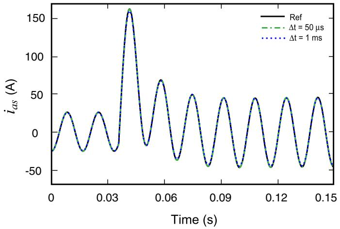  
Figure 5.10 Stator currents $i_{as}$ predicted by saturable VBR models.

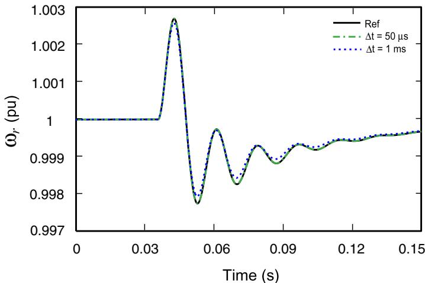

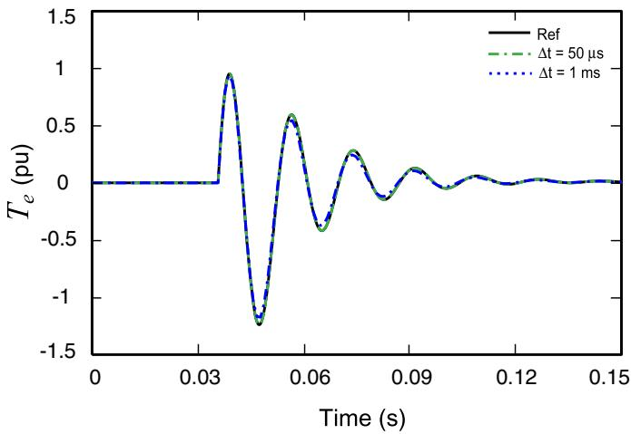  
Figure 5.11 Rotor speeds $\omega_{r}$ predicted by saturable VBR models.

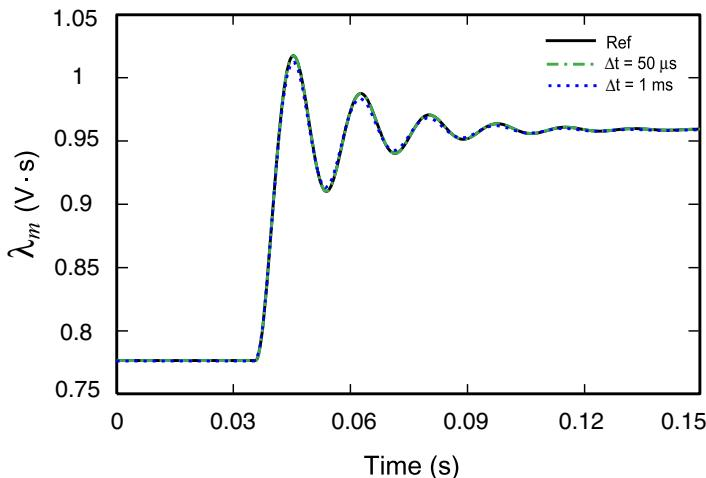  
Figure 5.12 Electromagnetic torques $T_{e}$ predicted by saturable VBR models.   
Figure 5.13 Main flux linkages $\lambda_{m}$ predicted by saturable VBR models.

# 5.6.3 Computational Efficiency

Since the interfacing of machine model with the EMTP external network requires prediction of mechanical variables, the model implementation may be realized with or without the iterations on the predicted variables as explained in [34]. Although such iterations may increase the simulation accuracy, they also require additional computational resources, i.e., CPU time. It is therefore desirable that the model itself provides sufficient numerical accuracy so that the external iterations are not necessary. The non-iterative VBR machine model is advantageous since it greatly improves the overall simulation efficiency compared with the iterative PD model [30], [34].

The method for saturation representation also influences the simulation speed. For the finite and possibly small number of linear pieces of saturation function, the machine parameters and matrices for each given slope in the saturation characteristic may be pre-calculated outside of the major time-stepping loop of the simulation. Because of that, the saturable VBR model with a piecewise-linear saturation could be made very efficient and almost as fast as the magnetically linear VBR model [34]. This approach was considered in the Section IV-A, wherein the two-slope saturation curve was utilized.

However, to represent the smooth saturation curve, the dynamic inductance $L(t)$ is updated each time step. Thus, the coefficients and matrices are required to be recalculated inside the major time-stepping loop. This definitely requires more computational resources and must be implemented with great care. To maximize the simulation efficiency and speed, the following measures were taken: First, all constants introduced by the machine parameters that are needed inside the major time-stepping loop are pre-calculated. Similarly, the symmetrical coefficients/matrices (G1)-(G7) that appear in the discretized model [e.g., see (77), (79)] are carefully re-used; Second, the efficient implementation of trigonometric functions as explained in [34] is applied. Such efforts significantly reduce the required calculations and greatly improve the simulation speed.

The saturable and magnetically-linear VBR models were implemented using ANSI C language. The studies were conducted on a PC with a Pentium-4 2.66 GHz processor and 512 MB RAM. Since the choice of the reference frame slightly affects the matrices (G1)-(G7), both rotor reference frame (RRF) and stationary reference frame (SRF) have been considered. Interested reader can find detailed discussion on the reference frame choice and its effect on the numerical calculations required by the magnetically-linear VBR models in [34]. The CPU times required by each model to complete a single time step are summarized in Table 5.1. It is shown here that the

saturable VBR models with smooth curve saturation require more CPU time. In particular, the SRF results in the fastest implementation as many trigonometric function evaluations become constants. In this case, the saturable VBR model takes $3.12\mu s$ , which is about two times of the respective linear model. The RRF requires few more calculations resulting in the saturable VBR model taking $3.43\mu s$ . However, the overall CPU times of $3.43\mu s$ and $3.12\mu s$ per time-step are still very desirable for typical EMTP applications and represent an improvement over the established PD model as was earlier shown in [34].

Table 5.1 Comparison of CPU Times Per Time Step   

<table><tr><td>Models</td><td>CPU Times</td></tr><tr><td>Linear VBR RRF</td><td>2.2μs</td></tr><tr><td>Linear VBR SRF</td><td>1.6μs</td></tr><tr><td>Saturable VBR RRF</td><td>3.43μs</td></tr><tr><td>Saturable VBR SRF</td><td>3.12μs</td></tr></table>

# 5.7 Discussion

# 5.7.1 Saturation Representation

As documented in [6] and [39]-[40], depending on the selection of state variables and the formulation of generalized flux space vector, the saturable $qd$ machine models may be placed into one of three categories: (i) those that require the time derivative of the generalized inductance, i.e. $d\Lambda / dt$ ; (ii) those that require the time derivative of the inverse of the generalized inductance, i.e. $d(1 / \Lambda) / dt$ ; (iii) other models including the $qd$ model with the winding flux linkages as state variables.

For the $qd$ model with flux linkage as the state variables, the cross saturation is implicitly included in static and dynamic sense. However, for the saturable models of types (i) and (ii), the cross-saturation appears in two parts [39]–[40]. The first one is called "steady-state cross saturation" where the cross saturation is represented as the dependence of the steady-state $qd$ axes magnetizing inductances on the magnetizing current in both axes [39]. The second part is called "dynamic cross saturation" which describes the dynamic magnetic coupling between the $q$ and $d$ axes and is represented by the nonzero terms in the machine system matrix when the machine state-space equations are formulated [39]–[40].

It is noted that the dynamic cross saturation depends not only on the steady-state magnetizing

inductance $L_{m}$ but also on the dynamic inductance $L$ . Moreover, it is shown in [39] that omission of "dynamic cross-saturation" will lead to noticeable errors for the type (i) $d\Lambda / dt$ models during transients. However, for the type (ii) $d(1 / \Lambda) / dt$ models, the "dynamic cross-saturation" may be ignored without loss of model accuracy.

The reference model used in this paper is stator-current stator-flux model with the state variables $i_{ds}$ , $i_{qs}$ , $\psi_{ds}$ and $\psi_{qs}$ as documented in Section III-A in [6]. This is a $d(1 / \Lambda) / dt$ type (ii) model, and it has been implemented without approximations to include both steady-state and dynamic cross-saturation. Therefore, although different in formulation of the state equations, these saturable models of types (i) - (iii) are all equivalent in continuous time domain (if implemented correctly with all terms included), i.e., the cross saturation phenomenon is fully accounted for in all models in steady state as well as transients.

The proposed saturable VBR machine model uses stator currents and rotor fluxes as the independent variables and is equivalent to other saturable models of types (i) – (iii). This model includes steady state and dynamic coupling between the $q$ and $d$ axes. The instantaneous saturation level/point is tracked with respect to the instantaneous magnetizing current, i.e. the dynamic inductance $L$ is always used at any operating point on the nonlinear saturation curve. For example, in order to omit the dynamic cross saturation for the models of types (i) and (ii), one may assume that the dynamic inductance $L$ is equal to the steady-state saturation inductance $L_{m}$ [39]–[40]. No such assumptions have been used in the proposed VBR model. Although for EMTP solution a piecewise-linear approximation of the nonlinear magnetic characteristic has been used, it is done in discrete-time domain, and if the integration time step is sufficiently small, all these models will give identical results. The case studies of stepping up machine terminal voltages clearly demonstrate that the proposed saturable VBR model is convergent to the correct solution for both transients and steady states.

As noted in Section VI, the reference model [6] is a state-space $qd$ machine model which was implemented in Matlab/Simulink and solved by the $4^{\text{th}}$ order Range-Kutta ODE solver with the only purpose to provide a reference trajectory solution. The proposed saturable VBR model is implemented using implicit trapezoidal rule as required by EMTP algorithm and application, which is also essential to this paper. Because of that, a direct comparison of efficiency and accuracy between the proposed VBR and the reference model was not considered (even though the $qd$ reference model [6] may also use large time step of 1ms and produce reasonably accurate simulation results when it is implemented by itself using state variable approach). It is

important to keep in mind that when a $qd$ machine model is implemented in EMTP-type software, it must be interfaced with the external network which is represented in physical variables and $abc$ coordinates. Such interface may and will deteriorate the model accuracy and numerical stability for large time steps as has been shown in [32]–[35]. At the same time, the proposed VBR model has a direct interface of the stator circuit into the external network, which improves the accuracy and numerical stability compared with other EMTP-type $qd$ models. Moreover, as demonstrated in Figs. 5.10–5.13, the proposed saturable VBR model, while correctly including the effect of saturation, also well preserves the numerical accuracy and stability even at fairly large time step.

Another interesting point is that depending on selection of state variables and generalized flux space vector, one can derive several saturable $qd$ models [6], [39]–[40], which are algebraically equivalent (if all terms are included). In linear time invariant (LTI) systems, the change of state variables generally does not affect the system's eigenvalues, and therefore results in a new system that is otherwise equivalent in continuous- and discrete-time domains [41]. However, this is not the case for the machine models that are nonlinear due to the changing speed and effect of saturation. It is therefore reasonable to expect that among the saturable models of types (i) – (iii), there are some that are better than others. For example, it has been shown in [31], [32, see Table II], [33, see Table III], that selecting flux linkages as the state variable generally results in better scaled eigenvalues (for both continuous and discretized models) which subsequently improves numerical properties (accuracy). Although it would be very interesting and insightful to further evaluate the numerical properties of comparable state-variable-based saturable models of types (i) – (iii), such investigations may be considered outside of this manuscript.

# 5.7.2 Comparison with PSCAD

To demonstrate the improved numerical accuracy of the new saturable VBR model over the traditional $qd$ model available in PSCAD, the no-load startup transient study under nominal applied voltages (1 pu) has been conducted using time step of 1ms. The advantage of using this particular transient study over a load-change and/or short-circuit study is that it represents a large-signal electromechanical disturbance which spans the entire speed range (from zero to nominal). For this very reason, the start-up transient studies are often considered in the literature (e.g. see [18], [29]–[30]) for analysis and comparison of models. The piecewise-linear saturation curve of Fig. 5.5 has been utilized here again in all models for consistency since the PSCAD does not support representation of the saturation curve using the smooth arctangent function.

The results of this study are shown in Figs. 5.14-5.16, where the responses of the PSCAD and the VBR models are compared with the reference solution. Due to limited space, only the stator current $i_{as}$ is shown here, whereas other variables demonstrate a similar trend. For clarity, the magnified plots of the current during transient and steady state are shown in Figs. 5.15-5.16, respectively. As Figs. 5.14-5.16 demonstrate, the proposed saturable VBR model offers superior accuracy throughout the transient study, whereas the PSCAD model visibly deviates from the reference solution and predicts lower steady state current. This observation is consistent with the accuracy comparison and analysis of the magnetically linear machine models presented in [34]. Interested reader will find more detailed case studies and analysis in [34] that explain and demonstrate the benefit of using the proposed VBR model. As has been stated earlier, the proposed model has the advantage of direct interface with the external circuit-network, which results in improved numerical accuracy apart from other benefits.

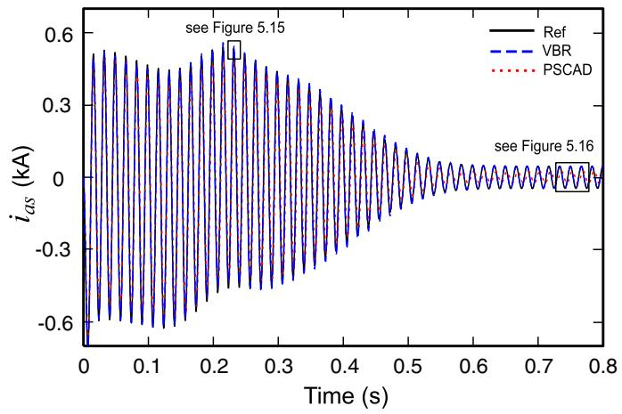

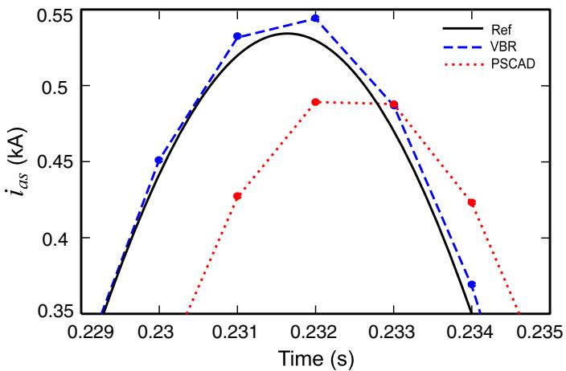  
Figure 5.14 Stator currents during start-up transient as predicted by various models using time step of $1ms$ .   
Figure 5.15 Magnified plot of transient stator currents from Figure 5.14.

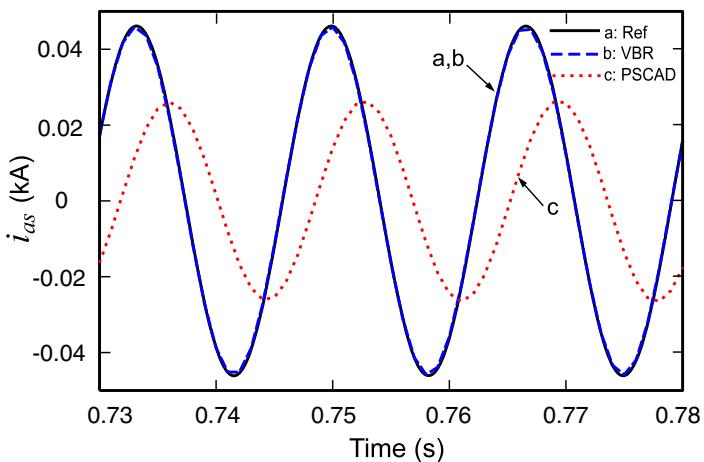  
Figure 5.16 Magnified plot of steady-state stator currents from Figure 5.14.

# 5.8 Conclusion

This paper extends the previous work and presents an approach for including magnetic saturation in the voltage-behind-reactance induction machine model for EMTP. The saturation of the main magnetizing flux is incorporated into the new model such that the $qd$ axes cross saturation is properly included in steady state as well as transients (steady state and dynamic cross saturation).

The piecewise-linear modeling technique is utilized to represent the nonlinear magnetic saturation characteristic. However, the method can include arbitrary number of piecewise-linear segments as to approximate the smooth saturation characteristic with any desirable accuracy. At the same time, if desired, the smooth saturation characteristic can be specified as well, in which case the resulting inductances (and the model parameters) are recalculated at each time step. Recalculating the inductances/parameters at each time step increases the computational overhead of the machine model itself by a factor 1.5 to 2 times, depending on the reference frame considered (see Table I). However, the demonstrated CPU times per step for the proposed saturable VBR model still represents an improvement over the comparable existing EMTP-type machine models.

The benefit of the proposed modeling approach is that a non-iterative and direct interface of the machine model with the external network can be achieved. Computer studies demonstrate that the proposed saturable VBR model in addition of being very efficient also preserves good numerical accuracy and stability even at large time steps. This is also an improvement over many established EMTP-type machine models.

# 5.9 References

[1] S. J. Salon, Finite Element Analysis of Electrical Machines, Kluwer Academic Publishers, 1995.   
[2] G. R. Slemon, "An equivalent circuit approach to analysis of synchronous machines with saliency and saturation," IEEE Trans. Energy Conversion, vol. 5, no. 3, pp. 538-545, Sept. 1990.   
[3] S. D. Sudhoff, B. T. Kuhn, K. A. Corzine, and B. T. Branecky, “Magnetic equivalent circuit modeling of induction motors,” IEEE Trans. Energy Conversion, vol. 22, no. 2, pp. 259–270, Jun. 2007.   
[4] J. E. Brown, K. P. Kovacs, and P. Vas, “A method of including the effects of main flux path saturation in the generalized equations of AC machines,” IEEE Trans. Power Apparatus and Systems, vol. PAS-102, pp. 96–103, Jan. 1983.   
[5] J. O. Ojo, A. Consoli, and T. A. Lipo, “An improved model of saturated induction machines,” IEEE Trans. Industry Applications, vol. 26, pp. 212–221, Mar./Apr. 1990.   
[6] E. Levi, “A unified approach to main flux saturation modeling in D-Q axis models of induction machines,” IEEE Trans. Energy Conversion, vol. 10, no. 3, pp. 455–461, Sept. 1995.   
[7] E. Levi, “Main flux saturation modeling in double-cage and deep-bar induction machines,” IEEE Trans. Energy Conversion, vol. 11, no. 2, pp. 205–311, Jun. 1996.   
[8] T. A. Lipo, and A. Consoli, “Modeling of induction motors with saturable leakage reactances,” IEEE Trans. Industrial Applications, vol. IA-20, pp. 180–189, Jan./Feb. 1984.   
[9] H. M. Jabr, and N. C. Kar, “Starting performance of saturated induction motors,” IEEE Power Engineering Society General Meeting, 2007, 24-28, pp. 1-7, Jun. 2007.   
[10]W. Levy, C.F. Landy, and M. D. McCulloch, "Improved models for the simulation of deep bar induction motors," IEEE Trans. Energy Conversion, vol. 5, no. 2, pp. 393-400, Jun. 1990.   
[11] A. C. Smith, R. C. Healey, and S. Williamson, “A transient induction motor model including saturation and deep bar effect,” IEEE Trans. Energy Conversion, vol. 11, no. 1, pp. 8–15, Mar. 1995.   
[12]S. D. Sudhoff, D. C. Aliprantis, B. T. Kuhn, and P. L. Chapman, “An induction machine model for predicting inverter-machine interaction,” IEEE Trans. Energy Conversion, vol. 17, no. 2, pp. 203-210, Jun. 2002.   
[13]D. C. Aliprantis, S. D. Sudhoff, and B. T. Kuhn, “A synchronous machine model with saturation and arbitrary rotor network representation,” IEEE Trans. Energy Conversion, vol. 20, no. 3, pp. 584–594, Sept. 2005.   
[14]H. W. Dommel, EMTP Theory Book, MicroTran Power System Analysis Corporation, Vancouver, Canada, May 1992.   
[15]P. C. Krause, O. Wasynczuk, and S. D. Sudhoff, Analysis of Electric Machine, $2^{\mathrm{nd}}$ Edition, IEEE Press, Piscataway, NJ, 2002.   
[16]P. Kundur, Power System Stability and Control, McGraw-Hill, New York, 1994.   
[17]G. J. Rogers, and D. Shirmohammadi, “Induction machine modeling for electromagnetic transient program,” IEEE Trans. Energy Conversion, vol. EC-2, no. 4, pp. 622–628, Dec. 1987.

[18] R. Hung, H.W. Dommel, "Synchronous machine models for simulation of induction motor transients," IEEE Trans. on Power Systems, vol. 11, no. 2, pp. 833-838, May 1996.   
[19]V. Brandwajn, “Representation of magnetic saturation in the synchronous machine model in an electro-magnetic transients program,” IEEE Trans. on Power Apparatus and Systems, vol. 99, no. 5, pp. 1996–2002, Sept. /Oct. 1980.   
[20]N. J. Bacalao, P. de Arizona, R. O. Sanche L “A model for the synchronous machine using frequency response measurements,” IEEE Trans. on Power Systems, vol. 10, no. 1, pp. 457–464 Feb. 1995.   
[21]J. R. Marti and K. W. Louie, “A phase-domain synchronous generator model including saturation effects,” IEEE Trans. Power Systems, vol. 12, no. 1, pp. 222–229, Feb. 1997.   
[22]PSCAD/EMTDC V4.0 On-Line Help, Manitoba HVDC Research Centre and RTDS Technologies Inc., 2005.   
[23]MicroTran Reference Manual, MicroTran Power System Analysis Corp., Vancouver, Canada, 1997. Available: http://www.microtran.com.   
[24]Electromagnetic Transient Program, EMTP-RV, CEA Technologies Inc., 2007. Available: http://www.emtp.com.   
[25] Alternative Transients Programs, ATP-EMTP, ATP User Group, 2007. Available: http://www.emtp.org.   
[26] V. Brandwajn, "Synchronous generator models for the analysis of electromagnetic transients," Ph.D. Thesis, The University of British Columbia, Vancouver, Canada, 1977.   
[27] H. K. Lauw and W. S. Meyer, “Universal machine modeling for the representation of rotating electrical machinery in an electromagnetic transients program,” IEEE Trans. Power Apparatus and Systems, vol. PAS-101, pp. 1342–1351, 1982.   
[28] A.M. Gole, R.W. Menzies, H.M. Turanli, and D.A. Woodford, "Improved interfacing of electrical machine models to electromagnetic transients programs," IEEE Trans. Power Apparatus and Systems, vol. PAS-103, pp. 2446-2451, 1984.   
[29]J.R. Marti and T. O. Myers, “Phase-domain induction motor model for power system simulators,” IEEE Conference Communications, Power, and Computing, vol. 2, pp. 276–282, May 1995.   
[30]R. Takahashi, J. Tamura, Y. Tada, A. Kurita, “Derivation of phase-domain model of an induction generator in terms of instantaneous values,” IEEE Power Engineering Society Winter Meeting, vol. 1, 23–27, pp. 359–364, Jan. 2000.   
[31]S. D. Pekarek, O. Wasynczuk, and H. J. Hegner, “An efficient and accurate model for the simulation and analysis of synchronous machine/converter systems,” IEEE Trans. Energy Conversion, vol. 13 no. 1, pp. 42–48, Mar. 1998.   
[32]L. Wang, J. Jatskevich, and S. Pekarek, “Modeling of induction machines using a voltage-behind-reactance formulation,” IEEE Trans. Energy Conversion, vol. 23, no. 2, pp. 382–392, Jun. 2008.

[33]L. Wang and J. Jatskevich, “A voltage-behind-reactance synchronous machine model for the EMTP-type solution,” IEEE Trans. on Power Systems, vol. 21, no. 4, pp. 1539–1549, Nov. 2006.   
[34]L. Wang, J. Jatskevich, C. Wang, and P. Li "A voltage-behind-reactance induction machine model for the EMTP-type solution," IEEE Trans. on Power Systems, vol. 23, no. 3, pp. 1226-1238, Aug. 2008.   
[35]L. Wang, J. Jatskevich, and H. W. Dommel, "Reexamination of synchronous machine modeling techniques for electromagnetic transient simulations," IEEE Trans. Power Systems, vol. 22, no. 3, Aug. 2007.   
[36] K. A. Corzine, B. T. Kuhn, S. D. Sudhoff, H. J. Hegner, “An improved method for incorporating magnetic saturation in the q-d synchronous machine model,” IEEE Trans. Energy Conversion, vol. 13, no. 3, pp. 270–275, Sept. 1998.   
[37] E. Levi, "Saturation modeling in D-Q axis models of salient pole synchronous machines," IEEE Trans. on Energy Conversion, vol. 14, no. 1, pp. 44-50, Mar. 1999.   
[38]E. Levi, “State-space d-q axis models of saturated salient pole synchronous machines,” IEE Proc.-Electr. Power Appl., vol. 145, no. 3, May 1998.   
[39]E. Levi, “Impact of cross-saturation on accuracy of saturated induction machine models,” IEEE Trans. Energy Conversion, vol. 12, no. 3, pp. 211–216, Sept. 1997.   
[40]E. Levi, V. A. Levi, "Impact of dynamic cross-saturation on accuracy of saturated synchronous machine models," IEEE Trans. Energy Conversion, vol. 15, no. 2, pp. 224-230, Sept. 1997.   
[41]R. A. DeCarlo, Linear systems: A State Variable Approach with Numerical Implementation, Prentice-Hall, New Jersey, 1989, p. 457.

# 6 APPROXIMATE VOLTAGE-BEHIND-REACTANCE INDUCTION MACHINE MODEL FOR EFFICIENT INTERFACE WITH EMTP NETWORK SOLUTION6

# 6.1 Introduction

Efficient and accurate machine models for the power system Electro-Magnetic Transient Program (EMTP) [1] have received an extensive attention since the late 1970s. EMTP and its derivative programs are used extensively by engineers and researchers in industry and academia as powerful and standard simulation tools. Improving the numerical efficiency and accuracy of the induction machine models for EMTP-type solutions has been attractive for a long time and will potentially have a very significant impact, since these models and tools are widely used. Numerous machine models have been proposed and implemented in various software packages including MicroTran [2], ATP/EMTP [3], PSCAD/EMTDC [4], and EMTP-RV [5], where $qd$ models are typically used.

Since power system networks are often represented in physical abc phase coordinates, the interface between machine models and the external physical network-circuit imposes additional challenges. In MicroTran (Type-50) and ATP (Type 59), the $qd$ machine models are interfaced using the Thevenin equivalent circuit of the machine in abc coordinates and the predicted machine electrical and mechanical variables [6]. The machine models in PSCAD/EMTDC are represented as three-phase Norton current sources, which are predicted according to the terminal voltages from the previous time step [7]. The main advantage of these methods is that they result in a constant machine conductance sub-matrix, and do not require re-factorization of the entire network conductance G matrix at every time step. However, predicting relatively fast electrical variables introduces interfacing errors that significantly reduce the numerical accuracy of the model, and may potentially cause convergence problem [8]–[10]. In ATP, the Universal Machine (UM) models are used to represent various types of machines [11]. These machines are treated as nonlinear devices and are interfaced with the Thevenin equivalent of the external network in $qd$ coordinates. However, this interfacing method requires machines to be separated by

transmission lines, or artificially inserted "stub-lines" to avoid solving a system of nonlinear equations [1]. A newer package, EMTP-RV, eliminates this constraint by allowing the Newton iterations to achieve the simultaneous solution of machine and network variables [12]–[13]. However, iterative solution of the machine and network equations at every time step generally reduces the overall simulation efficiency.

In order to achieve a direct interface between the machine model and the external network, coupled-circuit phase-domain (PD) models have been proposed [14]–[16]. The direct interface of the PD model has definitely improved numerical accuracy and stability compared with the conventional $qd$ model [8]–[10]. However, the existence of rotor-position-dependent mutual inductances increases the computational burden.

Recently, so-called voltage-behind-reactance (VBR) machine models have been proposed for the state-space approach [17]–[18] and EMTP-type solutions [19]–[20]. The VBR model formulation represents the stator circuit in $abc$ phase coordinates and the rotor subsystem in $qd$ arbitrary reference frame. This formulation incorporates the advantages of the PD model, in terms of its direct interface with the external network as well as its utilization of the numerically efficient model structure, since the rotor subsystem is modeled in $qd$ coordinates. It was shown in [20] that due to its improved accuracy, the VBR model also enables a non-iterative network solution for the mechanical and electrical variables, even at very large time steps.

However, the advantages of these PD [14]–[15] and VBR [20] induction machine models come at the price of having a rotor-speed-dependent machine conductance sub-matrix, which generally requires re-factorization of the entire network conductance $\mathbf{G}$ matrix at every time step as the rotor speed changes. The main focus and goal of this paper is to propose a new approximate voltage-behind-reactance (AVBR) induction machine model that overcomes this problem. The properties of the proposed AVBR model and the overall contributions of the paper are summarized as follows:

- This paper shows that the discretized PD model for the symmetrical squirrel-cage induction machine can be formulated to have a constant machine conductance sub-matrix (assuming a magnetically linear machine).   
- Similar to the VBR induction machine model [20], the new AVBR model achieves simultaneous solution of the machine-network electrical variables and enables a non-iterative solution of the machine mechanical and electrical variables.   
To achieve a constant machine conductance sub-matrix in the AVBR model, the

rotor-speed-dependent coefficients in the equivalent resistance matrix of the machine interface equations are neglected. It is further shown that this approximation is very reasonable for a large range of machines (from 3 to 2250 HP), and that the resulting numerical errors are relatively small, have a very tight error bound, and may be acceptable even for large integration time-steps.

- The proposed AVBR model is demonstrated to be appreciably more efficient (faster) than the previously documented PD and VBR models. Meanwhile, the numerical accuracy achieved by the AVBR model represents a significant improvement over the established $qd$ and PD models.

# 6.2 Machine-Network Conductance Matrix

A detailed discussion of interfacing the machine models with an external network for the EMTP solution may be found in [20]. An important step in interfacing the machine-network is the formulation of the so-called network conductance matrix $\mathbf{G}$ , which is discussed here. In a general framework shown in Fig. 6.1, an arbitrary number of machine models may be connected to the network circuit to model a multi-machine power system. To better understand the challenges of model interfacing, a single machine is singled-out in Fig. 6.1 as an example. To illustrate the formulation of the $\mathbf{G}$ matrix for this machine, the stator voltages and currents are denoted by the vectors $\mathbf{v}_{abcs}$ and $\mathbf{i}_{abcs}$ , respectively.

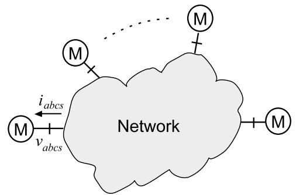  
Figure 6.1 Diagram depicting interface of machines and external network.

To achieve the EMTP solution, it is assumed that the machine differential equations are discretized using the implicit trapezoidal rule. The resulting discretized machine equation in physical variables and $abc$ coordinates has the following form [20]:

$$
\mathbf {v} _ {a b c s} = \mathbf {R} _ {e q} \mathbf {i} _ {a b c s} + \mathbf {e} _ {h} \tag {6.1}
$$

where $\mathbf{R}_{eq}$ is the equivalent resistance matrix and $\mathbf{e}_h$ is the equivalent voltage history term.

In the paper, models of induction machines are derived based on the assumption that the rotor terminals are short-circuited by end-rings, i.e. squirrel-cage machine. If the rotor terminals are required to be interfaced with the external circuit-network in abc phase coordinates to represent a doubly-fed induction machine, the interface equation (6.1) should be re-derived with both stator and rotor voltages included. However, this is beyond the scope of this paper. Thus, the machine branch voltage equation (6.1) is then replaced by the machine nodal equation to enable the machine-network interface, as

$$
\mathbf {G} _ {e q} \mathbf {v} _ {a b c s} = \mathbf {i} _ {a b c s} + \mathbf {i} _ {h} \tag {6.2}
$$

where the machine equivalent conductance sub-matrix is

$$
\mathbf {G} _ {e q} = \mathbf {R} _ {e q} ^ {- 1} \tag {6.3}
$$

and the current history term is

$$
\mathbf {i} _ {h} = \mathbf {R} _ {e q} ^ {- 1} \mathbf {e} _ {h} \tag {6.4}
$$

The power system network is described by a nodal equation that may be written as follows:

$$
\mathbf {G} _ {n} \mathbf {V} _ {n} = \mathbf {I} _ {n h} - \left[ 0 \dots 0, \mathbf {i} _ {a b c s} ^ {T}, 0 \dots 0 \right] ^ {T} \tag {6.5}
$$

Here, $\mathbf{G}_n$ denotes the overall network conductance matrix without incorporating the machine conductance sub-matrix; $\mathbf{V}_n$ represents the nodal voltages; $\mathbf{I}_{nh}$ represents the network's history current sources, assuming the machine is disconnected from the EMTP network. Therefore, the stator currents $\mathbf{i}_{abcs}$ injected into the EMTP network represent the contribution from the machine's discretized equivalent circuit.

Solving (6.2) for the stator currents $\mathbf{i}_{abcs}$ and then substituting it into (6.5), the final linear system of equations in terms of nodal voltages $\mathbf{V}_n$ has the following standard form:

$$
\mathbf {G V} _ {n} = \mathbf {I} _ {h} \tag {6.6}
$$

The formulation of (6.6) is illustrated in Fig. 6.2, where it is shown that $\mathbf{G}_n$ and $\mathbf{I}_{nh}$ are modified by including the 3-by-3 machine equivalent conductance sub-matrix $\mathbf{G}_{eq}$ and the machine equivalent history current sources $\mathbf{i}_h$ to the corresponding machine nodes.

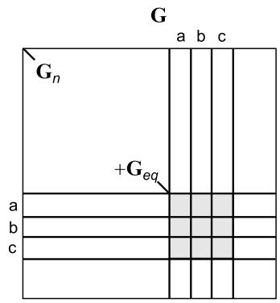

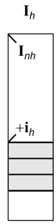  
Figure 6.2 Network nodal equation including machine equivalent conductance sub-matrix and history current source.

The solution of (6.6) is one of the key factors that has made the EMTP languages so efficient and ultimately widely used. As the $\mathbf{G}$ matrix in (6.6) is usually sparse, specially designed techniques such as optimal reordering schemes and partial LU factorization [21]–[22] are often used to solve this linear system instead of inverting the matrix $\mathbf{G}$ directly. Branches with variable parameters are typically ordered in such a way that their equivalent conductance sub-matrices appear in the bottom-right corner of $\mathbf{G}$ to minimize to re-factorization effort [1]. The interested reader will find detailed discussions on this subject in classical references [1], [21]–[22].

Generally speaking, if the machine sub-matrix $\mathbf{G}_{eq}$ is time-variant, the $\mathbf{G}$ matrix has to be re-factorized or partially re-factorized at every time step, which will significantly increase overall computational overhead. Therefore, to maintain the efficient EMTP solution, it is highly desirable to formulate the machine model such that its equivalent conductance sub-matrix $\mathbf{G}_{eq}$ is constant. In this case, the LU factorization can be carried out only once outside of the main time-stepping loop. This property is typically achieved for the $qd$ models [6]–[7], but not for the models with a direct circuit interface, i.e., PD and VBR models.

# 6.3 Discretized Machine Models

To give the reader a consistent view on the subject, the discretized PD model and VBR model are presented and discussed in this section. As usual, it is assumed that the rotor parameters and variables are all referred to the stator side using an appropriate turns-ratio. The expressions for the induced electromagnetic torque and mechanical variables can be found in [20], and are not included here due to space limitation. Instead, the discussion focuses on the electrical part of the machine.

# 6.3.1 Discretized Phase-Domain Model

The PD machine model is interfaced with the external EMTP network using the following equation [20]:

$$
\mathbf {v} _ {a b c s} (t) = \mathbf {R} _ {e q} ^ {p d} \mathbf {i} _ {a b c s} (t) + \mathbf {e} _ {h} ^ {p d} (t) \tag {6.7}
$$

where the equivalent resistance matrix $\mathbf{R}_{eq}^{pd}$ is expressed as

$$
\mathbf {R} _ {e q} ^ {p d} = \mathbf {r} _ {s} + \frac {2}{\Delta t} \mathbf {L} _ {s} - \frac {4}{\Delta t ^ {2}} \mathbf {L} _ {s r} (t) \left(\mathbf {r} _ {r} + \frac {2}{\Delta t} \mathbf {L} _ {r}\right) ^ {- 1} \mathbf {L} _ {r s} (t). \tag {6.8}
$$

The history term $\mathbf{e}_h^{pd}(t)$ is represented as

$$
\mathbf {e} _ {h} ^ {p d} (t) = - \frac {2}{\Delta t} \mathbf {L} _ {s r} (t) \left(\mathbf {r} _ {r} + \frac {2}{\Delta t} \mathbf {L} _ {r}\right) ^ {- 1} \mathbf {e} _ {r h} ^ {p d} (t) + \mathbf {e} _ {s h} ^ {p d} (t). \tag {6.9}
$$

Other relevant matrices and variables in (6.8) and (6.9) are defined in [20], and are less important for our discussion. However, the machine equivalent resistance matrix $\mathbf{R}_{eq}^{pd}$ in (6.7)-(6.8) is of our particular interest and will be investigated further.

Based on (6.8) it is noted that $\mathbf{R}_{eq}^{pd}$ is the result of the summation of three terms: the stator resistance matrix $\mathbf{r}_s$ , the stator inductance matrix term $\frac{2}{\Delta t}\mathbf{L}_s$ , and the third term $-\frac{4}{\Delta t^2}\mathbf{L}_{sr}(t)\left(\mathbf{r}_r + \frac{2}{\Delta t}\mathbf{L}_r\right)^{-1}\mathbf{L}_{rs}(t)$ . The first two terms are constant, as the matrices $\mathbf{r}_s$ and $\mathbf{L}_s$ are constant due to the symmetry of the induction machine [23]. The third term involves the triple matrix product $\mathbf{L}_{sr}(t)\left(\mathbf{r}_r + \frac{2}{\Delta t}\mathbf{L}_r\right)^{-1}\mathbf{L}_{rs}(t)$ , which may seem to be time-variant as the mutual inductance matrices $\mathbf{L}_{sr}(t)$ and $\mathbf{L}_{rs}(t)$ are rotor-position-dependent, as shown in (J1)-(J2) of Appendix J.

However, a careful examination of this triple matrix product reveals that it is independent of the rotor angle $\theta_r$ and therefore time-invariant, assuming that the machine's three-phase windings and associated parameters are symmetrical and the magnetic saturation is ignored. These assumptions result in symmetrical and constant rotor resistance and inductance matrices $\mathbf{r}_r$ and $\mathbf{L}_r$ , respectively. Therefore, the second matrix in the triple matrix product may be evaluated using the analytical inverse formula [24], as follows:

$$
\left(\mathbf {r} _ {r} + \frac {2}{\Delta t} \mathbf {L} _ {r}\right) ^ {- 1} = \left[ \begin{array}{l l l} a & b & b \\ b & a & b \\ b & b & a \end{array} \right] \tag {6.10}
$$

Note that this matrix is also symmetric with only two distinct entries. Substituting (6.10) into (6.8) and using the trigonometric identities (J3)-(J4) listed in Appendix J, the final form of the triple matrix product evaluates to the following:

$$
\mathbf {L} _ {s r} (t) \left(\mathbf {r} _ {r} + \frac {2}{\Delta t} \mathbf {L} _ {r}\right) ^ {- 1} \mathbf {L} _ {r s} (t) = \frac {3}{4} L _ {m s} ^ {2} (a - b) \left[ \begin{array}{c c c} 2 & - 1 & - 1 \\ - 1 & 2 & - 1 \\ - 1 & - 1 & 2 \end{array} \right], \tag {6.11}
$$

which is also a constant and symmetric matrix. Therefore, the entire equivalent resistance matrix $\mathbf{R}_{eq}^{pd}$ is constant.

This is a very desirable property for the PD model, as it removes the need for re-factorizing the entire network $\mathbf{G}$ matrix every time step. However, as is shown in [20], an iterative solution of the machine-network equations may still be required for the PD model to reduce the interfacing errors below a certain desired tolerance when large integration time steps are used.

# 6.3.2 Discretized Voltage-Behind-Reactance Model

The interface of the VBR model is very similar to that of the PD model, and has the following equation [20]:

$$
\mathbf {v} _ {a b c s} (t) = \mathbf {R} _ {e q} ^ {v b r} (t) \mathbf {i} _ {a b c s} (t) + \mathbf {e} _ {h} ^ {v b r} (t) \tag {6.12}
$$

where the history term $\mathbf{e}_h^{vbr}(t)$ is given as

$$
\mathbf {e} _ {h} ^ {v b r} (t) = \mathbf {e} _ {r} ^ {v b r} (t) + \mathbf {e} _ {s h} ^ {v b r} (t) \tag {6.13}
$$

Here, $\mathbf{e}_r^{vbr}(t)$ and $\mathbf{e}_{sh}^{vbr}(t)$ denote the rotor and stator history terms, respectively, and are given in [20]. The equivalent resistance matrix $\mathbf{R}_{eq}^{vbr}(t)$ is expressed as [20]

$$
\mathbf {R} _ {e q} ^ {v b r} (t) = \mathbf {R} _ {D} + \frac {2}{\Delta t} \mathbf {L} _ {D} + \mathbf {K} (t) \tag {6.14}
$$

with

$$
\mathbf {R} _ {D} = \operatorname {d i a g} \left(r _ {D}, r _ {D}, r _ {D}\right) \tag {6.15}
$$

and

$$
\mathbf {L} _ {D} = \operatorname {d i a g} \left(L _ {D}, L _ {D}, L _ {D}\right). \tag {6.16}
$$

where the diagonal elements $r_D$ and $L_D$ are given by (J5) in Appendix J for completeness. The coefficient matrix $\mathbf{K}(t)$ in (6.14) in arbitrary reference frame may be represented by $k_1, k_2$ and $k_3$ as [20]

$$
\mathbf {K} (t) = \left[ \begin{array}{l l l} k _ {1} & k _ {2} & k _ {3} \\ k _ {3} & k _ {1} & k _ {2} \\ k _ {2} & k _ {3} & k _ {1} \end{array} \right] \tag {6.17}
$$

where

$$
k _ {1} = \frac {2}{3} m _ {1}, k _ {2} = - \frac {1}{3} m _ {1} - \frac {\sqrt {3}}{3} m _ {2}, k _ {3} = - \frac {1}{3} m _ {1} + \frac {\sqrt {3}}{3} m _ {2} \tag {6.18}
$$

The coefficients $m_{1}$ and $m_{2}$ are obtained in terms of machine parameters by the following equation [20]:

$$
\left[ \begin{array}{l l} m _ {1} & m _ {2} \\ - m _ {2} & m _ {1} \end{array} \right] = \left[ \begin{array}{l l} c _ {1} & c _ {2} \\ - c _ {2} & c _ {1} \end{array} \right] \left[ \begin{array}{l l} 2 - \Delta t b _ {1} & - \Delta t b _ {2} \\ \Delta t b _ {2} & 2 - \Delta t b _ {1} \end{array} \right] ^ {- 1} \left[ \begin{array}{c c} \Delta t b _ {3} & 0 \\ 0 & \Delta t b _ {3} \end{array} \right] \tag {6.19}
$$

where the constant coefficients $b_{1}$ , $b_{3}$ and $c_{1}$ are as given by (J6) in Appendix J. As the coefficients $b_{2}$ and $c_{2}$ may be rotor-speed-dependent, particular attention is given to them. The two coefficients $b_{2}$ and $c_{2}$ are listed here as

$$
b _ {2} = \omega_ {r} - \omega \tag {6.20}
$$

$$
c _ {2} = \frac {\omega_ {r} L _ {m} ^ {\prime \prime}}{L _ {l r}} \tag {6.21}
$$

Therefore, using (6.15)-(6.17), the equivalent resistance matrix $\mathbf{R}_{eq}^{vbr}(t)$ of the VBR model may be represented as

$$
\mathbf {R} _ {e q} ^ {v b r} (t) = \left[ \begin{array}{l l l} d & k _ {2} & k _ {3} \\ k _ {3} & d & k _ {2} \\ k _ {2} & k _ {3} & d \end{array} \right] \tag {6.22}
$$

where

$$
d = r _ {D} + \frac {2}{\Delta t} L _ {D} + k _ {1} \tag {6.23}
$$

Accordingly, the machine conductance matrix $\mathbf{G}_g^{vbr}$ of the VBR model is derived from (6.22) using the analytical inverse formula [24], as

$$
\mathbf {G} _ {e q} ^ {v b r} (t) = \frac {1}{\det \mathbf {R} _ {e q} ^ {v b r} (t)} \left[ \begin{array}{l l l} g _ {1} & g _ {2} & g _ {3} \\ g _ {3} & g _ {1} & g _ {2} \\ g _ {2} & g _ {3} & g _ {1} \end{array} \right] \tag {6.24}
$$

where

$$
g _ {1} = d ^ {2} - k _ {2} k _ {3}, g _ {2} = k _ {3} ^ {2} - d k _ {2}, g _ {3} = k _ {2} ^ {2} - d k _ {3} \tag {6.25}
$$

and

$$
\det \mathbf {R} _ {e q} ^ {v b r} (t) = d g _ {1} + k _ {3} g _ {2} + k _ {2} g _ {3} \tag {6.26}
$$

As shown in [20], the diagonalized stator equivalent resistance and inductance matrices $\mathbf{R}_D$ and $\mathbf{L}_D$ in (6.14) are time-invariant, assuming a symmetrical and magnetically linear induction machine. However, since the associated parameters $b_2$ and $c_2$ in (6.20) and (6.21) contain the rotor speed and affect (6.19), the matrix $\mathbf{K}(t)$ becomes rotor-speed-dependent. Consequently, the machine conductance matrix $\mathbf{G}_{eq}^{vbr}(t)$ is time-variant.

# 6.4 Approximate Voltage-Behind-Reactance Model

The primary focus of this paper is to obtain a constant conductance matrix $\mathbf{G}_{eq}$ for the previously established VBR model. In order to achieve that, the rotor-speed-dependency of coefficients $k_{1}, k_{2}$ and $k_{3}$ in equivalent resistance matrix $\mathbf{R}_{eq}^{vbr}(t)$ has to be eliminated. This leads to the so-called approximate voltage-behind-reactance (AVBR) model with constant conductance matrix $\mathbf{G}_{eq}$ as described in this section.

# 6.4.1 AVBR Model Formulation

The AVBR machine model is derived here using the rotor reference frame. For the stationary and synchronous reference frames, the same goal may be achieved using a similar derivation procedure. Thus, the reference frame speed $\omega$ is equal to $\omega_{r}$ , which simplifies (6.20) as

$$
b _ {2} = 0 \tag {6.27}
$$

Substituting this result into (6.19) and solving the triple matrix product gives

$$
m _ {1} = \frac {c _ {1} \Delta t b _ {3}}{2 - \Delta t b _ {1}} \tag {6.28}
$$

and

$$
m _ {2} = \frac {c _ {2} \Delta t b _ {3}}{2 - \Delta t b _ {1}} \tag {6.29}
$$

where the coefficient $m_{1}$ is now constant, and the coefficient $m_{2}$ is still linearly dependent on the rotor speed $\omega_{r}$ due to $c_{2}$ .

It is noted from (6.28) and (6.29) that $m_{1}$ and $m_{2}$ have the same order as the discretization timestep $\Delta t$ , which symbolically may be expressed as

$$
m _ {1} = O (\Delta t) \tag {6.30}
$$

$$
m _ {2} = O (\Delta t) \tag {6.31}
$$

Moreover, the coefficients $k_{1}, k_{2}$ and $k_{3}$ in (6.18) are linear combinations of $m_{1}$ and/or $m_{2}$ . Therefore, the elements of $\mathbf{K}(t)$ shown in (6.17) also possess the same order as $\Delta t$ , which gives

$$
k _ {1} = O (\Delta t) \tag {6.32}
$$

$$
k _ {2} = O (\Delta t) \tag {6.33}
$$

$$
k _ {3} = O (\Delta t) \tag {6.34}
$$

Here the coefficient $k_{1}$ depends only on $\Delta t$ and is constant for a fixed time step, and the coefficients $k_{2}$ and $k_{3}$ also depend linearly on the rotor speed $\omega_{r}$ .

It is also observed from (6.23) that the diagonal element $d$ in the equivalent resistance matrix $\mathbf{R}_{eq}^{vbr}(t)$ has an order inversely proportional to $\Delta t$ , and is expressed as

$$
d = O \left(\frac {1}{\Delta t}\right) \tag {6.35}
$$

Since the integration time step $\Delta t$ is usually small, the diagonal elements $d$ in $\mathbf{R}_{eq}^{vbr}(t)$ are much larger than the off-diagonal elements $k_{2}$ and $k_{3}$ , which means that

$$
d > > k _ {2} \tag {6.36}
$$

and

$$
d \gg k _ {3}. \tag {6.37}
$$

Therefore, the ratios $|k_2 / d|$ and $|k_3 / d|$ have quadratic order with respect to the time step:

$$
\left| k _ {2} / d \right| = O \left(\Delta t ^ {2}\right) \tag {6.38}
$$

$$
\left| k _ {3} / d \right| = O \left(\Delta t ^ {2}\right). \tag {6.39}
$$

This important diagonally dominant property of the equivalent resistance matrix $\mathbf{R}_{eq}^{vbr}(t)$ becomes pronounced very quickly for small time steps. To demonstrate this phenomenon, we consider four typical induction machines ranging from 3 to 2250 HP [23], which are representative for power applications. The corresponding machine parameters are summarized in Table 6.1. The coefficients $k_{2}$ , $k_{3}$ and $d$ , and matrices used in the VBR model have been calculated according to the methodology described in this paper and [20].

Table 6.1 Parameters of Induction Machines   

<table><tr><td>Machine Number</td><td>Power (HP)</td><td>Voltage (V)</td><td>Speed (rpm)</td><td>TB(N·m)</td><td>IB(abc)(A)</td><td>rs(Ω)</td><td>Xls(Ω)</td><td>Xm(Ω)</td><td>Xlr(Ω)</td><td>r(r/Ω)</td><td>J(kg·m2)</td></tr><tr><td>M1</td><td>3</td><td>220</td><td>1710</td><td>11.9</td><td>5.8</td><td>0.435</td><td>0.754</td><td>26.13</td><td>0.754</td><td>0.816</td><td>0.089</td></tr><tr><td>M2</td><td>50</td><td>460</td><td>1705</td><td>198</td><td>46.8</td><td>0.087</td><td>0.302</td><td>13.08</td><td>0.302</td><td>0.228</td><td>1.662</td></tr><tr><td>M3</td><td>5 00</td><td>2300</td><td>1773</td><td>1.98×103</td><td>93.6</td><td>0.262</td><td>1.206</td><td>54.02</td><td>1.206</td><td>0.187</td><td>11.06</td></tr><tr><td>M4</td><td>2250</td><td>2300</td><td>1786</td><td>8.9×103</td><td>421.2</td><td>0.029</td><td>0.226</td><td>13.04</td><td>0.226</td><td>0.022</td><td>63.87</td></tr></table>

Here, the rotor parameters are all referred to the stator side by appropriate turns-ratios.

For a typical 50 HP machine (M2), the ratios of $|k_{2} / d|$ and $|k_{3} / d|$ have been calculated for different time steps $\Delta t$ and rotor speed $\omega_{r}$ ; the results are shown in Figs. 6.3-6.4. As revealed by (6.38)-(6.39) and seen in Figs. 6.3-6.4, the decreased integration time-step makes the two ratios very small. In addition to the time-step, these ratios are also affected by the rotor speed $\omega_{r}$ [see (6.21), (6.29) and (6.18)], and as Figs. 6.3-6.4 show, decrease with $\omega_{r}$ .

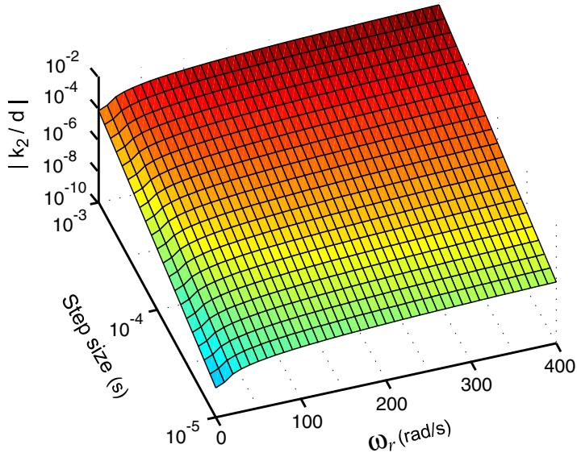  
Figure 6.3 Ratio of $|k_{2} / d|$ for the machine M2.

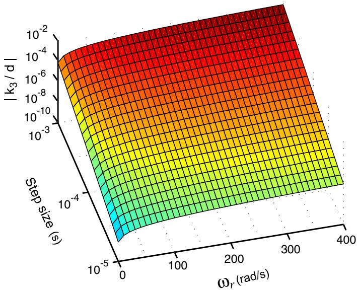  
Figure 6.4 Ratio of $|k_{3} / d|$ for the machine M2.

For the purpose of further comparison, Figs. 6.5-6.6 show these ratios for all four sample machines, calculated using the integration time steps of $10^{-3}, 10^{-4}$ and $10^{-5}$ , respectively. Figs. 6.5-6.6 further verify this important property, namely that the equivalent resistance matrix very quickly becomes diagonally dominant for sufficiently small time steps. The log scale has been used for the vertical axis in Figs. 6.3-6.6 to show this rapid trend.

For the same time step, the larger power rating of the machine results in smaller ratios, as demonstrated in Figs. 6.5-6.6. This may be attributed to the relative decrease of the rotor resistance $r_r$ , which impacts the coefficients $b_1$ , $b_3$ and $c_1$ , as shown in (J6), and leads to

smaller $k_{2}$ and $k_{3}$ . A more detailed analysis of how the machine's rating and winding parameters affect the approximation accuracy is given in Section VI.

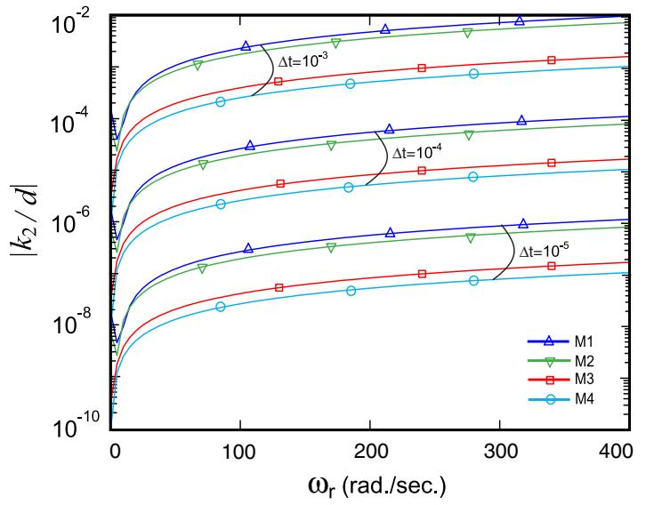

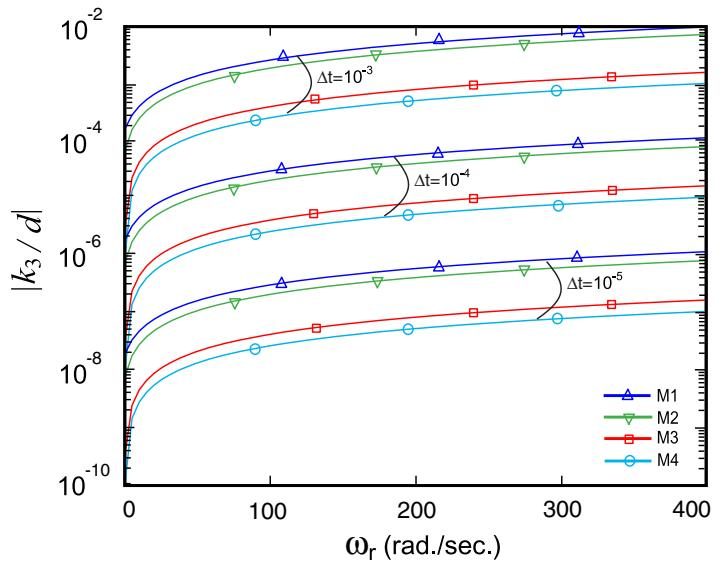  
Figure 6.5 Ratio of $|k_{2} / d|$ for the four machines with three different time-steps.   
Figure 6.6 Ratio of $|k_{3} / d|$ for the four machines with three different time-steps.

Based on the observation that the ratios $|k_{2} / d|$ and $|k_{3} / d|$ are sufficiently small, the off-diagonal elements $k_{2}$ and $k_{3}$ may be neglected altogether. If this is done, the approximate equivalent resistance matrix becomes

$$
\mathbf {R} _ {e q} ^ {\text {a v b r}} = \mathbf {D} \tag {6.40}
$$

where

$$
\mathbf {D} = \operatorname {d i a g} (d, d, d) \tag {6.41}
$$

It is noted that the coefficient $d$ is constant as $k_{1}$ in (6.23) is constant due to rotor reference frame. The corresponding conductance matrix is

$$
\mathbf {G} _ {e q} ^ {\text {a v b r}} = \mathbf {D} ^ {- 1} \tag {6.42}
$$

Therefore, the approximate VBR model is defined by the exact VBR model, with the exception that (6.40)-(6.42) are used instead of (6.22)-(6.26).

# 6.4.2 Approximation Error Bound

Neglecting the off-diagonal elements $k_{2}$ and $k_{3}$ in $\mathbf{R}_{eq}^{vbr}(t)$ will introduce some additional numerical errors. A very natural question that arises is whether these additional errors can be made sufficiently small for this approach to be practical. In this subsection, these additional errors caused by approximation (6.42) are investigated and quantified in terms of error bounds. For the purpose for discussion, let us assume a linear system of equations of the general form

$$
\mathbf {A} \mathbf {x} = \mathbf {b} \tag {6.43}
$$

where $\mathbf{A}$ is an n-by-n nonsingular matrix, and $\mathbf{b}$ is an n-by-1 vector, and that both are known. The exact solution $\mathbf{x}$ is then unique and is given as

$$
\mathbf {x} = \mathbf {A} ^ {- 1} \mathbf {b}. \tag {6.44}
$$

If the original matrix $\mathbf{A}$ is approximated by a nonsingular matrix $\mathbf{D}$ , the resultant approximated linear system becomes

$$
\mathbf {D} \mathbf {x} = \mathbf {b} \tag {6.45}
$$

Thus, the approximated solution $\hat{\mathbf{x}}$ is expressed as

$$
\hat {\mathbf {x}} = \mathbf {D} ^ {- 1} \mathbf {b}. \tag {6.46}
$$

The approximation error $\varepsilon$ is defined in terms of an arbitrary vector norm [25] as

$$
\varepsilon = \frac {\left\| \mathbf {x} - \hat {\mathbf {x}} \right\|}{\left\| \mathbf {x} \right\|}. \tag {6.47}
$$

The numerator $\| \mathbf{x} - \hat{\mathbf{x}}\|$ in (6.47) is further manipulated by substituting (6.44) and (6.46) and then applying the matrix norm consistency condition $\| \mathbf{AB}\| \leq \| \mathbf{A}\| \| \mathbf{B}\|$ [25]. These steps result in the

following

$$
\left\| \mathbf {x} - \hat {\mathbf {x}} \right\| = \left\| \left(\mathbf {A} ^ {- 1} - \mathbf {D} ^ {- 1}\right) \mathbf {b} \right\| \leq \left\| \mathbf {A} ^ {- 1} - \mathbf {D} ^ {- 1} \right\| \| \mathbf {b} \|. \tag {6.48}
$$

Similarly, applying the matrix norm consistency condition gives

$$
\left\| \mathbf {b} \right\| = \left\| \mathbf {A} \mathbf {x} \right\| \leq \left\| \mathbf {A} \right\| \left\| \mathbf {x} \right\|. \tag {6.49}
$$

It is noted that (6.49) can be rewritten as

$$
\frac {1}{\| \mathbf {x} \|} \leq \frac {\| \mathbf {A} \|}{\| \mathbf {b} \|}. \tag {6.50}
$$

Multiplying (6.48) and (6.50), it is shown that the approximating error (6.47) is bounded as

$$
\frac {\left\| \mathbf {x} - \hat {\mathbf {x}} \right\|}{\left\| \mathbf {x} \right\|} \leq \left\| \mathbf {A} ^ {- 1} - \mathbf {D} ^ {- 1} \right\| \left\| \mathbf {A} \right\|. \tag {6.51}
$$

Thus, the error bound can be calculated as

$$
\varepsilon_ {\text {b o u n d}} = \left\| \mathbf {A} ^ {- 1} - \mathbf {D} ^ {- 1} \right\| \left\| \mathbf {A} \right\|. \tag {6.52}
$$

The error bound $\varepsilon_{\text{bound}}$ can be used not only to guarantee the convergence of the proposed approach, but also to provide a good estimate of the approximation error. To demonstrate this, the matrices $\mathbf{R}_{eq}^{vbr}$ and $\mathbf{R}_{eq}^{avbr}$ were calculated for the four typical machines summarized in Table 6.1, for a speed range from zero to synchronous speed $\omega_b$ . The approximation error bound $\varepsilon_{\text{bound}}$ was calculated according to (6.52) with $\mathbf{R}_{eq}^{vbr} = \mathbf{A}$ and $\mathbf{R}_{eq}^{avbr} = \mathbf{D}$ , as per (6.43) and (6.45), respectively, using the 2-norm [26]. Fig. 6.7 shows the error-bound plots calculated for the three different time-steps $10^{-3}$ , $10^{-4}$ and $10^{-5}$ s. As can be seen from Fig. 6.7, the error bound behaves very similarly to the ratios of the off-diagonal versus main-diagonal element shown in Figs. 6.3-6.6. This result is expected, since $\mathbf{R}_{eq}^{avbr}$ is diagonal and $\mathbf{R}_{eq}^{vbr}$ has a strong diagonally dominant structure. For example, as Fig. 6.7 shows, the largest error bound of about 0.012 (1.2%) may be observed for the 3 HP machine (M1) at synchronous speed when the time-step is $10^{-3}$ s.

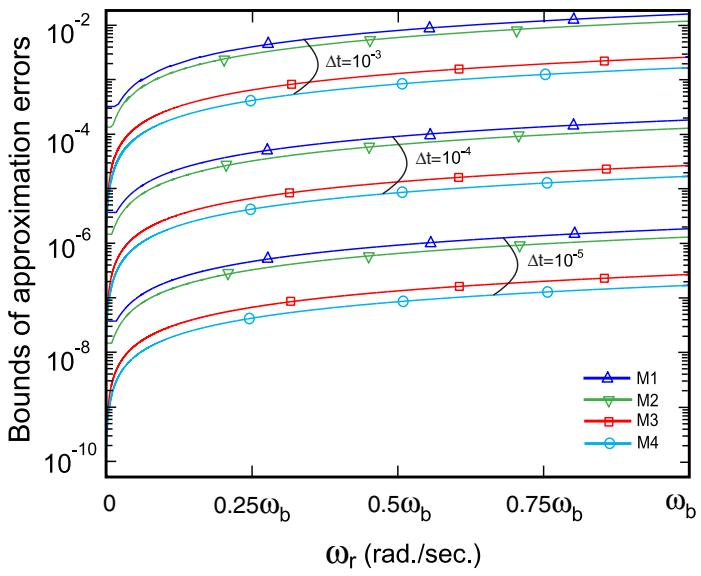  
Figure 6.7 Approximation error bounds for the four machines considered.

# 6.5 Case Studies

In this section, a no-load startup transient study is described that was used to evaluate the models of the four induction machines listed in Table 6.1. This study was chosen because it also spans the rotor speed $\omega_{r}$ in a wide range, which impacts the approximation accuracy, as shown in Section IV. The proposed AVBR, PD and the exact VBR models were all implemented according to the methodology presented in Sections II-IV as well as [20]. For validation and comparison purposes, the built-in $qd$ model of EMTP-RV in rotor reference frame was used as the standard EMTP machine model. Since the exact analytical solution of the machine differential equations is not available, a state-space $qd$ model was implemented in MATLAB/Simulink [27]. For the purpose of consistency, the voltage and flux linkage equations of the full-order $qd$ model are also listed in Chapter 3 (3.5)-(3.20). The $qd$ model is solved using $4^{\text{th}}$ order Runge-Kutta method with a very small time step of $1\mu s$ . This solution is therefore considered as a numerical reference. For consistency among the models, the rotor reference frame was used in all of them.

# 6.5.1 Large Time-Step Study

The integration time-step size plays an important role in simulation accuracy and speed. The larger the time-step can be made, the faster the simulation speeds that will be achieved, which is always very desirable. However, this may come at the price of reduced accuracy and possibly even a loss of numerical stability. To demonstrate the accuracy of AVBR, VBR, PD, and the

$qd$ model of EMTP-RV, in this section a relatively large time-step of $500\mu s$ is considered.

Case studies for the 50 HP machine (M2) are presented and discussed first in this subsection. The transient responses produced by various models are shown in Figs. 6.8-6.13. The stator current $i_{as}$ is plotted in Fig. 6.8, where one can observe that the AVBR, VBR, PD, and $qd$ models of EMTP-RV all produce qualitatively similar responses that are close to the reference solution (solid black line). However, a more detailed analysis reveals that the accuracy of these models is in fact different. To illustrate this point, two fragments of this study are shown magnified in Figs. 6.9-6.10 corresponding to the middle and end of the transient, respectively. As can be easily seen in Figs. 6.9-6.10, the accuracy of the models improves from the $qd$ model, to PD, to the VBR model, with VBR being the most accurate. This observation is consistent with the results of [20] and justifies improving the machine-network interface. However, it is important to notice that the proposed AVBR model also achieves a visibly good performance that is very close to that of the exact VBR model.

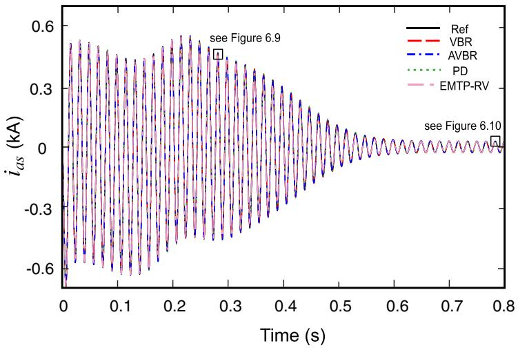  
Figure 6.8 Stator current transient for $50\mathrm{HP}$ machine using time-step of $500\mu s$

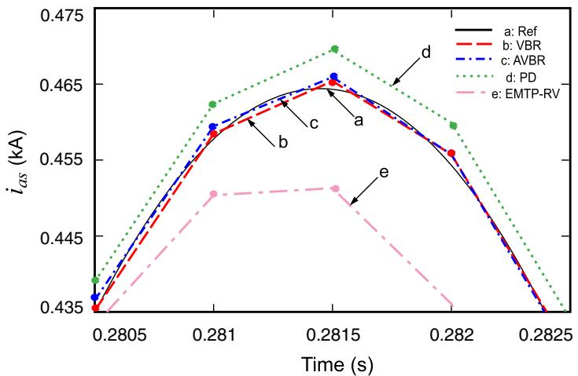  
Figure 6.9 Magnified fragment of transient stator currents from Figure 6.8.

Other variables of interest that are included here are rotor speeds $\omega_{r}$ and the induced electromagnetic torque $T_{e}$ , which are shown in Figs. 6.11-6.12. Here, it is seen that the transient responses predicted by the $qd$ model of EMTP-RV are noticeably different from those of the other models. In contrast, the PD and VBR models, and even the AVBR, all produce nearly the same results as the reference solution. A magnified fragment of the electromagnetic torque is shown in Fig. 6.13. This figure also reveals the same consistent trend of improvement in accuracy, from the $qd$ model of EMTP-RV, to PD, to AVBR, to the exact VBR model which is the most accurate.

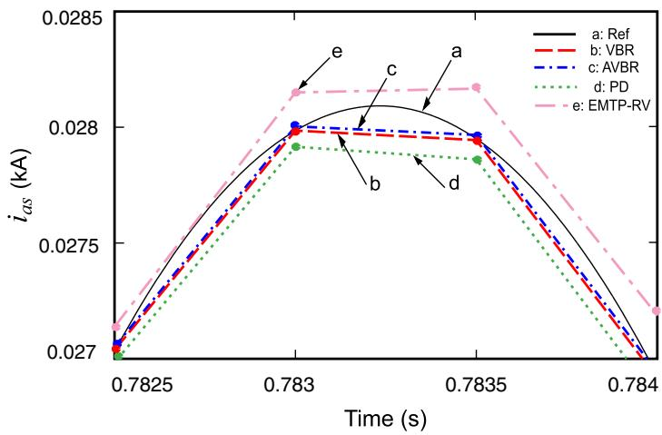  
Figure 6.10 Magnified fragment of steady-state stator currents from Figure 6.8.

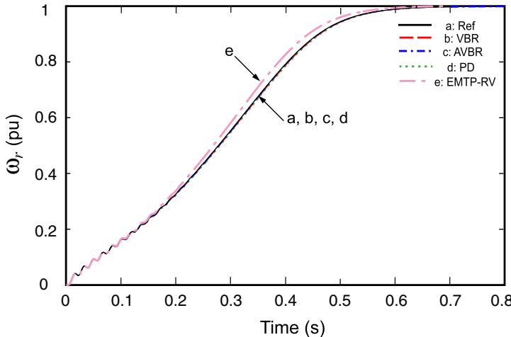  
Figure 6.11 Rotor speed transient for $50\mathrm{HP}$ machine using time-step of $500\mu s$

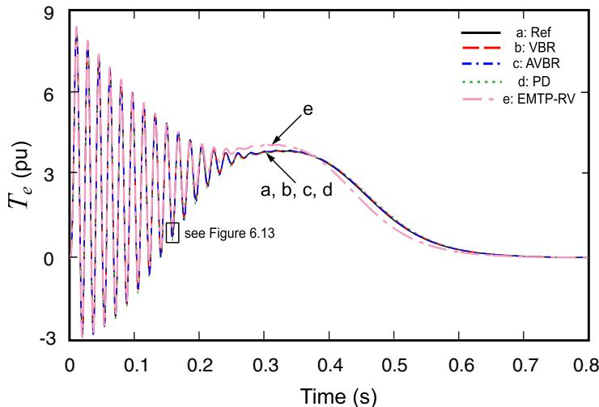

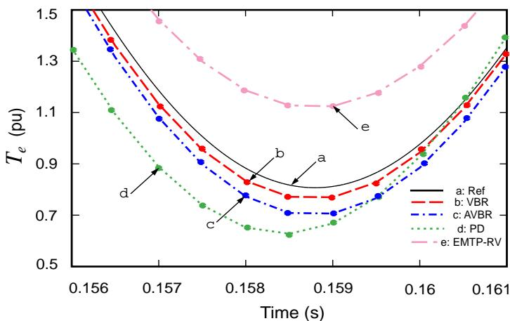  
Figure 6.12 Electromagnetic torque for $50\mathrm{HP}$ machine using time-step of $500\mu s$   
Figure 6.13 Magnified fragment of electromagnetic torque from Figure 6.12.

# 6.5.2 Model Accuracy

The numerical accuracy of the PD, VBR and AVBR models are further analyzed in this subsection by comparing the relative errors between the numerical solutions and the reference solution. Without loss of generality, the electromagnetic torque is considered here, whereas other machine variables demonstrate a similar trend and are not included due to limited space. Thus, the relative error of the trajectory solution is calculated using the 2-norm [26] as

$$
e (\Delta t) = \frac {\left\| \tilde {T} _ {e} - T _ {e} \right\| _ {2}}{\left\| \tilde {T} _ {e} \right\| _ {2}} \cdot 100 \% \tag{6.53}
$$

where $\widetilde{T}_e$ denotes the reference solution as defined in Section V, and $T_{e}$ is the given numerical solution obtained using time step $\Delta t$ and a given subject model, respectively.

The results of comparing the four models are summarized in Fig. 6.14. As expected, the relative error of all models increases with the time-step $\Delta t$ , and all models produce responses that converge to the same reference solution for sufficiently small step size. This result also verifies that all these models are correct and consistent, provided they use the same set of machine parameters.

However, it can be seen from Fig. 6.14 that the models with a direct circuit interface, namely the PD, VBR and AVBR models, all demonstrate lower relative errors compared with the conventional $qd$ model of EMTP-RV. This improved numerical accuracy is attributed to the direct machine-network interface, as has been documented in [20]. It is also observed in Fig. 6.14 that although the AVBR model is slightly less accurate than the exact VBR model, it is still noticeably better than the PD, especially for large time steps. For example, if a $1\%$ accuracy is required, either the approximate or the exact VBR model can achieve this with the time-step as large as $500\mu s$ . The PD model will require a time step on the order of $260\mu s$ (which will take almost twice the number of steps to complete the same study). The $qd$ model of EMTP-RV will require an even smaller time step, on the order of $70\mu s$ (which will take more than seven times the number of steps required by the AVBR model).

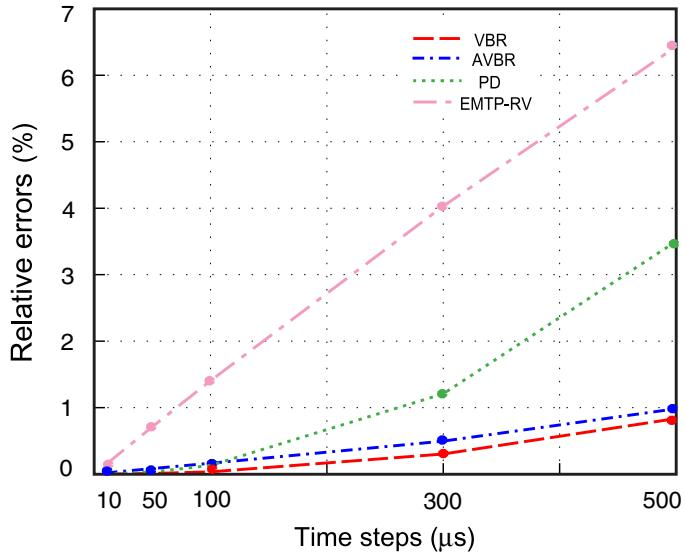  
Figure 6.14 Relative numerical errors observed in electromagnetic torque $T_{e}$ .

# 6.5.3 Model Efficiency

In order to further compare the numerical efficiency of the proposed AVBR model with the other models with a direct interface (PD, VBR), all three were implemented using the ANSI C language and executed on a personal computer (PC) with a Pentium-4 2.66GHz processor and 512MB RAM. All three models were carefully coded to minimize the number of flops and evaluations of trigonometric functions, as documented in [20]. To make a fair comparison among the models, the same start-up transient study was carried out. The measured CPU times per step are summarized in Table 6.2.

Table 6.2 Comparison of CPU Times Per Time Step   

<table><tr><td>Model</td><td>PD</td><td>VBR</td><td>AVBR</td></tr><tr><td>Per time-step</td><td>3.6μs</td><td>2.2μs</td><td>1.9μs</td></tr></table>

Table 6.2 shows that the PD model presented in this paper represents a slight improvement (3.6 $\mu$ s) compared with the previously reported result (4.6 $\mu$ s) [20]. This has been achieved due to the constant equivalent resistance (conductance) matrix, as explained in section III-A. However, the PD model still requires a fair amount of calculations in its history terms, torque equation, etc., and is therefore quite computationally expensive. The exact VBR model is structurally more efficient and requires less CPU time (2.2 $\mu$ s). However, the proposed AVBR model outperforms the previous models by being noticeably faster (1.9 $\mu$ s). It is important to note that although the improvement of the AVBR model over the VBR model is relatively modest (13.6% as shown in

Table 6.2), a very significant structural advantage of the AVBR model is in its constant equivalent conductance submatrix $\mathbf{G}_{eq}$ , which has many benefits as explained in Section II.

# 6.6 Approximation Accuracy Analysis

# 6.6.1 Effect of Machine Parameters and Rotor Speed

As can be seen in Figs. 6.5-6.7, various induction machines possess different off-to-main-diagonal ratios in $\mathbf{R}_{eq}^{vbr}$ , i.e. $|k_{2}/d|$ and $|k_{3}/d|$ . More specifically, higher-power-rating machines tend to have small ratios of $|k_{2}/d|$ and $|k_{3}/d|$ making the proposed approximation more favorable and producing the results closer to the exact VBR model. To better understand how the parameters (i.e. winding resistances and inductances) affect the approximation accuracy, the same four machines from Table 6.1 are carefully examined here. Specifically, the model internal parameters $b_{1}, c_{1}, b_{3}, c_{2}, m_{1}, m_{2}$ have been calculated and are summarized in Table 6.3. For comparison purpose, the machine parameters $L_{ls}, L_{lr}$ , and $L_{m}'' / L_{lr}$ are also listed in Table 6.3.

Table 6.3 Parameters of Exact VBR Model for Induction Machines   

<table><tr><td>Machine Number</td><td>Lm/Llr</td><td>Lls, Llr(H)</td><td>b1</td><td>c1</td><td>b3</td><td>c2(ωb)</td><td>m1</td><td>m2(ωb)</td><td>rLr/Llr</td><td>r2/Llr(Llr+Lm)</td></tr><tr><td>M1</td><td>0.972</td><td>0.002</td><td>-11.44</td><td>-11.12</td><td>0.7931</td><td>366.4</td><td>-4.385e-3</td><td>1.445e-1</td><td>407.9904</td><td>4.6685e3</td></tr><tr><td>M2</td><td>0.977</td><td>8.011e-4</td><td>-6.423</td><td>-6.278</td><td>0.2229</td><td>368.5</td><td>-6.973e-4</td><td>4.093e-2</td><td>284.6158</td><td>1.8281e3</td></tr><tr><td>M3</td><td>0.978</td><td>0.0032</td><td>-1.277</td><td>-1.249</td><td>0.1829</td><td>368.8</td><td>-1.141e-4</td><td>3.37e-2</td><td>58.4555</td><td>74.6199</td></tr><tr><td>M4</td><td>0.983</td><td>5.995e-4</td><td>-0.6252</td><td>-0.6145</td><td>0.0216</td><td>370.7</td><td>-6.643e-6</td><td>4.007e-3</td><td>36.6983</td><td>22.9435</td></tr></table>

In the table of Table 6.3, it is first observed that $L_{m}^{\prime \prime} / L_{lr} \approx 1$ , which implies that in all four induction machines the subtransient inductance is close to the rotor leakage inductance

$$
L _ {m} ^ {\prime \prime} \approx L _ {l r} \tag {6.54}
$$

This observation is consistent with definition of $L_{m}^{\prime \prime}$ in (J5) and suggests that the term $\left(\frac{L_m^{\prime\prime}}{L_{lr}} - 1\right)$ in (J6) is small. Furthermore, based on the definitions of $b_{1}, c_{1}, b_{3}$ in (J6) and definition of $c_{2}$ in (6.21), it is concluded that

$$
b _ {1} \approx c _ {1}, b _ {3} \approx r _ {r}, \alpha \mathrm {v} \delta c _ {2} \approx \omega_ {r}. \tag {6.55}
$$

As the time step $\Delta t$ is usually small (on the order of tens to hundreds of microseconds), the

denominator in (6.28)-(6.29) is $2 - \Delta tb_{1} \approx 2$ . Therefore, the $m_{1}$ and $m_{2}$ defined by (6.28)-(6.29) can be approximated as following:

$$
m _ {1} \approx \frac {c _ {1} \Delta t b _ {3}}{2} \text {a n d} m _ {2} \approx \frac {c _ {2} \Delta t b _ {3}}{2} \tag {6.56}
$$

Using (6.18), (6.23), (6.54), (J5), and assuming that $L_{ls} = L_{lr}$ , the diagonal element $d$ can be further approximated as

$$
d = r _ {D} + \frac {2}{\Delta t} L _ {D} + k _ {1} \approx \frac {2}{\Delta t} L _ {D} \approx \frac {4}{\Delta t} L _ {l r} \tag {6.57}
$$

which clearly shows that this element will increase as the time step is made smaller.

Furthermore, as seen in Table 6.3, when the rotor speed $\omega_{r}$ is high (close to nominal) we have $|c_1| << c_2$ , which of course leads to $|m_1| << m_2$ . This result allows neglecting $m_1$ in (6.18) and approximating the coefficients $k_2$ and $k_3$ in terms of the dominant coefficient $m_2$ only as following

$$
k _ {2} \approx - \frac {\sqrt {3}}{3} m _ {2} \text {a n d} k _ {3} \approx \frac {\sqrt {3}}{3} m _ {2} \tag {6.58}
$$

Combing the results of (6.55) - (6.58), it can be shown that the ratios $|k_{2} / d|$ and $|k_{3} / d|$ can be further approximated as

$$
\mid k _ {2} / d \mid \approx \mid k _ {3} / d \mid \approx \frac {\Delta t ^ {2} \omega_ {r} r _ {r}}{8 \sqrt {3} L _ {l r}} \tag {6.59}
$$

The result (6.59) shows that, in addition to the time step $\Delta t$ , the ratio $r_r / L_{lr}$ plays a great role in determining the diagonal dominance of $\mathbf{R}_{eq}^{vbr}$ and the accuracy of its approximation $\mathbf{R}_{eq}^{avbr}$ as defined by (6.40).

When the rotor speed is very low (e.g. close to zero at starting) such that $|c_1| >> c_2$ , the off-diagonal elements $k_2$ and $k_3$ may be approximated differently as

$$
k _ {2} \approx - \frac {1}{3} m _ {1} \text {a n d} k _ {3} \approx - \frac {1}{3} m _ {1} \tag {6.60}
$$

For this case, the ratios $|k_{2} / d|$ and $|k_{3} / d|$ can be approximated using (6.60) and (6.57) as

$$
\left| k _ {2} / d \right| \approx \left| k _ {3} / d \right| \approx \left| \frac {\Delta t m _ {1}}{1 2 L _ {l r}} \right| \tag {6.61}
$$

Substituting (6.56), (6.55), (J6) and (J5) into (6.61), the ratios $|k_{2} / d|$ and $|k_{3} / d|$ can then be represented as

$$
\mid k _ {2} / d \mid \approx \mid k _ {3} / d \mid \approx \frac {\Delta t ^ {2} r _ {r} ^ {2}}{2 4 L _ {l r} \left(L _ {l r} + L _ {m}\right)} \tag {6.62}
$$

It is seen from (6.59) and (6.62) that $\frac{r_r}{L_{lr}}$ and $\frac{r_r^2}{L_{lr}(L_{lr} + L_m)}$ determine the off-to-main-diagonal ratios in high and low rotor speed regions, respectively. For the purpose of comparison, these two ratios have been calculated for the four induction machines and are also summarized in Table 6.3 (see last two columns). As seen in Table 6.3, the machines with higher power ratings usually have smaller $\frac{r_r}{L_{lr}}$ and $\frac{r_r^2}{L_{lr}(L_{lr} + L_m)}$ ratios which result in smaller off-to-main-diagonal ratios in their matrix $\mathbf{R}_{eq}^{vbr}$ . So, the smaller these ratios are the more diagonally-dominate $\mathbf{R}_{eq}^{vbr}$ will be, which in turn makes the approximation (6.40) more accurate.

For example, the 3 HP (M1) and 2250 HP (M4) induction machines have the $r_r / L_{lr}$ ratios of 407.9904 and 36.6983, respectively. This implies that the diagonal-dominant property of $\mathbf{R}_{eq}^{vbr}$ is 11.1 times stronger for the 2250 HP (M4) machine compared to 3 HP (M1) machine [assuming the same discretization time step is used, see (59)]. This observation is consistent with the calculated ratios and error bound analysis shown in Figs. 6.5 - 6.7, where an order of magnitude improvement in approximation accuracy is seen for the 2250 HP machine over the 3 HP machine for the same time-step size and rotor speed.

# 6.6.2 Case Studies with Machines of Different Ratings

The case studies in Section V consider the 50 HP machine. In order to demonstrate the validity of AVBR model for a wide range of power ratings, this Section presents the studies with 3 HP (M1), 500 HP (M3), and 2250 HP (M4) induction machines (see Table 6.1). For the purpose of consistency, the start-up transients are investigated here as well. The exact VBR and AVBR models are implemented and compared against the reference solution. The reference solution is obtained by solving the state-space $qd$ model with the $4^{\text{th}}$ order Runge-Kutta method and the time step of $1\mu s$ .

Without loss of generality, the 3 HP machine is investigated first using a large time step of $1ms$ . Figs. 6.15 - 6.19 show the computed transient responses during start-up period. It is seen in Fig. 6.15 that both VBR and AVBR models predict similar and accurate stator current responses. A magnified plot of the stator currents is also shown in Fig. 6.16 where it is visibly observed that the VBR model produces slightly more accurate results than the AVBR model; however, this difference is very small. Fig. 6.17 shows that the rotor speeds predicted by the VBR and AVBR models are almost identical to the reference solution. Figs. 6.18 and 6.19 depict the developed electromagnetic torque, and show that the AVBR model produces very good numerical results and accuracy comparable to the exact VBR model.

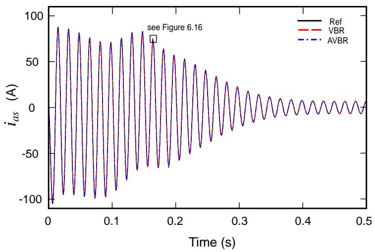  
Figure 6.15 Stator current transient for $3\mathrm{HP}$ machine using time-step of $1ms$ .

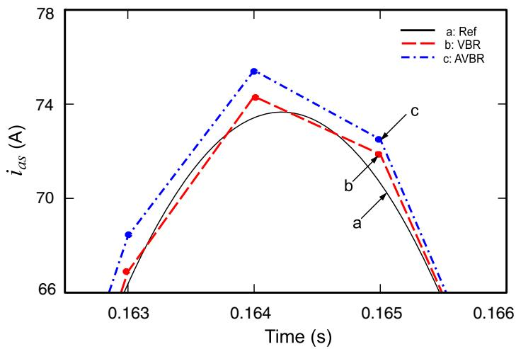  
Figure 6.16 Magnified fragment of transient stator currents from Figure 6.15 for 3 HP machine using time-step of $1ms$ .

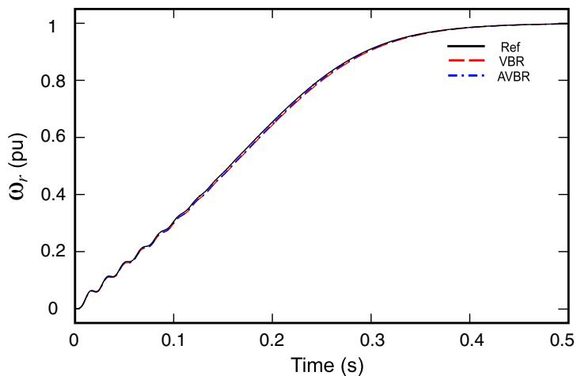  
Figure 6.17 Rotor speed transient for 3 HP machine using time-step of $1ms$ .

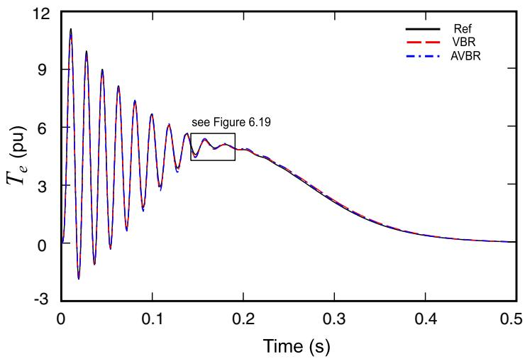

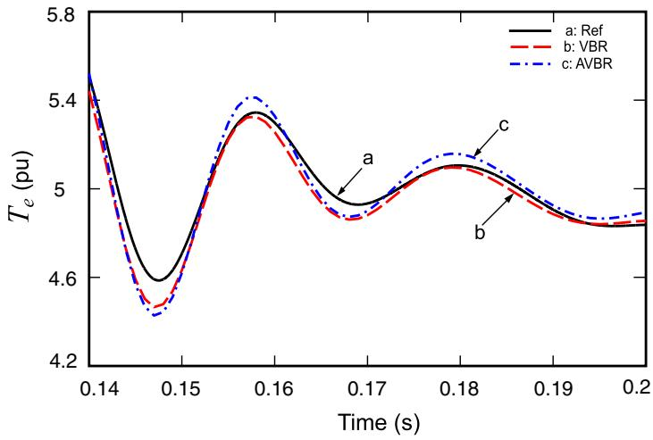  
Figure 6.18 Electromagnetic torque for 3 HP machine using time-step of $1ms$ .   
Figure 6.19 Magnified fragment of electromagnetic torque from Figure 6.18 for 3 HP machine using time-step of $1ms$ .

Next, the startup transients of the 500 HP (M3) and 2250 HP (M4) machines are also investigated using a large time step of $500\mu s$ . Due to space limitation, only the stator currents are shown in Figs. 6.20 - 6.25. Specifically, Figs. 6.20 - 6.22, 6.23 - 6.25 show the stator currents as predicted by the reference, VBR and AVBR models for the 500 HP and 2250 HP machines, respectively. Since these machines take longer to accelerate, it is difficult to differentiate among the models in Fig. 6.20 and 6.23. To give a better view of the match, the magnified fragments are also shown in more detail in Figs. 6.21-6.22 and 6.24-6.25 for the two machines, respectively. It is observed from Figs. 6.20 - 6.25 that the VBR and AVBR models produce almost identical and very accurate results that are very close to the reference solution. Other variables such as rotor currents, speeds and electromagnetic torques predicted by the AVBR model also demonstrated similar accuracy and closeness to the VBR model.

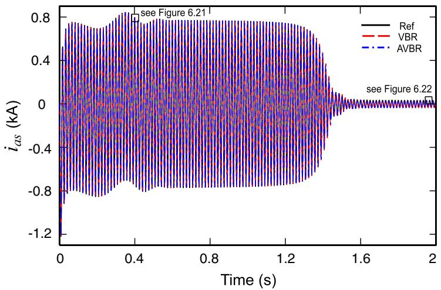

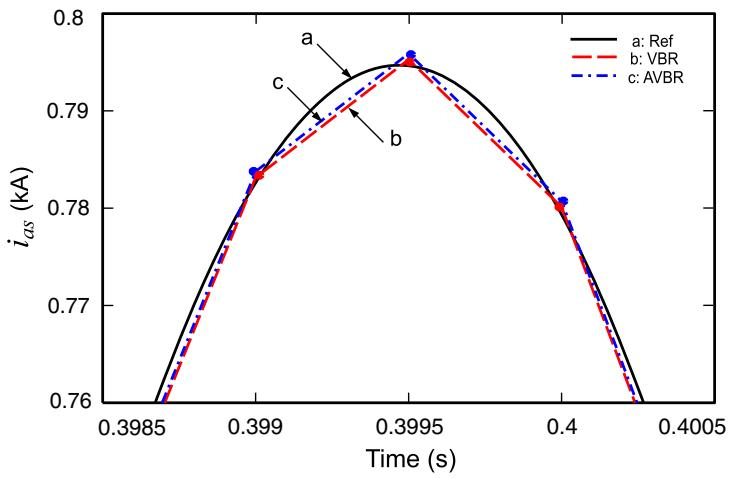  
Figure 6.20 Stator currents for $500\mathrm{HP}$ machine using time-step of $500\mu s$   
Figure 6.21 Magnified fragment of transient stator currents from Figure 6.20 for $500\mathrm{HP}$ machine using time-step of $500\mu s$ .

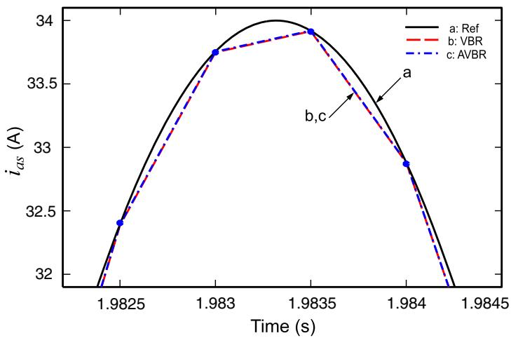  
Figure 6.22 Magnified fragment of steady-state stator currents from Figure 6.20 for $500\mathrm{HP}$ machine using time-step of $500\mu s$ .

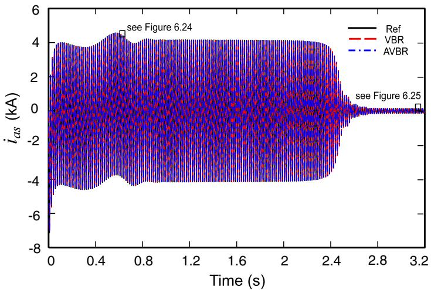

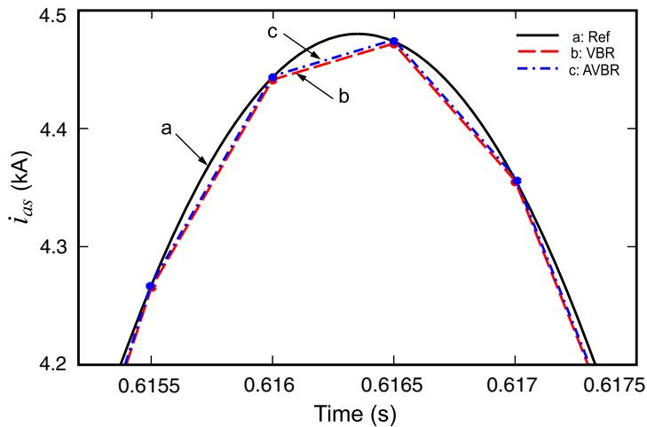  
Figure 6.23 Stator currents for $2250\mathrm{HP}$ machine using time-step of $500\mu s$   
Figure 6.24 Magnified fragment of transient stator currents from Figure 6.23 for 2250 HP machine using time-step of $500\mu s$ .

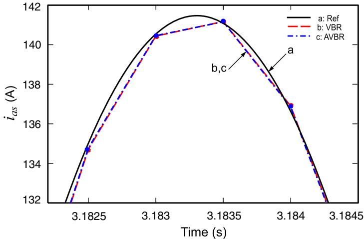  
Figure 6.25 Magnified fragment of steady-state stator currents from Figure 6.23 for 2250 HP machine using time-step of $500\mu s$ .

# 6.7 Discussion

# 6.7.1 Accuracy and Numerical Stability of the AVBR Model

The extensive case studies presented in this paper demonstrate good numerical accuracy achieved by the AVBR and its closeness to the exact VBR model for a wide range of induction machines when using small and large integration time steps. Similar to the classical $qd$ and PD models implemented in EMTP software packages, the VBR and AVBR models use implicit Trapezoidal rule for the discretization of machine differential equations. Therefore, the absolute numerical stability (A-stability [1, see Appendix I.8], [26]) offered by the implicit Trapezoidal rule is preserved for both the VBR and AVBR models. When the integration time-step is sufficiently small such that the interfacing of machine models does not represent a problem, the EMTP-based simulators can be used for on-line and/or hardware-in-the-loop applications that require continuous execution in real time for indefinite period. Although some level of numerical errors will always be present due to digitization of solution and finite precision arithmetic [46], interested reader will find many publications documenting such applications of the EMTP. When the entire system is solved together/simultaneously and the underlying physical system is stable, such errors should not grow over time causing global numerical instability if the system is properly conditioned [26], [28].

Both previously established PD and VBR models achieve direct interface and simultaneous solution with the EMTP network, although the VBR model improves the numerical accuracy due

to the better scaled eigenvalues [17, see Section V, Table 6.2], [19, see Table III] as well as being computationally more efficient due to its structure [19, see Table I and II], [20, see Table II and III]. The proposed approximation, i.e., AVBR model, does not introduce anything that would make the model and/or interface less stable compared to the original-exact VBR model. The AVBR model achieves the direct interface and simultaneous solution with the EMTP network in the same way, but produces a solution that somewhat deviates from that obtained by the exact VBR model as if the machine parameters were slightly altered.

However, what may significantly influence the numerical stability of the overall simulation is the interfacing method of machine models with the external system [29]. The EMTP $qd$ models are often interfaced indirectly (i.e., requiring either predictions or iterations of machine electrical variables [6], or a time-step-delay [7], etc). The errors due to interfacing increase very rapidly with the increase of the time-step size, and in sever cases may result in degradation of accuracy and loss of convergence as has been shown in [8]–[10], [18]–[20]. This has generally been the main motivation for researching the machine models, such as PD and VBR, which have direct interface with the EMTP circuit-network and achieve simultaneous solution. Interested readers will find more detailed analysis of machine models, simulation time step and numerical stability in [8]–[10], [18]–[20], and the references therein. The interfacing of machine models with nodal-analysis- and state-variable-based programs is an important subject that is of interest to many researchers and engineers and will also be covered by the work of IEEE Task Force on Interfacing Techniques for Simulation Tools, in the upcoming document [29].

# 6.7.2 Effect of Short-Circuit Ratio

It has been suggested by one of the reviewers that the stability of the proposed model should be investigated more extensively for the network with different Short-Circuit Ratios (SCR) while executing the simulations for very long times. We agree that such investigation would be very useful, and to the best of our knowledge, none of the previously published and/or existing EMTP machine models have been subjected to this level of interrogation. Moreover, to make such studies objective an informative to the readers, both types the traditional $qd$ models and the PD/VBR models should be considered and benchmarked together. It is also important to keep in mind that it is not the SCR per se, but rather the eigenvalues of the underlying system and machine-network interface method that will affect the numerical stability of the overall system solution. Therefore, considering just the SCR will not be sufficient as the systems' eigenvalues will also be affected by the composition of the network (i.e., inductance, resistance, capacitance,

lumped parameter vs. distributed parameter, etc). The analysis of numerical stability will be further complicated by the time-varying nature of the systems with rotating machines. To assess this problem analytically would be much harder than investigation of numerical stability of integration methods [26], which is typically carried out considering a simple constant/time-invariant system.

Although conducting such studies is outside of the scope and possible page limit of this paper, in general, the models with direct interface with the EMTP network (i.e., PD, VBR, and AVBR) should not pose any problems for different SCRs since these models achieve simultaneous solution and in this way preserve the A-stability of the implicit trapezoidal rule (which is in this case applied to the overall electrical system). However, the traditional $qd$ models, depending on the method of interfacing (i.e., direct vs. indirect, Thevenin equivalent, Norton equivalent, compensation, iterative, etc) [29] are likely to demonstrate different levels of "numerical sensitivity" to the type of network and its SCRs. For example, in a weak power grid (low SCR) larger fluctuations of the network voltages may increase prediction errors of the machine variables.

At the same time, the derivations and studies included in this paper are focused to show the closeness of the proposed AVBR model to the original VBR model for a wide range of machines, which has been the focal point of this paper. In this regard, the material presented in this paper is inline with the previously published work on this subject as summarized in the references.

# 6.7.3 Application of the Proposed AVBR Model

The proposed AVBR model belongs to the class of the so-called general-purpose squirrel-cage induction machine models which are based on classical assumptions. The key principle of the proposed approximation lays in eliminating the rotor-speed-dependency of coefficients $k_{1}$ , $k_{2}$ and $k_{3}$ in equivalent resistance matrix $\mathbf{R}_{eq}^{vbr}(t)$ . Moreover, as has been shown in Section VI, the approximation seems to favor larger machines with small rotor resistance that result in small ratios of $\frac{r_r}{L_{lr}}$ and $\frac{r_r^2}{L_{lr}\left(L_{lr} + L_m\right)}$ . Therefore, approximation accuracy is expected to get worse for machines with large rotor resistance, e.g. NEMA Design D motors. However, as has been shown in Figs. 6.15 - 6.25, the proposed approximation gives very reasonable results for a wide range of machines.

Also, if it is required to change the rotor resistance dynamically during the simulation, it can be

accomplished in both VBR and AVBR models. On the one hand, in the exact VBR model, the matrix $\mathbf{R}_{eq}^{vbr}(t)$ has to be updated at each time-step, and therefore changing the rotor resistance can be readily included without any difficulties. On the other hand, the accuracy of approximation in the AVBR model depends on the rotor resistance. Moreover, the diagonal element $d$ of $\mathbf{R}_{eq}^{avbr}$ also contains the rotor resistance as defined by (6.23) and (J5). However, as shown in (6.57), the diagonal element $d$ is also dominated by $4L_{lr}/\Delta t$ , which suggests that keeping $\mathbf{R}_{eq}^{avbr}$ constant while changing the rotor resistance inside the model may still be a valid approximation for small time-step sizes.

To represent a doubly-fed induction machine, the rotor terminals are required to be interfaced with the external circuit-network in abc phase coordinates. Therefore, the interface equation (6.1) should be re-derived with both stator and rotor voltages included, as for example has been done in PD model in [14]. However, this is beyond the scope of this paper.

# 6.8 Conclusion

In this paper, we have presented an approximate voltage-behind-reactance induction machine model for the discretized EMTP solution. The new model has a constant equivalent conductance matrix in the machine-network interface equation, which is achieved by neglecting the rotor-speed-dependent coefficients in the equivalent resistance matrix of the previously established (original) voltage-behind-reactance model derived for the EMTP. This constant equivalent conductance matrix is desirable since it avoids the re-factorization of the network conductance matrix at every time step. This feature may make the new model very attractive for possible use in various EMTP packages. A detailed analysis of such approximation for machines from 3 to $2250\mathrm{HP}$ has shown that the resulting numerical errors are relatively small, have a very tight error bound, and therefore may be acceptable for a wide range of integration time steps.

It has also been shown that a discretized phase-domain model can be formulated to have a constant machine conductance sub-matrix due to the commonly assumed geometrical symmetry of squirrel-cage induction machines. However, as demonstrated in this paper, the new approximate voltage-behind-reactance model preserves the numerical accuracy of the exact voltage-behind-reactance model and represents an appreciable improvement over the established phase-domain model and the conventional $qd$ model of EMTP-RV.

# 6.9 References

[1] H. W. Dommel, EMTP Theory Book, MicroTran Power System Analysis Corporation, Vancouver, Canada, May 1992   
[2] MicroTran Reference Manual, MicroTran Power System Analysis Corp., Vancouver, Canada, 1997. Available: http://www.microtran.com.   
[3] Alternative Transients Programs, ATP-EMTP, ATP User Group, 2007. Available: http://www.emtp.org.   
[4] PSCAD/EMTDC, Manitoba HVDC Research Centre and RTDS Technologies Inc., 2007. Available: http://www.pscad.com.   
[5] Electromagnetic Transient Program, EMTP RV, CEA Technologies Inc., 2007. Available: http://www.emtp.com.   
[6] V. Brandwajn, "Synchronous generator models for the analysis of electromagnetic transients," Ph.D. thesis, University of British Columbia, Vancouver, Canada, 1977.   
[7] PSCAD/EMTDC V4.0 On-Line Help, Manitoba HVDC Research Centre and RTDS Technologies Inc., 2005.   
[8] X. Cao, A. Kurita, H. Mitsuma, Y. Tada and H. Okamoto, “Improvements of numerical stability of electromagnetic transient simulation by use of phase-domain synchronous machine models,” Electrical Engineering in Japan, vol. 128, no. 3, April, 1999.   
[9] A. B. Dehkordi, A. M. Gole and T. L. Maguire, “Permanent magnet synchronous machine model for real-time simulation,” Proc. of Interracial Conference on Power Systems Transients (IPST'05), Montreal, Canada, June, 2005.   
[10]L. Wang, J. Jatskevich, and H.W. Dommel, "Reexamination of synchronous machine modeling techniques for electromagnetic transient simulations," IEEE Trans. Power Systems 2007,   
[11] H. K. Lauw and W. S. Meyer, “Universal machine modeling for the representation of rotating electrical machinery in an electromagnetic transients program,” IEEE Trans. Power Apparatus and Systems, vol. PAS-101, pp. 1342–1351, 1982.   
[12]J. Mahseredjian, L. Dube, M. Zou, S. Dennetiere and G. Joos, “Simultaneous solution of control system equations in EMTP,” IEEE Trans. Power Systems, vol. 21, no. 1, pp. 117–124, Feb. 2006.   
[13] J. Mahseredjian, S. Dennetiere, L. Dube, B. Khodabakhchian and L. Gerin-Lajoie, “On a new approach for the simulation of transients in power systems,” Proc. of International Conference on Power Systems Transients (IPST'05), Montreal, Canada, June, 2005.   
[14]J.R. Marti and T. O. Myers, “Phase-domain induction motor model for power system simulators,” IEEE Conference Communications, Power, and Computing, vol. 2, pp. 276–282, May 1995.   
[15]R. Takahashi, J. Tamura, Y. Tada, A. Kurita, “Derivation of phase-domain model of an induction generator in terms of instantaneous values,” IEEE Power Engineering Society Winter Meeting, vol. 1, 23–27, pp. 359–364, Jan. 2000.

[16] W. Gao, E. V. Solodovnik and R. A. Dougal, "Symbolically aided model development for an induction machine in virtual test bed," IEEE Trans. Energy Conversion, vol. 19, no. 1, pp. 125-135, Mar. 2004.   
[17]S. D. Pekarek, O. Wasynczuk, and H. J. Hegner, “An efficient and accurate model for the simulation and analysis of synchronous machine/converter systems,” IEEE Trans. Energy Conversion, vol. 13, no. 1, pp. 42–48, Mar. 1998.   
[18]L. Wang, J. Jatskevich, and S. Pekarek, “Modeling of induction machines using a voltage-behind-reactance formulation,” IEEE Trans. Energy Conversion, vol. 23, no. 2, pp. 382–392, Jun. 2008.   
[19]L. Wang and J. Jatskevich, “A voltage-behind-reactance synchronous machine model for the EMTP-type solution,” IEEE Trans. Power Systems, vol. 21, no. 4, pp. 1539–1549, Nov. 2006.   
[20]L. Wang, J. Jatskevich, C. Wang and P. Li, "A voltage-behind-reactance induction machine model for the EMTP-type solution," IEEE Trans. Power Systems, vol. 23, no. 3, pp. 1226-1238, Aug. 2008.   
[21] H. W. Dommel, “Nonlinear and time-varying elements in digital simulation of electromagnetic transients,” IEEE Trans. Power Apparatus and Systems, Vol. PAS-90, pp. 2561–2567, Nov./Dec. 1971.   
[22]S. M. Chan, V. Brandwajn, “Partial matrix refactorization,” IEEE Trans. Power Apparatus and Systems, Vol. PWRs-1, No. 1, pp. 193–200, Feb. 1986.   
[23]P. C. Krause, O. Wasynczuk, and S. D. Sudhoff, Analysis of Electric Machine, $2^{\mathrm{nd}}$ Edition, IEEE Press, Piscataway, NJ, 2002.   
[24] Eric Weisstein, Wolfram Mathworld, Wolfram Research, June, 2007. Available: http://mathworld.wolfram.com/MatrixInverse.html.   
[25] J. W. Demmel, Applied Numerical Linear Algebra, SIAM, Philadelphia, 1997.   
[26] W. Gautchi, Numerical Analysis: An Introduction, Birkhauser, Boston, Massachusetts, 1997.   
[27]Simulink Dynamic System Simulation Software - Users Manual, MathWorks, Inc., Natick, Massachusetts, 2007.   
[28]M. L. Overton, Numerical Computing with IEEE Floating Point Arithmetic, SIAM, Philadelphia, 2001.   
[29]L. Wang, J. Jatskevich, V. Dinavahi, H. W. Dommel, J. A. Martinez, K. Strunz, M. Rioual, G. W. Chang, and R. Iravani, "Methods of Interfacing Rotating Machine Models in Transient Simulation Programs," IEEE Task Force on Interfacing Techniques for Simulation Tools. To appear in IEEE Trans. on Power Delivery (TPWRD-00457-2009), 15 pages.

# 7 CONCLUSIONS AND FUTURE WORK

To analyze and design modern electric power and energy systems, the engineers and researchers should have effective and powerful modeling and simulation tools. On one hand, there is a strong need to consider larger systems with more components represented at a greater level of detail to ensure the accuracy and validity of the studies. On the other hand, due to the increasing complexity of such models, the simulation speed becomes very critical in spite of fast computers. Models of AC machines play important role in simulations of power systems' transients. The original contributions of this thesis are focused on improving the numerical accuracy and efficiency of machine models for EMTP-based simulators using the VBR model formulations, which is to the best of our knowledge, has not been done before. Due to structural and numerical advantages, the proposed VBR models may find extensive application in simulation packages and tools e.g. ATP [1], EMTP-RV [2], PSCAD [3], and MicroTran [4] that are widely used in the power industry. Because these programs/tools are so widely used, the improvement in simulation accuracy and speed through the use of advanced and more efficient machine models could extend the application of EMTP tools to a larger class of systems and problems as well as result in very significant savings of the engineering time worldwide.

# 7.1 Scope and Application of the Proposed VBR Models

The proposed VBR models belong to the class of the so-called general-purpose machine models which are based on classical assumptions. Implementations and hardware verifications of such general-purpose models have been done for both state-space and EMTP-type machine models [5] -[7]. These and similar models are widely used for power systems studies and transient simulations, where the level of detail of such models is generally assumed sufficient.

When magnetic saturation is required in the general-purpose machine model, the saturation modeling techniques proposed in Chapter 5 can be used. It is noted that arctangent function approach [8] is used in Chapter 5 to represent smooth saturation curve. However, the proposed modeling methodology is very general and allows any saturation function representation, e.g. polynomial functions [9], exponential functions [10], piecewise linear functions [11] and even lookup tables. Compared with the abovementioned saturation representations, the advantages of arctangent function representation reside in the following [12]:

(i) the current versus flux linkage relationship is approximated over a large operating region;

(ii) the approach is non-iterative;   
(iii) saturation is defined using only four parameters, all of which having physical significance;   
(iv) no numerical noise is introduced when estimating derivatives.

In order to demonstrate the effectiveness of arctangent function representation of machine magnetic saturation, in this section we consider examples of 3-HP and 50-HP induction machines. The characteristics of magnetic saturation of these two machines have been carefully measured in [13]–[15] and are reproduced here in Figs 7.1 and 7.2, respectively. The nominal and measured parameters of these machines are also given in Appendix K. The arctangent function approach described in Appendix I is used here to fit in the measured saturation data as shown in Figs. 7.1 and 7.2 for the two machines, respectively. As can be seen in Figs. 7.1 and 7.2, the arctangent function provides an excellent fit into the measured points of the saturation characteristic over a very large operating region for the two induction machines considered here.

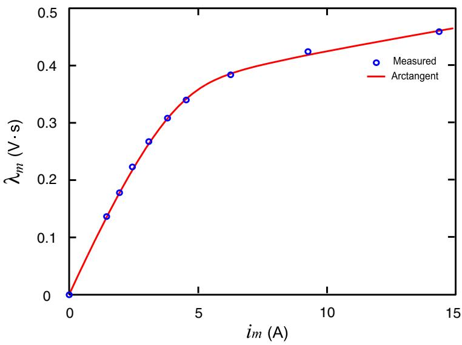  
Figure 7.1 Comparison of arctangent function saturation representation with hardware measurements for a 3 HP induction machine [13].

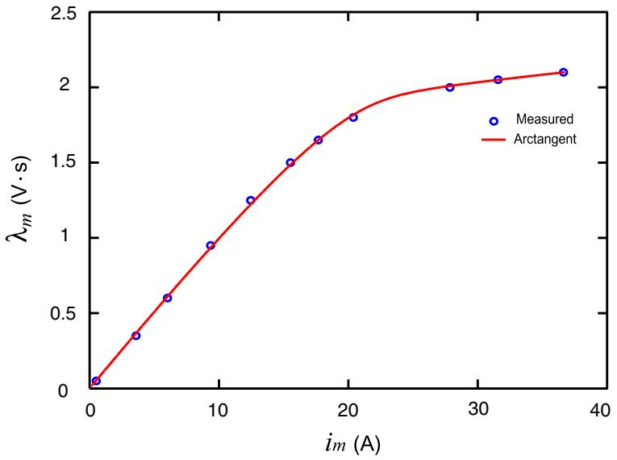  
Figure 7.2 Comparison of arctangent function saturation representation with hardware measurements for a 50 HP induction machine [15].

Whenever there is a need to model a particular machine/hardware more accurately, one has to look for more detailed models that would be appropriate for the level of fidelity required. As is often the case, the FE models [16] or MEC models [17]-[18] will offer ability to represent fine structural and/or material details. There are also other more sophisticated higher-order $qd$ models, such as [14], [19] for example, which are known to have better accuracy in representing secondary phenomena including cross coupling and saturation of leakage fluxes, distributed rotor-circuit effect for capturing machine-converter interaction, etc. Higher-order models such as [14], [19] for which we have very high regards and respect, are superior than the general purpose models considered in this thesis in terms of matching with the actual hardware. However, this fidelity comes at a price of increased model order and complexity, which is not always justified and/or needed for the power system level studies and applications.

# 7.2 Summary of Work Accomplished

In this thesis I have investigated the modeling of synchronous and induction machines based on the VBR formulation. In this modeling approach, the stator subsystem is expressed in abc phase coordinates using stator currents as independent variables and the rotor subsystem is expressed in qd rotor reference frame using flux linkages as the independent variables. Overall, in this thesis I have achieved the following contributions to the field of research:

EMTP-Type VBR Synchronous Machine Model: A full-order VBR synchronous

machine model is proposed for the EMTP-type solution for the first time [20]. In the presented model, a direct model interface between the machine and external network is achieved which results in non-iterative and simultaneous EMTP solution of all electrical variables. The rotor subsystem is expressed in $qd$ rotor reference frame using flux linkages, which significantly reduces the computational burden. As a result, the proposed VBR synchronous machine model requires as few as 241 flops (taking about $3.75~\mu \mathrm{s}$ of CPU time on a modest PC) per time step. For comparison, the state-of-the-art PD model of the same class requires 546 flops (taking about $7.75~\mu \mathrm{s}$ of CPU time) per time step. Moreover, it is shown that the proposed VBR model significantly improves the overall numerical accuracy, compared with the traditional $qd$ and PD models due to the direct machine-network interface and the better-scaled eigenvalues. This property allows use of much larger time-steps while achieving the same level of accuracy.

- VBR Induction Machine Model for State-Variable Languages: For the first time, a full-order VBR induction machine model is proposed for the state-variable-based simulation languages [21]. Similar to the VBR synchronous machine, a direct interface is advantageous when the machine is fed from a power electronic converter and/or when the modeling is carried out using circuit-based simulators. Computer studies of an induction machine demonstrate that the proposed VBR induction machine model achieve a $740\%$ improvement in computational efficiency as compared with the traditional coupled-circuit phase-domain model.   
- EMTP-Type VBR Induction Machine Model: The full-order VBR induction machine model is extended for EMTP-type solution [22]. Similar to the proposed VBR synchronous machine model, a simultaneous EMTP solution of the machine-network electrical variables is achieved. Efficient numerical implementation of the new VBR induction machine model requires as few as 108 flops, taking $1.6\mu s$ of CPU time per time step. Case studies demonstrate that the proposed model is more accurate and efficient than several existing state-of-the-art machine models used in EMTP.   
- Saturable VBR Induction Machine Model EMTP-Type Solution: Magnetic saturation has been incorporated into the VBR induction machine model [23], wherein static and dynamic cross saturation is properly integrated into the EMTP solution algorithm using the piecewise linear technique to approximate the smooth saturation curve with any desirable accuracy. Computer studies demonstrate that the proposed saturable VBR induction machine model in addition of being very efficient (3.12 μs of CPU time per time step) also

preserves good numerical accuracy and stability even at large time steps (up to 1ms). Similar approach has been successfully extended to the VBR synchronous machine model as documented in [24].

- Approximate VBR Induction Machine EMTP-Type Model: An approximate VBR induction machine model (AVBR) is proposed for the discretized EMTP solution [25]. The developed model has a constant equivalent conductance matrix in the machine-network interface equation. This is achieved by neglecting the rotor-speed-dependent coefficients in the equivalent resistance matrix of the previous established exact VBR model. The constant equivalent conductance matrix is desirable because it avoids the re-factorization of the network conductance matrix at every time step. It is also shown that a discretized PD model can be formulated to have a constant machine conductance sub-matrix due to the commonly assumed geometrical symmetry of squirrel-cage induction machines. However, as demonstrated in this thesis, the new AVBR model while being very efficient (1.9 μs of CPU time per time step) preserves the numerical accuracy of the exact VBR model and represents an appreciable improvement over the established PD and the conventional $qd$ models. The concept of eliminating the time-variant coefficients in the machine conductance matrix is successfully extended to the synchronous machine and will be reported soon in an upcoming journal publication [26].

# 7.3 Future Work

This direction of research presented in this thesis can be extended in several ways. Here we present an overview of some current and possible future directions for this research:

- Generalized Synchronous Machine Model: The VBR model formulation is efficient and flexible. So far, this model formulation has been applied to represent the standard 3-phase synchronous/induction machines only. However, the VBR model formulation can be extended to include the special purpose multiphase machines that are commonly used in aircraft, automotive, naval, and other applications where 6, 9, 12, etc. phases are common [27], [28]. From this point of view, it would be beneficial to propose a universal VBR model that can accommodate arbitrary number of phases and/or phase-groups configurations.   
- Doubly-fed Induction Machine Modeling: In the thesis, the VBR models of induction machines are derived assuming that the rotor terminals are short-circuited, i.e. squirrel-cage

machine. However, to properly model the doubly-fed (or wound-rotor) induction machine, the rotor terminals are required to be interfaced with the external abc network as well. In such cases, a new induction-machine network interface will be investigated, wherein both stator and rotor circuits are represented in abc phase coordinates.

- Multirate Simulation of Machine Network Systems: The VBR formulation naturally partitions the machine model into stator and rotor subsystems which are characterized by diverse time constants. To further increase the overall machine-network simulation efficiency, multirate simulation technique [29], [30] may be investigated wherein different integration time steps and/or different integration methods are used to exploit the separation of the time scales. The interfacing methods between multiple subsystems will be examined to ensure the accuracy and stability of the overall multirate integration/solution algorithm.   
- Machine-Network System Modeling: In the future research, it is also important to utilize an efficient network solution approach to integrate the VBR model with the EMTP-type solution. The MATE (Multi Area Thevenin Equivalent) [31] concept provides a very efficient solution methodology for partitioned and parallel solution of large-scale power system networks. Further research on the VBR-based machine models and their interfacing and integration within the framework of MATE [31] for the OVNI simulator [32] will be investigated.

# 7.4 References

[1] Alternative Transients Programs, ATP-EMTP, ATP User Group, 2007. Available: http://www.emtp.org.   
[2] Electromagnetic Transient Program, EMTP-RV, CEA Technologies Inc., 2007. Available: http://www.emtp.com.   
[3] MicroTran Reference Manual, MicroTran Power System Analysis Corp., Vancouver, Canada, 1997. Available: http://www.microtran.com.   
[4] PSCAD/EMTDC, Manitoba HVDC Research Centre and RTDS Technologies Inc., 2007. Available: http://www.pscad.com.   
[5] H. W. Dommel, EMTP Theory Book, MicroTran Power System Analysis Corporation, Vancouver, Canada, May 1992, ch. 8.   
[6] P. C. Krause, O. Wasynczuk, and S. D. Sudhoff, Analysis of Electric Machinery and Drive Systems, 2nd Edition, IEEE Press, Piscataway, NJ, 2002.   
[7] S. J. Salon, Finite Element Analysis of Electrical Machines, Kluwer Academic Publishers, 1995.   
[8] K. A. Corzine, B. T. Kuhn, S. D. Sudhoff, H. J. Hegner, “An improved method for incorporating magnetic saturation in the q-d synchronous machine model,” IEEE Trans. Energy Conversion, vol. 13, no. 3, pp. 270–275, Sept. 1998.   
[9] J. R. Marti and K. W. Louie, “A phase-domain synchronous generator model including saturation effects,” IEEE Trans. Power Systems, vol. 12, no. 1, pp. 222–229, Feb. 1997.   
[10]E. Levi, “A unified approach to main flux saturation modeling in D-Q axis models of induction machines,” IEEE Trans. Energy Conversion, vol. 10, no. 3, pp. 455–461, Sept. 1995.   
[11]V. Brandwajn, “Representation of magnetic saturation in the synchronous machine model in an electro-magnetic transients program,” IEEE Trans. on Power Apparatus and Systems, vol. 99, no. 5, pp. 1996–2002, Sept. /Oct. 1980.   
[12]S. D. Pekarek, E. A. Walters, and B. T. Kuhn, “An efficient and accurate method of representing magnetic saturation in physical-variable models of synchronous machines,” IEEE Trans. on Energy Conversion, vol. 14, no. 1, pp. 72-79, 1999.   
[13]X. Tu, L-A. Dessaint, R. Champagne, and K. Al-Haddad, “Transient modeling of squirrel-cage induction machine considering air-gap flux saturation harmonics,” IEEE Trans. Industrial Electronics, vol. 55, no. 7, pp. 2798-2809, Jul. 2008.   
[14]S. D. Sudhoff, D. C. Aliprantis, B. T. Kuhn, and P. L. Chapman, “An induction machine model for predicting inverter-machine interaction,” IEEE Trans. Energy Conversion, vol. 17, no. 2, pp. 203-210, Jun. 2002.   
[15]S. D. Sudhoff, D. C. Aliprantis, B. T. Kuhn, and P. L. Chapman, “Experimental characterization procedure for use with an advanced induction machine model,” IEEE Trans. Energy Conversion, vol. 18, no. 1, pp. 48-56, Mar. 2003.

[16]N. Bianchi, Electrical Machine Analysis Using Finite Elements, CRC Press, 2005.   
[17] Y. Xiao, G. R. Slemon, and M. R. Iravani, “Implementation of an equivalent circuit approach to the analysis of synchronous machines,” IEEE Trans. Energy Conversion, vol. 9, no. 4, pp. 717-723, Dec. 1994.   
[18]S. D. Sudhoff, B. T. Kuhn, K. A. Corzine, and B. T. Branecky, “Magnetic equivalent circuit modeling of induction motors,” IEEE Trans. Energy Conversion, vol. 22, no. 2, pp. 259–270, Jun. 2007.   
[19]D. C. Aliprantis, S. D. Sudhoff, and B. T. Kuhn, “A synchronous machine model with saturation and arbitrary rotor network representation,” IEEE Trans. Energy Conversion, vol. 20, no. 3, pp. 584–594, Sept. 2005.   
[20]L. Wang and J. Jatskevich, “A Voltage-Behind-Reactance Synchronous Machine Model for the EMTP-Type Solution,” IEEE Transaction on Power Systems, vol. 21, no. 4, Nov. 2006.   
[21]L. Wang, J. Jatskevich, and S. Pekarek, “Modeling of induction machines using a voltage-behind-reactance formulation,” IEEE Transaction on Energy Conversion, vol. 23, no.2, Jun. 2008.   
[22]L. Wang, J. Jatskevich, C. Wang and P. Li, “A Voltage-Behind-Reactance Induction Machine Model for the EMTP-Type Solution,” IEEE Transaction on Power Systems, vol. 23, no. 3, Aug. 2008.   
[23]L. Wang, J. Jatskevich, “Including Magnetic Saturation in Voltage-Behind-Reactance Induction Machine Model for EMTP-Type Solution,” to appear in IEEE Transaction on Power Systems, 2009 (Paper number: TPWRS 00744-2008).   
[24]L. Wang, J. Jatskevich, “A Magnetically Saturable Voltage-Behind-Reactance Synchronous Machine Model for EMTP-Type Solution,” to be submitted to IEEE Transaction on Power Systems.   
[25]L. Wang, J. Jatskevich, “Approximate Voltage-Behind-Reactance Induction Machine Model for Efficient Interface with EMTP Network Solution,” to appear in IEEE Transaction on Power Systems, 2009 (Paper number: TPWRS 00910-2008).   
[26]L. Wang, J. Jatskevich, “Approximate Voltage-Behind-Reactance Synchronous Machine Model for Efficient Interface with EMTP Network Solution,” to be submitted to IEEE Transaction on Power Systems.   
[27]L. Wang, S. Chini Foroosh, J. Jatskevich, and A. Davoudi, "Physical Variable Modeling of Multiphase Induction Machines," In proc. IEEE Canadian Conference on Electrical and Computer Engineering, May 2008, Niagara Falls, ON, Canada.   
[28]J. Fu, and T. A. Lipo, "Disturbance-Free Operation of a Multiphase Current-Regulated Motor Drive With an Opened Phase," IEEE Trans. Industry Applications, vol. 30, no. 5, pp. 1267-1274, September 1994.   
[29]S. D. Pekarek, O. Wasynczuk, E. A. Walters, J. Jatskevich, C. E. Lucas, N. Wu, and P. T. Lamm, “An efficient multi-rate simulation technique for power-electronic-based systems,” IEEE Trans. Power Systems, vol. 19 no. 1, pp. 399–409, Feb. 2004.

[30]F. A. Moreira and J. R. Marti “Latency techniques for time-domain power system transients simulation,” IEEE Trans. Power Systems, vol. 20 no. 1, pp. 246–253, Feb. 2005.   
[31] M. Armstrong, J.R. Martí, L.R. Linares, and P. Kundur, "Multilevel MATE for efficient simultaneous solution of control systems and non-linearities in the OVNI simulator," IEEE Trans. on Power Systems, vol. 21, no. 3, 2006.   
[32]J. R. Marti, L. R. Linares, J. Calvino, H. W. Dommel, and J. Lin, “OVNI: an object approach to real-time power system simulators,” 1998 International Conference on Power System Technology, vol. 2, pp. 977-981, Aug. 1998.

# APPENDICES

# Appendix A

$$
\mathbf {E} _ {1} = \left[ \begin{array}{l l} 2 - \Delta t b _ {1 1} & - \Delta t b _ {1 2} \\ - \Delta t b _ {2 1} & 2 - \Delta t b _ {2 2} \end{array} \right] ^ {- 1} \left[ \begin{array}{l} \Delta t b _ {1 3} \\ \Delta t b _ {2 3} \end{array} \right] \tag {A1}
$$

$$
\mathbf {E} _ {2} = \left[ \begin{array}{c c} 2 - \Delta t b _ {1 1} & - \Delta t b _ {1 2} \\ - \Delta t b _ {2 1} & 2 - \Delta t b _ {2 2} \end{array} \right] ^ {- 1} \left[ \begin{array}{c c} 2 + \Delta t b _ {1 1} & \Delta t b _ {1 2} \\ \Delta t b _ {2 1} & 2 + \Delta t b _ {2 2} \end{array} \right] \tag {A2}
$$

$$
\mathbf {F} _ {1} = \left[ \begin{array}{l l} 2 - \Delta t b _ {3 1} & - \Delta t b _ {3 2} \\ - \Delta t b _ {4 1} & 2 - \Delta t b _ {4 2} \end{array} \right] ^ {- 1} \left[ \begin{array}{l} \Delta t b _ {3 3} \\ \Delta t b _ {4 3} \end{array} \right] \tag {A3}
$$

$$
\mathbf {F} _ {2} = \left[ \begin{array}{c c} 2 - \Delta t b _ {3 1} & - \Delta t b _ {3 2} \\ - \Delta t b _ {4 1} & 2 - \Delta t b _ {4 2} \end{array} \right] ^ {- 1} \left[ \begin{array}{c c} 2 + \Delta t b _ {3 1} & \Delta t b _ {3 2} \\ \Delta t b _ {4 1} & 2 + \Delta t b _ {4 2} \end{array} \right] \tag {A4}
$$

$$
\mathbf {F} _ {3} = \left[ \begin{array}{l l} 2 - \Delta t b _ {3 1} & - \Delta t b _ {3 2} \\ - \Delta t b _ {4 1} & 2 - \Delta t b _ {4 2} \end{array} \right] ^ {- 1} \left[ \begin{array}{l} 2 \Delta t \\ 0 \end{array} \right] \tag {A5}
$$

$$
b _ {1 1} = \frac {r _ {k q 1}}{L _ {l k q 1}} \left(\frac {L _ {m q} ^ {\prime \prime}}{L _ {l k q 1}} - 1\right); b _ {1 2} = \frac {r _ {k q 1} L _ {m q} ^ {\prime \prime}}{L _ {l k q 1} L _ {l k q 2}}; b _ {1 3} = \frac {r _ {k q 1} L _ {m q} ^ {\prime \prime}}{L _ {l k q 1}}
$$

$$
b _ {2 1} = \frac {r _ {k q 2} L _ {m q} ^ {\prime \prime}}{L _ {l k q 1} L _ {l k q 2}}; b _ {2 2} = \frac {r _ {k q 2}}{L _ {l k q 2}} \left(\frac {L _ {m q} ^ {\prime \prime}}{L _ {l k q 2}} - 1\right); b _ {2 3} = \frac {r _ {k q 2} L _ {m q} ^ {\prime \prime}}{L _ {l k q 2}}
$$

$$
b _ {3 1} = \frac {r _ {f d}}{L _ {l f d}} \left(\frac {L _ {m d} ^ {\prime \prime}}{L _ {l f d}} - 1\right); b _ {3 2} = \frac {r _ {f d} L _ {m d} ^ {\prime \prime}}{L _ {l f d} L _ {l k d}}; b _ {3 3} = \frac {r _ {f d} L _ {m d} ^ {\prime \prime}}{L _ {l f d}}
$$

$$
b _ {4 1} = \frac {r _ {k d} L _ {l f d} ^ {\prime \prime}}{L _ {l f d} L _ {l k d}}; b _ {4 2} = \frac {r _ {k d}}{L _ {l k d}} \left(\frac {L _ {m d} ^ {\prime \prime}}{L _ {l k d}} - 1\right); b _ {4 3} = \frac {r _ {k d} L _ {m d} ^ {\prime \prime}}{L _ {l k d}}
$$

$$
\mathbf {k} _ {1} \left(\omega_ {r}\right) = \left[ \begin{array}{c c} c _ {1 1} & c _ {1 2} \\ c _ {2 1} \left(\omega_ {r}\right) & c _ {2 2} \left(\omega_ {r}\right) \end{array} \right] \mathbf {E} _ {1} + \left[ \begin{array}{c} c _ {1 5} \\ 0 \end{array} \right] \tag {A6}
$$

$$
\mathbf {k} _ {2} \left(\omega_ {r}\right) = \left[ \begin{array}{c c} c _ {1 3} \left(\omega_ {r}\right) & c _ {1 4} \left(\omega_ {r}\right) \\ c _ {2 3} & c _ {2 4} \end{array} \right] \mathbf {F} _ {1} + \left[ \begin{array}{c} 0 \\ c _ {2 5} \end{array} \right] \tag {A7}
$$

$$
\begin{array}{l} \mathbf {h} _ {q d r} (t) = \left[ \begin{array}{c c} c _ {1 1} & c _ {1 2} \\ c _ {2 1} (\omega_ {r}) & c _ {2 2} (\omega_ {r}) \end{array} \right] \mathbf {E} _ {2} \left[ \begin{array}{c} \lambda_ {k q 1} (t - \Delta t) \\ \lambda_ {k q 2} (t - \Delta t) \end{array} \right] + \left[ \begin{array}{c c} c _ {1 1} & c _ {1 2} \\ c _ {2 1} (\omega_ {r}) & c _ {2 2} (\omega_ {r}) \end{array} \right] \mathbf {E} _ {1} i _ {q s} (t - \Delta t) \\ + \left[ \begin{array}{c c} c _ {1 3} \left(\omega_ {r}\right) & c _ {1 4} \left(\omega_ {r}\right) \\ c _ {2 3} & c _ {2 4} \end{array} \right] \mathbf {F} _ {2} \left[ \begin{array}{l} \lambda_ {f d} (t - \Delta t) \\ \lambda_ {k d} (t - \Delta t) \end{array} \right] + \left[ \begin{array}{c c} c _ {1 3} \left(\omega_ {r}\right) & c _ {1 4} \left(\omega_ {r}\right) \\ c _ {2 3} & c _ {2 4} \end{array} \right] \mathbf {F} _ {1} i _ {d s} (t - \Delta t) \tag {A8} \\ + \left(\left[ \begin{array}{c c} c _ {1 3} (\omega_ {r}) & c _ {1 4} (\omega_ {r}) \\ c _ {2 3} & c _ {2 4} \end{array} \right] \mathbf {F} _ {3} + \left[ \begin{array}{c} 0 \\ c _ {2 6} \end{array} \right]\right) v _ {f d} \\ c _ {1 1} = \frac {L _ {m q} ^ {\prime \prime} r _ {k q 1}}{L _ {l k q 1} ^ {2}} \left(\frac {L _ {m q} ^ {\prime \prime}}{L _ {l k q 1}} - 1\right) + \frac {L _ {m q} ^ {\prime \prime 2} r _ {k q 2}}{L _ {l k q 2} ^ {2} L _ {l k q 1}} \\ \end{array}
$$

$$
c _ {1 2} = \frac {L _ {m q} ^ {\prime \prime} r _ {k q 2}}{L _ {l k q 2} ^ {2}} \left(\frac {L _ {m q} ^ {\prime \prime}}{L _ {l k q 2}} - 1\right) + \frac {L _ {m q} ^ {\prime \prime 2} r _ {k q 1}}{L _ {l k q 1} ^ {2} L _ {l k q 2}}; c _ {2 1} (\omega_ {r}) = \frac {- \omega_ {r} L _ {m q} ^ {\prime \prime}}{L _ {l k q 1}}; c _ {2 2} (\omega_ {r}) = \frac {- \omega_ {r} L _ {m q} ^ {\prime \prime}}{L _ {l k q 2}}
$$

$$
c _ {1 3} (\omega_ {r}) = \frac {\omega_ {r} L _ {m d} ^ {\prime \prime}}{L _ {l f d}}; c _ {1 4} (\omega_ {r}) = \frac {\omega_ {r} L _ {m d} ^ {\prime \prime}}{L _ {l k d}}; c _ {2 3} = \frac {L _ {m d} ^ {\prime \prime} r _ {f d}}{L _ {l f d} ^ {2}} \left(\frac {L _ {m d} ^ {\prime \prime}}{L _ {l f d}} - 1\right) + \frac {L _ {m d} ^ {\prime \prime 2} r _ {k d}}{L _ {l k d} ^ {2} L _ {l f d}}
$$

$$
c _ {2 4} = \frac {L _ {m d} ^ {\prime \prime} r _ {k d}}{L _ {l k d} ^ {2}} \left(\frac {L _ {m d} ^ {\prime \prime}}{L _ {l k d}} - 1\right) + \frac {L _ {m d} ^ {\prime \prime 2} r _ {f d}}{L _ {l f d} ^ {2} L _ {l k d}}; c _ {1 5} = \left(\frac {r _ {k q 1}}{L _ {l k q 1} ^ {2}} + \frac {r _ {k q 2}}{L _ {l k q 2} ^ {2}}\right) L _ {m q} ^ {\prime \prime 2}; c _ {2 5} = \left(\frac {r _ {f d}}{L _ {l f d} ^ {2}} + \frac {r _ {k d}}{L _ {l k d} ^ {2}}\right) L _ {m d} ^ {\prime \prime 2}; c _ {2 6} = \frac {L _ {m d} ^ {\prime \prime}}{L _ {l f d}}
$$

$$
\boldsymbol {\Phi} ^ {p d} \left(\Delta t, t, \mathbf {x} _ {n - 1} ^ {p d}\right) = \left[ \begin{array}{c c} \mathbf {R} _ {s} + \frac {2}{\Delta t} \mathbf {L} _ {s} (t) & \frac {2}{\Delta t} \mathbf {L} _ {s r} (t) \\ \frac {2}{\Delta t} \mathbf {L} _ {r s} (t) & \mathbf {R} _ {r} + \frac {2}{\Delta t} \mathbf {L} _ {r} \end{array} \right] ^ {- 1} \left[ \begin{array}{c c} - \mathbf {R} _ {s} + \frac {2}{\Delta t} \mathbf {L} _ {s} (t - \Delta t) & \frac {2}{\Delta t} \mathbf {L} _ {s r} (t - \Delta t) \\ \frac {2}{\Delta t} \mathbf {L} _ {r s} (t - \Delta t) & - \mathbf {R} _ {r} + \frac {2}{\Delta t} \mathbf {L} _ {r} \end{array} \right] \tag {A9}
$$

$$
\boldsymbol {\Phi} ^ {v b r} (\Delta t, t, \mathbf {x} _ {n - 1} ^ {v b r}) = \left[ \begin{array}{c c} \mathbf {R} _ {s} + \frac {2}{\Delta t} \mathbf {L} _ {a b c s} ^ {"} (t) + \mathbf {M} _ {2} (t) & \mathbf {M} _ {1} (t) \\ - \left[ \begin{array}{c c c} \mathbf {E} _ {1} & 0 _ {2 \times 1} & 0 _ {2 \times 1} \\ 0 _ {2 \times 1} & \mathbf {F} _ {1} & 0 _ {2 \times 1} \end{array} \right] \mathbf {K} _ {s} ^ {r} (t) & \mathbf {I} _ {4 \times 4} \end{array} \right] ^ {- 1} \left[ \begin{array}{c c} - \mathbf {R} _ {s} + \frac {2}{\Delta t} \mathbf {L} _ {s} (t - \Delta t) - \mathbf {M} _ {2} (t - \Delta t) & - \mathbf {M} _ {1} (t - \Delta t) \\ \left[ \begin{array}{c c c} \mathbf {E} _ {1} & 0 _ {2 \times 1} & 0 _ {2 \times 1} \\ 0 _ {2 \times 1} & \mathbf {F} _ {1} & 0 _ {2 \times 1} \end{array} \right] \mathbf {K} _ {s} ^ {r} (\Delta t) & \left[ \begin{array}{c c} \mathbf {E} _ {1} & 0 _ {2 \times 1} \\ 0 _ {2 \times 1} & \mathbf {F} _ {2} \end{array} \right] \end{array} \right]
$$

$$
\mathbf {M} _ {1} (t) = [ \mathbf {K} _ {s} ^ {r} (t) ] ^ {- 1} \left[ \begin{array}{c c c c} c _ {1 1} & c _ {1 2} & c _ {1 3} (\omega_ {r}) & c _ {1 4} (\omega_ {r}) \\ c _ {2 1} (\omega_ {r}) & c _ {2 2} (\omega_ {r}) & c _ {2 3} & c _ {2 4} \\ 0 & 0 & 0 & 0 \end{array} \right] \mathbf {M} _ {2} (t) = [ \mathbf {K} _ {s} ^ {r} (t) ] ^ {- 1} \left[ \begin{array}{c c c} c _ {1 5} & 0 & 0 \\ 0 & c _ {2 5} & 0 \\ 0 & 0 & 0 \end{array} \right] \mathbf {K} _ {s} ^ {r} (t)
$$

# Appendix B

Synchronous machine parameters (see [30] in Chap. 2): 835 MVA, $26\mathrm{kV}$ , 0.85 pf, 2 poles, 3600 r/min,

$$
\begin{array}{l} J = 0. 0 6 5 8 \times 1 0 ^ {6} \mathrm {J} \cdot \mathrm {s} ^ {2}, r _ {s} = 0. 0 0 2 4 3 \Omega , X _ {l s} = 0. 1 5 3 8 \Omega , X _ {q} = 1. 4 5 7 \Omega , r _ {k q 1} = 0. 0 0 1 4 4 \Omega , \\ X _ {l k q 1} = 0. 6 5 7 8 \Omega , r _ {k q 2} = 0. 0 0 6 8 1 \Omega , X _ {l k q 2} = 0. 0 7 6 0 2 \Omega , X _ {d} = 1. 4 5 7 \Omega , r _ {f d} = 0. 0 0 0 7 5 \Omega , \\ \end{array}
$$

$$
X _ {l f d} = 0. 1 1 4 5 \Omega , \qquad r _ {k d} = 0. 0 1 0 8 \Omega , \qquad X _ {l k d} = 0. 0 6 5 7 7 \Omega .
$$

# Appendix C

The system state matrices of the $qd$ model with flux linkages as state variables are represented as

$$
\mathbf {A} _ {q d} = - \left(\mathbf {R L} _ {q d 0} ^ {- 1} + \mathbf {W}\right) \tag {C1}
$$

where

$$
\mathbf {R} = \operatorname {d i a g} \left[ r _ {s}, r _ {s}, r _ {s}, r _ {r}, r _ {r}, r _ {r} \right] \tag {C2}
$$

$$
\mathbf {L} _ {q d 0} = \left[ \begin{array}{c c c c c c} L _ {l s} + L _ {m} & 0 & 0 & L _ {m} & 0 & 0 \\ 0 & L _ {l s} + L _ {m} & 0 & 0 & L _ {m} & 0 \\ 0 & 0 & L _ {l s} & 0 & 0 & 0 \\ L _ {m} & 0 & 0 & L _ {l r} + L _ {m} & 0 & 0 \\ 0 & L _ {m} & 0 & 0 & L _ {l r} + L _ {m} & 0 \\ 0 & 0 & 0 & 0 & 0 & L _ {l r} \end{array} \right] \tag {C3}
$$

$$
\mathbf {W} = \left[ \begin{array}{c c c c c c} 0 & \omega & 0 & 0 & 0 & 0 \\ - \omega & 0 & 0 & 0 & 0 & 0 \\ 0 & 0 & 0 & 0 & 0 & 0 \\ 0 & 0 & 0 & 0 & \omega - \omega_ {r} & 0 \\ 0 & 0 & 0 & - (\omega - \omega_ {r}) & 0 & 0 \\ 0 & 0 & 0 & 0 & 0 & 0 \end{array} \right] \tag {C4}
$$

The system state matrix of the CC model with currents as state variables may be expressed as

$$
\mathbf {A} _ {c c} = - \mathbf {L} _ {a b c} ^ {- 1} (\mathbf {R} + p \mathbf {L} _ {a b c}) \tag {C5}
$$

where

$$
\mathbf {L} _ {a b c} = \left[ \begin{array}{l l} \mathbf {L} _ {s} & \mathbf {L} _ {s r} \\ \mathbf {L} _ {s r} ^ {T} & \mathbf {L} _ {r} \end{array} \right] \tag {C6}
$$

For the VBR models, the state matrix is

$$
\mathbf {A} _ {v b r} = \left[ \begin{array}{c c} - \mathbf {L} _ {a b c s} ^ {- 1} \mathbf {r} _ {a b c s} ^ {\prime \prime} & - \mathbf {L} _ {a b c s} ^ {- 1} \mathbf {M} _ {1} \\ \mathbf {B} _ {2} & \mathbf {B} _ {1} \end{array} \right] \tag {C7}
$$

where

$$
\mathbf {M} _ {1} = \mathbf {K} _ {s} ^ {- 1} \left[ \begin{array}{c c c} \frac {L _ {m} ^ {\prime \prime} r _ {r}}{L _ {l r} ^ {2}} \left(\frac {L _ {m} ^ {\prime \prime}}{L _ {l r}} - 1\right) & \frac {\omega_ {r} L _ {m} ^ {\prime \prime}}{L _ {l r}} & 0 \\ - \frac {\omega_ {r} L _ {m} ^ {\prime \prime}}{L _ {l r}} & \frac {L _ {m} ^ {\prime \prime} r _ {r}}{L _ {l r} ^ {2}} \left(\frac {L _ {m} ^ {\prime \prime}}{L _ {l r}} - 1\right) & 0 \\ 0 & 0 & 0 \end{array} \right] \tag {C8}
$$

$$
\mathbf {M} _ {2} = \left[ \begin{array}{c c c} \frac {L _ {m} ^ {\prime \prime}}{L _ {l r}} & 0 & 0 \\ 0 & \frac {L _ {m} ^ {\prime \prime}}{L _ {l r}} & 0 \\ 0 & 0 & 0 \\ & & \end{array} \right] \tag {C9}
$$

$$
\mathbf {B} _ {1} = \left[ \begin{array}{c c c} \frac {r _ {r}}{L _ {l r}} \left(\frac {L _ {m} ^ {"}}{L _ {l r}} - 1\right) & - (\omega - \omega_ {r}) & 0 \\ \omega - \omega_ {r} & \frac {r _ {r}}{L _ {l r}} \left(\frac {L _ {m} ^ {"}}{L _ {l r}} - 1\right) & 0 \\ 0 & 0 & - \frac {r _ {r}}{L _ {l r}} \end{array} \right] \tag {C10}
$$

$$
\mathbf {B} _ {2} = \left[ \begin{array}{c c c} \frac {r _ {r} L _ {m} ^ {\prime \prime}}{L _ {l r}} & 0 & 0 \\ 0 & \frac {r _ {r} L _ {m} ^ {\prime \prime}}{L _ {l r}} & 0 \\ 0 & 0 & 0 \end{array} \right] \mathbf {K} _ {s} \tag {C11}
$$

# Appendix D

Induction machine parameters (see [9] in Chap. 3): 3-hp, $220\mathrm{V}$ , $1710\mathrm{rpm}$ , 4 poles, $60\mathrm{-Hz}$ , $r_s = 0.435\Omega$ , $X_{ls} = 0.754\Omega$ , $X_m = 26.13\Omega$ , $r_r = 0.816\Omega$ , $X_{lr} = 0.754\Omega$ , $J = 0.089\mathrm{kg}\cdot \mathrm{m}^2$ .

# Appendix E

$$
\mathbf {E} = \left[ \begin{array}{c c} 2 - \Delta t b _ {1} & - \Delta t b _ {2} \\ \Delta t b _ {2} & 2 - \Delta t b _ {1} \end{array} \right] ^ {- 1} \left[ \begin{array}{c c} \Delta t b _ {3} & 0 \\ 0 & \Delta t b _ {3} \end{array} \right] \tag {E1}
$$

$$
\mathbf {F} = \left[ \begin{array}{c c} 2 - \Delta t b _ {1} & - \Delta t b _ {2} \\ \Delta t b _ {2} & 2 - \Delta t b _ {1} \end{array} \right] ^ {- 1} \left[ \begin{array}{c c} 2 + \Delta t b _ {1} & \Delta t b _ {2} \\ - \Delta t b _ {2} & 2 + \Delta t b _ {1} \end{array} \right] \tag {E2}
$$

$$
b _ {1} = - \frac {r _ {r}}{L _ {l r}} \left(1 - \frac {L _ {m} ^ {\prime \prime}}{L _ {l r}}\right), b _ {2} = - \left(\omega - \omega_ {r}\right), b _ {3} = \frac {r _ {r} L _ {m} ^ {\prime \prime}}{L _ {l r}}
$$

$$
\mathbf {M} = \left[ \begin{array}{l l} c _ {1} & c _ {2} \\ - c _ {2} & c _ {1} \end{array} \right] \mathbf {E} \tag {E3}
$$

$$
\mathbf {N} = \left[ \begin{array}{l l} c _ {1} & c _ {2} \\ - c _ {2} & c _ {1} \end{array} \right] \mathbf {F} \tag {E4}
$$

$$
c _ {1} = \frac {L _ {m} ^ {\prime \prime} r _ {r}}{L _ {l r} ^ {2}} \left(\frac {L _ {m} ^ {\prime \prime}}{L _ {l r}} - 1\right), c _ {2} = \frac {\omega_ {r} L _ {m} ^ {\prime \prime}}{L _ {l r}}
$$

$$
\boldsymbol {\Phi} ^ {p d} \left(\Delta t, t, \mathbf {x} _ {n - 1} ^ {p d}\right) = \left[ \begin{array}{c c} \mathbf {R} _ {s} + \frac {2}{\Delta t} \mathbf {L} _ {s} & \frac {2}{\Delta t} \mathbf {L} _ {s r} (t) \\ \frac {2}{\Delta t} \mathbf {L} _ {r s} (t) & \mathbf {R} _ {r} + \frac {2}{\Delta t} \mathbf {L} _ {r} \end{array} \right] ^ {- 1} \left[ \begin{array}{l l} - \mathbf {R} _ {s} + \frac {2}{\Delta t} \mathbf {L} _ {s} & \frac {2}{\Delta t} \mathbf {L} _ {s r} (t - \Delta t) \\ \frac {2}{\Delta t} \mathbf {L} _ {r s} (t - \Delta t) & - \mathbf {R} _ {r} + \frac {2}{\Delta t} \mathbf {L} _ {r} \end{array} \right] \tag {E5}
$$

$$
\boldsymbol {\Phi} ^ {v b r} \left(\Delta t, t, \mathbf {x} _ {n - 1} ^ {v b r}\right) = \left[ \begin{array}{c c} \mathbf {R} _ {D} + \frac {2}{\Delta t} \mathbf {L} _ {D} & \mathbf {T} (t) \\ - [ \mathbf {E} (t) 0 _ {2 \times 1} ] \mathbf {K} _ {s} (t) & \mathbf {I} _ {2 \times 2} \end{array} \right] ^ {- 1} \left[ \begin{array}{c c} - \mathbf {R} _ {D} + \frac {2}{\Delta t} \mathbf {L} _ {D} (t - \Delta t) & - \mathbf {T} (t - \Delta t) \\ [ \mathbf {E} (t - \Delta t) 0 _ {2 \times 1} ] \mathbf {K} _ {s} (t - \Delta t) & \mathbf {F} (t - \Delta t) \end{array} \right] \tag {E6}
$$

$$
\mathbf {T} (t) = \mathbf {K} _ {s} ^ {- 1} (t) \left[ \begin{array}{c c} c _ {1} & c _ {2} \\ - c _ {2} & c _ {1} \\ 0 & 0 \end{array} \right] \tag {A7}
$$

# Appendix F

Induction machine parameters (see [25] in Chap. 4): 50HP, 460V, 4 poles, 1705 rpm, $J = 1.662kg \cdot m^2$ , $T_b = 197.8Nm$ , $r_s = 0.087\Omega$ , $r_r = 0.228\Omega$ , $X_{ls} = 0.302\Omega$ , $X_{lr} = 0.302\Omega$ , $X_M = 13.08\Omega$

# Appendix G

$$
\mathbf {E} = \left[ \begin{array}{c c} 2 - \Delta t b _ {1} & - \Delta t b _ {2} \\ \Delta t b _ {2} & 2 - \Delta t b _ {1} \end{array} \right] ^ {- 1} \left[ \begin{array}{c c} \Delta t b _ {3} & 0 \\ 0 & \Delta t b _ {3} \end{array} \right] \tag {G1}
$$

$$
\mathbf {F} = \left[ \begin{array}{c c} 2 - \Delta t b _ {1} & - \Delta t b _ {2} \\ \Delta t b _ {2} & 2 - \Delta t b _ {1} \end{array} \right] ^ {- 1} \left[ \begin{array}{c c} 2 + \Delta t b _ {1} & \Delta t b _ {2} \\ - \Delta t b _ {2} & 2 + \Delta t b _ {1} \end{array} \right] \tag {G2}
$$

$$
\mathbf {D} = \left[ \begin{array}{c c} 2 - \Delta t b _ {1} & - \Delta t b _ {2} \\ \Delta t b _ {2} & 2 - \Delta t b _ {1} \end{array} \right] ^ {- 1} \left[ \begin{array}{c c} 2 \Delta t b _ {4} & 0 \\ 0 & 2 \Delta t b _ {4} \end{array} \right] \tag {G3}
$$

$$
b _ {1} = - \frac {r _ {r}}{L _ {l r}} (1 - \frac {L _ {D j} ^ {"}}{L _ {l r}}), b _ {2} = - (\omega - \omega_ {r}), b _ {3} = \frac {r _ {r} L _ {D j} ^ {"}}{L _ {l r}}
$$

$$
\mathbf {M} = \left[ \begin{array}{l l} c _ {1} & c _ {2} \\ - c _ {2} & c _ {1} \end{array} \right] \mathbf {E} \tag {G4}
$$

$$
\mathbf {N} = \left[ \begin{array}{l l} c _ {1} & c _ {2} \\ - c _ {2} & c _ {1} \end{array} \right] \mathbf {F} \tag {G5}
$$

$$
\mathbf {P} = \left[ \begin{array}{l l} c _ {1} & c _ {2} \\ - c _ {2} & c _ {1} \end{array} \right] \mathbf {D} + \left[ \begin{array}{l l} c _ {4} & c _ {5} \\ - c _ {5} & c _ {4} \end{array} \right] \tag {G6}
$$

$$
\mathbf {H} = \mathbf {M} + \left[ \begin{array}{l l} c _ {3} & 0 \\ 0 & c _ {3} \end{array} \right] \tag {G7}
$$

$$
c _ {1} = \frac {L _ {D j} ^ {"} r _ {r}}{L _ {l r} ^ {2}} \left(\frac {L _ {D j} ^ {"}}{L _ {l r}} - 1\right), c _ {2} = \frac {\omega_ {r} L _ {D j} ^ {"}}{L _ {l r}}, c _ {3} = \frac {L _ {D j} ^ {" 2} r _ {r}}{L _ {l r} ^ {2}}, c _ {4} = \frac {L _ {D j} ^ {" 2} r _ {r}}{L _ {l r} ^ {2} L _ {D j}}, c _ {5} = \left(\omega - \omega_ {\phi}\right) \frac {L _ {D j} ^ {"}}{L _ {D j}}.
$$

# Appendix H

Induction machine parameters (see [15] in Chap. 5): 50HP, 460V, 4 poles, 1705 rpm, $J = 1.662 \, kg \cdot m^2$ ,

$$
T _ {b} = 1 9 7. 8 \mathrm {N m}, r _ {s} = 0. 0 8 7 \Omega , r _ {r} = 0. 2 2 8 \Omega , X _ {l s} = 0. 3 0 2 \Omega , X _ {l r} = 0. 3 0 2 \Omega , X _ {M} = 1 3. 0 8 \Omega .
$$

Saturation data for the arctangent-function representation:

$$
\lambda_ {T} = 0. 8 2 \mathrm {V} \cdot \mathrm {s}, \tau_ {T} = 2 0 (\mathrm {1 / V} \cdot \mathrm {s}), M _ {a} = 8 8. 9 5 (\mathrm {1 / H}), M _ {d} = 6 2. 7 5 (\mathrm {1 / H}).
$$

Saturation data for the two-slope piecewise-linear representation:

$$
I _ {s a t} = 2 3. 0 6 \mathrm {A}, L _ {u n s a t} = 0. 0 3 4 7 \mathrm {H}, L _ {s a t} = 0. 0 0 6 9 \mathrm {H}
$$

# Appendix I

The arctangent function is used to represent the nonlinear magnetic saturation characteristic as:

$$
\begin{array}{l} i _ {m} \left(\lambda_ {m}\right) = \frac {2 M _ {d}}{\pi} \left[ \left(\lambda_ {m} - \lambda_ {T}\right) \arctan \left(\tau_ {T} \left(\lambda_ {m} - \lambda_ {T}\right)\right) - \lambda_ {T} \arctan \left(\tau_ {T} \lambda_ {T}\right) \right] \tag {I1} \\ + \frac {M _ {d}}{\pi \tau_ {T}} \Big [ \ln \big (1 + \tau_ {T} ^ {2} \lambda_ {T} ^ {2} \big) - \ln \big (1 + \tau_ {T} ^ {2} (\lambda_ {m} - \lambda_ {T}) ^ {2} \big) \Big ] + M _ {a} \lambda_ {m} \\ \end{array}
$$

The slope of the nonlinear magnetic saturation characteristic (A8) or the inverse of the dynamic inductance is given as:

$$
\frac {\partial i _ {m} \left(\lambda_ {m}\right)}{\partial \lambda_ {m}} = \frac {2}{\pi} M _ {d} \arctan \left[ \tau_ {T} \left(\lambda_ {m} - \lambda_ {T}\right) \right] + M _ {a} \tag {I2}
$$

where $M_{d}$ and $M_{a}$ are related to the initial and final slopes $M_{i}$ and $M_{f}$ of (A9) by

$$
M _ {d} = \frac {M _ {f} - M _ {i}}{2} \tag {I3}
$$

$$
M _ {a} = \frac {M _ {f} + M _ {i}}{2} \tag {I4}
$$

In (I1)-(I2), $\tau_{T}$ and $\lambda_{T}$ define the tightness of the transition from initial slope to final slope and the point of transition, respectively.

# Appendix J

$$
\mathbf {L} _ {s r} = L _ {m s} \left[ \begin{array}{c c c} \cos \theta_ {r} & \cos \left(\theta_ {r} + \frac {2 \pi}{3}\right) & \cos \left(\theta_ {r} - \frac {2 \pi}{3}\right) \\ \cos \left(\theta_ {r} - \frac {2 \pi}{3}\right) & \cos \theta_ {r} & \cos \left(\theta_ {r} + \frac {2 \pi}{3}\right) \\ \cos \left(\theta_ {r} + \frac {2 \pi}{3}\right) & \cos \left(\theta_ {r} - \frac {2 \pi}{3}\right) & \cos \theta_ {r} \end{array} \right] \tag {J1}
$$

$$
\mathbf {L} _ {r s} = \mathbf {L} _ {s r} ^ {T} \tag {A2}
$$

Trigonometric Identities:

$$
\cos^ {2} \theta_ {r} + \cos^ {2} \left(\theta_ {r} - \frac {2 \pi}{3}\right) + \cos^ {2} \left(\theta_ {r} + \frac {2 \pi}{3}\right) = \frac {3}{2} \tag {J3}
$$

$$
\cos \theta_ {r} \cos \left(\theta_ {r} - \frac {2 \pi}{3}\right) + \cos \theta_ {r} \cos \left(\theta_ {r} + \frac {2 \pi}{3}\right) + \cos \left(\theta_ {r} - \frac {2 \pi}{3}\right) \cos \left(\theta_ {r} + \frac {2 \pi}{3}\right) = - \frac {3}{4} \tag {J4}
$$

Coefficients of the VBR model:

$$
r _ {D} = r _ {s} + \frac {L _ {m} ^ {\prime \prime 2}}{L _ {l r} ^ {2}} r _ {r}, L _ {D} = L _ {l s} + L _ {m} ^ {\prime \prime}, L _ {m} ^ {\prime \prime} = \left(\frac {1}{L _ {m}} + \frac {1}{L _ {l r}}\right) ^ {- 1} \tag {J5}
$$

$$
b _ {1} = \frac {r _ {r}}{L _ {l r}} \left(\frac {L _ {m} ^ {\prime \prime}}{L _ {l r}} - 1\right), c _ {1} = \frac {L _ {m} ^ {\prime \prime} r _ {r}}{L _ {l r} ^ {2}} \left(\frac {L _ {m} ^ {\prime \prime}}{L _ {l r}} - 1\right), b _ {3} = \frac {r _ {r} L _ {m} ^ {\prime \prime}}{L _ {l r}} \tag {J6}
$$

# Appendix K

3-HP induction machine parameters (see [13] in Chap. 7): $208\mathrm{V}$ , $60\mathrm{Hz}$ , 4 poles, $J = 0.027\mathrm{kg} \cdot \mathrm{m}^2$ , $r_s = 0.5146\Omega$ , $r_r = 0.527\Omega$ , $X_{ls} = 1.0595\Omega$ , $X_{lr} = 1.026\Omega$ , $X_M = 35.48\Omega$ .

Saturation data for the arctangent-function representation:

$$
\lambda_ {T} = 0. 3 9 V \cdot s, \tau_ {T} = 4 7 (1 / V \cdot s), M _ {a} = 7 3 (1 / H), M _ {d} = 6 5 (1 / H).
$$

50-HP induction machine parameters (see [15] in Chap. 7): $460\mathrm{V}$ , $60\mathrm{Hz}$ , 4 poles, $r_s = 0.22\Omega$

$$
r _ {r} = 0. 1 4 \Omega , X _ {l s} = 3. 6 3 m H, X _ {l r} = 3. 6 3 m H, L _ {M} = 8 8. 7 \Omega .
$$

Saturation data for the arctangent-function representation:

$$
\lambda_ {T} = 1. 9 8 V \cdot s, \tau_ {T} = 2 0 (1 / V \cdot s), M _ {a} = 6 4. 4 (1 / H), M _ {d} = 5 5. 6 (1 / H).
$$

# Appendix L

# List of Publications

# Journal Papers

- Liwei Wang and Juri. Jatskevich, "A Voltage-Behind-Reactance Synchronous Machine Model for the EMTP-Type Solution," IEEE Transaction on Power Systems, vol. 21, no. 4, Nov. 2006.   
- Liwei Wang, Juri Jatskevich, and Hermann. W. Dommel, "Re-examination of synchronous machine modeling techniques for electromagnetic transient simulations," IEEE Transaction on Power Systems, vol. 22, no. 3, Aug. 2007.   
- Liwei Wang, Juri Jatskevich, and Steven Pekarek, "Modeling of induction machines using a voltage-behind-reactance formulation," IEEE Transaction on Energy Conversion, vol. 23, no.2, Jun. 2008.   
- Liwei Wang, Juri. Jatskevich, Chengshan Wang and Peng Li, "A Voltage-Behind-Reactance Induction Machine Model for the EMTP-Type Solution," IEEE Transaction on Power Systems, vol. 23, no. 3, Aug. 2008.   
- Liwei Wang, Juri Jatskevich, “Including Magnetic Saturation in Voltage-Behind-Reactance Induction Machine Model for EMTP-Type Solution,” to appear in IEEE Transaction on Power Systems, 2009 (Paper number: TPWRS 00744-2008).   
- Liwei Wang, Juri Jatskevich, “Approximate Voltage-Behind-Reactance Induction Machine Model for Efficient Interface with EMTP Network Solution,” to appear in IEEE Transaction on Power Systems, 2009 (Paper number: TPWRS 00910-2008).   
- Liwei Wang, Juri Jatskevich, Venkata Dinavahi, Hermann Dommel, Juan Martinez, Kai Strunz, Michel Rioual, Gary Chang, and Reza Iravani, "Methods of Interfacing Rotating Machine Models in Transient Simulation Programs," to appear in IEEE Transaction on Power Delivery, 2009 (Paper number: TPWRD 00457-2009).   
- Liwei Wang, Juri Jatskevich, "A Magnetically Saturable Voltage-Behind-Reactance Synchronous Machine Model for EMTP-Type Solution," to be submitted to IEEE Transaction on Power Systems.   
- Liwei Wang, Juri Jatskevich, "Approximate Voltage-Behind-Reactance Synchronous Machine Model for Efficient Interface with EMTP Network Solution," to be submitted to IEEE Transaction on Power Systems.

# Conference Papers

- Liwei Wang, Juri Jatskevich, Nathan Ozog, and Ali Davoudi, "A Simple Explicit Method of Representing Magnetic Saturation of Salient-Pole Synchronous Machines in Both Rotor Axes using Matlab-Simulink," In proc. IEEE Canadian Conference on Electrical and Computer Engineering, April 2007, Vancouver, BC, Canada.   
- Liwei Wang, Juri. Jatskevich, and Sina Chini Foroosh, "A VBR Induction Machine Model Implementation for SimPowerSystem Toolbox in Matlab-Simulink," In proc. 2008 IEEE Power and Energy Society General Meeting, July 2008, Pittsburg, USA.   
- Liwei Wang, Ali Davoudi, Juri. Jatskevich, and Patrick L. Chapman, "Accelerated State-Variable Modeling of Synchronous Machine-Converter Systems," In proc. 2008 IEEE International Symposium on Circuits and Systems, May 2008, Seattle, Washington, USA.   
- Liwei Wang, Sina Chini Foroosh, and Juri Jatskevich, "Simulation and Analysis of Starting Transients in Rotor-Chopper-Controlled Doubly-Fed Induction Motors," In 2008 proc. IEEE Canada Electric Power Conference, October 2008, Vancouver, BC, Canada.   
- Sina Chini Foroosh, Leon Max Vargas, Liwei Wang, and Juri Jatskevich, "Online Characterization Procedure for Induction Machines Using Start-Up and Loading Transients," In 2008 proc. IEEE Canada Electric Power Conference, October 2008, Vancouver, BC, Canada.   
- Liwei Wang, Sina Chini Foroosh, Juri Jatskevich, and Ali Davoudi, "Physical Variable Modeling of Multiphase Induction Machines," In proc. IEEE Canadian Conference on Electrical and Computer Engineering, May 2008, Niagara Falls, ON, Canada.   
- Sina Chini Foroosh, Liwei Wang, and Juri Jatskevich, "A Simple Induction Machine Model for Predicting Low Frequency Dynamics," In proc. IEEE Canadian Conference on Electrical and Computer Engineering, May 2008, Niagara Falls, ON, Canada.