# 模块化多电平换流器电磁暂态模型研究综述

陈武晖 1 ，吴明哲 1 ，张军 1 ，余浩 2 ，梁定康 3

（1．江苏大学 电气信息工程学院，江苏省 镇江市 212013；

2．广东电网有限责任公司电网规划研究中心，广东省 广州市 510080；

3．太原理工大学 电气与动力工程学院，山西省 太原市 030024）

Review of Electromagnetic Transient Modeling of Modular Multilevel Converters

CHEN Wuhui1 , WU Mingzhe1 , ZHANG Jun1 , YU Hao2 , LIANG Dingkang3

(1. School of Electrical and Information Engineering, Jiangsu University, Zhenjiang 212013, Jiangsu Province, China;   
2. Grid Planning & Research Center, Guangdong Power Grid Co., Ltd., Guangzhou 510080, Guangdong Province, China;   
3. College of Electrical and Power Engineering, Taiyuan University of Technology, Taiyuan 030024, Shanxi Province, China)

ABSTRACT: Modular multi-level converters(MMC)are mostly used for the commissioned VSC-HVDC projects. Due to the large number of MMC levels and the complexity of its topology structure, the level of detail and the computational efficiency of the MMC modeling are a principal contradiction. To solve this problem, the relevant literature has proposed detailed MMC models, equivalent circuit models, average models, and simplified average models based on various specific requirements. According to the modeling methods, it can be divided into six models. In this paper, the basic ideas and methods of the six models are illustrated from complex to simple in modeling and from slow to fast in calculation speed, and the application scope of the model and the calculation efficiency are explained. The problems and challenges faced and the future MMC electromagnetic transient modeling efforts are put forward.

KEY WORDS: modular multilevel converter (MMC); MMC detailed model; Thévenin equivalent model; averaged-value model

摘要：在实际投入运行的柔性直流输电(VSC-HVDC)工程中多采用模块化多电平换流器(modular multilevel converter，MMC)。由于 MMC 电平数量多，拓扑结构复杂，MMC 模型详细程度和计算效率是一对主要矛盾。为解决这一问题，相关文献根据各种具体需求，已经提出 MMC 详细模型、等值电路模型、平均值模型以及简化平均值模型，根据建模方法具体可以分为6种模型。按照由复杂到简单、计算速度由慢到快的顺序，全面阐释了 6 种模型的建模基本思路和方法、模型适用范围以及计算效率；然后，指出了MMC电磁模型存在的问题和面临的挑战，提出了未来 MMC 电磁暂态

建模的努力方向。

关键词：模块化多电平换流器；MMC详细模型；戴维南等效模型；平均值模型

DOI：10.13335/j.1000-3673.pst.2020.0322

# 0 引言

模 块 化 多 电 平 换 流 器 (modular multilevelconverter，MMC)具有有功和无功解耦控制、电压和容量的可扩展性、电压变化梯度小、开关频率低、开关损耗小、对电力电子器件的耐压能力要求较低、输出电压谐波含量低、适合与弱电网或者无源电网并网等诸多优势[1-3]。当前直流设备厂家也主要提供MMC- HVDC 设备和技术服务，因此 MMC-HVDC已经取代了传统的 2 电平或者 3 电平 VSC-HVDC获得广泛应用[4-6]。例如，我国已经投运的渝鄂柔性直流背靠背联网工程、鲁西背靠背异步联网工程以及目前在建的张北直流电网工程，国外西门子在建的 ULTRANEN、BorWin3 等工程都采用的 MMC拓扑结构[7]。随着 MMC 在 VSC-HVDC 输电工程应用逐步增多，MMC 建模分析也成为研究的热点问题。然而，MMC 子模块拓扑结构类型较多[7]，而且为了提升输送电压等级的电压，采用的电平数量越来越多，子模块数量随着增多，拓扑结构也变得更复杂，这些给 MMC-HVDC 电磁暂态建模和仿真计算带来巨大的挑战[1-3,8-9]。

MMC 电磁暂态模型主要用来刻画几s 到几 s之间的动态事件变化规律，仿真步长较小，通常为20~200s [10-11]，计算量巨大，因此 MMC 模型详细程度和计算负担是建模需要考虑的主要矛盾。针对各种具体研究需求，平衡计算速度和分析精度，相

关文献采用不同的建模方法提出了多种MMC电磁暂态模型[11]，按照由复杂到简单和计算速度由慢到快的顺序，大致分为以下几类[12-13]：MMC 详细模型、等值电路模型、平均值模型以及简化平均值模型。针对这几类模型的局限性国内外研究专家已经做了大量研究，提出了相应的改进模型，但是增加模型新功能提升仿真能力的同时，也增加了模型的复杂度，降低了模型的计算效率。

针对相关文献的研究成果，本文重点总结以往研究所提出的 MMC 电磁暂态模中的详细模型、等值电路模型以及平均值模型的建模基本思路、应用范围以及计算效率，并且进一步提出 MMC 电磁暂态模型存在的问题和面临的挑战，指出未来的努力方向。

# 1 MMC拓扑结构与控制

# 1.1 MMC 拓扑结构

无特殊说明，本文以下叙述中默认 MMC 的子模块(sub-module，SM)是半桥型子模块，由于 MMC可以四象限运行，MMC-HVDC 两侧的 MMC 拓扑结构和控制策略相同，因此叙述过程中不区分MMC-HVDC 的两侧 MMC 模型。

半桥型子模块由 2 个带有反并联二极管的IGBT 和一个电容构成，如图 1 所示。根据 IGBT的通断信号可将 SM 工作状态分为 3 种[8]：图 1(a)所示，器件1施加开通信号、器件2施加关断信号，此时电容被接入电路中，称为 SM 的“导通状态”或者“投入状态”；图 1(b)所示，器件 1 施加关断信号、器件2施加开通信号，在此期间电容被旁路，称为“切除状态”或者“旁路状态”；图 1(c)所示，器件 1、2 同时施加关断信号，根据电流方向不同，电容器可能被充电，也可能被旁路，称为“异常状态”或者“闭锁状态”。MMC 正常运行时，SM 在

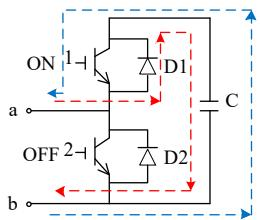  
(a) 导通状态

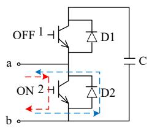  
(b) 关闭状态

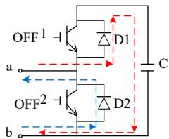  
(c) 异常状态

  
图1 子模块工作状态与电流分布  
Fig. 1 States and current distribution inside a sub-module

“投入状态”和“旁路状态”之间切换，不允许出现“闭锁状态”。SM“闭锁状态”用于 MMC-HVDC启动时电容充电或故障时电容旁路。

图2(a)是MMC 换流器的详细拓扑结构，图2(b)是 SM 结构，每个桥臂上 SM 总数为 N，可以根据MMC 输出电压需求扩展为任意数量。任意时刻每个桥臂上、下同时导通的子模块数量 $N _ { \mathrm { u } } , \ N _ { \mathrm { l } }$ 以及MMC 输出电平总数 T满足如下关系

$$
T = N + 1 \tag {1}
$$

$$
N _ {\mathrm {u}} + N _ {\mathrm {l}} = N \tag {2}
$$

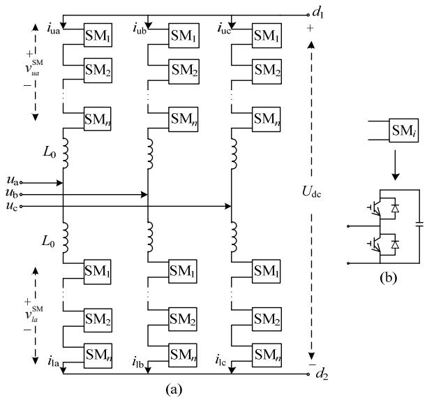  
图 2 MMC 详细结构  
Fig. 2 Detailed topology of MMC models

# 1.2 MMC 控制系统

MMC 在本质上属于 VSC[14]，但是由于 MMC内部拥有复杂的结构和数目众多的电力电子器件，需要同时执行成百上千个开关器件的触发控制，因此 MMC 控制层面上具有控制量较大、过程复杂的特点，与VSC控制系统相比需要实现更多的功能。

图 3 给出了 MMC 的控制策略。MMC 控制策

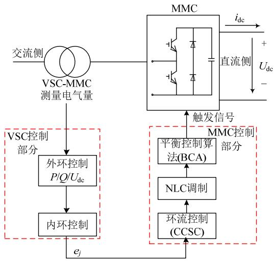  
图 3 MMC 控制策略  
Fig. 3 Control strategy of the MMC

略分为 VSC 控制部分和 MMC 控制部分。VSC 控制部分属于上层控制策略，采用双闭环结构的直接电流控制方式，通过电流内环控制达到快速响应、跟踪电流的功能，而MMC控制部分属于底层控制，除了基本的调制策略外，还加入了环流控制(CCSC)和电容电压排序功能的平衡控制算法(BCA)。

# 1.2.1 VSC 的双闭环控制

VSC 外环控制是根据所期望的交直流电气量(如电压、电流、频率等)，产生对应的电流参考值，并作为内环控制的输入量。将目标量分为有功类和无功类物理量，如图 4所示，其中有功类有 3种模式分别为：定有功功率控制、定直流电压控制和定交流频率控制；无功类分为 2 种模式：定交流电压控制和定无功功率控制。电流内环控制由外环产生的控制量通过 PI环节、前馈补偿环节实现 $d q$ 轴的解耦，进而产生下一层控制器的电压参考信号 $e _ { j }$ $( j = \mathsf { a } , \mathsf { b } , \mathsf { c } ) ^ { [ 1 4 ] }$ ，内环 $d q$ 解耦控制器如图 5 所示。

其中： $i _ { d \mathrm { r e f } } , ~ i _ { q \mathrm { r e f } }$ 为外环控制器输出； $u _ { s d } , ~ u _ { s q } , ~ i _ { d } ,$ 、$i _ { q }$ 为交流电压和电流的 $d q$ 分量；控制器其输出 $\boldsymbol { u } _ { c d } ,$ 、$\boldsymbol { u } _ { c q }$ 为电压参考信号 $e _ { j }$ 的 $d q$ 分量； $L _ { 0 }$ 为桥臂电感；$\omega _ { 0 }$ 为基频角频率。

# 1.2.2 环流控制(CCSC)

由于MMC桥臂不平衡电压会在桥臂内产生循

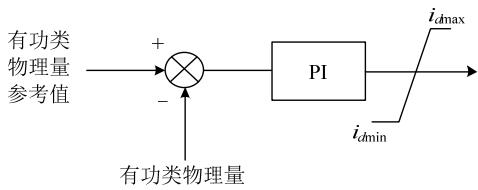

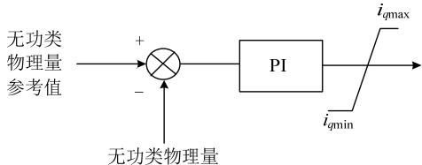  
(a)外环有功类控制  
(b)外环无功类控制  
图4 外环有功和无功类控制框图

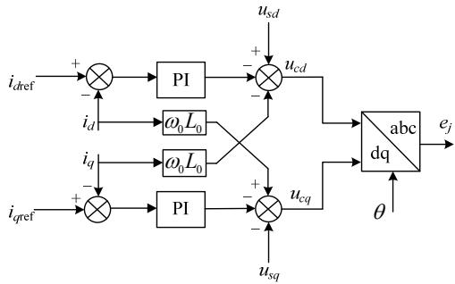  
Fig. 4 Outer loop active and reactive control   
图5 dq 轴解耦控制器   
Fig. 5 Decoupling controller of dq axes

环电流，其主要成分为正常运行的直流电流和二倍频负序交流分量[8]，其中二倍频分量不仅影响桥臂电流还会增加 SM 电容的电压纹波[15]，为了减轻或消除环流的影响，文献[8]设计了环流抑制控制器，如图 6 所示。

其中： $\scriptstyle j = \mathbf { a }$ ，b，c 中的一相； $\omega _ { 0 }$ 为基波角频率；$L _ { 0 }$ 为桥臂电感； $i _ { \mathrm { u } j } \cdot$ 、 $i _ { \mathrm { l } j }$ 为 j 相上、下桥臂电流； $i _ { \mathrm { d i f f } j }$ 为同时流过上下桥臂的换流器内部电流，即 j 相内部电流； $T _ { \mathrm { a c b } / d q }$ 为2 倍频负序坐标变换； $i _ { 2 f d q }$ 为内部环流 $d q$ 轴分量； $i _ { 2 f d q \_ f e f }$ 为环流 $d q$ 分量参考值，为抑制环流则设为 0； $u _ { \mathrm { d i f f ~ r e f } }$ 为负序三相内部不平衡电压参考值； $; e _ { j }$ 为内环控制输出的交流调制波； $u _ { \mathrm { { u } } j } \mathrm { . }$ 、$u _ { \mathrm { J } }$ 为控制系统产生的上下桥臂电压参考信号； $U _ { \mathrm { d c } }$ 为 MMC 直流电压。

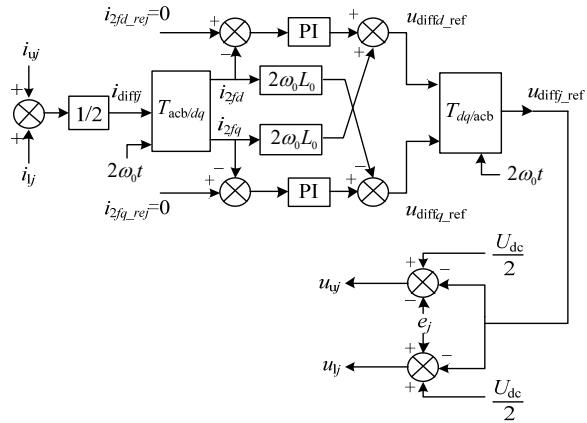  
图 6 环流抑制控制器结构  
Fig. 6 Structure of CCSC

# 1.2.3 最近电平逼近调制与平衡控制算法

MMC 调制已经有较多的方法[16-19]，例如载波移相脉宽调制法(PD-PWM)、特定谐波脉宽调制法(SHE-PWM)以及最近电平逼近调制(NLC)等[20-21]。随着子模块的增多大部分调制方法变得复杂，NLC是更有效地调制手段。

NLC调制与BCA算法基本原理如图7所示[22]，

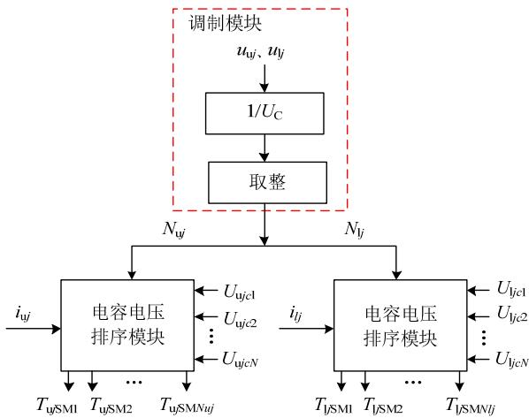  
图7 NLC 调制及平衡控制算法  
Fig. 7 NLC and BCA of MMC

以 j 相上桥臂为例(下桥臂类似)，其中 $N _ { \mathrm { { u } } j } .$ 、 $N _ { \mathfrak { l } _ { j } }$ 分别为 j 相上下桥臂某时刻需要投入的 SM 数量； $i _ { \mathrm { u } j } .$ 、 $i _ { \mathrm { l } j }$ 分别为相上下桥臂电流； $U _ { \mathrm { u } j c N }$ 、 $U _ { { \mathrm { l } } j c N }$ 分别为 j 相上下桥臂中第 N 个 SM 中电容电压值； $T _ { \mathrm { u } j \mathrm { S M } N }$ 和 $T _ { \mathrm { l } j \mathrm { S M } N }$ 分别为 j 相上下桥臂中第 N 个 SM 的触发信号。其工作原理如下：调制模块通过对该相上桥臂电压参考信号 $u _ { \mathrm { { u } } j }$ 与 SM 中电容电压平均值 $U _ { \mathrm { c } }$ 的比值取整得出某一时刻该相上桥臂需要投入的 SM 个数 $N _ { \mathrm { u } } ,$ 然后由 BCA 模块对该相上桥臂中每个 SM 的电容电压 $U _ { \mathrm { u } j c }$ 进行排序，同时检测桥臂电流 $i _ { \mathrm { u } j }$ 的方向(即图 2 中 $i _ { \mathrm { u } j }$ 方向)，若电流大于零，则 SM 处于充电状态，选取 SM 中电容电压从低到高顺序投入，其余 SM 旁路；反之电流小于零，SM 放电，则选取SM 中电容电压从高到低顺序投入，其余旁路，最终生成上桥臂每个 SM 的触发信号 $T _ { \mathrm { u } j \mathrm { S M } }$ [22]。此外，文献[23]提出了能提高 BCA工作效率方法。

# 2 MMC电磁暂态模型

# 2.1 基于半导体器件完整物理特性的 MMC 详细模型(模型 1)

MMC 中的电力电子开关 IGBT 或二极管等半导体器件用微分方程或者等效电路描述，如图8 所示[24-25]。图8(a)表示IGBT的内部结构断面示意图，图 8(b)是 IGBT 的等效电路图，包括两部分：左侧虚线框内代表的是电力场效应晶体管(metal oxidesemiconductor field effect transistor，MOSFET)结构，右侧虚线框内则表示耐高电压、大电流的双极结型晶体管(bipolar junction transistor，BJT)结构，底部虚线框内是BJT的电路结构。用电力电子开关IGBT或二极管等半导体器件的物理等值电路模型组合成 SM 模型，然后再连接成图 2 所示的基于完整物理特性半导体器件模型的 MMC 详细模型。

基于半导体器件完整物理特性的MMC模型详细地描述了 IGBT 器件特性，能够精确分析开关导通和关断特性以及开关功率损耗，研究新型 MMC拓扑结构，修改增添拓扑结构的元件[24-26]。这种模型主要用于电路模拟仿真软件，例如 PSPICE、SPICE 等仿真工具。但这种模型太复杂，并且很难获得等值电路参数，计算量巨大，不适合电力系统仿真计算分析研究，一般商业化的电力系统仿真软件也不提供半导体器件完整物理特性的内置模型。

# 2.2 基于半导体器件非线性简化模型的 MMC 详细模型(模型 2)

如图 9 所示，将 IGBT 和一个二级管并联单元等值为一个理想开关和两个非理想二极管反并联

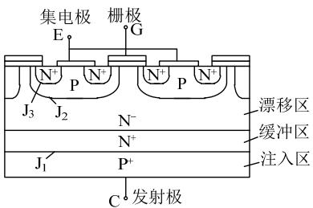  
(a)内部结构断面示意图

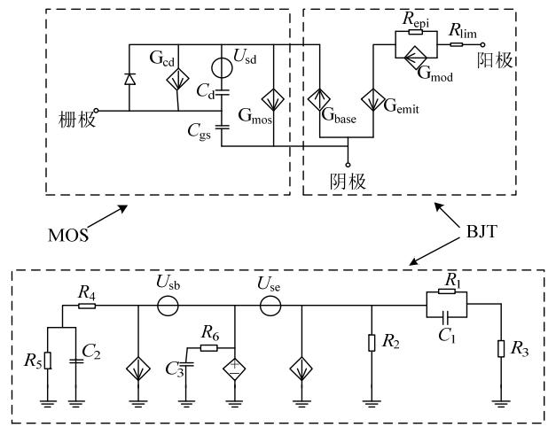  
(b)IGBT详细结构  
图 8 IGBT 详细模型  
Fig. 8 Detailed model of IGBT

的形式，二极管的非线性特性如图 10 所示，可以测量或查询制造商给出 IGBT 的相关数据。由这种非线性 IGBT 模型构成的 SM 模型可以连接成如图 2 所示的MMC 详细模型。

IGBT 非线性简化 MMC 详细模型具有较多的电力电子元件，给计算机仿真软件带来诸多不便。以半桥型结构的子模块组成的一个换流器为例，假如桥臂上有 200 个 SM，则一个桥臂上共有 800 个(IGBT与二极管各 400个)开关器件，该换流器一共有 80064800 个开关器件，仿真软件对这样一个超高阶矩阵大系统求解无疑是耗时又费力的，另外，开关状态变化影响计算矩阵的结构，增加仿真软件的计算量。文献[23]建立了 401 个电平的 MMC 换流器的基于半导体器件简化模型的MMC详细模型，通过仿真得出此模型仿真结果比较精准，但是仿真计算时间较长。文献[27]应用半导体器件简化模型的 MMC 详细模型给出了适合于更大功率范围的MMC 换流器拓扑，仿真验证新拓扑具有良好的性

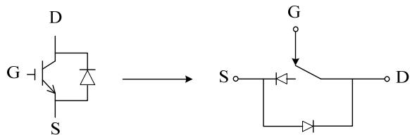  
图 9 IGBT 模型  
Fig. 9 IGBT model

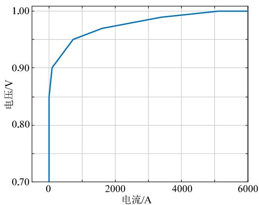  
图10 反并联二极管非线性特性  
Fig. 10 Nonlinear characteristic of anti-parallel diode能。文献[28-31]使用基于 IGBT 非线性简化 MMC详细模型验证了所提出的控制和保护策略。

基于半导体器件非线性简化模型的MMC详细模型可以精确模拟 MMC 中电流分布和开关特性，开关损失发生在非线性 IGBT 的开关过程中，但是不能像基于完整物理特性半导体器件模型的 MMC详细模型一样精确模拟电力电子开关器件的功率消耗。这种模型可用于探究SM个体异常运行问题，研究新型拓扑，验证更简化模型(例如平均值模型等)的准确性，该模型已经内置于电力系统电磁暂态仿真软件，如 PSCAD/EMTDC 等。但是，由于这种模型结构较为复杂，电力电子元件数量比较多，仿真速度较慢，一个数秒的仿真甚至会花费更长的时间来完成，对计算机性能要求较高，用于大规模电力系统的仿真是不可行的。

# 2.3 基于半导体器件可切换电阻简化的 MMC 详细模型(模型 3)

半导体器件可切换电阻简化的MMC模型与上一节所示模型类似，MMC 的拓扑结构与原模型一致，唯一的不同是该模型把半导体器件(IGBT 和反并联二极管)按照通断状态等效成带有两个值的电阻，文献[14]给出了具体等效过程：当 IGBT 导通时等效为很小电阻值(m)，当 IGBT 关断时等效为很大电阻值(M)，如图 11 所示。这类模型可以用于验证 MMC 简化模型，分析 MMC 子模块的不正常运行特性[11]。

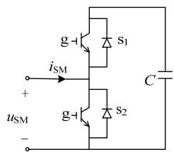  
(a)子模块结构

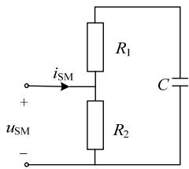  
(b)IGBT等效电阻   
图11 子模块等效电路  
Fig. 11 Equivalent model of sub-module

半导体器件可切换电阻简化MMC详细模型与前一类半导体器件非线性简化MMC详细模型相比，电力电子元件数量大量减少，仿真计算时间快，同样已经内置于 PSCAD/EMTDC 等电磁暂态仿真软件。但是由于考虑半导体开关暂态行为，需要求解大量的电气节点，还需要一个快速求解非线性开关事件的算法，并且要求计算方法具有求解“刚性”微分方程的能力，总体计算时间还很长，主要用于验证其他简化等值模型，如详细等值电路模型和平均值模型的有效性，但依然不适合大规模电力系统的仿真建模[11]。

# 2.4 基于详细等值电路的 MMC 模型(模型 4)

# 2.4.1 基于详细等值电路的MMC模型建模基本思路与方法

MMC戴维南等效模型的具体建模过程如图12所示[32]：由图 12(a)所示，首先将 SM 中 IGBT 开关元件等效，如前文 2.3 节所述，按照开关元件的通断状态(开通、关断)等效成不同的电阻值(如取开通时电阻值为 0.01，取关断时电阻值为 1M)，即电阻 $R _ { 1 i }$ 和 $R _ { 2 i }$ 根据门极信号和电流方向选择取值；然后，保留桥臂电感，采用常用数值积分方法(包括“梯形积分法”和“后退欧拉法”等)将 SM 中的电容离散化为等值电阻 $R _ { \mathrm { c } }$ ，对应图 12(b)，电容数值离散化计算见公式(3)—(6)。再将图 12(b)中 SM 等效为戴维南电路，得到图 12(c)，相关参数如式(7)(8)。最后，把 SM 对应的戴维南电路进行代数叠加，得到一个叠加后的受控的电压源和受控的电阻，再加上之前保留的桥臂电感 $L _ { 0 }$ 共同构成戴维南等效电路，对应图 12(d)，对应式(9)(10)。MMC 桥臂详细等值电路模型保留了图 3 中的所有控制策略，计算过程中也保留每个 SM 电容电压的变化过程记录，可精确计及 MMC 中每个 SM 的不同电容电压的影响，可分析设计 SM 电容平衡控制器算法，也可用于研究 MMC 谐波性能[14]。

$$
R _ {\mathrm {C}} (t) = \Delta t / 2 C \tag {3}
$$

$$
u _ {\mathrm {c}} = R _ {\mathrm {c}} i _ {\mathrm {c}} (t) + u _ {\mathrm {c e q}} (t - \Delta t) \tag {4}
$$

$$
u _ {\mathrm {c e q}} (t - \Delta t) = R _ {\mathrm {c}} (t) i _ {\mathrm {c}} (t) + u _ {\mathrm {c}} (t - \Delta t) \tag {5}
$$

$$
i _ {\mathrm {c}} = \frac {i _ {\text {a r m e q}} (t) \cdot R _ {2 i} - u _ {\text {c e q}} (t - \Delta t)}{R _ {1 i} + R _ {2 i} + R _ {\mathrm {c}}} \tag {6}
$$

$$
R _ {\mathrm {S M} i} (t) = \frac {R _ {2 i} \left(R _ {1 i} + R _ {\mathrm {c}}\right)}{R _ {2 i} + R _ {1 i} + R _ {\mathrm {c}}} \tag {7}
$$

$$
u _ {\mathrm {S M} i} (t - \Delta t) = u _ {\mathrm {c e q}} (t - \Delta t) \frac {R _ {2 i}}{R _ {2 i} + R _ {1 i} + R _ {\mathrm {C}}} \tag {8}
$$

$$
R _ {\text {a r m e q}} (t) = \sum_ {i = 1} ^ {N} R _ {\mathrm {S M} i} (t) \tag {9}
$$

$$
u _ {\text {a r m e q}} (t) = \sum_ {i = 1} ^ {N} u _ {\mathrm {S M} i} (t - \Delta t) \tag {10}
$$

其中：t 为数值积分时间步长；C 为 SM 电容值；$u _ { \mathrm { S M } i } ( t - \Delta t )$ 为 SM 电压等值的历史值；N 为桥臂SM数量；电阻 $R _ { 1 i }$ 和 $R _ { 2 i }$ 是时间函数；SM 的戴维南等值电阻 $R _ { \mathrm { S M } i } ( t )$ 也是时间的函数； $u _ { \mathrm { a r m e q } } ( t )$ 是桥臂等值受控电压源； $R _ { \mathrm { a r m e q } } ( t )$ 是桥臂等值受控的电阻，其余符号与图 12意义相同。

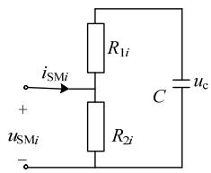  
(a)子模块结构

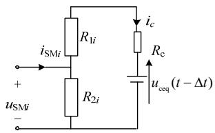  
(b)离散电容

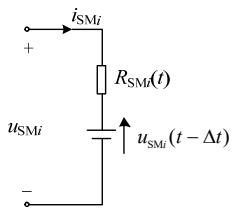  
(c)戴维南等效

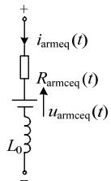  
(d)桥臂等效   
图12 戴维南等效模型建模步骤  
Fig. 12 Implementation steps of Thévenin equivalent model

从上述建模过程可以看出，应用戴维南/诺顿等效定理将 2.3 节中的 MMC 详细模型桥臂做降阶等效处理，可以将 MMC主网络计算矩阵的节点数量减少至 11 个[11]；如果桥臂电抗也包含在等值电路中，计算矩阵的节点数量可以减少到 5 个[11]。虽然该等效模型增加了求解矩阵数量，但是每个矩阵的规模都比较小且便于计算。因此，基于详细等值电路的 MMC模型减少了电气节点的数量，使主系统方程求解矩阵维数大幅度降低，可以极大地降低计算量，提高计算提速。而且，这种模型在大幅度提高仿真速度的同时还能保证其精度，也可用于验证平均值模型、大规模系统中 MMC附近的交直流侧故障研究以及 MMC 谐波特性分析[32-33]。

综上所述，模型 4 和模型 3 相比在计算方法进行了改进，将较大规模 MMC 主电路等效为一个节点数量低的简单电路，极大地提高了仿真速度[11]，尽管 SM 电容离散化为电压源和电阻串联的形式，依然可以通过数学方法解出每个 SM 的电容电压，即可以得到电容充放电的动态过程。电容离散化方法主要采用后退欧拉积分法[13]和梯形积分法[14]，虽然后退欧拉法计算效率更高，但在大步长之下的仿真精度要劣于梯形法，可以在步长较小时选用后退欧拉法，而步长较大时选用梯形法。

# 2.4.2 基于详细等值电路的 MMC 模型改进

针对详细等值电路 MMC 模型的计算速度和有效性，文献[33-42]进行了研究和讨论。文献[33]提出了 MMC 详细等值电路模型具体步骤，应用模型 2 验证了 MMC 详细等值电路模型在建模 MMC-HVDC 的启动、环流、闭锁、三相交流短路故障以及直流故障等情况下的有效性和高效的计算速度。文献[34]首先提出了可用于 MMC 实时仿真的戴维南等效模型，用 401 电平的 MMC仿真验证了等效模型的正确性。文献[35-38]也推导并验证了具体不同电平数 MMC 的戴维南/诺顿等值电路求解方法，并验证了等效电路MMC模型的精确性和较快计算速度[37]。文献[39-40]提出对半桥型 SM 进行分组也可以提高仿真计算效率[39]，同时该方法也应用到全桥型 SM 结构中[40]。文献[41]将每个桥臂分别等效为两个自锁型和半桥型受控电压源，验证了 51 电平MMC等效模型的计算速度比原始模型提高了约500 倍。文献[42]将 MMC每个桥臂都等效成一个受控电压源和一个数值计算模块组合的等效模型，并简化 MMC的均压控制策略。

基于详细等值电路的MMC模型研究直流闭锁、直流短路以及模型通用性等，国内外也开展了诸多工作。针对换流站闭锁和直流故障下 MMC 的建模问题，文献[43-44]增加 2 个开关来控制正常(开通、关断)状态与闭锁状态，并提出能反映正常状态与闭锁状态等情况下的MMC电磁暂态仿真等效电路模型。针对不同 MMC 子模块拓扑结构，戴维南等效参数的求解过程不同，MMC 等值电路模型通用性受到限制，文献[45-46]将 SM 分为单端口 SM 和双端口 SM，分别提出具有很强通用性的单端口和双端口子模块 MMC 戴维南等效模型。文献[47]将传统戴维南等效模型的建模步骤进行调换，首先利用等值前后电容能量平衡求解出等效后的电容值，然后利用梯形积分法离散等效电容，但是对于电容的等值过程实质上是忽略电容之间电压差异，同时如果忽略电容电压平衡控制 BCA 模块，模型精度会下降[48]。

# 2.5 MMC 平均值模型(模型 5)

# 2.5.1 MMC平均值模型建模基本思路与方法

MMC 平均值模型(averaged-value model，AVM)即在电力电子器件的一个开关周期进行平均化，根据交直流侧功率平衡理论，假定任意时刻子模块电容电压均相同，交流侧使用 6 个受控电压源等效和直流侧等效为 1 个受控电流源并联 1 个等效电容，实现了原系统交直流侧的电气解耦，只

有 2 次信息传递过程，实现二者虚拟联系。由于该模型是对整个桥臂进行简化，忽略 SM 之间电容电压的差异，保留图 3 中控制系统中 MMC 部分的开关调制模块(NLC)，仍然可以用来研究开关谐波的影响，但省略了电容均压控制模块(BCA)和环流控制模块(CCSC)，因此该模型不能用于研究电容均压的控制算法和环流抑制策略[14]。MMC 平均值模型根据功率平衡原则实现了交直流两侧之间的数学模型电气解耦，交流侧和直流侧数学模型具体如下[23,49-51]。

# 1）MMC 交流侧平均值模型。

根据图 2 所示 MMC 详细拓扑结构，由 KVL可得上下桥臂的电压平衡方程[49-51]

$$
u _ {j} - \frac {U _ {\mathrm {d c}}}{2} + u _ {\mathrm {u j}} ^ {\mathrm {S M}} + L _ {0} \frac {\mathrm {d} i _ {\mathrm {u j}}}{\mathrm {d} t} = 0 \tag {11}
$$

$$
u _ {j} + \frac {U _ {\mathrm {d c}}}{2} - u _ {\mathrm {l j}} ^ {\mathrm {S M}} - L _ {0} \frac {\mathrm {d} i _ {\mathrm {l j}}}{\mathrm {d} t} = 0 \tag {12}
$$

其中： $u _ { u j } ^ { \mathrm { S M } }$ 和 $u _ { l j } ^ { \mathrm { S M } }$ 表示子模块上的总电压； $u _ { j }$ 表示交流侧 j 相电压值； $i _ { \mathrm { u } j }$ 和 $i _ { \mathrm { l } j }$ 表示上下桥臂的电流；$L _ { 0 }$ 为桥臂电感， $\scriptstyle j = \mathbf { a }$ ，b，c。

联立以上两式可得

$$
2 u _ {j} + u _ {u j} ^ {\mathrm {S M}} - u _ {l j} ^ {\mathrm {S M}} + L _ {0} \frac {\mathrm {d} \left(i _ {u j} - i _ {l j}\right)}{\mathrm {d} t} = 0 \tag {13}
$$

化简得

$$
u _ {j} - \frac {- u _ {u j} ^ {\mathrm {S M}} + u _ {l j} ^ {\mathrm {S M}}}{2} - \frac {L _ {0}}{2} \frac {\mathrm {d} i _ {j}}{\mathrm {d} t} = 0 \tag {14}
$$

令

$$
e _ {j} = \frac {- u _ {u j} ^ {\mathrm {S M}} + u _ {l j} ^ {\mathrm {S M}}}{2} = u _ {j} - \frac {L _ {0}}{2} \frac {\mathrm {d} i _ {j}}{\mathrm {d} t} \tag {15}
$$

得到

$$
u _ {j} = e _ {j} + \frac {L _ {0}}{2} \frac {\mathrm {d} i _ {j}}{\mathrm {d} t} \tag {16}
$$

对任一桥臂有

$$
u _ {v j} = - u _ {j} + \frac {U _ {\mathrm {d c}}}{2}, u _ {1 j} = u _ {j} + \frac {U _ {\mathrm {d c}}}{2} \tag {17}
$$

联立式(15)(16)(17)得

$$
u _ {v j} = - \left(u _ {j} - \frac {L _ {0}}{2} \frac {\mathrm {d} i _ {j}}{\mathrm {d} t}\right) + \frac {U _ {\mathrm {d c}}}{2} = - e _ {j} + \frac {U _ {\mathrm {d c}}}{2} \tag {18}
$$

$$
u _ {1 j} = u _ {j} - \frac {L _ {0}}{2} \frac {\mathrm {d} i _ {j}}{\mathrm {d} t} + \frac {U _ {\mathrm {d c}}}{2} = e _ {j} + \frac {U _ {\mathrm {d c}}}{2} \tag {19}
$$

$$
u _ {\mathrm {A V M} - \mathrm {u j}} = \mathrm {m o d} \left(\frac {u _ {\mathrm {u j}}}{U _ {\mathrm {c}}}\right) \cdot U _ {\mathrm {c}} \tag {20}
$$

$$
u _ {\mathrm {A V M} - l j} = \operatorname {m o d} \left(\frac {u _ {l j}}{U _ {\mathrm {c}}}\right) \cdot U _ {\mathrm {c}} \tag {21}
$$

式中： $u _ { \mathrm { { u } } j }$ 和 $u _ { \mathrm { J } }$ 表示上下桥臂总电压值； $u _ { \mathrm { A V M } \_ \mathrm { U } }$ 和$u _ { \mathrm { A V M } \ , \ | j }$ 分别为图13中第j相上下桥臂受控源电压值，mod()为求余函数； $U _ { \mathrm { d c } }$ 是直流母线之间的电压； $U _ { \mathrm { c } }$

是电容电压平均值；其值为 $U _ { \mathrm { d c } } / N ;$ ；N 代表子模块的数量。

式(18)(19)中 $e _ { j }$ 是 j 相由内环解耦控制方式产生的 MMC 交流调制波参考电压，同时使用了最近电平逼近调制(NLC)方式进行调制，最后再根据式(20)和(21)分别得出上下桥臂的电压。交流侧被等效成6 个受控电压源的形式，如图 14 所示，图中算式(1)即式(18)(19)。

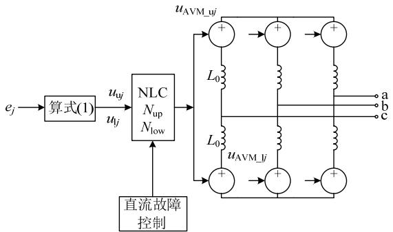  
图13 MMC平均值模型交流侧等效  
Fig. 13 AVM of MMC of AC-side

# 2）MMC 直流侧平均值模型。

直流侧等效模型推导是根据功率平衡的思想[14,49-51]，即交流侧总功率等于直流侧输出功率加上换流器功率损失

$$
P _ {\mathrm {a c}} = \sum_ {j = \mathrm {a}, \mathrm {b}, \mathrm {c}} e _ {j} i _ {j} = P _ {\mathrm {d c}} + P _ {\text {l o s s}} \tag {22}
$$

其中： $P _ { \mathrm { a c } }$ 为交流侧总功率； $P _ { \mathrm { d c } }$ 为直流侧输出功率；$P _ { \mathrm { l o s s } }$ 为换流器上功率损失。

式(20)等式两边同时除以直流电压 $U _ { \mathrm { d c } }$ 得到 式(21)

$$
\frac {P _ {\mathrm {a c}}}{U _ {\mathrm {d c}}} = \frac {1}{2} \sum_ {j = \mathrm {a}, \mathrm {b}, \mathrm {c}} m _ {j} i _ {j} = I _ {\mathrm {c}} = I _ {\mathrm {d c}} + I _ {\text {l o s s}} \tag {23}
$$

$$
m _ {j} = 2 e _ {j} / U _ {\mathrm {d c}} \tag {24}
$$

$$
I _ {\text {l o s s}} = \frac {P _ {\text {l o s s}}}{U _ {\mathrm {d c}}} = \frac {R I _ {\mathrm {c}} ^ {2}}{U _ {\mathrm {d c}}} \tag {25}
$$

$$
I _ {\mathrm {c}} = \frac {1}{2} \sum_ {j = \mathrm {a}, \mathrm {b}, \mathrm {c}} m _ {j} i _ {j} \tag {26}
$$

$$
I _ {\mathrm {d c}} = I _ {\mathrm {c}} - I _ {\text {l o s s}} \tag {27}
$$

$$
C _ {\mathrm {e}} = 6 C / N \tag {28}
$$

其中： $i _ { j }$ 为j 相交流侧电流； $m _ { j }$ 为调制比；R 为包含开关损耗在内的 MMC 等效电阻； $I _ { \mathrm { l o s s } }$ 为 MMC 的损耗； $I _ { \mathrm { c } }$ 为从交流侧流向换流器直流侧的等效电流；C为单个 SM的电容值； $C _ { \mathrm { e } }$ 为直流侧等效电容。

结合式(23)—(28)，可得到如图 14 所示由受 控电流源和等效电容 $C _ { \mathrm { e } }$ 构成的MMC直流侧等值模型，算式(2)对应式(24)，算式(3)和(4)对应式(25)和(26)。

由图 13 和图 14 以及式(11)—(28)可知，利用受控电压源和电流源等效 MMC 交直流侧模型，减少

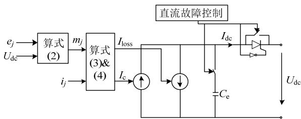  
图14 MMC平均值模型直流侧等效  
Fig. 14 MMC AVM representation of DC-side

了大量的电气节点，可减少大量仿真时间，提高了仿真效率；而且假设子模块电容电压均相同，没有建模 SM电容充放电过程，无需计算 SM电容充放电过程，也不再需要考虑相与相之间环流的影响，因此省去了电容均压控制策略(BCA)、相间电流环流抑制控制策略(CCSC)，故而可大量削减 MMC平均值模型复杂程度，进一步加快求解速度。

# 2.5.2 改进的 MMC 平均值模型

平均值模型计算效率上优势显著，但是在启动、闭锁以及交直流故障等方面建模具有局限性，因而试图充分利用平均值模型计算上的高效性，扩展其应用场景取代详细模型，成为研究热点。

文献[52]在上述交直流两侧平均值模型增加了二极管和开关，同时将交流侧和直流侧模型连接起来补偿 MMC 对地故障的电压升高，提升在闭锁和直流侧故障条件下的仿真性能，但这些附加功能会使得计算效率比原平均值模型降低约 37%。与文献[52]相同的思路，文献[53]提出在交流侧每个桥臂等值受控电压源增加 1 个 IGBT 和 2 个二极管，提高平均值模型描述 MMC 启动、功率反转、直流故障以及等值单元充放电的性能。文献[54]全面分析了上述式(11)—(26)在描述 MMC 损失、交流电压、直流电流计算、直流侧等值电容计算以及直流闭锁等方面的局限性，并针对这些局限性提出增强型的 MMC 平均值模型。文献[55]将半桥型 SM 结构的 MMC 平均值模型扩展到全桥型 SM、双箝位型 SM(CDSM)以及复合 SM(HSM)的 MMC 平均值模型，提出适用于多种类型的 SM 通用平均值建模方法。

由于平均值模型假设 SM电容电压相等，没有考虑 SM电容的充放电过程，因而不能够复制实际MMC 的电容电压脉动的影响[53]。为了考虑 MMC桥臂电容电压脉动的影响，假设每个 SM电容电压相等，文献[56]提出利用一个含有等值电容的子模块的电压动态来复现桥臂电容电压脉动的影响。与文献[56]思路不同，文献[57]详细推导MMC 交流侧等值阻抗，使用一个含有等值电容的交流侧阻抗建模实际系统的 MMC 桥臂电容电压平均脉动。

# 2.6 MMC 简化平均值模型(模型 6)

简化平均值模型(模型 6)只保留基频分量的MMC 简化平均值模型数学表达式与模型 5 的交直流侧的模型数学方程式相同[14]。简化平均值模型(模型 6)和模型 5 的主要区别在于：在省略了图 3中控制系统中电容均压控制模块(BCA)和环流控制模块(CCSC)的基础上，进一步省略控制中的调制模块(NLC)，交流侧仅保留了受控电压源的基频分量，直流侧模型与 2.5 节完全相同。基波分量 MMC 简化平均值模型(模型 6)省略了开关调制过程，仿真步长大于 MMC 平均值模型(模型 5)，拥有更快的仿真速度，但是不能用来分析开关谐波。

MMC 简化平均值模型只保留了基波分量，既可用于只考虑基波动态的电磁暂态仿真(电网模型中电感和电容为微分方程)，也可以应用于机电暂态仿真(电网为恒阻抗模型)，又称 RMS模型[14,58]。文献[58]提出了基频分量MMC简化平均值模型(模型6)的详细建模过程，并且给出模型 6的小干扰稳定模型，分析了 MMC-HVDC 与交流系统的相互作用。文献[59]指出了详细模型用于机电暂态仿真的局限性，详细推导了简化基频分量 MMC 简化平均值模型，并且应用该模型研究了多端 MMC-HVDC与交流系统的机电暂态相互作用。文献[60]提出基于开关函数方法的基波分量的平均值模型，并且考虑了MMC 正常和闭锁 2 种运行状态。应用开关函数方法实际还可以建立模型3—模型5的所有模型[61-63]。

文献[11,22]给出了前述模型的计算速度对比结果。根据上述模型的应用场景，可分为 3 种 MMC电磁暂态模型：详细模型(模型 1—模型 4)，平均值模型(模型 5)以及简化平均值模型(模型 6)，它们适用范围如下。

# 1）详细模型。

保留了 MMC 所有控制系统和 SM电容电压计算记录，可以用于分析换流器内部异常问题，如谐波分析、环流抑制和 SM电容电压均衡策略等。但是由于详细模型保留了 MMC 完整的拓扑结构，对各个 SM进行了计算，所需计算量大，不适合用于大型系统的分析。模型4 通过减少桥臂电气节点的数量提升求解速度，能较好地模拟电容的动态响应，但是随着电平数量的增加，子模块数量随之增多，控制策略会变得复杂多样，最终导致求解计算速率提升不明显。

# 2）平均值模型。

模型 5 与模型 4 相比，等效程度最高，仿真速度快，不论系统规模大小，总是以受控电压、受控

电流源和电容组成的小电路结构表示，但是由于该模型进行整体的等效处理，省略了电容均压控制模块(BCA)和环流控制模块(CCSC)，因此该模型不能用于研究电容均压的控制算法和环流抑制策略，无法模拟换流器内部的特性，MMC 平均值模型的开关调制模块(NLC)，仍然可以用来研究开关谐波的影响。

# 3）简化平均值模型。

模型 6 省略了电容均压控制模块(BCA)、环流控制模块(CCSC)以及调制模块(NLC)等控制模块，不能研究 MMC 谐波影响，假设基频信号是完美的正弦波，它的仿真步长远大于电磁暂态模型，即从电磁暂态的s 级步长提高到机电暂态的 ms 级步长，即可用于只考虑基波动态的电磁暂态仿真(电网模型中电感和电容为微分方程)研究距离 MMC 端较远的交流系统故障，也可以应用于机电暂态仿真(电网为恒阻抗模型)研究大型交直流系统间的相互作用与电力系统。

# 3 MMC建模存在的问题与未来发展方向

MMC 建模虽然取得了较丰富的研究成果，但是 MMC 模型仍然没有成熟，根据作者的分析还存在以下几方面需要进一步研究的问题。

# 1）MMC 模型有效性的实际数据验证。

当前提出的 MMC 模型只是原理模型，这些模型还没有经过现场数据的系统性检验，需要根据现场实验数据进行系统检验和分析，并且进一步修正和完善。采用没有经过实际数据验证的 MMC模型进行实际工程 MMC-HVDC 研究和学术研究，所获得的结论可能误导工程实践。

# 2）MMC 模型的通用性和功能模块化封装。

各种生产厂家提供的 MMC 详细模型，涉及保密协议和厂商特定模型，不同厂家模型之间的信息交换存在障碍，目前还不存在适用不同生产厂家的MMC“通用模型”。“通用”的含义就是标准的、有效的和公开的模型，有以下特点：1）允许设备供应商和用户等不同利益群体之间进行模型数据交换；2）能够方便地与不同仿真程序接口，容易在不同仿真软件中实现系统动态仿真结果的对比；3）能够通过调整通用模型的参数较好地描述不同生产厂商的 MMC 及其控制系统，而且在这一过程中并不涉及生产厂商的设备保密信息。

另外，MMC 模型功能模块可以进行模块化设计，根据物理组成、控制策略或者需要完成的功能将 MMC 模型分成细小的子模型进行模块化封装，

这样做可以提高未来模型升级的灵活性，方便MMC 模型库的建立，还可以减少子模块之间冗余。

# 3）模型复杂程度选择依据。

实际工程研究和科学研究中，MMC 模型的选择存在精度与计算效率之间的矛盾，选择高复杂程度的 MMC 模型，计算结果精度高，但必然要消耗较大的建模时间和计算量；选择低复杂度的 MMC模型，可以提高效率，但是可能丢失所要研究的电磁暂态现象，因此需要有标准规范作为依据指导选择 MMC 模型复杂度以及所包含的各种控制模块，这需要在实践中不断积累并逐步完善，形成 MMC仿真模型选择规范。

# 4）MMC 电磁暂态小干扰解析模型。

当前MMC模型小干扰稳定分析主要采用只含有基波分量的简化平均值模型[58]，只考虑了基本分量的影响。但是，MMC 电磁暂态时间尺度包含基波和各种频率的谐波分量影响，特别是已经发生的MMC 谐波动态的高频振荡，均需要包含谐波影响的小干扰稳定分析模型。动态相量分析方法[64-65]和谐波状态空间分析方法[66]是研究谐波动态比较好的 2 种方法，能够建模谐波动态，给出谐波动态轨迹的解析公式，并且适用于传统线性状态空间的特征分析理论和方法。但是，由于 MMC 拓扑结构和控制系统比较复杂，动态相量和谐波状态空间本身阶数也较高，即使理论上可行，实际计算量也阻碍了它们的应用，发展动态相量和谐波状态空间实用的小干扰解析模型具有一定挑战性。

# 4 结论

针对MMC电磁暂态建模虽然取得了较多的研究成果，但是这些模型都是基于物理机理推导的理论模型，MMC 电磁暂态模型还没发展成熟：还缺乏实际运行和实验数据进行系统的验证；MMC 模型通用性和功能模块化是能够广泛应用的前提和基础，但是 MMC 模型通用性和功能模块化还没有受到关注；各种模型的适用场景和选择标准也需要进一步研究；针对当前的谐波谐振问题，提出实用的 MMC 电磁暂态小干扰模型也面临重要的挑战。模型精度与计算量之间的矛盾仍然是MMC电磁暂态建模研究的主要矛盾，因此提出满足研究要求的高精度高效率MMC电磁暂态模型也是重要的研究方向。

# 参考文献

[1] 许建中，李承昱，熊岩，等．模块化多电平换流器高效建模方法研究综述[J]．中国电机工程学报，2015，35(13)：3381-3391

Xu Jianzhong，Li Chengyu，Xiong Yan，et al． A review of efficient modeling methods for modular multilevel converters[J]． Proceedings of the CSEE，2015，35(13)：3381-3391(in Chinese)   
[2] Dekka A，Wu B，Fuentes R L，et al．Evolution of topologies， modeling，control schemes，and applications of modular multilevel converters[J]．IEEE Journal of Emerging and Selected Topics In Power Electronics，2017，5(4)：1631-1656   
[3] Debnath S，Qin J，Bahrani B，et al．Operation，control，andapplications of the modular multilevel converter：a review[J]．IEEETrans Power Electro，2015，30(1)：37-53  
[4] 汤广福．基于电压源换流器的高压直流输电技术[M]．北京：中国电力出版社，2009  
[5] Franquelo L G，Rodriguez J，Leon J I，et al．The age of multi-levelconverters arrives[J]．IEEE Industrial Electronics Magazine，2008，2(2)：28-39．  
[6] Jacobson B ． VSC-HVDC transmission with cascaded two-level converters[C]//CIGRE Conference，Paris，France，2010   
[7] 赵成勇，许建中，李探．模块化多电平换流器直流输电建模技术[M]．北京：中国电力出版社，2017  
[8] 徐政．柔性直流输电系统[M]．北京：机械工业出版社，2016  
[9] 汤广福，贺之渊，庞辉．柔性直流输电工程技术研究、应用及发展[J]．电力系统自动化，2013，37(15)：3-14Tang Guangfu，He Zhiyuan，Pang Hui．Research，application anddevelopment of VSC-HVDC engineering technology [J]Automation of Electric Power Systems，2013，37(15)：3-14(inChinese)  
[10] 孙小燕，朱凌志，朱永强，等．电力系统不同时间尺度仿真对比研究[J]．陕西电力，2014，42(3)：27-31Sun Xiaoyan，Zhu Lingzhi，Zhu Yongqiang，et al．Research oncomparison of different time scales simulation for power system[J]Shanxi Electric Power，2014，42(3)：27-31(in Chinese)  
[11] Wachal R，Jindal A，Dennetiere S，et al．Guide for the development of models for HVDC converters in a HVDC grid[J]．CIGRÉ TB604 (WG B4．57)．Paris，Tech Rep，2014   
[12] Saad H，Dennetière S，Mahseredjian J．On modelling of MMC in EMT-type program[C]//IEEE 17th Workshop on Control and Modeling for Power Electronics (COMPEL)，2016   
[13] 许建中，赵成勇，Gole A M．模块化多电平换流器戴维南等效整体建模方法[J]．中国电机工程学报，2015，35(8)：1919-1929Xu Jianzhong，Zhao Chengyong，Gole A M．Research on theThévenin’s equivalent based integral modelling method of themodular multilevel converter (MMC)[J]．Proceedings of the CSEE，2015，35(8)：1919-1929(in Chinese)  
[14] Saad H，Peralta J，Dennetiere S，et al．Dynamic averaged and simplified models for MMC-based HVDC transmission systems[J] IEEE Trans Power Delivery，2013，28(3)：1723-1730   
[15] Jacobson B，Karlsson P，Asplund G，et al．VSC-HVDC transmissionwith cascaded two-level converters[C]//Proc CIGRE Conf．Paris，France，2010：B4-110  
[16] Solas E，Abad G，Barrena J A，et al． Modulation of modular multilevel converter for HVDC application[C]// Proc 14th Int Power Electron Motion Control Conf．2010：84-89．   
[17] Saeedifard M ， Iravani R ． Dynamic performance of a modularmultilevel back-to-back HVDC system[J]．IEEE Trans on PowerDelivery，2010，25(4)：2903-2912  
[18] Ding G，Tang G，He Z，et al．New technologies of voltage source converter (VSC) for HVDC transmission system based on VSC [C]// IEEE Power Eng Soc Gen Meeting．Beijing，China，2008：1-8   
[19] Qin J，Saeedifard M．Predictive control of a modular multi-level converter for a back-to-back HVDC transmission system[J]．IEEE

Trans on Power Delivery，2012，27(3)：1538-1547  
[20] Li K，Zhao C．New technologies of modular multilevel converter for VSC-HVDC application[C]//The Asia-Pacific Power Energy Eng Conf，Baoding，China，2010   
[21] Tu Q，Xu Z．Impact of sampling frequency on harmonic distortion formodular multilevel converter[J]．IEEE Trans on Power Delivery，2011，26(1)： 298-306  
[22] 许建中．模块化多电平换流器电磁暂态高效建模方法研究[D]．北京：华北电力大学．2014  
[23] Peralta J，Saad H，Dennetière S，et al．Detailed and averaged modelsfor a 401-level MMC-HVDC system[J]． IEEE Trans on PowerDelivery，2012，27(3)：1501-1508．  
[24] Strollo A G M ． A new IGBT circuit model for SPICE simulation[C]//Power Electronics Specialists Conference．PESC '97 Record，28th Annual IEEE，1997   
[25] Hyeong S O，Mahmoud E N．A new IGBT behavioral model[J]Solid-State Electronics，2001，45(12)：2069-2075  
[26] Riccio M，De Falco G，Mirone P，et al．Accurate SPICE modeling of reverse-conducting IGBTs including self-heating effects[J]．IEEE Trans Power Electro，2017，32(4)：3088-3098   
[27] Lesnicar A，Marquardt R．An innovative modular multilevel converter topology suitable for a wide power range[C]//Power Tech Conference Proceedings．IEEE Bologna，2003   
[28] Dennetière S，Nguefeu S，Saad H，et al．Modeling of modular multilevel converters for the France-Spain link[C]//International Conference on Power Systems Transients，IPST’13．Vancouver， Canada，2013   
[29] Pérez M A，Rodríguez J．Generalized modeling and simulation of a modular multilevel converter[C]//2011 IEEE International Symposium on Industrial Electronics (ISIE)．IEEE，2011：1863-1868．   
[30] Gao F，Niu D，Tian H，et al．Control of parallel-connected modular multilevel converters[J]．IEEE Trans Power Electro，2015，30(1)： 372-386．   
[31] Tu Q，Xu Z，Xu L．Reduced switching-frequency modulation and circulating current suppression for modular multilevel converters[J] IEEE Trans on Power Delivery，2011，26(3)：2009-2017   
[32] Gnanarathna U N，Gole A M，Jayasinghe R P．Efficient modeling of modular multilevel HVDC converters (MMC) on electromagnetic transient simulation programs[J]．IEEE Trans on Power Delivery， 2011，26(1)：316-324   
[33] Saad H，Dufour C，Mahseredjian J，et al．Real time simulation of MMCs using the state-space nodal approach[C]//Proceedings of the IPST．2013：18-20   
[34] Ashourloo M，Mirzahosseini R，Iravani R．Enhanced model and real-time simulation architecture for modular multilevel converter[J] IEEE Trans on Power Delivery，2018，33(1)：466-476   
[35] Hao W，Tang Z，Lin G，et al．A novel method on MMC simulation modeling with detailed capacitance characteristics[C]//Journal of Physics：Conference Series．IOP Publishing，2018：052030   
[36] Xu J，Zhao C，Liu W，et al．Accelerated model of modular multilevelconverters in PSCAD/EMTDC[J]．IEEE Trans on Power Delivery，2013，28(1)：129-136  
[37] 何敏．多端柔性直流输电系统的建模与电磁暂态仿真研究[D]．济南：山东大学，2018．  
[38] 许建中，赵成勇，刘文静．超大规模 MMC 电磁暂态仿真提速模型[J]．中国电机工程学报，2013，33(10)：114-120Xu Jianzhong，Zhao Chengyong，Liu Wenjing．Accelerated model ofultra-large scale MMC in electromagnetic transient simulations[J]Proceedings of the CSEE，2013，33(10)：114-120(in Chinese)  
[39] Beddard A，Barnes M，Preece R．Comparison of detailed modeling

techniques for MMC employed on VSC-HVDC schemes[J]．IEEETrans on Power Delivery，2015，30(2)：579-589  
[40] Adam G P，Williams B W．Half-and full-bridge modular multilevel converter models for simulations of full-scale HVDC links and multiterminal DC grids[J]．IEEE Journal of Emerging and Selected Topics in Power Electronics，2014，2(4)：1089-1108．   
[41] Xiang W，Lin W，An T，et al．Equivalent electromagnetic transient simulation model and fast recovery control of overhead VSC-HVDC based on SB-MMC[J]．IEEE Trans on Power Delivery，2017，32(2)： 778-788   
[42] 喻锋，王西田，林卫星，等．模块化多电平换流器快速电磁暂态仿真模型[J]．电网技术，2015，39(1)：257-263Yu Feng，Wang Xitian，Lin Weixing，et al．Fast electromagnetictransient simulation models of modular multilevel converter[J]Power System Technology，2015，39(1)：257-263(in Chinese)  
[43] 唐庚，徐政，刘昇．改进式模块化多电平换流器快速仿真方法[J]电力系统自动化，2014，38(24)：56-61Tang Geng，Xu Zheng，Liu Sheng．Improved fast model of themodular multilevel converter[J] ． Automation of Electric PowerSystems， 2014，38(24)：56-61(in Chinese)  
[44] Ajaei F B，Iravani R．Enhanced equivalent model of the modular multilevel converter[J]．IEEE Trans on Power Delivery，2015，30(2)： 666-673．   
[45] 赵禹辰，徐义良，赵成勇，等．单端口子模块 MMC 电磁暂态通用等效建模方法[J]．中国电机工程学报，2018，38(16)：4658-4668Zhao Yuchen，Xu Yiliang，Zhao Chengyong，et al．Generalizedelectromagnetic transient (EMT) equivalent modeling of MMCs witharbitrary single-port sub-module structures[J]．Proceedings of theCSEE，2018，38(16)：4658-4668(in Chinese)  
[46] 徐义良，赵成勇，赵禹辰，等．双端口子模块 MMC 电磁暂态通用等效建模方法[J]．中国电机工程学报，2018，38(20)：6078-6090Xu Yiliang，Zhao Chengyong，Zhao Yuchen，et al．Generalizedelectromagnetic transient (EMT) equivalent modeling of MMCs witharbitrary two-port sub-module structures[J]． Proceedings of theCSEE，2018，38(20)：6078-6090(in Chinese)  
[47] Li B，Liu Y，Li B，et al．Computationally efficient modeling method of MMC based on arm equivalent time-variant capacitance[J] International Transactions on Electrical Energy Systems，2019，29(2)： 2732．   
[48] Xu J，Zhao C．A backward Euler method based Thévenin equivalent integral model for full-bridge modular multi-level converters[J] Electric Power Components and Systems，2016，44(3)：313-323   
[49] Khan S，Tedeschi E．Modeling of MMC for fast and accurate simulation of electromagnetic transients：A review[J]．Energies，2017， 10(8)：1161．   
[50] Saad H，Dennetière S，Mahseredjian J，et al．Modular multilevelconverter models for electromagnetic transients[J]．IEEE Trans onPower Delivery，2014，29(3)：1481-1489．  
[51] 刘明帅．平均值模型的有效性研究及其应用[D]．济南：山东大学2017．  
[52] Xu J，Gole A M，Zhao C．The use of averaged-value model of modular multilevel converter in DC grid[J]．IEEE Trans on Power Delivery， 2015，30(2)：519-528   
[53] Zhang H，Jovcic D，Lin W，et al．Average value MMC model with accurate blocked state and cell charging/discharging dynamics[C]//Environment Friendly Energies and Applications (EFEA)，2016 4th International Symposium on．IEEE，2016：1-6   
[54] Beddard A，Sheridan C E，Barnes M，et al．Improved accuracy average value models of modular multilevel converters[J]．IEEE Trans on Power Delivery，2016，31(5)：2260-2269

[55] Pei X，Tang G，Pang H，et al．A general modeling approach for the MMC averaged-value model in large-scale DC grid[C]//IEEE Conference on Energy Internet and Energy System Integration (EI2) 2017．   
[56] Nanou S，Papathanassiou S．Generic average-value modeling of MMC-HVDC links considering submodule capacitor dynamics[C]//Universities Power Engineering Conference (UPEC) 2017 52nd International．IEEE，2017：1-5   
[57] Yang H，Dong Y，Li W，et al．Average-value model of modular multilevel converters considering capacitor voltage ripple[J]．IEEE Trans on Power Delivery，2017，32(2)：723-732   
[58] Trinh N T，Zeller M，Wuerflinger K，et al． Generic model ofMMC-VSC-HVDC for interaction study with AC power system[J]IEEE Trans on Power Systems，2016，31(1)：27-34  
[59] Liu S，Xu Z，Hua W，et al．Electromechanical transient modeling of modular multilevel converter based multi-terminal HVDC systems[J] IEEE Trans on Power Systems，2014，29(1)：72-83   
[60] 孙谦浩，李亚楼，宋强，等．基于桥臂基波平均开关函数的MMC模型在直流电网仿真中的应用[J]．电力自动化设备，2018，38(8)：24-30．Sun Qianhao，Li Yalou，Song Qiang，et al．Application of MMC modelbased on arm fundamental wave average switching function in DCgrid simulation[J]． Electric Power Automation Equipment，2018，38(8)：24-30(in Chinese)  
[61] Adam G P，Li P，Gowaid I A，et al．Generalized switching functionmodel of modular multilevel converter[C]//Industrial Technology(ICIT)，2015 IEEE International Conference on．IEEE，2015：2702-2707  
[62] Saad H，Jacobs K，Lin W，et al．Modelling of MMC including half-bridge and Full-bridge submodules for EMT study[C]//Power Systems Computation Conference (PSCC)．IEEE，2016：1-7   
[63] Li R，Xu L，Guo D．Accelerated switching function model of hybridMMCs for HVDC system simulation[J]．IET Power Electronics，2017，10(15)：2199-2207  
[64] IEEE Task Force on Dynamic Average Modeling．Definitions and applications of dynamic average models for analysis of power systems[J]．IEEE Trans on Power Delivery，2010，25(4)：2655-2669．   
[65] Sanders S R，Noworolski J M，Liu X Z，et al．Generalized averaging method for power conversion circuits[J]．IEEE Trans on Power Electro，1991，6(2)：251-259   
[66] Wereley N M．Analysis and control of linear periodically time varying systems[D]．Massachusetts：Massachusetts Institute of Technology， 1990．

  
陈武晖

在线出版日期：2020-05-15。

收稿日期：2020-04-10。

作者简介：

陈武晖(1974)，男，博士，副教授，通信作者，研究方向为电力系统分析与控制，E-mail：whchen@mail.ujs.edu.cn；

吴明哲(1993)，男，硕士研究生，研究方向为电力系统分析与控制。

（责任编辑 王晔）