# An improved passivity enforcement algorithm for transmission line models using passive filters

H.M. Jeewantha De Silva a,* , Mohammad Shafieipour b

a Manitoba Hydro International, Canada   
b Safe Engineering Services & Technologies ltd., Laval, QC H7L6E8, Canada

# A R T I C L E I N F O

Keywords:

Electromagnetic transients

Passivity enforcement

Phase domain model

Passive filters

# A B S T R A C T

This paper proposes a simple but effective method based on shunt passive filters to enforce passivity on a frequency dependent transmission line model for multi-conductor cables and overhead lines. The passivity enforcement algorithm is applied to a widely-used frequency dependent line model in EMT-type software, the Universal Line Model. The passivity violating regions of the transmission line model are identified using the frequency sweep method. The passive shunt series RLC filters are added to the nodes of the transmission lines to eliminate passivity violations. Examples of multi-conductor underground cable systems are presented to demonstrate the validity of the proposed approach.

# 1. INTRODUCTION

Wideband transmission line models are widely used in electromagnetic transient (EMT) studies such as temporary over-voltages, switching over-voltages, network resonance, lightning over-voltages, etc. These models accurately consider frequency dependency as well as distributed nature of the line parameters for frequencies ranging from 0 Hz to a few MHz. In this paper, transmission line refers to both overhead lines and cables.

The time domain implementation of a transmission line involves several steps, which are summarized as follows. First, the line parameters such as propagation function and characteristic admittance are formulated in frequency domain for several frequency samples [1]. Next, by applying the “Vector Fitting” technique, the frequency domain characteristics are approximated using continuous rational functions [2, 3]. Finally, the recursive convolution method is applied to represent the transmission line equations as a standard EMT-type model. This includes a shunt conductance and a parallel current source.

Transmission lines are passive as a matter of physical reality. However, due to the errors in approximating frequency domain character istics using rational functions as well as occasional frequency domain approximations, the resulting model may become non-passive [4]. It is observed that a non-passive model may lead to unstable time domain simulations. One of the major challenges of frequency dependent transmission line models is to enforce the stability of the time domain simulations.

Several passivity enforcement algorithms have been proposed [4–6]. Some of these methods [4,5] are based on perturbation of the fitted parameters and passivity is enforced as a solution to a constrained optimization problem. However, the derivation and implementation of such algorithms are complicated, as they require many matrix linearization and eigenvalue sensitivity calculations. Furthermore, these methods are typically valid for eliminating small passivity violations, which are commonly due to approximations in the linearization process. In addition, with these methods there is no guarantee that the convergence is always achieved, as it depends on several factors and for large transmission line systems with many conductors, these methods may require significant computation time (e.g. several minutes depending on the case).

Alternatively, passivity can be enforced analytically through Hamiltonian matrix [6]. This approach is widely applied to admittance-based realization of a frequency dependent component or network equivalent. The work in [7,8] extend this method to transmission lines. However, they are limited to modal domain models based on constant transformation matrices. Note that for underground cables and vertically asymmetrical transmission lines, the transformation matrix is frequency dependent. Again, the derivation and the implementation of this enforcement algorithm is tedious and requires significant effort. The computer memory and time requirements for the algorithm can be significantly high for large transmission line configurations with several conductors/cables.

Ref. [9] discusses a filter-based method to enforce passivity for a

two-layer network equivalent. A passivity enforcement method for multi-conductor transmission lines via filters is proposed in [10]. However, a drawback of this method is that the corrected model elim inates the natural decoupling of the transmission line. In EMT-type programs, the natural decoupling of frequency dependent transmission line is a significant advantage as it divides the system into small subsystems, which leads to faster simulations.

This paper proposes an improved passivity enforcement algorithm using passive filters for transmission line models in EMT-type software. An improved quality factor estimation for passive filters is introduced. Compared to [10], an advantage of the proposed method is that the natural de-coupling of the transmission line is also maintained. Additionally, the proposed method does not require an iterative procedure to converge numerically. Rather, it uses successive steps to enforce passivity at the local level until passivity is enforced globally. This is different from approaches based on linearization, which may lead to numerical divergence. It should be noted that in this paper, we use a widely used wideband transmission line model in an EMT-type program [11], namely the Universal Line Model [2] to demonstrate the effectiveness of the propose technique. However, it is expected that the introduced method can be used with other transmission line models.

One possible drawback of the proposed approach is that the accuracy of the fitted function may be decreased by adding a filter. However, the passivity corrections are limited only to the passivity violating regions. Therefore, the inaccuracy of the rest of the spectrum is insignificant. Furthermore, if the passivity violations are small, the error is negligible as shown in the examples studied in Section 4.

# 2. PASSIVITY RELATED TO TRANSMISSION LINE AND CABLES

# 2.1. Definition of passivity

The passivity of the transmission line model is guaranteed; if and only if its transfer admittance function, Y(s) is positive real for any given frequency. The transfer admittance is related to the sending and receiving-end voltages and currents as

$$
\left[ \begin{array}{l} I _ {k} \\ I _ {m} \end{array} \right] = \widetilde {Y} \left[ \begin{array}{l} V _ {k} \\ V _ {m} \end{array} \right] \tag {1}
$$

The transfer admittance matrix can also be written in terms of the propagation function $A ( s )$ and characteristic admittance $Y c ( s )$ matrices $\left( s = j \omega \right) [ 4 , 1 0 ]$

$$
\widetilde {Y} = \left[ \begin{array}{l l} \left(I - A ^ {2}\right) ^ {- 1} \left(I + A ^ {2}\right) Y c & \left(I - A ^ {2}\right) ^ {- 1} (- 2 A) Y c \\ \left(I - A ^ {2}\right) ^ {- 1} (- 2 A) Y c & \left(I - A ^ {2}\right) ^ {- 1} \left(I + A ^ {2}\right) Y c \end{array} \right] \tag {2}
$$

The necessary and sufficient conditions for the transmission line model to be passive are [4,10]

(3)

The complex poles and residues always appear in conjugate pairs in vector fitting algorithms. Hence, the first two conditions are always satisfied. To fulfill the third condition, the eigenvalues of the Hermitian matrix should be positive for every frequency ω.

# 2.2. Passivity identification

The frequency sweep method is used to identify violating regions. In this method, the eigenvalues of the Hermitian matrix is computed for the frequency range of interest (e.g. 0.001 Hz to a few MHz) and negative eigenvalues are monitored to identify passivity violating regions. A potential drawback of this method is that there can be missing negative eigenvalues between two frequency samples. This can be avoided by

analyzing the eigenvalue characteristics as a function of frequency and by taking sufficient number of samples in combination of log and linear scales. The frequency range should cover the bandwidth of frequencies in time domain simulations [4].

# 3. PASSIVITY ENFORCEMENT FOR TRANSMISSION LINES VIA PASSIVE SHUNT FILTERS

# 3.1. Preliminaries

The fundamental concept behind the passivity enforcement by filters is that the eigenvalues of a matrix can be changed by modifying the diagonal elements of the matrix. If every diagonal element $( D _ { i i } )$ of the matrix is increased by a small value (dD ), all eigenvalues are increased by the same value $( d D _ { i i } )$ .

Addition of shunt conductance [4] and the accurate earth return impedance and admittance formulas [11] can improve passivity conditions in frequency domain parameter calculations. However, this may not eliminate all violations due to unavoidable error accumulation in the curve-fitting procedure.

The series RLC filter can be used to enforce passivity [9] and they are added as shunt elements to the terminals of the transmission line model at both ends as shown in Fig. 1. A shunt RLC branch is relatively straightforward to implement in EMT-Type software using existing routines.

First, passivity-violating regions are identified using a passivity identification method discussed in Section 2.

For each frequency-violating band, the transfer function of the filter is defined as

$$
F (w) = \frac {K \lambda_ {0}}{1 + j Q \left(\frac {\omega}{\omega_ {0}} - \frac {\omega_ {0}}{\omega}\right)} \tag {4}
$$

where, Q is the quality factor, ω is the angular frequency, λ0 is the negative eigenvalue with the largest magnitude in that violating band, and ω0 is the angular frequency at which the most negative eigenvalue occurs. In (4), the factor $K > 1 . 0$ ensures that the corrected eigenvalues are positive by at least a pre-determined (small) amount (e.g. K = 1.0001). The series resistance, inductance and capacitance values are computed as

$$
R = \frac {1}{K \lambda_ {0}} \tag {5a}
$$

$$
L = \frac {Q R}{\omega_ {0}} \tag {5b}
$$

$$
C = \frac {1}{R Q \omega_ {0}} \tag {5c}
$$

# 3.2. Improved estimation of the quality factor (Q)

Selecting a proper quality factor for the filter is critical for successful enforcement of passivity. A small quality factor may lead to an overpassivity compensation and a large quality factor can lead to an under-passivity compensation. Fig. 2 shows the effect of quality factor on the magnitude of series RLC filter transfer function.

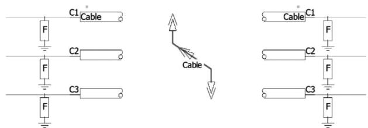  
Fig. 1. Transmission line with passive filters.

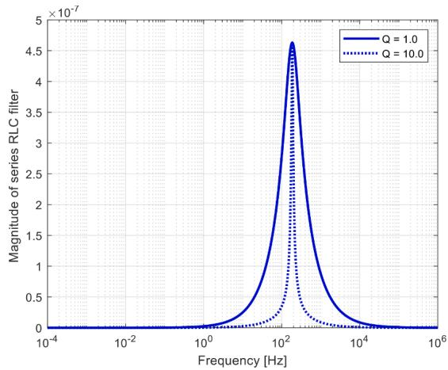  
Fig. 2. Filter characteristics with different quality factors Q.

Reference [2] suggests computing the quality factor based on inequalities. The quality factor was determined based on the magnitude of the filter admittance function [2]. However, it should be noted that only the real part of the filter admittance contributes to the eigenvalues of the transfer admittance matrix. Therefore, the quality factor can be evaluated as

$$
Q _ {1} = \frac {\sqrt {\sqrt {2} - 1}}{\left(\frac {\omega_ {U}}{\omega_ {0}} - \frac {\omega_ {0}}{\omega_ {U}}\right)} \tag {6a}
$$

$$
Q _ {2} = \frac {\sqrt {\sqrt {2} - 1}}{\left(\frac {\omega_ {0}}{\omega_ {L}} - \frac {\omega_ {L}}{\omega_ {0}}\right)} \tag {6b}
$$

$$
Q = \min  \left(Q _ {1}, Q _ {2}\right) \tag {6c}
$$

where, ωU and $\omega _ { L }$ are the upper and lower angular frequencies between which the eigenvalue curve is negative. The diagonal elements of the transfer admittance matrix [Y(ω)] are updated to include the admittance contribution of the filter F(ω)

$$
Y (i, i) = F (\omega) + Y (i, i) \tag {7}
$$

# 3.3. Elimination of violations at upper and lower bounds

A low-pass filter (series RC) or high-pass filter (series RL) can be used to eliminate violations at the upper or lower frequency samples in the frequency spectrum, respectively. The filter parameters are derived by substituting the magnitude of the negative eigenvalues and frequencies at the beginning and at the end of the violating region (i.e. λL, λU, ωL, ω ). Depending on the frequencies and the eigenvalues at the boundaries of the violating region, the filter parameters (such as R, $L ,$ or C) can be negative. For a high-pass filter, the following inequality criteria is used for positive R and L values.

$$
\frac {\lambda_ {L} \omega_ {L} ^ {2}}{\omega_ {U} ^ {2}} <   \lambda_ {U} <   \lambda_ {L} \tag {8}
$$

where $\lambda _ { \mathrm { L } }$ and $\lambda _ { \mathrm { { U } } }$ are the magnitudes of the negative eigenvalue at ${ \mathfrak { O } } _ { \mathrm { L } }$ and ωU, respectively, with ${ \mathfrak { o } } _ { \mathrm { L } }$ being the first frequency sample. If the above criteria is not met, $\lambda _ { \mathrm { { U } } }$ is replaced with (9)

$$
\lambda_ {U} = 0. 5 \lambda_ {L} \left(\frac {\omega_ {L} ^ {2}}{\omega_ {U} ^ {2}} + 1\right) \tag {9}
$$

Similarly, for a low-pass filter, the requirement for R and C to be positive is

$$
\frac {\lambda_ {U} \omega_ {L} ^ {2}}{\omega_ {U} ^ {2}} <   \lambda_ {L} <   \lambda_ {U} \tag {10}
$$

where, ωU is the last frequency sample. If the above criteria is not met, $\mathrm { . \lambda \lambda \lambda }$ is replaced with (11)

$$
\lambda_ {L} = 0. 5 \lambda_ {U} \left(\frac {\omega_ {L} ^ {2}}{\omega_ {U} ^ {2}} + 1\right) \tag {11}
$$

# 3.4. Algorithm

The addition of sufficient shunt conductances to the admittance matrix improves the condition of passivity at very low frequencies. For a given transmission line model, the passivity violations are first determined by evaluating the eigenvalues of the Hermitian matrix (based on curve-fitted Yc and A) for a set of frequency samples as discussed in Section 2. For each frequency, the most negative eigenvalue of the Hemitian matrix is selected. The passivity violating regions are accordingly identified based on the most negative eigenvalues in each frequency. For each violating band, the frequency (ω0) at which the most negative eigenvalue occurs, is determined.

Starting with the negative eigenvalue with largest magnitude for all violating bands, filters are added one by one until all eigenvalues are positive. If the violating band is within the lower and upper bounds of the frequency samples, the series RLC filters are added to correct the violation as discussed in Section 3.3. If there are violations at the upper or lower frequency samples, a low-pass filter (series RC) or a high-pass filter (series RL) is added, respectively. Fig. 3 shows the passivity enforcement algorithm in a flow chart.

# 4. NUMERICAL RESULTS

# 4.1. Application example 1

The proposed passivity enforcement algorithm is demonstrated using a 2 km long three-phase underground cable system as shown in Fig. 4.

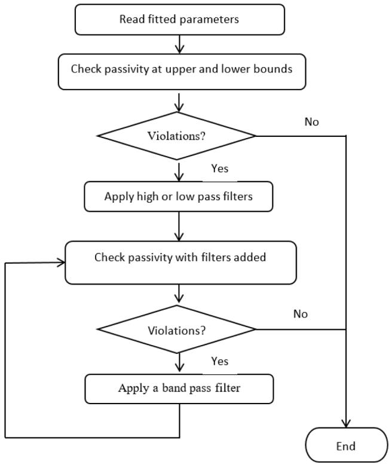  
Fig. 3. Flow chart of the passivity enforcement algorithm.

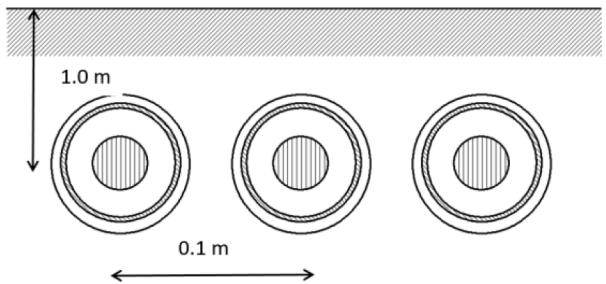  
Fig. 4. Three-phase underground cable configuration.

The cable layout is flat with 0.1 m distance between the cables. The data for the cable system is shown in Table I. The frequency dependent phase domain model (Universal Line Model) [2] in PSCAD/EMTDC commercial software [11] is used for demonstration.

The orders of the characteristic admittance (Yc) and the propagation function (H) are 14 and 58, respectively. There are four modes in the propagation function. The fitting rms errors corresponding to the Yc and H are 0.0954 % and 0.07314 %, respectively. The curve-fitting frequency range is 0.1 Hz to 1 MHz with 100 frequency samples. The residue/pole ratio of the propagation function is 3.64.

The passivity of the cable system is examined using the frequency sweep method for a frequency range from 0.1 mHz to 1 MHz. The eigenvalues of the Hermitian matrix are shown in Fig. 5 before and after the addition of sufficient shunt conductances to the admittance formulation. The presence of negative values in the original cable eigenvalues of H indicate that the original model is non-passive and therefore may lead to numerical instability in time domain simulations. However, with the addition of the shunt conductances (e.g. 1.0e-10 Ω.m) the large passivity violations at low frequencies are eliminated.

The addition of shunt conductances does not always guarantee a passive model. There can be negative eigenvalues at other frequencies. These values are then removed by passive filters as discussed in Section 3. It can be seen that with the addition of the filters, the line model becomes passive (see Fig. 6).

Five filters with characteristics listed in Table II are added to the nodes of the line model. In Table II, F0, λ0, R, L, and C are the frequency at the negative eigenvalue $\lambda _ { 0 , \ast }$ negative eigenvalue (magnitude of the largest negative eigenvalue in the violating band), resistance, inductance and capacitance of the RLC series filter, respectively.

Fig. 7 compares the transfer admittance function (Y) of the line model before and after the addition of the filters. The maximum error is around 6e-7. This demonstrates that the error due to the addition of passive filters is very small in the frequency domain.

The sending-end of the cable is energized with 225 kV (L-L) RMS three-phase voltage source and all other conductors are kept open. A breaker is connected between the cable and the source. The breaker is initially closed but opened at t = 1.0 s. The receiving-end voltage of phase A is shown in Fig. 8. It is clear that without the proposed passivity

Table I Transmission line data.   

<table><tr><td colspan="2">Cable data</td></tr><tr><td>Conductor Outer Radius</td><td>0.022 m</td></tr><tr><td>Inner Ins. Outer Radius</td><td>0.0395 m</td></tr><tr><td>Sheath Outer Radius</td><td>0.044 m</td></tr><tr><td>Outer Ins. Outer Radius</td><td>0.0475 m</td></tr><tr><td>Inner Ins. Capacitance</td><td>0.3 uF/km</td></tr><tr><td>Outer Ins. Relative Permittivity</td><td>2.3</td></tr><tr><td>Conductor Dc Resistance</td><td>0.046 ohms/km</td></tr><tr><td>Sheath Resistivity</td><td>2.826e-8 Ωm</td></tr><tr><td>Outer Ins. Relative Permittivity</td><td>2.3</td></tr><tr><td colspan="2">Other</td></tr><tr><td>Ground resistivity</td><td>100 Ωm</td></tr><tr><td>Length of the line</td><td>2 km</td></tr></table>

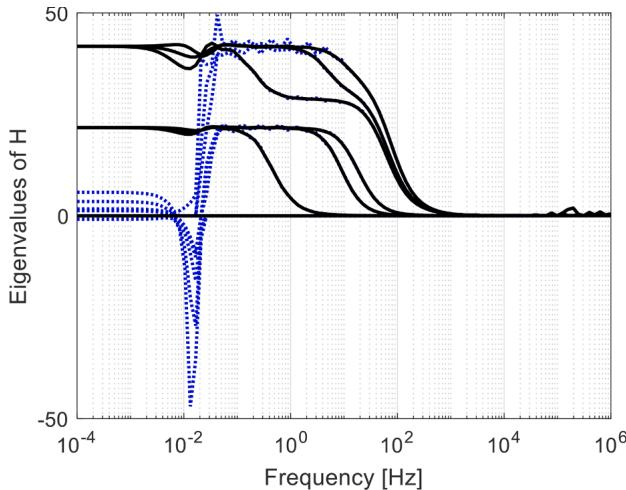  
Fig. 5. Eigenvalues of Hemittian matrix H (dotted lines: original cable; solid lines: cable with a shunt conductance).

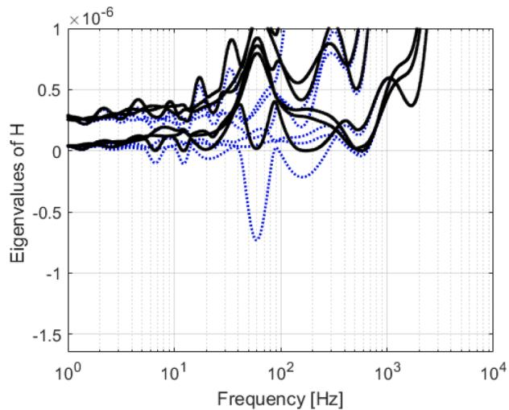  
Fig. 6. Eigenvalues of Hemittian matrix H (dotted lines: without filters; solid lines: with filters).

Table II Passive filter data.   

<table><tr><td>F0(Hz)</td><td>λ0</td><td>R(Ω)</td><td>L(H)</td><td>C(F)</td></tr><tr><td>59.3</td><td>7.3185e-07</td><td>1.366257e6</td><td>4.739e3</td><td>1.5191e-09</td></tr><tr><td>172.6</td><td>1.5024e-07</td><td>6.655176e6</td><td>7.009e3</td><td>1.2119e-10</td></tr><tr><td>6.6</td><td>9.4675e-08</td><td>1.0561364e7</td><td>2.34257e5</td><td>2.4661e-09</td></tr><tr><td>12.2</td><td>4.8082e-08</td><td>2.0795796e7</td><td>1.40435e6</td><td>1.1971e-10</td></tr><tr><td>569.313</td><td>2.7594e-08</td><td>3.6236519e7</td><td>3.4450e4</td><td>2.2685e-12</td></tr></table>

enforcement technique, the simulation is unstable. When the breaker is open, the receiving-end voltage should approach zero, as there is no source acting on cable. This can be seen from the waveform corresponding to the passive model. However, the waveform corresponding to the non-passive model deviates from the solution after the breaker is opened and exhibits numerical instability towards the end of the simulation.

A non-passive model can give stable or unstable simulations depending on many parameters including external circuit parameters, time step and circuit breaker operation, etc.

A short circuit test is conducted to verify the accuracy of the simulation in time domain (see Fig 9). The phase A at the sending-end of the cable is energized with step voltage (1 V) and all other conductors are

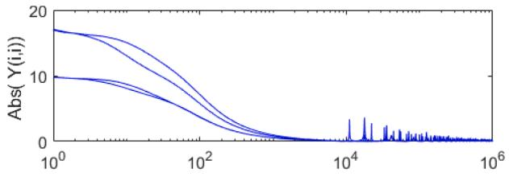

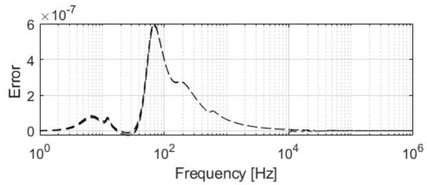  
Fig. 7. Top graph: Magnitude of diagonals of the original (solid curve) and modified (dotted curve) transfer admittance between 1 Hz to 1 MHz; Bottom graph: Difference between actual and modified transfer admittance.

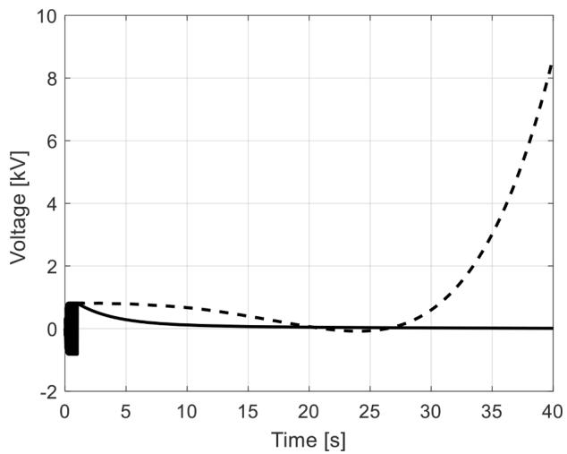  
Fig. 8. The receiving-end voltage of phase A (Solid line: with passivity enforcement; dotted line: without passivity enforcement).

grounded through a 0.01 Ω resistance.

The receiving-end voltage is compared with a solution obtained via Numerical Laplace Transform (NLT) technique [12] (see Fig 10). The time domain results from the simulation show a close agreement with the NLT. This demonstrates the accuracy of the proposed passivity enforcement algorithm.

# 4.2. Application example II

In this section, the passivity enforcement method is demonstrated with an example having two cable circuits in parallel. The horizontal distance between the circuits is 1.0 m and between the cables is 0.2 m (flat configuration). The depth of the cables is 2.0 m. The cable system data is shown in Table III.

The plot of eigenvalues of the Hermittian matrix is shown in Fig. 11. It can be seen that the passivity is successfully enforced and there are no negative eigenvalues after the passivity enforcement procedure.

Two filters are added to compensate for passivity violations and the filter parameters are as shown in Table IV.

In this example, all conductors of the cable system are kept open. The first conductor of the sending-end is energized with step voltage with initial ramp. The time step is 1.0 µs and the length of the simulation is

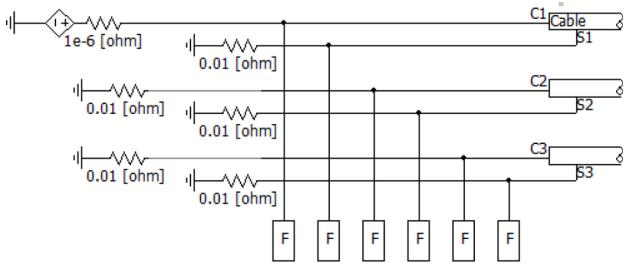

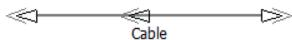

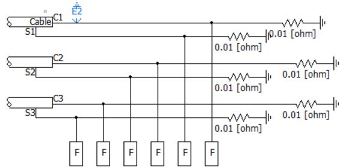  
Fig. 9. Short circuit configuration for the cable system.

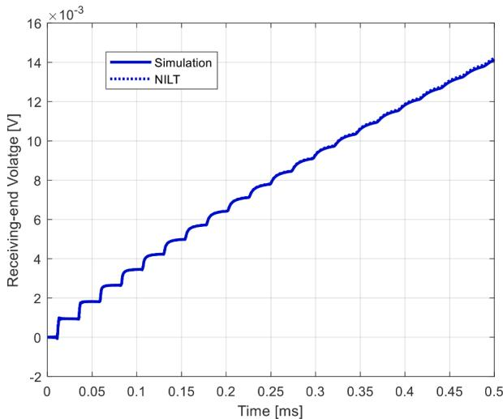  
Fig. 10. The receiving-end voltage of phase A (Solid line: time domain simulation with passivity enforcement; dotted line: NLT solution without filters).

Table III   
Transmission line data.   

<table><tr><td colspan="2">Cable data</td></tr><tr><td>Conductor Outer Radius</td><td>0.030 m</td></tr><tr><td>Inner Ins. Outer Radius</td><td>0.056 m</td></tr><tr><td>Sheath Outer Radius</td><td>0.060 m</td></tr><tr><td>Outer Ins. Outer Radius</td><td>0.065 m</td></tr><tr><td>Inner Ins. Capacitance</td><td>0.205 uF/km</td></tr><tr><td>Outer Ins. Relative Permittivity</td><td>2.3</td></tr><tr><td>Conductor Resistivity</td><td>1.7241e-08 Ωm</td></tr><tr><td>Sheath Resistivity</td><td>2.8264e-08 Ωm</td></tr><tr><td>Outer Ins. Relative Permittivity</td><td>2.3</td></tr><tr><td colspan="2">Other</td></tr><tr><td>Ground resistivity</td><td>100 Ωm</td></tr><tr><td>Length of the line</td><td>10 km</td></tr><tr><td>Shunt conductance</td><td>1.0e-9 Ohms.m</td></tr></table>

0.1 s. The voltage at the first conductor of the receiving-end is observed. Figs. 12 and 13 show voltage waveforms with and without the proposed passivity enforcement algorithm, respectively. With passive filters, the

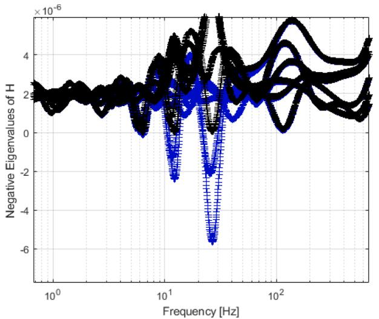  
Fig. 11. Eigenvalues of Hemittian matrix H (dotted lines: without filters; solid lines: with filters).

Table IV Passive filter data.   

<table><tr><td>F0(Hz)</td><td>λ0</td><td>R(Ω)</td><td>L(H)</td><td>C(F)</td></tr><tr><td>26.7353</td><td>5.6527e-06</td><td>176890.0166</td><td>2580.2026</td><td>1.3735e-08</td></tr><tr><td>12.2749</td><td>2.1085e-06</td><td>474221.4298</td><td>21457.765</td><td>7.8347e-09</td></tr></table>

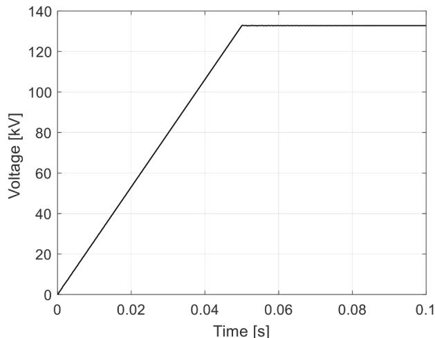  
Fig. 12. Receiving-end voltage of core-conductor of first cable with passivity enforcement.

voltage waveform is stable.

# 5. CONCLUSION

This paper proposes an improved filter-based passivity enforcement algorithm to ensure the stability of transmission line models in EMTtype software. The inclusion of adequate shunt conductance and the use of accurate earth return formula can enhance the condition of passivity at very low and very high frequencies respectively. The remaining passivity violations (generated by curve-fitting procedure) are eliminated by adding RLC, RC or RL series filters. The band-pass filter eliminates passivity violations with improved quality factor estimation. The physical characteristics of the low- and high-pass filters are enforced.

Numerical results show that the stability of the time domain

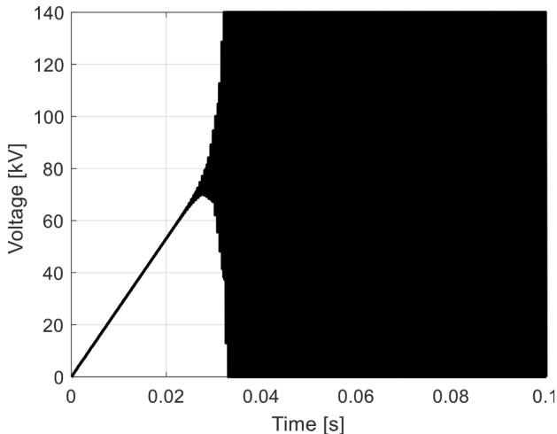  
Fig. 13. Receiving-end voltage of core-conductor of first cable without passivity enforcement.

simulations involving a three-phase underground cable system can be ensured using the proposed method. This method can be easily implemented in EMT-type software to improve stability of the transmission line models.

# CRediT authorship contribution statement

H.M. Jeewantha De Silva: Conceptualization, Methodology, Validation, Writing - original draft. Mohammad Shafieipour: Writing - review & editing.

# Declaration of Competing Interest

The authors declare that they have no known competing financial interests or personal relationships that could have appeared to influence the work reported in this paper.

# References

[1] L.M Wedepohl, Application of matrix methods to the solution of traveling wave phenomena in polyphase systems, Proc. IEE 110 (1963) 2200–2212.   
[2] A. Morched, B. Gustavsen, M. Tartibi, A universal model for accurate calculation of electromagnetic transients on overhead lines and underground cables, IEEE Trans. Power Deliv. 14 (3) (1999).   
[3] B. Gustavsen, A. Semlyen, Simulation of transmission line transients using vector fitting and modal decomposition, IEEE Trans Power Deliv. 13 (2) (1998).   
[4] H.M.J. De Silva, A.M. Gole, J.E. Nordstrom, L.M. Wedepohl, Robust passivity enforcement scheme for time-domain simulation of multi-conductor transmission lines and cables, IEEE Trans. Power Deliv. 25 (2) (2010) 930–938.   
[5] B. Gustavsen, Enforcing passivity for admittance matrices approximated by rational functions, IEEE Trans. Power Syst. 16 (1) (2001).   
[6] C. Chen, D. Saraswat, E. Gad, M. Nakhla, R. Achar, M.C.E. Yagoub, Passivity enforcement for method of characteristics-based macromodels, in: Proceedings of the International Symposium on Signals, Systems and Electronics (ISSSE), Montreal, Canada, 2007.   
[7] C. Chen, D. Saraswat, E. Gad, M. Nakhla, R. Achar, M.C.E. Yagoub, Passivity enforcement for method of characteristics-based multiconductor transmission line macromodels”, signals, systems and electronics, 2007, in: Proceeding of the ISSSE ’07. International Symposium, 2007, pp. 25–28, 30 20072.   
[8] A. Chinea, S. Grivet-Talocia, A passivity enforcement scheme for delay-based transmission line macromodels”, microwave and wireless components letters, IEEE 17 (8) (2007) 562–564.   
[9] D. Shu, X. Xie, Z. Yan, V. Dinavahi, A two-layer network equivalent with local passivity compensation with applications to hybrid simulations of MMC-based AC–DC grids, IEEE Trans. Power Syst. 34 (6) (2019) 4514–4524.   
[10] B. Gustavsen, Passivity enforcement for transmission line models based on the method of characteristics, IEEE Trans. Power Deliv. 23 (4) (2008) 2286–2293. Oct.   
[11] "PSCAD/EMTDC manual, ", Manitoba Hydro International ltd., 2020. Available: htt ps://hvdc.ca/pscad/ [Accessed 16].   
[12] P. Moreno, A. Ramirez, Implementation of the numerical laplace transform: a review task force on frequency domain methods for emt studies, working group on modeling and analysis of system transients using digital simulation, general

systems subcommittee, ieee power engineering society,, IEEE Trans. Power Deliv. 23 (4) (2008) 2599–2609.

# Further Reading

[11] C. Chen, E. Gad, R. Achar, Passivity verification in delay-based macromodels of multiconductor electrical interconnects, IEEE Trans. Circuit Syst. 52 (2005).

[12] H. Xue, A. Ametani, J. Mahseredjian, Y. Baba, F. Rachidi, I. Kocar, Transient responses of overhead cables due to mode transition in high frequencies, IEEE Trans Electromagn. Compat. 60 (3) (2018) 785–794.