# 基于广义特征根的MMC-HVDC系统高频振荡分析及抑制策略

张 芳，姚文鹏，张紫菁

（天津大学 智能电网教育部重点实验室，天津 300072）

摘要：基于模块化多电平换流器的高压直流输电（ - ）的长链路延时引发的高频振荡严重威胁了电力系统的安全稳定运行。采用时滞稳定裕度衡量 - 系统的高频稳定性，建立了 - 时滞系统的高阶状态空间模型，应用基于广义特征根的时滞系统稳定性分析方法直接求解 - 系统的时滞稳定裕度，并分析了控制器参数对系统高频稳定性的影响。将 - 系统链路延时对系统高频稳定性的影响等效为外部干扰，通过混合灵敏度优化设计了基于 鲁棒控制的 - 系统高频振荡抑制策略。通过MMC-HVDC电磁暂态仿真，验证了基于广义特征根的时滞系统稳定性分析方法求解系统时滞稳定裕度的有效性以及基于 鲁棒控制的高频振荡抑制策略的优越性，为研究 - 系统的高频振荡及抑制策略提供了一种新思路。

关键词：MMC-HVDC；高频振荡；广义特征根；H 鲁棒控制；振荡抑制

中图分类号：TM 712；TM 721.1

文献标志码：A

DOI：10.16081/j.epae.202206018

# 0 引言

模块化多电平换流器（MMC）凭借其输出谐波含量少、模块化程度高、开关频率低等优势在柔性直流输电领域得到了广泛应用［1⁃2］ 。随着基于模块化多电平换流器的高压直流输电（MMC-HVDC）工程的推进，国内外发生了多起由链路延时引发的高频振荡事故，例如 年鲁西直流输电工程发生了的高频振荡， 年渝鄂背靠背柔性直流输电工程在空载加压调试中，渝、鄂两侧分别发生了和 的高频振荡事故［3⁃5］ 。 -系统的高频振荡进一步降低了电力电子器件的使用寿命，对交流电网造成了严重冲击。因此，研究- 系统的高频振荡机理和振荡抑制策略具有重要的理论和工程意义。

目前，相关研究学者们主要采用阻抗分析法和特征值法解释 - 系统的高频振荡机理。文献［ ］基于鲁西直流输电工程，建立了仅考虑电流内环控制和链路延时的 简化阻抗模型，采用波特图解释了 - 系统的高频振荡事故。文献［］基于渝鄂背靠背柔性直流输电工程，建立了dq坐标系下 的详细阻抗模型，采用波特图解释了渝、鄂两侧不同频次的高频振荡事故。特征值法需要建立 - 系统的状态空间模型，但是链路延时使得特征方程为超越方程，故无法通过传统方式直接求解雅可比矩阵的特征值。文献［ ］应用 近似等效 - 系统的链路延时，

将链路延时这一超越项用有理多项式表示，将超越方程转化为普通的有理方程，通过特征值轨迹分析了控制器参数和链路延时对 - 系统高频稳定性的影响。文献［］采用了 变换处理MMC-HVDC系统的延时项，根据劳斯表寻找系统的纯虚特征根，应用纯虚特征根对应的时滞稳定裕度分析了电流内环控制、锁相环（ ）控制以及功率传输水平对MMC-HVDC系统高频稳定性的影响。基于上述研究可知，特征值法需要对延时环节进行等效变换。 近似为一种有差变换，而且其会额外引入状态方程，增加模型的复杂程度，额外引入的状态方程产生的新特征根可能会与原有特征根产生交互影响； 变换在寻找纯虚特征根的过程中需要频繁计算劳斯表，计算量较大。MMC-HVDC系统可视为单一时滞系统，可以采用时滞系统稳定性分析方法研究 - 时滞系统的稳定性。文献［］提出的基于广义特征根的时滞系统稳定性分析方法，无需对延时项进行处理，通过构造矩阵、求解广义特征根直接求解系统的时滞稳定裕度和临界振荡频率，避免了寻找临界值的反复迭代过程，具有较强的应用性，但是尚未应用到 - 系统的高频稳定性分析中。

- 系统的高频振荡抑制策略一般通过改进电流内环控制策略实现换流站的阻抗重塑，达到抑制系统高频振荡的目的。文献［］提出在电网电压前馈回路串联低通滤波器的高频振荡抑制策略，但是并未给出滤波器的参数选取依据。文献［ ］在电网电压前馈回路串入非线性滤波器，改善了渝鄂背靠背柔性直流输电工程在中高频段的阻抗

特性，有效降低了MMC-HVDC系统的高频振荡风险。文献［ ］将公共耦合点（ ）电压经过三阶滤波器滤波后反馈回电流内环控制回路中，矫正了换流站阻抗在多个频段的相位裕度，有效抑制了系统的高频振荡。MMC-HVDC系统发生高频振荡时， $d q$ 轴电流呈现出直流分量叠加特定频率高频分量的形式，其中高频分量是由系统的链路延时引起的，因此可将链路延时对系统的影响等效为一个外部输入干扰，抑制干扰即抑制MMC-HVDC系统的高频振荡。 $\mathrm { H } _ { \infty }$ 鲁棒控制器具有良好的干扰抑制能力和鲁棒稳定性，在单相脉宽调制整流器［12］ 、光伏发电系统［13］ 、微电网频率控制［14⁃15］ 、直流配电系统［16］等领域得到了广泛应用并表现出良好的控制效果。

本文从 - 系统的时滞属性出发，建立了 - 时滞系统的状态空间模型，应用基于广义特征根的时滞系统稳定性分析方法分析 -系统的高频稳定性，该方法可直接求解 -系统的时滞稳定裕度及对应的临界振荡频率，避免了不断改变延时寻找时滞稳定裕度的反复迭代过程。将 - 链路延时对系统的影响等效为外部干扰，提出了基于 $\mathrm { H } _ { \infty }$ 鲁棒控制的 -系统高频振荡抑制策略。本文所做工作为研究柔性直流输电工程的高频振荡和振荡抑制策略提供了新思路。

# - 系统模型及控制

- 系统的主电路及控制见附录 图$\mathrm { A } 1 _ { \mathrm { ~ ( ~ } }$ 。 - 系统换流站级控制采用 $d q$ 同步旋转坐标系下的双闭环比例积分（ ）控制策略，环流抑制采用 控制策略。实际柔性直流输电工程中，电气量采样、极控、阀控、调制、子模块开关动作等延时环节共同组成了 - 系统的总链路延时［3］。借鉴现有 MMC-HVDC 时滞系统总链路延时的处理方式，本文用 $G _ { \mathrm { d } } \mathcal { \mathrm { F } }$ 节模拟 - 系统的总链路延时［7⁃8］，且 $G _ { \mathrm { d } } { = } \mathrm { e } ^ { - \tau s }$ ，其中 $\tau$ 为系统总链路延时。本文重点研究整流站与交流系统之间的高频振荡，故假设逆变站采用定直流电压控制使直流电压保持恒定。

# 换流站模型

换流站单相拓扑结构见附录 图 。根据图 和图 建立了换流站桥臂等效电容电压、桥臂环流和交流电流的微分状态方程，见附录 式（ ）—（ ）。

# 控制系统模型

由现有研究可知，功率外环控制几乎不影响- 系统的高频振荡［3⁃8］ 。因此，本文中控制器的建模包含电流内环、环流抑制和锁相环控制器。

）电流内环控制： $d , q$ 轴电流内环 控制器各

引入 1 个状态变量 $x _ { \mathrm { i n } d }$ 和 $x _ { \mathrm { i n } q ^ { \mathrm { O } } }$ 。对应的微分状态方程为：

$$
\left\{ \begin{array}{l} \frac {\mathrm {d} x _ {\text {i n d}}}{\mathrm {d} t} = i _ {\text {d r e f}} - i _ {\text {c d}} \\ \frac {\mathrm {d} x _ {\text {i n q}}}{\mathrm {d} t} = i _ {\text {q r e f}} - i _ {\text {c q}} \end{array} \right. \tag {1}
$$

d、 $\cdot \boldsymbol { q }$ 轴电流内环控制代数方程为：

$$
\left\{ \begin{array}{l} u _ {\mathrm {v d}} = G _ {\mathrm {d}} \left[ u _ {\mathrm {t d}} + \omega_ {0} L _ {\mathrm {e q}} i _ {\mathrm {c q}} - k _ {\text {p i n d}} \left(i _ {\mathrm {d r e f}} - i _ {\mathrm {c d}}\right) - k _ {\mathrm {i i n d}} x _ {\mathrm {i n d}} \right] \\ u _ {\mathrm {v q}} = G _ {\mathrm {d}} \left[ u _ {\mathrm {t q}} - \omega_ {0} L _ {\mathrm {e q}} i _ {\mathrm {c d}} - k _ {\text {p i n q}} \left(i _ {\mathrm {q r e f}} - i _ {\mathrm {c q}}\right) - k _ {\mathrm {i i n q}} x _ {\mathrm {i n q}} \right] \end{array} \right. \tag {2}
$$

式中： $: i _ { \mathrm { c } d } \setminus i _ { \mathrm { c } q }$ 分别为MMC交流电流的 $d , q$ 轴分量； $; i _ { d \mathrm { r e f } } .$ 、$i _ { \mathrm { q r e f } }$ 分别为 MMC 交流电流 $d , q$ 轴分量的参考值； $; u _ { \mathrm { v } d } \mathrm { ~ . ~ }$ 、$u _ { \mathrm { v } q }$ 分别为调制点电压的 $d , q$ 轴分量； $\boldsymbol { u } _ { { \scriptscriptstyle \mathrm { t } } d } \setminus \boldsymbol { u } _ { { \scriptscriptstyle \mathrm { t } } q }$ 分别为PCC电压的 $d , q$ 轴分量 ${ \sf \Omega } ; k _ { \mathrm { p i n } d } , k _ { \mathrm { i n } d }$ 分别为d轴电流内环PI控制器的比例系数、积分系数； $k _ { \mathrm { p i n } q } \hphantom { } _ { \mathrm { } } \cdot k _ { \mathrm { i n } q } \mathcal { D }$ 别为 $q$ 轴电流内环 控制器的比例系数、积分系数； $\omega _ { 0 }$ 为额定角频率。

2）环流抑制： ${ ; d , q }$ 轴环流抑制各引入1个状态变量 $x _ { \mathrm { c i r } d }$ 和 $x _ { \mathrm { c i r } q } \circ$ 。对应的微分状态方程为：

$$
\left\{ \begin{array}{l} \frac {\mathrm {d} x _ {\text {c i r d}}}{\mathrm {d} t} = i _ {\text {c i r d r e f}} - i _ {\text {c i r d}} \\ \frac {\mathrm {d} x _ {\text {c i r q}}}{\mathrm {d} t} = i _ {\text {c i r q r e f}} - i _ {\text {c i r q}} \end{array} \right. \tag {3}
$$

d、 $\cdot \boldsymbol { q }$ 轴环流抑制代数方程为：

$$
\left\{ \begin{array}{l} u _ {\text {c i r d}} = G _ {\mathrm {d}} \left[ k _ {\text {p c i r d}} \left(i _ {\text {c i r d r e f}} - i _ {\text {c i r d}}\right) + k _ {\text {i c i r d}} x _ {\text {c i r d}} - 2 \omega_ {0} L _ {\mathrm {a}} i _ {\text {c i r q}} \right] \\ u _ {\text {c i r q}} = G _ {\mathrm {d}} \left[ k _ {\text {p c i r q}} \left(i _ {\text {c i r q r e f}} - i _ {\text {c i r q}}\right) + k _ {\text {i c i r q}} x _ {\text {c i r q}} + 2 \omega_ {0} L _ {\mathrm {a}} i _ {\text {c i r d}} \right] \end{array} \right. \tag {4}
$$

式中： $i _ { \mathrm { c i r } d \mathrm { r e f } } \setminus i _ { \mathrm { c i r } q \mathrm { r e f } }$ 分别为 $d , q$ 轴环流抑制参考值； $i _ { \mathrm { c i r } d } \setminus$ 、$i _ { \mathrm { c i r } q }$ 分别为 2 倍频桥臂环流的 $d , q$ 轴分量 ${ \ \vdots u _ { \mathrm { c i r } d } } \setminus u _ { \mathrm { c i r } q }$ 分别为环流抑制修正量的 $d , q$ 轴分量； $k _ { \mathrm { p c i r } d } \mathrm { , } k _ { \mathrm { i c i r } d }$ 分别为$d$ 轴环流抑制PI控制器的比例系数、积分系数； $\ d _ { ; } k _ { \mathrm { p c i r } q } .$ 、$k _ { \mathrm { i c i r } q }$ 分别为 $q$ 轴环流抑制PI控制器的比例系数、积分系数； $L _ { \mathrm { a } }$ 为桥臂电感。

3）锁相环控制：锁相环采用经典的PCC d轴电压定向的控制结构，见附录 图 。

锁相环包含 个积分环节，引入 个状态变量$x _ { \mathrm { u t } q }$ 和 $x _ { \mathrm { p l l } }$ 。对应的微分状态方程为：

$$
\left\{ \begin{array}{l} \frac {\mathrm {d} x _ {\mathrm {u t} q}}{\mathrm {d} t} = u _ {\mathrm {t} q} \\ \frac {\mathrm {d} x _ {\mathrm {p l l}}}{\mathrm {d} t} = k _ {\mathrm {p p l l}} u _ {\mathrm {t} q} + k _ {\mathrm {i p l l}} x _ {\mathrm {u t} q} \end{array} \right. \tag {5}
$$

式中： $k _ { \mathrm { p p l l } }$ 和 $k _ { \mathrm { i p l l } }$ 分别为锁相环 PI 控制器的比例系数和积分系数。

锁相环代数方程为：

$$
\omega_ {2} = \omega_ {0} + k _ {\mathrm {p p l}} u _ {\mathrm {t q}} + k _ {\mathrm {i p l}} x _ {\mathrm {u t q}} \tag {6}
$$

式中： $: \omega _ { 2 }$ 为锁相环输出的角频率。

# 交流系统模型

实际柔性直流输电工程运行工况的变化可能会

导致交流系统呈现如附录A图A1所示的形式［3］ 。

对交流系统阻感支路列写微分状态方程并将其变换到 $d q$ 坐标系下，如式（7）所示。

$$
\left\{ \begin{array}{l} L _ {\mathrm {s}} \frac {\mathrm {d} i _ {\mathrm {L 1 d}}}{\mathrm {d} t} = u _ {\mathrm {c s} d} + i _ {\mathrm {c d}} R _ {\mathrm {c}} - i _ {\mathrm {L 1 d}} \left(R _ {\mathrm {c}} + R _ {\mathrm {s}}\right) + \omega_ {2} L _ {\mathrm {s}} i _ {\mathrm {L 1 q}} \\ L _ {\mathrm {s}} \frac {\mathrm {d} i _ {\mathrm {L 1 q}}}{\mathrm {d} t} = u _ {\mathrm {c s} q} + i _ {\mathrm {e q}} R _ {\mathrm {c}} - i _ {\mathrm {L 1 q}} \left(R _ {\mathrm {c}} + R _ {\mathrm {s}}\right) - \omega_ {2} L _ {\mathrm {s}} i _ {\mathrm {L 1 d}} \end{array} \right. \tag {7}
$$

式中： $: u _ { \mathrm { c s } d } \setminus u _ { \mathrm { c s } q }$ 分别为阻容支路中电容电压的 $d , q$ 轴分量； $\vdots \dot { \iota } _ { \mathrm { L } 1 d } \setminus \dot { \iota } _ { \mathrm { L } 1 q }$ 分别为阻感支路电流的 $d , q$ 轴分量； $R _ { \mathrm { c } }$ 为交流系统阻容支路电阻； $R _ { \mathrm { s } } \ : , L _ { \mathrm { s } }$ 分别为交流系统阻感支路电阻、电感。

对交流系统阻容支路列写微分状态方程并将其变换到 $d q$ 坐标系下，如式（8）所示。

$$
\left\{ \begin{array}{l} C _ {\mathrm {s}} \frac {\mathrm {d} u _ {\mathrm {c s d}}}{\mathrm {d} t} = i _ {\mathrm {c d}} - i _ {\mathrm {L 1 d}} + \omega_ {2} C _ {\mathrm {s}} u _ {\mathrm {c s q}} \\ C _ {\mathrm {s}} \frac {\mathrm {d} u _ {\mathrm {c s q}}}{\mathrm {d} t} = i _ {\mathrm {c q}} - i _ {\mathrm {L 1 q}} - \omega_ {2} C _ {\mathrm {s}} u _ {\mathrm {c s d}} \end{array} \right. \tag {8}
$$

式中： $: C _ { \mathrm { s } }$ 为交流系统阻容支路电容。

交流系统电压和PCC电压在 $d q$ 坐标系下的数学关系如式（）所示。

$$
\left\{ \begin{array}{l} u _ {\mathrm {s d}} = u _ {\mathrm {c s d}} + \left(i _ {\mathrm {c d}} - i _ {\mathrm {L 1 d}}\right) R _ {\mathrm {c}} + u _ {\mathrm {t d}} \\ u _ {\mathrm {s q}} = u _ {\mathrm {c s q}} + \left(i _ {\mathrm {c q}} - i _ {\mathrm {L 1 q}}\right) R _ {\mathrm {c}} + u _ {\mathrm {t q}} \end{array} \right. \tag {9}
$$

式中： $\boldsymbol { u } _ { \mathrm { s } d } , \boldsymbol { u } _ { \mathrm { s } q }$ 分别为交流系统电网电压的 $d , q$ 轴分量。

# 1.4 MMC-HVDC时滞系统模型的小扰动数学模型

综合 节和 节列写的微分 代数方程，可将- 时滞系统的数学模型整合如下：

$$
\left\{ \begin{array}{l} \dot {\boldsymbol {x}} = \boldsymbol {f} \left(\boldsymbol {x}, \boldsymbol {x} _ {\tau}, \boldsymbol {y}, \boldsymbol {y} _ {\tau}\right) \\ 0 = \boldsymbol {g} \left(\boldsymbol {x}, \boldsymbol {x} _ {\tau}, \boldsymbol {y}, \boldsymbol {y} _ {\tau}\right) \end{array} \right. \tag {10}
$$

式中： $\boldsymbol { x } = \big [ u _ { \mathrm { c p 0 } } , u _ { \mathrm { c p } d } , u _ { \mathrm { c p } q } , u _ { \mathrm { c p } d 2 } , u _ { \mathrm { c p } q 2 } , i _ { \mathrm { c } d } , i _ { \mathrm { c } q } , i _ { \mathrm { c } \mathrm { i r 0 } } , i _ { \mathrm { c } \mathrm { i r 0 } } , i _ { \mathrm { c } \mathrm { i r } q } , i _ { \mathrm { c } \mathrm { i } \mathrm { r } q } ,$ ，$x _ { \mathrm { i n } d } , x _ { \mathrm { i n } q } , x _ { \mathrm { u t } q } , x _ { \mathrm { p l l } } , x _ { \mathrm { c i r } d } , x _ { \mathrm { c i r } q } , i _ { \mathrm { L l } d } , i _ { \mathrm { L l } q } , u _ { \mathrm { c s } d } , u _ { \mathrm { c s } q } \big ] ^ { \mathrm { T } }$ ，为由状态变量构成的向量，y=［u d，u q，u d，u q，ω ，u d，u q，u d， $y = \lfloor u _ { \mathrm { v } d } , u _ { \mathrm { v } q } , u _ { \mathrm { c i r } d } , u _ { \mathrm { c i r } q } , \omega _ { 2 } , u _ { \mathrm { s } d } , u _ { \mathrm { s } q } , u _ { \mathrm { t } d } ,$ $u _ { \mathrm { t } q } ^ { \mathrm { ~ \tiny ~ J ~ T ~ } }$ ，为由代数变量构成的向量，向量x和 $y \not \subseteq$ 各变量的含义见上文和附录 $\mathrm { A } ; \pmb { x } _ { \tau }$ 和 $\pmb { y } _ { \tau }$ 分别为由时滞状态变量构成的向量和时滞代数变量构成的向量，即$\mathbf { x } _ { \tau } { = } { \mathbf { x } } \left( { t } { - } \tau \right) , { \mathbf { y } } _ { \tau } { = } { \mathbf { y } } \left( { t } { - } \tau \right)$ 。

通过代数方程消去微分状态方程中的代数变量，得到仅包含状态变量的微分方程组，如式（ ）所示。

$$
\dot {\boldsymbol {x}} = f \left(\boldsymbol {x}, \boldsymbol {x} (t - \tau)\right) \tag {11}
$$

在系统平衡点处线性化，得到 - 时滞系统的小扰动微分状态方程组，如式（ ）所示。

$$
\Delta \dot {\boldsymbol {x}} = \boldsymbol {A} _ {0} \Delta \boldsymbol {x} + \boldsymbol {A} _ {1} \Delta \boldsymbol {x} (t - \tau) \tag {12}
$$

式中： $\Delta \ v { x }$ 为状态变量x的小扰动量； ${ \bf ; } A _ { 0 }$ 和 $A _ { 1 }$ 分别为无时滞状态变量的雅可比矩阵和时滞状态变量的雅可比矩阵。

# 2 基于广义特征根的MMC-HVDC时滞系统稳定性分析方法

# 2.1 基于广义特征根的时滞系统稳定性分析方法

式（12）的特征方程如式（13）所示。

$$
\det \left(s I - A _ {0} - A _ {1} \mathrm {e} ^ {- \tau s}\right) = 0 \tag {13}
$$

式中：det（·）表示计算矩阵（·）的行列式；I为单位矩阵。

根据特征根位于复平面的位置，可判断系统的稳定性。不断调整延时时间τ的值，直至系统存在从复平面左半平面穿越虚轴的特征根，此时的延时时间即为 - 系统的时滞稳定裕度。但是特征方程中的延时项 $\mathrm { e } ^ { - \tau s }$ 为超越项，无法直接求解特征方程的特征根。本文采用文献［9］提出的基于广义特征根的时滞系统稳定性分析方法，通过构造矩阵、求解广义特征根直接得到MMC-HVDC系统的时滞稳定裕度，避免不断改变延时τ寻找时滞稳定裕度的反复迭代过程。

以式（ ）所示的线性定常时滞系统为例，基于广义特征根的时滞系统稳定性分析方法简述如下。

$$
\dot {\boldsymbol {x}} ^ {\prime} (t) = \boldsymbol {A} _ {0} ^ {\prime} \boldsymbol {x} ^ {\prime} (t) + \sum_ {k = 1} ^ {m} \boldsymbol {A} _ {k} ^ {\prime} \boldsymbol {x} ^ {\prime} (t - k \tau) \tag {14}
$$

式中： $A _ { 0 } ^ { \prime }$ 和 $A _ { k } ^ { \prime } ( k { = } 1 , 2 , \cdots , m )$ ）分别为线性定常时滞系统的无时滞状态变量和时滞状态变量的系数矩阵，$m$ 为延时个数 $\vdots { x } ^ { \prime }$ 为n维状态向量。

假设式（14）在 $\scriptstyle \tau = 0$ 时稳定，定义矩阵 $\pmb { { \cal B } } _ { l } \in \mathbf { R } ^ { n ^ { 2 } \times n ^ { 2 } }$ ，$l { = } 0 , 1 , \cdots , 2 m$ ，其中 $B _ { { \scriptscriptstyle m } } = A _ { 0 } ^ { \prime } \oplus A _ { { \scriptscriptstyle 0 } } ^ { \prime \mathrm { { T } } } , B _ { { \scriptscriptstyle m - k } } = I \otimes A _ { { \scriptscriptstyle k } } ^ { \prime \mathrm { { T } } } , B _ { { \scriptscriptstyle m + k } } =$ $A _ { k } ^ { \prime } \otimes I ( k { = } 1 , 2 , \cdots , m , \oplus . \otimes$ 分别表示克罗内克和运算、克罗内克积运算），n为该时滞系统微分状态方程的维数［9］ 。

构造矩阵U和V，如式（ ）所示。

$$
\boldsymbol {U} = \left[ \begin{array}{l l l l} \boldsymbol {I} & 0 & 0 & 0 \\ 0 & \ddots & 0 & 0 \\ 0 & 0 & \boldsymbol {I} & 0 \\ 0 & 0 & 0 & \boldsymbol {B} _ {2 m} \end{array} \right], \quad \boldsymbol {V} = \left[ \begin{array}{c c c c} 0 & \boldsymbol {I} & \dots & 0 \\ \vdots & \vdots & \ddots & \vdots \\ 0 & 0 & \dots & \boldsymbol {I} \\ - \boldsymbol {B} _ {0} & - \boldsymbol {B} _ {1} & \dots & - \boldsymbol {B} _ {2 m - 1} \end{array} \right] \tag {15}
$$

式中： $U { \in } \mathbf { R } ^ { 2 m n ^ { 2 } \times 2 m n ^ { 2 } } , V { \in } \mathbf { R } ^ { 2 m n ^ { 2 } \times 2 m n ^ { 2 } }$ ，矩阵对(V，U)的广义特征根集合为 ${ \sigma } ( V , U ) = \{ { \lambda } _ { i } { ( V , U ) } | i = 1 , 2 , \cdots , q ; q = $ $\operatorname { r a n k } ( U ) \}$ ，其中rank（·）表示求矩阵（·）的秩。设C表示复数集合，当满足下述条件之一时，系统是时滞独立稳定的，即时滞稳定裕度 $\tau _ { \mathrm { w d } } = + \infty ,$ 。

1） $\sigma ( V , U ) \cap \partial D { = } \emptyset$ ，其 中 $D = \left\{ s | s \in C , | s | < 1 \right\}$ ，∂表示边界。  
2）记 $\scriptstyle \lambda = \sigma ( V , U ) \cap \supset D = \{ | z _ { i } | = 1 | i = 1 , 2 , \cdots , f ; f { \leqslant } q \}$ ，其中 $f$ 为广义特征根中模为 的广义特征根的数量。若 $\varLambda \neq \emptyset$ ，即系统存在模为 的广义特征根 $z _ { i }$ ，但是对于所有的 $z _ { i } \in \varLambda$ 均满足 $\xi \left( \sum _ { k = 0 } ^ { m } A _ { k } ^ { \prime } z _ { i } ^ { k } \right) = \{ 0 \} , \xi ( \cdot )$ 为由矩阵

（·）的所有特征根组成的集合。

当上述2个条件均不满足时，系统是时滞依赖稳定的。由于线性定常均匀时滞系统的特征方程系数均为实数，特征根满足共轭对称性，故只需寻找位于虚轴正半轴的纯虚特征根，根据式（ ）求解时滞系统的时滞稳定裕度。

$$
\tau_ {\mathrm {w d}} = \min  _ {1 \leqslant i \leqslant 2 m n ^ {2}} \frac {\theta_ {i}}{\tilde {\omega} _ {i}} \tag {16}
$$

式中：θ ∈[ 0，2π]，且 $\mathrm { e } ^ { - \mathrm { j } \theta _ { i } } \in \sigma \left( V , U \right) ; \tilde { \omega } _ { i } \in \mathbf { R } ^ { + }$ （R+ 为 正 实数集），且 $\mathbf { j } \tilde { \omega } _ { i } { \in } \boldsymbol { \xi } \left( \sum _ { k = 0 } ^ { m } A _ { k } ^ { \prime } \mathrm { e } ^ { - \mathrm { j } k \theta _ { i } } \right) ,$ m 。

本文从 - 系统的时滞属性出发，应用基于广义特征根的时滞系统稳定性分析方法计算- 系统的时滞稳定裕度，该方法的证明过程见文献［］。

# - 系统时滞稳定裕度的求解步骤

根据 - 系统的状态空间模型和基于广义特征根的时滞系统稳定性分析方法， -HVDC 系 统 的 时 滞 稳 定 裕 度 求 解 步 骤 见 附 录 A图A4。

本文应用基于广义特征根的时滞系统稳定性分析方法计算MMC-HVDC系统的时滞稳定裕度，无需对延时项 -τs 进行变换处理，直接求得 -系统的时滞稳定裕度和临界振荡频率，避免了寻找时滞稳定裕度的反复迭代过程，为 - 时滞系统的高频稳定性分析提供了一种新思路。

# - 时滞系统高频振荡影响因素分析

# - 系统参数

在PSCAD／EMTDC仿真平台中搭建了如附录图 所示的双端 - 系统电磁暂态仿真模型，其中系统参数和控制器参数分别见附录B表B1和表B2。

下面按照 节中的时滞稳定裕度求解步骤计算控制器参数变化时 - 系统的时滞稳定裕度和临界振荡频率，进而分析控制器参数对- 系统高频稳定性的影响。

# 电流内环控制参数对系统高频稳定性的影响

电流内环比例系数对系统高频稳定性的影响

仅改变表 中的电流内环比例系数，以 为步长，从 增大到 ， - 系统的时滞稳定裕度和临界振荡频率如表 所示。由表可见，随着电流内环比例系数的增大，系统的时滞稳定裕度显著降低，临界振荡频率显著增大。由此可知，电流内环比例系数对 - 系统的高频稳定性有着重要影响，增大电流内环比例系数将显著增加 - 系

统高频振荡风险，因此实际柔性直流输电工程中应尽可能采用较小的电流内环比例系数。

表1 电流内环比例系数对时滞稳定裕度的影响  
Table 1 Influence of proportional coefficient of current inner loop on time-delay stability margin   

<table><tr><td>比例系数</td><td>τ=0是否稳定</td><td>时滞稳定 裕度 / μs</td><td>临界振荡 频率 / Hz</td></tr><tr><td>5</td><td>稳定</td><td>347.90</td><td>927.63</td></tr><tr><td>5.5</td><td>稳定</td><td>319.59</td><td>960.06</td></tr><tr><td>6</td><td>稳定</td><td>295.37</td><td>999.08</td></tr><tr><td>6.5</td><td>稳定</td><td>274.47</td><td>1043.96</td></tr><tr><td>7</td><td>稳定</td><td>256.26</td><td>1093.67</td></tr><tr><td>7.5</td><td>稳定</td><td>240.25</td><td>1147.11</td></tr><tr><td>8</td><td>稳定</td><td>226.07</td><td>1203.38</td></tr></table>

# 电流内环积分系数对系统高频稳定性的影响

仅改变表B2中的电流内环积分系数，以10为步长，从 增大到 ， - 系统的时滞稳定裕度和临界振荡频率见附录 表 。由表可见，变化电流内环积分系数基本不改变MMC-HVDC系统的时滞稳定裕度和临界振荡频率，因此在工程中可忽略其对 - 系统高频稳定性的影响。

# 3.3 锁相环参数对系统高频稳定性的影响

# 锁相环比例系数对系统高频稳定性的影响

仅改变表 中锁相环的比例系数，以 为步长，从 逐渐减小到 ， - 系统的时滞稳定裕度和临界振荡频率见附录 表 。由表可见，变化锁相环比例系数基本不改变MMC-HVDC系统的时滞稳定裕度和临界振荡频率，因此在工程中可忽略其对 - 系统高频稳定性的影响。

# 3.3.2 锁相环积分系数对系统高频稳定性的影响

仅改变表 中锁相环的积分系数，以 为步长，从100逐渐增大到160，MMC-HVDC系统的时滞稳定裕度和临界振荡频率见附录 表 。由表可见，锁相环积分系数由 增大到 ， -系统的时滞稳定裕度和临界振荡频率几乎不发生变化。

综上，锁相环控制参数几乎不影响 -系统的高频稳定性。

# 环流抑制参数对系统高频稳定性的影响

# 环流抑制比例系数对系统高频稳定性的影响

仅改变表 中的环流抑制比例系数，以 为步长，从 逐渐增大到 ， - 系统的时滞稳定裕度和临界振荡频率见附录 表 。由表可见，环流抑制比例系数的变化基本不改变 -系统的时滞稳定裕度和临界振荡频率，因此在工程中可忽略环流抑制比例系数对 - 系统高频稳定性的影响。

# 3.4.2 环流抑制积分系数对系统高频稳定性的影响仅改变表 中的环流抑制积分系数，以 为

步长，从10逐渐增大到70，MMC-HVDC系统的时滞稳定裕度和临界振荡频率见附录 表 。由表可见，环流抑制积分系数由10增大到70，MMC-HVDC系统的时滞稳定裕度和临界振荡频率几乎不发生变化。

综上，环流抑制参数几乎不影响MMC-HVDC系统的高频稳定性。

# 4 基于 $\mathrm { H } _ { \infty }$ 鲁棒控制的高频振荡抑制策略

由第 节的分析可知，电流内环比例系数对- 系统的高频稳定性有重要影响，改进电流内环控制是提高系统高频稳定性的有效方法，下文进一步分析电流内环控制。

由附录A图A1可知，以d轴控制为例，MMC换流站接收到的控制信号 $u _ { \mathrm { v } d }$ 与电流内环 PI 控制器生成的控制信号 $\boldsymbol { u } _ { \mathrm { v } d \mathrm { r e f } }$ 满足如下关系：

$$
u _ {v d} = \mathrm {e} ^ {- \tau s} u _ {v d r e f} = u _ {v d r e f} + u _ {v d r e f} (\mathrm {e} ^ {- \tau s} - 1) \tag {17}
$$

由式（ ）可知，电流内环控制框图可等效为如图 1 所示的形式。图中： $G \left( s \right) = 1 / \left( s L _ { \mathrm { e q } } + R _ { \mathrm { e q } } \right)$ 为 MMC忽略电感交叉耦合项后的数学模型；稳定运行时，$\omega _ { 0 } { = } \omega _ { 2 }$ 。

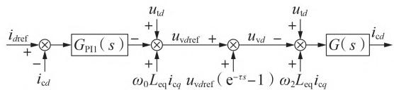  
图1 电流内环等效控制框图1  
Fig.1 Equivalent control block diagram 1 of current inner loop

根据自动控制理论，可将 $u _ { \mathrm { v } d \mathrm { r e f } } \big ( \mathrm { e } ^ { - \tau s } - 1 \big )$ 移动到输出端，图1进一步等效为图2。

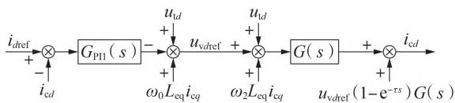  
图2 电流内环等效控制框图2  
Fig.2 Equivalent control block diagram 2 of current inner loop

将电流内环控制与 数学模型中的电网电压前馈项和电感交叉耦合项对消，将图 简化为图$3 \AA _ { \circ }$ 图中， $d = u _ { \mathrm { v } d \mathrm { r e f } } \big ( 1 - \mathrm { e } ^ { - \tau s } \big ) G \left( s \right)$ ，表征了由链路延时对- 系统输出电流造成的扰动。

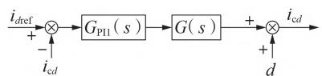  
图3 电流内环等效控制框图3  
Fig.3 Equivalent control block diagram 3 of current inner loop

由图3可知，MMC-HVDC系统可视为带有扰动的系统。当 - 系统链路延时较小时，在控制器的作用下，由链路延时引入的扰动对输出电流的影响较小，MMC-HVDC系统能够稳定运行；随着链路延时的增大，在 控制器的作用下，扰动d对输出电流的影响也随之增大，MMC-HVDC系统无法稳定运行，发生高频振荡。

基于上述分析可知，抑制 - 系统的高频振荡可通过抑制扰动d实现。 控制器无法抑制外部扰动d对输出电流的影响，故高频振荡风险较大 $\colon \mathrm { H } _ { \infty }$ 鲁棒控制器具有良好的扰动抑制能力，在设计阶段，充分考虑被控对象的模型误差、扰动信号以及高频摄动等不确定性因素，将性能指标转化为函数范数的约束条件设计 $\mathrm { H } _ { \infty } \frac { \hbar \hbar } { \boldsymbol { \Xi } }$ 棒控制器，可使系统达到期望的动态品质和稳态性能［17］ 。因此，本文在电流内环控制中引入 鲁棒控制器，抑制 -系统由链路延时引发的高频振荡。

# 4.1 标准 $\mathrm { H } _ { \infty }$ 控制

标准 $\mathrm { H } _ { \infty }$ 控制问题如图 所示。图中：w为外部输入信号（或为了设计而定义的辅助信号）；u为控制信号；y为控制器的输入信号；z为被控输出信号，表征了其对系统的性能要求； $G _ { \mathrm { g } } { \big ( } s { \big ) }$ 为广义被控对象，包括实际被控对象和加权函数 $\mathbb { W } _ { 1 } - \mathbb { W } _ { 3 } ; K \left( s \right)$ 为待设计的 控制器［17⁃18］ 。

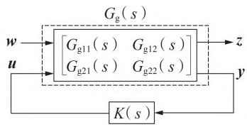  
图4 标准H 控制问题  
Fig.4 Standard H control problem

广义被控对象 $G _ { \mathrm { g } } { \left( s \right) }$ 与各输入、输出量的关系为：

$$
\left\{ \begin{array}{l} {\left[ \begin{array}{l} z \\ y \end{array} \right] = G _ {\mathrm {g}} (s) \left[ \begin{array}{l} w \\ u \end{array} \right] = \left[ \begin{array}{l l} G _ {\mathrm {g} 1 1} (s) & G _ {\mathrm {g} 1 2} (s) \\ G _ {\mathrm {g} 2 1} (s) & G _ {\mathrm {g} 2 2} (s) \end{array} \right] \left[ \begin{array}{l} w \\ u \end{array} \right]} \\ u = K (s) y \end{array} \right. \tag {18}
$$

由式（ ）可知，从外部输入w到被控输出z的闭环传递函数 $T _ { z w } ( s )$ 为：

$$
T _ {z w} (s) = G _ {\mathrm {g} 1 1} (s) + G _ {\mathrm {g} 1 2} (s) K (s) \left(I - G _ {\mathrm {g} 2 2} (s) K (s)\right) ^ {- 1} G _ {\mathrm {g} 2 1} (s) \tag {19}
$$

$\mathrm { H } _ { \infty }$ 标准设计问题可总结为，设计控制器 $K ( s )$ ，满足以下 个条件［15，17］ 。

条件 ：广义被控对象和控制器K(s)组成的闭环系统稳定。

条件2： $T _ { z w }$ 的无穷范数满足 ${ \cal T } _ { z w } \left\| _ { \infty } < 1 \right.$ 。

# 4.2 电流内环控制的H 鲁棒控制器设计

为改善系统对参考输入信号的跟踪能力以及对外部干扰的抑制能力，使系统获得较好的静态和动态性能，应用混合灵敏度设计方法求解H 鲁棒控制器。混合灵敏度问题包含了灵敏度极小化问题和鲁棒镇定问题，设计的控制器K(s)能够使系统闭环稳定，并且同时考虑了控制器的跟踪性能、扰动抑制性能和鲁棒稳定性，因此可利用 $\mathrm { H } _ { \infty }$ 鲁棒控制器K(s)抑制 - 系统由链路延时引入的干扰，即图中的扰动d，从而达到抑制系统高频振荡的目的。

- 系统d、q轴控制具有对称性，因此以d轴为例设计 鲁棒控制器，此时系统为单输入单输出系统。本文将图3中的电流内环PI控制器$G _ { \mathrm { { P I l } } } ( s )$ 和 数学模型 $G ( s )$ 视为等效被控对象$G _ { \mathrm { e q } } ( s )$ ，则 $G _ { \mathrm { e q } } ( s )$ 表达式如式（20）所示，式中 $R _ { \mathrm { e q } } \setminus L _ { \mathrm { e q } }$ 的含义见附录 $\mathrm { A }$ 。

$$
G _ {\mathrm {e q}} (s) = \frac {k _ {\text {p i n d}} s + k _ {\text {i i n d}}}{L _ {\mathrm {e q}} s ^ {2} + R _ {\mathrm {e q}} s} = \frac {k _ {\text {p i n d}} / L _ {\mathrm {e q}} s + k _ {\text {i i n d}} / L _ {\mathrm {e q}}}{\left(s + R _ {\mathrm {e q}} / L _ {\mathrm {e q}}\right) s} \tag {20}
$$

d轴电流内环控制的混合灵敏度问题的数学模型如图5所示。图中：r为d轴电流内环控制的参考输入信号 $i _ { d \mathrm { r e f } } ; e _ { d }$ 为d轴跟踪误差信号； $; \boldsymbol { u } _ { d }$ 为d轴控制信号 $; y _ { \mathrm { m } }$ 为 $d$ 轴电流内环控制的输出信号 $\dot { \iota } _ { \mathrm { c } d } ; z = \big [ z _ { 1 }$ ，$z _ { 2 } , z _ { 3 }$ ］T 为系统的被控输出信号。

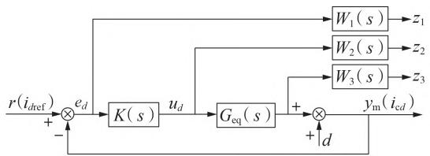  
图5 d 轴电流内环控制的混合灵敏度问题的模型  
Fig.5 Mixed sensitivity problem model of d-axis current inner loop control

由图 可得灵敏度函数S、输入灵敏度函数R和补灵敏度函数T，如式（ ）所示。

$$
\left\{ \begin{array}{l} S = e _ {d} r ^ {- 1} = y _ {\mathrm {m}} d ^ {- 1} = \left(1 + G _ {\mathrm {e q}} (s) K (s)\right) ^ {- 1} \\ R = u _ {d} r ^ {- 1} = K (s) \left(1 + G _ {\mathrm {e q}} (s) K (s)\right) ^ {- 1} \\ T = y _ {\mathrm {m}} r ^ {- 1} = G _ {\mathrm {e q}} (s) K (s) \left(1 + G _ {\mathrm {e q}} (s) K (s)\right) ^ {- 1} \end{array} \right. \tag {21}
$$

由式（ ）可知：灵敏度函数S既是参考信号r到跟踪误差信号 $e _ { d }$ 的传递函数也是干扰信号d到输出信号 $y _ { \mathrm { m } }$ 的传递函数，反映了系统的跟踪能力和干扰抑制能力； $R$ 是参考信号r到控制信号 $u _ { d }$ 的传递函数，反映了系统控制信号的大小；T是参考信号r到输出信号 $y _ { \mathrm { m } }$ 的传递函数，反映了系统的鲁棒稳定性。

由图 和式（ ）可求得由参考输入信号r到被控输出信号z的传递函数如下：

$$
\left\{ \begin{array}{l} z _ {1} = W _ {1} S r \\ z _ {2} = W _ {2} R r \\ z _ {3} = W _ {3} T r \end{array} \right. \tag {22}
$$

由式（22）得到 r 到 ${ z } = [ z , z _ { 2 } , z _ { 3 } ] ^ { \mathrm { T } }$ 的闭环传递函数矩阵 $\pmb { \phi }$ 为［15］ ：

$$
\boldsymbol {\Phi} = \left[ \begin{array}{l} W _ {1} S \\ W _ {2} R \\ W _ {3} T \end{array} \right] \tag {23}
$$

求解混合灵敏度优化控制问题就是寻找真实有理函数 $K ( s )$ ，使闭环系统稳定的同时满足 $| \phi \rrangle$ ‖最小。

# 鲁棒控制器求解

$W _ { 1 }$ — $W _ { 3 }$ 分别为灵敏度函数S、R、T的加权函数，对 $\mathrm { H } _ { \infty }$ 鲁棒控制器的性能有着重要影响，根据现有研究经验，权函数一般按照如下原则进行设计［12，17⁃19］ 。

1） $W _ { 1 }$ 是S的加权函数，S既是参考信号到误差信号的传递函数也是干扰信号到输出信号的传递函数。电流内环控制参考输入信号为直流量，因此为精确跟踪参考输入信号和有效抑制干扰，在低频段$W _ { 1 }$ 的增益应尽量大；在高频段 $W _ { 1 }$ 的增益虽无严格要求，但是为限制系统的超调量，在高频段增益应小于1。  
） $W _ { 2 }$ 是R的加权函数，R是系统参考输入信号到控制信号的传递函数，对系统控制信号的大小和带宽有重要影响。为防止系统在运行过程中出现饱和现象， $\mathbb { W } _ { 2 }$ 的静态增益应适当大；为保证系统有足够的带宽， $W _ { 2 }$ 的静态增益应适当小。因此 $\mathbb { W } _ { 2 }$ 需要折中考虑系统运行过程中的饱和问题以及系统带宽的要求。  
） $\mathbb { W } _ { 3 }$ 是T的加权函数，T是参考信号到输出信号的传递函数。引入T反映了对系统鲁棒稳定性的要求，即高频特性的要求。W 一般要求具有高通特性，以保证系统有充分的稳定裕度，对低频增益取值无严格要求。

根据上述加权函数的选择依据，初步将 $W _ { 1 }$ 选取为低通滤波器， $W _ { 2 }$ 选取为小于 的常数， $W _ { 3 }$ 选取为高通滤波器，并不断调整权函数的低频增益、高频增益和截止频率直至获得较为理想的 鲁棒控制器，最终将 $W _ { 1 } - W$ 选择如下：

$$
\left\{ \begin{array}{l} W _ {1} (s) = \frac {0 . 3 s + 3 0 0}{s + 8} \\ W _ {2} (s) = 0. 4 \\ W _ {3} (s) = \frac {1 0 0 0 (s + 3 0 0)}{s + 1 . 5 \times 1 0 ^ {6}} \end{array} \right. \tag {24}
$$

由式（ ）可知，被控对象 $G _ { \mathrm { e q } } ( s )$ 包含一个纯积分环节，存在虚轴上的极点，采用现有研究中常用的在纯虚极点引入摄动的方法，使系统满足 $\mathrm { H } _ { \infty }$ 鲁棒控制器求解的假设条件。应用 鲁棒控制工

具箱中的hinsyn函数求解H 鲁棒控制器，并将求解算法选为Riccati方程。求得控制器后再消除引入的摄动［20］ 。求解得到的 $\mathrm { H } _ { \infty }$ 鲁棒控制器如式（25）所示。

$$
\left\{ \begin{array}{l} K (s) = \frac {2 8 4 7 7 s (s + 1 . 5 \times 1 0 ^ {6}) (s + 1 2 . 8 6)}{(s + 1 . 0 7 2 \times 1 0 ^ {7}) (s + 2 . 7 5 9 \times 1 0 ^ {4}) (s + 2 5) (s + 8)} \\ \| \boldsymbol {\Phi} \| _ {\infty} = 0. 5 2 9 1 \end{array} \right. \tag {25}
$$

H 鲁棒控制器K（s）为四阶系统，并且各次项系数较大。为方便工程应用，利用MATLAB软件中的balreal 和 modred 命令将其降阶为二阶传递函数$K _ { \mathrm { L } } ( s )$ ，如式（ ）所示。

$$
K _ {\mathrm {L}} (s) = \frac {4 1 8 1 s + 3 4 1 6}{s ^ {2} + 2 . 9 4 4 \times 1 0 ^ {4} s + 5 . 6 7 1 \times 1 0 ^ {5}} \tag {26}
$$

降阶前、后，H 鲁棒控制器的波特图如图 6所示。

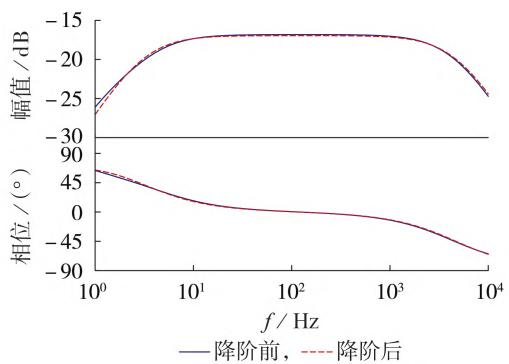  
图6 降阶前、后H 鲁棒控制器波特图对比  
Fig.6 Comparison of Bode diagram for H robust controller between before and after order reduction

由图6可知，在1~10 kHz频率区间，尤其是在- 系统高频振荡风险频段， 鲁棒控制器降阶前、后的幅频、相频特性几乎未发生改变，但是二阶 鲁棒控制器的表达式更为简洁，故应用降阶后的二阶 $\mathrm { H } _ { \infty }$ 鲁棒控制器抑制 - 系统的高频振荡。

# 鲁棒控制对提高 - 系统时滞稳定裕度的理论分析

基于 鲁棒控制的 - 系统电流内环控制如图 7 所示。图中， $I _ { \mathrm { \tiny { d L B } } } \setminus I _ { \mathrm { \tiny { q L B } } }$ 分别为 $d , q$ 轴 H 鲁

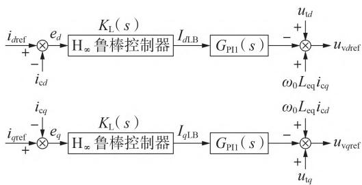  
图7 基于H 鲁棒控制的电流内环控制  
Fig.7 Current inner loop control based on H robust control

棒控制器的输出信号，同时也是电流内环PI控制器的输入信号。由图 可知，电流参考值和测量值的误差经过 $\mathrm { H } _ { \infty }$ 鲁棒控制器后再输入到电流内环 控制器中，利用 鲁棒控制器的扰动抑制能力，抑制MMC-HVDC系统由链路延时引发的高频振荡。

在电流内环控制加入二阶 鲁棒控制器后，MMC-HVDC 系统会额外引入 4个微分状态方程和 2个代数方程，对应 4 个状态变量 $[ i _ { e d 1 } , i _ { e d 2 } , i _ { e q 1 } , i _ { e q 2 } ]$ 和 2个代数变量 $\big [ I _ { \mathrm { d L B } } , I _ { \mathrm { q L B } } \big ]$ ，具体方程分别见附录 C 式（ ）和式 $( \mathbf { C } 2 ) _ { \circ }$ 。此时 - 系统的状态变量构成的向量x和代数变量构成的向量y分别为 $\pmb { x } =$ $\big [ u _ { \mathrm { c p 0 } } , u _ { \mathrm { c p } d } , u _ { \mathrm { c p } q } , u _ { \mathrm { c p } d 2 } , u _ { \mathrm { c p } q 2 } , i _ { \mathrm { c d } } , i _ { \mathrm { c q } } , i _ { \mathrm { c i r 0 } } , i _ { \mathrm { c i r d } } , i _ { \mathrm { c i r q } } , x _ { \mathrm { i n } d } , x _ { \mathrm { i n } q } , x _ { \mathrm { s i n } q } ,$ $x _ { \mathrm { p l l } } , x _ { \mathrm { c i r d } } , x _ { \mathrm { c i r q } } , i _ { \mathrm { L l d } } , i _ { \mathrm { L l q } } , u _ { \mathrm { c s d } } , u _ { \mathrm { c s q } } , i _ { \mathrm { e l l } } , i _ { \mathrm { e l l } } , i _ { \mathrm { e l l } } , i _ { \mathrm { e q 2 } } \operatorname { T } _ { \mathrm { \ddots } } { y } = \left[ u _ { \mathrm { v d } } , i _ { \mathrm { v 2 } } , i _ { \mathrm { v 2 } } , i _ { \mathrm { e l l } } , i _ { \mathrm { e q 2 } } \right] ^ { \mathrm { T } } ,$ $u _ { \mathrm { v } _ { q } } , u _ { \mathrm { c i r } d } , u _ { \mathrm { c i r q } } , \omega _ { 2 } , u _ { \mathrm { s } d } , u _ { \mathrm { s } q } , u _ { \mathrm { t } d } , u _ { \mathrm { t } q } , I _ { \mathrm { { \scriptsize { d L B } } } } , I _ { \mathrm { { \scriptsize { q L B } } } } ] ^ { \mathrm { { T } } } \circ$ 。

加入 $\mathrm { H } _ { \infty }$ 鲁棒控制器后，基于附录 表 所示的控制器参数，应用基于广义特征根的时滞系统稳定性分析方法求解MMC-HVDC系统的时滞稳定裕度$\tau _ { \mathrm { { w d } } } { = } 6 8 4 . 4 9 ~ \mu \mathrm { { s } }$ ，与未加入H 鲁棒控制器的时滞稳定裕度 $3 4 7 . 9 0 ~ \mu \mathrm { s }$ 相比，增大了 ，由此可知，加入H 鲁棒控制器可大幅提高系统的时滞稳定裕度，显著降低 - 系统高频振荡风险。

# 5 仿真验证

在 ／ 电磁暂态仿真软件中搭建如附录A图A1所示的双端MMC-HVDC电磁暂态仿真模型，系统参数和控制器参数分别如附录 表和表 所示，其中 电平 - 仿真模型的最近电平逼近调制（ ）延时为 左右，下文设置系统总链路延时统一考虑 调制延时为170 μs。

基于 - 电磁暂态仿真模型，本节将验证以下内容： 基于广义特征根的时滞系统稳定性分析方法求解 - 系统时滞稳定裕度和临界振荡频率的有效性； 电流内环控制参数对- 系统高频稳定性的影响； 基于 $\mathrm { H } _ { \infty }$ 鲁棒控制的 - 系统高频振荡抑制策略的有效性与适应性。由于锁相环和环流抑制参数对 -系统的高频稳定性基本无影响，且已有文献进行仿真验证［7⁃8］ ，故不再赘述。

# 验证基于广义特征根求解 - 系统时滞稳定裕度和临界振荡频率的有效性

由表 可知，基于广义特征根求解的 -系统时滞稳定裕度 $\tau _ { \mathrm { { w d } } } { = } 3 4 7 . 9 0 ~ \mu \mathrm { { s } }$ ，临界振荡频率 $f _ { \mathrm { c r i } } { = } 9 2 7 . 6 3 ~ \mathrm { H z }$ 。在 - 仿真模型中，设置总链路延时 $\tau { = } 3 3 0 \ \mu \mathrm { s } \ , t { = } 1 . 0 \ \mathrm { s }$ 时将总链路延时增大到 ，d轴电流波形如图 所示。图中， $i _ { \mathrm { c } d }$ 为标幺值，后同。

由图 可知： $: t { = } 1 . 0 ~ \mathrm { s }$ 之前， - 系统的总

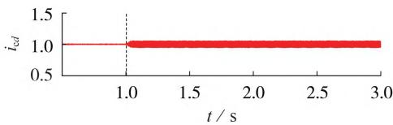  
图8 d轴电流波形  
Fig.8 Waveform of d-axis current

链路延时小于系统的时滞稳定裕度，d轴电流无明显高频谐波分量， 系统处于稳定运行状态； $t { = } 1 . 0 \ \mathrm { s }$ 时， - 系统的总链路延时增大到 348 $\mu \mathrm { s }$ ，约为系统的时滞稳定裕度，此时d轴电流包含严重的高频谐波分量，系统振荡失稳。

对图 中 的 d轴电流进行傅里叶分解，谐波分量如图 所示，总谐波畸变率（ ）为4.91 %。

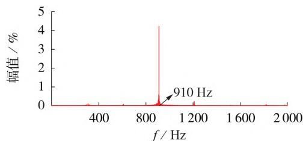  
图9 d轴电流傅里叶分解结果  
Fig.9 Fourier decomposition results of d-axis current

由图9可知，当总链路延时为 $3 4 8 ~ \mu \mathrm { s }$ 时，MMC-系统d轴电流产生 的高频谐波分量，系统发生高频振荡，与基于广义特征根的时滞系统稳定性分析方法求解的临界振荡频率 仅相差 ，理论结果和仿真结果吻合较好，验证了基于广义特征根求解 - 系统时滞稳定裕度和临界振荡频率的有效性。

# 验证电流内环控制参数对 - 系统高频稳定性的影响

设置 MMC-HVDC 系统总链路延时 τ=337 μs，通过如下 个算例分别验证电流内环比例系数、积分 系 数 对 MMC-HVDC 系 统 高 频 稳 定 性 的 影 响。$\mathrm { C a s e } 1 { : } t { = } 1 . 0 \ \mathrm { s }$ 时，电流内环比例系数 $k _ { \mathrm { p i n } d }$ 和 $k _ { \mathrm { p i n } q }$ 均由5增大到5.5；t=2.0 s时，电流内环比例系数均由5.5增大到 。 ：t 时，电流内环积分系数 $k _ { \mathrm { i i n } d }$ 和 $k _ { \mathrm { i i n } q }$ 均由125增大到155；t=2.0 s时，电流内环积分系数均由 增大到 。 个算例的d轴电流波形如图10所示。

由图 （）可知：t 之前电流内环比例系数为 5，MMC-HVDC 系统的总链路延时小于系统的时滞稳定裕度， - 系统处于稳定运行状态； $\mathrm { { ; } } t { = } 1 . 0 ~ \mathrm { { s } }$ 时，电流内环比例系数由 增大到 ，由表 可知，时滞稳定裕度减小到 ，小于系统的总链路延时，d轴电流包含明显的高频谐波分量，系统发生高频振荡；t 时，电流内环比例系数增

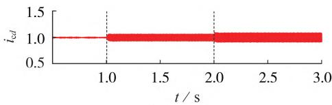  
（a）Case 1

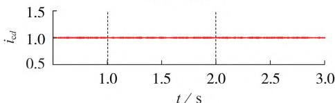  
（b）Case 2  
图10 电流内环控制器参数变化时的d轴电流波形  
Fig.10 Waveforms of d-axis current with variation of current inner loop controller parameters

大到6，此时系统时滞稳定裕度为295.37 μs，d轴电流波形畸变程度增加，系统高频振荡更严重。这说明增大电流内环比例系数将显著降低系统的时滞稳定裕度，恶化系统的高频稳定性。由图10（b）可知，电流内环积分系数增大后，d轴电流无明显高频谐波分量，系统仍处于稳定运行状态，这说明电流内环积分系数基本不影响 - 系统的高频稳定性，验证了3.2节理论分析结果的正确性。

# 验证基于 鲁棒控制的高频振荡抑制策略的有效性和适应性

为验证基于 鲁棒控制的高频振荡抑制策略的有效性与适应性，设置 - 系统总链路延时 $\scriptstyle \tau = 3 6 0 \ \mu \mathbf { s } ($ （大于系统的时滞稳定裕度），t 时，在电流内环控制中投入 $\mathrm { H } _ { \infty }$ 鲁棒控制器， $\mathrm { H } _ { \infty }$ 鲁棒控制器表达式见式（25）； $\mathrm { ; } t { = } 2 . 0 ~ \mathrm { s }$ 时，总链路延时由360 μs增大到 $6 5 0 ~ \mu \mathrm { s }$ ，d轴电流波形如图 所示。

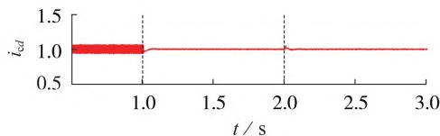  
图11 投入H 鲁棒控制器前、后的d轴电流波形  
Fig.11 Waveforms of d-axis current without and with $\mathrm { H } _ { \infty }$ robust controller

由图 可知：t 之前， - 系统未投入 $\mathrm { H } _ { \infty }$ 鲁棒控制器，由于总链路延时大于系统的时滞稳定裕度，d轴电流含有大量的高频谐波分量，系统处于高频振荡状态； $_ { \mathrm { { ; } } t = 1 . 0 \ \mathrm { { s } } }$ ，在电流内环控制中投入 $\mathrm { H } _ { \infty }$ 鲁棒控制器， - 系统由高频振荡状态迅速进入稳定运行状态，验证了基于 $\mathrm { H } _ { \infty }$ 鲁棒控制的高频振荡抑制策略的有效性；t ， - 系统的总链路延时由 $3 6 0 ~ \mu \mathrm { s }$ 增大到 $6 5 0 ~ \mu \mathrm { s }$ ，系统经过一个短暂的暂态过程后仍保持稳定运行，这说明 $\mathrm { H } _ { \infty }$ 鲁棒控制器具有良好的干扰抑制能力，能够在较大延时范围内抑制 - 系统的高频振荡，具有一定的优越性和适应性。

# 6 结论

本文建立了 - 时滞系统的状态空间模型，应用基于广义特征根的时滞系统稳定性分析方法分析了 MMC-HVDC 系统的高频稳定性。将- 链路延时对系统的影响等效为系统的干扰，提出了基于 鲁棒控制的高频振荡抑制策略，并通过仿真验证了基于广义特征根的时滞系统稳定性分析方法分析 - 系统高频稳定性的有效性以及所提出的高频振荡抑制策略的有效性和适应性，并得到了如下结论。

）从 - 系统的时滞属性出发，应用基于广义特征根的一般时滞系统稳定性分析方法计算- 系统的时滞稳定裕度。该方法无需对延时项进行变换处理，可直接求解 - 系统的时滞稳定裕度，避免了寻找时滞稳定裕度的反复迭代过程，丰富了现有MMC-HVDC系统的高频稳定性分析方法，为分析柔性直流输电工程的高频稳定性提供了一种新思路。  
）应用时滞稳定裕度衡量 - 系统的高频稳定性。电流内环比例系数是MMC-HVDC系统高频振荡的主要影响因素，增大电流内环比例系数将显著恶化系统的高频稳定性。锁相环和环流抑制参数几乎不影响 - 系统的高频稳定性。基于时滞稳定裕度对 - 系统高频稳定性影响因素的分析为MMC-HVDC系统模型的简化处理提供了理论依据。  
）所提出的基于 鲁棒控制的高频振荡抑制策略不依赖于系统的总链路延时，能够在较大延时范围内抑制 - 系统的高频振荡。探究了以 鲁棒控制为代表的新型控制策略在柔性直流输电工程领域中的应用，具有重要的工程应用意义。

附录见本刊网络版（http：∥www.epae.cn）。

# 参考文献：

［ ］王晓宇，杨杰，吴亚楠，等 渝鄂背靠背柔性直流对系统次同步振荡特性的影响分析［］ 电力自动化设备， ，（）： -194.202.  
WANG Xiaoyu,YANG Jie,WU Yanan,et al. Effect analysis of back-to-back flexible HVDC connecting Chongqing and Hu⁃ bei Power Grid on sub-synchronous oscillation characteristics ［J］. Electric Power Automation Equipment，2019，39（7）：188- 194,202.   
［ ］安海清，李振动，金海望，等 张北柔直电网直流分压器二次电压测量异常引起误闭锁机理分析及改进措施［］ 电力自动化设备，2021，41（8）：156-160，168  
AN Haiqing，LI Zhendong，JIN Haiwang，et al. Mechanism analysis and improvement measures of error block caused by abnormal secondary voltage measurement of DC voltage divider in Zhangbei flexible DC grid［J］. Electric Power Automation ， ，（）： - ，   
［ 3］ ZOU Changyue，RAO Hong，XU Shukai，et al. Analysis of reso-

nance between a VSC-HVDC converter and the AC grid［J］. IEEE Transactions on Power Electronics,2018,33(12):10157- 10168.   
［ 4］ ZHANG Ye，HONG Chao，TU Liang，et al. Research on highfrequency resonance mechanism and active harmonic suppression strategy of power systems with power electronics［C］∥ 2018 International Conference on Power System Technology （POWERCON）. Guangzhou，China：IEEE，2018：2350-2356.   
［ 5］ LI Yunfeng，AN Ting，ZHANG De，et al. Analysis and suppre-ssion control of high frequency resonance for MMC-HVDCsystem［J］. IEEE Transactions on Power Delivery，2021，36（6）：3867-3881.  
［ 6］ DONG Chaoyu，YANG Shunfeng，JIA Hongjie，et al. Pade based stability analysis for a modular multilevel converter considering the time delay in the digital control system［J］. IEEE Transactions on Industrial Electronics，2019，66（7）：5242-5253.   
［ ］黄方能，韦超，周剑，等 基于谐波状态空间模型的 系统高频振荡分析［］ 电网技术， ，（）： -  
HUANG Fangneng，WEI Chao，ZHOU Jian，et al. MMC sys⁃tem high frequency resonance based on harmonic state space［］ ， ，（）： -  
［ ］张芳，杨丰瑜，姚文鹏 基于时滞稳定裕度的柔性直流系统高频稳定性分析［］ 电力系统及其自动化学报， ， （）：125-135.  
ZHANG Fang，YANG Fengyu，YAO Wenpeng. High-frequencystability analysis of MMC-HVDC system based on delay sta⁃bility margin［J］. Proceedings of the CSU-EPSA，2022，34（5）：125-135.  
［9］ CHEN Jie，GU Guoxiang，NETT C N. A new method for computing delay margins for stability of linear delay systems［J］. Systems & Control Letters,1995,26(2):107-117.   
［ ］郭贤珊，刘斌，梅红明，等 渝鄂直流背靠背联网工程交直流系统谐振分析与抑制［J］. 电力系统自动化，2020，44（20）：157-164.  
GUO Xianshan,LIU Bin,MEI Hongming,et al.Analysis and suppression of resonance between AC and DC systems in Chongqing-Hubei back-to-back HVDC project of China[J]. Automation of Electric Power Systems,2020,44(20):157-164.   
［ ］郭贤珊，刘泽洪，李云丰，等 柔性直流输电系统高频振荡特性分析及抑制策略研究［］ 中国电机工程学报， ， （）：- ，  
GUO Xianshan,LIU Zehong,LI Yunfeng,et al.Characteristicanalysis of high-frequency resonance of flexible high voltagedirect current and research on its damping control strategy［］ ， ，（）： - ，  
［ ］彭林，马磊，刘浩然，等 单相 整流器 混合灵敏度电流控制［］ 中国电机工程学报， ，（ ）： - ，  
PENG Lin,MA Lei,LIU Haoran,et al.Hmixed sensitivitycurrent control for single-phase PWM rectifier[J]．Procee-dings of the CSEE，2020，40（14）：4580-4589，4737.  
［13］ LI Peng，YU Xiaomeng，ZHANG Jing，et al. The H controlmethod of grid-tied photovoltaic generation[J].IEEE Transac-tions on Smart Grid，2015，6（4）：1670-1677.  
［ ］李鹏，马显，李雨薇，等 基于 混合灵敏度的交直流混合微网频率控制［］ 电力系统自动化， ，（）： -  
LI Peng，MA Xian，LI Yuwei，et al. Frequency control of AC／ DC hybrid microgrid based on Hmixed sensitivity[J].Auto mation of Electric Power Svstems,2020,44(2):132-138.   
［ ］陈金元，李相俊，谢巍 基于 混合灵敏度的微电网频率控制［］ 电网技术， ，（）： -  
CHEN Jinyuan，LI Xiangjun，XIE Wei. Microgrid frequency control based on H mixed sensitivity［J］. Power System Techno-

， ，（）： -  
［ ］李喜东，彭克，姚广增，等 基于 回路成形法的柔性直流配电系统鲁棒稳定控制［］ 电力系统自动化， ，（ ）： -LI Xidong，PENG Ke，YAO Guangzeng，et al. Robust stabilitycontrol of flexible DC distribution system based on H loopforming method［J］. Automation of Electric Power Systems，2021，45（11）：77-85.  
［17］陈金元 . 基于 H 混合灵敏度的微电网频率控制研究［D］. 广州：华南理工大学，CHEN Jinyuan. Micro-grid frequency control based on Hmixed sensitivity［D］. Guangzhou：South China University ofTechnology，2015.  
［ ］于晓蒙 交直流混合微网 ／ 断面换流器的 鲁棒控制方法研究［D］. 北京：华北电力大学，2016YU Xiaomeng. H robust control method research on AC／DC interface converter in AC/DC hybrid microgrid[D].Bei-jing：North China Electric Power University，2016.  
［ ］李鹏，于晓蒙，赵波 基于混合灵敏度的交直流混合微网交直流断面电压 鲁棒控制［］ 中国电机工程学报， ，（）：68-75.

LI Peng，YU Xiaomeng，ZHAO Bo. H robust voltage control of AC-DC interface based on mixed sensitivity in AC-DC hybrid micogrid［J］. Proceedings of the CSEE，2016，36（1）： 68-75.   
［20］王广雄，何朕. 应用H 控制［M］. 哈尔滨：哈尔滨工业大学出版社，2009：105-107

# 作者简介：

  
张 芳

张 芳（ —），女，副研究员，博士，主要研究方向为柔性高压直流输电及电力系统协调优化调度（E-mail：zhangfang@tju.edu.cn）；

姚文鹏（ —），男，硕士研究生，研究方向为柔性直流输电系统高频振荡及抑制（E-mail：253329561@qq.com）；

张紫菁（ —），女，硕士研究生，研究方向为新能源电力系统源荷储协调优化

调度（E-mail：zhangzijing@tju.edu.cn）。

（编辑 李玮）

# High-frequency oscillation analysis and suppression strategy of MMC-HVDC system based on generalized eigenvalue

ZHANG Fang，YAO Wenpeng，ZHANG Zijing

（Key Laboratory of Smart Grid of Ministry of Education，Tianjin University，Tianjin 300072，China）

Abstract：High-frequency oscillation caused by long link delay of MMC-HVDC（Modular Multilevel Converter based High Voltage Direct Current） seriously threatens the safety and stability of power system. The timedelay stability margin is adopted to measure the high-frequency stability of MMC-HVDC system and the high-order state space model of the MMC-HVDC time-delay system is established. The time-delay stability margin of MMC-HVDC system is directly solved by the stability analysis method of time-delay system based on generalized eigenvalue，and the influence of controller parameters on the high-frequency stability of system is analyzed. The influence of link delay of MMC-HVDC system on high-frequency stability of system is equivalent to external interference. The high-frequency oscillation suppression strategy of MMC-HVDC system based on $\mathrm { H } _ { \infty }$ robust control is designed through hybrid sensitivity optimization. The effectiveness of the stability analysis method of time-delay system based on generalized eigenvalue for solving the timedelay stability margin of system and the superiority of the high-frequency oscillation suppression strategy based on $\mathrm { H } _ { \infty }$ robust control are verified by MMC-HVDC electromagnetic transient simulation. The research provides a new idea for the study of high-frequency oscillation and suppression strategy of MMC-HVDC system.

Key words：MMC-HVDC；high-frequency oscillation；generalized eigenvalue；H∞ robust control；oscillation sup⁃ pression