# Large-scale hybrid real time simulation modeling and benchmark for nelson river multi-infeed HVdc system

Chenghong Zhou a,* , Chun Fang a , Miodrag Kandic a , Pei Wang a , Kelvin Kent b , Donald Menzies c

a Grid Infrastructure Planning Department, Manitoba Hydro, Canada   
b Kelvin Kent is with the System Performance Department, Manitoba Hydro, Canada   
c Manitoba Hydro International, Canada

# A R T I C L E I N F O

# Keywords:

Electromagnetic Transient for Direct Current (EMTDC)

Real Time Digital Simulator (RTDS)

Line Commutated Converter (LCC)

Hardware-in-the-Loop (HIL)

Northern Collector System (NCS)

Hybrid

# A B S T R A C T

Nelson River Bipole I/II Line Commutated Converter (LCC) HVdc system has been in operation for more than 40 years and carries about 70% of total Manitoba Hydro power. The recent addition of Bipole III has formed a multiinfeed HVdc system with tightly coupled converter stations at both ends. Due to the complexity of the three Bipoles in a multi-infeed system, a large-scale hybrid real time hardware-in-the-loop (HIL) simulation model was developed with a combination of software models in Real Time Digital Simulator (RTDS) for Bipole I/II and the hardware replicas for Bipole III controls to support Bipole III commissioning and the future three-bipole planning, operation and maintenance efforts. In the paper, a RTDS modeling approach of Bipole I/II AC/DC system is introduced and discussed. This modeling approach includes the strategic design to fully utilize the library components in the page modules for AC/DC controls and the modeling structure of dividing a large HVdc system into many standalone modular systems. The paper also describes the use of a large-scale hybrid simulation model during on-site commissioning of Bipole III system. Such engineering practice has significantly reduced the technical risks, financial cost and secured the success of the Bipole III commissioning.

# Introduction

Manitoba Hydro Nelson River Bipole I/II system has been operating for more than 40 years providing about 70 percent of electrical power to domestic customers and export services. Bipole I is rated at 1854 MW, +/- 463.5 kV and Bipole II has a rating of 2000 MW, +/- 500 kV with Line Commutated Converter (LCC) technology [1]. These two overhead DC transmission lines run from North to South of the province with a distance of approximately 900 km. The rectifier stations of Bipole I and Bipole II are located at Radisson and Henday, respectively, in the Northern Collector System (NCS), and both inverter stations are terminated at Dorsey station. Three generation stations in the NCS supply the power to the DC system. A total of nine synchronous condensers are placed at Dorsey station to provide reactive power support, voltage regulation and system inertia. For system reliability, Manitoba Hydro has developed the third Bipole, namely Bipole III, which was put in service in July 2018, forming a multi-infeed, multi-egress HVDC system topology with the existing Bipole I and Bipole II system [2-4]. Bipole III has a separate inverter location and transmission corridor from Bipole I

and Bipole II, which also enhances overall HVdc system reliability. Fig. 1 shows the Manitoba Hydro HVdc system with the existing Bipole I and Bipole II and the new addition of Bipole III.

The two Nelson River Bipole systems have been modeled in different off-line simulation platforms such as load flow, transient stability and PSCAD/EMTDC simulation, for various planning and operational studies [5-8]. Digital real time simulation used in power systems could reproduce the behavior of the real power system being modeled with the desired accuracy. It has become an increasingly common practice that utilities and manufacturers utilize real time simulation for design and testing of protection devices and AC/DC controls as well as HVdc controllers [9-15]. With the complexity of the multi-infeed system, Manitoba Hydro has identified the need of developing a real time simulation model for the planning, operation and maintenance of the three-bipole system, including Bipole III study, commissioning, Bipole I/II refurbishment, etc.

A full RTDS Bipole I/II system modeling was the first stage of developing the large-scale real time hardware-in-the-loop (HIL) simulation model. The Bipole I/II RTDS control model was planned to have

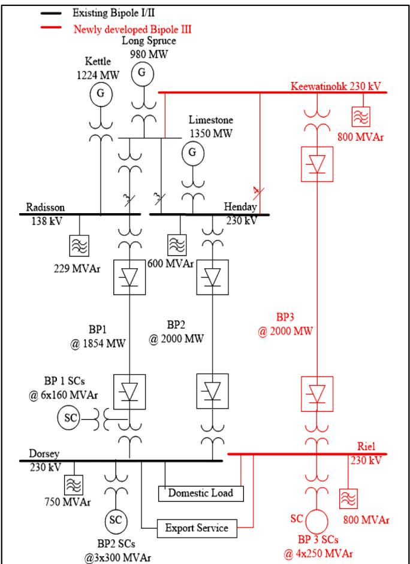  
Fig. 1. Manitoba Hydro Bipole I/II HVdc Link in Black and Newly Developed Bipole III System in Red.

the same structure and concept as the in-house developed PSCAD/ EMTDC model which was based on the original analog circuit boards [7]. The Bipole I/II PSCAD/EMTDC model has been used for many planning and operational studies [7-8].

To make the RTDS model user-friendly and to facilitate its maintenance, all Bipole I/II controls were constructed with a modular design to fully utilize standard library components in page modules. The modeling structure of dividing the large system into many modular standalone systems is introduced. The paper will present the benchmark of the RTDS simulation with the field Transient Fault Records (TFR) during the RTDS modeling. The Bipole I di/dt circuit was thoroughly analyzed to show the impact on system dynamic responses. In addition, Bipole III overhead transmission line modeling and benchmark will be covered.

The large-scale HIL RTDS model was utilized for on-site commissioning of Bipole III system. The benchmark results including staged AC faults at Bipole III inverter is discussed in the paper.

# Development of a large-scale hybrid RTDS model

# Methodology of Bipole I/II controls

The Bipole I/II system has the original vintage analog controls and it is very challenging, if even possible, to have a full-scale hardware replica manufactured. It was decided to model the Bipole I/II control system in the software RTDS with the details tuned to meet the study requirements. The simulation methodology was designed to minimize the complexity of the two bipole controls and to overcome the technical challenges as listed below.

1 The differences of the two bipoles in controls and AC connections:

a) Controls: Bipole I valve group controls are different between its negative (Pole 1) and positive (Pole 2) poles, such as firing angle tracking functions. Bipole II has its own unique controls, such as AC under voltage protection and detection.

b) Valve group configuration: Bipole I has three valve groups per pole and each valve group has six-pulse operation while Bipole II has two valve groups per pole and each valve group has 12-pulse operation.

c) Converter transformers: at Dorsey inverter station, Bipole I converter transformers are single phase three winding transformers and Bipole II converter transformers are three phase two winding transformers.

d) Synchronous condensers: at the inverter station, Bipole I has synchronous condensers connected to the tertiary of the converter transformers while additional synchronous condensers are connected to its converter bus through step-up transformers for Bipole II.

2 The RTDS model was designed to be visually easier for users to better understand control logics and convenient to deliver the case to stakeholders/customers. Therefore, all RTDS Bipole I/II AC/DC control modules are built utilizing only RTDS standard library components in logic block circuit page modules. It includes the control circuits which represent more than one hundred custom built modules in the PSCAD/EMTDC model. Also, the interface signals of each control circuit in the RTDS module are converted to per unit rather than actual voltage signals from the original circuit board, which provides more intuitive understanding of the HVDC control concepts and easier handling of the modules for users. The approach of fully utilizing RTDS standard library components for AC/DC controls would consume more processor loadings with such large HVdc system modeling. Therefore, it is required to manually assign the processors to optimize the computation loading in the racks.

3 The modeling hierarchy is formed so as to divide the entire system into modular standalone systems based on the structures of the AC/ DC controls and AC network connections. Each standalone case consists of detailed DC controls and system equivalents at both rectifier and inverter stations for benchmark tests as shown in Fig. 2. Standalone Pole 1 and Pole 2 cases are constructed so that they consist of a single valve group rated at pole level. The standalone Pole 1/2 models are combined to form a standalone Bipole I model, which also involves expanding the single valve group to model all three series valve groups. The standalone Bipole I model includes all six valve groups while the standalone Bipole II model includes a single double rated 12 pulse valve group per pole rather than modeling two valve groups individually. Then, the standalone Bipole I and Bipole II models are combined to form a system model with the two bipole systems.

Dividing the large-scale system into many modular systems made it easier for constructing, testing and analysis as well as scheduling. This practice has been proven to be effective and efficient for developing RTDS models of a large-scale AC/DC system. Each standalone bipolar system model could be expanded in more details to study its additional performance such as start-up or stop sequence which are not critical to the overall Bipole I/II performance.

# Large-scale hybrid Nelson River RTDS model

A large-scale real time HIL simulation model was developed with a hybrid approach which consists of three key components: the ac/dc power system modelled on the RTDS, RTDS models for Bipole I/II controls (in gray color and RTDS label in the right top corner), and the hardware replica for Bipole III controls and protections (in red color) to support Bipole III commissioning as shown in Fig. 3. The power system model in RTDS includes below:

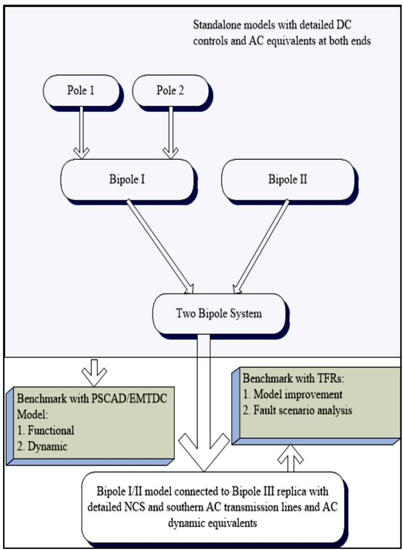  
Fig. 2. Bipole I/II RTDS Model Development Flow Chart.

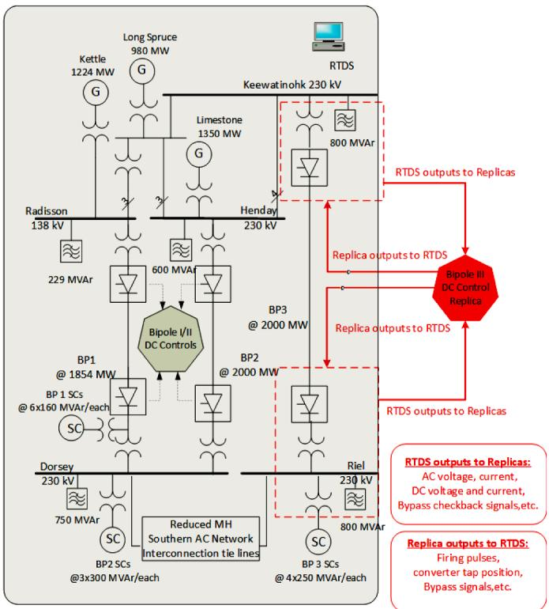  
Fig. 3. Large-scale Hybrid Nelson River RTDS Model.

- Detailed NCS generation and the AC network   
- Frequency dependent AC transmission lines of the NCS system   
- Three frequency dependent Bipole HVDC transmission lines   
- Bipole I/II DC system including converter transformers, converters and AC filter banks as well as HVdc controls   
- Bipole III DC system including converter transformers and converters as well as AC filter banks   
- Six synchronous condensers connected to Bipole I and three synchronous condensers for Bipole II connected to the same Dorsey bus through step-up transformers   
- Four synchronous condensers for Bipole III.   
- Dynamic equivalents of southern ac system including reduced MH Southern AC network and equivalent generators and ac network of the interconnected systems.

Dorsey station includes both Bipole I/II inverters with a total of 14 valve groups connected to the common commutation AC bus and nine synchronous condensers. Modeling the detailed Dorsey converter station has reached the existing computational limitation of the RTDS platform used at Manitoba Hydro. There are two options considered to model Dorsey station with reasonable simulation time steps. Option 1 is to separate Dorsey into two groups using interface transformers. However, this will introduce a one-time step delay and other uncertainty which may lead to simulation accuracy issues. Option 2 is to reduce valve group and synchronous condenser numbers to model all Dorsey components in one group and this option was chosen in the modeling since it provides the similar simulation accuracy as the full system model. Fig. 4 illustrates the Dorsey configuration modelled. Bipole I valve groups are reduced to two six-pulse valve groups per pole from the actual three valve groups per pole. Two six-pulse valve groups with same configuration (Delta or Wye) in a pole are combined into one six-pulse valve group with double capacity. Bipole II 12-pulse valve groups are reduced to one valve group per pole with double capacities.

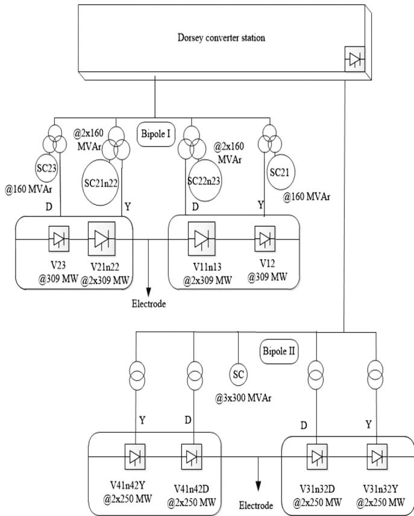  
Fig. 4. Dorsey Station Modeling Configurations.

The performance of the reduced valve group model has been benchmarked with that of the full-scale valve group configuration in standalone models of Bipole I and Bipole II. The benchmark results show a very good agreement.

# Model validation

The benchmark was first conducted between the newly developed RTDS model and the PSCAD/EMTDC simulation. Because RTDS and PSCAD/EMTDC models were both developed based on real system hardware, a general agreement of results from both models is expected.

The benchmark tests include step responses (current order, firing angle and extinction angle) and system recoveries under various ac faults. It is intended to examine HVdc control functionality and dynamic transient performance. The benchmark was first performed on the standalone models, followed by the large integrated HVdc system model. The revisions of the RTDS models were made if necessary based on the evaluation, such as firing angle feedback in the pole control, control mode selection circuit in the valve group control and control parameter settings, etc.

The developed RTDS model is also benchmarked with field results for known disturbances.

# Investigation of Bipole I di/dt circuit

Bipole I pole current control is a type of Proportional Integral Derivative (PID) controller, where the $\mathbf { \vec { \mathbf { \nu } } } ^ { 4 } \mathbf { \vec { D } } ^ { 3 }$ part is obtained by measuring the voltage across a small inductance inserted in the direct current path for the rate of change of DC currents (di/dt). The di/dt signal with its gain (Gain), measured current $\mathrm { ( I _ { d } ) }$ , current order $\operatorname { ( I _ { o r d } ) }$ and Force Retard indicator (FR) as well as the controller feedback signal are fed to PI controller to form alpha order $( \alpha _ { \mathrm { o r d } } )$ as shown in Fig. 5.

PID controller has been commonly used in industries. A wellcalibrated derivative part of PID is known to increase damping in system steady state and to minimize the swings during disturbances [16]. Therefore, Bipole I di/dt circuit is a critical part of the Bipole I DC controls and plays an important role for system stability and transient responses. Past studies showed that without the di/dt circuit, there will be oscillation around 8.5 Hz in steady state and the oscillation frequency may shift a bit depending on the system configurations [17][18],. The studies also found that the gains of the di/dt circuit impact HVdc dynamic performance including recovery time and potential 60 Hz oscillation on the DC side during AC faults.

The impact of Bipole I di/dt circuit on the system responses was demonstrated in the PSCAD/EMTDC simulation with a 10% step change of power order. Fig. 6 shows the pole 1 rectifier firing angle and the pole measured current with the selected gains of the di/dt circuit. The simulation results reveal:

- If the di/dt circuit is out of service (trace in black), sustained oscillation will appear.

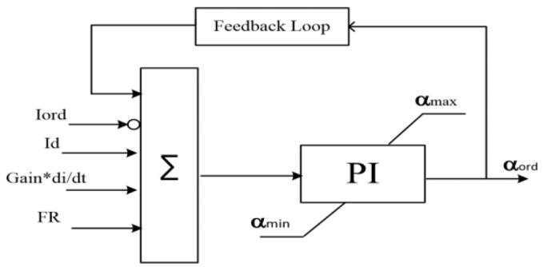  
Fig. 5. Radisson Pole Current Control.

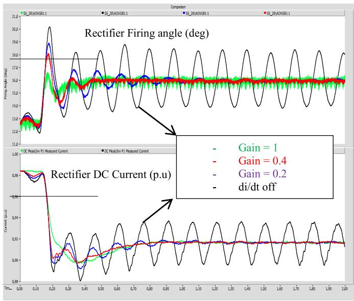  
Fig. 6. The Effects of the Gains of the di/dt Circuit.

- The application of the di/dt circuit will eliminate the oscillation and the system response is dependent on the gain selected. Increasing gain will make system stable but will slow system response.

In the field, the di/dt signal is produced by a Current Transducer (CT) with derivative current implemented in the Bipole I neutral end circuit. Because the device was installed in the middle of last century with old technology, many attempts and efforts to measure the gains of the device failed to get satisfactory results related to system stability and recovery time, etc. The benchmark with field results provides an opportunity to determine the gain of the circuit. The gains of the di/dt circuit in RTDS model were adjusted based on DC performance (firing angle, DC voltage and current) from the field results. Fig. 7 displays the benchmark of Pole 1 performance of RTDS model and the TFR traces for a single phase to ground inverter fault occurred on July 21st, 2017. It shows that the adjusted gain at 0.4 produces satisfactory results, especially with respect to the fault recovery time.

# Bipole III HVdc overhead line model benchmark

Due to its long length of about 1400 km, Bipole III HVdc overhead line model is critical for the coupling effect between the poles. To confirm the accuracy of RTDS line model, a specific field test, “spill current mode”, was conducted. Pole 5 converter was taken out of service, but Pole 5 line conductor was configured to be in-service and in parallel the ground return. A DC line fault was applied at the rectifier terminal of Pole 6 in operation. The measured DC voltages and DC currents of individual pole at each end, the DC powers and firing angles of the running pole at each end were compared between the RTDS simulation in green and the field records in blue as shown in Fig. 8. The RTDS simulation shows less system damping during faults but good overall agreement with the field data.

# Bipole III commissioning

The developed large-scale hybrid RTDS model as shown in Fig. 3 was utilized for Bipole III commissioning. Out of about 250 commissioning tests, 21 critical tests were selected and pre-run with the developed large-scale simulation model to evaluate the system performance under different contingencies and potential system risks. During Bipole III commissioning, the system configuration and settings were predetermined and adjusted by the System Control Center (SCC) to

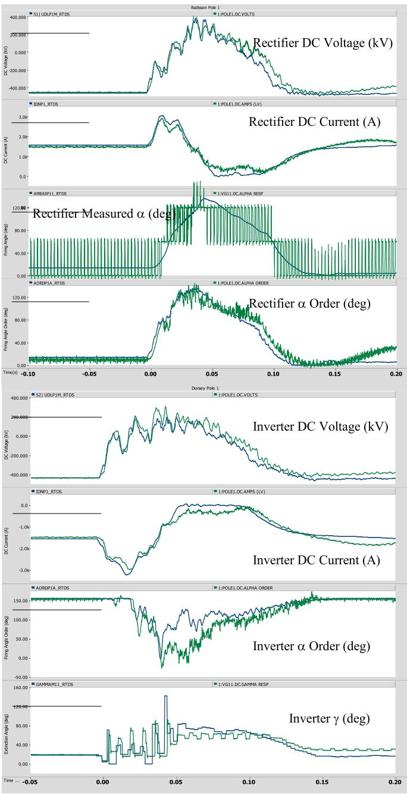  
Fig. 7. Benchmark of Field Results in Green and RTDS Model in Blue.

maintain reliable operation. The system posturing information was fed to the RTDS model to establish various load flow scenarios. A custom program was developed to automatically convert the load flow data from power flow simulation platform to the RTDS model. The above approach significantly reduced the simulation initialization time and accommodated various system conditions under study. The results obtained through the RTDS pre-run simulation was then feedback to the SCC for any system adjustment.

The Bipole III commissioning provided an excellent opportunity to verify the Bipole I/II control RTDS model. The model modifications such as Bipole II current makeup circuit, Bipole II rectifier pole control and Bipole I di/dt circuit settings, had been conducted and effectively mitigated 60 Hz oscillation, commutation failures and enhanced the fault recovery speed during AC fault recovery.

The benchmarking of commissioning results and RTDS simulation for the staged ac fault at the inverter is displayed in Fig. 9-11. The fault application time, fault resistance and duration in the RTDS simulation

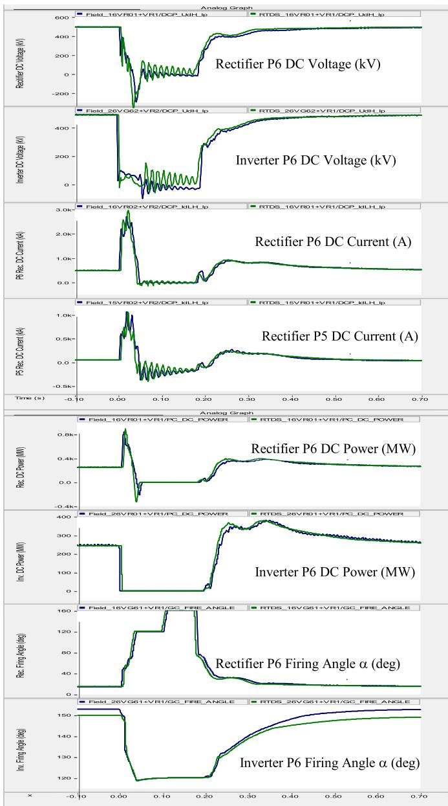  
Fig. 8. Comparison of DC line model in RTDS Simulation and Field Records (Green: RTDS, Blue: Field).

were adjusted to match the converter station voltage traces.

Figs. 9-10 shows the comparison of Bipole II DC performance between the field traces in green color and the RTDS results in blue color including the DC voltage, DC current, firing angle and pole power. The overall responses between the field and the RTDS model showed good agreement. The recovery after the fault seems to be a bit slower in the RTDS simulation, which is attributed to the special ac undervoltage protection scheme in Bipole II and the model refinement is being investigated.

Fig. 11 shows the comparison of Bipole III DC performance between the field results (in blue color) and the results from RTDS simulation (in red color), for ac bus voltage, the valve current, DC voltage, DC current, firing angle and DC power, sequentially from top to bottom in each graph. The simulation results with the developed large-scale hybrid RTDS model shows excellent agreement with the commissioning results for the key signals monitored except the extinction angle during a short period of commutation failures. In the Bipole III replica, the Valve Based Electronics (VBE) is not installed and emulated in simplified simulation model. The difference of extinction angle during commutation failure is

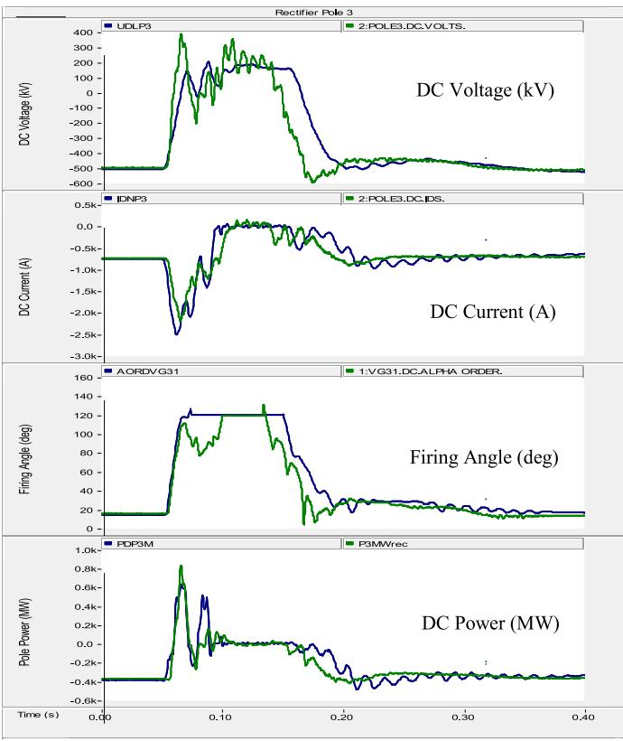  
Fig. 9. Bipole II rectifier P3 DC performance for the Staged AC Fault (Field: green; RTDS: blue). (For interpretation of the references to colour in this figure legend, the reader is referred to the web version of this article.)

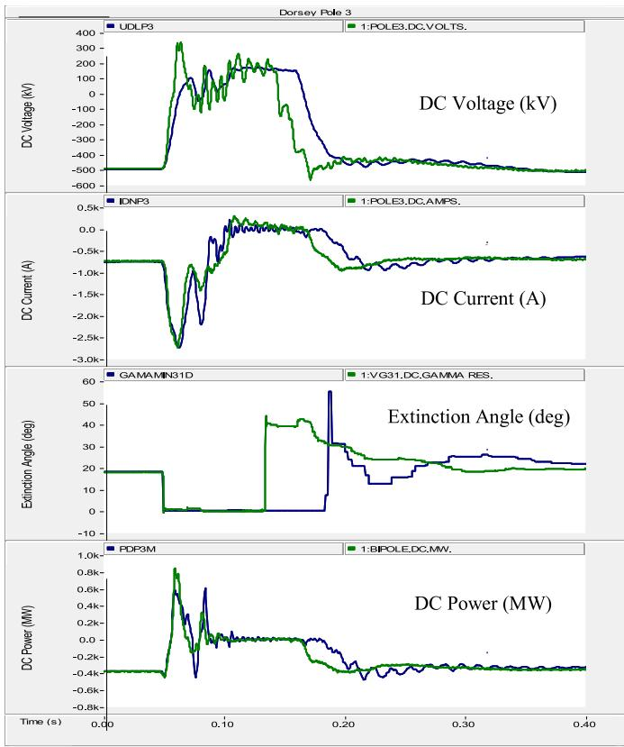  
Fig. 10. Bipole II P3 inverter DC performance for the Staged AC Fault (Field: green; RTDS: blue). (For interpretation of the references to colour in this figure legend, the reader is referred to the web version of this article.)

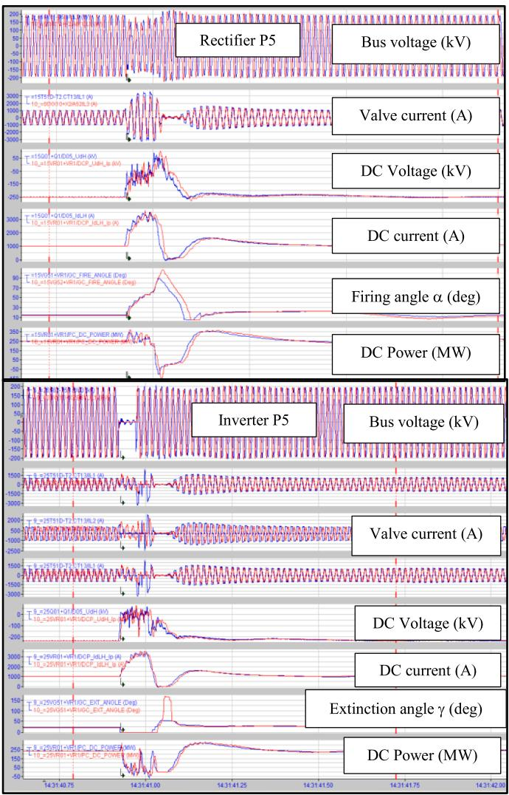  
Fig. 11. Benchmark of Bipole III AC/DC Performance for the Inverter Staged AC Fault (Field: blue; RTDS: red). (For interpretation of the references to colour in this figure legend, the reader is referred to the web version of this article.)

expected with the lack of physical VBE in BPIII replica but it does not affect the overall system responses as shown in Fig. 11.The Bipole III commissioning also provided an excellent opportunity to verify the Bipole I/II control RTDS model and further proves that the Bipole I/II RTDS model is reliable and could be used to fully represent the real system.

# Conclusion

This paper provides detailed discussions of the strategy and structure of RTDS simulation for Manitoba Hydro’s multi-infeed, multi-egress HVDC system. It introduces a large-scale hybrid RTDS simulation model for Nelson River HVdc system utilizing both software HVdc control models in RTDS platform and hardware HVdc replicas, and the challenges during model development. The benchmark test results between the RTDS and off-line PSCAD/EMTDC model as well as field traces were discussed. RTDS modeling of the LCC HVdc transmission system with complete DC controls in detail is a unique experience and would be valuable information to the power industry. Utilizing a large-scale hybrid RTDS simulation for Bipole III commissioning is invaluable and has significantly reduced the technical risks, financial cost and secured the success of the Bipole III project.

# Declaration of Competing Interest

The authors declare that they have no known competing financial interests or personal relationships that could have appeared to influence the work reported in this paper.

# Reference

[1] C.V. Thio, Nelson river HVDC Bipole-two part I-system aspects, IEEE Trans. Power Apparatus Syst. PAS-98 (1) (Jan/Feb. 1979) 165–173.   
[2] CIGRE ´ Working Group B4.41, Systems with multiple DC infeed, CIGRE ´ Tech. Brochure No. 364 (December 2008).   
[3] I.T. Fernando, P. Wang, R.W. Mazur, Limitations to loading the manitoba hydro future three-Bipole, multi-egress, multi-infeed HVDC system and mitigation strategies, in: The 10th International Conference on AC and DC Power Transmission, UK, 2012.   
[4] C. Bartzsch, J. Hofses, V. Hussennether, Y. Long, N. Dhaliwal, P. Wang, I. Fernando, D.A. Jacobson, K. Kent, M.A. Weekes, B. Archer, Manitoba Hydro’s Bipole III transmission project - design aspects and major technical features, in: 2017 CIGRE´ Canada Conference, Winnipeg, 2017.   
[5] C.V. Thio, J.B. Davies, K.L. Kent, Commutation failures in HVDC transmission systems, IEEE Trans. Power Del. 11 (2) (Apr. 1996) 946–958.   
[6] D.A.N. Jacobson, P. Wang, C. Karawita, R. Ostash, M. Mohaddes, B. Jacobson, Planning the next nelson river HVDC Development phase considering LCC vs. VSC technology, in: CIGRE, ´ Paris, 2012. Paper B4-103.   
[7] P. Kuffel, K.L. Kent, et al., Development and validation of detailed controls models of the nelson river Bipole 1 HVDC system, IEEE Trans. On Power Delivery (1) (January 1993) 351–358. Vol. &. No.   
[8] K.L. Kent, P. Kuffel, D. Tang, Investigation of selected system disturbances on the nelson River Bipole 1 HVDC system using detailed control model digital

simulations, in: Third HVDC System Operating Conference, Winnipeg, Manitoba, Canada, May 12-15, 1992.   
[9] T. Strasser, Real-time simulation technologies for power systems design, testing, and analysis, IEEE PES Task Force on Real-Time Simul. Power Energy Syst. (June 29th, 2015). Publication on.   
[10] K. Strunz, Real time high precision simulation of the HVDC extinction advance angle, in: 2000 International Conference on Power System Technology, August 6th, 2002. Publication on.   
[11] D. Brandt, R. Wachal, R. Valiquette, R. Wierckx, Closed loop testing of a joint var controller using a digital real-time simulator, Trans. Power Syst. 6 (3) (August 1991).   
[12] Yong-Beum Yoon, Tae-Kynn Kim, Seun-Tae Cha, etc, HVDC control and protection testing using the RTDS simulator, in: Proc. 4th International HVDC Transmission Operating Conference, Yichang PRC, September 2001, pp. 101–106. Paper No. 17.   
[13] Yong Cui, Zenghui Yang, Yinghui Yu, Qiang Guo, Tugang Shen, RTD-based modeling for full-process simulation of two types of HVDC systems, in: 2016 IEEE PES Asia-Pacific Power and Energy Engineering Conference (APPEEC), December 12th, 2016. Publication on.   
[14] Yulong Ma, Yong Yang, Yu Tao, Luojiang Qian, Qidi Zhong, Model development of HVDC control system for real time digital simulation, in: 2009 Asia-Pacific Power and Energy Engineering Conference, May 12th, 2009. Publication on.   
[15] Luojiang Qian, Qidi Zhong, Yulong Ma, Yu Tao, ZhenCao, Build and validation of RTDS model for control and protection system testing of lingbao BTB DC station, in: IEEE Conference on Electrical Machine and System, February 2nd, 2008. Publication on.   
[16] Ang Kiam Heong, etc., PID control system analysis, design, and technology, IEEE TRANSACTIONS ON CONTROL SYSTEMS TECHNOLOGY 13 (4) (July 2005).   
[17] English Electric, Main amplifier sub-unit DC 135, Bipole I file No. J83/JLH/ DC135/F04 (1971). January 20.   
[18] TransGrid Solutions Inc. “Sub-synchronous frequency interaction study”, Internal report to Manitoba Hydro, Nov. 29, 2012.