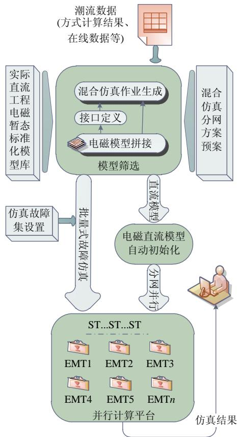
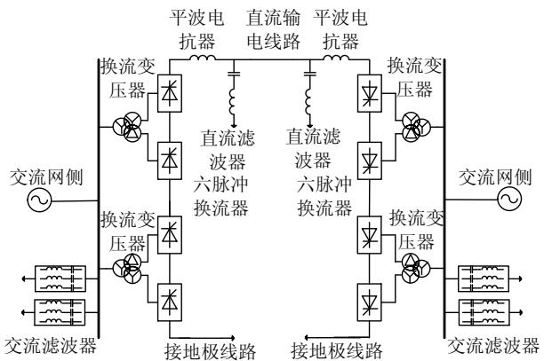
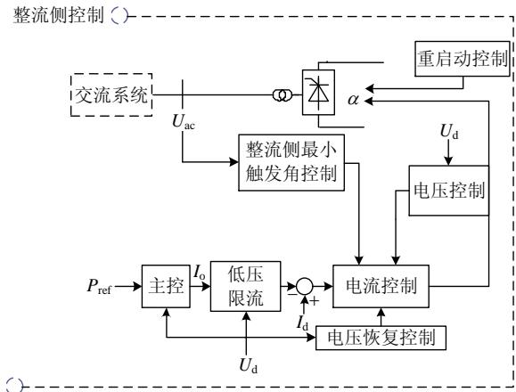
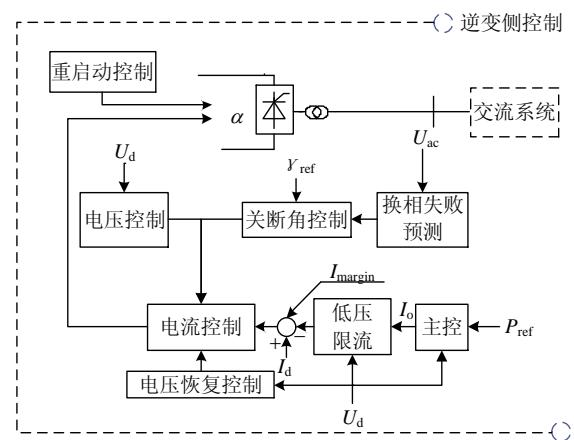
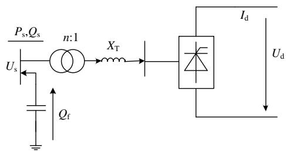
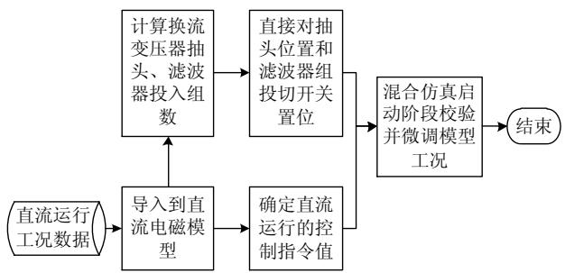
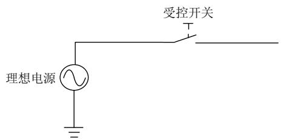
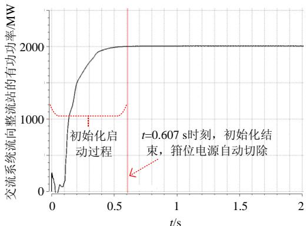

# 含大量电磁直流模型的机电–电磁暂态混合仿真技术研究

陈绪江 1，张星 1，田芳 1，张怡 2，金一丁 2，周孝信 1

（1．电网安全与节能国家重点实验室(中国电力科学研究院有限公司)，北京市 海淀区 100192；  
2．国家电力调度控制中心，北京市 西城区 100031）

# Electromechanical-electromagnetic Hybrid Simulation Technology With Large Number of Electromagnetic HVDC Models

CHEN Xujiang1, ZHANG Xing1, TIAN Fang1, ZHANG Yi2, JIN Yiding2, ZHOU Xiaoxin1

(1. State Key Laboratory of Power Grid Safety and Energy Conservation (China Electric Power Research Institute),

Haidian District, Beijing 100192, China;

2. National Power Dispatching and Control Center, Xicheng District, Beijing 100031, China)

ABSTRACT1: With the rapid development of UHVDC and the step-by-step improvement of its transmission capacity, China's power grid has the characteristics of “Strong HVDC and weak AC system”. The coupling between the transmitting and receiving ends, AC and HVDC, and multiple HVDCs is getting closer and closer so that the operating characteristics of the power grid are becoming increasingly complex. In the simulation analysis of large-scale AC-DC power grids, the HVDC obtains accurate dynamic characteristics and the AC grids can improve its simulation efficiency via electromagnetic transient simulation. However, the hybrid simulation with multiple HVDC electromagnetic transient models has difficulties in data establishment, mode adjustment and smooth start, which restricts the working efficiency and simulation accuracy of large-scale power grid analysis. In this paper, a solution is presented for automatic establishment of hybrid simulation data through HVDC standardization modeling and data mapping splicing, which greatly improves the modeling efficiency. And a method is provided for automatically adjusting the operation mode of the HVDC electromagnetic model and the smooth start of the hybrid simulation so that the hybrid simulation can reach steady state within the simulation process of 0.6s. The method proposed in this paper improves the working efficiency and simulation accuracy of electromechanical-electromagnetic.

KEY WORDS: large-scale AC-DC power grid; electromechanical-electromagnetic hybrid simulation; UHVDC

transmission; HVDC electromagnetic model; operating condition adjustment

摘要：伴随特高压直流的飞速发展和其输电容量阶跃式提升，我国电网呈现出“强直弱交”的特点。送受端、交直流、多直流之间耦合日趋紧密，电网运行特性日趋复杂。在大规模交直流电网的仿真分析中，直流输电系统需要采用电磁暂态仿真以获得准确动态特性，其余交流电网采用机电暂态仿真以提高仿真效率。然而，含多条直流电磁暂态模型的混合仿真在数据建立、方式调整及平稳启动方面存在困难，制约了大规模电网分析的工作效率和仿真精度。提供了通过直流标准化建模和数据映射拼接实现混合仿真数据自动建立的解决方案，提高了建模效率；提供了直流输电电磁模型运行方式自动调整、混合仿真接口电压箝位平稳启动的方法，使混合仿真能在 0.6s 的仿真过程内达到稳态。所提方法提高了大规模交直流电网机电–电磁混合仿真分析的工作效率和仿真精度。

关键词：大规模交直流电网；机电–电磁暂态混合仿真；特高压直流输电；直流输电电磁模型；运行工况调整

DOI：10.13335/j.1000-3673.pst.2018.1810

# 0 引言

能源与负荷需求之间的反向分布是中国的基本国情之一，也是电力系统规划和运行中应该考虑的重要因素[1]。高压直流输电已成为我国区域间最常见的电力传输方式，它将西部的可再生能源传输到东部满足负荷需求。伴随特高压直流快速发展和输电规模阶跃式提升，“强直弱交”矛盾突出，送受端、交直流、多直流之间耦合日趋紧密，电网运行特性发生了深刻变化。由于高压直流输电并不总

是可靠，整个电力系统的稳定性受到威胁。

对于送端电网，高压直流输电的换相失败等暂态过程对西北地区风电场的运行产生了影响，已实际发生了一些事故[2-4]。如文献[3]提供的一个案例分析，虽然是受端交流电网发生了故障，但引发了HVDC 的换相失败或闭锁，进而引发送端电网瞬态过电压振荡并导致风机部分脱网，此后无功过剩进一步推高电压，导致风机脱网越发严重。对于直流多馈入的受端电网，发生交流系统故障可能造成多回直流同时换相失败，实际系统中也多次发生交流故障造成多回直流同时换相失败的事故[5-8]，随着直流接入规模的增大，需滚动校核多直流同时换相失败对受端电网安全稳定性的影响[9]。

机电暂态仿真程序所采用的直流模型均是准稳态模型，可以对直流双极闭锁等严重故障进行模拟计算[10-11]，但对于研究交流系统不对称故障对直流换相过程的影响、直流控制系统对系统稳定性的影响等问题时，难以给出合理的结果[12]，因此现有以机电暂态为主导的大电网仿真难以准确描述直流系统快速暂态特性，导致电网运行分析精确度不够，难以满足交直流大电网分析的要求，在模拟直流换相失败、励磁涌流等非基波、非线性特性时也可能存在较大误差。电磁暂态仿真模拟精度高，选用合适的模型能够准确模拟换相失败等直流的动态过程，但其模型复杂、计算规模有限，难以成为大电网运行仿真分析的主要研究手段。

近年来，机电–电磁混合仿真在大电网分析中得到越来越多的应用，通过将直流输电及其周边区域采用电磁暂态建模、其他交流电网采用机电暂态建模，能够实现更加精细化的电网仿真，兼顾仿真精度和仿真规模，已成为国网和南网运行方式计算的重要工具。

在国调方式计算等混合仿真应用场景中，交直流混联电网一般先进行方式调整和潮流计算，然后人工建立各回直流的电磁暂态模型，再人工定义电磁侧直流模型与机电侧大电网之间的混合仿真接口，以实现混合仿真。在混合仿真数据产生以后，还需要根据在线潮流将电磁侧各回直流模型的运行方式调整到合理的位置，以保证其稳定运行状态与当前的在线潮流数据保持一致。这个运行方式调整的过程需要大量的人工参与，占用较大的工作量。交直流电网每一个新的运行方式的混合仿真建模及仿真过程都包含大量的人工干预。

混合仿真启动阶段，原有方法一般会在接口位置加钳位电源支持直流逐步加入稳态，根据混合仿

真稳态建立的情况仿真人员设定钳位电源切除时间。这种混合仿真启动方法，可以避免启动阶段潮流不平衡对整个大电网的冲击与相互影响，但在大批量的计算方式扫描计算中，每个任务都进行一次初始化，浪费了大量的时间和计算资源。

由于电磁直流模型建模复杂，运行工况人工调整工作量大，难以从稳态直接启动，这些问题制约了含大量电磁直流模型的机电–电磁暂态混合仿真在大批量方式计算校核以及在线分析中的应用。本文将就含大量电磁直流模型的机电–电磁暂态混合批量式仿真分析面临的建模工作效率、电磁直流模型初始工况调整及混合仿真平稳启动方面的问题提出有效可行的技术方法。

# 技术框架

由于电磁直流模型建模复杂，运行工况人工调整工作量大，难以从稳态直接启动，这些问题制约了含大量电磁直流模型的机电–电磁暂态混合仿真在大批量方式计算校核以及在线分析中的应用。为了解决上一瓶颈问题，本文提出了根据潮流数据和指定分网方案的机电–电磁暂态混合仿真数据自动建立和电磁直流模型自动初始化和混合仿真平稳启动的技术框架，如图 1 所示。

含大量电磁直流模型的机电–电磁暂态混合仿真建模及仿真计算的具体步骤为：

1）面向实际直流工程分别建立电磁直流标准化模型作为模型库，并建立电磁直流模型库与方式计算数据或在线数据中直流元件的映射关系。  
2）根据混合仿真分网预案确定电磁暂态仿真的直流工程范围并从电磁直流模型库中调取仿真模型，实现电磁暂态仿真数据拼接。  
3）程序自动定义机电–电磁暂态混合仿真接口，自动添加接口平稳启动的临时箝位电源。  
4）采用本文描述的初始化方法，基于潮流数据对电磁直流模型进行运行状态的初始化。  
5）混合仿真启动进行到稳态，切除箝位电源，保存运行点，套用预设的故障集，启动交直流大电网的机电–电磁暂态混合仿真计算，输出仿真结果。

# 2 电磁直流模型

在交直流大电网的机电–电磁暂态混合仿真中，电磁暂态直流模型的一次设备模型结构和参数要与实际工程保持一致。为了兼顾仿真效率，控制保护环节一般采用简化建模的方式，要保留与交直流系统相互影响密切相关的控制和保护环节，去掉

  
图1 含大量电磁直流模型的机电–电磁混合仿真技术框架  
Fig. 1 Electromechanical-electromagnetic hybrid simulation technology framework with a large number of electromagnetic HVDC models

冗余以及和大电网仿真关系不大的保护环节。

直流一次系统电磁模型应与实际工程接线结构和元件参数保持一致，特高压直流输电单极一次系统的电磁暂态模型结构如图 2 所示[13-14]。交流滤波器模型要考虑投切，换流变压器模型要考虑抽头调节的功能，建议考虑饱和特性，直流线路和接地极推荐采用频率相关线路模型或 T 型线路模型模拟。

本文介绍的技术框架可以兼容直流控制保护的简化模型、UD 搭建的详细模型以及厂家封装模型，要求模型要能够接受直流单双极运行方式、直

  
图2 特高压直流输电单极一次系统的电磁暂态模型结构  
Fig. 2 Electromagnetic transient model structure of UHVDC single-pole primary system

流功率、直流电压、直流电流等运行方式指令。为了保证大电网仿真的效率，本文采用的直流控制保护模型采用简化建模，模型结构如图 3 所示[15]。

图 3 中： $P _ { \mathrm { r e f } }$ 为直流输送功率的参考值，MW；$U _ { \mathrm { a c } }$ 为换流变原边交流电压测量值，kA； $I _ { \mathrm { o } }$ 为直流电流的指令值， $\mathrm { k A } ; U _ { \mathrm { d } }$ 为直流电压的测量值， $\mathbf { k V } ;$ ；$I _ { \mathrm { d } }$ 为直流电流的测量值，kA；α 为整流侧触发角的指令值， $( ^ { \circ } ) \colon \gamma _ { \mathrm { r e f } }$ 为逆变侧关断角的参考值，(°)； $I _ { \mathrm { m a r g i } }$ 为整流侧与逆变侧的直流电流裕度，kA。

  
图3 特高压直流输电控制系统数学模型的组成  
Fig. 3 Composition of the mathematical model of UHVDC controller

# 3 混合仿真作业快速建立

一个完整的机电–电磁暂态混合仿真作业由3部分构成，包括机电暂态中的大电网数据、电磁暂态仿真中的局部电网数据和混合仿真接口数据。以往的建模方式，是由仿真人员采用混合仿真程序的图形界面程序，分别在机电暂态程序中完成网络分割、在电磁暂态程序中建立起局部电网数据，再配置混合仿真接口实现 2 个程序及数据的闭环，存在复杂的人工过程。而混合仿真应用到交直流大电网的大批量仿真尤其是应用到在线仿真时，人工建模的方案就不够现实。在线应用时，一般在线动态安全预警程序会按照一定的策略自动选取一定范围

的直流输电工程用电磁暂态建模并实现交直流电网的极点–电磁暂态混合仿真，以对重点关注的安全预警信息进行精细化校核，需要在数分钟之内完成建模和仿真计算。因此有必要将混合仿真作业的建立过程自动化。

本文中，混合仿真作业自动快速建立依赖于事先构建完成的各回直流输电标准化电磁暂态模型库，配置好潮流、暂稳数据中直流模型与电磁直流模型及数据的映射关系，根据输入的电磁暂态建模范围，自动从电磁暂态模型库中调用各回直流工程及各电网元件数据并实现拼接，然后自动配置混合仿真接口信息。

# 4 电磁直流模型快速初始化

电磁直流模型的初始化依赖于直流工程的内部潮流，直流输电工程内部潮流与其电磁模型状态的关系的关系如表 1 所示。

表 1 直流输电工程内部潮流与电磁模型状态的关系  
Tab. 1 Relationship between internal power flow and electromagnetic model state in HVDC   

<table><tr><td colspan="2">内部潮流信息</td><td>电磁直流模型状态</td></tr><tr><td rowspan="3">运行状态</td><td>单双极运行</td><td>六脉冲换流器闭锁状态</td></tr><tr><td>全压/半压运行</td><td>六脉冲换流闭锁及旁通开关状态</td></tr><tr><td>金属/大地回线</td><td>回线状态切换开关状态</td></tr><tr><td colspan="2">直流传输功率</td><td rowspan="2">直流电流考值</td></tr><tr><td colspan="2">直流电流</td></tr><tr><td colspan="2">直流电压</td><td>直流电压参考值</td></tr><tr><td colspan="2">换流变变比</td><td>换流变抽头位置</td></tr><tr><td colspan="2">换流站无功消耗</td><td>交流滤波器投切开关状态</td></tr><tr><td colspan="2">逆变侧关断角</td><td>逆变侧关断角参考值</td></tr></table>

潮流计算或在线抓取方式获得的电网运行方式数据中，直流工程的运行方式数据可能是完备的潮流数据，也可能只是简单的功率传输数据。因此，需要在电磁直流模型中增加内部潮流计算功能。

# 4.1 电磁直流模型内部潮流计算

高压直流输电的换流站一般包括联结变压器、无功补偿、换流器等部分，其稳态模型如图4所示[16]。

图 4 中， $P _ { \mathrm { s } }$ 和 $Q _ { s }$ 分别为交流系统流向换流站的有功功率和无功功率， $U _ { \mathrm { s } }$ 为换流母线交流电压，$P _ { \mathrm { s } }$ 、 $Q _ { s }$ 和 $U _ { \mathrm { s } }$ 是已知边界条件， $X _ { \mathrm { T } }$ 为换流变的漏抗，

  
图4 高压直流输电的换流站稳态模型  
Fig. 4 Steady-state model of HVDC converter station

为已知一次系统参数。直流内部其他状态变量可经过如下步骤确定：

1） $U _ { \mathrm { d } }$ 、 $I _ { \mathrm { d } }$ 分别为直流电压和电流，当没有对应潮流信息输入时，整流侧直流电压 $U _ { \mathrm { d r } }$ 可取为直流系统额定电压(区分全压或半压运行)，直流电流取为 $I _ { \mathrm { d } } = P _ { \mathrm { s } } / ( N U _ { \mathrm { d r } } )$ ，其中N 为当前直流运行极数。逆变侧直流电压取为 $U _ { \mathrm { d i } } = U _ { \mathrm { d r } } - I _ { \mathrm { d } } R _ { \mathrm { d } }$ ，其中 $R _ { \mathrm { d } }$ 为直流线路电阻。  
2）n为换流变变比，需要计算得出。高压直流输电换流器计入换相过程的直流电压算式[17]为

$$
V _ {0} = \left(U _ {\mathrm {d}} + \frac {3 B X _ {\mathrm {C}}}{\pi} I _ {\mathrm {d}}\right) / \cos \alpha \tag {1}
$$

式中： $\alpha$ 在整流侧为触发角，一般直流稳定运行时可指定为 $1 5 ^ { \circ }$ ，在逆变侧为关断角，直流稳定运行时可指定为 17°； $X _ { \mathrm { { C } } }$ 为换相电抗，可取为换流变的漏抗 $X _ { T }$ ；B 为单极在运六脉冲换流器的个数，全压运行时， $\pm 5 0 0 \ \mathrm { k V }$ 直流一般为 2，±1000 kV 直流一般为 4。

换流变变比n可按式(2)求取：

$$
n = \frac {3 \sqrt {2} B U _ {\mathrm {s}}}{\pi V _ {0}} \tag {2}
$$

3） $Q _ { \mathrm { f } }$ 为换流站交流滤波器的无功补偿容量，需要计算得出。

换相角 $\mu$ 可以根据式(3)得出

$$
\mu = \arccos  (\cos (\alpha) - \sqrt {2} n X _ {\mathrm {T}} I _ {\mathrm {d}} / U _ {\mathrm {s}}) - \alpha \tag {3}
$$

式中 $\alpha$ 在整流侧为触发角，在逆变侧为关断角，()。

进一步的，直流功率因数tan可以根据式(4)求出，其中 $\alpha$ 在整流侧为触发角，在逆变侧为关断角。

$$
\tan \varphi = \frac {\frac {\pi \mu}{1 8 0} - \sin (\mu) \cos (2 \alpha + \mu)}{\sin (\mu) \sin (2 \alpha + \mu)} \tag {4}
$$

则换流站的无功消耗 $Q _ { \mathrm { D C } } = P _ { \mathrm { D C } } \tan \varphi$ ，换流站交流滤波器的无功支援为 $\begin{array} { r } { Q _ { \mathrm { f } } = Q _ { \mathrm { D C } } - Q _ { \mathrm { s } } } \end{array}$ ，即

$$
Q _ {\mathrm {f}} = P _ {\mathrm {D C}} \tan \varphi - Q _ {\mathrm {s}} \tag {5}
$$

# 4.2 电磁直流模型运行工况自动调整

在 4.1 节中已经完成了电磁直流模型内部潮流的计算，计算结果作为电磁直流模型的工况信息，可对控制系统的指令、换流变压器的抽头位置以及滤波器投入的组数进行准确计算并初始化。接下来混合仿真基于此初始化状态启动计算，并自动校验和微调电磁模型，根据触发角/关断角的偏差量判断并上下调整一级换流变压器抽头位置，根据无功交换的偏差量对滤波器进行一组的投切。电磁直流模型运行工况自动调整方案如图 5 所示。

  
图5 电磁直流模型工况自动调整方案  
Fig. 5 HVDC electromagnetic model operating state automatic adjustment scheme

当抽头在原边时，换流变抽头位置按式(6)计算；当抽头在副边时，换流变抽头位置按式(7)计算。

$$
T _ {\text {a p p o s}} = \left\langle \left(n _ {\mathrm {r}} - 1\right) / T _ {\text {a p s t e p}} \right\rangle_ {\text {r o u n d}} + T _ {\text {a p p o s r}} \tag {6}
$$

$$
T _ {\text {a p p o s}} = \left\langle \left(1 / n _ {\mathrm {r}} - 1\right) / T _ {\text {a p s t e p}} \right\rangle_ {\text {r o u n d}} + T _ {\text {a p p o s r}} \tag {7}
$$

式中： $T _ { \mathrm { a p p o s } }$ 为计算得到的抽头位置； $n _ { \mathrm { r } }$ 为换流变标幺变比； $T _ { \mathrm { a p p o s r } }$ 为主抽头位置，即 $n _ { \mathrm { r } } { = } 1$ 时抽头所在位置； $T _ { \mathrm { a p s t e p } }$ 为抽头调节的分度，即抽头调节一档变比改变的百分比；round表示四舍五入。

计算交流滤波器投入组数的时候，需要考虑交流电压不同于额定电压时滤波器容量的变化，滤波器组数应满足式中“≈”两侧的偏差量小于下一组滤波器额定容量：

$$
\sum_ {k = 1} ^ {M \leq N} \left(\frac {U _ {\mathrm {s}}}{U _ {\mathrm {s r}}}\right) ^ {2} Q _ {k} \approx Q _ {\mathrm {f}} \tag {8}
$$

式中：M、N 分别为应投入的滤波器组数和换流站配备滤波器的总组数； $Q _ { k }$ 为各组滤波器的额定容量，Mvar； $U _ { \mathrm { s } }$ 为换流母线线电压有效值，kV； $U _ { \mathrm { s r } }$ 为换流母线额定电压，也即滤波器额定容量对应的电压，kV。

在模型执行投切的时候，需按照实际工程中交流滤波器的投切顺序执行，并保证投入最小滤波器组数，否则不能起到滤波效果影响直流模型运行状态。在决定第 M 组滤波器是否投入时，按照式(9)来进行判断，当投入第 M组滤波器后能保证无功偏差量小于一组滤波器的无功支援。

$$
\left| Q _ {\mathrm {f}} - \sum_ {k = 1} ^ {M \leq N} \left(\frac {U _ {\mathrm {s}}}{U _ {\mathrm {s r}}}\right) ^ {2} Q _ {k} \right| \leq \frac {1}{2} \left(\frac {U}{U _ {\mathrm {r}}}\right) ^ {2} Q _ {M} \tag {9}
$$

除了对换流变、交流滤波器等一次系统进行调整以外，还需要结合单双极、全压/半压、金属/大地回线方式等对换流器系统及相应的旁通、隔离开关进行调整。

单极闭锁时需要闭锁该极换流器、断开隔离开关，在运极金属回线时还需要闭合闭锁极的旁通开关。半压运行时，需要对退出运行的换流器进行闭锁并隔离，投入对应的旁通开关。

对于二次控制模型，需要将得到的直流功率指令值、直流电流指令值、触发角参考值和关断角参考值输出到图 3 所示控制系统相应的位置。

稳态时，由于控制的引导，电磁直流模型的直流电流以及逆变侧关断角均工作在指令值位置，与潮流结果不存在误差。而由于一次系统电磁模型与潮流模型的差异，可能导致逆变侧直流电压、整流侧触发角、换流站无功消耗与潮流结果存在误差。为了尽可能减小这一误差，我们还需要在电磁直流模型中加入稳态工况自动微调的功能。稳态工况自动微调的步骤如下：

1）当直流电流和关断角工作在指令位置时，逆变侧直流电压主要由逆变侧换流变压器的抽头位置决定，当逆变侧直流电压稳态值与潮流结果差异大于换流变抽头调节分度的 1/2 时，按照误差反方向升高或降低阀侧电压，微调一档逆变侧换流变抽头位置。  
2）通过步骤1）的微调，直流电压的误差已降至最低，直流电流工作在指令值的情况下，整流侧触发角的偏差量也主要通过换流变压器的抽头调节来完成，根据式(1)稳态公式，若cos与潮流结果相对误差超过换流变抽头调节分度的 1/2 时，按照误差反方向升高或降低阀侧电压，微调一档整流侧换流变抽头位置。  
3）监测稳态时由换流母线流出的无功功率，并与潮流结果对比，当误差超过 1/2 组滤波器容量时，按照投切顺序表投入或切除一组滤波器。

在电磁直流模型中加入上述自动微调逻辑以后，可以进一步提高模型初始化的精度。

# 5 混合仿真平稳启动

由于电磁暂态仿真初值存在不确定性，即使电磁直流模型初始工况数据完备初始化，也还是难以直接稳态启动。电磁暂态仿真程序的初值不平衡会对直流模型引入扰动，使其产生类似故障后的动态过程。随着直流工程的增多、输电容量的增大，该扰动过程通过混合仿真接口与交流大电网相互影响，有可能导致混合仿真难以进入稳态。

为了避免这一现象，我们需要在混合仿真启动阶段，在电磁直流模型的换流母线上加装临时箝位电源，该箝位电源由幅值相角与潮流保持一致的理想电源及受控开关构成，如图 6 所示。

当电磁直流模型进入稳态以后，箝位电源应该退出运行，简单的处理方法是人为设定受控开关断开时刻，并在电流过零时断开开关，以低扰动退出

  
图6 箝位电压源  
Fig. 6 Clamping voltage source

箝位电源。然而这还需要人工干预，不符合混合仿真批量计算及在线应用的需求，因此本文采用监测理想电源输出功率的方式确定直流是否进入稳态。

由于初始潮流中，交流系统向直流系统注入的功率是一定，当电磁直流模型进入指定稳态以后，幅值相角和潮流数据保持一致的箝位电源不会改变系统的潮流分布，因此此时箝位电源的输出功率将接近 0，考虑到直流模型初始化的误差，我们可以根据式(10)决定箝位电源的退出。

s Dref s min now init(| | 0.05 ) (| | ) ( ) P P P P T T    或 或 (10)式中 $| P _ { \mathrm { s } }$ |为箝位电源功率绝对值。当以下 3 个条件满足其中一个即断开箝位电源：

1） $P _ { \mathrm { s } }$ | 不大于直流功率指令值 $P _ { \mathrm { D r e f } }$ 的 5%。  
2） $\mid P _ { \mathrm { s } } \mid$ | 不大于指定的功率门槛值 $P _ { \mathrm { m i n } }$ 。  
3）仿真时刻 $T _ { \mathrm { n o w } }$ 达到初始化设定时间 $T _ { \mathrm { i n i t } }$ 。

# 6 案例分析

# 6.1 初始化精度评估

以某回满功率运行的输送功率为 3000 MW 的±500kV 直流输电工程为例，基于实际电网的一个运行方式潮流数据，将该直流的输送功率分别调整为 300、600、1200、2000、3000 MW，形成不同的多套运行方式潮流数据。各套数据下该直流的潮流稳态工况如表 2 所示。

表2 各运行方式下直流的潮流稳态工况  
Tab. 2 Steady state of HVDC under various operating modes   

<table><tr><td rowspan="2">工况/MW</td><td colspan="2">交流电压/kV</td><td colspan="2">换流站送出无功/MVA</td></tr><tr><td>整流侧</td><td>逆变侧</td><td>整流侧</td><td>逆变侧</td></tr><tr><td>300</td><td>539.6570</td><td>524.9864</td><td>154</td><td>27</td></tr><tr><td>600</td><td>540.6403</td><td>523.4019</td><td>121</td><td>97</td></tr><tr><td>1200</td><td>540.7684</td><td>525.7802</td><td>122</td><td>93</td></tr><tr><td>2000</td><td>540.4361</td><td>526.9877</td><td>167</td><td>205</td></tr><tr><td>3000</td><td>535.2139</td><td>527.5877</td><td>66</td><td>262</td></tr></table>

表 2 中各个方式下整流侧直流电压均为±500kV、整流侧触发角均为 $1 5 ^ { \circ } { }$ ，逆变侧关断角均为 17°。

基于 ADPSS 仿真软件和第 2 节描述的电磁直流模型对该直流输电工程进行了电磁暂态标准化建模，并采用本文介绍的方法完成了机电–电磁暂

态仿真方案定制、模型映射、初始化功能部署等，自动实现了不同运行方式混合仿真作业的建立，并对电磁直流模型实现了自动初始化。该直流整流侧、逆变侧换流变的抽头均位于阀侧绕组，最高挡位为 6，最低挡位为18，主抽头位置为 0(整流侧主抽头变比为 2.5，逆变侧主抽头变比为 2.68)，挡位极差为 1.25%；整流侧各类交流滤波器一共 10 组，额定容量为 140 Mvar/组，逆变侧各类交流滤波器一共 12 组，额定容量为 155Mvar/组，最小滤波器均为 2 组。电磁直流模型中的自动初始化逻辑对换流变抽头和滤波器投切的初始化结果见表 3。

表3 直流稳态工况的初始化结果  
Tab. 3 HVDC steady state initialization results   

<table><tr><td rowspan="2">工况/MW</td><td colspan="2">抽头位置(挡位)</td><td colspan="2">滤波器投切(组数)</td></tr><tr><td>整流侧</td><td>逆变侧</td><td>整流侧</td><td>逆变侧</td></tr><tr><td>300</td><td>-9</td><td>0</td><td>2</td><td>2</td></tr><tr><td>600</td><td>-9</td><td>0</td><td>2</td><td>2</td></tr><tr><td>1200</td><td>-7</td><td>-1</td><td>4</td><td>4</td></tr><tr><td>2000</td><td>-5</td><td>-1</td><td>7</td><td>8</td></tr><tr><td>3000</td><td>-2</td><td>0</td><td>10</td><td>10</td></tr></table>

在表 3 的基础上，修改控制系统模型的直流电压指令值、直流电流指令值(直流功率/直流电压/极数)、直流逆变侧关断角参考值指令，启动仿真，在箝位电源的支撑下，电磁直流模型模型将快速进入稳态。

电磁直流模型各个稳态工况和潮流计算结果相比，最大误差统计如表 4 所示。统计显示，交直流有功无功交换、直流电压及电流的偏差量在额定值的 1%以内，交直流无功交换偏差量小于一组滤波器的额定容量(140 Mvar)，整流侧触发角、逆变侧关断角误差小于 1°。误差存在的原因是，电磁直流模型一次系统建模详细，模型算法和参数潮流或在线数据还存在不可消除的差别。总体来说，初始化误差很小，满足大电网仿真要求。

表4 电磁直流模型初始化误差统计  
Tab. 4 Initial operating error statistics of electromagnetic HVDC model   

<table><tr><td>项目</td><td>最大误差</td><td>对应工况/MW</td><td>误差评价</td></tr><tr><td>直流功率</td><td>20 MW</td><td>3000</td><td>小于1%</td></tr><tr><td>站无功送出</td><td>-58 MVA</td><td>300</td><td>小于半组滤波器容量</td></tr><tr><td>直流电压</td><td>1 kV</td><td>3000</td><td>小于1%</td></tr><tr><td>直流电流</td><td>0</td><td>/</td><td>无误差</td></tr><tr><td>整流侧触发角</td><td>0.5°</td><td>2000</td><td>1°以内</td></tr><tr><td>逆变侧关断角</td><td>0.6°</td><td>1500</td><td>1°以内</td></tr></table>

# 6.2 大电网混合仿真工作效率评估

采用本文方法，能够显著提高含大量电磁直流模型的机电–电磁暂态混合仿真的工作效率和仿真效率。以国调一次方式计算中的机电–电磁暂态混

合仿真校核任务为例，一般需要对 10 多个运行方式、每个运行方式1000~2000个故障进行校核仿真。计算时一般需要对华东地区关注的复奉、锦苏、宾金、锡泰、晋北南京、灵绍、林枫、龙政、宜华、葛南等 10 多回直流采用电磁暂态仿真，剩余大规模电网采用机电暂态仿真，二者间通过混合仿真接口相连实现同步计算。

采用人工方式建立混合仿真作业时，需要经过以下过程：1）各回电磁直流模型的运行方式调整，1 个方式1 回直流约需 1h，按电磁侧 10 回直流算，共需要 10 h；2）将运行方式调整完成的各回电磁直流模型进行拼接，并配置机电–电磁暂态混合仿真接口，约需 2h；3）对混合仿真接口进行稳态调试，约需 3 h。因此，单个运行方式的混合仿真作业建立约需要 15h 的工作量，以一次运行方式计算校核 15 个方式来算，共需要约 225h 的混合仿真建模工作量。

采用本文图1所示含大量电磁直流模型混合仿真技术方案，程序自动完成 10 回直流电磁模型的数据拼接、各回直流的初始化以及混合仿真接口的配置，并对稳态进行微调，自动建立混合仿真作业的稳态，以上过程单个运行方式的混合仿真建模工作可以在 0.5 h 内完成，15 个运行方式的混合仿真建模工作量不超过 7.5 h，一次方式计算中的机电–电磁暂态混合仿真校核任务可以节省 200 h 以上的工作量，大幅度提高建模工作的效率。

采用本论文方法，可以省略工程版详细直流模型启动阶段功率爬坡、抽头调节、滤波器投切等长达几十秒的复杂初始化过程，电磁直流模型能够在0.6s 内快速启动进入潮流指定的稳态，箝位电源在直流进入稳态以后自动切除，如图 7 所示。该初始化过程相比详细直流模型，从几秒到几十秒的初始化仿真缩短到 0.6 s 以内，节省了大量的计算时间。

  
图7 电磁直流模型初始化过程  
Fig. 7 Initialization process of electromagnetic HVDC model

# 7 结论

1）混合仿真中电磁直流模型的运行工况人工调整较为困难，本论文采用交直流电网潮流数据为边界条件，快速计算电磁直流模型的内部潮流解，并进一步准确确定换流器初始导通阀、换流变抽头位置、滤波器投切方案和控制指令，实现了直流输电电磁模型的自动初始化，提高了混合仿真初始化的效率和精度。  
2）针对含大量电磁直流模型的混合仿真平稳启动问题，本文在直流模型工况自动调整的基础上，采用混合仿真接口电压箝位平稳启动的方法，使混合仿真中机电侧大电网和电磁侧直流模型能互不干扰分别建立稳态，整个启动过程能在 0.6 s的仿真过程内完成。  
3）本文提出的含大量电磁直流模型的机电–电磁暂态混合仿真技术方案，实现了含大量电磁直流模型的机电–电磁暂态混合仿真的模型建立、运行方式调整和接口平稳启动的自动化，大幅度提高了大规模交直流电网的混合仿真工作效率，很好解决了混合仿真在方式计算和在线分析等应用中的瓶颈问题。

# 参考文献

[1] 张丽英，叶廷路，辛耀中，等．大规模风电接入电网的相关问题及措施[J]．中国电机工程学报，2010，30(25)：1-9Zhang Liying，Ye Tinglu，Xin Yaozhong，et al．Problems and measuresof power grid accommodating large scale wind power[J]．Proceedingsof the CSEE，2010，30(25)：1-9(in Chinese)  
[2] 赵宏博，姚良忠，王伟胜，等．大规模风电高压脱网分析及协调 预防控制策略[J]．电力系统自动化，2015，39(23)：43-48，65 Zhao Hongbo，Yao Liangzhong，Wang Weisheng，et al．Outage analysis of large scale wind power under high voltage condition and coordinated prevention and control strategy[J]．Automation of Electric Power Systems，2015，39(23)：43-48，65(in Chinese)   
[3] 贺静波，庄伟，许涛，等．暂态过电压引起风电机组连锁脱网风险分析及对策[J]．电网技术，2016，40(6)：1839-1844He Jingbo，Zhuang Wei，Xu Tao，et al．Study on cascading trippingrisk of wind turbines caused by transient overvoltage and itscountermeasures[J]．Power System Technology，2016，40(6)：1839-1844(in Chinese)  
[4] Yang F，Song Y T．Analysis on large scale cascading trip-off of wind turbine and its countermeasures[J] ． Electric Power Science and Engineering，2013，29(1)：21-26   
[5] 王晶，梁志峰，江木，等．多馈入直流同时换相失败案例分析及仿真计算[J]．电力系统自动化，2015，39(4)：141-146Wang Jing，Liang Zhifeng，Jiang Mu，et al．Case analysis andsimulation of commutation failure in multi-infeed transmissionsystems[J]．Automation of Electric Power Systems，2015，39(4)：141-146(in Chinese)  
[6] 王海军，黄义隆，周全．高压直流输电换相失败响应策略与预测控制技术路线分析[J]．电力系统保护与控制，2014，42(21)：124-131

Wang Haijun，Huang Yilong，Zhou Quan．Analysis of commutation failure response strategies and prediction control technology in HVDC[J]．Power System Protection and Control，2014，42(21)： 124-131(in Chinese)   
[7] 夏成军，杨仲超，周保荣，等．考虑负荷模型的多回直流同时换相失败分析[J]．电力系统保护与控制，2015，43(9)：76-81  
Xia Chengjun，Yang Zhongchao，Zhou Baorong，et al．Analysis of commutation failure in multi-infeed HVDC system under different load models[J]．Power System Protection and Control，2015，43(9)： 76-81(in Chinese)   
[8] Li H W，Peng G R．Simulation study on anomalous commutation failure in multi-infeed HVDC systems[J] ． Advanced Materials Research，2014(1008-1009)：450-453   
[9] 李兆伟，翟海保，刘福锁，等．多馈入交直流混联受端电网直流接入能力研究评述[J]．电力系统保护与控制，2016，44(8)：142-148Li Zhaowei，Zhai Haibao，Liu Fusuo，et al．DC access capability studyfor multi-infeed HVDC power transmission system[J]．Power SystemProtection and Control，2016，44(8)：142-148(in Chinese)  
[10] 赵畹君．高压直流输电工程技术[M]．北京：中国电力出版社，2004  
[11] 王晶芳，王智东，李新年，等．含特高压直流的多馈入交直流系统动态特性仿真[J]．电力系统自动化，2007，31(11)：97-102  
Wang Jingfang，Wang Zhidong，Li Xinnian，et al．Simulation to study the dynamic performance of multi-infeed AC/DC power systems including UHVDC[J]．Automation of Electric Power Systems，2007， 31(11)：97-102(in Chinese)．   
[12] 孙景强，郭小江，张健，等．多馈入直流输电系统受端电网动态特性[J]．电网技术，2009，33(4)：57-60  
Sun Jingqiang ， Guo Xiaojiang ， Zhang Jian ， et al ． Dynamiccharacteristics of receiving-end of multi-infeed HVDC powertransmission system[J]．Power System Technology，2009，33(4)：57-60(in Chinese)  
[13] 舒印彪，刘泽洪，高理迎，等．±800 kV 6400 MW特高压直流输电工程设计[J]．电网技术，2006，30(1)：1-8  
Shu Yinbiao，Liu Zehong，Gao Liying，et al．A preliminary exploration for design of ±800 kV UHVDC project with transmission capacity of 6400 MW[J]．Power System Technology，2006，30(1)：1-8(in Chinese)

[14] 江涵，李锐，陈绪江，等．基于ETSDAC的±800kV特高压直流输电系统仿真建模研究[J]. 智能电网，2016，4(7)：661-668Jiang Han，Li Rui，Chen Xujiang，et al．±800 kV ultra-high voltagedirect current power transmission system simulation model based onETSDAC[J]．Smart Grid，2016，4(7)：661-668(in Chinese)  
[15] 范建斌，于永清，刘泽洪，等．±800 kV特高压直流输电标准体系的建立[J]．电网技术，2006，30(14)：1-6  
Fan Jianbin，Yu Yongqing，Liu Zehong，et al．Introduction of ±800 kVHVDC transmission standards system[J]．Power System Technology，2006，30(14)：1-6(in Chinese)  
[16] 刘崇茹，张伯明．交直流输电系统潮流计算中换流器运行方式的转换策略[J]．电网技术，2007，31(9)：17-21  
Liu Chongru，Zhang Boming．Transformation strategy for operation mode of converter in power flow calculation of AC/DC Power Systems[J]．Power System Technology，2007，31(9)：17-21(in Chinese)．   
[17] 刘崇茹，张伯明，孙宏斌．交直流系统潮流计算中换流变压器分接头的调整方法[J]．电网技术，2006，30(9)：22-27  
Liu Chongru，Zhang Boming，Sun Hongbin．A method of adjusting tap of converter transformer for load flow calculation of AC/DC power system[J]．Power System Technology，2006，30(9)：22-27(in Chinese)．

  
陈绪江

收稿日期：2018-08-01。

作者简介：

陈绪江(1982)，男，高级工程师，通信作者，研究方向为电力系统仿真分析、稳定与控制等，E-mail：chenxj@epri.sgcc.com.cn；

张星(1982)，男，教授级高工，研究方向为电力 系 统 分 析 、 稳 定 和 控 制 等 ， E-mail ：zhangxing@epri.sgcc.com.cn；

田芳(1973)，女，教授级高工，研究方向为电力系统分析与控制、电力系统数字仿真，E-mail：tianf@epri.sgcc.com.cn。

（责任编辑 徐梅）