# Mitigation of Subsynchronous Interactions in Hybrid AC/DC Grid With Renewable Energy Using Faster-Than-Real-Time Dynamic Simulation

Shiqi Cao , Student Member, IEEE, Ning Lin , Member, IEEE, and Venkata Dinavahi , Fellow, IEEE

Abstract—Transmission line capacity enhancement by series compensation is commonly used in power systems, which consequently faces potential subsynchronous interaction (SSI). In this work, faster-than-real-time (FTRT) simulation based on the fieldprogrammable gate arrays is proposed to mitigate the disastrous SSI in a hybrid AC/DC grid integrated with wind farms. Dynamic simulation is applied to the AC system to gain a high speedup over real-time, and a detailed multi-mass model is specifically introduced to the synchronous generator to show the electricalmechanical interaction. Meanwhile, the DC grid undergoes electromagnetic transient simulation to reflect the impact of power converters’ control on the overall grid, and consequently, the EMTdynamic co-simulation running concurrently due to FPGA’s hardware parallelism is formed. As the two simulations are inherently distinct, a power-voltage interface is adopted to separate them which enables their coexistence in one program. It shows that following the detection of a contingency, the FTRT hardware platform can generate an optimum solution with precisely quantified power flow changes in advance to keep the hybrid AC/DC grid stable. The FTRT efficacy is proven by a number of cases where the accuracy is validated by offline simulation tool Matlab/Simulink.

Index Terms—AC/DC grid, dynamic simulation, faster than real time, field-programmable gate array (FPGA), parallel processing, power system stability, real-time systems, synchronous generator, subsynchronous interaction.

# I. INTRODUCTION

T HE high-voltage direct current (HVDC) has seen a signifi-cant inroads into modern power systems, for purposes such cant inroads into modern power systems, for purposes such as economic long-distance electricity transmission, the connection of different grids with distinct frequencies, and renewable energy integration where a few DC stations are routinely linked by transmission lines to enable flexible power flow [1]. The formation of a complex network of the hybrid AC/DC grid as a result of the integration of intermittent renewable energies such as the wind farm makes it more challenging to maintain a stable power system operating safely [2], considering that in

Manuscript received December 10, 2019; revised February 26, 2020; accepted March 29, 2020. Date of publication April 2, 2020; date of current version January 6, 2021. This work was supported by the Natural Science and Engineering Research Council of Canada (NSERC). Paper no. TPWRS-01852-2019. (Corresponding author: Ning Lin.)

The authors are with the Department of Electrical and Computer Engineering, University of Alberta, Edmonton, Alberta T6G 2V4, Canada (e-mail: sc5@ualberta.ca; ning3@ualberta.ca; dinavahi@ualberta.ca).

Color versions of one or more of the figures in this article are available online at http://ieeexplore.ieee.org.

Digital Object Identifier 10.1109/TPWRS.2020.2984732

such an interactive network any unexpected contingency in a small region will soon spread to other areas via various paths while during the process its severity may also increase.

Widely adopted for boosting the transmission capacity of a line, capacitive series compensation induces the potential risk of subsynchronous interaction (SSI) which is one of the most severe security issues that the power system may encounter [3], which makes its expansion with multi-terminal HVDC transmission system and wind farms leading into a hybrid grid more vulnerable. The SSI, which is largely defined as the interaction between the series compensator and turbine generator, have 3 major categories [4], i.e., the induction generator effect (IGE), the torsional interaction (TI), and the torsional amplification (TA) which generally refers to the immediate oscillations in the shaft torque following large disturbances, such as faults or switching operations. This phenomenon could linger for a long period of time in a series-compensated system, and it may cause disconnection of the generators and damages to the shaft [4], [5]. Therefore, TA mitigation becomes imperative once it appears to avoid a deeper negative impact on the AC/DC grid.

In transient stability analysis, the time-steps of traditional simulation tools such as PSS/e, and DSATools/TSAT range from 1 ms to 10 ms [6], [7]. However, the CPU-based simulation is implemented sequentially and therefore turns out to be timeconsuming [8]. On the other hand, the available FPGAs’ large hardware resource capacity allows parallel processing of various components [9], [10]. As a result, it shortens the process for finding the whole network solution by optimizing the hardware latency, which is why it is the ideal platform for the co-simulation to attain faster-than-real-time. As a precautionary measure, the FTRT simulation is able to mitigate the SSI once it happens following the occurrence of a serious contingency like threephase fault or a sudden load change [11]–[14], since it is actively involved in reproducing the phenomenon and then learning in advance the system’s responses under various scenarios to find a proper strategy, or to predict how much active power should be injected into or extracted from the AC grid by regulating the HVDC grid, as well as how long should the process last before real actions take place in the actual system.

In this work, a detailed multi-mass turbine-shaft-generator model compulsory to produce the torsional amplification is developed for transient stability analysis in the dynamic simulation, which tolerates a much larger time-step, making faster-than-real-time (FTRT) simulation a promising solution

to contain the SSI. Meanwhile, the multi-terminal HVDC grid being able to enhance the stability of the traditional AC transmission and distribution system is also specifically modeled. The coexistence of both the AC and DC grids interacting with renewable energy prompts the adoption of the electromagnetic transient (EMT) simulation – which is an effective approach to study the complicated phenomenon occurring in the HVDC grid in the time-domain – and consequently the joint dynamic-EMT co-simulation.

The paper is expanded as follows: Section II introduces and background of transient stability simulation and the multi-massshaft steam-turbine-governor model. The detailed modeling of the hybrid AC/DC grid is specified in Section III. Section IV demonstrates the hardware design of the co-simulation on FPGA. The FTRT simulation results and subsequent analysis are given in Section V. Section VI presents the conclusion and prospective work.

# II. TORSIONAL INTERACTIONS AND MULTI-MASS TORSIONAL SHAFT SYNCHRONOUS MACHINE MODEL

# A. Formulation of Transient Stability Problem

The traditional dynamic simulation of a power system is essentially solving the differential-algebraic equations (DAEs) of synchronous generators and the network. The detailed modeling of synchronous machines’s differential equations is conducted in the d-q reference frame following Park’s Transformation, while the remaining components including transformers, transmission lines, and various loads are represented by algebraic equations. A general set of dynamic simulation equations is given below [8], [15]:

$$
\dot {\mathbf {x}} (t) = \mathbf {f} (\mathbf {x} (t), \mathbf {u} (t)), \tag {1}
$$

$$
\mathbf {g} (\mathbf {x} (\mathbf {t}), \mathbf {V} (\mathbf {t})) = \mathbf {0}, \tag {2}
$$

$$
\mathbf {x} _ {0} = \mathbf {x} \left(t _ {0}\right). \tag {3}
$$

where x and u are vectors of the state variables and the input, respectively. V is the bus voltage vector denoted by $V _ { D } + j \cdot V _ { Q }$ in common $D – Q$ reference frame. (3) refers to the initial conditions of the state variables, which can be calculated from power flow analysis. The accuracy of the time-domain transient stability analysis is highly dependent on the DAEs of synchronous generators and their control systems. Therefore, other than the mechanical, electrical circuit equations of all synchronous generators, (1) contains the power system stabilizer (PSS) and automatic voltage regulator (AVR), resulting in 9m-dimensional differential equations, where m presents the total number of synchronous machines. For a single $9 ^ { t h }$ -order synchronous generator, its details are illustrated below.

1) Rotor Mechanical Equations:

$$
\delta (t) = \omega_ {R} \cdot \Delta \omega (t), \tag {4}
$$

$$
\Delta \dot {\omega} (t) = \frac {1}{2 H} \left[ T _ {m} (t) - T _ {e} (t) - D \cdot \Delta \omega (t) \right], \tag {5}
$$

2) Electrical Circuit Equations: The electrical circuit includes 2 windings on the d-axis and 2 damping windings on

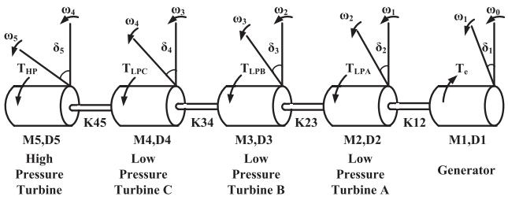  
Fig. 1. Five-Mass torsional shaft system.

the q-axis, given as

$$
\dot {\psi} _ {f d} (t) = \omega_ {R} \cdot \left[ e _ {f d} (t) - R _ {f d} i _ {f d} (t) \right], \tag {6}
$$

$$
\dot {\psi} _ {1 d} (t) = - \omega_ {R} \cdot R _ {1 d} i _ {1 d} (t), \tag {7}
$$

$$
\dot {\psi} _ {1 q} (t) = - \omega_ {R} \cdot R _ {1 q} i _ {1 q} (t), \tag {8}
$$

$$
\dot {\psi} _ {2 q} (t) = - \omega_ {R} \cdot R _ {2 q} i _ {2 q} (t), \tag {9}
$$

3) Excitation System: The excitation system contains an AVR and PSS.

$$
\dot {v} _ {1} (t) = \frac {1}{T _ {R}} \cdot \left[ v _ {t} (t) - v _ {1} (t) \right], \tag {10}
$$

$$
\dot {v} _ {2} (t) = K _ {s t a b} \cdot \Delta \dot {\omega} (t) - \frac {1}{T _ {\omega}} v _ {2} (t), \tag {11}
$$

$$
\dot {v} _ {3} (t) = \frac {1}{T _ {2}} \cdot \left[ T _ {1} \dot {v} _ {2} (t) + v _ {2} (t) - v _ {3} (t) \right]. \tag {12}
$$

In $( 4 ) - ( 1 2 ) , T _ { m } ( t ) , T _ { e } ( t ) , e _ { f d } ( t ) , i _ { f d } ( t ) , i _ { 1 d } ( t ) , i _ { 1 q } ( t ) , i _ { 2 q } ( t )$ contribute to the input vector , the remaining variables such as ωR, H , $D , R _ { f d } , R _ { 1 d } , R _ { 1 q } , R _ { 2 q } , T _ { R } , T _ { \omega } , T _ { 1 } , T _ { 2 }$ , and $K _ { s t a b }$ are actually constant parameters of generators and the excitation system, which can be found in [5].

# B. Multi-Mass Torsional Shaft Model

Although the detailed electrical circuits and the mechanical equations of a synchronous generator are given above, in reality, the mechanical part is driven by a steam turbine in conjunction with a governor system. In this paper, we apply a five-mass torsional shaft system composed of the four-mass-turbine shaft connecting with the generator rotating shaft to the dynamic simulation, as shown in Fig. 1, where $\delta _ { n }$ means the relative rotor angle of each turbine, and specifically, $\delta _ { 1 }$ is the generator rotor angle. $K _ { 4 5 }$ presents the stiffness coefficient between Mass5 and M ass4, so as to $K _ { 3 4 } , K _ { 2 3 }$ , and $K _ { 1 2 } . D _ { n }$ and $H _ { n }$ refer to the damping factor and inertia constant of each torsional shaft, respectively.

Therefore, the set of mechanical equations for the multi-mass torsional shaft model can be written as [16]:

$$
\dot {\delta_ {1}} = \omega_ {R} \cdot \Delta \omega_ {1}, \tag {13}
$$

$$
\dot {\Delta \omega} _ {1} = \frac {1}{2 H _ {1}} \left[ K _ {1 2} \left(\delta_ {2} - \delta_ {1}\right) - T _ {e} - D _ {1} \cdot \Delta \omega_ {1} \right], \tag {14}
$$

$$
\dot {\delta_ {n}} = \omega_ {R} \cdot \Delta \omega_ {n}, \tag {15}
$$

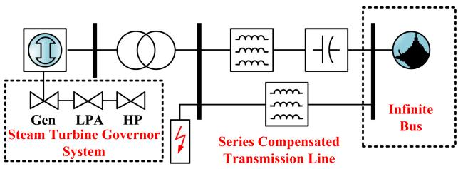  
Fig. 2. IEEE First Benchmark Test System.

$$
\Delta \dot {\omega} _ {n} =
$$

$$
\frac {\left[ T _ {n} + K _ {n} ^ {n + 1} \left(\delta_ {n + 1} - \delta_ {n}\right) - K _ {n - 1} ^ {n} \left(\delta_ {n} - \delta_ {n - 1}\right) - D _ {n} \Delta \omega_ {n} \right]}{2 H _ {n}}, \tag {16}
$$

$$
\dot {\delta} _ {5} = \omega_ {R} \cdot \Delta \omega_ {5}, \tag {17}
$$

$$
\dot {\Delta \omega} _ {5} = \frac {1}{2 H _ {1}} \left[ T _ {5} - K _ {4 5} \left(\delta_ {5} - \delta_ {4}\right) - D _ {5} \cdot \Delta \omega_ {5} \right], \tag {18}
$$

where the subscript n in (15) and (16) refers to $M a s s 2 – 4 ,$ and variables with subscript 1 constitute the mechanical functions of the generator shaft. $T _ { 1 } , T _ { 5 }$ , and $T _ { n }$ are the mechanical torque of each steam turbine. Therefore, the five masses Turbine-Generator (T-G) shaft has five modes of torsional oscillation frequencies that typically range from 10 to 35 Hz.

# C. Torsional Interaction

In a typical power transmission system which includes series compensation on transmission lines, torsional interactions among each turbine shaft may arise when system faults and sudden load changes occur. Following a disturbance, the transient power oscillation may emerge. If the resonance frequency corresponds to one of the torsional oscillation frequencies, the electrical power may interact with the T-G shaft, resulting in subsynchronous resonance [13]. Take the IEEE First Benchmark Model (FBM) in Fig. 2 for example, we can calculate the torsional oscillation frequencies by eigenvalues and verify them from FFT analysis. Fig. 2 shows the topology of FBM in Matlab/Simulink, which contains two steam-turbine shafts and one generator shaft. Therefore, the three-mass shaft model has three pairs of eigenvalues theoretically. Meanwhile, the eigenvalue analysis can be obtained from the linearized state-space form of (13)–(16). However, there is an input $T _ { e }$ in (16) which should be related to the state variables. For a small disturbance, the electromagnetic torque deviation is proportional to the generator rotor angle deviation, which can be expressed as $\Delta T _ { e } = K _ { s } \cdot \Delta \delta _ { 1 }$ , where $K _ { s }$ is the synchronizing torque coefficient [5], [17], [18]. The linearized state-space equations can be expressed by the following function:

$$
\left[ \begin{array}{l} \Delta \dot {\omega} _ {n} \\ \Delta \dot {\delta} _ {n} \end{array} \right] = \mathbf {A} \cdot \left[ \begin{array}{l} \Delta \omega_ {n} \\ \Delta \delta_ {n} \end{array} \right], \tag {19}
$$

where  refers to the state-space matrix, which, for a specific Asystem, is generated from the constant parameters $H _ { n } , D _ { n }$ $K _ { n }$ , and $K _ { s } .$ Therefore, the state matrix is constant and the

TABLE I TORSIONAL OSCILLATION FREQUENCIES AND FFT ANALYSIS   

<table><tr><td colspan="2">Eigenvalues</td><td>Frequency (Hz)</td><td>Torsional Mode</td></tr><tr><td colspan="2">-0.4971743430807 ± 226.0003376339336i</td><td>35.9691</td><td>3</td></tr><tr><td colspan="2">-0.3627485375639 ± 162.5259229903647i</td><td>25.8668</td><td>2</td></tr><tr><td colspan="2">-0.3943003150324 ± 11.3366105040643i</td><td>1.8043</td><td>1</td></tr><tr><td>Frequency (Hz)</td><td>Percentage (%)</td><td>Frequency (Hz)</td><td>Percentage (%)</td></tr><tr><td>24</td><td>1.16</td><td>40</td><td>2.29</td></tr><tr><td>28</td><td>1.49</td><td>44</td><td>1.44</td></tr><tr><td>32</td><td>2.13</td><td>48</td><td>1.31</td></tr><tr><td>36</td><td>4.91</td><td>60</td><td>100.00</td></tr></table>

eigenvalues can be obtained, along with the FFT analysis results, as listed in Table I.

The results of FFT analysis come from a three-phase to ground fault at the high voltage side of the transformer, as shown in Fig. 2. As mentioned above, a disturbance in a series compensated transmission system may excite transient power oscillations at subsynchronous frequencies which are mainly dependent on the degree of line compensation, e.g., 55% in this FBM. As Table I shows, the subsynchronous resonance after the three-phase fault is 36 Hz from FFT analysis which is almost the same as one of the natural frequencies (35.9691 Hz) from eigenvalue analysis.

# III. HYBRID AC/DC GRID MODELING

# A. Numerical Method for AC System Simulation

Traditional dynamic simulation of a single-mass synchronous generator model contains $9 ^ { t h }$ order differential equations, which can be solved by Newton-Raphson or other iterative methods. However, a higher order differential equations may lead to more iterations in every single time-step; Furthermore, the iterative method is entirely sequential which is time consuming in FTRT emulation. Since the multi-mass torsional shaft model includes 17 state variables, the iterative methods are inappropriate for hardware design. Therefore, the $4 ^ { t h }$ -order Runge-Kutta (RK4) method is applied to solve the nonlinear differential equations given below [5], [19]:

$$
R K _ {1} = d t \cdot f \left(t _ {n}, x _ {n}\right), \tag {20}
$$

$$
R K _ {2} = d t \cdot f \left(t _ {n} + \frac {d t}{2}, x _ {n} + \frac {R K _ {1}}{2}\right), \tag {21}
$$

$$
R K _ {3} = d t \cdot f \left(t _ {n} + \frac {d t}{2}, x _ {n} + \frac {R K _ {2}}{2}\right), \tag {22}
$$

$$
R K _ {4} = d t \cdot f \left(t _ {n} + d t, x _ {n} + R K _ {3}\right), \tag {23}
$$

$$
x _ {n + 1} = x _ {n} + \frac {1}{6} \left(R K _ {1} + 2 R K _ {2} + 2 R K _ {3} + R K _ {4}\right). \tag {24}
$$

where dt refers to the time-step, $x _ { n }$ is the state variable of the synchronous generator. In a trade-off between the accuracy and simulation efficiency, a time-step of 3 ms has been applied to the AC grid.

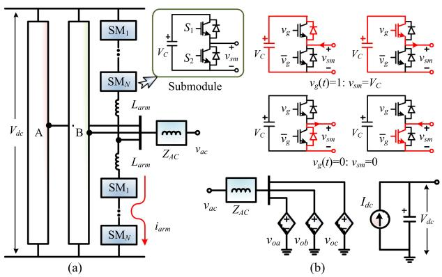  
Fig. 3. Illustration of modular multilevel converter modeling: (a) Three-phase topology, (b) average value model.

# B. MMC AVM for Power Flow Analysis

The FTRT simulation prefers models that induce the least computational burden whilst ensuring sufficient accuracy, and adopting the average value model (AVM) for a modular multilevel converter (MMC) [20], [21] is justified by the type of study, where power flow, instead of converter details, is the main concern. Compared with its detailed counterpart [22] shown in Fig. 3(a), the hardware latency of AVM is much lower, while it retains the capability to provide power flow under the influence of a controller.

Assuming that the MMC is internally balanced, each submodule can then be deemed as a voltage pulse source whose width is determined by the gate signal of the upper switch, as it is obvious from Fig. 3(b) that the submodule capacitor is inserted under ON-state, whilst the OFF-state indicates that it is bypassed.

Since the voltage of an arbitrary SM capacitor equals to the DC bus voltage divided by the total number of submodules in an arm, denoted as N, the equivalent voltage source can be expressed as

$$
v _ {s m (i)} (t) = \frac {V _ {d c}}{N} \cdot s g n \left[ s g n \left(v _ {g (i)} (t) - V _ {t h}\right) + 1 \right], \tag {25}
$$

where $v _ { g ( i ) } ( t )$ represents a time-varying gate signal of the upper IGBT, whose threshold voltage is $V _ { t h }$ , and the sign function sgn yields +1, 0, and −1 when the expression inside it is greater than, equal to, or less than 0, respectively. As a result, the arm voltage equals to

$$
v _ {a r m} = \sum_ {i = 1} ^ {N} v _ {s m (i)} + L _ {a r m} \frac {d i _ {a r m}}{d t}, \tag {26}
$$

where $L _ { a r m }$ denotes the arm inductance.

The well-balanced condition in the AVM yields no circulating current, meaning that the differential term in the above equation can be omitted and the AC side output voltage becomes a vector sum of voltages of the two arms,

$$
v _ {o} = \frac {V _ {d c}}{N} \left(\sum_ {i = 1} ^ {N} S _ {S M (i)} - \sum_ {i = N + 1} ^ {2 N} S _ {S M (i)}\right), \tag {27}
$$

where

$$
S _ {S M (i)} = \operatorname {s g n} \left[ \operatorname {s g n} \left(v _ {g (i)} (t) - V _ {t h}\right) + 1 \right], \tag {28}
$$

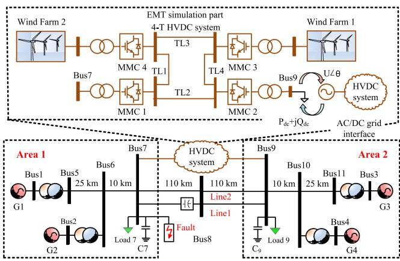  
Fig. 4. Topology of hybrid AC/DC grid.

denotes the ON-OFF state of a submodule. Then, the two-arm structure can be simplified into a single-arm equivalence, as demonstrated in Fig. 3(b), so that the corresponding hardware design on FPGA reduces to the minimum to achieve the fastest response to contingencies in the external power grid.

The MMC provides a stable voltage on the AC side to the wind farm composing of a number of wind turbines, whose output power takes the form of

$$
P _ {W T} = \frac {1}{2} \rho \pi R ^ {2} v _ {w} ^ {3} C _ {p}, \tag {29}
$$

where $\rho$ means the air density, R the wind turbine radius, $v _ { w }$ the wind speed, and $C _ { p }$ indicates the wind turbine’s capability of converting kinetic energy into mechanical energy [23]. In the wind farm, some wind turbines are operating while the others remain standby in order to maintain a stable power system. Therefore, the total output power of a wind farm can be roughly regulated by either changing the power command or adjusting the number of wind turbines in service.

# C. AC-DC Grid Interface

The topology of a hybrid AC/DC grid is shown in Fig. 4, where the two-area system connects with the 4-terminal HVDC via Bus 7 and Bus 9. Meanwhile, MMC 1 and MMC 2 operate as inverter stations, and the remaining two terminals connected with two individual wind farms act as rectifier stations. The two areas are connected by two parallel transmission lines, in which Line 1 has a series compensator and the compensated factor is 80%, and Line 2 is a traditional π model transmission line. To reveal the dynamic process of the HVDC system, a time-step of 200 $\mu \mathrm { s }$ is adopted in the EMT simulation. However, the two-area Kundur’s system undergoing the stability analysis has a time-step of 3 ms, which is 15 times larger. Therefore, in order to establish an integrated co-simulation time-step scheme, the DC system should send data to the AC grid in every 15 time steps. Moreover, to keep the accuracy, an updated admittance matrix of the AC network should be solved in every time-step.

Due to distinct simulation strategies in the AC and DC grid, their interface should be designed properly to keep the integrated system stable. Therefore, the inverter stations at the point of common coupling (PCC) are treated as time-varying $P { + } j Q$ loads, which means both of the P and $Q$ values update every

TABLE II SPECIFICS OF DETAILED MMC HARDWARE MODULES   

<table><tr><td>Module</td><td>Latency</td><td>BRAM</td><td>DSP</td><td>FF</td><td>LUT</td></tr><tr><td>MMCDetailed</td><td>170 Tclk</td><td>0</td><td>75</td><td>25418</td><td>40960</td></tr><tr><td>MMCCNT</td><td>185 Tclk</td><td>0</td><td>58</td><td>10013</td><td>19077</td></tr><tr><td>HVDCNetwork</td><td>107 Tclk</td><td>0</td><td>20</td><td>2958</td><td>4098</td></tr></table>

3 ms. Meanwhile, the instantaneous voltages represented by a combination of amplitude U and phase angle θ at Bus 7 and Bus 9 are the inputs of the EMT simulation. Therefore, the mechanism of the interface is as follows: the MMC stations provide timevarying $P { + } j Q$ loads to the AC grid in every 15 EMT time-steps. Meanwhile, the AC grid will calculate the admittance matrix and subsequently solve the differential equations of synchronous generators in parallel. The consequently obtained PCC phase voltages $U \angle \theta$ are delivered to the DC grid in return.

Based on the proposed interface, regardless of the MMC model, the HVDC part can always be deemed as a time-varying complex power $P { + } j Q$ injection to the AC system, and the dynamic simulation provides a converter station with AC bus voltage amplitude and phase angle in complex domain for the EMT simulation. Meanwhile, the $d \ – q$ frame-based control schemes in both AVM and detailed model are largely the same and the impact of the controller on the HVDC can be reflected in both cases. Therefore, there is no significant difference in power injection by using AVM and a detailed model. Regarding model validation, in order to make a reasonable and fair comparison for the FTRT simulation results, the MMC AVM is also applied to the Matlab/Simulink simulation. In Table II, we provide the latencies and resources of the MMC detailed model. Comparing with the AVM, the latencies and hardware resources of a detailed model are a little larger. With a maximum time-step of 50 μs, the detailed model has an FTRT ratio of ${ \frac { 5 0 \mu s } { 1 8 5 { \cdot } 1 0 n s } } \approx \dot { 2 } 7$ , which is slower than the AVM. Therefore, the AVM was chosen for FTRT simulation without compromising the simulation accuracy.

# IV. HARDWARE EMULATION ON FPGA

The embedded FTRT algorithm is implemented on the Xilinx Virtex UltraScale+ XCVU9P FPGA board which features 1182240 look-up tables (LUTs), 2364480 flip-flops (FFs), 6840 DSP slices, and a maximum transceiver speed of 32.75 Gb/s. Fig. 5(a) shows the hardware setup used in this work. The highly parallel hardware architecture of the FPGA greatly shortens the latency induced by mathematical operations and thus enables conducting the real-time as well as FTRT emulation of a variety of converter-integrated power systems. The Xilinx HLS tool which enables VHDL code auto-generation ensures reliable delivery of hardware design in addition to being able to significantly shorten the design stage, and therefore, it was adopted [24]. Then, Xilinx Vivado can synthesize the generated IP package from the HLS tool into the overall hardware design. In a practical power system, the Joint Test Action Group (JTAG) and the Universal Asynchronous Receiver Transmitter (UART) interfaces enable the interconnection of host computer and the FPGA board. With an in-circuit-emulator, in-circuit-debug, and

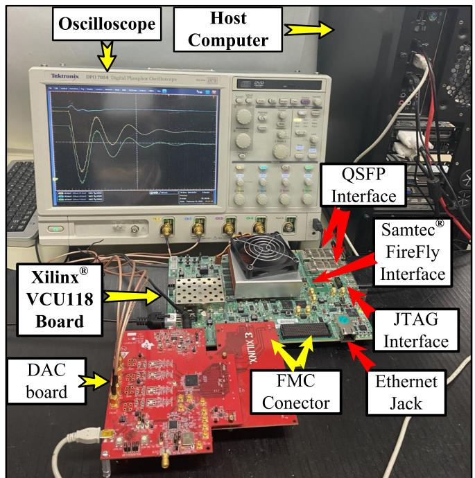

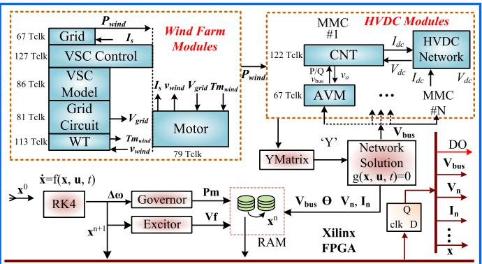  
  
（b）  
Fig. 5. Hardware design scheme of hybrid AC/DC grid: (a) FTRT emulator hardware setup, (b) hardware design scheme of hybrid AC/DC grid.

in-system-program capability, the JTAG connector can be utilized for hardware-in-loop (HIL) simulation of the desired power system. The UART, on the other hand, is a general-purpose serial data bus, which can write and debug programs to the device. Meanwhile, the data from the real power transmission system is delivered to the FPGA board running a virtual grid via Samtec FireFly connector, Quad Small Form-factor Pluggable (QSFP) interface or Ethernet connector. The dual-QSFP cages are a bidirectional communication and networking interface, which has a maximum transmission speed of up to $4 \times 2 8$ Gbps. Therefore, they are mainly used for communication among FPGAs. The FireFly connector from Samtec provides up to $4 \times 2 8$ Gbps full-duplex bandwidth in 4 channels from an FPGA to an industry-standard multi-mode fiber optic cable, which can be used for optical data communication as well as support cable lengths up to 100 m. The traditional Ethernet port can be applied as a backup since it can only reach a maximum speed of 1000 Mbps. Hence, with a significant reduction in communication delay, the QSFP and Samtec FireFly interfaces

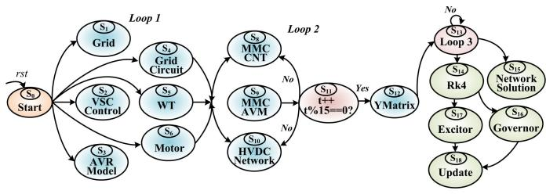  
Fig. 6. Top-level finite state machine for the hardware modules.

are suitable for data exchange with external devices or other FPGA devices. Then, the grid status data is transmitted to the corresponding FTRT-algorithm-embedded FPGA in the control center where the optimal solution to the system contingency is emulated prior to mitigating and eliminating the hazardous impact by the actual equipment.

Fig. 5(b) shows the mechanism of the hardware design strategy for the hybrid AC/DC grid, where blocks grouped together refer to the EMT simulation of the wind farm as well as the 4-terminal HVDC grid. The modules inside the wind farm can be solved in parallel using pipeline design, albeit the Grid Circuit provides the mechanical torque to Motor. Theoretically, both the wind farm and the HVDC should calculate 15 times before synchronization with the AC grid. However, the wind farm power is nearly constant in 15 time-steps, which is 3 ms. Considering the EMT simulation will diverge as long as the time-step is larger than 200 μs, the wind speed remains unchanged in a duration of 3 ms in order to keep convergence and improve the simulation efficiency. Therefore, the virtual time-step for the wind farm is treated as 3 ms.

The HVDC grid is comprised of three modules, where the CNT, AVM, and the HVDC network can be pipelined and computed concurrently. As the dynamic simulation needs the power supply from the DC grid, the module YMatrix receives instantaneous P and Q value to calculate the new admittance matrix. Then, the dynamic simulation comes to AC modules, where only Governor and Excitor can be solved in parallel. Once the dynamic simulation completes in one time-step, the AC bus voltage provides U and θ to the DC grid. Meanwhile, the results of the co-simulation can be displayed on the oscilloscope.

As has been mentioned, the time-step of EMT simulation is much smaller than that of its dynamic counterpart, therefore a top-level finite state machine (FSM) should be generated, as shown in Fig. 6, to maintain a proper sequence of each hardware module. In a specific power transmission system, the data is delivered to the FPGA board through the QSFP interface. The emulation starts once the data is successfully received, Loop 1 refers to the wind farm EMT simulation, where all the modules are solved concurrently. The fact that the HVDC grid utilizes 200 μs as the time-step means that the DC grid should be computed 15 times more frequent than the AC side. Afterward, the new admittance matrix can be obtained in YMatrix. In Loop 3, the nonlinear differential equations are solved in RK4, which targets the control systems of the synchronous generator, followed by the network equations. The results of control systems will be applied in the next time-step. Table III is a summary of

TABLE IIISPECIFICS OF MAJOR AC/DC GRID HARDWARE MODULES  

<table><tr><td>Module</td><td>Latency</td><td>BRAM</td><td>DSP</td><td>FF</td><td>LUT</td></tr><tr><td>Grid</td><td>67 Tclk</td><td>24</td><td>338</td><td>9672</td><td>22574</td></tr><tr><td>VSCcontrol</td><td>127 Tclk</td><td>20</td><td>240</td><td>18825</td><td>40046</td></tr><tr><td>VSCmodel</td><td>86 Tclk</td><td>0</td><td>38</td><td>3454</td><td>3752</td></tr><tr><td>Gridcircuit</td><td>81 Tclk</td><td>0</td><td>7</td><td>1475</td><td>2169</td></tr><tr><td>WT</td><td>113 Tclk</td><td>0</td><td>43</td><td>5085</td><td>8929</td></tr><tr><td>Motor</td><td>79 Tclk</td><td>0</td><td>66</td><td>5128</td><td>9219</td></tr><tr><td>MMCAVM</td><td>67 Tclk</td><td>0</td><td>24</td><td>6637</td><td>10604</td></tr><tr><td>MMCCNT</td><td>122 Tclk</td><td>0</td><td>68</td><td>7406</td><td>13526</td></tr><tr><td>HVDCNetwork</td><td>107 Tclk</td><td>0</td><td>20</td><td>2958</td><td>4098</td></tr><tr><td>Ymatrix</td><td>1470 Tclk</td><td>6</td><td>1106</td><td>133972</td><td>129108</td></tr><tr><td>RK4</td><td>199 Tclk</td><td>16</td><td>315</td><td>29709</td><td>45721</td></tr><tr><td>Network</td><td>269 Tclk</td><td>16</td><td>534</td><td>43928</td><td>57664</td></tr><tr><td>Excitor</td><td>29 Tclk</td><td>0</td><td>17</td><td>3783</td><td>6598</td></tr><tr><td>Governor</td><td>188 Tclk</td><td>0</td><td>22</td><td>6105</td><td>10666</td></tr><tr><td>Update</td><td>33 Tclk</td><td>0</td><td>38</td><td>4951</td><td>6875</td></tr><tr><td>Total</td><td>4174 Tclk</td><td>82</td><td>2876</td><td>283079</td><td>371549</td></tr><tr><td></td><td>-</td><td>1.90%</td><td>42.05%</td><td>11.97%</td><td>31.43%</td></tr><tr><td>XCVU9P</td><td>-</td><td>4320</td><td>6840</td><td>2364480</td><td>1182240</td></tr></table>

hardware design specifics, where the latency is defined in clock cycles and the main hardware resource utilization is listed. Due to parallelism, the wind farm latency is deemed as 127 $T _ { c l k }$ and thus, its FTRT ratio reaches over 200μs127 10ns $\frac { 2 0 0 \mu s } { 1 2 7 . 1 0 n s } \approx 1 5 7$ . Similarly, the MMCAVM, MMCCNT, and HVDCNetwork are fully parallelized, and among them, the largest latency is 122 $T _ { c l k }$ , under an FPGA clock frequency of 10ns, the FTRT ratio is calculated $\begin{array} { r } { \operatorname { a s } \frac { 2 0 0 \mu s } { 1 2 2 \cdot 1 0 n s } \approx 1 6 4 } \end{array}$ . In the meantime, the dynamic simulation has a total latency calculated by $1 4 7 9 + 1 9 9 + 2 6 9 + 1 8 8 + 3 3 =$ $2 1 3 8 T _ { c l k }$ , which is $\frac { 3 m s } { 2 1 3 8 { \cdot } 1 0 n s } \approx$ 138 times faster than real-time. Although the EMT simulation has a higher FTRT ratio, in hardware design, the EMT simulation should wait for the AC grid to complete in order to keep synchronization, meaning the total FTRT ratio is about 138.

It is noted that the Ymatrix module has the largest latency among other modules. For the testing system, the converter stations are treated as the time-varying complex power $P { + } j Q$ The main task of Ymatix module is calculating the admittance matrix. Although this module performs calculation in every time-step, the only changes are the components at the PCC in the admittance matrix (Y). In this case, to reveal the dynamic process of MMCs, the element $Y ( 7 , 7 )$ and $Y ( 9 , 9 )$ in the admittance matrix should be resolved in every time-step. Since the transmission line or the fixed shunt capacitors remain stable in a specific power transmission system, the latency of the Ymatrix module will not increase with the system size, it only related to the interfaces between the HVDC part and the AC system. Similarly, due to the fact that network equations and DAEs of each synchronous machine can be solved in parallel, the increase of the generators challenges the hardware resources rather than the latency. For example, the Ultrascale+ FPGA VCU118 evaluation board can accommodate large systems such as the IEEE 39-bus system with a maximum hardware resource utilization of 73.3%, and the same latency as in the Kundur’s two-area case. As a result, the FTRT ratio can be maintained even though the AC system expands. Moreover, the hardware resource burden can be alleviated by interconnecting multiple FPGA boards when

TABLE IV EIGENVALUE ANALYSIS OF FIVE-MASS TORSIONAL SHAFT AND FFT ANALYSIS   

<table><tr><td colspan="2">Eigenvalues</td><td>Frequency (Hz)</td><td>Torsional Mode</td></tr><tr><td colspan="2">-0.0617913744225 ± 777.4154871513625i</td><td>123.730</td><td>5</td></tr><tr><td colspan="2">-0.0398957979074 ± 280.1332882191073i</td><td>44.585</td><td>4</td></tr><tr><td colspan="2">-0.0812398973282 ± 167.0512211097699i</td><td>26.587(≈27)</td><td>3</td></tr><tr><td colspan="2">-0.0348365892891 ± 83.7505682682303i</td><td>13.329</td><td>2</td></tr><tr><td colspan="2">-0.0584038300879 ± 9.7600253406880i</td><td>1.553</td><td>1</td></tr><tr><td>Frequency (Hz)</td><td>Percentage (%)</td><td>Frequency (Hz)</td><td>Percentage (%)</td></tr><tr><td>18</td><td>1.17</td><td>27</td><td>2.98</td></tr><tr><td>21</td><td>1.48</td><td>33</td><td>0.89</td></tr><tr><td>24</td><td>2.72</td><td>36</td><td>0.70</td></tr></table>

the AC/DC system is enlarged, or with a sufficient FTRT ratio, a trade-off can be made between simulation speed and hardware resources without adding another FPGA board.

# V. HARDWARE EMULATION RESULTS AND VALIDATION

# A. Eigenvalue Analysis

In the proposed AC/DC hybrid simulation, each synchronous machine has a five-mass shaft, whose model corresponds to five pairs of eigenvalues. The eigenvalue analysis results and the FFT analysis are given in Table IV, based on a three-phase to ground fault on Bus 7, where the fault period is 90 ms. Due to the aforementioned series capacitor compensation between Bus 7 and Bus 9, a major contingency like the fault may cause the instantaneous power oscillations in the AC system. Furthermore, if the electrical oscillation frequency is close to or the same as one of the shaft natural frequencies, the torsional interaction will occur. As Table IV shows, the subsynchronous resonance frequency after the three-phase to ground fault is about 27 Hz from the FFT analysis results, which is matched with one of the natural frequencies, i.e., 26.587 Hz.

# B. Case 1: Three-Phase-to-Ground Fault

The three-phase-to-ground fault test is based on the system configuration in Fig. 4, which is a combination of the two-area system and a four-terminal HVDC grid connecting with offshore wind farms. Under steady-state, the HVDC link between Bus 7 and Bus 9 delivers 100 MW from Area 1 to Area 2 via the DC transmission line T L 2 whilst the total transmitted power of the other two links, i.e., the compensated Line 1 and the uncompensated Line 2, is 300 MW, which means that Area 2 has a net power inflow of 400 MW. At the time of 3.0 s, a three-phase ground fault takes place at Bus 7 with a duration of 90 ms. When the fault encounters, the transmission power of the HVDC system remains stable at 100 MW while Line 1 and Line 2 are considered to connect to the power grid all the time. As a result, in Fig. 7(a), the torque experiences a drastic oscillation that keeps amplifying during the process and at the time of 12 s, it reaches approximately 3.0 p.u. Consequently, the rotor angles, as that of G3 and G4 given in Fig. 7(b) for instance, are no longer stable. In the meantime, the envelope of three-phase generator terminal voltage starts to oscillate and introduces a noticeable SSR phenomenon, shown in Fig. 7(c)–(d).

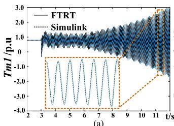

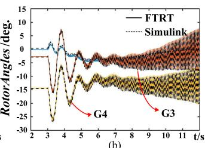

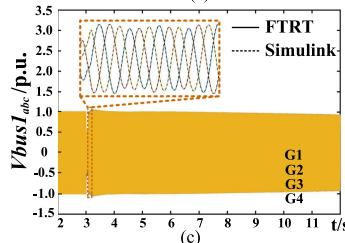

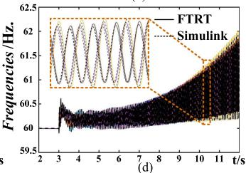

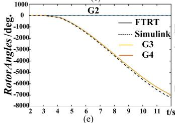

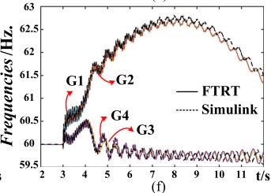  
Fig. 7. Torsional interaction phenomenon under FTRT co-simulation: (a) Mechanical torque of generator 1, (b) relative rotor angles, (c) three-phase voltage of Bus 1, (d) generator frequencies, (e) relative rotor angles after remove the compensated line, and (f) frequencies after remove the compensated line.

In Fig. 7(e)–(f), the investigation of cutting off the compensated line (Line 1) is conducted at the time of 3.09 s with the same grid topology. As a result, the rotor angle decreases enormously to −8000 p.u. and loses synchrony while its frequency can not maintain at the same level as prior to the fault. Thus, it is proposed that the HVDC transmission system should play the role of delivering more power to alleviate the burden of Line 2. The FTRT emulation results match up with that of the Simulink accurately in Fig. 7 which proves the correctness of proposed modeling and hardware implementation methods and the AC grid dynamic simulation part is as accurate as the EMT simulation in Matlab/Simulink following the introduction of the multi-mass model.

1) Mitigation Strategies: The mitigation of SSR can be conducted in two ways: 1) Install a Flexible AC Transmission Systems (FACTS) device to dynamically change the series compensation factor; 2) Change of the transmission grid configuration by utilizing the bypass topology. In this work, the second one is employed to reduce the burden of Line 2. In Fig. 8(a), it shows the remedial effect of cutting off Line 1 and increasing the HVDC transmission power from 100 MW to 300 MW. The oscillating torques of four generators in the two-area system steadily converge to the static operation value, as given in Fig. 8(b)–(e) while the rotor angle in Fig. 8(f) can be synchronized at the new static state eventually. Hence, it is reasonable to apply such a strategy to mitigate the SSR phenomenon in this case where the emulation results in concrete lines are also highly consistent with the Simulink simulation results drawn in dashed lines. In a practical power system, once a serious contingency occurs and is

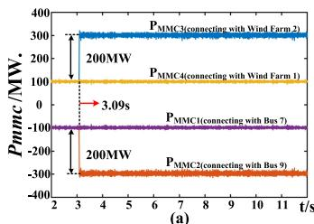

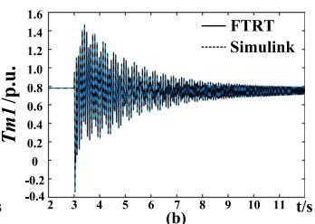

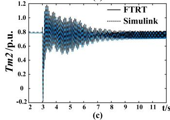

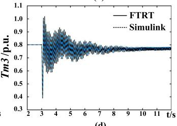

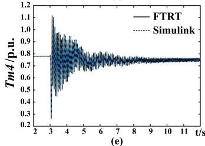

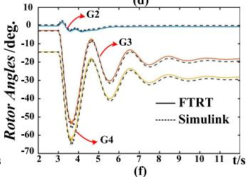  
Fig. 8. The results of power injection for mitigation the torsional interaction: (a), (b) , (c) and (d) Mechanical torques, (e) relative rotor angles compared with generator 1, (f) active power resulting from FTRT co-simulation

detected, the peripheral devices would deliver the recorded data to the FPGA boards running a virtual grid via Samtec FireFly connector or QSFP interface. In the control center, there could be a number of FTRT hardware platforms running the scenario with various potential solutions simultaneously and then they come up with an optimum one that helps maintain the synchronism of the generators and mitigate the torsional oscillation. Scanning the power that should be delivered by the HVDC is performed. In addition, other control actions and the consequent system response could also be simulated on several FPGA boards in the control center. Nevertheless, as power scanning is sufficient to demonstrate how FTRT is developed and used to maintain a stable system, those additional control strategies requiring multiple FPGA boards are not carried out in this work. Instead, only the effective solution is given, since other control actions that are unable to stabilize the system will be automatically bypassed and not implemented. With a sufficient response margin over real-time, the control center would have enough time to deal with the contingencies as well as make an optimal decision.

2) FTRT Justification: The fact that the electro-mechanical phenomenon lasts dozens of seconds or even longer justifies the feasibility of using FTRT for the power system stability maintenance. Once the signals are delivered to the control center after some delay, the FPGA based emulator can study the system and give proper strategies and quantified regulations instantly, whilst the electro-mechanical oscillation is still at its initial stage. So, a high FTRT ratio leaves the control center sufficient time to maintain a stable system.

Therefore, the difference between FTRT and real-time simulation is significant, as the latter type of simulation would never be able to catch up with the real system when the communication

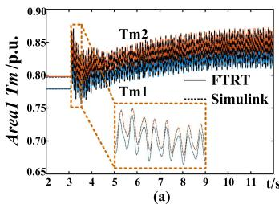

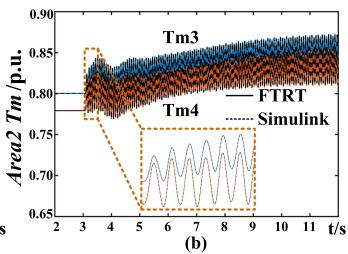

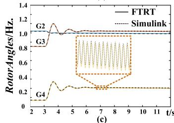

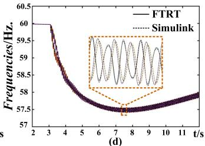

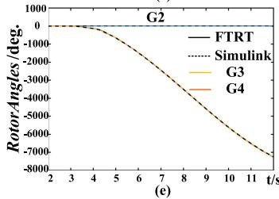

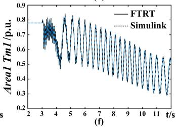  
Fig. 9. Torsional interaction for hybrid AC/DC grid under long term over load on bus 9: (a) Mechanical torques for area 1, (b) mechanical torques for area 2, (c) relative rotor angles compared with generator 1, (d) frequencies under long term over load, (e) and (f) rotor angles and mechanical torques of generator 1 for only bypass the compensated Line 1, respectively.

delay is taken into account since they are synchronized in the time axis, let alone giving predictive system results to stabilize the power system. In stark contrast, with a dramatic 138 times faster than real-time and an electro-mechanical process lasting much longer than the communication latency, the FTRT simulation can make up for the delay and consequently give the proper strategy in advance for the real system to follow to mitigate the SSI.

# C. Case 2: Long-Term Overload

In Case 2, both MMC 3 and MMC 4 respectively transmits 100 MW power to the two-area system under steady-state. A 200 MW overload on Bus 9 is simulated at t = 3.0 s. In Fig. 9(a)–(b), the torsional interaction can be observed for all four generators with a grid configuration given in Fig. 4. Under this circumstance, the compensated Line 1 induces the electrical oscillation on the grid side and the torsional interaction on the mechanical side of the generators. Cutting off the compensated line (Line 1) when the grid side experiences SSR phenomenon can be adopted as the normal operation for Case 2. However, this strategy significantly debilitates the synchronization capability of the four generators system because Line 2 is inadequate to solely deliver an extra power of 600 MW to Area 2, as shown in Fig. 9(e)–(f). To alleviate the stress of Line 2, power injection from the wind farm can be a promising answer to reduce the SSR and increase the synchronization capability of the generators, suppose there is a sufficient number of standby wind turbines. Due to the instability of regional wind speed, Wind Farm 1 (WF1) and Wind Farm 2 (WF2) transmit around 380–420 MW

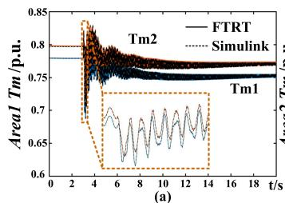

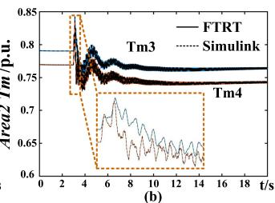

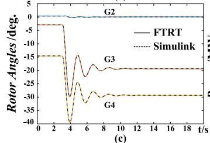

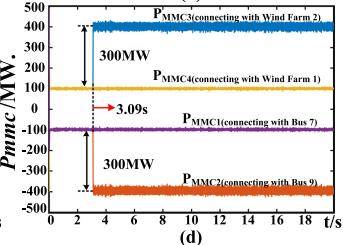  
Fig. 10. FTRT co-simulation results of mitigation the torsional interaction during long term over load: (a) (b) Mechanical torques of Area1 and Area 2, (c) relative rotor angles, (d) active power of MMCs.

TABLE V MAXIMUM RELATIVE ERRORS UNDER DIFFERENT CONTINGENCIES   

<table><tr><td>Contingencies</td><td>Tm</td><td>RotorAngle</td><td>Frequency</td></tr><tr><td>Three Phase Fault</td><td>0.26%</td><td>-0.95%</td><td>-0.11%</td></tr><tr><td>Mitigation after Fault</td><td>0.24%</td><td>-0.97%</td><td>-0.12%</td></tr><tr><td>Overload</td><td>0.22%</td><td>-0.24%</td><td>-0.18%</td></tr><tr><td>Mitigation after Overload</td><td>0.20%</td><td>-0.35%</td><td>-0.15%</td></tr></table>

power to Bus 9 and 90–110 MW power to Bus 7 at 3.09 s, respectively. As can be seen in Fig. 10(a)–(b), all the oscillated generator torques attenuate and eventually restore to the steadystate operation value which validates the efficacy of proposed power injection method. Meanwhile, the rotor angles can be synchronized at the new steady-state ultimately, as shown in Fig. 10(c). Fig. 10(d) gives the results of the MMC transmission power trend under the overload scenario.

# D. Error Analysis

Fig. 7(a)–(d) illustrate the torsional oscillation phenomenon as a consequence of the three-phase-to-ground fault at Bus 7. In order to validate the accuracy of the proposed algorithm, the waveforms are zoomed-in. Among them, the solid lines refer to the results from FTRT simulation, and the dash lines represent the offline simulation results from Simulink with the same grid configuration. From the zoomed-in plots in Fig. 7, the maximum relative error of the FTRT simulation is −0.95%, according to the formula below:

$$
\epsilon = \frac {V _ {F T R T} - V _ {\text {Simulink}}}{V _ {\text {Simulink}}} \times 100 \%, \tag{30}
$$

where $V _ { F T R T }$ and $V _ { S i m u l i n k }$ refer to the results from FTRT simulation and Simulink respectively. Similarly, according to the zoomed-in plots in Fig. 9 and Fig. 10, the maximum relative errors are 0.24% under the long-term overload circumstance and 0.35% after mitigation. Table V provides the maximum relative errors under various contingencies.

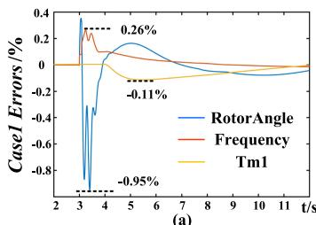

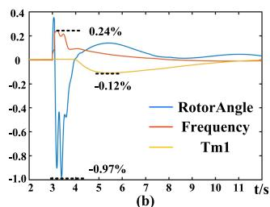

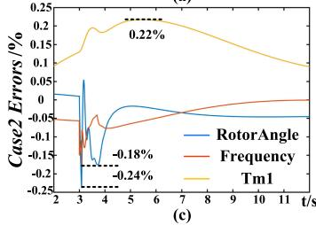

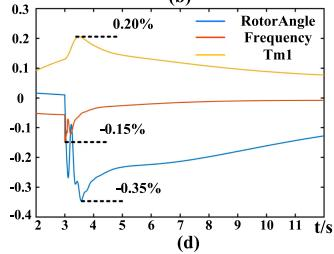  
Fig. 11. Relative errors under different contingencies: (a) Three phase fault, (b) Mitigation after fault, (c) Overload, (d) Mitigation after Overload.

In Fig. 11, the relative errors of rotor angle, frequency, and mechanical torque of G1 are drawn. It shows that the maximum error appears when a serious contingency occurs. The maximum error among these four contingencies is 0.97%, which thoroughly demonstrates the accuracy of the proposed method. Due to a trade-off between the accuracy and simulation speed, the FTRT simulation adopts the 32-bit single-precision data type. On the contrary, the inherent data type in Simulink is 64-bit double-precision. Therefore, during the hardware emulation, the single-precision data type may result in a small fraction of data loss, which in turn leads to errors that could be neglected in the figure. Therefore, we can conclude that it is reasonable to apply the single-precision data type in FTRT simulation since the accuracy can be guaranteed.

# VI. CONCLUSION

This paper proposed an active power control method to mitigate the subsynchronous interaction using faster-than-real-time emulation of hybrid AC/DC grid. The introduction of the multimass torsional shaft into a dynamic simulation can demonstrate the SSR phenomenon under three-phase fault and long-term overload. Compared with EMT simulation, the proposed model applied a larger time-step of 3 ms, which is convenient to achieve FTRT in hardware emulation. Furthermore, the proposed algorithm is suitable for the energy control center to eliminate the influence of torsional interaction after a serious disturbance. With the 138 times faster-than-real-time execution, the energy control center has enough time to predict the power system stabilities and selecting a proper power injection factor to maintain the system stable. The FTRT dynamic simulation results of the integrated AC/DC grid are highly matched with the Matlab/Simulink. Therefore, the FTRT co-simulation can help mitigate the contingencies in an extremely small time span, which is significantly meaningful in a practical power transmission system. Meanwhile, the proposed FTRT algorithm is applied on a single Xilinx Virtex UltraScale+ XCVU9P FPGA

board. Once the system components become larger, it is possible for executing the FTRT emulation on multiple FPGA boards.

# REFERENCES

[1] I. Konstantelos et al., “Implementation of a massively parallel dynamic security assessment platform for large-scale grids,” IEEE Trans. Smart Grid, vol. 8, no. 3, pp. 1417–1426, May 2017.   
[2] B. Gao, R. Torquato, W. Xu, and W. Freitas, “Waveform-based method for fast and accurate identification of subsynchronous resonance events,” IEEE Trans. Power Syst., vol. 34, no. 5, pp. 3626–3636, Mar. 2019.   
[3] H. D. Giesecke, “Measuring torsional natural frequencies of turbine generators by on-line monitoring,” in Proc. Int. Joint Power Gener. Conf., Jan. 2003, pp. 607–613.   
[4] “Terms, definitions and symbols for subsynchronous oscillations,” IEEE Trans. Power App. Syst., vol. PAS-104, no. 6, pp. 1326–1334, Jun. 1985.   
[5] P. Kundur, Power System Stability and Control. New York, NY, USA: McGraw-Hill, 1994.   
[6] L. Wang and K. Morison, “Implementation of online security assessment,” IEEE Power Energy Mag., vol. 4, no. 5, pp. 46–59, Sep. 2006.   
[7] L.-F. Pak, M. Faruque, X. Nie, and V. Dinavahi, “A Versatile cluster-based real-time digital simulator for power engineering research,” IEEE Trans. Power Syst., vol. 21, no. 2, pp. 455–465, May 2006.   
[8] V. Jalili-Marandi and V. Dinavahi, “SIMD-based large-scale transient stability simulation on the graphics processing unit,” IEEE Trans. Power Syst., vol. 25, no. 3, pp. 1589–1599, Aug. 2010.   
[9] N. Lin and V. Dinavahi, “Detailed device-level electrothermal modeling of the proactive hybrid HVDC breaker for real-time hardware-in-the-loop simulation of DC grids,” IEEE Trans. Power Electron., vol. 33, no. 2, pp. 1118–1134, Feb. 2018.   
[10] T. Liang and V. Dinavahi, “Real-Time Device-Level Simulation of MMC-Based MVDC Traction Power System on MPSoC,” IEEE Trans. Transp. Electrific., vol. 4, no. 2, pp. 626–641, Apr. 2018.   
[11] D. Lee, R. Beaulieu, and G. Rogers, “Effects of governor characteristics on turbo-generator shaft torsionals,” IEEE Trans. Power App. Syst., vol. PAS-104, no. 6, pp. 1254–1261, Jun. 1985.   
[12] L. Wang, X. Xie, Q. Jiang, and H. R. Pota, “Mitigation of multimodal subsynchronous resonance via controlled injection of supersynchronous and subsynchronous currents,” IEEE Trans. Power Syst., vol. 29, no. 3, pp. 1335–1344, Dec. 2013.   
[13] H. A. Mohammadpour and E. Santi, “SSR damping controller design and optimal placement in rotor-side and grid-side converters of seriescompensated DFIG-based wind farm,” IEEE Trans. Sustain. Energy, vol. 6, no. 2, pp. 388–399, Jan. 2015.   
[14] X. Xie, X. Zhang, H. Liu, Y. Li, and C. Zhang, “Characteristic analysis of subsynchronous resonance in practical wind farms connected to seriescompensated transmissions,” IEEE Trans. Energy Convers., vol. 32, no. 3, pp. 1117–1126, Mar. 2017.   
[15] K. Morison, L. Wang, and P. Kundur, “Power system security assessment,” IEEE Power Energy Mag., vol. 2, no. 5, pp. 30–39, Oct. 2004.   
[16] B. Cassimere, B. F. Evans, D. E. Martin, and S. Yang, “Power oscillation impact on generator/turbine interaction for an isolated power system,” IEEE Trans. Ind. Appl., vol. 51, no. 3, pp. 2657–2664, Nov. 2015.   
[17] P. Pourbeik, D. G. Ramey, N. Abi-Samra, D. Brooks, and A. Gaikwad, “Vulnerability of large steam turbine generators to torsional interactions during electrical grid disturbances,” IEEE Trans. Power Syst., vol. 22, no. 3, pp. 1250–1258, Jul. 2007.   
[18] N. Johansson, L. Angquist, and H.-P. Nee, “A comparison of different frequency scanning methods for study of subsynchronous resonance,” IEEE Trans. Energy Convers., vol. 32, no. 3, pp. 1117–1126, Mar. 2017.   
[19] C. Gear, “Simultaneous numerical solution of differential-algebraic equations,” IEEE Trans. Circuit Theory, vol. 18, no. 1, pp. 85–96, Jan. 1971.   
[20] A. Beddard, C. E. Sheridan, M. Barnes, and T. C. Green, “Improved accuracy average value models of modular multilevel converters,” IEEE Trans. Power Del., vol. 31, no. 5, pp. 2260–2269, Oct. 2016.   
[21] M. Hagiwara and H. Akagi, “Control and experiment of pulsewidthmodulated modular multilevel converters,” IEEE Trans. Power Electron., vol. 24, no. 7, pp. 1737–1746, Jul. 2009.

[22] U. N. Gnanarathna, A. M. Gole, and R. P. Jayasinghe, “Efficient modeling of modular multilevel HVDC converters (MMC) on electromagnetic transient simulation program,” IEEE Trans. Power Del., vol. 26, no. 1, pp. 316–324, Jan. 2011.   
[23] G. Abad, Doubly Fed Induction Machine: Modeling and Control for Wind Energy Generation Applications. Hoboken, NJ, USA: Wiley, 2011.   
[24] S. Jin, Z. Huang, R. Diao, D. Wu, and Y. Chen, “Comparative implementation of high performance computing for power system dynamic simulations,” IEEE Trans. Smart Grid, vol. 8, no. 3, pp. 1387–1395, May 2017.

Shiqi Cao (Student Member, IEEE) received the B.Eng. degree in electrical engineering and automation from the East China University of Science and Technology, Shanghai, China, in 2015, and the M.Eng. degree in power system from Western University, London, ON, Canada, in 2017. He is currently working toward the Ph.D. degree in electrical and computer engineering with the University of Alberta, Edmonton, AB, Canada. His research interests include transient stability analysis, power electronics, and field programmable gate arrays.

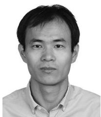

Ning Lin (Member, IEEE) received the B.Sc. and M.Sc. degrees in electrical engineering from Zhejiang University, Hangzhou, China, in 2008 and 2011, respectively, and the Ph.D. degree in electrical and computer engineering from the University of Alberta, Edmonton, AB, Canada, in 2018. From 2011 to 2014, he worked as an Engineer on FACTS and HVdc. His research interests include electromagnetic transient simulation, real-time hardware-in-the-loop emulation of integrated ac/dc grids, massively parallel processing, and heterogeneous high-performance computing

of power systems and power electronic systems.

Venkata Dinavahi (Fellow, IEEE) received the B.Eng. degree in electrical engineering from the Visveswaraya National Institute of Technology, Nagpur, India, in 1993, the M.Tech. degree in electrical engineering from the Indian Institute of Technology (IIT) Kanpur, India, in 1996, and the Ph.D. degree in electrical and computer engineering from the University of Toronto, Toronto, ON, Canada, in 2000. He is currently a Professor with the Department of Electrical and Computer Engineering, University of Alberta, Edmonton, AB, Canada. His research in-

terests include real-time simulation of power systems and power electronic systems, electromagnetic transients, device-level modeling, large-scale systems, and parallel and distributed computing.