# CPU based parallel computation of electromagnetic transients for large power grids

A. Abusalaha , O. Saadb , J. Mahseredjiana,⁎ , U. Karaagacc , L. Gerin-Lajoieb , I. Kocara

a Ecole Polytechnique Montreal, Quebec H3C 3A7, Canada   
b IREQ, Hydro-Québec, Varennes, Quebec, J3X 1S1, Canada   
c Hong Kong Polytechnic University, Hung Hom, Hong Kong

# A R T I C L E I N F O

Keywords:

Electromagnetic transient

Modified-augmented-nodal-analysis

KLU

Sparse matrix solver

# A B S T R A C T

This paper presents the implementation of a parallel sparse matrix solver for improving the computational speed of an electromagnetic transients (EMTs) simulation software. The new method is established on the KLU sparse matrix solver which is suitable for circuit based simulation methods The solver is programmed using parallelization through automatic detection of sparse matrix submatrices separated by the natural decoupling available in transmission line/cable models. The proposed approach is demonstrated in an EMT-type software that uses a fully iterative solution method for all nonlinear models. Furthermore, it is demonstrated for realistic large scale grids.

# 1. Introduction

Computation time is a crucial parameter in the simulation of power system electromagnetic transients (EMTs). This aspect is becoming increasingly important with modern power systems that include the integration of wind generators, HVDC transmission links and various other devices. Moreover, due to the much superior accuracy of the circuit-based approach in EMT computation methods, there is a trend to extend its application to the simulation of electromechanical transients for the same grid data set. This could require modeling very large scale networks. EMT computations with such a network are presented and compared in Ref. [1].

It is possible to improve the computational performance for off-line EMT-type solvers by programming more efficient solution methods and models, but such research does not allow to achieve significant gains due to the inherent algorithms for circuit based modeling. Other approaches for improving performance include multiple time-step (multirate) solutions [2], waveform relaxation [3,4], combinations of different time-frame methods [5] and interfacing with frequency dependent network equivalents [5,6]. The main difficulty with such methods is generalization, automation and control of accuracy. The industrial grade implementation of such methods into existing EMT-type software poses major challenges.

A direct approach for off-line EMT-type computational speed improvement is the application of parallelization. This is supported by the fact that the current trend in the computing industry is to deliver

parallel computers rather than faster processor units.

The parallelization approach is researched in many publications [7,8] and has been initially applied in real-time simulation tools [9–11]. Off-line methods have been proposed in Refs. [12,13] and other publications. Network tearing for parallelization without any loss of accuracy is based on the natural time delay formed by distributed parameter transmission line (or cable) models. It is also possible to avoid approximations using other tearing techniques, such as in Ref. [14], when transmission line models are not present in a given network. In addition to CPU based parallelization, work has been done using other technologies, such as GPU [15].

An important difficulty in several references presented above, such as Ref. [13], is that user intervention is required to decide on parallelization tasks, interfacing procedures or selection of equivalents. Some real-time simulators [9] are capable of automatic task scheduling, but they are not based on the sparse-matrix solution approach researched in this paper.

The objective in this paper is to present shared memory CPU based parallelization on conventional multi-core computers. The objective is also to avoid any user intervention in the parallelization process. The presented work targets the upgrading of existing sparse matrix based solvers. Network tearing for parallelization is based on the natural decoupling delay caused by distributed parameter transmission line models. There are no approximations in the proposed approach.

This paper demonstrates the application of a new sparse matrix solver for an existing EMT-type simulation tool (EMTP [16]) for

improving computational performance through automatic parallelization. Another distinctive contribution in this paper is that parallelization is applied for a fully iterative solver. All nonlinear models are solved simultaneously using the Newton method. The iterations are essential for delivering highest accuracy, but the iterative process creates supplementary computational burden.

The contributions of this paper are tested on a new version of the very large scale Hydro-Quebec grid benchmark initially presented in Ref. [1]. A second benchmark with integration of wind generation is presented for testing challenging problems related to power electronics converters. The benchmarks are used directly without any intervention into topology and model selections for assisting the parallelization process.

The first section of this paper recalls the solution methods used in EMTP. The second section presents the selection and implementation of a new sparse matrix solver. The last section presents computing times for the proposed benchmarks.

# 2. EMTP solution methods

In EMTP the power network equations are assembled using modified-augmented nodal analysis (MANA). Bold characters are used below to denote matrices and vectors. At each time-point the solved system of equations is given by [16,17]

$$
\mathbf {A} \mathbf {x} = \mathbf {b} \tag {1}
$$

In its expanded form, this system of equations is written as

$$
\left[ \begin{array}{l l} \mathbf {Y} _ {\mathrm {n}} & \mathbf {A} _ {\mathrm {c}} \\ \mathbf {A} _ {\mathrm {r}} & \mathbf {A} _ {\mathrm {d}} \end{array} \right] \left[ \begin{array}{l} \mathbf {v} _ {\mathrm {n}} \\ \mathbf {i} _ {\mathrm {x}} \end{array} \right] = \left[ \begin{array}{l} \mathbf {i} _ {\mathrm {n}} \\ \mathbf {v} _ {\mathrm {x}} \end{array} \right] \tag {2}
$$

Where the classic nodal admittance matrix ${ \bf Y _ { n } }$ is augmented with model equations written in the row matrix $\mathbf { A _ { r } }$ and the coefficient matrix $\mathbf { A _ { d } }$ for the supplementary unknowns. The matrix $\mathbf { A _ { c } }$ is used for linking the model currents with models expressed using nodal analysis. The unknowns are the nodal voltages $\mathbf { v _ { n } }$ and model currents $\mathbf { i } _ { \mathbf { x } } .$ . The righthand side variables are the nodal current injections $\mathbf { i _ { n } }$ and modal voltages $\mathbf { v _ { x } }$ in the augmented part. As explained in Ref. [17], MANA formulation is more flexible than classic nodal analysis and simplifies the inclusion of model equations. Ideal and non-ideal switch equations, for example, are included directly in the augmented part. Other variables can be used in addition to currents in i .

The system of equations (Eq. (1)) is solved at each time-point. Nonlinear model equations are included using linearization at each time-point. At any time-point the linearized equation of a nonlinear model k can be expressed as [17]

$$
i _ {k} = y ^ {(j)} v _ {k} + I _ {Q} ^ {(j)} \tag {3}
$$

where the slope $\boldsymbol { y } ^ { ( j ) }$ and the intercept current $I _ { Q } ^ { ( j ) }$ are found from the model equation differentiation at the operating voltage point at each iteration j. The above equation is generic and can be also written in its matrix form for more complex device models.

In EMTP, the matrix A is saved and solved in its non-symmetric form. This is important for accommodating non-symmetric model equations. EMTP uses a sparse direct solver that is based on LU decomposition with minimum degree ordering [18]. The sparse LU solver

has an ordering step to minimize fill-in, symbolic factorization step to determine the non-zero pattern and the computation step of L and U matrix factors. During the numeric elimination stage the pivotal permutation of A is found and the matrix is permuted in order to avoid numerical instabilities. The minimum degree ordering technique is used in the current version of EMTP to minimize the number of factors. Once the LU factors are found, backward and forward substitution is performed to find the solution vector x based on the right-hand side b.

Any slope change in Eq. (3) or any change in switch status requires updating the matrix A in the iterative process at each solution timepoint until convergence within prescribed tolerance. Although a very efficient iterative process is programmed, it is still required to recalculate the matrices L and U due to changes in matrix A. This refactorization process increases the computational burden.

# 3. Replacement of sparse matrix solver

The KLU [19,20] sparse matrix solver is a direct solver optimized for the solution of sparse electrical circuit equations. It has been demonstrated in Ref. [21] to provide better performance than other sparse matrix packages for highly sparse matrices. KLU can be used to solve the non-symmetric matrices of EMTP.

KLU is a sparse solver that is developed based on matrix graph theory and uses a combination of sorting techniques and factorization techniques to solve any sparse matrix in the least computing time, and provide accurate and reliable results. Like many other solvers, this solver consists of three main stages. The three stages are symbolic analysis, numerical factorization and solve.

During the symbolic analysis stage, the matrix undergoes multiple stages of permutation that guarantee re-writing the matrix in its block diagonal form using block triangular factorization (BTF) when distributed parameter transmission line models exist in the simulated network. This form allows to divide the matrix into multiple submatrices that are independent of each other and can be solved independently. To achieve the BTF format, two permutation matrices are computed and applied on A, namely the row permutation $\mathbf { P _ { R } }$ and the column permutation $\mathbf { P _ { C } }$ matrices. The resulting BTF matrix is given by

$$
\mathbf {A} _ {\mathrm {B T F}} = \mathbf {P} _ {\mathrm {R}} \mathbf {A} \mathbf {P} _ {\mathrm {C}} \tag {4}
$$

Row permutation is found by applying a first depth search in order to allocate all strongly connected non-zero elements of the matrix that form independent blocks. Each group of strongly connected elements represents an independent submatrix of A. The column permutation matrix is computed by finding the maximum transverse of the directed graph that represents the matrix A.

Fig. 1 shows a simple network with three subnetworks interconnected via a distributed parameter transmission lines. The non-zero pattern of the matrix A for this system is presented in Fig. 2. It can be observed that A does not initially have the BTF format. Applying the permutation matrices $\mathbf { P _ { R } }$ and $\mathbf { p _ { C } }$ transforms the matrix of Fig. 2 into its BTF format shown in Fig. 3. Now the permuted matrix has three independent blocks along its diagonal, and these three blocks represent the three subnetworks connected through the two constant parameter transmission line model. As it is well known, this procedure is completely automatic and does not require user intervention. There is no need to program topological analysis for discovering the subnetworks

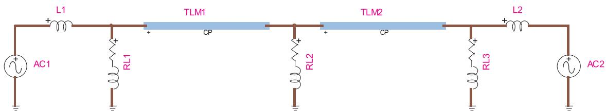  
Fig. 1. Simple test case for demonstrating BTF permutation.

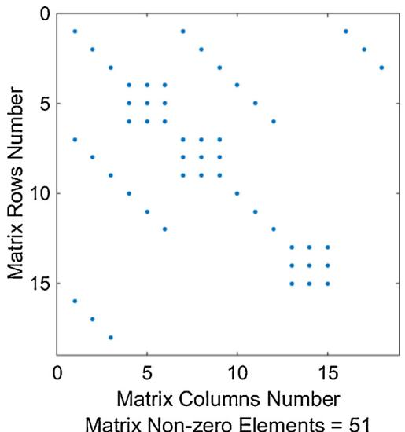  
Fig. 2. Non-zero pattern of Fig. 1 network matrix before applying BTF.

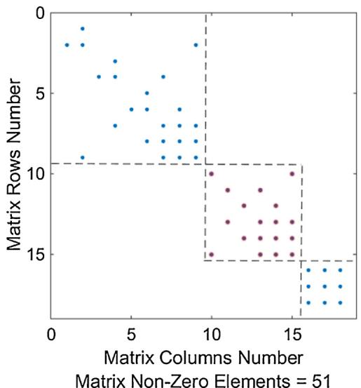  
Fig. 3. Non-zero pattern of Fig. 1 after applying BTF.

separated by transmission lines. The number of subnetworks (independent blocks) is fixed by the number of transmission line models connected through any topology.

KLU uses fill-in reduction techniques to reduce the number of nonzeros in L and U matrices. In this paper, Approximate Minimum Degree Ordering (AMD) has been used as the default ordering technique in KLU. It is worth mentioning that the symbolic analysis step and the BTF permutation are performed only once at the beginning of the simulation process. This is due to the fact that the network structure and hence the strongly connected components of A, do not change during the entire simulation period. As for the refactorization process, the pivoting strategy used in KLU is more efficient than in the current EMTP package and consequently reduces the computing time associated to nonlinear models and switching devices.

During the second stage of KLU, the non-zero pattern of LU is calculated using Gilbert-Peierls’ algorithm [19]. Once the non-zero pattern is found, a left looking numerical factorization with partial pivoting is performed to calculate the numerical values of L and U to transform $\mathbf { A _ { B T F } }$ into

$$
\mathbf {A} _ {\mathrm {B T F}} ^ {\prime} = \mathbf {L U} \tag {5}
$$

The third step of KLU is the solution step during which forward and backward substitutions are conducted in order to obtain the results for

vector x.

# 4. Parallel KLU implementation

In order to accelerate the performance of the KLU solver, it is necessary to implement it using multiple cores in parallel. The OpenMP [22] multithreading approach can be used for that purpose. OpenMP is an API for multi-platform shared-memory parallel programming [23]. It reduces the overall parallel programming effort. In this paper the objective is to use OpenMP directly for converting an existing code. OpenMP requires the user to define different segments of the code where parallel processing is required, using directives. Once all parallel segments are specified, all parallelization processes such as thread launching, control, synchronization and termination are done by the compiler. The OpenMP directives allow to access physical cores and perform hyperthreading.

In this paper, parallel programming has been applied in the factorization and substitution steps only, whereas the symbolic stage is kept purely sequential since it is done only once at the beginning of simulations. The number of threads and the number of CPU cores vary depending on the computer used in the simulation. The user can select the number of threads for a given simulation case, but this choice will be validated by the solver depending on the existing number of threads in the computer, the number of BTF blocks and the size of BTF blocks. This validation allow to achieve the best load balancing between threads and reduces threads waiting time. Depending on the network size, the $\mathbf { A _ { B T F } }$ blocks are automatically distributed to different threads in order to be factorized and solved. The implementation presented in this paper has several optimizations as compared to Ref. [25] and that is why better computer timings are achieved. The optimizations and improvements have been applied in the KLU code for the repetitive refactorization procedures due to nonlinear devices and ideal switches.

# 5. Test cases

The test cases presented here are based on the Hydro-Quebec grid and the T0-Network created for testing parallelization challenges.

A first version of the Hydro-Quebec grid simulated in EMTP is described in Ref. [1]. There are two versions of this network: L-Network and R-Network. The network sizes and contents have increased since the presentation of Ref. [1]. The L-Network refers to the very large version and the R-Network is a reduced version created from the L-Network. In this paper both network versions are solved directly in parallel without any user-intervention and without any topological analysis for helping parallelization. Network partitioning is based solely on the BTF algorithm using distributed parameter line models. Only constant parameter (CP-lines) line models are used in the presented network models. PI-section models are used for shorter lines to avoid penalizing the numerical integration time-step upper bound.

All simulations are performed on an Intel Xeon (CPU E5-2650 V4) computer with an option to use up to 24 cores (48 threads). The simulation results with and without parallelization are exactly the same since there are no approximations in the parallelization process used in this paper.

# 5.1. Hydro-Quebec L-Network version

The L-Network used in this paper has been upgraded from the previous version in Ref. [1]. The upgraded contents are summarized as follows:

Size: 94706 devices, 42474 power devices and 52232 control diagram blocks   
• Circuit nodes: 29797   
• 355 CP-lines, 904 PI-sections   
• 2098 3-phase transformers

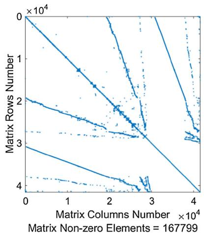  
a）Before BTF

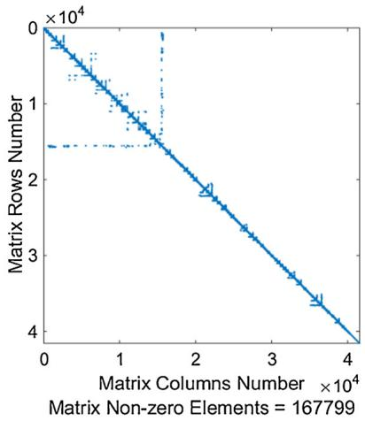  
b)After BTF   
Fig. 4. Non-zero pattern of L-Network matrix before and after BTF.

• 174 zinc oxide arresters (nonlinear)   
• 213 nonlinear inductances   
3663 ideal switches   
• 916 load models for a total of 40.5 GW   
• 10 SVC models (average-value version)   
• 349 synchronous machine models with AVR and governor models   
• Matrix A size: 41797 × 41797

The sparsity pattern of A and the corresponding BTF version are presented in Fig. 4. There are a total of 181 blocks in BTF, with the largest block size being 13,584 × 13,584 and smallest block is 9 × 9.

Due to the presence of nonlinearities, the average number of iterations per time-point is 2.07. The numerical integration time-step is Δt = 50 μs. The performed simulation is a fault case and the simulation interval is 1 s.

The computer timings are presented in Table 1. EMTP-1 is referring to the sparse matrix package that has been replaced by the KLU package in EMTP-KLU. It is apparent that the EMTP-KLU approach is 1.15 times faster than EMTP-1 on a single thread. The gain increases with the increase in the number of threads, but no further gain is achieved after 3 threads. This is due to overhead by threads and data management. An important limiting factor for parallelization in this case, is the existence of the large block of 13,584 rows. Since this block represents a dense network region, it does not include distributed parameter transmission lines that can be simulated with the given Δt lower bound, and KLU symbolic analysis is not able to break it to multiple blocks in the BTF format. It is also obvious that reducing Δt has a negative impact on computational performance. A new version of the L-Network (named L′- Network) has been implemented to address this issue and allows to achieve higher computational gains. In the L′-Network, some PI section transmission lines were grouped and replaced by CP lines to allow decoupling of the largest block in the L-Network into 36 blocks. This modification was done solely to eliminate the gain limiting block. The sparsity pattern of matrix A before and after BTF is shown in Fig. 5. The total number of blocks in the new L′-Network increased to 217 blocks, with the largest block size being 2898 × 2898. The new modification did not compromise the precision of the case and did not affect

accuracy, but now required user intervention to help the performance of the case. The computer timings are presented in Table 2. It is now observed that gains can be achieved up to 12 threads before overheads and data management limit again any further acceleration.

# 5.2. Hydro-Quebec R-Network version

The R-Network is a reduced version of the L-Network. This network does not represent medium and low voltage transmission lines and it groups some of the loads into larger load centers. The R-Network fully simulates the 735 kV and 315 kV systems and it includes all lines at the 230 kV level. The network has a total of 24,000 physical devices and 2400 signals. Among these devices, the network includes 4000 power devices and 2500 power nodes [1]. The size of the network A matrix is 3402 × 3402 and the number of blocks in the BTF format is 169. The average number of iterations for 1 s simulation is 2.23. The numerical integration time-step is Δt = 50 μs.

The R-Network was originally presented in Ref. [1], but has been upgraded after changes in the L-network. In summary, this network contains:

• 170 lines   
• 90 three-phase transformers with magnetization branches   
• 62 nonlinear arresters   
27 load models   
• 7 SVC models   
• 39 synchronous machines with AVRs for representing 31 power stations for a total of 35600 MW   
• 3 synchronous compensators.

The non-zero pattern of the network matrix A and the corresponding BTF format are presented in Fig. 6. The computer timings of this test are presented in Table 3.

# 5.3. Benchmark T0-Network

This case is a realistic 400 kV, 50 Hz network. It is designed with

Table 1 Computer timings (s), L-Network.   

<table><tr><td rowspan="2">EMTP-1</td><td colspan="6">EMTP-KLU</td></tr><tr><td>1 Thread</td><td>2 Threads</td><td>4 Threads</td><td>6 Threads</td><td>8 Threads</td><td>12 Threads</td></tr><tr><td>1880</td><td>1630</td><td>1345</td><td>1176</td><td>1225</td><td>1258</td><td>1263</td></tr></table>

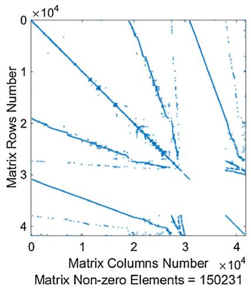  
a）BeforeBTF

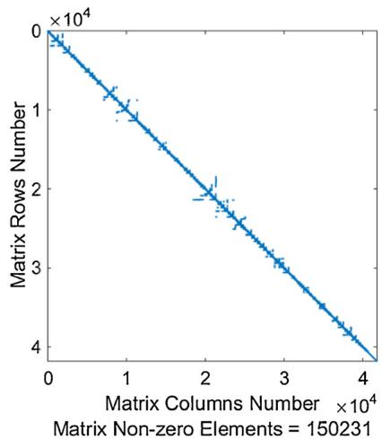  
b)After BTF   
Fig. 5. Non-zero pattern of L′ Network matrix before and after BTF.

Table 2 Computer timings (s), L′-Network.   

<table><tr><td rowspan="2">EMTP-1</td><td colspan="6">EMTP-KLU</td></tr><tr><td>1 Thread</td><td>2 Threads</td><td>4 Threads</td><td>6 Threads</td><td>8 Threads</td><td>12 Threads</td></tr><tr><td>1745</td><td>1581</td><td>1268</td><td>1063</td><td>891</td><td>786</td><td>729</td></tr></table>

high integration of renewable sources to stress numerical accuracy and stability. It includes 72 synchronous generators modeled with their exciters and governors. There are a total of 10 wind parks with aggregated wind generators. These generators of DFIG type are simulated with their controllers that are based on reactive power control mode. The DFIG converters are given two modeling options: Detailed model (DM) and average model (AVM) [24]. The DM includes nonlinear IGBT models which require iterations and significantly increase computational burden. In the AVM models controlled sources are used to represent average converter behavior and sufficient accuracy can be achieved when studying grid performance issues.

The top view of T0-Network is shown in Fig. 7, where the green boxes represent sub-transmission networks at 154 kV with wind generation, and the yellow boxes represent only sub-transmission networks with no wind turbines. In addition to the above, the network has the following contents (summary):

• RLC branches: 2319; PI/RL coupled branches, 3-phase: 595   
• Lines (distributed parameters): 174 phases   
• Ideal transformer units (for 3-phase transformers): 6294   
• Controlled switches (converter switches): 190   
• Ideal switches: 254   
• Nonlinear resistances (used for IGBT models): 270   
• Nonlinear inductances (transformer magnetization): 564   
• Loads: 1029

The sparsity pattern of matrix A and the corresponding BTF pattern are presented in Fig. 8. There are a total of 28 blocks, the largest block size is $5 7 3 \times 5 7 3$ and smallest block is 3 × 3. Due to the presence of nonlinearities, the average number of iterations per time-point is 6.04. The numerical integration time-step is Δt = 10 μs. The performed simulation in this case is a fault study that is located on the transmission line ADAPA_to_GOKCE. The fault is set to be initiated at 1 s, and the phase-a breaker located to the left of the line receives an opening signal

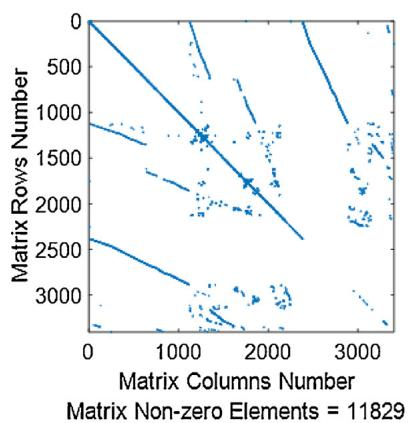  
a）Before BTF

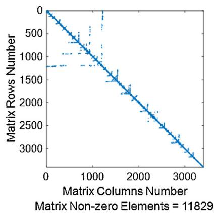  
b)After BTF   
Fig. 6. Non-zero pattern of R-Network matrix before and after BTF.

Table 3 Computer timings (s), R-Network.   

<table><tr><td rowspan="2">EMTP-1</td><td colspan="6">EMTP-KLU</td></tr><tr><td>1 Thread</td><td>2 Threads</td><td>4 Threads</td><td>6 Threads</td><td>8 Threads</td><td>12 Threads</td></tr><tr><td>137</td><td>121</td><td>86</td><td>67</td><td>53</td><td>48</td><td>42</td></tr></table>

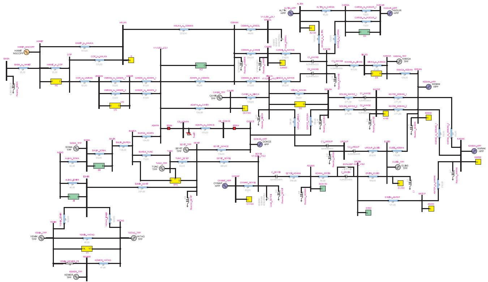  
Fig. 7. T0-Network top view. (For interpretation of the references to colour in the text, the reader is referred to the web version of this article.)

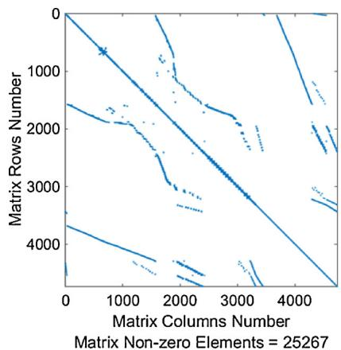  
a）Before BTF

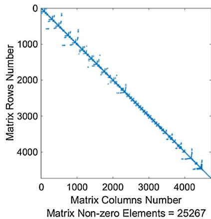  
b)After BTF   
Fig. 8. Non-zero pattern of T0-Network matrix before and after BTF.

Table 4 Computer timings (s), T0-Benchmark — DM.   

<table><tr><td rowspan="2">EMTP-1</td><td colspan="6">EMTP-KLU</td></tr><tr><td>1 Thread</td><td>2 Threads</td><td>4 Threads</td><td>6 Threads</td><td>8 Threads</td><td>12 Threads</td></tr><tr><td>3105</td><td>2830</td><td>2270</td><td>1931</td><td>1785</td><td>1692</td><td>1630</td></tr></table>

Table 5 Computer timings (s), T0-Network — AVM with Δt = 10 μs.   

<table><tr><td rowspan="2">EMTP-1</td><td colspan="6">EMTP-KLU</td></tr><tr><td>1 Thread</td><td>2 Threads</td><td>4 Threads</td><td>6 Threads</td><td>8 Threads</td><td>12 Threads</td></tr><tr><td>1527</td><td>1234</td><td>1027</td><td>907</td><td>804</td><td>729</td><td>681</td></tr></table>

Table 6 Computer timings (s), T0-Network — AVM with Δt = 50 μs.   

<table><tr><td rowspan="2">EMTP-1</td><td colspan="6">EMTP-KLU</td></tr><tr><td>1 Thread</td><td>2 Threads</td><td>4 Threads</td><td>6 Threads</td><td>8 Threads</td><td>12 Threads</td></tr><tr><td>413</td><td>340</td><td>271</td><td>239</td><td>211</td><td>192</td><td>18</td></tr></table>

at 1.08 s, and the breaker on the right receives an opening signal at 1.1 s. Both breakers receive reclosing signals at 1.48 s and 1.5 s respectively. The reclosing fails and breakers receive an opening signal at 1.56 s to isolate the line. (Table 4) shows the simulation timing for this case with 1 s simulation and a time step of Δt = 10 μs. Another test was done using the AVM converter models for wind generators with Δt = 10 μs and Δt = 50 μs. The computer timings with AVM for Δt = 10 μs and Δt = 50 μs are presented in Tables 5 and 6, respectively.

It can be seen from the above tables that EMTP-KLU is capable of doubling the simulation speed with the use of 12 cores in the DM usage case, and it is 1.7 and 1.38 faster when using AVMs with Δt = 10 μs and Δt = 50 μs respectively. However, the simulation of AVM case with Δt = 50 μs is around 9 times faster compared to DM case.

It is emphasized that the simulation results with AVM and DM converters are sufficiently close, but the DM version remains the most accurate.

# 6. Conclusions

This paper presented the implementation of a parallel sparse matrix solver for improving the computational speed of an electromagnetic transients simulation software. The presented method is based on the KLU sparse matrix solver. The solution process is programmed using network partitioning through the natural decoupling formed by distributed parameter transmission line/cable models. The applied partitioning is automatic and does not require any user intervention. It is calculated automatically from the original network matrix by applying block diagonal factorization (BTF).

Parallelization is programmed using the OpenMP multithreading approach. The OpenMP programming directives and the presented KLU sparse matrix package with BTF, allow to straightforwardly upgrade existing sparse matrix solvers. A fully iterative solution is applied in this paper for achieving highest accuracy levels.

The presented parallelization approach is demonstrated on realistic complex benchmarks. It is the first time that parallelization is programmed/tested on such large, complex and realistic network benchmarks in an EMT-type solver with iterations for nonlinear models. The achieved computer timings demonstrate important gains, but those gains become limited by the largest matrix blocks and thread programming overhead. Although the results are impressive, it is apparent that further research is required for benefiting from increased core numbers for the realistic cases presented in this paper.

# References

[1] L. Gérin-Lajoie, J. Mahseredjian, Simulation of an extra-large network in EMTP: from electromagnetic to electromechanical transients, International Conference on Power System Transients, Kyoto, Japan, 2009.   
[2] A. Benigni, A. Monti, R. Dougal, Latency-based approach to the simulation of large power

electronics systems, IEEE Trans. Power Electron. 29 (6) (2014) 3201–3213.   
[3] J.M. Bahi, K. Rhofir, J.-C. Miellou, Parallel solution of linear DAEs by multisplitting waveform relaxation methods, Linear Algebra and its Applications, Elsevier, 2001, pp. 181–196. August.   
[4] Pan European Grid Advanced Simulation and State Estimation, Algorithmic Requirements for Simulation of Large Network Extreme Scenarios, Report D4.1, April 2011.   
[5] Y. Zhang, A.M. Gole, W. Wu, B. Zhang, H. Sun, Development and analysis of applicability of a hybrid transient simulation platform combining TSA and EMT elements, IEEE Trans. Power Syst. 28 (1) (2013) 357–366.   
[6] A. Ramirez, A. Mehrizi-Sani, D. Hussein, M. Matar, M. Abdel-Rahman, J.J. Chavez, A. Davoudi, S. Kamalasadan, Application of balanced realizations for model-order reduction of dynamic power system equivalents, IEEE Trans. Power Deliv. 31 (5) (2016) 2304–2312.   
[7] J. Mahseredjian, V. Dinavahi, J.A. Martinez, Simulation tools for electromagnetic transients in power systems: overview and challenges, IEEE Trans. Power Deliv. 24 (3) (2009) 1657 1669.   
[8] D.M. Falcao, E. Kaszkurewicz, H.L.S. Almedia, Application of parallel processing techniques to the simulation of power system electromagnetic transients, IEEE Trans. Power Syst. 8 (February (1)) (1993) 90–96.   
[9] D. Paré, G. Turmel, J.-C. Soumagne, V.A. Do, S. Casoria, M. Bissonnette, B. Marcoux, D. McNabb, Validation tests of the Hypersim digital real time simulator with a large AC–DC network, International Conference on Power System Transients, New Orleans, 2003.   
[10] S. Abourida, C. Dufour, J. Belanger, G. Murere, N. Lechevin, B. Yu, Real-time PC-based simulator of electric systems and drives, Mar. 10–14, Proc. 17th IEEE APEC, Applied Power Electronics Conf. and Expo. 1 2002, pp. 433–438.   
[11] R. Kuffel, J. Giesbrecht, T. Maguire, R.P. Wierckx, P.G. McLaren, RTDS-A fully digital power system simulator operating in real-time, Proc. EMPD’95 2 (1995) 498–503.   
[12] R. Singh, A.M. Gole, C. Muller, P. Graham, R. Jayasinghe, B. Jayasekera, D. Muthumuni, Using local grid and multi-core computing in electromagnetic transients simulation, International conference on power system transients, Vancouver, Canada, 2013.   
[13] S. Montplaisir-Goncalves, J. Mahseredjian, O. Saad, X. Legrand, A. El-Akoum, A Semaphore-based parallelization of networks for electromagnetic transients, International Conference on Power System Transients, Vancouver, Canada, 2013.   
[14] C. Dufour, J. Mahseredjian, J. Bélanger, A combined state-space nodal method for the simulation of power system transients, IEEE Trans. Power Deliv. 26 (April (2)) (2011) 928–935.   
[15] J.K. Debnath, W.-K. Fung, A.M. Gole, S. Filizadeh, Electromagnetic transient simulation of large- scale electrical power networks using graphical processing units, 25th IEEE Canadian Conference on Electrical and Computer Engineering (CCECE) (2012).   
[16] J. Mahseredjian, S. Dennetière, L. Dubé, B. Khodabakhchian, L. Gérin-Lajoie, On a new approach for the simulation of transients in power systems, Electr. Power Syst. Res. 77 (September (11)) (2007) 1514–1520.   
[17] J. Mahseredjian, U. Karaagac, S. Dennetière, H. Saad, A. Ametani (Ed.), Numerical Analysis of Power System Transients and Dynamics: Simulation of electromagnetic transients with EMTP-RV, 2015, pp. 103–134 IET Power and Energy series.   
[18] S.C. Eisenstat, M.C. Gursky, M.H. Schultz, A.H. Sherman, Yale Sparse matrix Package, (2018).   
[19] T.A. Davis, E.P. Natarajan, Algorithm 907: KLU, a direct sparse solver for circuit simulations problems, ACM Trans. Math. Softw. 37 (September) (2010) 36:1–36:17.   
[20] E.P. Natarajan, KLU—A High Performance Sparse Linear Solver for Circuit Simulation Problems, Master Thesis, University of Florida, 2005.   
[21] A. González, D. Luaces, M. Dopico, Parallel linear equation solvers and openmp in the context of multibody system dynamics, Proceedings of the ASME 2009 International Design Engineering Technical Conferences, Aug. 30–Sept. 2, 2009, San Diego, California, USA, 2018 11 p.   
[22] http://www.openmp.org/wp-content/uploads/openmp-4.5.pdf.   
[23] C. Szydlowski, Multithreated Technology and Multi-core Processors, Infrastructure Processor Division Intel Corporation, 2005 May 1.   
[24] U. Karaagac, J. Mahseredjian, L. Cai, H. Saad, Offshore wind farm modeling accuracy and efficiency in MMC-based multi-terminal HVDC connection, IEEE Trans. Power Deliv. 32 (2) (2017) 617–627.   
[25] A. Abusalah, O. Saad, J. Mahseredjian, U. Karaagac, L. Gerin-Lajoie, I. Kocar, CPU based parallel computation of electromagnetic transients for large scale power systems, International Conference on Power System Transients, Seoul, Republic of Korea, 2017.