Received 25 August 2025; revised 8 December 2025; accepted 25 January 2026. Date of publication 30 January 2026; date of current version 11 February 2026.

Digital Object Identifier 10.1109/OAJPE.2026.3659790

# GPU Parallel-Rate Exponential Integrator Algorithm for Efficient Simulation of Power Electronic Systems

JARED PAULL1 (Graduate Student Member, IEEE), WALID HATAHET 1 (Graduate Student Member, IEEE), LIWEI WANG 1 (Senior Member, IEEE), AND WEI LI 2 (Member, IEEE)

1School of Engineering, University of British Columbia Okanagan, Kelowna, BC V1V 1V7, Canada

2OPAL-RT Technologies, Montreal, QC H3K 1G6, Canada´

CORRESPONDING AUTHOR: L. WANG (liwei.wang@ubc.ca)

This work was supported by the Natural Sciences and Engineering Research Council (NSERC) of Canada.

ABSTRACT Electromagnetic transient (EMT) simulation of power electronic converters is critical for analysis, design, and fast control prototyping of power and energy systems. This paper proposes a multigranular GPU parallel-rate exponential integrator (EI) algorithm for fast offline EMT simulation of power electronic systems. The proposed parallel-rate EI algorithm utilizes the massively parallel GPU architecture to compute multiple discretization steps in parallel. The matrix-vector computations of the EI algorithm within each time step are also parallelized. Additionally, a novel GPU-based framework is proposed for numerically efficient precomputation of matrix exponentials before a simulation loop starts. The high degree of parallelism leads to large simulation speedups compared to single-thread CPU implementations. The discretization technique of high-order EI algorithm is absolutely stable with no numerical ringing and can achieve accurate differential equation discretization with large time-step sizes. The proposed parallel-rate EI solver is further applied to detect passive/diode switching events accurately. Two case studies are used to demonstrate the accuracy and efficiency of the parallel-rate EI algorithm. Two additional case studies showcase the benefit of the proposed parallel precomputation technique for matrix exponentials.

INDEX TERMS Electromagnetic transients (EMT), exponential integrator (EI), graphics processing unit (GPU), multi-granular parallel simulation, phi-function precomputation, power electronic converter simulation.

# I. INTRODUCTION

F AST power converter dynamics introduced by semi-conductor switching, control system interaction, and conductor switching, control system interaction， and short-circuit faults require detailed electromagnetic transient (EMT) modeling and simulations [1]. Therefore, numerically accurate and efficient EMT simulation is vital for analysis, design, and rapid control prototyping of power electronic systems. The increase in size and complexity of power electronic converters impose new challenges when developing accurate and efficient EMT algorithms to better utilize advanced parallel computing hardware platforms.

Nowadays, EMT modeling and simulation have expanded beyond the traditional single-thread central processing unit (CPU)-based implementation environment. A plethora of

prior art techniques have been proposed for transient simulations of power electronic converters on various parallel computing hardware architectures such as multithread CPU, field programmable gate arrays (FPGA), and graphics processing units (GPU). Multithread CPU implementation was successfully applied to large-scale power system EMT simulation in [2]. However, a multithread CPU has a limited number of hardware processing units, i.e., cores available for parallel computation. The multithread CPU typically enables block-level or coarse-grained parallelism, whereas fine mathematical operations such as matrix multiplications often remain sequential or poorly parallelized. FPGAs are programmable parallel hardware that can be efficiently interfaced with external circuits, making them popular for

digital real-time simulators performing hardware-in-the-loop (HIL) experiments [3], [4]. However, the circuit scale of the EMT simulation on an FPGA is limited by both cost and complexity of implementation [5]. GPUs are massively parallel computing hardware that accelerates simulations using a single-instruction multiple-thread (SIMT) mode. SIMT allows a single instruction to be executed concurrently a cross multiple threads within a grouping, enabling finegrained parallelism such as parallel matrix operations [6]. Unlike FPGAs, which are used in specialized applications, GPUs are commonly found in modern computers for graphics processing. As a result, GPUs are relatively inexpensive and have a mature development framework for custom parallel computing applications.

GPU hardware was first used to conduct power flow analysis on large-scale power systems in [7]. Later on, a CPU-GPU EMT co-simulation was proposed in [8], which utilizes a GPU for matrix operations and a CPU for the remainder of the simulation. As a result, significant data need to be exchanged between the CPU and the GPU on a slow PCIe interface. Subsequent research works successfully implemented EMT simulation on a GPU entirely to avoid costly CPU-GPU communication latency [9], [10], [11]. However, these techniques implement sequential tasks, such as controls on the GPU. GPUs are not optimized for sequential tasks and therefore perform them significantly slower than CPUs. In [12] and [13], this issue is mitigated using a thread-oriented system transformation and a layered GPU processing technique. More recently, novel CPU-GPU EMT algorithms have found great success when the data transfer is kept to a minimum, and the algorithm is strategically divided between CPU and GPU [14], [15], [16], [17], [18], [19], [20].

All prior art GPU-based EMT simulation works have a common theme: they are only efficient for large-scale power and power electronic systems [8], [9], [10], [11], [12], [13], [14], [15], [16], [17], [18], [19], [20], [21], [22]. For small power and energy systems, traditional GPU-based simulations are slower than CPU-based ones, as indicated by the time-cost model proposed in [10]. GPUs suffer from higher latency and weaker compute units than CPUs. As a result, many GPU computation units should execute in parallel before the efficiency rivals a single CPU thread. Furthermore, most prior art GPU-based EMT research works focus on nodal-analysis-based approaches [8], [9], [10], [12], [13], [14], [16], [17], [18], [19], [20], [21], [22]. These EMT nodal-analysis implementations employ low-order differential equation discretization schemes such as Trapezoidal Rule and backward Euler method. Therefore, their numerical accuracy degrades rapidly for large integration time-step sizes. In [11] and [15], switch-level state-space models were proposed for GPU-based EMT simulation of power electronic converters. The ordinary differential equation system was discretized using parallel exponential integrator (EI) algorithm. However, the EI solvers in [11], [15] do

not offer parallel-rate EMT simulation, which needs to generate simulation output points with multiple time steps in parallel.

In the literature, the GPU has mainly been used to compute the discretized system at each time step sequentially. Parallel time-stepping computation was proposed in [20], where segments of the simulation are computed on the GPU in parallel. However, both the coarseoperator and precise-operator steps are ultimately computed sequentially. Additional speed-up is expected when computing multiple integration time-steps in parallel, with each step itself internally parallelized. In this way, the GPU can achieve simultaneous coarse- and fine-grained parallelism. This multi-granular parallelism is only feasible if the integration algorithm can accurately discretize the differential equation systems using large time-step sizes.

Trapezoidal rule (TR) and backward Euler (BE) methods are widely used numerical integration techniques. However, TR produces fictitious numerical oscillations over discontinuous switching events while BE has low numerical accuracy as a first-order method. In [23], a hybrid TR-BE solver was presented that used the second-order accuracy of TR during continuous system operation and applied BE over discontinuous switching events to eliminate numerical oscillations. Exponential integrator (EI) is an alternative to the prior art low-order numerical integration techniques. Within the literature, the EI is typically applied to timedomain simulation of very-large-scale-integration (VLSI) [24], [25], [26], [27], [28], or small sequential fixed stepsize simulation of power electronic converters [11], [15], [29], [30]. In [31], a CPU-based large step-size EI algorithm is proposed for average value model (AVM) simulation of power converter systems with a variety of time constants. The EI solver uses intermediate results of Pade approxi-´ mation with scaling-and-squaring to efficiently compute the dense output points between two time-steps [32]. In [33], the method is extended to the simulation of switching power electronic converters. The methods in [31] and [33] present strong efficiency improvements. However, the EI solvers [31] and [33] are time-driven instead of discrete-switchingevent-driven (DSED). The time-driven solvers use fixed time-steps which are smaller than the time steps enabled in the DSED simulation framework. Moreover, the dense output formulae in [31] and [33] were implemented for sequential computation instead of parallel-rate computation in GPU. In [34], a DSED EI solver is presented for simulation of power electronic systems where the systemstates are only computed at discontinuous switching events. In [35] and [36], the EI solver is extended for real-time simulation and large-scale converter systems using network decoupling technique. Although the EI solvers [34], [35], [36] are shown to be highly efficient for a variety of power electronic systems, the DSED simulation framework in sequential CPU implementation may not accurately capture

fast system transients and switching ripples between two switching events.

This paper proposes a new multi-granular GPU-based parallel-rate power electronic converter EMT simulation using the EI algorithm. The key contributions of this paper are summarized as follows.

1) A parallel-rate EI solver is proposed, which utilizes precomputation of high-order matrix exponentials to achieve considerable speedup of simulation efficiency. Compared to small fixed time-step EMT solvers, the proposed EI solver computes multiple integration time-steps in parallel with one another. The proposed EI algorithm is a high-order numerical integration solver with L-stability, which is desirable for the simulation of stiff and non-stiff power electronic systems.   
2) A GPU-based EMT simulation framework is proposed, where the GPU computing platform enables parallel-rate simulation output points between two switching events and parallel matrix calculations of the EI solution within each parallel-rate output point. The controllers of the power electronic converters are also implemented on the GPU to minimize data transfer between CPU and GPU engines.   
3) Passive switching event detection of naturally commutated switches, such as diodes, is performed using the dense parallel-rate output points from the proposed EI solver. The GPU computing platform afford ultra-fine parallel-rate integration step-sizes to find the voltage or current zero crossing points which eliminates the iterative solution of zero crossing points of the passive switching devices.   
4) Numerically efficient matrix exponential precomputation algorithm is proposed for the EI solver, where the calculation of a matrix exponential is achieved by a single matrix multiplication of previously calculated matrix exponentials. The proposed precomputation technique drastically reduces the computation load of matrix exponentials and is suitable for parallel hardware platforms, such as multithread CPU, FPGA, and GPU.

# II. EXPONENTIAL INTEGRATOR DISCRETIZATION ALGORITHM AND STEP-SIZE SELECTION SCHEME

In this section, the variable-step-size variable-forcingfunction-term EI-based discretization technique is introduced, alongside the step-size selection scheme. First, the formulation and stability properties of EI is introduced for EMT simulation. Next, the variable-step-size discrete-state event-driven (DSED) framework is discussed to facilitate precise computation of switching instants. This section continues to lay out the challenges with the conventional DSED EMT algorithm and explain why a parallel-rate EMT simulation is necessary for stiff network systems. The parallel implementation of this algorithm will be covered in Section III.

# A. VARIABLE-STEP-SIZE VARIABLE-FORCING-FUNCTION-TERM EXPONENTIAL INTEGRATOR ALGORITHM

At any point in time, a piecewise linear power electronic system is governed by the system’s inductive and capacitive circuit elements. By selecting inductor currents and capacitor voltages as system state variables, the system equations are derived from each state variable’s differential equation, i.e., $\begin{array} { r } { \nu _ { L } = L \frac { d i _ { L } } { d t } } \end{array}$ and $\begin{array} { r } { i _ { C } = C \frac { d \nu _ { C } } { d t } } \end{array}$ for inductors and capacitors, respectively. These differential equations form the basis for the system’s state-space representation as

$$
\dot {x} (t) = A (t) x (t) + B (t) u (t) \tag {1a}
$$

$$
y (t) = C (t) x (t) + D (t) u (t) \tag {1b}
$$

where, for a system with n independent system states and m system inputs, x is a n × 1 vector containing the system states, i.e., inductor currents and capacitor voltages; u is a m × 1 vector containing the system inputs, i.e., AC or DC input sources; and A (t)  B (t) C (t)  D (t) are matrices , , ,encapsulating the circuit topology and are dependent on the switching configuration at time t. Equation (1) can be generated automatically using well-known approaches from the literature [37], [38], [39], [40], [41].

Equation (1a) is an initial value problem of an ordinary differential equation, which can be solved in discrete-time using the EI as

$$
x _ {k + 1} = e ^ {A _ {k} h} x _ {k} + \int_ {t _ {k}} ^ {t _ {k} + h} e ^ {A _ {k} (t _ {k} + h - \tau)} B _ {k} u (\tau) d \tau , \tag {2}
$$

where the subscript-index k corresponds to a discrete time instant, i.e., $x _ { k } ~ = ~ x ( t _ { k } ) ;$ h is the discretization time-step size; and the subscript-index k + 1 corresponds to the next discretization time instant. The EI improves on conventional low-order discretization methods such as TR or BE by capturing the fast dynamics via the high-order exponential in (2) and eliminating numerical oscillations. Therefore, the EI is known to be unconditionally stable, free from numerical ringing, and highly accurate [35].

To compute (2), the forcing-function integral can be analytically substituted using -functions as

$$
x _ {k + 1} = e ^ {A _ {k} h} x _ {k} + \sum_ {j = 1} ^ {\infty} \varphi_ {j} \left(A _ {k} h\right) h ^ {j} B _ {k} \frac {d ^ {(j - 1)} u _ {k}}{d t ^ {(j - 1)}}, \tag {3}
$$

where the -terms are traditionally calculated using either a ϕrecursive formula (4) or a Taylor series expansion (5):

$$
\varphi_ {j} \left(A _ {k} h\right) = A _ {k} h \varphi_ {j + 1} \left(A _ {k} h\right) + \frac {1}{j !}, \quad \varphi_ {0} = e ^ {A _ {k} h} \tag {4}
$$

$$
\varphi_ {j} \left(A _ {k} h\right) = \sum_ {n = 0} ^ {r} \frac {\left(A _ {k} h\right) ^ {n}}{(j + n) !}, \tag {5}
$$

where r is the order of the Taylor series approximation. Both (4) and (5) may converge very slowly when generating solutions of the -functions for stiff power electronic systems. ϕIn [42], an optimal methodology is presented to calculate the -functions more efficiently without limitations on the

structure of $A _ { k } .$ , which represents a significant improvement over (4) and (5). The matrix exponential is best calculated using the high order technique introduced in [43] to ensure minimal error and maximum efficiency. The error in [43] is limited to the unit round-off in IEEE double precision arithmetic, $\mathrm { i . e . , ~ } 2 ^ { - 5 3 }$ . To ensure fast simulation speeds, all -functions are precomputed for each circuit-topology stepϕsize pairing, as discussed in [34] and [35]. Additional discussion on parallel precomputation of -functions will be presented in Section IV.

Equation (3) is composed of both a homogeneous solution component and a forcing-function solution component. Both the matrix exponential and all accompanying $\varphi \mathrm { - }$ functions ϕcan be computed using a single high order exponential integrator [25], [42]. Thus, the numerical error introduced in (3) is from truncating the forcing-function series, i.e., truncation error. The forcing-function series is monotonically decreasing at a substantial rate. Therefore, the local truncation error (LTE) of a $p \mathrm { - }$ term forcing-function approximation (6) can be estimated by the p + 1th term (7), since it dominates the truncation series.

$$
\begin{array}{l} x _ {k + 1} = e ^ {A _ {k} h} x _ {k} + \sum_ {j = 1} ^ {p} \varphi_ {j} \left(A _ {k} h\right) h ^ {j} B _ {k} \frac {d ^ {(j - 1)} u _ {k}}{d t ^ {(j - 1)}} (6) \\ \varepsilon = \sum_ {j = p + 1} ^ {\infty} \varphi_ {j} (A _ {k} h) h ^ {j} B _ {k} \frac {d ^ {(j - 1)} u _ {k}}{d t ^ {(j - 1)}} \\ \approx \varphi_ {p + 1} \left(A _ {k} h\right) h ^ {p + 1} B _ {k} \frac {d ^ {(p)} u _ {k}}{d t ^ {(p)}} (7) \\ \end{array}
$$

If a p-term forcing-function approximation is not accurate, i.e., $\varepsilon > \varepsilon _ { \mathrm { t o l e r a n c e } }$ , the error estimate can be used to ε > εincrease the accuracy since it is the next term in the series. Therefore, no extra work is required to compute the error estimate, which contributes to high algorithmic efficiency. Using this technique, the number of forcing-function-terms can be easily modulated to ensure high accuracy for any time-step size. For prior art implementations, a limiting forcing-function-term-order of $q _ { m a x }$ is selected. If this order is reached, the step-size should be decreased. Typically, a small number of forcing function terms is required since the forcing function u (t) is typically DC or slowly varying AC sources, compared to fast changing switching pulses. This can be seen in (5), where the super-exponential growth of the factorial term in the denominator causes the error estimation in (7) to quickly converge to zero. For nonstiff linear systems, two or three terms is typical. The following sub-section briefly describes the framework used to accurately pinpoint discrete switching events to ensure converter dynamics are accurately modeled.

# B. SIMULATION STEP-SIZE SELECTION SCHEME

The proposed variable-step-size high-forcing-function-term EI algorithm is intended to interface with a digital controller of a power electronic converter. The EI solver scheme implements the discrete-state event-driven (DSED) framework in

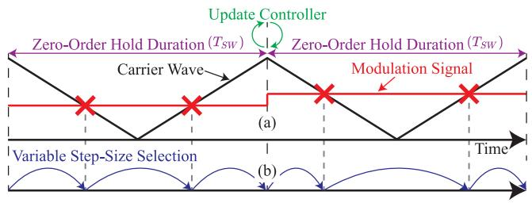  
FIGURE 1. Simulation step-size selection scheme. (a) Pulse width modulation scheme for digital controller. (b) Variable step-size selection scheme.

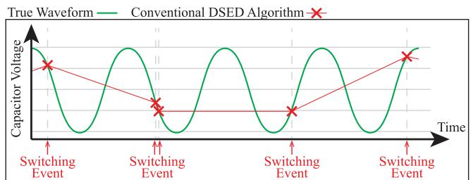  
FIGURE 2. Switching-event-driven variable-step-size solver misses fast transients.

[44] to take advantage of the constant modulation signal held over one digital control cycle, where the control cycle is the period of the carrier wave, i.e., $T _ { S W } = 1 / f _ { S W }$ . As /illustrated in Fig. 1, the exact switching instants can be analytically computed and prescheduled at the beginning of a control cycle. Using this information, the proposed simulation framework can compute system states exactly at switching-event instants by varying the discretization step-size.

The switching-event-driven variable-step-size solving technique reduces the number of computed points, thus increasing simulation algorithmic efficiency compared to traditional fixed-step-size simulation techniques. However, this switching-event-driven method cannot capture nonlinear dynamic responses between two switching instants [34]. This is particularly important for stiff systems that feature a wide range of time constants. Modelling parasitic elements or simply small passive elements can introduce time constants on the scale of the switching frequency. Thus, a variable-step-size technique only recalculating the states at switching-instants does not provide detailed simulation results in high resolution. A representative fictional illustration of this issue is shown in Fig. 2, in which the switching-event-driven solver that only recalculates the states at switching instants misses the high frequency voltage dynamics/ripples. The fast transients cannot be captured from the large variable-step solver using switching-event-driven technique. This paper proposes a parallel-rate simulation algorithm to obtain high-accuracy simulation results of a switching-event-driven EI algorithm. The proposed parallel-rate EI solver enables high-fidelity output waveforms of high frequency transients between two

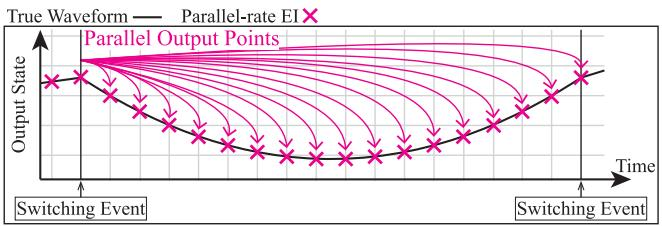  
FIGURE 3. Single-step parallel-rate output scheme.

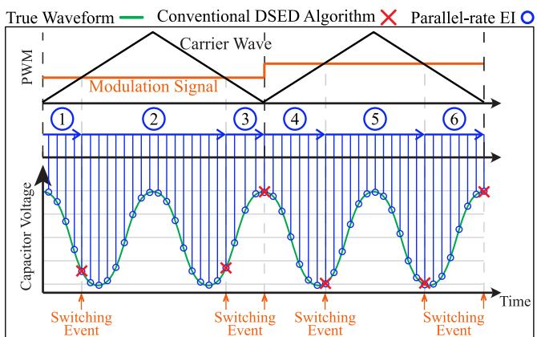  
FIGURE 4. Parallel-rate output simulation framework.

switching events while achieving high numerical efficiency using GPU hardware.

# III. GPU PARALLEL EXPONENTIAL INTEGRATOR ALGORITHM

The proposed parallel-rate EI algorithm is introduced in this section. First, the high-level GPU implementation is discussed with a specific focus on parallel-rate output of discretization-steps and intra-discretization-step parallelization for maximum simulation efficiency. Accurate diode voltage/current zero-crossing detection is then discussed using the parallel-rate output data. Finally, the detailed implementation of the parallel-rate EI simulation algorithm is discussed in the section.

GPUs allow for parallelization of functions that otherwise operate in series on CPUs. GPUs are not commonly used for the EMT simulation of power electronic systems since a conventional small-time-step low-order ODE solver is largely a sequential computing process. This section outlines how the presented parallel-rate EI algorithm can be efficiently implemented on GPU hardware to boost simulation efficiency while generating accurate simulation results in high resolution. GPUs usually have high communication latencies between external devices which make them not well suited for real-time simulation. Therefore, the proposed GPU-based parallel-rate EI solver is only applicable for offline simulation.

# A. PARALLEL-RATE OUTPUT POINTS

It is shown in (6) that each discretization step between two switching events is dependent only on the system matrices,

step-size, and the states at the beginning of the discretization step, tk. Thus, more output points can be independently computed in parallel with each other to generate high resolution simulation results between two switching events. The calculation of parallel-rate output points between switching events will share the same initial states and system matrices at $t _ { k }$ and only vary by discretization-step-size h in (6). An illustration of this parallel-rate output scheme is depicted in Fig. 3. The scheme in Fig. 3 can be combined with the DSED framework from Fig. 1 to form the parallel-rate output simulation framework, illustrated in Fig. 4. As shown in Fig. 4, between two discontinuous switching events, equidistant output points are computed in parallel with one another to produce a high-fidelity waveform. The parallelrate output continues for each event-driven step size, marked by an arrow with a circled number. Sequential computations are performed at the red-cross-marked points from one switching event to the other switching event. For the fast transients shown in Fig. 4, parallel-rate EI can accurately produce the true waveform while the conventional DSED method will miss the ripple waveform between the two switching events.

The use of GPU hardware allows for many simulation output points to be computed in parallel with one another, increasing waveform quality in a numerically efficient manner. The advantage of the proposed switching-event-driven simulation framework lies in the implementation of the highorder EI solver into the parallel-rate output scheme. The proposed high-order EI solver can accurately capture fast network dynamics with a large step-size, which is critical for parallel computation since the step-size will increase up to the switching pulse.

# B. INTRA-DISCRETIZATION-STEP PARALLELIZATION

Parallelization can further be implemented within each parallel discretization-step, i.e., intra-discretization-step parallelization. From (6), each discretization-step is composed of a homogeneous solution and a forcing-function solution with several terms in summation. Equation (6) can be rewritten symbolically as

$$
x _ {k + 1} = x _ {\text {h o m g}} + x _ {\text {F F}, 1} + x _ {\text {F F}, 2} + \dots + x _ {\text {F F}, p} \tag {8}
$$

where xhomg is the homogeneous solution, and $x _ { \mathrm { F F } , 1 } , x _ { \mathrm { F F } , 2 } , \dotsc , x _ { \mathrm { F F } , p }$ are forcing functions terms of , , , , . . . ,order one up to $p .$ Each of the summed terms in (8) are composed of matrix multiplications and are completely independent of all the other terms in the series. Thus, within a discretization-step, each term in (8) can be computed in parallel with one another on the GPU platform. After each term in (8) is computed, the output of the discretization-step can be computed in parallel as the sum of each term. The computation of the terms in (8) can be further optimized by appropriately allocating GPU computation units, however, this detailed discussion is left for a later subsection, i.e., Section III-D.1.

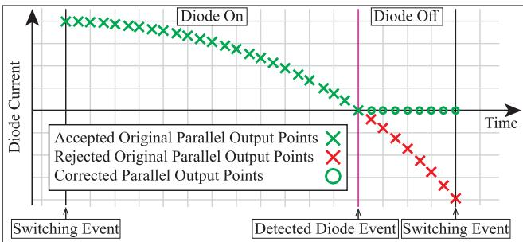  
FIGURE 5. Diode current zero-crossing detection and correction technique.

# C. DIODE ZERO-CROSSING DETECTION AND CORRECTION TECHNIQUE

Diode voltage or current zero-crossing detection is conventionally performed in a sequential fashion on either CPU or FPGA hardware platforms. After each discretization step is complete, each diode’s bias point is evaluated to detect a change of conduction state. The parallel-output scheme depicted in Fig. 4 can be easily adapted for diode zerocrossing detection. At the end of each parallel output point, the diode bias point is evaluated for each diode. If there is a change in any diode state, any subsequent points after the first change of state are disregarded and the parallel output is restarted at the point of state change. The parallel outputs will be computed up-and-until the next active switching event. If another diode event occurs, the process will repeat until the active switching event is reached. This technique is illustrated in Fig. 5.

As shown in Fig. 5, the original set of parallel points between switching events are denoted by a ‘X’ marker. As soon as the diode current becomes negative, a change in conduction state is detected and any output points afterwards are disregarded. The simulation then performs another batch of parallel output points, marked “O”, from the diode switching event up-and-to the next active switching event. This strategy leverages the parallel simulation framework to accurately detect passive switching events without a computationally expensive iterative solution or switching interpolation. The parallel output step-size can be small, decreasing issues associated with diode changes not directly coinciding with computed points.

Increasing the number of diodes has the effect of increasing the frequency of discontinuous switching events. Additional discontinuous events increase re-synchronization frequency shown in Fig. 5 which decreases the average scale of parallel computation. For example, as shown in Fig. 5, parallel-rate EI requires two sequential steps to maintain accuracy, opposed to one large step between the two active switching events. For parallel-in-time algorithms, this has a larger effect on simulation efficiency than the small overhead associated with computing the bias point of each diode. However, this effect is only present whenever a switching event occurs, meaning the decrease in efficiency is localized

to discontinuous events. For passive slow changing rectifier circuits, the net effects on simulation efficiency are small. For the diodes that switch at the scale of the switching frequency, this phenomenon is similar to a converter with numerous carrier signals or modulation signals.

# D. DISCUSSION ON GPU IMPLEMENTATION

The proposed parallel-rate EI algorithm is implemented entirely on the GPU platform to avoid communication latency associated with transferring data from CPU-to-GPU. Only indices or flags are shared between the CPU and GPU for proper synchronization. The CPU is used to launch kernels on the GPU hardware using this information. These integer buffers are allocated in page-locked host memory with the mapped flag (mapped-pinned memory), enabling zero-copy access from the GPU.

The EMT simulation of both power converter circuit and controller is implemented on the GPU. Since the entire power electronic system simulation is performed on the GPU, implementing controls on the GPU bypasses slow CPU-GPU communication and avoids synchronization issues. For example, if the controls are implemented on the CPU, the CPU will be locked or idle when waiting for data transfer which introduces delays, reduces utilization of resources, and limits parallelization. Additionally, GPU-based control schemes can be accelerated using a layered approach to maximize throughput and fully utilize the GPU execution resources [12], [13]. The strategy of implementing controls on the GPU has been validated within the literature [20], [21], [22], where complicated controls are implemented on the GPU. These works implement GPU-based controls to eliminate the lengthy CPU-GPU latency, as appreciated in [15]. However, implementing controls on the GPU is not universally beneficial. Optimal implementation depends on the sequential nature of the control schemes and the latency between the CPU-GPU. The comparison between the time taken to compute the controls on the GPU and the communication latency of the CPU-GPU can be investigated to support the decision. If the GPU computation time is shorter than the CPU-GPU communication latency, the controls should be implemented on the GPU, and vice versa.

The algorithm is coded using NVIDIA Compute Unified Device Architecture (CUDA) programming model. However, the parlance can be easily translated to other GPU platforms. CUDA’s execution model revolves around launching kernels with a specific number of blocks, where each block contains a user-specified number of threads. Kernels are functions invoked by the CPU and executed on the GPU. When a kernel is launched, its blocks are scheduled to run concurrently. The threads within each block execute their assigned computations in parallel. Consequently, speedup heavily depends on reformatting algorithms to operate with thread-level parallelism, ensuring that threads in each block have independent work to perform. All data is stored persistently in GPU global memory, including

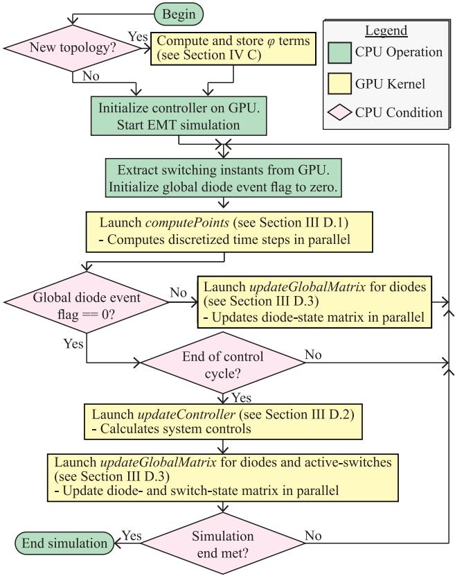  
FIGURE 6. Parallel-rate EI algorithm flowchart.

-functions, system states, system outputs, etc. Shared memϕory is used for storing temporary time-based vectors or intermediate matrices.

The proposed parallel-rate EI algorithm is composed of three key kernels that govern the EMT simulation. These kernels compute discretization-step outputs, check for diode conduction state changes, update the controller’s control signal, and maintain consistency within the global switching matrices. The kernels are internally parallelized, and all utilize a single computation stream. The overall flowchart of the proposed algorithm is shown in Fig. 6. As shown in Fig. 6, all computation is performed through GPU kernels, while the CPU is only responsible for synchronizing the GPU in time. The remainder of this section focuses on the detailed implementation of the three key GPU kernels. The proposed algorithm requires all possible -functions to ϕbe precomputed and stored in GPU-memory prior to starting the simulation loop. Discussion of -function precomputation is covered in Section IV.

# 1) COMPUTEPOINTS KERNEL

The computePoints kernel is launched to compute all discretization time-steps $T _ { \mathrm { s , m i n } } , 2 T _ { \mathrm { s , m i n } } , \hdots , i T _ { \mathrm { s , m i n } }$ , where $T _ { \mathrm { s , m i n } }$ , , , , . . . , ,is the user specified minimum step-size, and $i T _ { \mathrm { s , m i n } }$ ,is the ,step-size up-and-to the next switching event. The computePoints kernel is launched with i blocks. Each block

executes in parallel and is responsible for computing a single discretization-step. A discretization step-size is indicated by the block index. The initial conditions are provided to the algorithm through a global memory pointer, which is used to extract prior system states and calculate the system inputs. The circuit topology is determined using a global switching state matrix that includes all active and passive switching states. Through this initialization at $t _ { k } ,$ each term in (6) is known for each parallel-rate discretization-step. The active switching events are prescheduled within a digital control cycle, while the passive switching events are updated throughout the control cycle as they are encountered. The topology and discretization step-size information are used to obtain the corresponding -functions from the global GPU ϕmemory. Since the -functions are small and only used once ϕper kernel call, they are read directly from global memory instead of being copied to local block-level shared memory. Additionally, -functions are stored in a coalesced pattern ϕto reduce effective memory-access latency by decreasing the number of global-memory transactions.

In order to obtain the simulation output from (8), each term in (8) should be computed within one block. The following detailed discussion will focus on the operations within one block as the methodology is shared for each block. Based on (8) and (6), $x _ { \mathrm { h o m g } }$ is composed of a single matrix multiplication while each forcing function term $\left( x _ { \mathrm { F F , j } } , j \in \left[ 1 , p \right] \cap \mathbb { Z } \right)$ is composed of two matrix multiplications, $\varphi _ { j } \left( A _ { k } h \right) B _ { k }$ and $\begin{array} { r } { \left( \varphi _ { j } \left( A _ { k } h \right) B _ { k } \right) \frac { d ^ { ( j - 1 ) } u _ { k } } { d t ^ { ( j - 1 ) } } } \end{array}$  d( j−1)uk( j−1) . If the system has dt ϕ ϕn system states and m system inputs, the first multiplication yields a $n \times m$ matrix while the second multiplication produces a $n \times 1$ vector. A matrix multiplication can be effectively parallelized by having each thread compute a single row-column dot product, i.e., one thread is allocated for each element of the product matrix. To compute each term of (8) in parallel, each block must be allocated with a thread-grid of size nm $( p + 1 )$ . This allocation allows each matrix multiplication in (8) to be calculated in parallel of one another. This kernel structure allows the maximum amount of parallel computing both amongst discretization-steps and within each discretization-step. The terms in (8) are summed in parallel to find the output at the discretization-step. The output is then stored in a global array. It is noted that parallel computation of (8) does not allow for sequential error tolerance checking outlined in (7), i.e., a fixed number of forcing-function-terms must be used. Based on system information, $3 \ \sim \ 5$ terms can be used for an optimal balance of accuracy and efficiency. For instance, a single term produces an analytical solution for DC-inputs [34]. For AC-source inputs, the number of terms depends on how fast the AC-source input changes, i.e., the frequency and amplitude of the input source u(t). However, AC-input sources are often 50 or 60Hz which is slow changing, compared to the time scale of the small simulation step-sizes induced from power electronic switching. Therefore, 3 ∼ 5 terms in the forcing function solution of (6) is sufficient for

the simulation accuracy of the power converter circuit. It is noted that higher number of the forcing function terms can be computed in parallel by the GPU as proposed in (8).

After the simulation output from (8) is obtained, each block should compute the new bias point of each diode. If a diode’s bias point indicates a change of its state, a global array is updated to reflect the new diode state at that point. A global diode event flag is then updated to where the first change of the diode state occurred. Any subsequent computed points should be recalculated to accurately reflect the change of the diode state. This is required to determine the circuit topology for that period of time and to eliminate errors associated with inaccurate zero-crossing detection. An atomic minimum function is used to store the index where the change occurs to prevent a race condition amongst threads. The CPU will use the global diode event flag to re-launch the computePoints kernel starting from where the diode switching event occurred and going up-and-to the next active switching event. This process will repeat until there are no remaining switching events detected and the next active switching event is reached.

# 2) UPDATECONTROLLER KERNEL

The updateController kernel is called at the end of a complete control cycle. It is a simple kernel with a single block containing a single thread updating controller states. Systems with multiple controllers may use numerous threads to increase parallelization. Additionally, complex controllers can be implemented in a layered approach for parallel computation [12], [13]. The updateController kernel accesses system states according to a global memory pointer. Controller inputs do not need to be system states but can rather be system outputs. These system outputs can be conveniently calculated using both the system states and the switch states that are stored in global memory. The proposed parallel-rate EI algorithm allows for interfacing controllers with a sample time different from the control cycle. Conventional event-driven solvers require the controller to sample system states only once per control cycle since intermediate system states are unknown [45]. The proposed parallelrate EI algorithm can accommodate any controller sample time down to $T _ { \mathrm { s , m i n } }$ since all intermediate system states ,are known. If a sample time differs from the control cycle the updateController kernel will perform iterative sequential controller calculations. Once the new modulation signal is found, the switching times are analytically calculated based on where they intersect the carrier signal, as shown in Fig. 1. The switching times, stored as indices, are then transmitted to the CPU through pinned memory. The indices are used to control the number of parallel points between active switching events, i.e., the CPU uses the data to manage the number of blocks for each computePoints kernel call.

# 3) UPDATEGLOBALMATRIX KERNEL

The updateGlobalMatrix kernel is a critical auxiliary kernel used to maintain consistency within the global switching

matrix. The global switching matrix stores the switching state, i.e., 1 or 0 of passive and active switches throughout the control cycle. The matrix width is the number of independent switching devices, while the matrix length equals the number of points calculated per control cycle. This data is read by computePoints kernel to gain information on the converter topology at each output point.

As shown in Fig. 6, updateGlobalMatrix is implemented in two versions: one to update the global matrix of switching states for the diodes only and the other to update the global matrix of switching states for both the passive and forcedcommutated switches. The diode-only kernel is launched only when a diode-switching event is detected. It launches using a single block and one thread for each remaining step in the control cycle, updating each diode state with the newly detected value. This ensures that each switching event is correctly propagated forward in the simulation. This auxiliary kernel must be distinct from computePoints to achieve maximum parallelization.

When updateGlobalMatrix is invoked for both diodes and forced-commutated switches, it has two roles as described below. The first role is to initialize the global array associated with each diode switching state. The array for each diode is initialized with the final diode state from the previous control cycle. This is done to ensure the correct converter topology is maintained across control cycles. The second role is to initialize the switching states within the global switching array. The updateController kernel preschedules the exact switching instants. Then, update-GlobalMatrix sets the switching states within the global switching matrix to either 1 or 0 for each switch. The active switching times are prescheduled at the beginning of a control-cycle. Therefore, the diode or forced-commutated switch kernel is only called once per control-cycle. The kernel is launched using a single block and one thread for each discretization step per control cycle. Each thread is responsible for initializing the diode- and switch-state matrix at one point in the control cycle. The proposed simulation framework achieves significant speedup compared to prior art solvers, as will be shown in the case studies in Section V.

# IV. COMPUTATION OF ’ FUNCTION

Precomputation of -functions prior to simulation runtime ϕis crucial for high efficiency of the proposed parallelrate EI algorithm. All -functions should be precomputed ϕfor each possible circuit-topology time-step pair. This section introduces novel techniques for calculating -functions ϕfor simulation of power electronic systems. First, a na ¨ıve CPU-based technique for calculating -functions is ϕreviewed. An improved CPU-based algorithm is proposed to decrease precomputation time of the -functions. Finally, ϕa GPU-based parallel algorithm is presented to further accelerate -function precomputation.

# A. NA¨ıVE CPU PRECOMPUTATION OF ’-FUNCTIONS

For small-scale linear system, e.g., power electronic system, a numerically efficient -function calculation method is ϕthe simultaneous computation technique [42], [46]. It is structured around the analytical equivalency of a single matrix exponential (9) on a modified matrix (10) to obtain all -functions up to the order $q _ { m a x } \mathrm { : }$

$$
\begin{array}{l} e ^ {h H} \\ = \left[ \begin{array}{c c c c c} e ^ {A _ {k} h} & h \varphi_ {1} (A _ {k} h) & h ^ {2} \varphi_ {2} (A _ {k} h) & \dots & h ^ {q _ {\max }} \varphi_ {q _ {\max }} (A _ {k} h) \\ 0 & I & \frac {h}{1 !} I & \dots & \frac {h ^ {(q _ {\max } - 1)}}{(q _ {\max } - 1) !} I \\ 0 & 0 & I & \ddots & \vdots \\ \vdots & \vdots & \vdots & \ddots & \frac {h}{1 !} I \\ 0 & 0 & 0 & \dots & I \end{array} \right] (9) \\ H = \left[ \begin{array}{c c c c c} A _ {k} & I & 0 & \dots & 0 \\ 0 & 0 & I & \dots & 0 \\ 0 & 0 & 0 & \ddots & \vdots \\ \vdots & \vdots & \vdots & \ddots & I \\ 0 & 0 & 0 & \dots & 0 \end{array} \right], (10) \\ \end{array}
$$

where h is the discretization step-size and I is the identity matrix, sized according to the number of system states.

In [42], different computation methods for the calculation of -functions are explored and benchmarked. A modified ϕscaling and squaring algorithm [43] is used to solve (9). The results are then equated to the corresponding -term using ϕthe analytical relationship in (9), i.e., ehH(1:n) (1:n) $e _ { ( 1 : n ) , ( 1 : n ) } ^ { h H } = e ^ { A _ { k } h }$ = eAk h, and ,so on. Although the above numerical technique to compute -functions is efficient, it requires the calculations of ϕa matrix exponential for each topology time-step pair. Hereafter, this approach will be referred to as na¨ıve precomputation since it relies on brute force to precompute the -functions for each topology time-step pair. The subsequent ϕtechniques dramatically decrease the number of computed matrix exponentials.

# B. IMPROVED CPU PRECOMPUTATION OF ’-FUNCTIONS

Defining an integer scale $i ~ = ~ 1 , 2 , 3 , \cdots$ numS teps and ,the minimum simulation time step $T _ { \mathrm { s , m i n } } ,$ ,, the -functions, $\varphi \left( A _ { k } i T _ { \mathrm { s , m i n } } \right)$ , at the $i ^ { \mathrm { { t h } } }$ , ϕparallel output time step $\begin{array} { r l } { h } & { { } = } \end{array}$ $i T _ { \mathrm { s , m i n } }$ ,can be calculated using (9) and (10). For exam-,ple, $\varphi \left( A _ { k } T _ { \mathrm { s , m i n } } \right)$ functions can be computed in (9) by ϕsetting $\begin{array} { r c l } { h } & { = } & { T _ { \mathrm { s , m i n } } } \end{array}$ and numerically computing $e ^ { \dot { T } _ { \mathrm { s , m i n } } \dot { H } } ,$ Then, $\varphi \left( A _ { k } 2 T _ { \mathrm { s , m i n } } \right)$ -functions can be computed in (9) by setting $h = 2 T _ { \mathrm { s , m i n } }$ and computing $e ^ { 2 T _ { \mathrm { s , m i n } } \hat { H } }$ . However, it is noted that $e ^ { 2 T _ { \mathrm { s , m i n } } H } = e ^ { T _ { \mathrm { s , m i n } } H } { \dot { e } } ^ { T _ { \mathrm { s , m i n } } } { \dot { H } }$ meaning $\varphi \left( A _ { k } 2 T _ { \mathrm { s , m i n } } \right)$ - ϕ ,functions can be obtained by a single matrix multiplication of the previously computed $e ^ { T _ { \mathrm { s , m i n } } \mathbf { \overline { { { H } } } } }$ matrix. This pattern can be continued until all -functions are obtained for ϕeach possible discretization step-size using the fundamental matrix exponential $e ^ { T _ { \mathrm { s , m i n } } H }$ . For a power converter system with numS teps possible step-sizes and $2 ^ { \ell }$ unique converter

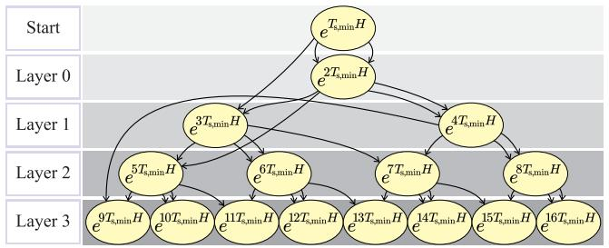  
FIGURE 7. Layered graph architecture for parallel precomputation of ’-functions.

circuit topologies, the proposed -function calculation techϕnique substitutes 2` (numS teps − 1) matrix exponentials with matrix multiplications. Matrix exponentials are computationally expensive algorithms including matrix inversions and numerous matrix multiplications. Thus, replacing a matrix exponential with a single matrix multiplication greatly speeds up to the overall precomputation of -functions for parallel output points, shown in Fig. 4.

# C. PARALLELIZED GPU PRECOMPUTATION OF ’-FUNCTIONS

A parallelized algorithm can be developed based on the algorithm introduced in the prior subsection. As shown in Fig. 7, if all exponentials up to $\bar { e } ^ { i T _ { \mathrm { s , m i n } } H }$ are known, all further matrix exponentials up to $\overline { { e ^ { 2 i T _ { \mathrm { s , m i n } } H } } }$ can be found without further information. For example, if $e ^ { T _ { \mathrm { s , m i n } } H } , e ^ { 2 T _ { \mathrm { s , m i n } } H }$ are known, the matrix exponentials $e ^ { \hat { 3 } T _ { \mathrm { s , m i n } } H } , e ^ { 4 T _ { \mathrm { s , m i n } } H }$ can be computed as $e ^ { 3 T _ { \mathrm { s , m i n } } H } \ = \ e ^ { T _ { \mathrm { s , m i n } } H } e ^ { 2 T _ { \mathrm { s , m i n } } H }$ ,and $e ^ { 4 T _ { \mathrm { s , m i n } } H } \ = \ e ^ { 2 T _ { \mathrm { s , m i n } } H } \overbar { e ^ { 2 T _ { \mathrm { s , m i n } } H } }$ . Using this technique, the -terms can be computed in a ϕlayered approach as shown in Fig. 7. A layered directed acyclic graph (LDAG) is formed in Fig. 7, where each child node is composed of matrix multiplications of parent nodes. It is noted in Fig. 7 that the graph layer j contains 2 j matrix exponentials. Thus, computing numS teps discretization step-sizes requires ˙log numSteps graph layers. Computing the matrix exponentials on a CPU requires cycling through the entire graph structure, computing each matrix exponential within a layer sequentially. However, each matrix exponential in a layer requires no information from other matrix exponentials on the same layer, i.e., matrix exponentials within a layer are independent to each other. Therefore, GPU computing hardware can be used to parallelize matrix exponentials within a layer by performing parallel matrix multiplications on matrix exponentials from the previously computed layers (i.e., layers of smaller indices). As the layer index increases, the calculations of matrix exponentials are greatly accelerated by the GPU due to additional parallelization.

As introduced previously, the matrix H is circuit topology dependent. Thus, the set of -functions should be computed ϕfor each possible semiconductor switch permutation. The matrix exponentials for each circuit topology are independent of one another. Thus, the matrix exponentials can be

computed in parallel for each unique topology. In this way, -functions of both unique circuit topologies and different step-sizes within a particular topology can both be computed in parallel. A CPU implementation must cycle through each topology step-size combination sequentially, whereas a GPU can compute all -terms contemporaneously in a ϕlayered approach. Practical GPU implementation is limited by the hardware architecture, namely the number of parallel computation threads. Case studies are presented in Section V to demonstrate the efficiency improvements of the proposed parallel precomputation algorithm.

# D. DISCUSSION ON PRECOMPUTATION OF ’-FUNCTIONS

For a system with l semiconductor switches, there are at most $2 ^ { \ell }$ possible switching topologies. Additionally, for a system with a maximum system switching frequency $f _ { \mathrm { S W , m a x } }$ and a minimum user-set step-size $T _ { \mathrm { s , m i n } }$ , there are at ,most numS $t e p s = 1 / \left( f _ { \mathrm { S W , m a x } } T _ { \mathrm { s , m i n } } \right)$ ,possible discretization / , ,step-sizes. Thus, there are at most $\left( 2 ^ { \ell } q _ { m a x } \right)$ (numS teps) - ϕfunctions to be precomputed. The minimum step-size is selected by considering both the PWM carrier frequency, and the smallest time-scale dynamic in the system. As a rule of thumb, the simulation sampling frequency should be the greater of the following two: 20 times the maximum frequency of transients to be represented accurately, and at least 50 to 100 times the PWM carrier frequency [3]. Additionally, often the maximum step-size for a power electronic system is smaller than the control period, i.e., $1 / f _ { S W , m a x }$ . For example, if a modulation / ,scheme has phase-shifted carriers the maximum step-size is the control period divided by the number of carrier signals.

The proposed parallelized GPU precomputation technique aims to speed up the precomputation of -functions. Howϕever, large-scale power electronic systems with hundreds of switches can make precomputation very challenging. To address the precomputation challenge, the power electronic circuit can be decoupled through parallel DC-side capacitors, or series DC-side inductors with zero-delay coupling [36], [47]. By doing so, the total number of possible switch permutations drastically drops, while high interfacing accuracy is retained. Alternatively, the system equations can be decoupled using the splitting state-space method [48]. The methods in [36] and [47] can accommodate large step-sizes with high accuracy but requires overhead computing recursive derivatives, whereas the technique in [48] is limited by the second-order decoupling approximation which may limit the simulation step-size. Alternatively, instead of precomputation and decoupling, -functions can ϕbe computed and intelligently cached [15]. However, this technique introduces significant overhead for computing the -functions during simulation runtime. The optimal ϕimplementation of GPU-based parallel-in-time simulation of large-scale power electronic systems remains a topic of future work.

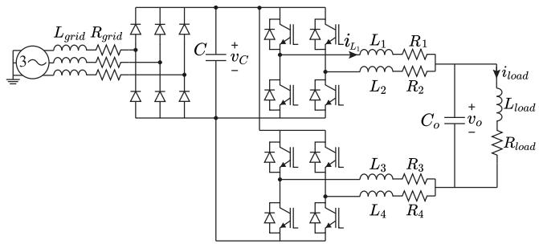  
FIGURE 8. Multileg full bridge class D amplifier (MFB-CDA) with a full wave rectifier.

# V. CASE STUDIES

In this section, the numerical accuracy and efficiency of the proposed GPU-based parallel-rate EI algorithm is validated using simulation studies of typical power converters. Additional case studies are used to demonstrate the efficiency improvements of the proposed -function precomputation techniques.

# A. SIMULATION ACCURACY COMPARISON

To demonstrate the accuracy of the proposed parallel-rate EI algorithm, a circuit topology is used which features both uncontrolled diodes and forced commutated switches. A multileg full bridge class D amplifier (MFB-CDA) with a full wave rectifier is utilized, as shown in Fig. 8. The grid voltage frequency in Fig. 8 is 60 Hz, while the MFB-CDA switching frequency is 100 kHz. The MFB-CDA is intended to generate a sinusoidal output voltage waveform with the frequency of 1 kHz at 1 ms, after the initial charging transients of the DC-link and output capacitors. The parallel-rate EI algorithm is implemented on a GPU with a simulation output granularity of $T _ { \mathrm { s , m i n } } = 1 0 n s$ and is validated against a ,reference model, built in Simulink/Simscape Electrical and solved by ode8 with a fixed step size of 1ns.

The simulated waveforms produced by the two models are overlapped in Fig. 9. It is shown in Fig. 9 that the simulation results of the parallel-rate EI algorithm match very well to those of the small step-size reference signal. Parallel-rate EI accurately captures both the slow system dynamics, and the fast-transient voltage ripples caused by the small load side capacitance, as shown in Fig. 9(a). The large difference in time constants between the switching frequency and the ripple frequency of the load-side capacitor voltage contributes to high network stiffness. Thus, this case study demonstrates parallel-rate EI’s modeling accuracy for simulating high stiffness networks with both fully-controlled and uncontrolled semiconductor switches.

The parallel-rate EI algorithm is compared with a conventional DSED algorithm that only recalculates system states at switching events in Fig. 10. It is observed in Fig. 10 that the parallel-rate EI accurately captures the high order harmonics in the output voltage waveform. On the contrary, the conventional DSED algorithm effectively simulates the

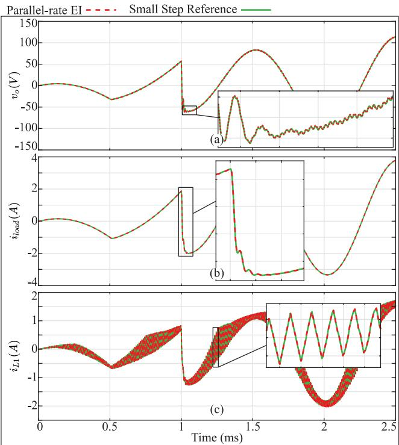  
FIGURE 9. Parallel-rate EI accuracy comparison versus small step reference for MFB-CDA converter. (a) Output capacitor voltage, ${ \pmb v _ { o } }$ . (b) Load current, $i _ { I o a d }$ . (c) Inductor $\pmb { L } _ { 1 }$ current, $i _ { L _ { 1 } }$

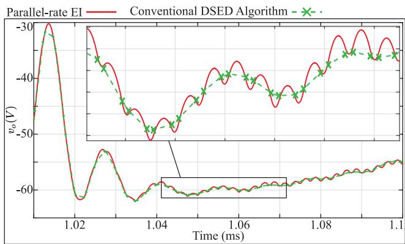  
FIGURE 10. Parallel-rate EI algorithm comparison with conventional DSED algorithm for the MFB-CDA.

slow transients in the output waveform but does not give insight into the high frequency voltage ripple’s magnitude or time constant. It is shown in Fig. 10 that parallel-rate EI is crucial for generating high fidelity output waveforms for stiff systems, especially if the fast transient is much faster than the converter switching frequency.

A second case study of a two-stage AC-DC-DC converter is used to demonstrate the accuracy of the proposed parallel-rate EI algorithm. The case study features frontend full-wave rectifier connected to a 5kHz boost DC-DC converter, as shown in Fig. 11. The second case study incorporates a digital controller for closed loop voltage-mode

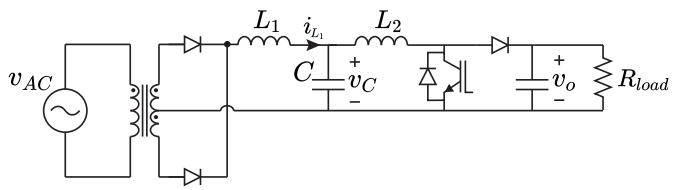  
FIGURE 11. Two-stage power converter with a front-end rectifier and back-end boost converter.

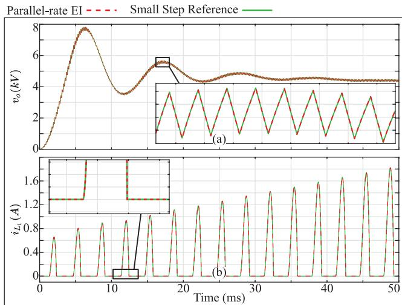  
FIGURE 12. Parallel-rate EI algorithm comparison with reference for two-stage power converter system. (a) Output capacitor voltage, $\pmb { v _ { o } }$ . (b) Inductor $\pmb { L } _ { 1 }$ current, $i _ { L _ { 1 } }$ .

control. A PI controller is used to regulate the boost converter output voltage. The output waveforms of the parallel-rate EI algorithm are simulated with $\begin{array} { r l } { T _ { \mathrm { s , m i n } } } & { { } = } \end{array}$ ,100ns and are compared to the reference solution from Simulink/Simscape Electrical/SPS with ode8 and a time step of 10 ns.

As shown in Fig. 12, the parallel-rate EI algorithm waveforms overlap precisely with the small-step reference solution. It is observed in Fig. 12 that the parallel-rate EI algorithm accurately captures both the active switch dynamics, and the natural commutation (passive) events of the diodes. The simulation results in the case study demonstrate the viability of the converter closed-loop control and diode handling on the GPU platform.

To quantify the numerical error, the relative error is computed for each system state. The relative error for a given state is obtained by using the 2-norms of the difference between the simulated and reference solutions. For the $i ^ { t h }$ state variable, the relative error is calculated by

$$
\varepsilon_ {\text {r e l}, i} = \frac {\| x _ {\mathrm {G P U - E I} , i} - x _ {\text {r e f} , i} \| _ {2}}{\| x _ {\text {r e f} , i} \| _ {2}}, \quad \forall i \in \{1, 2, \dots , n \} \tag {11}
$$

where n is the number of system states; $x _ { \mathrm { G P U - E I } , i }$ is the parallel-rate EI output vector for the $i ^ { t h }$ , state, and $x _ { \mathrm { r e f } , i }$ is the small step reference vector for the $i ^ { t h }$ ,state. The geometric mean of the relative errors is used to obtain the overall system-level relative error as

TABLE 1. Overall relative errors of parallel-rate EI for case studies.   

<table><tr><td>Case study</td><td>Overall Relative Error of Parallel-Rate EI</td></tr><tr><td>MFB-CDA</td><td>2.01 × 10-3</td></tr><tr><td>Rectifier-boost converter</td><td>1.41 × 10-3</td></tr></table>

TABLE 2. Efficiency comparison among numerical integration techniques.   

<table><tr><td rowspan="2">Solver</td><td colspan="2">Wall clock time (s)</td><td colspan="2">Parallel-rate EI Speedup Factor</td></tr><tr><td>MFB-CDA</td><td>Rectifier-boost converter</td><td>MFB-CDA</td><td>Rectifier-boost converter</td></tr><tr><td>GPU Parallel-rate EI</td><td>0.325</td><td>0.015</td><td>1</td><td>1</td></tr><tr><td>Backwards Euler</td><td>1.769</td><td>0.208</td><td>5.44</td><td>13.87</td></tr><tr><td>Trapezoidal Rule</td><td>2.118</td><td>0.250</td><td>6.52</td><td>16.67</td></tr><tr><td>Simulink ode15s</td><td>33.281</td><td>34.453</td><td>102.40</td><td>2,296.87</td></tr><tr><td>Simulink ode23t</td><td>N/A</td><td>10.109</td><td>N/A</td><td>673.93</td></tr><tr><td>PLECS DOPRI</td><td>0.531</td><td>0.687</td><td>1.63</td><td>45.80</td></tr></table>

$$
\varepsilon_ {\text {t o t}} = \sqrt [ n ]{\varepsilon_ {\text {r e l ,} 1} \cdot \varepsilon_ {\text {r e l ,} 2} \cdot \cdots \cdot \varepsilon_ {\text {r e l ,} n}}. \tag {12}
$$

The overall relative errors for the two case studies are presented in Table 1. As shown in Table 1, the parallelrate EI is in strong agreement with the small step reference solution for both case studies.

# B. SIMULATION EFFICIENCY COMPARISON

This subsection focuses on comparing the efficiency of the proposed parallel-rate EI algorithm to other commonly used simulation algorithms. The numerical efficiency is compared for the two case studies previously introduced. The MFB-CDA circuit is simulated for 2.5 ms, and the twostage rectifier-boost converter is simulated for 50 ms. The efficiency is compared with two fixed-step-size algorithms and three variable-step-size algorithms. The fixed-step trapezoidal rule (TR), and fixed step backwards Euler (BE) method provide benchmark comparisons since they generate identical output waveforms. A step-size of 10ns is used for the MFB-CDA system while 100 ns is used for the two-stage rectifier-boost converter. These step-sizes are the maximum allowable by BE and TR to generate accurate output waveforms for each case study. Variablestep Simulink ode15, Simulink ode23t, and PLECS DOPRI serve as competitive efficiency benchmarks for parallel-rate EI solver. The parallel-rate EI solver is coded using CUDA for a NVIDIA GeForce RTX 4070, while the fixed-step solvers are coded in C++ and executed on a PC with a 5.4 GHz Intel Core i7-14700F CPU, 32 GB RAM, and Microsoft Windows 11 operating system. The variable-step solvers run on the same CPU using the respective software, i.e., Simulink and PLECS. For fair comparison between GPU and CPU, numerical efficiency is measured according to wall clock simulation runtime. The efficiency results of the tested algorithms are presented in Table 2.

It is observed from Table 2 that the GPU parallel-rate output result has a significant speedup advantage compared to all other solvers. For the MFB-CDA case study, the parallel-rate EI algorithm is over 5-fold faster than BE solver, over 6-fold faster than TR solver, and over 1.6-fold faster than PLECS’s DOPRI (Dormand-Prince) solver. For the rectifier-boost converter case study, the parallel-rate EI algorithm is over 13-fold faster than the BE solver, over 16-fold faster than the TR solver, and over 45-fold faster than PLECS DOPRI. For either case study, parallel-rate EI achieves at least 100-fold speedup to the variable time-step solvers of Simulink/Simscape Electrical toolbox. It is noted that the conventional fixed time-step solvers, such as BE and TR, use the same the time step (output granularity) of 10 ns and 100 ns as the proposed parallel-rate GPU-based EI solver for the first and second case studies, respectively. The efficiency improvement of parallel-rate EI is expected as the GPU computes output points in parallel while the other CPU-based solvers computes output points sequentially.

For the MFB-CDA study, the maximum step-size is 2 5 s . µand the step-size granularity is 10ns, giving a ratio of 250. This represents the maximum number of parallel steps the parallel-rate EI algorithm computes at once. For the rectifierboost converter study, the maximum step size is 200 s and µthe step-size granularity is 100ns, giving a ratio of 2000. This ratio embodies the degree of parallelization a particular circuit topology enables. The higher the parallel computing ratio, the larger the theoretical efficiency improvement is, compared to a fixed time-step CPU implementation. However, the ratio is not linearly proportional to the computation efficiency improvement. Once the GPU’s computation units are fully saturated, the amount of parallelization has diminishing returns. Parallelization beyond saturation resembles a semi-parallelized approach which is still beneficial, compared to an entirely sequential CPU implementation. Thus, the numerical efficiency gain will become larger as either the switching frequency decreases, or the minimum output granularity becomes finer. However, these come at the expense of extra GPU memory and computational requirements in the form of quick access memory to store additional $\varphi$ terms, ϕand more GPU computational units or cores to allow for maximum parallelization of output points. Additionally, the degree of parallelization depends on the size of the converter system. Systems with many energy storage devices will benefit from the GPU’s fine-grained parallelism.

# C. ’-FUNCTION PRECOMPUTATION EFFICIENCYCOMPARISON

The previous section, Section IV, proposed a novel parallel precomputation method for $\varphi$ functions by performing ϕrecursive matrix multiplication using CPU and GPU. This section compares the efficiency of the proposed GPU-based $\varphi$ function precomputation algorithm with the na¨ıve CPU ϕand the improved CPU implementations. As an illustrative example, an 8 × 8 A-matrix is analyzed, where each algorithm computes four $\varphi$ functions for a converter with

TABLE 3. Efficiency comparison among ’ Precomputation algorithms.   

<table><tr><td></td><td colspan="3">Wall clock time (s)</td></tr><tr><td>Algorithm</td><td>10 unique step sizes</td><td>100 unique step sizes</td><td>1000 unique step sizes</td></tr><tr><td>Parallelized GPU</td><td>0.00423</td><td>0.01387</td><td>0.08651</td></tr><tr><td>Improved CPU</td><td>0.0801</td><td>0.379</td><td>3.577</td></tr><tr><td>Naïve CPU</td><td>0.2391</td><td>2.103</td><td>21.64</td></tr></table>

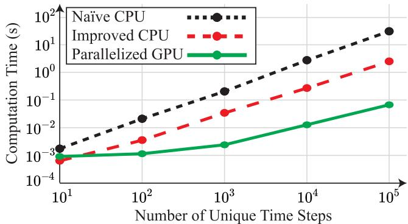  
FIGURE 13. ’ function precomputation algorithm efficiency comparison as the number of time steps increases.

100 unique circuit topologies. To assess the scalability of each precomputation algorithm, the number of unique discretization step-sizes is varied. The three precomputation techniques are tested for systems featuring 10, 100, and 1000 unique discretization step-sizes.

This test provides insight to the performance of GPU-based precomputation algorithm as the scale of the step-sizes increases. The GPU algorithm is coded using CUDA and NVIDIA GeForce RTX 4070, while the other CPU algorithms are coded in C++ and executed on an Intel i7-14700F CPU. The three algorithms’ efficiencies are compared by examining wall clock time. The precomputation times of the three algorithms are presented in Table 3.

As shown in Table 3, the proposed GPU-based precomputation algorithm of  functions is orders of magnitude ϕfaster than the na¨ıve CPU algorithm and upwards of 10-fold faster than the improved CPU algorithm. Furthermore, the proposed parallel precomputation algorithm becomes more efficient as the number of time steps increases. It is typical for GPU implementations that the efficiency gains tend to increase with problem size, provided the hardware can accommodate it. Eventually, the GPU will become fully utilized once either the number of topologies or number of possible time steps becomes very large. Fig. 13 shows the comparison of the three algorithms computing four  functions for a single converter circuit topology as ϕthe number of possible time steps increases by an order of magnitude up to 100,000. As shown in Fig. 13, once the number of unique discretization step-sizes passes 1,000, the GPU becomes fully utilized and the computation time grows at a predictable rate. For a typical power electronic system, it is unusual to have more than 1,000 unique time

steps. Thus, the precomputation of  functions using the ϕproposed parallel GPU algorithm is extremely fast and does not represent a computational bottleneck for the simulation of power electronic systems.

# VI. CONCLUSION

This paper proposes a GPU-based parallel-rate EI algorithm for rapid EMT simulation of power electronic systems. Alongside the GPU-based parallel-rate simulation framework, a numerically efficient parallel precomputation scheme of matrix exponential functions is proposed. The proposed EI algorithm is a high-order numerical integration solver with L-stability, which is desirable for the simulation of stiff and non-stiff power electronic systems. The incorporated DSED framework is designed to preschedule active switching events, while the parallel output scheme can precisely detect passive switching events. Case studies demonstrate excellent simulation accuracy and greatly improved numerical efficiency of the proposed parallel-rate EI solver. Further case studies illustrate the effectiveness of the proposed GPU-based parallel precomputation technique of matrix exponential functions. The proposed EI algorithm is well suited for digital power electronic converter simulators that incorporates parallel computing hardware with large-scale parallel processing threads, such as GPU and FPGA.

# REFERENCES

[1] J. Mahseredjian, V. Dinavahi, and J. A. Martinez, “Simulation tools for electromagnetic transients in power systems: Overview and challenges,” IEEE Trans. Power Del., vol. 24, no. 3, pp. 1657–1669, Jul. 2009.   
[2] A. Abusalah, O. Saad, J. Mahseredjian, U. Karaagac, L. Gerin-Lajoie, and I. Kocar, “CPU based parallel computation of electromagnetic transients for large power grids,” Electric Power Syst. Res., vol. 162, pp. 57–63, Sep. 2018.   
[3] W. Li, G. Joos, and J. Belanger, “Real-time simulation of a wind turbine generator coupled with a battery supercapacitor energy storage system,” IEEE Trans. Ind. Electron., vol. 57, no. 4, pp. 1137–1145, Apr. 2010.   
[4] M. Stevic et al., “Challenges in real-time simulation of smart transformers,” in Proc. IEEE 13th Int. Symp. Power Electron. Distrib. Gener. Syst. (PEDG), Jun. 2022, pp. 1–6.   
[5] C. Dufour, S. Abourida, and J. Belanger, “Real-time simulation of permanent magnet motor drive on FPGA chip for high-bandwidth controller tests and validation,” in Proc. IEEE Int. Symp. Ind. Electron., Paris, France, Jul. 2006, pp. 2591–2596.   
[6] V. Jalili-Marandi and V. Dinavahi, “SIMD-based large-scale transient stability simulation on the graphics processing unit,” IEEE Trans. Power Syst., vol. 25, no. 3, pp. 1589–1599, Aug. 2010.   
[7] A. Gopal, A. Gopal, and D. Niebur, “DC power flow based contingency analysis using graphics processing units,” Proc. IEEE Lausanne Power Tech, pp. 731–736, Jul. 2010.   
[8] J. K. Debnath, W.-K. Fung, A. M. Gole, and S. Filizadeh, “Simulation of large-scale electrical power networks on graphics processing units,” in Proc. IEEE Electr. Power Energy Conf., Winnipeg, MB, Canada, Oct. 2011, pp. 199–204.   
[9] Z. Zhou and V. Dinavahi, “Parallel massive-thread electromagnetic transient simulation on GPU,” IEEE Trans. Power Del., vol. 29, no. 3, pp. 1045–1053, Jun. 2014.   
[10] Y. Song, Y. Chen, Z. Yu, S. Huang, and L. Chen, “A fine-grained parallel EMTP algorithm compatible to graphic processing units,” in Proc. IEEE PES Gen. Meeting Conf. Expo., Jul. 2014, pp. 1–6.   
[11] J. Zhao, J. Liu, P. Li, X. Fu, G. Song, and C. Wang, “GPU based parallel matrix exponential algorithm for large scale power system electromagnetic transient simulation,” in Proc. IEEE Innov. Smart Grid Technol.-Asia (ISGT-Asia), Nov. 2016, pp. 110–114.

[12] Y. Song, Y. Chen, S. Huang, Y. Xu, Z. Yu, and W. Xue, “Efficient GPU-based electromagnetic transient simulation for power systems with thread-oriented transformation and automatic code generation,” IEEE Access, vol. 6, pp. 25724–25736, 2018.   
[13] Y. Song, Y. Chen, S. Huang, Y. Xu, Z. Yu, and J. R. Marti, “Fully GPUbased electromagnetic transient simulation considering large-scale control systems for system-level studies,” IET Gener., Transmiss. Distribution, vol. 11, no. 11, pp. 2840–2851, Aug. 2017.   
[14] W. Hatahet and L. Wang, “Hybrid CPU-GPU-based electromagnetic transient simulation of modular multilevel converter for HVDC application,” in Proc. IEEE Electr. Power Energy Conf. (EPEC), Victoria, BC, Canada, Dec. 2022, pp. 44–49.   
[15] W. Wu, P. Li, X. Fu, Z. Wang, J. Wu, and C. Wang, “GPU-based power converter transient simulation with matrix exponential integration and memory management,” Int. J. Electr. Power Energy Syst., vol. 122, Nov. 2020, Art. no. 106186.   
[16] Z. Zhou and V. Dinavahi, “Fine-grained network decomposition for massively parallel electromagnetic transient simulation of large power systems,” IEEE Power Energy Technol. Syst. J., vol. 4, pp. 51–64, 2017.   
[17] D. Shu, Y. Wei, V. Dinavahi, K. Wang, Z. Yan, and X. Li, “Cosimulation of shifted-frequency/dynamic phasor and electromagnetic transient models of hybrid LCC-MMC DC grids on integrated CPU–GPUs,” IEEE Trans. Ind. Electron., vol. 67, no. 8, pp. 6517–6530, Aug. 2020.   
[18] J. Sun, S. Debnath, M. Saeedifard, and P. R. V. Marthi, “Real-time electromagnetic transient simulation of multi-terminal HVDC–AC grids based on GPU,” IEEE Trans. Ind. Electron., vol. 68, no. 8, pp. 7002–7011, Aug. 2021.   
[19] J. Kumar Debnath, W.-K. Fung, A. M. Gole, and S. Filizadeh, “Electromagnetic transient simulation of large-scale electrical power networks using graphics processing units,” in Proc. 25th IEEE Can. Conf. Electr. Comput. Eng. (CCECE), Vancouver, BC, Canada, Apr. 2012, pp. 1–4.   
[20] C. Lyu, N. Lin, and V. Dinavahi, “Device-level parallel-in-time simulation of MMC-based energy system for electric vehicles,” IEEE Trans. Veh. Technol., vol. 70, no. 6, pp. 5669–5678, Jun. 2021.   
[21] N. Lin and V. Dinavahi, “Variable time-stepping modular multilevel converter model for fast and parallel transient simulation of multiterminal DC grid,” IEEE Trans. Ind. Electron., vol. 66, no. 9, pp. 6661–6670, Sep. 2019.   
[22] B. Shang, N. Lin, and V. Dinavahi, “Detailed nonlinear modeling and highfidelity parallel simulation of MMC with embedded energy storage for wind farm grid integration,” IEEE Open Access J. Power Energy, vol. 11, pp. 196–206, 2024.   
[23] J. R. Marti and J. Lin, “Suppression of numerical oscillations in the EMTP,” IEEE Power Eng. Rev., vol. 9, no. 5, pp. 71–72, May 1989.   
[24] S.-H. Weng, Q. Chen, and C.-K. Cheng, “Time-domain analysis of large-scale circuits by matrix exponential method with adaptive control,” IEEE Trans. Comput.-Aided Design Integr. Circuits Syst., vol. 31, no. 8, pp. 1180–1193, Aug. 2012.   
[25] P. Chen, C.-K. Cheng, D. Park, and X. Wang, “Transient circuit simulation for differential algebraic systems using matrix exponential,” in Proc. Int. Conf. Comput.-Aided Design, San Diego, CA, USA, Nov. 2018, pp. 1–6.   
[26] H. Zhuang et al., “Simulation algorithms with exponential integration for time-domain analysis of large-scale power delivery networks,” IEEE Trans. Comput.-Aided Design Integr. Circuits Syst., vol. 35, no. 10, pp. 1681–1694, Oct. 2016.   
[27] Q. Chen, “EI-NK: A robust exponential integrator method with singularity removal and Newton–Raphson iterations for transient nonlinear circuit simulation,” IEEE Trans. Comput.-Aided Design Integr. Circuits Syst., vol. 41, no. 6, pp. 1693–1703, Jun. 2022.   
[28] X. Wang, P. Chen, and C.-K. Cheng, “Stability and convergency exploration of matrix exponential integration on power delivery network transient simulation,” IEEE Trans. Comput.-Aided Design Integr. Circuits Syst., vol. 39, no. 10, pp. 2735–2748, Oct. 2020.

[29] X. Fu, C. Wang, P. Li, and L. Wang, “Exponential integration algorithm for large-scale wind farm simulation with Krylov subspace acceleration,” Appl. Energy, vol. 254, Nov. 2019, Art. no. 113692.   
[30] C. Dufour, H. Saad, J. Mahseredjian, and J. Belanger, “Custom-coded ´ models in the state space nodal solver of Artemis,” in Proc. Int. Conf. Power Syst. Transients, Vancouver, BC, Canada, 2013, pp. 1–6.   
[31] C. Wang, X. Fu, P. Li, J. Wu, and L. Wang, “Multiscale simulation of power system transients based on the matrix exponential function,” IEEE Trans. Power Syst., vol. 32, no. 3, pp. 1913–1926, May 2017.   
[32] C. Wang, X. Fu, P. Li, and J. Wu, “Accurate dense output formula for exponential integrators using the scaling and squaring method,” Appl. Math. Lett., vol. 43, pp. 101–107, May 2015.   
[33] P. Li, Z. Meng, X. Fu, H. Yu, and C. Wang, “Interpolation for power electronic circuit simulation revisited with matrix exponential and dense outputs,” Electric Power Syst. Res., vol. 189, Dec. 2020, Art. no. 106714.   
[34] J. Paull, C. Knickle, N. Lofroth, L. Wang, and W. Li, “Adaptive-grained exponential integrator algorithm for efficient simulation of power converter systems,” IEEE Trans. Power Del., vol. 40, no. 2, pp. 1114–1128, Apr. 2025.   
[35] J. Paull, H. Li, L. Wang, and W. Li, “High-order exponential integrator algorithm for real-time simulation of power electronic systems,” IEEE J. Emerg. Sel. Topics Ind. Electron., vol. 6, no. 3, pp. 948–959, Jul. 2025.   
[36] J. Paull, H. Li, L. Wang, and W. Li, “High-order exponential integrator with network decoupling for numerically efficient simulation of large-scale power electronic systems,” in Proc. IEEE 15th Int. Symp. Power Electron. Distrib. Gener. Syst., 2025, pp. 1170–1174.   
[37] J. Jatskevich and T. Aboul-Seoud, “Automated state-variable formulation for power electronic circuits and systems,” in Proc. IEEE Int. Symp. Circuits Syst., May 2004.   
[38] O. Wasynczuk and S. D. Sudhoff, “Automated state model generation algorithm for power circuits and systems,” IEEE Trans. Power Syst., vol. 11, no. 4, pp. 1951–1956, Nov. 1996.   
[39] J. H. Allmeling and W. P. Hammer, “PLECS-piece-wise linear electrical circuit simulation for simulink,” in Proc. IEEE Int. Conf. Power Electron. Drive Systems., Jul. 1999, pp. 355–360.   
[40] N. Watson and J. Arrillaga, Power Systems Electromagnetic Transients Simulation, 2nd ed., London, U.K.: IET, 2019.   
[41] Z. Yu, Z. Zhao, B. Shi, Y. Zhu, and J. Ju, “An automated semi–symbolic state equation generation method for simulation of power electronic systems,” IEEE Trans. Power Electron., vol. 36, no. 4, pp. 3946–3956, Apr. 2021.   
[42] J. C. Jimenez, H. de la Cruz, and P. A. De Maio, “Efficient computation of phi-functions in exponential integrators,” J. Comput. Appl. Math., vol. 374, Aug. 2020, Art. no. 112758.   
[43] N. J. Higham, “The scaling and squaring method for the matrix exponential revisited,” SIAM Rev., vol. 51, no. 4, pp. 747–764, Nov. 2009.   
[44] B. Li, Z. Zhao, Y. Yang, Y. Zhu, and Z. Yu, “A novel simulation method for power electronics: Discrete state event driven method,” CES Trans. Electr. Mach. Syst., vol. 1, no. 3, pp. 273–282, Sep. 2017.   
[45] Y. Zhu, Z. Zhao, B. Shi, and Z. Yu, “Discrete state event-driven framework with a flexible adaptive algorithm for simulation of power electronic systems,” IEEE Trans. Power Electron., vol. 34, no. 12, pp. 11692–11705, Dec. 2019.   
[46] R. B. Sidje, “Expokit: A software package for computing matrix exponentials,” ACM Trans. Math. Softw., vol. 24, no. 1, pp. 130–156, Mar. 1998.   
[47] B. Shi, Z. Zhao, Y. Zhu, Z. Yu, and J. Ju, “Discrete state event-driven simulation approach with a state-variable-interfaced decoupling strategy for large-scale power electronics systems,” IEEE Trans. Ind. Electron., vol. 68, no. 12, pp. 11673–11683, Dec. 2021.   
[48] X. Fu, W. Wu, P. Li, J. Mahseredjian, J. Wu, and C. Wang, “Splitting state-space method for converter-integrated power systems EMT simulations,” IEEE Trans. Power Del., vol. 40, no. 1, pp. 584–595, Feb. 2025.