# An open-source parallel EMT simulation framework

Min Xiong a,b , Bin Wang c , Deepthi Vaidhynathan a , Jonathan Maack a , Matthew J. Reynolds a , Andy Hoke a , Kai Sun b, Deepak Ramasubramanian d, Vishal Verma d, Jin Tan a,

a National Renewable Energy Laboratory, Golden, CO, 80401, USA   
b University of Tennessee, Knoxville, TN, 37996, USA   
c University of Texas at San Antonio, San Antonio, TX, 78249, USA   
d Electric Power Research Institute, Knoxville, TN, 37932, USA

# A R T I C L E I N F O

Keywords:

EMT

Electromagnetic transient simulation

Inverter-based resource

ParaEMT

Parallel computation

Power system dynamics

# A B S T R A C T

As the integration level of inverter-based resources (IBRs) increases, ensuring the reliable operation of the bulk power systems requires the use of electromagnetic transient (EMT) simulation tools to identify and mitigate system-wide stability risks. Conducting EMT studies for large-scale, IBR-rich grids, however, is challenging due to the inherent computational bottleneck caused by the underlying high-fidelity models and required small time steps. This paper introduces ParaEMT: an open-source, generic EMT simulation framework designed to accelerate simulations by leveraging advanced parallel computational technologies, such as high-performance computers. This paper presents a comprehensive exposition of ParaEMT, covering its modeling library, simulation strategy, framework structure, operational procedures, and auxiliary features, alongside its extensible parallel computational architecture. Notably, ParaEMT is a publicly accessible and modularized framework written in Python, thereby facilitating future development and the integration of new models and algorithms. The accuracy and efficiency of ParaEMT are demonstrated by rigorous validations via multiple case studies.

# 1. Introduction

With the increasing integration of inverter-based resources (IBRs) toward a 100% renewable energy future, the induced fast dynamics, such as sub/super synchronous resonances, have emerged as significant threats to the reliability and stability of power systems [1–6]. To tackle this challenge, power system electromagnetic transient (EMT) simulation stands out as a powerful tool due to its capability to accurately capture intricate system-wide dynamics spanning a wide frequency range, e.g., from DC to hundreds of hertz, owing to its detailed system and IBR modeling. Therefore, EMT simulation is playing a progressively more pivotal role in crucial aspects for renewable integration investigations in modern power grids, such as control design, stability analysis, and protection coordination [5–8].

Nevertheless, small time steps, typically 50–100 μs, are needed for the numerical accuracy and stability of EMT simulations, resulting in substantial computational overhead, particularly on large-scale systems [9]. Consequently, the demand to accelerate EMT simulations has garnered significance for facilitating efficient dynamic security assessments of large-scale, IBR-rich power grids [10,11].

At present, researchers and practitioners in the field heavily rely on commercial, offline EMT simulation tools, such as PSCAD and EMTP-RV, which are typically well-tested and computationally efficient. Those tools, however, are not flexible for users to experiment with new technical approaches [12,13] or integrate innovative algorithms [9,14,15] by modifying the source code.

This reasoning motivates the development of an open-source EMT simulation framework capable of parallel computation. This framework caters to the needs of both industrial and academic entities engaged in power systems development and research. Additionally, it aims to provide a transparent platform for students to acquire hands-on experience with fundamental EMT simulation techniques. In pursuit of this objective, the authors have successfully developed a Python-based EMT simulation framework, named “ParaEMT,” to serve as a flexible and extensible platform for both educational and research purposes.

During the past decade, Python, a dynamic and versatile programming language, has gained immense popularity in various fields, such as machine learning and data science [16,17]. As a high-level interpreted language, Python offers a multitude of advantages: it is easy to code and read; it is free and open source; and it has a comprehensive standard

library, strong community support, platform independence, and more [18]. These attributes make Python particularly well-suited for developing open-source tools with rapid prototyping. For example, a Python-based power system phasor domain simulator, ANDES [19], has amassed an impressive 399,000 downloads. Hence, the authors chose Python as the language for the EMT simulation framework ParaEMT in this work.

Till now, there have been several previous attempts at developing open-source simulators considering EMT dynamics, such as the DPsim in [20] based on the dynamic phasor approach, the developing PyTHTA EMT circuit program [21], and the MSEMT developed in Modelica environment [22]. To the best of the authors’ knowledge, ParaEMT is the first free and open-source Python-based EMT simulator for large scale systems that is easily compatible with the distributed memory paradigm, such as multiple computers on a transmission control protocol (TCP) network and high-performance computing (HPC) protocols, through utilization of the Message Passing Interface (MPI) technology [23].

In light of the need of EMT simulations for large-scale systems [24] and the swift evolution of heterogeneous computing architectures, we believe ParaEMT emerges as a valuable and substantial contribution. It provides a flexible and transparent framework for exploring advanced efficient EMT simulations techniques and fosters innovative research endeavors in the domain of EMT simulations.

The rest of the paper is organized as follows. Section II outlines the main features of the open-source EMT simulation framework, ParaEMT. Section III elucidates the implemented models and algorithms in Para-EMT. Section IV presents a comprehensive overview of the framework’s structure. To assess the accuracy and efficacy of the developed framework, four case studies are elaborated in Section V and Section VI. Conclusions and future work are drawn up in Section VII.

# 2. ParaEMT features

The initial motivation for developing this framework is to provide a flexible environment for conducting EMT simulations of large-scale bulk power systems. To achieve this target, the framework of ParaEMT was developed with the following main features:

1) Fully open source and transparent: Allows unrestricted access and modifications to the underlying source code.   
2) Cross-platform compatibility: Able to operate on most prevalent operating systems, including Unix, Linux, Windows, and macOS X.   
3) Automated parallel computation: Provides fully automated parallel computation for solving network equations.   
4) IEEE/Cigre power system dynamic-link library (DLL) compatibility: Seamlessly incorporates black-box component dynamic models developed by third parties [25].   
5) Harnessing the just-in-time (JIT) compiler, Numba, in Python: Drastically speeds up the computational loops [26].   
6) Results down-sampling capability and snapshot functionality.   
7) Test systems library: Includes common test systems, such as the Kundur two-area system [27], IEEE 9-bus system [28], IEEE 39-bus system [28], Western Electricity Coordinating Council (WECC) 179-bus system [29], and WECC 240-bus system [30].   
8) Intelligent initialization: Automatically builds and initializes EMT cases from predefined PSSE power flow files to avoid reaching abnormal operating modes [31].   
9) Empowers advanced applications: Allows proficient users to develop additional models and functions, facilitating rapid prototyping, modeling, and testing of novel research ideas leveraging heterogeneous computing architectures, such as HPC [12] and graphics processing units (GPUs) [13].

In comparison, the widely used commercial software PSCAD operates exclusively on the Windows platform [32], which poses certain

constraints in exploiting the potential of HPCs (which typically have a Linux system) or GPUs to accelerate the simulation from user end, unless vendor support is provided to deploy it in the Linux system or restructure the CPU code to be compatible with GPU execution mode [33].

Conversely, commercial software, like PSCAD, has a well-written user’s manual and help documentation, well-developed GUIs, excellent help-desk support, extensive device libraries, and advanced functions, such as switching interpolation. ParaEMT is still under continuous development and currently lacks these features.

# 3. Models and algorithms utilized in ParaEMT

This section introduces the network, dynamic, and fault modeling employed in ParaEMT, along with elucidations of the algorithms utilized in the process.

# 3.1. Network equation modeling

Approaches for formulating the EMT network equation are primarily classified as nodal formulation [34,35], state-space formulation [36], and state-space nodal formulation [37]. Given the time-consuming nature of state-space equation formulation, especially for large-scale systems considering topology changes [31,38], the nodal formulation proposed in [34] is utilized in ParaEMT.

To obtain the network nodal equation through discretizing the differential equations, various algorithms can be employed, such as the 2- stage singly diagonally implicit Runge-Kutta (2S-DIRK) method, the trapezoidal-rule method, polynomial Gear methods, the backward Euler method, the backward differentiation formula, the matrix exponentialbased method, and so on [31,39]. In most cases, the classical trapezoidal method still retains higher efficiency in achieving comparable precision with alternative methods [31], and thus it is utilized in Para-EMT to derive the network companion circuits and to establish the network conductance matrix G. Finally, the discretized network nodal equation is formulated as [34,36]:

$$
\mathbf {G} \mathbf {v} (t) = \mathbf {i} (t) + \mathbf {i} _ {\text {h i s t}} (t - \Delta t) \tag {1}
$$

where v(t) is a vector of the nodal voltages, i(t) is a vector of the external current sources, and ihist is a vector of the currents determined by history terms related to conditions in the previous time step. In addition, to suppress spurious numerical oscillations, artificial resistors $R _ { p } { \approx } 4 0 L /$ (3Δt) and $R _ { S } { \approx } 3 \Delta t / ( 4 0 C )$ are added in parallel/series with L/C, respectively [40].

# 3.2. BBD technique for parallelizing the network solution

To enable parallel computations for solving the network equation, a task that typically dominates the total simulation time cost [9], the bordered-block-diagonal (BBD) matrix-based approach [14] is employed and automated in ParaEMT to decompose the sparse network conductance matrix G into multiple partitions, as shown in (2).

$$
\mathbf {G} = \left[ \begin{array}{c c c c c} \mathbf {G} _ {1 1} & & & & \mathbf {G} _ {1 n} \\ & \mathbf {G} _ {2 2} & & & \mathbf {G} _ {2 n} \\ & & \dots & & \vdots \\ & & & \mathbf {G} _ {m m} & \mathbf {G} _ {m n} \\ \mathbf {G} _ {n 1} & \mathbf {G} _ {n 2} & \dots & \mathbf {G} _ {n m} & \mathbf {G} _ {n n} \end{array} \right] \tag {2}
$$

Subsequently, all but one of the backward and forward substitutions for solving the network solution are parallelized for speedup. Interested readers may refer to [14] for details.

Besides, due to the flexibility of this framework, other potential techniques and algorithms can also be developed or explored to improve simulation efficiency in the future.

# 3.3. System component modeling

At present, the implemented models in ParaEMT are concisely summarized in Fig. 1, which includes several dynamic models and a network model formulated by the nodal approach [41–43].

ParaEMT offers a Euler integration routine and includes all relevant limits for computation regarding synchronous machines, machine con trols, and IBRs. Meanwhile, ParaEMT is currently undergoing continuous development to incorporate more models, such as other types of machines [44], distributed transmission lines [45], dynamic loads, transformers with saturation, and new EMT-type grid-- following/forming inverters, thus enhancing its versatility and applicability.

# 3.4. Fault modeling

In its current state, ParaEMT supports control reference step changes and generator trips through embedded functions while allowing step perturbations of any parameters or variables. Development efforts are currently underway to include balanced and unbalanced line faults.

# 4. Framework structure of ParaEMT

Fig. 2 on the next page illustrates the main structure of the simulation framework, along with the corresponding files or code snippets for users to better comprehend the detailed implementations. Further elaborations and additional details are provided next.

# 4.1. File formats

As presented in Fig. 2, ParaEMT loads system power flow from a preestablished PSSE raw file and then converts it into a three-phase network representation, along with the three-phase instantaneous voltages and currents, during the initialization process. The dynamic data are imported from a predefined XLS file that has a straightforward data layout. Such a manner facilitates the efficient establishment of EMT models of systems, especially for large-scale cases.

# 4.2. Main functions and subfunction libraries

As displayed in Fig. 2, the ParaEMT framework comprises three main functions. Among them, the first function, main_- step0_CreateLargeCases, serves the dual purpose of executing and storing the power flow solution and, optionally, generating synthetic large-scale systems. The second function, main_step1_sim, is responsible for initializing and simulating the system dynamics. The third function, main_step2_save, saves the simulation results.

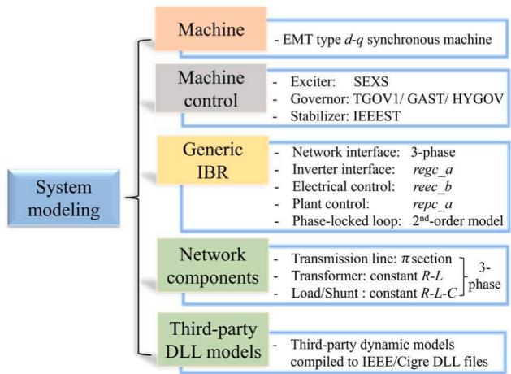  
Fig. 1. Developed models in ParaEMT.

Further, the main functions are supported by multiple subfunctions sourced from three distinct libraries. Notably, lib_numba incorporates time domain simulation functions compiled through Numba. Additionally, psutils predominantly encompasses functions related to system initialization, whereas other functions are in Lib_BW. Four numerical arrays, pfd, dyd, ini, and emt, are designated to hold power flow data, dynamic data, initial state data, and EMT simulation data, respectively.

# 4.3. Simulation initialization

Proper initialization plays an important role in attaining a normal operation condition before executing the time domain simulation [31]. To achieve this, ParaEMT starts the initialization from a converged power flow and then initializes the rest of the variables for dynamic routines following an automatic process, as illustrated in Fig. 3.

# 4.4. Time domain simulation

As the crux of the EMT simulation, the time domain simulation involves mainly updating the dynamic states, updating the currents, and solving the network nodal equation. The time loop framework in Para-EMT that considers reinitialization following any disturbances is detailed in Fig. 4. Meanwhile, the down-sampling function allows for saving the results at every customized DS time steps.

# 4.5. Run from a snapshot

To run ParaEMT from a simulation snapshot, typically a wellconverged steady state, the first step is to simulate and save a snapshot when setting SimMod=0 in main_step1_sim.

After that, by setting SimMod=1, the simulations thereafter concerning different contingencies start directly and automatically from the saved snapshot, facilitated by the subfunction initialize_from_snp.

# 4.6. Parallel computation for solving the network equation

ParaEMT supports three different network solvers, which are based on the direct inverse, LU decomposition, and BBD decomposition. Among them, the BBD technique supported by the function library bbd_matrix.py is used for parallel computing of the network solution.

# 5. Case studies for accuracy validation

In this section, two case studies are conducted to validate the accuracy of ParaEMT on capturing system transient dynamics, along with its compatibility with DLL models.

# 5.1. Case study on a modified Kundur two-area system

A validation of ParaEMT against PSSE on slow dynamics is performed on a modified Kundur two-area system, shown in Fig. 5 [27]. The modifications encompass an intentionally crafted ensemble of components, including one WECC generic IBR, three synchronous generators, four transformers, eight lumped transmission lines, two loads, and two fixed shunts. Additionally, the SEXS exciter is added to all generators; generators G2, G3, and G4 are equipped with TGOV1, HYDRO, and GAST governors, respectively; generator G4 is equipped with an IEEEST stabilizer. The simulation starts from a steady state, and a + 0.05-p.u. voltage reference step change is added to G3 at t = 1 s and then eliminated at t = 5 s.

Figs. 6-8 depict the simulation results of ParaEMT compared to PSSE. Evidently, ParaEMT yields results that closely align with those from PSSE, and the minor errors are acceptable and reasonable due to undisclosed implementation specifics of models and numerical solvers in commercial tools.

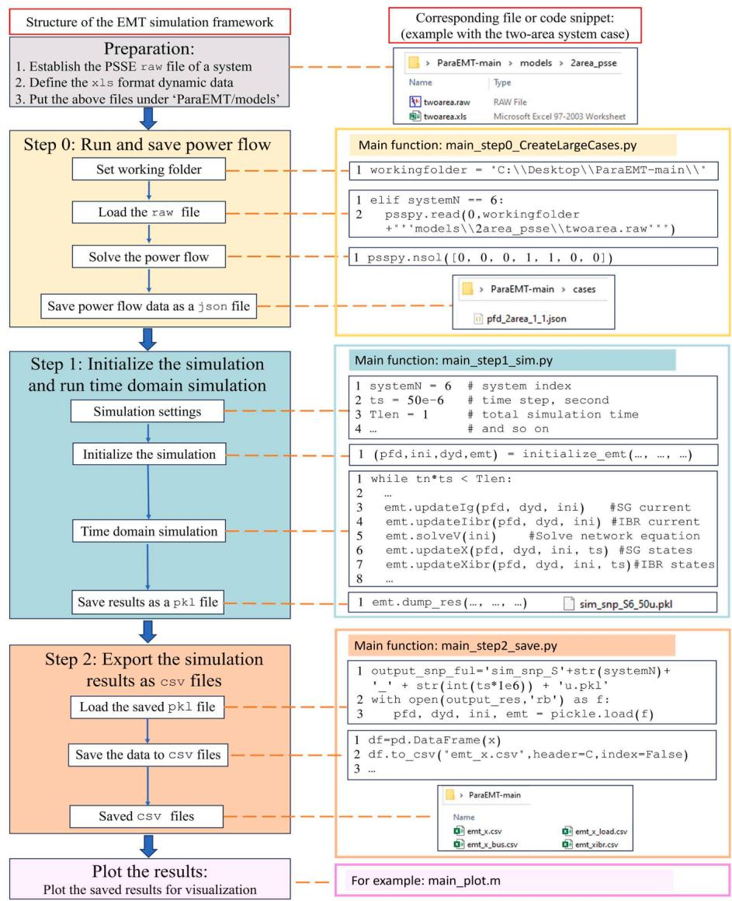  
Fig. 2. EMT simulation framework in ParaEMT.

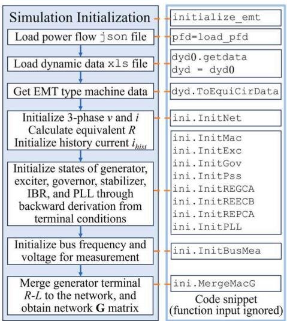  
Fig. 3. Framework for simulation initialization in ParaEMT.

The successful validation of ParaEMT using this modified Kundur two-area system confirms the correct implementation of all the developed models within ParaEMT, as shown in Fig. 1, along with the framework shown in Fig. 2.

# 5.2. Case study of a DLL-supported IBR model

In this case, the framework in ParaEMT is extended to incorporate a C-compiled DLL file containing a grid-following IBR model from the Electric Power Research Institute (EPRI) [46]. The analysis is conducted on a small three-bus test case containing an infinite bus and an IBR bus.

After initialization, two disturbances are added at t = 4.0 s and t = 8.0 s, by increasing $P _ { r e f }$ and $Q _ { r e f }$ of the IBR by 5 MW and 5 Mvar, respectively. The dynamic results of ParaEMT, in red, are well aligned with those provided by PSCAD, in black, as shown in Fig. 9.

This case study stands as an exemplary validation of ParaEMT’s ability to precisely simulate fast dynamics and its compatibility with IBR models in DLL files, thus allowing users to efficiently incorporate userdefined models.

# 6. Case studies on parallel simulation

This section presents two case studies to demonstrate the efficiency

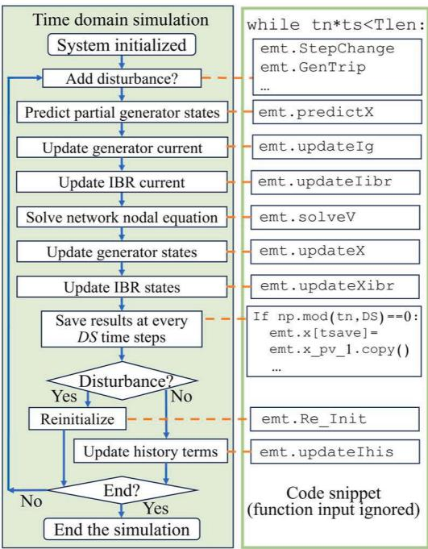  
Fig. 4. Framework for the time domain simulation in ParaEMT.

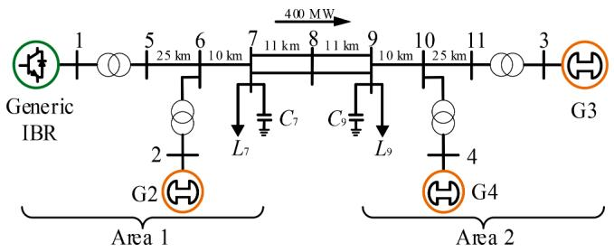  
Fig. 5. A modified Kundur two-area system.

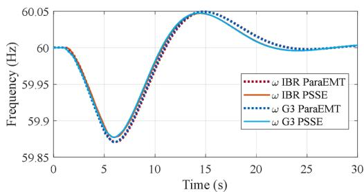  
Fig. 6. Frequency comparison on a modified Kundur two-area system.

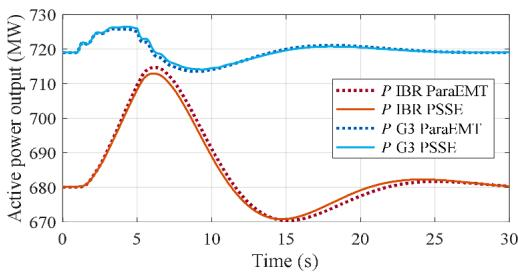  
Fig. 7. Power comparison on a modified Kundur two-area system.

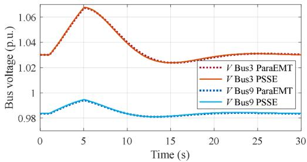  
Fig. 8. Voltage comparison on a modified Kundur two-area system.

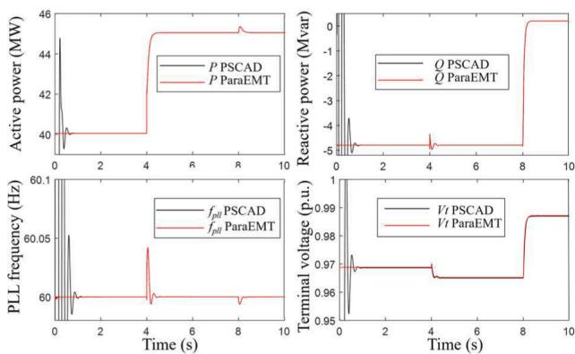  
Fig. 9. Results comparison for the EPRI IBR model on a three-bus system.

of ParaEMT on medium and large-scale systems using the BBD-based parallel computation.

# 6.1. Time performance on the WECC 240-bus system

To evaluate ParaEMT’s time performance on a medium-sized system, the average time cost of ParaEMT for a 1 s simulation using a 50 μs time step is compared with that of PSCAD [30]. Because the developed PSCAD model is evenly divided into eight zones [47], the tests are conducted using 1 or 8 processor cores, i.e., with or without parallel computation, for fair comparisons. The simulations are carried out on a Windows machine equipped with two Intel Xeon(R) Platinum 8280 2.7 GHz CPUs and 512GB RAM. Also, Python 3.7.13, SciPy 1.7.0, NumPy 1.21.0, and Numba 0.57.1 are employed. The final time cost results are summarized in Table 1.

As presented in Table 1, ParaEMT can simulate this medium-size 240-bus system with a superior time performance than that of PSCAD under series simulation using 1 core, primarily attributed to implementation of the JIT Numba compiler within ParaEMT. However, ParaEMT does not show speedup for parallel simulation on this 240-bus system, mainly because the utilized BBD technique cannot fully decouple the network, and the system size is not sufficiently large to exploit the advantages of the BBD technique, and the required synchronization process slows down the simulation, especially when more than 8 partitions are utilized. Instead, PSCAD uses time delay induced by distributed model-based long transmission lines to fully decouple the network and greatly reduce the time cost through parallel simulations [30]. Thus, in our future work, the authors are also interested in incorporating the distributed line model and developing corresponding

Table 1 Time cost on the WECC 240-bus system for a 1-second simulation.   

<table><tr><td>Simulator</td><td>1 processor core
No parallelization</td><td>8 processor cores
Parallelization</td></tr><tr><td>PSCAD</td><td>90 s</td><td>15 s</td></tr><tr><td>ParaEMT</td><td>29 s</td><td>28 s</td></tr></table>

parallel simulation capabilities, especially for medium size systems. To notice, including a distributed line model that considers frequency dependency [48] will certainly increase the computation burden for formulating the network G matrix and updating historical currents, determined by the number of long-distance lines in the system. Nevertheless, the time cost for simulating large-scale systems is still dominated by solving the network nodal equation, which is not straightforward to parallelize.

Notice that the distributed line-based parallel simulation technique used in PSCAD requires a manual process to decouple the system. In comparison, although the BBD-based parallelization does not speed up simulation on the 240-bus system, it is fully automatic and does not require any manual process, making it well-suitable for large-scale systems.

# 6.2. Parallel simulation on a synthetic 10,024-bus system

To substantiate ParaEMT’s capability and high efficiency of simulating large-scale systems with the BBD-based parallel simulation, a test is conducted on a synthetic 10,024-bus system constructed by interlinking 7 × 8 replications of the WECC 179-bus system using the LargeSysGenerator function [9,14]. Leveraging parallelization on the HPC Eagle at the National Renewable Energy Laboratory (NREL) [49], the performance is depicted in Figs. 10 and 11.

As shown in Fig. 10, with the number of HPC Message Passing Interface (MPI) ranks [23,50] and network BBD partitions both varying from 1 to 84, the simulation achieves a peak speedup of approximately 15–18 times, with a corresponding minimum time cost of 90–110 s for a 1 s simulation using a 50 μs time step, as shown in Fig. 11.

In addition, as the number of partitions increases, the size of the BBD corner block and the number of nonzero elements in the LU submatrices increases, which results in reducing the amount of work that benefits from parallelization. As per Amdahl’s law [51], this limits the maximum speed up of the BBD Schur complement solve. As a result, increasing the number of partitions increases the execution time on the 240-bus system. In contrast, this problem is less apparent on the 10,024-bus system, mainly because the network G matrix can be partitioned into more pieces before the corner size and number of nonzeros become problematic.

Importantly, the scalability presented here is not limited to HPC systems. ParaEMT uses MPI, which is a distributed memory parallelization paradigm, and can run on many network communication protocols; thus, it can be deployed on multiple compute nodes of an HPC system, multiple computers on a TCP network, or simply a multi-core machine.

# 7. Conclusions and future work

This paper introduces an open-source EMT simulation framework, ParaEMT, for efficient simulations of large-scale, IBR-rich grids leveraging parallel computations. The structure of the framework is presented in detail with code snippets. The accuracy, extension, and efficiency of ParaEMT are validated with case studies. The simulation framework is extensible to add user-defined models, different numerical approaches, and different modeling techniques. The framework can be further extended for simulating ultra-large-scale systems, acceleration via heterogeneous computing architectures, and EMT-phasor hybrid simulations.

Meanwhile, to improve the capability and flexibility of ParaEMT, the authors are working on developing power flow and result plotting functions in Python within the framework, and future efforts will be directed toward developing a user manual, a help document, additional dynamic models, interfaces with commercial tools, and compatibility with systems described in various data formats.

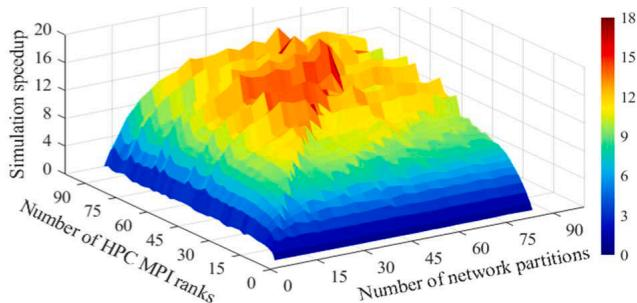  
Fig. 10. Speedup performance when leveraging HPC parallelization relative to a serial (single-core) simulation.

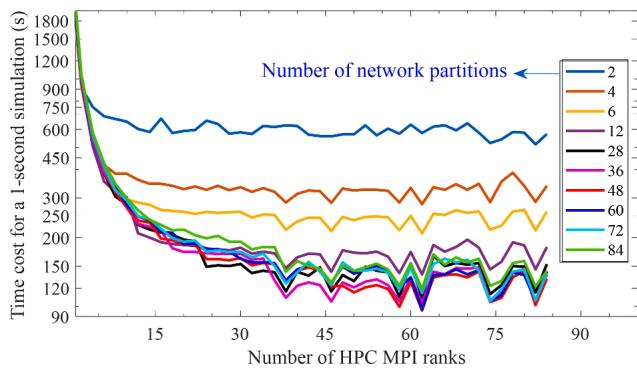  
Fig. 11. Time cost for a 1-second simulation using a 50-μs time step.

# Code availability

The open-source parallel EMT simulation framework, ParaEMT, is available in: http://github.com/NREL/ParaEMT_public

# CRediT authorship contribution statement

Min Xiong: Data curation, Investigation, Software, Validation, Visualization, Writing – original draft, Writing – review & editing. Bin Wang: Data curation, Investigation, Methodology, Resources, Software, Validation, Visualization, Writing – original draft. Deepthi Vaidhynathan: Software, Visualization, Writing – review & editing. Jonathan Maack: Software, Validation, Writing – review & editing. Matthew J. Reynolds: Funding acquisition. Andy Hoke: Funding acquisition, Writing – review & editing. Kai Sun: Writing – original draft, Writing – review & editing. Deepak Ramasubramanian: Resources. Vishal Verma: Resources. Jin Tan: Funding acquisition, Methodology, Project administration, Supervision, Writing – original draft, Conceptualization.

# Declaration of competing interest

The authors declare that they have no known competing financial interests or personal relationships that could have appeared to influence the work reported in this paper.

# Data availability

Data will be made available on request.

# Acknowledgments

This work was authored in part by the National Renewable Energy Laboratory (NREL), operated by Alliance for Sustainable Energy, LLC, for the U.S. Department of Energy (DOE) under Contract No. DE-AC36-

08GO28308. This work was supported by the Laboratory Directed Research and Development (LDRD) Program at NREL and the U.S. Department of Energy Office of Energy Efficiency and Renewable Energy Solar Energy Technologies Office Award Number 38457. The U.S. Government retains and the publisher, by accepting the article for publication, acknowledges that the U.S. Government retains a nonexclusive, paid-up, irrevocable, worldwide license to publish or reproduce the published form of this work, or allow others to do so, for U.S. Government purposes. The views expressed herein do not necessarily represent the views of the U.S. Department of Energy or the United States Government.

A portion of the research was performed using computational resources sponsored by the Department of Energy’s Office of Energy Efficiency and Renewable Energy and located at the National Renewable Energy Laboratory.

The authors would like to thank Dr. Rodrigo Henriquez-Auba from NREL for his helpful discussions on power system dynamics and simulations.

# References

[1] S. Dong, et al., "Analysis of November 21, 2021, Kauai Island power system 18-20 Hz oscillations," arXiv preprint, arXiv:2301.05781 (2023).   
[2] L. Fan, Z. Miao, et al., Real-world 20-Hz IBR subsynchronous oscillations: signatures and mechanism analysis, IEEE Trans. Energy Convers. 37 (4) (2022) 2863–2873.   
[3] Y. Cheng, et al., Real-world subsynchronous oscillation events in power grids with high penetrations of inverter-based resources, IEEE Trans. Power Syst. 38 (1) (2022) 316–330.   
[4] T. Xia, K. Sun, Time-variant nonlinear participation factors considering resonances in power systems, in: IEEE PES General Meeting, 2022. Denver, CO.   
[5] NERC, Reliability guideline: Electromagnetic transient Modeling For BPSconnected Inverter-Based Resources—Recommended Model Requirements and Verification Practices, NERC, Atlanta, Mar. 2023.   
[6] J.D. Lara, R. Henriquez-Auba, D. Ramasubramanian, S. Dhople, D.S. Callaway, S. Sanders, Revisiting power systems time-domain simulation methods and models, IEEE Trans. Power Syst. (2023) early access.   
[7] K. Sidwall, F. Paul, A review of recent best practices in the development of realtime power system simulators from a simulator manufacturer’s perspective, Energies 15 (3) (2022).   
[8] M. Sajjadi, T. Xia, M. Xiong, et al., Estimation of participation factors using the synchrosqueezed wavelet transform, in: IEEE PES General Meeting, 2023. Orlando, FL.   
[9] L. Zhang, B. Wang, X. Zheng, et al., A hierarchical low-rank approximation based network solver for EMT simulation, IEEE Trans. Power Del. 36 (1) (Feb. 2021) 280–288.   
[10] S. Subedi, M. Rauniyar, S. Ishaq, et al., Review of methods to accelerate electromagnetic transient simulation of power systems, IEEE Access 9 (Jun. 2021) 89714–89731.   
[11] K. Huang, M. Xiong, Y. Liu, K. Sun, F. Qiu, A heterogeneous multiscale method for power system simulation considering electromagnetic transients, in: IEEE PES General Meeting, 2023. Orlando, FL.   
[12] R.C. Green, L. Wang, M. Alam, Applications and trends of high performance computing for electric power systems: focusing on smart grid, IEEE Trans. Smart Grid 4 (2) (2013) 922–931.   
[13] J.K. Debnath, A.M. Gole, W.K. Fung, Graphics-processing-unit-based acceleration of electromagnetic transients simulation, IEEE Trans. Power Del. 31 (5) (2016) 2036–2044.   
[14] S. Fan, H. Ding, A. Kariyamasam, A.M. Gole, Parallel electromagnetic transients simulation with shared memory architecture computers, IEEE Trans. Power Del. 33 (1) (2018) 239–247.   
[15] T. Noda, K. Takenaka, T. Inoue, Numerical integration by the 2-stage diagonally implicit Runge-Kutta method for electromagnetic transient simulations, IEEE Trans. Power Del. 24 (1) (2009) 390–399.   
[16] S. Raschka, J. Patterson, C. Nolet, Machine learning in python: main developments and technology trends in data science, machine learning, and artificial intelligence, Information 11 (4) (2020).   
[17] A.C. Müller, S. Guido, Introduction to Machine Learning With Python: a Guide For Data Scientists, O’Reilly Media, Inc., 2016.   
[18] C. Ozgur, T. Colliau, G. Rogers, Z. Hughes, MatLab vs. Python vs. R, Journal of Data Science 15 (3) (2017) 355–371.

[19] H. Cui, F. Li, K. Tomsovic, Hybrid symbolic-numeric framework for power system modeling and analysis, IEEE Trans. Power Syst. 36 (2) (2020) 1373–1384.   
[20] M. Mirz, S. Vogel, G. Reinke, A. Monti, DPsim—A dynamic phasor real-time simulator for power systems, SoftwareX 10 (100253) (2019). Art. no.   
[21] H.C.A. Tavante, B.D. Bonatto, M. P.Coutinho, Open source implementations of electromagnetic transient algorithms, in: IEEE International Conference on Industry Applications, 2018.   
[22] A. Masoom, J. Mahseredjian, T. Ould-Bachir, A. Guironnet, MSEMT: an advanced Modelica library for power system electromagnetic transient studies, IEEE Trans. Power Del. 37 (4) (Sep. 2021) 2453–2463.   
[23] Open MPIv5.0.x, Accessed: Feb. 20, 2024. [Online]. Available: https://docs.open -mpi.org/en/v5.0.x/index.html.   
[24] P. Le-Huy, M. Woodacre, S. Gu´erette, E. ´ Lemieux, Massively parallel real-time simulation of very-large-scale power systems, IPST 17 (2017).   
[25] IEEE/Cigre Power System DLL Models/Standard, 2019. [Online]. Available: http ://www.electranix.com/ieee-pes-tass-realcodewg/.   
[26] S.K. Lam, A. Pitrou, S. Seibert, Numba: a llvm-based python jit compiler, in: Proceedings of the Second Workshop on the LLVM Compiler Infrastructure in HPC, 2015, pp. 1–6.   
[27] P. Kundur, Power System Stability and Control, McGraw-Hill, New York, NY, USA, 1994.   
[28] S. Peyghami, P. Davari, M. Fotuhi-Firuzabad, F. Blaabjerg, Standard test systems for modern power system analysis: an overview, IEEE Ind. Electron. Mag. 13 (4) (2019) 86–105.   
[29] S. Maslennikov, B. Wang, Q. Zhang, et al., A test cases library for methods locating the sources of sustained oscillations, in: IEEE PES General Meeting, 2016. Boston, MA.   
[30] B. Wang, R.W. Kenyon, J. Tan, Developing a PSCAD Model of the Reduced 240-bus WECC Test System, National Renewable Energy Lab. (NREL), Golden, CO, 2022. Tech. Rep. NREL/CP-6A40-82287.   
[31] J. Mahseredjian, V. Dinavahi, J.A. Martinez, Simulation tools for electromagnetic transients in power systems: overview and challenges, IEEE Trans. Power Del. 24 (3) (2009) 1657–1669.   
[32] Supported operating system of PSCAD. Accessed: 2023. [Online]. Available: https://www.pscad.com/knowledge-base/article/816.   
[33] J.D. Owens, et al., GPU computing, Proc. IEEE 96 (5) (2008) 879–899.   
[34] H.W. Dommel, EMTP Theory Book, Bonneville Power Admin., Portland, OR, 1986.   
[35] C.W. Ho, A. Ruehli, P. Brennan, The modified nodal approach to network analysis, IEEE Trans. Circuits Syst. 22 (6) (1975) 504–509.   
[36] N. Watson, J. Arrillaga, Power Systems Electromagnetic Transients Simulation, IET, Stevenage, U.K., 2003.   
[37] C. Dufour, J. Mahseredjian, J. B´elanger, A combined state-space nodal method for the simulation of power system transients, IEEE Trans. Power Del. 26 (2) (2010) 928–935.   
[38] A. Sinkar, H. Zhao, B. Qu, A.M. Gole, A comparative study of electromagnetic transient simulations using companion circuits, and descriptor state-space equations, Electr. Power Syst. Res. 198 (2021) 107360.   
[39] X. Fu, S.M. Seye, J. Mahseredjian, M. Cai, C. Dufour, A comparison of numerical integration methods and discontinuity treatment for EMT simulations, in: Proc. Power Syst. Comput. Conf (PSCC), 2018. Dublin, Ireland.   
[40] F. Alvarado, Eliminating numerical oscillations in trapezoidal integration, EMTP Newsletter 2 (3) (1982) 20–32.   
[41] SIEMENS, PSSE 34.4 Model Library, 2018.   
[42] P. Pourbeik, Model user guide for generic renewable energy system models, Electr. Power Res. Inst., Palo Alto, CA, USA (2015). Tech. Rep. EPRI 3002006525.   
[43] Z. Hu, M. Xiong, H. Shang, A. Deng, Anti-interference measurement methods of the coupled transmission-line capacitance parameters based on the harmonic components, IEEE Trans. Power Del. 31 (6) (2016) 2464–2472.   
[44] U. Karaagac, J. Mahseredjian, O. Saad, An efficient synchronous machine model for electromagnetic transients, IEEE Trans. Power Del. 26 (4) (2011) 2456–2465.   
[45] Z. Hu, M. Xiong, C. Li, P. Tang, New approach for precisely measuring the zerosequence parameters of long-distance double-circuit transmission lines, IEEE Trans. Power Del. 31 (4) (2015) 1627–1635.   
[46] W. Baker, D. Ramasubramanian. Generic photovoltaic inverter model in an electromagnetic transients simulator for transmission connected plants. 2022. [Online]. Available: https://www.epri.com/research/products/000000003 002025889.   
[47] Parallel and high performance computing of PSCAD. Accessed: 2023. [Online]. Available: https://www.pscad.com/webhelp/PSCAD/Features_and_Operations /Parallel_and_High_Performance_Computing.htm.   
[48] A. Masoom, T. Ould-Bachir, J. Mahseredjian, A. Guironnet, N. Ding, Simulation of electromagnetic transients with Modelica, accuracy and performance assessment for transmission line models, Electr. Power Syst. Res. 189 (2020). Art. no. 106799.   
[49] Eagle computing system. Accessed: Aug. 8, 2023. [Online]. Available: http s://www.nrel.gov/hpc/eagle-system.html.   
[50] F. Nielsen, Introduction to HPC With MPI For Data Science, Springer, 2016.   
[51] J.L. Gustafson, Reevaluating Amdahl’s law, Commun. ACM 31 (5) (1988) 532–533.