# Application of Frequency-Partitioning Fitting to the Phase-Domain Frequency-Dependent Modeling of Overhead Transmission Lines

Taku Noda, Senior Member, IEEE

Abstract—This paper shows that a previously proposed linear-system identification method based on frequency partitioning and adaptive weighting can be successfully applied to the phase-domain frequency-dependent modeling of overhead transmission lines for electromagnetic transient simulations. As the framework of the phase-domain modeling, the universal line model is used, and the frequency responses of the characteristic admittance and propagation function matrices are realized by linear equivalents obtained by the identification method mentioned before, instead of the well-known Vector Fitting method. In this paper, numerical techniques to enhance the identification method for this phase-domain line modeling application are also presented. For validation, the proposed approach is applied to modeling an existing 500-kV double-circuit transmission line. The effectiveness of the numerical techniques for enhancements are shown through the modeling process, and transient waveforms obtained by the proposed approach are compared with those by the rigorous Laplace transform method and with a field-test result.

Index Terms—Electromagnetic transient analysis, frequency response, identification, power system modeling, power system simulation, power transmission lines.

# I. INTRODUCTION

M ODERN power systems use power-electronics devicesfor dc transmission, back-to-back system interconnec- for dc transmission, back-to-back system interconnection, system stabilization, and other purposes. Since waveformlevel calculations are essential to consider switching in powerelectronics devices, studies of power systems, including powerelectronics devices, are now often carried out by electromagnetic transient (EMT) simulations. This trend gives further importance to EMT simulations in addition to studies of conventional phenomena, such as overvoltages, inrush currents, and abnormal oscillations.

Accurate modeling of transmission lines is a key to accurate EMT simulations. When a wide range of frequencies is of interest in an EMT simulation, the frequency dependence of a transmission line, that is, the skin effects of wires and ground soil has to be represented accurately. A variety of line models has been proposed to represent the frequency dependence. Early

models are based on the theory of natural modes of propagation [1], [2] for computational efficiency. In those modal-domain models [3]–[7], the frequency dependence of characteristic admittances and propagation functions is represented in the modal domain, and voltages and currents are transformed back and forth between the phase and the modal domain at every time step using transformation matrices. To carry out this phase and modal transformation in the time domain, transformation matrices are approximated by real and constant matrices. Thus, the modal-domain models are not accurate enough for modeling transmission lines whose transformation matrices exhibit heavy frequency dependence. To solve this problem, phase-domain models have been proposed [8]–[12]. The calculations of the phase-domain models are formulated fully in the phase domain, and the modal transformation itself is avoided. In the phase domain, characteristic admittance and propagation function are treated as matrices, whose frequency dependence is realized by matrix-vector convolutions in time-domain EMT simulations. For the matrix-vector convolutions, the frequency responses of the two matrices mentioned before have to be represented by, in other words, fitted with matrix partial fraction expansions (MPFEs) [13, App. A]. The fitting of the characteristic-admittance matrix is straightforward, and the vector-fitting (VF) method [14] is directly used to obtain its MPFE representation. The fitting of the propagation-function matrix, on the other hand, is not straightforward. Since its time-domain response includes step-wise changes due to modal traveling-time differences, the form of MPFE is modified in order to explicitly include time-delay terms. This methodology is called the universal line model (ULM) [15]. The idea of explicitly including time-delay terms was originally introduced in a -domain modeling method [10]. In [15], the ULM is combined with the VF method to identify the modified MPFE. As an alternative to the VF method, the author has proposed an MPFE identification method based on frequency partitioning and adaptive weighting [16], [17]. Since the method is mainly characterized by frequency partitioning, it is called the frequency-partitioning fitting (FpF) method in this paper. So far, the method has been applied to network equivalent modeling.

This paper shows that the FpF method can be successfully applied to the phase-domain frequency-dependent modeling of overhead transmission lines. For the fitting of a characteristicadmittance matrix, the FpF method is directly used to obtain its MPFE representation. In the same way as the VF method, the ULM is combined with the FpF method for the fitting of a

propagation-function matrix. Numerical techniques to enhance the FpF method for this phase-domain line modeling application are also presented in this paper. For validation, the proposed FpF-based approach is applied to modeling an existing 500-kV double-circuit transmission line. The effectiveness of the numerical techniques for enhancements is shown through the modeling process, and transient waveforms obtained by the proposed approach are compared with those by the rigorous Laplace transform method [18] and with a field-test result [19]. Results for underground cables will be presented in a separate paper due to a lack of space.

# II. PHASE-DOMAIN MODELING

# A. Phase-Domain Equations

Consider a transmission line with wires. We denote the voltages and the currents of the conductors at the sending end, respectively, by the vectors $v _ { 1 }$ and $i _ { 1 }$ and those at the receiving end by $v _ { 2 }$ and $i _ { 2 }$ . The phase-domain Bergeron-type solution of the wave equation of the line is expressed by the following equations in the time domain [10]:

$$
i _ {1} (t) = Y _ {0} (t) * v _ {1} (t) + i _ {p 1} (t) \tag {1a}
$$

$$
i _ {2} (t) = Y _ {0} (t) * v _ {2} (t) + i _ {p 2} (t) \tag {1b}
$$

where $Y _ { 0 } ( t )$ is the impulse response of the characteristic-admittance matrix and the operator denotes a matrix-vector convolution. The propagation terms $i _ { p 1 }$ and $i _ { p 2 }$ are given by

$$
i _ {p 1} (t) = H (t) * \left\{i _ {p 2} (t - \tau) - 2 i _ {2} (t - \tau) \right\} \tag {2a}
$$

$$
i _ {p 2} (t) = H (t) * \left\{i _ {p 1} (t - \tau) - 2 i _ {1} (t - \tau) \right\} \tag {2b}
$$

where is the traveling time of the fastest mode among all propagation modes of the line and $H ( t )$ is the impulse response of the transfer function matrix that is obtained by eliminating the time delay due to from the current propagation function matrix [10]. Note that all vectors shown here are column vectors of size and the dimensions of all matrices are by .

# B. Calculation of $F _ { 0 } ( j \omega )$ and $H ( j \omega )$

To perform the matrix-vector convolutions of $Y _ { 0 } ( t )$ in (1) and $H ( t )$ in (2), we first have to calculate their frequency responses. The impedance matrix of an overhead line can be calculated using Carson's and Schelkunoff's formula considering the skin effects of ground soil and wires. Since the capacitance matrix of an overhead line does not exhibit frequency dependence, the admittance matrix can be calculated by a textbook formula. Using and , the frequency-domain counterpart of $Y _ { 0 } ( t )$ is calculated by

$$
Y _ {0} (j \omega) = \{Z (j \omega) \} ^ {- 1} \sqrt {Z (j \omega) Y (j \omega)}. \tag {3}
$$

The frequency-domain counterpart of $H ( t )$ is calculated by

$$
H (j \omega) = \exp (j \omega \tau) \left\{\exp (- l \sqrt {Z (j \omega) Y (j \omega)}) \right\} ^ {T} \tag {4}
$$

where is the length of the line and $A ^ { T }$ denotes the transpose of matrix . and are calculated at discrete frequency samples, and then $Y _ { 0 } ( j \omega )$ and $H ( j \omega )$ are calculated using (3) and (4), respectively, at the same frequency samples.

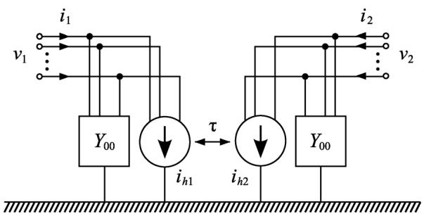  
Fig. 1. Equivalent circuit derived by the phase-domain equations.

# C. MPFE

Once the frequency responses of $Y _ { 0 } ( j \omega )$ and $H ( j \omega )$ have been calculated, each of them is fitted with an MPFE to perform matrix-vector convolutions. In the case of $Y _ { 0 } ( j \omega )$ , the following normal MPFE form is used:

$$
Y _ {0} (j \omega) \simeq \sum_ {k = 1} ^ {K} \frac {R _ {k}}{j \omega - p _ {k}}. \tag {5}
$$

For $H ( j \omega )$ , the form of MPFE is modified to explicitly include time-delay terms as in the following equation, and this methodology is called the ULM [15]:

$$
H (j \omega) \simeq \sum_ {m = 1} ^ {M} \left\{\exp (- j \omega \Delta \tau_ {m}) \sum_ {k = 1} ^ {K _ {m}} \frac {R _ {m k}}{j \omega - p _ {m k}} \right\} \tag {6}
$$

where $\Delta \tau _ { m } = \tau _ { m } - \tau$ and $\tau _ { m }$ is the traveling time of the th mode. It is assumed that there exist modes which have distinct traveling times. $R _ { m k }$ is the residue matrix of the th pole $p _ { m k }$ of the th mode.

# D. Time-Domain Implementation

Applying a numerical integration algorithm to (5) transforms the matrix-vector convolutions of $Y _ { 0 } ( t )$ in (1) into recursive formulas. The terms in the recursive formula can be classified into an instantaneous part and a history part. Let us denote the former part that relates the instantaneous values of $v _ { 1 } ( t )$ and $v _ { 2 } ( t )$ , respectively, to those of $i _ { 1 } ( t )$ and $i _ { 2 } ( t )$ as the constant conductance matrix $Y _ { 0 0 }$ and the latter part by the current source $i _ { y 1 }$ for the sending end and $i _ { y 2 }$ for the receiving end. Then, (1) is rewritten as

$$
i _ {1} (t) = Y _ {0 0} v _ {1} (t) + i _ {h 1} (t) \tag {7a}
$$

$$
i _ {2} (t) = Y _ {0 0} v _ {2} (t) + i _ {h 2} (t) \tag {7b}
$$

where the history current vectors $i _ { h 1 }$ and $i _ { h 2 }$ are given by

$$
i _ {h 1} (t) = i _ {y 1} (t) + i _ {p 1} (t) \tag {8a}
$$

$$
i _ {h 2} (t) = i _ {y 2} (t) + i _ {p 2} (t). \tag {8b}
$$

Equations (7) and (8), which can be readily incorporated into the equations of the remaining circuit in an EMT simulation, lead to the equivalent circuit shown in Fig. 1.

In (2), the matrix-vector convolutions of $H ( t )$ do not have to be decomposed into their instantaneous and history parts, since their inputs are associated with a time delay of . Using a numerical integration algorithm, the recursive formula of (6) is

obtained, and the matrix-vector convolutions are performed just according to the recursive formula. The exponential terms in (6) are simply treated as additional time delays in the time domain.

For the numerical integration of MPFEs, the trapezoidal method has been widely used. Recently, the 2S-DIRK method, which does not involve the problem of fictitious numerical oscillation, was proposed [20].

# E. Application of FpF to Phase-Domain Modeling

Before the VF method was developed, it was common to identify a rational function of $s ~ = ~ j \omega$ instead of an MPFE. Multiplying the denominators to both sides of the rational approximation equations gives a linear least-squares problem. The resulting overdetermined equations are, however, intrinsically ill-conditioned, since $s ^ { n }$ terms coming from the rational function take a wide range of values which cannot be dealt with by machine arithmetic accuracy. The FpF method solves this problem [16]. The FpF method divides the frequency range of interest into subsections and performs rational fitting for each subsection. Since the frequency range of each subsection is limited, the $s ^ { n }$ terms do not take a wide range of values and an accurate result is obtained. Then, the poles of each subsection are calculated, and the poles from all subsections are gathered and considered as the complete set of poles of the entire frequency response. The poles identified by the FpF method are all on the left-hand side of the plane, and they are therefore stable. For the fitting of $Y _ { 0 } ( j \omega )$ , the frequency response of its trace is used to identify the poles as proposed in [16]. For the fitting of $H ( j \omega )$ , its th mode propagation function $h _ { m } ( j \omega )$ , whose traveling time $\tau _ { m }$ has been extracted, is used to identify the poles ${ p _ { m k } } \left( k = 1 , 2 , \ldots , K _ { m } \right)$ in (6), and this process is repeated for all modes according to [15]. Thus, all entries of $Y _ { 0 } ( j \omega )$ share the same set of poles, and the same applies to $H ( j \omega )$ . With the known poles, their residue matrices are identified through a linear least-squares problem using the entire frequency response. Note that $s ^ { n }$ terms are not involved in this least-squares problem. The poles and their identified residue matrices give an MPFE model. In the two least-squares problems mentioned before, adaptive weighting and other numerical techniques are used to gain accuracy [16]. An algorithm to optimally divide the frequency range of interest into subsections is proposed in [17].

# III. ENHANCEMENTS TO FPF

# A. Practically Effective Weighting

The frequency response of an off-diagonal element of $H ( j \omega )$ often includes frequency regions where its magnitudes are large and regions where its magnitudes are small. If a simple leastsquares method is applied to the residue-matrix identification of $H ( j \omega )$ , the residuals at samples with large magnitudes are overestimated and those with small magnitudes are underestimated. A remedy for this is to introduce weighting to realize relativeerror evaluation [10], and the FpF method uses this weighting in the pole and the residue-matrix identification process [16]. However, even relative-error evaluation is not perfect. Consider the case in which a frequency response includes a region where its magnitude is very small, in other words, zero in a practical

sense. If relative-error evaluation is applied to this frequency response, the denominators for calculating weighting values in that almost-zero-magnitude region are almost zero, thus leading to quite large weighting values. As a result, the residuals in that region are unexpectedly exaggerated.

To solve this problem, we should clarify what kind of error evaluation is desired for practical simulations. Generally, relative-error evaluation is desired, since similar accuracy should be achieved over the entire frequency range. This will give similar accuracy for any type of simulations. In an almost-zero-magnitude region, however, we, in practice, do not pay attention to fitting accuracy so long as the response in that region is sufficiently small. To satisfy these requirements, the following hybrid error evaluation is proposed in this paper. First, let $\varepsilon _ { m }$ be a small positive constant which is used as the threshold to judge whether the response is meaningfully large or not. For the samples whose magnitudes are larger than $\varepsilon _ { m ; }$ , relative-error evaluation is applied. If we write the th sample of the frequency response to be fitted as $h _ { i }$ and the response of the identified MPFE at the same frequency sample as $\hat { h } ( j \omega _ { i } , x )$ , relative-error evaluation is expressed by

$$
e _ {i} (x) = \frac {h _ {i} - \hat {h} (j \omega_ {i} , x)}{| h _ {i} |} \tag {9}
$$

where is a vector consisting of the coefficients of the MPFE. For the samples whose magnitudes are less than or equal to $\varepsilon _ { m }$ , the following absolute-error evaluation is applied:

$$
e _ {i} (x) = \frac {h _ {i} - \hat {h} (j \omega_ {i} , x)}{\varepsilon_ {m}}. \tag {10}
$$

Equations (9) and (10) are incorporated into the residue-matrix identification process proposed in [16]. In this way, meaningfully large samples are treated by relative-error evaluation, and almost-zero samples by absolute-error evaluation. Note that (10) is scaled by $\varepsilon _ { m }$ so that the two error evaluation methods mentioned before are continuously connected to each other.

# B. Upper-Limit Frequency for Fitting and Pole Removal

As mentioned in the previous section, we do not pay attention to fitting accuracy in an almost-zero-magnitude region so long as the response of the identified MPFE in that region is sufficiently small. This idea can also be applied to determine the upper-limit frequency when the modal components $h _ { m } ( j \omega ) ~ ( m = 1 , 2 , \ldots , N )$ are fitted for identifying the poles of $H ( j \omega )$ according to (6). Let $\varepsilon _ { h }$ be a small positive constant which is used as the threshold to judge if the response is meaningfully large or not. The magnitude of $h _ { m } ( j \omega )$ is, in general, monotonically-decreasing as frequency goes up and, therefore

$$
\left| h _ {m} (j \omega) \right| <   \varepsilon_ {h} \tag {11}
$$

is satisfied above a certain angular frequency $\omega _ { h }$ . Since we do not care about fitting accuracy for frequency samples above the upper-limit (angular) frequency $\omega _ { h }$ , those frequency samples are removed from the fitting in order to avoid unnecessary partial fractions to represent a meaninglessly small response above $\omega _ { h }$ . Even with the upper-limit frequency set, the FpF method may identify a few poles whose natural oscillation frequencies

are above $\omega _ { h }$ . Since the response of $h _ { m } ( j \omega )$ above $\omega _ { h }$ is sufficiently small, those poles above $\omega _ { h }$ are removed before the residue-matrix identification process. This will avoid unwanted responses above $\omega _ { h }$ generated by those poles. In addition

$$
\tau_ {m} = \frac {l}{v _ {m}}, \quad v _ {m} = \left. \frac {\omega}{\beta_ {m}} \right| _ {\omega = \omega_ {h}} \tag {12}
$$

gives a reasonable estimate of the traveling time $\tau _ { m }$ of mode in order to obtain an accurate MPFE of $H ( j \omega )$ according to (6), where $\beta _ { m }$ is the phase constant of the same mode.

# C. Filtering

Even if the MPFEs of $Y _ { 0 } ( j \omega )$ and $H ( j \omega )$ identified for a phase-domain line model have no poles on the righthand side of the complex frequency plane, the line model can still be numerically unstable due to violation of passivity. Rigorously speaking, the MPFEs have to be identified so that the mathematical condition of the passivity is satisfied, and this kind of procedure is called “passivity enforcement” [21]. In the case of overhead lines, however, such numerical instability mostly comes from the following phenomenon. When a line model is excited, spike voltages generated by small traveling time differences between distinct modes are amplified as the traveling waves go back and forth on the line. The spike voltages actually exist, but they are not amplified in reality. This numerical amplification phenomenon results from high-frequency response (including the frequency region beyond the given highest frequency sample) of the identified MPFE of $H ( j \omega )$ . To suppress the numerical amplification phenomenon, multiplying a lowpass filter response to the given frequency response of $H ( j \omega )$ prior to the identification of its MPFE is proposed in [21]. This method solves the problem by attenuating the spike voltages, but some of the filter parameters are tentatively determined. As an alternative, the following filter for which the parameter is theoretically determined is proposed. According to Shannon's sampling theorem, the time-step size of an EMT simulation must be larger than

$$
\Delta t _ {\min } = \frac {1}{2 f _ {\max }} \tag {13}
$$

where $f _ { \mathrm { m a x } }$ is the upper limit of the given frequency response, that is, the highest frequency sample. This leads to multiplying the following first-order filter to the given frequency response of $H ( j \omega )$ when its residue matrices are identified:

$$
F (j \omega) = \frac {1}{1 + j \omega \Delta t _ {\min }}. \tag {14}
$$

It should be noted that the filter proposed here and the filter proposed in [21] are effective only when the time-step size of an EMT simulation is set to a value which is small enough to represent traveling time differences between distinct modes. If it is not small enough, the spike voltages mentioned before are not reproduced as expected in time-domain simulations. This is due to the fact that discretization using a numerical integration method cannot accurately reproduce a high-frequency response close to its Nyquist frequency determined by the time-step size.

Spike voltages, which should reach one end of the line at different time steps, may unexpectedly reach that end at the same time step due to the large step size used and, thus, they are accumulated. This accumulation leads to numerical amplification since the spike voltages travel back and forth on the line. Traveling times may not be exact multiples of a time-step size used, and interpolation operations used for its compensation further complicate the phenomenon.

# D. Numerically Stable Solution Utilizing SVD

Both the rational fitting for each frequency subsection and the residue-matrix identification process result in a least-squares problem represented by overdetermined linear equations of the form

$$
A x \cong b. \tag {15}
$$

If the condition number of is improved, a more accurate solution can be obtained. For this purpose, column scaling is applied to the FpF method [16]. However, cases exist where the condition number cannot be sufficiently improved by column scaling, thus leading to a computation failure of the solution. To avoid this situation, we utilize singular value decomposition (SVD) [22]. The SVD of is expressed by

$$
A = U S V ^ {T}. \tag {16}
$$

When the size of is by $n , U$ is an orthogonal matrix of size by $n , S$ is a diagonal matrix of size by , and is an orthogonal matrix of size by . The diagonal entries $s _ { 1 } , s _ { 2 } , \ldots , s _ { n }$ of are real and positive and called the singular values of . and can be determined in order to satisfy $s _ { 1 } \geq s _ { 2 } \geq \ldots \geq s _ { n }$ . If we write $y = V ^ { T } { \mathrm { ; } }$ and $g = U ^ { T } b _ { \mathrm { { f } } }$ , (15) is rewritten as

$$
S y \cong g. \tag {17}
$$

From this equation, it is clear that the value of $s _ { i }$ represents the contribution of the th equation in (17) to the solution. Normalizing the singular values by $s _ { 1 }$ gives

$$
\sigma_ {1} = 1, \quad \sigma_ {2} = \frac {s _ {2}}{s _ {1}}, \quad \dots , \quad \sigma_ {n} = \frac {s _ {n}}{s _ {1}} \tag {18}
$$

and they represent the contribution rates of the equations. The situation when the condition number is fairly large and the computation of the solution fails is equivalent to the situation when the tail portion of the normalized singular values are close to or smaller than the machine epsilon $\varepsilon _ { M }$ of the computer used. This can be understood in the following way—this ill conditioning comes from the fact that we are trying to include equations whose contributions are much smaller than those of the remaining equations, by an order of $\varepsilon _ { M }$ , and this difference cannot be dealt with by the machine arithmetic accuracy of the computer used. To avoid this problem, we remove the low-contribution equations from (17). Assume that we want to keep roughly digits of accuracy in the least-squares solution. If the largest that satisfies

$$
\sigma_ {i} \geq 1 0 ^ {q} \varepsilon_ {M} \tag {19}
$$

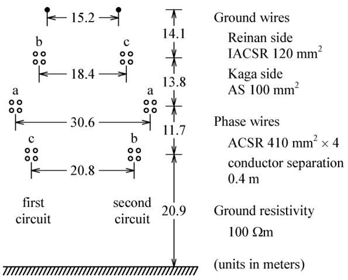  
Fig. 2. Sectional wire arrangement of a 500-kV double-circuit transmission line (Kaga-Reinan line).

is $n _ { \mathrm { ~ ; ~ } } ^ { \prime }$ , only the first to the th equations are used to obtain the solution, and the remaining equations are removed. With this condition, the solution of (17) is given by

$$
\hat {y} = \left[ \begin{array}{l l l l l l} \frac {g _ {1}}{s _ {1}} & \frac {g _ {2}}{s _ {2}} & \dots & \frac {g _ {n ^ {\prime}}}{s _ {n ^ {\prime}}} & 0 & \dots & 0 \end{array} \right] ^ {T}. \tag {20}
$$

The final solution of (15) is obtained by

$$
x = V \hat {y}. \tag {21}
$$

The technique shown above ensures a computationally stable solution process.

# IV. NUMERICAL EXAMPLE

The proposed FpF-based approach is applied to the modeling of an existing 500-kV double-circuit transmission line, and the effectiveness of the aforementioned numerical techniques is shown through its modeling process. The passivity of the created line model is assessed, and the fitting performance of the FpF-based approach is compared with that of the VF-based approach using this example. Then, transient waveforms obtained by the created line model are compared with those by the rigorous Laplace transform method and with a field-test result for validation.

# A. 500-kV Double-Circuit Transmission Line and its Modeling

Fig. 2 shows the wire arrangement of an existing 500-kV double-circuit transmission line in Japan. Since this transmission line connects the Kaga and the Reinan substation, it is called the Kaga–Reinan line. A field test for obtaining wave propagation characteristics was carried out using this transmission line [19]. The schematic diagram of this field test is shown in Fig. 3. An impulse generator (IG) was installed around the midpoint of the line, and actually its location marked by P in Fig. 3 was closer to the Kaga substation by 3.5 km from the exact midpoint. Impulse voltages generated by the IG were applied to phase b of the line's first circuit at Point P. At both substations, each phase was grounded through a 50- resistor that represents the surge impedance of the busbar of the same phase.

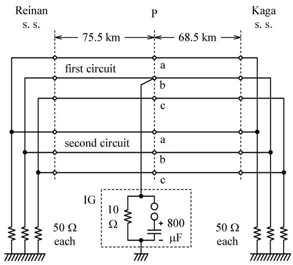  
Fig. 3. Schematic diagram of a field test using the Kaga-Reinan line.

Both line sections, divided by Point P, are modeled by the proposed FpF-based approach with the enhancements described in Section III. The line constants [23] are calculated at 400 frequency points from 0.1 Hz to 10 MHz, where the ground wires are eliminated by taking their presence into account. In the following results, although only the fitting results of the Reinan-side line section are shown, it should be noted that the results of the Kaga-side line section are essentially the same. The parameter values used for the enhancements to the FpF method are $\varepsilon _ { m } ~ = ~ 1 0 ^ { - 2 } , \varepsilon _ { h } = 1 0 ^ { - 3 }$ , and $q = 2$ , while the parameter values used for the FpF method itself are shown in Appendix A. If the difference of two modal traveling times is larger than 1%, these two modes are considered to be distinct modes. Fig. 4 shows the fitting result of the first-row entries of $Y _ { 0 } ( j \omega )$ , and Fig. 5 shows the same for $H ( j \omega )$ . The identified MPFEs accurately reproduce the given frequency responses, and deviations cannot be seen from the figures. The first-row entries are taken just as examples, and the remaining entries also show similar fitting accuracy.

The effects of the parameters $\varepsilon _ { m } , \varepsilon _ { h }$ , and on fitting results are examined in Appendix B, and the fitting performance for a high ground resistivity case is demonstrated in Appendix C.

# B. Effectiveness of the Enhancements

Numerical techniques to enhance the FpF method for the phase-domain line modeling application have been presented in Section III. In order to verify the effectiveness of those enhancements, the following numerical experiments are carried out using the Reinan-side line section.

Table I shows maximum deviations between the given and the fitted frequency responses of all entries of $H ( j \omega )$ for the cases with and without the proposed weighting algorithm described in Section III-A. In the absolute-error sense, the algorithm significantly reduces the fitting errors by accepting larger errors in almost-zero-magnitude regions.

Table II shows for each mode of $S H ( j \omega )$ , a change in the number of poles when an upper-limit frequency is set and poles beyond that frequency are removed in the pole-identification

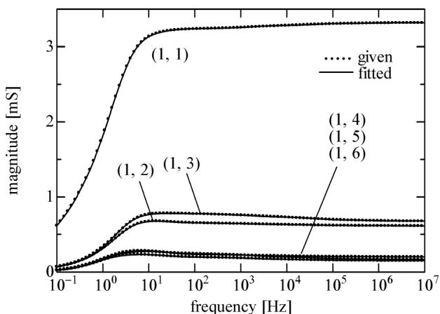

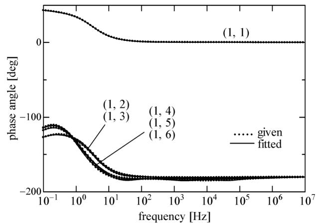  
(b)   
Fig. 4. Fitting result of the first-row entries of $Y _ { 0 } ( j \omega )$ , where (a) shows the magnitudes and (b) shows the phase angles.

process as proposed in Section III-B. This result shows that the proposed idea of setting an upper-limit frequency achieves the same degree of accuracy with a smaller number of poles.

The effectiveness of the proposed filtering described in Section III-C is verified by the following numerical experiment. Using the proposed FpF-based approach, two line models, one with and the other without the proposed filtering, are created for the Reinan-side line section, and an EMT simulation in which a step voltage of 1 p.u. is applied to the first circuit's phase a at one end and the rest of the terminals remain open-circuited is performed using both line models. A time step of 2 s which is sufficiently smaller than the traveling time difference between distinct modes of the line, in this particular case, 14.2 s, is used. Fig. 6 shows the simulation results. With the proposed filtering, spike voltages generated by the traveling time difference are damped out as they travel back and forth on the line. Without the proposed filtering, the spike voltages are amplified and they lead to divergence. Even with the proposed filtering, numerical amplification is observed when a large time-step size, such as 10 $\mu \mathrm { s } ,$ is used. To stabilize phase-domain line models for large time-step sizes, further investigations have to be carried out.

The final point to check is the effectiveness of the SVD-based algorithm described in Section III-D for numerically stable least-squares solutions. The residue matrix identification

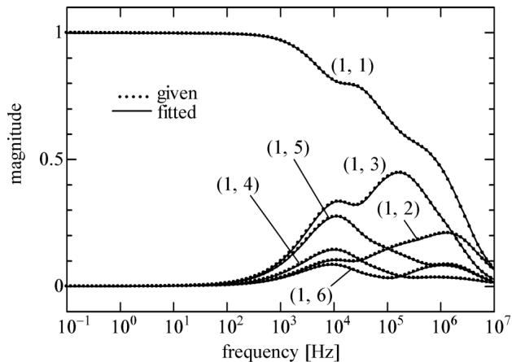  
(a)

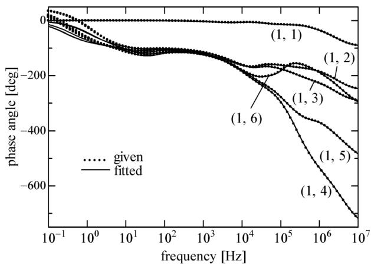  
(b)   
Fig. 5. Fitting result of the first-row entries of $H ( j \omega )$ , where (a) shows the magnitudes and (b) shows the phase angles.

process is performed element by element. When the residue matrices of $H ( j \omega )$ were identified, one singular value was smaller than $1 0 ^ { 2 } \varepsilon _ { M }$ in each of the 30 entries out of 36 and that singular value was removed from the solution process. For comparison, the residue matrices of $H ( j \omega )$ are identified using the QR algorithm instead of the proposed SVD-based algorithm. The result is shown in Table III. By comparing it with Table I(a), it is clear that the SVD-based algorithm improves the solution.

# C. Passivity

As mentioned in Section III-C, a line model has to satisfy the mathematical condition of passivity for numerically stable simulations. The passivity condition is that the real part of the admittance matrix $Y _ { T L }$ seen from both ends of the line model is positive definite for all frequencies, that ${ \mathrm { i s } } ,$ all eigenvalues of $\mathrm { R e } \{ Y _ { T L } \}$ are positive for all frequencies. Fig. 7 shows all eigenvalues of $\mathrm { R e } \{ Y _ { T L } \}$ of the Reinan-side line model obtained by the proposed FpF-based approach, with respect to frequency. Note that the frequency range shown here is wider than that shown in Figs. 4 and 5 for the fitting of $Y _ { 0 } ( j \omega )$ and $H ( j \omega )$ . All eigenvalues are positive for the shown frequency range that is sufficiently wide, and the line model is therefore verified stable.

TABLE I EFFECTIVENESS OF THE PROPOSED WEIGHTING ALGORITHM. (a) MAXIMUM DEVIATIONS BETWEEN THE GIVEN AND THE FITTED FREQUENCY RESPONSES OF ALL ENTRIES OF $H ( j \omega )$ WITH THE PROPOSED WEIGHTING ALGORITHM. (b) MAXIMUM DEVIATIONS BETWEEN THE GIVEN AND THE FITTED FREQUENCY RESPONSES OF ALL ENTRIES OF $H ( j \omega )$ WITHOUT THE PROPOSED WEIGHTING ALGORITHM   

<table><tr><td colspan="7">a</td></tr><tr><td></td><td>1</td><td>2</td><td>3</td><td>4</td><td>5</td><td>6</td></tr><tr><td>1</td><td>0.14</td><td>0.19</td><td>0.04</td><td>0.04</td><td>0.03</td><td>0.03</td></tr><tr><td>2</td><td>0.23</td><td>0.31</td><td>0.05</td><td>0.02</td><td>0.04</td><td>0.11</td></tr><tr><td>3</td><td>0.03</td><td>0.03</td><td>0.10</td><td>0.02</td><td>0.01</td><td>0.03</td></tr><tr><td>4</td><td>0.04</td><td>0.03</td><td>0.03</td><td>0.14</td><td>0.04</td><td>0.19</td></tr><tr><td>5</td><td>0.02</td><td>0.03</td><td>0.01</td><td>0.03</td><td>0.10</td><td>0.03</td></tr><tr><td>6</td><td>0.02</td><td>0.11</td><td>0.04</td><td>0.23</td><td>0.05</td><td>0.31</td></tr><tr><td colspan="7">×10-2</td></tr></table>

<table><tr><td></td><td>1</td><td>2</td><td>3</td><td>4</td><td>5</td><td>6</td></tr><tr><td>1</td><td>0.14</td><td>0.19</td><td>0.53</td><td>0.12</td><td>0.27</td><td>0.08</td></tr><tr><td>2</td><td>0.23</td><td>0.31</td><td>0.23</td><td>0.10</td><td>0.20</td><td>0.11</td></tr><tr><td>3</td><td>0.25</td><td>0.12</td><td>0.10</td><td>0.16</td><td>0.41</td><td>0.10</td></tr><tr><td>4</td><td>0.12</td><td>0.08</td><td>0.27</td><td>0.14</td><td>0.53</td><td>0.19</td></tr><tr><td>5</td><td>0.16</td><td>0.10</td><td>0.41</td><td>0.25</td><td>0.10</td><td>0.12</td></tr><tr><td>6</td><td>0.10</td><td>0.11</td><td>0.20</td><td>0.23</td><td>0.23</td><td>0.31</td></tr><tr><td colspan="7">×10-2</td></tr></table>

TABLE II EFFECTIVENESS OF THE PROPOSED IDEA OF SETTING AN UPPER-LIMIT FREQUENCY   

<table><tr><td rowspan="3">mode</td><td colspan="2">without upper limit</td><td colspan="2">with upper limit</td></tr><tr><td colspan="2">number of poles</td><td colspan="2">number of poles</td></tr><tr><td>real</td><td>complex*</td><td>real</td><td>complex*</td></tr><tr><td>1</td><td>14</td><td>32</td><td>10</td><td>0</td></tr><tr><td>2</td><td>12</td><td>5</td><td>10</td><td>0</td></tr><tr><td>3</td><td>8</td><td>0</td><td>8</td><td>0</td></tr><tr><td>4</td><td>5</td><td>0</td><td>5</td><td>0</td></tr><tr><td>5</td><td>5</td><td>0</td><td>5</td><td>0</td></tr><tr><td>6</td><td>5</td><td>0</td><td>5</td><td>0</td></tr></table>

* number of complex-conjugate pole pairs.

# D. Comparison with the VF-Based Approach

Using the example, the fitting performance of the proposed FpF-based approach is compared with that of the VF-based approach. Table IV compares the total number of poles used for the fitting of $H ( j \omega )$ by both approaches. This is equivalent to comparing computational efficiency, since the computational load of a frequency-dependent line model is proportional to the total number of poles. For the VF-based approach, the fitting program implemented in EMTP-RV was used. It allows the user to modify only one fitting parameter called “convergence tolerance” which is denoted by $\varepsilon _ { C }$ in this paper. From Table I(a), the maximum deviation in the absolute value between the given and the fitted frequency response of $H ( j \omega )$ by the FpF-based approach is $0 . 3 1 \times 1 0 ^ { - 2 }$ . To obtain similar accuracy using the VF-based approach, the attempt was made to

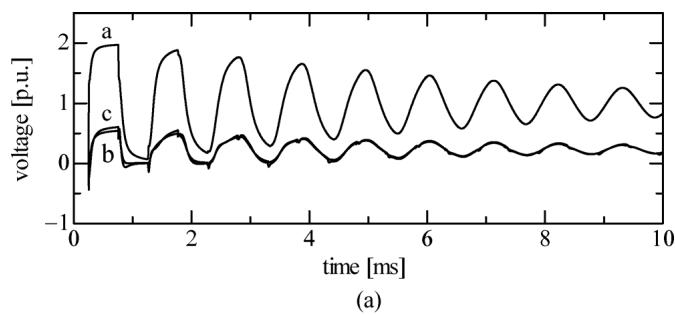

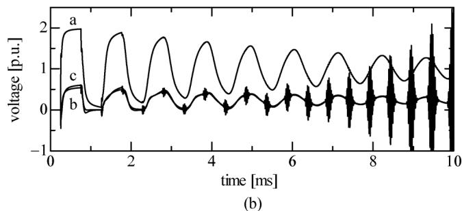  
Fig. 6. Results of EMT simulations with and without the proposed filtering. (a) shows the voltages of the first circuit at the remote end obtained with the proposed filtering and (b) shows those without the proposed filtering.

TABLE III EFFECTIVENESS OF THE SVD-BASED ALGORITHM   
Maximum deviations between the given and the fitted frequency responses of all entries of $H ( j \omega )$ when the QR algorithm is used for the residue matrix identification.   

<table><tr><td></td><td>1</td><td>2</td><td>3</td><td>4</td><td>5</td><td>6</td></tr><tr><td>1</td><td>0.15</td><td>0.23</td><td>0.05</td><td>0.04</td><td>0.03</td><td>0.03</td></tr><tr><td>2</td><td>0.28</td><td>0.36</td><td>0.06</td><td>0.02</td><td>0.04</td><td>0.13</td></tr><tr><td>3</td><td>0.04</td><td>0.04</td><td>0.10</td><td>0.02</td><td>0.01</td><td>0.03</td></tr><tr><td>4</td><td>0.04</td><td>0.03</td><td>0.03</td><td>0.15</td><td>0.05</td><td>0.23</td></tr><tr><td>5</td><td>0.02</td><td>0.03</td><td>0.01</td><td>0.04</td><td>0.10</td><td>0.04</td></tr><tr><td>6</td><td>0.02</td><td>0.13</td><td>0.04</td><td>0.28</td><td>0.06</td><td>0.36</td></tr><tr><td colspan="7">×10-2</td></tr></table>

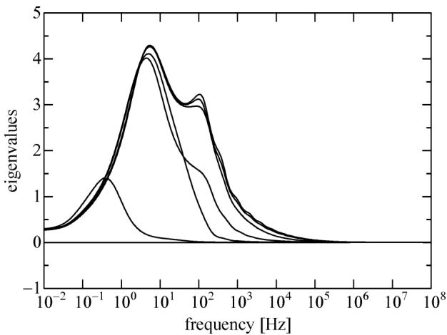  
Fig. 7. Frequency response of all eigenvalues of $\mathrm { R e } \{ Y _ { T L } \}$ . It has been confirmed that all eigenvalues are positive at all frequency points.

adjust $\varepsilon _ { C }$ . In Table IV, the result obtained by the VF-based approach with $\varepsilon _ { C } = 1 0 ^ { - 2 }$ is indicated by ${ } ^ { \mathfrak { s c } } \mathrm { V F } 1 { } ^ { \mathfrak { s } }$ , and that with

TABLE IVCOMPARISON OF THE TOTAL NUMBER OF POLES USED FOR BETWEENTHE FPF- AND THE VF-BASED APPROACH  

<table><tr><td rowspan="2">method</td><td rowspan="2">maximum deviation</td><td colspan="2">total number of poles</td></tr><tr><td>real</td><td>complex*</td></tr><tr><td>FpF</td><td>0.31 × 10-2</td><td>43</td><td>0</td></tr><tr><td>VF1</td><td>0.65 × 10-2</td><td>19</td><td>0</td></tr><tr><td>VF2</td><td>0.06 × 10-2</td><td>33</td><td>4</td></tr></table>

* number of complex-conjugate pole pairs.

$\varepsilon _ { C } = 1 0 ^ { - 3 } \mathrm { b y } ^ { \mathrm { } \mathrm { \hookrightarrow } } \mathrm { V F } 2 . ^ { \mathrm { \tiny , 3 } }$ Since the maximum deviation does not vary linearly with respect to $\varepsilon _ { C } .$ , these two results are shown. Note that one complex-conjugate pole pair requires more computations than two real poles. From the comparison, we may say that the FpF-based approach requires somewhat more poles for similar accuracy compared with the VF-based approach. In the FpF-based approach, however, the total number of poles can be reduced to 33, if the value of the fitting parameter $\varepsilon _ { h }$ is set to $1 0 ^ { - 2 }$ as shown in Appendix B. In this paper, the more conservative value $\varepsilon _ { h } = 1 0 ^ { - 3 }$ is used, since achieving good accuracy is considered more important. It should also be noted that the FpF-based approach simply gathers the poles from modes with almost the same traveling time and does not remove the redundant ones. Removing such redundant poles may be an important future work.

# E. EMT Simulation Result

Transient voltage waveforms of all phases at Point P are calculated by the line models obtained by the proposed FpF-based approach with a time step of 0.5 s. As a reference, the same simulation is carried out by the rigorous numerical Laplace transform method [18] that is able to take into account the frequency-dependent effects without approximations. In those simulations, the IG is represented by the equivalent circuit shown in Fig. 3, and the air gap in series with the capacitor is represented by an ideal switch. As shown in Fig. 8, the simulation result obtained by the proposed FpF-based approach agrees well with the result by the numerical Laplace transform method. In addition, the simulation result well reproduces the field-test result [19] shown in Fig. 9 in terms of microsecond to millisecond responses.

# V. CONCLUSION

This paper has shown that a previously proposed linear-system identification method, which is called the FpF method in this paper, can be successfully applied to the phase-domain frequency-dependent modeling of overhead transmission lines for EMT simulations. Numerical techniques to enhance the FpF method for this phase-domain line modeling application have also been presented. The proposed FpF-based approach was applied to the modeling of an existing 500-kV double-circuit transmission line, and the effectiveness of the numerical enhancements was demonstrated. Then, it has been verified that transient waveforms obtained by the proposed FpF-based approach agree well with those by the rigorous Laplace transform method and also with a field-test result.

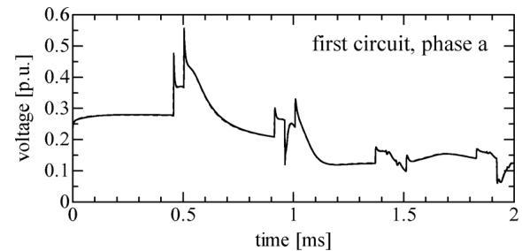

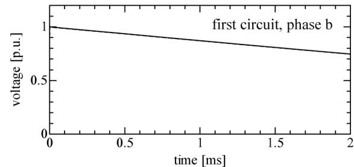

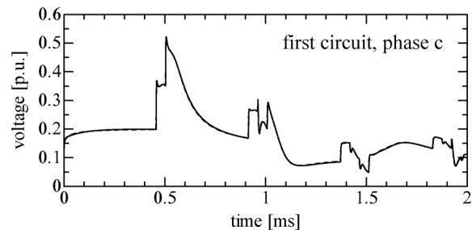

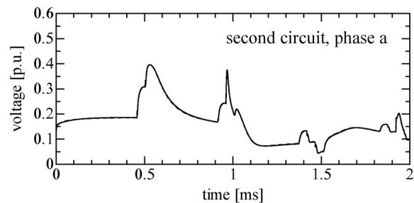

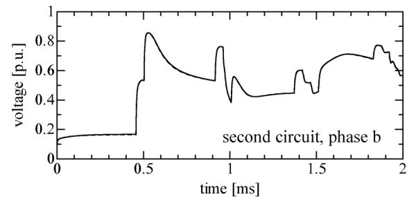

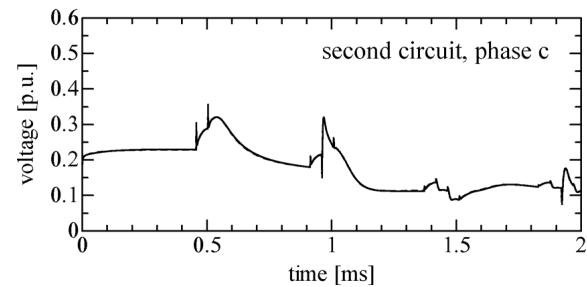  
Fig. 8. EMT simulation result of the 500-kV double-circuit transmission line (Kaga-Reinan Line) obtained by the proposed FpF-based approach. The result is shown using solid lines, where the result obtained by the numerical Laplace transform method is superimposed using dashed lines. Since both results agree quite well with each other, the dashed lines cannot be distinguished.

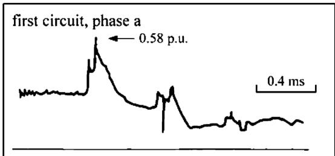

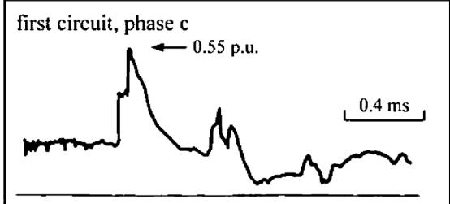

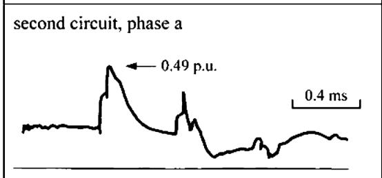

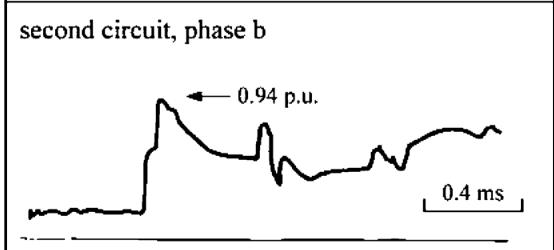

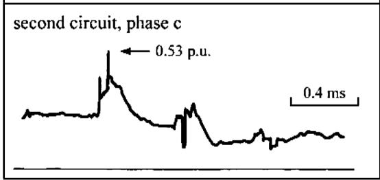  
Fig. 9. Field-test result of the 500-kV double-circuit transmission line (Kaga-Reinan line). The waveform of the first circuit's phase b is not available.

# APPENDIX A PARAMETER VALUES USED FOR THE FPF METHOD

In the numerical example shown in Section IV, the following parameter values are used in the FpF method [16], [17]. In the adaptive weighting process, the maximum number of iteration steps is set to 30. An optimal model order is searched for by increasing the order one by one from 2 to 8. If the standard deviation, in the relative-error sense, of the identified model becomes equal to or less than $1 0 ^ { - 3 }$ , that order is readily considered as the optimum order and the order search is terminated. If the standard deviation values for all orders from 2 to 8 are larger than $1 0 ^ { - 3 }$ , then the order that minimizes the standard deviation is considered as the optimum order. When residue matrices are identified

TABLE A1 EFFECTS OF $\varepsilon _ { m } , \varepsilon _ { h }$ , AND ON FITTING RESULTS   

<table><tr><td colspan="4">Effects of εm</td></tr><tr><td rowspan="2">εm</td><td rowspan="2">fitting error index</td><td colspan="2">total number of poles</td></tr><tr><td>real</td><td>complex</td></tr><tr><td>10-2</td><td>0.31 × 10-2</td><td>43</td><td>0</td></tr><tr><td>10-3</td><td>0.31 × 10-2</td><td>43</td><td>0</td></tr><tr><td>10-4</td><td>0.53 × 10-2</td><td>43</td><td>0</td></tr></table>

<table><tr><td colspan="4">Effects of εh</td></tr><tr><td rowspan="2">εh</td><td rowspan="2">fitting error index</td><td colspan="2">total number of poles</td></tr><tr><td>real</td><td>complex</td></tr><tr><td>10-2</td><td>0.34 × 10-2</td><td>33</td><td>0</td></tr><tr><td>10-3</td><td>0.31 × 10-2</td><td>43</td><td>0</td></tr><tr><td>10-4</td><td>0.25 × 10-2</td><td>46</td><td>0</td></tr></table>

<table><tr><td colspan="4">Effects of q</td></tr><tr><td rowspan="2">q</td><td rowspan="2">fitting error index</td><td colspan="2">total number of poles</td></tr><tr><td>real</td><td>complex</td></tr><tr><td>2</td><td>0.31 × 10-2</td><td>43</td><td>0</td></tr><tr><td>3</td><td>0.31 × 10-2</td><td>43</td><td>0</td></tr><tr><td>4</td><td>0.31 × 10-2</td><td>43</td><td>0</td></tr></table>

for $Y _ { 0 } ( j \omega )$ , its symmetry is taken into account to reduce computation.

# APPENDIX B EFFECTS OF $\varepsilon _ { m } , \varepsilon _ { h } ,$ , AND ON FITTING RESULTS

Using the Reinan-side line section of the transmission line shown in Figs. 2 and 3, the effects of the parameters $\varepsilon _ { m } , \varepsilon _ { h }$ , and on fitting results are examined. Maximum deviations between the given and the fitted frequency responses of the 36 entries of $H ( j \omega )$ are calculated, and the largest one of those 36 maximum deviations is considered as the fitting error index. The parameter values $\varepsilon _ { m } ~ = ~ 1 0 ^ { - 2 } , \varepsilon _ { h } = 1 0 ^ { - 3 }$ , and $q \ = \ 2$ used in Section IV are assumed to be the base values. The results obtained when each parameter is changed within a practical range are shown in Table A1. The total number of poles used is also shown in each case. Although it is difficult to draw recommended parameter values from this examination carried out using a single transmission-line example, the most important observation is that the fitting result is not sensitive to those parameters.

# APPENDIX CFITTING RESULT FOR A HIGH GROUND RESISTIVITY CASE

Higher ground resistivity gives larger variations in the frequency response of $H ( j \omega )$ due to larger differences of propagation velocities and attenuations between the ground mode and the remaining modes. To observe the fitting performance of the proposed FpF-based approach under such a condition, the ground resistivity of the Reinan-side line section of the transmission line shown in Figs. 2 and 3 is set to 1000 m, and its fitting is carried out. Fig. A1 shows the fitting result of the

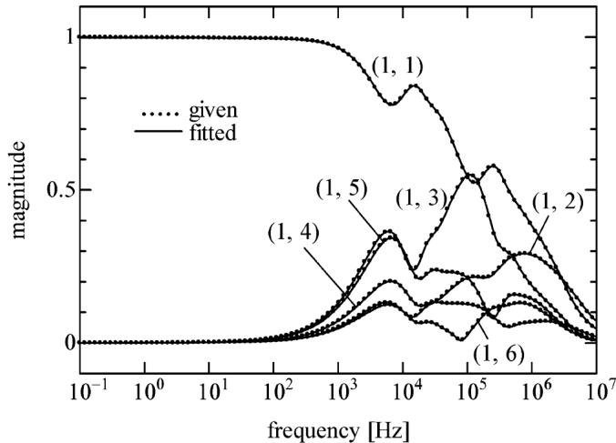

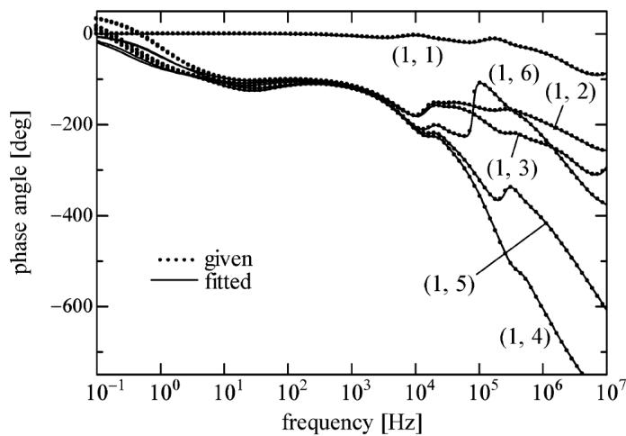  
(a)   
  
Fig. A1. Fitting result of the first-row entries of $H ( j \omega )$ when the ground resistivity is set to 1000 m. (a) shows the magnitudes and (b) shows the phase angles.

first-row entries (the remaining entries also show similar fitting accuracy). It is verified that the FpF-based approach shows good fitting performance also for this high-ground resistivity case.

# REFERENCES

[1] L. M. Wedepohl, “Application of matrix methods to the solution of travelling-wave phenomena in polyphase systems,” Proc. Inst. Elect. Eng. , vol. 110, no. 12, pp. 2200–2212, Dec. 1963.   
[2] L. M. Wedepohl and S. E. T. Mohamed, “Multiconductor transmission lines: Theory of natural modes and Fourier integral applied to transient analysis,” Proc. Inst. Elect. Eng., vol. 116, no. 9, pp. 1553–1563, Sep. 1969.   
[3] W. S. Meyer and H. W. Dommel, “Numerical modelling of frequency-dependent transmission-line parameters in an electromagnetic transient program,” IEEE Trans. Power App. Syst., vol. PAS-93, no. 5, pp. 1401–1409, Sep. 1974.   
[4] A. Semlyen and A. Dabuleau, “Fast and accurate switching transient calculations on transmission lines with ground return using recursive convolutions,” IEEE Trans. Power App. Syst., vol. PAS-94, no. 2, pp. 561–571, Mar./Apr. 1975.   
[5] A. Ametani, “A highly efficient method for calculating transmission line transients,” IEEE Trans. Power App. Syst., vol. PAS-95, no. 5, pp. 1545–1551, Sep./Oct. 1976.   
[6] J. F. Hauer, “State-space modeling of transmission line dynamics via nonlinear optimization,” IEEE Trans. Power App. Syst., vol. PAS-100, no. 12, pp. 4918–4925, Dec. 1981.

[7] J. R. Marti, “Accurate modelling of frequency-dependent transmission lines in electromagnetic transient simulations,” IEEE Trans. Power App. Syst., vol. PAS-101, no. 1, pp. 147–155, Jan. 1982.   
[8] B. Gustavsen, J. Sletbak, and T. Henriksen, “Calculation of electromagnetic transients in transmission cables and lines taking frequency dependent effects accurately into account,” IEEE Trans. Power Del., vol. 10, no. 2, pp. 1076–1084, Apr. 1995.   
[9] G. Angelidis and A. Semlyen, “Direct phase-domain calculation of transmission line transients using two-sided recursions,” IEEE Trans. Power Del., vol. 10, no. 2, pp. 941–949, Apr. 1995.   
[10] T. Noda, N. Nagaoka, and A. Ametani, “Phase domain modeling of frequency-dependent transmission lines by means of an ARMA model,” IEEE Trans. Power Del., vol. 11, no. 1, pp. 401–411, Jan. 1996.   
[11] T. Noda, N. Nagaoka, and A. Ametani, “Further improvements to a phase-domain ARMA line model in terms of convolution, steady-state initialization, and stability,” IEEE Trans. Power Del., vol. 12, no. 3, pp. 1327–1334, Jul. 1997.   
[12] H. V. Nguyen, H. W. Dommel, and J. R. Marti, “Direct phase-domain modelling of frequency-dependent overhead transmission lines,” IEEE Trans. Power Del., vol. 12, no. 3, pp. 1335–1342, Jul. 1997.   
[13] Power System Transients: Parameter Determination, J. A. Martinez-Velasco, Ed. Boca Raton, FL, Canada: CRC, 2010.   
[14] B. Gustavsen and A. Semlyen, “Rational approximation of frequency domain responses by vector fitting,” IEEE Trans. Power Del., vol. 14, no. 3, pp. 1052–1061, Jul. 1999.   
[15] A. Morched, B. Gustavsen, and M. Tartibi, “A universal model for accurate calculation of electromagnetic transients on overhead lines and underground cables,” IEEE Trans. Power Del., vol. 14, no. 3, pp. 1032–1038, Jul. 1999.   
[16] T. Noda, “Identification of a multiphase network equivalent for electromagnetic transient calculations using partitioned frequency response,” IEEE Trans. Power Del., vol. 20, no. 2, pt. 1, pp. 1134–1142, Apr. 2005.   
[17] T. Noda, “A binary frequency-region partitioning algorithm for the identification of a multiphase network equivalent for EMT studies,” IEEE Trans. Power Del., vol. 22, no. 2, pp. 1257–1258, Apr. 2007.   
[18] A. Ametani, “The application of the fast Fourier transform to electrical transients phenomena,” Int. J. Elect. Eng. Educ., vol. 10, no. 4, pp. 277–281, 1973.   
[19] T. Ono, “Study on switching overvoltages in power systems (in Japanese) Tokyo, Japan, CRIEPI rep. no. 121, Jan. 1985.   
[20] T. Noda, K. Takenaka, and T. Inoue, “Numerical integration by the 2-stage diagonally implicit Runge-Kutta method for electromagnetic transient simulations,” IEEE Trans. Power Del., vol. 24, no. 1, pp. 390–399, Jan. 2009.   
[21] B. Gustavsen and A. Semlyen, “Enforcing passivity for admittance matrices approximated by rational functions,” IEEE Trans. Power Syst., vol. 16, no. 1, pp. 97–104, Feb. 2001.   
[22] T. Noda, A. Semlyen, and R. Iravani, “Reduced-order realization of a nonlinear power network using companion-form state equations with periodic coefficients,” IEEE Trans. Power Del., vol. 18, no. 4, pp. 1478–1488, Oct. 2003.   
[23] T. Noda, “Numerical techniques for accurate evaluation of overhead line and underground cable constants,” Inst. Elect. Eng. Jpn. Trans. Elect. Electron. Eng., vol. 3, no. 5, pp. 549–559, 2008.

Taku Noda (M'97–SM'08) was born in Osaka, Japan, in 1969. He received the B.Eng., M.Eng., and Ph.D. degrees in engineering from Doshisha University, Kyoto, Japan, in 1992, 1994, and 1997, respectively.

In 1997, he joined Central Research Institute of Electric Power Industry (CRIEPI), Tokyo, Japan. Currently, he is Senior Research Scientist with Electric Power Engineering Research Laboratory of CRIEPI, Yokosuka, Japan, and Lecturer at Shibaura Institute of Technology, Tokyo. He also serves as

Editor of the IEEE TRANSACTIONS ON POWER DELIVERY and Treasurer of the IEEE Power and Energy Society Japan Chapter. He was Visiting Scientist at the University of Toronto, Toronto, ON, Canada, from 2001 to 2002 and was Adjunct Professor at Doshisha University from 2005 to 2008. His research interests include electromagnetic transient analysis of power systems and the development of smart energy systems.

Authorized licensed use limited to: Tsinghua University. Downloaded on April 09,2026 at 12:58:02 UTC from IEEE Xplore. Restrictions apply.