# 分布式光伏电源分散式自适应主动频率支撑控制

杨鹏程 1,2，冯启帆 2，韦巍 2，蔡宏达 1，夏杨红 2，唐雅洁 3

（1．浙大城市学院，浙江省 杭州市 310015；2．浙江大学电气工程学院，浙江省 杭州市 310027；

3．国网浙江省电力有限公司电力科学研究院，浙江省 杭州市 310014）

Decentralized Adaptive Frequency Support Control of Distributed PV Sources

YANG Pengcheng1,2, FENG Qifan2, WEI Wei2, CAI Hongda1, XIA Yanghong2, TANG Yajie3

(1. Hangzhou City University, Hangzhou 310015, Zhejiang Province, China;

2. College of Electrical Engineering, Zhejiang University, Hangzhou 310027, Zhejiang Province, China;

3. State Grid Zhejiang Electric Power Co., Ltd. Research Institute, Hangzhou 310014, Zhejiang Province, China)

ABSTRACT: With the explosive growth of distributed photovoltaic (PV) penetration, the traditional passive access method mainly based on maximum power point tracking (MPPT) increasingly threatens the frequency security and stability of the system. The demand for active support for system frequency by distributed PV sources becomes increasingly urgent. The existing active support strategies require online estimation of their maximum available power, which is a large computation burden and makes it difficult to adapt to rapid changes in environmental conditions. Because of this, a quantitative characterization parameter is proposed, which represents the real-time output power of the PV system as a ratio to the current maximum available power, thus avoiding the online estimation of the maximum available power. Based on this PV power characterization parameter, a decentralized adaptive active frequency support control strategy is designed, which allows the parallel distributed PV sources to adjust their power characterization parameters according to frequency changes adaptively and, thus, proportionally regulate their reserve power to respond to system disturbances actively, suppress frequency fluctuations, while improving the system efficiency, ensuring fair power generation, and reducing unreasonable waste of solar resources. Simulation results show that the proposed method can improve the system's transient frequency response characteristics.

KEY WORDS: distributed PV; frequency support; decentralized control

摘要：随着分布式光伏发电渗透率的爆发式增长，传统以最大功率跟踪为主的被动接入方式日益威胁系统的频率安全与稳定，使用分布式光伏发电主动支撑电网频率的需求愈发

迫切。现有主动支撑策需要对其最大可用功率进行在线估计，算法复杂，难以适应环境条件快速变化的场景。鉴于此，首先提出了光伏实时出力占当前最大可用功率比例的量化表征参量，从而避免了对最大可用功率的在线估计。接着，基于此功率表征参量设计了分散式自适应主动频率支撑控制策略，使并联运行的分布式光伏电源可根据频率变化自适应调整其功率表征参量，进而等比例调控其储备功率以主动响应系统频率变化，抑制频率波动，同时尽可能提升系统运行效率，保证发电公平，减少光照资源的不合理弃置。仿真结果表明，所提方法可以有效提升系统的频率响应特性。

关键词：分布式光伏；频率支撑；分散式控制

DOI：10.13335/j.1000-3673.pst.2024.0948

# 0 引言

随着光伏发电技术的日趋成熟，成本进一步下探，光伏发电，尤其是分布式光伏的渗透率不断攀升，使得新型电力系统的双高特性日益凸显[1-2]。分布式光伏局部高比例接入后，系统惯量降低、调频能力受限，受到功率扰动后的系统频率波动增大，极易触发低频减载等事件，尤其是调频能力不足的孤岛电网，这严重威胁着电力系统的安稳运行[3-5]。为维持低惯量电力系统的频率稳定，新的电网标准已经要求通过逆变器并网的新能源机组具有一定的频率支撑能力[6]，对光伏并网系统的本地控制策略提出更高要求。

传统同步发电机组中频率的升高或降低会伴随转子动能的吸收或释放，从而抑制频率的波动，实现对系统频率的主动支撑[7]。然而变流器不具备此类物理转动惯量和天然的负反馈作用机制，要实现对频率的主动支撑只能设计控制策略模拟传统同步发电机组的转动惯量以及一次调频动态过程[8-9]。常见的频率支撑控制有虚拟同步机控制、下垂控制等，主要应用于储能、燃料电池等恒压直流

电源[10-11]。然而分布式光伏系统出力随机、波动性强，可调节能力差，常见的频率支撑策略无法直接应用。

解决上述问题的方案之一是为分布式光伏捆绑一定比例的储能构成光储联合系统，作为一个整体提升功率可调节性[12-14]。然而，相比于光伏面板，储能系统建设、运维成本高，充电次数、使用寿命却相对较短。因此，希望分布式光伏系统能够具备无储能直接主动支撑电网频率的能力。

光伏直接参与系统频率支撑一般需要预先储备部分可用功率，使其运行点低于最大可用功率点(maximum available power point，MAPP)以获得一定的功率调节裕量[15-17]。当前，光伏功率储备控制的核心关键是其实时 MAPP 的获取，需要据此设定光伏功率指令并给出相应的光伏端电压参考，下发光伏变流器执行[18]。然而，光伏出力受环境影响实时变化，光伏运行曲线非线性特征强，目前，获取MAPP 的方法主要分为以下 2类：

# 1）直接测量法。

文献[19]针对同类型的分布式光伏电源，令一部分光伏工作于最大功率点，相邻的光伏通过通信获取其 MAPP 信息；文献[20]采用查表法，根据光照与温度的测量结果直接查表得到 MAPP，因此需要额外安装光照与温度传感器；文献[21]使光伏从功 率储 备模式 定 期 切换 至最 大 功 率点跟 踪(maximum power point tracking，MPPT)模式以获取片段式 MAPP，该方法实现复杂且需要频繁切换控制策略。

# 2）曲线拟合法。

文献[22]使用二次曲线，3 个采样点进行光伏功率-电压曲线的拟合，误差较大，算法鲁棒性不足；文献[23]采用纹波控制提供测量样本，通过最小二乘拟合得到光伏曲线，进而估计 MAPP，然而该方法需要提前获取光伏性能参数，且迭代计算过程繁琐；文献[24]通过采样估计最大功率点的输出电流，并利用 Lambert-W 函数直接求取最大功率点的电压[25]，但同样依赖于光伏性能参数的获取，且在MAPP 附近误差较大；文献[26-27]则采用经验模型，对光伏电源部分参数的关系进行线性化，利用回归分析近似求取 MAPP，但是该方法对环境和参数变化敏感。

由上可见，直接测量法一般需要额外增加通信或量测设备；曲线拟合法则对算力要求较高，难以适应环境条件快速变化的场景，同时光伏组件的老化不可避免地将引入误差。以上 2类获取 MAPP 的

方法常用于集中式光伏电站。对于算力小、量测有限、通信匮乏的分布式光伏，MAPP 的获取将变得更加困难。

此外，分布式光伏点多面广，往往分属不同的利益主体，进行储备功率时会限制其出力，造成光伏业主利益损失。这使得光伏参与频率主动支撑时，其功率储备的均匀分担显得尤为关键，公平性将显得尤为关键。

针对以上难题，本文提出了一种分散式自适应主动频率支撑控制方法。首先提出了一种新的光伏功率特征参量 $X = ( U _ { \mathrm { p v } } \ : / \ : I _ { \mathrm { p v } } ) ( \mathrm { d } I _ { \mathrm { p v } } \ : / \ : \mathrm { d } U _ { \mathrm { p v } } )$ ，可量化表征光伏实时出力占当前最大可用功率的比例，从而无需获取 MAPP 即可实现对光伏功率储备(出力)的灵活调节。然后，基于特征参量 X 设计了 X-f下垂频率支撑控制策略，使并联运行的分布式光伏电源可根据母线频率变化自适应调整其特征参量X，无需互相通信即可公平地储备功率(即分散式控制)，主动响应系统频率变化，抑制母线频率波动。最后在 Matlab/Simulink 平台对所提出的策略进行了仿真分析，验证了策略的有效性。

# 基于特征参量的光伏功率储备控制

# 1.1 光伏功率特征参量

本文采用单二极管模型来表示单个光伏电池模块的电压-电流特性，作为使用最为广泛的光伏电池模块的等效模型，其具有足够的精度与相对简单的表达式[28]，等效电路如图 1所示。

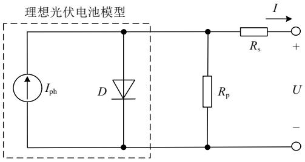  
图1 光伏电池单二极管等效电路  
Fig. 1 Single-diode electrical equivalent circuit of PV

单个光伏电池模块的电压-电流(U-I)外特性可由经典的光伏五参数 $( I _ { \mathrm { p h } } , I _ { 0 } , a , R _ { \mathrm { p } } , R _ { \mathrm { s } } )$ 公式[28]表示：

$$
I = I _ {\mathrm {p h}} - I _ {0} \left[ \exp \left(\frac {U + R _ {\mathrm {s}} I}{a U _ {\mathrm {T}} N}\right) - 1 \right] - \frac {U + R _ {\mathrm {s}} I}{R _ {\mathrm {p}}} \tag {1}
$$

式中：a 为二极管的理想常数； $U _ { \mathrm { T } }$ 为光伏单元的热电压，为温度 T 与一常数的乘积；N 为一个模块内的光伏电池数； $I _ { \mathrm { p h } }$ 表示光电流，由于并联电阻 $R _ { \mathfrak { p } }$ 较大而串联电阻 $R _ { \mathrm { s } }$ 较小， $I _ { \mathrm { p h } }$ 通常与厂家提供的短路电流 $I _ { \mathrm { s c } }$ 几乎相等， $I _ { 0 }$ 表示二极管的反向饱和电流，

$I _ { \mathrm { p h } }$ 和 $I _ { 0 }$ 与辐照度和温度相关[29]，表达式分别为

$$
\left\{ \begin{array}{l} I _ {\mathrm {p h}} = \left(I _ {\mathrm {p h n}} + K _ {\mathrm {I}} \Delta T\right) G / G _ {\mathrm {n}} \\ I _ {0} = \frac {I _ {\mathrm {s c n}} + K _ {\mathrm {I}} \Delta T}{\exp \left(U _ {\mathrm {o c n}} + K _ {\mathrm {V}} \Delta T / a U _ {\mathrm {T}} N\right) - 1} \end{array} \right. \tag {2}
$$

式中： $I _ { \mathrm { p h n } }$ 、 $I _ { \mathrm { s c n } }$ 、 $U _ { \mathrm { o c n } }$ 分别表示标准测量环境(25℃，AM 1.5，1000W/m2，下标 n 代表标准测量环境)的光电流、短路电流、开路电压； $K _ { \mathrm { I } }$ 和 $K _ { \mathrm { v } }$ 分别表示短路电流和开路电压受温度影响的系数；G和 $G _ { \mathfrak { n } }$ 分别表示辐照度和标准辐照度 1000W/m2；T 为实际温度与 25℃的差值。

以 KC200GT 型[29]光伏模块为例，其功率-电压(P-U)曲线如图 2 所示。定义光伏出力比：

$$
R _ {\mathrm {P V}} = P / P _ {\mathrm {M A P P}} \tag {3}
$$

式中：P 为光伏实时出力； $P _ { \mathrm { M A P P } }$ 为光伏当前最大可用功率。由图2可知，除最大可用功率点MAPP外，在P-U曲线上每个固定功率点有2个端电压与之相对应，分布于最大功率点电压 $U _ { \mathrm { M P P } }$ 的左右两侧，通常，称 MAPP 左侧为“上山区”，其右侧位于“下山区”，“上山区”、“下山区”以及 MAPP附近呈现截然不同的输出特性，给通过光伏运行点求取 $P _ { \mathrm { M A P P } }$ 带来一定的困难，因此传统方法中若选择的运行点不恰当则容易导致错误的拟合结果。其中“上山区”相较“下山区”具有较小的电流波动，不容易落入开路电压附近的区域，线性化程度更高有利于估计 $P _ { \mathrm { M A P P } }$ ，为文献[24-27]所采用；但是“上山区”内响应速度较慢、变流器效率较低，而且由于 PV 的电容器电压下降会导致 PV 发电量减少，从而形成局部的正反馈，容易引发功率的低频振荡和单极式光伏中的 PWM 过调制问题[30]，“下山区”为文献[16,22-23]所采用。

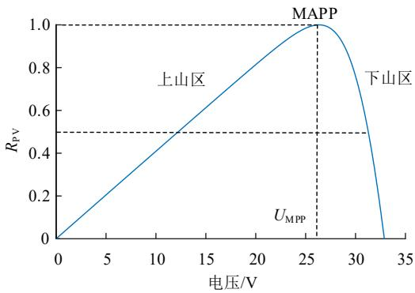  
图2 光伏发电系统输出功率特性  
Fig. 2 Output power characteristic of PV system

本文使用的光伏为 KC200GT、ISTH-215P 和CS6P-230P，详细参数见附录 A 中表 A1、A2、A3。光伏在最大功率点的电压 $U _ { \mathrm { M P P } }$ 以及电流 $I _ { \mathrm { M P P } }$ 可以由光伏五参数 $( I _ { \mathrm { p h } } , I _ { 0 } , a , R _ { \mathrm { p } } , R _ { \mathrm { S } } )$ 直接求得，如式(3)所

示 ， 为 书 写 方 便 ， 令 $w { = } W ( I _ { \mathrm { p h } } e / I _ { 0 } )$ ， W 代 表Lambert-W 函数，e 代表自然常数， $A = a U _ { \mathrm { T } } N$ 。

$$
\left\{ \begin{array}{l} U _ {\mathrm {M P P}} = \left(1 + \frac {R _ {\mathrm {s}}}{R _ {\mathrm {p}}}\right) A (w - 1) - R _ {\mathrm {s}} I _ {\mathrm {p h}} \left(1 - \frac {1}{w}\right) \\ I _ {\mathrm {M P P}} = I _ {\mathrm {p h}} \left(1 - \frac {1}{w}\right) - A \frac {w - 1}{R _ {\mathrm {p}}} \end{array} \right. \tag {4}
$$

生产厂家通常只提供表 1 中的参数，而光伏建模所需的五参数并未给出，其中决定 $I _ { \mathrm { p h } } ,$ I0大小的辐照度 G与温度 T必须实时获取，这需要通过拟合或者安装传感器的方法获得。然而拟合获得光照与温度的算法涉及到大量 Lambert-W 函数、最小二乘法、指数与对数函数的运算[24]，需要采样多个不同的运行点进行计算，并且在外界环境发生变化后需重新进行拟合；此外，随着光伏设备的老化(MAPP通常以每年 0.5%的速度减少[20])，在标准测量环境下提取的光伏五参数将对求取 $P _ { \mathrm { M A P P } }$ 引入误差。

表 1 KC200GT 在标准测量环境(25℃,1000W/m2)下的参数  
Table 1 Parameters of KC200GT under standard test condition(25℃, 1000 W/m2)   

<table><tr><td>参数</td><td>数值</td><td>单位</td><td>参数</td><td>数值</td><td>单位</td></tr><tr><td>IMPPn</td><td>7.61</td><td>A</td><td>Uocn</td><td>32.9</td><td>V</td></tr><tr><td>UMPPn</td><td>26.3</td><td>V</td><td>KV</td><td>-0.1230</td><td>V/K</td></tr><tr><td>PMAPP</td><td>200</td><td>W</td><td>KI</td><td>0.0032</td><td>A/K</td></tr><tr><td>Iocn</td><td>8.21</td><td>A</td><td>N</td><td>54</td><td></td></tr></table>

注：下标 n 代表标准测量环境。

由以上分析可知，传统的功率储备控制具有$P _ { \mathrm { M A P P } }$ 难以估计，拟合算法无法根据环境条件灵活变化的缺点。为克服这些缺陷，如何仅根据本地的电压电流采样，寻找可以有效表征光伏当前出力状态的特征参量，是实现光伏进行功率储备的关键。

光伏有功出力对电压的导数常用来辅助对光伏运行点进行定位[31-32]，如图 3 所示，当 dP/dU 的值为 0 时，表示光伏运行于 MAPP 点。虽然同一个固定功率点仍然有2个不同的dP/dU值与之相对应，但它们的符号不同：在“上山区”，光伏出力随电压增大而增大，dP/dU始终大于 0；在“下山区”，光伏出力随电压增大而减小，dP/dU 始终小于 0。可见，根据 dP/dU的正负性可判断光伏阵列当前所处的运行区间。

分布式光伏阵列由光伏模块串并联组成，进一步分析 dP/dU 值与光伏出力之间的量化关系， $R _ { \mathrm { P V } }$ 随 dP/dU 的变化情况如图 3 所示。从图中可以观察得出以下结论：

在相同的辐照度下：1）当不同光伏阵列的组成模块并联数相同而串联数不同时 $R _ { \mathrm { p v } } { \ - } \mathbf { d } P / \mathbf { d } U$ 曲线重合，即光伏串联数对 dP/dU 值无影响；2）当

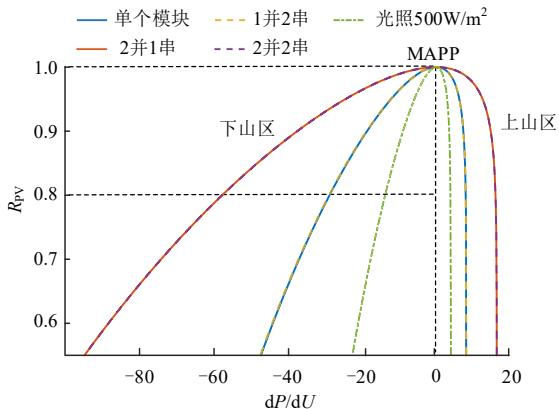  
图 3 光伏电源 $R _ { \mathrm { P V } } { \bf - d } P / \mathrm { d } U$ 曲线  
Fig. 3 $R _ { \mathrm { P V } } { \bf - d } P / \mathrm { ~ d } U$ curve of PV sources

并联数不同时，相同 $R _ { \mathrm { P V } }$ 所对应的 dP/dU 值与各自并联数成比例；3）辐照度不同而相同 $R _ { \mathrm { { p v } } }$ 下，dP/dU值与其对应的辐照度近似成正比。

进一步地，光伏阵列的输出电流在一定程度上可以反映其并联模块数量和辐照度，因此为了消除并联模块数和光照对 dP/dU 值的影响，令其除以光伏的输出电流 I：

$$
\mathrm {d} P / I = 1 + \frac {U \mathrm {d} I}{I \mathrm {d} U} \tag {5}
$$

式中：dI 表示光伏输出电流的变化率；dU 表示光伏端口电压的变化率，在本文中将 ( d ) / ( d ) U I I U 用参量 X 表示，并定义为光伏功率特征参量：

$$
X = \frac {U}{I} \frac {\mathrm {d} I}{\mathrm {d} U} = \frac {\mathrm {d} P}{\mathrm {d} U I} - 1 \tag {6}
$$

当 X  1时，表示光伏运行于 MAPP。在 MAPP右侧的运行点，随着光伏电压的增加 X 单调递减，具有以下特征：

$$
X = \frac {U}{I} \frac {\mathrm {d} I}{\mathrm {d} U} = - n, n \in (- 1, - \infty) \tag {7}
$$

# 1.2 基于特征参量的自适应功率储备

本小节对 $R _ { \mathrm { P V } }$ 与X的关系进行数理推导与分析，从而给出通过 X 来近似光伏出力比的理论基础。

对于图 1所示的非理想光伏电池模块，由于光伏工作于 MAPP 右侧时式(1)中 $\exp [ ( U + R _ { \mathrm { s } } I ) / \ A ]$ 一项超过 $1 0 ^ { 7 }$ 数量级，利用 Lambert-W 函数可以得到用 U 表示 I 的显式表达式以及 I 对 U 的导数，即式(8)(9)。

得到电压和电流后可求得对应的功率 P=UI。当 X=1 时光伏运行于最大功率点，对应的电压电流分别为 $U _ { \mathrm { M P P } }$ 、 $I _ { \mathrm { M P P } }$ 。因此当 X=n 时光伏出力比表示为式(10)。

$$
I = \frac {\left(I _ {\mathrm {p h}} + I _ {0}\right) R _ {\mathrm {p}} - U}{R _ {\mathrm {p}} + R _ {\mathrm {s}}} - \frac {A}{R _ {\mathrm {s}}} W \left\{\frac {\exp \left[ \frac {\left(I _ {\mathrm {p h}} + I _ {0}\right) R _ {\mathrm {p}} R _ {\mathrm {s}} + R _ {\mathrm {p}} U}{A \left(R _ {\mathrm {p}} + R _ {\mathrm {s}}\right)} \right]}{A \left(R _ {\mathrm {p}} + R _ {\mathrm {s}}\right) / R _ {\mathrm {p}} R _ {\mathrm {s}} I _ {0}} \right\} \tag {8}
$$

$$
\frac {\mathrm {d} I}{\mathrm {d} U} = - \frac {1}{R _ {\mathrm {s}}} + \frac {R _ {\mathrm {p}} / \left[ R _ {\mathrm {s}} \left(R _ {\mathrm {p}} + R _ {\mathrm {s}}\right) \right]}{\exp \left[ \frac {\left(I _ {\mathrm {p h}} + I _ {0}\right) R _ {\mathrm {p}} R _ {\mathrm {s}} + R _ {\mathrm {p}} U}{A \left(R _ {\mathrm {p}} + R _ {\mathrm {s}}\right)} \right]} (9)
$$

$$
R _ {\mathrm {P V}} = \frac {U I}{U _ {\mathrm {M P P}} I _ {\mathrm {M P P}}} \tag {10}
$$

结合式(1)(8)—(10)，代入光伏参数即可在Matlab 中求得数值解，做出光伏系统的 $R _ { \mathrm { P V } } - X$ 特性曲线，如图 4 所示， $R _ { \mathrm { P V } }$ 与X 的映射关系不受光伏阵列的串并联模块数量影响，适用于所有由同一型号光伏模块组成的阵列。

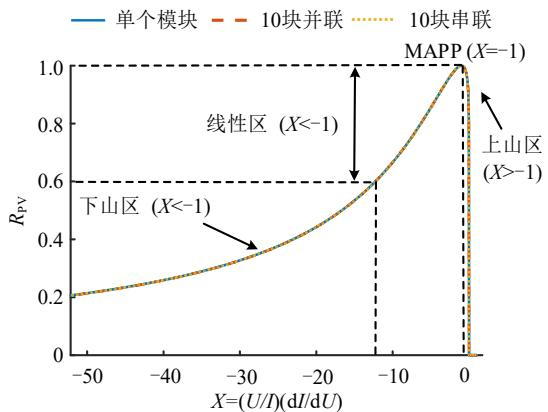  
图 4 $R _ { \mathrm { P V } } { - } X$ 曲线  
Fig. 4 - R X PV curve

在光伏PU- 曲线对应的“上山区”， $X \approx 0$ ，当X=1时，光伏运行于MAPP；在“下山区”， $R _ { \mathrm { p v } }$ 与特征参量 X 一一对应，随着光伏电压的增加X 单调递减。注意到当 $R _ { \mathrm { P V } } \in [ 0 . 6 , 1 ]$ 时， $R _ { \mathrm { P V } }$ 与 X近似呈线性关系，称这段区域为“线性区”，该区域覆盖了利用光伏进行功率储备的区间(通常降功率运行应保持在额定功率 60%以上，避免过度弃光)。

因此 X 作为决定光伏电源运行点的特征参量，其在 MAPP 点恒定不变，具有与 $R _ { \mathrm { P V } }$ 变化趋势相近的区间，这些特征构成了通过 X 来近似光伏出力比例的基础，将特征参量 X 命名为功率储备系数。

# 1.3 光伏模块参数对 $R _ { \mathrm { P V } }  – X$ 特性的影响

为进一步验证参数X是否可作为光伏实现功率储备的标准，须验证非理想光伏模型中光照与温度、串并联电阻和不同品牌型号对 $R _ { \mathrm { P V } } - X$ 曲线的影响。

图 5(a)及图 5(b)给出了不同光照和温度条件下的 $R _ { \mathrm { P V } } - X$ 曲线。由图可知，虽然随着辐照度和温度的升高， $R _ { \mathrm { P V } } - X$ 曲线下移，但其变化较小，且随着X 的不断增大，不同条件下各条曲线之间的差距$( R _ { \mathrm { P V } }$ 误差)也在逐渐缩小，进入“线性区”后，这种差距已不再明显，至 MAPP 后完全重合， $R _ { \mathrm { P V } } - X$ 曲线上的线性区为此提供了足够的灵活调控空间。

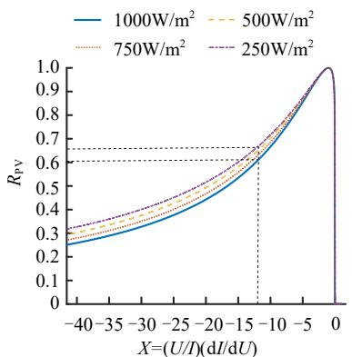  
(a) 不同光照条件下RPV-X曲线

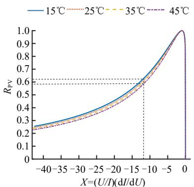  
(b) 不同温度条件下RPV-X曲线

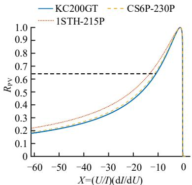  
(c) 不同品牌型号光伏面板的 $R _ { \mathrm { P V } } .$ -X曲线

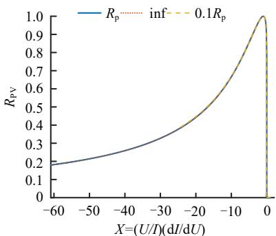

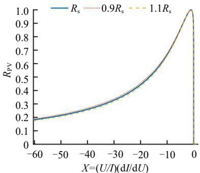  
(d) $R _ { \mathrm { P V } } - X$ 曲线随并联、串联电阻的变换   
图5 不同条件下的 $R _ { \mathrm { P V } } { - } X$ 曲线  
Fig. 5 $R _ { \mathrm { P V } } { - } X$ curves under different conditions

图 5(c)给出了市场上几种不同型号光伏面板的$R _ { \mathrm { P V } } - X$ 曲线，表明不同型号的光伏面板的 $R _ { \mathrm { { p v } } }$ X- 曲线呈现出近似一致的变化趋势，在“线性区”重合误差很小。图 5(d)表明串并联电阻的数值变化时$R _ { \mathrm { P V } } - X$ 曲线几乎保持不变，因此光伏阵列老化产生的参数微小变动对曲线几乎无影响。综上，各种参量变化时，利用光伏进行功率储备的区间内 $R _ { \mathrm { { P V } } }$ 与X 的线性映射关系保持高度的相似性， $R _ { \mathrm { P V } } - X$ 曲线具有很强的通用性，X 是进行分布式光伏等比例功率储备控制的理想参量。

# 2 分散式自适应主动频率支撑控制

据图4和图5建立的功率储备系数 $X$ 与 $R _ { \mathrm { p v } }$ 的线性关系，设计了典型两级式分布式光伏并网发电系统的分散自适应主动频率支撑控制策略，如图 6所示，该系统由 PV 侧的 DC-DC变流器和电网侧的DC-AC 逆变器组成，DC-DC 变流器用于调节光伏阵列的出力，DC-AC 逆变器用于向电网输送功率。图中：和 f 分别为测量的并网点(PCC)电压的相位和频率； $i _ { \mathrm { L 2 } }$ 和 $i _ { C }$ 分别为流经滤波电感 $L _ { 2 }$ 和滤波电容C的电流； $U _ { \mathrm { d c r e f } }$ 和 $U _ { \mathrm { d c } }$ 分别为直流链路电容 $C _ { \mathrm { d c } }$ 的电压参考值和电压测量值； $C _ { \mathrm { { P V } } }$ 为光伏侧电容；$U _ { \mathrm { { p v } r e f } }$ 为 DC/DC 变流器的光伏电压控制指令；光伏阵列的输出电压和电流用 $U _ { \mathrm { P V } }$ 和 $I _ { \mathrm { P V } }$ 表示；1d 、 $d _ { 2 }$ 分

别为 DC-DC 和 DC-AC 的占空比信号；Flag 为外部给定的控制模式选择信号。

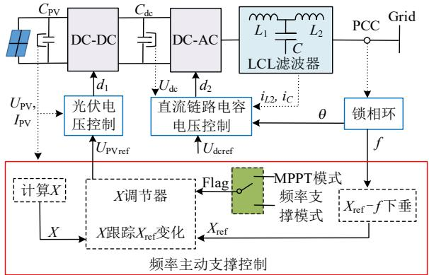  
图6 两级式光伏的拓扑和控制策略  
Fig. 6 Topology and control structure of typical two-stage PV system

除传统控制策略含有的锁相、光伏电压控制、直流链路电容电压控制以外，所提出的控制策略增加了频率主动支撑控制模块。该模块根据测量的频率 f 调节光伏的出力比，即采用 X-f 下垂控制产生 X的参考值 $X _ { \mathrm { r e f } }$ ，与光伏实际测得的 X 进行比较并令X 跟踪 $X _ { \mathrm { r e f } }$ ，产生光伏阵列端电压的参考值 $U _ { \mathrm { p v r e f } }$ ，作为 DC/DC 变流器的控制指令，进而调整光伏输出功率，实现了光伏根据并网点频率自适应调节其有功出力进行频率支撑的功能。从而无需通过安装额外的设备或复杂的拟合计算得到光伏五参数进而获取 $P _ { \mathrm { M A P P } }$ ，大幅减少了控制器的计算负担和投

资成本。

# 2.1 X-f 下垂控制器设计

由前一节可知，在光伏 $R _ { \mathrm { P V } } - X$ 曲线的“线性区”光伏出力比 $R _ { \mathrm { P V } }$ 随 X 减小而降低，且该特性曲线几乎不受光照、温度、电源容量以及不同光伏品牌型号的影响。当各光伏阵列的有功出力比与频率变化成比例时，即可实现频率支撑以及不同光伏公平地进行降功率运行。为了实现该控制目标，根据图 5 中光伏的 $R _ { \mathrm { P V } } - X$ 曲线，分布式光伏可以通过调整功率储备系数 X 的方式改变光伏出力比 $R _ { \mathrm { { p v } } }$ ，进而控制光伏输出功率。为此，结合下垂控制的分散式特性，引入功率储备系数的参考值 $X _ { \mathrm { r e f } }$ ，设计了光伏电源根据并网点频率自适应调节其功率储备系数的下垂控制(X-f下垂控制)，如图 7(a)所示：

$$
X _ {\text {r e f}} = - 1 + m \left(f _ {\min } - f\right) \tag {11}
$$

式中： $X _ { \mathrm { r e f } }$ 表示下垂控制器给出的 X 参考指令；$f _ { \mathrm { m i n } }$ 表示电网正常运行时频率的下限；f 代表当前测量的频率；m 代表下垂系数：

$$
m = \frac {- X _ {\mathrm {e}} - 1}{f _ {\mathrm {e}} - f _ {\min }} \tag {12}
$$

式中：当频率等于额定频率 $f _ { \mathrm { e } }$ 时， $X _ { \mathrm { r e f } }$ 的取值为 $X _ { \mathrm { { e } } }$ ，光伏留有一定百分比的功率储备，其中 $X _ { \mathrm { { e } } }$ 的数值可由单个光伏模块通过实验的方法测得，该参数可用于所有同型号的光伏阵列。

结合图 5中光伏的 $R _ { \mathrm { P V } } - X$ 曲线，最终得到的 X-f下垂控制器的调节特性 $( R _ { \mathrm { p v } } { - } X$ 曲线)，如图 7(b)所示，光伏电源形成了有功出力比-频率的下垂特性，能够根据频率扰动方向提供相应的功率输出响应。当系统频率降低时， $X _ { \mathrm { r e f } }$ 增加，光伏采用较小的功率储备，其有功出力随之增加，反之亦然，当频率等于或低于 $f _ { \mathrm { m i n } }$ 时，光伏发出最大可用功率，即使温度和光照大幅降低时光伏电源仍然具有良好的频率支撑特性。此外，由于各光伏的 $R _ { \mathrm { P V } } - X$ 曲线相似，采用相近的下垂系数 m，从而无需互相通信即可实现不同光伏根据各自的 X-f 下垂曲线等比例降功率运行。

# 2.2 X 调节器设计

根据式(11)X-f 下垂控制生成的 $X _ { \mathrm { r e f } }$ 与光伏实际测得的 X，设计了 X 调节器，该调节器通过控制 $U _ { \mathrm { P V } }$ 实现X跟踪 $X _ { \mathrm { r e f } }$ 的功能。图8展示了所提光伏 X 调节器的细节实现，其中下标 n 代表本次控制周期中的变量，下标 n1 代表上一个控制周期中的变量，$\mathrm { d } U _ { \mathrm { P V } }$ 和 $\mathrm { d } I _ { \mathrm { P V } }$ 分别为光伏阵列电压和电流的变化率，$D _ { \mathrm { m i n } }$ 和 $D _ { \mathrm { m a x } }$ 分别为光伏电压参考值变化的步长。该控制方案包含 2 种运行模式，由 Flag 信号决定，2

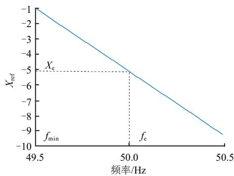  
(a) X-f 曲线

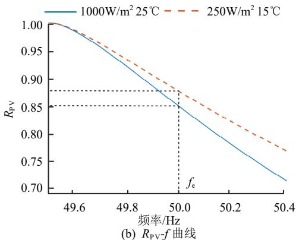  
图 7 $X { - } f$ 下垂控制下的 $R _ { \mathrm { P V } } f$ 调节曲线  
Fig. 7 $R _ { \mathrm { P V } } f$ regulation characteristics under X-f droop control

种模式使用相同光伏 X 调节算法及底层电压控制环路，因此可实现运行模式的平滑切换，其中$X _ { \mathrm { r e f } } = - 1$ 时运行于最大功率跟踪模式；反之光伏运行于频率支撑模式，追踪式(11)产生 $X _ { \mathrm { r e f } }$ 。

如图 8 所示，当 $U _ { \mathrm { P V } }$ 成功跟踪上一控制周期光伏的电压参考值 $\left( U _ { \mathrm { p v r e f } , n - 1 } \right)$ 后，控制器多次采样光伏阵列的电压电流，求平均值得 $I _ { \mathrm { P V } }$ 、 $U _ { \mathrm { P V } }$ ，并且与上一控制周期中得到的电压平均值 $\left( U _ { \mathrm { P V } , n - 1 } \right)$ 、电流平均值 $\left( I _ { \mathrm { P V } , n - 1 } \right)$ 相减求得 dI 和 dU，并计算当前运行状态对应的特征参量 X 。

接下来根据 X 与 $X _ { \mathrm { r e f } }$ 的关系计算产生 $U _ { \mathrm { { P V r e f } } }$ ，如果当前的运行点相对 $X _ { \mathrm { r e f } }$ 较远，则采用较大的追踪步长 $( D _ { \mathrm { m a x } } )$ 以提升收敛速度，但是为了保证足够的精度，步长也不宜取太大；反之则选取较小的追踪步长 $( D _ { \mathrm { m i n } } )$ 以获取更高的控制精度。具体地，当$X < X _ { \mathrm { r e f } }$ 时 ， $U _ { \mathrm { P V r e f } , n }$ 相 较 于 $U _ { \mathrm { p v e f } , n - 1 }$ 应 降 低 ：

$$
\left\{ \begin{array}{l} U _ {\mathrm {P V r e f}, n} = U _ {\mathrm {P V r e f}, n - 1} - D _ {\max }, X \leq 1. 2 5 X _ {\text {r e f}} \\ U _ {\mathrm {P V r e f}, n} = U _ {\mathrm {P V r e f}, n - 1} - D _ {\min }, X > 1. 2 5 X _ {\text {r e f}} \end{array} \right. \tag {13}
$$

同理当 $X > X _ { \mathrm { r e f } }$ 时， $U _ { \mathrm { P V r e f } , n }$ 应增加：

$$
\left\{ \begin{array}{l} U _ {\mathrm {P V r e f}, n} = U _ {\mathrm {P V r e f}, n - 1} - D _ {\max }, X <   0. 8 X _ {\mathrm {r e f}} \\ U _ {\mathrm {P V r e f}, n} = U _ {\mathrm {P V r e f}, n - 1} - D _ {\min }, X \geq 0. 8 X _ {\mathrm {r e f}} \end{array} \right. \tag {14}
$$

最后，更新 $I _ { \mathrm { P V } , n - 1 }$ ， $U _ { \mathrm { P V } , n - 1 }$ ，用于下一次循环中 X 的计算。

综上，本节提出的基于功率储备的频率支撑控

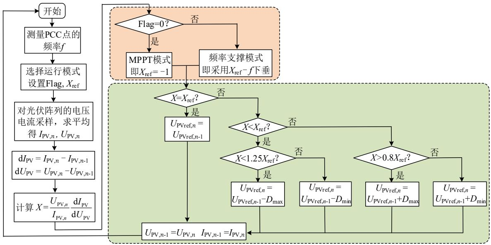  
图8 提出的X调节器控制方案流程  
Fig. 8 Flowchart of the proposed X regulator

制实现难度小，相较于传统的光伏控制策略仅需进行简单的改造，且不同运行模式间可进行无缝切换，可以实现光伏根据母线频率自适应进行功率储备和频率支撑，无需互相通信。

# 3 仿真验证与频率响应性能评估

为验证所提控制策略的有效性，在 Matlab/Simulink 中搭建了包含 2 组不同型号、不同容量的光伏阵列和一台发电机的新能源电网详细模型，如附录图 A1所示。其中电网的额定频率为 50Hz，每km 线路阻抗为(0.3+0.25j)，负荷容量为 400kW，光伏和发电机在额定频率下的出力均为 200kW(光伏出力占比 50%)。

光伏电源 1 由 KC200GT 模块串并联组成，光伏电源 2由 CS6P-230P 串并联组成，光伏电池的模型参数见附录中表 A1、A2，电压电流控制器的参数见附录中表 A4，温度、辐照度、光伏阵列最大功率和功率储备等光伏出力相关参数见附录中表A5。发电机包括柴油发电机和虚拟同步机(virtualsynchronous generator, VSG)2 种工况，以模拟传统同步机或构网型变流器作为电压源的电网中的频率响应，通过一次调频或者下垂控制进行频率调节。本文涉及的不同设备参与调频的控制模型和具体参数如附录中表 A6 所示(所有参数均为额定容量200kW 下的标幺值)。

# 3.1 模式切换及 X-f下垂特性测试

首先验证光伏的 $R _ { \mathrm { P V } } { \sf - } f$ 调节特性和多模式运行的平滑切换。设置 2台光伏阵列均留有 15%的额定功率储备，此时下垂系数 m 分别整定为 8.248 和

8.696，虚拟同步机为系统提供固定的频率基准。

图 9 展示了 2 光伏阵列的 $R _ { \mathrm { P V } }$ (出力比)变化曲线，为贴合光伏实际运行情况，测试中的电压电流信号均附加有随机采样噪声，如附录表 A4 所示。在该测试中，第 1s 时变流器根据指令由 MPPT 模式切换为 X-f 下垂模式；在 t2s 和 t3s 时辐照度阶跃降低/增加 200W/m2；在 t4s、t5s、t6s 及 t7s时电网的频率从 50Hz 依次阶跃降低 0.1Hz。由图可知两光伏阵列在控制模式切换后，出力比由 100%调整至额定值 85%；在光照发生变化后，两光伏阵列出力比近似保持 85%不变，从而实现了分布式光伏在环境变化情况下的等比例功率储备；在系统频率降低时，两光伏阵列自动增加出力比以实现频率支撑。

以上仿真结果表明，光伏阵列能够根据控制指令平滑地切换控制模式，并在频率或光照快速变化时快速、准确地跟踪光伏功率特征参量的指令值；在频率阶跃变化时，不同光伏的出力比均随频率的降低线性增加，形成了功率-频率的下垂特性。并且

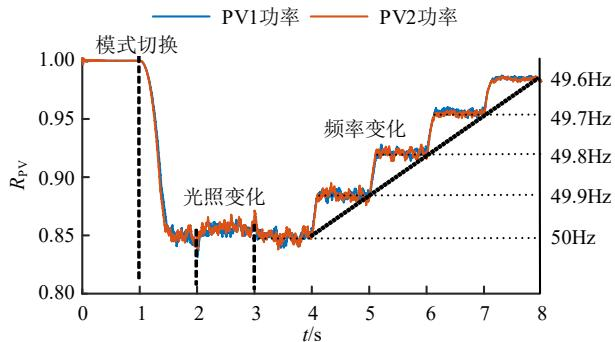  
图9 2台并联光伏阵列的 $R _ { \mathrm { P V } }$ 变化曲线  
Fig. 9 $R _ { \mathrm { P V } }$ changes of the two parallel PV arrays

在整个仿真过程中，2 个光伏阵列根据各自的下垂曲线公平分担功率储备，实现了 2 个光伏电源不依赖通信的分散式自适应频率支撑。

# 3.2 负荷变化测试-VSG 工况

在 VSG 作为发电机的工况中，针对 10%负荷投切，分别进行 4 次仿真实验，各次分别令光伏电源在额定频率下工作于MPPT模式、5%功率储备、10%功率储备以及 15%功率储备(改变光伏阵列的容量使其在 50Hz 时保持 200kW 的有功功率)。仿真过程中初始频率为 50Hz，辐照度保持 1000W/m2不变，在 2 类不同的实验中，负荷在 t0.5s 时分别阶跃增加/减少 10%。

图 10 中不同颜色的曲线分别表示光伏阵列工作于MPPT模式和留有不同百分比的功率储备时的系统频率的动态响应曲线。由图 10 可知，在负荷投切冲击条件下，光伏阵列工作于 MPPT模式时系统的频率跌落最为严重，经过约 0.4s 的暂态过程，频率稳定在 49.50Hz，在二次调频指令未到来前严重威胁了频率稳定及安全；而光伏阵列采用频率支撑模式并留有 15%的功率储备后，频率的最低点抬升为 49.65Hz，在负载扰动的 0.5s 后稳定在 49.75Hz，负载减少时同理，如图 10(b)所示。因此光伏采用所提出的分散式自适应频率支撑控制后，应对负荷投切时系统的频率响应改善明显，频率稳定性得到显著提高。

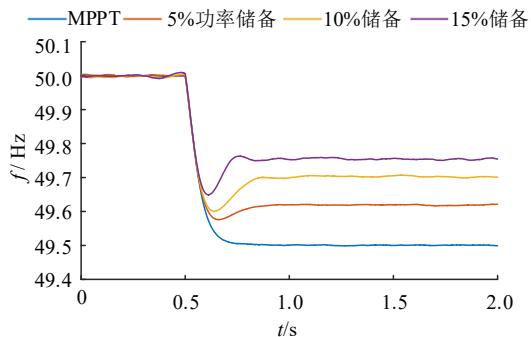  
(a) 负载增加10%系统的频率变化

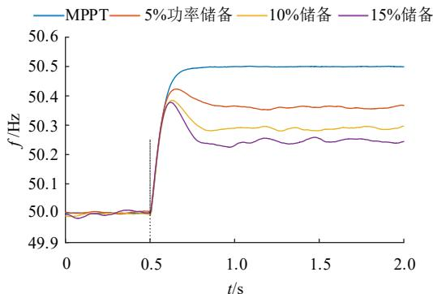  
(b) 负载减少10%系统的频率变化  
图 10 负荷投切时频率响应-VSG 工况  
Fig. 10 Frequency response under load switching-VSG case

# 3.3 负荷变化测试-同步机工况

在采用柴油机作为同步发电机的工况中，针对额外 10%的负荷接入，令光伏电源分别采用 MPPT控制、传统的频率支撑控制以及所提出的分散式自适应频率支撑控制，其中传统的频率支撑控制根据并网点的频率直接成比例地调整光伏出力。仿真过程中初始频率为 50Hz，令光伏在额定频率下留有15%的功率储备，辐照度保持 1000W/m2 不变，负荷在第 1s时阶跃增加 10%。

图 11 展示了光伏采用不同控制策略时系统频率的动态响应曲线。由图 11 可知，在负荷阶跃增加后，光伏阵列工作于 MPPT 模式时最低频率为48.41Hz，稳定后的频率为 49.50Hz(与 VSG 工况相同)，这将导致低频减载的发生；光伏阵列采用传统的频率支撑控制后，频率的最低点抬升为 49.56Hz，稳定后的频率为 49.75Hz；而采用本文提出的控制策略后，由于 2.2 节中 X 调节器需要进行多次采样和计算，与传统的频率支撑控制进行直接功率相比，所提出的控制策略调节速度略慢，在扰动初期频率下降较快，频率最低点为 49.55Hz。但是传统频率支撑控制的调频效果建立在准确提取 $P _ { \mathrm { M A P P } }$ 的基础上，所提控制策略无需获取 $P _ { \mathrm { M A P P } }$ 即可实现对光伏出力的灵活调节，同时具有相似的调频效果。

此外，由于电力电子控制器进行功率调节的响应速度远快于传统同步机一次调频的速度，采用光伏频率支撑控制的效果比传统机组的一次调频更为明显，尽管光伏和同步机具有相同的单位调节功

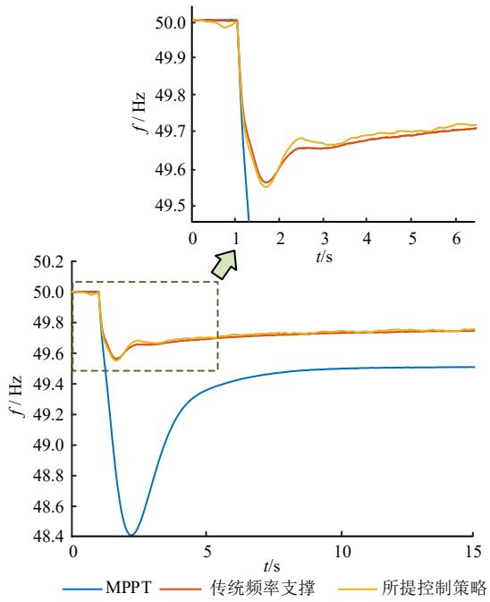  
图11 负荷投切时频率响应-传统同步机工况  
Fig. 11 Frequency response under load switchingsynchronous machine case

率。因此光伏采用所提出的分散式自适应频率支撑控制后，调频效果远好于相同容量的传统同步机，系统的频率响应得到明显改善。

# 3.4 光照连续变化测试

在本节的测试中，光伏采用本文提出的控制策略并在额定频率下留有 15%的功率储备，初始频率为50Hz，两光伏阵列所接受的辐照度变化如图12(a)所示，在 $t \in [ 0 . 5 , 2 ] \mathrm { s }$ 的过程中，辐照度连续降低总计 $1 0 0 \mathrm { W / m } ^ { 2 }$ ，在 $t \in [ 2 . 5 , 4 ] \mathrm { s }$ 的过程中辐照度连续升高总计 $5 0 \mathrm { W } / \mathrm { m } ^ { 2 }$ ， $t \in [ 4 . 5 , 5 . 5 ] \mathrm { s }$ 时模拟光照不均匀的环境条件，其中光伏阵列 1的辐照度保持不变，光伏阵列2的辐照度由 $9 5 0 \mathrm { W } / \mathrm { m } ^ { 2 }$ 连续降低至 $8 0 0 \mathrm { W / m } ^ { 2 } ;$ ；并且在第 1s 和第 3s 时负载分别增加/减少 5%。

图 12(b)展示了两光伏阵列 $R _ { \mathrm { P V } }$ 的变化过程，由图可知，在负载投切和光照变化时两光伏阵列可快速调整输出功率以响应频率变化，整个过程中两光伏阵列的 $R _ { \mathrm { P V } }$ 基本保持一致，提出的控制策略实现了不同光伏阵列在不均匀光照的条件下的功率均分。图 12(c)展示了光伏阵列工作于 MPPT 模式及所提出的频率支撑模式下的系统频率曲线，由图可

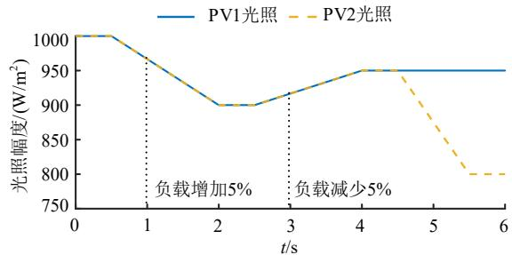  
(a) 光伏阵列辐照度与负载变化

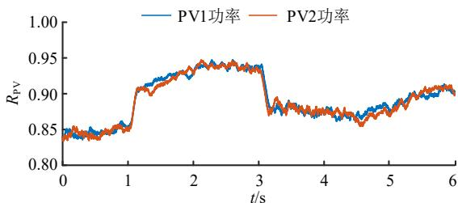  
(b) 两光伏阵列采用频率支撑模式时的有功出力

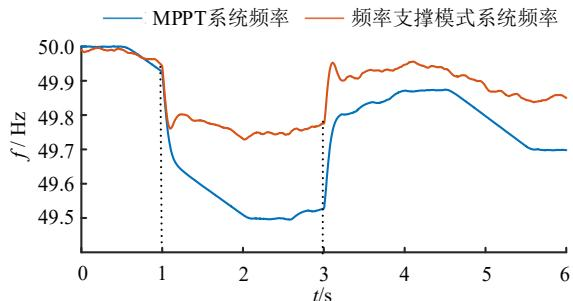  
(c) 光伏阵列运行于不同模式的频率变化  
图 12 光照连续变化条件下仿真结果  
Fig. 12 Simulation results under continuous change of irradiation

知光伏阵列工作于所提出的频率支撑模式时频率变化较小，系统的频率响应性能提升明显，保障了系统的频率稳定。

# 4 结论

本文提出了一种基于光伏电源功率特征参量的分散式自适应主动频率支撑控制方法。相比于传统光伏频率支撑算法，所提策略具有如下优势：

1）不需要对 $P _ { \mathrm { M A P P } }$ 进行在线拟合或估计，除了测量电压电流以及进行简单的计算，不需要安装光照和温度传感器，不需要获取光伏单二极管等效电路建模所需的五参数(光电流、二极管理想常数、反向饱和电流、串并联电阻)，也不涉及复杂的数学求解过程。所提控制策略可以适应环境条件的快速变化，减少了控制器的计算负担和投资成本。  
2）提出的 $R _ { \mathrm { P V } } - X$ 曲线不随光照、温度、品牌型号及光伏电源装机容量变化，可有效实现多工况下光伏电源的等比例功率储备控制，实现了无通信条件下分布式光伏进行频率支撑的分散式协同，保障了发电公平。  
3）提出的主动频率支撑控制算法能够有效改善高比例分布式光伏接入的区域新能源电网的频率响应特性，为分布式光伏主动参与系统频率支撑与调节提供了一种可行的技术解决方案。

附录见本刊网络版(http://www.dwjs.com.cn/CN/1000-3673/current.shtml)。

# 参考文献

[1] 叶畅，柳丹，杨欣宜，等．基于最小惯量评估的高比例新能源电 力系统优化运行策略[J]．电网技术，2023，47(2)：502-509 YE Chang，LIU Dan，YANG Xinyi，et al．Optimal operation strategy of high proportion new energy power system based on minimum inertia evaluation[J]．Power System Technology，2023，47(2)： 502-509(in Chinese)．   
[2] 谢小荣，贺静波，毛航银，等．“双高”电力系统稳定性的新问题及分类探讨[J]．中国电机工程学报，2021，41(2)：461-474XIE Xiaorong，HE Jingbo，MAO Hangyin，et al．New issues andclassification of power system stability with high shares of renewablesand power electronics[J]．Proceedings of the CSEE，2021，41(2)：461-474(in Chinese)．  
[3] 李军徽，冯喜超，严干贵，等．高风电渗透率下的电力系统调频研究综述[J]．电力系统保护与控制，2018，46(2)：163-170LI Junhui，FENG Xichao，YAN Gangui，et al．Survey on frequencyregulation technology in high wind penetration power system[J]Power System Protection and Control，2018，46(2)：163-170(inChinese)．  
[4] 林恒先，侯凯元，陈磊，等．高比例风电电力系统考虑频率安全约束的机组组合[J]．电网技术，2021，45(1)：1-9LIN Hengxian，HOU Kaiyuan，CHEN Lei，et al．Unit commitment

of power system with high proportion of wind power considering frequency safety constraints[J]．Power System Technology，2021， 45(1)：1-9(in Chinese)．   
[5] 杨冬锋，朱军豪，姜超，等．基于分布式模型预测的高比例风电系统多源协同负荷频率控制策略[J]．电网技术，2024，48(7)：2804-2814  
YANG Dongfeng ， ZHU Junhao ， JIANG Chao ， et alHighly-proportional wind power system multi-source collaborate loadfrequency control strategy based on distributed model prediction[J]Power System Technology，2024，48(7)：2804-2814(in Chinese)  
[6] IEEE．IEEE recommended practice for interconnecting distributed resources with electric power systems distribution secondary networks： 1547.6—2011[S/OL][2024-04-01]．https://ieeexplore.ieee.org/ document/6022734，IEEE，2011   
[7] PHURAILATPAM C，RATHER Z H，BAHRANI B，et al．Measurement-based estimation of inertia in AC microgrids[J]．IEEETransactions on Sustainable Energy，2020，11(3)：1975-1984  
[8] PHURAILATPAM C，RATHER Z H，BAHRANI B，et al．Estimationof non-synchronous inertia in AC microgrids[J]．IEEE Transactions onSustainable Energy，2021，12(4)：1903-1914  
[9] 王强强，姚良忠，徐箭，等．基于切片采样-马尔科夫链蒙特卡洛模拟的高比例新能源电力系统等效惯量概率评估[J]．电网技术，2024，48(1)：140-149  
WANG Qiangqiang，YAO Liangzhong，XU Jian，et al．S-MCMC based equivalent inertia probability evaluation for power systems with high proportional renewable energy[J]．Power System Technology， 2024，48(1)：140-149(in Chinese)   
[10] 袁敞，刘昌，赵天扬，等．基于储能物理约束的虚拟同步机运行边界研究[J]．中国电机工程学报，2017，37(2)：506-515  
YUAN Chang，LIU Chang，ZHAO Tianyang，et al．Research on operating boundary of virtual synchronous machine based on physical constraint of energy storage system[J]．Proceedings of the CSEE， 2017，37(2)：506-515(in Chinese)   
[11] 吴启帆，宋新立，张静冉，等．电池储能参与电网一次调频的自适应综合控制策略研究[J]．电网技术，2020，44(10)：3829-3836  
WU Qifan ， SONG Xinli ， ZHANG Jingran ， et al ． Study onself-adaptation comprehensive strategy of battery energy storage inprimary frequency regulation of power grid[J] ． Power SystemTechnology，2020，44(10)：3829-3836(in Chinese)  
[12] 姜海洋，杜尔顺，朱桂萍，等．面向高比例可再生能源电力系统的季节性储能综述与展望[J]．电力系统自动化，2020，44(19)：194-207．  
JIANG Haiyang，DU Ershun，ZHU Guiping，et al．Review and prospect of seasonal energy storage for power system with high proportion of renewable energy[J]．Automation of Electric Power Systems，2020，44(19)：194-207(in Chinese)   
[13] 谢云云，谷志强，王晓丰，等．光储系统参与实时能量-调频市场的运行策略[J]．电网技术，2020，44(5)：1758-1765  
XIE Yunyun，GU Zhiqiang，WANG Xiaofeng，et al．Optimal operation strategy of combined photovoltaic and storage system in real time energy and regulation market[J]．Power System Technology，2020， 44(5)：1758-1765(in Chinese)   
[14] FANG Jingyang，LI Hongchang，TANG Yi，et al．Distributed power system virtual inertia implemented by grid-connected power converters[J]．IEEE Transactions on Power Electronics，2018，33(10)：

8488-8499   
[15] KHAN A，D’SILVA S，FARD A Y，et al．On stability of PV clusters with distributed power reserve capability[J]．IEEE Transactions on Industrial Electronics，2021，68(5)：3928-3938   
[16] CRĂCIUN B U，KEREKES T，SÉRA D，et al．Frequency support functions in large PV power plants with active power reserves[J] IEEE Journal of Emerging and Selected Topics in Power Electronics， 2014，2(4)：849-858   
[17] 张金平，汪宁渤，黄蓉，等．高渗透率光伏参与电力系统调频研究综述[J]．电力系统保护与控制，2019，47(15)：179-186  
ZHANG Jinping，WANG Ningbo，HUANG Rong，et al．Survey on frequency regulation technology of power grid by high-penetration photovoltaic[J]．Power System Protection and Control，2019，47(15)： 179-186(in Chinese)   
[18] 汪红波，周强明，刘恒怡，等．光伏发电系统一次调频技术回顾与发展趋势[J]．广东电力，2022，35(1)：11-21  
WANG Hongbo，ZHOU Qiangming，LIU Hengyi，et al．Review and development trend of primary frequency modulation technology in photovoltaic power generation system[J]．Guangdong Electric Power， 2022，35(1)：11-21(in Chinese)   
[19] SANGWONGWANICH A，YANG Yongheng，BLAABJERG F，et al Delta power control strategy for multistring grid-connected PV inverters[J]．IEEE Transactions on Industry Applications，2017，53(4)： 3862-3870   
[20] HOKE A F，SHIRAZI M，CHAKRABORTY S，et al．Rapid active power control of Photovoltaic systems for grid frequency support[J]． IEEE Journal of Emerging and Selected Topics in Power Electronics， 2017，5(3)：1154-1163   
[21] PENG Qiao ， TANG Zhongting ， YANG Yongheng ， et alEvent-triggering virtual inertia control of PV systems with powerreserve[J]．IEEE Transactions on Industry Applications，2021，57(4)：4059-4070  
[22] XIN Huanhai，LIU Yun，WANG Zhen，et al．A new frequency regulation strategy for photovoltaic systems without energy Storage[J] IEEE Transactions on Sustainable Energy，2013，4(4)：985-993   
[23] BATZELIS E I，KAMPITSIS G E，PAPATHANASSIOU S A．Power reserves control for PV systems with real-time MPP estimation via curve fitting[J]．IEEE Transactions on Sustainable Energy，2017，8(3)： 1269-1280   
[24] LI Xingshuo，WEN Huiqing，ZHU Yinxiao，et al．A novel sensorless photovoltaic power reserve control with simple real-time MPP estimation[J]．IEEE Transactions on Power Electronics，2019，34(8)： 7521-7531   
[25] KOLESNIK S，SITBON M，LINEYKIN S，et al．Solar irradiationindependent expression for photovoltaic generator maximum powerline[J]．IEEE Journal of Photovoltaics，2017，7(5)：1416-1420  
[26] ZHU Yinxiao ， WEN Huiqing ， CHU Guanying ， et al ．High-performance photovoltaic constant power generation controlwith rapid maximum power point estimation[J]．IEEE Transactions onIndustry Applications，2021，57(1)：714-729  
[27] CHENG Cheng，ZHOU Yang，YAN Gangui．Power reserve control with real-time iterative estimation for PV system participation in frequency regulation[J]．International Journal of Electrical Power & Energy Systems，2021，124：106367   
[28] BATZELIS E I，KAMPITSIS G E，PAPATHANASSIOU S A，et al

Direct MPP calculation in terms of the singleDirect calculation single-diode PV modeldiode parametparameters[J]ers[J]．IEEE Transactions on Energy Conversion，2015，30(1)： 226--236．   
[2[29] VILLALVA M G，GAZOLI J R，FILHO E R．Comprehensiveapproach to modeling and simulation of photovoltaic arrays[J]approach ．IEEETransactions on Power ElectronicsTransactions ，2009，24(5)：11981198-12081208  
[3030] XIA YanghYanghongong，PENG YonggangPENG ，YANG Pengcheng，et al．Different influence of grid impedance on lowinfluence on low-- and highhigh-frequency stability of frequency PV generators[J]．IEEE Transactions on Industrial ElectronicsElectronics，2019， 66(11)：84988498-85088508   
[3131] CAI Hongda，XIANG JiXIANG ，WEI Wei．Decentralized coordinacoordination tion control of multiple photovoltaic sources for DC bus voltage regulating control for and power sharing[J]．IEEE Transactions on Industrial ElectronicsTransactions ， 2018，65(7)：56015601-56105610   
[3[32] 王利猛，孙珮然，韩凯，等．计及备用容量的光伏发电系统等比王利猛，孙珮然，韩凯，等．计及备用容量的光伏发电系统等比例减载调频控制技术研究例减载调频控制技术研究[J]．可再生能源，2020，38(9)：12031203-12091209WANG Limeng，SUN Peiran，HAN KaiKai，et al．The control strategyof frequency regulation by proportional deloading for a PV system of regulationconsidering available reserves[J]considering ．Renewable Energy Resources，2020，38(9)：12031203-1209(in Chinese)1209(in

  
杨鹏程

在线出版日期：20242024-07--17。

收稿日期：20242024-05-2828。

作者简介：

杨鹏程(1993)，男，博士，，男，博士，讲师讲师，，主要研究方主要研究方向为新能源发电控制、交直流混合微电网向为新能源发电控制、交直流混合微电网，，E-mailmail：ypc196@zju.edu.cn；

冯启帆(1999)，男，通信作者，博士研究生，主要研究方向为分布式光伏发电、配电网电能质量，，E-mailmail：12110032@zju.edu.cn；

韦巍(1964)，男，博士，，男，博士，教授教授，主要研究方向主要研究方向为氢电耦合新能源系统、智能为氢电耦合新能源系统、智能电网、智能控制电网、智能控制电网、智能控制，，E-mailmail：wwei@zju.edu.cn；

蔡宏达(1990)，男，博士，，男，博士，副教授副教授副教授，主要研究主要研究方向为新能源发电控制、边缘计算在新能源电网中的应用的应用，，E-mailmail：caihd@zucc.edu.cn；

夏杨红(1991)，男，博士，，男，博士，教授教授，，主要研究方主要研究方向为氢电耦合新能源系统、新能源微电网向为氢电耦合新能源系统、新能源微电网，，E-mailmail：royxiayh@zju.edu.cn；

唐雅洁(1993)，女，硕士，，女，硕士，工程师工程师工程师，主要研究主要研究方向为新能源功率预测、分布式光伏运行与控制方向为新能源功率预测、分布式光伏运行与控制，，E-mail: tyj_11@163.commail: 。

（（责任编辑责任编辑 马晓华马晓华））

# 附录 A

本文使用的光伏模块为 KC200GT、ISTH-215P和 CS6P-230P，详细参数见附录中表 A1，A2，A3。

表 A1 KC200GT 在标准测量环境(25℃, AM 1.5,1000W/m2)下的完整参数  
Table A1 All parameters of KC200GT under standard test condition(25℃, A.M1.5, 1000 W/m2)   
表 A2 CS6P-230P 在标准测量环境(25℃, AM 1.5,1000W/m2)下的完整参数  

<table><tr><td>参数</td><td>数值</td><td>参数</td><td>数值</td></tr><tr><td>Imp</td><td>7.61A</td><td>Kt</td><td>0.0032A/K</td></tr><tr><td>Ump</td><td>26.3V</td><td>N</td><td>54</td></tr><tr><td>Pavai</td><td>200.14W</td><td>Ith</td><td>8.214A</td></tr><tr><td>Isc</td><td>8.21A</td><td>Rp</td><td>415.405Ω</td></tr><tr><td>Uoe</td><td>32.9V</td><td>Rs</td><td>0.221Ω</td></tr><tr><td>KV</td><td>-0.1230V/K</td><td>a</td><td>1.3</td></tr></table>

Table A2 All parameters of CS6P-230P at standard test condition(25℃, A.M1.5, 1000 W/m2)   
表 A3 1STH-215P 在标准测量环境(25℃, AM 1.5,1000W/m2)下的完整参数  

<table><tr><td>参数</td><td>数值</td><td>参数</td><td>数值</td></tr><tr><td>Imp</td><td>7.71A</td><td>Kt</td><td>0.0050A/K</td></tr><tr><td>Ump</td><td>29.8V</td><td>N</td><td>60</td></tr><tr><td>Pavail</td><td>230W</td><td>Ith</td><td>8.347A</td></tr><tr><td>Isc</td><td>8.34A</td><td>Rp</td><td>254Ω</td></tr><tr><td>Uoc</td><td>36.8V</td><td>Rs</td><td>0.227Ω</td></tr><tr><td>Kv</td><td>-0.1288V/K</td><td>a</td><td>1.224</td></tr></table>

Table A 3 All parameters of 1STH-215P at standard test condition(25℃, A.M1.5, 1000 W/m2)   

<table><tr><td>参数</td><td>数值</td><td>参数</td><td>数值</td></tr><tr><td>Imp</td><td>7.35A</td><td>Kt</td><td>0.0080A/K</td></tr><tr><td>Ump</td><td>29V</td><td>N</td><td>60</td></tr><tr><td>Pavai</td><td>213.15W</td><td>Iph</td><td>7.8649A</td></tr><tr><td>Isc</td><td>7.84A</td><td>Rp</td><td>313.399Ω</td></tr><tr><td>Uoc</td><td>36.3V</td><td>Rs</td><td>0.394Ω</td></tr><tr><td>Kv</td><td>-0.1310V/K</td><td>a</td><td>0.9812</td></tr></table>

表 A4 仿真采用的光伏并网逆变器的控制参数  
Table A4 Parameters of grid-connected PV in simulation   
表A5 光伏出力相关参数  

<table><tr><td>DC-AC 参数</td><td>数值</td><td>DC-DC 参数</td><td>数值</td><td>采样参数</td><td>数值</td></tr><tr><td>L1</td><td>0.8mH</td><td>Cde</td><td>1.5mF</td><td>频率</td><td>5000Hz</td></tr><tr><td>L2</td><td>0.4mH</td><td>Lbuck</td><td>2mH</td><td>采样噪声</td><td>(0.6V,0.15A)</td></tr><tr><td>C</td><td>100μF</td><td>Cpv</td><td>1.5mF</td><td></td><td></td></tr><tr><td>KPLLp</td><td>0.3</td><td>Kvp</td><td>1</td><td></td><td></td></tr><tr><td>KPLLi</td><td>5.7</td><td>Kvi</td><td>10</td><td></td><td></td></tr><tr><td>UDcref</td><td>800V</td><td>Kip</td><td>0.0025</td><td></td><td></td></tr><tr><td>Kvp</td><td>1</td><td>Kii</td><td>0.15</td><td></td><td></td></tr><tr><td>Kvi</td><td>120</td><td>Dmax</td><td>0.6</td><td></td><td></td></tr><tr><td>Kip</td><td>0.0125</td><td>Dmin</td><td>0.3</td><td></td><td></td></tr><tr><td>Kii</td><td>1.25</td><td>fPWM</td><td>5000Hz</td><td></td><td></td></tr><tr><td>Kic</td><td>0.014</td><td></td><td></td><td></td><td></td></tr><tr><td>fPWM</td><td>5000Hz</td><td></td><td></td><td></td><td></td></tr></table>

Table A5 Related parameters of PV output power   
表A6 不同设备的调频模型和参数  

<table><tr><td>光伏阵列1参数</td><td>数值</td><td>光伏阵列2参数</td><td>数值</td></tr><tr><td>温度</td><td>25°C</td><td>温度</td><td>25°C</td></tr><tr><td>辐照度</td><td>1000W/m²</td><td>辐照度</td><td>1000W/m²</td></tr><tr><td>最大功率</td><td>127kW</td><td>最大功率</td><td>109.1kW</td></tr><tr><td>最大功率下的电压</td><td>1110V</td><td>最大功率下的电压</td><td>1072V</td></tr><tr><td>最大功率下的电流</td><td>114.5A</td><td>最大功率下的电流</td><td>101.8A</td></tr><tr><td>储备15%功率的Xref</td><td>-5.124</td><td>储备15%功率的Xref</td><td>-5.348</td></tr><tr><td>储备10%功率的Xref</td><td>-3.974</td><td>储备10%功率的Xref</td><td>-4.133</td></tr><tr><td>储备5%功率的Xref</td><td>-2.746</td><td>储备5%功率的Xref</td><td>-2.889</td></tr></table>

Table A6 Frequency regulation model and parameters of different devices   

<table><tr><td>柴油发电机</td><td>惯性时间常数
H=1.5s</td><td>单位调节功率
1/R=20</td><td>调速器模型
文献[14]</td></tr><tr><td>VSG</td><td>惯性时间常数
H=0.5s</td><td>阻尼系数
D=20</td><td>控制器模型
文献[10]</td></tr><tr><td>PV采用传统
虚拟阻尼控制</td><td>功率备用
15%</td><td>虚拟阻尼
D=20</td><td>调频模型
文献[16]</td></tr><tr><td>PV采用所提
控制策略</td><td>功率备用
15%</td><td>下垂系数
m=8.248</td><td>调频模型
图6-7,9</td></tr></table>

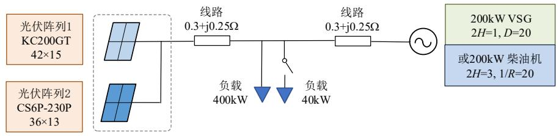  
图 A1 高比例分布式光伏电源接入的电网仿真系统  
Fig. A1 Simulation system with two distributed PV sources and a virtual synchronous generator

# Decentralized Adaptive Frequency Support Control of Distributed PV Sources

YANG Pengcheng1, FENG Qifan2, WEI Wei2, CAI Hongda1, XIA Yanghong2, TANG Yajie3

(1. Hangzhou City University, Hangzhou 310015, Zhejiang Province, China; 2. College of Electrical Engineering, Zhejiang University, Hangzhou 310027, Zhejiang Province, China; 3. State Grid Zhejiang Electric Power Co., Ltd. Research Institute, Hangzhou 310014, Zhejiang Province, China)

# KEY WORDS: Distributed PV, frequency support, decentralized control

PV's direct participation in frequency support requires pre-reserving active power, and a certain power-adjustable margin is obtained by deviating from MPP operation. the acquisition of its current (maximum available power, $P _ { \mathrm { M A P P } } )$ is very critical. However, the lack of computing resources and communication equipment makes 字段 difficult to obtain.

To equally reserve power between different PVs without communication, this paper combines the operation characteristics of the PV module on the right side of the maximum power point. The characteristic of power reserve is proposed, which represents the real-time output power of the PV system as a ratio to the current maximum available power, thus avoiding the online estimation of the maximum available power.

When $X = ( { U _ { \mathrm { p v } } } / { I _ { \mathrm { p v } } } ) { \cdot } ( \mathrm { d } I _ { \mathrm { p v } } / \mathrm { d } U _ { \mathrm { p v } } ) { = } { - } 1$ , the PV runs at MPP, and the operating point to the right of MPP

exhibits the characteristics that X  1. X has a strong correlation and consistency with the PV output ratio, as shown in Fig.1. The shape of $R _ { \mathrm { P V } } - X$ curve is approximately consistent at different irradiance or temperatures, which are suitable for power reserves.

To achieve frequency support and fair power curtailment of different PV arrays, a control strategy is designed that the PV array changes X according to the frequency of the PCC. The control structure of the PV system is shown in Fig. 1; the core of the PV system's controller is the frequency support control module. The $X _ { \mathrm { r e f } } - f$ droop is used to realize power reserve at the rated frequency (f=50Hz) and the increase in output power after the frequency reduction, where $X _ { \mathrm { r e f } }$ is the reference value of X . The effectiveness of the control strategy is verified by simulation results.

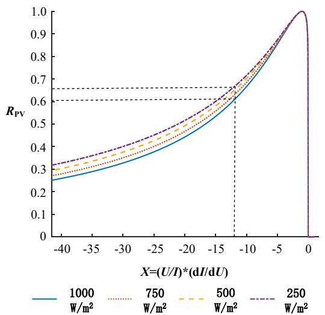

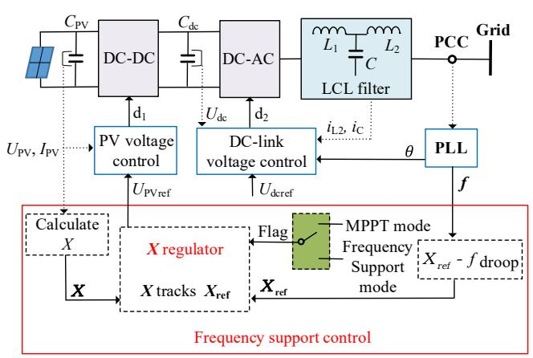  
Fig. 1 $R _ { \mathrm { P V } } - X$ curves under different irradiance and control structure of PV system

This paper analyzes the power reserve characteristic parameter suitable for different types and capacities of PV. Decentralized frequency support control based on distributed PV’s adaptive power reserve is proposed. Compared to the traditional method, this control strategy can realize the smooth switching of MPPT and frequency support modes. And

the fair distribution of power curtailment of PV arrays in the same area without communication is achieved. When reserved power for frequency support is needed, all PV arrays share the same output ratio according to a similar droop curve. The output power of PV arrays can be changed quickly when the load or environmental conditions change.