# A Thévenin-Type Version of the Extended Modal-Domain Model for Lightning-Induced Voltage Calculations

Osis E. S. Leal and Alberto De Conti , Senior Member, IEEE

Abstract—In this paper, a new procedure is proposed for determining the external current sources required for evaluating lightning-induced voltages on overhead lines with the extendedmodal domain (EMD) model. Unlike the original model, in which the calculation of the inducing current sources depends on the fitting of the characteristic admittance of the line, in the proposed procedure this calculation is performed using the characteristic impedance of the line. This significantly simplifies the use of the EMD model because now all parameters can be readily obtained from the built-in fitting tool that is usually available in electromagnetic transient programs to derive the parameters of Marti’s transmission line model. The validity of the proposed procedure is demonstrated through examples that indicate its accuracy in the calculation of lightning-induced voltages on overhead distribution lines terminated with different types of loads, including transformers and surge arresters, and multiple grounding points.

Index Terms—Lightning-induced voltages, overhead distribution lines, EMT-type programs.

# I. INTRODUCTION

L IGHTNING-INDUCED voltage calculations on powerdistribution networks with complex topologies are more easily performed within the framework of electromagnetic transient (EMT) simulation programs [1]–[9], which have an expansible library of power system components that can be efficiently connected for the simulation of transient phenomena. Recently, two methodologies were proposed in [8] and [9] for performing lightning-induced voltage calculations using the universal line model (ULM) [10] and Marti’s transmission line model [11], which are available in most EMT-like programs. In these methodologies, a pair of current sources connected at the ends of the line is used to fully describe the effect of the incident electromagnetic (EM) fields, as shown in Fig. 1. These sources,

Manuscript received 7 December 2021; revised 13 April 2022; accepted 30 May 2022. Date of publication 10 June 2022; date of current version 24 January 2023. This work was supported in part by the National Council for Scientific and Technological Development (CNPq) under Grant 306006/2019-7 and in part by the State of Minas Gerais Research Foundation (FAPEMIG) under Grant TEC-PPM-00280-17. Paper no. TPWRD-01815-2021. (Corresponding author: Osis E. S. Leal.)

Osis E. S. Leal is with the Department of Electrical Engineering, Federal University of Technology – Paraná (UTFPR), Pato Branco 85503-390, Brazil (e-mail: osisleal@utfpr.edu.br).

Alberto De Conti is with the Department of Electrical Engineering, Universidade Federal de Minas Gerais, Belo Horizonte, MG 31270-901, Brazil (e-mail: conti@cpdee.ufmg.br).

Color versions of one or more figures in this article are available at https://doi.org/10.1109/TPWRD.2022.3181445.

Digital Object Identifier 10.1109/TPWRD.2022.3181445

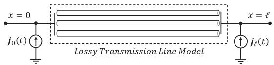  
Fig. 1. Lossy multiconductor transmission line with current sources representing the effect of external EM fields.

named ${ j _ { 0 } ( t ) }$ and $j _ { \ell } ( t )$ , are calculated either in the phase domain j jor in the modal domain depending on the line model they are coupled to.

The calculation of ${ j _ { 0 } ( t ) }$ and $j _ { \ell } ( t )$ depends on the incident j jlightning EM fields. It also depends on the representation of the characteristic admittance and propagation function of the line as sums of rational terms [8], for which a fitting tool is required. Although in principle any fitting technique could be used (see, e.g., [12]), the current source calculation is simplified if the fitting is entirely performed within the EMT simulation tool because the user no longer needs to implement a computer code to calculate and fit the line parameters. The problem is that Marti’s transmission line model [11] available in the Alternative Transients Program (ATP) [13], in the Electromagnetic Transients Program (EMTP) [14] and in the Power Systems Computer Aided Design (PSCAD) [15] is not based on the fitting of the characteristic admittance $Y _ { c } ,$ but on its reciprocal, the characteristic impedance $\pmb { Z _ { c } } = \pmb { Y _ { c } ^ { - 1 } }$ Y. Consequently, the calculation Z Yof the current sources shown in Fig. 1 using the built-in fitting tools available in these simulation platforms is impaired because the poles and residues of $Y _ { c }$ are not readily available.

YThe main contribution of this paper is to propose an original procedure for the calculation of ${ j _ { 0 } ( t ) }$ and $j _ { \ell } ( t )$ that depends solely on the fitting of $Z _ { c }$ j j. This greatly simplifies the calculation Zof lightning induced voltages using Marti’s model in EMT-like tools with the extended modal domain model (EMD) [8], [9], because the independent calculation and fitting of $\mathbf { Y } _ { c }$ is no longer Yrequired. In addition, the new procedure enables the calculation of ${ j _ { 0 } ( t ) }$ and $j _ { \ell } ( t )$ using the poles and residues provided by the j jbuilt-in fitting tools available in such platforms, which avoids the need of the user to write a dedicated code for performing such task.

This paper is organized as follows. Section II presents the problem characterization. Section III introduces the proposed solution method. Results and analysis are presented in Section IV, followed by conclusions in Section V.

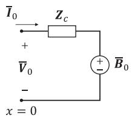

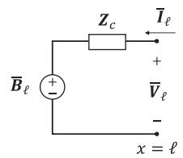  
Fig. 2. Frequency-domain equivalent circuit of a lossy transmission line without the effect of incident EM fields.

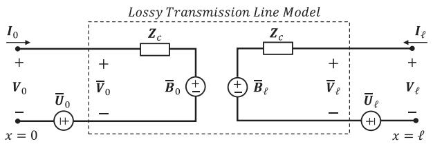  
Fig. 3. Lossy transmission line circuit excited by incident EM fields represented by external voltage sources.

# II. PROBLEM CHARACTERIZATION

Fig. 2 shows the equivalent circuit obtained by solving telegrapher’s equations in the frequency domain considering a transmission line with length - with the method of characteristics [8]. In this circuit, $\bar { V } _ { \mathrm { 0 } }$ and ${ \bar { \pmb I } } _ { 0 }$ are the voltage and Vcurrent vectors at the sending end, $\bar { V } _ { \ell }$ and $\bar { \mathbf { \Gamma } } _ { \bar { \mathbf { \Gamma } } }$ are the voltage Vand current vectors at the receiving end, $\bar { \boldsymbol { B } } _ { 0 } = H ( \bar { V } _ { \ell } + Z _ { c } \bar { I } _ { \ell } )$ and $\pmb { { \cal B } } _ { \ell } = \pmb { { \cal H } } ( \bar { V } _ { 0 } + Z _ { c } \bar { \pmb { I } } _ { 0 } )$ B H V Z Iare voltage sources representing B H V Z Ithe interaction between the line ends, $\mathbf { \bar { Z } } _ { c } = \mathbf { Y } ^ { - 1 } \mathbf { \sqrt { \mathbf { \bar { Y } } Z } }$ is the characteristic impedance, and $H = e ^ { - { \sqrt { Y Z } } \ell }$ Y Y Zis the propagation Hfunction of the line, which depend on the series impedance $Z$ and shunt admittance $\mathbf { Y }$ Zper unit length. All the vectors are of size $n _ { f } \times 1$ Y, while the matrices are of size $n _ { f } \times n _ { f }$ , where $n _ { f }$ is the number of conductors. In [8] and [9] it is shown how to extend the circuit of Fig. 2 to calculate lightning-induced voltages. For such, the influence of the incident EM fields is represented by independent voltage sources connected externally to the line model, as shown in Fig. 3 [8], [9]. These sources, named $\bar { U } _ { 0 }$ and $\bar { U } _ { \ell } .$ , are calculated as [8]

$$
\bar {U} _ {0} = \boldsymbol {U} _ {0} - \boldsymbol {H} \bar {U} _ {\ell},
$$

$$
\bar {U} _ {\ell} = U _ {\ell} - H \bar {U} _ {0}. \tag {1}
$$

where $U _ { 0 }$ and $\ b { U } _ { \ell }$ represent the effect of the incident EM fields. U UFurther details regarding the calculation of $U _ { 0 }$ and $\ b { U _ { \ell } }$ are given in [8], [9].

By using a source transformation, $\bar { U } _ { 0 }$ and $\bar { U } _ { \ell }$ can be written as equivalent current sources $J _ { 0 } = Y _ { c } \bar { U } _ { 0 }$ and $\begin{array} { r } { J _ { \ell } = Y _ { c } \bar { U } _ { \ell } . } \end{array}$ , which J Yare expressed in the time domain as

$$
\boldsymbol {j} _ {0} (t) = \boldsymbol {y} _ {c} (t) * \bar {\boldsymbol {u}} _ {0} (t),
$$

$$
\boldsymbol {j} _ {\ell} (t) = \boldsymbol {y} _ {c} (t) * \bar {\boldsymbol {u}} _ {\ell} (t), \tag {2}
$$

where $j _ { 0 } ( t ) , j _ { \ell } ( t ) , \bar { \boldsymbol { u } } _ { 0 } ( t ) , \bar { \boldsymbol { u } } _ { \ell } ( t )$ , and ${ \mathbf { } } y _ { c } ( t )$ are the time-domain j jequivalents of $J _ { 0 } , J _ { \ell } , \bar { U } _ { 0 } , \bar { U } _ { \ell }$ and $Y _ { c }$ , respectively, and $\cdot _ { * } \cdot$ i s J J Uthe convolution integral.

In [8], equation (2) was used to incorporate the effect of incident EM fields in Marti’s model and the ULM available

in EMT programs. For dealing with the convolutions in (2), $Y _ { c }$ is fitted in the frequency domain using the vector fitting Ytechnique [16], and a recursive algorithm is used [8], [9]. In the following, a novel technique is proposed to determine ${ j _ { 0 } ( t ) }$ and $j _ { \ell } ( t )$ from the poles and residues of $Z _ { c }$ j, which can be readily j Zobtained from the built-in fitting tool that is usually linked to Marti’s model in EMT simulation tools.

# III. PROPOSED SOLUTION METHOD

The voltage drop $\scriptstyle { E _ { 0 } }$ across the characteristic impedance $Z _ { c }$ Eshown in Fig. 3 can be calculated as ${ \cal { E } } _ { 0 } = { Z _ { c } } { \cal { I } } _ { 0 }$ Z. By defining $\pmb { { \cal E } } _ { 0 } = ( \pmb { { t } } _ { I } ^ { T } ) ^ { - 1 } \pmb { { \cal E } } _ { 0 , m }$ and $I _ { 0 } = t _ { I } I _ { 0 , m } [ 1 7 ]$ Z I, where $t _ { I }$ is a real and E t E I t I tconstant transformation matrix calculated at frequency $f _ { 0 }$ [18] the modal voltage drop $E _ { 0 , m } = Z _ { c , m } \boldsymbol { I } _ { 0 , m }$ is obtained, where $\boldsymbol { Z _ { c , m } } = \boldsymbol { t } _ { I } ^ { T } \boldsymbol { Z _ { c } } \boldsymbol { t } _ { I }$ E[19]. Although $t _ { I }$ Iis generally complex and Z t Z t tfrequency dependent [17], assuming it real and constant following the procedure in [18], [20] has been proven to be sufficiently accurate for the simulation of transients on most overhead line configurations with both Marti’s model [11] and its extension to simulate lightning-induced voltages, the EMD model [8], [21]. This means that in practice $\boldsymbol { Z } _ { c , m }$ can be treated as a diagonal matrix without significant errors.

In the time domain, $\pmb { { \cal E } } _ { 0 , m }$ reads

$$
\boldsymbol {e} _ {0, m} (t) = \boldsymbol {z} _ {c, m} (t) * \boldsymbol {i} _ {0, m} (t), \tag {3}
$$

where $e _ { 0 , m } ( t )$ and $\mathbf { \cdot } _ { 0 , m } ( t )$ are the time-domain equivalents of $\pmb { { \cal E } } _ { 0 , m }$ eand ${ \cal I } _ { 0 , m }$ i, respectively, and $z _ { c , m } ( t )$ is the inverse Laplace E Itransform of $\boldsymbol { Z } _ { c , m }$ z. From the rational fitting of $\boldsymbol { Z } _ { c , m }$ , the i-th element of $z _ { c , m } ( t )$ can be written as

$$
z _ {c, m} ^ {i, i} (t) = k _ {0} ^ {i} \delta (t) + \sum_ {n = 1} ^ {N _ {p} ^ {i}} k _ {n} ^ {i} e ^ {a _ {n} ^ {i} t} u (t), \tag {4}
$$

where $a _ { n } ^ { i }$ is the n-th real or complex pole associated with the i-th mode of $Z _ { c , m } , k _ { n } ^ { i }$ is the corresponding residue, $k _ { 0 } ^ { i }$ is a real Znumber that represents the asymptotic behavior of the modal characteristic impedance as the frequency approaches infinity, and $N _ { p } ^ { i }$ is the number of poles required to fit the i-th mode. By representing each element of $z _ { c , m } ( t )$ as in (4), the convolution zin (3) can be solved recursively as [8], [22]

$$
\boldsymbol {e} _ {0, m} (t) = \boldsymbol {r} _ {c} \boldsymbol {i} _ {0, m} (t) + \boldsymbol {e} _ {h 0, m} (t - \Delta t), \tag {5}
$$

where $r _ { c }$ is a diagonal resistance matrix with each element given by

$$
r _ {c} ^ {i, i} = k _ {0} ^ {i} + \sum_ {n = 1} ^ {N _ {p} ^ {i}} q _ {n} ^ {i}, \tag {6}
$$

and $e _ { h 0 , m } ( t )$ is a column vector containing in each line the ehistory terms of the i-th mode, given by

$$
e _ {h 0, m} ^ {i} (t) = \sum_ {n = 1} ^ {N _ {p} ^ {i}} p _ {n} ^ {i} e _ {H 0, m} ^ {i, n} (t) + \left[ \sum_ {n = 1} ^ {N _ {p} ^ {i}} q _ {n} ^ {i} \right] i _ {0, m} ^ {i} (t), \tag {7}
$$

$$
\begin{array}{l} e _ {H 0, m} ^ {i, n} (t) = p _ {n} ^ {i} e _ {H 0, m} ^ {i, n} \left(t - \Delta t\right) \\ + q _ {n} ^ {i} \left[ i _ {0, m} ^ {i} (t) + i _ {0, m} ^ {i} (t - \Delta t) \right], \tag {8} \\ \end{array}
$$

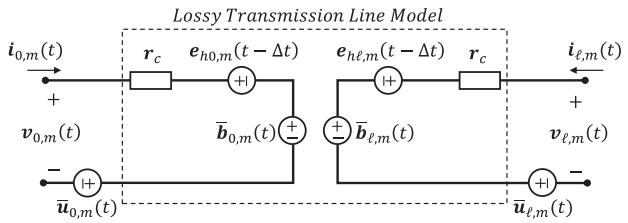  
Fig. 4. Time-domain representation of the lossy transmission line model of Fig. 3 in the modal domain.

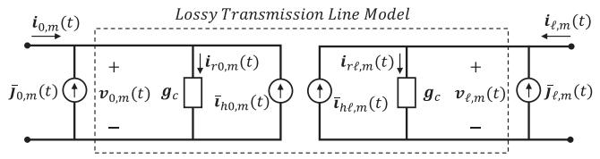  
Fig. 5. Lossy transmission line model represented as a Norton-type equivalent circuit with external independent current sources in the modal domain.

where $e _ { H 0 , m } ^ { i , n } ( t )$ is the element $( i , n )$ of the matrix $e _ { H 0 , m }$ , which ehas order $n _ { f } \times$ max $( [ N _ { p } ^ { 1 } , \ N _ { p } ^ { 2 } , \dots \ N _ { p } ^ { n _ { f } } ] )$ .

In (5)–(8), the constants $p _ { n } ^ { i }$ and $q _ { n } ^ { i }$ are calculated as [8]

$$
p _ {n} ^ {i} = \left(2 + a _ {n} ^ {i} \Delta t\right) / \left(2 - a _ {n} ^ {i} \Delta t\right), \tag {9}
$$

$$
q _ {n} ^ {i} = k _ {n} ^ {i} \Delta t / \left(2 - a _ {n} ^ {i} \Delta t\right). \tag {10}
$$

The solution of (3) using the recursive formula (5) allows the voltage drop across the characteristic impedance to be replaced by a voltage drop across $\mathbf { \nabla } _ { r _ { c } }$ in series with the voltage source $e _ { h 0 , m } ( t - \Delta t )$ . By following a similar procedure at the opposite eend of the line, the circuit of Fig. 3 can be represented in the time domain as shown in Fig. 4, where $\bar { \mathbf { u } } _ { 0 , m } ( t ) = \mathbf { { t } } _ { I } ^ { T } \bar { \mathbf { u } } _ { 0 } ( t )$ .

u t uTo perform the coupling of the Thévenin-type circuit of Fig. 4 with an EMT simulation tool, a transformation to a Norton-type circuit is required. This is made by multiplying $e _ { h 0 , m } ( t - \Delta t )$ , $\bar { b } _ { 0 , m } ( t )$ and $\bar { \mathbf { u } } _ { 0 , m } ( t )$ e(and their counterparts at the opposite line bend) by $\mathbf { \delta } _ { \mathbf { \delta } } g _ { c } = r _ { c } ^ { - 1 }$ , resulting in

$$
\bar {\boldsymbol {i}} _ {h 0, m} (t) = \boldsymbol {g} _ {c} \left[ \boldsymbol {e} _ {h 0, m} (t - \Delta t) + \bar {\boldsymbol {b}} _ {0, m} (t) \right], \tag {11a}
$$

$$
\bar {\boldsymbol {j}} _ {0, m} (t) = \boldsymbol {g} _ {c} \bar {\boldsymbol {u}} _ {0, m} (t). \tag {11b}
$$

The Norton-type equivalent of the circuit of Fig. 4 is then obtained as shown in Fig. 5. In this figure, the lossy transmission line model in the box corresponds to Marti’s model, whose internal variables are automatically solved within the EMT simulation tool without any action from the user. However, although this circuit is, in principle, equivalent to the one shown in Fig. 4, there is one fundamental difference stemming from the fact that the total current entering the line model of Fig. 4 is equal to $i _ { 0 , m } ( t )$ , whereas in the circuit of Fig. 5 the total icurrent entering the model is equal to $i _ { 0 , m } ( t ) + \bar { j } _ { 0 , m } ( t )$ . This i jhas serious implications when it comes to updating the recursive equation (5), which depends only on $\mathbf { \mathfrak { i } } _ { 0 , m } ( t )$ as shown in Fig. 4. iThe main consequence of this is that it is not possible to simply add the inducing current source $\bar { j } _ { 0 , m } ( t )$ externally to Marti’s jmodel available in the EMT-type simulation tool (and $\bar { j } _ { \ell , m } ( t )$

at the opposite side of the line) to calculate lightning-induced voltages unless a modification is performed on the inducing sources calculated with (11b). This is explained as follows.

First, instead of using (3) to calculate $e _ { 0 , m } ( t )$ as previously econsidered, the derivation above is repeated by calculating the modal voltage drop using the following equation

$$
\boldsymbol {e} _ {0, m} (t) = \boldsymbol {z} _ {c, m} (t) * \boldsymbol {i} _ {0, m} (t) + \boldsymbol {z} _ {c, m} (t) * \vec {\boldsymbol {j}} _ {0, m} (t), \tag {12}
$$

which, from the outset, compensates for the effect of the inducing current sources in the Norton-type equivalent circuit. Solving both convolutions in (12) as in (3), the following equation is obtained

$$
\begin{array}{l} \boldsymbol {e} _ {0, m} (t) = \boldsymbol {r} _ {c} \left[ \boldsymbol {i} _ {0, m} (t) + \bar {\boldsymbol {j}} _ {0, m} (t) \right] \\ + \boldsymbol {e} _ {h 0, m} (t - \Delta t) + \boldsymbol {e} _ {u 0, m} (t - \Delta t), \tag {13} \\ \end{array}
$$

where $e _ { u 0 , m } ( t - \Delta t )$ is a $n _ { f } \times 1$ vector containing the history eterms of ${ \bf j } _ { 0 , m } ( t )$ . Each line of (13) is calculated as

$$
e _ {u 0, m} ^ {i} (t) = \sum_ {n = 1} ^ {N _ {p} ^ {i}} p _ {n} ^ {i} e _ {U 0, m} ^ {i, n} (t) + \left[ \sum_ {n = 1} ^ {N _ {p} ^ {i}} q _ {n} ^ {i} \right] \bar {j} _ {0, m} ^ {i} (t), \tag {14}
$$

$$
\begin{array}{l} e _ {U 0, m} ^ {i, n} (t) = p _ {n} ^ {i} e _ {U 0, m} ^ {i, n} (t - \Delta t) \\ + q _ {n} ^ {i} \left[ \bar {j} _ {0, m} ^ {i} (t) + \bar {j} _ {0, m ^ {i}} \left(t - \Delta t\right) \right], \tag {15} \\ \end{array}
$$

where $e _ { U 0 , m } ^ { i , n } ( t )$ is the element (i, n) of the matrix $e _ { U 0 , m }$ , which has order $n _ { f } \times$ max $( [ N _ { p } ^ { 1 } , \ N _ { p } ^ { 2 } , \ . . . N _ { p } ^ { n _ { f } } ] )$ .

Equation (13) is a voltage drop across $\mathbf { \nabla } _ { \mathbf { r } _ { c } }$ in series with $e _ { h 0 , m } ( t - \Delta t ) + e _ { u 0 , m } ( t - \Delta t )$ r. Transforming this to a e eNorton-type equivalent circuit including the effect of $\bar { b } _ { 0 , m } ( t )$ , one can write

$$
\begin{array}{l} \overline {{\boldsymbol {i}}} _ {h 0, m} ^ {\prime} (t) = \boldsymbol {g} _ {c} [ \boldsymbol {e} _ {h 0, m} (t - \Delta t) \\ + \bar {\boldsymbol {b}} _ {0, m} (t) + \boldsymbol {e} _ {u 0, m} (t - \Delta t) ], \tag {16} \\ \end{array}
$$

$$
\overline {{\boldsymbol {i}}} _ {h 0, m} ^ {\prime} (t) = \overline {{\boldsymbol {i}}} _ {h 0, m} (t) + \boldsymbol {g} _ {c} \boldsymbol {e} _ {u 0, m} (t - \Delta t). \tag {17}
$$

By changing $\bar { \dot { \mathbf { \delta } } } _ { h 0 , m } ( t )$ to $\bar { i } _ { h 0 , m } ^ { \prime } ( t )$ in Fig. 5, it is straightforiward to show that

$$
\boldsymbol {v} _ {0, m} (t) = \boldsymbol {r} _ {c} \left[ \boldsymbol {i} _ {0, m} (t) + \bar {\boldsymbol {j}} _ {0, m} (t) + \bar {\boldsymbol {i}} _ {h 0, m} ^ {\prime} (t) \right]. \tag {18}
$$

Similarly, from Fig. 4 the voltage ${ \pmb v } _ { 0 , m } ( t )$ at the end of the line can be calculated as

$$
\begin{array}{l} \boldsymbol {v} _ {0, m} (t) = \boldsymbol {r} _ {c} \boldsymbol {i} _ {0, m} (t) + \boldsymbol {e} _ {u 0, m} (t - \Delta t) \\ + \bar {\boldsymbol {b}} _ {0, m} (t) + \bar {\boldsymbol {u}} _ {0, m} (t). \tag {19} \\ \end{array}
$$

Substituting (19) in (18),

$$
\begin{array}{l} \boldsymbol {r} _ {c} [ \boldsymbol {i} _ {0, m} (t) + \bar {\boldsymbol {j}} _ {0, m} (t) + \bar {\boldsymbol {i}} _ {h 0, m} ^ {\prime} (t) ] = \boldsymbol {r} _ {c} \boldsymbol {i} _ {0, m} (t) \\ + \boldsymbol {e} _ {u 0, m} (t - \Delta t) + \bar {\boldsymbol {b}} _ {0, m} (t) + \bar {\boldsymbol {u}} _ {0, m} (t). \tag {20} \\ \end{array}
$$

After simple manipulations and using (11a) and (17), equation (20) can be rewritten as

$$
\begin{array}{l} \boldsymbol {r} _ {c} \left[ \bar {\boldsymbol {j}} _ {0, m} (t) + \bar {\boldsymbol {i}} _ {h 0, m} (t) \right] + \boldsymbol {e} _ {u 0, m} (t - \Delta t) \\ = \boldsymbol {r} _ {c} \bar {\boldsymbol {i}} _ {h 0, m} (t) + \bar {\boldsymbol {u}} _ {0, m} (t). \tag {21} \\ \end{array}
$$

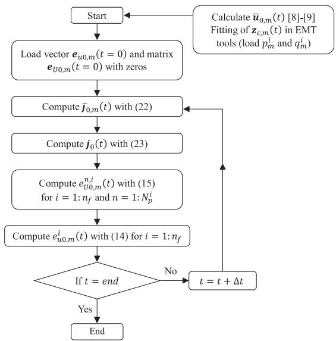  
Fig. 6. Flowchart of the model-domain solution algorithm using the poles and residues of the characteristic impedance $\scriptstyle { Z _ { c } }$ for $x = 0$ .

Finally, the correct equation for calculating $\bar { j } _ { 0 , m } ( t )$ is

$$
\bar {\boldsymbol {j}} _ {0, m} (t) = \boldsymbol {g} _ {c} \left[ \bar {\boldsymbol {u}} _ {0, m} (t) - \boldsymbol {e} _ {u 0, m} (t - \Delta t) \right]. \tag {22}
$$

In the phase domain, the inducing current source at the sending end of the line is finally given by

$$
\boldsymbol {j} _ {0} (t) = \boldsymbol {t} _ {I} \bar {\boldsymbol {j}} _ {0, m} (t). \tag {23}
$$

The proposed algorithm is shown in Fig. 6. This flowchart shows how the poles and residues obtained from the fitting of the characteristic impedance of the line, in the modal domain, can be used to determine the external current sources required for calculating lightning-induced voltages in Marti’s model using the EMD model. Although not shown, similar reasoning is used for calculating $j _ { \ell } ( t )$ , located at $x = \ell .$ Since the rational jfitting is now entirely obtained through the fitting tool that is linked with Marti’s model available in EMT simulation tools, the preprocessing required for the calculation of the inducing current sources is significantly simplified compared to previous versions of the model, which relied on the calculation and fitting of c [8]. This is the main contribution of this paper.

YOnce the inducing current sources are determined, they must be added externally to Marti’s model already available in EMT simulation tools such as ATP, EMTP and PSCAD as shown in Fig. 1. As the calculation of the current sources is independent of the terminal conditions of the line, once the sources are determined for a given lightning event, parametric studies considering different line terminations, including nonlinear loads, can be efficiently performed. The accuracy of the simulations will be limited only by the nature of the models and solution methods considered in the EMT simulator.

# IV. COMPUTED RESULTS

# A. Simulation Details

A computer code implemented by the authors to calculate the current sources ${ j _ { 0 } ( t ) }$ and $j _ { \ell } ( t )$ following the flowchart of Fig. 6 was used to test the validity of the proposed method. In this code, named EMD-ATP, the rational fitting of the model was entirely performed with the built-in fitting tool available in ATP, which is based on Bode’s asymptotical method [23]. The fitting was performed from 0.1 Hz to 10 MHz considering 20 points per decade. The lightning-induced voltage calculations were performed in ATP by connecting the inducing current sources to the external nodes of the illuminated line, which was modeled with Marti’s model available in the software.

To check the validity of the proposed method, both the extended-phase domain (EPD) model and the original EMD model based on the fitting of c [8], [9], [24] were taken as Yreference. The EPD and the original EMD models have been extensively validated through comparisons with lightning-induced voltages measured on both real distribution lines [24] and reduced-scaled distribution networks [9], [25]. Validation was also performed through comparisons with the finite-difference time-domain (FDTD) technique in [8] and with the LIOV code [3] in [9]. In theory, the EPD model is more general than the EMD model because it is developed directly in the phase-domain [8]. However, it is shown in [21] that the original EMD model based on the fitting of $Y _ { c }$ can reproduce the results Yobtained with the EPD model in most cases of practical interest, even for double-circuit and strongly asymmetric overhead line configurations, with or without shield wires, with the advantage of presenting reduced computational cost [8], [9]. For the validation of the proposed EMT-ATP model, the inducing current sources calculated with the original EMD model were added to the external nodes of the illuminated line modeled with Marti’s model in ATP, whereas the sources calculated with the EPD model were coupled to the ULM-ATP model proposed in [26]. All the fitting required in both models was performed with the vector fitting technique [16].

The per-unit-length parameters required for determining ${ j _ { 0 } ( t ) }$ and $j _ { \ell } ( t )$ were calculated as shown in the Appendix for j ja ground conductivity of 0.002 S/m, a DC resistance $( R _ { D C } )$ of 0.822 Ω/km, and a conductor radius $r = 8 . 5$ mm. Two line configurations were considered as presented in Sections IV-B and IV-C. In all cases, the transformation matrix was calculated at $f _ { 0 } = 1$ MHz by the fitting tool linked with Marti’s model in ATP. Tests with $f _ { 0 }$ spanning the range 1 kHz-500 kHz were also performed, but without any difference in the results. In fact, both line configurations meet the main requirement for the accurate use of Marti’s model, namely the relative symmetry in the spatial distribution of the conductors.

The incident lightning EM fields, including the influence of a lossy ground on the horizontal component of the electric field, were calculated with the Barbosa-Paulino expressions considering a ground relative permittivity of 10 [27]–[29]. The transmission line (TL) return-stroke model with a propagation speed of 150 m/μs was assumed. The sum of two Heidler [30] functions

TABLE I CHANNEL-BASE CURRENT PARAMETERS TYPICAL OF SUBSEQUENT STROKE CURRENTS MEASURED AT MOUNT SAN SALVATORE [31]   

<table><tr><td>Parameters</td><td>k=1</td><td>k=2</td></tr><tr><td>ik(kA)</td><td>10.7</td><td>6.5</td></tr><tr><td>τk,1(μs)</td><td>0.25</td><td>2.1</td></tr><tr><td>τk,2(μs)</td><td>2.5</td><td>230</td></tr><tr><td>nk</td><td>2</td><td>2</td></tr></table>

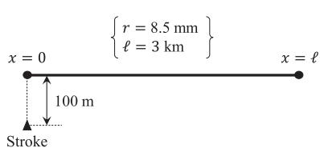  
(a)

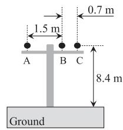  
  
Fig. 7. Simulated case considering a 3-phase distribution line. (a) Bird view of incidence; (b) line geometry.

TABLE II UNBALANCED LOAD   

<table><tr><td>Conductors</td><td>A</td><td>B</td><td>C</td></tr><tr><td>x=0</td><td>250 Ω</td><td>750 Ω</td><td>open</td></tr><tr><td>x=ℓ</td><td>open</td><td>250 Ω</td><td>750 Ω</td></tr></table>

(24) is used to model the channel-base current considering the parameters given in Table I.

$$
i (t) = \sum_ {k = 1} ^ {2} \frac {i _ {k}}{\eta_ {k}} \left[ 1 + \left(\frac {\tau_ {k , 1}}{t}\right) ^ {n _ {k}} \right] ^ {- 1} e ^ {- \left(\frac {t}{\tau_ {k , 2}}\right)},
$$

$$
\eta_ {k} = e ^ {- \left[ \frac {\tau_ {k , 1}}{\tau_ {k , 2}} \left(n _ {k} \frac {\tau_ {k , 2}}{\tau_ {k , 1}}\right) ^ {n _ {k}} \right]}. \tag {24}
$$

# B. Three-Phase Distribution Line

The first simulation case considers the 3-km long mediumvoltage distribution line illustrated in Fig. 7. The stroke location is 100 m far from the line end at $x = 0$ , as shown in Fig. 7(a). Two different load conditions were considered to evaluate the accuracy of the proposed method. In the first case, each conductor is connected to a resistance of 500 Ω at both ends. Since this value approaches the self-terms of the surge impedance $Z _ { 0 }$ of the Zline, shown in (25), the line is nearly matched. The second case considers a critical condition where multiple reflections take place due to the connection of unbalanced loads at the line ends (see Table II). The results are shown in Figs. 8 and 9 for the nearly matched line and for the unbalanced load condition, respectively. In the simulations, the EMD-ATP model was compared to the original EMD model and the EPD model. It is observed that all models lead to equivalent results, thus proving the accuracy of the proposed method.

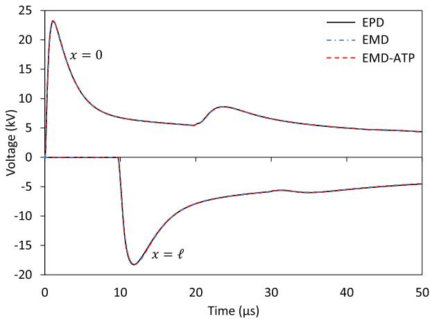  
Fig. 8. Lightning-induced voltages on phase B of the distribution line of Fig. 7 assuming resistive loads of 500 Ω at the line ends.

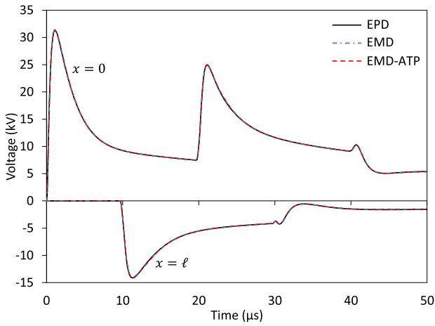  
Fig. 9. Lightning-induced voltages on phase B of the distribution line of Fig. 7 assuming unbalanced resistive loads at the line ends.

$$
\boldsymbol {Z} _ {0} = \left[ \begin{array}{l l l} 4 5 5 & 1 4 5 & 1 2 2 \\ 1 4 5 & 4 5 5 & 1 9 0 \\ 1 2 2 & 1 9 0 & 4 5 5 \end{array} \right] \Omega \tag {25}
$$

# C. Single-Phase Rural Distribution Line

The main advantage of calculating lightning-induced voltages in EMT-type simulation tools is the possibility to consider realistic line terminations such as transformers and surge arresters. To illustrate this point, a 1.2-km long single-phase distribution line used in rural areas in Brazil was implemented in ATP. The line, whose details are shown in Fig. 10, has the phase conductor at the top and a multi-grounded neutral at the bottom. Its left end was matched considering an infinitely long, non-illuminated line simulated with Marti’s model [11]. Its right end was terminated at a 10 kVA 7967/120-240 V single-phase distribution transformer. The neutral was grounded in intervals of 300 m with a grounding resistance of 50 Ω.

The wideband transformer model, proposed and validated in [32], is represented as an equivalent circuit that reproduces the

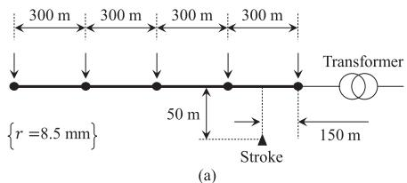

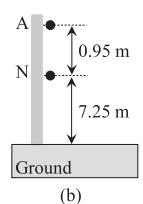  
Fig. 10. Rural distribution line. (a) Bird view of incidence; (b) Line geometry.

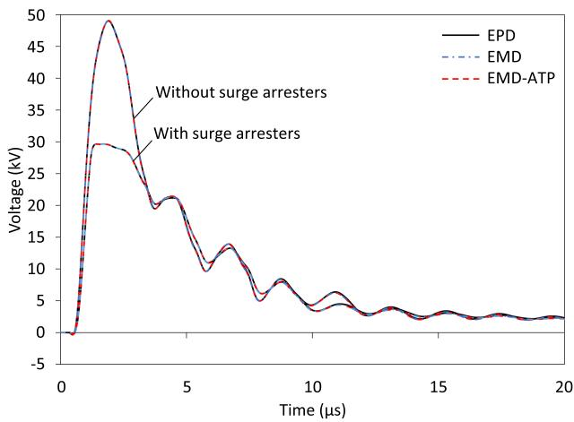  
Fig. 11. Phase-to-neutral voltages induced at the primary side of the transformer.

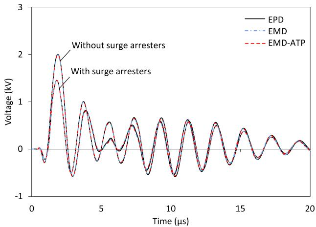  
Fig. 12. Phase-to-neutral voltages induced at the secondary side of the transformer.

frequency response of the transformer from 10 Hz to 10 MHz with great accuracy. In the analysis presented here, the no-load condition was assumed in the secondary side because this is the worst-case scenario in terms of transferred voltages [32]. In the simulations, the primary side was initially left unprotected. Later, it was protected by a 12 kV-class, gapless zinc-oxide surge arrester with residual voltage of 39.6 kV for a 10 kA (8/20 μs) impulse current, whose characteristics and modeling are described in [32].

The calculated phase-to-neutral voltages at the primary and secondary sides of the transformer are shown in Fig. 11 and

Fig. 12, respectively. In the simulations, the proposed EMD-ATP model is compared with the original EMD model and the EPD model. Despite the rich frequency content of the resulting voltage waveforms due to the resonant behavior of the transformer, the occurrence of multiple reflections in the multi-grounded neutral and the surge arrester actuation, both the EMD and EMD-ATP models behave equivalently to the more rigorous EPD model. This confirms not only the validity of the proposed solution strategy, but also the ability of the EMD model to simulate lightning-induced voltages on realistic distribution line configurations. Although not shown, equivalent model performances were also obtained for return-stroke locations and lightning current waveforms that differ from the ones considered in the case study, as well as different line geometries and characteristics.

In terms of the line response to the lightning overvoltages, it is observed in Fig. 11 that in the absence of the surge arrester the phase-to-neutral voltage at the primary side of the transformer reaches 50 kV. This value is below the 95 kV basic insulation level of the transformer, but it could be much higher depending on the lightning current characteristics and stroke location. On the other hand, if the arrester is installed at the primary side of the transformer, the phase-to-neutral voltage is effectively limited to 30 kV, which represents a 40% reduction. The voltages transferred to the secondary side of the transformer, shown in Fig. 12, present a damped oscillatory behavior either with or without arresters at the primary side. This is related to the resonant behavior of the transformer at higher frequencies [32]. However, the peak voltage transferred to the transformer secondary is reduced from 2 kV to 1.45 kV due to the action of the surge arrester at the primary side, which represents a 30% reduction.

# V. CONCLUSION

A new procedure for determining the external sources ${ j _ { 0 } ( t ) }$ and $j _ { \ell } ( t )$ jrequired for calculating lightning-induced voltages jwith Marti’s model available in EMT programs is proposed. The procedure, which is an update of the EMD model proposed by the authors in previous articles, is based on the fitting of the characteristic impedance of the line rather than the characteristic admittance required in the original model. This allows the rational fitting required for the calculation of ${ j _ { 0 } ( t ) }$ and $j _ { \ell } ( t )$ to j jbe entirely performed with the fitting tool usually linked with Marti’s model within the EMT program. This means that the user no longer needs to perform the per-unit-length parameter calculation and fitting of the line parameters externally, which considerably facilitates the use of the EMD model in the calculation of lightning-induced voltages in EMT-like simulation tools.

# APPENDIX

The per-unit-length impedance matrix is given by

$$
\boldsymbol {Z} = \boldsymbol {Z} _ {i n t} + \boldsymbol {Z} _ {e x t} + \boldsymbol {Z} _ {g n d}, \tag {A.1}
$$

where ${ Z _ { i n t } }$ is the internal impedance, $Z _ { e x t }$ is the external Zimpedance, and ${ \mathbf { } } Z _ { g n d }$ Zis the ground-return impedance ma-Ztrix, whose elements are calculated with (A.2), (A.3) [17] and

(A.4) [33], respectively.

$$
\begin{array}{c c} Z _ {i n t} ^ {i, j} = \frac {1}{2 \pi r _ {i}} \sqrt {\frac {s \mu_ {0}}{\sigma_ {i}}} \frac {I _ {0} \left(r _ {i} \sqrt {s \mu_ {0} \sigma_ {i}}\right)}{I _ {1} \left(r _ {i} \sqrt {s \mu_ {0} \sigma_ {i}}\right)} & \text {i f} i = j, \\ Z _ {i n t} ^ {i, j} = 0 & \text {i f} i \neq j. \end{array} \tag {A.2}
$$

$$
Z _ {e x t} ^ {i, j} = \frac {s \mu_ {0}}{2 \pi} \ln \left(\frac {2 h _ {i}}{r _ {i}}\right) \quad \text {i f} i = j, \tag {A.3}
$$

$$
Z _ {e x t} ^ {i, j} = \frac {s \mu_ {0}}{2 \pi} \ln \left(\frac {\sqrt {(h _ {i} + h _ {j}) ^ {2} + x _ {i , j} ^ {2}}}{\sqrt {(h _ {i} - h _ {j}) ^ {2} + x _ {i , j} ^ {2}}}\right) \quad \text {i f} i \neq j. \tag {A.3}
$$

$$
\begin{array}{l} Z _ {g n d} ^ {i, j} = \frac {s \mu_ {0}}{\pi} \int_ {0} ^ {\infty} \frac {e ^ {- 2 h _ {i} \lambda}}{\sqrt {\lambda^ {2} + s \mu_ {0} \sigma_ {g}} + \lambda} d \lambda \qquad \text {i f} i = j, \\ Z _ {g n d} ^ {i, j} = \frac {s \mu_ {0}}{\pi} \int_ {0} ^ {\infty} \frac {e ^ {- (h _ {i} + h _ {j}) \lambda}}{\sqrt {\lambda^ {2} + s \mu_ {0} \sigma_ {g} + \lambda}} \cos \left(x _ {i, j} \lambda\right) d \lambda \quad \text {i f} i \neq j. \tag {A.4} \\ \end{array}
$$

In equations (A.2)–(A.4), $\mu _ { 0 }$ is the vacuum permeability, $\sigma _ { i } = ( R _ { ( D C , i ) } \pi r _ { i } ^ { 2 } ) ^ { - 1 }$ is the conductor conductivity, $\sigma _ { g }$ is the ground conductivity, $I _ { 0 }$ and $I _ { 1 }$ are the modified Bessel functions of the first kind of orders 0 and $1 , r _ { i }$ is the conductor radius, $h _ { i }$ and $h _ { j }$ are the heights of conductors i and $j , x _ { i j }$ is the horizontal separation between conductors i and $j , s = 2 \pi f \sqrt { - 1 }$ , and f is the frequency.

The per-unit-length admittance is given by

$$
\mathbf {Y} = \left(s ^ {2} \mu_ {0} \epsilon_ {0}\right) \left(\mathbf {Z} _ {\text {e x t}}\right) ^ {- 1}, \tag {A.5}
$$

where $\epsilon _ { \mathrm { 0 } }$ is the vacuum permittivity.

# REFERENCES

[1] A. Araujo, J. Paulino, J. Silva, and H. Dommel, “Calculation of lightninginduced voltages with rusck’s method in EMTP: Part i: Comparison with measurements and agrawal’s coupling model,” Electric Power Syst. Res., vol. 60, no. 1, pp. 49–54, 2001.   
[2] H. Hoidalen, “Analytical formulation of lightning-induced voltages on multiconductor overhead lines above lossy ground,” IEEE Trans. Electromagn. Compat., vol. 45, no. 1, pp. 92–100, Feb. 2003.   
[3] A. Borghetti, J. Gutierrez, C. Nucci, M. Paolone, E. Petrache, and F. Rachidi, “Lightning-induced voltages on complex distribution systems: Models, advanced software tools and experimental validation,” J. Electrostatics, vol. 60, no. 2, pp. 163–174, 2004.   
[4] A. De Conti, F. H. Silveira, and S. Visacro, “On the role of transformer grounding and surge arresters on protecting loads from lightning-induced voltages in complex distribution networks,” Electric Power Syst. Res., vol. 113, pp. 204–212, 2014.   
[5] A. Andreotti, A. Pierno, and V. A. Rakov, “A new tool for calculation of lightning-induced voltages in power systems—part I: Development of circuit model,” IEEE Trans. Power Del., vol. 30, no. 1, pp. 326–333, Feb. 2015.   
[6] M. Brignone, F. Delfino, R. Procopio, M. Rossi, and F. Rachidi, “Evaluation of power system lightning performance, part I: Model and numerical solution using the PSCAD-EMTDC platform,” IEEE Trans. Electromagn. Compat., vol. 59, no. 1, pp. 137–145, Feb. 2017.   
[7] X. Liu, Z. Fan, G. Liang, and T. Wang, “Calculation of lightning induced overvoltages on overhead lines: Model and interface with MATLAB/Simulink,” IEEE Access, vol. 6, pp. 47308–47318, 2018.   
[8] A. De Conti and O. E. S. Leal, “Time-domain procedures for lightninginduced voltage calculation in electromagnetic transient simulators,” IEEE Trans. Power Del., vol. 36, no. 1, pp. 397–405, Feb. 2021.   
[9] O. E. S. Leal and A. De Conti, “Compact matrix formulation for calculating lightning-induced voltages on electromagnetic transient simulators,” IEEE Trans. Power Del., vol. 36, no. 4, pp. 1943–1951, Aug. 2021.   
[10] A. Morched, B. Gustavsen, and M. Tartibi, “A universal model for accurate calculation of electromagnetic transients on overhead lines and underground cables,” IEEE Trans. Power Del., vol. 14, no. 3, pp. 1032–1038, Jul. 1999.

[11] J. R. Marti, “Accurate modelling of frequency-dependent transmission lines in electromagnetic transient simulations,” IEEE Trans. Power App. Syst., vol. PAS- 101, no. 1, pp. 147–157, Jan. 1982.   
[12] E. S. Banuelos-Cabral, J. A. Gutierrez-Robles, and B. Gustavsen, Rational Fitting Techniques for the Modeling of Electric Power Components and Systems Using MATLAB Environment. Rijeka: IntechOpen, 2017.   
[13] ATP, “Alternative transients program, 2022.” [Online]. Available: www. eeug.org   
[14] EMTP, “Electromagnetic transients program,” 2022. [Online]. Available: www.emtp.com   
[15] PSCAD, “Systems computer aided design,” 2022. [Online]. Available: www.pscad.com   
[16] B. Gustavsen and A. Semlyen, “Rational approximation of frequency domain responses by vector fitting,” IEEE Trans. Power Del., vol. 14, no. 3, pp. 1052–1061, Jul. 1999.   
[17] C. R. Paul, Analysis of Multiconductor Transmission Lines, 2nd ed., Hoboken, NJ, USA: Wiley, 2007.   
[18] H. Dommel and B. P. Administration, Electromagnetic Transients Program: Reference Manual (EMTP Theory Book), vol. 1, Portland, OR, USA: Bonneville Power Administration, 1986.   
[19] L. Wedepohl, “Application of matrix methods to the solution of travellingwave phenomena in polyphase systems,” in Proc. Inst. Elect. Engineers, vol. 110, no. 12, pp. 2200–2212, 1963.   
[20] A. Fernandes and W. Neves, “Phase-domain transmission line models considering frequency-dependent transformation matrices,” IEEE Trans. Power Del., vol. 19, no. 2, pp. 708–714, Apr. 2004.   
[21] O. E. Leal and A. De Conti, “Evaluation of the extended modal-domain model in the calculation of lightning-induced voltages on parallel and double-circuit distribution line configurations,” Electric Power Syst. Res., vol. 194, 2021, Art. no. 107100.   
[22] A. Semlyen and A. Dabuleanu, “Fast and accurate switching transient calculations on transmission lines with ground return using recursive convolutions,” IEEE Trans. Power App. Syst., vol. 94, no. 2, pp. 561–571, Mar. 1975.   
[23] EMTP Leuven Center, Altern. Transients Prog. (ATP): Rule Book. Leuven EMTP Center, 1992.   
[24] A. De Conti, O. E. Leal, and A. C. Silva, “Lightning-induced voltage analysis on a three-phase compact distribution line considering different line models,” Electric Power Syst. Res., vol. 187, 2020, Art. no. 106429.   
[25] A. Piantini, J. M. Janiszewski, A. Borghetti, C. A. Nucci, and M. Paolone, “A scale model for the study of the LEMP response of complex power distribution networks,” IEEE Trans. Power Del., vol. 22, no. 1, pp. 710– 720, Jan. 2007.   
[26] F. O. Zanon, O. E. Leal, and A. De Conti, “Implementation of the universal line model in the alternative transients program,” Electric Power Syst. Res., vol. 197, 2021, Art. no. 107311.   
[27] C. F. Barbosa and J. O. S. Paulino, “An approximate time-domain formula for the calculation of the horizontal electric field from lightning,” IEEE Trans. Electromagn. Compat., vol. 49, no. 3, pp. 593–601, Aug. 2007.   
[28] J. O. S. Paulino, C. F. Barbosa, I. J. da Silva Lopes, and G. C. de Miranda, “Time-domain analysis of rocket-triggered lightning-induced surges on an overhead line,” IEEE Trans. Electromagn. Compat., vol. 51, no. 3, pp. 725–732, Aug. 2009.   
[29] C. F. Barbosa and J. O. S. Paulino, “A time-domain formula for the horizontal electric field at the earth surface in the vicinity of lightning,” IEEE Trans. Electromagn. Compat., vol. 52, no. 3, pp. 640–645, Aug. 2010.   
[30] F. Heidler, “Traveling current source model for LEMP calculation,” in Proc. 6th Int. Zurich Symp. Tech. Exhib. Electromagn. Compat., 1985, pp. 157–162.   
[31] A. De Conti and S. Visacro, “Analytical representation of single- and double-peaked lightning current waveforms,” IEEE Trans. Electromagn. Compat., vol. 49, no. 2, pp. 448–451, May 2007.   
[32] A. De Conti, V. C. Oliveira, P. R. Rodrigues, F. H. Silveira, J. L. Silvino, and R. Alipio, “Effect of a lossy dispersive ground on lightning overvoltages transferred to the low-voltage side of a single-phase distribution transformer,” Electric Power Syst. Res., vol. 153, pp. 104–110, 2017.   
[33] J. R. Carson, “Wave propagation in overhead wires with ground return,” Bell Syst. Tech. J., vol. 5, no. 4, pp. 539–554, 1926.

Osis E. S. Leal was born in São Francisco, Brazil, on August 29, 1985. He received the Degree in electrical engineering from the Faculty of Exact and Technological Sciences Santo Agostinho, Montes Claros, Brazil, in 2010, and the M.Sc. and Dr.Sc. degrees in electrical engineering from the Federal University of Minas Gerais, Belo Horizonte, Brazil, in 2013 and 2020, respectively. In 2013, he joined the Federal University of Technology – Parana (UTFPR), Pato Branco, Brazil, as Professor and Researcher. His research interests include lightning phenomena, elec-

tromagnetic compatibility, electromagnetic transients, and modeling of power system components for high-frequency phenomena.

Alberto De Conti (Senior Member, IEEE) was born in Belo Horizonte, Brazil, on August 3, 1975. He received the doctoral degree in electrical engineering from the Federal University of Minas Gerais (UFMG), Belo Horizonte, Brazil, in 2006. In the same year, he was a Guest Researcher in the Division for Electricity and Lightning Research, Uppsala University, Uppsala, Sweden. He is currently an Associate Professor with the Department of Electrical Engineering, UFMG. He is the main author of two book chapters published by the IET and also the

author or coauthor of more than 170 scientific papers published in reviewed journals and presented at international conferences. His research interests include electromagnetic transients, modeling of power system components for high-frequency phenomena, lightning and electromagnetic compatibility. He is a Member of the CIGRE working groups C4.57 Guidelines for the Estimation of Overhead Distribution Line Lightning Performance and Its Application to Lightning Protection Design (of which he is also secretary) and C4.67 Lightning Protection of Hybrid Overhead Lines.