# Analytical model building for Type-3 wind farm subsynchronous oscillation analysis

Lingling Fan *,1 , Zhixin Miao

Dept. of Electrical Engineering, University of South Florida, Tampa FL 33620

# A R T I C L E I N F O

Keywords:

Type-3 wind

Phase-locked-loop

Subsynchronous resonances

Dynamic modeling

# A B S T R A C T

Many real-world scenarios confirmed insights developed based on the dq-frame nonlinear analytical model for doubly-fed induction generator (DFIG)-based type-3 wind subsynchronous resonance (SSR) study by the authors in 2010. A few real-world observations do not align with the simulation results from that model. In real-world scenarios, when a type-3 wind farm is radially connected to a series compensated line, even at a low compensation level, SSR occurs. This phenomenon has not been replicated by the nonlinear analytical model. In this paper, we revisited the analytical model by including phase-locked-loop (PLL). A modular modeling approach is presented in this paper. The inputs and outputs of each subsystem and the interconnections among subsystems are identified first. The overall system is then developed with all blocks integrated. The analytical model is capable of dealing with various transmission topologies, providing both large-signal time-domain simulation results and small-signal analysis. The new analytical model can successfully replicate the aforementioned phenomena and provide insights of type-3 wind SSR phenomena. The accompanying software package will be posted in the public domain.

# 1. Introduction

# 1.1. Type-3 wind farm SSR events and lessons learnt

The first type-3 wind farm SSR occurred in 2007 in Minnesota. This type of events occurred later in Texas (2009), China (2012-2013), and Texas (2017). The phenomena have caused great interest to the industry and an IEE PES task force wind SSO has been formed. The task force report on real-world events and industry screening practice was published in PES resource center in July 2020 [1].

The analytical state-space model developed in 2010 for type-3 wind connected to a series compensated transmission line [2] has successfully identified the following facts: (i) SSR is not related to torsional interaction, rather related to doubly fed induction generators (DFIGs)’ electromagnetic circuits and converter controls; (ii) operating at lower wind speed may make SSR worse; and (iii) reducing the gain of rotor side converter (RSC) current control is better for SSR stability. The above three points have been validated by real-world type-3 wind SSR (in north China) event data analysis [3,4].

It is recognized first in [2] and also by the industry that torsional

interaction is not the issue. [2] has modeled the shaft system as a two-mass system. Based on the particular parameters of wind turbines, the torsional modes have low frequencies, e.g., 1.8 Hz [5]. To have torsional interactions, the LC resonant frequency in the electric network should be more than 50 Hz for a 60 Hz ac system, which is not realistic. In most cases, every line has 50% series compensation level. The net compensation level for an equivalent circuit is much less than 50%. In real-world, wind farm SSR frequencies in currents are observed as 9-13 Hz (2007, Minnesota), 20-30 Hz (2009, Texas), 6-8 Hz (2012-2013, China), and 20-30 Hz (2017, Texas).

# 1.2. DQ-frame analytical modeling approach versus the other modeling approaches

The nonlinear analytical state-space model in [2] is built in dq-frames and all state variables assume constant values at steady state. This feature makes obtaining small-signal models at various operating conditions through numerical perturbation possible.

The other most popular modeling approaches are (i) nonlinear modeling based on stationary reference frame and (ii) frequency-domain or Laplace-domain impedance modeling approach. In the first category,

# Nomenclature

$d q ^ { g } , d q ^ { \mathrm { P L L } }$ The two dq-frames: one based on the grid voltage, the other based on PLL.   
$i _ { s } , i _ { r } , i _ { g }$ DFIG’s instantaneous stator current, rotor current and grid-side converter current.   
$R _ { 1 } , L _ { 1 } , C _ { 1 }$ The resistance, inductance, and capacitance of a series compensated line.   
$R _ { 2 } , L _ { 2 }$ The resistance, inductance of a non-compensated line.   
$R _ { g } , L _ { g }$ The grid-side converter (GSC) filter’s resistance and inductance.   
vPCC,vc,v∞,i1,i2 AC network instantaneous voltage at the point of common coupling (PCC), series capacitor voltage, grid voltage, RLC circuit current, and the RL circuit current.   
$V _ { \mathrm { D C } }$ DFIG’s dc-link voltage.   
$T _ { m } , T _ { e m }$ DFIG’s mechanical torque and electromagnetic torque.   
$V _ { \mathrm { P L L } } , \theta$ The PCC bus voltage magnitude and angle measured by the PLL.   
$i _ { n } , i _ { w }$ The total current going to the transmission line and the total current from the wind farm.   
$\overline { { I } } _ { n } , \overline { { I } } _ { w }$ The above two currents in complex form in the grid dq-frame.   
$\bar { I } _ { g } , \bar { I } _ { r }$ The GSC current and the rotor-side converter (RSC) current in complex form in the grid dq-frame.   
$\overline { I } _ { g } ^ { ' } , \overline { I } _ { r } ^ { ' }$ The GSC current and the RSC current in complex form in the PLL dq-frame.   
$\overline { { V } } _ { \mathrm { P C C } } , \overline { { V } } _ { g } , \overline { { V } } _ { r }$ The PCC voltage, GSC voltage and RSC voltage in complex form in the grid dq-frame.   
$\overline { { V } } _ { g } ^ { ' } , \overline { { V } } _ { r } ^ { ' }$ The GSC voltage and the RSC voltage in complex form in the PLL dq-frame.   
$P _ { r } , P _ { g }$ Instantaneous power generated by the RSC and the GSC.   
$Q _ { s }$ Reactive power measured at the stator side of a DFIG with a direction from the machine to the grid.   
$i _ { g d } , i _ { g q } , i _ { g d } ^ { * } , i _ { g q } ^ { * }$ GSC’s exporting current in the PLL dq-frame and their orders.   
$i _ { r d } , i _ { r q } , i _ { r d } ^ { * } , i _ { r q } ^ { * }$ RSC’s exporting current in the PLL dq-frame and their orders.

models presented in electromagnetic transient simulation (EMT) packages, e.g., PSCAD, EMTP, MATLAB/SimScape, are all based on stationary reference frame. Take the example of the Wind Farm - DFIG Average Model in MATLAB/SimScape contributed by Richard Gagnon [6] and a recent paper on type-4 wind turbine modeling [7], three-phase instantaneous currents and voltages of ac circuits are treated as state variables. The DFIG average model is adopted in [8] by the authors to replicate three 2017 Texas wind SSR events.

In the second category, impedance or admittance modeling approach, e.g., [9–11], is essentially a modular linear modeling approach. Each component is modeled as a linear system, e.g., circuit, PLL. The linear modeling blocks are then assembled together to have a system model. This approach has been popularly adopted in power electronic converter modeling, analysis, and control.

EMT models in stationary frame are for time-domain simulation. Direct Jacobian linearlization through numerical perturbation is not possible. Impedance or admittance models are for small-signal analysis only. The models are not suitable for large-signal simulation or analysis. In addition, modal analysis based on impedance model can only reflect participation factor to every node. It is not granulate enough to examine each state variable’s participation on an oscillation mode.

Thus, it is obvious that dq-frame models are capable of not only large-signal analysis but also small-signal analysis. A major challenge of

dq-frame modeling is to represent every block in a unified dq-frame. Take the case of DFIG, it is well known that both the stator and the rotor should be modeled in the same reference frame. For that reason, the rotor circuit model in its nature reference frame (the rotor) needs to be first converted to the stator dq-frame. Due to its enticing feature, dq-frame based modeling technique has been adopted by DIgSILENT, as shown in the 2007 report [12].

# 1.3. Motivation to revisit the model

There are a few real-world observations not agreeing with the simulation results from the dq-frame model developed in [2]. Analysis based on the model developed in [2] indicates that SSR will happen when series compensation reaches at certain level. The case studies in [2] show that SSR happens at 75% compensation level, while at 50% compensation level, the oscillation mode has adequate damping. In real-world scenarios, SSR occurs as long as a type-3 wind farm is radially connected to a series compensated line according to [4,13]. In the SSR incidents occurring in north China in 2013, the equivalent compensation level of the line is less than 10% [4] and the frequency of SSR oscillations is about 8 Hz. This phenomenon has not been replicated by the analytical model.

The reason of the discrepancy is that the dq-frame model in [2] does not consider PLL dynamics. It is later known by the grid industry that PLL plays an important role in weak grid stability of inverter-based resources. For example, in 2019, WECC indicated that PLL was added in the second generation of renewable energy models for positive-sequence simulation [14].

Indeed, in FACTS and HVDC research conducted in 2000s, PLL dynamics have already been included in linear state-space model building, e.g., [15,16].

In the authors’ research on type-4 wind modeling for weak grid analysis [17,18], PLL dynamics are modeled in dq-frame models. PLL has shown to influence stability margin and oscillation frequency. Indeed, a quick search of the literature indicates that PLL has not been included in majority of the type-3 wind turbine models for SSR studies, e.g., [9,19–21]. The exceptions are the research carried out in [10,11] on impedance of type-3 wind and research in [8,22] on type-3 wind farm SSR and damping control design. Research in [10] indicates that including PLL dynamics changes the impedance Bode plots. Both [10, 11] adopt impedance-based linear modeling approach. Both [8,22] adopt MATLAB/SimScape for abc-frame EMT simulation where PLL is included. [22] also presents eigenvalue analysis. However, it does not include the details of the dq-frame models which the authors developed to generate eigenvalue plots. Hence, it is difficult to comprehend if PLL dynamic is modeled.

In addition, in real-world planning, it has also been found that more wind farms online can cause the system more vulnerable to SSR. However, in certain occasions, a system with more wind turbines is stable while less number of wind turbines has SSR issue [23]. This phenomenon needs further investigation. Finally, analysis conducted in [2,24] is limited to a wind farm connected to a radial RLC line. Real-world SSR assessment usually deals with various transmission topologies.

The aforementioned concerns require a more accurate dq-frame model by including PLL dynamics and a scalable modeling framework design. It has to be noted that including PLL dynamics is not a trivial task. For a DFIG, if the ac circuits are all modeled in a dq-frame (grid frame), there exist two other frames that the RSC control is based upon and the GSC control is based upon. Both frames are dependent on the angle output from the PLL. Thus, a challenge in modeling is to accurately reflect the PLL angle in various dq-frame conversion.

# 1.4. Contributions and paper structure

The first contribution of this paper is offering an accurate dq-frame model for type-3 wind farm subsynchronous oscillation replication and

analysis and a scalable modeling framework.

The second contribution is offering the readers a critical model building technique. In our opinion, the most critical technique of model building is not coding differential equations, rather defining the interconnecting relationship of modular blocks. A highlight of this paper is the modeling block diagram (see Fig. 2). Each block will have input and output identified with its internal differential equation defined. The overall system is built upon all the blocks with correct interconnections specified. This type of block diagrams can be easily implemented in MATLAB/Simulink.

We revisited the analytical model built in [2] and refined the dynamic model by including PLL and various transmission system topologies. The key modeling challenge of utilizing a unified dq-frame is tackled in this paper by adopting two dq-frames and making conversions between the two frames. The analytical model is state-space based and suitable for linearization. The model building procedure is reflected in a modeling block diagram consisting of eight blocks. The modular modeling approach adopted in this paper can greatly shorten the model developing time and can be used for modeling other dynamic systems. The new analytical model can successfully replicate the aforementioned phenomena. In addition, the MATLAB/Simulink package will be shared with the research community and posted in Github.

The dynamic model is presented in Section 2. The initialization procedure for the dynamic model to have a flat run is presented in Section 3. Applications are presented in Section 4 to examine the analytical model’s capability in providing eigenvalue-based analysis related to type-3 wind in weak grids and type-3 wind with a series compensated network. Section 5 presents intriguing discussion on the case of type-4 wind in a series compensated network. Section 6 concludes the paper.

# 2. DQ-frame dynamic model

Consider a 200 MW type-3 wind farm connected to a network with two parallel transmission lines as shown in Fig. 1. One of the lines has series compensation. At the point of common coupling (PCC), a shunt capacitor is connected to provide 0.1 per unit (pu) reactive power. Parameters of the system are based on the type-3 wind farm demo system in MATLAB/SimScape [6].

The system can be modeled by eight main blocks, including DC-link capacitor, GSC control, RSC control, transmission network, GSC filter, DFIG, and the shunt capacitor, along with four dq-frame conversion blocks, as shown in Fig. 2. Wind turbine’s mechanical dynamics are ignored and a constant mechanical torque is assumed to drive the induction machine. To arrive at a nonlinear model suitable for linearization, dq-frame based modeling is used. In this paper, we assume that the grid frame has its q-axis aligned with the grid voltage space vector and the d-axis lags q-axis by 90∘ . This convention of dq-frame is the same as

that used in the classic machine textbook [25].

While the circuit models, e.g., transmission network, GSC filter and DFIG, are based on the grid frame, the wind converter controls are based on a dq-frame aligned to the PCC voltage. The angle of the PCC voltage is obtained from PLL. Hence, the RSC and GSC are all based on the PLL frame or the converter frame. To ignore the PLL dynamics in the modeling process, we may treat the PLL frame and the dq-frame either as the same or shifted by a constant angle which is the phase angle difference between the steady-state PCC voltage and the dq-frame.

# 2.1. Transmission network dynamics

The transmission network block has the PCC voltage as the input and the output is the sum of currents flowing on two lines.

The dynamic model in abc-frame for the RLC circuit and the RL circuit is expressed as follows.

$$
\begin{array}{l} R _ {1} i _ {1} + L _ {1} \frac {d i _ {1}}{d t} + v _ {c} = v _ {\mathrm {P C C}} - v _ {\infty}, C _ {1} \frac {d v _ {c}}{d t} = i _ {1} \\ R _ {2} i _ {2} + L _ {2} \frac {d i _ {2}}{d t} = v _ {\mathrm {P C C}} - v _ {\infty} \\ \end{array}
$$

In the grid dq-frame, the dynamic model of the transmission network is expressed as follows.

$$
L _ {1} \frac {d \bar {I} _ {1}}{d t} = \bar {V} _ {\mathrm {P C C}} - \bar {V} _ {c} - R _ {1} \bar {I} _ {1} - j \omega L _ {1} \bar {I} _ {1} - V _ {\infty}
$$

$$
C _ {1} \frac {d \bar {V} _ {c}}{d t} = \bar {I} _ {1} - j \omega C _ {1} \bar {V} _ {c} \tag {1}
$$

$$
L _ {2} \frac {d \bar {I} _ {2}}{d t} = \bar {V} _ {\mathrm {P C C}} - R _ {2} \bar {I} _ {2} - j \omega L _ {2} \bar {I} _ {2} - V _ {\infty}
$$

where ω is the fundamental component frequency or 377 rad $/ s ,$ the overline notates the complex vector in the dq-frame and $\overline { { F } } = f _ { q } - j f _ { d } . \mathrm { A } 6 \cdot$ - order dynamic model in real-domain can be obtained from (1).

# 2.2. GSC filter and GSC control

The GSC filter block has the GSC output current $i _ { g , q }$ and $i _ { g , d }$ as state variables and output. Its inputs are the PCC voltage $\overline { { V } } _ { \mathrm { P C C } }$ after conversion to the PLL frame and the GSC converter voltage $\nu _ { g , q }$ and $\nu _ { g , d }$ or its complex form $\overline { { V } } _ { g }$ . In complex vector form, the dynamic model of the GSC filter is as follows.

$$
R _ {g} \bar {I} _ {g} + L _ {g} \frac {d \bar {I} _ {g}}{d t} + j X _ {g} \bar {I} _ {g} = \bar {V} _ {g} - \bar {V} _ {\mathrm {P C C}} e ^ {- j \Delta \theta} \tag {2}
$$

where $X _ { g } = \omega L _ { g }$ and Δθ is the angle of the PCC voltage (θ) relative to the grid voltage angle (ωt) measured by the PLL.

All variables are based on the PLL frame. Other output is the real

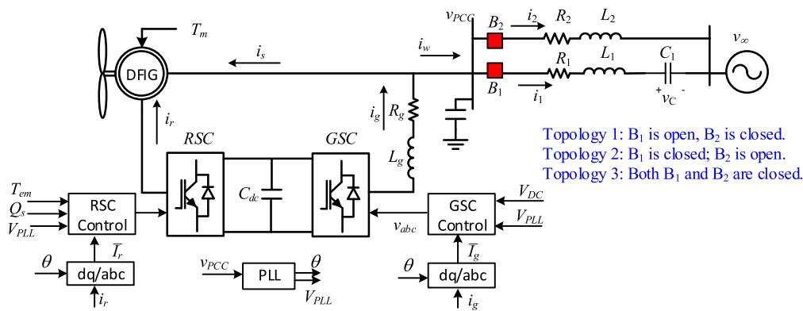  
Fig. 1. Type-3 wind farm connected to a transmission network. Topology 1: The wind farm is connected to the RL circuit only. Topology 2: The wind farm is connected to the RLC circuit only. Topology 3: The wind farm is connected to both lines.

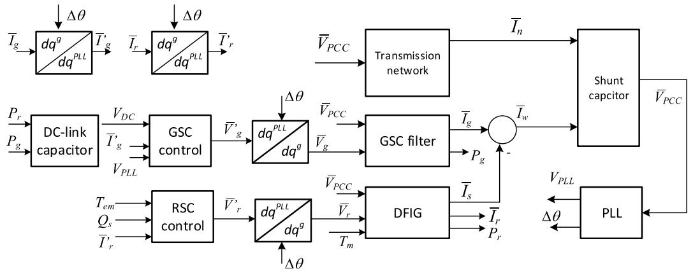  
Fig. 2. Dq-frame analytical modeling block diagram.

power delivered by the GSC $P _ { g } .$ . This variable will be used as the input to the dc-link dynamic block.

The GSC control block’s output is the GSC voltage $\nu _ { g , q }$ and $\nu _ { g , d } .$ . The converter control is presented in Fig. 3. GSC control consists of inner current control and outer dc-link voltage/ac voltage control. For the inner current control, current coupling and PCC voltage feedforward have been considered. For the GSC control block, the inputs include the GSC current $i _ { g , q }$ and $i _ { g , d } ,$ PCC voltage magnitude measured by the PLL $V _ { \mathrm { P L L } } ,$ and the dc-link voltage $V _ { \mathrm { D C } }$ .

Total there are 4 states for the GSC control block and 2 states for the GSC filter. The PI controller parameters are (0.6, 8) for the current controllers consisting of the proportional gain and the integral gain, (8, 400) for the dc-link voltage controller, (0.02, 20) for the ac voltage controller. The reactance of the filter is 0.3 pu and the resistance is ignored.

# 2.3. DFIG block and RSC control

Machine electromagnetic dynamics and electromechanical dynamics are included in the DFIG block. Details regarding the machine electromagnetic dynamics can be found in [2] and Chapters 2 and 3 of [26]. The DFIG block has the PCC voltage and the RSC converter voltage as inputs. Its outputs include the stator current $\overline { { I } } _ { s }$ and the rotor current ${ \overline { { I } } } _ { r } .$ . Real power delivered by the RSC $P _ { r }$ can also be an output. The states include the stator current, the rotor current, and the rotor speed. Total, there are 5 states for the DFIG block.

It is recognized first by the authors in 2010 [2] and later by the industry that torsional interaction is not an issue for wind turbines. Indeed, In [2], the shaft system as a two-mass system. Based on the typical parameters of wind turbines, the torsional modes have low frequencies (less than 5 Hz). Reference [5] indicates the natural wind turbine shaft frequency is 1.8 Hz. The main findings of [2], e.g., the

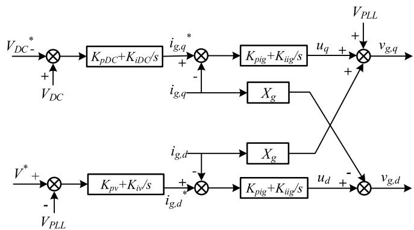  
Fig. 3. GSC control.

phenomenon is contributed largely electric network and converter controls, rather than torsional interaction, have been confirmed via event data analysis 58 SSR events occurred in China [4]. Thus, in this paper, we treat the torsional mass as a single mass. On the other hand, we can easily replace the torsional mass as a double mass in the modeling framework.

The RSC control block’s output is the RSC converter voltage $\nu _ { r , q }$ and $\nu _ { r , d } .$ The RSC control has an inner current control loop and the output loops for torque and reactive power control, as shown in Fig. 4. For the inner current control, the cross coupling and feedforward terms are all ignored. Those terms can either be considered or ignored. In [27], the cross coupling and feedforward terms are ignored. In [28], those cross coupling and feedforward terms exist and the cross coupling terms are related to the machine slip. For wind RSC control, considering cross coupling and feedforward terms makes the inner current control more complicated. Hence, in this paper, we ignore those terms.

As a total, there are four states for the RSC control block. The parameters of the DFIG are based on the Matlab/SimPowerSystems Type-3 wind farm testbed. The current controller parameters are (0.6, 8) for the proportional and integral gains. The torque controller’s parameters are (0.02, 20) and the reactive power controller’s parameters are (0.83, 5).

# 2.4. DC-link dynamics

This block has the dc-link capacitor dynamics modeled. The inputs are the RSC power $P _ { r }$ and GSC power $P _ { g } .$ . The output is the dc-link voltage. The per unit system model has been developed in [18] and is used in this paper.

$$
\frac {C V _ {\text {b a s e} , \mathrm {D C}} ^ {2}}{2 P _ {\text {b a s e}}} \frac {d V _ {\mathrm {D C}} ^ {2 \mathrm {p u}}}{d t} = - P _ {r} ^ {\mathrm {p u}} - P _ {g} ^ {\mathrm {p u}} \tag {3}
$$

where $P _ { r }$ is the active power leaving the RSC to the DFIG’s rotor circuit, $P _ { g }$ is the active power leaving the GSC to the grid. $V _ { \mathrm { D C } }$ is the dc-link voltage. Superscript “pu” notates per unit variables. The parameter τ = CV2base,DC $\frac { C V _ { \mathrm { b a s e , D C } } ^ { 2 } } { 2 P _ { \mathrm { b a s e } } } \left( 0 . 0 0 3 3 \right)$ is computed based on the parameters of a 2 MW type-3 wind from MATLAB/Scape: nominal dc link voltage 1150 V, capacitor

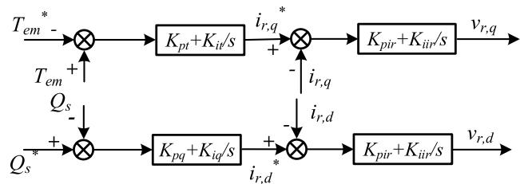  
Fig. 4. RSC control.

size 0.01 F. In this paper, per unit system is adopted. The superscript $\ " \mathrm { p u } ^ { \prime \ }$ is omitted in the other parts of the paper.

# 2.5. PLL

A second-order PLL model is adopted in this paper. The original block diagram of the PLL consisting of abc to dq conversion is shown in Fig. 5(a). Fig. 5(b) presents the PLL model in dq-frames. The latter is adopted in this paper for analytical model development. Note for PLL, the dq-frame has the q-axis leading the d-axis by 90∘ and the d-axis aligned with the PCC voltage space vector at steady-state.

The PLL parameters are (60, 1400) for the proportional and integral gains.

# 2.6. PCC shunt capacitor

This block models the shunt capacitor dynamics. Inputs include the stator dq-current $( \overline { { I } } _ { s } ) _ { : }$ , the GSC output currents $( { \bar { I } } _ { g } ) _ { : }$ , and the total currents injected to the transmission network $( { \bar { I } } _ { n } ) .$ The dynamic model of the shunt capacitor in the grid dq-frame is as follows.

$$
C \frac {d \bar {V} _ {\mathrm {P C C}}}{d t} + j \omega C \bar {V} _ {\mathrm {P C C}} = \bar {I} _ {w} e ^ {j \Delta \theta} - \bar {I} _ {n}. \tag {4}
$$

where $\overline { { I } } _ { w }$ is the total current from the wind farm and $\overline { { I } } _ { w } = \overline { { I } } _ { g } - \overline { { I } } _ { s }$ and ${ \overline { { I } } } _ { n }$ is the total network current. In this paper, we consider three topologies.

Topology $1 \colon \overline { { I } } _ { n } = \overline { { I } } _ { 2 } $ , i.e., the wind farm is connected to an RL circuit. Topology $2 \colon \overline { { I } } _ { n } = \overline { { I } } _ { 1 }$ , i.e., the wind farm is connected to an RLC circuit. Topology $3 \colon \bar { I } _ { n } = \bar { I } _ { 1 } + \bar { I } _ { 2 } ;$ , i.e., the wind farm is connected to the parallel RL and RLC circuits.

# 3. Initialization

The dynamic model presented in Section 2 has a total of 26 states (including 6 states for the transmission network, 6 states for the GSC filter and control blocks, 9 states for the DFIG and RSC control blocks, 1 state for the dc-link dynamics, 2 states for the PLL, and 2 states for the shunt capacitor dynamics) and 4 control commands (including two commands for the GSC control, two commands for the RSC control). To obtain a linear model based on an operating condition, the state variables and the control commands should be set properly through an initialization procedure.

Assume that the PCC voltage $V _ { \mathrm { P C C } } ,$ , wind speed, machine rotating speed $\omega _ { m }$ and wind power to the grid $P _ { \mathrm { P C C } }$ are given. The state variables will be computed.

For the transmission network, the PCC bus can be viewed as a PV bus. The phase angle of the PCC bus $\Delta \theta _ { \mathrm { P C C } }$ can be found by solving a load flow problem. This angle is the initial setting of the PLL integrator unit. Further the line currents and capacitor voltage can be found using

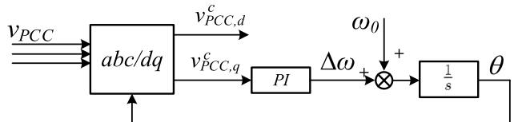  
(a)

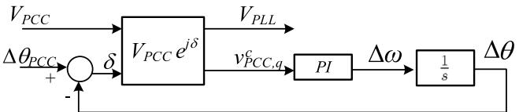  
(b)   
Fig. 5. Block diagrams of a PLL. (a) Original PLL.(b) PLL in dq-frames. Superscript c notates converter frame.

phasor-based circuit analysis. With the load flow problem solved, the reactive power injection to the transmission network can also be found.

The reactive power injected from the shunt capacitor is $B _ { c } V _ { \mathrm { P C C } } ^ { 2 } .$ . Assuming that the reactive power delivered from the GSC to the PCC bus is $^ { 0 , }$ we can then find the reactive power delivered from the stator to the PCC bus $Q _ { s }$ .

P is the total power delivered from the stator and the GSC. An estimation of the GSC power $P _ { g }$ can be quickly made by using the fact that the power delivered by the RSC to the rotor equals to the power from the grid to the GSC: $P _ { \mathrm { { g } } } = - P _ { r } = - s P _ { s } $ , where s is the slip and $P _ { s }$ is the real power consumed by the machine. Here the motor convention is used for the machine. Hence the default direction of stator current is from the grid to the machine stator winding. The default power is power consumption by the machine.

With the above estimation, $P _ { s }$ can be estimated. Given $P _ { s } , Q _ { s }$ and the PCC voltage, the stator current of the machine is found. By analyzing the steady-state induction machine circuit, the rotor curren $\cdot \bar { I } _ { r }$ and the rotor voltage $\overline { { V } } _ { r }$ can all be found. With these two phasors found, the real power delivered from the RSC to the rotor circuit $P _ { r }$ is found. Since $P _ { g } =$ − $\boldsymbol { \cdot } \boldsymbol { P _ { r } }$ if converter switching loss is ignored, the GSC output power is found.

The GSC voltage can be found by solving another load flow problem. Here the GSC is a PV node while the PCC bus is the slack bus with its voltage given and phase angle known. In turn, the real and reactive power delivered from GSC to the PCC bus are all found. $P _ { s }$ and $Q _ { s }$ should be re-computed and another round of calculation can be conducted.

This iteration procedure after converging will lead to accurate stator current, rotor current, RSC voltage, GSC voltage, active power and reactive power. The RSC and GSC control blocks’ integrators as well as control commands can also be initialized.

# 4. Applications

Flat runs will be observed for the nonlinear model once proper initial values are set. Using Matlab’s function linmod, linear models will be obtained for analysis.

Analysis on the effect of compensation level and wind speed for a type-3 wind farm connected to a radial RLC circuit has been seen in [2, 20,24]. In this paper, we will show additional analysis, including the effect of weak grid, number of online wind turbines, and transmission line topologies.

# 4.1. Weak grid operation: Topology 1

In Case Study 1, we demonstrate weak grid operation of a type-3 wind fam. A 200-MW wind farm is connected to an infinite bus through a transmission line represented by an RL circuit. The resistance is 10% of the reactance for the transmission line. Eigenvalues are plotted for the system with an increasing reactance and shown in Fig. 6. It can be seen that there are two modes moving to the right-half-plane (RHP) when the grid becomes weaker. One mode is at 10 Hz and the other is at 3 Hz. The 3 Hz mode is the dominant mode.

Fig. 7 presents the dynamic response of the system when the grid strength changes. At t = 1 s, the line reactance changes from 0.8 to 0.89 pu. It can be seen that 3 Hz poorly damped oscillations appear in the system. For comparison, simulation results generated by the model without PLL dynamics are also presented in Fig 7. It can be seen that the system shows more stable without PLL modeled. This finding aligns with the finding from the research on type-4 wind in weak grid [17] that ignoring PLL makes optimistic prediction on stability.

# 4.2. Effect of series compensation level

In Case Study 2, the 200-MW type-3 wind farm is radially connected to a series compensated line. The eigenvalue loci with a varying

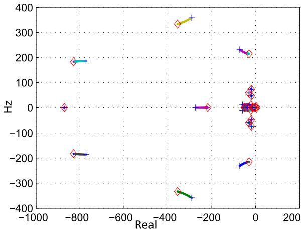

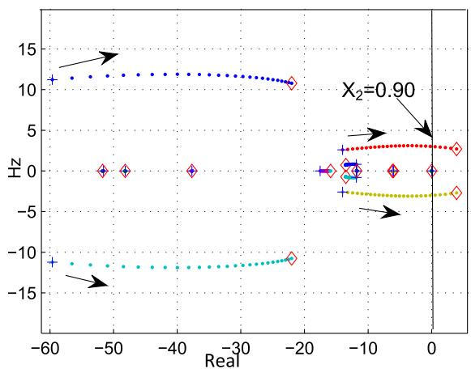  
Fig. 6. Eigenvalue loci for decreasing grid strength. Left: overall plots. Right: zoom-in.

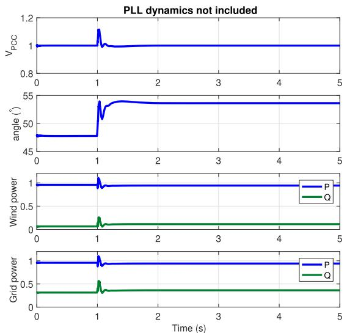

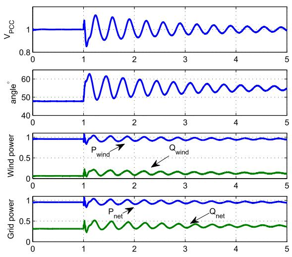  
Fig. 7. Topology 1 dynamic responses of the PCC voltage magnitude, phase angle, wind power and transmission line power. Left: PLL dynamics not included. Right: PLL block included.

compensation level are presented in Fig. 8. Simulation results are presented in Figs. 9-10.

It can be seen from Fig. 8 that with the compensation level increasing, the two modes at 10 Hz and 3 Hz will move to left. Indeed, an increasing compensation level makes the grid appearing stronger. Thus it is reasonable that the two modes move to left. Increasing compensation level makes one mode below 60 Hz moving to the right and another above 60 Hz moving to the left. The former is the SSR mode and the latter is the super-synchronous mode.

It can be observed that with increasing compensation level, the SSR mode in the dq-frame has a reduced frequency. In the abc-frame, the SSR frequency is complementary of the frequency observed in the dq frame. Hence, decrement of frequency in dq means increment of frequency in the abc-frame. An RLC circuit’s resonance frequency is estimated to be $6 0 \times \sqrt { \frac { X _ { c } } { X _ { L } } }$ Hz. Increasing compensation level leads to an increase in resonance frequency. Hence the trend shown in the eigenvalue loci is reasonable.

Fig. 8 d further presents the effect of transmission line length on the SSR mode. When the compensation level is 5%, the SSR mode is located at the LHP for long transmission lines or weaker grid. On the other hand, when the line reactance is less than or equal to 0.5 pu, the system is unstable even with 5% series compensation. The relationship between grid strength and SSR discovered here has not been addressed before.

Time-domain simulation studies are conducted. The first dynamic study is conducted for a Type-3 wind farm with radial connection to an RLC circuit (Topology 2). Initially, the compensation level is 5%. At t = 0.5 seconds, the compensation level is reduced to 1%. At t = 1.5 seconds, the compensation level is increased to 10%. The dynamic responses of the PCC voltage magnitude, angle, power delivered from wind (active and reactive), and the power injected to the grid (active and reactive) are shown in Fig. 9. It can be observed that when the compensation level reduces from 5% to 1%, the 3 Hz mode appears. This mode is related to weak grid. Decreasing compensation level will make this mode move to the RHP and appears. When the compensation level increases to 10%, the 44 Hz SSR mode becomes dominant. The simulation results corroborate the eigenvalue loci movement presented in Fig. 8.

The second dynamic simulation study demonstrates the consequence of the tripping of the parallel RL circuit. At t = 0.8 seconds, Topology 3 becomes Topology 2 and the wind farm is radially connected to the RLC circuit. It can be seen from Fig. 10 that the system is unstable when the RLC circuit has a compensation level of 25% or 50%. On the other hand, when the RLC circuit has a compensation level of 5%, the system is stable after the tripping of the parallel RL circuit. Dynamic response of the PCC voltage magnitude indicates that there is a poorly damped oscillation mode of 50 Hz, which corroborates the eigenvalue results shown in Fig. 8a where a 50 Hz SSR mode is located at the LHP when the

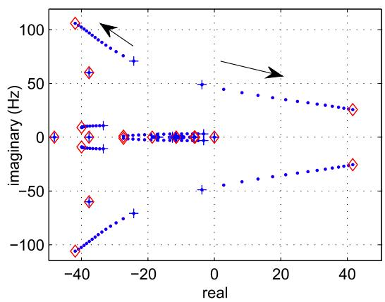  
(a)

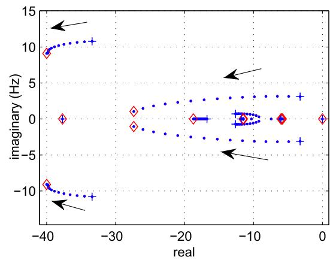  
(b)

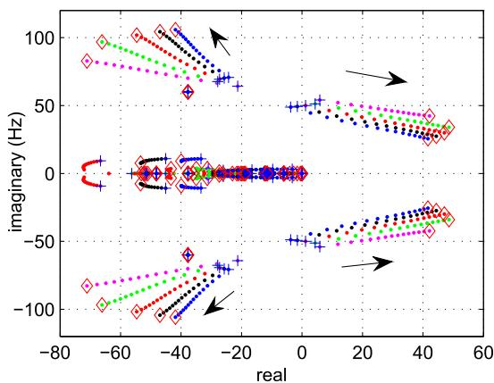  
（c）

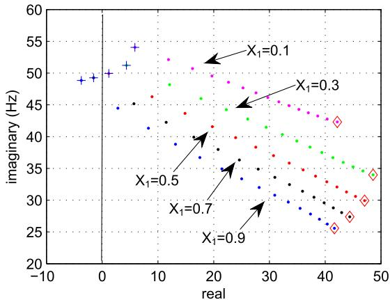  
(d)

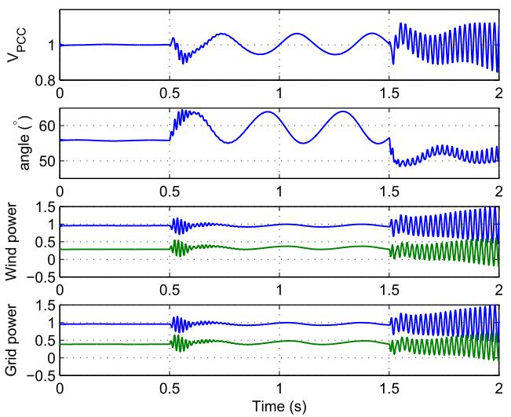  
Fig. 8. Eigenvalue loci with compensation level increasing from 5% to 75%. Step size 5%. Wind speed 10 m/s, machine speed: 1.05. Upper row: $X _ { 1 } = 1$ pu. (8 a) Overall eigenvalue loci; (8 b) Zoom-in of the low-frequency portion. Low row: Five different line reactances. (8 c) Overall eigenvalue loci for five line reactances; (8 d) Zoom in of the SSR mode.   
Fig. 9. Topology 2 dynamic responses for varying series compensation level: $5 \% {  } 1 \% {  } 1 0 \% . \ X _ { 1 } \ { = } \ 0 . 9 5$ . The 3 Hz mode appears after 0.5 s since the grid becomes weaker. The 44 Hz SSR mode appears at 1.5 s due to an increase in the compensation level.

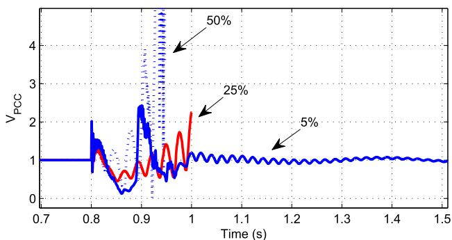  
Fig. 10. Parallel line tripping: Topology 3 → Topology 2 at $t = 0 . 8$ seconds. RLC line: $X _ { 1 } = 1 . 0$ pu, $R _ { 1 } = 0 . 1$ pu. Three different compensation levels are examined.

compensation level is 5%.

# 4.3. Effect of machine rotating speed

In this subsection, effect of machine rotating speed $\omega _ { m }$ is investigated. The wind turbine is assumed to operate at maximum power point tracking points. A certain wind speed corresponds to an optimum rotating speed and maximum wind power extracted. We first demonstrate the effect of the rotating speed on Topology 2, i.e., a wind farm with radial connection to an RLC circuit. The RLC circuit has an inductive reactance $X _ { 1 } = 0 . 5 \ : \mathrm { p u }$ . Wind speed changes from 7 m/s to 12

m/s. The rotating speed of the machine varies from 0.75 to 1.25 pu and the mechanical torque varies from 0.43 to 1.28 pu.

From Fig. 11b, it is observed that with an increasing wind speed, for compensation level at 10%, 20%, the SSR mode moves towards left. This indicates that lower wind speed makes SSR even worse. This observation aligns with the remarks from [2] and real-world SSR observation [4] where series compensation level is less than 10%. On the other hand, when the compensation level is 75%, the mode moves to the right when wind speed increases.

The explanation offered in [2] relies on an estimation of equivalent rotor resistance evaluated under abc-frame. The machine slip under the SSR frequency is computed as slip $\begin{array} { r } { = \frac { \omega _ { \mathrm { S S R } } - \omega _ { m } } { \omega _ { \mathrm { S S R } } } . } \end{array}$ . Take the example of a 0.75 machine rotating speed and 10 Hz or $1 / 6$ pu SSR mode, the induction machine’s slip under SSR oscillation is − 3.5. On the other hand, for a greater rotating speed 1.25 $\mathrm { p u } ,$ the slip will be $- 6 . 5 .$ The equivalent rotor resistance under SSR oscillation $( R _ { r } / { \ s } \mathrm { l i p } )$ appears to be less negative for a greater rotating speed. Hence, lower wind speed is worse for SSR stability. Higher compensation level results in higher frequency of the SSR mode. For example, according to Fig. 11b, at 20% compen sation level, the SSR mode is of 15 Hz while at 75% compensation level, the SSR mode is of 25 Hz in the abc frame. The resulting slip for 0.75 rotating speed is − 2 and − 0.8. In both cases, the equivalent rotor resistance under SSR is negative. Higher compensation level leads to a larger negative equivalent rotor resistance. Hence, higher compensation level is worse for SSR.

The above explanation, however, cannot explain the SSR mode moves to right for 75% compensation level with an increasing wind speed. When the rotating speed changes from 0.75 to 1.25, the slip changes from − 0.8 to − 2 and the equivalent rotor resistance (negative) has a less absolute value.

To get a clear picture, we present the eigenvalue loci for Topology 3, shown in Fig. 12. It can be clearly seen that the SSR mode tends to first move to right for all compensation levels. When the compensation level is as low as 10% or 20%, the SSR mode will move towards left after initially moving to the right. When the compensation level is as high as 75%, the SSR mode moves towards the right. This movement trend of the SSR mode appears to be similar as the low-frequency modes influenced by weak grid operation. Thus, a reasonable explanation is that the SSR mode is influenced by weak grid effect. When the weak grid effect is less dominant, the SSR mode moves to left when wind speed increases. On the other hand, the SSR mode moves to right.

# 4.4. Effect of number of online wind turbines

In this subsection, effect of number of online wind turbines on SSR is

studied. Real-world planning studies based on PSCAD simulation [23] indicate that increasing wind farms at the same location will make SSR worse in majority of the cases. However, for a few scenarios at low series compensation level, lower number of wind farms makes SSR worse. In this subsection, Topologies 2 and 3 are examined to study the impact of online wind turbine numbers.

Fig. 13 presents eigenvalue loci for Topology 2 with the following RLC circuit parameters: $X _ { 1 } = 0 . 8 , R _ { 1 } = 0 . 0 8$ and $X _ { c \mathrm { ~ } } = 0 . 1 5 X _ { 1 }$ . The wind turbines are assumed to be subject to a wind speed of 11 m/s. The optimal machine rotating speed is 1.15 pu and the captured wind power is 1.25 pu. The 200 MW wind farm consists of 100 wind turbines, each 2 MW. Fig. 13a presents the overall eigenvalue loci in the entire plane. The starting points of the loci are marked using “+”. The end points are marked using diamonds. Fig. 13b presents the zoom-in for eigenvalues in the range of 80 Hz. Fig. 13c presents the further zoom-in and focuses on two modes with oscillation frequency at 10 Hz and 3 Hz. These two modes move to the right as the number of wind turbines increases. These two modes have been identified as relevant to weak grid operation. Finally, Fig. 13d presents two modes related to RLC resonance: one less than 60 Hz (the SSR mode) and the other greater than 60 Hz (the supersynchronous mode). The SSR mode moves to right while the supersynchronous mode moves to left when the number of online wind turbines increases from 1 to 100.

Figs. 14 and 15 present eigenvalue loci for Topology 3. Compared with the previous case, wind farm parameters are same. This system has a parallel RL circuit with $X _ { 2 } = 2 . 0 , R _ { 2 } = 0 . 2 .$ . The RLC circuit assumes $X _ { 1 } = 1 . 2 5$ and $R _ { 1 } = 0 . 1 2 5$ . Five compensation levels are examined. Fig 14 presents two compensation levels: 15% and 20%. Four subfigures are generated for different zoom-in areas. Comparing Fig. 14c with Fig. 13d, we may see that a mode at 60 Hz is moving to the left when the number of wind turbines increases for Topology 3. On the other hand, when there is no parallel RL circuit, this mode does not move with wind turbines increasing in Fig. 13d. Comparing Fig. 14d with Fig. 13d, we may see the system becomes more stable with a parallel RL circuit. When the compensation level of the RLC circuit is 15%, the system is stable for Topology 3 while unstable for Topology 2.

An interesting phenomenon is observed at 20% compensation level in Fig. 14d. The SSR mode is located at the LHP when all 100 turbines are online. On the other hand, when half of them are online, the SSR mode is located in the RHP. This indicates that in this scenario, when half of the wind turbines are online, the system is unstable. When all wind turbines are online, the system is stable.

For higher compensation levels at 25%, 50% and 75%, no such phenomenon is identified based on Fig. 15. For all three compensation levels, the system loses stability when more wind turbines are online.

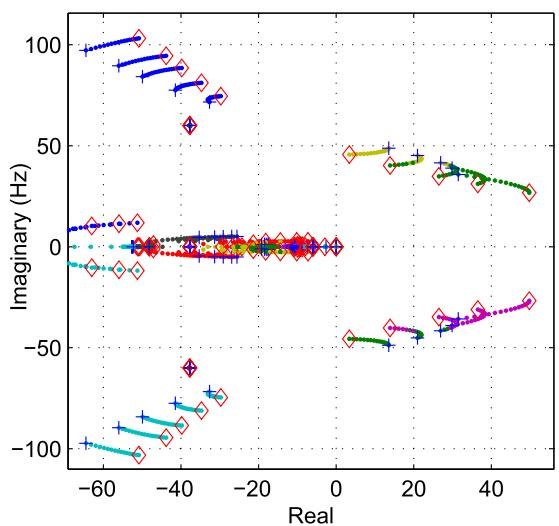

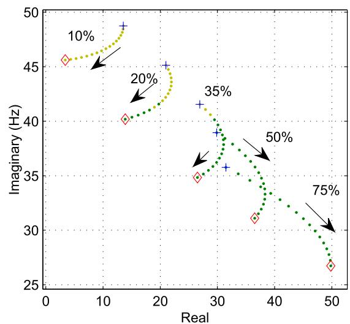  
Fig. 11. Topology 2 eigenvalue loci with rotor speed increasing. (b) is zoom-in of (a).

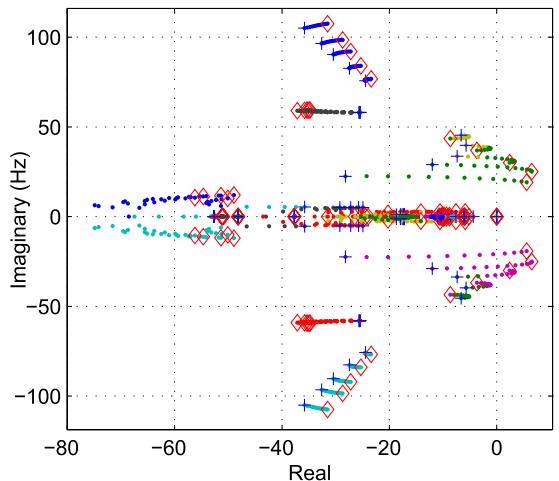

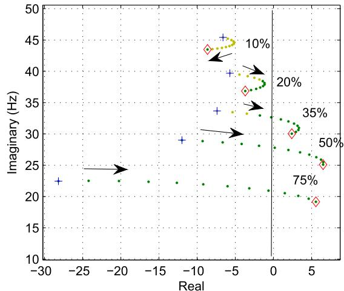  
Fig. 12. Topology 3 eigenvalue loci with rotor speed increasing. Line $1 \colon X _ { 1 } = 1 .$ . Line $2 \colon X _ { 2 } = 1 .$

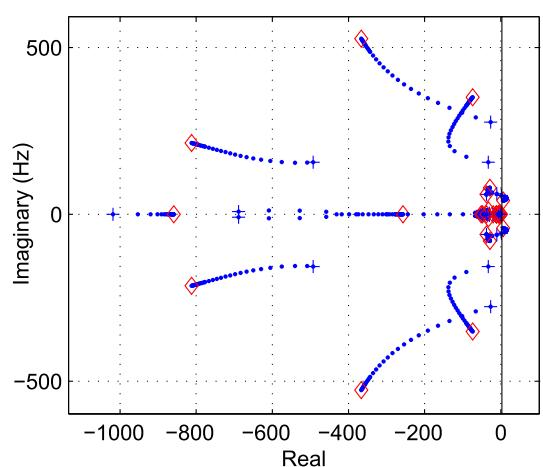  
(a)

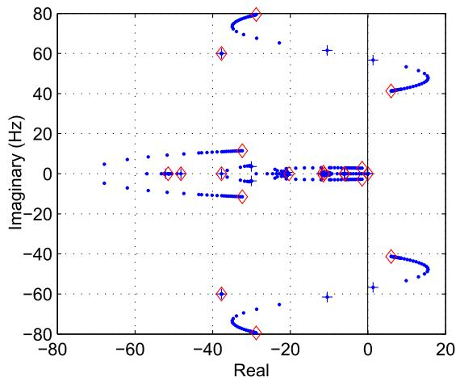  
(b)

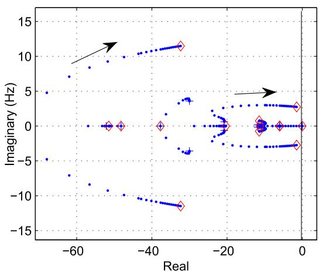  
（c）

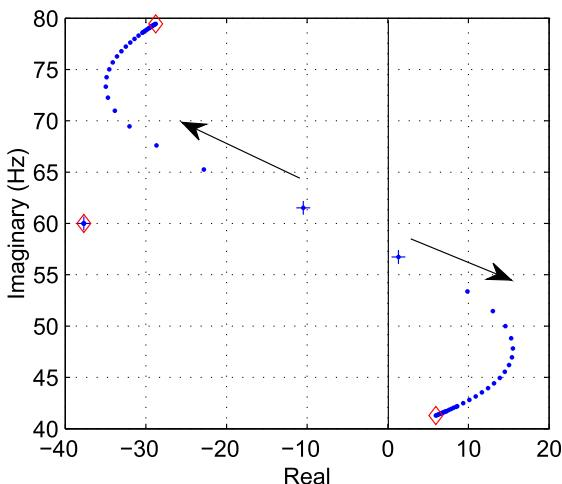  
(d)   
Fig. 13. Topology 2 eigenvalue loci with number of online wind turbines increasing.

The special case deserves further study. It appears to be due to the SSR mode moves down and left when turbine number increases. For 20% compensation level, the RLC line is assumed to have a shorter length and $X _ { 1 } = 0 . 5 ~ \mathrm { p u } .$ . Fig. 16 presents the eigenvalue loci. It can be seen that when all 100 wind turbines are online, the SSR mode locates at a farther right place compared to that in Fig. 14d. Comparing the two modes below 10 Hz related to weak grid, we find that when the RLC

circuit has a shorter length, these two modes are located far left compared to their positions in Fig. 14b. Hence, it appears that the interactions of the SSR mode and the low-frequency modes cause the special scenario that the system is stable with more online wind turbines while unstable with less online turbines. This occurs mostly when the grid strength is weak.

Two simulation case studies are conducted to demonstrate the effect

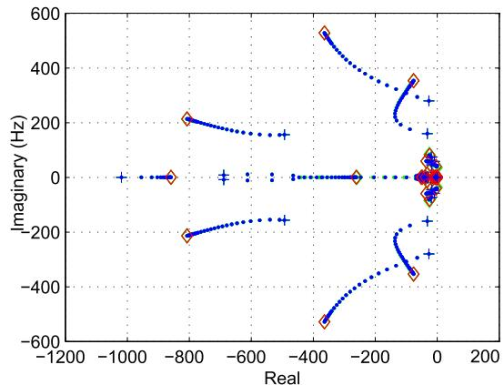  
(a)

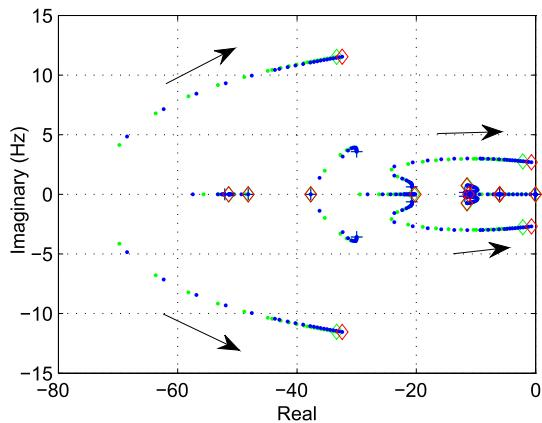  
(b)

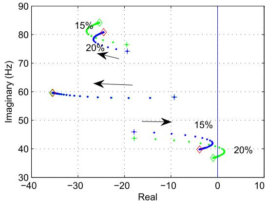

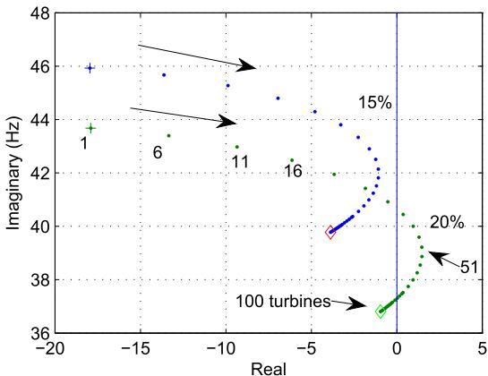  
  
Fig. 14. Topology 3 eigenvalue loci with number of online wind turbines increasing.

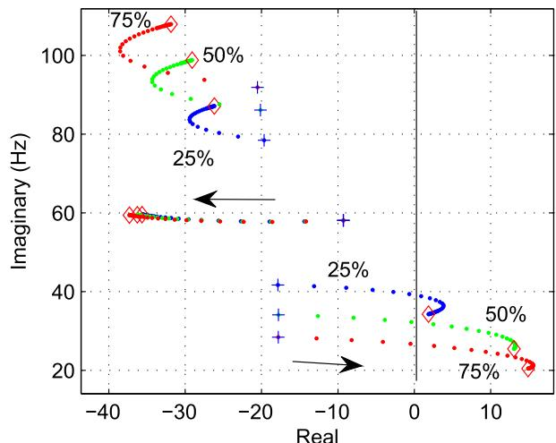  
Fig. 15. Eigenvalue loci with number of wind turbine increasing from 1 to 100.

of the number of online wind turbines. In the first study, the system parameters used to produce Fig. 14 are used and the compensation level of the RLC circuit is fixed at 20%. At the beginning, all 100 turbines are online. The PCC voltage, total power to the transmission grid, torque from an online turbine, RLC circuit line current (RMS value) and the RLC circuit’s series capacitor voltage (RMS value) are presented in Fig. 17a. At t = 1 second, 50 turbines are turned off. The system becomes unstable with oscillations. At t = 2 seconds, the offline turbines are again put online. The system again becomes stable. Note that there are two oscillation modes can be detected from 2 seconds to 4 seconds. One is the

37 Hz SSR mode, the other mode is the low-frequency mode at 3 Hz related to weak grid characteristics.

In the second study, the same system parameters are used, except that the RLC circuit compensation level is now 50%. In the beginning, there is only 1 wind turbine online. The system is stable and the real power injected to the transmission grid is close to 0.12 pu. At t = 1 second, 50 wind turbines are online. The system experiences SSR oscillations. It appears as 28 Hz in the PCC voltage, power, torque and RMS current and voltage. It will appear as 32 Hz oscillations in abc currents and voltages. At t = 2 seconds, all 100 turbines are online. The system is unstable with SSR oscillations. At t = 3 seconds, all except one turbine is left online. The SSR disappears and the system is stable again.

Remarks: The case studies demonstrate the usefulness of the models for both wind farm SSR investigation and weak grid stability investigation.

# 5. Discussions on wind farm SSR: the case for Type-4 wind farm

It is a natural question to ask: Is there any SSR risk should a type-4 wind turbine generator (WTG) is connected to a series compensated transmission line?

In this area, the authors’ research group has conducted a thorough investigation in modeling in [29] and has provided the answer to the following question: Will LC resonance be worsened in a type-4 WTG case? This question has been addressed by EMT simulation, eigenvalue analysis based on a dq-frame model, and admittance-based frequency-- domain analysis. Based on the investigation, the answer is NO. The electric resonance will not be worsened by type-4 WTG cases if the PLL is reasonably designed. PLL and the LC resonance mode may interact if PLL is not well designed.

The underlying reason that type-3 wind farm makes LC resonance

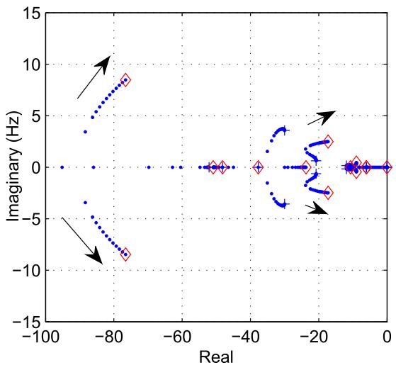

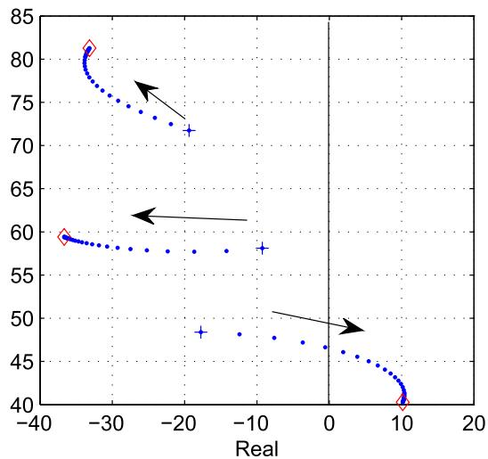  
Fig. 16. Topology 3 eigenvalue loci with number of online wind turbines increasing. Compensation level: 20%. RLC circuit: $X _ { 2 } = 0 . 5 .$

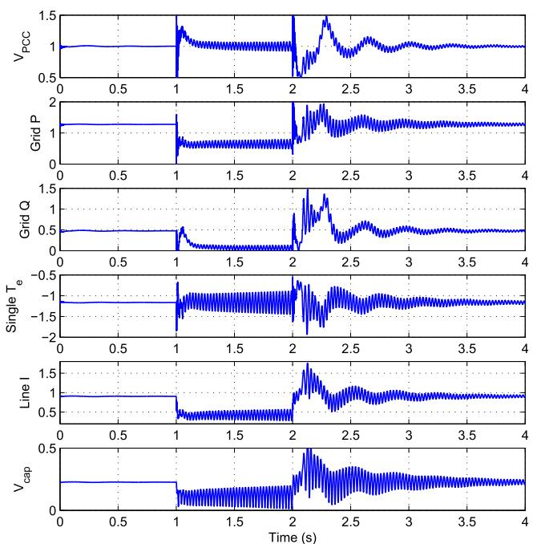

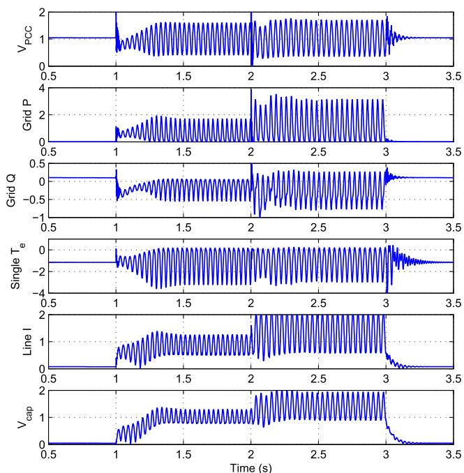  
Fig. 17. Simulation results. RLC circuit: $X _ { 1 } = 1 . 2 5 .$ . RL circuit: $X _ { 2 } ~ = 2 . 0$ . (a) RLC circuit: 20% compensation level. Wind turbines: 100→50→100. (b) RLC circuit: 50% compensation level. Wind turbines: $1 {  } 5 0 {  } 1 0 0 {  } 1$ .

worse is due to the direct connection of the induction generator stator to the AC circuit. This introduces induction generation effect (IGE). At the LC resonance frequency, the equivalent impedance contributed by the equivalent rotor resistance (Rr/slip) and the RSC equivalent impedance may all appear to be non-passive. Specifically, slip may be negative. This finding has been documented by the authors [19].

On the other hand, for type-4 WTG, a full-scale converter is connected to the AC circuit. IGE effect no longer exists. This type of system is prone to weak grid stability issues, $\mathrm { e . g . , }$ , low-frequency oscillations. This phenomenon has been presented in a 2010 paper [30] using simulation, and has been also observed as 4-Hz oscillations in power and voltage RMS measurements (Texas 2011) [31]. In addition, a NERC report on oscillations [32] reported several oscillation events of wind farms or solar PVs, e.g., 13 Hz oscillations in Woodward Wind (Oklahoma, 2010), wind plant oscillations (Oklahoma, 2011), solar power plant oscillations (AEP, 2016). The oscillations were triggered either due to high power

exporting or grid becoming weaker after line tripping. Similarly, in HVdc with weak ac grid interconnection, low-frequency oscillations may appear [33].

Finally, weak grid oscillations have also been observed in type-3 wind farm with weak grid interconnection [34]. The current paper makes a unique contribution to simulate weak grid stability phenomenon as well as series capacitor SSR for type-3 wind farms.

# 6. Conclusion

In this paper, a dq-frame analytical model is developed suitable for type-3 wind farm grid integration study. This model includes PLL dynamics and can replicate real-world phenomena related to wind in weak grids and wind in series compensated networks. The nonlinear model is built in the dq-frame and can be linearized to produce linear models. The benefits of the model include not only fast simulation time due to

dq-frame based modeling, but more importantly the capability of smallsignal analysis. This capability offers researchers a leverage to conduct fast sensitivity analysis, understand the influencing factors of oscillations, and test mitigation strategies. Future work will enhance the scalability of the modeling framework furthermore to include multiple sources in different locations. Such models will be suitable to investigate interactions among multiple inverter-based sources.

# Declaration of competing interest

We wish to confirm that there are no known conflicts of interest associated with this publication and there has been no significant financial support for this work that could have influenced its outcome.

We confirm that the manuscript has been read and approved by all named authors and that there are no other persons who satisfied the criteria for authorship but are not listed. We further confirm that the order of authors listed in the manuscript has been approved by all of us.

We confirm that we have given due consideration to the protection of intellectual property associated with this work and that there are no impediments to publication, including the timing of publication, with respect to intellectual property. In so doing we confirm that we have followed the regulations of our institutions concerning intellectual property.

We understand that the Corresponding Author is the sole contact for the Editorial process (including Editorial Manager and direct communications with the office). He/she is responsible for communicating with the other authors about progress, submissions of revisions and final approval of proofs. We confirm that we have provided a current, correct email address which is accessible by the Corresponding Author and which has been configured to accept email from linglingfan@usf.edu.

# CRediT authorship contribution statement

Lingling Fan: Methodology, Formal analysis, Writing – review & editing. Zhixin Miao: Formal analysis, Writing – review & editing.

# Declaration of Competing Interest

The authors declare that they have no known competing financial interests or personal relationships that could have appeared to influence the work reported in this paper.

# References

[1] IEEE PES WindSSO Taskforce, PES TR-80: Wind Energy Systems Subsynchronous Oscillations: Events and Modeling, 2020.   
[2] L. Fan, R. Kavasseri, Z.L. Miao, C. Zhu, Modeling of dfig-based wind farms for ssr analysis, IEEE Trans. Power Deliv. 25 (4) (2010) 2073–2082.   
[3] L. Wang, X. Xie, Q. Jiang, H. Liu, Y. Li, H. Liu, Investigation of ssr in practical dfigbased wind farms connected to a series-compensated power system, IEEE Trans. Power Syst. 30 (5) (2014) 2772–2779.   
[4] X. Xie, X. Zhang, H. Liu, H. Liu, Y. Li, C. Zhang, Characteristic analysis of subsynchronous resonance in practical wind farms connected to seriescompensated transmissions, IEEE Trans. Energy Conver. 32 (3) (2017) 1117–1126.   
[5] A. Ostadi, A. Yazdani, R.K. Varma, Modeling and stability analysis of a dfig-based wind-power generator interfaced with a series-compensated line, IEEE Trans. Power Deliv. 24 (3) (2009) 1504–1514.

[6] R. Gagnon, Wind Farm - DFIG Average Model, MALTAB/SimScape.   
[7] H.A. Pereira, A.F. Cupertino, R. Teodorescu, S.R. Silva, High performance reduced order models for wind turbines with full-scale converters applied on grid interconnection studies, Energies 7 (11) (2014) 7694–7716.   
[8] Y. Li, L. Fan, Z. Miao, Replicating real-world wind farm ssr events, IEEE Trans. Power Deliv. 35 (1) (2020) 339–348.   
[9] Y. Song, F. Blaabjerg, Overview of dfig-based wind power system resonances under weak networks, IEEE Trans. Power Electron. 32 (6) (2017) 4370–4394, https://doi. org/10.1109/TPEL.2016.2601643.   
[10] I. Vieto, J. Sun, Sequence impedance modeling and analysis of type-iii wind turbines, IEEE Trans. Energy Conver. 33 (2) (2018) 537–545.   
[11] S. Shah, V. Gevorgian, H. Liu, Impedance-based prediction of ssr-generated harmonics in doubly-fed induction generators. 2019 IEEE Power & Energy Society General Meeting (PESGM), IEEE, 2019, pp. 1–5.   
[12] A.D. Hansen, F. Iov, P. Sørensen, N. Cutululis, C. Jauch, F. Blaabjerg, Dynamic wind turbine models in power system simulation tool digsilent (2007).   
[13] J. Adams, C. Carter, S.-H. Huang, Ercot experience with sub-synchronous control interaction and proposed remediation. Transmission and Distribution Conference and Exposition (T&D), 2012 IEEE PES, IEEE, 2012, pp. 1–5.   
[14] P. Pourbeik, Proposal for new features for the renewable energy system generic models (2019).   
[15] D. Jovcic, N. Pahalawaththa, M. Zavahir, H. Hassan, Svc dynamic analytical model, IEEE Trans. Power Deliv. 18 (4) (2003) 1455–1461, https://doi.org/10.1109/ TPWRD.2003.817796.   
[16] D. Jovcic, L. Lamont, L. Xu, Vsc transmission model for analytical studies. 2003 IEEE Power Engineering Society General Meeting (IEEE Cat. No.03CH37491) 3, 2003, pp. 1737–1742, https://doi.org/10.1109/PES.2003.1267418.   
[17] L. Fan, Modeling type-4 wind in weak grids, to appear, IEEE Trans. Sustain. Energy (2018).   
[18] L. Fan, Z. Miao, Wind in weak grids: 4 hz or 30 hz oscillations? IEEE Trans. Power Syst. (2018) https://doi.org/10.1109/TPWRS.2018.2852947.1–1   
[19] L. Fan, Z. Miao, Nyquist-stability-criterion-based ssr explanation for type-3 wind generators, IEEE Trans. Energy Conver. 27 (3) (2012) 807–809.   
[20] Z. Miao, Impedance-model-based ssr analysis for type 3 wind generator and seriescompensated network, IEEE Trans. Energy Conver. 27 (4) (2012) 984–991.   
[21] H. Liu, X. Xie, C. Zhang, Y. Li, H. Liu, Y. Hu, Quantitative ssr analysis of seriescompensated dfig-based wind farms using aggregated rlc circuit model, IEEE Trans. Power Syst. 32 (1) (2017) 474–483.   
[22] A.E. Leon, J.A. Solsona, Sub-synchronous interaction damping control for dfig wind turbines, IEEE Trans. Power Syst. 30 (1) (2015) 419–428.   
[23] Y. Cheng, S.H. Huang, J. Rose, A series capacitor based frequency scan method for ssr studies, IEEE Trans. Power Deliv. 34 (6) (2019) 2135–2144.   
[24] L. Fan, C. Zhu, Z. Miao, M. Hu, Modal analysis of a dfig-based wind farm interfaced with a series compensated network, IEEE Trans. Energy Conver. 26 (4) (2011) 1010–1020.   
[25] P. Krause, O. Wasynczuk, S.D. Sudhoff, S. Pekarek, Analysis of electric machinery and drive systems 75, John Wiley & Sons, 2013.   
[26] L. Fan, Z. Miao, Modeling and analysis of doubly fed induction generator wind energy systems, Academic Press, 2015.   
[27] B. Wu, Y. Lang, N. Zargari, S. Kouro, Power conversion and control of wind energy systems 76, John Wiley & Sons, 2011.   
[28] G. Abad, J. Lopez, M. Rodriguez, L. Marroyo, G. Iwanski, Doubly fed induction machine: modeling and control for wind energy generation 85, John Wiley & Sons, 2011.   
[29] Y. Xu, M. Zhang, L. Fan, Z. Miao, Small-signal stability analysis of type-4 wind in series-compensated networks, IEEE Trans. Energy Conver. 35 (1) (2019) 529–538.   
[30] N.P. Strachan, D. Jovcic, Stability of a variable-speed permanent magnet wind generator with weak ac grids, IEEE Trans. Power Deliv. 25 (4) (2010) 2779–2788.   
[31] S.-H. Huang, J. Schmall, J. Conto, J. Adams, Y. Zhang, C. Carter, Voltage control challenges on weak grids with high penetration of wind generation: ercot experience. 2012 IEEE Power and Energy Society General Meeting, IEEE, 2012, pp. 1–7.   
[32] Reliability Guideline Forced Oscillation Monitoring & Mitigation, 2017,.   
[33] J.Z. Zhou, H. Ding, S. Fan, Y. Zhang, A.M. Gole, Impact of short-circuit ratio and phase-locked-loop parameters on the small-signal behavior of a vsc-hvdc converter, IEEE Trans. Power Deliv. 29 (5) (2014) 2287–2296.   
[34] I. Vieto, G. Li, J. Sun, Behavior, modeling and damping of a new type of resonance involving type-iii wind turbines. 2018 IEEE 19th Workshop on Control and Modeling for Power Electronics (COMPEL), 2018, pp. 1–8, https://doi.org/ 10.1109/COMPEL.2018.8460093.