# Modelling of electromagnetic transients in multi-unit high-voltage circuit-breakers

Antoine Mailhot a,* , Ryszard Pater a , S´ebastien Poirier a , Jean Mahseredjian b , Ren´e Doche c

a Institut de recherche d’Hydro-Qu´ebec (IREQ), Varennes, Canada   
b Polytechnique Montr´eal, Montr´eal, Canada   
c Hydro-Qu´ebec, Montr´eal, Canada

# A R T I C L E I N F O

# Keywords:

Circuit-breakers

Electromagnetic transients

Grading capacitors

Multi-unit

Switching transients

# A B S T R A C T

High-voltage (HV) circuit-breakers (CBs) often consist of several making and breaking units (MBUs) in series. A multi-unit circuit-breaker EMTP® model is proposed to analyse the effects of non-simultaneity between MBUs of the same pole. The model allows for simulations of high-frequency voltage and current transients during opening or closing operations. The simulations include the non-simultaneity of MBUs of the same pole or differences in dielectric withstand characteristics for vacuum circuit-breakers (VCBs) and SF6 CBs. According to simulation results, the maximum non-simultaneity of MBUs of the same pole, as permitted per international standards, can lead to multiple re-ignitions during opening or excessive overvoltages during closing operations. These phenomena are rarely simulated with conventional CB models. The simulations also highlight the important challenges facing high-voltage VCB design due to the inherent characteristics of vacuum bottle technology. The proposed models serve as useful tools for understanding and studying the effect of multi-unit CBs in various system studies and advanced diagnostics.

# 1. Introduction

A high-voltage (HV) circuit-breaker (CB) is a mechanical switching device used in transmission grids, capable of making and breaking currents under normal and abnormal circuit conditions. Amongst other functions, the HV CB ensures the reliability of a transmission grid. CB currents can be normal load currents, capacitive or inductive currents or short-circuit currents. The main functions of a HV circuit-breaker are as follows:

• Connect or isolate parts of the electrical grid by making or breaking load currents [1]   
• In the open position, maintain excellent insulating properties to ensure dielectric strength [1]   
• In the closed position, maintain excellent conductive properties, with a contact resistance of the order of a few tens of microohms, to avoid heat loss or damage [1]   
• Interrupt a short-circuit current, as per the rated characteristics of the device (ranging from 40 kA to 80 kA, depending on the case [2])   
• Establish a short-circuit current according to the rated characteristics of the device [2]

Many HV CB technologies exist, such as oil, air, sulphur hexafluoride $\left( \mathsf { S F } _ { 6 } \right)$ and vacuum circuit-breakers (VCB). The last two categories are the most common today. The VCBs are mainly applied for voltages below 145 kV, but efforts are being made to apply this technology to higher voltages. Moreover, recent research has focused on alternative media to replace ${ \mathrm { S F } } _ { 6 } ,$ the most prominent greenhouse gas (GHG) [3].

HV CBs above 245 kV are often composed of several making and breaking units (MBUs) in series per pole. The term MBU is defined in IEC 62271-100 [2]. MBUs are also called “interrupter units.” The grading capacitors installed in parallel with MBUs allow the uniform voltage distribution between the units [4].

In the Electromagnetic Transients Program (EMTP®), the basic model of a CB is an ideal switch that makes the current instantaneously and breaks it at a zero crossing [5]. A more complete model of CB is available, which integrates the transient recovery voltage (TRV) envelope [6].

Mayr and Avdonin arc models are available in EMTP® [7-9]. However, Mayr and Avdonin electric arc models require a considerable number of parameters to accurately simulate current quenching. These non-linear models of the arc necessitate precise and challenging determination of physical parameters to simulate various dielectric media

such as oil, air, ${ \mathrm { S F } } _ { 6 } ,$ vacuum, and alternative gases as well as different contact geometries. Avdonin and Mayr models are not usually used in CB operation analysis and simulation.

Electromagnetic phenomena occurring during CB operation, such as prestrike, restrike or re-ignition, involve interactions between different MBUs. Reference [10] details a CB diagnostic method using the measurement of transient electromagnetic emissions (TEEs) occurring during CB operation. This diagnostic tool, which is particularly useful for multiple MBU (multi-unit) CBs, allows the detection of prestrikes, restrikes or re-ignitions in individual units. As an example, multiple prestrikes in one MBU during a closing operation of an $S \mathrm { F } _ { 6 }$ CB were observed [11].

The work in [12] studied the effects of very fast transient phenomena including lightning impulse on an assembly of several pairs of contacts in series, showing the complexity of such a system. Their conclusion underlines the challenges related to the multi-contact breakdown voltage modelling, depending on the streamer integral, volume-time criteria and precise modelling of contact geometry.

In this manuscript, we propose novel multi-unit electromagnetic transient (EMT) simulation models that integrate both thermal and dielectric recovery curves for each CB unit on opening, as well as independent dielectric decrease curve on closing. The coupling between the individual MBU is modelled by discrete parameters (lumpedelement model). This approach enables accurate simulation of transient phenomena occurring between individual units. Unlike the majority of existing EMT models found in the literature, which typically employ a single MBU per pole and rely on characteristic recovery curves from electrotechnical standards, our opening and closing models offer a more comprehensive and versatile structure. Furthermore, the models can be adapted for different dielectric media.

Section II underlines some challenges for multi-unit HV CB operation modelling. Section III presents EMTP models for an HV CB comprising several MBUs. Section IV contains the analysis of some case studies using the proposed models and presents some of the challenges in applying VCB for high voltage. Section V provides some potential applications of the proposed models.

# 2. Challenges for operation modelling

# 2.1. Closing operation

Considering the phenomenon of multiple prestrikes, three probable scenarios are possible: simultaneous prestrikes in all MBUs of the CB pole, early prestrike in one MBU with lasting pre-arc current and the case of a pre-arc current which extinguishes itself quickly in one of the MBUs.

The last case necessarily leads to multiple prestrikes during the closing operation. An initial pre-arc current will occur in a single unit due to the mechanical non-simultaneity of the MBUs in a pole. The highfrequency current is non-sustained and lasts a few microseconds. When the pre-arc current is initiated, an impulse overvoltage appears on the second MBU as shown in Fig. 1. This results in a trapped charge in the grading capacitor and will cause a temporary imbalance in the voltage distribution during the shaded zone in Fig. 1.

# 2.2. Opening operation

During the opening operation, re-ignitions or restrikes may occur, which may be challenging for current interruption. The presence of reignition and restrikes can potentially cause damage to critical components in the CB. These current discharges, being often non-sustained, are difficult to see using traditional diagnostic tools, particularly in CBs with several contacts in series.

In the case of an opening operation of a VCB, successive re-ignitions can occur due to the rapid interruption of the electric arc in vacuum medium. Reference [13] explains how successive re-ignitions occur but

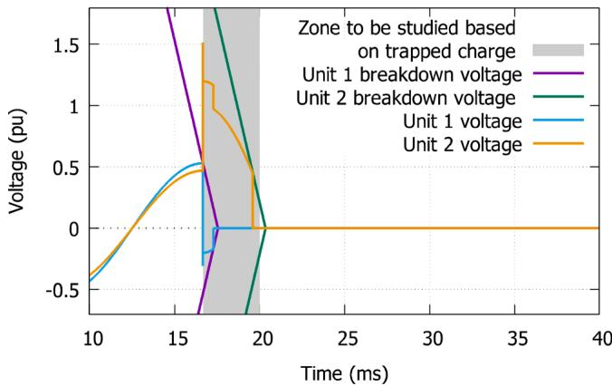  
Fig. 1. Voltage transients caused by mechanical non-simultaneity in CB with two MBUs.

does not address the impact for CBs with multiple units. The authors of [14] experimentally tested a VCB with two MBUs per pole, but do not propose a theoretical EMT simulation model that considers arc quenching as previously mentioned. Simulation results showing successive re-ignitions for a single unit VCB can be seen in Fig. 2.

# 3. Models of multi-unit CB

Two models of CB are developed to represent the current making during closing and current breaking during opening of a multi-unit CB. The disruptive discharges such as prestrike, re-ignition and restrike have a stochastic nature [12]. Weibull or normal distribution functions can be defined from breakdown voltage tests experimental data for different insulating media. An average breakdown voltage value $U _ { b }$ can be determined and modelled as deterministic [15,16]. The models presented here use $U _ { b }$ voltage to simulate prestrikes during closing and re-ignitions or restrikes during opening operation.

Paschen’s law gives the approximation of the breakdown voltage for a given gas pressure and a distance between the electrodes having uniform distribution of the electric field [17,18]. The breakdown voltage, for a given pressure, can be expressed as the product of $E _ { b } ,$ the dielectric strength (in V/m) and $d _ { c } ,$ the contact gap (in m) which change in time (t) during the CB operation, as stated in Eq. (1).

$$
U _ {b} (t) = E _ {b} (t) d _ {c} (t) \tag {1}
$$

During closing operation, the breakdown voltage envelope can be defined for each MBU in the form of a rate of decrease of the breakdown voltage (RDBV) and corresponds to the opposite of the slope of the

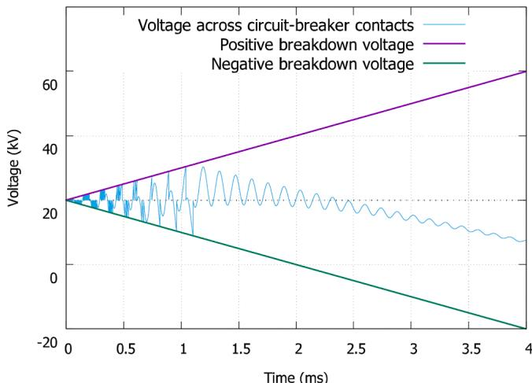  
Fig. 2. Simulation results showing successive re-ignitions in a single MBU VCB.

breakdown voltage, as stated in Eq. (2).1

$$
R D B V (t) \equiv \frac {- d}{d t} U _ {b} (t) \tag {2}
$$

$$
R D B V (t) = \frac {- d \left(d _ {c} (t)\right)}{d t} E _ {b} \lambda \left(d _ {c}\right) \tag {3}
$$

$$
\lambda \left(d _ {c}\right) = \frac {1}{\beta \left(d _ {c}\right)} \tag {4}
$$

In (3), the first factor represents the constant contact speed, while the dielectric strength $E _ { b }$ remains approximately constant due to the constant pressure during closing operation. The specific value of $E _ { b }$ used for each simulation depends on the dielectric medium to be simulated. The factor λ is the geometric factor (dimensionless quantity) considering the geometry of arcing contacts of CB and their effect on the electric field [19]. The factor λ in $\operatorname { E q } .$ . (3) has a value from 0 to 1 and can be different for positive or negative polarity. It can be evaluated using Eq. (4) from $\beta ,$ the field enhancement factor, which depends on the macroscopic geometry as well as the microscopic roughness of the contacts [20]. In the model, RDBV is a parameter that can have different values depending on the applied voltage polarity. RDBV is approximated and assumed to be constant for each polarity in the studies conducted in section IV.

Applying a constant RDBV to approximate the breakdown voltage decrease during a closing operation, an ideal switch is used and controlled by switching logic, shown in Fig. 3. The toggle signal of this switch for each MBU, is signal , a logical value. The signal logical value allows inserting or not an arc impedance in series with each switch. The F.MCA input is the instant of arcing contacts touching [21]. The current $i _ { 0 }$ is the current chopping, $i _ { u }$ is the MBU current, $\overline { { d i / d t _ { e x t } } }$ is the limit of the current derivative that the MBU can quench and $d i _ { u } / d t$ is the derivative of the current $i _ { u } .$ The voltage $U _ { b + }$ + is the breakdown voltage in positive polarity, $U _ { b } .$ is the breakdown voltage in negative polarity, both are calculated from RDBV. $U _ { u }$ is the voltage of the MBU. Each individual unit follows the closing operation logic depicted in Fig. 3.

One aspect to be considered is the frequency at which signalint logical value can be changed. When simulating the arc extinction by $s i g n a l _ { i n t }$ change, the transient recovery voltage of the CB unit must reach the breakdown voltage (either $U _ { b + }$ + or $U _ { b - } )$ before re-ignition is simulated. This logical requirement prevents mathematical errors caused by noise in the current signal. A similar logic is used for opening operation, but additionally considering the thermal aspect of the dielectric recovery. The rate of rise of the breakdown voltage (RRBV) is defined as in Eq. (5).

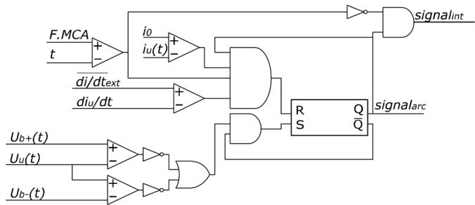  
Fig. 3. Logic diagram of the dielectric behaviour of one MBU during closing operation.

$$
R R B V (t) = \frac {d \left(d _ {o} (t)\right)}{d t} E _ {b} (t) \lambda \left(d _ {o}\right) \tag {5}
$$

In the equation, the $d _ { o }$ parameter is the spacing between the opening contacts. $E _ { b }$ cannot be assumed constant on opening because of the forced gas flow in $S \mathrm { F } _ { 6 }$ and air CB.

There are two possible stages during the arc extinction: thermal interruption and dielectric interruption, as stated in section 3.5 of [22]. In this model, they are represented as the “thermal” and “dielectric” breakdown voltages $( U _ { b , t h }$ and $U _ { b , d i } ) .$ . An unsuccessful thermal or dielectric recovery can cause re-ignitions or restrikes, which occur when the MBU voltage reaches one or the other breakdown voltage. Regarding the Fig. 4, when the voltage $U _ { u }$ reaches one or other of the breakdown voltages $( U _ { b , t h }$ or $U _ { b , d i } ) _ { \cdot }$ , the model logic will generate the re-ignition or the restrike following the logical toggle $s i g n a l _ { i n t } .$ This solution considers in a simple way both the thermal and the dielectric recovery.

In Fig. $4 , U _ { b + , t h }$ is the thermal breakdown voltage in positive polarity, $U _ { b + , d i }$ is the dielectric breakdown voltage in positive polarity. $U _ { b + , d i }$ and $U _ { b + , t h }$ are ramps calculated from dielectric and thermal RRBV (RRB $V _ { d i }$ and $R R B V _ { t h } ) ,$ , which are held constant for each study case. The O.SCA input is the moment of separation of the arcing contacts of a CB unit (s) [21]. After this event, the positive and negative ramps of dielectric breakdown voltages begin based on RRBVdi. The thermal breakdown voltage, on his hand, begins after the current extinction (zero crossing), based on $R R B V _ { t h } .$ . This approach should not be misperceived with the 4-parameter envelope method stated in IEC 62271 standards.

The equivalent circuit used in the model is presented in Fig 5, it is inspired by [10,11,25]. The number of MBUs can be modified by adjusting the number of units and grading capacitors in the circuit. $U _ { S }$ is the source voltage, $L _ { S }$ and $C _ { S }$ compose the source impedance, the indexes b concern the bus bars, the indexes p are the lumped-element parameters of the grading capacitor. The $C _ { C T }$ is the intrinsic (parasitic) capacitance of the current transformer, $C _ { e }$ is the intrinsic phase-earth capacitance of the CB, between earth and each MBU and $R _ { a r c }$ is the arc impedance. The load can be adapted according to the simulated case. Each unit in the circuit of Fig. 5 is controlled by the logic signals presented in Figs. 3 and 4.

The grading capacitors, which serve the purpose of voltage equalization, are represented by the discrete circuit elements $R _ { p } , L _ { p }$ and $C _ { p } .$ This modelling allows for the calculation of the dynamic voltage of each CB unit during operation. The arc is modelled by a non-linear resistance $( R _ { a r c }$ in Fig. 5) with an I-V characteristic based on a constant voltage drop $( U _ { a r c } )$ . In addition, $R _ { a r c }$ is controlled by the logical toggle signalarc which can force its value to 0 Ω corresponding to the closed position of the interrupter.

The $U _ { a r c }$ value in $S \mathrm { F } _ { 6 }$ is approximated following Seeger’s measurements for medium current levels, at 500 V [23]. Additionally, the vacuum arc voltage drop $( U _ { a r c } )$ is approximated at 100 V, as proposed in

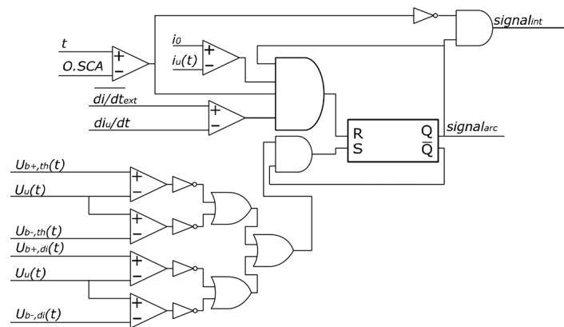  
Fig. 4. Logic diagram of the dielectric behaviour of one MBU during opening operation.

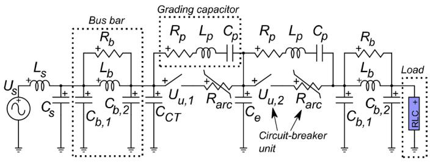  
Fig. 5. Equivalent circuit for simulations.

[24]. However, $U _ { a r c }$ is a parameter of the model and can be set to any other value. The effect of the arc impedance on closing and opening operations was simulated in a sensitivity analysis within a master’s thesis that provided a more detailed examination of this research work [19]. It demonstrates that the arc impedance has minimal impact on HV CB transients.

# 4. Case studies

Using the theoretical models presented in section III, several case studies are carried out. For all cases, a non-simultaneity in the model is set at the limits allowed by IEC 62271-100 [2] i.e., 1/6th of a cycle for a closing operation and 1/8th of a cycle for an opening operation. In each case study, a limit $\overline { { d i / d t _ { e x t } } }$ of 8.9 A/μs is used for an $S \mathrm { F } _ { 6 }$ CB and 500 A/μs for a VCB. Current chopping (i0) is set at 10 A for the $S \mathrm { F } _ { 6 }$ units and 6 A for the VCB units. Grading capacitors are modelled using $R _ { p } = 7 . 7 5$ Ω, $L _ { p } =$ 0.84 μH and $C _ { p } = 1 6 0 0$ pF for $S \mathrm { F } _ { 6 }$ CB units [25]. For VCB units, these values are respectively 50 Ω, 0.050 μH [13] and 1600 pF. The minimum breakdown voltage is set to 1000 V to initiate a logic toggle during an opening operation (restrike or re-ignition).

# 4.1. Making current on unloaded transmission line

The first case study concerns the closing operation of an $S \mathrm { F } _ { 6 }$ CB on unloaded transmission line at 735 kV. The equivalent circuit for this case is shown in Fig. 6. The transmission line is 250 km long, simulated with a wideband (WB) model. The end of the transmission line is connected to 100 μF series capacitor bank $C _ { c o m p }$ with a surge arrester in parallel. A 4 H shunt compensation reactor $L _ { c o m p }$ is added to the end of the unloaded line. The shunt surge arresters have a maximum continuous operating voltage (MCOV) of 490 kV. The bus bar impedance is 1 μH/m for 20 ${ \mathfrak { m } } ,$ the parasitic capacitances $C _ { b , 1 }$ and $C _ { b , 2 }$ are 180 $\mathtt { p F }$ each and the damping resistor $R _ { b }$ is 10 kΩ. The potential transformer capacitance $C _ { P T }$ is 4000 $\mathtt { p F }$ and the current transformer capacitance $C _ { C T }$ is 450 $\mathtt { p F }$ . The intrinsic capacitance $( C _ { e }$ in Fig. 5) is 130 pF and is positioned in between MBUs and earth, thus there are three $C _ { e }$ capacitances and four $C _ { p }$ capacitances inside CB block on Fig. 6. The source capacitance $C _ { S }$ is 60 nF and the source inductance $L _ { S }$ is 12 mH.

The steady-state voltage distribution for each MBU can be calculated using Eq. (6) [20,26]. The parameter α corresponds to N times the parameter ${ \sqrt { \frac { C _ { e } } { C _ { p } } } } ,$ where N is the number of MBUs. For a capacitance $C _ { p }$ of 1600 $\mathtt { p F }$ and an intrinsic capacitance $C _ { e }$ of 130 pF, the voltage distribution factor $( F _ { R } )$ of the source-side MBU is 1.255 in steady state, as calculated in (7) and (8) [20,26]. The concept of voltage distribution factors and their finite element calculation is discussed in detail in

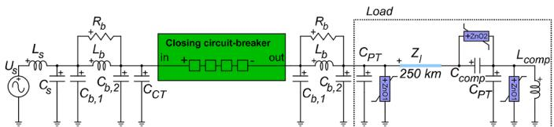  
Fig. 6. Equivalent circuit of unloaded transmission line switching.

reference [27].

$$
U (x) = U _ {S} \frac {\sinh \left(\frac {\alpha x}{N}\right)}{\sinh (\alpha)} \tag {6}
$$

$$
U _ {S} \left[ 1 - \frac {\sinh \left(\frac {3 a}{4}\right)}{\sinh (\alpha)} \right] \approx 0. 3 1 3 8 U _ {S} \tag {7}
$$

$$
F _ {R} = \frac {0 . 3 1 3 8 p . u .}{\left(\frac {U _ {S}}{4}\right)} = \frac {0 . 3 1 3 8 p . u .}{\left(\frac {1 p . u .}{4}\right)} \approx 1. 2 5 5 \tag {8}
$$

A mechanical non-simultaneity is simulated for the $4 ^ { \mathrm { t h } }$ unit of pole A: $1 / 6 ^ { \mathrm { t h } }$ of a cycle behind the other 3 units. Transient overvoltages of $4 ^ { \mathrm { t h } }$ unit $U _ { u , 4 a }$ and current for the $1 ^ { \mathsf { s t } }$ unit $i _ { u , l a }$ are shown in Fig. 7.

Fig. 7 illustrates that after simultaneous prestrikes in units 1, 2 and $^ { 3 , }$ the last unit is still in its insulation state. The pre-arc currents in the three source-side units self extinguish, and voltage is again applied across these units. These pre-arc discharge transients create a voltage oscillation of $U _ { u , 4 a }$ at 2.656 ms, with a frequency (f ) of approximately 550 kHz. This oscillation is primarily caused by the bus bar impedance values, as indicated in Eq. (9).

$$
f _ {t} \approx \frac {1}{2 \pi \sqrt {\left(C _ {P T} + C _ {b , 2}\right) L _ {b}}} = 5 5 0 \mathrm {k H z} \tag {9}
$$

A second pre-arcing occurs throughout the pole, except for the $4 ^ { \mathrm { t h } }$ unit. At 3.066 ms, the peak voltage across the $4 ^ { \mathrm { t h } }$ unit reaches a value of 705 kV during an interval of 64 μs. This voltage value exceeds the withstand voltage of the grading capacitor for switching overvoltages, i. $\boldsymbol { \mathrm { e } } _ { \cdot \boldsymbol { s } }$ 465 kV peak [4].

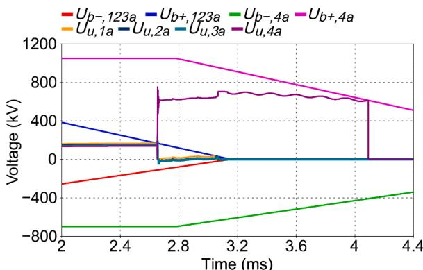

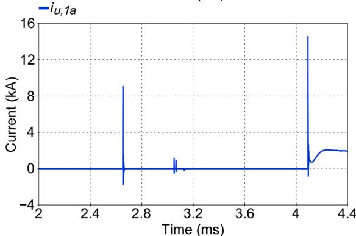  
Fig. 7. Simulated switching voltages and discharge currents for unloaded transmission line switching.

# 4.2. Inductive load switching

This case study concerns the opening operation of an $S \mathrm { F } _ { 6 }$ CB like the previous one. The load is a reactor with a reactance of 1800 Ω and reactive power of 110 Mvar per phase. The equivalent circuit for this simulation is shown in $\mathrm { F i g . }$ 8.

Two rates of rise of the breakdown voltage (RRBV) are modelled for the opening, for each MBU. The $R R B V _ { t h }$ chosen is 7 kV/μs for the pole. The simulated geometric factors are 0.68 for the negative polarity (λ-) and 1.00 for the positive polarity $\left( \lambda _ { + } \right)$ . In ${ \mathrm { F i g . ~ } } 9 ,$ , switching voltages and discharge currents of the $\dot { \boldsymbol { 4 } } ^ { \mathrm { t h } }$ MBU are shown. On this figure, the more abrupt breakdown voltage slopes represent $U _ { b , t h }$ and it begins to increase after current zero, while the less abrupt ones represent $U _ { b , d i }$ , which start after contact separation. At zero crossing of the load current, the arcing contacts are separated for three of the four units. The current is successfully quenched, with a TRV close to the breakdown voltage envelope at time 3.0834 ms, and the arc contacts of the fourth MBU begin separation. The voltage between the contacts exceeds the thermal breakdown voltage a few moments later, causing non-sustained disruptive discharges. An article explains the theory behind these discharges, which most often occur in VCB [28].

# 5. Applications of the models

# 5.1. Advanced diagnostics

The models developed in section III can also be used to perform simulations using experimental data. Test results have been published in the past for a diagnostic tool capable or recording transient electromagnetic emissions (TEEs) [11]. The prestrike delays of case 1.1 in Table III of that publication are used here, i.e., a delay of 89.86 μs between two prestrikes during the same operation. This adjustment between simulated and measured currents enables the corresponding mechanical delay to be determined retroactively, using iterative simulations. The simulated equivalent circuit is shown in Fig. 10, for a capacitive load $C _ { c o m p }$ of 12 μF. This is a 230 kV $S \mathrm { F } _ { 6 }$ CB with two MBUs in series.

The results of this simulation based on measured prestrike delays are shown in Fig. 11, a simulation that has been iteratively retrieved to fit measured prestrike non-simultaneity. In Fig. 11, the simulated delay ΔF. PCA corresponds to the 89.86 μs measured and presented in reference [11]. The voltages plotted are taken from the simulation, and the simulated current is compared with the measured current. The discrepancy between simulated and measured currents can be attributed to differences in resonance frequencies between the simulation parameters and the actual impedance values in the substation.

# 5.2. Prospective study

There are several challenges to be considered in the design of an HV VCB with multiple vacuum bottles in series. The total breakdown voltage of the breaker pole is not proportional to the number of individual vacuum bottles used in series, as demonstrated in reference [29] for three vacuum bottles in series. To evenly distribute the dynamic voltage and overcome this challenge, a prospective simulation is carried out by placing surge arresters in parallel with the vacuum interrupters.

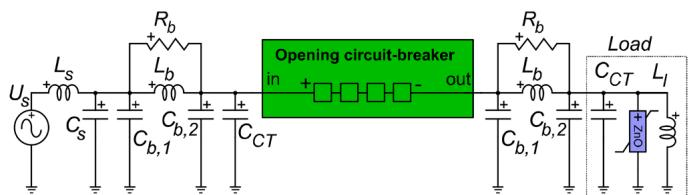  
Fig. 8. Equivalent circuit of shunt inductance switching.

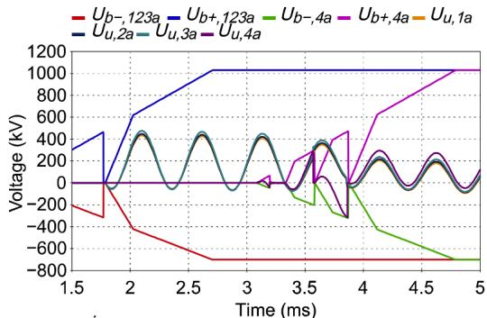

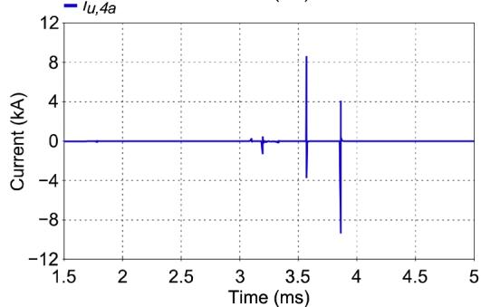  
Fig. 9. Simulated switching voltages and discharge currents for inductive load switching.

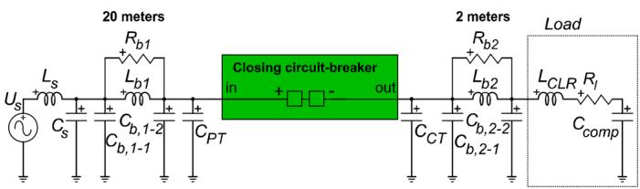  
Fig. 10. Equivalent circuit of capacitor making using experimental data.

Each surge arrester is set using a MCOV value or 57.6 kV in parallel with the grading capacitor. Series reactors of 2 μH are added to each bottle to smooth high-frequency transients. Four vacuum bottles are simulated in series to interrupt an inductive current at 230 kV. The equivalent diagram is shown in Fig. 12. A 1600 pF grading capacitor is simulated in parallel with each MBU, in addition to the surge arrester. The simulated inductance Ll is 1.5 H, to represent the magnetizing reactance of a power transformer. The switching voltages and breakdown voltages of this prospective study are shown in Fig. 13.

This simulation validates that the opening model do indeed apply to VCBs, with a very high breakdown voltage rise $( R R B V _ { t h } )$ . The surge arresters ensure that the voltage of each vacuum bottle does not reach the breakdown voltage in the open position. However, further research is needed to demonstrate the viability of such a solution.

# 6. Conclusion

High-voltage circuit-breaker models have been developed for indepth analysis of current and voltage transients at the MBUs level. One of the input parameters is the timing differences, or nonsimultaneity between individual units connected in series. The tools also allow for the input of basic electrical characteristics at the MBUs level including an I-V characteristic arc model and breakdown voltage characteristics, which allows for simulations during making and breaking in different network conditions.

The models have been used to reproduce high-frequency transient behaviours observed in the field on specific SF and vacuum CBs at the

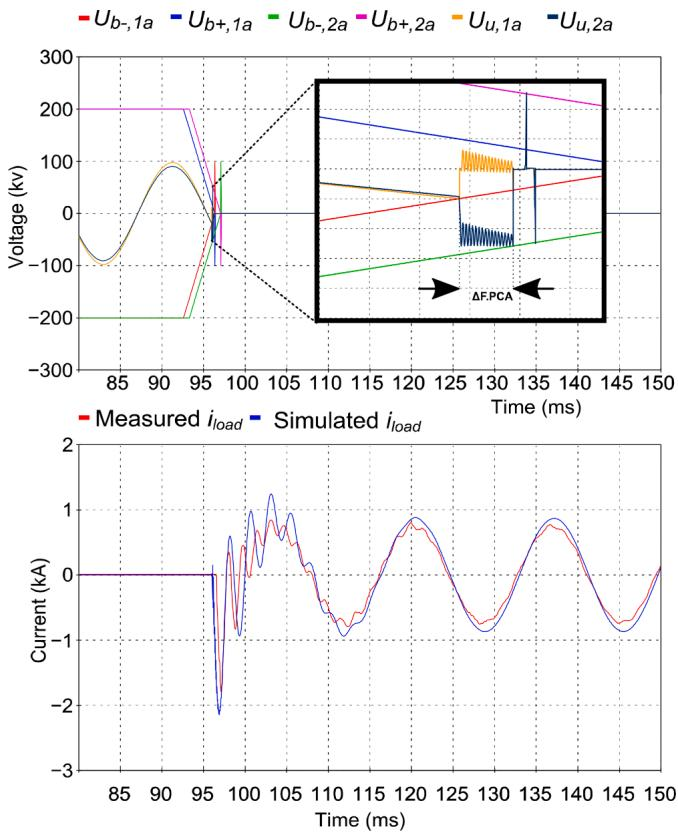  
Fig. 11. Transient voltages and simulated and measured discharge currents for capacitor current making.

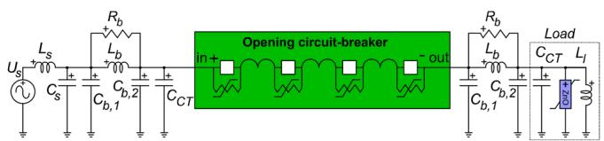  
Fig. 12. Equivalent circuit for a prospective study of a vacuum multi-unit CB, when interrupting magnetizing current.

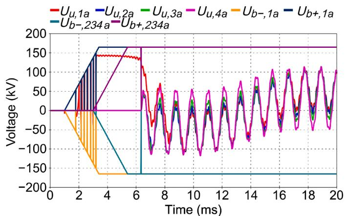  
Fig. 13. Switching voltages for the prospective study.

MBU level. The models can also be used to estimate the mechanical nonsimultaneity condition for field test data obtained with a non-intrusive diagnostic test equipment.

The models were used to analyse a hypothetical multi-unit VCB architecture for voltages above 145 kV using surge arresters in parallel

with the vacuum interrupters. The results concerning this architecture are preliminary and need to be validated by deeper analysis or experiments.

# CRediT authorship contribution statement

Antoine Mailhot: Formal analysis, Methodology, Writing – original draft, Writing – review & editing. Ryszard Pater: Supervision, Writing – original draft, Writing – review & editing. Sebastien ´ Poirier: Supervision, Writing – original draft. Jean Mahseredjian: Supervision, Writing – original draft, Writing – review & editing. Rene ´ Doche: Supervision, Writing – review & editing.

# Declaration of competing interest

The authors declare the following financial interests/personal relationships which may be considered as potential competing interests: Antoine Mailhot reports financial support was provided by the Fonds de recherche du Qu´ebec - Nature et technologies (FRQNT) and Hydro-Qu´ebec. EMTP® is a software used for the presented work. The modelling presented can also be implemented on other software, the use of EMTP® is not mandatory.

# Data availability

Data will be made available on request.

# References

[1] R. Smeets, L. van der Sluis, M. Kapetanovi´c, D.F. Peelo, A. Janssen, Switching in Electrical Transmission and Distribution Systems, 1st, Wiley, Chichester, West Sussex, United Kingdom, 2014.   
[2] International Electrotechnical Commission (IEC), High-voltage switchgear and controlgear – Part 100: Alternating-current circuit-breakers, Ed. 3.0, 2021.   
[3] CIGRE WG A3.41, Current Interruption in SF -free Switchgear, CIGRE Technical Brochure 871 (2022).   
[4] CIGRE WG A3.18, Operating Environment of Voltage grading Capacitors applied to High Voltage Circuit-Breakers, CIGRE Technical Brochure 368 (2009).   
[5] J. Mahseredjian, S. Denneti`ere, L. Dub´e, B. Khodabakhchian, L. G´erin-Lajoie, On a new approach for the simulation of transients in power systems, Electr. Power Syst. Res. 77 (11) (2007) 1514–1520, https://doi.org/10.1016/j.epsr.2006.08.027. Sep.   
[6] H. Gras, J. Mahseredjian, J. Morales, Breaker for TRV, EMTP, 2021. Aug. 17.   
[7] J. Mahseredjian, M. Landry, The new EMTP breaker arc model, presented at, in: the IPST ’97 − International Conference on Power Systems Transients, Seattle, 1997. Jun..   
[8] A.V. Avdonin, et al.. Some Problems of EHV and UHV Air-Blast Circuit-Breakers, presented at CIGRE, International Conference on Large High Voltage Electric Systems, Paris, 1980.   
[9] O. Mayr, Beitr¨age zur Theorie des statischen und des dynamischen Lichtbogens, Arch. für Elektrotechnik 37 (12) (1943) 588–608, https://doi.org/10.1007/ BF02084317. Dec.   
[10] R. Doche, R. Pater, S. Poirier, M. Lamarche, Y. Filion, Transient Electromagnetic Emission Analysis Used to Study Controlled Switching of Ungrounded Shunt Capacitor Banks, in: 2018 IEEE/PES Transmission and Distribution Conference and Exposition (T & D), 2018, https://doi.org/10.1109/TDC.2018.8440505. Apr.   
[11] S. Poirier, R. Doche, R. Pater, J. Poirier, Measurements of Dielectric Breakdown Delays between Series-Connected Interrupters of a HV Circuit Breaker, CIGRE Session (2014).   
[12] P. Simka, U. Straumann, C.M. Franck, SF6 high voltage circuit breaker contact systems under lightning impulse and very fast transient voltage stress, IEEE Trans. Dielectr. Electr. Insul. 19 (3) (2012) 855–864, https://doi.org/10.1109/ TDEI.2012.6215088. Jun.   
[13] T. Abdulahovic, T. Thiringer, M. Reza, H. Breder, Vacuum circuit-breaker parameter calculation and mModelling for power system transient studies, IEEE Trans. Power Deliv. 32 (3) (2017) 1165–1172, https://doi.org/10.1109/ TPWRD.2014.2357993. Jun.   
[14] P.G. Nikolic, T. Goebels, J. Teichmann, J. Weisker, Basic aspects of switching with series-connected vacuum interrupter units in high-voltage metal-enclosed and live tank arrangements, presented at, in: the 48th CIGRE SESSION, Paris, 2020.   
[15] V.H. Dang. Etude ´ des ph´enom`enes de pr´eclaquage et de claquage des huiles v´eg´etales, min´erales et synth´etiques : caract´erisation des d´echarges aux interfaces, Ecole ´ Centrale de Lyon, Ecully, ´ 2011.   
[16] U. Schümann, S. Giere, M. Kurrat, Breakdown voltage of electrode arrangements in vacuum circuit breakers, IEEE Trans. Dielectr. Electr. Insul. 10 (4) (2003) 557–562, https://doi.org/10.1109/TDEI.2003.1219637. Aug.

[17] F. Paschen, Ueber die zum Funkenübergang in Luft, Wasserstoff und Kohlens¨aure bei verschiedenen Drucken erforderliche Potentialdifferenz, Ann. der Phys. 273 (5) (1889) 69–96, https://doi.org/10.1002/andp.18892730505.   
[18] K.T.A.L. Burm, Calculation of the townsend discharge coefficients and the Paschen curve coefficients, Contrib. Plasma Phys. 47 (3) (2007) 177–182, https://doi.org/ 10.1002/ctpp.200710025.   
[19] A. Mailhot, master’s thesis, Polytechnique Montr´eal, Montr´eal, 2023.   
[20] P.G. Slade, The Vacuum Interrupter: Theory, Design, and Application, 2nd ed., CRC Press, Taylor & Francis Group, 2022.   
[21] R. Pater, S. Poirier, R. Doche, J. Poirier, D. Ouellet, M. Germain, A Step Towards Circuit-Breaker Diagnostics Interoperability, presented at, in: the 2020 CIGRE Canada Conference, Toronto, 2020. Oct.   
[22] H. Ito, Switching Equipment, Springer, 2019.   
[23] M. Seeger, M. Schwinne, R. Bini, N. Mahdizadeh, T. Votteler, Dielectric recovery in a high-voltage circuit breaker in SF , J. Phys. D: Appl. Phys. 45 (39) (2012) 395204, https://doi.org/10.1088/0022-3727/45/39/395204. Sep.

[24] E. Dullni, E. Schade, W. Shang, Vacuum arcs driven by cross-magnetic fields (RMF), IEEE Trans. Plasma Sci. 31 (5) (2003) 902–908, https://doi.org/10.1109/ TPS.2003.818445. Oct.   
[25] P. Coventry, M. Runde, Electrical stresses on circuit-breaker voltage grading capacitors caused by unequal voltage sharing during switching operations, Eur. Trans. Electr. Power 21 (1) (2011) 174–179, https://doi.org/10.1002/etep.426.   
[26] A. Greenwood, Vacuum Switchgear, IET (1994).   
[27] D. Valiquette, master’s thesis, Ecole ´ Polytechnique de Montr´eal, 1996.   
[28] R.P.P. Smeets, A.G.A. Lathouwers, L.T. Falkingham, G.F. Montillet, A summary of non-sustained disruptive discharges (NSDD) in vacuum switchgear, in: IEEE Power Engineering Society General Meeting, 2005, https://doi.org/10.1109/ PES.2005.1489541. Jun.   
[29] L. Min-fu, Z. Ji-yan, D. Xiong-ying, F. Xing-ming, S. Hui, Dielectric Strength and Statistical Property of Single and Triple-Break Vacuum Interrupters in Series, in: 2006 International Symposium on Discharges and Electrical Insulation in Vacuum, 2006, pp. 157–160, https://doi.org/10.1109/DEIV.2006.357256. Sep.