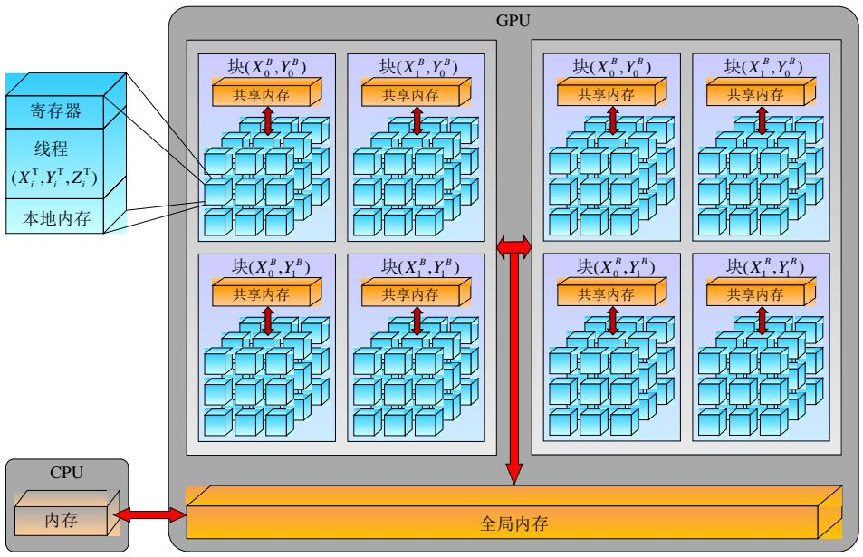
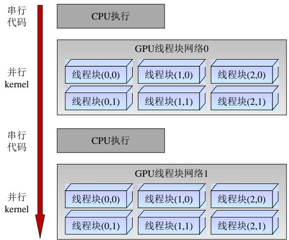
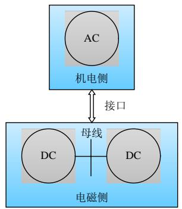
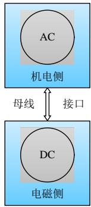
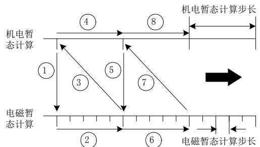
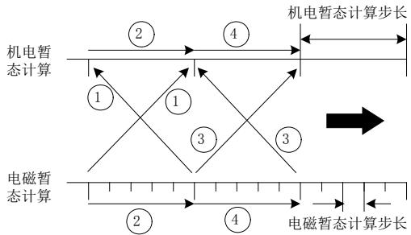
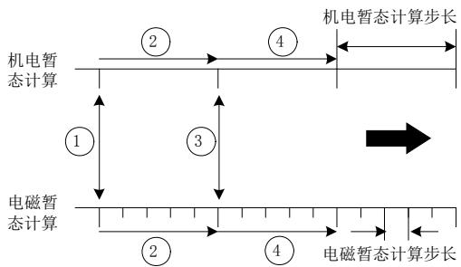
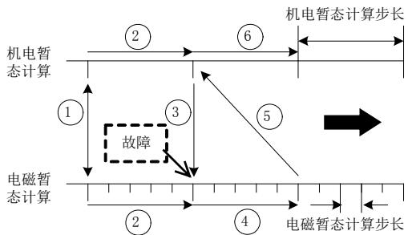
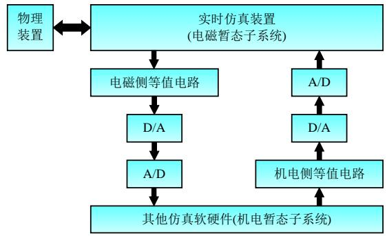
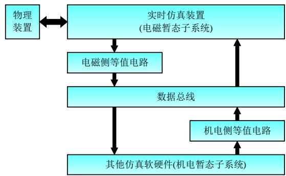

# 电力系统高效电磁暂态仿真技术综述

董毅峰 1 ，王彦良 2 ，韩佶 1 ，李姚旺 1 ，苗世洪 1 ，侯俊贤 3

(1．强电磁工程与新技术国家重点实验室(华中科技大学)，湖北省 武汉市 430074；

2．济宁供电公司，山东省 济宁市 272000；

3．电网安全与节能国家重点实验室(中国电力科学研究院有限公司)，北京市 海淀区 100192)

# Review of High Efficiency Digital Electromagnetic Transient Simulation Technology in Power system

DONG Yifeng1 , WANG Yanliang2 , HAN Ji1 , LI Yaowang1 , MIAO Shihong1 , HOU Junxian3

(1. State Key Laboratory of Advanced Electromagnetic Engineering and Technology, Huazhong University of Science and Technology, Wuhan 430074, Hubei Province, China; 2. Jining Power Supply Company, Jining 272000, Shandong Province, China;

3. State Key Laboratory of Power Grid Security and Energy Conservation (China Electric Power Research Institute), Haidian District, Beijing 100192, China)

ABSTRACT: Digital electromagnetic transient simulation is an important way to analyze the operation, planning and control of power system. With the large capacity flexible DC transmission, flexible AC transmission, micro-network and renewable energy accessed to power grid in the further application, power system presents the trend of flexible electric power electronic, traditional digital electromagnetic transient simulation technology is unable to meet the research, experiment, production and other needs. This paper aims to review the research of efficient digital electromagnetic transient simulation technology at home and abroad in recent years, discuss the key technologies to enhance the simulation efficiency, extract the existing problems and difficulties, and clarify the next research and development ideas. In this paper, the efficient algorithm based on parallel computing architecture, the simulation platform based on the new computing device, the simulation model based on the hybrid computing architecture and the modeling technology based on the fast solution model were discussed from the perspective of algorithm, hardware, interface and model. Meanwhile, according to authors’ point, suggestions for further research are proposed.

KEY WORDS: power system; electromagnetic transient

simulation; high efficiency; digital simulation; review

摘要：数字电磁暂态仿真是分析电力系统运行、规划和控制的重要手段。随着大容量柔性直流输电、柔性交流输电在我国电网中的进一步应用，以及电网中可再生能源、微网的大规模接入，电力系统已呈现出电力电子化的趋势和其复杂性快速增加的特征，传统数字电磁暂态仿真技术已无法满足研究、实验、生产等方面的需求。该文旨在综述近年来国内外高效数字电磁暂态仿真技术的研究现状，探讨提升仿真效率的要素与关键技术，提炼存在的问题与难点，理清下一步研发思路。该文依次从算法、硬件、接口、模型角度，重点讨论基于并行计算架构的高效算法、基于新型计算设备的仿真平台、基于混合计算架构的仿真模式和基于快速求解模式的建模技术。同时，根据作者观点，分类提出可进一步研究的重点内容，供读者参考。

关键词：电力系统；电磁暂态仿真；高效性；数字仿真；综述

# 0 引言

目前，我国电力行业制定了“西电东送、南北互供、全国联网”的大规模、远距离输电的电网发展战略[1]，大规模交直流输电混联电网将成为未来的发展趋势[2]。为监测系统运行状态、验证电网控制方法、保证装置安全运行、研制新型电力设备，需要对电力系统或装置进行仿真，传统的物理仿真[3]或数字物理混合仿真[4]方法由于受到仿真规模、复杂接口技术以及仿真成本的制约，已难以适应当今电力系统的仿真需求。数字仿真不受系统规

模和结构复杂性的限制、可有效保护研究人员和试验系统的安全、适用于未来电网的设计工作，具有良好的经济性、安全性和便利性。

随着大容量柔性直流输电、柔性交流输电在我国电网中的进一步应用，以及电网中微网、可再生能源的大规模接入，电力系统呈现电力电子化的趋势，传统的数字机电暂态仿真已无法对其进行准确模拟，数字电磁暂态仿真逐渐成为精确模拟当今及未来电网的有效手段。然而，大量电力电子装置频繁的开关频率和复杂的控制策略，使得传统数字电磁暂态仿真效率极低，与当今电力系统研究、生产、模拟等方面对仿真效率的需求极不相符。以包含3000 个子模块的双端模块化多电平变换器高压直流 输 电 (modular multilevel converter-high voltagedirect current transmission，MMC-HVDC)系统为例，如果仿真步长为 20μs，仿真时长为 5s，经仿真测试并估算可得，每次仿真需要 3000h 以上[5]；此外，在实时仿真和装置的闭环实验方面，要求在一个仿真步长内完成该步长各种状态量的求解计算[6]，这对数字电磁暂态仿真效率提出更高的要求。因此必须在兼顾准确性的前提下研究高效数字电磁暂态仿真技术。

近年来，随着计算机计算速度的提升、新型高性能计算设备不断涌现，仿真平台呈现多样性、高效性的发展趋势，在硬件方面为电磁暂态仿真效率的提升提供了必要的基础；此外，随着数值计算方法、建模技术的不断完善，数字电磁暂态仿真在算法方面不断发展，电磁暂态仿真理论在软件方面不断被补充、完善，也为仿真效率的提升提供了有力的保证。

国内外众多高校、研究中心和企业，如中国电力科学研究院有限公司[7]、华中科技大学[8]、清华大学[9]、上海交通大学[10]，天津大学[11]、国网湖北省电力公司[12]、国网辽宁省电力有限公司[13]、中国南方电网公司[14]、英属哥伦比亚大学[15]、里约热内卢联邦大学[16]、印度核电公司[17]等围绕改进算法流程、优化数学模型、提升硬件性能、重建计算平台等方面，开展高效数字电磁暂态仿真技术的研究。此外，国内目前该领域已经有一批国家自然科学基金项目(“面向图形处理器(graphics processing unit，GPU)的电力系统电磁暂态并行计算方法研究(51207076)”、“基于超大规模集成电路(very largescale integration circuit，VLSI)的电磁暂态多时间尺度实时仿真计算研究(51407164)”等)、国家 973 项

目(“以高速 PC 机网络为硬件支撑的多机电力系统实时仿真系统关键技术研究(G1998020301)”等)、国家高技术产业发展计划项目“直流输电系统全数(字实时仿真系统的开发(SP11-2001-01-06)”等)、国家电网公司重点项目“电力系统全数字实时仿真装(置的研制(项目号SP11-2001-06)”等)获得支持立项。

本文对近年来国内外高效数字电磁暂态仿真技术的新方案和新进展进行综述，具体包括基于并行计算架构的高效算法、基于新型计算设备的仿真平台、基于混合计算架构的仿真模式和基于快速求解模式的建模技术。在此基础上，根据作者观点，分类提出可进一步研究的重点内容，供读者参考。

# 1 基于并行计算架构的高效算法

并行计算技术已广泛应用于大规模复杂电力系统的电磁暂态仿真。基于并行计算架构的电磁暂态算法均以“Diakoptics”[18-19]技术为基础，该技术将电力系统划分为多个子系统，由多个计算机或处理器并行计算，子网之间利用通讯技术完成信息的交互，最终通过并行计算得到网络的仿真结果。关于该技术的研究起步较早，研究成果多样且丰富，但开关过程的处理一直是制约该技术发展的主要瓶颈，虽有文献基于并行计算技术对含有开关装置的电力系统仿真进行研究，但目前该技术仍主要适用于纯交流电力系统或直流部分所占比例较小的交直流混合电网的仿真。并行电磁暂态仿真主要分为单速率并行仿真和多速率并行仿真。

# 1.1 基于单速率的电磁暂态并行算法

基于单速率的电磁暂态并行算法不考虑各个子网时间常数的差异，对全网采用统一的仿真步长，因此在不同子网的数据交互过程中，不需要特定的插值算法，实现较为简单。长输电线解耦分网并行算法[20]首先实现电磁暂态仿真的单速率并行计算，其将分布参数线路的波过程转化为仅含电阻和电流源的集中参数电路，但该方法只能在传输线处将电力网络自然解耦，要求较为严苛，在某些电力系统中难以达到。因此，现有的电磁暂态并行算法大多遵循灵活分网的原则，国内外学者开展了大量的研究。文献[10]基于差分方程法构造网络的导纳对称阵 G，在长输电线自然解耦形成多个子网的基础上，通过矩阵变换将每个子网进一步划分为多个“组”，实现电力系统的二次分网。文献[21-22]在“diakoptics”和修正节点分析法[23](modified nodalapproach，MNA)基础上，提出一种多区域戴维南等

值(multi-area Thevenin equivalent，MATE)并行算法，该方法将大规模电力系统分割成多个部分，首先通过降阶方程求出子网之间联络支路上流过的电流，再将联络支路电流纳入各个子网的节点电压方程，最终完成整个网络的求解。文献[24]在 MATE方法的基础上，提出一种新的分网并行计算方法，称为节点分裂法。

提高计算并行度和通信效率是电磁暂态并行计算的关键所在。总的说来，上述的并行策略均在提高计算并行度方面做了较多工作，而较少考虑不同子网间通信效率的问题。一般而言，分网并行算法属于上层协调计算、下层并行处理的关系。上层需要求解子网间的连接线电流，下层将其作为边界条件展开并行计算。上层计算和下层处理必须分开进行以确保计算流程的正确执行，两者属于串行关系，于是存在同步过程，影响仿真的效率。文献[25]提出一种隐式的同步策略，通过计算流程的优化调整和计算量的合理分配，使得下层在上层过程中完成部分有效计算，以提高计算资源利用率；进一步，通过对计算量进行合理分配，使同步过程中下层计算的耗时不低于上层内部的计算耗时。

近年来，随着微电网、智能电网、能源互联网的发展，新能源发电装置、复杂控制策略以及复杂电力电子变换器逐步接入电力系统，传统电网逐步发展为大规模的交直流混联非线性系统[26]。当电网中存在直流输电系统时，换流器的换流阀在一个周期内会有多次导通或关断，导致网络拓扑结构发生变化，而每次拓扑结构的变化将需要重新对节点导纳矩阵进行三角(LU)分解，计算量大幅度上升。有文献采用预先计算并存储各种拓扑结构情况下的换流器导纳矩阵的逆[27]，但当换流器存在 N 个换流阀时，理论上存在 2N 种拓扑情况，当 N 较大时，存储量过大，难以实现。要高效快速实现含直流输电系统的电磁暂态仿真，需要对拓扑结构变化和不变的部分进行划分，分别对其计算，这样便避免了对拓扑结构不变网络导纳矩阵频繁的 LU 分解，然而在此要求下，网络划分形式十分单一，只能在交流网络和直流网络之间进行，不符合网络划分形式灵活性要求。因此，国内外学者开展灵活分网情况下，交直流网络并行计算的高效电磁暂态仿真并行算法。

文献[28-29]提出一种交直流电力系统分割并行的电磁暂态并行算法。在分网的基础上，若子网中同时含有交流网络和直流网络，则分别列写子网

内部两个网络的节点电压方程，并消去子网内部交直流联络线的电流，该方法只需利用子网间的联络线电流、而不需要子网内交直流网络间的联络线电流即可实现交流网络和直流网络的并行计算，相对于纯交流网络的并行方法而言，大大提高仿真效率，这种方法本质上属于双层分网的方法，通过消去子系统中某些连接线达到对子系统划分的目的。文献[30]在 MATE 的基础上，将子系统中的开关元件视为子连接线，确保子连接线两端均为拓扑结构不变的网络，将子系统划分为多个子–子系统，并通过消去子连接线电流完成子网的计算，由于开关元件两端的网络拓扑结构不变，只需对其进行一次的求逆过程，因此大大减少电磁暂态计算量。

# 1.2 基于多速率的电磁暂态并行算法

上述方法均实现了电磁暂态仿真的并行计算，全网均采用统一的仿真步长。实际上，一般电力系统均存在时间常数不同的部分，即快动态过程和慢动态过程，上述方法的仿真步长取决于快动态过程的时间常数，然而对于慢动态过程，并不需要采用与快动态过程相同的仿真步长即可得到准确的仿真结果。为此，一种思想是将快动态过程和慢动态过程分别进行求解，这种多速率概念[31]由学者 Gear提出，文献[32]最早将多速率概念用于电力系统动态仿真。

电力系统属于强耦合系统，不同子系统之间存在电压电流约束，快动态系统和慢动态系统的接口问题是多速率仿真的关键，主要包括在快动态系统求解时如何对慢动态系统进行描述，以及在慢动态系统求解时如何利用快动态系统的一系列求解结果。传统处理多速率的方法主要分为外插法[33]和松弛变量法[16]。但是外插法降低了仿真的精度和稳定性；而松弛变量法计算精度较高，但是存在大量的迭代过程，不利于仿真效率的提高。由于慢动态系统仿真步长比快动态系统仿真步长大，加之接口处理技术发展的不成熟，多速率并行仿真的精度一般低于单速率并行仿真，但由于其高效性仍引起了国内外学者的广泛关注。文献[34]论证 Latency 技术[35]与多速率概念相结合可提高电磁暂态仿真的效率。文献[36-37]提出基于 Latency 技术的多速率电磁暂态层面的仿真，在慢动态系统求解时充分利用其一个积分步长内的全部快动态系统求解结果，有效提高仿真的精度。文献[13]基于全隐式积分和内插值，并利用传输线分网实现算法的并行化，提出一种基于传输线分网的并行多速率电磁暂态仿真算法。

# 1.3 下一步研究重点及建议

本节在并行算法层面介绍电磁暂态仿真的研究现状，目前关于并行算法的相关研究比较成熟。笔者认为可在硬件平台的配合、减少同步等待、误差补偿机制等方面开展进一步的研究，进一步提高仿真效率。

1）电磁暂态并行算法可采用各种高性能计算机实现以提高仿真效率，如数字信号处理器(digitalsignal processor，DSP)、精简指令集计算机(reducedinstruction set computer，RISC)、复杂指令集计算机(complex instruction set computer，CISC)和 VLSI 等。  
2）同步过程是影响电力系统并行电磁暂态仿真效率的重要因素。文献[25]在上层计算时完成了部分下层计算任务，但在下层计算时上层仍处于同步等待状态，因此充分利用同步等待时间完成必要的计算任务，是提高仿真效率的方向。  
3）控制系统和电气系统存在一个仿真步长的延时，在多速率仿真中大仿真步长必然引入仿真误差，因此需要研究控制系统和电气系统之间的误差补偿机制以适应更大的仿真步长，进而达到提高仿真效率的目的。

# 2 基于新型计算设备的仿真平台

传统的电磁暂态仿真一般基于中央处理器(central processing unit，CPU)计算，但由于芯片功率损耗和制造工艺的限制，CPU的时钟频率基本达到了饱和值 3GHz，基于 CPU的计算速度很难有大幅度的提升。目前，计算机工业朝着多核 CPU 和

众核 GPU 硬件结构发展。有学者指出，基于 GPU的并行计算代表着高性能计算的发展方向[38-39]。传统的基于 CPU 的单线程电磁暂态仿真方法很无法适应目前基于 CPU/GPU 架构的多线程并行编程架构。近年来，有学者研究 GPU 的电磁暂态仿真计算。不同于CPU的并行计算属于系统级“粗粒度”并行，GPU 的并行计算属于运算级“细粒度”并行[26]，并行程度远高于“粗粒度”并行。由于基于GPU 的仿真元件模型采用并行化建模技术，在处理开关过程时具有较大效率方面的优势，因此尤其适合于含电力电子装置和控制系统、且其所占比例较高的大规模电力系统电磁暂态仿真。

# 2.1 基于 CPU-GPU联合计算的电磁暂态仿真

CPU适合处理并行度低、数据局部性明显、操作复杂、包含大量分支结构的计算问题；GPU 适合处理运算强度大、并行度高、控制流程简单的计算问题。电磁暂态仿真过程主要分为节点导纳矩阵的形成、诺顿等值电流的计算、节点电压方程的求解等步骤，不同步骤之间的数据传递与处理属于串行过程，适合于 CPU 进行处理；而某些步骤通过适当的处理，可以转化为并行计算的形式，适合于GPU 进行处理。基于 CPU-GPU 联合计算的电磁暂态仿真平台多采用NIVDIA公司推出的CUDA架构(compute united device architecture)[40]，如图 1 所示。在此架构中，GPU 被视为可并发大量线程的计算设备，可作为 CPU 的协处理器，数据可在两者的内存之间传递。

内核函数(kernel)在 GPU 上运行，在启动 kernel

  
图 1 CPU-GPU 联合电磁暂态仿真平台架构  
Fig. 1 Electromagnetic transient simulation platform joint CPU-GPU

之前，CPU串行代码需要进行数据准备工作和设备初始化工作，GPU 给每个元素的计算都分配单独的线程。基于 CPU-GPU联合计算的模型如图 2 所示。文献[9]提出 CPU-GPU 联合仿真架构，在 GPU 上运用 EM Photonics 公司开发的 CULA 线性代数库对节点导纳矩阵求逆，进行节点电压方程求解，其余部分在 CPU 中执行。对于较大规模交直流混联系统具有较高的仿真效率，但该方法的最大缺点在于 CPU 和 GPU 之间数据的传输耗时，尤其是导纳矩阵的传输耗时不可忽视。为减小传输耗时，文献[41]基于方块–节点调整的方法，提出一种节点映射结构(node mapping structure，NMS)，将节点导纳矩阵的元素集中在对角线区域，使得一个大系统被划分为多个小系统，减少 CPU和 GPU 之间传输导纳矩阵的耗时。

  
图2 基于CPU-GPU 联合计算的模型  
Fig. 2 Joint computing model based on CPU-GPU

# 2.2 完全基于 GPU 的细粒度电磁暂态仿真

基于 GPU 的细粒度电磁暂态仿真技术中，需要将系统所建立的数学模型转化为脱离仿真对象物理背景的抽象线程运算，最终通过 GPU 的并行策略加以运算。在 GPU 的并行策略中，基于单指令多数据流的并行策略启动大量线程，通过访问连续存储于设备内存中的数据并执行相同的操作，以向量运算的形式提高仿真效率，适用于电磁暂态仿真中的诺顿等值电流计算、电气元件内部变量计算等；基于共享内存的并行策略将无法转化为向量运算的求解步骤进行分解，通过线程间通信和原子操作保证运算时序和读写操作的正确性，高效地处理线程之间的耦合关系，适用于电磁暂态仿真中的节点注入电流向量形成、控制系统求解等。

由于完全基于 GPU 的细粒度电磁暂态仿真技术不存在与 CPU 与 GPU 之间传输数据的耗时，因

此在仿真效率上根据优势。清华大学提出适用于GPU 的电磁暂态的“细粒度”运算级并行算法[42-44]，文 献 [42] 建 立 脉 冲 宽 度 调 制 (pulse widthmodulation，PWM)变流器分段平均模型，可采用较大仿真步长实现电磁暂态仿真运算；文献[43]改进电磁暂态程序(electro-magnetic transient program，EMTP)算法，将复杂的开关处理逻辑转化为开关周期的迭代求解，使得算法“并行化”和“代数化”程度更高，同时，在较高准确性的前提下，将仿真步长提高到了 100μs；文献[44]提出适用于 GPU 的细粒度电磁暂态算法，相对于文献[9]提出的CPU-GPU 联合计算，减少数据传输耗时，具有更高的效率。文献[45]提出一种并行的矩阵指数算法用于电力系统电磁暂态仿真，该算法通过将描述电磁暂态模型的微分方程转化为 volterra 积分方程[46]，并采用显式欧拉法[47]方程进行求解，将求解过程转化为一系列的矩阵向量乘法运算和向量加法运算，基于 GPU 单指令多数据流适于进行向量运算的特点，将求解过程在 GPU 上实现。

# 2.3 下一步研究重点及建议

基于 GPU 的电磁暂态仿真受系统规模的影响较小，尤其适用于处理大规模交直流混联系统。可在模型建立、多速率仿真接口技术、数学库优化与开发等方面进行研究，进一步提高仿真效率。

1）数据的相互独立性或低耦合性是基于 GPU并行计算的关键，因此需要改进传统的串行元件模型和网络数据结构，建立适用于 GPU 计算的电力系统元件“代数化”、“细粒度”多线程并行模型，以适应 GPU 并行计算的要求；此外，在所关心的是远低于开关频率的系统级响应特性，可采用平均化的方法对含电力电子器件的装置进行建模，使得电磁暂态仿真在较大的仿真步长下进行。  
2）考虑到电力系统不同区域动态特性的差异，可采用多速率仿真对系统进行仿真，因此需要研究适用于 GPU 的系统划分方法和多速率仿真接口技术。  
3）在基于 GPU的电磁暂态仿真中，导纳矩阵都的求逆环节占用了将近 60%的求解时间[44]，而这一 过 程 需 要 调 用 统 一 计 算 架 构(compute unified device architecture，CUDA)的通用数学库或第三方提供的数学库，因此可对通用数学库进行优化配置或开发更高效的数学库进一步提高仿真效率。

# 3 基于混合计算架构的仿真模式

第1节和第2节中介绍的高效电磁暂态仿真算法，均是对全网建立电磁暂态模型，由于并行处理期间的通信、数据交换及模型算法等因素的影响，仿真规模变大时容易出现数值不稳定[48]。当系统规模较大时，如果将电力电子设备或直流系统用电磁暂态模型模拟，而将与其相连的网络用机电暂态模型模拟，也能得到准确的仿真结果[49]。电磁–机电混合仿真将具有快速暂态过程的部分采用较小的步长进行电磁暂态仿真，常规交流系统采用较大的步长进行机电暂态仿真。混合仿真技术尤其适用于含有电力电子装置且交流部分所占比例较大的大规模交直流电网的仿真，克服了全电磁暂态仿真在对此类电网进行仿真时，需要对交流部分进行化简等值，从而导致仿真精度较差的问题。接口的处理是混合仿真技术的关键[50]，主要包括接口位置选择、两侧等值电路形式、数据交互时序等方面。

# 3.1 高效接口技术

# 3.1.1 接口位置的选择

混合仿真中，根据接口位置选择的不同，将系统划分方式分为交交分网方式[51-53]或交直分网方式[51,54-56]，两种分网方式如图 3 所示。对于交交分网方式，一般将接口位置延伸到交流系统内部。该方法具有接口选择灵活的特点，同时将接口位置选择在联系相对较弱的交流系统中，接口处的电压电流畸变率将大大降低。但是这种方法增加了分网和计算的复杂性，增加了电磁暂态仿真网络的规模，不利于仿真效率的提升，因此较少使用。

  
(a) 交–交分网方式

  
(b) 交–直分网方式  
图3 混合仿真中的分网方式  
Fig. 3 Split-up in hybrid simulation

对于交直分网方式，一般将接口位置选在高压直流输电(high voltage direct current transmission，HVDC)换流器交流侧母线或柔性交流输电系统(flexible AC transmission systems，FACTS)装置连接变压器一次侧母线处。此种分网方式，接口的数量

较少[50]，与交交分网方式相比缩小了电磁暂态仿真的范围，有利于提高仿真效率。同时将接口位置选在电压电流相对较稳定的母线上，对提高数值计算的稳定性起积极作用，但由于不考虑接口处突变、三相不平衡和非周期分量等因素引起的波形畸变，因此该方法可能得到不准确的计算结果。此外，对于交交分网方式下的接口等值模型研究尚不成熟[57]，目前关于等值模型的获取方法大多基于交直分网方式，这也是制约交交分网方式的重要因素。

# 3.1.2 接口等值电路

混合仿真中准确接口交互的重要条件是电磁侧(或机电侧)计算时在接口处提供恰当、充分的边界条件，即用一个相对于原外部系统而言规模小得多的简化小网络代替原外部系统。

电磁侧计算时机电侧多采用多端口戴维南电路来等值，分为基于工频的等值方法[49,58-61]和基于频率的等值方法[62-67]。基于工频的等值方法求解速度快，适合于提高仿真效率，但只能反映工频分量，只能在伪稳态情况下对外部系统进行等值，当系统中存在比较多的谐波时，仿真误差较大，因此在选择接口位置时，必须要求接口处的电压电流相对稳定。基于频率的等值方法由于计及了外部网络在较宽频段内的频率响应，因而能够更加真实地反映外部系统对内部系统的各种影响，因此具有比较高的等值精度，然而，该类方法需先对外部系统的频率导纳特性进行采样，进而求解高维的超定方程，因而计算过程相对繁琐，不利于提高仿真效率。近年来有学者提出基于频率等值的双层等值网络模型[68-69]，第一层用均匀传输线路模型，其中传播函数和特征阻抗均为频率的函数；第二层用一个低阶的导纳有理式表示，只反映外部系统的低频特性，该方法在具有较高等值精度的同时降低有理函数式的阶数，有效提升仿真效率，但关键线路及分层位置的确定是本方法的难点，也是制约本方法应用的重要因素之一。

机电侧计算时电磁侧多以基波等值为主，分为2 种情况：

1）当电磁侧含有FACTS元件或HVDC系统时，采用功率负荷[70]、电流源(或电压源)[51]、诺顿(或戴维南)等值电路[52]、导纳(或阻抗) [71-72]等类似形式。在等值过程中，需要把电磁侧得到的基于瞬时值模式的离散序列转化成基于有效值模式的基波向量，然后再参与机电暂态侧计算。目前，电磁侧基波向量提取大多基于傅里叶变换求解，该算法能保证基

波数据提取的准确性，但当系统出现不对称故障或波形畸变时，基波分量中含有非周期分量，给仿真带来误差，可以通过快速傅立叶变化(fast Fouriertransformation，FFT)算法得到整个波形频谱信息，但是计算量过于庞大，不利于仿真效率；曲线拟合算法可以快速准确的提取基波分量而不受高次谐波和直流分量的影响，另外该方法不需要获得整个周波的序列数据即可完成计算，因而在使用上具有更大的灵活性。

2）电磁侧是常规交流网络时，采用诺顿(或戴维南)等值电路[73]。在形成电磁侧网络时一般使用差分法，如果在对其诺顿等值时使用与机电侧相同的方法，将得到实数等值阻抗，机电侧无法直接使用，一种解决方法是另外形成一个与机电侧类似的复导纳矩阵，然后对其进行诺顿等值，但是这样处理电磁侧就需要同时维护两个导纳矩阵，计算量大大增加，不利于仿真效率，因此，文献[59]直接利用电磁侧差分后形成的实数导纳矩阵，在端口处注入单位余弦电流，从而获得端口处的等值复阻抗，并将等值复阻抗转化为含有等值电导和等值历史电流源形式，这种方法不必形成另一个复导纳矩阵，因此仿真效率大大提高。

目前，关于电磁侧和机电侧的等值电路形式已基本确定，近年来的研究主要围绕等值电路参数的获取方法展开，随着智能电网的网络结构的复杂性的不断提高以及网络规模的不断扩大，研究重点多围绕快速准确等值网络确定的方法，相关理论还在不断完善中。

# 3.1.3 接口交互时序

混合仿真中，必然存在机电暂态和电磁暂态两侧数据的交互，而数据的交互必定以一定的时间间隔进行，目前混合仿真数据交互时序主要分为串行数据交互方式[74-76]、并行数据交互方式[77]和迭代数据交互方式，4 种接口交互时序如图 4(a)—4(c)所示。对于串行方式，电磁侧和机电侧在并行数据交互方式是上述 4 种接口交互时序中效率最高的，但存在一定的交接误差，尤其在故障发生和故障消除时刻，这一问题尤为明显。为此，文献[49,78]采用串行和并行相结合的数据时序交互方式，即当系统稳态运行时，采用并行方式，用以提高混合仿真的速度；在网络结构发生变化时，采用串行方式，用以提高混合仿真的精度，这种混合方式的数据交互时序如图 4(d)所示。文献[79]考虑机电侧是基于迭代方法求解的特点，在电磁侧计算过程中，利用已

  
(a) 串行方式  
(b) 并行方式

  
(c) 迭代方式

  
(d) 混合方式   
图4 混合仿真接口交互时序

Fig. 4 Interface interaction in hybrid simulation经计算的结果进行外插，并运用于机电侧每次迭代的过程中，随着机电侧迭代次数的增加，电磁侧外插值的准确性也随之提高。该方法属于一种改进并行方法，不存在同步等待过程，由于在每一个机电仿真步长内，两侧的数据不断进行交互，该方法较传统的并行方法而言，具有较高的准确性。目前，混合仿真接口交互时序很难同时满足准确性和高效性的要求，必须根据研究的需求选择相应的交互方法，该问题也是未来混合仿真中需要重点解决的问题。

# 3.2 基于全电磁实时仿真装置的混合仿真技术

目前，国内外全电磁暂态实时仿真装置主要有

实 时 数 字 仿 真 仪 (real time digital simulator ，RTDS)[80]，全数字实时仿真器(HYPERSIM)[81]，全数字仿真系统(ARENE)[82]、系统实时仿真平台软件包(RT-LAB)[83]等。上述实时仿真装置只能进行电磁暂态仿真，受算法和模型的限制，仿真的网络规模不大，经常要对电网进行等值简化，影响仿真的准确性，因此这类装置更多的用于测量及控制装置的闭环试验。为扩大仿真规模，国内外学者利用实时仿真装置在仿真效率上的巨大优越性，研究基于实时仿真装置的混合仿真技术。总而言之，这一类方法利用实时仿真装置完成重要设备和局部系统的电磁暂态仿真，配备一定的输入输出通道以便与接口卡进行数据交换。同时，利用其它机电暂态仿真软硬件或者实时仿真装置中的自定义工具对网络的其他部分进行机电暂态计算，并与实时仿真装置电磁暂态模型进行接口，建立混合仿真平台。

与混合仿真技术相比，实现基于实时仿真装置的混合仿真，其关键仍是接口技术。但不同之处在于，此时接口技术不仅包括电磁/机电算法方面的接口，也包括电磁/机电硬件之间的接口。硬件接口包括模拟量接口[84-85]和数字量接口[86-89]，两种接口模式下的混合仿真原理如图 5 所示。采用模拟量接口方案由于在数据转换过程中采用 A/D 和 D/A 转换器，必然会增加数据交互的延迟和降低数据交换的

  
(a) 数字量接口模式

  
(b) 模拟量接口模式  
图5 基于实时仿真装置的混合仿真原理框图  
Fig. 5 Hybrid simulation block diagram based on real-time simulation device

精度，并且会对硬件接口方案的速度和精度提出很高的要求；而采用数字量接口方案优于模拟量接口方案，有利于保证仿真的实时性、同步性，并有效减少计算误差。

由于实时仿真装置的高效计算性能，该类方法基本能完成较大规模电力系统的实时仿真。文献[90]将 RTDS与机电暂态程序接口，设计一套实时混合仿真系统，完成含 5 条直流输电线、1207 条交流输电线的大规模交直流系统的实时仿真，仿真中需要10 个机架伺服器(Rack)进行计算，若对整套系统进行全电磁仿真，则需要 27 个 Rack。文献[91]基于RT-LAB 平台下的机电–电磁混合仿真接口程序，实现大规模 MMC-HVDC 接入交流电网的机电–电磁暂态混合实时仿真建模，分析混合仿真中 MMC-HVDC 暂态过程及交直流系统的相互影响特性。

# 3.3 下一步研究重点及建议

接口的处理是影响混合仿真技术效率的关键。可从接口位置选择、高效准确等值电路获取方法等方面开展研究，进一步提高仿真效率。

1）接口位置的选择不应局限于上述两种方法，笔者认为可考虑将接口位置选在系统各部分之间的耦合关系相对较弱的节点，可根据基于节点阻抗矩阵的方法[92]确定系统的耦合关系。  
2）基于工频的机电侧等值电路已很难满足仿真准确性的要求，笔者认为未来应研究高效的基于频率的机电侧等值电路。双层等值方法是未来发展的重要方向，应结合系统的结构特点，合理确定关键线路及分层区域，使得该方法实用化；或是避免采样和高维方程求解等繁琐过程，研究直接快速准确获得端口导纳有理函数式的方法。  
3）交互时序不再是单纯交互算法的问题，涉及仿真模型的数值求解，在已有交互时序的基础上进行改进很难彻底克服准确性与高效性的问题[58]。笔者认为，机电侧和电磁侧两侧数据交互的“及时性”是保证准确性的前提下，提高仿真效率的重要因素。

# 4 基于快速求解模式的建模技术

近年来，柔性直流输电、分布式发电等技术迅猛发展，含有大量电力电子开关的电气装置在电网所占的比例越来越大，这些装置高频的开关动作、复杂的控制策略以及庞大的拓扑结构严重制约了电磁暂态仿真效率的提升，传统的详细模型已难以应对如今研究的需要。近年来，国内外学者在电气

装置的建模层面开展大量研究，大大提升电气装置电磁暂态仿真的效率。目前，基于快速求解模式的建模技术主要分为基于平均化思想的建模技术、基于动态相量法的建模技术、基于并行处理的建模技术以及基于降维化简的建模技术。

# 4.1 基于平均化思想的建模技术

基于平均化思想的建模技术隐藏了电气装置的内部结构，此外通常忽略了端口电压、电流的高频分量，但采用平均模型仿真时可选取较大的积分步长以提高仿真效率，故在电力系统稳定性分析与控制策略研究中被广泛采用。根据仿真精度的不同，平均化模型可分为基于状态空间平均(statespace averaging，SSA)的模型[42]和基于广义平均法(generalized additive models，GAM)的模型[93]。SSA模型通过快速平均代替开关函数以提高仿真效率，适合于控制器设计，但是该模型仿真精度较低；GAM 模型通过使用准傅里叶级数表示基波特性和开关谐波，具有比 SSA模型更高的仿真精度，可用来研究开关纹波的稳态和动态特性，但仿真效率一般比 SSA模型低。

目前，平均化建模技术多用于含电力电子开关的模型建立，包括风机、模块化多电平变换器(modular multilevel converter，MMC)、电压源变换器(voltage source converter ，VSC)等。文献[94]提出两电平 VSC 和 MMC 的通用型平均值仿真模型。文献[95]在最近电平控制的基础上建立 MMC 平均值模型，大大提高 MMC的仿真效率，然而该模型简化子模块电容电压的波动规律，一定程度上改变了MMC 的外特性[96]，为此，文献[97]在数值计算详细模型的基础上，提出一种在能够不改变 MMC 外特性的平均值模型，该模型在保证仿真精度的前提下具有极高的仿真速度，能够反映 MMC 电容电压的能量波动及环流特性，可用于环流抑制策略、多端直流输电或者直流电网仿真研究。在系统仿真层面，一般关注 MMC 与其相连的交/直流之间的交互作用，而较少关心每个 MMC 子模块的动态特性，面对系统复杂的运行工况，文献[98]基于对 MMC在启动以及直流故障期间桥臂电容电压动态过程的分析，提出改进的 MMC 等值电磁暂态仿真模型，并根据桥臂总电容电压的动态特性提出可仿真任意工况的 MMC 平均值模型。

# 4.2 基于动态相量法的建模技术

动态相量法的本质是时变的傅里叶级数，具有更宽的频带，能反映出更多的系统高频特性。在电

磁暂态分析中，动态向量模型可在一定研究范围内代替详细时域模型，并且模型的复杂程度可根据分析的需要而改变[99]。目前，国内外学者开展众多电力系统装置的建模工作，主要包括 MMC[100-101]、微电网[102]、HVDC[99,103-104]、静止同步补偿器(staticsynchronous compensator ， STATCOM)[105] 、 变 流器[106-107]、FACTS[108]等，并将模型应用于电力系统暂态分析和保护设计、次同步振荡分析、电力系统不对称故障分析等方面，取得了与电磁暂态详细模型较为相近的结果。

文献[99-108]中的电气装置多含有电力电子器件，所建模型的“伸缩性”和精确性通过与时域仿真的比较得到证实。在仿真效率方面，动态相量建模较电磁暂态详细模型而言具有较高的加速比。这是由于动态相量法能有目的地选择系统占主导优势的频率来进行分析，因而能有效减少计算量，加快仿真速度；同时动态相量法是“可变的”，如果保留更高阶数的傅里叶级数，可得到更加精确的模型，同时模型的阶数和复杂程度也将明显增加，仿真效率会随之降低。

动态相量法建模具有较好的接口特性。文献[109]采用控制部分、MMC 内部电气系统、外部电气系统分开建模的仿真架构，所提出的动态相量模型可以方便地与外部控制系统及外部电气系统接口；同时，该文献统一 MMC 电气系统的动态相量模型、稳态相量模型和小信号模型的建模。文献[110-111]采用动态相量模型并和传统机电暂态稳定程序接口，实现大规模电力系统的暂态稳定分析。基于动态相量模型的动态相量–电磁暂态混合仿真具有比机电–电磁混合仿真更高的加速比，因此在超大规模电力系统暂态稳定仿真分析方面，可以根据物理问题的特点提取必要的分量，建立电力电子装置的动态相量模型，在保证精度的前提下模拟电力电子装置的快速动态行为，并通过混合仿真模式获得更高的加速比。

# 4.3 基于并行处理的建模技术

在基于网络分割的并行算法中，整个电磁暂态仿真流程属于“系统级”并行，每个电气装置被作为一个不可划分的整体参与到电磁暂态仿真运算中，电气装置的建模仍属于详细模型。由于某些电气装置结构复杂，拓扑多变，导纳矩阵规模巨大，因此制约了“系统级”并行效率的进一步提升。基于并行处理的建模技术属于“元件级”并行，旨在通过对电气装置进行并行化处理，达到提升仿真效

率的目的。目前，电气装置的并行化建模方式主要包括低密度并行化建模和高密度并行化建模，两中建模方式需要不同硬件设备的配合以达到更高的仿真效率。

低密度并行化建模主要通过分割技术，根据电气装置的拓扑结构进行划分，在每一个仿真步长内对划分的每一部分同时进行求解，适合在多核计算机、PC 集群等计算设备上运行。文献[112]将理想变压器分割法应用于 MMC，并采用超前插值预测解决实时仿真中延时导致的波形失真问题，进而提出MMC子模块网络的开关函数等效模型和电磁暂态数值模型，避免导纳矩阵的反复重新生成，实现超实时仿真。文献[113]建立基于状态空间节点方法的 MMC 模型，该模型允许 6 个 MMC 桥臂同步并行计算，显著提高了仿真模型的准确性和实时性。

在低密度并行化建模中，分配给单个处理器的计算任务仍是串行执行，并行程度不高，与之相对的，高密度并行化建模并不是真正对电气装置进行分割，而是通过多线程技术[9]、分时复用[114]等技术进行“细粒度”并行化建模，适合在GPU、现场可编程门阵列(field-programmable gate array，FPGA)等计算设备上运行。这种建模技术的难点在于电气装置中不同元件之间存在耦合，难以对其进行并行化处理，针对该问题，文献[44]提出基于 GPU 共享内存的线程间通信和原子操作进行解决，文献[115]提出基于 FPGA 的多随机存取存储器(random-access memory，RAM)对耦合元件矩阵进行行处理的方式进行解决。

在基于 GPU 的高密度并行化建模方面，文献[44]将带有开关过程和复杂控制的电磁暂态仿真求解分解为大量可并行的简单运算，建立适用于GPU 计算的 PWM 变流器模型，提出基于 GPU 的电磁暂态的“细粒度”运算级并行算法。文献[41]建立线性无源元件、通用传输线、通用电机等元件的多线程并行电磁暂态仿真模型，并基于方块-节点调整方法，提出适应于 GPU 的多线程并行计算的仿真架构。

在基于 FPGA 的高密度并行化建模方面，文献[115]建立基本无源元件、线路、电源、断路器等电气装置的模型，并提出基于 FPGA 的电磁暂态实时仿真器的求解框架。文献[116]建立适用于 FPGA计算的同步电机和异步电机模型。文献[5,117]基于基尔霍夫定律和等效变换，建立大规模 MMC 并行

模型，通过利用受控电压源和受控电流源实现子模块与主电路的解耦，从而能够利用 FPGA等器件实现大量子模块的并行计算。文献[118]设计具有高度并行性、内存分布性及流水线架构的多种典型分布式电源控制元件模块，并提出基于现场可编程门阵列(FPGA)的电力电子设备和控制系统的实时仿真方法。

# 4.4 基于降维化简的建模技术

电力系统详细模型具有维数高、结构复杂的特点，可以描述各个元件详细的暂态过程，但这些详尽的动态信息并非都为研究所需要，因此国内外学者通过降维化简(model order reduction，MOR)方法对详细模型进行处理，得到维数低、计算效率高、数值特性好的简化模型。目前，根据电力系统的线性特性，可将 MOR 方法分为线性系统 MOR 方法和非线性系统 MOR 方法。

线性系统 MOR 方法主要包括截断法、特征正交分解法和 Krylov 子空间法，这些方法又派生出许多新的方法，但基本思想均为通过空间投影变换，得到低维空间中的简化系统，从而对原高维系统进行近似[119]。在电力系统建模方面，文献[120-122]在传统截断法的基础上，将模态截断法和平衡截断法结合，分别对大规模电力系统、不稳定电力系统以及线性状态空间对称系统进行降维化简，获得比传统截断法阶数更低的等效模型，并通过与详细模型进行对比，验证简化模型的精确性；文献[123] 基于特征正交分解法建立降阶永磁电机模型，文献[124]对该模型的精确性进行验证；文献[119,125]基于 Krylov 子空间法，对大规模传统配电网以及含分布式电源和微网的智能配电网模型整体进行化简，极大提高仿真速度与效率。

非线性系统 MOR 方法大致可分为三类。第一类是由线性系统 MOR 方法扩展而来的方法，如扩展平衡截断法[126]、经验平衡截断法[127]、子空间平衡截断法[128]；第二类是通过多项式展开将非线性系统转化为线性系统，进而应用线性系统 MOR 方法对其进行化简，如泰勒展开法[129]、Volterra 级数展开法[130]、分段线性拟合法[131]；第三类是根据系统的特点，采用特殊的处理方法，如 Gramain 平衡降阶法[132]、奇异摄动法[133]等。由于非线性系统的复杂性，其等值化简的难度远高于线性系统，目前研究处于由固定形式的简单非线性系统向一般形式的复杂非线性系统的过渡阶段，仍很难形成一种普遍适用于任何系统的方法。

# 4.5 下一步研究重点及建议

1）近年来 GPU、FPGA 等新型计算设备的计算能力不断被发掘，电气装置模型建立的特点与仿真硬件计算的特点密切相关，未来建模的方向之一应是从硬件构架与计算模式出发，减少不必要的同步开销，建立适合于硬件计算特点的高效电气装置电磁暂态模型。  
2）从“系统级”并行算法到“元件级”并行模型可以看出，元件建模的物理意义逐渐模糊，建模过程逐渐转为大量简单的数学运算，如文献[42]将基于GPU的PWM模型转化为大量的向量加法和向量 Hadamard 积，建立 “代数化”模型是未来电气装置电磁暂态建模的重要方向。  
3）随着电力系统电力电子化的趋势，其非线性程度将越来越高，研究普适意义上的非线性系统MOR 方法，是未来的研究重点。

# 5 结论

电力系统数字电磁暂态仿真的效率一直是国内外学者研究的重要课题。本文从基于并行计算架构的高效算法、基于新型计算设备的仿真平台、基于混合计算架构的仿真模式、基于快速求解模式的建模技术四个方面对国内外高效数字电磁暂态仿真技术进行归纳、总结。

1）基于并行计算架构的高效算法将电网从“系统”层面分为若干区域，由多个计算机或处理器并行计算。并行算法可根据系统各部分时间常数的不同而采用不同的仿真步长，从而进一步提高仿真效率。分网灵活性、子网间信息交互高效性、算法与计算平台的协同性、控制系统误差补偿的准确性等是并行算法的关键。  
2）基于新型计算设备的仿真平台充分利用仿真设备的计算特点，将电力系统各设备与元件转化为运算级“细粒度”并行的简单运算，并行度极高。适用于 GPU 计算的元件建模方法、与“系统”层面并行策略的有效结合、求解数学库的优化配置与开发等是提升新型仿真平台计算效率的关键。  
3）基于混合计算架构的仿真模式充分利用了电磁暂态仿真和机电暂态仿真的适用场合，将二者有机结合，接口技术是混合仿真研究的重点。将机电暂态程序在算法和硬件上与全电磁实时仿真装置进行接口，有望实现大规模交直流系统的混合实时仿真。综合考虑效率与精度的接口位置选择、高效准确等值电路的获取方法、双侧电路数据交互的

“及时性”等是混合仿真的关键。

4）基于快速求解模式的建模技术在“元件”层面对电气装置模型进行简化，主要分为平均化建模、动态向量法建模和并行化建模。考虑硬件计算模式的模型建立方法、基于物理意义的模型向“代数化”模型的转化是未来电气装置电磁暂态建模的关键。  
从国家能源转型、社会行业发展和电网企业发展来看，大规模交直流混联电网、微电网和高渗透率新能源将在未来智能电网中占有更重要的地位，数字电磁暂态仿真作为智能电网的仿真工具，在电网运行分析、系统故障模拟、电气装置设计、控制理论验证等方面将发挥更重要的作用，也将面临更严峻的挑战。

# 参考文献

[1] 孙玉娇，周勤勇，申洪．未来中国输电网发展模式的分析与展望[J]．电网技术，2013，37(7)：1929-1935  
Sun Yujiao，Zhou Qinyong，Shen Hong．Analysis and prospect on development patterns of China’s power transmission network in future[J] ． Power System Technology，2013，37(7)：1929-1935(in Chinese)   
[2] 刘振亚．特高压直流输电技术研究成果专辑，2005 年[M]．北京：中国电力出版社，2006  
Liu Zhenya．Album of HVDC transmission technologyresearch，2005[M]．Beijing：China Electric Power Press，2006(in Chinese)  
[3] 维尼柯夫 B A，伊万诺夫斯莫连斯基 A B．电力系统的物理模拟[M]．杨昌琪，译．北京：中国工业出版社，1962．  
Веников B A，Ивановсмоленский A B．The physical simulation of power system[M] ． Yang Changqi, Trans．Beijing：China Industry Press，1962(in Chinese)   
[4] 高源，陈允平，刘会金．电力系统物理与数字联合实时仿真[J]．电网技术，2005，29(12)：77-80  
Gao Yuan，Chen Yunping，Liu Huijin．Joint physico-digitalreal-time simulation of power system[J]．Power SystemTechnology，2005，29(12)：77-80(in Chinese)  
[5] 许建中，赵成勇，刘文静．超大规模 MMC 电磁暂态仿真提速模型[J]．中国电机工程学报，2013，33(10)：114-120  
Xu Jianzhong ， Zhao Chengyong ， LiuWenjing．Accelerated model of Ultra-large scale MMC inelectromagnetic transient simulations[J]．Proceedings ofthe CSEE，2013，33(10)：114-120(in Chinese)  
[6] 田芳，李亚楼，周孝信，等．电力系统全数字实时仿真装置[J]．电网技术，2008，32(22)：17-22

Tian Fang，Li Yalou，Zhou Xiaoxin，et al．Advanceddigital power system simulator[J] ． Power SystemTechnology，2008，32(22)：17-22(in Chinese)  
[7] 周孝信，李若梅，岳程燕．电力系统全数字实时仿真装置——ADPSS[C]//2004 年世界工程师大会电力和能源分会场论文集．上海：中国电机工程学会，2004  
Zhou Xiaoxin，Li Ruomei，Yue Chengyan．Full digital power system real-time simulation device — — ADPSS[C]//Venue Power and Energy of World Engineers' Convention ． Shanghai ： China Institute of Electrical Engineering，2004(in Chinese)   
[8] 蒋霖，周诗嘉，李子寿，等．采用等值电磁暂态模型与平均值模型的 MMC 启动研究[J]．电器与能效管理技术，2016(6)：14-20，40  
Jiang Lin，Zhou Shijia，Li Zishou，et al．Research onequivalent electromagnetic transient model and averagevalue of starting model MMC[J]．Electrical & EnergyManagement Technology ， 2016(6) ： 14-20 ， 40(inChinese)  
[9] 陈来军，陈颖，许寅，等．基于 GPU 的电磁暂态仿真可行性研究[J]．电力系统保护与控制，2013，41(2)：107-112  
Chen Laijun，Chen Ying，Xu Yin，et al．Feasibility study of GPU based electromagnetic transient simulation [J]．Power System Protection and Control，2013，41(2)： 107-112(in Chinese)   
[10] 姚奕荣．并行处理技术在电磁暂态仿真计算中的应用研究[J]．华东电力，1998(10)：9-12  
Yao Yirong．Electro magnetic transient simulatior with computer paralle processing technology[J]．East China Electric Power，1998(10)：9-12(in Chinese)   
[11] Li Peng，Fu Xiaopeng，Wang Chengshan，et al．Matrix exponential based algorithm for electromagnetic transient modeling and simulation of large-scale induction generator wind farms[C]//Proceedings of the 2015 IEEE Power & Energy Society General Meeting．Denver，CO， USA：IEEE，2015：1-5   
[12] Zhang Bo ， Deng Wanting ， Wang Tao ， et al．Electromagnetic transient modeling and simulation of large-scale HVDC power grid with all primary devices [C]//Proceedings of the 2016 IEEE International Conference on Power and Renewable Energy．Shanghai， China：IEEE，2016：43-47   
[13] 穆清，李亚楼，周孝信，等．基于传输线分网的并行多速率电磁暂态仿真算法[J]．电力系统自动化，2014，38(7)：47-52  
Mu Qing，Li Yalou，Zhou Xiaoxin，et al．A parallel Multi-rate electromagnetic transient simulation algorithm based on network division through transmission line

[J]．Automation of Electric Power System，2014，38(7)：47-52(in Chinese)  
[14] 中国南方电网公司．交直流电力系统仿真技术[M]．北京：中国电力出版社，2007  
China Southern Power Grid Company．AC/DC power system simulation technology[M]．Beijing：China Electric Power Press，2007(in Chinese)   
[15] Martí J R，Linares L R，Hollman J A，et al．OVNI： Integrated software/hardware solution for real-time simulation of large power systems[C]//Proceedings of the 14th Power Systems Computation Conference．Sevilla， Spain：PSCC，2002   
[16] Do Couto Boaventura W，Semlyen A，Iravani M R，etal．Robust sparse network equivalent for large systems：Part I - Methodology[J]．IEEE Transactions on PowerSystems，2004，19(1)：157-163  
[17] Panda S P，Kulkarni A M．Waveform relaxation based hybrid simulation of power systems[C]//Proceedings of the 2016 National Power Systems Conference (NPSC)．Bhubaneswar，India：IEEE，2016：1-6   
[18] Kron G．Tensorial analysis of integrated transmission systems ； Part III ． The “ Primitive ” division [J]．Transactions of the American Institute of Electrical Engineers．Part III Power Apparatus and Systems，1952， 71(1)：814-822   
[19] Kron G．Diakoptics：the piecewise solution of large-scalesystems[M]．London：Macdonald & Co.，Ltd.，1963：162．  
[20] 多梅尔 H W．电力系统电磁暂态计算理论[M]．李永庄，译．北京：水利电力出版社，1991  
Dommel H W．EMTP theory book[M]．Li Yongzhuang， Trans．Beijing：Water Power Press，1991(in Chinese)   
[21] Marti J R，Linares L R，Calvino J，et al．OVNI：an object approach to real-time power system simulators[C]// Proceedings of the 1998 International Conference on Power System Technology．Beijing，China：IEEE，1998： 977-981   
[22] Martí J R，Linares L R，Hollman J A，et al．OVNI： integrated software/hardware solution for real-time simulation of large power systems[C]//Proceedings of the14th PSCC．Sevilla，Spain：PSCC，2002   
[23] Ho C W，Ruehli A E，Brennan P A．The modified nodalapproach to network analysis[J]．IEEE Transactions onCircuits and Systems，1975，22(6)：504-509  
[24] 岳程燕，周孝信，李若梅．电力系统电磁暂态实时仿真中并行算法的研究[J]．中国电机工程学报，2004，24(12)：1-7  
Yue Chengyan，Zhou Xiaoxin，Li Ruomei．Study of parallel approaches to power system electromagnetic

transient real-time simulation[J] ． Proceedings of theCSEE，2004，24(12)：1-7(in Chinese)  
[25] 陈来军，陈颖，梅生伟．一种隐式同步策略及其在电磁暂态并行计算中的应用[J]．电工电能新技术，2010，29(2)：9-12，52  
Chen Laijun，Chen Ying，Mei Shengwei．An implicit synchronization approach and its application in parallel computation of Electro-magnetic transient[J]．Advanced Technology of Electrical Engineering and Energy，2010， 29(2)：9-12，52(in Chinese)   
[26] 宋炎侃，陈颖，黄少伟，等．大规模电力系统电磁暂态并行仿真算法和实现[J]．电力建设，2015，36(12)：9-15  
Song Yankan ， Chen Ying ， Huang Shaowei ， etal ． Electromagnetic Transient parallel simulationalgorithm and implementation for Large-scale powersystem[J]．Electric Power Construction，2015，36(12)：9-15(in Chinese)  
[27] Acevedo S，Linares L R，Marti J R，et al．Efficient HVDCconverter model for real time transients simulation[J]．IEEE Transactions on Power Systems，1999，14(1)：166-171  
[28] 田芳，周孝信．交直流电力系统分割并行电磁暂态数字仿真方法[J]．中国电机工程学报，2011，31(22)：1-7  
Tian Fang，Zhou Xiaoxin．Partition and parallel method for digital electromagnetic transient simulation of AC/DC power system[J]．Proceedings of the CSEE，2011，31(22)： 1-7(in Chinese)   
[29] 田芳，周孝信．交直流电力系统分割并行电磁暂态数字仿真方法[C]//2012 年电力系统实时仿真技术交流会议论文集．银川：中国电机工程学会，2012  
Tian Fang，Zhou Xiaoxin．Partition and parallel method for digital electromagnetic transient simulation of AC/DC power system[C]//Power System Real-Time Simulation Technology Meeting ． Yinchuan ： China Institute of Electrical Engineering，2012(in Chinese)   
[30] Armstrong M，Marti J R，Linares L R，et al．Multilevel MATE for efficient simultaneous solution of control systems and nonlinearities in the OVNI simulator[J]．IEEE Transactions on Power Systems，2006，21(3)：1250-1259   
[31] Gear C W．Multirate methods for ordinary differential equations[R] ． Technical Report No. COO-2383-0014, UIUCDCS-F-74-880，1974：9   
[32] Crow M L，Chen J G．The multirate method for simulation of power system dynamics[J] ． IEEE Transactions on Power Systems，1994，9(3)：1684-1690   
[33] Bartel A，Günther M．A multirate W-method for electrical networks in state–space formulation[J] ． Journal of Computational and Applied Mathematics，2002，147(2)： 411-425

[34] Semlyen A，De Leon F．Computation of electromagnetictransients using dual or multiple time steps[J]．IEEETransactions on Power Systems，1993，8(3)：1274-1281  
[35] Saleh R A，Newton A R．The exploitation of latency and multirate behavior using nonlinear relaxation for circuit simulation[J] ． IEEE Transactions on Computer-Aided Design of Integrated Circuits and Systems，1989，8(12)： 1286-1298   
[36] Moreira F A ， Marti J R ． Latency techniques fortime-domain power system transients simulation[J]．IEEETransactions on Power Systems，2005，20(1)：246-253  
[37] Moreira F A，Martí J R，Zanetta L C J，et al．Multirate simulations with simultaneous-solution using direct integration methods in a partitioned network environment [J]．IEEE Transactions on Circuits and Systems I：Regular Papers，2007，53(12)：2765-2778   
[38] Nickolls J，Dally W J．The GPU computing Era[J]．IEEEMicro，2010，30(2)：56-69  
[39] Keckler S W，Dally W J，Khailany B，et al．GPUs and the future of parallel computing[J]．IEEE Micro，2011，31(5)： 7-17．   
[40] Nvidia ． Nvidia Tesla[EB/OL] ． [2012-06-01] ． http:// www.nvidia.cn/object/tesla-supercomputing-solutions-cn. html．   
[41] Zhou Zhiyin ， Dinavahi V ． Parallel massive-threadelectromagnetic transient simulation on GPU[J]．IEEETransactions on Power Delivery，2014，29(3)：1045-1053  
[42] 许寅，陈颖，陈来军，等．基于平均化理论的 PWM 变流器电磁暂态快速仿真方法(一)PWM 变流器分段平均模型的建立[J]．电力系统自动化，2013，37(11)：58-64  
Xu Yin ， Chen Ying ， Chen Laijun ， et al ． Fast electromagnetic transient simulation method for PWM converters based on averaging theory Part Oneestablishment of piecewise averaged model for PWM converters[J]．Automation of Electric Power Systems， 2013，37(11)：58-64(in Chinese)   
[43] 许寅，陈颖，陈来军，等．基于平均化理论的PWM变流器电磁暂态快速仿真方法(二)适用 PWM 变流器分段平均模型的改进EMTP算法[J]．电力系统自动化，2013，37(12)：51-56  
Xu Yin ， Chen Ying ， Chen Laijun ， et al ． Fast electromagnetic transient simulation method for PWM converters based on averaging theory Part Two improved EMTP Algorithm suitable for piecewise averaged model of PWM converters[J]．Automation of Electric Power Systems，2013，37(12)：51-56(in Chinese)   
[44] 高海翔，陈颖，于智同，等．基于平均化理论的P WM变流器电磁暂态快速仿真方法(三)适用于图像处理器的改进 EMTP 并行仿真算法[J]．电力系统自动化，2014，

38(6)：43-48，79  
Gao Haixiang，Chen Ying，Yu Zhitong，et al．Fast electromagnetic transient simulation method for PWM converters based on averaging theory Part Three improved EMTP parallel algorithm for graphic processing unit[J]．Automation of Electric Power System，2014， 38(6)：43-48，79(in Chinese)   
[45] Zhao Jinli， Liu Juntao，Li Peng，et al．GPU based parallel matrix exponential algorithm for large scale power system electromagnetic transient simulation[C]//Proceedings of the 2016 IEEE Innovative Smart Grid Technologies-Asia．Melbourne，VIC，Australia：IEEE，2016：110-114   
[46] Al-Mohy A H，Higham N J．Computing the action of the matrix exponential，with an application to exponential integrators[J]．SIAM Journal on Scientific Computing， 2011，33(2)：488-511   
[47] Hochbruck M，Ostermann A，Schweitzer J．ExponentialRosenbrock-type methods[J]．SIAM Journal on NumericalAnalysis，2008，47(1)：786-803  
[48] 柳勇军．电力系统机电暂态和电磁暂态混合仿真技术的研究[D]．北京：清华大学，2006  
Liu Yongjun．Study on power system electromechanical transient and electromagnetic transient hybrid simulation [D]．Beijing：Tsinghua university，2006(in Chinese)   
[49] 岳程燕，田芳，周孝信，等．电力系统电磁暂态-机电暂态混合仿真接口原理[J]．电网技术，2006，30(1)：23-27，88  
Yue Chengyan，Tian Fang，Zhou Xiaoxin，et al．Principle of interfaces for hybrid simulation of power system electromagnetic-electromechanical transient process [J]．Power System Technology，2006，30(1)：23-27， 88(in Chinese)   
[50] 柳勇军，闵勇，梁旭．电力系统数字混合仿真技术综述[J]．电网技术，2006，30(13)：38-43  
Liu Yongjun，Min Yong，Liang Xu．Overview on power system digital hybrid simulation[J] ． Power System Technology，2006，30(13)：38-43(in Chinese)   
[51] Heffernan M D ， Turner K S ， Arrillaga J ， etal．Computation of A.C. – D.C. system disturbances-PartI．Interactive coordination of generator and convertortransient models[J] ． IEEE Transactions on PowerApparatus and Systems，1981，PAS-100(11)：4341-4348  
[52] Reeve J，Adapa R．A new approach to dynamic analysis of AC networks incorporating detailed modeling of DC systems ． I ． Principles and implementation[J] ． IEEE Transactions on Power Delivery，1988，3(4)：2005-2011   
[53] Adapa R，Reeve J．A new approach to dynamic analysis of AC networks incorporating detailed modeling of DC systems．II．Application to interaction of DC and weak AC

systems[J]．IEEE Transactions on Power Delivery，1988，3(4)：2012-2019  
[54] Turner K S ， Heffernan M D ， Arnold C P ， etal．Computation of AC-DC system disturbances．Part II -Derivation of power frequency variables from convertortransient response[J]．IEEE Power Engineering Review，1981，PER-1(11)：16  
[55] Turner K S ， Heffernan M D ， Arnold C P ， etal．Computation of AC-DC system disturbances．Part III -Transient stability assessment[J] ． IEEE PowerEngineering Review，1981，PER-1(11)：17  
[56] Sultan M，Reeve J，Adapa R．Combined transient anddynamic analysis of HVDC and FACTS systems[J]．IEEETransactions on Power Delivery，1998，13(4)：1271-1277  
[57] 欧开健，张树卿，童陆园，等．SMRT 电磁机电混合实时仿真交流-交流分网技术研究[J]．南方电网技术，2015，9(1)：47-51  
Ou Kaijian，Zhang Shuqing，Tong Luyuan，et al．Research on the AC/AC interface in SMRT electromagnetic transient and electromechanical transient hybrid Real-time simulation[J]．Southern Power System Technology，2015， 9(1)：47-51(in Chinese)   
[58] 张树卿，梁旭，童陆园，等．电力系统电磁/机电暂态实时混合仿真的关键技术[J]．电力系统自动化，2008，32(15)：89-96  
Zhang Shuqing，Liang Xu，Tong Luyuan，et al．Key technologies of the power system electromagnetic/ electromechanical real-time hybrid simulation [J]．Automation of Electric Power Systems，2008，32(15)： 89-96(in Chinese)   
[59] 柳勇军，梁旭，闵勇，等．电力系统机电暂态和电磁暂态混合仿真接口算法[J]．电力系统自动化，2006，30(11)：44-48  
Liu Yongjun，Liang Xu，Min Yong，et al．An interface algorithm in power system electromechanical transient and electromagnetic transient hybrid simulation [J]．Automation of Electric Power System，2006，30(11)： 44-48(in Chinese)   
[60] 张树卿，童陆园，薛巍，等．基于数字计算机和RTDS的实时混合仿真[J]．电力系统自动化，2009，33(18)：61-66  
Zhang Shuqing，Tong Luyuan，Xue Wei，et al．Digital computer and RTDS based real—time hybrid simulation [J]．Automation of Electric Power Systems，2009，33(18)： 61-66(in Chinese)   
[61] 陈水明，黄璐璐，谢海滨，等．互联系统电磁暂态交互作用研究，Ⅱ：交流侧系统等值及稳态调试[J]．高电压技术，2011，37(3)：537-547  
Chen Shuiming，Huang Lulu，Xie Haibin，et al．Transient

interaction of HVAC and HVDC in converter station in HVDC，Ⅱ：equivalence circuit in AC side and steady-state debugging[J]．High Voltage Engineering，2007，37(3)： 537-547(in Chinese)   
[62] Ibrahima A I，Salama M M A．Frequency dependent network equivalents for electromagnetic transient studies[J]．International Journal of Electrical Power & Energy Systems，1999，21(6)：395-404   
[63] Wang Y P，Watson N R．z-domain frequency-dependent AC-system equivalent for electromagnetic transient simulation[J] ． IEE Proceedings - Generation ， Transmission and Distribution，2003，150(2)：141-146   
[64] Matar M，Iravani R．A modified multiport two-layer network equivalent for the analysis of electromagnetic transients[J]．IEEE Transactions on Power Delivery， 2010，25(1)：434-441   
[65] 胡一中，吴文传，张伯明．采用频率相关网络等值的RTDS-TSA 异构混合仿真平台开发[J]．电力系统自动化，2014，38(16)：88-93  
Hu Yizhong ， Wu Wenchuan ， Zhang Boming．Development of a frequency dependent network equivalent based RTDS-TSA hybrid transient simulation platform with heterogeneous architecture[J]．Automation of Electric Power Systems，2014 ， 38(16)： 88-93(in Chinese)   
[66] 张怡，吴文传，张伯明，等．电磁–机电暂态混合仿真中的频率相关网络等值[J]．中国电机工程学报，2012，32(13)：61-68  
Zhang Yi，Wu Wenchuan，Zhang Boming，et al．Frequency dependent network equivalent for electromagnetic and electromechanical hybrid simulation[J]．Proceedings of the CSEE，2012，32(13)：61-68(in Chinese)   
[67] 张怡，吴文传，张伯明，等．基于频率相关网络等值的电磁–机电暂态解耦混合仿真[J]．中国电机工程学报，2012，32(16)：107-114  
Zhang Yi，Wu Wenchuan，Zhang Boming，et al．Frequency dependent network equivalent based electromagnetic and electromechanical decoupled hybrid simulation [J]．Proceedings of the CSEE，2012，32(16)：107-114(in Chinese)   
[68] Abdel-Rahman M，Semlyen A，Iravani M R．Two-layernetwork equivalent for electromagnetic transients[J]．IEEETransactions on Power Delivery，2003，18(4)：1328-1335  
[69] Matar M，Iravani R．A modified multiport two-layer network equivalent for the analysis of electromagnetic transients[J]．IEEE Transactions on Power Delivery， 2010，25(1)：434-441   
[70] 鄂志君，房大中，王立伟，等．基于 EMTDC 的混合仿真算法研究[J]．继电器，2005，33(8)：47-51

E Zhijun，Fang Dazhong，Wang Liwei，et al．Research of hybrid simulation algorithm based on EMTDC [J]．Relay，2005，33(8)：47-51(in Chinese)   
[71] 杨卫东，徐政，韩祯祥．NETOMAC 在直流输电系统仿真研究中的应用[J]．电力自动化设备，2001，21(4)：10-14  
Yang Weidong，Xu Zheng，Han Zhenxiang．Applicationof NETOMAC on HVDC System Simulation[J]．ElectricPower Automation Equipment，2001，21(4)：10-14(inChinese)  
[72] Wang Xuegong，Wilson P，Woodford D．Interfacing transient stability program to EMTDC program[C]// Proceedings of the 2002 International Conference on Power System Technology．Kunming，China：IEEE，2002： 1264-1269   
[73] 岳程燕．电力系统电磁暂态与机电暂态混合实时仿真的研究[D]．北京：中国电力科学研究院，2005  
Yue Chengyan．Study of power system electromagnetic transient and electromechanical transient Real-time hybrid simulation[D]．Beijing：Electric Power Research Institute， 2005(in Chinese)   
[74] Turner K S ， Heffernan M D ， Arnold C P ， etal．Computation of AC-DC system disturbances．Part II -Derivation of power frequency variables from convertortransient response[J]．IEEE Power Engineering Review，1981，PER-1(11)：16  
[75] Chan K K W ， Snider L A ． Electromagnetic electromechanical hybrid real-time digital simulator for the study and control of large power systems[C]// Proceedings of the 2000 International Conference on Power System Technology．Perth，WA，Australia：IEEE， 2000，2：783-788   
[76] Chan K W，Snider L A，Dai Renchang，et al．Transient stability simulation with embedded electromagnetic transient SVC model[C]//Proceedings of the 14th Power Systems Computation Conference．Sevilla，Spain：PSCC， 2002   
[77] Su H T ， Chan K W ， Snider L A ， et al ． Recentadvancements in electromagnetic and electromechanicalhybrid simulation[C]//Proceedings of the 2004International Conference on Power SystemTechnology．Singapore：IEEE，2004，2：1479-1484．  
[78] 柳勇军，梁旭，闵勇，等．电力系统机电暂态和电磁暂态混合仿真程序设计和实现[J]．电力系统自动化，2006，30(12)：53-57  
Liu Yongjun，Liang Xu，Min Yong，et al．Design and realization of program for power system electromechanical transient and electromagnetic transient hybrid simulation[J] ． Automation of Electric Power

Systems，2006，30(12)：53-57(in Chinese)  
[79] Su Hongtian，Chan K W，Snider L A，et al．A parallel implementation of electromagnetic electromechanical hybrid simulation protocol[C]//Proceedings of the 2004 IEEE International Conference on Electric Utility Deregulation ， Restructuring and Power Technologies．Hong Kong，China：IEEE，2004，1： 151-155   
[80] Kuffel R，Giesbrecht J，Maguire T，et al．RTDS-a fully digital power system simulator operating in real time[C]// Proceedings of the 1995 International Conference on Energy Management and Power Delivery．Singapore： IEEE，1995，2：498-503   
[81] 周保荣，房大中，Snider L A，等．全数字实时仿真器HYPERSIM[J]．电力系统自动化，2003，27(19)：79-82Zhou Baorong，Fang Dazhong，Snider L A，et al．The fullydigital real-time simulator——HYPERSIM[J]．Autom-ation of Electric Power Systems，2003，27(19)：79-82(inChinese)  
[82] 冯宇，王淑芳，张慧媛．电力系统数字仿真软件ARENE[J]．电力建设，2004，25(1)：41-42，61Feng Yu ， Wang Shufang ， Zhang Huiyuan ． Digitalsimulation software ARENE in power system[J]．ElectricPower Construction，2004，25(1)：41-42，61(in Chinese)  
[83] 于亚男，金阳忻，江全元，等．基于RT-LAB的柔性直流配电网建模与仿真分析[J]．电力系统保护与控制，2015，43(19)：125-130Yu Ya’nan，Jin Yangxin，Jiang Quanyuan，et al．RT-LABbased modeling and simulation analysis of flexible DCdistribution network[J]．Power System Protection andControl，2015，43(19)：125-130(in Chinese)  
[84] 张志强，高本锋，洪潮，等．基于 RTDS-PXI 的电磁-机电暂态混合实时仿真研究[J]．电网与清洁能源，2010，26(2)：22-27Zhang Zhiqiang，Gao Benfeng，Hong Chao，et al．Hybridreal-time simulation of power system electromagnetic-electromechanical transient process based on RTDS-PXI[J]．Power System and Clean Energy，2010，26(2)：22-27(in Chinese)  
[85] 贾旭东，李庚银，赵成勇，等．基于 RTDS/CBuilder的电磁–机电暂态混合实时仿真方法[J]．电网技术，2009，33(11)：33-38Jia Xudong ， Li Gengyin ， Zhao Chengyong ， etal ． Electromagnetic transient and electromechanicaltransient hybrid real-time simulation method based onRTDS/CBuilder[J]．Power System Technology，2009，33(11)：33-38(in Chinese)  
[86] 胡一中，吴文传，张伯明．采用频率相关网络等值的

RTDS-TSA 异构混合仿真平台开发[J]．电力系统自动化，2014，38(16)：88-93Hu Yizhong ， Wu Wenchuan ， ZhangBoming．Development of a frequency dependent networkequivalent based RTDS-TSA hybrid transient simulationplatform with heterogeneous architecture[J]．Automationof Electric Power Systems ， 2014 ， 38(16) ： 88-93(inChinese)  
[87] Hu Yizhong ， Wu Wenchuan ， Zhang Boming ， etal ． Development of an RTDS-TSA hybrid transientsimulation platform with frequency dependent networkequivalents[C]//Proceedings of the 4th IEEE/PESInnovative Smart Grid Technologies Europe．Lyngby，Denmark：IEEE，2013：1-5  
[88] 王栋，童陆园，洪潮．数字计算机机电暂态与 RTDS电磁暂态混合实时仿真系统[J]．电网技术，2008，32(6)：42-46Wang Dong，Tong Luyuan，Hong Chao．Digital computerelectromechanical transient and RTDS electromagnetictransient hybrid real-time simulation system[J]．PowerSystem Technology，2008，32(6)：42-46(in Chinese)  
[89] Li Wei ， Xiao Xiangning ． Electromagnetic and electromechanical transient hybrid real-time simulation technology based on RTDS used in subsynchronous resonance research[C]//Proceedings of the 2010 International Conference on Power System Technology．Hangzhou，China：IEEE，2010：1-6．   
[90] Zhang Shuqing，Zhu Yanan，Ou Kaijian，et al．A practical real-time hybrid simulator for modern large HVAC/DC power systems interfacing RTDS and external transient program[C]//Proceedings of the 2016 Power and Energy Society General Meeting(PESGM)．Boston，MA，USA： IEEE，2016：1-5   
[91] 朱琳，谭伟，王佳，等．基于 RT-LAB 的机电-电磁暂态混合实时仿真及其在 MMC-HVDC 中的应用[J]．智能电网，2016，4(3)：312-322Zhu Lin，Tan Wei，Wang Jia，et al．Electromechanical-electromagnetic transient Real-time simulation based onRT-LAB and its application to MMC-HVDC[J]．SmartGrid，2016，4(3)：312-322(in Chinese)  
[92] 李卫星，齐士伟，牟晓明，等．基于节点耦合关系解析 的无功电压递归切割分区方法[J]．中国电机工程学报， 2014，34(31)：5625-5632 Li Weixing，Qi Shiwei，Mou Xiaoming，et al．A recursive network partitioning method for reactive power/voltage control based on the analysis of node coupling relationships[J]．Proceedings of the CSEE，2014，34(31)： 5625-5632(in Chinese)   
[93] Liu Xiao，Cramer A M，Pan Fei．Generalized average

method for time-invariant modeling of inverters[J]．IEEE Transactions on Circuits and Systems I：Regular Papers， 2017，64(3)：740-751   
[94] 周诗嘉，林卫星，姚良忠，等．两电平 VSC 与 MMC通用型平均值仿真模型[J]．电力系统自动化，2015，39(12)：138-145  
Zhou Shijia，Lin Weixing，Yao Liangzhong，et al．Generic averaged value models for two-level VSC and MMC [J]．Automation of Electric Power Systems，2015，39(12)： 138-145(in Chinese)   
[95] Peralta J，Saad H，Dennetiere S，et al．Detailed and averaged models for a 401-level MMC-HVDC system [J]．IEEE Transactions on Power Delivery，2012，27(3)： 1501-1508   
[96] Saad H，Peralta J，Dennetière S，et al．Dynamic averaged and simplified models for MMC-based HVDC Transmission Systems[J]．IEEE Transactions on Power Delivery，2013，28(3)：1723-1730   
[97] 喻锋，王西田，林卫星，等．模块化多电平换流器快速电磁暂态仿真模型[J]．电网技术，2015，39(1)：257-263Yu Feng ， Wang Xitian ， Lin Weixing ， et al ． Fastelectromagnetic transient simulation models of modularmultilevel converter[J]．Power System Technology，2015，39(1)：257-263(in Chinese)  
[98] 蒋霖，周诗嘉，李子寿，等．可仿真任意工况的 MMC等值电磁暂态仿真模型与平均值模型[J]．南方电网技术，2016，10(2)：10-17  
Jiang Lin，Zhou Shijia，Li Zishou，et al．Equivalentelectromagnetic model and averaged value model ofMMC for operating condition simulation[J]．SouthernPower System Technology ， 2016 ， 10(2) ： 10-17(inChinese)  
[99] 戚庆茹，焦连伟，严正，等．高压直流输电动态相量建模与仿真[J]．中国电机工程学报，2003，23(12)：28-32  
Qi Qingru，Jiao Lianwei，Yan Zheng，et al．Modeling andsimulation of HVDC with dynamic phasors[J]．Proceedings of the CSEE，2003，23(12)：28-32(inChinese)  
[100] 夏黄蓉，韩民晓，姚蜀军，等．模块化多电平换流器动态相量建模[J]．电工技术学报，2015，30(S2)：120-127．  
Xia Huangrong ， Han Minxiao ， Yao Shujun ， etal．Dynamic phasor modeling of simplified modularmultilevel converter[J] ． Transactions of ChinaElectrotechnical Society，2015，30(S2)：120-127(inChinese)  
[101] Rajesvaran S，Filizadeh S．Modeling modular multilevel converters using extended-frequency dynamic phasors [C]//Proceedings of the 2016 Power and Energy Society

General Meeting．Boston，MA，USA：IEEE，2016：1-5．  
[102] Hu Wei，Sun Jianjun，Gao Minghai，et al．Modeling and simulation of micro-grid including inverter-interfaced distributed resources based on dynamic phasors[C]// Proceedings of the 1st International Future Energy Electronics Conference．Tainan，Taiwan：IEEE，2013： 686-690   
[103] Daryabak M，Filizadeh S，Jatskevich J，et al．Modelingof LCC-HVDC systems using dynamic phasors[J]．IEEETransactions on Power Delivery ， 2014 ， 29(4) ：1989-1998．  
[104] Sun Huiping，Yang Xue，Wang Xitian，et al．Improved dynamic phasor model of HVDC system for subsynchronous oscillation study[C]//Proceedings of the 4th International Conference on Electric Utility Deregulation and Restructuring and Power Technologies．Weihai，Shandong，China：IEEE，2011： 485-489   
[105] 刘皓明，戚庆茹，李扬，等．中点钳位式三电平STATCOM 的动态相量建模与仿真[J]．电力自动化设备，2005，25(8)：18-22  
Liu Haoming，Qi Qingru，Li Yang，et al．Modeling and simulation of STATCOM system based on 3-level NPC inverter using dynamic phasors[J] ． Electric Power Automation Equipment，2005，25(8)：18-22(in Chinese)   
[106] 张鹏，周碧英，王语园，等．基于谐波特性的简化Buck-boost 变换器动态相量法建模与仿真[J]．现代电力，2011，28(1)：41-44  
Zhang Peng，Zhou Biying，Wang Yuyuan，et al．Modeling and simulation of Buck-boost converter with simplified dynamic phasors based on the harmonic characteristics [J]．Modern Electric Power，2011，28(1)：41-44(in Chinese)   
[107] 叶卫华，李富鹏，王勇锋．基于动态相量法的 PWMDC/DC 变换器的建模与分析方法[J]．电子与封装，2011，11(11)：22-28  
Ye Weihua，Li Fupeng，Wang Yongfeng．Dynamicphasors in modeling and analysis of PWM DC/DCConverter[J]．Electronics & Packaging，2011，11(11)：22-28(in Chinese)  
[108] Bian Xiaoyan，Tse C T，Chung C Y，et al．Dynamic modeling of large scale power system with FACTS and DFIG type wind turbine[C]//Proceedings of the 2nd IEEE International Symposium on Power Electronics for Distributed Generation Systems．Hefei，China：IEEE， 2010：753-758   
[109] 鲁晓军，林卫星，安婷，等．MMC 电气系统动态相量模型统一建模方法及运行特性分析[J]．中国电机工

程学报，2016，36(20)：5479-5491  
Lu Xiaojun，Lin Weixing，An Ting，et al．A unified dynamic phasor modeling and operating characteristic analysis of electrical system of MMC[J]．Proceedings of the CSEE，2016，36(20)：5479-5491(in Chinese)   
[110] 鄂志君，应迪生，陈家荣，等．动态相量法在电力系统仿真中的应用[J]．中国电机工程学报，2008，28(31)：42-47．  
E Zhijun，Ying Disheng，Chen Jiarong，et al．Application of dynamic phasor in power system simulation [J]．Proceedings of the CSEE，2008，28(31)：42-47(in Chinese)   
[111] 刘皓明，朱浩骏，严正，等．含统一潮流控制器装置的电力系统动态混合仿真接口算法研究[J]．中国电机工程学报，2005，25(16)：1-7  
Liu Haoming，Zhu Haojun，Yan Zheng，et al．Study on interface algorithm for power system transient stability hybrid-model simulation with UPFC device [J]．Proceedings of the CSEE，2005，25(16)：1-7(in Chinese)   
[112] 张宏俊，郝正航，陈卓，等．适用于模块化多电平换流器实时仿真的建模方法[J]．电力系统自动化，2017，41(7)：120-126  
Zhang Hongjun ， Hao Zhenghang ， Chen Zhuo ， etal．Modeling method for real time simulation of modularmultilevel converter[J]．Automation of Electric PowerSystems，2017，41(7)：120-126(in Chinese)  
[113] Saad H，Dufour C，Mahseredjian J，et al．Real time simulation of MMCs using the state-space nodal approach[C]//Proceedings of the International Conference on Power Systems Transients．Vancouver， Canada：IPST，2013   
[114] 王韦华，朱晋，李炜，等．基于 SSN 解算器的MMC-HVDC 系统 RT-LAB 实时仿真[J]．南方电网技术，2015，9(6)：22-27  
Wang Weihua，Zhu Jin，Li Wei，et al．SSN-based RT-LABsimulation of MMC-HVDC system[J]．Southern PowerSystem Technology，2015，9(6)：22-27(in Chinese)  
[115] 王成山，丁承第，李鹏，等．基于 FPGA 的配电网暂态实时仿真研究(一)：功能模块实现[J]．中国电机工程学报，2014，34(1)：161-167  
Wang Chengshan ， Ding Chengdi ， Li Peng ， etal．Real-time transient simulation for distribution systemsbased on FPGA ， Part I ： module realization[J]．Proceedings of the CSEE，2014，34(1)：161-167(inChinese)  
[116] Matar M，Iravani R．Massively parallel implementation of AC machine models for FPGA-based real-time simulation of electromagnetic transients[J] ． IEEE

Transactions on Power Delivery，2011，26(2)：830-840  
[117] 龚文明，朱喆，许树楷，等．基于电路等效变换的二极管箝位式模块化多电平换流器电磁暂态并行仿真模型[J]．南方电网技术，2015，9(9)：30-37  
Gong Wenming，Zhu Zhe，Xu Shukai，et al．A parallel simulation model for electromagnetic transient of diode clamped modular multilevel converter based on equivalent transformation[J]．Southern Power System Technology，2015，9(9)：30-37(in Chinese)   
[118] 王成山，丁承第，李鹏，等．基于 FPGA 的光伏发电系统暂态实时仿真[J]．电力系统自动化，2015，39(12)：13-20．  
Wang Chengshan，Ding Chengdi，Li Peng，et al．FPGAbased Real-time transient simulation of photovoltaic generation system[J] ． Automation of Electric Power Systems，2015，39(12)：13-20(in Chinese)   
[119] 李鹏，于浩，王成山，等．基于Krylov子空间的大规模配电网络模型整体化简方法[J]．电网技术，2013，37(8)：2343-2348．  
Li Peng，Yu Hao，Wang Chengshan，et al．Model order reduction of large scale distribution grid based on krylov subspace method[J]．Power System Technology，2013， 37(8)：2343-2348(in Chinese)   
[120] Belhocine M，Marinescu B．A mix balanced-modal truncations for power systems model reduction[C]// Proceedings of the 2014 European Control Conference．Strasbourg，France：IEEE，2014：2721-2726   
[121] Varricchio S L，Damasceno Freitas F，Martins N．Hybrid modal-balanced truncation method based on power system transfer function energy concepts[J] ． IET Generation，Transmission & Distribution，2015，9(11)： 1186-1194   
[122] Ha M B，Chu M B，Sreeram V．Comparison between balanced truncation and modal truncation techniques for linear state-space symmetric systems[J]．IET Control Theory & Applications，2015，9(6)：900-904．   
[123] Farzamfar M，Rasilo P，Martin F，et al．Proper orthogonal decomposition for order reduction of permanent magnet machine model[C]//Proceedings of the 18th International Conference on Electrical Machines and Systems．Pattaya，Thailand：IEEE，2015：1945-1949．   
[124] Henneron T，Mac H，Clénet S．Error estimation of a proper orthogonal decomposition reduced model of a permanent magnet synchronous machine[J] ． IET Science，Measurement & Technology，2015，9(2)： 172-177   
[125] Wang Chengshan，Yu Hao，Li Peng，et al．EMTP-type program realization of Krylov subspace based model reduction methods for large-scale active distribution

network[J] ． CSEE Journal of Power and EnergySystems，2015，1(1)：52-60  
[126] Sturk C ， Vanfretti L ， Chompoobutrgool Y ， et al．Coherency-independent structured model reduction of power systems[C]//Proceedings of the 2015 IEEE Power & Energy Society Innovative Smart Grid Technologies Conference．Washington，DC，USA：IEEE，2015：1   
[127] Qi Junjian，Wang Jianhui，Liu Hui，et al．Nonlinear model reduction in power systems by balancing of empirical controllability and observability covariances[J]．IEEE Transactions on Power Systems，2017，32(1)：114-126   
[128] Lall S，Marsden J E，Glavaški S．A subspace approachto balanced truncation for model reduction of nonlinearcontrol systems[J]．International Journal of Robust andNonlinear Control，2002，12(6)：519-535  
[129] Chen Yong ． Model order reduction for nonlinear systems[D] ． Boston ： Massachusetts Institute of Technology，1999   
[130] Innocent M，Wambacq P，Donnay S，et al．An analytic Volterra-series-based model for a MEMS variable capacitor[J] ． IEEE Transactions on Computer-Aided Design of Integrated Circuits and Systems，2003，22(2)： 124-131   
[131] Rewienski M，White J．A trajectory piecewise-linear approach to model order reduction and fast simulation of nonlinear circuits and micromachined devices[J]．IEEE Transactions on Computer-Aided Design of Integrated Circuits and Systems，2006，22(2)：155-170   
[132] 赵洪山，薛宁，时宁．非线性电力系统模型经验 Gramian

平衡降阶[J]．电力自动化设备，2014，34(9)：21-26，40．  
Zhao Hongshan，Xue Ning，Shi Ning．Empirical Gramian balanced reduction of nonlinear power system model[J]．Electric Power Automation Equipment，2014， 34(9)：21-26，40(in Chinese)   
[133] 马凡，马伟明，付立军，等．一种非线性多时间尺度系统模型降阶方法[J]．中国电机工程学报，2013，33(16)：162-170  
Ma Fan，Ma Weiming，Fu Lijun，et al．A model order reduction method for nonlinear multi-time scale systems [J]．Proceedings of the CSEE，2013，33(16)：162-170(in Chinese)

  
董毅峰

收稿日期：2017-05-24。

作者简介：

董毅峰(1985)，男，硕士，高级工程师，研究方向为电力系统仿真、分析及软件开发，yifengdong@epri.sgcc.com.cn；

王彦良(1966)，硕士研究生，高级工程师，研究方向为电力系统；

韩佶(1993)，男，硕士，主要从事电磁暂态仿真算法、建模方面的研究，本文通讯作者，han_ji1993@163.com；

苗世洪(1963)，男，博士，教授，博士生导师，主要从事电力系统保护与控制、计算方面的研究，shmiao@hust.edu.cn。

(编辑 邱丽萍)

# Review of High Efficiency Digital Electromagnetic Transient Simulation Technology in Power system

DONG Yifeng1 , WANG Yanliang2 , HAN Ji1 , LI Yaowang1 , MIAO Shihong1 , HOU Junxian3

(1. Huazhong University of Science and Technology; 2. Jining Power Supply Company; 3. China Electric Power Research Institute)

KEY WORDS: power system; electromagnetic transient simulation; high efficiency; digital; review

With the development of large capacity flexible DC transmission, flexible AC transmission, micro-network and renewable energy integrated to power grid, power system presents the trend of flexible electric power electronic, and traditional digital electromagnetic transient simulation technology is unable to meet the research, experiment, production and other needs. In this paper, the efficient algorithm based on parallel computing architecture, the simulation platform based on the new computing device, the simulation model based on the hybrid computing architecture and the modeling technology based on the fast solution model are discussed from the perspective of algorithm, hardware, interface and model. Meanwhile, according to authors’ point, suggestions for further research are proposed.

The efficient algorithm based on parallel computing architecture divides the power system into multiple subsystems, which are calculated by multiple computers or processors. The information interaction between the subnets is completed by the communication technology. Finally, the simulation results of the network are obtained by parallel computing. This method can be divided into single-rate parallel simulation and multi-rate parallel simulation. Single-rate parallel simulation doesn’t consider the difference of the time constant in different subnets, and adopts a unified simulation step for the whole network. Multi-rate parallel simulation adopts different simulation steps in different subnets, which depend on time constant in different subnets. The interface problem between fast dynamic system and slow dynamic system is the key of multi-rate simulation.

The simulation platform based on the new computing device belongs to the multi-threading parallel programming architecture. GPU parallel computing belongs to "fine-grained" parallel, parallel degree is much higher than "coarse-grained" parallel. The simulation platform can be divided into CPU-GPU joint computation and GPU based computation. In CPU-GPU joint computation, CPU deals with data transmission and processing, and GPU computes in parallel way in electromagnetic transient calculation. GPU based computation transforms the mathematical model of the system into abstract logical operations, it doesn’t need to

transfer data between CPU and GPU, so the simulation efficiency is higher.

The simulation model based on the hybrid computing architecture adopts small simulation step in the part with fast transient process, and adopts large simulation step in the part with slow transient process. The processing of interface is the key of hybrid simulation technology, including interface location selection, equivalent circuit form on both sides, data interaction and so on. In recent years, the hybrid simulation technology based on real-time simulation devices is studied. This method uses real-time simulation devices to complete electromagnetic transient simulation of the important equipment or local systems, and completes electromechanical transient calculation for the rest of the network using other transient simulation hardware/ software or custom tool real-time simulation devices.

Modeling technologies based on the fast solution model can be classified into four kinds. The first is the modeling technology based on the idea of averaging, which hides the internal structure of the electrical installation and supports large simulation step. The modeling technology based on the dynamic phasor method can replace the detailed time domain model within in some circumstances, and the complexity of the model can be changed according to the needs of the analysis. Modeling technology based on parallel processing includes low-density parallel modeling and high-density parallel modeling, which requires different hardware equipment to achieve a higher simulation efficiency. Modeling technology based on dimension reduction can be divided into linear system MOR method and nonlinear system MOR method, whose purpose is to obtain model with low dimensionality, high computational efficiency and good numerical characteristics.

Large-scale AC-DC hybrid grid, micro-grid and high permeability new energy will occupy a more important position in the future smart grid. As a simulation tool for smart grid, digital electromagnetic transient simulation will play a more important role in grid operation analysis, system fault simulation, electrical device design and control theory verification, and will face more severe challenges.