# Analysis on Induced Voltages in Wind Farms Close to Distribution Lines on Frequency-Dependent Soil

Wagner Costa da Silva FEEC-School of Electrical and Computer Engineering State University of Campinas Campinas, Brazil wcostads@gmail.com

Walter Luiz Manzi de Azevedo FEEC-School of Electrical and Computer Engineering State University of Campinas Campinas, Brazil w157573@dac.unicamp.br

Jose Luciano Aslan D’Annibale ´ FEEC-School of Electrical and Computer Engineering State University of Campinas Campinas, Brazil annibale jose@yahoo.com.br

Anderson Ricardo Justo de Araujo ´ FEEC-School of Electrical and Computer Engineering State University of Campinas Campinas, Brazil ajusto@dsce.fee.unicamp.br

Jose Pissolato Filho´ FEEC-School of Electrical and Computer Engineering State University of Campinas Campinas, Brazil pisso@dsce.fee.unicamp.br

Abstract—This paper investigates the impact of the frequencydependent soil electrical parameters on the transient voltages generated along the wind tower (WT) and on the induced voltages on an overhead distribution line (DL) close to the WT for a lightning striking at the WT. For this objective, a fullwave electromagnetic commercial software XGSLab® based on the Partial Element Equivalent Circuit (PEEC) is used. The frequency-dependent soil characteristic is incorporated into the software using the CIGRE recommended expressions for the ` resistivity $\rho ( f )$ and relative permittivity $\varepsilon _ { r } ( f )$ . The analysis is carried out for three different soil resistivities ρ0 of 1000, 2500, and 5000 Ωm. All the transient responses are compared with those computed assuming the ground modeled by its frequencyconstant parameters $( \rho , \varepsilon _ { r } ) .$ . Results demonstrated that the transient voltages at the WT base are significantly reduced when frequency-dependent soil is assumed, however, the voltage peaks at the injection point have presented no expressive impact for both soils. The induced voltages have a pronounced variation as the ground becomes more conductive with the increasing frequency for the frequency-dependent soil.

Index Terms—Electromagnetic transients, wind energy, frequency-dependent soil, lightning-induced voltages

# I. INTRODUCTION

In recent years, renewable sources in Brazil have become relevant in the power system where the wind generation was responsible for 9.4% of the energy matrix in 2020 [1]. However, due to its large territory in the tropical zone, Brazil is a country with a high incidence of lightning strikes through the year. Additionally, wind farms can be located near the overhead DLs where a lightning strike at the blade of a WT can generate very high induced voltages on these lines. These voltages may lead to damages to electrical equipment, in special

This work was funded by the Coordenac¸ao de Aperfeic¸oamento de Pessoal˜ de N´ıvel Superior (CAPES)-Finance code 001 and by Sao Paulo Research˜ Foundation (FAPESP) grant numbers: 2019/01396-1

to the distribution transformers, and outages in the distribution system. The classical work of Rusck [2] provided analytical expressions to compute the lightning-induced voltages (LIVs) for lines located on perfect conductor. Latter, Rachidi et al. demonstrated that the lossy ground plays a significant role in the assessment of the LIVs [3], [4]. Such voltages can generate overvoltages in the medium voltage network in the order of 50% to 80% greater than a discharge close to a medium voltage network [5]. Furthermore, each part of the WT [6]–[8] and the ground modeled by its soil electrical parameters dependent on the frequency, number of layers (stratified medium), water content and ionization effect [9]– [11] must be considered for a precise transient analysis.

This paper investigates the effect of the frequency dependence of soil electrical parameters on voltages on WT and on the induced voltages on overhead DL, both structures above this type of ground. This study is based on a realistic case of a wind farm close to a DL in Brazil. These voltages are compared with those obtained for frequency-constant soil $( \rho , \varepsilon _ { r } )$ . A rfull-wave electromagnetic commercial software XGSLab using PEEC is employed where frequency-dependent resistivity $\rho ( f )$ and relative permittivity $\varepsilon _ { r } ( f )$ recommended by CIGRE are ` rassumed. Three soil resistivities $\rho _ { 0 }$ of 1000, 2500, and 5000 Ωm. Results demonstrated that the transient voltages at the WT base are significantly reduced when frequency-dependent soil is assumed. On the other hand, the voltage peaks at the injection point have presented no expressive impact for both type of soils. The lightning-induced voltages have a pronounced variation as the ground becomes more conductive with the increasing frequency for the frequency-dependent soil. As seen, this effect is indispensable for soil with resistivity greater than 2500 Ωm, especially when subsequent return stroke are used due to its higher frequency content.

# II. METHODOLOGY

For any metallic structure, the PEEC method can be expressed as a linear matrix system, expressed as follows [12]

$$
\left\{ \begin{array}{l} \{V \} = [ W ] \{J \} \\ \{J \} = [ A ] \{I \} + \{J _ {e} \} \\ \left\{E _ {z} \right\} + \left\{E _ {e} \right\} = - ([ Z ] + [ M ]) \{I \} \end{array} \right. \tag {1}
$$

where [W] is the matrix with self and mutual partial potential coefficients; [Z] is a matrix of self-impedances; [M] is a matrix of partial mutual impedances; [A] is the incidence matrix which expresses the connectivity of the elements; {V} is the array of potentials; {I} is the array of currents; {J} is the array of leakage currents; $\{ E _ { z } \}$ is the array of voltage drops; $\{ E _ { e } \}$ is the array of the electromotive forces and $\{ J _ { e } \}$ is the array eof injected currents. Due to its wide-band frequency content of the lightning currents, the frequency effect on the soil relative permittivity $\varepsilon _ { r } ( f )$ and resistivity $\rho _ { g } ( f )$ must be considered in r gthe transient analysis. The magnetic permeability $\mu _ { s }$ of soil is assumed to be equal to the vacuum $\mu _ { 0 }$ for practical analysis. The recommended formula by CIGRE are given by [11], [13] `

$$
\rho_ {\mathrm {g}} (f) = \rho_ {0} \left\{1 + 4. 7 \times 1 0 ^ {- 6} f ^ {0. 5 4} \rho_ {0} ^ {0. 7 3} \right\} ^ {- 1} \tag {2}
$$

$$
\varepsilon_ {\mathrm {r}} (f) = 1 2 + 9. 5 \times 1 0 ^ {4} \rho_ {0} ^ {- 0. 2 7} f ^ {- 0. 4 6} \tag {3}
$$

where $\rho _ { 0 } ,$ in Ωm, is the low-frequency resistivity measured at 100 Hz and $f ,$ in Hz, is the frequency. The behavior of the $\varepsilon _ { r } ( f )$ and resistivity $\rho _ { g } ( f )$ as a function of $f$ and $\rho _ { 0 }$ is r gdepicted in Figs. 1-a and -b, respectively. From this figure, the higher $\rho _ { 0 } .$ , the higher is the variation of $\rho$ along the frequency range. On the other hand, the relative permittivity is higher for the low values of $\rho _ { 0 }$ and decreases as the frequency increases.

# III. NUMERICAL RESULTS

The presence of DLs near wind farms is common in some areas of Brazil as depicted in Fig. 2-a. In order to investigate the impact of frequency-dependent soils on the generated voltages on WT and on induced voltages on DL caused by a lightning strike, the case presented in Fig. 2-b is analyzed. The grounding system (GS) of the tower is composed of 4 concentric rings of radii 18, 14, 9,5 and 6.3 m with burial depth of 0.60 m and 30 rods of 12 m each as illustrated in Fig. 2-b in detail. Furthermore, concerning the grounding system (GS) of the WT, a low impedance is required to mitigate the reflected surge waves caused by lightning currents from the tower base. [11], [15], [16]. Lightning is modeled as an impulsive current source using Heidler’s function given by

$$
I (t) = \frac {I _ {0}}{\eta} \frac {\left(t / \tau_ {1}\right) ^ {n}}{1 + \left(t / \tau_ {1}\right) ^ {n}} e ^ {- t / \tau_ {2}}, \tag {4}
$$

where $I _ { 0 } ,$ in $\mathbf { A } ,$ , is the current peak, $\tau _ { 1 }$ and $\tau _ { 2 } ,$ , in ${ \bf S } ,$ are the front and the decay times, n is the exponent and η is the current amplitude correction factor. The lightning parameters are: $I _ { 0 }$ $= 5 0 \ \mathrm { k A } , \tau _ { 1 } = 1 . 8 2 \ \mu \mathrm { s } , \tau _ { 2 } = 2 8 5 \ \mu \mathrm { s } , n = 1 0 , \eta = 0 . 9 8 7$ . The

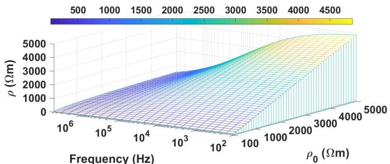  
(a)

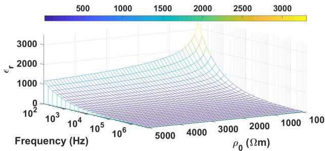  
(b)   
Fig. 1: Soil parameters proposed by CIGRE: (a) resistivity and ` (b) relative permittivity.

injected current waveform in time-domain and its spectrum are exhibited in Fig.3.

Regarding the effects caused by the direct lightning strike at the blade, the transient voltages generated at the blade (point $\mathbf { A } )$ and at the tower base (point B) are computed for a tower above a homogeneous soil characterized by its frequencydependent parameters using (2) and (3) for a frequency range of 100 Hz to 10 MHz. Three values of low-frequency resistivities $\rho _ { 0 }$ are adopted: 1 k, 2.5 k and 5 kΩ.m and these simulations are labeled as $^ { * } \rho ( \omega ) , \varepsilon _ { r } ( \omega ) ^ { * }$ All the voltages waveforms rare compared to those computed considering the frequencyconstant soil model labeled as $\ " \rho , \varepsilon _ { r } \} \ "$ . In this scenario, it is rassumed a constant resistivity ρ of 1 k, 2.5 k and 5 kΩ.m. and a constant relative permittivity $\varepsilon _ { r }$ of 6.

rThe developed voltage waveforms at the blade and tower base for each soil are illustrated in Figs. 4 and 5, respectively. As it can be seen, the transient voltage waveforms are significantly modified when the frequency-dependent soil model (dash lines) is used in comparison with those results with the frequency constant soil model (solid lines). The percentage deviation $\Delta$ is calculated in each case, being $\Delta$ $\begin{array} { r l } { \mathrm { ~ } } & { { } \dot { \mathbf { \Gamma } } = \ \frac { V _ { \mathrm { p } } ^ { C } - \dot { V _ { \mathrm { p } } ^ { D } } } { V _ { \mathrm { n } } ^ { C } } \times 1 0 0 \% } \end{array}$ where V $V _ { \mathfrak { p } } ^ { C }$ and $V _ { \mathfrak { p } } ^ { D }$ are first the peak Vfor frequency-constant (C) and frequency-dependent (D) soil model. As shown in the Fig. 4, the voltage peaks at the blade (point A) have shown no significant difference when the frequency-dependent soil model is considered in comparison to those computed with the frequency-constant soil. This fact is confirmed for the percentage variation $\Delta$ which is lower than 1.50%. In relation to the temporal evolution of the transient voltages, the soil resistivity plays an expressive

role especially at the subsequent voltage peaks where the frequency-dependent soil model produces oscillations whose peaks are higher than those generated with the frequencyconstant soil, up to the steady state.

From Fig. 5, the transient ground potential rise (GPR) is much lower than the voltages computed at the top of the blade. This occurs due to the conductive behavior of the soil where the grounding system (GS) is buried which the lowest soil resistivity has developed the lowest voltage at the base. Furthermore, the frequency-dependent soil model has presented a significant impact, especially at the voltage peaks where the maximum percentage deviation Δ is around 65% lower than those GPR computed under the assumption

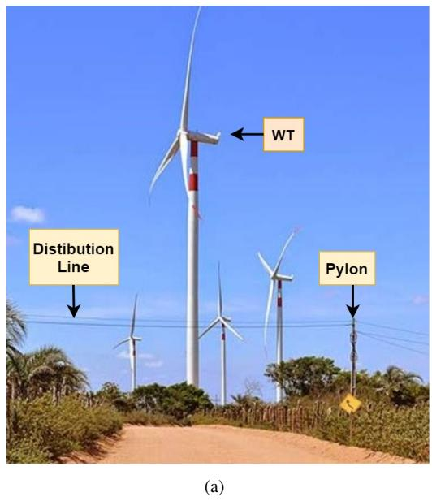

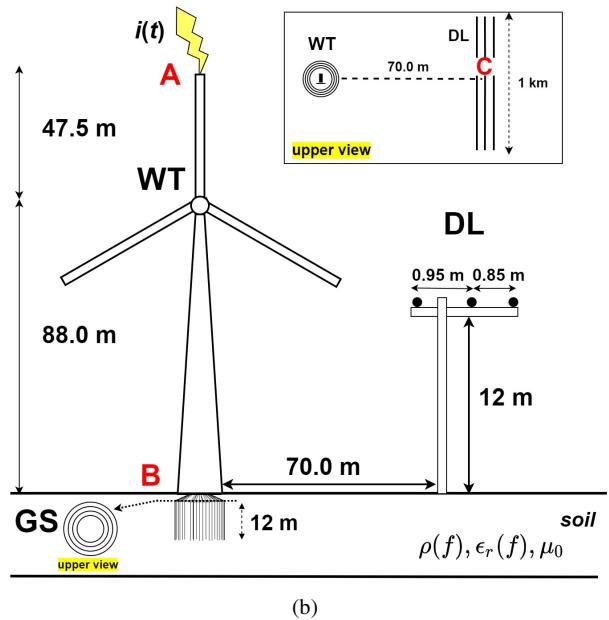  
Fig. 2: (a) Wind Farm in Caetes, in Pernambuco state, Brazil. ´ (Adapted from [14]). (b) Illustration of the study case. (Not to scale)

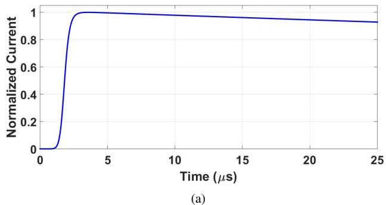

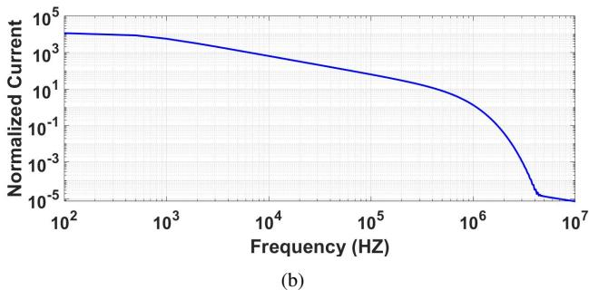  
Fig. 3: (a) Waveform of the lightning strike (b) Frequency spectrum.

of frequency-constant model in a 5 kΩm soil. As the soil resistivity increases, the frequency dependence on the soil parameters has an expressive impact on the transient responses. In high-resistive soils, the capacitive behavior is predominant for the harmonic impedance of the GS due to displacement currents especially at the high frequencies which will impact the impulse impedance of the GS [17]. This fact plays a significant role in the reflected waves from the tower base, which affect the oscillatory behavior of the time-domain voltages of the blade and GPR, characterized by the multiple peaks. Based on the results, high-resistive soils have a high influence on the transient GPR where for practical applications this frequency effect can not be neglected. As recommended by CIGRE in table 5.1 [13], the frequency dependence of the ` soil must be considered for soil with resistivity greater than 700 Ωm.

Regarding the indirect effects caused by lightning strike at the blade, the transient induced voltages generated at the midpoint (point C) of the overhead DL depicted in Fig.2-b for the three soils are shown in Fig. 6. As noted in this figure, the induced voltages may present an expressive modification when the frequency-dependent soil is employed, especially for high-resistive soils. As illustrated, the induced voltage for the soil of 1 kΩm has shown no significant impact when the frequency dependency effect is assumed when compared with the one calculated by frequency-constant soil, resulting in $\Delta \ : = \ : 1 2 . 5 0 \%$ . However, for the soils of 2.50 k and 5 kΩm, the opposite case is observed in the temporal responses, where the waveforms are significantly modified and more oscillatory behavior is seen for the frequency-dependent soil. It can be noted in Fig.6-b that the first peak $\dot { V } _ { p } ^ { D }$ is lower than

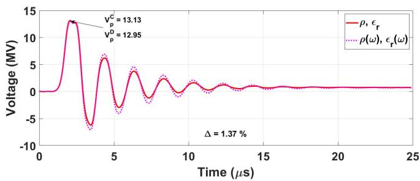

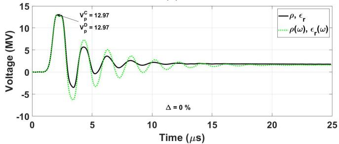  
(a)

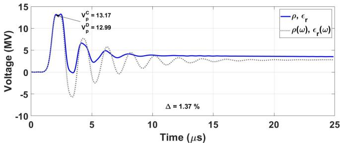  
(b)   
(c)   
Fig. 4: Voltage waveforms developed at blade (Point A) for soils of: (a) 1 kΩm (b) 2.5 kΩm (c) 5 kΩm;

the one computed for the frequency-constant soil $V _ { p } ^ { C }$ , where pthis condition is inverted for the soil of 5 kΩm in Fig.6-c, with an expressive Δ of -78%, approximately. The frequency dependence of the soil parameters results in the increasing of the conductivity $\sigma _ { g } ( f ) = 1 / \rho _ { g } ( f )$ with the increasing frequency, g gwhich leads to a condition of perfect conducting soil. The induced voltages present lower peaks than those computed with frequency-constant soil parameters, especially for highresistive soils [18], [19]. As seen in Fig.3-a, due to its high steepness in the lightning current, this signal contains a wide frequency content which the effect of the frequency dependence of the soil electrical parameters $( \rho _ { g } ( f ) , \varepsilon _ { r } ( f ) )$ is very expressive, especially at the higher frequencies for poorly conducting soils.

Concerning the lightning-induced voltages, the radial component of the electric field is significantly affected by the horizontal distance from the injection point, ground resistivity and frequency content of the current [see Fig. 4 in [20]]. When high reliability is required, CIGRE in table 5.1 [13] recom- ` mends for overhead distribution lines located on soils with resistivity greater than 2,500 Ω.m, the frequency-dependence of soil electrical parameters must be considered for adequate

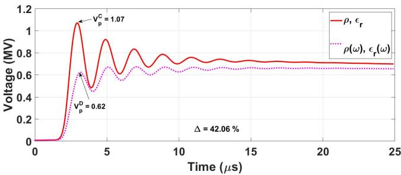

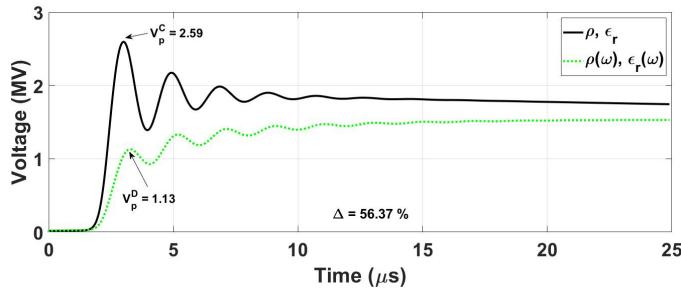  
(a)

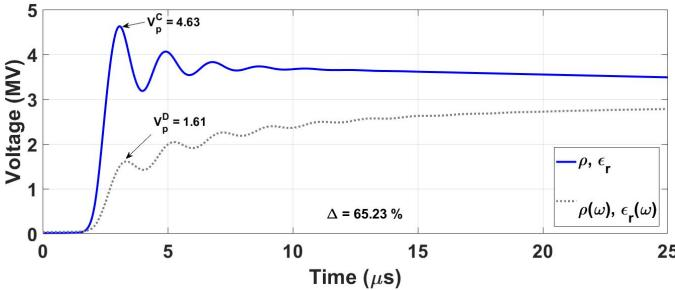  
  
(c)   
Fig. 5: Voltage waveforms (GPR) developed at base of the tower (Point B) for soils of: (a) 1 kΩm (b) 2.5 kΩm (c) 5 kΩm;

computation of lightning-induced voltages on overhead lines.

# IV. CONCLUSIONS

This paper has investigated the influence of the frequencydependent soil model on voltages along a wind turbine and on induced voltages on a distribution line, based on a realistic scenario in a wind farm in Brazil. For this analysis,the frequencydependent soil model proposed by CIGRE was adopted and the ` responses were compared to those computed with frequencyconstant soil under the same values of soil resistivity.

Results revealed that for high-resistive soil, the developed voltages at the injection point (blade) of the WT have presented no expressive variation at their peak values for both soils. However, assuming the frequency-dependent soil model, the voltages present an oscillatory behavior characterized by subsequent peaks higher than those generated with the frequency-constant soil model. The GPR waveform (at the tower base) is much lower than the developed voltages at the blade where voltage peaks are significantly reduced in comparison to those computed for the frequency-constant soils. The difference between the peaks for both soil models increases as the soil resistivity increases. Finally, the induced

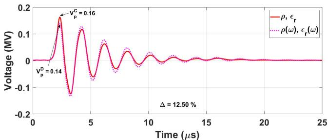

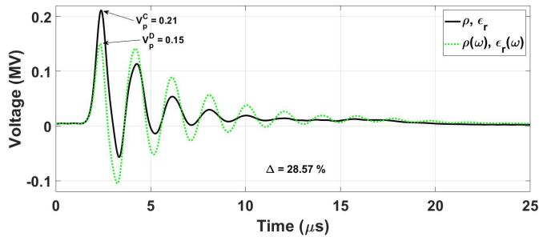  
(a)

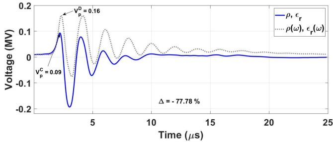  
(b)   
  
Fig. 6: Induced voltage waveforms developed on the DL at point C (midpoint) for soils of: (a) 1 kΩm (b) 2.5 kΩm (c) 5 kΩm;

voltages on the overhead distribution line near the hit wind tower have a pronounced variation when the ground is represented by its frequency-dependent soil parameters also depending on the soil resistivity. As demonstrated, the lightninginduced voltages have higher peaks when frequency-constant soil are assumed. On the other hand, frequency-dependent soil becomes more conductive as the frequency increases the induced voltage peaks are lower than those calculated for the frequency-constant soil. The reduction is more pronounced for the subsequent return stroke due to its higher energy at the higher frequencies, especially for the line located on highresistivity soil.

The results provided in this paper have shown the importance of taking into account the frequency dependence on the soil electrical parameters for a precise computation of the transient responses in wind farms close to distribution lines.

# REFERENCES

[1] ONS, 2021, [Online: accessed on November 03, 2021]. [Online]. Available: https://www.ons.org.br/Paginas/Noticias/20201006- ONS-lanc¸a-infografico-mostrando-evoluc¸ ´ ao-da-gerac¸ ˜ ao-e ˜ olica.aspx ´   
[2] S. Rusck, “Induced lightning over-voltages on power-transmission lines with special reference to the over-voltage protection of low voltage networks,” Trans. Royal Intitute of Technology, Stockholm, 1958.

[3] F. Rachidi, C. Nucci, M. Ianoz, and C. Mazzetti, “Influence of a lossy ground on lightning-induced voltages on overhead lines,” IEEE Transactions on Electromagnetic Compatibility, vol. 38, no. 3, pp. 250– 264, 1996.   
[4] J. O. S. Paulino and C. F. Barbosa, “On lightning-induced voltages in overhead lines over high-resistivity ground,” IEEE Transactions on Electromagnetic Compatibility, vol. 61, no. 5, pp. 1499–1506, 2019.   
[5] “IEEE Guide for Improving the Lightning Performance of Electric Power Overhead Distribution Lines,” IEEE Std. 1410-2010, pp. 1–73, 2011.   
[6] Bo Zhang, Jinliang He, Jae-Bok Lee, Xiang Cui, Zhibin Zhao, Jun Zou, and Sug-Hun Chang, “Numerical analysis of transient performance of grounding systems considering soil ionization by coupling moment method with circuit theory,” IEEE Transactions on Magnetics, vol. 41, no. 5, pp. 1440–1443, May 2005.   
[7] X. Zhang, Y. Zhang, and C. Liu, “A complete model of wind turbines for lightning transient analysis,” Journal of Renewable and Sustainable Energy, vol. 6, no. 1, p. 013113, 2014.   
[8] A. S. Zalhaf, M. Abdel-Salam, D.-E. A. Mansour, S. Ookawara, and M. Ahmed, “Assessment of wind turbine transient overvoltages when struck by lightning: experimental and analytical study,” IET Renewable Power Generation, vol. 13, no. 8, pp. 1360–1368, 2019.   
[9] A. R. J. Araujo, J. S. L. Colqui, S. Kurokawa, and J. Pissolato, “A ´ new approach to compute grounding impedance of rods in a frequency dependent multi-layer soil,” in 2020 IEEE Power Energy Society General Meeting (PESGM), 2020, pp. 1–5.   
[10] A. R. de Araujo, J. S. Colqui, C. M. de Seixas, S. Kurokawa, ´ B. Salarieh, J. Pissolato Filho, and B. Kordi, “Computation of ground potential rise and grounding impedance of simple arrangement of electrodes buried in frequency-dependent stratified soil,” Electric Power Systems Research, vol. 198, p. 107364, 2021. [Online]. Available: https://www.sciencedirect.com/science/article/pii/S037877962100345X   
[11] M. Nazari, R. Moini, S. Fortin, F. P. Dawalibi, and F. Rachidi, “Impact of frequency-dependent soil models on grounding system performance for direct and indirect lightning strikes,” IEEE Transactions on Electromagnetic Compatibility, vol. 63, no. 1, pp. 134–144, 2021.   
[12] J. Meppelink, R. Andolfato, and D. Cuccarollo, “Calculation of lightning effects in the frequency domain with a program based on hybrid methods,” in International Colloquium on Lightning and Power Systems, June 2016.   
[13] C. W. G. C4.33, “Impact of soil-parameter frequency dependence on the response of grounding electrodes and on the lightning performance of electrical systems,” Technical Brochure 781, 2019.   
[14] FETAP, 2021, [Online: accessed on October 30, 2021]. [Online]. Available: https://www.fetape.org.br/noticiasdetalhe/fetape-e-strs-debatem-impactos-dos-parques-eolicos-na-regiaodo-agreste/6265.YYAtIZ7MLIU   
[15] L. Yang, G. Wu, and X. Cao, “An optimized transmission line model of grounding electrodes under lightning currents,” Science China Technological Sciences, vol. 56, no. 2, pp. 335–341, 2013.   
[16] R. Araneo and S. Celozzi, “Transient behavior of wind towers grounding systems under lightning strikes,” International Journal of Energy and Environmental Engineering, vol. 7, no. 2, pp. 235–247, 2016.   
[17] R. Alipio and S. Visacro, “Modeling the frequency dependence of electrical parameters of soil,” IEEE Transactions on Electromagnetic Compatibility, vol. 56, no. 5, pp. 1163–1171, 2014.   
[18] F. H. Silveira, S. Visacro, R. Alipio, and A. De Conti, “Lightninginduced voltages over lossy ground: The effect of frequency dependence of electrical parameters of soil,” IEEE Transactions on Electromagnetic Compatibility, vol. 56, no. 5, pp. 1129–1136, 2014.   
[19] K. Sheshyekani and M. Akbari, “Evaluation of lightning-induced voltages on multiconductor overhead lines located above a lossy dispersive ground,” IEEE Transactions on Power Delivery, vol. 29, no. 2, pp. 683– 690, 2014.   
[20] M. Akbari, K. Sheshyekani, A. Pirayesh, F. Rachidi, M. Paolone, A. Borghetti, and C. A. Nucci, “Evaluation of lightning electromagnetic fields and their induced voltages on overhead lines considering the frequency dependence of soil electrical parameters,” IEEE Transactions on Electromagnetic Compatibility, vol. 55, no. 6, pp. 1210–1219, Dec 2013.