# Impedance Based Stability Analysis of the Multi-terminal Cascaded Hybrid HVDC System

Ruiting Xu , Student Member, IEEE, Qin Jiang , Member, IEEE, Baohong Li , Yikui Liu , Tianqi Liu , Senior Member, IEEE, Frede Blaabjerg , Fellow, IEEE, and Peng Wang , Fellow, IEEE

Abstract—The cascaded hybrid high voltage direct current (HVDC) combines the strengths of the line commutated converter (LCC) and the modular multilevel converter (MMC) in the long distance large capacity power transmission. However, its distributed muti-terminal grid structure raises the complexity of the whole system drastically. To clarify the oscillation mechanism of the multiterminal cascaded hybrid HVDC system, utilizing the merits of the impedance model, this paper proposes an impedance based stability analysis method, which decomposes stability analysis problem into a hierarchical structure. In addition, an equivalent single-input single-output (SISO) impedance based method is proposed together for oscillation propagation analysis, which could depict how the oscillation spread from the perspective of the physical impedance network. Oscillation suppressing methods including impedance reshaping and parameter retuning could be tailored with the instruction of the impedance based stability analysis and thereby efficiency is improved considerably. The analytical results and the control method are verified through the electromagnetic transient simulation with practical data.

Index Terms—Impedance stability, cascaded hybrid HVDC, sensitivity analysis, propagation, impedance reshaping.

# I. INTRODUCTION

H IGH voltage direct current (HVDC) has become the main-stream technology for long-distance, high-capacity power transmission. Based on the type of converters, HVDC projects can be categorized as line commutated converter based HVDC (LCC-HVDC) and the voltage source converter based HVDC (VSC-HVDC), in which the former is more applied in the case of long distance and large capacity transmission, but potentially introduces the risk of commutation failure on the AC side [1], [2], while the latter can avoid the risk, but raises the investment cost as well as the complexity of DC fault handling [3], [4].

Received 4 November 2024; revised 5 March 2025; accepted 8 April 2025. Date of publication 15 April 2025; date of current version 19 May 2025. This work was supported by Sichuan Science and Technology Program under Grant 2024NSFSC0865 and Grant 2025NSFSC2037. Paper no. TPWRD-01662-2024. (Corresponding author: Qin Jiang.)

Ruiting Xu, Qin Jiang, Baohong Li, Yikui Liu, and Tianqi Liu are with the College of Electrical Engineering, Sichuan University, Chengdu 610065, China (e-mail: xuruiting322@163.com; jiangqin_jq@126.com; scu_lbh@163.com; yikuiliu89@outlook.com; tqliu@scu.edu.cn).

Frede Blaabjerg is with the Institute of Energy Technology, Aalborg University, 9220 Aalborg, Denmark (e-mail: fbl@et.aau.dk).

Peng Wang is with the School of Electrical and Electronic Engineering, Power Division, Nanyang Technological University, Singapore 639798 (e-mail: epwang@ntu.edu.sg).

Color versions of one or more figures in this article are available at https://doi.org/10.1109/TPWRD.2025.3561086.

Digital Object Identifier 10.1109/TPWRD.2025.3561086

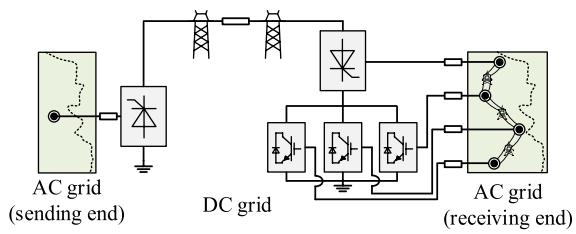  
Fig. 1. Layout of the multi-terminal cascaded hybrid HVDC system.

Cascaded hybrid HVDC, as an advancement, could combine the merits of LCC-HVDC and VSC-HVDC, while avoiding their shortcomings [5], [6], [7]. As shown in Fig. 1, a pilot cascaded hybrid HVDC project in China [8], [9] has its receiving ends connected to the AC grid in a distributed way, forming a hybrid station that contains one LCC station and three modular multi-level converters (MMC). The three MMCs can not only undertake the long distance power transmission from the sending end, but also form a DC grid on the receiving end for inter area connection whenever required.

With the intensive configuration of the HVDC converters, the cascaded hybrid HVDC system is prone to the stability issue in a wide frequency range [10], [11]. To this end, efforts are devoted for analyzing the stability of cascaded hybrid HVDC systems based on either the state space models [12], [13] or the impedance models [14]. However, references [12], [13], [14] consider only one MMC on the receiving end with a simplified ac grid structure. The multi-terminal cascaded hybrid HVDC contains three MMCs of different control modes, which contribute to the system stability in different ways. In addition, tie lines of the AC and DC grids can bring in complex interaction between the converters and influence propagation routes of the oscillation. To clarify influence of these factors, it is necessary to model the multi-terminal structure of the hybrid cascaded HVDC.

The impedance based stability analysis methods have the merits of being compact, modularizable, and particularly appropriate for the black-box or grey-box models provided by the converter vendors [15], [16], such as being applied on the cascaded hybrid HVDC systems. For systems that contain multiple HVDC converters in a grid structure, multi-input multi-output (MIMO) impedance models are developed for their modularized description [17], [18]. References [19], [20], [21] analyze the stability of the hybrid AC/DC grid with the frequency-domain

modal analysis (FMA) method. However, this method obtains the eigenvalues of the system through solving the analytical admittance function, which prerequisites the knowledge of converters’ internal dynamics. By contrast, references [22], [23], [24] analyze the stability problem of the multi-terminal HVDCs with the MIMO impedance based method and Nyquist curves. Although directly studying impedance curves bypasses the obstacle of knowing converters’ internal dynamics in advance, considering merely the DC grid in references [22], [23], [24] for simplification urges further advancement for this method becoming applicable on the cascaded hybrid HVDC.

The above impedance stability criterions can merely judge the system stability, while the mechanism of oscillation as well as its propagation in the system remains unraveled. Reference [25] utilizes the branch observability for analyzing the oscillation propagation route. This method can indicate the consequence of oscillation but fails to explain how the oscillation would spread to other nodes. Reference [26] proposed a block diagonal dominance based method partitioning the whole system into two areas based on partition factors of the nodes while losing detailed topology information. In a multi-terminal cascaded hybrid HVDC system, customized analysis is usually required for explaining impacts of each converter’s and grids’ characteristics on individual propagation route. Indeed, simply with the method proposed in reference [26], the specific propagation routes between different nodes can hardly be clearly identified.

To address the challenges in the multi-terminal cascaded hybrid HVDC system stated above, an impedance based approach is developed on the basis of the prior arts to analyze and suppress the oscillation problems in the multi-terminal cascaded hybrid HVDC. Contributions of this paper are as follows:

1) An accurate impedance model of the multi-terminal cascaded hybrid HVDC system is proposed, with a more complete description of the interaction relationships through the receiving end’s multi-terminal structure.   
2) To intutively analyze the interaction relationships between nodes in the whole system, an equivalent single-input single-output (SISO) impedance based oscillation propagation analyzing method is proposed.   
3) An improved comprehensive impedance based stability analyzing method for the multi-terminal cascaded hybrid HVDC system is proposed, which can be well integrated with the impedance based oscillation suppressing method.

The rest of this paper is organized as follows: Section II establishes the MIMO impedance model of the multi-terminal cascaded hybrid HVDC system and verifies it with the simulation result; In Section III, the impedance stability analysis method for the multi-terminal cascaded hybrid HVDC system, as well as the oscillation propagation analysis method are proposed; Case studies are presented in Section IV, and Section V summarizes the conclusions.

# II. IMPEDANCE MODEL OF THE MULTI-TERMINAL CASCADEDHYBRID HVDC SYSTEM

In this section, we first build the MIMO impedance model for the multi-terminal cascaded hybrid HVDC. Referring to a

TABLE I CONTROL MODES OF THE CONVERTERS   

<table><tr><td>Converter (#number)</td><td>Control mode</td></tr><tr><td>LCC1 (#1)</td><td>Constant DC current</td></tr><tr><td>LCC2 (#2)</td><td>Constant DC voltage</td></tr><tr><td>MMC1 (#3)</td><td>Constant DC voltage &amp; Constant reactive power</td></tr><tr><td>MMC2 (#4)</td><td>Constant active power &amp; Constant reactive power</td></tr><tr><td>MMC3 (#5)</td><td>Constant active power &amp; Constant reactive power</td></tr></table>

practical multi-terminal cascaded hybrid HVDC system [8], [9], its equivalent circuit is shown in Fig. 2 and the control modes of its converters are listed in Table I. The sending end of the multiterminal cascaded hybrid HVDC consists of a double 12-pulse LCC (i.e., LCC1) and the receiving end contains an LCC (i.e., LCC2) and three MMCs (i.e., MMC1 to MMC3). The DC side of the MMCs are shunted and then cascaded with the LCC, while the AC side of the converters at the receiving end are connected to the AC grid in a distributed way.

As shown in Fig. 2, $Z _ { \mathrm { d c f 1 } }$ and $Z _ { \mathrm { d c f 2 } }$ respectively represent the DC filters of LCC1 and LCC2; $Z _ { \mathrm { a c f 1 } }$ and $Z _ { \mathrm { a c f 2 } }$ respectively represent the AC filters of LCC1 and LCC2; and $Z _ { \mathrm { t r a p } }$ is a notch filter. $L _ { \mathrm { d 1 } }$ and $L _ { \mathrm { d 2 } }$ are respectively the smoothing reactors of the sending end and the receiving end. $L _ { \mathrm { d 3 } }$ represents the current limiting reactors of the MMCs. The $\mathrm { A C }$ systems of the two ends are represented by resistances $R _ { i j }$ and inductances $L _ { i j } ,$ where $i , j$ = 1, 2, 3, 4, 5. $R _ { i j }$ and $L _ { i j }$ represent strengths of the AC systems when $i = j ,$ and the interconnection relationships between the converters when $i { \neq } j$ . The detailed parameters of the system can be found in the Appendix.

# A. Impedance Models of the Converters

Before introducing the model of the whole system, impedance models of the converters are firstly built. With the variation of the commutation angle being taken into consideration, the impedance models of the LCCs are established according to the method proposed in our previous work [28]. The impedance model of the MMCs can be established with methods including the harmonic state space [29] or the dynamic phasor [30], considering the internal dynamics of the circulating current. In this paper, the impedance model of MMC is established according to [29] and then are truncated into 3×3 matrices under the sequence frame according to [31]. Proof of the model truncation can be found in Appendix.

To avoid right half plane (RHP) poles, the input and output variables of the impedance model are selected with respect to the control modes [32]. With constant DC current control and constant active power control modes, the impedance model of LCC1, MMC2, and MMC3 can be represented as in (1). Subscript i sequentially indexes the converters listed in Table I. $\Delta \nu _ { \mathrm { a c p } i } , \Delta \nu _ { \mathrm { a c n } i } , \Delta \nu _ { \mathrm { d c } i } , \Delta i _ { \mathrm { a c p } i } , \Delta i _ { \mathrm { a c n } i }$ and $\Delta i _ { \mathrm { d c } i }$ refer to currents and voltages of converter $i ; Y _ { \mathrm { p p C } i } , Y _ { \mathrm { p n C } i } , Y _ { \mathrm { p d c C } i } , Y _ { \mathrm { n p C } i } ,$ $Y _ { \mathrm { n n C } i } , Y _ { \mathrm { n d c C } i } , Y _ { \mathrm { d c p C } i } , Y _ { \mathrm { d c n C } i }$ and $Y _ { \mathrm { d c d c C } i }$ refer to admittances of the ith converter. Subscripts $\ " \mathrm { p } \ : \mathrm { \cdot } \ : \mathrm { \cdot }$ and $\ " _ { \mathrm { \Omega } } \cdot \boldsymbol { \mathrm { n } } \boldsymbol { \mathrm { \Omega } } ,$ respectively represent “positive sequence” and “negative sequence”. In $( 2 ) , Y _ { \mathrm { a c a c C } i }$ represents the $\mathrm { A C }$ admittance matrix; $Y _ { \mathrm { a c d c C } i }$ and $Y _ { \mathrm { d c a c C } \ i }$ are

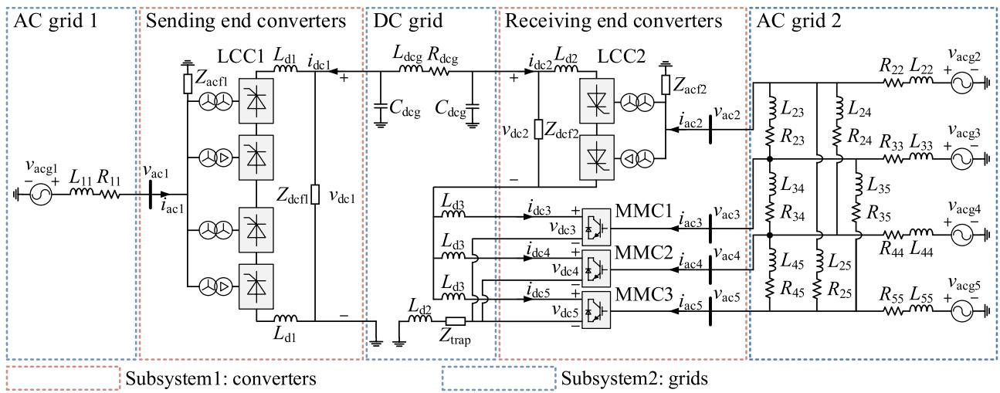  
Fig. 2. Circuit diagram of the multi-terminal cascaded hybrid HVDC system.

the coupling admittance matrices between the AC and DC sides; and $Y _ { \mathrm { d c d c C } } .$ i represents the DC admittance of converter i.

$$
\begin{array}{l} \left[ \begin{array}{c} \Delta i _ {\mathrm {a c p} i} (s + j \omega_ {1}) \\ \Delta i _ {\mathrm {a c n} i} (s - j \omega_ {1}) \\ \dots \\ \Delta i _ {\mathrm {d c} i} (s) \end{array} \right] = \left[ \begin{array}{c c c} Y _ {\mathrm {p p C i}} & Y _ {\mathrm {p n C i}} & Y _ {\mathrm {p d c C i}} \\ Y _ {\mathrm {n p C i}} & Y _ {\mathrm {n n C i}} & Y _ {\mathrm {n d c C i}} \\ Y _ {\mathrm {d c p C i}} & Y _ {\mathrm {d c n C i}} & Y _ {\mathrm {d c d c C i}} \end{array} \right] \left[ \begin{array}{c} \Delta v _ {\mathrm {a c p} i} (s + j \omega_ {1}) \\ \Delta v _ {\mathrm {a c n} i} (s - j \omega_ {1}) \\ \dots \\ \Delta v _ {\mathrm {d c} i} (s) \end{array} \right] \\ \left[ \begin{array}{l} \Delta i _ {\mathrm {a c} i} \\ \Delta i _ {\mathrm {d c} i} \end{array} \right] = \left[ \begin{array}{c c} Y _ {\mathrm {a c a c C i}} & Y _ {\mathrm {a c d c C i}} \\ Y _ {\mathrm {d c a c C i}} & Y _ {\mathrm {d c d c C i}} \end{array} \right] \left[ \begin{array}{l} \Delta v _ {\mathrm {a c} i} \\ \Delta v _ {\mathrm {d c} i} \end{array} \right] \tag {1} \\ \end{array}
$$

With the constant DC voltage control mode, the impedance model of LCC2 and MMC1 is shown in (2) and (3), which can be converted from (1). In (2), $Y _ { \mathrm { \mathrm { ~ d c a c C } } i }$ represents the AC admittance matrix; $\pmb { H } _ { \mathrm { a c d c C } i }$ and $\pmb { H } _ { \mathrm { d c a c C } i }$ are the coupling coefficient matrices between the AC and DC sides; and $Z _ { \mathrm { d c d c C } i }$ represents the DC impedance matrix.

$$
\left[ \begin{array}{c} \Delta i _ {\mathrm {a c p} i} (s + j \omega_ {1}) \\ \Delta i _ {\mathrm {a c n} i} (s - j \omega_ {1}) \\ \vdots \\ \Delta v _ {\mathrm {d c} i} (s) \end{array} \right] = \left[ \begin{array}{c c c} Y _ {\mathrm {p p C i}} ^ {\prime} & Y _ {\mathrm {p n C i}} ^ {\prime} & H _ {\mathrm {p d c C i}} \\ Y _ {\mathrm {n p C i}} ^ {\prime} & Y _ {\mathrm {n n C i}} ^ {\prime} & H _ {\mathrm {n d c C i}} \\ H _ {\mathrm {d c p C i}} & H _ {\mathrm {d c n C i}} & Z _ {\mathrm {d c d c C i}} \end{array} \right] \left[ \begin{array}{c} \Delta v _ {\mathrm {a c p} i} (s + j \omega_ {1}) \\ \Delta v _ {\mathrm {a c n} i} (s - j \omega_ {1}) \\ \vdots \\ \Delta i _ {\mathrm {d c} i} (s) \end{array} \right]
$$

$$
\left[ \begin{array}{l} \Delta \boldsymbol {i} _ {\mathrm {a c i}} \\ \Delta v _ {\mathrm {d c i}} \end{array} \right] = \left[ \begin{array}{c c} \Downarrow & \\ \boldsymbol {Y} ^ {\prime} _ {\mathrm {a c a c C i}} & \boldsymbol {H} _ {\mathrm {a c d c C i}} \\ \boldsymbol {H} _ {\mathrm {d c a c C i}} & Z _ {\mathrm {d c d c C i}} \end{array} \right] \left[ \begin{array}{l} \Delta \boldsymbol {v} _ {\mathrm {a c i}} \\ \Delta i _ {\mathrm {d c i}} \end{array} \right] \tag {2}
$$

$$
\left\{ \begin{array}{l} \boldsymbol {Y} _ {\text {a c a c C i}} ^ {\prime} = \boldsymbol {Y} _ {\text {a c a c C i}} - \boldsymbol {Y} _ {\text {a c d c C i}} Y _ {\text {d c d c C i}} ^ {- 1} \boldsymbol {Y} _ {\text {d c a c C i}} \\ \boldsymbol {H} _ {\text {a c d c C i}} = \boldsymbol {Y} _ {\text {a c d c C i}} Y _ {\text {d c d c C i}} ^ {- 1} \\ \boldsymbol {H} _ {\text {d c a c C i}} = - Y _ {\text {d c d c C i}} ^ {- 1} \boldsymbol {Y} _ {\text {d c a c C i}} \\ Z _ {\text {d c d c C i}} = Y _ {\text {d c d c C i}} ^ {- 1} \end{array} \right. \tag {3}
$$

We summarize the input and output variables of the five converters in Table II.

To verify the accuracy of the introduced impedance models, numerical simulation results of the multi-terminal cascaded hybrid HVDC system as shown in Fig. 2 are compared in Fig. 3. In (1) and (2), variable s is substituted by $j 2 \pi f _ { \mathrm { d c } }$ in calculating the impedance curves, where $f _ { \mathrm { d c } }$ represents the frequency of the DC side perturbation. Parameters of the system during the frequency sweeping simulation can be found in the Appendix, where the grid parameters are the same as Table VII. Considering the space limit, the impedance matrices of LCC1 and MMC1 with two

TABLE II NODE VARIABLES OF THE IMPEDANCE MATRICES   

<table><tr><td>Converter</td><td>Input</td><td>Output</td></tr><tr><td>LCC1</td><td>[Δvacp1, Δvacn1, Δvdc1]</td><td>[Δiacp1, Δiacn1, Δidc1]</td></tr><tr><td>LCC2</td><td>[Δvacp2, Δvacn2, Δidc2]</td><td>[Δiacp2, Δiacn2, Δvdc2]</td></tr><tr><td>MMC1</td><td>[Δvacp3, Δvacn3, Δidc3]</td><td>[Δiacp3, Δiacn3, Δvdc3]</td></tr><tr><td>MMC2</td><td>[Δvacp4, Δvacn4, Δvdc4]</td><td>[Δiacp4, Δiacn4, Δidc4]</td></tr><tr><td>MMC3</td><td>[Δvacp5, Δvacn5, Δvdc5]</td><td>[Δiacp5, Δiacn5, Δidc5]</td></tr></table>

different control modes, instead of all of them, are provided. The red circles are the results of simulation and the blue lines are the calculated impedance curves. It can be seen from Fig. 3 that the calculated impedance matrices of both LCC1 and MMC1 are accurate, providing sound support for the following stability analysis.

# B. Impedance Based Stability Analysis of the Multi-terminal Cascaded Hybrid HVDC System

Impedance matrices of all the individual converters can be integrated as in the compact form shown in (4) and (5) to describe the dynamic characteristics of the entire system. $Y _ { \mathrm { { C } } }$ is defined as in (6) and (7). $Y _ { \mathrm { a c a c C } i } , Y _ { \mathrm { a c d c C } i } , Y _ { \mathrm { d c a c C } i } , H _ { \mathrm { a c d c C } i } , H _ { \mathrm { d c a c C } i }$ , $Y _ { \mathrm { d c d c C } i }$ and $Z _ { \mathrm { d c d c C } i }$ are defined as in (1) and (2).

$$
\Delta \boldsymbol {y} = \boldsymbol {Y} _ {\mathrm {C}} \Delta \boldsymbol {u} \tag {4}
$$

$$
\left\{ \begin{array}{l} \Delta \boldsymbol {u} = \left[ \Delta v _ {\mathrm {a c p} 1} \Delta v _ {\mathrm {a c n} 1} \Delta v _ {\mathrm {a c p} 2} \Delta v _ {\mathrm {a c n} 2} \Delta v _ {\mathrm {a c p} 3} \Delta v _ {\mathrm {a c n} 3} \Delta v _ {\mathrm {a c p} 4} \right. \\ \Delta v _ {\mathrm {a c n} 4} \Delta v _ {\mathrm {a c p} 5} \Delta v _ {\mathrm {a c n} 5} \Delta v _ {\mathrm {d c} 1} \Delta i _ {\mathrm {d c} 2} \Delta i _ {\mathrm {d c} 3} \Delta v _ {\mathrm {d c} 4} \Delta v _ {\mathrm {d c} 5} ] ^ {\mathrm {T}} \\ \Delta \boldsymbol {y} = \left[ \Delta i _ {\mathrm {a c p} 1} \Delta i _ {\mathrm {a c n} 1} \Delta i _ {\mathrm {a c p} 2} \Delta i _ {\mathrm {a c n} 2} \Delta i _ {\mathrm {a c p} 3} \Delta i _ {\mathrm {a c n} 3} \Delta i _ {\mathrm {a c p} 4} \right. \\ \left. \Delta i _ {\mathrm {a c n} 4} \Delta i _ {\mathrm {a c p} 5} \Delta i _ {\mathrm {a c n} 5} \Delta i _ {\mathrm {d c} 1} \Delta v _ {\mathrm {d c} 2} \Delta v _ {\mathrm {d c} 3} \Delta i _ {\mathrm {d c} 4} \Delta i _ {\mathrm {d c} 5} \right] ^ {\mathrm {T}} \end{array} \right. \tag {5}
$$

$$
\boldsymbol {Y} _ {\mathrm {C}} = \left[ \begin{array}{l l} \boldsymbol {Y} _ {\text {a c a c C}} & \boldsymbol {Y} _ {\text {a c d c C}} \\ \boldsymbol {Y} _ {\text {d c a c C}} & \boldsymbol {Y} _ {\text {d c d c C}} \end{array} \right] \tag {6}
$$

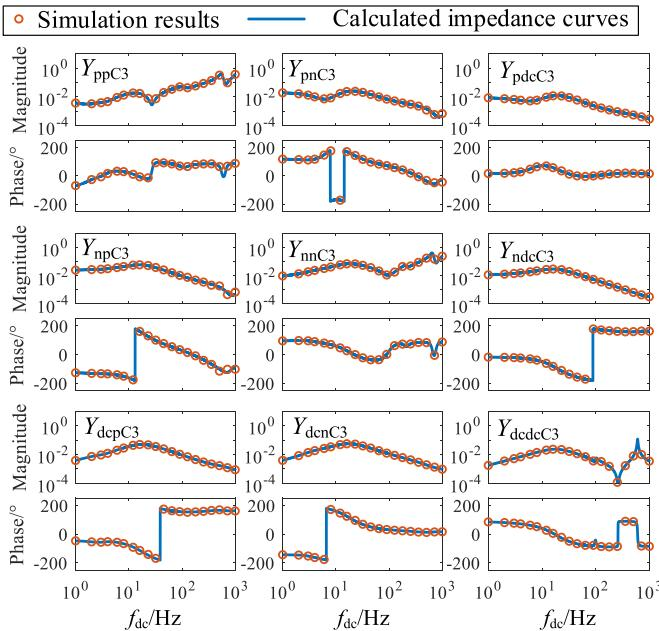

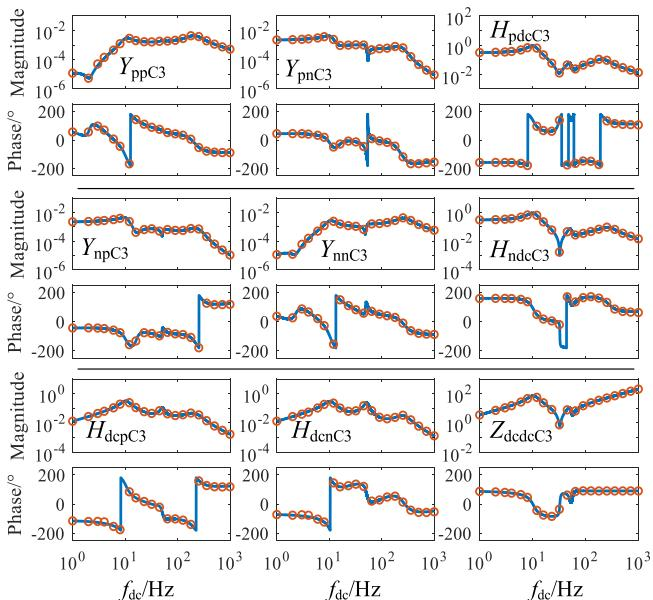  
(@)   
(b)   
Fig. 3. Verification of the analytical impedance models. (a) LCC1. (b) MMC1.

$$
\left\{ \begin{array}{l} \boldsymbol {Y} _ {\text {a c a c C}} = \operatorname {d i a g} \left[ \boldsymbol {Y} _ {\text {a c a c C 1}} \boldsymbol {Y} _ {\text {a c a c C 2}} \dots \boldsymbol {Y} _ {\text {a c a c C 5}} \right] \\ \boldsymbol {Y} _ {\text {a c d c C}} = \operatorname {d i a g} \left[ \boldsymbol {Y} _ {\text {a c d c C 1}} \boldsymbol {H} _ {\text {a c d c C 2}} \dots \boldsymbol {Y} _ {\text {a c d c C 5}} \right] \\ \boldsymbol {Y} _ {\text {d c a c C}} = \operatorname {d i a g} \left[ \boldsymbol {Y} _ {\text {d c a c C 1}} \boldsymbol {H} _ {\text {d c a c C 2}} \dots \boldsymbol {Y} _ {\text {d c a c C 5}} \right] \\ \boldsymbol {Y} _ {\text {d c d c C}} = \operatorname {d i a g} \left[ Y _ {\text {d c d c C 1}} Z _ {\text {d c d c C 2}} \dots Y _ {\text {d c d c C 5}} \right] \end{array} \right. \tag {7}
$$

The impedance model of the grids, as $\mathbf { Z } _ { \mathrm { g } }$ shown in (8), can be derived with known structures and parameters of the grids. In $( 8 ) , \mathbf { Z } _ { \mathrm { a c g } }$ represents the impedance matrix of the AC grid; and $\mathbf { Z } _ { \mathrm { d c g } }$ represents the impedance matrix of the DC grid. Since both the AC and DC grids contain merely passive components, $\mathbf { Z } _ { \mathrm { g } }$ has no RHP pole.

$$
\Delta \boldsymbol {u} = Z _ {\mathrm {g}} \Delta \boldsymbol {y} \tag {8}
$$

$$
Z _ {\mathrm {g}} = \left[ \begin{array}{c c} Z _ {\mathrm {a c g}} & \\ & Z _ {\mathrm {d c g}} \end{array} \right] \tag {9}
$$

With (8) and (9), the closed-loop MIMO transfer model of the multi-terminal cascaded hybrid HVDC can be built as in (10), where I represents the unit matrix. $Y _ { \mathrm { s y s } }$ is the impedance model of the entire system. The return difference matrix F and the return ratio matrix L are defined as in (11).

$$
\Delta \boldsymbol {u} = \left(\boldsymbol {I} - \boldsymbol {Z} _ {\mathrm {g}} \boldsymbol {Y} _ {\mathrm {C}}\right) ^ {- 1} \Delta \boldsymbol {s} = \boldsymbol {Y} _ {\text {s y s}} \Delta \boldsymbol {s} \tag {10}
$$

$$
\boldsymbol {F} = \boldsymbol {I} + \boldsymbol {L} = \boldsymbol {I} - Z _ {\mathrm {g}} \boldsymbol {Y} _ {\mathrm {C}} \tag {11}
$$

Since there is no RHP pole in $Y _ { \mathrm { { C } } }$ and $\mathbf { Z } _ { \mathrm { g } }$ , L and F contain no RHP pole as well.

Based on the generalized Nyquist stability criterion (GNSC), the stability of the entire multi-terminal cascaded hybrid HVDC system can be assessed with the determinant of the return difference matrix |L|. We use Nyquist plots of matrix L’s eigenvalues to assess the stability.

# III. STABILITY ANALYSIS OF THE MULTI-TERMINALCASCADED HYBRID HVDC SYSTEM

With the established closed-loop MIMO impedance model of the multi-terminal cascaded hybrid HVDC system, we first conduct a multi-level impedance based stability analysis and then on this basis, an equivalent SISO impedance based oscillation propagation analysis method is proposed to depict coupling strengths among the converters through specific routes, which also explains how the oscillation spreads in the system from the perspective of the physical impedance network.

# A. Multi-level Sensitivity Analysis

With the stability assessment result, the multi-level sensitivity analysis is performed referring to reference [20] and [24]. The eigenvalues and the eigenvectors of $L ,$ as in (12), can be obtained through decomposition. The matrix Λ is a diagonal matrix whose elements are the eigenvalues of L and matrices V and W are respectively the left and right eigenvector matrices of $L$ .

$$
\boldsymbol {L} = \boldsymbol {V} \boldsymbol {\Lambda} \boldsymbol {W} \tag {12}
$$

Before introducing the sensitivity analysis, some necessary premises are given as follows, which are implicitly applied in many previous works that use GNSC.

i) The system is running near a critical unstable state and has a critical oscillatory mode, whose real part is close to 0 and has no pole-zero cancellation.   
ii) Near the oscillation frequency, one of $\ b { L } ^ { \prime } \ b { \mathrm { s } }$ eigen value is relatively close to the ( 10) point compared to the other eigen values.   
iii) The real part of the oscillatory mode is relatively small compared to the maximum variance of the considered L’s eigen value in premise ii).

Assuming that L has a critical eigenvalue $\lambda _ { i } \in \Lambda$ near (−1, 0), oscillation would happen if the Nyquist curve of $\lambda _ { i }$ encircles the point ( 1, 0) clockwise. With the premises above, the oscillation frequency can be approximated by the intersection frequency of

$\lambda _ { i } \mathrm { ' s }$ Nyquist curve and point (−1, 0). Then, sensitivity analysis is performed at the intersection frequency $f _ { \mathrm { c } }$ .

The port-level sensitivities are the partial derivatives of $\lambda _ { i }$ with respect to the elements of L as in (13).

$$
S _ {l _ {j k}} ^ {\lambda_ {i}} = \frac {\partial \lambda_ {i}}{\partial l _ {j k}} = \boldsymbol {w} _ {i} \boldsymbol {I} _ {j k} \boldsymbol {v} _ {i} \tag {13}
$$

In (13), notations are defined as:

$\begin{array} { r l } { l _ { j k } - } & { { } \mathrm { t h e } j \mathrm { t h } \mathrm { r o w } , k \mathrm { t h } \mathrm { c o l u m n } \mathrm { e l e m e n t } \mathrm { o f } L , } \end{array}$

$\begin{array} { r } { \begin{array} { r l } { { \pmb w } _ { i } - } & { { } \mathrm { t h e \ } i \mathrm { t h \ r o w \ o f \ } { \cal W } , } \end{array} } \end{array}$

$\nu _ { i } - \mathrm {  ~ \ t h e ~ } i \mathrm { t h ~ c o l u m n ~ o f ~ } V ,$

$I _ { j k } -$ a matrix with jth row, kth column element being 1 and the other elements being 0.

The port-level sensitivity reflects the influence of $\ b { L } ^ { * }$ element on the instable eigenvalue whose magnitude depicts the importance of the element. Especially, when $j = k ,$ the port-level sensitivity is also the participation factor of $L ,$ namely $P _ { k }$ as in (14), which can be utilized to find out the key variants’ partitions in the instable mode.

$$
P _ {k} = S _ {l _ {k k}} ^ {\lambda_ {i}} = \boldsymbol {w} _ {i} \boldsymbol {I} _ {k k} \boldsymbol {v} _ {i} \tag {14}
$$

In addition to the port-level sensitivity, the impedance-level sensitivity of $\lambda _ { i }$ with respect to the impedances of the converters and the grids, as in (15) and $( 1 6 ) ,$ is also worth discussing. The sensitivity in (15) is named as the converter sensitivity and the sensitivity in is named as the grid sensitivity.

$$
S _ {Y _ {\mathrm {C} j k}} ^ {\lambda_ {i}} = \left| Y _ {\mathrm {C} j k} \right| \frac {\partial \lambda_ {i}}{\partial Y _ {\mathrm {C} j k}} = - \left| Y _ {\mathrm {C} j k} \right| \boldsymbol {w} _ {i} \boldsymbol {Z} _ {\mathrm {g}} \boldsymbol {I} _ {j k} \boldsymbol {v} _ {i} \tag {15}
$$

$$
S _ {Z _ {\mathrm {g} j k}} ^ {\lambda_ {i}} = - \left| Z _ {\mathrm {g} j k} \right| \frac {\partial \lambda_ {i}}{\partial Z _ {\mathrm {g} j k}} = \left| Z _ {\mathrm {g} j k} \right| \boldsymbol {w} _ {i} \boldsymbol {I} _ {j k} \boldsymbol {Y} _ {\mathrm {C}} \boldsymbol {v} _ {i} \tag {16}
$$

By sorting the magnitudes of the impedance-level sensitivity, the key elements in the impedance matrix can be identified. Moreover, the phase of the impedance-level sensitivity could indicate the direction of the impedance’s impact on the instable eigenvalue, which provides a clue on how to reshape the impedance.

Retuning the control parameters is a typical way of reshaping the converters’ impedance. For this reason, the parameter sensitivity is a focus of the stability analysis. The impact of control parameters could usually be estimated empirically, but more accurately, it can be estimated on the basis of numerical analysis. Therefore, to estimate the influence of the control parameters, as shown in (17), the parameter-level sensitivity is calculated.

$$
S _ {\rho} ^ {Y _ {\mathrm {C} j k}} = \frac {\partial Y _ {\mathrm {C} j k}}{\partial \rho} \approx \frac {Y _ {\mathrm {C} j k , \Delta \rho} - Y _ {\mathrm {C} j k}}{\Delta \rho} \tag {17}
$$

In (17), $\Delta \rho$ represents a small perturbation on the parameter $\rho ,$ while $Y _ { \mathrm { C } j k , \ \Delta \rho }$ represents correspondingly resulted admittance of the converter.

The impedance-level sensitivity as in (15) and the parameterlevel sensitivity as in (17) are subject to (18).

$$
S _ {\rho} ^ {\lambda_ {i}} = \frac {\partial \lambda_ {i}}{\partial \rho} = S _ {Y _ {C j k}} ^ {\lambda_ {i}} S _ {\rho} ^ {Y _ {C j k}} \tag {18}
$$

Through (18), the parameter-level sensitivity $S _ { \rho } ^ { \lambda _ { i } }$ can be utilized to assess the influence of the retuned parameter on the eigenvalue $\lambda _ { i }$ at the frequency $f _ { \mathrm { c } }$ .

# B. Obs-PSI Based Oscillation Propagation Analysis

A branch observability based oscillation analyzing method is proposed in reference [25] and [33]. This method utilizes the branch currents to reflect the distribution of the oscillation. However, in a multi-terminal cascaded hybrid HVDC system, the oscillation can happen on currents and voltages and spread on both the AC and DC sides. To completely depict the oscillation status, two observability indicators are proposed as in (19).

$$
O b s _ {k} ^ {\prime} ^ {u} = \sum_ {l \in S} | \Delta u _ {k l} ^ {\prime} | / | \Delta u _ {l l} ^ {\prime} | \tag {19}
$$

$$
O b s _ {k} ^ {\prime y} = \sum_ {l \in S} | \Delta y _ {k l} ^ {\prime} | / | \Delta u _ {l l} ^ {\prime} | \tag {20}
$$

In (19) and (20), $\Delta u _ { \mathit { i j } } ^ { \prime } \left( \mathit { i , j } { \in } [ 1 ] , [ 1 5 ] \right)$ represents the response generated in the ith element of $\Delta { \boldsymbol u }$ under the excitation of $\Delta u _ { j } .$ $\Delta y _ { i j } ^ { \prime }$ represents the response generated in the ith element of $\Delta { \bf y }$ under the excitation of $\Delta u _ { j } .$ S is the set of the significant nodes with large participation factors calculated with (14). $\Delta u _ { \mathit { i j } } ^ { \prime }$ and $\Delta y _ { i j } ^ { \prime }$ can be calculated with the impedance model with (21).

$$
\Delta u _ {i j} ^ {\prime} = R _ {i j} \Delta s _ {j}, \Delta y _ {i j} ^ {\prime} = T _ {i j} \Delta s _ {j} \tag {21}
$$

$$
\boldsymbol {R} = \left(\boldsymbol {I} - Z _ {\mathrm {g}} \boldsymbol {Y} _ {\mathrm {C}}\right) ^ {- 1}, \boldsymbol {T} = Y _ {\mathrm {C}} \left(\boldsymbol {I} - Z _ {\mathrm {g}} \boldsymbol {Y} _ {\mathrm {C}}\right) ^ {- 1} \tag {22}
$$

By substituting (21) into (19) and (20), the two observability indicators are respectively expressed as in (23) and (24).

$$
O b s _ {k} ^ {\prime} ^ {u} = \sum_ {l \in S} | R _ {k l} | / | R _ {l l} | \tag {23}
$$

$$
O b s _ {k} ^ {\prime y} = \sum_ {l \in S} | T _ {k l} | / | R _ {l l} | \tag {24}
$$

Furtherly, the observability indicators in (23) and (24) are normalized with infinite norms as in (25) and (26).

$$
\text {N o r m} = \left\| \left\{\boldsymbol {O b s} ^ {\prime u}, \boldsymbol {O b s} ^ {\prime y} \right\} \right\| _ {\infty} \tag {25}
$$

$$
O b s _ {k} ^ {u} = O b s _ {k} ^ {\prime u} / N o r m, O b s _ {k} ^ {y} = O b s _ {k} ^ {\prime y} / N o r m \tag {26}
$$

With the impedance information of the whole system, the proposed observability indicators could predict the magnitude of the oscillation in each variable.

The observability indicator as in (26) can merely indicate the final distribution of oscillation, but is unable to identify the propagation paths along which the oscillation spreads, as well as whether the oscillation is aroused in the AC grid or the DC grid. To this end, the partial SISO impedance (PSI) method is proposed in this paper, combining the Obs and PSI, to indicate the oscillation distribution, while revealing the propagation paths. The proposed Obs-PSI is applicable for cascaded hybrid HVDC systems where multiple AC grids are coupled with a single DC grid and systems where multiple DC grids are coupled with a single AC grid. This type of structures is applied in a significant portion of cascaded hybrid HVDC systems.

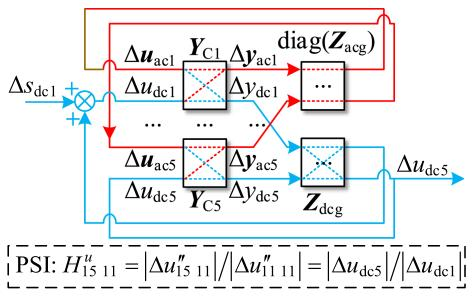  
Fig. 4. Block diagram of the PSI.

The PSI is formed as follow: when focusing on modeling the effects of couplings in the AC grid, the non-diagonal terms in the DC grid matrix are neglected, leading to the transfer matrices $\pmb { R } _ { \mathrm { I } }$ and $T _ { \mathrm { I } }$ as in (27). Similarly, when focusing on the couplings in the DC grid, the non-diagonal terms in the AC grid matrix are neglected and the system is represented by the transfer matrices ${ \pmb R } _ { \mathrm { I I } }$ and $T _ { \mathrm { I I } }$ as in (28). For $\mathbf { Z } _ { \mathrm { g I } }$ and $\mathbf { \delta Z } _ { \mathrm { g I I } }$ in (27) and (28), they are constructed as in (29).

$$
\begin{array}{l} \boldsymbol {R} _ {\mathrm {I}} = \left(\boldsymbol {I} - \boldsymbol {Z} _ {\mathrm {g I}} \boldsymbol {Y} _ {\mathrm {C}}\right) ^ {- 1}, \boldsymbol {T} _ {\mathrm {I}} = \boldsymbol {Y} _ {\mathrm {C}} \left(\boldsymbol {I} - \boldsymbol {Z} _ {\mathrm {g I}} \boldsymbol {Y} _ {\mathrm {C}}\right) ^ {- 1} (27) \\ \boldsymbol {R} _ {\mathrm {I I}} = \left(\boldsymbol {I} - \boldsymbol {Z} _ {\mathrm {g I I}} \boldsymbol {Y} _ {\mathrm {C}}\right) ^ {- 1}, \boldsymbol {T} _ {\mathrm {I I}} = \boldsymbol {Y} _ {\mathrm {C}} \left(\boldsymbol {I} - \boldsymbol {Z} _ {\mathrm {g I I}} \boldsymbol {Y} _ {\mathrm {C}}\right) ^ {- 1} (28) \\ Z _ {\mathrm {g I}} = \left[ \begin{array}{l l} Z _ {\mathrm {a c g}} & \\ & \operatorname {d i a g} \left(Z _ {\mathrm {d c g}}\right) \end{array} \right], Z _ {\mathrm {g I I}} = \left[ \begin{array}{l l} \operatorname {d i a g} \left(Z _ {\mathrm {a c g}}\right) & \\ & Z _ {\mathrm {d c g}} \end{array} \right] (29) \\ \end{array}
$$

When the AC grids and the DC grid are considered separately, the SISO relationships between the variables in Table II can be described by their proportions. The proportions are respectively represented by $H _ { l k } ^ { u }$ and $H _ { l k } ^ { y }$ , and named as PSI. $H _ { l k } ^ { u }$ and $H _ { l k } ^ { y }$ can be calculated with (30) and (31), which correspondingly forms matrices $H ^ { u }$ and $\pmb { H } ^ { y }$ .

In (30) and (31), $\Delta u ^ { \prime \prime } { } _ { l k }$ and $\Delta y { ^ { \prime \prime } } _ { l k }$ denote the response generated in the lth elements of Δu and Δy under the excitation of $\Delta u _ { k } ,$ while ignoring the couplings in the DC grids and considering the complete AC grid. By contrast, $\Delta u ^ { \prime \prime } { } _ { m k }$ and $\Delta y _ { \ m k } ^ { \prime \prime }$ denote the response generated in the mth element of Δu and Δy under the excitation of $\Delta u _ { k }$ while ignoring the couplings in the AC grids and considering the complete DC grid.

$$
\begin{array}{l} \left\{ \begin{array}{l} H _ {l k} ^ {u} = \left| \Delta u ^ {\prime \prime} _ {l k} \right| / \left| \Delta u ^ {\prime \prime} _ {k k} \right| = \left| R _ {\mathrm {I l} k} \right| / \left| R _ {\mathrm {I} k k} \right|, \\ l \in [ 1, 1 0 ], k \in [ 1, 1 5 ] \\ H _ {m k} ^ {u} = \left| \Delta u ^ {\prime \prime} _ {m k} \right| / \left| \Delta u ^ {\prime \prime} _ {k k} \right| = \left| R _ {\mathrm {I I} m k} \right| / \left| R _ {\mathrm {I I} k k} \right|, \\ m \in [ 1 1, 1 5 ], k \in [ 1, 1 5 ] \end{array} \right. (30) \\ \left\{ \begin{array}{l} H _ {l k} ^ {y} = \left| \Delta y ^ {\prime \prime} _ {l k} \right| / \left| \Delta u ^ {\prime \prime} _ {k k} \right| = \left| T _ {\mathrm {I l} k} \right| / \left| R _ {\mathrm {I} k k} \right|, \\ l \in [ 1, 1 0 ], k \in [ 1, 1 5 ] \\ H _ {m k} ^ {y} = \left| \Delta y ^ {\prime \prime} _ {m k} \right| / \left| \Delta u ^ {\prime \prime} _ {k k} \right| = \left| T _ {\mathrm {I I} m k} \right| / \left| R _ {\mathrm {I I} k k} \right|, \\ m \in [ 1 1, 1 5 ], k \in [ 1, 1 5 ] \end{array} \right. (31) \\ \end{array}
$$

The block diagram of the PSI $H _ { 1 5 1 1 } ^ { u }$ is illustrated in Fig. 4 as an example. Consequently, each PSI reflects how the oscillation spreads from one variable to another through the selected coupling route of the grid.

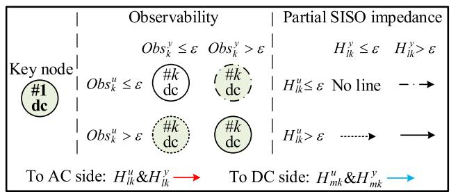

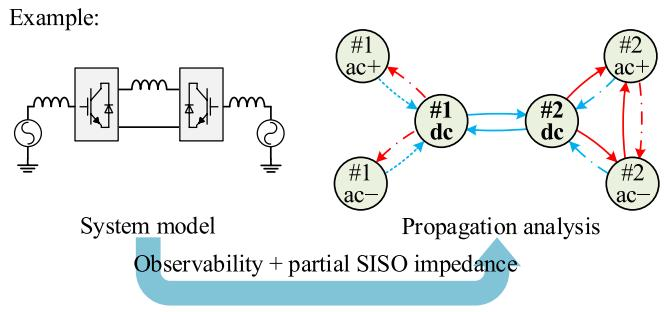  
Fig. 5. Diagram plot of the proposed stability analysis method.

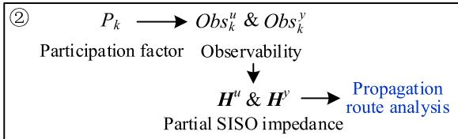

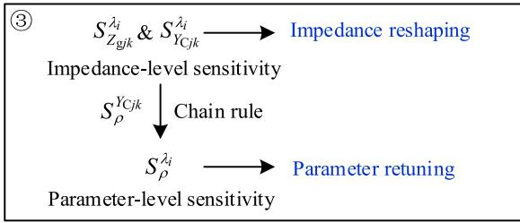  
Fig. 6. Flowchart of the proposed stability analysis method.

The oscillation propagation route can ultimately be identified by integrating the information carried by the observability indicators and the PSI. This proposed method is called Obs-PSI method. For intuitively illustrating the oscillation status and its propagation paths, an example as shown in Fig. 5 is provided. A threshold ε is preset to determine whether the observability indicators and the PSI are large enough, which respectively differentiate large/small oscillation and strong/weak couplings in the system. Strengths of the observability indicators and the PSI are marked with the dot/dashed lines in Fig. 5. The red lines represent the PSIs heading to the AC side and the blue lines represent the PSIs heading to the DC side.

The Obs-PSI plot of a typical two-end HVDC system is shown in the example of Fig. 5, assuming there are observabilities and PSIs of different sizes.

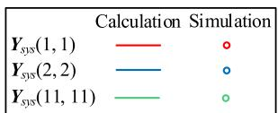

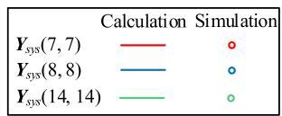

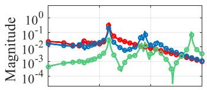

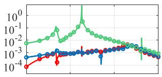

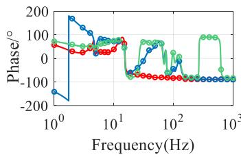

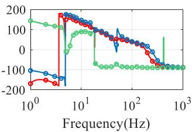  
Fig. 7. Verification of the entire system’s impedance model.

The stability analysis process of a multi-terminal cascaded hybrid HVDC system can be summarized as the following steps:

Step 1: Obtain the impedance matrices of the converters and grids and then form the model of the entire system. Assess the stability of the entire system with GNSC. And then find the critical eigenvalue $\lambda _ { \mathrm { c } }$ and the critical frequency $f _ { \mathrm { c } }$ .

Step 2: Calculate the participation factor at the frequency $f _ { \mathrm { c } }$ and find the critical variable $\Delta u _ { k } ;$ thereafter identify the propagation path together with Obs-PSI.

Step 3: Calculate the impedance-level sensitivity and the parameter-level sensitivity at the frequency $f _ { \mathrm { c } }$ to find the critical converter impedances and parameters. Suppress the oscillation through impedance reshaping or parameter retuning [34], [35], [36], [37].

Notice that the Obs-PSI method is appropriate for scenarios where multiple AC grids are coupled with single DC grid, or scenarios where multiple DC grids are coupled with single AC grid. Thus, the proposed method is applicable in our system where only the DC grid and the adjacent AC grids of the cascaded hybrid HVDC are considered. If the interaction between the cascaded hybrid HVDC and other HVDC systems is involved, the situation can be more complicated and the method need further development.

# IV. CASE STUDY

Simulation verification is performed in this section based on the system shown in Fig. 2 with MATLAB/Simulink platform. Firstly, the impedance model of the entire system is verified by comparing the calculated $Y _ { \mathrm { s y s } }$ and the frequency sweeping simulation results. Considering the size of $Y _ { \mathrm { s y s } }$ prevents us from displaying all of its elements, calculated values and simulation results of some typical elements in $Y _ { \mathrm { s y s } }$ are compared in Fig. 7.

To verify and demonstrate merits of the proposed Obs-PSI propagation path analysis method, two unstable cases are simulated. In case I, the proportional gain of MMC1’s DC voltage controller is decreased, which induced oscillation dominated by

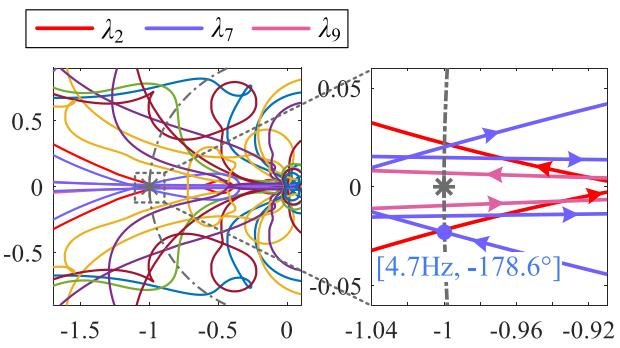  
Fig. 8. Nyquist plot of Case I.

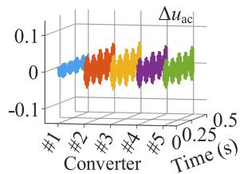

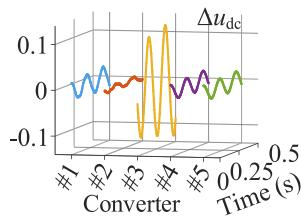

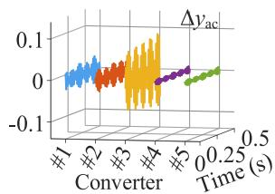

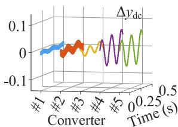  
Fig. 9. Simulation results of Case I (only harmonic components illustrated).

DC side dynamics of the MMCs. In case II, oscillation happens after increasing proportional gain of LCC2’s DC voltage controller. Different Oscillation distributions are observed in these two cases, which are further discussed and instructively suppressed with the proposed method.

# A. Case I: MMC Dominant Unstable Case

1) Step 1–Stability Analysis By GNSC: With the proportional gain of MMC1’s voltage PI controller $k _ { \mathrm { p v 1 } }$ decreasing from 5 to 4, the calculated eigenvalues of the return ratio matrix L are shown in Fig. 8, and the frequency and phase of the critical crossing point is shown as well. From Fig. 8, as $\lambda _ { 7 }$ encircles point ( 1, 0) near the frequency of $f _ { \mathrm { c 1 } } = 4 . 7$ Hz (DC sides’ perturbation’s frequency), a positive sequence oscillation of 54.7 Hz on the AC side with the coupled negative sequence oscillation of 46.3 Hz on the AC side and the oscillation of 4.7 Hz on the DC side can be identified. This theoretical prediction is in accordance with the numerical simulation results as shown in Fig. 9, where the magnitudes of harmonics are extracted and normalized for comparing purposes. The simulated oscillation frequency is 4.8 Hz, which is consistent with the result of Nyquist curve.

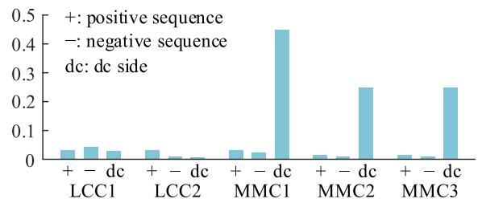  
Fig. 10. Participation factors of $\lambda _ { 7 }$ at $f _ { \mathrm { c 1 } }$ in case I.

<table><tr><td colspan="2">Δuac</td><td>Δudc</td><td colspan="2">Δyac</td><td>Δydc</td></tr><tr><td>Δvacp10.11</td><td>Δvacn10.08</td><td>Δvdc10.26</td><td>Δiacp10.29</td><td>Δiacn10.27</td><td>Δi dc10.09</td></tr><tr><td>Δvacp20.23</td><td>Δvacn20.14</td><td>Δidc20.08</td><td>Δiacp20.30</td><td>Δiacn20.22</td><td>Δvdc20.20</td></tr><tr><td>Δvacp30.26</td><td>Δvacn30.17</td><td>Δidc31.00</td><td>Δiacp30.75</td><td>Δiacn30.73</td><td>Δvdc30.31</td></tr><tr><td>Δvacp40.21</td><td>Δvacn40.14</td><td>Δvdc40.14</td><td>Δiacp40.06</td><td>Δiacn40.07</td><td>Δidc41.00</td></tr><tr><td>Δvacp50.21</td><td>Δvacn50.13</td><td>Δvdc50.14</td><td>Δiacp50.06</td><td>Δiacn50.07</td><td>Δidc51.00</td></tr></table>

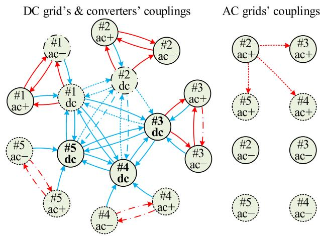  
Fig. 11. Observabilities of the port variables in Case I.   
Fig. 12. Propagation route analysis of Case I.

2) Step 2–Propagation Analysis By Obs-PSI: The participation factor $P _ { k }$ of the instable eigenvalue $\lambda _ { 7 }$ at $f _ { \mathrm { c 1 } }$ is calculated to identify the critical nodes of the oscillation as shown in Fig. 10. It can be seen that the DC sides of MMC1, MMC2 and MMC3 participate more in this oscillation mode, which are consistent with the results in Fig. 9.

Fig. 9 shows that the oscillation magnitudes of the variables are varying. The proposed Obs-PSI based propagation route analysis result is then performed and the results are shown in Figs. 11 and 12. The observabilities of all nodes are shown in Fig. 11 and nodes with observabilities above 0.1pu are highlighted. Fig. 11 shows that the observabilities of LCC1 and LCC2’s DC currents, as well as observabilities of MMC2 and MMC3’s AC currents, are relatively small. Fig. 10 well matches with Fig. 9, which explains why the magnitudes differ from each other based on numerical calculation from the impedance model.

We plot Fig. 12 with the Obs-PSI method referring to Fig. 5. ε is set as 0.1. The DC sides of the three MMCs are the key

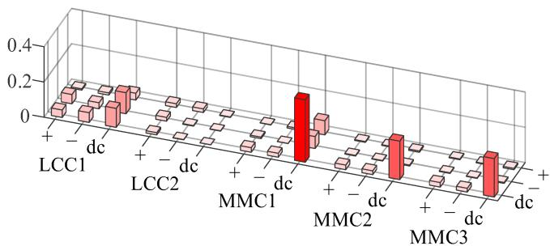  
(a)

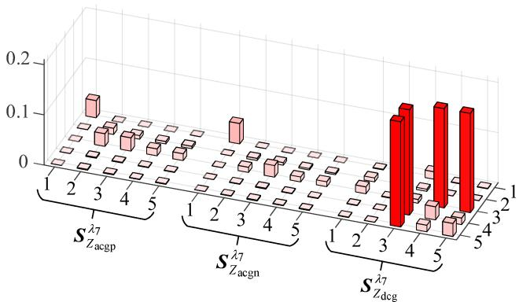  
  
Fig. 13. Impedance-level sensitivity analysis of $\lambda _ { 7 }$ at 54.1 Hz. (a) Converter sensitivity. (b) Grid sensitivity.

nodes, as their participation factors are dominant according to results shown in Fig. 10. It can be seen that the PSIs between the MMCs’ DC sides are prominent, indicating intimate dynamic interaction. The observability of the LCCs’ DC currents is relatively large because there are large PSIs from MMCs’ DC sides propagating toward them, which means the oscillation generated in the key nodes will easily spread to LCCs’ DC currents. However, they are not recognized as key nodes because they provide poor PSIs back toward the MMCs, indicating they will not feed the oscillation back further impacting the key nodes.

Similarly, some of the AC sides’ variables are observed oscillating, which is caused by DC-AC couplings over converters. However, as couplings in the AC grid are relatively small, the AC side variables are not identified as the critical variables. The simulation results shown in Fig. 9 are consistent with the analysis as shown in Figs. 11 and 12.

The Obs-PSI based analysis result indicates that the oscillation and the dynamic interaction in Case I mainly focus on the DC side of the MMCs, thus the oscillation is closely related with the DC side dynamics of the MMCs at $f _ { \mathrm { c 1 } }$ .

3) Step 3–Sensitivity Analysis and Oscillation Suppressing: The sensitivity analysis of Case I is performed based on (15), (16) and (18) including the impedance-level and parameter-level sensitivity analysis. Magnitudes of $\lambda _ { 7 } \mathrm { ^ { ' } s }$ impedance-level sensitivity at $f _ { \mathrm { c 1 } }$ are shown in Fig. 13. It is indicated by Fig. 13(a) that $\lambda _ { 7 }$ is extremely sensitive to the DC side impedances of the MMCs, while the impedances of LCC1 also contribute. From the grid sensitivity in Fig. 13(b), it can be seen that the gridsensitivity of the DC grid related with the three MMCs is large, indicating significant influence of the related impedances. The

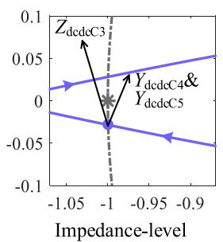

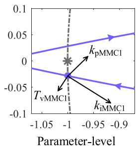  
kpMMc1 proportional gain of MMC1's dc voltage controller kiMMC1integral gain of MMC1's dc voltage controller TvMMC1 time constant of MMC1's dc voltage filter

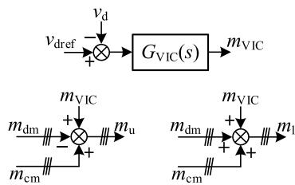  
Fig. 14. Impedance-level and parameter-level sensitivities of Case I.

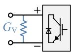  
(b)   
Fig. 15. The dc side virtual impedance control of MMC. (a) Control diagram. (b) Equivalent circuit.

DC grid’s structure is designed with functional considerations including fault current limiting, harmonic filtering, etc. Thus, in case I, adjustment of the structural factors is not applied and we focus on reshaping impedances of the converters.

Some prominent impedance-level and parameter-level sensitivities are shown in Fig. 14. The impedance-level sensitivity in Figs. 13 and 14 demonstrates that increasing the DC side admittance/impedance of MMC1, MMC2 and MMC3 is more efficient comparing with reshaping the other elements of the converters’ impedance matrix. The parameter-level sensitivity reflects that the parameters of MMC1’s outer loop controller are more significant than the other parameters. Increasing the proportion coefficient of MMC1’s voltage controller will lead to stabilizing, while increasing the integrator coefficient will worsen the stability.

$$
G _ {\mathrm {V I C}} (s) = \frac {G T}{T s + 1}, T \gg \frac {1}{2 \pi f _ {\mathrm {c} 1}} \tag {32}
$$

According to the analysis from Fig. 14, the stability of the whole system in Case I can be improved either by reshaping the impedance or by retuning the parameter. For example, with impedance reshaping, the oscillation can be suppressed by increasing $Y _ { \mathrm { d c d c 4 } }$ . As shown in Fig. 15, the virtual impedance control (VIC) method can be applied to reach this goal. In Fig. 15, $m _ { \mathrm { d m } }$ and $m _ { \mathrm { { c m } } }$ denote the differential mode and common mode modulation indexes of MMC1. $m _ { \mathrm { u } }$ and $m _ { \mathrm { l } }$ denote the upper arms’ and lower arms’ modulation indexes of MMC1. The transfer function $G _ { \mathrm { V I C } } ( s )$ is shown in (32), where T is the

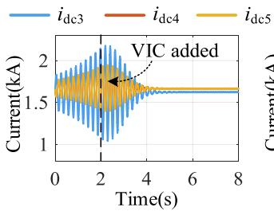

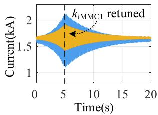  
Fig. 16. Oscillation suppressing of Case I.

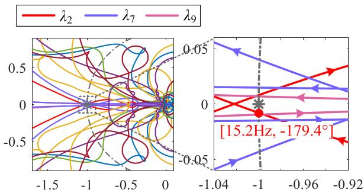  
Fig. 17. Nyquist plot of Case II.

time constant and is set as 0.5 to satisfy the condition in (32) making sure the VIC control providing extra resistive admittance $( \mathrm { i } . \mathrm { e } . , G _ { \mathrm { v } } )$ on the DC side. This setting is set in accordance with the impedance-level sensitivity analysis.

The virtual impedance control in Fig. 15 is an example of suppressing the oscillation under the guidance of the impedancelevel sensitivity, while many other methods can also be adaptable [35], [36].

For parameter retuning, the integral gain $k _ { \mathrm { i M M C 1 } }$ of MMC1’s DC voltage controller decreases from 240 to 192 under the guidance of Fig. 14. Results of the impedance reshaping and parameter retuning based oscillation suppressing are shown in Fig. 16, which verifies the correctness and effectiveness of the stability analysis above.

# B. Case II: LCC Dominant Unstable Case

1) Step 1–Stability Analysis By GNSC: In the second case, the integral gain $k _ { \mathrm { i L C C 2 } }$ of LCC2 is increased from 70 to 105. The eigenvalues of the return ratio matrix L are calculated to judge the system stability. The Nyquist plots are plotted in Fig. 17. The Nyquist curve of $\lambda _ { 2 }$ encircles $( - 1 , 0 )$ at the frequency around $f _ { \mathrm { c 2 } } = 1 5 . 2 \ : \mathrm { H z } ,$ and therefore $\lambda _ { 2 }$ with a critical frequency $f _ { \mathrm { c 2 } }$ is identified as the critical eigenvalue causing instability. This is consistent with the results shown in Fig. 18.   
2) Step 2–Propagation Analysis By Obs-PSI: The DC sides and positive AC sides of the LCCs are the key nodes according to participation factors as shown in Fig. 19. The Obs-PSI based propagation route analysis of Case II is performed as shown in Fig. 20 and Fig. 21. The observabilities of all nodes in the system are shown in Fig. 20, where the observabilities larger than 0.1pu are highlighted. Fig. 20 indicates that the oscillation component

  
Oscillation frequency (DC side): 15.0Hz

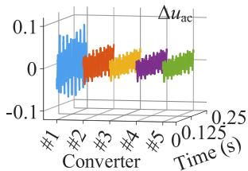

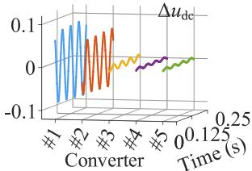

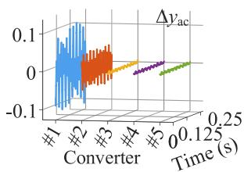

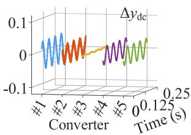  
Fig. 18. Simulation results of Case II (only harmonic components illustrated).

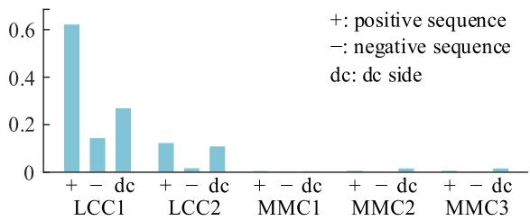  
Fig. 19. Participation factors of λ2 at $f _ { \mathrm { c 2 } }$ in Case II.

<table><tr><td colspan="2">Δuac</td><td>Δudc</td><td colspan="2">Δyac</td><td>Δydc</td></tr><tr><td>Δvacp10.64</td><td>Δvacn10.26</td><td>Δvdc11.00</td><td>Δiacp10.71</td><td>Δiacn10.54</td><td>Δidc10.47</td></tr><tr><td>Δvacp20.28</td><td>Δvacn20.07</td><td>Δidc20.74</td><td>Δiacp20.41</td><td>Δiacn20.17</td><td>Δvdc20.27</td></tr><tr><td>Δvacp30.21</td><td>Δvacn30.06</td><td>Δidc30.08</td><td>Δiacp30.00</td><td>Δiacn30.04</td><td>Δvdc30.02</td></tr><tr><td>Δvacp40.21</td><td>Δvacn40.06</td><td>Δvdc40.04</td><td>Δiacp40.02</td><td>Δiacn40.03</td><td>Δidc40.40</td></tr><tr><td>Δvacp50.21</td><td>Δvacn50.06</td><td>Δvdc50.04</td><td>Δiacp50.02</td><td>Δiacn50.03</td><td>Δidc50.40</td></tr></table>

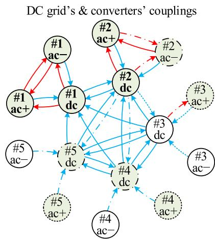  
Fig. 20. Observabilities of the port variables in Case II.

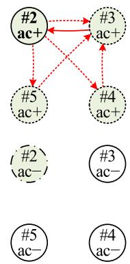  
AC grids’ couplings   
Fig. 21. Propagation route analysis of Case II.

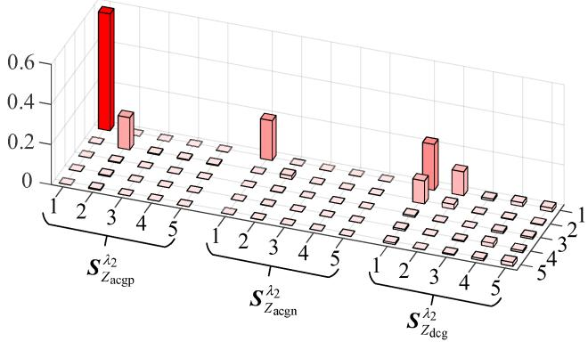  
Fig. 22. Grid sensitivity analysis of λ2 at 65.2 Hz.

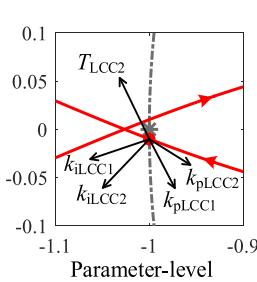

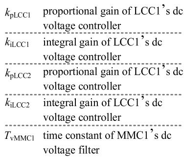  
Fig. 23. Parameter-level sensitivity of Case II.

in DC voltages and AC currents of the MMCs will be relatively smaller.

From Fig. 21, it can be seen that the PSIs between the LCCs’ DC sides, as well as the PSIs between the LCCs’ AC side and DC side are prominent, indicating intimate dynamic interaction. The observability of the MMCs’ variables is relatively smaller, as the PSIs prorogating toward the MMCs are small. The simulation results in Fig. 18 are in accordance with the analysis of Figs. 20 and 21, which verifies the analytical results above.

The Obs-PSI based analysis indicates that the oscillation and the dynamic interaction in Case II mainly focus on the DC side of the LCCs, thus the oscillation is closely related with the DC side dynamics of the LCCs at $f _ { \mathrm { c 2 } }$ .

3) Step 3–Sensitivity Analysis and Oscillation Suppressing: The LCC’s controller is quite integrated which affects both the AC side and DC side through adjusting the firing angle, thus the impedance-level sensitivity analysis and the oscillation suppressing can be less effective for the LCC, which are not shown here. The grid-sensitivity in Case II is calculated as shown in Fig. 22. The grid sensitivity of LCC1’s and LCC2’s positive sequence AC grid impedances is large, indicating these grid impedances take important roles in the system.

The parameter-level sensitivity is presented in Fig. 23. The parameter-level sensitivity reflects that the parameters of LCC1 and LCC2’s controllers are more significant than the other parameters. The oscillation can be decreased through decreasing the coefficients of LCC1 and LCC2’s controllers.

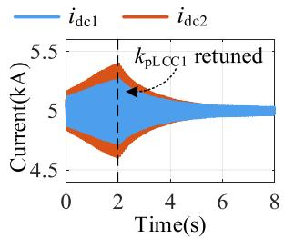

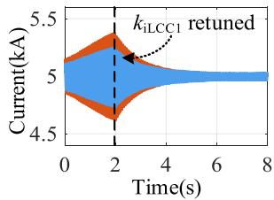

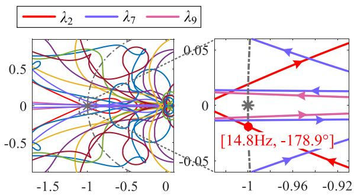  
Fig. 24. Oscillation suppressing of Case II.

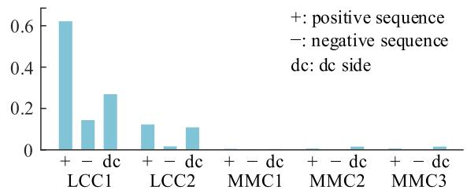  
Fig. 25. Nyquist plot of Case III.   
Fig. 26. Participation factors of $\lambda _ { 3 }$ a $f _ { \mathrm { c 3 } }$ in Case III.

According to the analysis above, the stability of the whole system in Case II can be improved through retuning the LCC1 and LCC2’s parameters. Under the guidance of Fig. 23, the proportional gain $k _ { \mathrm { p L C C 1 } }$ of the LCC1’s current controller is decreased from 1 to 0.5. Also, decreasing the integral gain $k _ { \mathrm { i L C C 1 } }$ of the LCC1’s voltage controller from 100 to 50 can be effective. The results of the oscillation suppressing are shown in Fig. 24, which verifies the correctness of the stability analysis above.

# C. Case III: Verification of Oscillation Propagation

For further verifying the Obs-PSI based oscillation propagation analysis, the parameters of the AC grid of the receiving end are modified, as shown in Table VIII, to build Case III. In Case III, the interconnection between LCC2 and the MMCs is relatively weakened comparing to Case I and Case II.

Similar with Case II, the integral gain $k _ { \mathrm { i L C C 2 } }$ of LCC2 is increased from 70 to 105. The Nyquist plots are plotted in Fig. 25. The Nyquist curve of $\lambda _ { 2 }$ encircles (−1, 0) at the frequency around $f _ { \mathrm { c 3 } } = 1 4 . 8 \mathrm { H z } .$ , and therefore $\lambda _ { 2 }$ with a critical frequency $f _ { \mathrm { c 2 } }$ is identified as the critical eigenvalue causing instability.

According to participation factors as shown in Fig. 26, a key node distribution similar with that in Case II can be found, i.e., the DC sides and AC sides of the LCCs are the key nodes.

Fig. 27. Observabilities of the port variables in Case III.   

<table><tr><td colspan="2">Δuac</td><td>Δudc</td><td colspan="2">Δyac</td><td>Δydc</td></tr><tr><td>Δvacp10.63</td><td>Δvacn10.27</td><td>Δvdc11.00</td><td>Δiacp10.71</td><td>Δiacn10.53</td><td>Δidc10.46</td></tr><tr><td>Δvacp20.31</td><td>Δvacn20.07</td><td>Δidc20.71</td><td>Δiacp20.42</td><td>Δiacn20.16</td><td>Δvdc20.29</td></tr><tr><td>Δvacp30.00</td><td>Δvacn30.00</td><td>Δidc30.09</td><td>Δiacp30.02</td><td>Δiacn30.02</td><td>Δvdc30.02</td></tr><tr><td>Δvacp40.00</td><td>Δvacn40.00</td><td>Δvdc40.03</td><td>Δiacp40.00</td><td>Δiacn40.00</td><td>Δidc40.38</td></tr><tr><td>Δvacp50.00</td><td>Δvacn50.00</td><td>Δvdc50.03</td><td>Δiacp50.00</td><td>Δiacn50.00</td><td>Δidc50.38</td></tr></table>

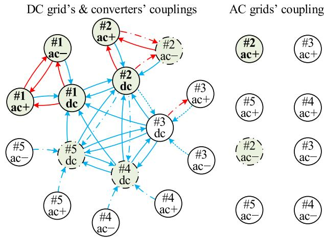  
Fig. 28. Propagation route analysis of Case III.

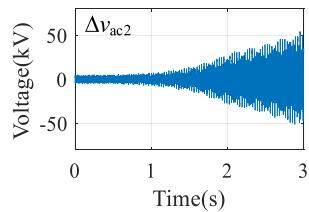  
Oscillation frequency (DC side): 15 Hz

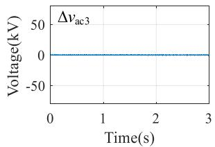

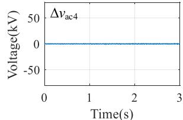

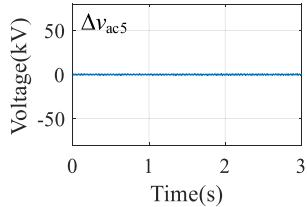  
Fig. 29. Simulation results of Case III (only harmonic components illustrated).

However, the calculated Obs and PSI in Figs. 27 and 28 indicate that the oscillation propagation in Case III will be different compared to case II. With the interlink between LCC2 and the MMCs weakened, the oscillation can hardly propagate to the AC sides of the MMCs.

The simulation results of AC side voltages of the converters are shown in Fig. 29. The oscillation distribution of AC side currents, DC side voltages, and DC side currents are omitted, as they are similar to that shown in Fig. 18 of Case II. It can be seen that the oscillation of the MMCs’ AC voltages is very small, as indicated by the Obs and PSI shown in Figs. 27 and 28, which verifies the correctness of the proposed Obs-PSI method.

Comparing Case II and case III, it can be found that the calculated PSI effectively reflects the receiving end AC grid’s oscillation propagation route, which is closely related with the

interaction between LCC2 and the MMCs. The PSI can help the system operators understand the mechanism of the oscillation propagation within the cascaded hybrid HVDC system and also optimize the grid structure to restrict range of the oscillation propagation.

# D. Discussion

The grid sensitivity depicts “significance of the grid admittance”. The Obs-PSI answers “why is there an oscillation at this node”. For example, in Fig. 22, grid sensitivities of the AC grids’ non-diagonal admittances are small, based on which we can conclude that the AC grid’s interconnection is not significant. Unfortunately, merely with the grid sensitivity, the oscillation observed in the AC sides’ voltages of MMC2 and MMC3 can hardly be explained. With the Obs-PSI, the oscillation can be explained and we can know the oscillation is propagated from the AC side of LCC2.

The inter-area observability in [26] partitions the entire system into two areas: the oscillation source (OS) area and the nonoscillation source (NOS) area, reflecting the propagation of the oscillation from tan area-to-area perspective. By contrast, the proposed PSI could indicate the strength of each path in the oscillation propagation, providing a node-to-node perspective with higher granularity. With the proposed PSI, not only how the oscillation propagates inside the converter, but also how the oscillation propagates along the grids in the cascaded hybrid system are clearly inspected.

# V. CONCLUSION

In this paper, the impedance based stability analysis and oscillation suppressing are performed in the multi-terminal cascaded hybrid HVDC system, with an Obs-PSI method proposed for observation of the concrete oscillation propagation routes. The proposed method fully utilizes merits of the impedance model in coupling analysis and impedance characteristic based oscillation suppressing. In the studied cases of the multi-terminal cascaded hybrid HVDC system, the following conclusions can be drawn:

i) The AC-DC couplings of converters are different due to their own physical structures and control strategies. The LCCs and the constant voltage MMC hold more intimate bidirectional AC-DC interactions. In the constant power MMCs, the oscillation mainly spread unidirectionally from the AC side to the DC side.   
ii) Couplings in the DC grid are more significant than couplings in the AC grid, leading to obvious oscillation observed on the DC side. Oscillation can still be observed in some AC variables, which is mainly caused by couplings starting from the converters’ DC sides and is not critical in the stability analysis.   
iii) For HVDC converters interlinking AC and DC sides of the system, impedance reshaping is applicable when single element of 3×3 matrix is critical. The method for separately reshaping elements in 3×3 matrix needs further study when multiple elements have large sensitivities.

  
Fig. 30. The AC/DC filters’ structures of the LCCs.

TABLE III REFERENCE VALUES OF THE CONVERTERS   

<table><tr><td>Parameter</td><td>Value</td></tr><tr><td>Reference DC current of LCC1</td><td>idc1ref=5kA</td></tr><tr><td>Reference DC voltage of LCC2</td><td>vdc2ref=390kV</td></tr><tr><td>Reference DC voltage of MMC1</td><td>vdc3ref=390kV</td></tr><tr><td>Reference AC active power of MMC2</td><td>Pac4ref=650MW</td></tr><tr><td>Reference AC active power of MMC3</td><td>Pac5ref=650MW</td></tr></table>

TABLE IV PARAMETERS OF THE MMCS   

<table><tr><td>Parameter</td><td>Value</td></tr><tr><td>Number of submodules</td><td>N=200</td></tr><tr><td>Submodule capacitance</td><td>C=18mF</td></tr><tr><td>Arm inductance</td><td>L=50mH</td></tr></table>

TABLE V PARAMETERS OF THE TRANSFORMERS   

<table><tr><td>Converter</td><td>Transformation ratio</td><td>Rated capacity</td><td>Leakage inductance</td></tr><tr><td>LCC1</td><td>510kV/175kV</td><td>1200MVA</td><td>0.18pu</td></tr><tr><td>LCC2</td><td>523kV/161kV</td><td>1135MVA</td><td>0.18pu</td></tr><tr><td>MMC1</td><td>510kV/182kV</td><td>1125MVA</td><td>0.15pu</td></tr><tr><td>MMC2</td><td>510kV/182kV</td><td>1125MVA</td><td>0.15pu</td></tr><tr><td>MMC3</td><td>510kV/182kV</td><td>1125MVA</td><td>0.15pu</td></tr></table>

# APPENDIX

# A. Parameters of the System

The structures of the LCCs’ filters, as well as the parameters of the AC and the DC grids are provided in the Appendix.

In Section II, the AC/DC filters’ structures are shown in Fig. 30, where $N _ { x } \left( x = \mathrm { a } , \mathrm { b } , \right.$ c) to represent the number of the filters of type x.

Parameters of the system in Fig. 2 are shown from Table III to Table VIII. Table III shows the reference orders of the converters, where the reference reactive powers of the MMCs on the AC side are all set to be zero. Table IV shows the system parameters of the MMCs. Table V shows the parameters of the transformers in the system. Table VI shows the parameters of the controllers. Tables VII and VIII show the parameters of the grids.

TABLE VI PARAMETERS OF THE CONTROLLERS   

<table><tr><td>Converter</td><td>Parameters</td></tr><tr><td>LCC1</td><td>Current controller:kpLCC1=1,kiLCC1=100</td></tr><tr><td>LCC2</td><td>Voltage controller:kpLCC2=0.7,kiLCC1=70</td></tr><tr><td>MMC1</td><td>Voltage controller:kpv1=5,kiv1=240</td></tr><tr><td>MMC2</td><td>Power controller:kp2=0.2,kp2=6</td></tr><tr><td>MMC3</td><td>Power controller:kp3=0.2,kp3=6</td></tr></table>

TABLE VII PARAMETERS OF THE GRIDS IN CASE I AND CASE II   

<table><tr><td>Parameter</td><td>Value</td><td>Parameter</td><td>Value</td></tr><tr><td>R11, L11</td><td>3Ω, 0.15H</td><td>R34, L34</td><td>2Ω, 0.09H</td></tr><tr><td>R22, L22</td><td>7Ω, 0.35H</td><td>R35, L35</td><td>2.67Ω, 0.12H</td></tr><tr><td>R33, L33</td><td>7Ω, 0.35H</td><td>R45, L45</td><td>1.33Ω, 0.06H</td></tr><tr><td>R44, L44</td><td>7Ω, 0.35H</td><td>Ld1</td><td>0.15H</td></tr><tr><td>R55, L55</td><td>7Ω, 0.35H</td><td>Ld2</td><td>0.15H</td></tr><tr><td>R23, L23</td><td>2.67Ω, 0.12H</td><td>Ld3</td><td>0.1H</td></tr><tr><td>R24, L24</td><td>2.67Ω, 0.12H</td><td>Rdcg, Ldcg</td><td>8Ω, 1.6H</td></tr><tr><td>R25, L25</td><td>3.56Ω, 0.16H</td><td>Cdcg</td><td>13μF</td></tr></table>

TABLE VIII PARAMETERS OF THE GRIDS IN CASE III   

<table><tr><td>Parameter</td><td>Value</td><td>Parameter</td><td>Value</td></tr><tr><td>R11, L11</td><td>3Ω, 0.15H</td><td>R34, L34</td><td>2Ω, 0.09H</td></tr><tr><td>R22, L22</td><td>3Ω, 0.14H</td><td>R35, L35</td><td>2.67Ω, 0.12H</td></tr><tr><td>R33, L33</td><td>3Ω, 0.14H</td><td>R45, L45</td><td>1.33Ω, 0.06H</td></tr><tr><td>R44, L44</td><td>3Ω, 0.14H</td><td>Ld1</td><td>0.15H</td></tr><tr><td>R55, L55</td><td>3Ω, 0.14H</td><td>Ld2</td><td>0.15H</td></tr><tr><td>R23, L23</td><td>133.5Ω, 6H</td><td>Ld3</td><td>0.1H</td></tr><tr><td>R24, L24</td><td>133.5Ω, 6H</td><td>Rdcg, Ldcg</td><td>8Ω, 1.6H</td></tr><tr><td>R25, L25</td><td>178Ω, 8H</td><td>Cdcg</td><td>13μF</td></tr></table>

# B. Introduction to the Model Truncation

The MMC model built in [29] is HSS matrices which can be represented as shown in (33).

$$
\left[ \begin{array}{l} {\Delta \boldsymbol {i} _ {\mathrm {a c}}} \\ {\Delta \boldsymbol {i} _ {\mathrm {c m}}} \end{array} \right] = \left[ \begin{array}{l l} {\boldsymbol {Y} _ {\mathrm {H a c a c}}} & {\boldsymbol {Y} _ {\mathrm {H a c d c}}} \\ {\boldsymbol {Y} _ {\mathrm {H d c a c}}} & {\boldsymbol {Y} _ {\mathrm {H d c d c}}} \end{array} \right] \left[ \begin{array}{l} {\Delta \boldsymbol {v} _ {\mathrm {a c}}} \\ {\Delta \boldsymbol {v} _ {\mathrm {d c}}} \end{array} \right] \tag {33}
$$

$Y _ { \mathrm { H a c a c } }$ , $Y _ { \mathrm { H a c d c } }$ , $\pmb { Y } _ { \mathrm { H d c a c } } .$ , and $Y _ { \mathrm { H d c d c } }$ are HSS admittance matrices. Taking $Y _ { \mathrm { H a c a c } }$ as an example, this matrix can be further expanded as shown in (34). The superscriptsrepresent their harmonic orders. As an example, $Y _ { \mathrm { H a c d c } } ^ { ( - 2 , - 1 ) }$ ementsrepresents the transfer function from the DC voltage at the frequency $( \omega _ { p } - \omega _ { 1 } )$ to the AC current at the frequency $( \omega _ { p } - 2 \omega _ { 1 } )$ .

$$
\underbrace {\left[ \begin{array}{c} \vdots \\ \Delta i _ {\mathrm {a c} (p - 2)} \\ \Delta i _ {\mathrm {a c} (p - 1)} \\ \Delta i _ {\mathrm {a c} (p)} \\ \vdots \end{array} \right]} _ {\Delta i _ {\mathrm {a c}}} = \underbrace {\left[ \begin{array}{c c c c c} \ddots & \vdots & \vdots & \vdots & \ddots \\ \dots & Y _ {\mathrm {H a c a c}} ^ {(- 2 , - 2)} & Y _ {\mathrm {H a c a c}} ^ {(- 2 , - 1)} & Y _ {\mathrm {H a c a c}} ^ {(- 2 , 0)} & \dots \\ \dots & Y _ {\mathrm {H a c a c}} ^ {(- 1 , - 2)} & Y _ {\mathrm {H a c a c}} ^ {(- 1 , - 1)} & Y _ {\mathrm {H a c a c}} ^ {(- 1 , 0)} & \dots \\ \dots & Y _ {\mathrm {H a c a c}} ^ {(0 , - 2)} & Y _ {\mathrm {H a c a c}} ^ {(0 , - 1)} & Y _ {\mathrm {H a c a c}} ^ {(0, 0)} & \dots \\ \vdots^ {\cdot} & \vdots & \vdots & \vdots & \ddots \end{array} \right]} _ {\mathbf {Y} _ {\mathrm {H a c a c}}}
$$

$$
\times \underbrace {\left[ \begin{array}{c} \vdots \\ \Delta u _ {\mathrm {a c} (p - 2)} \\ \Delta u _ {\mathrm {a c} (p - 1)} \\ \Delta u _ {\mathrm {a c} (p)} \\ \vdots \\ \Delta v _ {\mathrm {a c}} \end{array} \right]} _ {\Delta v _ {\mathrm {a c}}} \tag {34}
$$

Truncation of the HSS model is well documented in [31]. When the harmonic attenuation ratio (HAR) $\alpha _ { p + 4 }$ is lower than 30 dB, magnitudes of the admittance elements of the fourth and the above harmonics can be ignored as they are tiny.

HAR $\alpha _ { p + 4 }$ is positively correlated with the number of submodules, and is negatively correlated with the submodule capacitance and the arm inductance. With the parameters of our paper as shown in Table V and referring to Fig. 5 in [31], it can be seen that the parameters of our paper satisfy the requirement of $\alpha _ { p + 4 ( \mathrm { m a x } ) } < - 3 0$ dB. The black elements in (34) will be small enough and can be ignored with only the red elements in (34) left. Thus, it is reasonable to truncate the HSS impedance matrices into $3 \times 3 .$ , as in (35).

$$
\left[ \begin{array}{l} \Delta i _ {\mathrm {a c} (p)} \\ \Delta i _ {\mathrm {a c} (p - 2)} \\ \Delta i _ {\mathrm {c m} (p - 1)} \end{array} \right] = \left[ \begin{array}{l l l} Y _ {\text {H a c a c}} ^ {(0, 0)} & Y _ {\text {H a c a c}} ^ {(0, - 2)} & Y _ {\text {H a c d c}} ^ {(0, - 1)} \\ Y _ {\text {H a c a c}} ^ {(- 2, 0)} & Y _ {\text {H a c a c}} ^ {(- 2, - 2)} & Y _ {\text {H a c d c}} ^ {(- 2, - 1)} \\ Y _ {\text {H d c a c}} ^ {(- 1, 0)} & Y _ {\text {H d c a c}} ^ {(- 1, - 2)} & Y _ {\text {H d c d c}} ^ {(- 1, - 1)} \end{array} \right] \left[ \begin{array}{l} \Delta u _ {\mathrm {a c} (p)} \\ \Delta u _ {\mathrm {a c} (p - 2)} \\ \Delta u _ {\mathrm {d c} (p - 1)} \end{array} \right] \tag {35}
$$

The DC side outputs, as shown in (35), include circulating current $\Delta i _ { \mathrm { c m } ( p - 1 ) }$ , which is an inner variable of MMC and needs to be transformed to DC side current. Referring to reference [29], the DC side current is generally three times of the zero sequence circulating current, namely $\Delta i _ { \mathrm { d c } } = 3 \Delta i _ { \mathrm { c m ( } p - \mathrm { 1 ) } }$ . Thus, (35) can be reformulated into (1), as shown in (36).

$$
\left[ \begin{array}{c} \Delta i _ {\mathrm {a c} (p)} \\ \Delta i _ {\mathrm {a c} (p - 2)} \\ \Delta i _ {\mathrm {d c} (p - 1)} \end{array} \right] = \left[ \begin{array}{c c c} Y _ {\mathrm {H a c a c}} ^ {(0, 0)} & Y _ {\mathrm {H a c a c}} ^ {(0, - 2)} & Y _ {\mathrm {H a c d c}} ^ {(0, - 1)} \\ Y _ {\mathrm {H a c a c}} ^ {(- 2, 0)} & Y _ {\mathrm {H a c a c}} ^ {(- 2, - 2)} & Y _ {\mathrm {H a c d c}} ^ {(- 2, - 1)} \\ 3 Y _ {\mathrm {H d c a c}} ^ {(- 1, 0)} & 3 Y _ {\mathrm {H d c a c}} ^ {(- 1, - 2)} & 3 Y _ {\mathrm {H d c d c}} ^ {(- 1, - 1)} \end{array} \right] \left[ \begin{array}{c} \Delta u _ {\mathrm {a c} (p)} \\ \Delta u _ {\mathrm {a c} (p - 2)} \\ \Delta u _ {\mathrm {d c} (p - 1)} \end{array} \right]
$$

$$
\left[ \begin{array}{l} \Delta i _ {\mathrm {a c p}} \\ \Delta i _ {\mathrm {a c n}} \\ \Delta i _ {\mathrm {d c}} \end{array} \right] = \left[ \begin{array}{c c c} Y _ {\mathrm {p p C}} & Y _ {\mathrm {p n C}} & Y _ {\mathrm {p d c C}} \\ Y _ {\mathrm {n p C}} & Y _ {\mathrm {n n C}} & Y _ {\mathrm {n d c C}} \\ Y _ {\mathrm {d c p C}} & Y _ {\mathrm {d c n C}} & Y _ {\mathrm {d c d c C}} \end{array} \right] \left[ \begin{array}{l} \Delta v _ {\mathrm {a c p}} \\ \Delta v _ {\mathrm {a c n}} \\ \Delta v _ {\mathrm {d c}} \end{array} \right] \tag {36}
$$

# REFERENCES

[1] Real-time Digital Simulation (RTS) Laboratory at UNSW Sydney, “LCC & VSC-HVDC projects,” 2019. [Online]. Available: https://hvdc. shinyapps.io/scatterplot/   
[2] Y. Guo et al., “A hierarchical identification method of commutation failure risk areas in multi-infeed LCC-HVDC systems,” IEEE Trans. Power Syst., vol. 39, no. 1, pp. 2093–2105, Jan. 2024.   
[3] P. Bordignon, “VSC conversion technology for HVDC & FACTS, State of the art and future trend,” in Proc. 21st Eur. Conf. Power Electron. Appl., Genova, Italy, 2019, pp. 1–7.   
[4] G. LIU and Y LI, “Current status and key issues of HVDC transmission research: A brief review,” in Proc. 7th Int. Symp. Mechatron. Ind. Inform., 2021, pp. 16–19.   
[5] C. Guo, Z. Wu, S. Yang, and J. Hu, “Overcurrent suppression control for hybrid LCC/VSC cascaded HVDC system based on fuzzy clustering and identification approach,” IEEE Trans. Power Del., vol. 37, no. 3, pp. 1745–1753, Jun. 2022.

[6] P. Meng, W. Xiang, Y. Chi, Z. Wang, W. Lin, and J. Wen, “Resilient DC voltage control for islanded Wind Farms integration using cascaded hybrid HVDC system,” IEEE Trans. Power Syst., vol. 37, no. 2, pp. 1054–1066, Mar. 2022.   
[7] P. Meng, W. Xiang, Y. He, and J. Wen, “Coordination control of wind Farm integrated cascaded hybrid HVDC system in weak grids,” IEEE Trans. Power Del., vol. 38, no. 3, pp. 1837–1847, Jun. 2023.   
[8] Z. Song, Y. Huang, H. Zhao, J. Xu, C. Zhao, and X. Jia, “Power flow calculation method for hybrid cascaded HVDC transmission system,” in Proc. 2022 IEEE Int. Power Electron. Application Conf. Expo., Nov. 2022, pp. 758–761.   
[9] C. Guo, W. Zhao, S. Yang, Z. W., and C. Zhao, “Current balancing control approach for paralleled MMC groups in hybrid LCC/VSC cascaded HVDC system,” CSEE J. Power Energy Syst., Early Access, May 12, 2023, doi: 10.17775/CSEEJPES.2022.00630.   
[10] X. Wang and F. Blaabjerg, “Harmonic stability in power electronic-based power systems: Concept, modeling, and analysis,” IEEE Trans. Smart Grid, vol. 10, no. 3, pp. 2858–2870, May 2019.   
[11] N. Hatziargyriou et al., “Definition and classification of Power system Stability – Revisited &extended,” IEEE Trans. Power Syst., vol. 36, no. 4, pp. 3271–3281, Jul. 2021.   
[12] Y. He, W. Xiang, B. Ni, X. Lu, and J. Wen, “Impact of strength and proximity of receiving AC systems on cascaded LCC-MMC hybrid HVDC system,” IEEE Trans. Power Del., vol. 37, no. 2, pp. 880–892, Apr. 2022.   
[13] Y. He, W. Xiang, J. Wen, J. Zhou, C. Lin, and J. Zhao, “Impact of control mode on small-signal stability of hybrid cascaded UHVDC system,” in Proc. 2022 IEEE 5th Int. Elect. Energy Conf. (CIEEC), May 2022, pp. 3990–3995.   
[14] Y. Chen, Y. Chen, L. Xu, X. Chen, and L. Yu, “Stability analysis of cascaded LCC-MMC hybrid HVDC system based on impedance method,” IEEE Trans. Power Del., vol. 39, no. 5, pp. 2754–2767, Oct. 2024.   
[15] Y. Zhu, Y. Gu, Y. Li, and T. C. Green, “Participation analysis in impedance models: The grey-box approach for power system stability,” IEEE Trans. Power Syst., vol. 37, no. 1, pp. 343–353, Jan. 2022.   
[16] N. Cifuentes, M. Sun, R. Gupta, and B. C. Pal, “Black-box impedancebased stability assessment of dynamic interactions between converters and grid,” IEEE Trans. Power Syst., vol. 37, no. 4, pp. 2976–2987, Jul. 2022.   
[17] H. Zhang, M. Mehrabankhomartash, M. Saeedifard, Y. Zou, Y. Meng, and X. Wang, “Impedance analysis and stabilization of point-to-point HVDC systems based on a hybrid AC–DC Impedance model,” IEEE Trans. Ind. Electron., vol. 68, no. 4, pp. 3224–3238, Apr. 2021.   
[18] Y. Tan, Y. Sun, J. Lin, L. Yuan, and M. Su, “Revisit impedance-based stability analysis of VSC-HVDC system,” IEEE Trans. Power Syst., vol. 39, no. 1, pp. 1728–1738, Jan. 2024.   
[19] Y. Zhang, D. Duckwitz, N. Wiese, and M. Braun, “Extended nodal admittance matrix based stability analysis of HVDC connected AC grids,” IEEE Access, vol. 10, pp. 55200–55212, 2022.   
[20] Y. Zhu, Y. Gu, Y. Li, and T. C. Green, “Impedance-based root-cause analysis: Comparative study of impedance models and calculation of eigenvalue sensitivity,” IEEE Trans. Power Syst., vol. 38, no. 2, pp. 1642–1654, Mar. 2023.   
[21] Q. Zheng, F. Gao, Y. Li, Y. Zhu, and Y. Gu, “Equivalence of impedance participation analysis methods for hybrid AC/DC power systems,” IEEE Trans. Power Syst., vol. 39, no. 2, pp. 3560–3574, Mar. 2024.   
[22] J. Pedra, L. Sainz, and L. Monjo, “Three-port small signal admittancebased model of VSCs for studies of multi-terminal HVDC hybrid AC/DC transmission grids,” IEEE Trans. Power Syst., vol. 36, no. 1, pp. 732–743, Jan. 2021.   
[23] H. Zhang, X. Wang, M. Mehrabankhomartash, M. Saeedifard, Y. Meng, and X. Wang, “Harmonic stability assessment of multiterminal DC (MTDC) systems based on the hybrid AC/DC admittance model and determinant-based GNC,” IEEE Trans. Power Electron., vol. 37, no. 2, pp. 1653–1665, Feb. 2022.   
[24] Y. Liao, H. Wu, X. Wang, M. Ndreko, R. Dimitrovski, and W. Winter, “Stability and sensitivity analysis of multi-vendor, multi-terminal HVDC systems,” IEEE Open J. Power Electron., vol. 4, pp. 52–66, 2023.   
[25] Y. Zhan, X. Xie, H. Liu, H. Liu, and Y. Li, “Frequency-domain modal analysis of the oscillatory stability of power systems with high-penetration renewables,” IEEE Trans. Sustain. Energy, vol. 10, no. 3, pp. 1534–1543, Jul. 2019.   
[26] H. Zong, C. Zhang, X. Cai, and M. Molinas, “Oscillation propagation analysis of hybrid AC/DC grids with high penetration renewables,” IEEE Trans. Power Syst., vol. 37, no. 6, pp. 4761–4772, Nov. 2022.

[27] Y. Qi, H. Zhao, S. Fan, A. M. Gole, H. Ding, and I. T. Fernando, “Small signal frequency-domain model of a LCC-HVDC converter based on an infinite series-converter approach,” IEEE Trans. Power Del., vol. 34, no. 1, pp. 95–106, Feb. 2019.   
[28] T. Liu, R. Xu, Q. Jiang, B. Li, F. Blaabjerg, and P. Wang, “Multiple switching functions based HSS model of LCC considering variable commutation angle and harmonic couplings,” IEEE Trans. Power Del., vol. 38, no. 6, pp. 3820–3833, Dec. 2023.   
[29] Z. Xu et al., “A complete HSS-based impedance model of MMC considering grid impedance coupling,” IEEE Trans. Power Electron., vol. 35, no. 12, pp. 12929–12948, Dec. 2020.   
[30] S. Zhu et al., “D-Q frame impedance modeling of modular multilevel converter and its application in high-frequency resonance analysis,” IEEE Trans. Power Del., vol. 36, no. 3, pp. 1517–1530, Jun. 2021.   
[31] Z. Xu, B. Li, S. Li, X. Wang, and D. Xu, “MMC admittance model simplification based on signal-flow graph,” IEEE Trans. Power Electron., vol. 37, no. 5, pp. 5547–5561, May 2022.   
[32] H. Zhang, M. Saeedifard, X. Wang, Y. Meng, and X. Wang, “System harmonic stability analysis of grid-tied interlinking converters operating under AC voltage control mode,” IEEE Trans. Power Syst., vol. 37, no. 5, pp. 4106–4109, Sep. 2022.   
[33] Y. Zhan, X. Xie, and Y. Wang, “Impedance network model based modal observability and controllability analysis for renewable integrated power systems,” IEEE Trans. Power Del., vol. 36, no. 4, pp. 2025–2034, Aug. 2021.   
[34] Y. Liu et al., “Harmonic State space based impedance modeling and virtual impedance based stability enhancement control for LCC-HVDC systems,” J. Modern Power Syst. Clean Energy, vol. 12, no. 1, pp. 287–298, Jan. 2024.   
[35] H. Nian, J. Yang, B. Hu, Y. Jiao, Y. Xu, and M. Li, “Stability analysis and impedance reshaping method for DC resonance in VSCs-based power system,” IEEE Trans. Energy Convers., vol. 36, no. 4, pp. 3344–3354, Dec. 2021.   
[36] Q. Jiang et al., “Joint limiting control strategy based on virtual impedance shaping for suppressing DC fault current and arm current in MMC-HVDC systems,” J. Modern Power Syst. Clean Energy, vol. 11, no. 6, pp. 2003–2014, Nov. 2023.   
[37] J. Wang, W. Chen, Y. Liu, C. Fu, Y. Ye, and J. Feng, “High-frequency resonance analysis and impedance reshaping control of MMC-HVDC system based on frequency coupling impedance model,” J. Modern Power Syst. Clean Energy, vol. 12, no. 2, pp. 646–657, Mar. 2024.

Ruiting Xu (Student Member, IEEE) received the B.S. degree in electrical engineering in 2021, from Sichuan University, Chengdu, China, where he is currently working toward the Ph.D. degree in electrical engineering. His research focuses on high voltage direct current transmission technologies.

Qin Jiang (Member, IEEE) received the B.S and Ph.D. degrees from the College of Electrical Engineering, Sichuan University, Chengdu, China, in 2016 and 2021, respectively. From 2019 to 2020, she was a Visiting Ph.D. Student with the Energy Research Institute, Nanyang Technological University, Singapore. She is currently a Lecturer with the College of Electrical Engineering, Sichuan University. Her research interests include power system stability analysis andcontrol and high voltage direct current transmission technologies.

  
University, Chengdu, China.

Baohong Li received the B.S, M.S. and Ph.D. degrees from the college of Electrical Engineering, Sichuan University, Chengdu, China, in 2009, 2015 and 2018, respectively. From 2009 to 2012, he was with the State Grid Corporation of China. From 2019 to 2020, he has been a Visiting Scholar with Aalborg University, Aalborg, Denmark. His research interests include power system stability analysis and control, high voltage direct current transmission technologies, and DC grids. He is currently an Associate Professor with the college of Electrical Engineering, Sichuan

Frede Blaabjerg (Fellow, IEEE) received the Ph.D. degree in electrical engineering from Aalborg University, Aalborg, Denmark, in 1995, and the honoris causa from the University Politehnica Timisoara (UPT), Timi¸soara, Romania, and Tallinn Technical University (TTU), Tallinn, Estonia. He has authored or coauthored more than 600 journal papers in the fields of power electronics and its applications. His current research interests include power electronics and its applications, such as in wind turbines, PV systems, reliability, harmonics, and adjustable speed

drives. Prof. Blaabjerg was the recipient of 30 IEEE Prize Paper Awards, the IEEE PELS Distinguished Service Award in 2009, the EPE-PEMC Council Award in 2010, the IEEE William E. Newell Power Electronics Award 2014, and the Villum Kann Rasmussen Research Award 2014. He was the Editor-in-Chief for the IEEE TRANSACTIONS ON POWER ELECTRONICS, from 2006 to 2012. Since 2019, he has been the President of the IEEE Power Electronics Society.

Yikui Liu received the B.S. degree in electrical engineering and automation from the Nanjing Institute of Technology, China, in 2012, the M.S. degree in power system and automation from Sichuan University, China, in 2015, and the Ph.D. degree in electrical and computer engineering from the Stevens Institute of Technology, Hoboken, NJ, USA, in 2020. He was with Siemens, USA, as an Energy Market Engineer, during 2020–2021. He was a Postdoctoral Researcher with the Stevens Institute of Technology, Hoboken, NJ, USA, during 2021–2023. He is currently an Associate Researcher with Sichuan University, Chengdu, China. His research interests include the power market and OPF in distribution systems.

Peng Wang (Fellow, IEEE) received the B.Sc. degree from Xian Jiaotong University, Xi’an, China, in 1978, the M.Sc. degree from Taiyuan University of Technology, Taiyuan, China, in 1987, and the M.Sc. and Ph.D. degrees from the University of Saskatchewan, Saskatoon, SK, Canada, in 1995 and 1998, respectively. He is currently a Professor with the School of Electrical and Electronic Engineering, Nanyang Technology University, Nanyang, Singapore.

Tianqi Liu (Senior Member, IEEE) received the B.S. and M.S. degrees in electrical engineering from Sichuan University, Chengdu, China, in 1982 and 1986, respectively, and the Ph.D. degree electrical engineering from Chongqing University, Chongqing, China, in 1996. She is currently a Professor with the College of Electrical Engineering, Sichuan University. Her main research interests include power system stability, HVDC, optimal generation dispatch, dynamic security analysis, dynamic State Estimation and load forecast.