# Compact Matrix Formulation for Calculating Lightning-Induced Voltages on Electromagnetic Transient Simulators

Osis E. S. Leal and Alberto De Conti , Member, IEEE

Abstract—In this paper, a compact matrix formulation that simplifies the calculation of the lumped sources necessary to estimate lightning-induced effects using transmission line models available in electromagnetic transient programs is proposed. As opposed to an existing solution strategy that requires the sequential calculation of the convolution integrals involving the horizontal component of the incident electric field along multiple segments along the line, the proposed matrix solution allows such convolutions to be performed at once. This not only increases the model efficiency, but also simplifies the assembly of the solution in matrix-oriented simulation tools. The equations are described in both phase and modal domains, with formulations that are compatible with the universal line model and the frequency-dependent transmission line model proposed by Marti. It is shown that both formulations can be accurately used for calculating lightning-induced voltages on overhead lines.

Index Terms—Lightning-induced voltages, transmission line models, numerical analysis, electromagnetic transient simulators.

# I. INTRODUCTION

E LECTROMAGNETIC transient (EMT)-type programs areusually preferred for the calculation of lightning-induced effects on realistic distribution networks [1]–[12]. The usual procedure consists in writing a separate code to solve telegrapher’s equations considering the effect of external electromagnetic (EM) fields. This code is then interfaced with the EMT simulator in order to update the voltages and currents at the line ends depending on the terminal conditions [1]–[11]. Although accurate, this procedure does not take advantage of the transmission line models already available in EMT-type programs, which may reduce the model efficiency [13].

Manuscript received April 1, 2020; revised June 4, 2020; accepted July 24, 2020. Date of publication August 17, 2020; date of current version July 23, 2021. This work was supported in part by CNPq (National Council for Scientific and Technological Development), grants 431948/2016-0 and 306006/2019-7, FAPEMIG (State of Minas Gerais Research Foundation), grant TEC-PPM-00280-17, and by Pró-Reitoria de Pesquisa (PRPq) of Universidade Federal de Minas Gerais (UFMG), which is the institution responsible for this work. Paper no. TPWRD-00492-2020. (Corresponding author: Alberto De Conti.)

Osis E. S. Leal is with the Graduate Program of Electrical Engineering (PPGEE), Universidade Federal de Minas Gerais (UFMG), 31270-901 Belo Horizonte, Brazil, and also with the Universidade Tecnológica Federal do Paraná (UTFPR), 84261-550 Pato Branco, Brazil (e-mail: osisleal@utfpr.edu.br).

Alberto De Conti is with the Department of Electrical Engineering, Universidade Federal de Minas Gerais (UFMG), 31270-901 Belo Horizonte, Brazil (e-mail: conti@cpdee.ufmg.br).

Color versions of one or more of the figures in this article are available online at https://ieeexplore.ieee.org.

Digital Object Identifier 10.1109/TPWRD.2020.3017149

In [12], a time-domain procedure was proposed to calculate lightning-induced voltages using transmission line models available in EMT-type programs. It consists in adding lumped sources representing the effect of the incident EM fields at both ends of the line. For a multiconductor line with $N _ { f }$ conductors and length - parallel to the x axis, the sources are functions of ${ \mathbf { } } { \mathbf { } } { \mathbf { } } { \mathbf { } } { \mathbf { } } { \mathbf { } } { \mathbf { } } { \mathbf { } } \mathbf { } { \mathbf { } } u _ { 0 } ( t )$ and ${ \mathbf { } } { \mathbf { } } { \mathbf { } } u _ { \ell } ( t )$ given by [14]

$$
\begin{array}{l} \boldsymbol {u} _ {0} (t) = \boldsymbol {u} _ {x, 0} (t) - \boldsymbol {h e} _ {z} (0, t) + \boldsymbol {a} (\ell , t) * \boldsymbol {h e} _ {z} (\ell , t), \\ \boldsymbol {u} _ {\ell} (t) = \boldsymbol {u} _ {x, \ell} (t) - \boldsymbol {h e} _ {z} (\ell , t) + \boldsymbol {a} (\ell , t) * \boldsymbol {h e} _ {z} (0, t), \end{array} \tag {1}
$$

where

$$
\boldsymbol {u} _ {x, 0} (t) = - \int_ {0} ^ {\ell} \boldsymbol {a} (x, t) * \boldsymbol {e} _ {x} (x, t) d x,
$$

$$
\boldsymbol {u} _ {x, \ell} (t) = \int_ {0} ^ {\ell} \boldsymbol {a} (x, t) * \boldsymbol {e} _ {x} (\ell - x, t) d x. \tag {2}
$$

In these expressions, $e _ { z } ( 0 , t )$ and $e _ { z } ( \ell , t )$ are the vertical components of the incident electric fields at the line ends, $e _ { x } ( x , t )$ is the horizontal electric field at coordinate x along the line, h is a diagonal matrix containing the conductor heights, and $ { \boldsymbol { a } } (  { \boldsymbol { { x } } } , t )$ is the time-domain equivalent of the propagation function of a line segment of infinitesimal length. The dimensions of the matrices and vectors in (1) and (2) are, respectively, $N _ { f } \times 1$ and $N _ { f } \times N _ { f }$ .

In order to efficiently solve the convolution integrals in (1), it suffices to represent ${ \mathbf { } } \mathbf { } \mathbf { } \mathbf { } \mathbf { } \mathbf { } \mathbf { } \mathbf { } \mathbf { } \mathbf { } \mathbf { } \mathbf { } \mathbf { } \mathbf { } \mathbf { } \mathbf { } \mathbf { } \mathbf { } \mathbf { } \mathbf { } \mathbf { } \mathbf { } \mathbf { } \mathbf { } \mathbf { } \mathbf { } \mathbf { } \mathbf { } \mathbf { } \mathbf { } \mathbf { } \mathbf { } \mathbf { } \mathbf { } \mathbf { } \mathbf { } \mathbf { } \mathbf { } \mathbf { } \mathbf { } \mathbf { } \mathbf { } \mathbf { } \mathbf { } \mathbf { } \mathbf { } \mathbf { } \mathbf { } \mathbf { } \mathbf { } \mathbf { } \mathbf { } \mathbf { } \mathbf { } \mathbf { } \mathbf { } \mathbf { } \mathbf { } \mathbf { } \mathbf { } \mathbf { } \mathbf { } \mathbf { } \mathbf { } \mathbf { } \mathbf { } \mathbf { } \mathbf { } \mathbf { } \mathbf { } \mathbf { } \mathbf { } \mathbf { } \mathbf { } \mathbf { } \mathbf { } \mathbf { } \mathbf { } \mathbf { } \mathbf { } \mathbf { } \mathbf { } \mathbf { } \mathbf { } \mathbf { } \mathbf { } \mathbf { } \mathbf { } \mathbf { } \mathbf { } \mathbf { } \mathbf { } \mathbf { } \mathbf { } \mathbf { } \mathbf { } \mathbf { } \mathbf { } \mathbf { }  \mathbf { } \mathbf { } \mathbf { } \mathbf { } \mathbf { } \mathbf { } \mathbf { } \mathbf { } \mathbf { } \mathbf { } \mathbf { } \mathbf { } \mathbf { } \mathbf { } \mathbf { } \mathbf { } \mathbf { } \mathbf { } \mathbf { } \mathbf { } \mathbf { } \mathbf { } \mathbf { } \mathbf { } \mathbf { } \mathbf { } \mathbf { } \mathbf { } \mathbf { } \mathbf { } \mathbf { } \mathbf { } \mathbf { } \mathbf { } \mathbf { } \mathbf { } \mathbf \mathbf { } \mathbf { } \mathbf { } \mathbf { } \mathbf \mathbf { } \mathbf { } \mathbf { } \mathbf \mathbf { } \mathbf { } \mathbf \mathbf { } \mathbf { } \mathbf \mathbf { } \mathbf \mathbf { } \mathbf { } \mathbf \mathbf { } \mathbf \mathbf { } \mathbf \mathbf { } \mathbf \mathbf { } \mathbf \mathbf { } \mathbf \mathbf { } \mathbf \mathbf \mathbf { } \mathbf \mathbf \mathbf  $ as a sum of exponential terms [15]. Dealing with the convolutions in (2) is less straightforward because different propagation functions must be fitted, convolved with the incident electric field and integrated to determine ${ \bf u } _ { x , 0 } ( t )$ and ${ \mathbf { } } u _ { x , \ell } ( t )$ . One possibility would be performing such calculation in the frequency domain [16]. However, this would require determining the horizontal component of the incident electric field at several points of the line in a large number of frequencies, which would reduce the model efficiency. In [12], a solution is proposed to this problem based on a recursive expression that requires the fitting of the propagation function of a single line segment. However, the proposed solution is expressed in the form of multiple summation terms that, if implemented directly, reduce the efficiency of the algorithm.

This problem is overcome in this paper, whose main contribution is to propose a compact matrix formulation for the calculation of (2). As opposed to the strategy proposed in [12], which requires the sequential calculation of the convolution integrals in (2), the proposed solution allows such convolutions to be performed at once. This significantly simplifies the calculation of the lumped sources necessary for estimating lightning-induced effects in EMT-type programs. As in [12], two different solution

TABLE I PARAMETERS OF INTEGRATION METHODS   

<table><tr><td>Methods</td><td>ζ</td><td>ρn</td></tr><tr><td>Euler</td><td>1</td><td>1</td></tr><tr><td>Trapezoidal</td><td>2</td><td>{if n = 0 or Ns; ρn = 1
    else; ρn = 2}</td></tr><tr><td>Simpson 1/3</td><td>3</td><td>{if n = 0 or Ns; ρn = 1
    if n = even; ρn = 2
    else; ρn = 4}</td></tr></table>

strategies are proposed, one directly in the phase domain, and other based on modal-domain theory. The former is compatible with the universal line model (ULM) [18], while the latter is compatible with Marti’s model [17].

This paper is organized as follows. Sections II and III describe the matrix solutions proposed for (2) in the phase and modal domains, respectively. Section IV presents the simulation results, followed by conclusions in Section V.

# II. PHASE-DOMAIN SOLUTION

# A. Original Formulation

Considering that the line can be subdivided into $N _ { s }$ segments of length $\Delta x$ , the terms ${ \bf u } _ { x , 0 } ( t )$ and ${ \mathbf { } } u _ { x , \ell } ( t )$ in (2) can be represented as [12]

$$
\boldsymbol {u} _ {x, 0} (t) = - \frac {\Delta x}{\zeta} \left\{\sum_ {n = 0} ^ {N _ {s}} \left[ \rho_ {N _ {s} - n} \boldsymbol {a} _ {\Delta x} (t) ^ {\overline {{N _ {s} - n}}} * \boldsymbol {e} _ {x, N _ {s} - n} (t) \right] \right\},
$$

$$
\boldsymbol {u} _ {x, \ell} (t) = \frac {\Delta x}{\zeta} \left\{\sum_ {n = 0} ^ {N _ {s}} \left[ \rho_ {n} \boldsymbol {a} _ {\Delta x} (t) ^ {\overline {{N _ {s} - n}}} * \boldsymbol {e} _ {x, n} (t) \right] \right\}, \tag {3}
$$

where ${ e } _ { x , n } ( t ) = { e } _ { x } ( n \Delta x , t ) , { a } _ { \Delta x } ( t )$ is a square matrix of order $N _ { f }$ containing the propagation function of a line segment, and finally $\rho _ { n }$ and ζ are the constants given in Table I, which depend on the integration method used to solve (2). In $( 3 ) , \mathbf { \boldsymbol { a } } _ { \Delta x } ( t ) ^ { \bar { n } }$ corresponds to successive matrix convolutions of ${ \pmb a } _ { \Delta x } ( t ) , { \sf e . g . }$ ., ${ \pmb a } _ { \Delta x } ( t ) ^ { \bar { 2 } } = { \pmb a } _ { \Delta x } \ * { \pmb a } _ { \Delta x } \ [ 1 2 ]$ , and $\mathbf { a } _ { \Delta x } ( t ) ^ { \bar { 0 } } = \delta ( t )$ , where δ(t) is the Dirac delta function.

Equation (3) is equivalent to (6) in [12], but written in a different form. It indicates that the incident horizontal field vector is convolved multiple times from the point at which it illuminates the line to each of the line ends, which can be time consuming. To assure that each of the incident horizontal electric field vectors is convolved only once, thus significantly increasing the model efficiency, De Conti and Leal [12] proposed a recursive expression in which the inducing voltage ${ \pmb v } _ { { \pmb x } , n } ( t )$ at coordinate $x \ = \ n \Delta x$ is a function of the incident electric field $e _ { x , n } ( t )$ and of $\bar { v } _ { x , n - 1 } ( t )$ , the contribution to the longitudinal voltage at arriving from the adjacent segment at $x = ( n - 1 ) \Delta x$ , calculated using

$$
\bar {v} _ {x, n} (t) = \boldsymbol {a} _ {\Delta x} (t) * \boldsymbol {v} _ {x, n} (t). \tag {4}
$$

By representing each element of ${ \pmb a } _ { \Delta x } ( t )$ as [18]

$$
a _ {\Delta x} ^ {i, j} (t) = \sum_ {k = 1} ^ {N _ {M}} \sum_ {m = 1} ^ {N _ {p}} r _ {k, m} ^ {i, j} e ^ {\beta_ {m} \left(t - \tau_ {\Delta x} ^ {k}\right)} u \left(t - \tau_ {\Delta x} ^ {k}\right), \tag {5}
$$

where $N _ { p }$ is the number of poles used in the fitting of the $N _ { M }$ modes of ${ \mathbf { } } a _ { \Delta x } ( t ) , u ( t - \tau _ { \Delta x } ^ { k } )$ is the Heaviside function, $\tau _ { \Delta x } ^ { k }$ is the modal propagation delay, and $\beta _ { m }$ and $r _ { k , m } ^ { i , j }$ are,

respectively, the poles and residues, it can be shown using a recursive convolution algorithm (e.g., [12], [15] and [17]) that

$$
\begin{array}{l} \bar {v} _ {x, n} (t) = \\ \sum_ {k = 1} ^ {N _ {M}} \left\{\sum_ {m = 1} ^ {N _ {p}} \left[ p _ {m} \bar {\boldsymbol {b}} _ {n, m} ^ {k} (t - \Delta t) \right] + \left[ \sum_ {m = 1} ^ {N _ {p}} \boldsymbol {q} _ {k, m} \right] \bar {\boldsymbol {f}} _ {n} ^ {k} (t) \right\}, \\ \bar {\boldsymbol {b}} _ {n, m} ^ {k} (t) = p _ {m} \bar {\boldsymbol {b}} _ {n, m} ^ {k} (t - \Delta t) + \boldsymbol {q} _ {k, m} \bar {\boldsymbol {f}} _ {n} ^ {k} (t), \tag {6} \\ \end{array}
$$

where

$$
\bar {\boldsymbol {f}} _ {n} ^ {k} (t) = \boldsymbol {v} _ {x, n} \left(t - \tau_ {\Delta x} ^ {k}\right) + \boldsymbol {v} _ {x, n} \left(t - \tau_ {\Delta x} ^ {k} - \Delta t\right),
$$

$$
p _ {m} = (2 + \beta_ {m} \Delta t) / (2 - \beta_ {m} \Delta t),
$$

$$
q _ {k, m} ^ {i, j} = r _ {k, m} ^ {i, j} \Delta t / (2 - \beta_ {m} \Delta t). \tag {7}
$$

This set of equations is the basis of the method proposed in [12]. By performing the successive solution of (6) for each line end and adding the term corresponding to $n \mathrm { ~ = ~ } N _ { s }$ in (3), the cumulative effect of the incident horizontal electric field component at each line end is obtained. However, multiple summation terms and a sequential solution involving one segment at a time are required. It is shown in the next subsection that the same result can be obtained in a single step using an alternative matrix representation.

# B. Proposed Matrix Solution

By changing the summation order in (6a), one can write

$$
\begin{array}{l} \bar {\boldsymbol {v}} _ {x, n} (t) = \sum_ {m = 1} ^ {N _ {p}} p _ {m} \sum_ {k = 1} ^ {N _ {M}} \bar {\boldsymbol {b}} _ {n, m} ^ {k} (t - \Delta t) \\ + \sum_ {k = 1} ^ {N _ {M}} \left\{\left[ \sum_ {m = 1} ^ {N _ {p}} \boldsymbol {q} _ {k, m} \right] \bar {\boldsymbol {f}} _ {n} ^ {k} (t) \right\}. \tag {8} \\ \end{array}
$$

Then, by defining

$$
\bar {\boldsymbol {b}} _ {n, m} (t - \Delta t) = \sum_ {k = 1} ^ {N _ {M}} \bar {\boldsymbol {b}} _ {n, m} ^ {k} (t - \Delta t), \tag {9}
$$

equations (8) and (6b) are rewritten as

$$
\bar {\boldsymbol {v}} _ {x, n} (t) =
$$

$$
\sum_ {m = 1} ^ {N _ {p}} p _ {m} \bar {\boldsymbol {b}} _ {n, m} (t - \Delta t) + \sum_ {k = 1} ^ {N _ {M}} \left\{\left[ \sum_ {m = 1} ^ {N _ {p}} \boldsymbol {q} _ {k, m} \right] \bar {\boldsymbol {f}} _ {n} ^ {k} (t) \right\},
$$

$$
\bar {\boldsymbol {b}} _ {n, m} (t) = p _ {m} \bar {\boldsymbol {b}} _ {n, m} (t - \Delta t) + \sum_ {k = 1} ^ {N _ {M}} \left[ \boldsymbol {q} _ {k, m} \bar {\boldsymbol {f}} _ {n} ^ {k} (t) \right]. \tag {10}
$$

In order to solve for all $N _ { M }$ modes simultaneously, equation (10) can be written as

$$
\begin{array}{l} \bar {\boldsymbol {v}} _ {x, n} (t) = \sum_ {m = 1} ^ {N _ {p}} p _ {m} \bar {\boldsymbol {b}} _ {n, m} (t - \Delta t) \\ + \left[ \sum_ {m = 1} ^ {N _ {p}} \boldsymbol {q} _ {1, m} \sum_ {m = 1} ^ {N _ {p}} \boldsymbol {q} _ {2, m} \dots \sum_ {m = 1} ^ {N _ {p}} \boldsymbol {q} _ {N _ {M}, m} \right] \left[ \begin{array}{c} \bar {\boldsymbol {f}} _ {n} ^ {1} (t) \\ \bar {\boldsymbol {f}} _ {n} ^ {2} (t) \\ \vdots \\ \bar {\boldsymbol {f}} _ {n} ^ {N _ {M}} (t) \end{array} \right], \\ \end{array}
$$

$$
\begin{array}{l} \bar {\boldsymbol {b}} _ {n, m} (t) = p _ {m} \bar {\boldsymbol {b}} _ {n, m} (t - \Delta t) \\ + \left[ \begin{array}{l l l} \mathbf {q} _ {1, m} & \mathbf {q} _ {2, m} & \dots & \mathbf {q} _ {N _ {M}, m} \end{array} \right] \left[ \begin{array}{c} \bar {\mathbf {f}} _ {n} ^ {1} (t) \\ \bar {\mathbf {f}} _ {n} ^ {2} (t) \\ \vdots \\ \bar {\mathbf {f}} _ {n} ^ {N _ {M}} (t) \end{array} \right]. \tag {11} \\ \end{array}
$$

In compact form, equation (11) reads

$$
\begin{array}{l} \bar {\boldsymbol {v}} _ {x, n} (t) = \sum_ {m = 1} ^ {N _ {p}} p _ {m} \bar {\boldsymbol {b}} _ {n, m} (t - \Delta t) + [ \boldsymbol {S} _ {q} ] [ \bar {\boldsymbol {f}} _ {n} (t) ], \\ \bar {\boldsymbol {b}} _ {n, m} (t) = p _ {m} \bar {\boldsymbol {b}} _ {n, m} (t - \Delta t) + [ \boldsymbol {q} _ {m} ] [ \bar {\boldsymbol {f}} _ {n} (t) ], \tag {12} \\ \end{array}
$$

where

$$
\boldsymbol {S} _ {q} = \left[ \sum_ {m = 1} ^ {N _ {p}} \boldsymbol {q} _ {1, m} \sum_ {m = 1} ^ {N _ {p}} \boldsymbol {q} _ {2, m} \dots \sum_ {m = 1} ^ {N _ {p}} \boldsymbol {q} _ {N _ {M}, m} \right] _ {\left(N _ {f} \times N _ {f} N _ {M}\right)},
$$

$$
\boldsymbol {q} _ {m} = \left[ \begin{array}{c c c c} \boldsymbol {q} _ {1, m} & \boldsymbol {q} _ {2, m} & \dots & \boldsymbol {q} _ {N _ {M}, m} \end{array} \right] _ {\left(N _ {f} \times N _ {f} N _ {M}\right)},
$$

$$
\bar {\boldsymbol {f}} _ {n} (t) = \left[ \left[ \bar {\boldsymbol {f}} _ {n} ^ {1} (t) \right] ^ {T} \left[ \bar {\boldsymbol {f}} _ {n} ^ {2} (t) \right] ^ {T} \dots \left[ \bar {\boldsymbol {f}} _ {n} ^ {N _ {M}} (t) \right] ^ {T} \right] _ {(N _ {f} N _ {M} \times 1)} ^ {T}. \tag {13}
$$

Repeating the process, but now solving (12) for all $N _ { p }$ poles simultaneously, one can write

$$
\begin{array}{l} \bar {\boldsymbol {v}} _ {x, n} \left(t\right) = \left[ p _ {1} \boldsymbol {I} p _ {2} \boldsymbol {I} \dots p _ {N _ {p}} \boldsymbol {I} \right] \left[ \begin{array}{c} \bar {\boldsymbol {b}} _ {n, 1} \left(t - \Delta t\right) \\ \bar {\boldsymbol {b}} _ {n, 2} \left(t - \Delta t\right) \\ \vdots \\ \bar {\boldsymbol {b}} _ {n, N _ {p}} \left(t - \Delta t\right) \end{array} \right] \\ + \left[ \boldsymbol {S} _ {q} \right] \left[ \bar {\boldsymbol {f}} _ {n} (t) \right], \\ \end{array}
$$

$$
\begin{array}{l} \bar {\boldsymbol {b}} _ {n} \left(t\right) = \left[ \begin{array}{c c c c} p _ {1} \boldsymbol {I} & \boldsymbol {0} & \dots & \boldsymbol {0} \\ \boldsymbol {0} & p _ {2} \boldsymbol {I} & \dots & \boldsymbol {0} \\ \vdots & \vdots & \ddots & \vdots \\ \boldsymbol {0} & \boldsymbol {0} & \boldsymbol {0} & p _ {N _ {p}} \boldsymbol {I} \end{array} \right] \bar {\boldsymbol {b}} _ {n} \left(t - \Delta t\right) \\ + \left[ \begin{array}{c} \boldsymbol {q} _ {1} \\ \boldsymbol {q} _ {2} \\ \vdots \\ \boldsymbol {q} _ {N _ {p}} \end{array} \right] \left[ \bar {\boldsymbol {f}} _ {n} (t) \right]. \tag {14} \\ \end{array}
$$

where I is an identity matrix of order $N _ { f }$ and 0 is an $N _ { f } \times N _ { f }$ null matrix.

Writing (14) in compact form, one obtains

$$
\begin{array}{l} \bar {\boldsymbol {v}} _ {x, n} (t) = [ \boldsymbol {p} ] [ \bar {\boldsymbol {b}} _ {n} (t - \Delta t) ] + [ \boldsymbol {S} _ {q} ] [ \bar {\boldsymbol {f}} _ {n} (t) ], \\ \bar {\boldsymbol {b}} _ {n} (t) = \left[ \boldsymbol {p} _ {f} \right] \left[ \bar {\boldsymbol {b}} _ {n} (t - \Delta t) \right] + [ \Delta ] [ \bar {\boldsymbol {f}} _ {n} (t) ]. \tag {15} \\ \end{array}
$$

where

$$
\begin{array}{l} \boldsymbol {p} = \left[ \begin{array}{c c c c} p _ {1} \boldsymbol {I} & p _ {2} \boldsymbol {I} & \dots & p _ {N _ {p}} \boldsymbol {I} \end{array} \right] _ {(N _ {f} \times N _ {f} N _ {p})}, \\ \boldsymbol {q} = \left[ \left[ \boldsymbol {q} _ {1} \right] ^ {T} \left[ \boldsymbol {q} _ {2} \right] ^ {T} \dots \left[ \boldsymbol {q} _ {N _ {p}} \right] ^ {T} \right] _ {\left(N _ {f} N _ {p} \times N _ {f} N _ {M}\right)} ^ {T}, \\ \boldsymbol {p} _ {f} = \left[ \begin{array}{c c c c} p _ {1} \boldsymbol {I} & \mathbf {0} & \dots & \mathbf {0} \\ \mathbf {0} & p _ {2} \boldsymbol {I} & \dots & \mathbf {0} \\ \vdots & \vdots & \ddots & \vdots \\ \mathbf {0} & \mathbf {0} & \mathbf {0} & p _ {N _ {p}} \boldsymbol {I} \end{array} \right] _ {(N _ {f} N _ {p} \times N _ {f} N _ {p})}, \\ \end{array}
$$

$$
\bar {\boldsymbol {b}} _ {n} (t) = \left[ \left[ \bar {\boldsymbol {b}} _ {n, 1} (t) \right] ^ {T} \left[ \bar {\boldsymbol {b}} _ {n, 1} (t) \right] ^ {T} \dots \left[ \bar {\boldsymbol {b}} _ {n, N _ {p}} (t) \right] ^ {T} \right] _ {N _ {f} N _ {p} \times 1} ^ {T}. \tag {16}
$$

Finally, equation (15) can be written simultaneously for all Ns line segments as

$$
\begin{array}{l} \left[ \begin{array}{c} {\left[ \bar {\boldsymbol {v}} _ {x, 0} (t) \right] ^ {T}} \\ {\left[ \bar {\boldsymbol {v}} _ {x, 1} (t) \right] ^ {T}} \\ {\vdots} \\ {\left[ \bar {\boldsymbol {v}} _ {x, N _ {s} - 1} (t) \right] ^ {T}} \end{array} \right] ^ {T} = [ \boldsymbol {p} ] \left[ \begin{array}{c} {\left[ \bar {\boldsymbol {b}} _ {0} (t - \Delta t) \right] ^ {T}} \\ {\left[ \bar {\boldsymbol {b}} _ {1} (t - \Delta t) \right] ^ {T}} \\ {\vdots} \\ {\left[ \bar {\boldsymbol {b}} _ {N _ {s} - 1} (t - \Delta t) \right] ^ {T}} \end{array} \right] ^ {T} \\ + \left[ \boldsymbol {S} _ {q} \right] \left[ \begin{array}{c} {\left[ \bar {\boldsymbol {f}} _ {0} (t) \right] ^ {T}} \\ {\left[ \bar {\boldsymbol {f}} _ {1} (t) \right] ^ {T}} \\ \vdots \\ {\left[ \bar {\boldsymbol {f}} _ {N _ {s} - 1} (t) \right] ^ {T}} \end{array} \right] ^ {T}, \tag {17} \\ \end{array}
$$

or in compact form

$$
\bar {\boldsymbol {v}} _ {x} (t) = [ \boldsymbol {p} ] [ \bar {\boldsymbol {b}} (t - \Delta t) ] + [ \boldsymbol {S} _ {q} ] [ \bar {\boldsymbol {f}} (t) ],
$$

$$
\bar {\boldsymbol {b}} (t) = [ \boldsymbol {p} _ {f} ] [ \bar {\boldsymbol {b}} (t - \Delta t) ] + [ \boldsymbol {q} ] [ \bar {\boldsymbol {f}} (t) ], \tag {18}
$$

where

$$
\begin{array}{l} \bar {\boldsymbol {v}} _ {\boldsymbol {x}} (t) = \left[ \begin{array}{c} \bar {\boldsymbol {v}} _ {x, 0} (t) \bar {\boldsymbol {v}} _ {x, 1} (t) \dots \bar {\boldsymbol {v}} _ {x, N _ {s} - 1} (t) \end{array} \right] _ {N _ {f} \times N _ {s}}, \\ \bar {\boldsymbol {b}} (t) = \left[ \bar {\boldsymbol {b}} _ {0} (t) \bar {\boldsymbol {b}} _ {1} (t) \dots \bar {\boldsymbol {b}} _ {N _ {s} - 1} (t) \right] _ {(N _ {f} N _ {p} \times N _ {s})}, \\ \bar {\boldsymbol {f}} (t) = \left[ \bar {\boldsymbol {f}} _ {0} (t) \bar {\boldsymbol {f}} _ {1} (t) \dots \bar {\boldsymbol {f}} _ {N _ {s} - 1} (t) \right] _ {(N _ {f} N _ {M} \times N _ {s})}. \tag {19} \\ \end{array}
$$

According to (7a) and (13c), $\bar { f } ( t )$ is given by

$$
\bar {\boldsymbol {f}} (t) = \left[ \begin{array}{c} \boldsymbol {v} _ {x} (t - \tau_ {\Delta x} ^ {1}) \\ \boldsymbol {v} _ {x} (t - \tau_ {\Delta x} ^ {2}) \\ \vdots \\ \boldsymbol {v} _ {x} (t - \tau_ {\Delta x} ^ {N _ {M}}) \end{array} \right] - \left[ \begin{array}{c} \boldsymbol {v} _ {x} (t - \tau_ {\Delta x} ^ {1} - \Delta t) \\ \boldsymbol {v} _ {x} (t - \tau_ {\Delta x} ^ {2} - \Delta t) \\ \vdots \\ \boldsymbol {v} _ {x} (t - \tau_ {\Delta x} ^ {N _ {M}} - \Delta t) \end{array} \right]. \tag {20}
$$

To solve (20) it is first necessary to determine ${ \mathbf { } } v _ { x } ( t )$ . This can be accomplished by writing the vector ${ \pmb v } _ { x , n } ( t )$ indicated in (7a) simultaneously for all $N _ { s }$ line segments, that is

$$
\boldsymbol {v} _ {x} (t) = \left[ \boldsymbol {v} _ {x, 0} (t) \boldsymbol {v} _ {x, 1} (t) \dots \boldsymbol {v} _ {x, N _ {s} - 1} (t) \right] _ {\left(N _ {f} \times N _ {s}\right)}. \tag {21}
$$

The compact matrix formulation in (18) allows the convolutions involving the incident horizontal electric field to be performed simultaneously at all points of incidence for each line end. In other words, it allows solving (3a) or (3b) directly using the recursive algorithm proposed in [12]. If (3a) is to be calculated, ${ \mathbf { } } v _ { x } ( t )$ is given by (22a). On the other hand, to solve (3b) ${ \pmb v } _ { x } ( t )$ is given by (22b).

$$
\begin{array}{l} \boldsymbol {v} _ {x} (t) = \left[ \rho_ {N _ {s}} \boldsymbol {e} _ {x, N _ {s}} (t) \rho_ {N _ {s} - 1} \boldsymbol {e} _ {x, N _ {s} - 1} (t) \dots \rho_ {1} \boldsymbol {e} _ {x, 1} (t) \right] \\ + \left[ \begin{array}{c} \mathbf {0} \bar {v} _ {x, 0} (t) \bar {v} _ {x, 1} (t) \dots \bar {v} _ {x, N _ {s} - 2} (t) \end{array} \right], \\ \end{array}
$$

$$
\begin{array}{l} \boldsymbol {v} _ {x} (t) = \left[ \rho_ {0} \boldsymbol {e} _ {x, 0} (t) \rho_ {1} \boldsymbol {e} _ {x, 1} (t) \dots \rho_ {N _ {s} - 1} \boldsymbol {e} _ {x, N _ {s} - 1} (t) \right] \\ + \left[ \mathbf {0} \bar {\boldsymbol {v}} _ {x, 0} (t) \bar {\boldsymbol {v}} _ {x, 1} (t) \dots \bar {\boldsymbol {v}} _ {x, N _ {s} - 2} (t) \right]. \tag {22} \\ \end{array}
$$

Finally, equation (3) can be rewritten as

$$
\begin{array}{l} \boldsymbol {u} _ {0} (t) = - \frac {\Delta x}{\zeta} \left\{\rho_ {0} \boldsymbol {e} _ {x, 0} (t) + \bar {\boldsymbol {v}} _ {x, N _ {s} - 1} (t) \right\}, \\ \boldsymbol {u} _ {\ell} (t) = \frac {\Delta x}{\zeta} \left\{\rho_ {N _ {s}} \boldsymbol {e} _ {x, N _ {s}} (t) + \bar {\boldsymbol {v}} _ {x, N _ {s} - 1} (t) \right\}. \tag {23} \\ \end{array}
$$

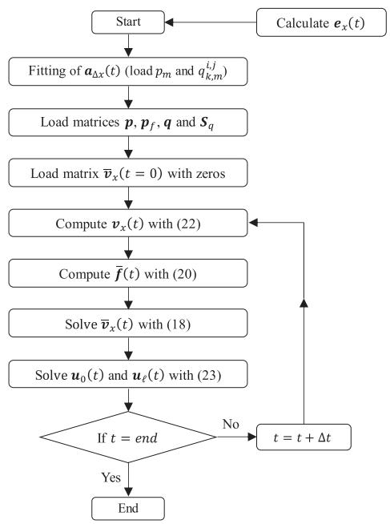  
Fig. 1. Flowchart of the phase-domain solution algorithm.

The equations for the particular case where a single time delay is assumed for all modal groups in ${ \mathbf { } } a _ { \Delta x } ( t )$ are determined as proposed in [12] by making $\tau _ { \Delta x } ^ { 1 } = \tau _ { \Delta x } ^ { 2 } = \cdot \cdot \cdot = \tau _ { \Delta x } ^ { N _ { M } } = \tau _ { \Delta x }$ · · · = τ Δx NM . Since it is unlikely that all modal delays will be integer multiples of the adopted time step, the determination of the past history terms in (20) will require interpolation, which is described in the Appendix [see (A.2)]. The flowchart of the proposed algorithm is shown in Fig. 1.

Note that the application of this procedure in the convolution related to the vertical component of the electric field in (1) is quite simple because it is a particular case of the proposed algorithm. Thus, its effect is transferred from one end to the other through a single convolution.

# III. MODAL-DOMAIN SOLUTION

# A. Original Formulation

Assuming that $\mathbf { \Delta } _ { t _ { V } }$ is a real and constant frequencyindependent matrix calculated at frequency f0 [17], one can write (3) as [12]

$$
\begin{array}{l} \boldsymbol {u} _ {x, 0} (t) = \\ - \frac {\Delta x}{\zeta} \left\{\boldsymbol {t} _ {v} \sum_ {n = 0} ^ {N _ {s}} \left[ \rho_ {N _ {s} - n} \boldsymbol {a} _ {\Delta x, m o d} (t) ^ {\overline {{N _ {s} - n}}} * \left(\boldsymbol {t} _ {v} ^ {- 1} \boldsymbol {e} _ {x, N _ {s} - n} (t)\right) \right] \right\}, \\ \end{array}
$$

$$
\boldsymbol {u} _ {x, \ell} (t) =
$$

$$
\frac {\Delta x}{\zeta} \left\{\boldsymbol {t} _ {v} \sum_ {n = 0} ^ {N _ {s}} \left[ \rho_ {n} \boldsymbol {a} _ {\Delta x, m o d} (t) ^ {\overline {{N _ {s} - n}}} * \left(\boldsymbol {t} _ {v} ^ {- 1} \boldsymbol {e} _ {x, n} (t)\right) \right] \right\}, \tag {24}
$$

where the propagation function of the line segment, $\pmb { a } _ { \Delta x , m o d } ( t )$ , is now represented in the modal domain, in which the voltages and currents are decoupled. Equation (24) is equivalent to (11) in [12], but written in a different form.

Similarly as in the phase-domain solution discussed in the previous section, the total inducing voltage at a given line segment in the modal domain is a function of the incident electric field and of $\bar { \pmb { v } } _ { x , n - 1 } ^ { m o d } ( t ) = { \pmb { t } } _ { v } ^ { - 1 } \bar { \pmb { v } } _ { x , n - 1 } ( t )$ , the contribution to the longitudinal voltage arriving from the adjacent segment at $x = ( n - 1 ) \Delta x$ , calculated using

$$
\bar {\boldsymbol {v}} _ {x, n} ^ {m o d} (t) = \boldsymbol {a} _ {\Delta x, m o d} (t) * \boldsymbol {v} _ {x, n} ^ {m o d} (t). \tag {25}
$$

The solution of (25) is similar as before. Considering a propagation delay $\tau _ { \Delta x } ^ { i }$ for the i-the mode, the diagonal elements of $\pmb { a } _ { \Delta x , m o d } ( t )$ are written as

$$
a _ {\Delta x, m o d} ^ {i, i} (t) = \sum_ {m = 1} ^ {N _ {p} ^ {i}} r _ {m} ^ {i, i} e ^ {\beta_ {m} ^ {i, i} \left(t - \tau_ {\Delta x} ^ {i}\right)} u \left(t - \tau_ {\Delta x} ^ {i}\right), \tag {26}
$$

where $\beta _ { m } ^ { i , i }$ and $r _ { m } ^ { i , i }$ are fitted poles and residues [12]. With the elements of $\pmb { a } _ { \Delta x , m o d } ( t )$ given by (26), the convolutions in (25) can be performed recursively for each mode as

$$
\bar {v} _ {x, n} ^ {i, m o d} (t) = a _ {\Delta x, m o d} ^ {i, i} (t) * v _ {x, n} ^ {i, m o d} (t), \tag {27}
$$

$$
\bar {v} _ {x, n} ^ {i, m o d} (t) = \sum_ {m = 1} ^ {N _ {p} ^ {i}} \left[ p _ {m} ^ {i, i} \bar {b} _ {n. m} ^ {i} (t - \Delta t) \right] + \left[ \sum_ {m = 1} ^ {N _ {p} ^ {i}} q _ {m} ^ {i, i} \right] \bar {f} _ {n} ^ {i, m o d} (t),
$$

$$
\bar {b} _ {n. m} ^ {i} (t) = p _ {m} ^ {i, i} \bar {b} _ {n. m} ^ {i} (t - \Delta t) + q _ {m} ^ {i, i} \bar {f} _ {n} ^ {i, m o d} (t),
$$

$$
f _ {n} ^ {i, m o d} (t) = v _ {x, n} ^ {i, m o d} \left(t - \tau_ {\Delta x} ^ {i}\right) + v _ {x, n} ^ {i, m o d} \left(t - \tau_ {\Delta x} ^ {i} - \Delta t\right), \tag {28}
$$

$p _ { m } ^ { i , i } = ( 2 + \beta _ { m } ^ { i , i } \Delta t ) / ( 2 - \beta _ { m } ^ { i , i } \Delta t )$ and ed in $q _ { m } ^ { i , i } = r _ { m } ^ { i , i } \ \Delta t /$ $( 2 - \beta _ { m } ^ { i , i } \Delta t )$

# B. Matrix Formulation

In order to increase the efficiency of the solution method proposed in [12] and solve for all $N _ { f }$ modes simultaneously, equation (28) can be written as (29). For simplicity, it is initially assumed that the number of poles $N _ { p } ^ { i }$ used to represent the i-th mode is equal to $N _ { p }$ .

$$
\begin{array}{l} \bar {\boldsymbol {v}} _ {x, n} ^ {m o d} (t) \\ = \sum_ {m = 1} ^ {N _ {p}} \left\{\left[ \begin{array}{c c c c} p _ {m} ^ {1, 1} & 0 & \dots & 0 \\ 0 & p _ {m} ^ {2, 2} & \dots & 0 \\ \vdots & \vdots & \ddots & 0 \\ 0 & 0 & \dots & p _ {m} ^ {N _ {f}, N _ {f}} \end{array} \right] \left[ \begin{array}{c} \bar {b} _ {n, m} ^ {1} (t - \Delta t) \\ \bar {b} _ {n, m} ^ {2} (t - \Delta t) \\ \vdots \\ \bar {b} _ {n, m} ^ {N _ {f}} (t - \Delta t) \end{array} \right] \right\} \\ + \left\{\sum_ {m = 1} ^ {N _ {p}} \left[ \begin{array}{c c c c} q _ {m} ^ {1, 1} & 0 & \dots & 0 \\ 0 & q _ {m} ^ {2, 2} & \dots & 0 \\ \vdots & \vdots & \ddots & 0 \\ 0 & 0 & \dots & q _ {m} ^ {N _ {f}, N _ {f}} \end{array} \right] \right\} \left[ \begin{array}{c} \bar {f} _ {n} ^ {1, m o d} (t) \\ \bar {f} _ {n} ^ {2, m o d} (t) \\ \vdots \\ \bar {f} _ {n} ^ {N _ {f}, m o d} (t) \end{array} \right], \\ \left[ \begin{array}{c} \bar {b} _ {n, m} ^ {1} (t) \\ \bar {b} _ {n, m} ^ {2} (t) \\ \vdots \\ \bar {b} _ {n, m} ^ {N _ {f}} (t) \end{array} \right] = \left[ \begin{array}{c c c c} p _ {m} ^ {1, 1} & 0 & \dots & 0 \\ 0 & p _ {m} ^ {2, 2} & \dots & 0 \\ \vdots & \vdots & \ddots & 0 \\ 0 & 0 & \dots & p _ {m} ^ {N _ {f}, N _ {f}} \end{array} \right] \quad \left[ \begin{array}{c} \bar {b} _ {n, m} ^ {1} (t - \Delta t) \\ \bar {b} _ {n, m} ^ {2} (t - \Delta t) \\ \vdots \\ \bar {b} _ {n, m} ^ {N _ {f}} (t - \Delta t) \end{array} \right] \\ \end{array}
$$

$$
+ \left[ \begin{array}{c c c c} q _ {m} ^ {1, 1} & 0 & \dots & 0 \\ 0 & q _ {m} ^ {2, 2} & \dots & 0 \\ \vdots & \vdots & \ddots & 0 \\ 0 & 0 & \dots & q _ {m} ^ {N _ {f}, N _ {f}} \end{array} \right] \left[ \begin{array}{c} \bar {f} _ {n} ^ {1, m o d} (t) \\ \bar {f} _ {n} ^ {2, m o d} (t) \\ \vdots \\ \bar {f} _ {n} ^ {N _ {f}, m o d} (t) \end{array} \right], \tag {29}
$$

or, in compact form,

$$
\begin{array}{l} \bar {\boldsymbol {v}} _ {x, n} ^ {m o d} (t) = \sum_ {m = 1} ^ {N _ {p}} \left\{\left[ \boldsymbol {p} _ {m} \right] \left[ \bar {\boldsymbol {b}} _ {n, m} (t - \Delta t) \right] \right\} \\ + \left[ \sum_ {m = 1} ^ {N _ {p}} \boldsymbol {q} _ {m} \right] \left[ \bar {\boldsymbol {f}} _ {n} ^ {\text {m o d}} (t) \right], \\ \end{array}
$$

$$
\bar {\boldsymbol {b}} _ {n, m} (t) = \left[ \boldsymbol {p} _ {m} \right] \left[ \bar {\boldsymbol {b}} _ {n, m} (t - \Delta t) \right] + \left[ \boldsymbol {q} _ {m} \right] \left[ \bar {\boldsymbol {f}} _ {n} ^ {\text {m o d}} (t) \right], \tag {30}
$$

where

$$
\begin{array}{l} \boldsymbol {q} _ {m} = \left[ \begin{array}{c c c c} q _ {m} ^ {1, 1} & 0 & \dots & 0 \\ 0 & q _ {m} ^ {2, 2} & \dots & 0 \\ \vdots & \vdots & \ddots & 0 \\ 0 & 0 & \dots & q _ {m} ^ {N _ {f}, N _ {f}} \end{array} \right] _ {(N _ {f} \times N _ {f})}, \\ \boldsymbol {p} _ {m} = \left[ \begin{array}{c c c c} p _ {m} ^ {1, 1} & 0 & \dots & 0 \\ 0 & p _ {m} ^ {2, 2} & \dots & 0 \\ \vdots & \vdots & \ddots & 0 \\ 0 & 0 & \dots & p _ {m} ^ {N _ {f}, N _ {f}} \end{array} \right] _ {(N _ {f} \times N _ {f})}, \\ \bar {\boldsymbol {f}} _ {n} ^ {m o d} \left(t\right) = \left[ \begin{array}{c} \bar {f} _ {n} ^ {1, m o d} \left(t\right) \\ \bar {f} _ {n} ^ {2, m o d} \left(t\right) \\ \vdots \\ \bar {f} _ {n} ^ {N _ {f}, m o d} \left(t\right) \end{array} \right] _ {\left(N _ {f} \times 1\right)}, \\ \bar {\boldsymbol {b}} _ {n, m} (t) = \left[ \begin{array}{c} \bar {b} _ {n, m} ^ {1} (t) \\ \bar {b} _ {n, m} ^ {2} (t) \\ \vdots \\ \bar {b} _ {n, m} ^ {N _ {f}} (t) \end{array} \right] _ {(N _ {f} \times 1)} \tag {31} \\ \end{array}
$$

Equation (29) has the same structure as (6) when $N _ { M } = 1$ . The difference between these equations is the matrix of residues $\mathbf { \nabla } \mathbf { q } _ { m }$ and the matrix of poles $\pmb { p } _ { m } .$ . In (6), $\mathbf { \nabla } _ { \mathbf { q } \mathrm { m } }$ is a full matrix, whereas in (29) this matrix is diagonal. On the other hand, ${ \pmb p } _ { m }$ in (6) is a scalar term, whereas in (29) it is a diagonal matrix. Following the same procedure applied to (6) it is possible to write (18) as

$$
\begin{array}{l} \bar {\boldsymbol {v}} _ {x} ^ {m o d} (t) = [ \boldsymbol {p} ] [ \bar {\boldsymbol {b}} (t - \Delta t) ] + [ \boldsymbol {S} _ {q} ] [ \bar {\boldsymbol {f}} ^ {m o d} (t) ], \\ \bar {\boldsymbol {b}} (t) = \left[ \boldsymbol {p} _ {f} \right] \left[ \bar {\boldsymbol {b}} (t - \Delta t) \right] + [ \boldsymbol {q} ] \left[ \bar {\boldsymbol {f}} ^ {\text {m o d}} (t) \right], \tag {32} \\ \end{array}
$$

where $\bar { \boldsymbol { b } } ( t - \Delta t ) , \boldsymbol { S } _ { q } ,$ and q have the same structure as before, and matrices $\mathbf { \nabla } _ { \mathbf { p } , \mathbf { p } _ { f } }$ and $\bar { f } ^ { m o d } ( t )$ are given by

$$
\begin{array}{l} \boldsymbol {p} = \left[ \begin{array}{l l l} \boldsymbol {p} _ {1} & \boldsymbol {p} _ {2} & \dots \\ & & \boldsymbol {p} _ {N _ {p}} \end{array} \right] _ {\left(N _ {f} \times N _ {f} N _ {p}\right)}, \\ \boldsymbol {p} _ {f} = \left[ \begin{array}{c c c c} \boldsymbol {p} _ {1} & \mathbf {0} & \dots & \mathbf {0} \\ 0 & \boldsymbol {p} _ {2} & \dots & \mathbf {0} \\ \vdots & \vdots & \ddots & \vdots \\ \mathbf {0} & \mathbf {0} & \mathbf {0} & \boldsymbol {p} _ {N _ {p}} \end{array} \right] _ {\left(N _ {f} N _ {p} \times N _ {f} N _ {p}\right)}. \tag {33} \\ \end{array}
$$

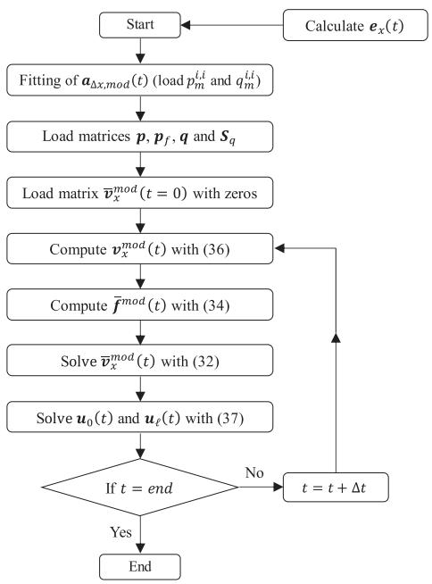  
Fig. 2. Flowchart of the modal-domain solution algorithm.

$$
\begin{array}{l} \bar {\boldsymbol {f}} ^ {m o d} (t) = \left[ \begin{array}{c} \boldsymbol {v} _ {x} ^ {1, m o d} (t - \tau_ {\Delta x} ^ {1}) \\ \boldsymbol {v} _ {x} ^ {2, m o d} (t - \tau_ {\Delta x} ^ {2}) \\ \vdots \\ \boldsymbol {v} _ {x} ^ {N _ {f}, m o d} (t - \tau_ {\Delta x} ^ {N _ {M}}) \end{array} \right] \\ - \left[ \begin{array}{c} \boldsymbol {v} _ {x} ^ {1, m o d} (t - \tau_ {\Delta x} ^ {1} - \Delta t) \\ \boldsymbol {v} _ {x} ^ {2, m o d} (t - \tau_ {\Delta x} ^ {2} - \Delta t) \\ \vdots \\ \boldsymbol {v} _ {x} ^ {N _ {f}, m o d} (t - \tau_ {\Delta x} ^ {N _ {M}} - \Delta t) \end{array} \right] _ {(N _ {f} \times N _ {s})}. \tag {34} \\ \end{array}
$$

$$
\boldsymbol {v} _ {x} ^ {i, m o d} (t) = \left[ v _ {x, 0} ^ {i, m o d} (t) v _ {x, 1} ^ {i, m o d} (t) \dots v _ {x, N _ {s} - 1} ^ {i, m o d} (t) \right] _ {(1 \times N _ {s})}. \tag {35}
$$

Since the number of poles used to represent each mode is not necessarily equal, matrices $_ p$ and $p _ { f }$ must be modified. In this case, $N _ { p }$ is represented by the largest $N _ { p } ^ { i }$ and the positions in excess of matrices $_ p$ and $p _ { f }$ are filled in with zeros. The determination of the past history terms in (34) requires interpolation, which is described in the Appendix [see (A.5)].

Equation (32) allows the convolutions involving the incident horizontal electric field to be performed simultaneously for all points in modal domain. For this, the term $v _ { x } ^ { m o d } ( t )$ is obtained in a manner similar to ${ \mathbf { } } v _ { x } ( t )$ , given by (21). In other words, it allows solving (24a) or (24b) directly using the recursive algorithm of (25). If (24a) is to be calculated, $v _ { x } ^ { m o d } ( t )$ is given by (36a). On the other hand, to solve (24b), $v _ { x } ^ { m o d } ( t )$ is given by (36b). The flowchart of the modal-domain solution algorithm is shown in Fig. 2.

$$
\begin{array}{l} \pmb {v} _ {x} ^ {m o d} (t) = \pmb {t} _ {v} ^ {- 1} \left[ \rho_ {N _ {s}} \pmb {e} _ {x, N _ {s}} (t) \rho_ {N _ {s} - 1} \pmb {e} _ {x, N _ {s} - 1} (t) \dots \rho_ {1} \pmb {e} _ {x, 1} (t) \right] \\ + \left[ \mathbf {0} \bar {\boldsymbol {v}} _ {x, 0} ^ {m o d} (t) \bar {\boldsymbol {v}} _ {x, 1} ^ {m o d} (t) \dots \bar {\boldsymbol {v}} _ {x, N _ {s} - 2} ^ {m o d} (t) \right], \\ \end{array}
$$

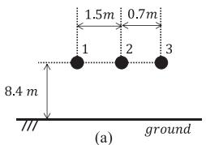

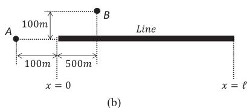  
Fig. 3. (a) Line configuration in which the conductors have 8.5 mm radius, DC resistance of 0.11872 Ω/km and shunt conductance of 18.641 pS/m; (b) top view of the line (- = 3 km).

$$
\begin{array}{l} \boldsymbol {v} _ {x} ^ {\text {m o d}} (t) = \boldsymbol {t} _ {v} ^ {- 1} \left[ \rho_ {0} \boldsymbol {e} _ {x, 0} (t) \rho_ {1} \boldsymbol {e} _ {x, 1} (t) \dots \rho_ {N _ {s} - 1} \boldsymbol {e} _ {x, N _ {s} - 1} (t) \right] \\ + \left[ \mathbf {0} \bar {\boldsymbol {v}} _ {x, 0} ^ {\text {m o d}} (t) \bar {\boldsymbol {v}} _ {x, 1} ^ {\text {m o d}} (t) \dots \bar {\boldsymbol {v}} _ {x, N _ {s} - 2} ^ {\text {m o d}} (t) \right]. \tag {36} \\ \end{array}
$$

Finally, equation (3) can be rewritten as

$$
\boldsymbol {u} _ {0} (t) = - \frac {\Delta x}{\zeta} \left\{\rho_ {0} \boldsymbol {e} _ {x, 0} (t) + \boldsymbol {t} _ {v} \bar {\boldsymbol {v}} _ {x, N _ {s} - 1} ^ {m o d} (t) \right\},
$$

$$
\boldsymbol {u} _ {\ell} (t) = \frac {\Delta x}{\zeta} \left\{\rho_ {N _ {s}} \boldsymbol {e} _ {x, N _ {s}} (t) + \boldsymbol {t} _ {v} \bar {\boldsymbol {v}} _ {x, N _ {s} - 1} ^ {\text {m o d}} (t) \right\}. \tag {37}
$$

As with the phase-domain algorithm, the modal-domain algorithm can also be easily adapted to solve the convolution related to the vertical component of the electric field in (1).

# IV. CASE STUDY

# A. Three-Phase Distribution Line

In this section, simulation results obtained for a 3-km long three-phase line with the configuration shown in Fig. 3(a) are presented. The calculation of the incident lightning EM fields taking into account the effect of a lossy ground is performed considering the formulation proposed in [19]–[22]. The channel base current, which has a peak value of 16 kA, was represented as the sum of two Heidler functions as in [23].

Lightning-induced voltages were calculated either in ATP or EMTP-RV considering stroke locations A and B indicated in Fig. 3(b). The electromagnetic field calculation assumed a ground conductivity of 0.002 S/m and a ground relative permittivity of 10. The ATP simulations considered Marti’s model [17], which is compatible with the formulation of Section III. The EMTP-RV simulations considered the wideband line model (an implementation of ULM [18]), which is compatible with the formulation of Section II. In each case, six current sources (three for each line end) were calculated in Matlab as described in [12] using the proposed matrix-form solutions. The model parameters were fitted using the vector fitting technique [24]. The inducing current sources were implemented in ATP using Models language. In EMTP-RV, this was performed by using the “I point-by-point device”. In [12], the ULM and Marti line models augmented to include the influence of incident lightning electromagnetic fields were respectively called EPD (Extended Phase-Domain) and EMD (Extended Modal-Domain) models. The same nomenclature is used here for consistence. The unbalanced resistive loads indicated in Table II were used in order to highlight the effect of reflections occurring at the line ends.

Fig. 4 shows the voltages calculated at the ends of conductor 2 for stroke locations A and B using Simpson’s integration method to determine the inducing current sources. In the simulations,

TABLE IIRESISTIVE LOADS CONNECTED AT THE LINE ENDS  

<table><tr><td rowspan="2">End</td><td colspan="3">Conductors</td></tr><tr><td>1</td><td>2</td><td>3</td></tr><tr><td>x = 0</td><td>100 Ω</td><td>300 Ω</td><td>1 Ω</td></tr><tr><td>x = ℓ</td><td>500 Ω</td><td>400 Ω</td><td>1 Ω</td></tr></table>

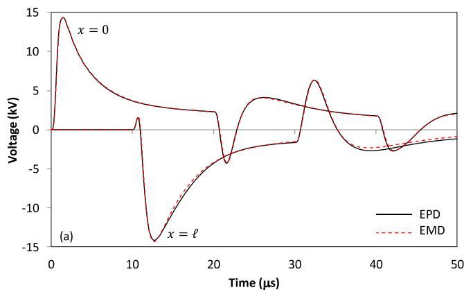

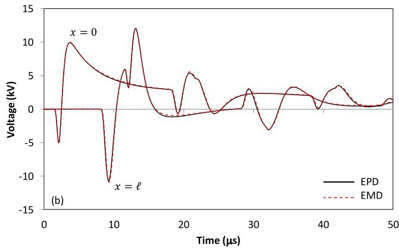  
Fig. 4. Voltages induced on conductor 2 for stroke locations (a) A and (b) B.

TABLE III DATA FOR THE FITTING OF $A _ { \Delta x }$   

<table><tr><td></td><td>Np/AΔx</td><td>fo(kHz)</td><td>NM</td></tr><tr><td>EPD</td><td>10</td><td>-</td><td>1</td></tr><tr><td>EMD</td><td>10</td><td>100</td><td>3</td></tr></table>

60 segments were considered for both models, with Δt = 10 ns. This segmentation is shown in [12] to lead to accurate results compared to a finely discretized finite-difference time-domain (FDTD) solution of telegrapher’s equations. In general, segments up to few tens of meters are able to lead to accurate results depending on the lightning incidence point and the line configuration [12]. The number of poles used in the fitting of each model is given in Table III. Usually, the fitting of ${ \pmb a } _ { \Delta x } ( t )$ with $N _ { p }$ between 4 and 12 was seen to provide a good compromise between accuracy and computational efficiency for soil conductivity values between 0.01 S/m and 0.001 S/m and typical overhead distribution line configurations. Although the fitting was performed in Matlab using the vector fitting technique, it

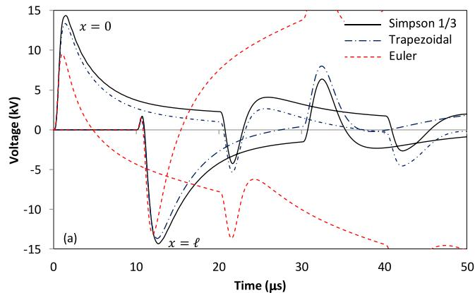

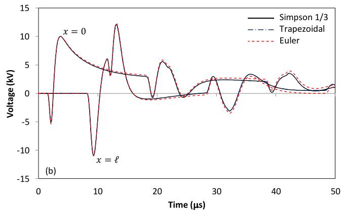  
Fig. 5. Voltages induced on conductor 2 for stroke locations (a) A and (b) B as a function of the integration method.

could have been similarly performed with the built-in fitting tools available in the EMT-type programs.

The results illustrated in Fig. 4 show that the methods lead to equivalent results. In principle, the phase-domain solution discussed in Section II is more general than the modal-domain solution discussed in Section III. Nevertheless, the modal-domain solution is more efficient as demonstrated in [12], so its use is recommended whenever possible. Although not shown, the sensitivity of the modal-domain method to the frequency of calculation of the transformation matrix was investigated for frequencies between 0.1 Hz and 1 MHz. It was observed that induced-voltage waveforms equivalent to those shown in Fig. 4 were obtained irespective to the value assumed for f0.

For this case study, the average time required by the EPD and EMD models to calculate the six external current sources using the proposed matrix-form solutions in a computer with 2.1 GHz CPU and 6 GB of RAM is 2.77 s and 2.74 s, respectively, as opposed to average times of 61.11 s and 8.52 s using a cascade of loops. The observed differences represent 95.5% and 67.8% reductions for the EPD and EMD models, respectively. These times do not include the electromagnetic field calculation, the calculation and fitting of the line parameters, and the transient solution, which are discussed in [12]. The source calculations performed in [12] were already based on the matrix-form solutions discussed here.

The sensitivity of the results to the numerical integration method used in the calculations is shown in Fig. 5. The simulations considered the EMD model and the integration methods

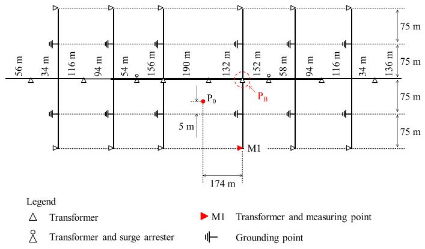  
Fig. 6. Complex power distribution network configuration [26].

shown in Table I, for stroke locations A and B. For stroke location B, the observed differences are negligible. However, large deviations with respect to the reference curves obtained with Simpson’s method are observed for stroke location A, especially for Euler’s integration method. This means that a greater number of line segments would be necessary for obtaining a desired accuracy if Euler’s method or the trapezoidal rule of integration were used instead of Simpson’s rule. In fact, all three methods can be shown to lead to equivalent results if a sufficiently large number of segments is considered in the solution of (2), but at the cost of reducing the model efficiency. For this reason, Simpson’s rule is preferred among the methods listed in Table I.

It must be noted that (1) and (2) do not depend on the boundary conditions of the line. As a consequence, the current sources necessary to incorporate the effect of the incident electromagnetic fields on the line models available in EMT-type programs are not influenced by the type of load connected at the line ends, be it linear or nonlinear. This means that the proposed methods are not affected by numerical instability problems such as the one discussed in [25]. This conclusion holds regardless of lightning incidence point, line configuration, and numerical integration rule. An additional example is presented in the next section to illustrate the ability of the proposed methods to deal with a complex network with nonlinear loads.

# B. Complex Power Distribution Network

In this section, the complex distribution network shown in Fig. 6 is used to validate the EMD and EPD models. This network is based on the reduced-scale model experiment presented in [26]. The distribution lines are composed of two vertically aligned conductors at heights of 10 m and 8 m, both with 20 mm diameter (all dimensions and electrical quantities presented here are corrected to the real scale). The upper conductor serves as a phase conductor and the lower conductor is a multi-grounded neutral. The lines are terminated with transformers, surge arresters and grounding points. In the actual experiment, the transformers were represented as capacitors, the surge arresters were modeled as diodes, and the grounding points were modeled as a combination of linear elements (inductors and resistors). A detailed description of the simulated network and of each component model can be found in [26].

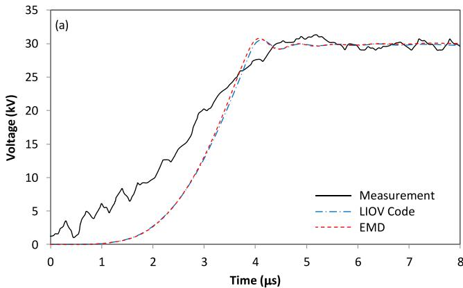

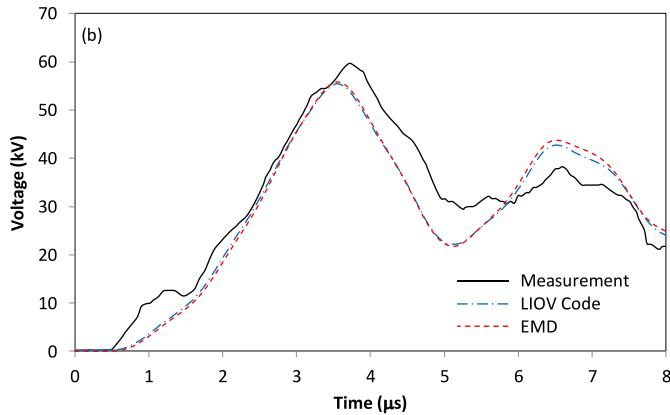  
Fig. 7. Comparison between induced voltages observed at point M1 of the complex power distribution network of Fig. 6: (a) case A; (b) case B.

Two of the measurements presented in [26] are reproduced here. In case $\mathbf { A } ,$ a 34 kA return-stroke current is assumed to strike point $\mathrm { { P _ { 0 } } }$ indicated in Fig. 6. In case B, all surge arresters shown in Fig. 6 were removed and a surge arrester was connected in parallel with the transformer at point $\mathrm { P _ { B } }$ . In this case, the measured return-stroke current reached 50 kA. In both cases, the induced voltage waveform was measured at point M1.

In all cases reproduced in this section, the stroke current was represented as a trapezoidal waveform with front time of $2 \ \mu \mathrm { s }$ and time to half value of 85 $\mu \mathbf { S } .$ . The transmission line (TL) return-stroke model [19] with propagation speed of 33 m/μs was used. The soil was assumed as a perfect conductor because the experiment was performed over an aluminum plate. Since the EPD and EMD models were seen to lead to equivalent results, only the results obtained with the EMD model are presented. The whole network was implemented in ATP with the lines being represented by the JMarti model [17]. In the current source calculation, the soil and conductor conductivities were set to very high values (1 MS/m), the average length of the segments used was of 10 m, and 4 poles were used in the fitting of each mode of $\pmb { a } _ { \Delta x , m o d } ( t )$ . As a whole, 152 current sources were calculated, a pair for each line end shown in Fig. 6. The results obtained for cases A and B are shown in Fig. 7. Also included in the figure are results reported in [26], obtained with the LIOV code [1].

It can be seen in Fig. 7 that the EMD model leads to a very good agreement with the measured and calculated waveforms. The minor deviations with respect to the LIOV code are probably related to differences in the calculation of the electromagnetic

fields, line segmentation and model implementation. For example, the LIOV code is based on the FDTD method, but a pair of short non-illuminated line segments is added at each line end to perform the coupling with the EMT simulator [1]. It has been demonstrated in [12] that the EMD and EPD models lead to results that are actually equivalent to those obtained with a $1 ^ { \mathrm { s t } }$ order FDTD solution of telegrapher’s equations in fully controlled conditions.

Overall, the results presented in this section indicate the feasibility of the proposed models to perform lightning-induced voltage calculations in networks with complex topology and nonlinear loads in EMT-type programs.

# V. CONCLUSION

Two different compact matrix formulations are proposed to simplify the calculation of the lumped sources necessary to estimate lightning-induced effects using transmission line models available in electromagnetic transient programs. The proposed formulations are shown to lead to equivalent results in the simulation of lightning-induced voltages on a three-phase distribution line using Marti’s model available in ATP and the universal line model available in EMTP-RV. A study considering three different numerical integration methods (Simpson’s, Euler’s, and the trapezoidal method) indicates that Simpson’s rule is most accurate and less sensitive to the stroke location than the other methods. It is also shown that the methods can be conveniently used to simulate complex distribution networks considering nonlinear loads in EMT-type programs. Since the proposed formulations are written in matrix form, they can be conveniently implemented in matrix-oriented simulation tools like Matlab. Also, they have the main advantage of allowing the calculation of the convolutions involving the horizontal component of the incident electric field at once in all line segments, instead of requiring a sequential, less efficient calculation as previously proposed.

# APPENDIX

Considering that

$$
\bar {\tau} _ {\Delta x} ^ {k} = \left\lfloor \frac {\tau_ {\Delta x} ^ {k}}{\Delta t} \right\rfloor \left(\bar {\tau} _ {\Delta x} ^ {k} \in \mathbb {N}\right),
$$

$$
\xi_ {\Delta x} ^ {k} = \frac {\tau_ {\Delta x} ^ {k}}{\Delta t} - \bar {\tau} _ {\Delta x} ^ {k} (0 <   \xi_ {\Delta x} ^ {k} <   1), \tag {A1}
$$

where $\bar { \tau } _ { \Delta x } ^ { k }$ and $\xi _ { \Delta x } ^ { k }$ are the integer and fraction parts of $\tau _ { \Delta x } ^ { k } / \Delta t$ respectively, equation (20) can be written considering a linear interpolation as

$$
\begin{array}{l} \bar {\boldsymbol {f}} \left(t\right) = \left[ \boldsymbol {I} _ {\left(N _ {f} N _ {M}\right)} - \bar {\boldsymbol {\xi}} _ {\Delta x} \right] \left[ \begin{array}{c} \boldsymbol {v} _ {x} \left(t - \bar {\tau} _ {\Delta x} ^ {1} \Delta t\right) \\ \boldsymbol {v} _ {x} \left(t - \bar {\tau} _ {\Delta x} ^ {2} \Delta t\right) \\ \vdots \\ \boldsymbol {v} _ {x} \left(t - \bar {\tau} _ {\Delta x} ^ {N _ {M}} \Delta t\right) \end{array} \right] \\ + \left[ \begin{array}{c} \boldsymbol {v} _ {x} \left(t - \bar {\tau} _ {\Delta x} ^ {1} \Delta t - \Delta t\right) \\ \boldsymbol {v} _ {x} \left(t - \bar {\tau} _ {\Delta x} ^ {2} \Delta t - \Delta t\right) \\ \vdots \\ \boldsymbol {v} _ {x} \left(t - \bar {\tau} _ {\Delta x} ^ {N _ {M}} \Delta t - \Delta t\right) \end{array} \right] \\ \end{array}
$$

$$
+ \left[ \bar {\boldsymbol {\xi}} _ {\Delta x} \right] \left[ \begin{array}{c} \boldsymbol {v} _ {x} (t - \bar {\tau} _ {\Delta x} ^ {1} \Delta t - 2 \Delta t) \\ \boldsymbol {v} _ {x} (t - \bar {\tau} _ {\Delta x} ^ {2} \Delta t - 2 \Delta t) \\ \vdots \\ \boldsymbol {v} _ {x} (t - \bar {\tau} _ {\Delta x} ^ {N _ {M}} \Delta t - 2 \Delta t) \end{array} \right]. \tag {A2}
$$

where ${ \pmb I } _ { ( N _ { f } N _ { M } ) }$ is an identity matrix of order $N _ { f } N _ { M }$ and

$$
\bar {\boldsymbol {\xi}} _ {\Delta x} = \left[ \begin{array}{c c c c} \xi_ {\Delta x} ^ {1} \boldsymbol {I} & \mathbf {0} & \dots & \mathbf {0} \\ \mathbf {0} & \xi_ {\Delta x} ^ {2} \boldsymbol {I} & \dots & \mathbf {0} \\ \vdots & \vdots & \ddots & \mathbf {0} \\ \mathbf {0} & \mathbf {0} & \dots & \xi_ {\Delta x} ^ {N _ {M}} \boldsymbol {I} \end{array} \right] _ {\left(N _ {f} N _ {M} \times N _ {f} N _ {M}\right)} \tag {A3}
$$

For the modal domain case, this formulation is very similar. So, considering that

$$
\bar {\tau} _ {\Delta x} ^ {i} = \left\lfloor \frac {\tau_ {\Delta x} ^ {i}}{\Delta t} \right\rfloor (\bar {\tau} _ {\Delta x} ^ {i} \in \mathbb {N})
$$

$$
\xi_ {\Delta x} ^ {i} = \frac {\tau_ {\Delta x} ^ {i}}{\Delta t} - \bar {\tau} _ {\Delta x} ^ {i} (0 <   \xi_ {\Delta x} ^ {i} <   1) \tag {A4}
$$

where $\bar { \tau } _ { \Delta x } ^ { i }$ and $\xi _ { \Delta x } ^ { i }$ are the integer and fraction parts of $\tau _ { \Delta x } ^ { i } / \Delta t .$ respectively, equation (34) can be written considering a linear interpolation as

$$
\begin{array}{l} \bar {\boldsymbol {f}} ^ {m o d} (t) = \left[ \boldsymbol {I} _ {(N _ {f})} - \bar {\boldsymbol {\xi}} _ {\Delta x} \right] \left[ \begin{array}{c} \boldsymbol {v} _ {x} ^ {1, m o d} \left(t - \bar {\tau} _ {\Delta x} ^ {1} \Delta t\right) \\ \boldsymbol {v} _ {x} ^ {2, m o d} \left(t - \bar {\tau} _ {\Delta x} ^ {2} \Delta t\right) \\ \vdots \\ \boldsymbol {v} _ {x} ^ {N _ {M}, m o d} \left(t - \bar {\tau} _ {\Delta x} ^ {N _ {M}} \Delta t\right) \end{array} \right] \\ + \left[ \begin{array}{c} \boldsymbol {v} _ {x} ^ {1, m o d} \left(t - \bar {\tau} _ {\Delta x} ^ {1} \Delta t - \Delta t\right) \\ \boldsymbol {v} _ {x} ^ {2, m o d} \left(t - \bar {\tau} _ {\Delta x} ^ {2} \Delta t - \Delta t\right) \\ \vdots \\ \boldsymbol {v} _ {x} ^ {N _ {M}, m o d} \left(t - \bar {\tau} _ {\Delta x} ^ {N _ {M}} \Delta t - \Delta t\right) \end{array} \right] \\ + \left[ \bar {\boldsymbol {\xi}} _ {\Delta x} \right] \left[ \begin{array}{c} \boldsymbol {v} _ {x} ^ {1, m o d} \left(t - \bar {\tau} _ {\Delta x} ^ {1} \Delta t - 2 \Delta t\right) \\ \boldsymbol {v} _ {x} ^ {2, m o d} \left(t - \bar {\tau} _ {\Delta x} ^ {2} \Delta t - 2 \Delta t\right) \\ \vdots \\ \boldsymbol {v} _ {x} ^ {N _ {M}, m o d} \left(t - \bar {\tau} _ {\Delta x} ^ {N _ {M}} \Delta t - 2 \Delta t\right) \end{array} \right], \tag {A5} \\ \end{array}
$$

where $\pmb { I } _ { ( N _ { f } ) }$ is an identity matrix of order $N _ { f }$ and

$$
\bar {\boldsymbol {\xi}} _ {\Delta x} = \left[ \begin{array}{c c c c} \xi_ {\Delta x} ^ {1} & 0 & \dots & 0 \\ 0 & \xi_ {\Delta x} ^ {2} & \dots & 0 \\ \vdots & \vdots & \ddots & 0 \\ 0 & 0 & \dots & \xi_ {\Delta x} ^ {N _ {f}} \end{array} \right] _ {(N _ {f} \times N _ {f})}. \tag {A6}
$$

# REFERENCES

[1] A. Borghetti, J. A. Gutierrez, C. A. Nucci, M. Paolone, E. Petrache, and F. Rachidi, “Lightning-induced voltages on complex distribution systems: Models, advanced software tools and experimental validation,” J. Electrostat., vol. 60, no. 2–4, pp. 163–174, Mar. 2004.   
[2] F. Napolitano, A. Borghetti, C. A. Nucci, M. Paolone, F. Rachidi, and J. Mahseredjian,, “An advanced interface between the LIOV code and the EMTP-RV,” in Proc. 29th ICLP - Int. Conf. Lightning Prot., pp. 6b-6-1–6b-6-12, 2008.   
[3] A. De Conti, F. H. Silveira, and S. Visacro, “Lightning overvoltages on complex low-voltage distribution networks,” Electr. Power Syst. Res., vol. 85, pp. 7–15, 2012.

[4] A. De Conti, F. H. Silveira, and S. Visacro, “On the role of transformer grounding and surge arresters on protecting loads from lightning-induced voltages in complex distribution networks,” Electric Power Sys. Res., vol. 113, pp. 204–212, 2014.   
[5] A. Andreotti, A. Pierno, and V. A. Rakov, “A new tool for calculation of lightning-induced voltages in power systems – Part I: Model development,” IEEE Trans. Power Del., vol. 28, no. 2, pp. 1213–1222, Feb. 2015.   
[6] M. Brignone, F. Delfino, R. Procopio, M. Rossi, and F. Rachidi, “Evaluation of power system lightning performance – Part I: Model and numerical solution using the PSCAD-EMTDC platform,” IEEE Trans. Electromagn. Compat., vol. 59, no. 1, pp. 137–145, Feb. 2017.   
[7] X. Liu, Z. Fan, G. Liang, and T. Wang, “Calculation of lightning induced overvoltages on overhead lines: Model and interface with Matlab/Simulink,” IEEE Access, vol. 6, pp. 47308–47318, Aug. 2018.   
[8] F. Napolitano, F. Tossani, A. Borghetti, and C. A. Nucci, “Lightning performance assessment of power distribution lines by means of stratified sampling Monte Carlo method,” IEEE Trans. Power Del., vol. 33, no. 5, pp. 2571–2577, Oct. 2018.   
[9] F. Tossani, A. Borghetti, F. Napolitano, A. Piantini, and C. A. Nucci, “Lightning performance of overhead power distribution lines in urban areas,” IEEE Trans. Power Deliv., vol. 33, no. 2, pp. 581–588, Apr. 2018.   
[10] A. Andreotti, A. Piantini, A. Pierno, and R. Rizzo, “Lightning-induced voltages on complex power systems by using CiLIV: The effects of channel tortuosity,” IEEE Trans. Power Del., vol. 33, no. 2, pp. 680–688, Apr. 2018.   
[11] M. Brignone, D. Mestriner, R. Procopio, M. Rossi, A. Piantini, and F. Rachidi, “EM fields generated by a scale model helical antenna and its use in validating a code for lightning-induced voltage calculation,” IEEE Trans. Electromagn. Compat., vol. 61, no. 3, pp. 778–787, Jun. 2019.   
[12] A. De Conti and O. E. S. Leal, “Time-domain procedures for lightninginduced voltage calculation in electromagnetic transient simulators,” IEEE Trans. Power Del., 2020, to be published, doi: 10.1109/TP-WRD.2020.2982306.   
[13] J. A. Martinez-Velasco, Transient Analysis of Power Systems Solution Techniques, Tools and Applications. Hoboken, NJ, USA: Wiley 2015.   
[14] C. R. Paul, Analysis of Multiconductor Transmission Lines. 2nd Ed., New Jersey, NJ, USA: Wiley 2007.   
[15] A. Semlyen and A. Dabuleanu, “Fast and accurate switching transient calculations on transmission lines with ground return using recursive convolutions,” IEEE Trans. Power App. Syst., vol. PAS-94, no. 2, pp. 561–571, Mar./Apr. 1975.   
[16] A. Xémard, P. Baraton, B. Bressac, N. Qako, J. Mahseredjian, and G. Simard, “Presentation of an approach based on EMTP for the calculation of lightning induced overvoltages,” in Proc. IPST’05 – Int. Conf. Power Syst. Transients, 2003, pp. 1–5.   
[17] J. R. Marti, “Accurate modelling of frequency-dependent transmission lines in electromagnetic transient simulations,” IEEE Trans. Power Appar. Syst., vol. PAS-101, no. 1, pp. 147–157, Jan. 1982.   
[18] A. Morched, B. Gustavsen, and M. Tartibi, “A universal model for accurate calculation of electromagnetic transients on overhead lines and underground cables,” IEEE Trans. Power Del., vol. 14, no. 3, pp. 1032–1038, Jul. 1999.   
[19] M. A. U. Uman, D. K. McLain, and E. P. Krider, “The electromagnetic radiation from a finite antenna,” Amer. J. Phys., vol. 43, pp. 33–38, 1975.   
[20] C. A. Nucci, C. Mazzetti, F. Rachidi, and M. Ianoz, “On lightning return stroke models for LEMP calculations,” in Proc. ICLP – 19th Int. Conf. Lightning Protection, 1988.   
[21] V. Cooray, “Horizontal fields generated by return strokes,” Radio Sci., vol. 24, no. 4, pp. 529–537, 1992.   
[22] M. Rubinstein, “An approximate formula for the calculation of the horizontal electric field from lightning at close, intermediate, and long range,” IEEE Trans. Electromagn. Compat., vol. 38, no. 3, pp. 531–535, Aug. 1996.   
[23] A. De Conti and S. Visacro, “Analytical representation of single- and double-peaked lightning current waveforms,” IEEE Trans. Electromagn. Compat., vol. 49, no. 2, pp. 448–451, May 2007.   
[24] B. Gustavsen and A. Semlyen, “Rational approximation of frequency domain responses by vector fitting,” IEEE Trans. Power Deliv., vol. 14, no. 3, pp. 1052–1061, Jul. 1999.   
[25] M. Brignone, D. Mestriner, R. Procopio, A. Piantini, and F. Rachidi, “On the stability of FDTD-based numerical codes to evaluate lightning-induced overvoltages in overhead transmission lines,” IEEE Trans. Electromagn. Compat., vol. 62, no. 1, pp. 108–115, Feb. 2020.   
[26] A. Piantini, J. M. Janiszewski, A. Borghetti, C. A. Nucci, and M. Paolone, “A scale model for the study of the LEMP response of complex power distribution networks,” IEEE Trans. Power Del., vol. 22, no. 1, pp. 710–720, Jan. 2007.