# Multi-timescale simulator of nonlinear electrical elements by interfacing shifted equivalent phasors and electromagnetic transient simulation

Zhen Gong , Chengxi Liu * , Liangzhong Yao

School of Electrical Engineering and Automation, Wuhan University, Wuhan 430072, China

# A B S T R A C T

This paper proposes a multi-timescale transient branch companion model for electrical elements with strong nonlinearity, which is suitable for electromagnetic transient simulation for a wide range of time-scales. A shifted equivalent phasor (SEP) method for signals with wide frequency range is adopted combined with envelope signals and equivalent phasor-shift operator, and a saturable SEP based transformer model is established. A method of piecewise linearization based on Newton-Raphson is used to simulate excitation current under different simulation time step sizes in order to illustrate the overshoot phenomenon of piecewise linearization under large step sizes. Reducing the step size can effectively suppress the overshoot, but simulation efficiency will be sacrificed. This problem can be avoided in SEP model even if large time step is adopted and integrated simulation of both instantaneous and envelope (with larger timescale) waveforms can be efficiently tracked within one simulation run based on the determination of two parameters setting: shifting equivalent phasor and time step size. Finally, the transformer model and voltage source converter (VSC) are established and validated in MATLAB and PSCAD to prove its correctness and efficiency.

# 1. Introduction

At present, electromagnetic transient (EMT) simulation is the most reliable approach to evaluate the dynamic response of large-scale AC-DC interconnected power grids, for it can accurately characterize the highfrequency dynamic characteristics of the power grids. Unlike transient stability simulation, EMT simulation generally uses instantaneous signals to reflect the dynamic response of various electrical quantities. Therefore, it requires smaller integration steps, however, compromising on its computational efficiency [1].

In EMT simulation, the transformer core is represented by a nonlinear inductor, the piecewise linearization method is widely adopted to emulate the nonlinear elements [2]. Overshoot occurs when using large time step [3]. Reference [3] established an EMT model is to capture the key dynamics of inrush current of fault recovery transformer. Reference [4–7] analyzed the saturation characteristics of transformer by the piecewise linearization technique, but did not consider the overshoot distortion issues.

Alternative methods are proposed to obtain low-frequency components of the original signals, so that a larger time step can be used in the whole or part of the transient simulation process by improving the modeling method. To reduce the additional calculations due to the switching operations, reference [8] proposed an averaging model to improve the efficiency of EMT simulation of power electronic devices. Similar to [8], dynamic vector method was also used for HVDC system [9].

However, its simulation accuracy depended on the choice of dominant frequency and phasor. The above methods can achieve the purpose of improving the efficiency of EMT simulation, but sacrifice the accuracy. Furthermore, an adaptive frequency transient simulation (FAST) method performed the Hilbert transform on the instantaneous signal to construct the corresponding analytical signal, and then performed frequency shift operation on the signal spectrum in the frequency domain [10]. If the shifted frequency was set to the carrier frequency, approximate DC frequency-shifted signal can be obtained so as to facilitate larger time steps and to improve the efficiency, which can still describe the response of the instantaneous values, without losing any frequency component signal.

However, as FAST uses the Hilbert transform to construct the required analytical signal, which is still a type of linear transformation, it is just suitable for linear elements. When performing EMT simulations on non-linear electrical elements, such as power electronic devices, transformers and motors, the fundamental and harmonic signals will be produced simultaneously during the transient process. Obviously, when examining the dynamic responses of nonlinear systems after faults or other disturbances, the nonlinear characteristics of the above elements cannot be ignored, and the corresponding dynamic response for harmonic signals needs to be carefully characterized. At this time, the electrical signal spectrum of interest will no longer be concentrated on the narrow band of the carrier frequency. In addition, the product of two variables is a general form in nonlinear power systems such as electronic

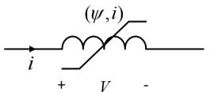  
Fig. 1. Current and voltage conventions for an inductor.

converter or product of the inductance and voltage where the real part of analytical signals obtained from Hilbert transform cannot represent the instantaneous waveform of original product quantities.

This paper proposes a multi-timescale transient model for nonlinear electrical elements, which extends traditional shifting-frequency analysis (SFA) to adapt for wide frequency ranges by interfacing a hybrid simulator based on shifted equivalent phasor and electromagnetic transient (EMT) simulator. Equivalent phasor can identify different harmonic components in a model with much wider frequency band than traditional phasor-based method by constructing a dynamic phasor domain evolution of various harmonics of a quasi-periodic signal [11–15]. The new simulator proposed in this paper takes advantage of the dynamic phasor (DP) simulator to characterize various harmonic components of nonlinear elements, combining with the high simulation speed of envelope tracking SFA based method to identify different harmonic waveform amplitudes, and instantaneous waveform simulator EMT is adopted by multiplying shifted phasor operator if fast transients is of concern.

# 2. Newton-Raphson discrete equivalent model

Traditionally, two concepts essential to EMT simulation of nonlinear electrical elements based on Newton-Raphson are adopted in compensation method of Alternative Transients Program (ATP) [12]: (i) the discretization of the differential equations, (ii) companion model.

The flux-controlled nonlinear branch equations depicted in Fig. 1 are as follow:

$$
\frac {d \psi (t)}{d t} = V (t) \tag {1}
$$

$$
i = g (\psi) \tag {2}
$$

where ψ is the main flux.

Trapezoidal integration [10] yields:

$$
\psi_ {n + 1} - \psi_ {n} = \frac {\tau}{2} \left(V _ {n + 1} + V _ {n}\right) \tag {3}
$$

where n is the time step counter, and τ is the time step size.

From $\operatorname { E q . } \left( 2 \right) , \operatorname { E q . }$ . (4) can be derived as follows

$$
i _ {n + 1} = g \left(\psi_ {n + 1}\right) \tag {4}
$$

Eq. (4) can be expanded:

$$
\begin{array}{l} i _ {n + 1} ^ {(j + 1)} = g \left(\psi_ {n + 1} ^ {(j + 1)}\right) = g \left(\psi_ {n + 1} ^ {(j)} + \Delta \psi\right) \\ = g \left(\psi_ {n + 1} ^ {(j)}\right) + \frac {d g \left(\psi_ {n + 1}\right)}{d \psi_ {n + 1}} \left| \psi_ {n + 1} ^ {(j)} \times \left(\psi_ {n + 1} ^ {(j + 1)} - \psi_ {n + 1} ^ {(j)}\right) \right. \tag {5} \\ = G ^ {(j)} V _ {n + 1} ^ {(j + 1)} + i _ {n + 1} ^ {(j)} - \Gamma^ {(j)} \left(\psi_ {n + 1} ^ {(j)} - \psi_ {n}\right) + G ^ {(j)} V _ {n} \\ \end{array}
$$

The discretised form $\operatorname { E q . } \ ( 5 )$ can be rearranged as follows:

$$
i _ {n + 1} ^ {(j + 1)} = G _ {L} ^ {(j)} V _ {n + 1} ^ {(j + 1)} + I _ {L h} ^ {(j)} \tag {6}
$$

where

$$
I _ {L h} ^ {(j)} = g \left(\psi_ {n + 1} ^ {(j)}\right) - \Gamma^ {(j)} \left(\psi_ {n + 1} ^ {(j)} - \psi_ {n}\right) + G _ {L} ^ {(j)} V _ {n} \tag {7}
$$

$$
\Gamma^ {(j)} = \left. \left(d i _ {n + 1} / d \psi_ {n + 1}\right) \right| _ {\psi_ {n + 1} ^ {(j)}} \tag {8}
$$

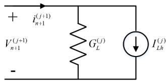  
Fig. 2. Companion model of flux-controlled nonlinear inductor.

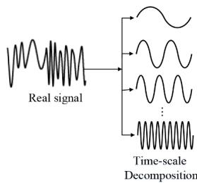  
Fig. 3. Time scale division of signal.

$$
G _ {L} ^ {(j)} = \frac {\tau}{2} \Gamma^ {(j)} \tag {9}
$$

$I _ { L h } ^ { \mathrm { ~ ~ } ( j ) }$ is the historical current source, $\Gamma ^ { \mathrm { ~ \scriptsize ~ ( j ) ~ } }$ the reciprocal of the inductance increment and $G _ { L } ^ { \left( j \right) }$ the equivalent conductance increment corresponding to the $( n + 1 ) ^ { \mathrm { t h } }$ time step and $( j + 1 ) ^ { \mathrm { t h } }$ Newton-Raphson iteration step. The companion model of (6) is shown in Fig. 2.

In the same way as for the nonlinear resistor, models can be found for other branches of networks and circuits [11]. It is noted that the modeling of nonlinear electrical element using Newton method is a conventional method in ATP, and it is proved in reference [13] that the function’s roots can be found by only one iteration no matter initial point.

# 3. Modeling and simulation using a shifted equivalent phasor (SEP)

# 3.1. Dynamic phasor modeling

Consider that a real-valued periodic function represented by a summation of a series of infinite number of sinewaves with various amplitudes and phasor shifts indicating different frequencies shown in Fig. 3. Fourier series representation of the time-domain waveform x(τ) is shown as follows [15–17]:

$$
x (\tau) = \sum_ {k = - \infty} ^ {\infty} \left\langle x \right\rangle_ {k} (t) \times e ^ {j k \omega_ {s} \tau} \tag {10}
$$

where ${ \omega } _ { s } { = } 2 \pi / T$ and $\langle x \rangle _ { k } ( t )$ is the kth time varying Fourier coefficient as (11) shown, and $\tau \in ( t { - } T ,$ t].

$$
\langle x \rangle_ {k} (t) = \frac {1}{T} \int_ {t - T} ^ {t} x (\tau) \times e ^ {- j k \omega_ {s} \tau} d \tau \tag {11}
$$

Complex coefficients $\langle x \rangle _ { k } ( t )$ denoted as DP that characterize time evolution of kth harmonic component of x(t) in the sliding time window (t-T, t] are shown in (10). The above method is widely utilized to identify quasi-periodic operating conditions in the modeling of electronic converters which referred is to as shifting frequency method (SFM) method [18–20]. It is readily observed that once the DP components of different harmonic waveforms are obtained by Eq. (11), one can opt to use not only a number of low-frequency harmonics but also mid- or high-frequency harmonic components to represent the original signal. Note that this is different from traditional FAST-based simulation method which is only suitable for studying low-frequency harmonic problem [22].

For the nonlinear inductor, the multiplicative nonlinear inductance

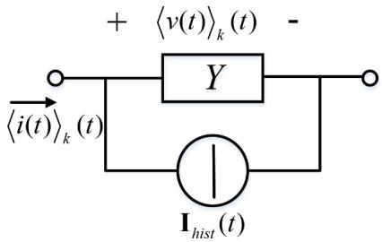  
Fig. 4. Companion model of linear inductor in DP domain.

$L _ { \mathrm { m } }$ function is used to mathematically describe a saturation effect of nonlinear model of generator or transformer etc., so the following two properties are often proven to be useful. Eq. (12) describes the DP of the derivative of a signal, and (13) shows the DP representation of the product of two signals.

$$
\frac {d}{d t} \langle x (t) \rangle_ {k} (t) = \left\langle \frac {d x (t)}{d t} \right\rangle_ {k} - j k \omega \langle x \rangle_ {k} (t), \omega = 2 \pi / T \tag {12}
$$

$$
\langle x (t) \cdot y (t) \rangle_ {k} = \sum_ {i = - \infty} ^ {\infty} \langle x (t) \rangle_ {k - i} \langle y (t) \rangle_ {i} \tag {13}
$$

Electric circuits using trapezoidal integration based on DP are deduced according to Eqs. (12) and (13) as follows [15].

For linear inductor, its derivative time domain equation is as follows:

$$
\frac {d i (t)}{d t} = \frac {1}{L} v (t) \tag {14}
$$

and solved for the derivative:

$$
\langle i (t) \rangle_ {k} (t) = Y \langle v (t) \rangle_ {k} (t) + \mathbf {I} _ {\mathrm {h L}} (t)
$$

$$
\mathbf {I} _ {\mathrm {h L}} (t) = Y \langle v (t) \rangle_ {k} (t - \Delta t) + \left[ \frac {1 - j \omega k \Delta t / 2}{1 + j \omega k \Delta t / 2} \right] \langle i \rangle_ {k} (t - \Delta t) \tag {15}
$$

$$
Y = \frac {\Delta t / 2 L}{1 + j \omega k \Delta t / 2}
$$

Companion model in DP domain of Eq. (15) is shown in Fig. $^ { 4 , }$ and the capacitance model is illustrated in [16].

The drawback of traditional DP method is the simulation time step should be set small enough to capture the high or mid frequency transient, since larger time step like 100μs:10μs in DP-EMT co-simulation method can have large errors in transient simulation [15]. However, large time step simulation in AC-DC electric network is demanded to speed up the EMT simulation. Envelop tracking method shown in [23–28] can solve the simulation time step problem, but it cannot solve the nonlinear elements modeling problem since the Hilbert transform method is linear transform type. In this regard,shifted equivalent phasor method (SEP) is proposed as follows.

# 3.2. Multi-timescale modeling using SEP method

SEP is proposed to track harmonic envelope waveforms using a larger time step by setting shifting equivalent phasor in accordance with the Fourier spectrum of waveform [21]. Eq. (10) can be rearranged as follows:

$$
\begin{array}{l} x (t - T + s) = \sum_ {k = - \infty} ^ {\infty} \left\langle x (t) \right\rangle_ {k} (t) e ^ {j \omega_ {s} k (t - T + s)} \tag {16} \\ = \left\langle x (t) \right\rangle_ {0} (t) + \operatorname {R e} \left(\sum_ {k = 1} ^ {\infty} 2 \left\langle x (t) \right\rangle_ {k} (t) e ^ {j \omega_ {s} k (t - T + s)}\right) \\ \end{array}
$$

wheres $\in \left( 0 , \ T \right]$ . The derivative dynamic phasor form $\langle x ( t ) \rangle _ { 0 } ( t ) +$ $\scriptstyle \sum _ { k = 1 } ^ { \infty } 2 \langle x ( t ) \rangle _ { k } ( t )$ is denoted here as SEP-derived phasor form:

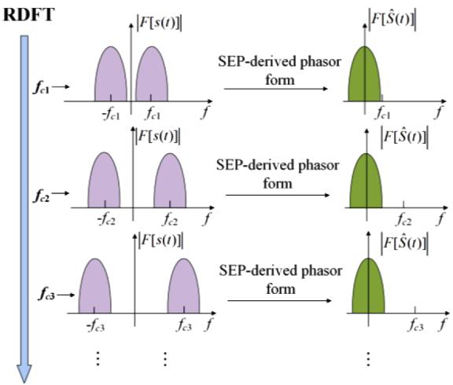  
Fig. 5. Multi-frequency band equivalent phasor shifting by the application of SEP-derived phasor form.

$$
\left\{ \begin{array}{l} S (t - T + s) = \langle x (t) \rangle_ {0} (t) + \sum_ {k = 1} ^ {\infty} \left(2 \langle x (t) \rangle_ {k} (t) e ^ {i k \omega_ {s} (t - T + s)}\right) \\ \widehat {S} (t) = s _ {I} (t) + j s _ {Q} (t) = \langle x (t) \rangle_ {0} (t) + \sum_ {k = 1} ^ {\infty} 2 \langle x (t) \rangle_ {k} (t) \end{array} \right. \tag {17}
$$

wher ${ \widehat { \mathbf { \xi } } } { \widehat { S } } ( t )$ is the slow changing complex envelope of the time-domain signal S(t). Here $e ^ { j k \omega } { } _ { s } ^ { ( t - T + s ) }$ is denoted as shifted equivalent phasor where $\omega _ { s }$ is fundamental frequency. When the envelope of the waveform is of concern, shifted equivalent phasor is set to be 1 and the amplitude of the $\widehat { \boldsymbol { s } } ( t )$ is the objective envelope signal and large time step is utilized to speed up the computation. If large disturbance occurs in the network, instantaneous waveform can be tracked by multiplying shifted equivalent phasor $e ^ { j k \omega } { } _ { s } ^ { ( t - T + s ) }$ as shown by Eq. (17) to obtain real signals to process EMT simulation.

It is noted that recursive discrete Fourier transform (RDFT) operation with sliding window of time of original signal s(t) is considered to view different harmonics’ envelopes. Fo $\cdot f _ { s } { = } f _ { \mathrm { c i } } \left( i { = } 1 , 2 , 3 , . . . , N \right)$ , where N is the number of frequencies obtained from RDFT, the complex envelope is obtained from $\widehat { \boldsymbol { s } } ( t )$ and the Fourier spectrum of it is concentrated around zero $( \mathrm { i } . \mathrm { e } . f = 0 )$ as shown in Fig. 5.

# 4. Nonlinear elements modeling using SEP

The nonlinear SEP companion models considering shifted phasor are discussed in this section. In the following, these models are developed for a single-phase flux-controlled nonlinear inductor and a transformer model with saturation effect based on the core nonlinearity. Also, a SEPbased VSC model is established in the section.

# 4.1. Flux-controlled nonlinear inductor

The time domain equation of a linear inductor and its dynamic phasor form are as shown in Eqs. (14) and (15), respectively. For a transformer model with saturation effect based on the nonlinear inductor model, the SEP envelope tracking companion models of the inductor is worthy to be developed when large simulation time step is needed in a large AC-DC power network simulation.

For multiscale simulation, the nonlinear model is able to track instantaneous and envelope signals within one simulation study. All time-variant quantities can be represented through SEP signals as Eq. (17) shown. In this regard, the SEP form of nonlinear inductor differential equation listed in Eq. (14) can be expressed as follows:

$$
\begin{array}{l} \frac {d}{d t} \langle i (t) \rangle_ {k} (t) = \left\langle \frac {1}{L _ {m} (t)} v (t) \right\rangle_ {k} (t) - j \omega k \langle i \rangle_ {k} (t) \\ = \left[ \left[ \sum_ {i = - \infty} ^ {+ \infty} \left\langle \frac {1}{L _ {m} (t)} \right\rangle_ {k - i} (t) \times \langle v (t) \rangle_ {i} (t) \right] - j \omega k \langle i \rangle_ {k} (t) \right. \tag {18} \\ \end{array}
$$

where $L _ { \mathrm { m } } \left( t \right)$ is a time varying magnetic inductance rather than a constant L. Application of the trapezoidal method to transform (18) into a difference equation leads to

$$
\begin{array}{l} \frac {\left\langle i (t) \right\rangle_ {k} (t) - \left\langle i (t) \right\rangle_ {k} (t - \Delta t)}{\Delta t} = 0. 5 \times \left\{\left[ \sum_ {i = - \infty} ^ {+ \infty} \left(\left\langle \frac {1}{L _ {m} (t)} \right\rangle_ {k - i} (t) \right. \right. \right. \\ \left. \times \langle v (t) \rangle_ {i} (t) \right] - j \omega k \langle i \rangle_ {k} (t) + \left[ \sum_ {i = - \infty} ^ {+ \infty} \left\langle \frac {1}{L _ {m} (t)} \right\rangle_ {k - i} (t - \Delta t) \right. \tag {19} \\ \times \langle v \rangle_ {i} (t - \Delta t) ] - j \omega k \langle i \rangle_ {k} (t - \Delta t) \rbrace \\ \end{array}
$$

Rearranging (19), Eq. (20) is obtained as follows:

$$
\begin{array}{l} \langle i (t) \rangle_ {k} (t) = \frac {1 - j \omega k \Delta t / 2}{1 + j \omega k \Delta t / 2} \times \langle i \rangle_ {k} (t - \Delta t) \\ + \frac {\Delta t}{(2 + j \omega k \Delta t)} \left[ \sum_ {i = - \infty} ^ {+ \infty} \left\langle \frac {1}{L _ {m}} \right\rangle_ {k - i} (t - \Delta t) \times \langle v (t) \rangle_ {i} (t - \Delta t) \right] \tag {20} \\ + \frac {\Delta t}{(2 + j \omega k \Delta t)} \left[ \sum_ {i = - \infty} ^ {+ \infty} \left\langle \frac {1}{L _ {m}} \right\rangle_ {k - i} (t) \times \langle v (t) \rangle_ {i} (t) \right] \\ \end{array}
$$

Then, the kth DP companion model of nonlinear inductor is as follows.

$$
\begin{array}{l} \left\langle i (t) \right\rangle_ {k} (t) = \mathbf {I} _ {s h} + Y _ {i} (t) \times \left\langle v (t) \right\rangle_ {i} (t) \\ \mathbf {I} _ {s h} = \frac {1 - j \omega k \Delta t / 2}{1 + j \omega k \Delta t / 2} \times \langle i \rangle_ {k} (t - \Delta t) + Y _ {i} (t - \Delta t) \times \langle v (t) \rangle_ {i} (t - \Delta t) \\ Y _ {i} (t) = \frac {\Delta t}{(2 + j \omega k \Delta t)} \times \left\langle \frac {1}{L _ {m}} \right\rangle_ {k - i} (t) \tag {21} \\ Y _ {i} (t - \Delta t) = \frac {\Delta t}{(2 + j \omega k \Delta t)} \times \left\langle \frac {1}{L _ {m}} \right\rangle_ {k - i} (t - \Delta t) \\ \end{array}
$$

As a result, the SEP envelope tracking companion model of nonlinear inductor characterizing the envelope of kth I(t) is as follows:

$$
\widehat {\mathbf {I}} _ {\text {n o n l i n e a r L k}} (\mathrm {t}) = \sum_ {i} \left(\mathbf {I} _ {\mathrm {h L n} - \mathrm {i}} + Y _ {\mathrm {i}} (\mathrm {t}) \times \mathrm {v} (\mathrm {t}) _ {\mathrm {i}} (\mathrm {t})\right) \tag {22}
$$

where:

$$
\mathbf {I} _ {\mathrm {h L n} - i} = \frac {2 - j \omega k \Delta t}{1 + j \omega k \Delta t / 2} \times \langle i \rangle_ {k} (t - \Delta t) + Y _ {i} (t - \Delta t) \times \langle v (t) \rangle_ {i} (t - \Delta t)
$$

$$
Y _ {i} (t) = \frac {2 \Delta t}{(2 + j \omega k \Delta t)} \times \left\langle \frac {1}{L _ {m}} \right\rangle_ {k - i} (t)
$$

$$
Y _ {i} (t - \Delta t) = \frac {2 \Delta t}{(2 + j \omega k \Delta t)} \times \left\langle \frac {1}{L _ {m}} \right\rangle_ {k - i} (t - \Delta t)
$$

where $\widehat { \mathbf { I } } _ { \mathrm { n o n l i n e a r L k } } ( \mathbf { t } )$ denotes envelope waveform of kth harmonic current. It is noted that Y matrix discussed later use the values in Eq. (22) rather than (21) since envelope of original waveform is considered.

The order of dynamic phasors of voltages, denoted as i in (22), are dependent upon the required frequency band. When inrush current is tested, voltages at both sides of transformer only contain fundamental frequency component, so only fundamental dynamic phasor is considered in SEP (i = 1). Besides, when faults occur at power grids, the fre quency range of terminal voltages are broadband. In this case, according to simulations of the practical large-scale ac/dc grids in China, the required frequency band is within the seventh harmonics [21]. Thus, the desired dynamic phasor order of terminal voltages is 7.

Companion model in SEP domain of Eq. (22) is shown in Fig. 6(a),

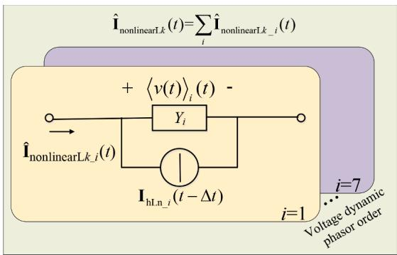

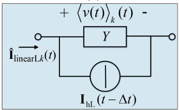  
(a)   
(b)

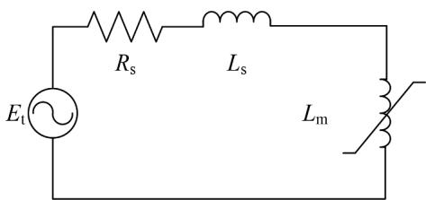  
Fig. 6. Companion model of inductor in SEP domain. (a) Nonlinear inductor, (b) linear inductor.

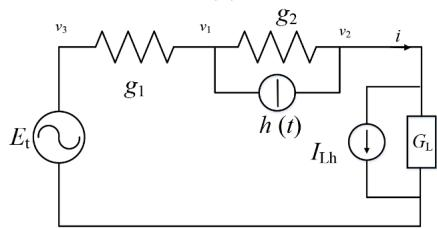

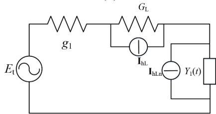  
  
Fig. 7. Transformer model terminating an open circuit line. (a) Continuoustime, (b) discrete-time companion model, (c) envelope tracking SEP companion model.

and the capacitance model can be viewed in [27] and can be derived in a similar way.

Also, companion model of linear inductor using SEP method can be readily derived as follows and is shown in Fig. 6(b).

$$
\widehat {\mathbf {I}} _ {\text {l i n e a r L}, \mathrm {k}} (\mathrm {t}) = \mathbf {I} _ {\mathrm {h L}} + \mathbf {Y} _ {\mathrm {L}} (\mathrm {t}) \times <   \mathbf {v} (\mathrm {t}) > _ {\mathrm {k}} (\mathrm {t}) \tag {23}
$$

where:

Z. Gong et al.

$$
Y _ {\mathrm {L}} = \frac {\Delta t / L}{(1 + j \omega k \Delta t / 2)}
$$

$$
\mathbf {I} _ {\mathrm {h L}} = \frac {2 - j \omega k \Delta t}{1 + j \omega k \Delta t / 2} \times \langle i \rangle_ {k} (t - \Delta t) + Y _ {\mathrm {L}} \times \langle v (t) \rangle_ {k} (t - \Delta t)
$$

# 4.2. Transformer open circuit model with saturation effect using SEP

The methods presented in this paper are applied to a simple case exhibiting harmonics due to transformer saturation. Such harmonics are generally difficult to predict as they are highly dependent on the magnitude of the applied voltage.

Consider the simplified representation of a nonlinear transformer terminating an open circuit line of Fig. 7(a). A flux-controlled nonlinear inductor is adopted in the core model to represent saturation effect. It is noted that a core model in transformer is usually established by operating open circuit test. Rated excitation is utilized to obtain data conventionally, additional points need to be characterized and predicted using piecewise linear technics. Linear extrapolation is widely adopted years ago, however, the curve fitting approach is preferred now [29]. Eq. (24) is adopted as the simple fitting function in this paper:

$$
i = b \cdot \lambda^ {c} \tag {24}
$$

where $b { > } 0 ,$ , and c is a positive integer.

The nonlinear magnetizing characteristic is defined piecewise linear. Fig. 7(b) represents the corresponding discrete-time network with the nonlinear inductance represented by its Newton-Raphson discrete equivalent model illustrated in part 2. Finally, the proposed dynamic phasor-based SEP companion model tracking waveform envelope with large simulation time step is shown in Fig. 7(c).

Formulation of network equations in EMT [32]: With the nodes and history sources defined in Fig. 7(b), the EMT discrete-time network equation is as (25) shown.

$$
\left[ \begin{array}{c c c} g _ {1} + g _ {2} & - g _ {2} & 0 \\ - g _ {2} & g _ {2} & 1 \\ 0 & 1 & 0 \end{array} \right] \left\lfloor \begin{array}{l} v _ {1} (t) \\ v _ {2} (t) \\ i (t) \end{array} \right\rfloor = \left[ \begin{array}{c} - h (t) \\ h (t) \\ v (\psi (t)) \end{array} \right] - \left\lfloor \begin{array}{l} - g _ {1} \\ 0 \\ 0 \end{array} \right\rfloor v _ {3} (t) \tag {25}
$$

where $\nu ( \psi ( t ) )$ is represented as follows:

$$
v (\psi (t)) = \frac {d \psi}{d t} \tag {26}
$$

ψ(t) is obtained in every small-time step using trapezoidal integration based on Eqs. (24)–(26). Then current flowing through nonlinear inductor can be calculated through Eqs. (6)–(9).

For the purpose of observing different harmonic component magnitudes with large simulation time step, various harmonic envelope waveforms of current flowing through nonlinear inductor are obtained using SEP companion model illustrated in Eq. (22) and linear inductor denoted as linkage inductance is as Eq. (23) shown. Furthermore, it can be readily observed that magnetic inductance $L _ { \mathrm { m } }$ is no longer a constant as Eq. (27) shown from which can be deduced that flux ψ(t) should be calculated in every simulation time step since ψ(t) is unknown when calculating dynamic phasor of electromagnetic inductance in (27).

$$
\begin{array}{l} \left\langle \frac {1}{L _ {m}} \right\rangle_ {k} (t) = \left\langle \frac {d i}{d \psi} \right\rangle_ {k} (t) \tag {27} \\ = \left\langle b c \psi^ {c - 1} \right\rangle_ {k} (t) = b c \left\langle \psi^ {c - 1} \right\rangle_ {k} (t) \\ \end{array}
$$

Where b and c are positive number obtained from curve fitting method $[ 1 1 , 2 9 ]$ , and they are consistent with b and c in (24). In this paper, $\langle \psi \rangle _ { k } ( t )$ is calculated as (28) where v(t) is the terminal voltage of transformer.

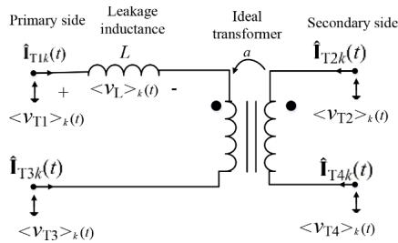  
Fig. 8. Single phase ideal transformer model.

$$
\left\langle \psi (t) \right\rangle_ {k} (t) = Y \left\langle v (t) \right\rangle_ {k} (t) + I _ {\text {h i s t}} (t)
$$

$$
I _ {\text {h i s t}} (t) = Y \langle v (t) \rangle_ {k} (t - \Delta t) + \left[ \frac {1 - j \omega k \Delta t / 2}{1 + j \omega k \Delta t / 2} \right] \langle \psi \rangle_ {k} (t - \Delta t) \tag {28}
$$

$$
Y = \frac {\Delta t / 2}{1 + j \omega k \Delta t / 2}
$$

Once the flux $\langle \psi \rangle _ { k } ( t )$ is calculated at every time step, $\langle \frac { 1 } { L _ { m } } \rangle _ { k } ( t$ )can be obtained, that IhLn in Fig. 7(c) can be derived. Finally, nodal based network equation method illustrated in Eq. (25) is suitable for solving SEP model for tracking current envelope in Fig. 7(c).

When electromagnetic transients are studied, a small simulation time step Δt is adopted, and the current and voltage instantaneous waveform is obtained through Eqs. (29) and (30) as follows:

$$
\mathrm {i} (\mathrm {t} - \mathrm {T} + \mathrm {s}) = \operatorname {R e} \left(\sum_ {\mathrm {k} = 1} ^ {\infty} \widehat {\mathbf {I}} _ {\mathrm {k}} (\mathrm {t}) \times \mathrm {e} ^ {\mathrm {j} 2 \pi \mathrm {f k} (\mathrm {t} - \mathrm {T} + \mathrm {s})}\right) \tag {29}
$$

$$
v (t - T + s) = R e \left(\sum_ {k = 1} ^ {\infty} 2 \times <   v > _ {k} (t) \times e ^ {j 2 \pi f (t - T + s)}\right) \tag {30}
$$

where $f = 5 0$ Hz. As a result, the SEP companion model can be transformed into EMT model and transient instantaneous waveforms can be tracked accurately.

# 4.3. Single phase transformer model with saturation effect using SEP

As a starting point, a transformer equivalent circuit consisting of an ideal transformer with turns ratio a of primary side to secondary side is depicted in Fig. 8. The general form of the SEP companion model expressed in matrix form is

$$
\widehat {\mathbf {I}} _ {\mathrm {T k}} (\mathrm {t}) = \mathbf {Y} _ {\mathrm {T}} \mathbf {V} _ {\mathrm {T}} (\mathrm {t}) + \mathbf {I} _ {\mathrm {h T}} (\mathrm {t}) \tag {31}
$$

wherêI $\mathbf { \Sigma } _ { \mathrm { ( t ) } } = \mathbf { \Sigma } ( \widehat { \mathbf { I } } _ { \mathrm { T 1 k } } ( \mathbf { t } ) , \widehat { \mathbf { I } } _ { \mathrm { T 2 k } } ( \mathbf { t } ) , \widehat { \mathbf { I } } _ { \mathrm { T 3 k } } ( \mathbf { t } ) , \widehat { \mathbf { I } } _ { \mathrm { T 4 k } } ( \mathbf { t } ) ) ^ { \mathrm { T } } \mathbf { i }$ s the kth SEP domain terminal currents and ${ \bf V } _ { \mathrm { T } } ( { \bf t } ) = ( < { \bf v } _ { \mathrm { T 1 } } > _ { \bf k } ( { \bf t } ) , < { \bf v } _ { \mathrm { T 2 } } > _ { \bf k } ( { \bf t } ) , < { \bf v } _ { \mathrm { T 3 } } > _ { \bf k } ( { \bf t } )$ , $< \mathbf { v } _ { \mathrm { T 4 } } > _ { \mathbf { k } } ( \mathbf { t } ) ) ^ { \mathrm { T } }$ is the $k ^ { \mathrm { { t h } } }$ terminal voltage vector. Representing the leakage inductance through (23) for and considering that̂I (t) = − ̂I (t), $\widehat { \bf I } _ { \mathrm { T 2 k } } ( \mathrm { t ) \ = \ - \ } a \widehat { \bf I } _ { \mathrm { T 1 k } } ( \mathrm { t ) \ , \ \widehat { \bf I } _ { \mathrm { T 2 k } } ( \mathrm { t ) \ = \ - \ } } \widehat { \bf I } _ { \mathrm { T 4 k } } ( \mathrm { t ) \ , \ < v _ { \mathrm { T 1 } } > _ { \mathrm { k } } ( \mathrm { t ) \ - \ < v _ { \mathrm { T 3 } } > _ { \mathrm { k } } ( \mathrm { t ) \ - \ - \ } } }$ $< \mathrm { v _ { L } > _ { k } ( t ) } = \mathrm { a } ( < \mathrm { v _ { T 2 } > _ { k } ( t ) } - < \mathrm { v _ { T 4 } > _ { k } ( t ) } )$ , matrix Y and vector $\mathbf { I } _ { \mathrm { h T } } ( t )$ are obtained as follows:

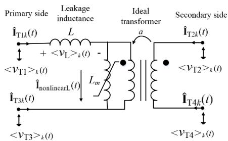  
Fig. 9. Single phase transformer model with saturation effect.

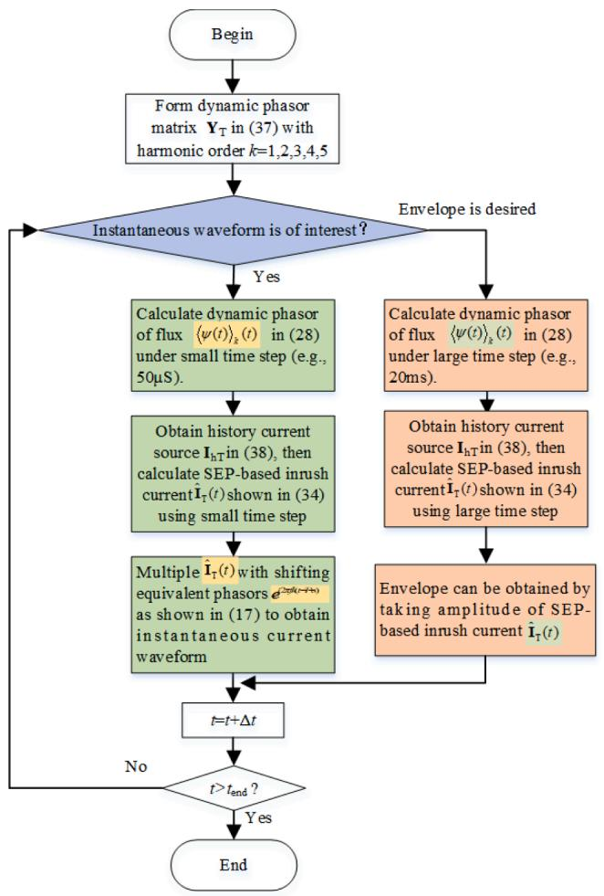  
Fig. 10. Flowchart of the transformer modeling based on the proposed SEP method.

$$
\mathbf {Y} _ {\mathrm {T}} = \left[ \begin{array}{c c c c} Y _ {L} & - a Y _ {L} & - Y _ {L} & a Y _ {L} \\ - a Y _ {L} & a ^ {2} Y _ {L} & a Y _ {L} & - a ^ {2} Y _ {L} \\ - Y _ {L} & a Y _ {L} & Y _ {L} & - a Y _ {L} \\ a Y _ {L} & - a ^ {2} Y _ {L} & - a Y _ {L} & a ^ {2} Y _ {L} \end{array} \right] \tag {32}
$$

$$
\mathbf {I} _ {\mathrm {h T}} (t) = \left(\mathbf {I} _ {\mathrm {h L}} (t), - a \mathbf {I} _ {\mathrm {h L}} (t), - \mathbf {I} _ {\mathrm {h L}} (t), a \mathbf {I} _ {\mathrm {h L}} (t)\right) ^ {\mathrm {T}} \tag {33}
$$

Magnetization effects, for example, can be simulated by connecting an inductance in parallel with the ideal transformer shown in Fig. 9. The general form of the SEP companion model expressed in matrix form is

$$
\widehat {\mathbf {I}} _ {\mathrm {T}} (\mathrm {t}) = \mathbf {Y} _ {\mathrm {T}} \mathbf {V} _ {\mathrm {T}} (\mathrm {t}) + \mathbf {I} _ {\mathrm {h T}} (\mathrm {t}) \tag {34}
$$

Representing the leakage inductance through (23) and nonlinear inductor through (22) for and considering that $\widehat { \bf I } _ { \mathrm { T 1 k } } ( { \bf t } ) = - \widehat { \bf I } _ { \mathrm { T 3 k } } ( { \bf t } ) .$ , $\widehat { \bf I } _ { \mathrm { T 2 k } } ( \mathrm { t } ) = \mathrm { ~ - ~ } \mathrm { a ( \widehat { \bf I } _ { \mathrm { T 1 k } } ( \mathrm { t } ) - \widehat { \bf \cal I } _ { \mathrm { n o n l i n e a r L k } } ( \mathrm { t } ) , ~ \widehat { \bf I } _ { \mathrm { T 2 k } } ( \mathrm { t } ) ~ = ~ - ~ \widehat { \bf I } _ { \mathrm { T 4 k } } ( \mathrm { t } ) , ~ \widehat { \bf I } _ { \mathrm { T 1 k } } ( \mathrm { t } ) }$ and $\widehat { \mathbf { I } } _ { \mathrm { T 2 k } } ( \mathfrak { t } )$ are obtained as follows:

$$
\begin{array}{l} \widehat {\mathbf {I}} _ {\mathrm {T l k}} (\mathrm {t}) = \mathrm {Y} _ {\mathrm {L}} \times \left(<   \mathrm {v} _ {\mathrm {T} 1} > _ {\mathrm {k}} (\mathrm {t}) - <   \mathrm {v} _ {\mathrm {T} 3} > _ {\mathrm {k}} (\mathrm {t})\right) - \mathrm {a Y} _ {\mathrm {L}} \left(<   \mathrm {v} _ {\mathrm {T} 2} > _ {\mathrm {k}} (\mathrm {t}) \right. \tag {35} \\ - <   \mathrm {v} _ {\mathrm {T} 4} > _ {\mathrm {k}} (t)) + \mathbf {I} _ {\mathrm {h L}} \\ \end{array}
$$

$$
\begin{array}{r l}\widehat {\mathbf {I}} _ {\mathrm {T 2 k}} (\mathrm {t})&= - \mathrm {a} \left\{ \right.\mathrm {Y} _ {\mathrm {L}} \times \left(<   \mathrm {v} _ {\mathrm {T 1}} > _ {\mathrm {k}} (\mathrm {t}) - <   \mathrm {v} _ {\mathrm {T 3}} > _ {\mathrm {k}} (\mathrm {t})\right) - \mathrm {a Y} _ {\mathrm {L}} \times \left(<   \mathrm {v} _ {\mathrm {T 2}} > _ {\mathrm {k}} (\mathrm {t}) \right.\\&\quad \left. - <   \mathrm {v} _ {\mathrm {T 4}} > _ {\mathrm {k}} (\mathrm {t})\right) - \mathrm {a Y} (\mathrm {t}) \times \left(<   \mathrm {v} _ {\mathrm {T 2}} > _ {\mathrm {l}} (\mathrm {t}) - <   \mathrm {v} _ {\mathrm {T 4}} > _ {\mathrm {l}} (\mathrm {t})\right) + \mathbf {I} _ {\mathrm {h L}} - \mathbf {I} _ {\mathrm {h L n}} \}\end{array}\tag {36}
$$

Then the matrix $\mathbf { Y } _ { \mathrm { T } }$ and vector I (t) are obtained as Eqs. (37) and (38). It is observed that by connecting a nonlinear inductor in the primary side, the current in the primary side is not influenced while the secondary side of it is changed including inrush current components.

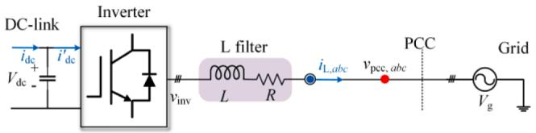  
Fig. 11. Diagram of VSC connected to a power grid.

$$
\mathbf {Y} _ {\mathrm {T}} = \left[ \begin{array}{c c c c} Y _ {\mathrm {L}} & - a Y _ {\mathrm {L}} & - Y _ {\mathrm {L}} & a Y _ {\mathrm {L}} \\ - a Y _ {\mathrm {L}} & a ^ {2} \left(Y _ {\mathrm {L}} - Y (t)\right) & a Y _ {\mathrm {L}} & - a ^ {2} \left(Y _ {\mathrm {L}} - Y (t)\right) \\ - Y _ {\mathrm {L}} & a Y _ {\mathrm {L}} & Y _ {\mathrm {L}} & - a Y _ {\mathrm {L}} \\ a Y _ {\mathrm {L}} & - a ^ {2} \left(Y _ {\mathrm {L}} - Y (t)\right) & - a Y _ {\mathrm {L}} & a ^ {2} \left(Y _ {\mathrm {L}} - Y (t)\right) \end{array} \right] \tag {37}
$$

Finally, a flowchart explaining the proposed method and the SEPbased transformer modeling is shown in Fig. 10.

It is noted that the frequency of voltage between the nonlinear inductor is assumed to be fundamental in the above analysis. Since only inrush current simulation is of concerned, the assumption is feasible. When fault test is of interest, the SEP model of transformer can be derived as follows:

$$
\mathbf {I} _ {\mathrm {h T}} (t) = \left(\mathbf {I} _ {\mathrm {h L}} (t), - a \left(\mathbf {I} _ {\mathrm {h L}} (t) - \mathbf {I} _ {\mathrm {h L n}} (t)\right), - \mathbf {I} _ {\mathrm {h L}} (t), a \left(\mathbf {I} _ {\mathrm {h L}} (t) - \mathbf {I} _ {\mathrm {h L n}} (t)\right)\right) ^ {\mathrm {T}} \tag {38}
$$

$$
\widehat {\mathbf {I}} _ {\mathrm {T}} (\mathrm {t}) = \mathbf {Y} _ {\mathrm {T}} \mathbf {V} _ {\mathrm {T}} (\mathrm {t}) + \mathbf {I} _ {\mathrm {h T}} (\mathrm {t}) + (0, a \widehat {\mathbf {I}} _ {\text {n o n l i e a r L k}} (\mathrm {t}), 0, - a \widehat {\mathbf {I}} _ {\text {n o n l i e a r L k}} (\mathrm {t})) ^ {\mathrm {T}} \tag {39}
$$

where $\mathbf { Y } _ { \mathrm { T } }$ and I are the same with ideal transormer model shown in (31).

# 4.4. SEP modeling of the VSC-based converter

# 4.4.1. SEP modeling of the main circuit of the VSC

The typical structure of the VSC is presented in Fig. 11. The ac side of the VSC can be modelled as a three-phase controlled voltage source, and dc side of the VSC is equivalent to a controlled current source.

The controlled voltage sources are shown as (40), where $S _ { a } , S _ { b } , S _ { c }$ are switch function of each phase. Then, the SEP-based controlled voltage source can be derived by substituting (40)–(17). For example, the phase-A SEP-based voltage source is shown in (41). The magnitude of ${ \widehat { \mathbf { V } } } _ { a }$ denotes the envelope of phase-A voltage and v(t) denotes the instantaneous phase-A voltage value.

$$
\left\{ \begin{array}{l} \left\langle v _ {\text {i n v}, a} \right\rangle_ {k} = \frac {1}{2} \left\langle v _ {d c} S _ {a} \right\rangle_ {k} - \left\langle v _ {0} \right\rangle_ {k} = \frac {1}{2} \sum_ {l = - \infty} ^ {\infty} \left(\left\langle v _ {d c} \right\rangle_ {l} \cdot \left\langle S _ {a} \right\rangle_ {k - l}\right) - \left\langle v _ {0} \right\rangle_ {k} \\ \left\langle v _ {\text {i n v}, b} \right\rangle_ {k} = \frac {1}{2} \left\langle v _ {d c} S _ {b} \right\rangle_ {k} - \left\langle v _ {0} \right\rangle_ {k} = \frac {1}{2} \sum_ {l = - \infty} ^ {\infty} \left(\left\langle v _ {d c} \right\rangle_ {l} \cdot \left\langle S _ {b} \right\rangle_ {k - l}\right) - \left\langle v _ {0} \right\rangle_ {k} \\ \left\langle v _ {\text {i n v}, c} \right\rangle_ {k} = \frac {1}{2} \left\langle v _ {d c} S _ {c} \right\rangle_ {k} - \left\langle v _ {0} \right\rangle_ {k} = \frac {1}{2} \sum_ {l = - \infty} ^ {\infty} \left(\left\langle v _ {d c} \right\rangle_ {l} \cdot \left\langle S _ {c} \right\rangle_ {k - l}\right) - \left\langle v _ {0} \right\rangle_ {k} \end{array} \right. \tag {40}
$$

$$
\left\{ \begin{array}{l} v (t - T + s) = \langle v _ {a} \rangle_ {0} (t) + \sum_ {k = 1} ^ {\infty} \left(2 \langle v _ {a} \rangle_ {k} (t) e ^ {j k \omega_ {s} (t - T + s)}\right) \\ \widehat {\mathbf {V}} _ {a} (t) = \langle v _ {a} \rangle_ {0} (t) + \sum_ {k = 1} ^ {\infty} 2 \langle v _ {a} \rangle_ {k} (t) \end{array} \right. \tag {41}
$$

The current relationship between ac and dc side of VSC is shown as follows:

$$
\left\langle i _ {d c} \right\rangle_ {k} = \frac {1}{2} \sum_ {l = - \infty} ^ {\infty} \left(\left\langle i _ {a} \right\rangle_ {l} \cdot \left\langle S _ {a} \right\rangle_ {k - l} + \left\langle i _ {b} \right\rangle_ {l} \cdot \left\langle S _ {b} \right\rangle_ {k - l} + \left\langle i _ {c} \right\rangle_ {l} \cdot \left\langle S _ {c} \right\rangle_ {k - l}\right) \tag {42}
$$

Thus, the SEP-based controlled current source is shown in (43). The magnitude of $\widehat { \mathbf { I } } _ { \mathrm { d c } }$ denotes the dc current envelope, and $i _ { \mathrm { d c } }$ denotes the instantaneous dc current.

Table 1 Transformer open circuit model parameters.   

<table><tr><td>Continuous time model parameters</td><td>Values</td></tr><tr><td>E(t)</td><td>220√2sin(100πt) kV</td></tr><tr><td>Rs</td><td>0.00408 Ω</td></tr><tr><td>Ls</td><td>0.13 mH</td></tr><tr><td>B</td><td>8e-5</td></tr><tr><td>C</td><td>9</td></tr><tr><td>Discretised EMT companion model</td><td>Values</td></tr><tr><td>Δt</td><td>5e-6s</td></tr><tr><td>g1 = 1/Rs</td><td>245.0980</td></tr><tr><td>g2 = Δt/(2Ls)</td><td>0.0192</td></tr></table>

$$
\left\{ \begin{array}{l} i _ {d c} (t - T + s) = \langle i _ {d c} \rangle_ {0} (t) + \sum_ {k = 1} ^ {\infty} \left(2 \langle i _ {d c} \rangle_ {k} (t) e ^ {j k \omega_ {s} (t - T + s)}\right) \\ \widehat {\mathbf {I}} _ {d c} (t) = \langle i _ {d c} \rangle_ {0} (t) + \sum_ {k = 1} ^ {\infty} 2 \langle i _ {d c} \rangle_ {k} (t) \end{array} \right. \tag {43}
$$

The three-phase SEP-based RL filter model can be represented as (44) and (45) shown where $\widehat { \mathbf { I } } _ { \mathrm { a } }$ represents phase-A current envelope and $i _ { \mathrm { a } }$ denotes instantaneous current in phase A.

$$
\left\{ \begin{array}{l} \frac {d \langle i _ {a} \rangle_ {k} (t)}{d t} = \frac {1}{L} \left(\left\langle v _ {\text {i n v}, a} \right\rangle_ {k} (t) - \left\langle v _ {\text {p c c}, a} \right\rangle_ {k} (t) - R \langle i _ {a} \rangle_ {k} (t)\right) - j k \omega \langle i _ {a} \rangle_ {k} (t) \\ \frac {d \langle i _ {b} \rangle_ {k} (t)}{d t} = \frac {1}{L} \left(\left\langle v _ {\text {i n v}, b} \right\rangle_ {k} (t) - \left\langle v _ {\text {p c c}, b} \right\rangle_ {k} (t) - R \langle i _ {b} \rangle_ {k} (t)\right) - j k \omega \langle i _ {b} \rangle_ {k} (t) \\ \frac {d \langle i _ {c} \rangle_ {k} (t)}{d t} = \frac {1}{L} \left(\left\langle v _ {\text {i n v}, c} \right\rangle_ {k} (t) - \left\langle v _ {\text {p c c}, c} \right\rangle_ {k} (t) - R \langle i _ {c} \rangle_ {k} (t)\right) - j k \omega \langle i _ {c} \rangle_ {k} (t) \end{array} \right. \tag {44}
$$

$$
\left\{ \begin{array}{l} i _ {a} (t - T + s) = \langle i _ {a} \rangle_ {0} (t) + \sum_ {k = 1} ^ {\infty} \left(2 \langle i _ {a} \rangle_ {k} (t) e ^ {j k \omega_ {s} (t - T + s)}\right) \\ \widehat {\mathbf {I}} _ {a} (t) = \langle i _ {a} \rangle_ {0} (t) + \sum_ {k = 1} ^ {\infty} 2 \langle i _ {a} \rangle_ {k} (t) \end{array} \right. \tag {45}
$$

The SEP model of dc capacitor can be derived as (46) and (47). The magnitude of $\widehat { \mathbf { V } } _ { \mathrm { d c } }$ denotes the envelope of dc voltage and $\nu _ { \mathrm { d c } } ( t )$ denotes the instantaneous dc voltage value.

$$
\frac {d \left\langle v _ {d c} \right\rangle_ {k} (t)}{d t} = \frac {1}{C} \left(\left\langle i _ {d c} \right\rangle_ {k} - \left\langle i _ {d c} ^ {\prime} \right\rangle_ {k}\right) - j k \omega \left\langle v _ {d c} \right\rangle_ {k} (t) \tag {46}
$$

$$
\left\{ \begin{array}{l} v _ {d c} (t - T + s) = \langle v _ {d c} \rangle_ {0} (t) + \sum_ {k = 1} ^ {\infty} \left(2 \langle v _ {d c} \rangle_ {k} (t) e ^ {i k \omega_ {s} (t - T + s)}\right) \\ \widehat {\mathbf {V}} _ {d c} (t) = \langle v _ {d c} \rangle_ {0} (t) + \sum_ {k = 1} ^ {\infty} 2 \langle v _ {d c} \rangle_ {k} (t) \end{array} \right. \tag {47}
$$

Consequently, (40)–(47) constitute the overall SEP model of the twolevel VSC, where numerical calculation can be carried out by trapezoidal discretization in (23).

Theoretically, the nodal-analysis-based SEP model using the traditional dynamic phasor form has the following advantages.

(1) They can use a much larger time step than the traditional EMT models dealing with nonlinear elements so that simulation efficiency will be dramatically improved without the sacrifice of accuracy while traditional FAST based model [23–27] cannot solve it.   
(2) They produce instantaneous and wide frequency-band envelope waveforms within one simulation study while traditional Dynamic phasor method [6,7] only track instantaneous curves under small time step size.   
(3) There are no overshooting and oscillating phenomena even large simulation time step is adopted since flux can be calculated accurately in slowing changing transient stage with large simu lation time step and fast changing transient stage with small enough time step.

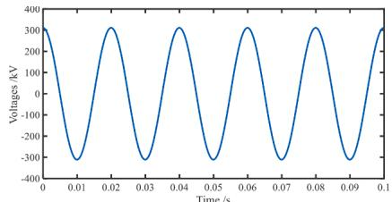  
(a)

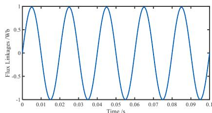  
(b)

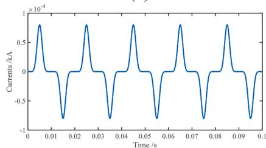  
（c）

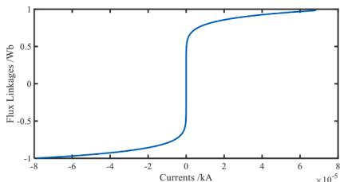  
  
Fig. 12. Single phase transformer open circuit model with saturation effect. (a) Voltage of nonlinear inductor, (b) flux linkage time varying waveform, (c) magnetic current, (d) saturation curve.

(4) Although the Y matrix in Eq. (22) is a time varying value, it is actually a constant complex number in steady state that can be realized as an independent module. As a result, the coding of SEP models for practical utilization is very simple and efficient.

# 5. Application example

# 5.1. Open circuit operation of single-phase transformer model

A transformer open circuit EMT model with saturation based on a flux-controlled nonlinear inductor core model is simulated using MAT-LAB which equations are illustrated in Section 4.2 and the nonlinear

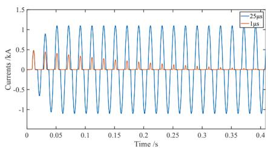  
Fig. 13. Different inrush current under different simulation time step.

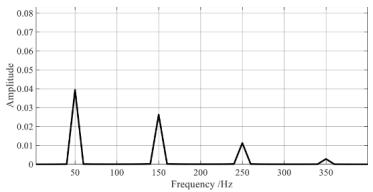  
Fig. 14. RDFT of magnetic current in one sliding time window.

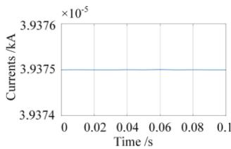  
(a)

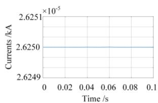  
(b)

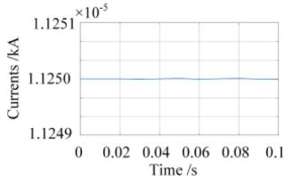  
（c）

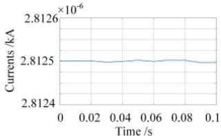

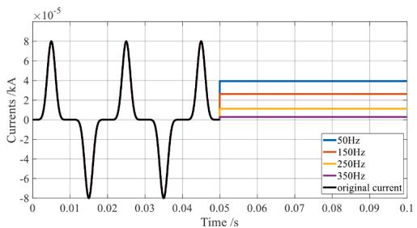  
Fig. 15. Envelope waveforms of different harmonic components. (a) 50 Hz, (b) 150 Hz, (c) 250 Hz, (d)350 Hz.   
Fig. 16. Envelope waveforms of different harmonic components and original current.

inductor core model is based on Section 2. Table 1 shows the parameters for EMT continuous time model and discretized companion model and the diagram according to it is shown in Fig. 9(c). The instantaneous current, flux, open circuit voltage of core model and flux-current plot are obtained in this model as shown in Fig. 12 with sampling time step 50μs.

It is noted that small simulation time step is required to avoid overshooting problem in EMT simulation. If large time step is adopted, the inrush value will overshoot and it is shown in the Fig. 13 as follows. As a result, larger simulation time step is not suitable for simulating instantaneous nonlinear model. In this regard, large timescale envelope tracking mode could cause significant errors if flux is not properly calculated. SEP model proposed in this paper can solve this problem accordingly, which transforms time varying flux into constant phasor form shown in Eq. (27) that facilitates the accurate simulation.

To simulate different harmonic envelope waveforms, the recursive discrete Fourier transform (RDFT) derived frequencies of original waveform is of concern firstly to decide which orders of SEP model are selected for envelope simulation. RDFT amplitude spectrum of magnetic current is utilized to identify different central frequencies as Fig. 14 shown, from which 1st-7th order harmonic is identified. As a result, by flux values obtained from EMT simulation firstly as Eq. (28) shown, 1st-

Table 2 Transformer model parameters.   

<table><tr><td>Primary side</td><td>Values</td></tr><tr><td>ET1(t)</td><td>110sin(100πt) kV</td></tr><tr><td>Rs</td><td>0.00408 Ω</td></tr><tr><td>Ls</td><td>0.13 mH</td></tr><tr><td>B</td><td>1.38</td></tr><tr><td>C</td><td>9</td></tr><tr><td>Secondary side</td><td>Values</td></tr><tr><td>ET2(t)</td><td>38.4sin(100πt) kV</td></tr><tr><td>Ratio</td><td>110/38.5</td></tr></table>

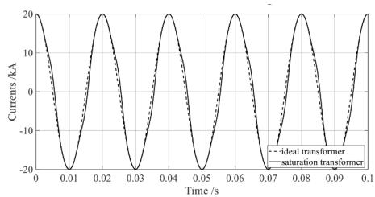

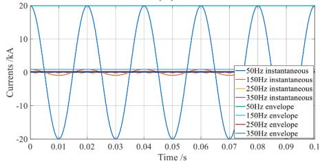  
(a)   
(b)

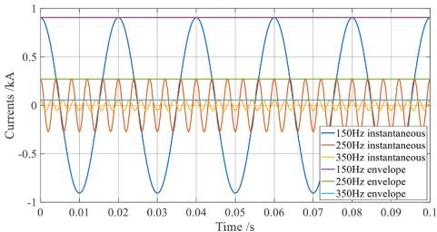  
  
Fig. 17. Envelope waveforms of different harmonic components and their corresponding instantaneous current. (a) Current waveform in secondary side (b) current waveform of various harmonic components and their envelope. (c) Zoom in picture of (b) which is the secondary side harmonic currents influenced from nonlinear inductor core.

7th order SEP envelope waveform can be tracked simultaneously in Fig. 15 using large simulation time step with 20 ms which is 400 times faster than that of 50μs based EMT simulation.

To summarize, two different simulation time steps are considered according to the objective of the study: when the instantaneous current is of interest, the time step is set to be 50μs and multiplying envelope signals with equivalent shifted phasors to obtain real signals shown in Eqs. (29) and (30).

Finally, the SEP model can be readily transformed into EMT model to simulate instantaneous waveform. The nonlinear instantaneous current i (t) of the open circuit systems is shown in Fig. 16 at 0–0.05 s, and different harmonic current envelopes (e.g., 1st-7th order harmonics) with larger sampling time steps (e.g., 20 ms) are illustrated in the following 0.05–0.1 s which is a type of simulation that the envelope is of great concern. For the case study here, the time step is increased by a factor of 400 comparing the instantaneous waveforms tracking case which reduces the computation effort strongly.

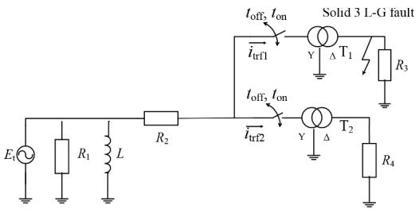  
Fig. 18. Test circuit for energization operation.

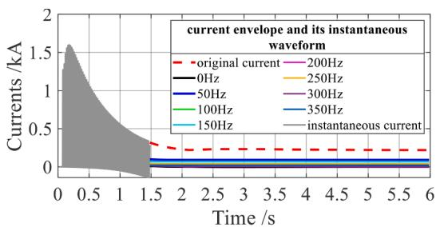

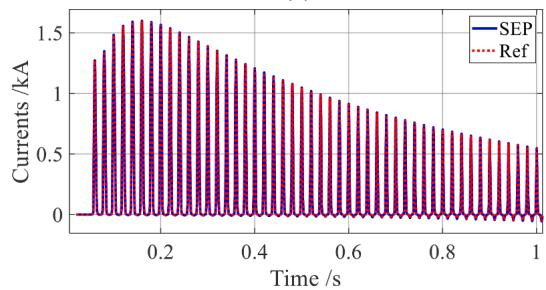  
  
  
Fig. 19. Envelope waveforms of different harmonics currents in primary side and its instantaneous waveform when energization occurs. (a) Instantaneous inrush current and its envelope waveforms of different harmonics. (b) Instantaneous current obtained from PSCAD and SEP.

# 5.2. Single-phase transformer model

The nonlinear inductor’s influences on secondary winding current is studied in this case which parameters are as Table 2 shown and the equivalent circuit is as Fig. 9 shown. Secondary currents are obtained using Eq. (41) shown in Fig. 17.

It can be observed from Fig. 17 that the influence from nonlinear inductor to secondary side currents is significant when the voltage from primary winding is set to be overloaded [33]. It is important to study the saturation effect of transformer in the power transmission line when different harmonic components are of concern (e.g., energization and de-energization of transformer). Also, largescale power system simulation requires large simulation time step in Fig. 17(b) that current envelope is tracked based on SEP model, at the same time, it is also suitable for simulating various harmonic components using large time step as Fig. 17(c) shown. When instantaneous current is of concern, multiply envelope signals with equivalent phasor shifting operator $e ^ { j \omega _ { s } \left( t - T + s \right) }$ )under small time step size.

# 5.3. Energization and inrush current

At the moment when a transformer is energized, high values of currents will occur which needs to be taken into account. An example circuit shown in Fig. 18 is proposed in which $R _ { 1 } , R _ { 2 } ,$ L are parallel RL in series with a resistance model in PSCAD connected to a voltage source $E _ { \mathrm { t } } .$ .

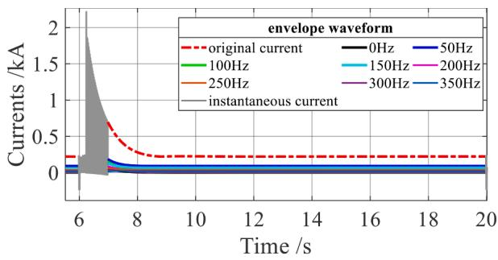

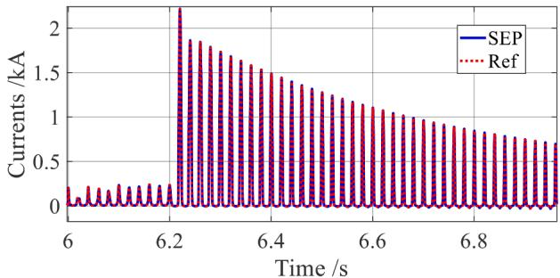  
  
  
Fig. 20. Envelope waveforms of different harmonics currents in primary side of transformer and its instantaneous waveform after fault occurs. (a)Instantaneous inrush current and its envelope waveforms of different harmonics. (b) Instantaneous current obtained from PSCAD and SEP.

The transmission line is 100 km frequency dependent model. Resistor load $R _ { 3 , } \ R _ { 4 }$ are set to ${ 1 0 } ^ { 6 }$ Ω supplied through two saturable transformers which represent open circuit.

The ac voltage $E _ { \mathrm { t } }$ is represented by the excitation function as follows:

$$
\mathrm {E} _ {\mathrm {t}} = 3 8 0 \sin (2 \pi \mathrm {f t}) \tag {46}
$$

where $f = 6 0$ Hz. For $R _ { 1 } ,$ , R2 and L connected at the voltage source

$$
R _ {1} = 1. 0 \Omega ; R _ {2} = 1. 0 \Omega ; L = 0. 1 \mathrm {H}
$$

For the three phase two winding step down transformer, the positive sequence leakage reactance is set to 0.1p. u., and the ratio is 380/230 kV. Saturation is placed on high voltage winding side, and the magnetizing current is set to 1% with knee voltage 1.17 p. u.

Taking one phase current of transformer T1 for example, from t = 0 s to t = 0.05 s, the magnetic current is 0kA. At t = 0.05 s, the energization operation is completed by closing the switch at primary side of T1 and keep the switch open at T2 side. Once a discontinuity is detected in the proposed model, the resulting EMT simulation of current flowing through T1 transformer is represented by multiplying with equivalent phasor from Eqs. (29) and (30) using small time step (50μs) shown in Fig. 19(a). Meanwhile, instantaneous current waveform is also simulated using PSCAD/EMTDC shown in Fig. 19(b) for the comparison. Following the energization process, inrush current surges from zero to reach the peak value of 1.6 kA then decreases to a stable value of 0.25 kA after 1.5 s. The effectiveness and accuracy of this approach is verified in reference [17].

When the decaying speed of linkage fluxψ(t)is detected below a certain value in periodic steady-state among 1.7s-6 s, the slowing changing transient can be tracked by setting ω to be 2πf that f equals to 50 Hz or 60 Hz, then envelope waveforms of different harmonics can be tracked by adopting Eqs. (22) and (23) with 20 ms large simulation time step and parallel processing can be utilized to deal with different harmonic components that can largely reduce the computation effort as Fig. 19(a) shown.

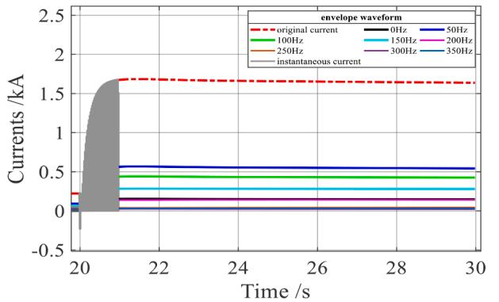

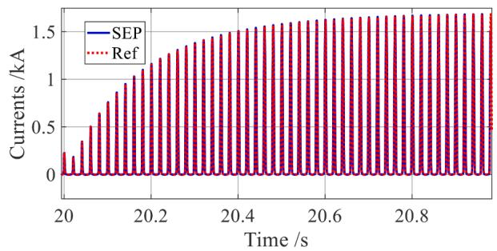  
(a)   
(b)   
Fig. 21. Envelope waveforms of different harmonics currents in primary side of transformer and its instantaneous sympathetic inrush current. (a) Instantaneous inrush current and its envelope waveforms of different harmonics. (b) Instantaneous current obtained from PSCAD and SEP.

Instantaneous current waveform obtained from SEP model in comparison with EMT simulation results from PSCAD/EMTDC denoted as reference curve is shown in Fig. 19(b) with simulation time step 50μs adopted in the two simulators. It can be readily observed that instantaneous current waveform obtained from SEP can match reference curve perfectly when small time step is adopted.

# 5.4. Pseudo inrush current in transformer

Pseudo inrush current occurs after a fault-recovery situation which is also referred to as re-energisation [34]. To validate the proposed SEP model, the fault recovery inrush currents are simulated in the system as Fig. 20 shown where ${ \mathrm { R } } _ { 3 }$ and ${ \mathrm { R } } _ { 4 }$ are 1pu.

A three-phase fault occurs at secondary side of transformer T1 at 6 s for around 10 cycles and cleared through an auxiliary circuit-breaker. The pseudo inrush current is shown in Fig. 20(a) and SEP-envelope waveforms are tracked with simulation time step 20 ms at 7s-20 s that largely reduces computation burden. Similarly, when instantaneous current is of concern, multiply the envelope signals with shifted equivalent phasor $e ^ { j k \omega _ { s } ( t + T + s ) }$ as Eqs. (29) and (30) shown and real part of current is obtained to compare with the reference curve obtained from PSCAD. Observing that the instantaneous waveform obtained from SEP model with time step 50μs shows complete conformity with reference waveform as Fig. 20(b) shown.

# 5.5. Sympathetic inrush current in transformer

To further validate the effectiveness and accuracy of proposed SEP based transformer model, the test system in Fig. 18 is considered to simulate sympathetic inrush current in transformer where $\mathrm { R } _ { 3 }$ and ${ \mathrm { R } } _ { 4 }$ are 1pu and other parameters are not changed in Section 5.3. Sympathetic inrush current is generated when multiple transformers are connected in a same line and one of them is energized [35].

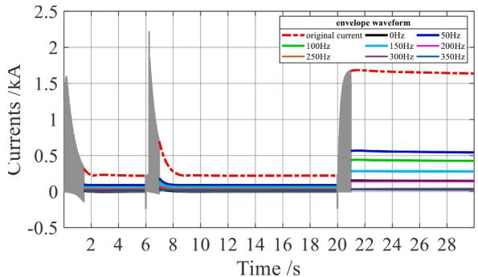  
Fig. 22. Envelope waveforms of different harmonics inrush currents in primary side of T1 transformer and its instantaneous 3 types of inrush current.

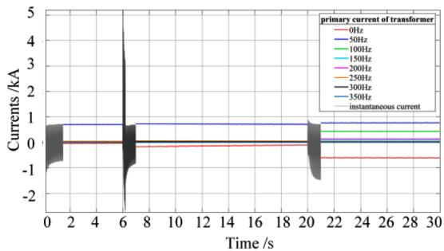  
Fig. 23. Envelope waveforms of different harmonics currents in primary side of T1 transformer and its instantaneous waveform.

At $t = 2 0 s ,$ the energization operation of transformer T2 is completed by closing the switch at primary side of T2. When instantaneous waveform of sympathetic inrush current is of interest, the envelope signals of different harmonics are multiplied with equivalent shifted phasor $\mathrm { e } ^ { \mathrm { j } 2 \pi \mathrm { f } \mathrm { k } ( \mathrm { t + } \mathrm { T } + \mathrm { s } ) }$ transforming into real signals and the SEP companion model is transformed into EMT companion model as Section 4.2 shown, then the resulting EMT simulation of sympathetic inrush current flowing through T1 are represented by SEP model depicted in Fig. 21(a). Meanwhile, instantaneous current waveform obtained from PSCAD/ EMTDC is denoted as reference curve for comparison with SEP shown in Fig. 21(b). Observing that the instantaneous waveform obtained from SEP model with time step 50μs shows complete conformity with reference waveform. On the other hand, when envelope waveform is of concern, envelope signals is obtained as Eq. (22) shown and the equivalent shifted phasor $\mathrm { e } ^ { \mathrm { j } 2 \pi \mathrm { f } \mathrm { k } ( \mathrm { t + T + s } ) }$ is set to be one, then large time step (20 ms) is adopted to simulate envelopes of different harmonics of inrush currents as Fig. 21(a) shown, which reduce computation burden heavily in large power network.

Finally, Fig. 22 shows 3 types of inrush currents flowing through transformer T1 at different stage which includes: (i) energized inrush current at 0.05s-6 s; (ii) pseudo inrush current at 6.2s-20 s and (iii) sympathetic current at 21s-30 s. When discontinuity of current envelope is detected, instantaneous current is tracked by Eq. (29), () using small time step (50μs). When the decaying speed of linkage fluxψ(t)is detected below a certain value, then the slowing changing transient can be characterized by setting ω to be 2πf where f equals to 50 Hz or 60 Hz, then envelope waveforms of different harmonics can be tracked by adopting Eqs. (22) and (23) with large simulation time step (20 ms) and parallel processing can be utilized to deal with different harmonic components.

# 5.6. Current flowing through transformer

To validate the proposed SEP model, current flowing through the saturable transformer in accordance with the 3 types of inrush currents

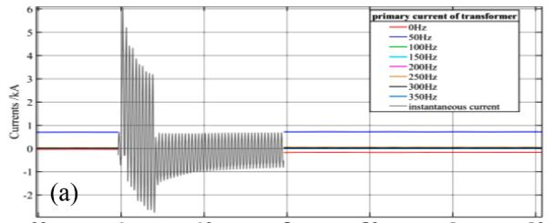

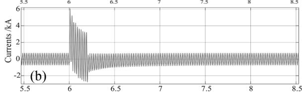

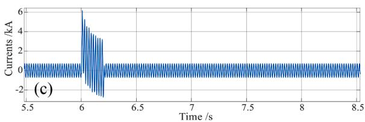  
Fig. 24. Phase a primary side current of transformer (a) Natural and envelope waveforms of different harmonic components in SEP simulation, (b) natural waveform of the reference solution and (c) natural waveform of magneticallylinear model of PSCAD/EMTDC.

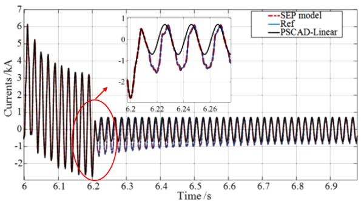  
Fig. 25. Zoom in plot of phase a primary side current of transformer during electromagnetic transients stage.

illustrated in the previous sections is presented. Parameters of this case are the same with Sections 5.3–5.5. The same study is simulated in PSCAD to compare the accuracy of the proposed model. The model is simulated using small time step of 50μs to obtain accurate simulation. Although this paper is not going to compare the difference between magnetically-linear and the saturable transformer, the linear transformer in PSCAD model is also included in this study.

For the scenario of 3 types of inrush current illustrated in Fig. 22, the primary side current of saturable transformer is depicted in Fig. 23 which shows that the ability to support the tracking of both instantaneous and envelope waveforms of different harmonics within one simulation run when the proposed SEP model is adopted. When t = 0.05 s, T1 transformer is energized by clothing the switch and keep the T2 side switch open. It can be detected that inrush current occurs based on RDFT, then instantaneous waveform is tracked by setting parameters to EMT mode values illustrated in previous section and small-time step is adopted, e.g., 50μs. When the decaying speed of linkage fluxψ(t)is detected below a certain value, parameters are adjusted into envelope mode values shown above and large time step is utilized, e.g., 20 ms which can greatly reduce the computation burden and wide frequency domain envelopes can be represented. At 6 s, a three-phase short circuit fault occurs and last for 10 circles depicted in Fig. 24, then a discontinuity is detected in the SEP model, as a result, parameters are again set

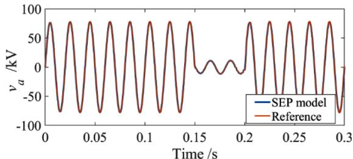

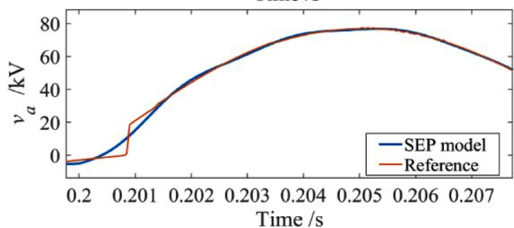  
Fig. 26. Instantaneous ac voltage of VSC.

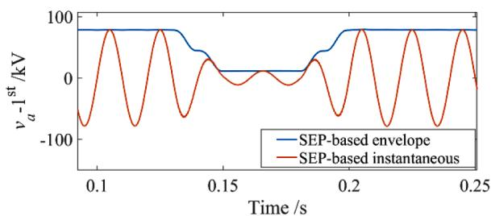

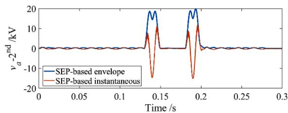

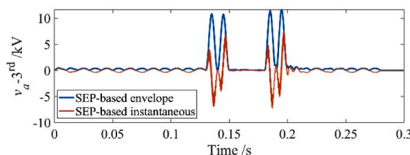  
Fig. 27. Instantaneous ac voltage of VSC.

to EMT mode values to track instantaneous waveform. Better view of match of Fig. 24 can be seen in Fig. 25, which shows the large difference between linear and saturable transformer currents.

# 5.7. VSC test: asymmetric AC fault

Fig. 26 shows the ac voltage of the VSC subjected to a short-term asymmetric ac fault, where the fault occurs at t = 0.15 s and recovers at t = 0.2 s. The VSC is modelled by the proposed method and different time step is tested to prove the accuracy of the SEP-based model. Fig. 26 further illustrates the first to third harmonic phasors corresponding to the instantaneous values shown in Fig. 26. As can be seen, at t = 0.15 s, the fault occurs lasting 50 ms at the ac side of VSC. From Fig. 26 some conclusions can be reached: 1) When shifting equivalent phasors $e ^ { j k w s ( t - T + s ) }$ are multiplied with complex envelope signals $\widehat { \mathbf { V } } _ { a } ( t )$ in (41), instantaneous waveform can be accurately tracked under time step size

Table 3 Comparison with traditional methods.   

<table><tr><td>Case study</td><td>Algorithm</td><td>Time step (s)</td><td>Accuracy</td><td>Computation time</td></tr><tr><td rowspan="2">Inrush current of energized transformer</td><td>Piecewise linearization</td><td>1e-6</td><td>99.9% 
(Time step 1e-6 s) 
Above 500% 
(Time step larger than 1e-6 s)</td><td>201.1 s 
(6 s curve)</td></tr><tr><td>Proposed method</td><td>50e-6 (instantaneous), 
20e-3 (envelope)</td><td>96% 
(Time step 50e-6 s) 
99.9% 
(Time step 20e-3 s)</td><td>16.5 s 
(6 s curve)</td></tr><tr><td rowspan="2">Ac voltage of VSC test</td><td>Simulink model</td><td>10e-6</td><td>100%</td><td>5.21 s 
(0.3 s curve)</td></tr><tr><td>Proposed method</td><td>500e-6 (instantaneous) 
20e-3 (envelope)</td><td>98% (instantaneous) 
100% 
(envelope)</td><td>0.82 s 
(0.3 s curve)</td></tr></table>

500μs. Even the time step is extended to 500μs amazingly, the simulation results of SEP model can match the reference very well. 2) Zoom in figure of Fig. 26 shows slight differences between the voltage curve of SEP model and the reference curve under 500μs time step size, but the gaps are still acceptable.

From Fig. 27, insightful conclusions are deduced as follows: 1) amplitude of each harmonic phasor $\widehat { \mathbf { V } } _ { a } ( t )$ derived in (41) can be the wide frequency envelopes of the instantaneous voltage of each harmonic and large simulation timestep (2 ms) can be used due to the slow changing characteristics of the envelopes. 2) Harmonic envelopes will be beneficial to study the dominated first and second harmonics in real time.

Finally, a comparison with traditional methods is listed as Table 3 shown. For the case: inrush current deduced by energized transformer, traditional piecewise linearization is conducted under time step 1μs, with computation time 201.1 s when 6 s inrush current is tracked. Larger time step than 1μs will certainly cause severe overshoot as Table 3 and Fig. 13 shown. However, the proposed method could largely extend simulation time step to 20 ms to track slow changing inrush current envelopes of different harmonics, which computation time is 16.5 s, far less than piecewise linearization. The simulation accuracy of SEP-based method is within accepted range as Table 3 shown. Similarly, the comparison between the SEP-based VSC model and commercially available software (Simulink) is conducted, where time step in Simulink model and SEP-based VSC are set to be 10μs and 500μs or 20 ms respectively. As can be seen in the Table 3, the proposed method could largely reduce computation time from 5.21 s to 0.82 s without much sacrifice of accuracy.

# 6. Conclusion

A nonlinear electrical companion model for equivalent phasor adaptive transient simulation is proposed in this paper to widen the focused frequency range of phase shift simulations. To identify different frequencies used for shifting, RDFT is utilized to obtain different harmonic orders, then SEP method is proposed to finish equivalent phasor shifting in accordance with the objective of the study. Analytical signals obtained from Hilbert transform is a type of linear transform that is not suitable for dealing with production of two variables in nonlinear circuit system which is the drawback of traditional Hilbert-transform-based FAST method. However, this paper selects the dynamic phasor to deal with this problem. Finally, a multi-time scale transient model for small and large time step EMT simulations method is proposed based on the determination of two parameters setting: shifting phasor operator (including $k \omega _ { s }$ in SEP companion model) and time step size in accordance with the objective of the study. If the shifting phasor operator is multiplied and k is set in accordance with frequencies obtained in RDFT with sliding time window, the SEP companion model is transformed into EMT model and the signals are represented in real value, then the instantaneous current is tracked and the time step is adjusted small

enough to finish EMTP simulation; If the changes of envelope is of interest, the phasor operator is set to be one and k in SEP companion model is set to be zero, then time step size is large enough to capture the envelope. Finally, different cases including 3 types of inrush current in transformer with saturation effect proves the effeteness of proposed SEP method. All in all, the nodal-analysis-based SEP model has the following advantages. (1) Large simulation time step can be used for simulating nonlinear elements while traditional FAST based model cannot solve it. (2) Instantaneous and various harmonic envelopes waveforms within one simulation work can be tracked. (3) There is no overshooting and oscillating phenomena even large simulation time step is adopted. (4) The coding of SEP models for practical utilization is very simple and efficient since Y matrix in SEP model is actually a constant envelope amplitude in steady state.

# CRediT authorship contribution statement

Zhen Gong: Writing – original draft, Conceptualization, Methodology, Software. Chengxi Liu: Conceptualization, Methodology, Writing – review & editing. Liangzhong Yao: Visualization, Writing – review & editing.

# Declaration of Competing Interest

We declare that we have no financial and personal relationships with other people or organizations that can inappropriately influence our work, there is no professional or other personal interest of any nature or kind in any product, service and/or company that could be construed as influencing the position presented in, or the review of, the manuscript entitled.

# Acknowledgement

This work was supported in part by the National Natural Science Foundation of China under Project 52007133 and International Cooperation and Exchange of the National Natural Science Foundation of China under Project51861135312.

# References

[1] F. Gao, K. Strunz, Modeling of constant distributed parameter transmission line for simulation of natural and envelope waveforms in power electric networks, in: Proceedings of the 37th North American Power Symposium, Ames, IA, 2005, pp. 247–252. Oct.   
[2] C. Hong, Q. Zhang, Y. Zhang, L. Hong, Efficient electromagnetic transient modeling of transformer based on J-A hysteresis model, South. Power Syst. Technol. 14 (2) (2020) 75–83.   
[3] J. Vaheeshan, Transformer Fault-Recovery Inrush Currents in MMC-HVDC Systems and Mitigation Strategies, University of Manchester, 2016.   
[4] H.A. Halim, Sympathetic Inrush Currents in Transformer Energisation, University of New South Wales, 2018.

[5] F. Therrien, L. Wang, W. Chapariha, Constant-parameter interfacing of induction machine models considering main flux saturation in EMTP-type programs, IEEE Trans. Energy Conv. 31 (1) (2016) 12–26.   
[6] L. Wang, J. Jatskevich, Including magnetic saturation in voltage-behind-reactance induction machine model for EMTP-type solution, IEEE Trans Power Syst. 25 (2) (2010) 975–987.   
[7] Y. Zhu, D. Fang, Q. Wang, An approach for electromagnetic transient simulation of power transformers with nonlinear exciting branch, Power Syst. Technol. 14 (2) (2020) 75–83.   
[8] S.R. Sanders, et al., Generalized averaging method for power conversion circuits, IEEE Trans. Power Electron. 6 (2) (1991) 251–259.   
[9] M. Daryabak, et al., Modeling of LCC-HVDC systems using dynamic phasors, IEEE Trans. Power Deliv. 29 (4) (2014) 1989–1998.   
[10] Y. Xia, Y. Chen, et al., Muti-scale modeling and simulation of DFIG-based wind energy conversion system, IEEE Trans. Energy Convers. 35 (1) (2020) 560–572.   
[11] Y. Shang, Comparion of Electromagnetic Transient Algorithms and Nonlinear Model Research, Master thesis, Shandong University, 2009.   
[12] Alternative Transients Program (ATP) – Rule Book, Canadian/American EMTP User Group, 1987–1998.   
[13] L.O. Chua, et al., Linear and Nonlinear Circuit, Mc Graw-Hill Book Company, 1987, pp. 236–270, and 402-406.   
[14] H. Shu, Power Engineering Signal Processing and Application, Science Press, 2009.   
[15] K. Mudunkotuwa, S. Filizadeh, U. Annakkage, Development of a hybrid simulator by interfacing dynamic phasors with electromagnetic transient simulation, IET Gener. Transm. Distrib. 11 (12) (2017) 2991–3001.   
[16] C. Liu, A. Bose, P. Tian, ‘Modeling and analysis of HVDC converter by three-phase dynamic phasor, IEEE Trans. Power Deliv. 29 (1) (2014) 3–12.   
[17] M.A. Kulasza, Generalized Dynamic Phasor-Based Simulation for Power Systems, MSc thesis, University of Manitoba, 2014.   
[18] D. Shu, X. Xie, Z. Yan, et al., ‘A multi-domain co-simulation method for comprehensive shifted-frequency phasor dc-grid models and EMT ac-grid models, IEEE Trans. Power Electron. 34 (11) (2019) 10557–10574.   
[19] D. Shu, et al., A multirate EMT co-simulation of large AC and MMC Based MTDC systems, IEEE Trans. Power Syst. 33 (2) (2018) 1252–1263.   
[20] D. Shu, et al., A novel interfacing technique for distributed hybrid simulations combining EMT and transient stability models, IEEE Trans. Power Del. 33 (1) (2018) 130–140.

[21] D. Shu, et al., A harmonic phasor domain cosimulation method and new insight for harmonic analysis of large-scale VSC-MMC based AC/DC grids, IEEE Trans. Power Electron. 36 (4) (2021) 3909–3924.   
[22] Y. Xia, Y. Chen, Y. Song, et al., Multi-scale modeling and simulation of DFIG-based wind energy conversion system, IEEE Trans. Energy Convers. 35 (1) (2020) 560–572.   
[23] K. Strunz, R. Shintaku, F. Gao, ‘Frequency-adaptive network modeling for integrative simulation of natural and envelope waveforms in power systems and circuits, IEEE Trans. Circuits Syst. 53 (12) (2006) 2788–2803.   
[24] F. Gao, K. Strunz, ‘Frequency-adaptive power system modeling for multiscale simulation of transients, IEEE Trans. Power Syst. 24 (2) (2009) 561–571.   
[25] H. Ye, K. Strunz, Multi-scale and frequency-dependent modeling of electric power transmission lines, IEEE Trans. Power Del. 33 (1) (2018) 32–41.   
[26] F. Gao, K. Strunz, Multi-scale simulation of multi-machine power systems, Int. J. Elect. Power Energy Syst. 31 (9) (2009) 538–545. Oct.   
[27] Y. Xia, Y. Chen, Y. Song, S. Huang, Z. Tan, K. Strunz, An efficient phase domain synchronous machine model with constant equivalent admittance matrix, IEEE Trans. Power Del. 34 (3) (2019) 929–940.   
[28] Y. Huang, M. Chapariha, F. Therrien, J. Jatskevich, J.R. Martí, ‘A constantparameter voltage-behind-reactance synchronous machine model based on shiftedfrequency analysis, IEEE Trans. Energy Convers. 30 (2) (2015) 761–771.   
[29] N. Chiesa, H. Høidalen, Modeling of nonlinear and hysteretic iron-core inductors in ATP, in: Proceedings of the European EMTP-ATP Conference 13, EEUG, 2007, pp. 118–123.   
[32] B.K. Perkins, J.R. Marti, H.W. Dommel, Nonlinear elecments in the EMTP: steadystate initialization, IEEE Trans. Power Syst. 10 (2) (1995) 593–601.   
[33] M. Salimi, A.M. Gole, R.P. Jayasinghe, Improvement of transformer saturation modeling for electromagnetic transient programs, in: Proceedings of the International Conference On Power Systems Transients, Vancouver, Canada, 2013, pp. 18–20. July.   
[34] J. Vaheeshan, Transformer Fault-Recovery Inrush Currents in MMC-HVDC Systems and Mitigation Strategies, PhD thesis, The University of Manchester, 2016.   
[35] H.A. Halim, Sympathetic Inrush Current in Transformer Energisation, PhD thesis, The University of New South Wales, 2018.