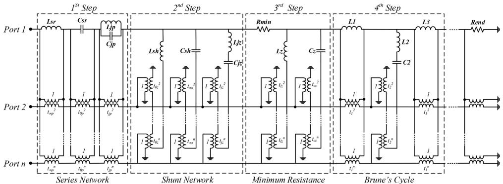
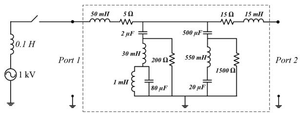
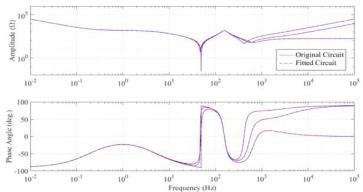
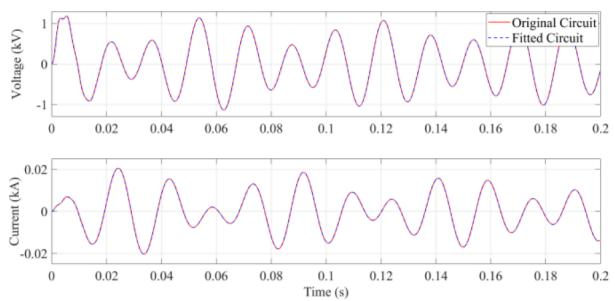
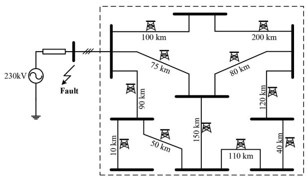
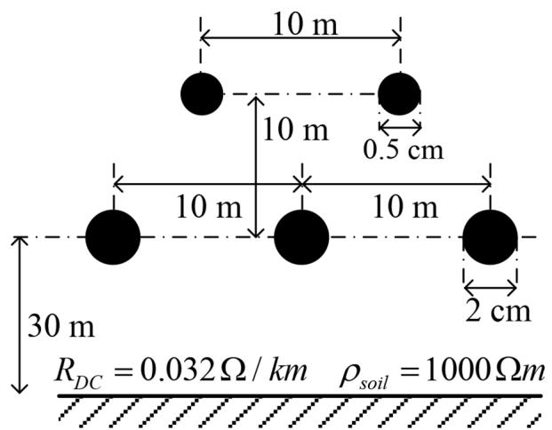
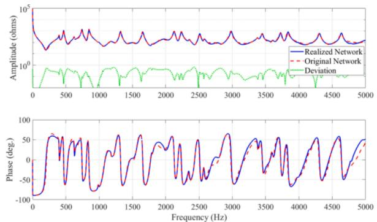
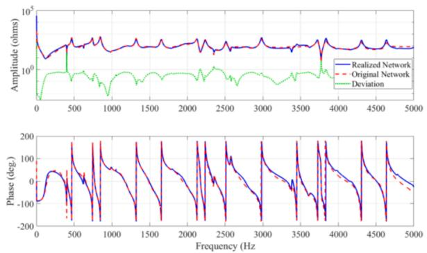
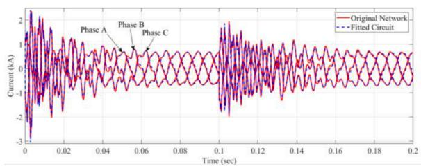

# A guaranteed passive model for multi-port frequency dependent network equivalents using network synthesis approach

Meysam Ahmadi a,* , Shengtao Fan a , Aniruddha M. Gole a , H. M. Jeewantha De Silva b

a Power Systems Research Group, Department of Electrical and Computer Engineering, University of Manitoba, Winnipeg, MB, R3T 5V6, Canada   
b Manitoba Hydro International, Winnipeg, MB, Canada, R3P 1A3

# A R T I C L E I N F O

Keywords:

Brune synthesis

Tellegen synthesis

Electromagnetic transient simulation

Frequency dependent network equivalents

Passive network realization

# A B S T R A C T

Frequency Dependent Network Equivalent (FDNE) models are used in both real-time and offline Electromagnetic Transient (EMT) simulation tools to capture the behavior of a large external network, thus eliminating the need to simulate the entire network in full detail. An important requirement for the FDNE is that it be passive to guarantee stability. In this work, a new approach based on Brune’s and Tellegen’s network realization methods is proposed for constructing FDNEs. This approach inherently guarantees the passivity of the realized network. Tellegen’s method is adapted and automated so it can be applied directly to the tabulated data of the impedance as a function of frequency. The feasibility of the proposed technique is validated through example case studies.

# 1. Introduction

Apopular approach for simplifying the complexity of an Electromagnetic Transient (EMT) simulation is to model the study network of greater interest, which typically includes non-linear power system elements, e.g. HVDC converters, lightning arrestors, transformers with inrush currents etc., in full detail [1–8]. The remainder or “external” network is assumed to be linear and represented by a simpler Frequency Dependent Network Equivalent (FDNE). The term FDNE was first applied to this approach by Morched et al. [1]. An important requirement for the FDNE is that it displays an accurate response of the external network and still preserves the passivity of the network at all frequencies.

Time-domain modeling of a frequency-dependent network was initially done in the 1970s by Hingorani and Burbery [2] by fitting the scanned points from a frequency response plot of the original external network with several parallel RLC branches, whose combined impedance matches the driving point impedance frequency response of the external circuit. Concurrently, Clerici represented frequency-dependent Thevenin equivalent impedance of the network with simple type-I Foster realization [9] in order to do a switching surge study [3]. A wideband frequency model of such a network equivalent was introduced by Morched and Brandwajn in [4] using RLC parallel branches and

considering series and parallel resonances in the network response scan. Que Do also introduced an iterative pole-removal procedure for the synthesis of one-port network equivalent impedances using series or parallel connections of selected RLC modular circuits [5,6]. Watson and Arrillaga in [7] have optimized Hingorani’s method of equivalent RLC branches for harmonic analysis using multi-variable optimization methods. Morched extended the approach to multi-port FDNEs for EMT programs using shunt RLC branches whose elements are being calculated through an optimization process [1]. The aforementioned network realization-based methods used pre-specified RLC structures, thus were proper for a low order fitting of just a few resonance peaks and suitable for early computers. Today, with much higher-powered computers, the significantly improved fitting becomes possible and in fact, is demanded.

Later mathematical approaches to fit the frequency-dependent responses were introduced. A π-type network is used in [10] to realize a low order equivalent network for an admittance matrix Y(jω) those elements are first fitted by rational functions using a non-constraint optimization program. In [8] a high-frequency transformer model and in [1] a reduced-order model of a multi-port frequency-dependent network is generated by first approximating the FDNE by means of rational functions and then realize it in the form of an RLC network which could be directly used in EMTP.

Marti in [11], used Bode’s procedure [12] to model frequency-dependent characteristic impedance of a transmission line in the time domain by approximating the tabular function with zeros and poles at proper frequencies and form a rational function and then realizing it using Foster I networks.

Later, the powerful Vector Fitting (VF) approach was introduced by Gustavsen and Semlyen as a mathematical approach to curve-fit the frequency responses utilizing rational functions [13–19]. The rational function also can be modelled in EMT tools employing recursive convolution [20] or RLC branches [21].

VF has been widely used in modern transient simulation tools. The original VF does not guarantee the passivity of the resulted function. The fitted function representing a passive network should not generate energy at any frequency. However, with earlier VF and other mathematical approaches [22], passivity cannot be always guaranteed. Therefore, further development was conducted to enforce passivity. Despite this, passivity enforcement can occasionally result in accuracy loss and non-convergence [22–25].

The frequency domain matrix pencil method is another mathematical approach to fit the FDNEs which also does not guarantee the passivity and needs further step to enforce the possible violation of passivity [26].

FDNEs can further lower the complexity and accelerate the simulation if the fitting is limited only to the frequency range of interest. This idea is used in real-time digital simulators (rtds), where it is usually sufficient to have an accurate representation up to a few kHz [25]. In addition, FDNEs are sometimes used in hybrid transient simulations in combination with a Transient Stability Analysis (TSA) program [27]. This requires wideband frequency modeling of the external network [28].

In this paper, a network realization-based approach is used, which is based on Brune’s and Tellegen’s methods [29–31]. In their original form, these methods required the impedance terms to be given as rational polynomials of the Laplace variable $" s " .$ . However, in most power system applications, a closed-form expression in ‘s’ domain is not possible and the impedance is given in tabulated form as a function of frequency. The proposed approach adapts Brune/Tellegen synthesis to realize a passive FDNE directly from the tabulated frequency response. The resulting form is an RLCM network, and so inherently ensures passivity. This dispenses with any need for further mathematical passivity enforcement as with Vector Fitting. The method is repetitive, with four steps in each round of repetition, which makes the procedure easy to program for computer implementation. This approach was originally explored only for single-port networks, where the realized impedance is a scalar, using Brune synthesis [32]. However, most realistic power systems are multi-port (even a three-phase system with coupling between phases is actually a 3-port system), the FDNE becomes a matrix instead of a scalar, for which Ahmadi and Gole method used in [32] is no longer applicable. The generalization to multi-port networks is achieved by the use of Tellegen’s synthesis [30,31].

# 2. Tellegen’s extension on multiport networks

The impedance of a passive multi-port network is represented by a Positive Real (PR) matrix Z(s). Contrariwise, a matrix Z(s) can be realized if it is a Positive Real (PR) matrix. A matrix Z(s) is PR if and only if [10];

• All the coefficients of Z(s) are real when ‘s’ is real.   
• All the coefficients of Z(s) are analytic in the right-half ‘s’ plane.   
• Poles on the jω axis are simple and their matrix of residues is a positive semi-definite matrix.   
• The real part of Z(jω), ℜ{Z(jω)}, is positive semi-definite for all ω.

Using steps similar to Ahmadi and Gole Method explained in [32], Tellegen proposed a multiport network represented by an impedance

matrix $Z ( s )$ . These steps are explained below for an n-port network [30].

# 2.1. Step 1- Removing the imaginary axis matrix of poles

If one or more of the elements of the impedance matrix Z(s) has a pole at a certain frequency, it is considered as the pole of the whole matrix and should be removed in the form of a series network. Let the constant matrices $K _ { \infty p } , \mathrm { K } _ { 0 \mathrm { p } }$ and $K _ { j p }$ represent the residues of the poles at frequencies $s = \infty , s = 0$ and $s = \omega _ { j p }$ respectively as indicated in (9).

$$
Z (s) = K _ {\infty p} s + \frac {K _ {0 p}}{s} + \sum_ {j p = 1} ^ {n p} K _ {j p} \frac {2 s}{s ^ {2} + \omega_ {j p} ^ {2}} + Z _ {1} (s) \tag {1}
$$

If $K _ { \infty p } , \mathrm { K } _ { 0 p }$ or $K _ { j p }$ is a rank-1 matrix, the pole represents a series impedance with one branch and n-1 ideal transformers [30] as shown in Fig. 1. Otherwise, the residue matrix should be reduced to a sum of rank-one matrices. These poles are realized by $\nonumber L _ { s r } , \ C _ { s r } , \ C _ { j p }$ and $L _ { j p }$ in connection with transformers with turns ratio of $t _ { \infty p } ^ { m } ,$ t0pm and $t _ { j p } ^ { m }$ as given in (2);

(2)

Poles at ωjp

# 2.2. Step 2- Removing Imaginary axis matrix of zeros

If $\left| Z _ { 1 } ( s ) \right| = 0$ at a certain frequency implies that there is a zero at that frequency. As was done with the scaler function z(s) in section II.B, the zeros of matrix $Z _ { 1 } ( s )$ are similarly removed in form of poles of $Y _ { 1 } ( s ) \left( \mathrm { i . e . } \right.$ , $Z _ { 1 } ( s ) ^ { - 1 } )$ and realized as a shunt network given in (3).

$$
Y _ {1} (s) = K _ {\infty z} s + \frac {K _ {0 z}}{s} + \sum_ {j z = 1} ^ {n z} K _ {j z} \frac {2 s}{s ^ {2} + \omega_ {j z} ^ {2}} + Y _ {2} (s) \tag {3}
$$

Similar to pole removal, the relation between the residue and network elements (shunt capacitance $C _ { s h } ,$ , turns ratio $t _ { \infty z } ^ { m } , \ t _ { 0 z } ^ { \mathrm { m } }$ and $t _ { j z } ^ { m } ,$ shunt inductance $L _ { s h }$ and the series LC branch $L _ { j z }$ and $C _ { j z } )$ can be found as in (4):

(4)

Poles at ωjz

# 2.3. Step 3- Removing the minimum real part

Steps 1 and 2 are repeated until there are no more poles or zeros in the matrix $Z _ { 2 } ( s )$ . Considering the real part of $Z _ { 2 } ( j \omega )$ , i.e., $A ( \omega ) =$ $\Re \{ Z _ { 2 } ( j \omega ) \}$ , the minimum resistance $R _ { m i n }$ is then defined by (13) in which $\Delta _ { 1 1 } ( \omega )$ is the $^ { ( 1 , 1 ) }$ minor of A(ω);

$$
R _ {\min } = \min  \left\{\Lambda (\omega) \right\} \quad , \quad \Lambda (\omega) = \frac {| A (\omega) |}{\Delta_ {1 1} (\omega)} \tag {5}
$$

Let at $s = \omega _ { } o$ be the frequency at which the minimum resistance occurs. Then by removing the resistance $R _ { m i n }$ from $Z _ { 2 } ( j \omega ) _ { i }$ , a zero is created at ω0 in $\Re \{ Z _ { 3 } ( j \omega ) \}$ . This means $| \Re \{ Z _ { 3 } ( \mathrm { j } \omega _ { 0 } ) \} | = 0$ or the real part of matrix $Z _ { 3 } ( j \omega )$ will become rank deficient at ω0.

The resistance $R _ { m i n }$ is only realized at port one of the network as

  
Fig. 1. The entire possible network that could be realized in the four steps of the Tellegen’s realization method.

shown in Fig. 1. Therefore, the function $Z _ { 3 } ( j \omega )$ can be written by (6):

$$
Z _ {3} (j \omega) = Z _ {2} (j \omega) - \left[ \begin{array}{c c c c} R _ {\min } & 0 & \dots & 0 \\ 0 & 0 & \dots & \vdots \\ \vdots & \vdots & \ddots & \vdots \\ 0 & \dots & \dots & 0 \end{array} \right] \tag {6}
$$

In case $\omega _ { 0 } = \infty \mathrm { o r } \omega _ { 0 } = { \cal O } ,$ the zero is removed in the form of a pole of $Y _ { 3 } ( s )$ by means of the shunt network shown in Fig. 1 consisting of LZ, $C _ { Z }$ and transformer turns ratio $t _ { l z } ^ { m }$ and $t _ { c z } ^ { m } .$ .

# 2.4. Step 4- Tellegen’s Extension on brune’s cycle

If $R _ { m i n }$ happens at a finite frequency, i.e., $0 < \omega _ { O } < \infty$ then a step analogous to Brune’s cycle is required to lower the order of the impedance matrix.

In the previous step, the real part of matrix $Z _ { 3 } ( s )$ became rank deficient, and by definition, there exists a vector $\beta$ such that;

$$
\Re \left\{Z _ {3} \left(j \omega_ {0}\right) \right\} \beta = 0 \tag {7}
$$

Vector β in (7) is called a null vector. The imaginary part, $X =$ $\Im \{ Z _ { 3 } ( j \omega _ { 0 } ) \}$ }, should also become rank deficient with the same vector $\beta .$ Therefore, there is a rank-one symmetric matrix H such that;

$$
(X - H) \beta = 0, X = \Im \left\{Z _ {3} \left(j \omega_ {0}\right) \right\} \tag {8}
$$

While any real symmetric rank-one matrix of H can be written as the product of a real vector h and a constant $\alpha ;$

$$
H = \alpha h h ^ {T}, \quad \alpha = \pm 1 \tag {9}
$$

Eqs. (8) and (9) give (10) from which the sign of α can be determined, as the sign o $\because \beta ^ { T } X \beta$ .

$$
X \beta = \alpha h h ^ {T} \beta \Rightarrow \beta^ {T} X \beta = \alpha (\beta . h) ^ {2} \tag {10}
$$

With some manipulation the vector h can be determined as:

$$
h = \frac {1}{\sqrt {\alpha \beta^ {T} X \beta}} X \beta \tag {11}
$$

Now the rank-one matrix H can be subtracted from $Z _ { 3 } ( s )$ and realized as a series inductance network given in (12) with $L _ { 1 } = H ^ { 1 1 } / \omega _ { 0 }$ and the transformer turn ratio of port m, $\mathbf { t } _ { 1 } ^ { \mathrm { m } } = H ^ { 1 m } / H ^ { 1 1 }$ . The remainder is:

$$
Z _ {4} (s) = Z _ {3} (s) - t _ {1} t _ {1} ^ {T} s L _ {1}
$$

$$
\text {W h e r e} \left| \begin{array}{l} L _ {1} = H ^ {1 1} / \omega_ {0} \\ t _ {1} ^ {m} = H ^ {1 m} / H ^ {1 1} \quad m = 2, 3, \dots \end{array} \right. \tag {12}
$$

In which t is the vector of the transformer ratios connecting L to the other ports.

$$
t _ {1} = \left[ \begin{array}{l} 1 \\ t _ {1} ^ {2} \\ t _ {1} ^ {n} \end{array} \right] \tag {13}
$$

Next, the zero of $Z _ { 4 } ( s )$ which is created at $\omega _ { O }$ is removed as a pole of matrix $Y _ { 4 } ( s )$ .

$$
Y _ {5} (s) = Y _ {4} (s) - t _ {2} t _ {2} ^ {T} \frac {s / L _ {2}}{s ^ {2} + \omega_ {0} ^ {2}} \tag {14}
$$

where $t _ { 2 }$ is the vector of the transformer ratios connecting $\mathrm { L _ { 2 } C _ { 2 } }$ to the other ports as given by (15).

$$
K _ {x} = Y _ {4} (s) \frac {s ^ {2} + \omega_ {0} ^ {2}}{s} \mid_ {s = \omega_ {0}}
$$

$$
\left| \begin{array}{l} L _ {2} = 1 / \left(K _ {x} ^ {1 1}\right) \text {a n d} C _ {2} = 1 / \left(L _ {2} \omega_ {0} ^ {2}\right) \\ t _ {2} ^ {m} = K _ {x} ^ {1 m} / K _ {x} ^ {1 1} \quad m = 2, 3, \dots \end{array} \right. \tag {15}
$$

Lastly, the inductance L3 must be removed from the function $Z _ { 5 } ( s )$ to finish the cycle.

$$
Z _ {6} (s) = Z _ {5} (s) - t _ {1} t _ {1} ^ {T} s L _ {3} \tag {16}
$$

Tellegen proved that $L _ { 3 }$ is coupled to the other ports with the same transformer ratios as $L _ { 1 }$ [30]. The relation between the inductances is as follows:

$$
L _ {3} = - \frac {L _ {1} L _ {2}}{F ^ {2} . L _ {1} + L _ {2}}, \quad F = t _ {1}. t _ {2} \tag {17}
$$

The next round of reduction may be applied to $Z _ { 6 } ( s )$ to reduce its order further and the procedure continues until the remainder function reaches a constant matrix i.e. $R _ { e n d } .$ .

It should be noted that $L _ { 2 }$ is always positive, but exactly one of L1 or $L _ { 3 }$ is always negative. However, as discussed in section II, this arrangement is implementable as it represents a transformer. Thus, a physically realizable network with all passive elements is achieved. Now, any circuit built by connecting purely passive elements is also always passive [33]. This guarantees the passivity of the realized FDNE.

# 3. Numerical implementation

Tellegen’s idea was developed for a given rational function, $Z ( s ) ,$ , while in the case of FDNEs, a table of impedance versus frequency, Z (jω), is only available. Therefore, in this section, Tellegen’s idea is adapted to directly apply to a tabulated data $Z ( j \omega )$ , rather than an analytical function Z(s). In this analysis, Z(jω) can be obtained from a mathematical function or a frequency response measurement. In the latter case, we have sample points Z(jω ), $k \in \{ 1 , . . . , n \} _ { \mathrm { ; } }$ , at discrete

frequencies $\omega _ { k } .$ . Even if Z(jω) is known analytically, one can sample it to produce a table of impedance values $Z ( j \omega _ { k } )$ .

The numerical approach to realizing the circuit representation as in Fig. 1 is stated below:

# 3.1. Step 1- Numerical removal of imaginary axis poles

An imaginary axis pole at $\omega = \infty \mathrm { o r } \omega = 0 ,$ can be identified from the behavior of the phase angle at very high and very low frequencies. If it approaches – $\scriptstyle - 9 0 ^ { \circ }$ as $\omega  { \cal O } ,$ it means there is a pole at $\omega = 0 .$ . Likewise, a pole at $\omega = \infty$ is identified by the phase approaching $+ ~ 9 0 ^ { \circ }$ This is achieved automatically in software by comparing the angle at very high and very low-frequency sample points against a threshold of $0 . 5 ^ { \circ }$ In either case, the residues of the poles at infinity and zero can be determined as:

$$
K _ {\infty p} = \frac {\Im \left\{Z \left(j \omega_ {\infty}\right) \right\}}{\omega_ {\infty}}, \quad K _ {0 p} = \frac {1}{\Im \left\{Z \left(j \omega_ {0}\right) \right\} \omega_ {0}} \tag {18}
$$

Also, an imaginary axis pole at frequency $\omega = \omega _ { j p }$ is identified by a 180◦ sharp change in the phase angle; for which the residue is:

$$
K _ {j p} = \frac {- \omega^ {2} + \omega_ {j p} ^ {2}}{2 \omega} Z (j \omega_ {k}) \left| _ {a t \omega = \omega_ {j p}} \right. \tag {19}
$$

The numerical poles removal can be done by deducting them from the function following the procedure described in Section II-A, i.e., at every sample point ωk;

$$
Z _ {1} (j \omega_ {k}) = Z (j \omega_ {k}) - j \omega_ {k} K _ {\infty p} - \frac {K _ {0 p}}{j \omega_ {k}} - \sum_ {j p = 1} ^ {n p} K _ {j p} \frac {2 s}{- \omega_ {k} ^ {2} + \omega_ {j p} ^ {2}} \tag {20}
$$

# 3.2. Step 2- Numerical removal of imaginary axis zeros

This step is analogous to the previous step. First, the impedance function is inversed to get the admittance function. Then observing the phase angle reveals the presence of poles that can be realized as shunt networks.

# 3.3. Step 3- Numerically creating a zero in the real part

The next step mentioned in section II-D, can be followed. The function Λ(ω ) can be calculated for every sample point $\omega _ { k } .$ Let $\omega _ { O }$ be the frequency at which $\varLambda ( \omega _ { k } )$ has its minimum. If ω0 is equal to the very last sample point or very first sample point, then $L _ { Z }$ or $C _ { Z }$ must be removed respectively. Otherwise, it goes to the next step.

In the numerical implementation of the proposed realization approach, the minimum resistance will most likely fall between the sample points. However, since the algorithm finds the “minimum” of the scanned points in the tabulated data and extracts it, there will be no chance of making the remainder function negative definite, as all the points are already above the minimum point. Therefore, the remainder function will always be a PR function.

# 3.4. Step 4- Numerical implementation of Tellegen’s extension on Brune’s cycle

Tellegen’s extension on Brune’s cycle also needs the impedance at the minimum location or $\omega _ { O } .$ So, all the calculations for $L _ { 1 } , L _ { 2 } , C _ { 2 }$ and $L _ { 3 }$ and their corresponding transformer turn ratio can be done numerically using the same equations given in the previous section. Then they can be removed from the original function as shown in (12) to (16). Note that to calculate $L _ { 2 }$ in (14), the residue matrix $K _ { x }$ is indeterminate at exactly ω0. This is because $Z _ { 4 } ( s )$ has a zero at ω , and so $Y _ { 4 } ( s ) = Z _ { 4 } ( s ) { } ^ { - 1 }$ has a pole at ω0. This means Y4(s) has a factor $1 / ( - \omega ^ { 2 } \quad + \omega _ { 0 } ^ { 2 } )$ , and therefore using (15) to calculate $\begin{array} { r l } { K _ { x } = Y _ { 4 } ( s ) \ ( - s ^ { 2 } } & { { } + \omega _ { O } ^ { 2 } ) / s \ \mathrm { a t } \ s = \omega _ { O } } \end{array}$ , would give an indeterminate answer, i.e., 0/0. To avoid this, $K _ { x }$ is calculated as a limit

by evaluating and averaging the samples at frequencies immediately before and immediately after ω0.

# 4. Simulation results and verification

To demonstrate the proposed approach, a few examples are taken and their equivalent circuits are realized using the proposed numerical method.

# 4.1. Two port electric circuit

A simple 2-port RLC network in Fig. 2 is studied as an example to verify the functionality of the proposed method. Realization of the Tellegen FDNE circuit is achieved using four rounds of realizations. Fig. 3 shows the frequency response comparisons of the diagonal and off-diagonal impedance elements of the original network and the FDNE.

For the time domain comparisons, a 60 Hz sinusoidal voltage of 1 kV is applied to port 1, to both the original and FDNE circuits. The voltage at port 2 and current at port 1 for the original and FDNE circuits are shown in Fig. 4. Both the frequency and time domain comparisons agree very well and confirm the functionality of the proposed method.

# 4.2. Three port transmission network

A more realistic example is the determination of an FDNE for a 230 kV 3-phase system with several overhead lines as shown in Fig. 5 [26]. It has 9 3-phase buses and 11 over-head transmission lines with various lengths as labelled. The transmission line configurations for all lines is as in Fig. 6.

Fig. 7 and ${ \mathrm { F i g . ~ } } 8 ,$ respectively, show the frequency responses of the diagonal and off-diagonal elements of the original network’s impedance comparing the reduced-order model. In this case, the reduced-order model contains 80 blocks which are of the type shown in Fig. 1. This proves that a distributed network can also be reduced by a purely passive network of lumped elements with acceptable accuracy.

For incorporating the FDNE into an EMT program, the RLCM circuit generated in Fig. 1 by the proposed method is converted into a set of differential-algebraic equations, from which a Norton Equivalent source is obtained. This procedure is described in [34].

The time-domain comparison is performed by applying a 3-phase to ground fault at $t = 0 . 1 \ s$ and cleared at 0.125 s. The time-domain waveform of the 3-phase source current is depicted in Fig. 9 showing a very good match between the original network and the reduced order circuit during the energization and after applying the fault. For the 0.2 s simulation, with a time-step of 20 $\mu \mathrm { s } ,$ the CPU time for the original network is 640 ms versus the realized FDNE model, which is 194 ms, providing a speed-up factor of 3.3.

# 5. Conclusion

In this work, a new network realization-based approach is introduced for FDNEs. Unlike previous approaches such as vector fitting, passivity is inherently guaranteed in the proposed method, as the fitting is done by realizing a circuit with every element being purely passive, thereby guaranteeing a purely passive FDNE realization. In this

  
Fig. 2. Two ports circuit scanned and realized using proposed method.

  
Fig. 3. Comparison of the frequency response of impedance elements of the original two port network and the realized circuit.

  
Fig. 4. Comparison of time domain responses of the original two port network and the realized circuit $\mathrm { ( V _ { 2 } }$ top and I bottom).

  
Fig. 5. Three-port overhead transmission line network scanned and realized using proposed method.

  
Fig. 6.. Configuration of the overhead lines in 230 kV transmission network.

  
Fig. 7.. Frequency response comparison of the original network versus realized network. $( \mathrm { Z _ { 1 1 } } ) .$ .

  
Fig. 8.. Frequency response comparison of the original network versus realized network. $\left( \mathbf { Z } _ { 1 2 } \right)$ .

  
Fig. 9.. Time domain response of the original network versus fitted circuit.

approach, Tellegen’s extension on Brune’s realization for multi-port circuits is directly applied to the tabular function without the need for any mathematical fitting such as vector fitting. Simulation cases are provided to validate the new method of fitting FDNEs. Results prove that the fitting is good in both the time and frequency domains.

# Declaration of Competing Interest

The authors (Meysam Ahmadi, Shengtao Fan, Aniruddha M. Gole and H.M. Jeewantha De Silva) declare that they have no known competing financial interests or personal relationships that could have appeared to influence the work reported in this paper.

# References

[1] A.S. Morched, J.H. Ottevangers, L. Marti, Multi-port frequency dependent network equivalents for the emtp, IEEE Trans. Power Deliv. 8 (1993) 1402–1412.   
[2] N.G. Hingorani, M.F. Burbery, Simulation of ac system impedance in hvdc system studies, IEEE Trans. Power Appara. Syst. PAS-89 (1970) 820–828.   
[3] A. Clerici, L. Marzio, Coordinated use of TNA and digital computer for switchingsurge studies: transient equivalent of a complex network, IEEE Trans. Power Appara. Syst. PAS-89 (Nov 1970) 1717–1726.

[4] A. Morched, V. Brandwajn, Transmission network equivalents for electromagnetic transients studies, IEEE Trans. Power Appara. Syst. PAS-102 (9) (1983), 29842994.   
[5] V.Q. Do, M.M. Gavrilovic, An iterative pole-removal method for synthesis of power system equivalent networks, IEEE Power Eng. Rev. PER-4 (1984) 42–43.   
[6] V.Q. Do, M.M. Gavrilovic, A synthesis method for one-port and multi-port equivalent networks for analysis of power system transients, IEEE Power Eng. Rev. PER-6 (1986) 37–38.   
[7] N.R. Watson, J. Arrillaga, Frequency-dependent ac system equivalents for harmonic studies and transient convertor simulation, IEEE Trans. Power Deliv. 3 (1988) 1196–1203.   
[8] A. Morched, L. Marti, J. Ottevangers, A high frequency transformer model for the emtp, IEEE Trans. Power Deliv. 8 (1993) 1615–1626.   
[9] R.M. Foster, A reactance theorem, Bell Syst. Tech. J. 3 (2) (1924) 259–267.   
[10] M. Kizilcay, Computation of switching transients using low-order, multi-port network equivalents, in: Proceedings of the International Conference on Power Systems Transients (IPST97), 1997.   
[11] J.R. Marti, Accurate modelling of frequency-dependent transmission lines in electro- magnetic transient simulations, IEEE Trans. Power Appara. Syst. PAS-101 (1982) 147–157.   
[12] H. Bode, Network Analysis and Feedback Amplifier Design, Van Nostrand, New York, 1945.   
[13] B. Gustavsen, A. Semlyen, Simulation of transmission line transients using vector fitting and modal decomposition, IEEE Trans. Power Deliv. 13 (1998) 605–614.   
[14] B. Gustavsen, A. Semlyen, Rational approximation of frequency domain responses by vector fitting, IEEE Trans. Power Deliv. 14 (1999) 1052–1061.   
[15] A. Morched, B. Gustavsen, M. Tartibi, A universal model for accurate calculation of electromagnetic transients on overhead lines and underground cables, IEEE Trans. Power Deliv. 14 (1999) 1032–1038.   
[16] B. Gustavsen, G. Irwin, R. Mangelrd, D. Brandt, K. Kent, Transmission line models for the simulation of interaction phenomena between parallel ac and dc overhead lines, in: Proceedings of the International Conference on Power Systems Transients (IPST99), 1999.   
[17] B. Gustavsen, Computer code for rational approximation of frequency dependent admittance matrices, IEEE Trans. Power Deliv. 17 (2002) 1093–1098.   
[18] B. Gustavsen, A. Semlyen, A robust approach for system identification in the frequency domain, IEEE Trans. Power Deliv. 19 (2004) 1167–1173.   
[19] B. Gustavsen, Improving the pole relocating properties of vector fitting, IEEE Trans. Power Deliv. 21 (3) (2006) 1587–1592.

[20] A. Semlyen, A. Dabuleanu, Fast and accurate switching transient calculations on transmission lines with ground return using recursive convolutions, IEEE Trans. Power Appara. Syst. 94 (1975) 561–571.   
[21] A.C.S. Lima, B. Gustavsen, A.B. Fernandes, Inaccuracies in network realization of rational models due to finite precision of RLC branches, in: Proceedings of the International Conference on Power Systems Transients (IPST07), June 2007.   
[22] B. Gustavsen, A. Semlyen, Enforcing passivity for admittance matrices approximated by rational functions, IEEE Trans. Power Syst. 16 (1) (2001) 97–104.   
[23] B. Gustavsen, Fast passivity enforcement for pole-residue models by perturbation of residue matrix eigenvalues, IEEE Trans. Power Deliv. 23 (4) (2008) 2278–2285.   
[24] A. Semlyen, B. Gustavsen, A half-size singularity test matrix for fast and reliable passivity assessment of rational models, IEEE Trans. Power Deliv. 24 (1) (2009) 345–351.   
[25] Y. Hu, W. Wu, A.M. Gole, B. Zhang, A guaranteed and efficient method to enforce passivity of frequency-dependent network equivalents, IEEE Trans. Power Syst. 32 (3) (2017) 2455–2463.   
[26] K. Sheshyekani, B. Tabei, Multiport Frequency-dependent network equivalent using a modified matrix pencil method, IEEE Trans. Power Deliv. 29 (5) (2014) 2340–2348.   
[27] Y. Zhang, A.M. Gole, W. Wu, B. Zhang, H. Sun, Development and analysis of applicability of a hybrid transient simulation platform combining TSA and EMT elements, IEEE Trans. Power Syst. 28 (1) (2013) 357–366.   
[28] X. Lin, A.M. Gole, M. Yu, A wide-band multi-port system equivalent for real-time digital power system simulators, IEEE Trans. Power Syst. 24 (1) (2009) 237–249.   
[29] O. Brune, Synthesis of a finite two-terminal network whose driving-point impedance is a prescribed function of frequency, J. Math. Phys. 10 (1931) 191–236.   
[30] B.D.H. Tellegen, Synthesis of 2n-poles by networks containing the minimum number of elements, J. Math. Phys. 32 (1953) 1–18.   
[31] N. Balabanian, Network Synthesis, Prentice-Hall, Englewood Cliffs, N.J., 1958.   
[32] M. Ahmadi, A.M. Gole, A new approach to model frequency dependent network equivalents in transient simulation tools, in: Prtoceedings of the International Conference on Power Systems Transients (IPST17), 2017.   
[33] H.K. Khalil, Nonlinear Systems, Prentice-Hall, Upper Saddle River, N.J., 2002.   
[34] M. Ahmadi, S. Fan, A.H. Zhao, M. Gole, Efficient implementation of frequency dependent network equivalents using state space models of cascaded sub-circuits, in: Proceedings of the International Conference on Power Systems Transients (IPST19), 2019.