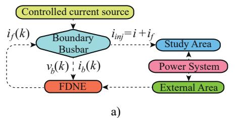
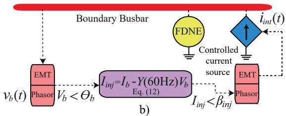
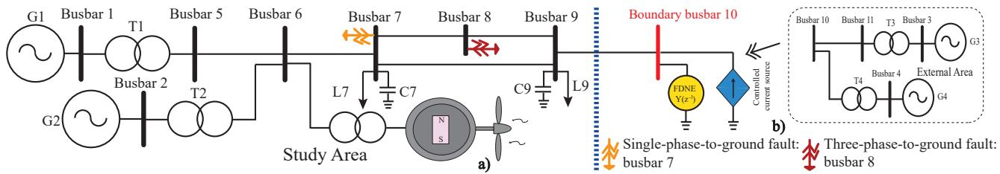
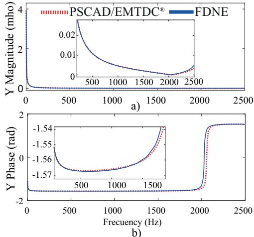
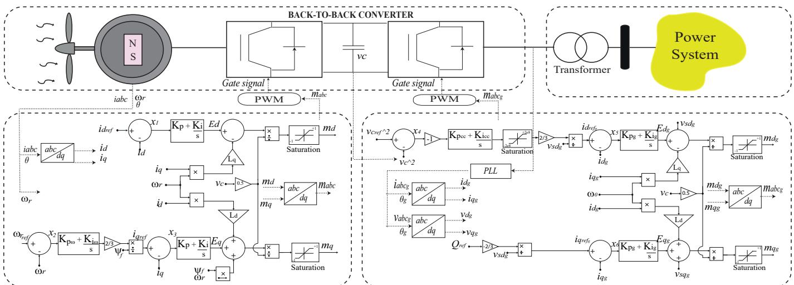
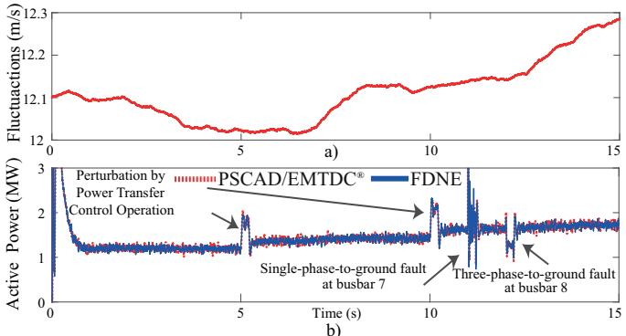
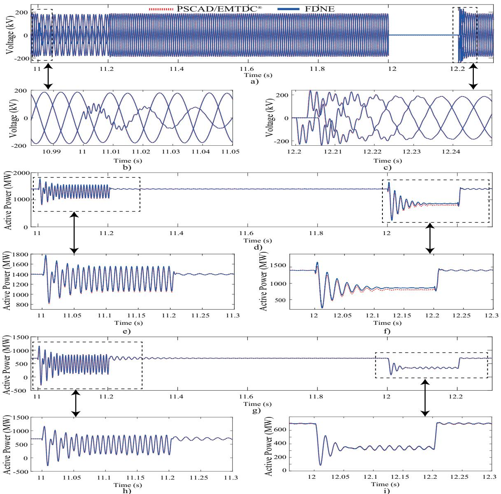
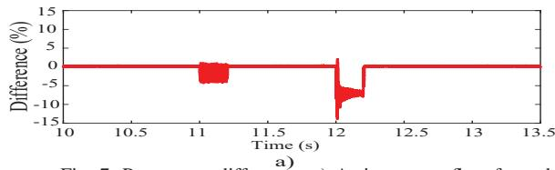
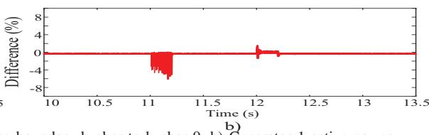

# Electromagnetic Transient Analysis Using a Frequency Dependent Network Equivalent for Power Systems Integrating Wind Generation Sources

Juan Manuel Verduzco-Duran, Aurelio Medina-Rios, Antonio Ramos-Paz, ´ Rafael Cisneros-Magana, Julio Cesar Godinez-Delgado ˜

Division de Estudios de Posgrado, Facultad de Ingenier ´ ´ıa Electrica, Universidad Michoacana de San Nicol ´ as de Hidalgo ´

Ciudad Universitaria, 58030, Morelia, Michoacan, M´ exico´

juan.verduzco@umich.mx, aurelio.medina@umich.mx, antonio.ramos@umich.mx,

rafael.magana@umich.mx, julio.godinez@umich.mx

Abstract—This article addresses the application of a reduced order representation for analysis of power systems with wind generation sources under fault conditions. A frequency-dependent network equivalent (FDNE) based on a rational function in the discrete-time is used to model the external area of the power system. The characterization of the frequency-dependent terminal admittance at the boundary busbar is carried out through the excitation of a constant voltage source at variable frequency modeled by a multisine signal. Parameter identification techniques based on the recursive least squares method are applied. Regarding the wind energy conversion system (WECS), a type-4 wind turbine based on a permanent magnet synchronous generator with a full-scale back-to-back converter is used. The WECS considers wind fluctuations and output active power generation variations. The performance of FDNE in terms of CPU time and accuracy is compared against to the full-order model response. The results are validated against the response obtained with the PSCAD/EMTDC® simulator.

Index Terms—Dynamic equivalent, EMT, frequency dependent network equivalent, reduced order representation, parameter identification, wind source.

# I. INTRODUCTION

Power systems are undergoing significant changes in both structure and operation as the power system expands and integrates power electronic devices, such as wind and photovoltaic generation, and nonlinear loads. These changes generate a wide spectrum of dynamic phenomena, from electromechanical transient events to electromagnetic transients (EMT). The use of simulation techniques with detailed models of the electric network components becomes important to the analysis of the electric system dynamic behavior [1], [2].

An alternative is the use of EMT simulation tools, which allows the evaluation of a wide frequency range from direct current (DC) to hundreds of kHz. These simulations require very small sampling intervals, usually around 50 ms, which entails a high computational burden. Also, detailed modeling of a full-order power system becomes prohibitive and decreases computational efficiency [3], [4]. Another efficient approach is dynamic equivalents techniques, which consist of the detailed modeling of a specific area of the electric system and the remaining components of the system are represented by a dynamic equivalent. Several research proposals for dynamic equivalents techniques have been addressed in the literature

[1], [5]. The techniques, initially emerging as solution to computational limitations in terms of memory and execution time [6], continue to be relevant today with technological advancements and improvements in computing capacity.

In 1960s, research began on a reduced order representation to analyze electromagnetic phenomena, focusing on frequency dependent network equivalents (FDNE). FDNE are used to approximate modeling the frequency-dependent terminal admittance of a network using an RLC parameter circuit model or a rational function [1], [7]. Hingorani and Burbery pioneered lumped parameter circuit model research in 1970 [8].

A rational function model is used as an adequate approximation to characterize the frequency-dependent admittance observed from a specific busbar [7]. In [9], the equivalent model is described as a filter, which is then converted into a Norton equivalent source and integrated into the study area model. This approach is subsequently extended to multiport systems [10]. A comparison of different methods for approximating rational functions is presented in [11] and [12]. There have been reports of methods based on vector fitting techniques [3], [4]. In [13], FDNE is obtained through a discrete-time rational function using recursive least squares identification.

In this work, an FDNE is applied to the analysis of transient electromagnetic phenomena in power systems including wind generation sources under fault conditions. The validation and comparison are carried out between the use of the reducedorder model and the full-order model, for a two-area power system. The focus of this application is to assess the computational efficiency, terms of CPU time and accuracy.

The rest of the paper is organized as follows: Section II shows the power system dynamic equivalent modeling; Section III describes the case study using the implementation of the FDNE in the test power system with wind generation sources under fault conditions; Section IV presents the conclusions obtained from this research work.

# II. POWER SYSTEM DYNAMIC EQUIVALENT MODELING

The power system is divided into two parts: the study area and the external area [9]. The study area is the region of interest in the power system, modeled in great detail, while

the rest of the network is represented by a FDNE. To obtain the FDNE (see Fig. 1a), voltage sources and current sources must consider short-circuit and open-circuit, respectively [13]. The boundary busbar is excited using a constant voltage source at variable frequency modeled by a multisine signal to perform parameter identification.

# A. Parameter Identification

Parameter identification is modeled through a discrete-time single-input single-output (SISO) system with input u(k) and output y(k), as described in [14]. The transfer function is

$$
\frac {y (k)}{u (k)} = Y (z ^ {- 1}) = \frac {b _ {1} z ^ {- 1} + b _ {2} z ^ {- 2} + \cdots + b _ {n} z ^ {- n}}{1 + a _ {1} z ^ {- 1} + a _ {2} z ^ {- 2} + \cdots + a _ {n} z ^ {- n}} (1)
$$

where z is the discrete-time shift operator, b and a are the coefficients of the numerator and denominator polynomial, respectively. Using (1), it can be observed that the output $y _ { k }$ at sample k is a function of previous input and output samples, so that:

$$
y (k) + a _ {1} y (k - 1) + a _ {2} y (k - 2) + \dots + a _ {n} y (k - n) = \tag {2}
$$

$$
b _ {1} u (k - 1) + b _ {2} u (k - 2) \dots b _ {n} u (k - n)
$$

where n denotes the order of both the numerator and denominator in (1); to (2) is equivalent to the form $\phi { = } X \theta { + } \nu ,$ taking into account that φ is the measurement vector, θ is the state vector, X is the matrix that relates the state and ν is the random noise vector. The θ is performed using the least squares method as [14]:

$$
\hat {\theta} = \left(X ^ {t} X\right) ^ {- 1} X ^ {t} \phi \tag {3}
$$

In (3), the inverse matrix evaluation may require a larger computational effort. To address this problem, the recursive least squares (RLS) method is used, which avoids the need to compute the inverse [13]. Eqs. (4) to (6) describe the RLS application, $K _ { k }$ gain (4) modulates the weight or influence of the difference between the actual measurement and its prediction $( \phi _ { k } - x _ { k } ^ { t } \ \theta _ { k - 1 } )$ , updating the parameter estimate $\theta _ { k } ,$ , eq. (6), the weighting is adjusted based on the previous error covariance matrix P and the weighting factor $\gamma ;$ where $P _ { k }$ represents the uncertainty of the system.

$$
K _ {k} = \frac {P _ {k - 1} x _ {k}}{\gamma + x _ {k} ^ {t} P _ {k - 1} x _ {k}} \tag {4}
$$

$$
P _ {k} = \frac {\left(I - K _ {k} x _ {k} ^ {t}\right) P _ {k - 1}}{\gamma} \tag {5}
$$

$$
\theta_ {k} = \theta_ {k - 1} + K _ {k} \left(\phi_ {k} - x _ {k} ^ {t} \theta_ {k - 1}\right) \tag {6}
$$

  
Fig. 1: FDNE: a) Flowchart, b) Boundary busbar connected to the FDNE.

# B. Multisine Signal

A multisine signal is the sum of multiple sinusoidal harmonics with programmable amplitudes and optimized phases. Mathematically, it can be defined as [9]:

$$
x (t) = \sum_ {k = 1} ^ {M} A _ {k} \sin \left(2 \pi f _ {k} t + \phi_ {k}\right), \quad f _ {k} = \frac {l _ {k}}{T} \tag {7}
$$

note that $T$ is the measurement period, $l _ { k }$ is a positive integer, $\phi _ { k }$ is the phase of the k-th component.

$$
\phi_ {m} = \phi_ {1} - 2 \pi \sum_ {k = 1} ^ {m - 1} (m - k) \cdot p _ {k}, \quad m = 2,.., M \tag {8}
$$

then, $M \ y p _ { k }$ are the number of frequency components and the relative power of the k-th component, respectively. Therefore, in order to characterize a multisine signal with a flat amplitude spectrum and spectral lines. Eq. (8) can be modified in the following form,

$$
\phi_ {m} = \phi_ {1} - \frac {m (m - 1)}{M} \pi , \quad m = 2, \dots , M \tag {9}
$$

# C. Representation of FDNE in the Power Systems

Evaluated FDNE can be connected to the power system by using the boundary busbar voltage. From (1) is obtain [13]:

$$
\begin{array}{l} I _ {f} (k) = - a _ {1} I _ {f} (k - 1) - a _ {2} I _ {f} (k - 2) - \dots - a _ {n} I _ {f} (k - n) \\ + b _ {1} V _ {b} (k - 1) + b _ {2} V _ {b} (k - 2) + \dots + b _ {n} V _ {b} (k - n) \tag {10} \\ \end{array}
$$

where $I _ { f }$ is the current output from FDNE. Using a constant current source is one way to study the steady-state parameters of the boundary busbar, given by

$$
I _ {b} \angle \delta_ {b} = \left(\frac {P _ {b} + j Q _ {b}}{V _ {b} \angle \theta_ {b}}\right) ^ {*} \tag {11}
$$

$$
I _ {i n j} \angle \beta_ {i n j} = I _ {b} \angle \delta_ {b} - Y (6 0 H z) V _ {b} \angle \theta_ {b} \tag {12}
$$

where $P _ { b } , Q _ { b } \ , \ V _ { b }$ and θ are the active and reactive power flows from the external area to the study area, the voltage and angle of the boundary busbar, respectively. It is necessary to eliminate the fundamental frequency from the FDNE, as it is included by the constant current source. Fig. 1b shows the boundary busbar connected to the FDNE.

  
Fig. 2: Modified Kundur two-area power system: a) Full-order model, b) Reduced order representation.

# III. CASE STUDY

The FDNE is applied to the Kundur two-area test power system connected to a type-4 wind turbine under fault conditions. The Kundur two-area power system is shown in Fig. 2. The system is divided into Areas 1 and 2 (see Figs. 2a and 2b, respectively), which is the study area and consists of the generators G1-G2 and the type-4 wind turbine and the external area with the generators G3-G4. The boundary busbar connecting both areas at busbar 10, as shown in Fig. 2b, which the reduced representation of the system, the external area is replaced by the FDNE. The parameters of the test power system and the type-4 wind turbine are gives in [15] and [16].

A type 4 wind turbine integrates a direct-drive permanent magnet synchronous generator (PMSG) and a full-scale backto-back converter, is used to represent the WECS, as illustrated in Fig. 3. The WECS is characterized by its design to generate 2 MW from the PMSG output power while maintaining a lineto-line voltage of 2500 V. This system assumes fluctuations in wind speed, as shown in Fig. 5a, as well as changes in power transfer control. To handle this situation reference angular velocity is reduced from 1 rad/s to 0.95 rad/s over the course of time from 5 to 5.2 sec. and further decreased from 0.95 rad/s to 0.9 rad/s in the interval of 10 to 10.2 sec.

In the study area, it assumes the application of a singlephase-to-ground fault at busbar 7 and a three-phase-to-ground fault at busbar 8, between 11 to 11.2 and 12 to 12.2 sec., respectively. In addition, the type-4 wind turbine is connected at busbar 6. Under these conditions, the system dynamic response

is analyzed over a simulation time of 15 sec. The objective is to assess the performance the FDNE-based reduced order representation and the full-order model in terms of CPU times and accuracy. The system is modeled at a time step of 512 time-steps per period at a fundamental frequency of 60 Hz.

# A. FDNE Frequency Response

The external area is characterized by port-1 FDNE. The multisine signal is modeled with a frequency sweep from 1 Hz to 2500 Hz with a frequency step of 2 Hz. Fig. 4a and 4b show the comparison of the magnitude and angle response of the external area, in function of frequency between FDNE and PSCAD/EMTDC®, respectively.

  
Fig. 4: Frequency response of the boundary busbar: a) Magnitude, b) Phase.

  
Fig. 3: Wind energy conversion system using a type-4 wind turbine connected to the power system.

Table I shows the mean square error (MSE) of magnitude and phase of the boundary busbar. The FDNE response shows a close agreement. A minimum difference in the admittance angle can be observed; the FDNE response tracks the variation of the admittance of the full-order system.

TABLE I: MSE of the boundary busbar test power system.   

<table><tr><td>Busbars</td><td>Order</td><td>Magnitude</td><td>Phase</td></tr><tr><td>Boundary busbar</td><td>200</td><td>1.2950e-7</td><td>0.0461</td></tr></table>

# B. FDNE Time-Domain Assessment in the Test Power System

Figs. 5a and 5b show the dynamic behavior of the WECS wind fluctuations and active power. An initial transient can be observed and it subsequently achieves its periodic steadystate. With the adjustment in the power transfer control, the active power output of the WECS generates approximately 1.8 MW. In addition, the transients caused by the proposed failures in the test power system can be observed. In general, an acceptable response of the FDNE can be noted in comparison with the PSCAD/EMTDC® response.

  
Fig. 5: Type-4 wind turbine: a) Wind fluctuations, b) WECS active power.

Fig. 6a presents the comparison of the voltage waveforms at busbar 8 between FDNE and the PSCAD/EMTDC® simulator. Figs. 6b and 6c show a detailed approach to the disturbances caused by the single-phase-to-ground fault at busbar 7, observed from busbar 8, and the three-phase-to-ground fault generated directly at busbar 8, respectively.

Fig. 6d illustrates the comparison of the active power flow from the boundary busbar to busbar 9 between FDNE the PSCAD/EMTDC®. Figs. 6e and 6f show a close-up of the faults generated at busbars 7 and 8, respectively. Observed from the perspective of the active power flow between the boundary busbar and busbar 9. Fig. 6g shows the comparison of the generator 1 active power between the full-order and the reduced order representation. Figs. 6h and 6i detail the transients by the single-phase-to-ground fault at busbar 7 and the three-phase-to-ground fault at busbar 8, respectively, seen from the active power generation of generator 1.

Fig. 7a and 7b show the percentage difference in active power flow from the boundary busbar to busbar 9 and the active power generation of generator 1, respectively, compared to the full-order model. It can be observed that as the fault is located closer to the FDNE, the error increases, although it remains within a close range for the reduced order representation.

The response of the FDNE is satisfactory, as it shows a good agreement with the full-order model. In terms of required CPU time, it is observed that the FDNE is approximately 1.62 times faster compared to the full-order model, with CPU times of 66.28 and 107.57 sec., respectively. Therefore, the application of FDNE proves to be an efficient alternative for the analysis of power systems with WECS integration.

# IV. CONCLUSIONS

This work has addressed the application of a reduced order representation based on FDNE for the analysis of power systems connected to WECS under fault conditions. The WECS has been represented by a type-4 wind turbine, considering wind fluctuations and changes in power transfer control.

Frequency response results through FDNE have been satisfactory over a wide frequency range of interest, showing greater accuracy in the magnitude and a minimum difference in the angle when evaluating the frequency-dependent admittance seen from the boundary busbar. Although there is a small angular difference, by applying FDNE in the test power system close agreement has been achieved responses compared to the PSCAD/EMTDC® response. Furthermore, a decrease in CPU time is observed when using the reduced order representation compared to the full-order model.

In the proposed case study, the FDNE showed satisfactory results in both the frequency and time-domain responses. The integration of a wind generation source in the study area showed satisfactory results when observing its dynamic behavior under various operating conditions.

# ACKNOWLEDGMENT

The authors gratefully acknowledge the facilities granted by the Universidad Michoacana de San Nicolas de Hidalgo through of the Division de Estudios de Posgrado of the ´ Facultad de Ingenier´ıa Electrica to conduct this research.´

# REFERENCES

[1] S. Subedi et al., “Review of Methods to Accelerate Electromagnetic Transient Simulation of Power Systems,” in IEEE Access, vol. 9, pp. 89714-89731, 2021.   
[2] C. Shah et al., “Review of Dynamic and Transient Modeling of Power Electronic Converters for Converter Dominated Power Systems,” in IEEE Access, vol. 9, pp. 82094-82117, 2021.   
[3] X. Lin, A. M. Gole and M. Yu, “A Wide-Band Multi-Port System Equivalent for Real-Time Digital Power System Simulators,” in IEEE Transactions on Power Systems, vol. 24, no. 1, pp. 237-249, 2009.   
[4] Y. Liang, X. Lin, A. M. Gole and M. Yu, “Improved Coherency-Based Wide-Band Equivalents for Real-Time Digital Simulators,” in IEEE Transactions on Power Systems, vol. 26, no. 3, pp. 1410-1417, 2011.   
[5] U. D. Annakkage et al., “Dynamic System Equivalents: A Survey of Available Techniques,” in IEEE Transactions on Power Delivery, vol. 27, no. 1, pp. 411-420, Jan. 2012.   
[6] P. Sowa and D. Zychma, “Dynamic Equivalents in Power System Studies: A Review,” Energies, vol. 15, no. 4, pp.1396, 2022.   
[7] B. Gustavsen, “Rational Function Approximation of Transformer Branch Impedance Matrix for Frequency Dependent White-Box Modelling, IEEE Transactions on Power Delivery, vol. 38, no. 5, pp. 3045- 3057, 2023.   
[8] N. G. Hingorani and M. F. Burbery, “Simulation of AC System Impedance in HVDC System Studies,” in IEEE Transactions on Power Apparatus and Systems, vol. PAS-89, no. 5, pp. 820-828, 1970.   
[9] A. Abur and H. Singh, “Time domain modeling of external systems for electromagnetic transients programs,” in IEEE Transactions on Power Systems, vol. 8, no. 2, pp. 671-679, May 1993.

  
Fig. 6: Dynamic analysis of the test power system: a) Voltage at busbar 8 with a zoomed-in view in b) and c), d) Active power flow from the boundary busbar to busbar 9 with a detailed focus in e) and f), g) Active power generation by generator 1 with a close-up in h) and i).

  
Fig. 7: Percentage difference: a) Active power flow from the boundary busbar to busbar 9, b) Generator 1 active power.

[10] M. Matar and R. Iravani, “A Modified Multiport Two-Layer Network Equivalent for the Analysis of Electromagnetic Transients, IEEE Transactions on Power Delivery, vol. 25, no. 1, pp. 434-441, 2010.   
[11] A. Ubolli and B. Gustavsen, “Comparison of Methods for Rational Approximation of Simulated Time-Domain Responses: ARMA, ZD-VF, and TD-VF,” in IEEE Transactions on Power Delivery, vol. 26, no. 1, pp. 279-288, Jan. 2011.   
[12] B. Gustavsen and H. M. J. De Silva, “Inclusion of Rational Models in an Electromagnetic Transients Program: Y-Parameters, Z-Parameters, S-Parameters, Transfer Functions,” in IEEE Transactions on Power Delivery, vol. 28, no. 2, pp. 1164-1174, April 2013.

[13] A. Thakallapelli, S. Ghosh and S. Kamalasadan, “Development and Applicability of Online Passivity Enforced Wide-Band Multi-Port Equivalents For Hybrid Transient Simulation,” in IEEE Transactions on Power Systems, vol. 34, no. 3, pp. 2302-2311, May 2019.   
[14] A. A. Girgis, J. Qiu and R. B. McManis, “A time-domain approach for distribution and transmission network modeling,” in IEEE Transactions on Power Delivery, vol. 5, no. 1, pp. 365-371, Jan. 1990.   
[15] P. Kundur, Power system stablility and control, McGraw-Hil, 1993.   
[16] N. Salgado et al., “THD Reduction in Wind Energy System Using Type-4 Wind Turbine/PMSG Applying the Active Front-End Converter Parallel Operation, Energies, vol. 11, no. 9, 2458, Sep 2018.