# Inclusion of Frequency-Dependent Soil Parameters in Transmission-Line Modeling

Antonio Carlos Siqueira de Lima, Member, IEEE, and Carlos Portela, Life Senior Member, IEEE

Abstract—This paper presents an analysis of transmission-line modeling when the soil conductivity and permittivity are treated as frequency dependent. It also presents a methodology to include this particular behavior on frequency-dependence realization of transmission lines and cables. The frequency-dependent soil parameters can be synthesized with a simple first-order model. It demands only three parameters statistically independent, one being associated with the low-frequency conductivity as obtained in conventional modeling and the other two are a function of the frequency dependence in soil conductivity and permittivity. The new formulas used for the ground return impedances for overhead lines and underground cables are presented. Instead of using an analytical approximation of the infinite integrals involved, a numerical approximation using a Gauss quadrature technique was implemented. These expressions can be understood as an extension of the well-known Carson and Pollaczek formulas. Three distinct cases are presented in order to asses the impact of frequency-dependent soil parameters with respect to the asymmetry of the circuit. The effect of frequency dependence in soil parameters is evaluated using frequency and time domain. In the frequency domain, modal analysis is applied to assess the overall impact in the ground mode propagation. To obtain the time-domain response, the line was modeled in the frequency domain using a phase-domain approach and a numerical Laplace transform was applied.

Index Terms—Electromagnetic transient analysis, power cables, soil measurements, transmission lines.

# I. INTRODUCTION

HERE has been a considerable evolution in the modeling T of frequency dependence of overhead transmission lines and underground cables. Although the frequency dependence of the ground and conductors impedances can be more easily dealt with in frequency-domain analysis, these days there are some models that can accurately take into account the frequency dependence in time-domain analysis. Independent of whether one uses the time-domain or frequency-domain approach, one point of paramount importance remains—the accuracy of the line parameters, namely, the impedance per unit of length and the admittance per unit of length. The former involves the skin effect on conductors and ground. Usually the ground parameters are poorly known as they have a wide range variation with some random phenomena, such as seasonal changes and the amount of water retained. Semlyen [1] presented a methodology to quan-

tify the effect of the variation of soil resistivity $\rho _ { s } ,$ , using the analytical relation between $\rho _ { s }$ and the line inductance, when the soil is treated as a good conductor and the complex plane approximation is assumed [2]. A recent study [3] shows, however, that except in the case of soil ionization, the soil behaves linearly although its conductivity $\sigma _ { s }$ and permittivity $\epsilon _ { s }$ are significantly frequency dependent [4]. Therefore, the good conductor assumption does not hold for a wide frequency range. For instance, in the lightning frequency range, above hundreds of kilohertz, $\omega \epsilon _ { s }$ can be of the same order of magnitude of $\sigma _ { s }$ . Furthermore, the usual assumption as a pure conductive soil is not suitable for induced effects and electromagnetic compatibility (EMC), including equipment and people safety [5].

An analysis of the influence of frequency-dependent soil parameters was presented in [4] using a quasimodes approach [6]. The frequency-dependent soil parameters were considered using the complex plane method where the ideal soil is at a depth $d _ { e } ~ = ~ 1 / \sqrt { j \omega \mu _ { 0 } ( \sigma _ { s } + j \omega \epsilon _ { s } ) }$ below actual soil in a procedure similar to the one presented in [2] but now replacing $\sigma _ { s }$ by $\sigma _ { s } + j \omega \epsilon _ { s }$ . This is fully justified by the fact that the parameter $\sigma _ { s } + j \omega \epsilon _ { s }$ appears directly in the frequency-domain Maxwell equations. So any correct result in the assumption of $\epsilon _ { s } = 0 \mathrm { m a y }$ be used for $\epsilon _ { s } \neq 0$ by replacing $\sigma _ { s }$ by $\sigma _ { s } + j \omega \epsilon _ { s } .$ . For frequencies up to some megahertz, this usually gives results close to those obtained with the Carson integral formula (also replacing $\sigma _ { s }$ by $\sigma _ { s } + j \omega \epsilon _ { s } )$ and mathematical manipulation is faster and easier. Such formulation corresponds to a first-order approach of asymptotic development of the Carson integral formula and, in most cases, gives an acceptable error. However, there may be cases where the error is larger, for instance, for high-resistivity ground, the maximum error is more than 10%. Therefore, in the present work, a stable and accurate numerical approximation of the Carson and Pollaczek integral is used. Another approximation used in [4] is the usage of a time-domain model based on modal domain with a constant transformation matrix, namely the quasimodes approach.

In the present work, we try to overcome both limitations as the line is modeled in phase coordinates in the frequency domain, and the time-domain responses are obtained via a numerical Laplace transform. In an attempt to produce a thorough analysis of the impact of soil parameters as a function of the asymmetry of the transformation matrix, three configurations are considered, namely: a single horizontal circuit, a double vertical circuit, and an underground cable circuit.

# II. GROUND MODELING

When the soil is treated as a conductor, as originally developed by Carson for overhead lines and Pollaczek for under-

ground cables, we must have a medium which is linear, homogeneous, and isotropic. These assumptions together with the transverse electromagnetic (TEM) or quasi-TEM propagation imply, in general, that the obtained solution has an acceptable error in a frequency range up to 1 MHz depending on the soil parameters, line geometry, and circuit length. For a very short line or very high frequency, above some megahertz, it is safer and more accurate to consider either a spherical wave approach, where the line conductors are represented via short-length elements with adequate boundary conditions, or use a procedure based on Hertz potentials and some mathematical approximations.

In this work, the impedance formulas are derived directly from the Maxwell equations, but assuming TEM or quasi-TEM propagation. The field equations were solved via a double spatial Fourier integral transform applied to the spatial dimensions. The Appendix provides more details on the formulation of ground return impedances for an underground cable. For an overhead line, the procedure is essentially the same, although not identical. In the following subsection, we present the ground impedance formulas used in this work.

# A. Ground Return Impedances

For overhead lines, the ground return self impedance is given by

$$
z _ {c _ {i i}} = \frac {j \omega \mu_ {0}}{\pi} \int_ {0} ^ {\infty} \frac {\exp (- 2 h _ {i} \xi)}{\xi + \sqrt {\xi^ {2} + \eta_ {s} ^ {2}}} d \xi \tag {1}
$$

while the mutual impedance is given by

$$
z _ {c _ {i j}} = \frac {j \omega \mu_ {0}}{\pi} \int_ {0} ^ {\infty} \frac {\exp (- (h _ {i} + h _ {j}) \xi)}{\xi + \sqrt {\xi^ {2} + \eta_ {s} ^ {2}}} \cos (d _ {i j} \xi) d \xi \tag {2}
$$

where $\eta _ { s } = \sqrt { j \omega \mu _ { o } ( \sigma _ { s } + j \omega \epsilon _ { s } ) } , d _ { i j }$ is the horizontal distance between conductor and conductor $j , h _ { i }$ is the conductor height, and $\sigma _ { s }$ and $\epsilon _ { s }$ are the soil conductivity and permittivity, respectively.

For underground cables, the ground return self impedance is given by

$$
\begin{array}{l} z _ {p _ {i i}} = \frac {j \omega \mu_ {0}}{2 \pi} [ K _ {0} (\eta_ {s} r) - K _ {1} (\eta_ {s} D _ {c}) \\ \left. + \int_ {- \infty} ^ {\infty} \frac {\exp \left(- 2 h _ {i} \sqrt {\xi^ {2} + \eta_ {s} ^ {2}}\right)}{| \xi | + \sqrt {\xi^ {2} + \eta_ {s} ^ {2}}} \exp (j r \xi) d \xi \right] \tag {3} \\ \end{array}
$$

while the mutual impedance is given by

$$
\begin{array}{l} z _ {p _ {i j}} = \frac {j \omega \mu_ {0}}{2 \pi} \left[ K _ {0} (\eta_ {s} d) - K _ {1} (\eta_ {s} D) + \right. \\ \left. + \int_ {- \infty} ^ {\infty} \frac {\exp \left(- \left(h _ {i} + h _ {j}\right) \sqrt {\xi^ {2} + \eta_ {s} ^ {2}}\right)}{| \xi | + \sqrt {\xi^ {2} + \eta_ {s} ^ {2}}} \exp (j d _ {i j} \xi) d \xi \right] \tag {4} \\ \end{array}
$$

where $d = \sqrt { d _ { i j } ^ { 2 } + ( h _ { i } - h _ { j } ) ^ { 2 } }$ and $D _ { c } = \sqrt { r ^ { 2 } + 4 h _ { i } ^ { 2 } }$ , is the conductor external radius, $h _ { i }$ is the depth of burial for conductor $i , d _ { i j }$ is the horizontal distance between conductor and $j , D =$ $\sqrt { d _ { i j } ^ { 2 } + ( h _ { i } + h _ { j } ) ^ { 2 } , \eta _ { s } }$ is the same as above, and $K _ { 0 } ( . ) , K _ { 1 } ( . )$ are Bessel functions.

Equations (1) and (2) can be considered an extension of the Carson impedance formula for complex ground parameters. The same reasoning is true for underground cables assuming $\epsilon _ { s } = 0$ and $\sigma _ { s } = \sigma _ { 0 }$ , thus $\eta _ { s } = \sqrt { j \omega \mu _ { 0 } \sigma _ { 0 } }$ .

All of the definite integrals in (1)–(4) were evaluated numerically using a Gauss quadrature procedure (a Gauss–Kronrod algorithm was used [7]). The basic idea behind Gaussian quadrature is to evaluate an integral as a linear combination of values of the integrand calculated at specific points. Thus

$$
\int_ {a} ^ {b} f (x) d x = \sum_ {i = 1} ^ {n} w _ {i} f \left(x _ {i}\right) \tag {5}
$$

to obtain the best numerical estimate of an integral, we must pick optimal abscissas $x _ { i }$ at which to evaluate the function $f ( x )$ . The fundamental theorem of Gaussian quadrature states that the optimal abscissas of the -point Gaussian quadrature formulas are precisely the roots of the orthogonal polynomial for the same interval and weighting function. The weights corresponding to the Gaussian abscissas are calculated via a Lagrange interpolating polynomial for $f ( x )$ with

$$
\pi (x) = \Pi_ {j = 1} ^ {m} (x - x _ {j}). \tag {6}
$$

This algorithm is an adaptive method in which the error is estimated based on evaluating the function at some particular points. Kronrod defined in 1964 [8] how to identify these points based on a Legendre–Gauss quadrature [9].

# B. Frequency-Dependent Soil Parameters

A simple minimum phase function is used for the realization of the frequency dependence of soil parameters. It demands three statistically independent elements, one being associated with the low-frequency conductivity $\sigma _ { 0 } .$ , as obtained by common measurement procedures and the other two with the frequency dependence of both $\sigma _ { s }$ and $\omega \epsilon _ { s }$ [5]. Thus

$$
\sigma_ {s} + j \omega \epsilon_ {s} \approx \kappa^ {\prime} = \sigma_ {0} + \delta_ {\sigma_ {s}} + j \delta_ {\omega \epsilon_ {s}} \tag {7}
$$

where $\sigma _ { 0 }$ is the low-frequency soil conductivity in $S / m$ as obtained by conventional techniques. Despite its simplicity, this model has proven useful in several soil samples obtained at eight different sites in Brazil, covering distinct soil and geological structures. A detailed description of the measurement procedure is presented in [3], including experimental setup, methods for soil sampling, and checking physical consistency (i.e., propagation speed at any given frequency below the speed of light). For the sake of clarity, the basic aspects of this procedure are summarized here: to minimize the effects of local soil heterogeneity and the samples must keep their structure and humidity. The measurements depend on whether the soil is clay, sand, or rock.

After the measurements, the soil samples were fitted to a curve assuming

$$
\delta_ {\sigma_ {s}} + j \delta_ {\omega \epsilon_ {s}} = \Delta_ {i} \cdot \left(\frac {f}{1 0 ^ {6}}\right) ^ {\alpha} (\cot (\alpha \pi / 2) + j) \tag {8}
$$

where $\Delta _ { i }$ is in $S / m$ and together with is responsible for the frequency dependence of soil conductivity and permittivity. To

evaluate the probability density functions associated with parameters $\Delta _ { i }$ and $\alpha ,$ Weibull approximations were considered. The boundary conditions are related to $\kappa ^ { \prime }$ and not only or independent as the soil has immittance characteristics, thus the frequency dependence in both and is treated altogether. These conditions were formulated in the frequency domain following the procedures presented in [10].

For practically all of the large numbers of soil samples, covering different soil types and geological structures in a frequency range up to 2 MHz, this type of formula reproduces measured frequency dependence within measurement errors and local soil heterogeneity effects [3], [5]. With this type of formula, there is statistical independence between the three parameters $\sigma _ { 0 } , \alpha$ , and $\Delta _ { i }$ . The statistical distribution of parameters $\sigma _ { 0 } , \alpha .$ , and $\Delta _ { i }$ has some interesting properties. While the measurements in $\sigma _ { 0 }$ may differ in several orders of magnitude, the term $\delta _ { \sigma _ { s } } + j \delta _ { \omega \epsilon _ { s } }$ has a much narrower spread. As discussed in [5], for most purposes, it may be acceptable to consider median values for both $\Delta _ { i }$ and $\alpha ,$ while $\sigma _ { 0 }$ is based upon specific measurements in a first analysis. For the test cases presented here, we have chosen a specific set of measurements in one site in Brazil for which $\sigma _ { 0 } = 8 4 . 1 6 \mu \mathrm { S } / \mathrm { m } , \Delta _ { i } = 8 . 9 2 0 2 8 \mathrm { m S } / \mathrm { m }$ , and $\alpha = 0 . 7 1 6 0 3$ . Thus, for $\kappa ^ { \prime }$ in S/m and with $\omega$ in rad/s

$$
\kappa^ {\prime} = 8 4. 1 6 1 0 ^ {- 6} + \omega^ {0. 7 1 6 0 3} (0. 0 5 7 8 4 9 + j 0. 1 2 0 9 7) 1 0 ^ {- 6}. \tag {9}
$$

The median values of $\Delta _ { i }$ and in a large number of measurements, covering very different types of soil, are, respectively, 11.7094 mS/m and 0.705519. We must point out that although, in principle, a better fitting with measurement can be obtained with a higher order functions, special care must be taken to ensure physical consistency of the model and to avoid the effects of local heterogeneities in the soil samples. Further details regarding the fitting of soil parameters and the experimental setup and results can be found in [5] and [11].

# III. LINE MODELING

The transmission lines are represented via the well-known nodal admittance matrix. For a line length , the characteristic admittance $Y _ { c }$ and propagation matrix , which are calculated using the line-impedance per unit of length and the line admittance per unit of length , are defined as

$$
\begin{array}{l} Y _ {c} = Z ^ {- 1} \sqrt {Z Y} \\ A = \exp (- l \sqrt {Z Y}) \tag {10} \\ \end{array}
$$

For transmission lines, can be written as

$$
Z = Z _ {i} + Z _ {\text {e x t}} + Z _ {g} \tag {11}
$$

where $Z _ { i }$ is the internal conductor impedance, $Z _ { \mathrm { e x t } }$ is the ideal external impedance, and $Z _ { g }$ is the ground return impedance, all matrices per unit of length. When Corona is neglected, the insulator surface is assumed clean, and pollution effects and other insulator losses are negligible, can be assumed, for most purposes, to be proportional to the angular frequency .

For underground cables, all of the impedances per unit of length are assembled in a matrix according to [12] and [13]. The inclusion of frequency-dependent parameters should also affect

as a new capacitance will appear between the actual ground and the point where the voltage can be considered zero. However, there are some questions regarding an accurate formula to take this effect into account and this topic is open for further research.

The matrix square root and matrix exponential can be calculated using eigenvalue/eigenvector decomposition or directly in the phase domain via Schur Decomposition. There are some other possibilities to calculate the matrix square root; for instance, an iterative mapping [14]. If is a square matrix, its square root can be calculated as

$$
B = B \cdot (B \cdot B + 3 W) (3 B \cdot B + W) ^ {- 1}
$$

where the initial guess for is an identity matrix. Although not used in the present work, this iterative procedure is quite efficient in obtaining the matrix square root. Schür decomposition was used for the evaluation of the matrix square root involved in the line modeling. Also, the nodal admittance was calculated directly in the phase domain without resorting to eigenvalue/eigenvector decomposition. The line nodal admittance matrix $Y _ { n }$ is then given by

$$
Y _ {n} = \left[ \begin{array}{c c} Y _ {c} (U + A ^ {2}) (U - A ^ {2}) ^ {- 1} & - 2 Y _ {c} A (U - A ^ {2}) ^ {- 1} \\ - 2 Y _ {c} A (U - A ^ {2}) ^ {- 1} & Y _ {c} (U + A ^ {2}) (U - A ^ {2}) ^ {- 1} \end{array} \right] \tag {12}
$$

where is the identity matrix.

# IV. TEST CASES

For an evaluation of the impact of frequency-dependent soil parameters in line modeling, three test cases are considered: a single horizontal circuit, a vertical double circuit, and an underground cable system. The goal is to assess the impact of the soil parameters as a function of the system asymmetry. In all subsequent figures, the label $\sigma _ { 0 }$ is used for conventional soil usage while $\kappa ^ { \prime }$ is applied to frequency-dependent soil as defined by (9). Both the classical soil usage and the complex one use the numerical integration for the evaluation of the definite integrals and both approaches represent the line using (12).

Both overhead lines tests use EHS ground wires and all phase conductors have $R _ { d c } = 0 . 0 3 2 6 ~ \Omega \mathrm { m }$ and conductor diameter 29.765 mm. For the double circuit, each phase has a bundle of four conductors. The underground system consists of three single-core cables with sheath but without armor. Fig. 1 shows the configuration tested. Table I shows the conductors data for the underground system. In that table, $\epsilon _ { c s }$ and $\epsilon _ { s g }$ are the insulation permittivities (core to sheath and sheath to ground), while $\rho _ { s }$ and $\rho _ { c }$ are, respectively, the sheath and the core conductor resistivity.

# A. Modal Propagation

The modal propagation parameters were calculated using a complex and frequency-dependent transformation matrix. To avoid artificial-mode switchover, a switch back procedure based on [15] was used. For all cases tested, including some tests that are not shown in the paper, it was found that the inclusion of the ground parameters frequency dependency has a negligible effect in the transformation matrix and can only be noted for frequencies above 1 MHz.

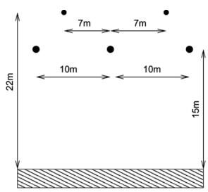  
(a)

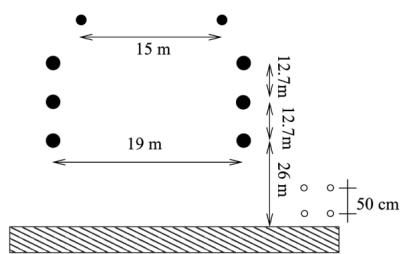

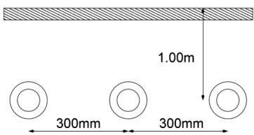

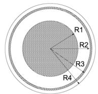  
(d)   
Fig. 1. Test cases: (a) horizontal circuit, (b) double vertical circuit, (c) underground cables, and (d) single-core cable.

TABLE I UNDERGROUND CABLE SYSTEM DATA   

<table><tr><td>R1(mm)</td><td>R2(mm)</td><td>R3(mm)</td><td>R4(mm)</td></tr><tr><td>19.50</td><td>37.75</td><td>37.97</td><td>42.50</td></tr><tr><td>εcs</td><td>εsg</td><td>ρs</td><td>ρc</td></tr><tr><td>2.85</td><td>2.51</td><td>1.718 10-8Ωm</td><td>3.365 10-8Ωm</td></tr></table>

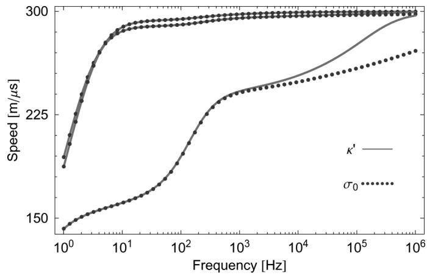  
Fig. 2. Modal velocities for horizontal circuit.

Fig. 2 shows the modal propagation velocities for the horizontal circuit. In that figure, we see that, as expected, mainly the ground mode is affected. The modal damping is shown in Fig. 3 and again the mode with the higher damping (i.e. ground mode), is the most affected. A similar behavior was also found for the double vertical circuit (Figs. 4 and 5). Although not shown in this paper, tests on other overhead transmission configurations have also presented similar behavior.

For underground cable, the mismatch is considerably smaller as can be seen in Fig. 6 for the modal velocities and in Fig. 7 for the modal damping. This is not an unexpected result as the sheath provides a shielding effect, thus decreasing the impact of the soil parameters.

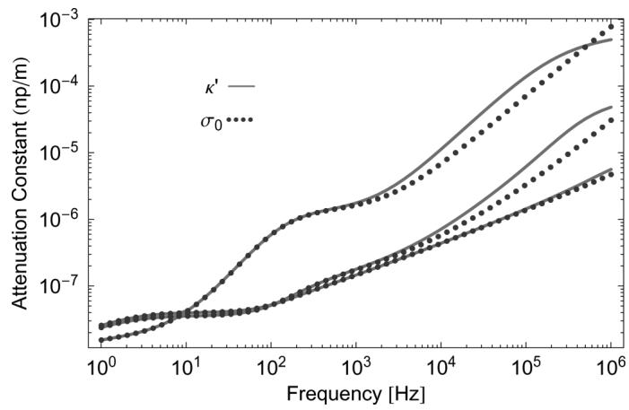  
Fig. 3. Modal damping for horizontal circuit.

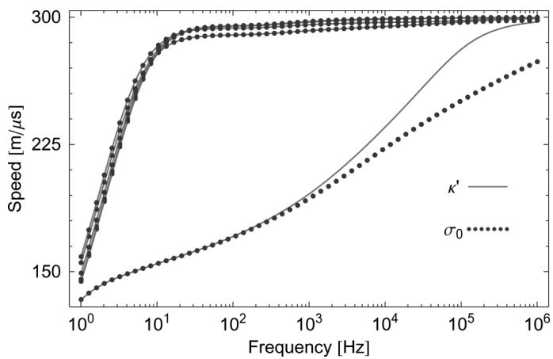  
Fig. 4. Modal velocities for double vertical circuit.

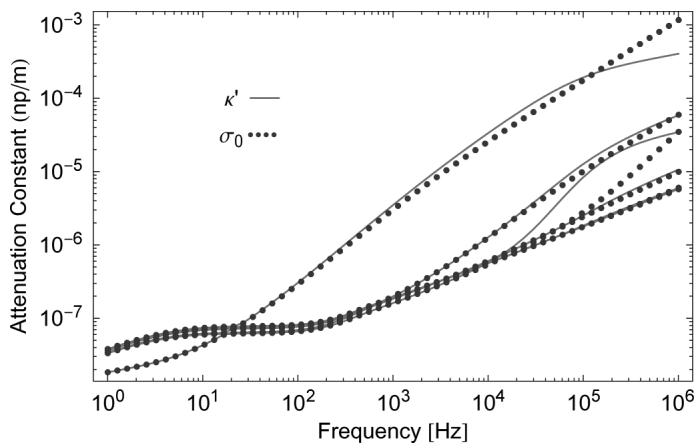  
Fig. 5. Modal damping for double vertical circuit.

# B. Time-Domain Results

To evaluate the impact of the proposed ground parameters representation, a step voltage was applied at one terminal while all of the others remained open. Fig. 8 shows the circuit used to test all line configurations as well as the terminal labeling for each case.

Fig. 9(a) and (b) shows the voltage at terminal 4 and $^ { 6 , }$ respectively. At terminal 4, the inclusion of $\kappa ^ { \prime }$ in the line parameters led only to higher damping. At terminal 6, on the other hand, the

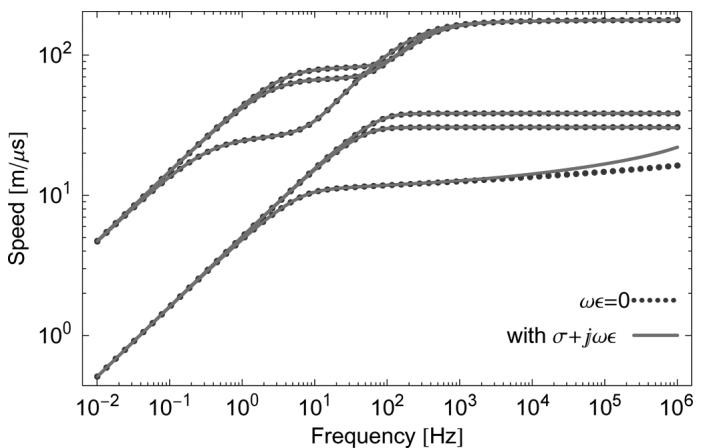  
Fig. 6. Modal velocities for underground cables.

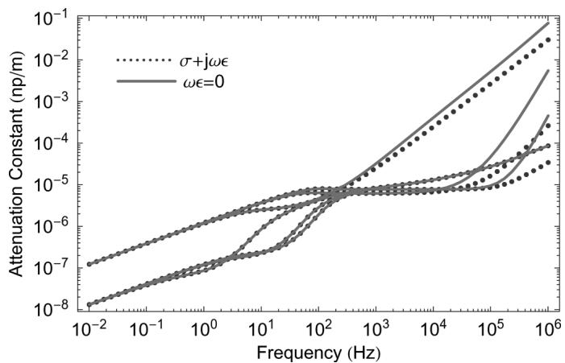  
Fig. 7. Modal damping for underground cables.

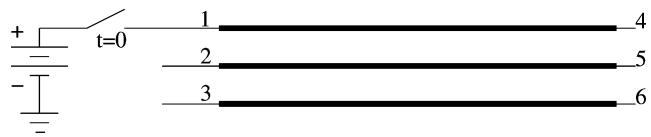  
(a)

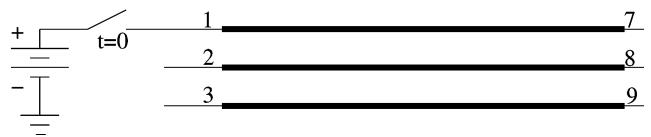

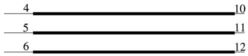  
  
Fig. 8. Circuit used to test the line response. (a) Circuit for horizontal line. (b) Circuit for the double circuit vertical line and underground cable.

induced voltage presents a distinct behavior and there is higher damping also but the waveforms present some significant differences. In terms of the highest overvoltage, there is no distinction among the waveform in the figures since the fastest mode is not affected by the ground parameters.

The results for the double vertical circuit are shown in Fig. 10(a) and (b). For the voltage at terminal 7, the result is essentially the same as in the previous test. For the induced

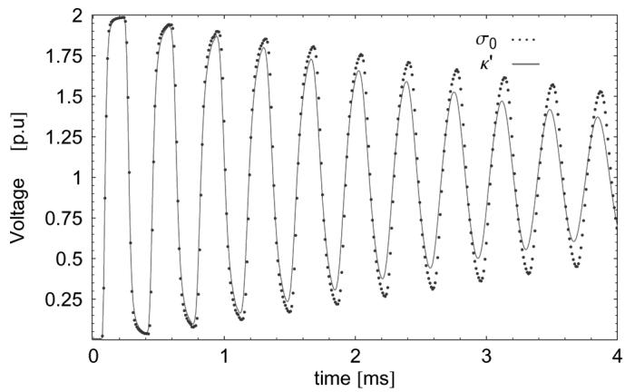  
(a)

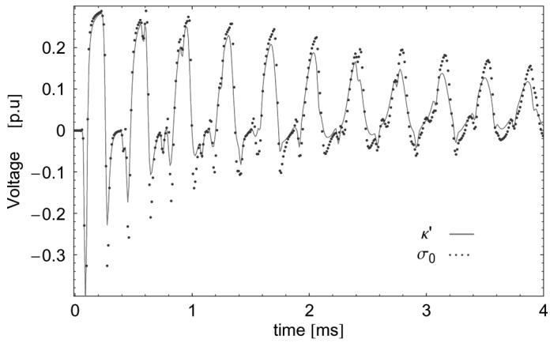  
  
Fig. 9. Voltage output for the horizontal circuit. (a) Voltage at terminal 4. (b) Voltage at terminal 6.

voltage, there is nevertheless a sensible difference as can be seen in Fig. 10(b). The waveforms in the mentioned figure differ in terms of damping and highest values. This result indicated that whenever induced voltages are of concern, there should be greater care regarding the ground parameters.

For the underground system the differences are not so pronounced since the modal propagation and attenuation are quite similar regardless of the ground representation. Fig. 11 shows the voltage at terminal 12 of the underground cable system.

# V. CONCLUSION

This work has focused on testing and analyzing the overall impact of ground parameters (namely, the ground conductivity and permittivity) on transmission-line modeling and transient behavior. It has presented extensions of ground return impedances formula for both overhead transmission circuits and underground cable systems.

The transient behavior of any transmission line depends on ground parameters, which are strongly frequency dependent and, in principle, must be obtained by measurement. The most common procedures assume that ground conductivity is constant (frequency independent) and neglect ground permittivity. These assumptions are quite far from reality and may lead to important errors in the computed transient of transmission lines. The time-domain step responses showed that some noticeable difference can be found in all phases.

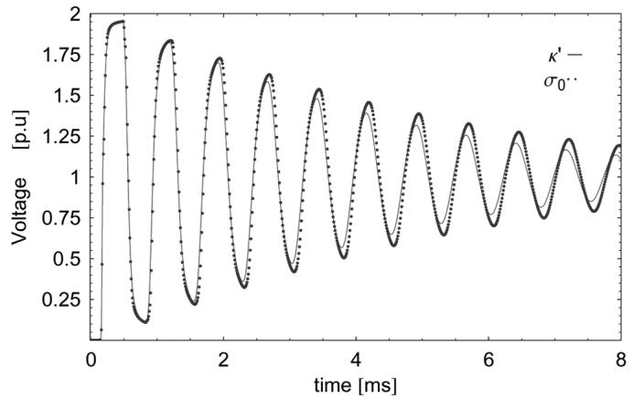

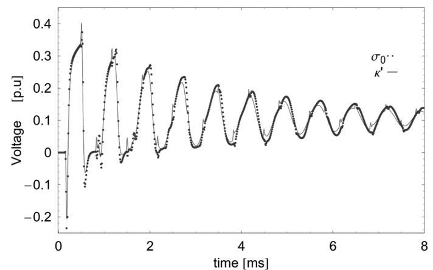  
  
(b)

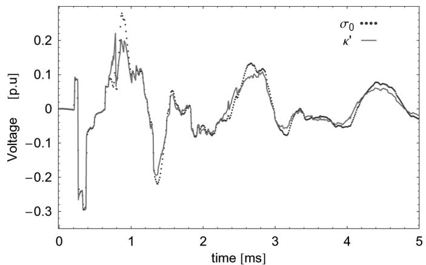  
Fig. 10. Voltage output for double vertical circuit. (a) Voltage at terminal 7. (b) Voltage at terminal 12.   
Fig. 11. Sheath overvoltage due to step voltage in the core of the first cable.

Measurements performed in a large number of soils, covering different types of soil, have enabled identifying some important properties of frequency behavior of soil parameters. Namely, it has been found that it is possible to consider for soil parameters, in what concerns frequency dependence, two independent terms, one related to soil conductivity at low frequency, that correspond to the most common measurement procedures, and others related to frequency dependence of both conductivity and permittivity, which is not usually considered. This behavior allows deriving fairly accurate ground parameters based only on measurements of the low-frequency conductivity while for the

frequency dependence of the ground parameters, a general statistical distribution can be considered.

The ground return impedances were calculated using Gauss quadrature techniques which cause the overall process to be considerably slow. Nevertheless, the inclusion of the frequency dependence of $\sigma$ and $\omega \epsilon$ in the modified Carson and Pollaczek equations have not caused any extra numerical burden. In fact, the inclusion of this phenomenon increased the rate of convergence of the numerical integral. The authors believe this result stresses the fact that higher accuracy can improve the numerical performance of a model.

The inclusion of the ground permittivity will also affect the line/cable admittance per unit of length. However, this tends to be more important in underground cables as the conductors’ geometrical distances are smaller and is a subject for future research as the present work deals mainly with the impact of ground conductivity and permittivity frequency dependence on the line-series impedance per unit of length and their impact on line behavior.

As for the high-frequency range, above some hundreds of kilohertz, $\omega \epsilon _ { g }$ becomes considerably larger than $\sigma _ { g } ,$ it is interesting to further test the modeling presented here in surge cases or in nonuniform transmission lines (i.e., involving tower impedance and grounding).

# APPENDIX

# FORMULATION OF GROUND RETURN IMPEDANCES

The ground return impedances are calculated under the following assumptions: time functions are of harmonic type $\exp ( j \omega t )$ , the propagation along the line and surrounding media is exponential of the $\exp ( - k z )$ type, where is the direction of propagation and is the unknown propagation function. All media are supposed linear, isotropic, and homogeneous. Thus, the impedances can be found directly from the solution of Maxwell’s equations, which lead to the following:

$$
\nabla \times E = - j \omega \mu H
$$

$$
\nabla \times H = J + j \omega \epsilon E
$$

$$
\nabla \cdot E = 0. \tag {13}
$$

Furthermore

$$
\nabla \times \nabla E = - \nabla^ {2} E = - j \omega \mu (\sigma + \omega \epsilon) E. \tag {14}
$$

If we consider $E _ { a }$ , the electric field in the air and $E _ { g }$ the electric field in the ground, (14) can be divided into two equations

$$
\nabla^ {2} E _ {a} = 0 \quad y \geq 0 \tag {15}
$$

$$
\nabla^ {2} E _ {g} = \eta_ {g} ^ {2} E _ {e} + j \omega I \delta (x - x _ {f}) \delta (t - t _ {f}) \quad t \geq 0 \tag {16}
$$

where $\eta _ { g } \ : = \ : j \omega \mu ( \sigma + j \omega \epsilon ) , ( x _ { f } , t _ { f } )$ is the coordinate of the conductor, thus $t _ { f }$ is the conductor depth $y _ { f } = - t _ { f }$ (the negative -axis is the -axis) and is the current in the conductor. The boundaries conditions are

$$
E _ {a} = E _ {g} = E _ {0} \quad y = 0 \tag {17}
$$

$$
\frac {1}{\mu_ {a}} \frac {\partial E _ {a}}{\partial y} = \frac {1}{\mu_ {g}} \frac {\partial E _ {g}}{\partial y} = - \frac {1}{\mu_ {s}} \frac {\partial E _ {g}}{\partial t} \quad t = 0. \tag {18}
$$

The third boundary condition is that all fields vanish at infinity $( \mathrm { e . g . } , E _ { a } = E _ { g } = 0 \mathrm { f o r } x  \infty )$ . To solve (16), a bidimensional Fourier transform is applied to the coordinates and . For the -axis

$$
F (\alpha) = \int_ {\infty} ^ {\infty} f (x) \exp (- j \omega x) d x. \tag {19}
$$

For the -axis, a Fourier sine transform is applied

$$
F _ {s} (\lambda) = \int_ {0} ^ {\infty} f (y) \sin (y) d y. \tag {20}
$$

For the air, and are used as coordinates, thus

$$
\overline {{E _ {a}}} = \int_ {- \infty} ^ {\infty} E _ {a} \exp (- j \alpha) d x
$$

$$
\overline {{\bar {E _ {a}}}} = \int_ {0} ^ {\infty} \bar {E _ {a}} \sin (\lambda y) d y. \tag {21}
$$

Applying the Fourier transform to leads to the following for the electric field in the air:

$$
- \alpha^ {2} \overline {{E _ {a}}} + \frac {\partial^ {2} \overline {{E _ {a}}}}{\partial y ^ {2}} = 0. \tag {22}
$$

Using the sine transform in (22) leads to

$$
\overline {{\overline {{E _ {a}}}}} = \frac {\lambda}{\alpha^ {2} + \lambda^ {2}} \overline {{E _ {0}}}. \tag {23}
$$

For the ground, we have and as coordinates and

$$
\overline {{E _ {g}}} = \int_ {- \infty} ^ {\infty} E _ {g} \exp (- j \alpha x) d x
$$

$$
\overline {{\overline {{E _ {g}}}}} = \int_ {0} ^ {\infty} \overline {{E _ {g}}} \sin (\lambda t) d t. \tag {24}
$$

By a similar process, we reach the following:

$$
- \alpha^ {2} \overline {{E _ {g}}} + \frac {\partial^ {2} \overline {{E _ {g}}}}{\partial y ^ {2}} = \eta_ {g} ^ {2} \overline {{E _ {g}}} + j \omega \mu_ {g} I \exp (- j \alpha x) \delta (t - t f)
$$

$$
\left(\alpha^ {2} + \eta^ {2} + \lambda^ {2}\right) \overline {{\overline {{E _ {g}}}}} = \lambda \overline {{E _ {0}}} - j \omega \mu_ {g} I \exp (- j \alpha x _ {f}) \sin (\lambda t _ {f}). \tag {25}
$$

Using $\theta ^ { 2 } = \alpha ^ { 2 } + \eta _ { g } ^ { 2 } .$ , we can write

$$
\overline {{\overline {{E _ {e}}}}} = \frac {\lambda}{\theta^ {2} + \lambda^ {2}} \overline {{E _ {0}}} - j \omega \mu_ {g} I \exp (- j \alpha x) \frac {s i n (\lambda t _ {f})}{\theta^ {2} + \lambda^ {2}}. (2 6)
$$

Applying the inverse sine transform, we obtain

$$
\overline {{E _ {a}}} = \frac {2}{\pi} \overline {{E _ {0}}} \int_ {0} ^ {\infty} \frac {\lambda \sin (y \lambda)}{\alpha^ {2} + \lambda^ {2}} d \lambda
$$

$$
\overline {{E _ {g}}} = \frac {2}{\pi} \overline {{E _ {0}}} \int_ {0} ^ {\infty} \frac {\lambda \sin (y \lambda)}{\alpha^ {2} + \lambda^ {2}} d \lambda + \kappa \tag {27}
$$

Authorized licensed use limited to: Tsinghua University. Downloaded on April 10,2026 at 03:51:25 UTC from IEEE Xplore. Restrictions apply.

where

$$
\kappa = - j \frac {2 \omega \mu_ {g}}{\pi} I \exp (- j \alpha x _ {f}) \int_ {0} ^ {\infty} \frac {\sin (t _ {f} \lambda) \sin (t \lambda)}{\theta^ {2} + \lambda^ {2}} d \lambda .
$$

After some manipulation, we obtain for $\overline { { E _ { 0 } } }$

$$
\overline {{E _ {0}}} = - j \frac {\omega \mu_ {g} I \exp (- j \alpha x _ {f}) \exp \left(- t _ {f} \sqrt {\alpha^ {2} + \eta_ {g} ^ {2}}\right)}{| \alpha | + \sqrt {\alpha^ {2} + \eta_ {g} ^ {2}}}. (2 8)
$$

The final solution of $E _ { a }$ and $E _ { g }$ is achieved by applying the inverse Fourier transform using $\overline { { E _ { 0 } } }$ as defined in (28), which gives for $E _ { a }$

$$
E _ {a} = - \frac {j \omega I}{\pi} \int_ {0} ^ {\infty} \frac {\exp \left(y \alpha + y _ {f} \sqrt {\alpha^ {2} + \eta^ {2}}\right)}{\frac {1}{\mu} \alpha + \frac {1}{\mu} \sqrt {\alpha^ {2} + \eta^ {2}}} \cos (\alpha (x - x f)) d \alpha \tag {29}
$$

while for $E _ { g }$

$$
E _ {g} = - \frac {j \omega \mu_ {g} I}{2 \pi} \left(K _ {0} \left(\eta_ {g} D\right) - K _ {0} \left(\eta_ {g} D ^ {\prime}\right) + 2 \chi\right) \tag {30}
$$

where

$$
\chi = \int_ {0} ^ {\infty} \frac {\exp (y - h) \sqrt {\alpha^ {2} + \eta^ {2}})}{\frac {\mu_ {q}}{\mu_ {a}} \alpha + \sqrt {\alpha^ {2} + \eta^ {2}}} \cos (\alpha x) d \alpha \tag {31}
$$

and $D = { \sqrt { x ^ { 2 } + ( y + h ) ^ { 2 } } } , D ^ { \prime } = { \sqrt { x ^ { 2 } + ( y - h ) ^ { 2 } } }$ , is the depth of burial of the cable. The ground return impedance can be defined by

$$
Z _ {g} = - \frac {E _ {g}}{I}. \tag {32}
$$

For $x _ { p } = r$ and $y _ { p } = - h$ , where is the outer radius of the conductor, this formula leads to (3) shown in the paper.

The procedure for overhead lines is similar to the one presented here. Although, for overhead lines, the sources are in the air.

# REFERENCES

[1] A. Semlyen, “Accuracy limits in the computed transients on overhead lines due to inaccurate ground return modeling,” IEEE Trans. Power Del., vol. 17, no. 3, pp. 872–878, Jul. 2002.   
[2] A. Deri, G. Tevan, A. Semlyen, and A. Castanheira, “The complex ground return plane: a simplified model for homogeneous and multilayer earth return,” IEEE Trans. Power App. Syst., vol. PAS-100, no. 8, pp. 3686–3693, Aug. 1981.   
[3] C. Portela, “Frequency and transient behaviour of grounding systems: physical and methodological aspects, part I and part II,” in Proc. IEEE Int. Symp. Electromagnetic Compatibility, Austin, TX, Aug. 1997, pp. 379–390.   
[4] C. Portela, M. Tavares, and J. Pissolato, “Accurate representation of soil behaviour for transient studies,” Proc. Inst. Elect. Eng., Gen. Transm. Distrib., vol. 150, no. 6, pp. 736–744, Nov. 2003.   
[5] C. Portela, “Influence in lightning effects of soil electromagnetic behavior in frequency domain,” in Proc. Int. Conf. Lightning Protection, Cracow, Poland, Sep. 2002, vol. I, pp. 394–399.   
[6] M. C. Tavares, J. Pissolato, and C. Portela, “Quasi-modes three-phase transmission line model-transformation matrix equations,” Int. J. Elect. Power Energy Syst., vol. 23, no. 4, pp. 323–331, May 2001.   
[7] W. Press, S. Teukolsky, W. Vettering, and B. Flannery, Numerical Recipes in Fortran 77, 2nd ed. Cambridge, U.K.: Cambridge Univ. Press, 1996.

[8] A. S. Kronrod, “Nodes and weights for quadrature formulae. Sixteenplace tables.” Consultants Bureau, 1965.   
[9] E. W. Weisstein, “Gauss-Legendre quadrature,” MathWorld—A Wolfram Web Resource. [Online]. Available: http://www.mathworld.wolfram.com/Gauss-KronrodQuadrature.html.   
[10] H. W. Bode, Network Analysis and Feedback Amplifier Design. New York: Van Nostrand, 1945.   
[11] C. Portela and M. Tavares, “Modeling, simulation and optimization of transmission lines. Applicability and limitations of some used procedures,” presented at the Transmission and Distribution Conf., 2002.   
[12] L. M. Wedepohl and D. J. Wilcox, “Transient analysis of underground power-transmission system—system model and wave propagation characteristics,” Proc. Inst. Elect. Eng., vol. 120, no. 2, pp. 253–260, 1973.   
[13] A. Ametani, “A general formulation of impedance and admittance of cables,” IEEE Trans. Power App. Syst.,, vol. PAS-99, no. 3, pp. 902–910, May 1980.   
[14] M. Trott, The Mathematica GuideBook. New York: Springer-Verlag, 2004.   
[15] L. M. Wedepohl, H. V. Nguyen, and G. W. Irwin, “Frequency-dependent transformation matrices for untransposed transmission line using a Newton-Raphson method,” IEEE Trans. Power Syst., vol. 11, no. 3, pp. 1538–1546, Aug. 1996.

Antonio Carlos Siqueira de Lima (S’95–M’00) was born in Rio de Janeiro, Brazil, in 1971. He received the B.Sc., M.Sc., and Ph.D. degrees in electrical engineering from the Federal University of Rio de Janeiro (UFRJ) in 1995, 1997, and 1999, respectively.   
Currently, he is an Associate Professor with the Electrical Engineering Department, Federal University of Rio de Janeiro. In 1998, he was a Visiting Scholar in the Department of Electrical and Computer Engineering, the University of British Columbia, Vancouver, BC, Canada. From 2000 to 2002, he was with the Brazilian Independent System Operator, ONS, Rio de Janeiro, Brazil, dealing with electromagnetic transient studies for the Brazilian National Grid. His main interests are electromagnetic transient analysis in power systems and analysis of electromagnetic fields.

Carlos Portela (SM’68–LSM’02) received the M.Sc. (Hons.) and Ph.D. degrees in electrical engineering from Instituto Superior Técnico (IST), Lisbon Technical University (IST-UTL), Lisbon, Portugal, in 1958 and 1963, respectively.

In 1972, he received the “Livre-Docente” from IST-UTL. From 1958 to 1976, he was an Associate Professor and a Cathedratric Professor with IST-UTL. During this period, he was responsible for the Portuguese electrical network studies and planning and electrical network operation. In 1976, he joined the Federal University of Rio de Janeiro where he was a Professor in the Graduate School of Engineering (COPPE/UFRJ). He has been responsible for major studies and projects in the electric power and industry sectors in Portugal, Brazil, and other countries. His interests include research projects in transmission systems and equipment.