# 考虑死区特性的全桥型 MMC 状态空间平均化建模方法

潘可盈1 ，井 航1 ，冯谟可2 ，许建中1

（1. 新能源电力系统全国重点实验室（华北电力大学），北京市 102206；  
2. 输变电装备技术全国重点实验室（重庆大学），重庆市 400044）

摘要：为避免同侧互补导通的功率管发生直通短路故障，模块化多电平换流器(MMC)中开关器件需要设置死区时间，死区的存在会产生死区效应且死区难以被彻底消除。随着电力电子器件开关频率的不断提高，死区占比增加，死区影响已不容忽视。针对死区效应越来越显著和MMC仿真耗时过长的问题，提出一种考虑死区特性的提速模型。首先，对级联子模块含死区时间的实际开关状态进行端口工况特征扫描，通过含死区的端口特性识别出各子模块实际工作模态，建立状态空间方程。其次，基于状态空间平均法，以占空比为纽带统一子模块不同的模态性质，建立子模块分立元件模型。进一步，根据平均值模型的解耦特性，建立桥臂集中模型，提高仿真建模效率。最后，在PSCAD/EMTDC仿真软件平台上分别搭建全桥型MMC的详细模型、子模块分立元件模型与桥臂集中模型。仿真结果表明，所提模型具有较高的精度和运行效率，可以更好地满足实际工程仿真需求。

关键词：模块化多电平换流器；死区；状态空间平均法；平均值模型；高效电磁暂态建模

# 0 引言

模 块 化 多 电 平 换 流 器（modular multi-levelconverter，MMC）因具有输出电压波形质量高、谐波含量低、模块化程度高、冗余实现简单等优势，迅速成为各项柔性直流输电工程的主流拓扑［1-2］ 。其中，全 桥 型 子 模 块（full-bridge sub-module，FBSM）由 于具有很强的控制灵活度，能够输出正、负和零3种电平且具有较好的直流侧故障自清除能力，受到广泛关注［3-5］ 。

在实际工程应用中，绝缘栅双极型晶体管（insulated gate bipolar transistor，IGBT）并 非 理 想 器件，其开通和关断需要一定的时间，为避免同侧上下2个互补导通的开关器件发生直通短路故障，需要在原始触发脉冲中加入死区时间，通过非对称式的死区控制方式确保变流器可靠运行［6］ 。死区时间的引入会导致子模块在死区时间内端口实际输出电压偏离理想值。死区影响具有累积效应，在整个基波周期，死区效应的累积会导致电压、电流中含有大量的谐波成分，并产生零电流钳位现象［7］。随着 SiC功率半导体技术的快速发展和柔性直流工程中级联

模块数的增加，死区时间越来越密集，死区占比增加造成的死区效应越来越显著，死区时间的引入带来的死区效应已不容忽视［8-9］ 。

针对死区效应的研究，大多数文献都围绕采用不同的补偿方式或控制方法来消除死区的影响而展开研究。文献［10-12］通过注入补偿分量，包括谐波补偿［10］、电流极性补偿［12］等补偿量，对死区进行精确补偿。然而，文献［10］难以适应于高频的场合，且在实际工程应用中，电感电流纹波和寄生电容的存在会影响电压误差以及桥臂电流方向的检测，尤其在电流过零区域补偿效果不理想。文献［13-16］通过均衡开关次数［13］、采用均压策略［14］、调整开关脉冲［15］ 等方法减小死区占比，从而减轻死区时间对系统的不良影响。但是，死区效应难以被彻底消除，有必要在电磁暂态仿真建模中考虑开关的死区时间。

详细的开关级模型虽然可以直接模拟死区时间且具有较高的仿真精度，但是要单独仿真超大数量的开关器件，仿真耗时长、效率低，不利于后续研究工作的开展。为了提高仿真效率、降低建模难度，在以往的 高效电磁暂态等效建模方法研究［17］中，通常假设开关控制信号和功率器件处于理想情况，利用二值电阻开关模型等效功率开关器件的工作状态，忽略了死区时间内由续流二极管构成的不控网络对电容储能状态以及端口输出电压的影响。

此类建模方法虽然提高了仿真速率，但是很难像详细模型（detailed model，DM）一样，通过对实际开关控制信号的精确仿真实现死区建模。针对开关死区的分析与建模，文献［18］针对级联H桥型电力电子变压器提出一种考虑开关死区效应的建模方法。在MMC方面，文献［19］通过死区产生的脉冲在一个载波周期内平均得到基于死区的平均值模型，文献［9］通过理论分析推导出死区时间对 MMC系统影响的通用数学模型。然而，文献［9，19］所建模型均对桥臂模块电容电压进行理想化的假设。文献［20］针对死区效应进行综合理论分析，但其分析的模型依旧为 DM。随着柔性直流输电技术的发展，输电容量和输电电压等级不断提升，MMC投入的子模块数逐渐增加，此类分析无法满足大规模高效电磁暂态仿真的需求。综上，目前亟须对考虑死区时间的MMC进行高效电磁暂态建模研究。

针对目前尚无考虑死区特性的全桥型MMC高速、高精度等效建模方法的问题，本文提出一种更符合实际工程应用的状态空间平均值模型。首先，根据实际开关触发脉冲理论，分析了FBSM端口特性及死区时间对端口输出电压的影响。其次，利用状态空间方程，以占空比为关键信息对电压、电流进行时间平均，建立考虑死区特性的子模块分立元件模型（sub-module discrete component model，SDCM），进一步根据所提模型的解耦特性建立桥臂集中模型（bridge arm centralized model，BACM）。 最 后 ，在PSCAD/EMTDC 中 验 证 了 所 提 建 模 方 法 的 有效性。

# 1 考虑死区时间的FBSM模态分析

在忽略开关管控制信号死区时间的理想情况下，FBSM 共有 4种工作状态，分别为正投入、负投入、旁路以及闭锁状态。其中，闭锁状态多在MMC启动或发生直流故障后保护动作，正常运行时不考虑闭锁状态［21］ 。因此，在理想情况下，根据IGBT和二极管的导通条件可得FBSM正常运行时共有4种开关方式。然而，在实际工程应用中，需要考虑开关的死区时间，死区时间的引入使得开关方式由理想的 4种转变为实际的 9种。综合考虑 9种含死区时间的实际开关信号和桥臂电流方向，可得FBSM实际工程运行中共有18种电路工作状态，根据电流流通路径将 种电路工作状态归类为 种电流流通模式。各模态电流流通路径及端口特性见附录 A 图A1和表A1。图中： $\cdot i _ { \mathrm { s M } } \setminus u _ { \mathrm { S M } } \setminus u _ { \mathrm { C } }$ 分别为子模块端口输入电流、输出电压和电容电压。

由附录 A 表 A1可知，由于开关管采取先断后

通的死区控制方式，子模块实际触发脉冲信号与理想触发脉冲信号不同，进而，在死区时间内短暂改变了FBSM电路的导通模式，使子模块实际端口特性与理想端口特性不一致，产生死区电压。死区电压的产生不仅与电路工作状态转换方式有关，而且与当前桥臂电流方向有关。以子模块从正投入状态向负投入状态转换为例进行分析，在不考虑开关管的导通压降和通断时间时，得到考虑死区时间的子模块触发脉冲信号以及从正投入到负投入状态转换时死区对子模块端口输出电压的影响，如图 1所示。图中：T1、T2、T3、T4为开关管。

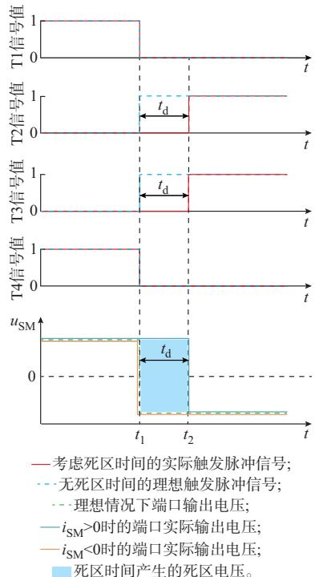  
图1　正投入转为负投入时死区对输出电压的影响  
Fig. 1 Influence of dead time on output voltage when positive input is turned into negative input

由图1可知，在理想情况下，当触发脉冲来临之际，即 $t _ { 1 }$ 时刻，上升沿与下降沿均正常触发，FBSM从附录A图A1的状态1（或状态5）直接跳变到状态6（或状态7）。此时，在死区时间 $t _ { \mathrm { d } }$ 内端口理想输出电压为- $u _ { \mathrm { C } }$ 。然而，在实际工程应用中，开关控制信号需要引入死区时间，当触发脉冲来临之际，下降沿正常触发，而上升沿需要经过死区时间 $t _ { \mathrm { d } }$ 后在 $t _ { 2 }$ 时刻触发。因此，在死区时间 $t _ { \mathrm { d } }$ 内，无IGBT导通。此时，端口实际输出电压由电流的方向决定。当 $i _ { \mathrm { S M } } >$ 0时，FBSM 在死区时间内处于状态 4，端口实际输出电压为 $+ u _ { \mathrm { C } }$ ，即在死区时间内，端口产生 $+ 2 u _ { \mathrm { C } }$ 死区电压；当 $i _ { \mathrm { S M } } { < } 0$ 时，FBSM在死区时间内处于状态10，端口实际输出电压为 $- \boldsymbol { u } _ { \mathrm { C } }$ ，即在死区时间内，端

口无死区电压产生。附录 A 图 A2和表 A2给出了不同工作状态转换时死区对子模块端口输出电压的影响。

# 2 基于状态空间平均法的MMC等效模型

考虑死区特性的MMC状态空间平均化建模求解过程分为正解和反解两部分。正解时，读取上一步长外部电路的相关参数，即每相桥臂电流 $i _ { \mathrm { a r m } } \setminus N$ 个 FBSM 电 容 电 压 $u _ { \scriptscriptstyle \mathrm { C } i } ( i = 1 , 2 , \cdots , N )$ 以 及 4 个IGBT 功率管（T1i、T2i、T3i、T4i）的开关状态。通过相关公式判断各个FBSM当前所处的系统工况，并经过一个周期后求出各个子模块3种工况的加权平均值，进而得到等效的受控电压源 $u _ { \mathrm { e q } i } \setminus$ 、电流源 $i _ { \mathrm { e q } i }$ 和电阻 $R _ { \mathrm { e q } i }$ 的值。反解时，将等效的受控电压源和电阻串联与外部电网相结合，将等效的受控电流源与对应储能电容相结合，通过 PSCAD/EMTDC电磁暂态仿真软件求解得到当前步长外部电路的相关参数，提供给下一步长的正解。综上所述，通过循环往复的正、反解，考虑死区特性的MMC状态空间平均化建模求解得以完成，其计算流程见附录 B图 B1。

# 2. 1 SDCM

由附录 A 表 A1可知，考虑死区时间的 FBSM共有8种电路导通模式，18种开关方式。根据建模需求，基于电容工作状态和子模块端口输出电压，将18 种开关方式重新归类为 3 种工况，见附录 B 表B1。本节从单个FBSM出发，以子模块电容电压和桥臂电流作为状态变量，在一个周期内对各工况列写状态方程，最后引入占空比通过状态空间平均法［22］ 将各工况整合为一个统一的模型。

# 2. 1. 1　各工况的状态空间方程表达式

本节以工况 1中的 T1、T4导通，T2、T3截止，桥臂电流 $i _ { \mathrm { a r m } } > 0$ 为例进行分析，附录B表B1中工况1的其余各个开关状态的端口特性均一致。此时，电容正向投入，子模块端口电压输出为+ $u _ { \mathrm { C } }$ ，电流流通路径如图2中红线所示。

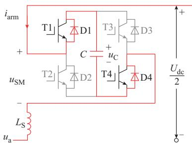  
图2　工况1桥臂电流流通路径  
Fig. 2 Bridge arm current path in condition 1

依据基尔霍夫电压、电流定律，得到电路方程如下：

$$
\left\{ \begin{array}{l} L _ {\mathrm {S}} \frac {\mathrm {d} i _ {\mathrm {a r m}} (t)}{\mathrm {d} t} = - 2 R _ {\mathrm {o n}} i _ {\mathrm {a r m}} (t) - u _ {\mathrm {C}} (t) - u _ {\mathrm {a}} (t) + \frac {U _ {\mathrm {d c}}}{2} \\ C \frac {\mathrm {d} u _ {\mathrm {C}} (t)}{\mathrm {d} t} = i _ {\mathrm {a r m}} (t) \\ u _ {\mathrm {S M}} (t) = 2 R _ {\mathrm {o n}} i _ {\mathrm {a r m}} (t) + u _ {\mathrm {C}} (t) \end{array} \right. \tag {1}
$$

式中： ${ \mathrm { : } } u _ { \mathrm { a } }$ 为交流侧a相电压； $U _ { \mathrm { d c } }$ 为直流侧电压； $i _ { \mathrm { a r m } }$ 为桥臂电流； $L _ { \mathrm { s } }$ 为桥臂等效电感值；C 为子模块电容值； $R _ { \mathrm { o n } }$ 为开关器件导通时的电阻。

分别定义状态向量 $x ( t )$ 、输出量 $y ( t )$ ）、输入向量${ \mathbf { } } { \mathbf { } } { \mathbf { } } { \mathbf { } } { \mathbf { } } { \mathbf { } } { \mathbf { } } { \mathbf { } } \mathbf { } u ( { \mathbf { } } { \mathbf { } } )$ 为：

$$
\boldsymbol {x} (t) = \left[ \begin{array}{l l} i _ {\mathrm {a r m}} (t) & u _ {\mathrm {C}} (t) \end{array} \right] ^ {\mathrm {T}} \tag {2}
$$

$$
y (t) = u _ {\mathrm {S M}} (t) \tag {3}
$$

$$
\boldsymbol {u} (t) = \left[ \begin{array}{l l} \frac {U _ {\mathrm {d c}}}{2} & u _ {\mathrm {a}} (t) \end{array} \right] ^ {\mathrm {T}} \tag {4}
$$

将式（2）—式（4）代入式（1），列写状态空间方程表达式如下：

$$
\left\{ \begin{array}{l} {\left[ \begin{array}{l l} L _ {\mathrm {S}} & 0 \\ 0 & C \end{array} \right] \frac {\mathrm {d} \boldsymbol {x} (t)}{\mathrm {d} t} = \left[ \begin{array}{c c} - 2 R _ {\mathrm {o n}} & - 1 \\ 1 & 0 \end{array} \right] \boldsymbol {x} (t) +} \\ {\left[ \begin{array}{l l} 1 & - 1 \\ 0 & 0 \end{array} \right] \boldsymbol {u} (t)} \\ {y (t) = [ 2 R _ {\mathrm {o n}} 1 ] \boldsymbol {x} (t)} \end{array} \right. \tag {5}
$$

记：

$$
K = \left[ \begin{array}{l l} L _ {\mathrm {S}} & 0 \\ 0 & C \end{array} \right] \tag {6}
$$

$$
A _ {1} = \left[ \begin{array}{c c} - 2 R _ {\text {o n}} & - 1 \\ 1 & 0 \end{array} \right] \tag {7}
$$

$$
B _ {1} = \left[ \begin{array}{c c} 1 & - 1 \\ 0 & 0 \end{array} \right] \tag {8}
$$

$$
C _ {1} = \left[ \begin{array}{l l} 2 R _ {\text {o n}} & 1 \end{array} \right] \tag {9}
$$

则式（5）可简化为：

$$
\left\{ \begin{array}{l} K \frac {\mathrm {d} \boldsymbol {x} (t)}{\mathrm {d} t} = A _ {1} \boldsymbol {x} (t) + B _ {1} \boldsymbol {u} (t) \\ y (t) = C _ {1} \boldsymbol {x} (t) \end{array} \right. \tag {10}
$$

同理，可得工况 2、工况 3的状态空间方程表达式如下：

$$
\left\{ \begin{array}{l} K \frac {\mathrm {d} \boldsymbol {x} (t)}{\mathrm {d} t} = A _ {2} \boldsymbol {x} (t) + B _ {2} \boldsymbol {u} (t) \\ y (t) = C _ {2} \boldsymbol {x} (t) \end{array} \right. \tag {11}
$$

$$
\left\{ \begin{array}{l} K \frac {\mathrm {d} \boldsymbol {x} (t)}{\mathrm {d} t} = A _ {3} \boldsymbol {x} (t) + B _ {3} \boldsymbol {u} (t) \\ y (t) = C _ {3} \boldsymbol {x} (t) \end{array} \right. \tag {12}
$$

工况 2中系数矩阵 $A _ { 2 } , B _ { 2 }$ 和 C 以及工况 3中系数矩阵 $A _ { 3 } \mathcal { B } _ { 3 }$ 和 $C _ { 3 }$ 的具体表达式如式（13）—式（18）所示。

$$
A _ {2} = \left[ \begin{array}{l l} - 2 R _ {\mathrm {o n}} & 1 \\ - 1 & 0 \end{array} \right] \tag {13}
$$

$$
B _ {2} = \left[ \begin{array}{c c} 1 & - 1 \\ 0 & 0 \end{array} \right] \tag {14}
$$

$$
C _ {2} = \left[ 2 R _ {\mathrm {o n}} - 1 \right] \tag {15}
$$

$$
A _ {3} = \left[ \begin{array}{c c} - 2 R _ {\mathrm {o n}} & 0 \\ 0 & 0 \end{array} \right] \tag {16}
$$

$$
B _ {3} = \left[ \begin{array}{c c} 1 & - 1 \\ 0 & 0 \end{array} \right] \tag {17}
$$

$$
C _ {3} = \left[ 2 R _ {\mathrm {o n}} \quad 0 \right] \tag {18}
$$

# 2. 1. 2　基于状态空间平均法的统一建模

引入周期平均算子对一个周期长度区间内的变量进行平均建模，具体定义如下：

$$
\left\langle f (t) \right\rangle_ {T _ {\mathrm {s}}} = \frac {1}{T _ {\mathrm {s}}} \int_ {t - \frac {T _ {\mathrm {s}}}{2}} ^ {t + \frac {T _ {\mathrm {s}}}{2}} f (\tau) \mathrm {d} \tau \tag {19}
$$

式中 $: f ( t )$ 为某一变量； $\left. f ( t ) \right. _ { T _ { \mathrm { s } } }$ 表示 （f t）在开关周期 $T _ { \mathrm { s } }$ 内的平均值。

将式（19）的周期平均算子代入式（10）—式（12）可得：

$$
\left\{ \begin{array}{l} \boldsymbol {x} \left(t _ {1}\right) = \boldsymbol {x} (0) + \left(g _ {1} (t) T _ {\mathrm {S}}\right) \boldsymbol {K} ^ {- 1} \cdot \\ \left(\boldsymbol {A} _ {1} \left\langle \boldsymbol {x} (t) \right\rangle_ {T _ {\mathrm {s}}} + \boldsymbol {B} _ {1} \left\langle \boldsymbol {u} (t) \right\rangle_ {T _ {\mathrm {s}}}\right) \\ \left(g _ {1} (t) T _ {\mathrm {S}}\right) \left\langle y (t) \right\rangle_ {T _ {\mathrm {s}}} = \left(g _ {1} (t) T _ {\mathrm {S}}\right) \boldsymbol {C} _ {1} \left\langle \boldsymbol {x} (t) \right\rangle_ {T _ {\mathrm {s}}} \end{array} \right. \tag {20}
$$

$$
\left\{ \begin{array}{l} \boldsymbol {x} \left(t _ {2}\right) = \boldsymbol {x} \left(t _ {1}\right) + \left(g _ {2} (t) T _ {\mathrm {S}}\right) K ^ {- 1} \cdot \\ \left(A _ {2} \left\langle \boldsymbol {x} (t) \right\rangle_ {T _ {\mathrm {s}}} + B _ {2} \left\langle \boldsymbol {u} (t) \right\rangle_ {T _ {\mathrm {s}}}\right) \\ \left(g _ {2} (t) T _ {\mathrm {S}}\right) \left\langle y (t) \right\rangle_ {T _ {\mathrm {s}}} = \left(g _ {2} (t) T _ {\mathrm {S}}\right) C _ {2} \left\langle \boldsymbol {x} (t) \right\rangle_ {T _ {\mathrm {s}}} \end{array} \right. \tag {21}
$$

$$
\left\{ \begin{array}{l} \boldsymbol {x} \left(T _ {\mathrm {S}}\right) = \boldsymbol {x} \left(t _ {2}\right) + \left(g _ {3} (t) T _ {\mathrm {S}}\right) K ^ {- 1} \cdot \\ \left(A _ {3} \left\langle \boldsymbol {x} (t) \right\rangle_ {T _ {\mathrm {s}}} + B _ {3} \left\langle \boldsymbol {u} (t) \right\rangle_ {T _ {\mathrm {s}}}\right) \\ \left(g _ {3} (t) T _ {\mathrm {S}}\right) \left\langle y (t) \right\rangle_ {T _ {\mathrm {s}}} = \left(g _ {3} (t) T _ {\mathrm {S}}\right) C _ {3} \left\langle \boldsymbol {x} (t) \right\rangle_ {T _ {\mathrm {s}}} \end{array} \right. \tag {22}
$$

式中 $: g _ { 1 } ( t ) \ : . g _ { 2 } ( t ) \ : . g _ { 3 } ( t )$ 分别为工况1、2、3在周期 $T _ { \mathrm { s } }$ 内的占空比 $; t _ { 1 } , t _ { 2 }$ 为工况状态切换时刻。

将式（20）、式（21）代入式（22），利用 x（0）来表示x（T）得：

$$
\left\{ \begin{array}{c} \boldsymbol {x} \left(T _ {\mathrm {S}}\right) = \boldsymbol {x} (0) + T _ {\mathrm {S}} \boldsymbol {K} ^ {- 1} \left(g _ {1} (t) \boldsymbol {A} _ {1} + g _ {2} (t) \boldsymbol {A} _ {2} + \right. \\ \quad \left. g _ {3} (t) \boldsymbol {A} _ {3}\right) \left\langle \boldsymbol {x} (t) \right\rangle_ {T _ {\mathrm {s}}} + T _ {\mathrm {S}} \boldsymbol {K} ^ {- 1} \left(g _ {1} (t) \boldsymbol {B} _ {1} + \right. \\ \quad \left. g _ {2} (t) \boldsymbol {B} _ {2} + g _ {3} (t) \boldsymbol {B} _ {3}\right) \left\langle \boldsymbol {u} (t) \right\rangle_ {T _ {\mathrm {s}}} \\ \left\langle y (t) \right\rangle_ {T _ {\mathrm {s}}} = \left(g _ {1} (t) \boldsymbol {C} _ {1} + g _ {2} (t) \boldsymbol {C} _ {2} + g _ {3} (t) \boldsymbol {C} _ {3}\right) \cdot \\ \quad \left\langle \boldsymbol {x} (t) \right\rangle_ {T _ {\mathrm {s}}} \end{array} \right. \tag {23}
$$

根 据 欧 拉 公 式 $\mathrm { d } \Bigl < f ( t ) \Bigr > _ { T _ { \mathrm { s } } } / \mathrm { d } t = ( f ( T _ { \mathrm { s } } )$ -$f ( 0 ) ) / T _ { \mathrm { s } }$ ，可将式（23）整理为：

$$
\left\{ \begin{array}{c} K \frac {\mathrm {d} \langle x (t) \rangle_ {T _ {\mathrm {s}}}}{\mathrm {d} t} = \left(g _ {1} (t) A _ {1} + g _ {2} (t) A _ {2} + g _ {3} (t) A _ {3}\right) \cdot \\ \left\langle x (t) \right\rangle_ {T _ {\mathrm {s}}} + \left(g _ {1} (t) B _ {1} + g _ {2} (t) B _ {2} + \right. \\ \left. g _ {3} (t) B _ {3}\right) \left\langle u (t) \right\rangle_ {T _ {\mathrm {s}}} \\ \left\langle y (t) \right\rangle_ {T _ {\mathrm {s}}} = \left(g _ {1} (t) C _ {1} + g _ {2} (t) C _ {2} + g _ {3} (t) C _ {3}\right) \cdot \\ \left\langle x (t) \right\rangle_ {T _ {\mathrm {s}}} \end{array} \right. \tag {24}
$$

根据式（7）—式（9）、式（13）—式（15）以及式（16）—式（18）可知：

$$
A _ {\text {a l l}} = g _ {1} (t) A _ {1} + g _ {2} (t) A _ {2} + g _ {3} (t) A _ {3} =
$$

$$
\left[ \begin{array}{c c} - 2 R _ {\text {o n}} & - g _ {1} (t) + g _ {2} (t) \\ g _ {1} (t) - g _ {2} (t) & 0 \end{array} \right] \tag {25}
$$

$$
B _ {\text {a l l}} = g _ {1} (t) B _ {1} + g _ {2} (t) B _ {2} + g _ {3} (t) B _ {3} = \left[ \begin{array}{c c} 1 & - 1 \\ 0 & 0 \end{array} \right] \tag {26}
$$

$$
C _ {\text {a l l}} = g _ {1} (t) C _ {1} + g _ {2} (t) C _ {2} + g _ {3} (t) C _ {3} =
$$

$$
[ 2 R _ {\mathrm {o n}} \quad g _ {1} (t) - g _ {2} (t) ] \tag {27}
$$

式中： $A _ { \mathrm { a l l } } \setminus B _ { \mathrm { a l l } }$ 和 $C _ { \mathrm { a l l } }$ 为状态空间方程式总的系数矩阵。

将式（25）—式（27）代入式（24），再将其进行简化，可得系统的状态空间平均方程为：

$$
\left\{ \begin{array}{l} \frac {\mathrm {d} \boldsymbol {x} (t)}{\mathrm {d} t} = \left[ \begin{array}{c c} \frac {- 2 R _ {\text {o n}}}{L _ {\mathrm {S}}} & \frac {- g _ {1} (t) + g _ {2} (t)}{L _ {\mathrm {S}}} \\ \frac {g _ {1} (t) - g _ {2} (t)}{C} & 0 \end{array} \right] \boldsymbol {x} (t) + \\ y (t) = \left[ \begin{array}{c c} \frac {1}{L _ {\mathrm {S}}} & \frac {- 1}{L _ {\mathrm {S}}} \\ 0 & 0 \end{array} \right] \boldsymbol {u} (t) \\ y (t) = \left[ \begin{array}{c c} 2 R _ {\text {o n}} & g _ {1} (t) - g _ {2} (t) \end{array} \right] \boldsymbol {x} (t) \end{array} \right. \tag {28}
$$

通过式（ ）可得到 的数学模型，再将子模块级联可得到考虑死区时间的基于状态空间平均

法的 MMC数学模型，其等效电路如图 3所示。图中： $\cdot i _ { \mathrm { e q } i } ( i { = } 1 , 2 , \cdots , N ) \ 、 C _ { i }$ 分别为第i个子模块等效受控电流源、电容值； $; i _ { \mathrm { a p } } \setminus u _ { \mathrm { e q s } } \setminus R _ { \mathrm { e q s } }$ 分别为 a 相上桥臂电流、总的等效电压源、总的等效电阻； $; I _ { \mathrm { d c } }$ 为直流侧电流。SDCM使用等效电流源 $i _ { \mathrm { e q } i }$ 作为子模块与第i个直流储能电容的接口电路；使用总的等效电压源 $u _ { \mathrm { { e q s } } }$ 与总的等效电阻 $R _ { \mathrm { e q s } }$ 串联作为该相桥臂与外界电网的接口电路。其中，等效受控电压源、电流源以及电阻计算公式如下：

$$
\left\{ \begin{array}{l} u _ {\mathrm {e q i}} (t) = \left(g _ {1 i} (t) - g _ {2 i} (t)\right) u _ {\mathrm {C i}} (t) \\ i _ {\mathrm {e q i}} (t) = \left(g _ {1 i} (t) - g _ {2 i} (t)\right) i _ {\mathrm {a r m}} (t) \\ R _ {\mathrm {e q i}} = 2 R _ {\mathrm {o n}} \end{array} \right. \tag {29}
$$

$$
\left\{ \begin{array}{l} u _ {\mathrm {e q s}} (t) = \sum_ {i = 1} ^ {N} u _ {\mathrm {e q i}} (t) \\ R _ {\mathrm {e q s}} (t) = \sum_ {i = 1} ^ {N} R _ {\mathrm {e q i}} (t) \end{array} \right. \tag {30}
$$

式中： $: g _ { 1 i } ( t ) , g _ { 2 i } ( t ) , g _ { 3 i } ( t )$ 分别为第 i个 FBSM 工况 1、2、3的占空比。

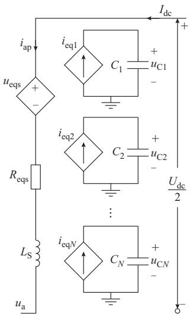  
图3 MMC单相桥臂等效电路  
Fig. 3 Equivalent circuit of single-phase bridge arm of MMC

# 2. 2 BACM

为满足高电压、大容量的需求，实际柔性直流输电工程中 MMC需要级联大量的子模块，例如中国舟山5端柔性直流输电示范工程共包含超过8 000个子 模 块 ，且 其 数 量 有 不 断 升 高 的 趋 势［23］。 在PSCAD/EMTDC等仿真软件平台上搭建其详细仿真模型时，需要对庞大的功率模块元件进行处理，严重阻碍了建模速度。由图 3可知，本文所提的平均值SDCM也存在此类问题。然而，平均值模型使用等效受控源作为FBSM与外界电网、直流储能电容

的接口电路，实现子模块与外界电网之间的解耦。根据电容器特性可得出子模块电容电压满足：

$$
u _ {\mathrm {C}} = \frac {1}{C} \int_ {t} ^ {t + \Delta t} i _ {\mathrm {S M}} (\tau) \mathrm {d} \tau \tag {31}
$$

式中： $\Delta t$ 为仿真步长。

由式（31）可知，子模块电容电压受端口输入电流影响，即受来自外界电网的桥臂电流影响。因此，可根据桥臂电流以及式（31）通过编程的形式模拟各FBSM电容工作状态，得到电容电压值，进而利用式（29）和式（30）得到与外界电网连接的受控电压源，实现BACM的建立，如附录B图B2所示。其中，分立元件等效模块根据各子模块实际开关状态 $T _ { \mathrm { a l l } } .$ 、电容电压 $u _ { \mathrm { C , i n } }$ 、桥臂电流 $i _ { \mathrm { a r m } }$ 、电容值 C 以及死区时间 $t _ { \mathrm { d } }$ 模拟图3子模块分立元件部分。BACM借助数学推导模拟FBSM电容工作状态，避免了烦琐的子模块搭建过程，提高了建模效率。

# 3 仿真验证

# 3. 1　系统参数及运行工况

为了验证本文提出的考虑死区特性的MMC状态空间平均化建模方法思想的有效性，在PSCAD/EMTDC仿真平台上搭建了 49电平双端高压直流输电系统。在控制环节中，采用电压、电流双闭环矢量控制，有功类控制量为系统交流侧有功功率，无功类控制量为 0。在调制环节中，采用最近电平逼近调制方式。

文献［24］指出，死区时间受母线电压、通态电流、结温等影响，依据文献［25］得到IGBT的死区时间，系统参数见附录C表C1。

设置系统工况：

1）0~0.2 s：系统启动。

2）0.2~0.75 s：启动过程结束，进入稳态运行。

3）0.75 s：系统直流母线侧发生金属性接地短路故障。

4）0.755 s：断路器动作，系统从故障中恢复。

5）1.15 s：仿真结束。

# 3. 2　精度测试

为了验证本文提出的模型的仿真精度效果，本节 分 别 搭 建 了 49 电 平 MMC 的 DM、SDCM 与，分别对各个模型在稳态运行及直流母线侧发生金属性接地短路故障后故障恢复暂态过程的仿真结果进行对比。

图4为全桥型MMC有功功率传输P仿真结果。其中，图4（a）为整体仿真波形对比图，图4（b）和（c）分别为稳态阶段、短路后故障恢复暂态阶段的局部放大仿真波形对比图。经数据分析可知，SDCM

中，稳态时的有功功率平均相对误差为0.13%，暂态初 始 阶 段 有 功 功 率 的 平 均 相 对 误 差 为 1.63%；BACM 中，稳态时有功功率的平均相对误差为0.14%，暂态初始阶段有功功率的平均相对误差为1.64%。由仿真对比图和相对误差计算结果可知，本文所提的SDCM和BACM在稳态以及短路后故障恢复暂态阶段与DM的仿真结果、波形趋势基本一致，表明本文所提的 SDCM 与 BACM 均可对有功功率传输过程进行较好的模拟。

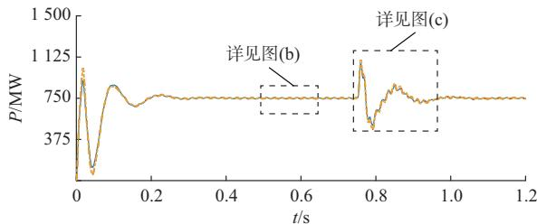  
(a) 整体波形

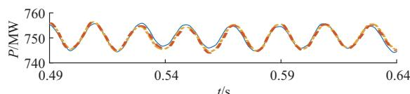  
(b) 稳态波形

图4　有功功率传输波形对比  
Fig. 4 Comparison of active power transmission waveforms   
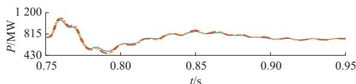  
DM; SDCM; BACM。

(c) 暂态波形

图5为全桥型MMC的a相上桥臂电流 $I _ { \mathrm { a u p } }$ 的仿真结果。SDCM 中，稳态时 $I _ { \mathrm { a u p } }$ 的平均相对误差为2.50%；BACM 中，稳态时 $I _ { \mathrm { a u p } }$ 的平均相对误差为2.31%。

图6为全桥型MMC的a相上桥臂第1个子模块电容电压 $U _ { \mathrm { c a l } }$ 的仿真结果。SDCM 中，稳态时 $U _ { \mathrm { c a l } }$ 的平均相对误差为 2.65%，暂态初始阶段 $U _ { \mathrm { c a l } }$ 的平均相对误差为4.69%；BACM中，稳态时 $U _ { \mathrm { c a l } }$ 的平均相对误差为 2.83%，暂态初始阶段 $U _ { \mathrm { c a l } }$ 的平均相对误差为3.86%。

图7为a相上桥臂第1个子模块电容电压 $U _ { \mathrm { c a l } }$ 在不同电容电压均压能力［26］下的仿真结果。图中：$U _ { \mathrm { m a x , r e f } }$ 为电容电压最大偏差，即同一桥臂 FBSM 电容电压最大值和最小值之差的最大允许值。表1给出了稳态阶段各模型子模块电容电压在不同电容均压能力下的平均相对误差。

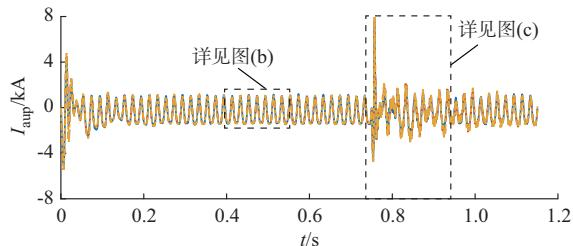  
(a) 整体波形

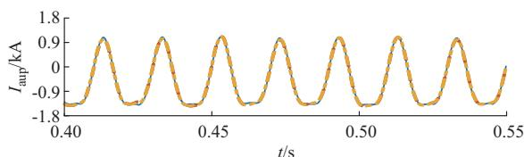  
(b) 稳态波形

(c) 暂态波形  
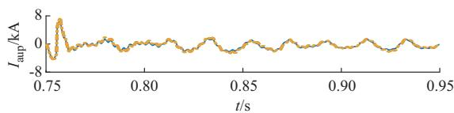  
DM; SDCM; BACM。

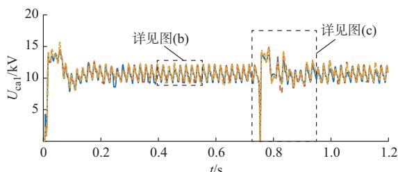  
图5 a相上桥臂电流波形对比  
Fig. 5 Waveform comparison of phase-a upper bridge arm current   
(a) 整体波形

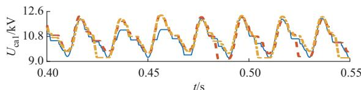  
(b) 稳态波形

图6 a相上桥臂子模块电容电压波形对比  
Fig. 6 Waveform comparison of sub-module capacitor voltage at phase-a upper bridge arm   
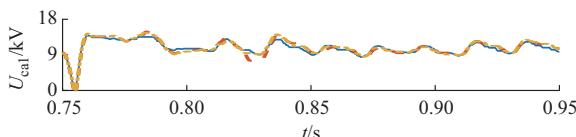  
DM; SDCM; BACM。

(c) 暂态波形

由图7及表1可知，当 $U _ { \mathrm { m a x , r e f } } { = } 0$ 时，即桥臂各子模块电容电压均压能力较强时，等效模型子模块电容电压波形拟合度较好、仿真精度较高。随着$U _ { \mathrm { m a x , r e f } }$ 的增大，波形拟合度变差、仿真精度下降。造

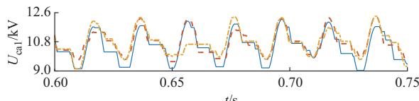  
$( \mathrm { a } ) ~ U _ { \mathrm { m a x , r e f } } { = } 0 . 0 8 u _ { \mathrm { C } }$

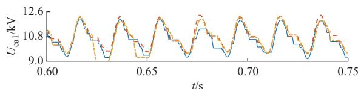  
(b) $U _ { \mathrm { m a x , r e f } } { = } 0 . 0 4 u _ { \mathrm { C } }$

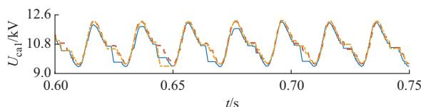  
(c) Umax,ref= 0   
DM; SDCM; BACM。  
图7　不同电容电压均压能力下子模块电容电压仿真结果  
Fig. 7 Simulation results of sub-module capacitor voltage with different capacitor voltage balancing capabilities

表1　不同电容电压均压能力下 $U _ { \mathrm { c a l } }$ 稳态阶段平均相对误差  
Table 1 Average relative error of $U _ { \mathrm { c a l } }$ in steady-state stage with different capacitor voltage balancing capabilities   

<table><tr><td rowspan="2">Umax,ref</td><td colspan="2">Ucal平均相对误差/%</td></tr><tr><td>SDCM</td><td>BACM</td></tr><tr><td>0.08uC</td><td>3.14</td><td>3.40</td></tr><tr><td>0.04uC</td><td>2.65</td><td>2.83</td></tr><tr><td>0</td><td>1.97</td><td>1.51</td></tr></table>

成仿真误差的主要原因为：所提建模思想依据状态空间平均法，在一个周期内求子模块各工况的加权平均值，从而得到等效受控源来模拟FBSM的外部特性。子模块电容电压均压能力越强，单位周期内FBSM电容电压变化幅度越小，所求得的平均等效值就越接近真实值，仿真结果也越精确。然而，在较强的均压能力下，电容在一个周期内随着模块的投入或切除会进行充放电活动，电容电压本身也会存在波动且波动幅值大。等效模型对电压进行加权平均处理后，所求得的平均等效值只能接近真实值，并不能完全等效真实值，故如图7（c）所示会存在部分波形不吻合的情况。虽然SDCM与BACM存在部分波形无法完全拟合的情况，但是由表 1可知，在$U _ { \mathrm { m a x , r e f } } { = } 0$ 时，子模块电容电压稳态阶段平均相对误差在 1%~2% 之间，整体波形仿真精度高，且其开关可以反映死区特性，弥补了以往等效精确模型以二值电阻建立IGBT数学模型而无法模拟死区时间

的缺陷。

图8为DM子模块电容电压分别在稳态和暂态阶段的波形对比图。由图 8可以看出，在稳态运行时，开关是否考虑死区时间对子模块电容电压峰值具有较大影响；而在暂态阶段，其影响效果不显著。这是由于死区对子模块电容电压的影响发生在子模块模态发生变化处。在启动或发生直流故障等暂态阶段，MMC多工作于闭锁状态（即无IGBT导通），此时，死区对模型输出电压无影响；而在稳态运行时，大量级联子模块需要通过频繁地投切来实现子模块电容电压保持均值，故稳态阶段死区对输出电压的影响较大。因此，为与实际工程相符，在仿真建模中需考虑死区时间的影响。所提出的建模方法可以很好地反映死区时间对子模块电容电压造成的影响（如图7（c）所示）。

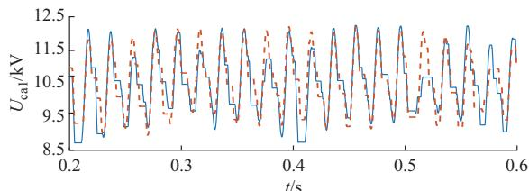  
(a) 稳态波形

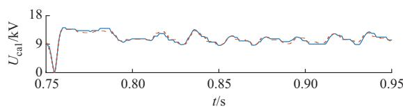  
(b) 暂态波形  
td=0 μs; t d=10 μs。  
图8 DM子模块电容电压波形对比  
Fig. 8 Waveform comparison of sub-module capacitor voltage of DM

# 3. 3　加速比测试

为了验证本文提出的 2个模型的加速效果，本节分别搭建了 31、41、51、61 这 4 种电平数的三相MMC开环 DM、SDCM 与 BACM，对相同条件下各个模型的仿真用时进行对比，如表2所示。其中，设置仿真总时长为 5 s，仿真步长为 5 μs，画图步长为100 000 μs，程 序 运 行 于 Windows 10 的 64 bit 系 统 ，处 理 器 为 Intel Core i5-1030NG7，内 存 为 8 GB，PSCAD/EMTDC 平台的版本为 V4.6.2。

由表 2 可知，当模块数一定时，本文提出的SDCM 与 BACM 加速效果显著。在 61电平数时，SDCM相比于DM最高可加速21倍以上，BACM可加速67倍以上，且仿真效率会随着电平数的增加而有明显的提升。其中，BACM不仅通过编程的形式模拟各子模块电容工作状态，避免了子模块烦琐的

表2　各模型仿真时间对比  
Table 2 Comparison of simulation time of each model   

<table><tr><td rowspan="2">电平数</td><td colspan="3">仿真用时/s</td><td colspan="2">加速比</td></tr><tr><td>DM</td><td>SDCM</td><td>BACM</td><td>DM/SDCM</td><td>DM/BACM</td></tr><tr><td>31</td><td>1488</td><td>251</td><td>90</td><td>5.93</td><td>16.55</td></tr><tr><td>41</td><td>2603</td><td>352</td><td>107</td><td>7.38</td><td>24.29</td></tr><tr><td>51</td><td>4844</td><td>424</td><td>164</td><td>11.42</td><td>29.49</td></tr><tr><td>61</td><td>12712</td><td>588</td><td>188</td><td>21.61</td><td>67.53</td></tr></table>

搭建过程，提高了建模效率，而且在保证精度的前提下，仿真效率也有显著的提高，尤其适合于大规模、大容量的高电平数的多端直流输电等多MMC集成应用场合。

# 4 结语

实际工程中，全桥MMC需要引入死区时间，针对死区效应越来越显著和MMC仿真耗时过长的问题，本文提出一种考虑死区特性的基于状态空间平均化的提速建模方法。该建模思想具有如下特点：

1）通过分析考虑死区时间的 FBSM 各个开关状态下的端口特性，引入占空比，利用状态空间平均法将各开关状态整合为一个统一的模型，得到子模块分立元件平均值模型。进一步地，根据平均值模型的解耦特性和电容特性，提出 BACM，避免搭建大量的功率模块元件，提升了仿真建模效率。等效模型结构简单，对半桥MMC、混合MMC、级联H桥等其他含功率开关元件的模型具有一定的借鉴意义。  
2）不同于以往平均值模型通过简化系统内部开关动作过程而仅保留外部特性来实现模型提速效果的建模思想，本文所提建模方法利用状态空间方程，以占空比为关键信息对电压、电流进行时间平均，但仍保留子模块实际电容。因此，等效模型可实现对单个子模块的充放电过程模拟，且其开关可以反映死区特性，弥补了以往等效模型以二值电阻建立IGBT数学模型而无法模拟死区时间的缺陷。  
3）等效模型通过扫描各模块的开关触发脉冲信号，引入加权平均值，得到等效受控源来模拟FBSM的外部特性。其中，有功功率与桥臂电流仿真精度较高、波形拟合度较好。桥臂子模块电容电压仿真精度受均压能力的影响，较强的均压能力可以得到较高的仿真精度。由于电容电压在正常运行中随着充放电活动存在幅值较大的纹波，等效模型通过占空比对子模块电容电压进行加权平均所求得的平均等效值不能完全等效真实值，故在纹波较大位置处存在一定误差，这种内部误差可通过进一步提高模块电容电压均压能力或减小电容电压纹波来减小。

从整体来看，内部误差不影响 MMC的整体仿真精度，等效模型加速效果显著且仿真效率会随着电平数的增加而有明显的提升。

附录见本刊网络版（http：//www.aeps-info.com/aeps/ch/index.aspx），扫英文摘要后二维码可以阅读网络全文。

# 参 考 文 献

［1］吴丽丽，茆美琴，施永.含主动限流控制的MMC-HVDC电网直流短路故障电流解析计算［J］. 电工技术学报，2024，39（3）：785-797.  
WU Lili， MAO Meiqin， SHI Yong. Analytical calculation of DCshort-circuit fault current of modular multi-level converter-HVDCgrid with active current limiting control［J］. Transactions of ChinaElectrotechnical Society， 2024， 39（3）： 785-797.  
［2］饶宏，黄伟煌，郭知非，等 .柔性直流输电技术在大电网中的应用与实践［J］. 高电压技术，2022，48（9）：3347-3355.  
RAO Hong， HUANG Weihuang， GUO Zhifei， et al. Practicalexperience of VSC-HVDC transmission in large grid［J］. HighVoltage Engineering， 2022， 48（9）： 3347-3355.  
［3］郭猛，郝全睿，李东.混合型MMC的改进桥臂平均值与状态空间模型［J］. 电力系统自动化，2023，47（19）：116-127.  
GUO Meng， HAO Quanrui， LI Dong. Improved arm averageand state-space models of hybrid modular multilevel converter［J］. Automation of Electric Power Systems， 2023， 47（19）：116-127.  
［4］李峥，陈武，侯凯，等 .适用于中压配电网的无联结变压器柔性环网控制器［J］.电力系统自动化，2022，46（14）：169-176.  
LI Zheng， CHEN Wu， HOU Kai，et al. Flexible ring networkcontroller without interface transformer for medium voltagedistribution network［J］. Automation of Electric Power Systems，2022， 46（14）： 169-176.  
［5］王琛，魏子文，王毅，等.一种新型MMC并联双端口子模块及其三阶段故障电流阻断机理［J］.电力系统保护与控制，2023，51（1）：81-92.  
WANG Chen， WEI Ziwen， WANG Yi， et al. A novel MMCparallel dual-port submodule and its three-stage fault currentblocking mechanism［J］. Power System Protection and Control，2023， 51（1）： 81-92.  
［6］王晓婷，冯谟可，许建中，等.多有源桥型PET开关死区的电磁暂态等效建模方法［J］.中国电机工程学报，2023，43（15）：5995-6005.  
WANG Xiaoting， FENG Moke， XU Jianzhong， et al.Electromagnetic transient equivalent modeling method forswitching dead time of multi active bridge PET［J］. Proceedingsof the CSEE， 2023， 43（15）： 5995-6005.  
［7］ JI Y， YANG Y， ZHOU J L， et al. Control strategies ofmitigating dead-time effect on power converters： an overview［J］.Electronics， 2019， 8（2）： 196.  
［8］ JACOBS K， HEINIG S， JOHANNESSON D， et al. Comparative evaluation of voltage source converters with silicon carbide semiconductor devices for high-voltage direct current

transmission［J］. IEEE Transactions on Power Electronics，2021， 36（8）： 8887-8906.  
［9］宋平岗，李云丰，王立娜，等 .死区时间对模块化多电平换流器的影响［J］. 高电压技术，2014，40（5）：1530-1538.  
SONG Pinggang， LI Yunfeng， WANG Lina， et al. Influence ofdead time on modular multi-level converter［J］. High VoltageEngineering， 2014， 40（5）： 1530-1538.  
［10］ YE J， HUANG Y K， HUANG S T， et al. An accurate deadtime compensation method for SPWM voltage source inverters［J］. IEEE Transactions on Power Electronics， 2023， 38（4）：4894-4908.  
［11］柏树根，孙承晨，张新松，等.SiC MOSFET逆变器分段调制死区补偿策略［J］.电网与清洁能源，2023，39（10）：28-37.  
BAI Shugen， SUN Chengchen， ZHANG Xinsong， et al. Thedead-time compensation strategy for segmented modulation ofthe SiC MOSFET inverter［J］. Power System and CleanEnergy， 2023， 39（10）： 28-37.  
［12］ LI B J， XU J B， YE J， et al. A new model-based dead-timecompensation strategy for cascaded H-bridge converters［J］.IEEE Transactions on Industrial Electronics， 2023， 70（4）：3793-3802.  
［13］宋春伟，何金龙，李刚.3H桥开关次数均衡死区消除SVPWM［J］. 电机与控制学报，2023，27（1）：80-87.  
SONG Chunwei， HE Jinlong， LI Gang. Dead-time eliminationSVPWM with switching times sharing for 3H bridge inverter［J］. Electric Machines and Control， 2023， 27（1）： 80-87.  
［14］ JI S Q， ZHANG L， HUANG X X， et al. A novel voltagebalancing control with dv/dt reduction for 10-kV SiC MOSFET-based medium voltage modular multilevel converter［J］. IEEETransactions on Power Electronics， 2020， 35（11）： 12533-12543.  
［15］康薇，肖飞，任强，等.双有源桥DC-DC变换器三移相调制及其死区效应分析和补偿［J］.电工技术学报，2024，39（6）：1907-1922.  
KANG Wei， XIAO Fei， REN Qiang， et al. Three-phase-shiftmodulation and its dead band effect analysis and compensation ofdual-active-bridge DC-DC converter［J］. Transactions of ChinaElectrotechnical Society， 2024， 39（6）： 1907-1922.  
［16］ LI Z X， GAO F Q， XU F， et al. Power module capacitorvoltage balancing method for a ±350-kV/1000-MW modularmultilevel converter ［J］. IEEE Transactions on PowerElectronics， 2016， 31（6）： 3977-3984.  
［17］陈武晖，吴明哲，张军，等.模块化多电平换流器电磁暂态模型研究综述［J］. 电网技术，2020，44（12）：4755-4765.  
CHEN Wuhui， WU Mingzhe， ZHANG Jun， et al. Review ofelectromagnetic transient modeling of modular multilevelconverters［J］. Power System Technology， 2020， 44（12）：4755-4765.  
［18］徐婉莹，郑聪慧，许建中，等.级联H桥型电力电子变压器平均值模型［J］.电力自动化设备，2023，43（6）：190-196.  
XU Wanying， ZHENG Conghui， XU Jianzhong， et al.Average-value model of cascaded H-bridge type powerelectronic transformer ［J］. Electric Power AutomationEquipment， 2023， 43（6）： 190-196.

［19］陈耀军，陈柏超，田翠华，等.模块化多电平变换器的系统状态方程及等效模型［J］.中国电机工程学报，2015，35（1）：167-176.CHEN Yaojun， CHEN Baichao， TIAN Cuihua， et al. Thesystem state equation and equivalent model of modularmultilevel converters［J］. Proceedings of the CSEE， 2015， 35（1）： 167-176.  
［20］ ZHAO B， SONG Q， LIU W H， et al. Dead-time effect of thehigh-frequency isolated bidirectional full-bridge DC-DCconverter： comprehensive theoretical analysis and experimentalverification［J］. IEEE Transactions on Power Electronics，2014， 29（4）： 1667-1680.  
［21］许建中 .模块化多电平换流器电磁暂态高效建模方法研究［D］.北京：华北电力大学，2014.  
XU Jianzhong. Research on the electromagnetic transient efficient modelling method of modular multilevel converter［D］. Beijing： North China Electric Power University， 2014.   
［22］ ERICKSON R W， MAKSIMOVIĆ D. Fundamentals ofpower electronics ［M］. Cham， Switzerland： SpringerInternational Publishing， 2020.  
［23］许建中，赵成勇， GOLE A M.模块化多电平换流器戴维南等效整体建模方法［J］.中国电机工程学报，2015，35（8）：1919-1929.  
XU Jianzhong， ZHAO Chengyong， GOLE A M. Research onthe Thévenin’s equivalent based integral modelling method ofthe modular multilevel converter （MMC）［J］. Proceedings ofthe CSEE， 2015， 35（8）： 1919-1929.  
［24］罗毅飞，刘宾礼，汪波，等 .IGBT开关机理对逆变器死区时间的影响［J］.电机与控制学报，2014，18（5）：62-68.  
LUO Yifei， LIU Binli， WANG Bo， et al. The influence ofIGBT switching mechanism on the dead-time of inverters［J］.Electric Machines and Control， 2014， 18（5）： 62-68.  
［25］汪波，罗毅飞，刘宾礼，等.不同负载条件下绝缘栅双极型晶体管死区时间设置分析［J］. 高电压技术，2014，40（11）：3584-3589.  
WANG Bo， LUO Yifei， LIU Binli， et al. Analysis of deadtime set for insulated gate bipolar transistor under different loadconditions［J］. High Voltage Engineering， 2014， 40（11）： 3584-3589.  
［26］苟鑫 .MMC-HVDC 系统均压控制策略与快速仿真模型研究［D］.重庆：重庆大学，2020.  
GOU Xin. Research on voltage balancing control method and efficient simulation model of MMC-HVDC system ［D］. Chongqing： Chongqing University， 2020.

（编辑 蔡静雯）

# State Space Averaging Modeling Method of Full-bridge Modular Multilevel Converter Considering Dead-time Characteristics

PAN Keying1 ， JING Hang1 ， FENG Moke2 ， XU Jianzhong1

(1. State Key Laboratory of Alternate Electrical Power System with Renewable Energy Sources

(North China Electric Power University), Beijing 102206, China;

2. State Key Laboratory of Power Transmission Equipment Technology (Chongqing University), Chongqing 400044, China)

Abstract: To avoid the flow-through short-circuit fault of the power transistor with complementary conduction on the same side, the switching devices in the modular multilevel converter (MMC) need to set the dead time. The existence of the dead time will generate dead-time effect and it is difficult to eliminate the dead time. With the continuous improvement of the switching frequency of power electronic devices, the proportion of dead time increases and the influence of dead time cannot be ignored. Aiming at the problem that the dead-time effect is becoming more and more significant and the MMC simulation takes too long, this paper proposes a speed-up model considering the dead-time characteristics. Firstly, the port condition characteristics of the actual switching state of the cascaded sub-modules with dead time are scanned, and the actual working modes of each sub-module are identified by the port characteristics with dead time. The state space equation is then established. Secondly, based on the state space average method, the duty cycle is used as a link to unify the different modal properties of the sub-modules, and the submodule discrete component model is established. Further, according to the decoupling characteristics of the mean value model, a bridge arm centralized model is established to improve the efficiency of simulation modeling. Finally, the detailed model, the submodule discrete component model, and the bridge arm centralized model for the full-bridge MMC are built on the PSCAD/ EMTDC simulation software platform. The simulation results show that the proposed models have high accuracy and operation efficiency, which can better meet the demands of practical engineering simulation.

This work is supported by State Grid Corporation of China (No. 5500-202255495A-3-0-ZZ).

Key words: modular multilevel converter; dead time; state space average method; average value model; efficient electromagnetic transient modeling

