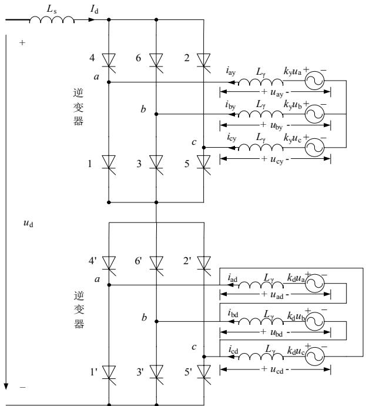
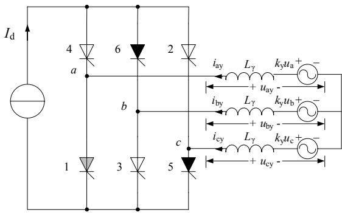
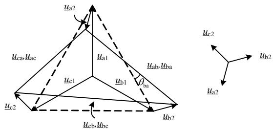
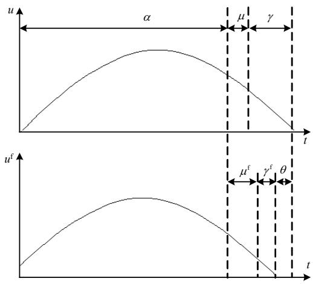
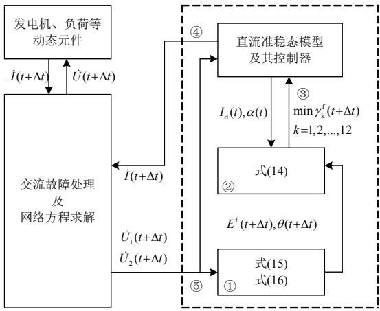
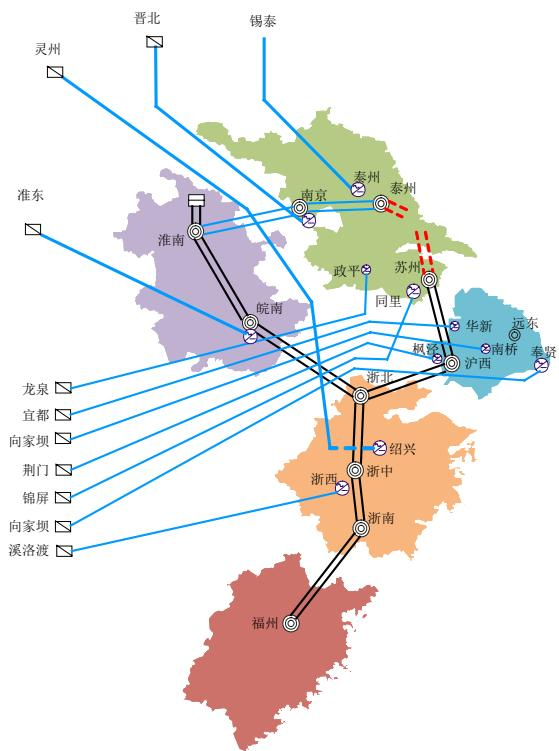
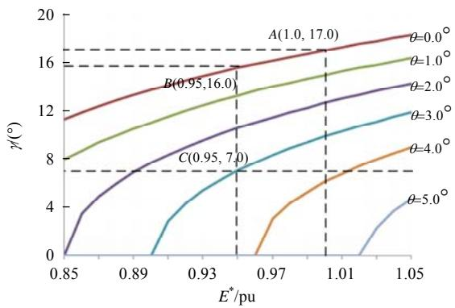

# 考虑不对称故障影响的多馈入直流系统换相失败快速判别方法

张彦涛，邱丽萍\*，施浩波，韩奕，李新年，姜懿郎

(电网安全与节能国家重点实验室(中国电力科学研究院), 北京市海淀区 100192)

# Fast Detection Method of Commutation Failure in Multi Infeed DC System Considering the Effect of Unbalanced Fault

ZHANG Yantao, QIU Liping*, SHI Haobo, HAN Yi, LI Xinnian, JIANG Yilang

(State Key Laboratory of Power Grid Safety and Energy Conservation (China Electric Power Research Institute),

Haidian District, Beijing 100192, China)

ABSTRACT: The dynamic characteristics of HVDC transmission have a serious impact on the overall power system stability, and that has become the most severe challenge in the multi infeed DC system. The correct identification of commutation failure when unbalanced faults occurred in AC system is of great significance, especially in the stability transient simulation with a quasi steady state DC model. This paper proposed a fast identification criterion to access commutation failure risk, based on the commutation equation of inverter valve, considering the effect of negative sequence voltage components on commutation voltage angle offset during unbalanced fault. The criterion can easily be used in the current HVDC quasi steady state model. The accuracy and effectiveness of the proposed method were verified by comparison with the results of electromechanical and electromagnetic hybrid simulation.

KEY WORDS: HVDC; commutation failure; electromechanical transient; negative sequence voltage; unbalanced fault; electromechanical and electromagnetic transient hybrid simulation

摘要: 多直流馈入系统中直流输电的动态特性对系统整体稳定性的影响成为突出问题。提高交流系统不对称故障时直流准稳态模型对换相失败情况识别的准确度, 对于提高系统分析精度具有重要意义。该文从逆变器换流阀的换流方程出发, 考虑不对称故障时负序电压分量对换相电压角度偏移的影响, 提出一种换相失败风险的快速识别判据。该判据在目前的高压直流准稳态模型基础上稍加修改即可实现。通过与机电-电磁混合仿真结果的比较, 验证了文中方法的准确性

与有效性。

关键词：高压直流输电；换相失败；机电暂态；负序电压分量；不对称故障；机电-电磁混合仿真

# 0 引言

换相失败已经成为威胁多直流馈入系统安全稳定运行的主要风险因素[1-2],特别是多回直流连续换相失败[3-6],将会导致受端地区大规模功率缺额,对系统安全造成巨大影响。受端电网直流换相失败时,送端交流系统产生的冗余功率涌动与转移,同样可能会造成系统失稳[7]。软件仿真仍然是目前进行电力系统安全性分析的主要手段。在暂态仿真中能否准确模拟直流换相失败过程及其影响,成为直接关系到系统分析结论准确性的关键问题,因而长期以来一直是高压直流输电技术的重要研究内容之一.[8-11]。

电磁暂态仿真方法[12-15]可以详细模拟换流阀的换相过程以及直流输电系统控制器的调节作用，因而在交直流系统的仿真分析中其准确性得到广泛认可。基于电磁暂态仿真分析方法的研究及直流工程运行实践表明，受到交流系统故障影响的直流输电系统首次换相失败难以避免[16]，因而在换相失败方面其研究的重点在于如何准确预测换相失败条件，通过改进控制器特性使直流系统尽量避免连续换相失败[16-18]，保证直流系统顺利恢复。

在机电暂态仿真中，由于无法详细模拟直流系统换流阀的暂态过程，截至目前仍采用基于三相对称正序电压推导出的准稳态方程作为其仿真模

型[19]。准稳态模型无法准确模拟换相失败过程，也无法准确判断换相失败发生的条件，在实际仿真中只是根据经验将正序电压跌落幅度或根据准稳态方程计算出的关断角作为判据[20]，因而在发生不对称故障时其模拟准确度不佳。目前基于准稳态模型开展的多直流换相失败风险研究多集中于对称故障条件下通过多直流馈入安全指标进行综合评估[21-26]，难以实现特定不对称故障的换相失败识别。

为了弥补机电暂态在直流输电系统方面的不足，同时又能够适用于大规模电网的仿真分析，近年来机电-电磁混合仿真[27]方法得到大力发展，并取得一系列研究成果，其仿真精度也得到实际系统案例的验证[28]。由于混合仿真中电磁暂态仿真部分的规模及其初始化问题尚未得到彻底解决，以及混合仿真速度方面的原因，尚不能满足目前大量方式计算应用的要求。

鉴于目前提高机电暂态仿真中换相失败条件的判别准确性仍有很高的实用价值，本文提出一种考虑不对称故障情况下产生的负序电压分量影响的直流系统换相失败快速判别方法。该方法可以考虑负序电压分量引起的换相电压过零点偏移的影响，因而可提高不对称故障时换相失败条件的判别精度。将本文所提方法结合PSD-BPA机电暂态仿真软件，针对我国华东多直流馈入系统进行了大量故障仿真测试，结果表明应用本文所提方法对于故障瞬间多直流换相失败的判别结果与机电-电磁混合仿真一致性很高，可大幅提高识别多回直流同时换相失败风险的准确度。

# 1 换相过程等效模型

# 1.1 模型的导出

目前投运的LCC-HVDC型直流输电工程均以12脉动双端直流为基础，其逆变侧结构如图1所示。对于特高压直流输电工程的换流器，整流侧与逆变侧每极均为双12脉动结构，在仿真建模中可等效为两个相同的12脉动换流器串联。

逆变侧换相失败的直接原因是：两桥臂换相结束后，刚退出导通的阀在反向电压作用的一段时间内，未能恢复阻断能力，或者两桥臂换相一直未能结束，其结果是预定开通的桥臂向预定关断的桥臂倒换相。逆变侧阀承受反向电压的时间对应关断角，当关断角不足够大时，便会发生换相失败。

正常工作情况下，换流器的各换流阀按照图中

  
图1 单12脉动直流输电逆变侧示意图

  
Fig. 1 Diagram of single 12 pulse DC transmission system 所示序号依次开通和关断。由于平波电抗以及直流线路电感的稳流作用，且换相过程通常时间较短，因而可假定在换相期间，直流电流 $I_{\mathrm{d}}$ 保持恒定，在换流器进行阀间换相时，仅是将该电流由一个阀切换到另一个阀。因而可将直流电流等效为恒定电流源，逆变侧在换相瞬间的等效电路可简化为图2。  
图2 换相过程简化电路 $(\mathbf{V}5\rightarrow \mathbf{V1})$   
Fig. 2 Simplified circuit for comutation process $(\mathbf{V}5\rightarrow \mathbf{V1})$

在交流系统发生故障瞬间，直流电流可能会上升，但是在换相的短时间内将其视为恒定，对于判别换相失败的结论不会产生较大影响。图2给出的是YY绕组结构换流变压器对应的6脉动换流器简化模型。对于YD绕组结构的换流器，只要将其电路进行适当的变换，仍可将其等效为YY绕组结构的换流器。因此，对YY换流器进行分析具有一般性。

由于故障可能在任意时刻发生，故障瞬间的换流器工作状态存在很大的随机性。正常情况下，单个6脉动换流器按照换流阀的开通与关闭，共有12

种工况，即6种导通工况与6种换相工况。下面以V5、V6导通向V6、V1导通过渡(即V5向V1换相)为例进行推导。

如图2所示，V6阀电流保持 $I_{\mathrm{d}}$ 恒定，V5阀电流由 $I_{\mathrm{d}}$ 逐渐减小，V1阀电流逐渐增大；换相开始时满足 $u_{\mathrm{a}} > u_{\mathrm{c}}$ ，V1正常触发导通。换相方程为式(1)。

$$
k _ {\mathrm {y}} u _ {\mathrm {a}} - L _ {\gamma} \frac {\mathrm {d} i _ {\mathrm {a y}}}{\mathrm {d} t} = k _ {\mathrm {y}} u _ {\mathrm {c}} - L _ {\gamma} \frac {\mathrm {d} i _ {\mathrm {c y}}}{\mathrm {d} t} \tag {1}
$$

式中： $k_{\mathrm{y}}$ 为换流变压器变比； $u_{\mathrm{a}}, u_{\mathrm{c}}$ 为换流母线相电压； $L_{\gamma}$ 为换流电感； $i_{\mathrm{cy}}$ 为 $\mathbf{c}$ 相电流。考虑到 $I_{\mathrm{d}} = i_{\mathrm{cy}} + i_{\mathrm{ay}}$ ，得：

$$
k _ {\mathrm {y}} u _ {\mathrm {a}} - L _ {\gamma} \frac {\mathrm {d} i _ {\mathrm {a y}}}{\mathrm {d} t} = k _ {\mathrm {y}} u _ {\mathrm {c}} - L _ {\gamma} \frac {\mathrm {d} \left(I _ {\mathrm {d}} - i _ {\mathrm {a y}}\right)}{\mathrm {d} t} \tag {2}
$$

由于 $\mathrm{d}I_{\mathrm{d}} / \mathrm{d}t = 0$ ，得：

$$
2 L _ {\gamma} \frac {\mathrm {d} i _ {\text {a y}}}{\mathrm {d} t} = k _ {\mathrm {y}} \left(u _ {\mathrm {a}} - u _ {\mathrm {c}}\right) \tag {3}
$$

式(3)中的电压、电流量均为瞬时值。同理可推导其他阀的换相方程。

式(3)可适用于正常运行时的换相过程，也适用于交流系统故障瞬间首个阀发生换相时的过程。对于6脉动换流器，每个工频周期内各阀依次换相，时间间隔为 $20 / 6 \approx 3.3\mathrm{ms}$ ；对于12脉动换流器，时间间隔则为 $20 / 12 \approx 1.7\mathrm{ms}$ 。通常正常换相过程对应的角度约为 $17^{\circ}$ （约 $1.0\mathrm{ms}$ ），在此时间内，逆变侧直流线路的电流尚来不及发生较大的改变。只有在首个阀换相失败后，直流线路的电流才会发生显著增大；特别是当后续同一相连接的两个阀同时导通构成旁通对时，直流线路的电流由整流侧电压及直流线路电容放电过程决定，造成直流电流激增。因此，上述将换相电流认为恒定的假设用于判别初始换相失败是合理的。

# 1.2 正常换相时的情况

在系统正常运行时，各阀换相角相等。考虑两相a、c之间的线电压用 $u_{\mathrm{ac}}$ 表示，即：

$$
u _ {\mathrm {a c}} = u _ {\mathrm {a}} - u _ {\mathrm {c}} = \sqrt {2} E \sin (\omega t) \tag {4}
$$

式中 $E$ 为换流母线线电压有效值。对式(3)两侧积分可得：

$$
i _ {\mathrm {a y}} = \frac {\sqrt {2} k _ {\mathrm {y}} E}{2 \omega L _ {\gamma}} [ A - \cos (\omega t) ] \tag {5}
$$

触发角用 $\alpha$ 表示，换相角用 $\mu$ 表示，关断角用 $\gamma$ 表示，这三者之间满足 $\alpha +\gamma +\mu = \pi$ 。由于：

$$
i _ {\mathrm {a y}} (\alpha / \omega) = \frac {\sqrt {2} k _ {\mathrm {y}} E}{2 \omega L _ {\gamma}} [ A - \cos (\alpha) ] = 0 \tag {6}
$$

$$
i _ {\mathrm {a y}} (\pi / \omega - \gamma / \omega) = \frac {\sqrt {2} k _ {\mathrm {y}} E}{2 \omega L _ {\gamma}} [ A - \cos (\pi - \gamma) ] = I _ {\mathrm {d}} \tag {7}
$$

可得：

$$
\cos (\gamma) = \frac {\sqrt {2} \omega L _ {\gamma} I _ {\mathrm {d}}}{k _ {\mathrm {y}} E} - \cos (\alpha) \tag {8}
$$

换流变压器的变比 $k_{\mathrm{y}}$ 调节速度较慢，在暂态分析中通常假定为定值；换流电感 $L_{\gamma}$ 由换流变压器及系统的等效电抗决定。因此，在直流电流 $I_{\mathrm{d}}$ 、换流母线电压 $E$ 确定情况下，根据关断角 $\gamma$ 即可计算得到触发角 $\alpha$ 。在直流控制器实现中，通过改变触发角 $\alpha$ ，达到调节关断角 $\gamma$ 的目的。正常情况下，关断角 $\gamma$ 应不小于关断裕度角 $\gamma_0$ ，该角度通常为 $15^{\circ} \sim 17^{\circ}$ 。

当关断角 $\gamma$ 小于某个角度 $\gamma_{\mathrm{min}}$ (通常为 $7^{\circ} \sim 9^{\circ}$ ) 时，刚退出导通的阀不能在反向电压下恢复承受正向电压的能力，从而再次导通，导致换相失败。确定 $\gamma_{\mathrm{min}}$ 较为严格的方法是根据反向电压积分面积恒定原则进行计算。在额定电压下，对应最小角度 $\gamma_{\mathrm{min}N}$ 的最小电压面积为

$$
A _ {\min } = \int_ {\pi - \gamma_ {\min } N} ^ {\pi} \sqrt {2} k _ {\gamma N} E _ {N} \sin (\theta) d \theta =
$$

$$
\sqrt {2} k _ {\gamma N} E _ {N} \left(1 - \cos \gamma_ {\min  N}\right) \tag {9}
$$

当系统电压和换流变的变比不同于额定值时，最小角度 $\gamma_{\mathrm{min}}$ 的计算公式为：

$$
\gamma_ {\min } = \arccos  \left(1 - \frac {A _ {\min }}{\sqrt {2} k _ {\gamma} E}\right) \tag {10}
$$

# 2 适应不对称故障的初始换相失败通用判别方法

# 2.1 判别方程推导

由式(8)可知，当交流系统发生故障导致电压 $E$ 突然降低时，由于调节器的时间延迟，触发角不会立即改变，从而使关断角 $\gamma$ 小于 $\gamma_{\mathrm{min}}$ ；甚至电压降低到不能使阀完成换相(本应退出导通的阀，其电流没有过零即又承受正向电压)，导致换相失败。另一方面，由式(10)可知，当电压下降时， $\gamma_{\mathrm{min}}$ 角度也会增大，使情况更恶劣。当发生三相短路故障时，换流器三相电压对称，应用式(8)、式(10)对其中一个阀的情况进行计算，即可判别换相失败。

在目前的直流准稳态模型中，通常有两种方法判别换相失败[20]：一种为低电压判据，即当正序电

压低于某一给定值，则判定换相失败；另一种为最小关断角判据，即当关断角 $\gamma$ 小于 $\gamma_{\mathrm{min}}$ 时，判定换相失败。角度 $\gamma$ 计算时仅考虑了正序电压分量，对于对称故障具有较好的适应性。当发生不对称故障时，由于换流母线负序电压的影响，使得换相电压的过零点比正序电压超前或滞后一个角度，从而影响换相失败判别准确性。

不对称故障发生瞬间，换流母线电压 $u_{\mathrm{a}}$ 、 $u_{\mathrm{b}}$ 、 $u_{\mathrm{c}}$ 发生改变，且包含正序与负序分量，如图3所示。图中的虚线为仅考虑正序电压的换相电压向量。可以推知，考虑负序电压分量后的换相电压中，总有对应2个阀的电压会比正序超前，如图中ba相间电压即超前于正序电压一个角度 $\theta_{\mathrm{ba}}$ 。此外，由于负序电压的影响，换相电压幅值也可能比正序偏小，如图3中ca相间电压。

  
图3 不对称故障时换相电压的变化  
Fig. 3 Change of commutation voltage in an asymmetrical fault

现代直流输电换流阀的触发脉冲均是基于正序电压形成的等间隔脉冲，换相电压角度的超前，将导致关断裕度角减小，增大换相失败的风险。

假设不对称故障后，换相电压有效值变为 $E^{\mathrm{f}}$ ，其角度比正序电压超前角度 $\theta$ （如图4所示），即：

$$
u ^ {\mathrm {f}} = \sqrt {2} k _ {\gamma} E ^ {\mathrm {f}} \sin (\omega t + \theta) \tag {11}
$$

  
图4 换相电压角度超前  
Fig. 4 Phase leading of commutation voltage in an asymmetrical fault

触发脉冲出现的时刻仍保持故障前的间隔，触发角仍为 $\alpha$ ，式(11)的边值条件变为：

$$
i (\alpha / \omega) = \frac {\sqrt {2} k _ {\gamma} E ^ {\mathrm {f}}}{2 \omega L _ {\gamma}} [ A - \cos (\alpha + \theta) ] = 0 \tag {12}
$$

$$
i \left[ (\pi - \gamma^ {\mathrm {f}} - \theta) / \omega \right] = \frac {\sqrt {2} k _ {\gamma} E ^ {\mathrm {f}}}{2 \omega L _ {\gamma}} \left[ A - \cos \left(\pi - \gamma^ {\mathrm {f}}\right) \right] = I _ {\mathrm {d}} \tag {13}
$$

即：

$$
\cos \left(\gamma^ {\mathrm {f}}\right) = \frac {\sqrt {2} I _ {\mathrm {d}} \omega L _ {\gamma}}{k _ {\gamma} E ^ {\mathrm {f}}} - \cos (\alpha + \theta) \tag {14}
$$

与正常运行时的公式(8)相比，除了换相电压变为故障后的幅值外，公式(14)右侧第二项中还增加了角度偏差 $\theta$ 。显然，当角度 $\theta$ 大于零、 $E^{\mathrm{f}}$ 与故障前相比幅值变小，均将导致关断角 $\gamma$ 变小。当发生不对称短路故障时，在换相电压幅值减小的同时，总会存在2个换相电压角度超前的情况。因此，负序电压总会对换相产生不利影响。

若故障严重到使得式(14)右侧大于1，则式(14)将不再有合理的数值解，这种情况下无法完成换相，对应于退出阀的电流不能过零的情况。

式(14)适用于对称故障与不对称故障，因此是判别故障后初始换相失败的通用公式。较之于传统经验方法，该公式可提高换相失败判别准确度。

# 2.2 角度偏差的计算及影响程度

为了进一步说明式(14)中的考虑角度偏差 $\theta$ 的必要性，以算例形式简要分析其对换相失败的影响程度。假设正常运行时，逆变侧触发角 $\alpha = 145^{\circ}$ ，关断角 $\gamma = 17^{\circ}$ ，换流母线为额定电压 $E^{*} = 1.0$ 。根据式(14)，可绘制故障后不同角度 $\theta$ 影响下的关断角 $\gamma$ 如图5所示。故障前系统运行于图中 $A(1.0, 17.0)$ 点。若故障后换相电压幅值降低为 $0.95\mathrm{pu}$ ，则当无负序电压影响时，逆变器可安全运行于 $B(0.95, 16.0)$ 点；

  
图5 换相电压相位超前角度对关断角y的影响  
Fig. 5 Influence of commutation voltage forward angle $\theta$ on turn off angle $\gamma$

若受负序分量影响，换相电压相位超前角度 $\theta = 3.0^{\circ}$ 则关断角 $\gamma = 7.0^{\circ}$ ，达到换相失败临界角度，安全风险大大增加。图5表明，负序电压导致的角度偏差对换相失败的影响非常显著，在判据中计及其影响是十分必要的。

角度偏差 $\theta$ 由正/负序电压向量计算得到。交流系统发生不对称故障时，换流母线 $k$ 的正序、负序电压分别为 $U_{\mathrm{k1}} \angle \varphi_{1}$ 、 $U_{\mathrm{k2}} \angle \varphi_{2}$ 。以V4向V6阀换相时的ab线电压为例，其线电压为

$$
\dot {U} _ {\mathrm {k a b}} ^ {(1)} = U _ {\mathrm {k l}} \angle \phi_ {1} - U _ {\mathrm {k l}} \angle (\phi_ {1} - 2 \pi / 3) = \sqrt {3} U _ {\mathrm {k a b}} \angle \phi^ {(1)} \tag {15}
$$

$$
\begin{array}{l} \dot {U} _ {\mathrm {k a b}} ^ {(f)} = U _ {\mathrm {k l}} \angle \phi_ {1} - U _ {\mathrm {k l}} \angle (\phi_ {1} - 2 \pi / 3) + U _ {\mathrm {k 2}} \angle \phi_ {2} - \\ U _ {\mathrm {k} 2} \angle (\phi_ {2} + 2 \pi / 3) = \sqrt {3} U _ {\mathrm {k} 1} \angle (\phi_ {1} + \pi / 6) + \\ \sqrt {3} U _ {\mathrm {k} 2} \angle \left(\phi_ {2} - \pi / 6\right) = \sqrt {3} U _ {\mathrm {k a b}} ^ {(\mathrm {f})} \angle \phi^ {(\mathrm {f})} \tag {16} \\ \end{array}
$$

式中： $\dot{U}_{\mathrm{kab}}^{(1)}$ 为正序换相电压相量； $\dot{U}_{\mathrm{kab}}^{(\mathrm{f})}$ 为考虑正序与负序的换相电压相量。通过相量计算，容易求得两相量的角度差 $\theta = \varphi^{(\mathrm{f})} - \varphi^{(\mathrm{l})}$ 。式(14)中的换相电压 $E^{\mathrm{f}}$ 对应 $\sqrt{3} U_{\mathrm{kab}}^{(\mathrm{f})}$ 。由于三相电压不对称，需对全部换流阀分别应用上述方法进行判别。该方法仅涉及式(15)、(16)及式(14)的计算，无需进行电磁暂态时域积分，因此计算速度快。当短路故障发生在多馈入直流系统时，只需对全部直流分别进行判别。

在各种不对称故障中，单相短路的比例约占总数的 $80\%$ 。当单相短路发生在逆变站换流母线附近时，换流母线正序电压约降低为额定电压的 $70\%$ 而负序电压可达额定电压的 $30\%$ 。线电压角度与正序线电压角度之差超过 $30^{\circ}$ ，换流器将不可避免的发生换相失败。

当单相短路故障位置远离各逆变站时，换流母线的正序电压降落幅值与距故障位置的电气距离有关，当电气距离较远时，正序电压 $U_{1}$ 仍可保持在0.9pu甚至0.95pu以上。而负序电压 $U_{2}$ 则远低于额定电压。按图3中的向量关系，可近似估算考虑负序分量的线电压相位超前的角度约为 $\theta \approx U_{2} / U_{1}$ 。当 $U_{2} / U_{1} \approx 3\%$ 时， $\theta$ 约为 $1.7^{\circ}$ ，即负序电压含量仅为 $3\%$ ，其对关断角的影响也十分显著。

# 3 在机电暂态仿真中的实现流程

本文方法在传统的机电暂态仿真中，只需对原准稳态直流模型的处理稍加修改即可实现，计算下一步 $t + \Delta t$ 时刻系统状态时直流系统的接口方法与流程如图6所示。说明如下：

1）应用 $t + \Delta t$ 时刻换流母线电压正序、负序分量，按式(15)、式(16)分别计算各阀的换相电压

$E^{\mathrm{f}}(t + \Delta t)$ 及超前正序电压的角度 $\theta (t + \Delta t)$

2）由于控制器调节作用滞后，与 $t$ 时刻相比， $t + \Delta t$ 时刻的触发角与直流电流保持不变，仍为 $\alpha(t)$ 、 $I_{\mathrm{d}}(t)$ ，将其与 $E^{\mathrm{f}}(t + \Delta t)$ 及 $\theta(t + \Delta t)$ ，代入式(14)，分别计算YY换流器与YD换流器各阀的关断角 $\gamma(t + \Delta t)$ ；  
3）取最小值 $\min \gamma (t + \Delta t)$ 作为结果，传递给直流准稳态模型及其控制器；当该值大于 $\gamma_{\mathrm{min}}$ 时(或按式(10)计算当前 $\gamma_{\mathrm{min}}$ )，则判定换相成功；否则，判定换相失败；  
4）逆变器直流准稳态模型及其调节器仍按原逻辑进行处理，并计算交流网络注入电流，差别仅在于用上述 $\min \gamma (t + \Delta t)$ 替代原关断角计算方法；  
5）求解网络方程，更新换流母线电压，重新进行1)，直至迭代收敛。

  
图6 本文方法在机电暂态仿真中的实现  
Fig. 6 Schematic diagram of this method in the electromechanical transient simulation

按照上述接口方法，若故障后判定某直流换相失败，而当故障清除后满足换相条件时，则可认为直流可恢复。因此，可适用于连续换相失败的情况。

# 4 算例验证

至2018年，共有11回高压直流接入华东电网，分别落点江苏4回、上海4回、浙江2回、安徽1回，如图7所示。华东电网实际运行中曾多次发生因交流线路故障导致的多直流同时换相失败[28]，且实际发生的故障多为非对称故障。目前采用的机电暂态仿真结果与实际情况偏差较大，而机电-电磁混合仿真工作量巨大，尚未在日常分析中广泛使用。

为验证本文所提方法的有效性，在华东电网选取多个 $500\mathrm{kV}$ 站出线设置单相短路故障(考虑接地电阻 $8\Omega$ )，分别采用3种方法进行故障瞬间直流换相失败情况对比：机电- 电磁暂态混合仿真(简称“混合仿真”)、传统机电暂态仿真(简称“机电暂态”)、

  
图7 华东电网高压直流落点示意图  
Fig. 7 Diagram of HVDC drop point in East China Grid 应用本文的通用判别方法(简称“本文算法”)。

大量的仿真结果表明，不同位置的单相短路故障导致直流同时换相失败的情况也不同。可按故障位置不同大体分为两类：1）故障位置远离直流落点；2）故障位置在直流近区。本文列出两个具有代表性的对比结果说明本文方法的效果。其中，福建福州 $500\mathrm{kV}$ 站代表第1）类故障位置，上海远东 $500\mathrm{kV}$ 站代表第2）类故障位置。在故障瞬间各直流换相失败情况分别如表1、2所示。表中给出了3种方法的换相失败判别结果，还列出了故障瞬间各换流节点的正序、负序电压以及根据本文方法计算

表 1 福州站 ${500}\mathrm{{kV}}$ 出线单相接地故障时换相失败情况  
Tab. 1 Commutation failures caused by single phase fault of Fuzhou $500\mathrm{kV}$ substation feeders   

<table><tr><td rowspan="2">直流</td><td colspan="3">是否换相失败</td><td rowspan="2">正序电压/pu</td><td rowspan="2">负序电压/pu</td><td rowspan="2">minγ(°)</td></tr><tr><td>混合仿真</td><td>机电暂态</td><td>本文算法</td></tr><tr><td>葛南</td><td></td><td></td><td></td><td>0.9575</td><td>0.0019</td><td>13.4</td></tr><tr><td>龙政</td><td></td><td></td><td></td><td>0.9823</td><td>0.0011</td><td>15.7</td></tr><tr><td>宜华</td><td></td><td></td><td></td><td>0.9710</td><td>0.0020</td><td>14.9</td></tr><tr><td>林枫</td><td></td><td></td><td></td><td>0.9566</td><td>0.0033</td><td>13.8</td></tr><tr><td>锦苏</td><td></td><td></td><td></td><td>0.9676</td><td>0.0010</td><td>14.7</td></tr><tr><td>复奉</td><td></td><td></td><td></td><td>0.9530</td><td>0.0018</td><td>14.0</td></tr><tr><td>灵绍</td><td></td><td></td><td></td><td>0.9566</td><td>0.0039</td><td>11.5</td></tr><tr><td>宾金</td><td>√</td><td></td><td>√</td><td>0.9190</td><td>0.0205</td><td>0.0</td></tr><tr><td>雁淮</td><td></td><td></td><td></td><td>0.9741</td><td>0.0006</td><td>15.1</td></tr><tr><td>锡泰</td><td></td><td></td><td></td><td>0.9692</td><td>0.0016</td><td>13.9</td></tr><tr><td>淮皖</td><td>√</td><td></td><td>√</td><td>0.9678</td><td>0.0069</td><td>6.5</td></tr></table>

表 2 远东站 ${500}\mathrm{{kV}}$ 出线单相接地故障时换相失败情况  
Tab. 2 Commutation failures caused by single phase fault of Yuandong $500\mathrm{kV}$ substation feeders   

<table><tr><td rowspan="2">直流</td><td colspan="3">是否换相失败</td><td rowspan="2">正序电压/pu</td><td rowspan="2">负序电压/pu</td><td rowspan="2">Minγ/(°)</td></tr><tr><td>混合仿真</td><td>机电暂态</td><td>本文算法</td></tr><tr><td>葛南</td><td>✓</td><td>✓</td><td>✓</td><td>0.8106</td><td>0.0505</td><td>0.0</td></tr><tr><td>龙政</td><td></td><td></td><td></td><td>0.9551</td><td>0.0035</td><td>12.2</td></tr><tr><td>宜华</td><td>✓</td><td></td><td>✓</td><td>0.8712</td><td>0.0324</td><td>0.0</td></tr><tr><td>林枫</td><td>✓</td><td>✓</td><td>✓</td><td>0.8114</td><td>0.0534</td><td>0.0</td></tr><tr><td>锦苏</td><td>✓</td><td></td><td>✓</td><td>0.9170</td><td>0.0046</td><td>0.0</td></tr><tr><td>复奉</td><td>✓</td><td>✓</td><td>✓</td><td>0.7575</td><td>0.1314</td><td>0.0</td></tr><tr><td>灵绍</td><td>✓</td><td></td><td>✓</td><td>0.9366</td><td>0.0049</td><td>6.2</td></tr><tr><td>宾金</td><td>✓</td><td></td><td></td><td>0.9473</td><td>0.0037</td><td>7.4</td></tr><tr><td>雁淮</td><td>✓</td><td></td><td></td><td>0.9440</td><td>0.0017</td><td>9.2</td></tr><tr><td>锡泰</td><td>✓</td><td></td><td>✓</td><td>0.9389</td><td>0.0032</td><td>0.0</td></tr><tr><td>准皖</td><td>✓</td><td></td><td>✓</td><td>0.9193</td><td>0.0125</td><td>0.0</td></tr></table>

得到的关断角结果。

表1结果表明，当距离各直流略远的福州站 $500\mathrm{kV}$ 出线发生单相接地故障时，机电暂态仿真未检测到直流换相失败发生；而混合仿真结果识别出宾金、准皖两个直流换相失败；本文方法与混合仿真结果一致。

表2结果表明，当距离各直流相对较近的上海远东站 $500\mathrm{kV}$ 出线单相故障时，机电暂态仿真检测到葛南、林枫、复奉3回直流换相失败；而混合仿真则检测到10回直流在故障瞬间换相失败；根据本文算法则判别为8回直流换相失败。本文结果虽然与混合仿真结果并不完全一致，但是与传统的机电暂态仿真相比更为接近混合仿真结果。本文方法考虑了负序电压分量影响，识别换相失败的准确性优于传统方法。

传统的机电暂态仿真判别直流换相失败情况与混合仿真偏差较大，而应用本文方法则与混合仿真更为接近。将本文方法应用于传统的准稳态模型，可提高准稳态模型判别换相失败的准确度。由于本文快速判断方法增加的计算量很小，可免去混合仿真中耗时较长的电磁暂态时域积分过程。应用本文方法可对大量的交流系统故障进行预先筛选，选择影响严重者再进行混合仿真的高精度计算。

# 5 结论

直流系统换相过程及影响因素很复杂，例如交流系统强度、多回直流之间的相互影响、谐波等均会影响换相过程。本文重点研究了不对称故障时的负序电压对于换相失败的影响，并推导了能够适用

于不对称故障的通用换相失败判别方法，该方法可有效提高换相失败的判别准确性。通过本文研究，得出主要结论如下：

1）当交流系统中发生不对称故障时，负序电压分量会使直流各阀的换相电压失去原有的对称性。实际换相电压与正序换相电压相比，将存在角度偏差。当实际换相电压超前于正序电压时，将导致关断角减小，对换相过程产生不利影响，使得换相失败风险增大。分析表明，较小的偏移角可能使关断角大幅降低，因而有必要考虑其影响。  
2）目前的机电暂态仿真中均采用直流准稳态模型，未考虑负序电压的影响，因而在不对称故障条件下对直流换相失败的分析不准确，可能导致换相失败的漏判，使分析结果偏于乐观。本文基于换相方程推导出的通用判别方法，既可以考虑故障时换相电压幅值降低的因素，也可以计及负序电压分量造成的换相电压角度偏移因素，因而可以提高不对称故障时直流换相失败情况的判别准确度。  
3）将本文提出的换相失败判别方法结合PSD-BPA程序，对华东电网算例进行了多种故障类型及故障位置的测试。仿真结果表明，应用本文方法判别的初始换相失败情况与机电暂态-电磁暂态混合仿真一致性较好，对于直流远区或近区故障均有较好的适应性。

应说明的是，本文方法的应用测试仍是基于直流准稳态模型，因此其判别精度受到模型本身的限制，由于仿真偏差的积累，对于故障期间后续换相失败判别的准确度低于初始换相失败的判别。

# 参考文献

[1] 吴红斌，丁明，刘波．交直流系统暂态仿真中换流器的换相过程分析[J]. 电网技术，2004，28(17)：11-14. Wu Hongbin，Ding Ming，Liu Bo．Analysis on commutation process of converters in transient simulation of hybrid AC/DC power systems[J]．Power System Technology，2004，28(17)：11-14(in Chinese).  
[2] 李新年，陈树勇，庞广恒，等．华东多直流馈入系统换相失败预防和自动恢复能力的优化[J].电力系统自动化，2015，39(6)：134-140. Li Xinnian，Chen Shuyong，Pang Guangheng，etal.Optimization of commutation failure prevention and automatic recovery for east China multi-infeed high-voltage direct current system[J]. Automation of Electric Power Systems，2015，39(6):134-140(in Chinese).  
[3] 赵利刚，赵勇，洪潮，等．基于实际录波的南方电网多回直流换相失败分析[J]. 南方电网技术，2014，8(4)：

42-46.   
Zhao Ligang, Zhao Yong, Hong Chao, et al. Analysis on commutation failure of the CSG's HVDC systems based on actual waves[J]. Southern Power System Technology, 2014, 8(4): 42-46(in Chinese).   
[4] 林凌雪，张尧，钟庆，等．多馈入直流输电系统中换相失败研究综述[J]. 电网技术，2006，30(17)：40-46. Lin Lingxue, Zhang Yao, Zhong Qing, et al. A survey on commutation failure in multi-infeed HVDC transmission systems[J]. Power System Technology, 2006, 30(17): 40-46(in Chinese).  
[5] 邵瑶，汤涌．一种快速评估多馈入直流系统换相失败风险的方法[J]. 中国电机工程学报，2017，37(12)：3429-3436. Shao Yao, Tang Yong. A fast assessment method for evaluating commutation failure risk of multi-infeed HVDC system[J]. Proceedings of the CSEE, 2017, 37(12): 3429-3436(in Chinese).  
[6] 赵彤，吕明超，娄杰，等．多馈入高压直流输电系统的异常换相失败研究[J].电网技术，2015,39(3):705-711. Zhao Tong，Lü Mingchao，Lou Jie，et al. Analysis on potential anomalous commutation failure on multi-infeed HVDC transmission systems[J].Power System Technology，2015，39(3):705-711(in Chinese).  
[7] 屠竞哲，张健，贾俊川，等．多回直流换相失败后送端三机群系统稳定机理及影响因素研究[J]. 电网技术，2017，41(3)：683-691. Tu Jingzhe, Zhang Jian, Jia Junchuan, et al. Study on stability mechanism and influential factors of sending-side three-machine system after multiple HVDC commutation failure[J]. Power System Technology, 2017, 41(3): 683-691(in Chinese).  
[8] 王增平，刘席洋，李林泽，等．多馈入直流输电系统换相失败边界条件[J].电工技术学报，2017,32(10):12-19. Wang Zengping，Liu Xiyang，Li Linze，etal．Boundary conditions of commutation failure in multi-infeed HVDC systems[J]．Transactions of China Electrotechnical Society，2017，32(10):12-19(in Chinese).  
[9] 王玲，文俊，崔康生，等．多馈入直流输电系统换相失败研究综述[J].电工电能新技术，2017，36(8)：56-65. Wang Ling, Wen Jun, Cui Kangsheng, et al. Research survey of commutation failure in MIDC transmission systems[J]. Advanced Technology of Electrical Engineering and Energy, 2017, 36(8): 56-65(in Chinese).  
[10] 周保荣，洪潮，饶宏．广东多直流输电换相失败对电网稳定运行的影响[J].南方电网技术，2017，11(3)：18-24. Zhou Baorong，Hong Chao，Rao Hong．Influence of simultaneous commutation failure of Guangdong multiple HVDC on power system secure operation[J]. Southern Power System Technology，2017，11(3)：18-24(in

Chinese).   
[11] 李英彪，梁军，吴广禄，等．多电压等级直流电力系统发展与挑战[J]. 发电技术，2018，39(2)：118-128. Li Yingbiao, Liang Jun, Wu Guanglu, et al. Development and challenge of DC power system with different voltage levels[J]. Power Generation Technology, 2018, 39(2): 118-128(in Chinese).  
[12] Faruque M O, Zhang Y Y, Dinavahi V. Detailed modeling of CIGRE HVDC benchmark system using PSCAD/EMTDC and PSB/SIMULINK[J]. IEEE Transactions on Power Delivery, 2006, 21(1): 378-387.   
[13] 李崇涛，林啸，赵勇，等．高压直流输电系统暂态过程的解析解法(一)：数学模型[J].电网技术，2017，41(1)：1-8. Li Chongtao，Lin Xiao，Zhao Yong，et al. An analytical solution for transient process of HVDC transmission system part1-mathematical model[J].Power System Technology，2017，41(1):1-8(in Chinese).  
[14] 李崇涛，林啸，赵勇，等．高压直流输电系统暂态过程的解析解法(二)：算法与算例[J].电网技术，2017,41(1):8-13. Li Chongtao，Lin Xiao，Zhao Yong，et al.An analytical solution for transient process of HVDC transmission system part2-algorithm and example[J].Power System Technology，2017，41(1):8-13(in Chinese).   
[15] 董曼玲，谢施君，何俊佳，等．采用ATP/EMTP的CIGRE HVDC建模与仿真[J].高电压技术,2010,36(3):796-804. Dong Manling, Xie Shijun, He Junjia, et al. Modeling and simulation of CIGRE HVDC system using ATP/EMTP [J]. High Voltage Engineering, 2010, 36(3): 796-804(in Chinese).   
[16] 陈树勇，李新年，余军，等．基于正余弦分量检测的高压直流换相失败预防方法[J].中国电机工程学报，2005，25(14)：1-6.  
Chen Shuyong, Li Xinnian, YuJun, et al. A method based on the sin-cos components detection mitigates commutation failure in HVDC[J]. Proceedings of the CSEE, 2005, 25(14): 1-6(in Chinese).   
[17] 陆翌，童凯，宁琳如，等．基于虚拟电感的双馈入直流输电系统连续换相失败的抑制方法[J].电网技术，2017，41(5)：1503-1509. Lu Yi, Tong Kai, Ning Linru, et al. A method mitigating continuous commutation failure for double-infeed HVDC system based on virtual inductor[J]. Power System Technology, 2017, 41(5): 1503-1509(in Chinese).   
[18] 李瑞鹏，李永丽，陈晓龙．一种抑制直流输电连续换相失败的控制方法[J].中国电机工程学报，doi:10.13334/j.0258-8013.pcsee.171031.Li Ruipeng，Li Yongli，Chen Xiaolong.A control method

for suppressing the continuous commutation failure of HVDC transmission[J]. Proceedings of the CSEE, doi: 10.13334/j.0258-8013.pcee.171031(in Chinese).   
[19] 赵畹君．高压直流输电工程技术[M]. 北京：中国电力工业出版社，2004：17-25. Zhao Wanjun. HVDC technology[M]. Beijing: China Electric Power Press, 2004: 17-25(in Chinese).  
[20] 汤涌，卜广全，等．PSD-BPA暂态稳定程序用户手册(6.0版)[R].中国电力科学研究院，2018年.Tang Yong，Bu Guangquan，et al.PSD-BPA transient stability program user manual[R].China Electric Power Research Institute，2018(in Chinese).  
[21] 肖浩，李银红，何璇，等．混合多馈入直流系统换相失败免疫水平快速评估方法[J].中国电机工程学报，2017，37(17)：4986-4998. Xiao Hao, Li Yinhong, He Xuan, et al. A rapid assessment method of commutation failure immunity level for hybrid multi-infeed HVDC transmission systems[J]. Proceedings of the CSEE，2017，37(17): 4986-4998(in Chinese).  
[22] 屠竞哲，张健，曾兵，等．直流换相失败及恢复过程暂态无功特性及控制参数影响[J]. 高电压技术，2017，43(7)：2131-2139. Tu Jingzhe, Zhang Jian, Zeng Bing, et al. HVDC transient reactive power characteristics and impact of control system parameters during commutation failure and recovery[J]. High Voltage Engineering, 2017, 43(7): 2131-2139(in Chinese).   
[23] 吴萍，林伟芳，孙华东，等．多馈入直流输电系统换相失败机制及特性[J]. 电网技术，2012，36(5)：269-274. Wu Ping, Lin Weifang, Sun Huadong, et al. Research and electromechanical transient simulation on mechanism of commutation failure in multi-infeed HVDC power transmission system[J]. Power System Technology, 2012, 36(5): 269-274(in Chinese).  
[24] 刘济豪，郭春义，刘文静，等．基于改进换相面积的直流输电换相失败判别方法[J].华北电力大学学报，2014，41(1)：15-21. Liu Jihao, Guo Chunyi, Liu Wenjing, et al. Commutation failure detective method based on improved commutation area in HVDC[J]. Journal of North China Electric Power University，2014，41(1): 15-21(in Chinese).   
[25] 何朝荣，李兴源，金小明，等．高压直流输电系统换相失败的判断标准[J].电网技术，2006，30(22)：19-22. He Chaorong, Li Xingyuan, Jin Xiaoming, et al. Criteria for commutation failure in HVDC transmission system [J]. Power System Technology, 2006, 30(22): 19-22(in Chinese).   
[26] 何朝荣，李兴源. 影响多馈入高压直流换相失败的耦合导纳研究[J]. 中国电机工程学报，2008，28(7)：51-57. He Chaorong, Li Xingyuan. Study on mutual admittance

and commutation failure for multi-infeed HVDC transmission systems[J]. Proceedings of the CSEE, 2008, 28(7): 51-57(in Chinese).   
[27] 岳程燕，田芳，周孝信，等．电力系统电磁暂态-机电暂态混合仿真接口原理[J]. 电网技术，2006，30(4)：6-10.  
Yue Chengyan, Tian Fang, Zhou Xiaoxin, et al. Principle of interfaces for hybrid simulation of power system electromagnetic-electromechanical transient process [J]. Power System Technology, 2006, 30(4): 6-10(in Chinese).   
[28] 刘文焯，侯俊贤，汤涌，等. 考虑不对称故障的机电暂态-电磁暂态混合仿真方法[J]. 中国电机工程学报，2010，30(13)：8-15.  
Liu Wenzhuo, Hou Junxian, Tang Yong, et al. Electromechanical transient/electromagnetic transient hybrid simulation method considering asymmetric faults [J]. Proceedings of the CSEE, 2010, 30(13): 8-15(in Chinese).   
[29] 王晶，梁志峰，江木，等．多馈入直流同时换相失败案例分析及仿真计算[J].电力系统自动化，2015，39(4)：141-146.  
Wang Jing, Liang Zhifeng, Jiang Mu, et al. Case analysis and simulation of commutation failure in multi-infeed HVDC Transmission systems[J]. Automation of Electric Power Systems, 2015, 39(4): 141-146(in Chinese).

  
张彦涛

收稿日期：2018-02-11。

# 作者简介：

张彦涛(1980)，男，教授级高级工程师，研究方向为电力系统规划与运行、电力系统仿真分析，ytzhang@epri.sgcc.com.cn;  
*通讯作者：邱丽萍(1979)，女，高级工程师，研究方向为电力系统规划与运行，qiulp@epri.sgcc.com.cn;

施浩波(1977)，男，博士，高级工程师，研究方向为电力系统规划与仿真、输电新技术应用；

韩奕(1979)，女，博士，高级工程师，研究方向为电力系统规划与仿真、输电新技术应用；

李新年(1977)，男，博士，教授级高级工程师，研究方向为高压直流输电、电力系统仿真；

姜懿郎(1986)，男，博士，工程师，研究方向为电力系统规划与运行、直流输电等。

(责任编辑 乔宝榆)

# Fast Detection Method of Commutation Failure in Multi Infeed DC System Considering the Effect of Unbalance Fault

ZHANG Yantao, QIU Liping, SHI Haobo, HAN Yi, LI Xinnian, JIANG Yilang

(China Electric Power Research Institute, Ltd.)

KEY WORDS: HVDC; commutation failure; electromechanical transient; negative sequence voltage; asymmetrical fault; electromechanical and electromagnetic transient hybrid simulation.

Although the quasi-steady-state model of DC system can't accurately simulate the transient process of the converter valves, and can't accurately determine the conditions of commutation failure, it is still widely used in power system simulation. At present, the study of multi-DC commutation failure risk based on quasi-steady-state model is mostly focused on symmetric fault conditions, and it is difficult to achieve commutation failure identification of specific asymmetric faults in electromechanical transient simulation. A fast identification method of commutation failure of DC systems considering the influence of negative sequence voltage components caused by asymmetrical faults is presented in this paper.

When an unbalanced fault occurs in an AC system, the positive and negative sequence voltages of converter bus $K$ are $U_{\mathrm{k1}}\angle \varphi_1$ , $U_{\mathrm{k2}}\angle \varphi_2$ . The line voltage between phase A - B without and with the effect of negative voltage is taken as $\dot{U}_{\mathrm{kab}}^{(1)}$ and $\dot{U}_{\mathrm{kab}}^{(\mathrm{f})}$ :

$$
\dot {U} _ {\mathrm {k a b}} ^ {(1)} = U _ {\mathrm {k l}} \angle \phi_ {1} - U _ {\mathrm {k l}} \angle (\phi_ {1} - 2 \pi / 3) = \sqrt {3} U _ {\mathrm {k a b}} \angle \phi^ {(1)} \tag {1}
$$

$$
\begin{array}{l} \dot {U} _ {\mathrm {k a b}} ^ {(\mathrm {f})} = U _ {\mathrm {k l}} \angle \phi_ {1} - U _ {\mathrm {k l}} \angle (\phi_ {1} - 2 \pi / 3) + U _ {\mathrm {k 2}} \angle \phi_ {2} - \\ U _ {\mathrm {k} 2} \angle \left(\phi_ {2} + 2 \pi / 3\right) = \sqrt {3} U _ {\mathrm {k} 1} \angle \left(\phi_ {1} + \pi / 6\right) + \\ \sqrt {3} U _ {\mathrm {k} 2} \angle \left(\phi_ {2} - \pi / 6\right) = \sqrt {3} U _ {\mathrm {k a b}} ^ {(\mathrm {f})} \angle \phi^ {(\mathrm {f})} \tag {2} \\ \end{array}
$$

The line voltage angle $\varphi^{\mathrm{(f)}}$ may lead ahead of $\varphi^{(1)}$ by a deviation angle $\theta$ , and it may cause a less commutation margin. Generally speaking, this condition always occurs in at least two line voltages. The turn off angle with the effect of negative sequence voltage, named $\gamma^{\mathrm{f}}$ , can be calculated by:

$$
\cos \left(\gamma^ {\mathrm {f}}\right) = \frac {\sqrt {2} I _ {\mathrm {d}} \omega L _ {\gamma}}{k _ {\gamma} E ^ {\mathrm {f}}} - \cos (\alpha + \theta) \tag {3}
$$

When judging the commutation failure condition, (1), (2) and (3) should be used to distinguish all the

commutation valves respectively. The process doesn't need numerical integrations in electro-magnetic transient, and the computation speed is fast.

Assuming the inverter side triggers angle $\alpha = 145^{\circ}$ , and the turn off angle $\gamma = 17^{\circ}$ , and the rated voltage of the commutation bus is $E^{*} = 1.0$ . The $\gamma^{\mathrm{f}}$ can be calculated with the effect of different commutation voltage and deviation angle $\theta$ by (3), and the results can be shown in Fig 1. The pre fault system runs on point $A$ , and the post fault commutation voltage drops to 0.95p.u. Without the effect of negative sequence voltage, the operate point will be $B$ . If the affection is considered, point C with $\theta = 3.0^{\circ}$ and $\gamma = 7.0^{\circ}$ will be got, which is the critical angle of the commutation failure. It shows that the negative sequence voltage has a significant effect on the commutation failure in an asymmetric fault.

  
Fig.1 Influence of commutation voltage forward angle $\theta$ on turn off angle $\gamma$

The commutation failure identification method proposed in this paper considers the effect of the commutation voltage drop and the angle offset caused by the unbalance fault. The method can be used in a fast identification process of fault severity evaluation and also can be embedded in the quasi-steady-state DC model of an electromechanical simulation program.