# 含统一潮流控制器装置的电力系统动态混合仿真接口算法研究

刘皓明 1，朱浩骏 2，严 正 3，戚庆茹 4，李 扬 1，蔡泽祥 5，倪以信 6

（1. 东南大学电气工程系，江苏省 南京市 210096；2．清华港大深圳电力系统研究所，

广东省 深圳市 518055；3．上海交通大学电气工程系，上海市 徐汇区 200030；

4．北京国电华北电力工程有限公司，北京市 海淀区 100084；

5．华南理工大学电力学院，广东省 广州市 510640；6．香港大学电机电子工程系，香港）

# STUDY ON INTERFACE ALGORITHM FOR POWER SYSTEM TRANSIENT STABILITY HYBRID-MODEL SIMULATION WITH UPFC DEVICE

LIU Hao-ming1, ZHU Hao-jun2, YAN Zheng3, QI Qing-ru4, LI Yang1, CAI Ze-xiang5, NI Yi-xin6

（1．Southeast University, Nanjing 210096, Jiangsu Province, China;

2．THU-HKU Shenzhen Power System Research Institute, Shenzhen 518055, Guangdong Province, China;

3．Shanghai Jiaotong University, Xuhui District, Shanghai 200030, China;

4．North China Power Engineering Co., Ltd, Haidian District, Beijing 100084, China;

5．South China University of Technology, Guangzhou 510640, Guangdong Province, China;

6．The University of Hong Kong, Hong Kong, China）

ABSTRACT: A new hybrid simulation algorithm of alternative iteration is introduced to handle the interface between the UPFC and the power network. Dynamic phasors method in modeling UPFC is discussed, and then UPFC control system is also analyzed. Terminal voltage control and firing angle control of converter are adopted to keep constant the UPFC terminal bus voltage magnitude and the UPFC DC capacitor voltage respectively in shunt side control, and also terminal voltage control and firing angle control of converter are used to keep constant the real power and reactive power of the line in series side control. First results show the approximate precision between dynamic phasors model and electromagnetic transient; second results on 2-area system show the proposed UPFC dynami c model and the UPFC-network interface work very well in system transient stability analysis. Moreover, the proposed hybrid simulation scheme would be efficient in transient stability analysis with

asymmetrical faults in interconnect power system including FACTS devices.

KEY WORDS: Power system; Transient stability; Hybrid simulation; Interface algorithm; Dynamic phasors; UPFC

摘要：提出了一种新的含UPFC装置的电力系统动态混合仿真接口算法，算法中对UPFC采用动态相量建模，对电力系统网络则采用成熟的机电暂态仿真。仿真中UPFC并联侧采用定交流母线电压控制和定直流电容电压控制，串联侧采用定线路潮流控制。文中推导了UPFC的动态相量模型，讨论了与网络机电暂态模型的接口算法。研究分析和算例仿真表明：使用动态相量建模可精确地仿真 UPFC 的电磁暂态（EMT）过程，且仿真速度快；文中所提混合仿真方案能保证较快的仿真速度和优良的仿真精度，具有较好的收敛性，且可用于含 UPFC 等 FACTS 装置的系统发生不对称故障时的暂态稳定分析。

关键词：电力系统；暂态稳定；混合仿真；接口算法；动态相量；统一潮流控制器

# 1 引言

根据物理模型的不同，电力系统时域仿真可分为电磁暂态(EMT)仿真和机电暂态仿真 2 种类型。

电磁暂态仿真对电机定子绕组及网络 LC 元件采用微分方程描述，计及了快速电磁暂态过程，可精确地模拟含有FACTS或HVDC装置的复杂系统中各种元件(包括电子开关)的快速暂态过程，但计算步长小，计算量大，仿真速度慢，且难以适应大系统分析[1]；机电暂态仿真则对电机定子绕组和网络 LC元件采用代数方程描述，忽略了快速电磁暂态过程，并对 FACTS和HVDC装置的换流部分采用准稳态模型，因此不能准确地描述这些电力电子装置的快速暂态过程，影响了仿真精度，但能适应大系统的机电暂态仿真分析且仿真速度快[2]。在某些情况下，单一地使用传统的电磁暂态仿真程序或机电暂态仿真程序，已难以同时满足现代电力系统仿真对精度、快速性和大系统仿真的要求。对电力电子器件采用 EMT 模型、对电力系统其它元件采用机电暂态模型的混合仿真(Hybrid Simulation)汲取了两者的优点，协调了精度和速度的矛盾，是一个具有实用意义的发展方向[3-5]。

随着 FACTS和HVDC等设备在电力系统中的应用越来越广泛，系统中需要考虑快速动态过程的电力电子设备越来越多，混合仿真中若对这些设备完全采用电磁暂态模型仍会带来较大的计算量，因此，从大规模电力系统分析的需要出发，应当考虑采用介于电磁暂态和机电暂态之间的模型来仿真电力电子设备，使之和传统的机电暂态仿真模型接口时，既具有良好的工程精度，又具有快速的分析能力，并能适应大系统时域仿真分析。电力电子装置的动态相量模型正是属于这一类的仿真模型[6-9]，它基于反映元件动态特性的状态变量对应的时变Fourier 系数，并根据物理问题的特点提取必要的分量以保证精度来模拟电力电子装置的快速动态行为。由于其不受基波准稳态假设的限制并可方便地考虑电力电子开关元件对Fourier变量系数的影响，而且基于动态相量理论导出的一系列建模规则可显著地加快建模和分析的速度，因此，电力电子装置采用动态相量模型并和传统机电暂态稳定程序接口，是分析大规模电力系统暂态稳定仿真的一个有潜力的途径并且得到了广泛的研究。

UPFC是FACTS家族中最有代表性的串、并联复合型电力电子装置之一，它可以用来进行多种控制，包括潮流和电压控制，能提高系统的暂态稳定性、抑制系统的低频振荡。目前对含UPFC的电力系统动态特性仿真模型的研究正深入进行[9-13]。文

献[9]未考虑 UPFC 直流电容器的动态行为；文献[10]基于单机无穷大系统论述了对 UPFC的优化控制；文献[11]较详细的讨论了 UPFC 的动态模型，并引入交替迭代法实现了 UPFC 与系统之间的接口处理，但文献[9-11]对 UPFC 的讨论均基于基波准稳态模型；文献[12]虽使用动态相量法建立了 UPFC的动态模型，但未与大规模电力系统接口；文献[13]使用动态相量法建立了可用于三相不平衡运行的UPFC动态模型。

本文提出了一种基于UPFC动态相量模型和交流电力系统机电暂态模型的混合仿真方案，对UPFC 装置的子系统采用基于动态相量模型的仿真，对交流电力系统采用传统的机电暂态模型。在导出 UPFC的动态相量模型的过程中，使用开关函数表示双换流器桥臂的开关状态[14-15]，进而给出了UPFC的控制策略，讨论了混合仿真的接口算法和时域仿真步骤。最后通过 2 个算例来分别验证动态相量模型的暂态过程仿真的精度和速度以及本文所提出的混合仿真算法的有效性。文中所建议的混合仿真方案可进一步发展用于含FACTS装置的电力系统发生不对称故障的暂态稳定分析中，从而为含电力电子设备的互联电力系统仿真提供了一种新方法。

# 2 UPFC的动态相量模型

# 2.1 动态相量的概念

动态相量法以时变 Fourier 变换为基础，对于时域中以 T 为周期的函数 x(t)，在任一区间tŒ(t-T,t]中，其时变 Fourier 级数可表示为[16]

$$
x (t) = \underset {k = \cdot} {\overset {\cdot} {\Delta}} X _ {k} (t) e ^ {j k w _ {s} t} \tag {1}
$$

式中 $\mathsf { w } _ { s } { = } 2 \mathsf { p } / T ; \ X _ { k } ( t )$ 为一系列时变 Fourier 系数，称之为动态相量。

不同阶数k 的 Fourier 系数称为不同的相，其第k 次系数，或称第 k 阶相量可由式(1)导出为

$$
X _ {k} (t) = \frac {1}{T} \bigcup_ {T} ^ {t} x (t) e ^ {- j k w _ {s} t} d t \stackrel {D} {=} \left\langle x \right\rangle_ {k} (t) \tag {2}
$$

这里的相量都为复数表示，并具有以下关系（以基波相量为例）：

$$
\left\langle x \right\rangle_ {1} = \left\langle x \right\rangle_ {1} ^ {r} + \mathrm {j} \left\langle x \right\rangle_ {1} ^ {i} = \left\langle x \right\rangle_ {- 1} ^ {*} = \left(\left\langle x \right\rangle_ {- 1} ^ {r} + \mathrm {j} \left\langle x \right\rangle_ {- 1} ^ {i}\right) ^ {*} \tag {3}
$$

式中 上标 r 和i 分别为实部和虚部；“*”表示复数共轭。

动态相量具备以下 2 个重要特性：

（1）相量微分特性。对于第k阶 Fourier 系数，

其微分形式应满足

$$
\frac {\mathrm {d} \left\langle x \right\rangle_ {k}}{\mathrm {d} t} (t) = \left\langle \frac {\mathrm {d} x}{\mathrm {d} t} \right\rangle_ {k} (t) - \mathrm {j} k \mathsf {w} _ {s} \left\langle x \right\rangle_ {k} (t) \tag {4}
$$

（2）相量乘积特性。对于 2 个波形 x(t)和 $q ( t )$ ，其时域乘积的动态相量可由2个变量对应的动态相量卷积而得，即

$$
\left\langle x q \right\rangle_ {k} = \hat {\mathbf {A}} _ {i} \left\langle x \right\rangle_ {k - i} \left\langle q \right\rangle_ {i} \tag {5}
$$

动态相量法基于频率分解的思想，希望仅保留时变 Fourier 级数中相对较大的系数来近似原始信号，以抓住系统的主要特征。将保留的这些系数对应的相量看作系统变量，即可得到系统的动态相量模型，且可保留原时域模型的非线性。

根据电力系统参数的特征和待研究问题的情况，在电力电子换流器建模过程中往往保留Fourier系数中对应的基频分量(ac 侧)和直流分量(dc 侧)，即1阶和0阶动态相量系数，再和采用传统模型的其他元件接口。动态相量本身可为状态量，分析中计及其动态行为。动态相量建模方法中引入开关函数，特别适用于含晶闸管元件等电力电子设备的建模，比传统的准稳态建模方法优越。

在多相不平衡的系统中，动态相量也可以分相建模，以用于三相不对称故障HVDC及换相失败等不平衡快速暂态过程的建模。本文主要针对的是三相平衡系统的建模，由此可推广到三相不平衡状态的分相建模。

# 2.2 UPFC 的动态相量模型

UPFC 由 2 个背靠背电压源换流器（VSC）构成，共用直流侧电容，其等效结构电路如图1所示。换流器 1VSC-E 通过变压器 $\mathrm { T } _ { 1 }$ 并联接入系统，换流器 2VSC-B 通过变压器 $\mathrm { T } _ { 1 }$ 串联接入系统。

图 1 中， $\dot { V } _ { E }$ 和 $\dot { V } _ { B }$ 分别为 UPFC 并联侧和串联侧的交流端口基波电压； $\dot { I } _ { \scriptscriptstyle E }$ 和 ${ \dot { I } } _ { \scriptscriptstyle B }$ 分别为并联侧和串联侧的交流端口基波电流。

在下面的模型推导中，假定UPFC中的交流与直流参数已标幺化，同时假设：

（1）交流电力网络中的电压电流满足三相平衡条件，为工频正弦波；  
（2）桥臂为理想阀元件，正向漏电流为 $0 ;$   
（3）各桥臂的参数(电阻、电抗)平衡，且桥臂电抗已折算到相应侧变压器参数 $X _ { \mathrm { T 1 } }$ 和 $X _ { \mathrm { T } 2 }$ 中。

由于三相平衡，这里仅以a 相为参考相进行推导，UPFC 的 a 相等值电路如图 2 所示。为简单起

见，图中将 i(t)、v(t)简写为 i 和 $\nu _ { \circ }$

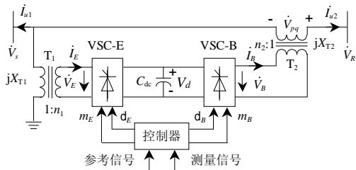  
图 1 UPFC 结构简图

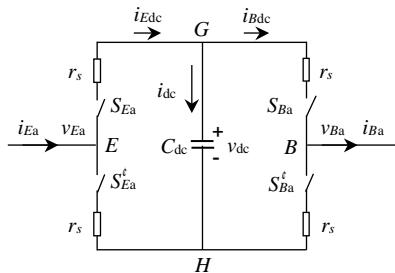  
Fig. 1 Schematic diagram of UPFC   
图 2 UPFC a 相等值电路图  
Fig. 2 Equivalent circuit of phase a of UPFC

图 2 中， $S _ { E a } , S _ { E a } ^ { ' }$ 分别为并联侧 a 相 2 个桥臂的开关函数(开断为 0，闭合为 1)，满足 $S _ { E a } + S _ { E a } ^ { ' } = 1$ 。根据图 2 可得并联侧方程为

$$
v _ {E a} = v _ {E a H} + v _ {H n} = \tag {6}
$$

$$
\left[ \left(i _ {E a} r _ {s} + v _ {\mathrm {d c}}\right) \diamond S _ {E a} + \left(i _ {E a} r _ {s}\right) \diamond S _ {E a} ^ {\prime} \right] + v _ {H n}
$$

式中 n 为三相电力系统中性点、电压参考点。

若系统交流侧满足三相平衡，则可推导得

$$
v _ {H n} = - \frac {1}{3} v _ {\mathrm {d c}} \underset {j = \mathrm {a}, \mathrm {b}, \mathrm {c}} {\hat {\mathrm {A}}} S _ {E j} \tag {7}
$$

将式(7)代入式(6)，计及 $S _ { E \mathrm { a } } + S _ { E \mathrm { a } } ^ { ' } = 1$ ，可得

$$
v _ {E a} = i _ {E a} r _ {s} + v _ {\mathrm {d c}} \left\langle S _ {E a} - \frac {1}{3} v _ {\mathrm {d c}} \underset {j = \mathrm {a}, \mathrm {b}, \mathrm {c}} {\hat {\mathrm {A}}} S _ {E j} \right. \tag {8a}
$$

与此相同，可以列出串联侧方程为

$$
v _ {B a} = - i _ {B a} r _ {s} + v _ {\mathrm {d c}} \left\langle S _ {B a} - \frac {1}{3} v _ {\mathrm {d c}} \underset {j = \mathrm {a}, \mathrm {b}, \mathrm {c}} {\hat {\mathrm {A}}} S _ {E j} \right. \tag {8b}
$$

此外，直流电容动态方程为

$$
C _ {\mathrm {d c}} \frac {\mathrm {d} v _ {\mathrm {d c}}}{\mathrm {d} t} = i _ {\mathrm {d c}} = i _ {E \mathrm {d c}} - i _ {B \mathrm {d c}} = \underset {j = \mathrm {a}, \mathrm {b}, \mathrm {c}} {\hat {\mathbf {A}}} \left(i _ {E j} S _ {E j} - i _ {B j} S _ {B j}\right) \tag {9}
$$

式(7)~(9)中的开关函数 $S _ { E j }$ 和 $S _ { B j } \ ( j { \bf = a , b , c } )$ 一般情况下为周期函数，其瞬时值与 PWM的控制策略有关。用每一个开关周期内 $S _ { E j }$ 波形的直流和基波分量对应的瞬时值来代替 $S _ { E j } ,$ ，可导出如下 $d _ { E j }$ 来代替式(8)、式(9)中的 $S _ { E j }$ 14]： [

$$
d _ {E j} = \left(m _ {E} / 2\right) \cos \left(\mathrm {w t} - \mathrm {d} _ {E} - \mathrm {s} _ {j}\right) + 1 / 2 \tag {10}
$$

式中 $\mathsf { S } _ { a } { = } 0 ; ~ \mathsf { S } _ { b } { = } 2 { \mathsf { p } } / 3 ; ~ \mathsf { S } _ { c } { = } 4 { \mathsf { p } } / 3 ; ~ \mathsf { d } _ { E }$ 为并联侧换流器触发滞后角，对于串联侧换流器，其触发滞后角

则为 ${ \mathsf { d } } _ { B }$ 。同理可以导出 $d _ { B j }$ 表达式代替 $S _ { B j } ,$ 。设串、并联 VSC元件采用PWM调制控制，则有交、直流侧电压关系为

$$
\begin{array}{l} \ddot {V} _ {E} = m _ {E} V _ {d} \\ \dot {V} _ {B} = m _ {B} V _ {d} \end{array} \tag {11}
$$

式中 $m _ { E }$ 、 $m _ { B }$ 分别为并、串联侧换流器调制比。

将上述时域方程转化为动态相量方程。在保证系统一定精度的条件下，本文做如下3个假设：

（1）交流侧电流只考虑基频分量；  
（2）直流电压只考虑直流分量；  
（3）对于开关函数，应考虑直流分量和基频量。

由此则可求得a相 $S _ { E \mathrm { { a } } }$ 对应的 $d _ { E \mathrm { { a } } }$ 的0阶和1阶动态相量为

$$
\begin{array}{l} \ddot {\langle} d _ {E a} \rangle_ {0} = 1 / 2 \\ \left. \left. \Theta_ {1} \langle d _ {E a} \right\rangle_ {1} = \left(m _ {E} / 4\right) e ^ {j q _ {E}} \right. \tag {12} \\ \stackrel {\mathrm {Q}} {\left. \mathrm {O} d _ {E a} \right\rangle_ {- 1}} = \left(m _ {E} / 4\right) \mathrm {e} ^ {- \mathrm {j q} _ {E}} \\ \end{array}
$$

与此类推，b、c相的推导与a相类同，此处从略。将式(8)、(9)根据式(1)~(5)转换成动态相量形式，并计及式(10)、(12)，再将实部虚部分开，经整理可得

$$
\begin{array}{l} \overset {\mathrm {i}} {\hat {\mathrm {O}}} \left\langle V _ {\mathrm {E a}} \right\rangle_ {1} ^ {r} = \left\langle I _ {\mathrm {E a}} \right\rangle_ {1} ^ {r} \diamond r _ {s} + \left\langle V _ {\mathrm {d c}} \right\rangle_ {0} \diamond (m _ {E} / 4) \cos q _ {E} \\ \left\langle V _ {E a} \right\rangle_ {1} ^ {i} = \left\langle I _ {E a} \right\rangle_ {1} ^ {i} \diamond r _ {s} + \left\langle V _ {\mathrm {d c}} \right\rangle_ {0} \diamond (m _ {E} / 4) \sin q _ {E} \\ \left\langle V _ {B a} \right\rangle_ {1} ^ {r} = - \left\langle I _ {B a} \right\rangle_ {1} ^ {r} \diamond r _ {s} + \left\langle V _ {\mathrm {d c}} \right\rangle_ {0} \diamond (m _ {B} / 4) \cos q _ {B} \\ \left\langle V _ {\mathrm {B a}} \right\rangle_ {1} ^ {i} = - \left\langle I _ {\mathrm {B a}} \right\rangle_ {1} ^ {i} \diamond r _ {s} + \left\langle V _ {\mathrm {d c}} \right\rangle_ {0} \times (m _ {B} / 4) \sin q _ {B} \tag {13} \\ \end{array}
$$

$$
\begin{array}{l} \frac {\mathrm {d} \left\langle V _ {\mathrm {d c}} \right\rangle_ {0}}{\mathrm {d} t} = \frac {m _ {E}}{C _ {\mathrm {d c}}} \frac {3}{2} \left[ \left\langle I _ {E \mathrm {a}} \right\rangle_ {1} ^ {r} \diamond \cos q _ {E} + \left\langle I _ {E \mathrm {a}} \right\rangle_ {1} ^ {i} \diamond \sin q _ {E} \right] - \\ \frac {m _ {B}}{C _ {\mathrm {d c}}} \frac {3}{2} \left[ \left\langle I _ {\mathrm {B a}} \right\rangle_ {1} ^ {r} \diamondsuit \cos q _ {B} + \left\langle I _ {\mathrm {B a}} \right\rangle_ {1} ^ {i} \diamondsuit \sin q _ {B} \right] \\ \end{array}
$$

式中 $m _ { E } .$ ， $m _ { B } ,$ ， ${ \mathsf { d } } _ { E }$ ， ${ \mathsf { d } } _ { B }$ 均为 UPFC 的控制系统输出量。式(13)即为 UPFC 最终的动态相量方程。当UPFC 和交流网络接口，则有 2 个复数网络方程和式(13)联立，全部变量即可求得。

由式(13)可知，UPFC 两端交流侧电压 $V _ { E } .$ 、 $V _ { B }$ 不仅分别与触发滞后角 ${ \mathsf { d } } _ { E }$ 、 ${ \mathsf { d } } _ { B }$ 相关，还与母线 S 的电压相角 ${ \sf q } _ { S }$ 相关。因此，当UPFC接入交流网络时，接口变量 $\dot { V _ { s } }$ 、 $\dot { V } _ { R }$ 需经 UPFC 装置侧和交流网络侧之间的迭代才能最终获得。本文第3节将给出此迭代的详细算法。

# 2.3 UPFC 的控制策略

UPFC 是 FACTS 装置中最灵活的控制器之一，可提供对传输线路参数、有功、无功功率及母线电

压的控制。本文采用的控制目标是维持 UPFC交流侧送端母线电压幅值 $V _ { S } ,$ 、直流侧电容电压幅值 $V _ { d }$ 及线路有功潮流 $P _ { L } .$ 、无功潮流 $Q _ { L }$ 恒定，相应的参考值为 $V _ { S { \mathrm { r e f } } } .$ 、 $V _ { d \mathrm { r e f } } .$ 、 $P _ { L \mathrm { r e f } }$ 和 $\boldsymbol { Q } _ { L \mathrm { r e f } }$ 。

UPFC并联侧的基本控制策略是通过控制交流输出电压 $\dot { V } _ { E }$ 幅值的大小和相位来控制其输出电流，实现无功补偿，以支撑母线电压幅值，并通过维持电容器电压恒定为串联侧提供所需的有功。本文中UPFC 并联侧定交流电压母线控制和定直流电压控制可用 1 阶惯性环节近似描述，如图3 所示。输出信号为调制比 $m _ { E }$ 和触发角 ${ \mathsf { d } } _ { E }$ ，其 $\mathsf { f } \mathsf { d } _ { E }$ 为并联侧换流器输出电压 $\dot { V } _ { E }$ 滞后于母线电压 $\dot { V _ { s } }$ 的角度，即

$$
\mathbf {q} _ {E} = \mathbf {q} _ {S} - \mathbf {d} _ {E} \tag {14}
$$

将 UPFC 串联侧的串联注入电压 $\dot { V } _ { p q }$ 分解为与端电压 $\dot { V _ { s } }$ 同相的分量 $\dot { V } _ { q }$ 和正交的分量 $\dot { V } _ { p }$ ， $\dot { V } _ { q }$ 和 $\dot { V } _ { p }$ 叠加于 $\dot { V _ { s } }$ 可以调节 $\dot { V _ { s } }$ 的幅值和相位，从而实现定线路潮流控制，如图 4 所示。输出信号为调制比 $m _ { B }$ 和触发角 ${ \mathsf { d } } _ { B }$ ，其中， ${ \mathsf { d } } _ { B }$ 为串联侧换流器输出电压 $\dot { V } _ { B }$ 滞后母线电压 $\dot { V _ { s } }$ 的角度，即

$$
\mathbf {q} _ {B} = \mathbf {q} _ {S} - \mathbf {d} _ {B} \tag {15}
$$

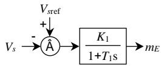  
(a)定交流母线电压控制

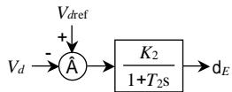  
(b)定直流电压控制

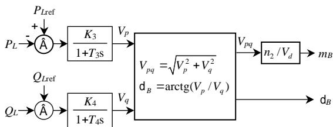  
图 3 并联侧控制系统  
Fig. 3 The control system of UPFC shunt side   
图4 串联侧控制系统  
Fig. 4 The control system of UPFC series side

# 3 混合仿真接口算法

进行混合仿真时，需要将含 UPFC装置的电力系统划分为2 个子系统，其中，不含 UPFC的网络部分用常规的机电暂态仿真模型来表示，称为交流网络子系统；需要考虑快速动态的UPFC装置本身的网络部分用动态相量模型来模拟，称为 UPFC子系统，见图 $5 \mathrm { { _ { c } } }$ 。由于 2 个子系统是基于不同的模型，故要对 2 个子系统分别进行仿真，且需要考虑2子系统间的接口。UPFC 子系统中的动态相量模型在和交流系统接口时，可将 UPFC等效为 2 个不含内

阻抗（变压器漏抗）的电压源 $\dot { V } _ { E }$ 和 $\dot { V } _ { B }$ 与系统耦合见图 1。而交流系统则可采用导纳阵方程YU I  = 来描述，所以若能求出UPFC子系统在接口母线处的等效注入电流 $\dot { I } _ { U 1 }$ 和 $\dot { I } _ { U 2 }$ ，则接口计算可妥善完成。因计算 $\dot { I } _ { U 1 }$ 和 $\dot { I } _ { U 2 }$ 需要用到 $\dot { V } _ { E }$ 和 $\dot { V } _ { B }$ ，而它们的绝对相位与 $\dot { V _ { s } }$ 的相位相关(见式(14)和(15))，且 $\dot { V _ { s } }$ 恰为网络方程中的待求变量，相位未知，故需要在 UPFC子系统和交流网络间交替迭代来求解。

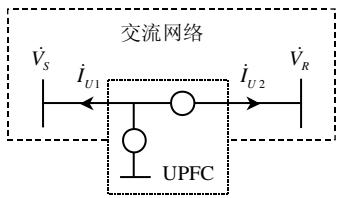  
图 5 UPFC 接口算法示意图  
Fig. 5 The interface of UPFC with network

若系统导纳阵已经收缩到发电机内节点和UPFC端节点S、R，则网络方程可写为

$$
\begin{array}{l l} \dot {\mathbf {Y}} _ {1 1} & \mathbf {Y} _ {1 2} \\ \dot {\mathbf {Y}} _ {2 1} & \mathbf {Y} _ {2 2} \end{array} . \begin{array}{l} \dot {\mathbf {V}} _ {G}. \\ \dot {\mathbf {V}} _ {U} \end{array} = \begin{array}{l} \dot {\mathbf {I}} _ {G}. \\ \dot {\mathbf {I}} _ {U} \end{array}
$$

式中 $\dot { V } _ { G }$ 、 $\dot { I } _ { \scriptscriptstyle G }$ 分别为发电机内节点电势和注入电流； $\dot { V } _ { U } = [ \dot { V } _ { S } \dot { V } _ { R } ] ^ { \mathrm { T } }$ 、 $\pmb { I } _ { U } = [ \dot { I } _ { U 1 } \quad \dot { I } _ { U 2 } ] ^ { \mathrm { T } }$ ，分别为UPFC装置接入交流网络的母线电压和注入电流。

由图 1 可知，UPFC 向系统注入的电流为

$$
\begin{array}{l} \overset {\ddagger} {\underset {\hat {U}} {\circ}} \dot {I} _ {U 1} = - \frac {\dot {V} _ {S} - \dot {V} _ {E} / n _ {1}}{\mathrm {j} X _ {T 1}} - \dot {I} _ {U 2} \tag {17} \\ \frac {\hat {O} _ {U 2}}{\hat {G} _ {U 2}} = \frac {\dot {V} _ {S} - \dot {V} _ {R} + \dot {V} _ {p q}}{\mathrm {j} X _ {T 2}} \\ \end{array}
$$

式中 $\dot { V } _ { p q } = \dot { V } _ { B } / n _ { 2 }$ 。

若记 $\pmb { Y } _ { 2 2 } = \overset { \dot { \pmb { \mathsf { H } } } _ { S S } } { \overleftarrow {  { H } } _ { R S } } \quad Y _ { S R } \overset { \smile } { \ 、 }$ Y22 ÍÎ RSY È SS Y ˘SRY (18)

$$
\boldsymbol {Y} _ {2 1} \dot {\boldsymbol {V}} _ {G} = \begin{array}{l} \text {D} \\ \text {I} \end{array} \begin{array}{l} \dot {\boldsymbol {E}} \\ \dot {\boldsymbol {I}} _ {G 1}. \end{array}
$$

$$
\begin{array}{l} Y _ {2 2} = \begin{array}{l l} \dot {Y} _ {S S} + Y _ {R S} + 1 / j X _ {T 1} & Y _ {S R} + Y _ {R R} \\ Y _ {R S} - 1 / j X _ {T 2} & Y _ {R R} + 1 / j X _ {T 2} \end{array} . (20) \\ \dot {I} _ {\phi} = \left\{ \begin{array}{c} \dot {V} _ {E} / \mathrm {j} n _ {1} X _ {T 1} - \dot {I} _ {G 1} - \dot {I} _ {G 2}. \\ \dot {V} _ {p q} / \mathrm {j} X _ {T 2} - \dot {I} _ {G 2} \end{array} \right. (21) \\ \end{array}
$$

则由式(16)、(17)可推导出

$$
\boldsymbol {Y} _ {2 2} \not \in \dot {\boldsymbol {W}} _ {U} = \dot {\boldsymbol {I}} \not \in \tag {22}
$$

利用上面的推导可构造迭代过程如下：

（1） k = 0 ，给定 UPFC 端电压初值 ${ \dot { V } } _ { U } ^ { ( 0 ) } =$ $[ \dot { V } _ { S } ^ { ( 0 ) } , \dot { V } _ { R } ^ { ( 0 ) } ]$ T  ，由式(19)计算出 $\dot { I } _ { G 1 }$ 和 $\dot { I } _ { G 2 }$ ；

（2）根据 $\dot { V } _ { U } ^ { ( k ) }$ 计算出 $\dot { V } _ { E } ^ { ( k + 1 ) }$ 和 $\dot { V } _ { p q } ^ { ( k + 1 ) }$ ，由式(21)计算 ${ \dot { I } } { \dot { \mathfrak { F } } } ^ { ( k + 1 ) }$ ；  
（3）根据式(22)求解 ${ \dot { V } } _ { U } ^ { ( k + 1 ) }$ ；  
（4）判断 ${ \dot { V } } _ { U } ^ { ( k + 1 ) }$ 与 ${ \dot { V } } _ { U } ^ { ( k ) }$ 之差是否满足收敛精度要求。若满足，则迭代结束；否则继续第(5)步。  
（5）修改 ${ \dot { V } } _ { U } ^ { ( k ) }$ 为 ${ \dot { V } } _ { U } ^ { ( k + 1 ) }$ ，重复步骤(2)~(4)，直至收敛。

# 4 仿真结果

# 4.1 与电磁暂态仿真比较

对本文导出的 UPFC 动态相量模型，用MATLAB/SIMULINK 实现了含 UPFC 的单机无穷大系统的动态相量模型时域仿真，并与电磁暂态仿真结果进行了比较。

假设 UPFC装置逆变侧调制比 $m _ { B }$ 初值为0.4，在 $t { \stackrel { } { = } } 0 . 1 \mathrm s$ 时， $m _ { B }$ 由 0.4 跳变到 0.7。此扰动下的动态仿真结果如图 6 所示。其中，图 ${ \mathfrak { 6 } } ( { \mathfrak { a } } )$ 为 UPFC 直流电容电压电磁暂态(EMT)模型仿真结果；图 6(b)为 UPFC直流电容电压动态相量模型仿真结果，二者十分吻合。图 6(c)为 UPFC 串联侧 a 相电流的动态相量幅值和 EMT 模型瞬时值的比较，动态相量模型仿真结果近于电磁暂态仿真结果的包络线。

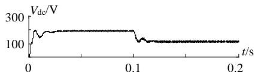  
(a)EMT 模型的 UPFC 直流电容电压

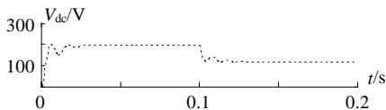  
(b)动态相量模型的UPFC直流电容电压

图6 动态相量与电磁暂态仿真结果  
Fig. 6 Comparison of the two models   
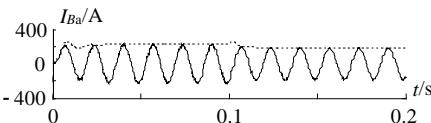  
注：图中 为电磁暂态仿镇结果； 为动态相量模型仿真结果

(c) UPFC 串联侧 a 相电流

此算例说明：动态相量建模的系统可以高精度地分析电力系统中各种快速暂变的动态过程，且变量的主要成分具有和 EMT 十分接近的精度。另外整个过程 EMT 仿真所需的时间为 41.51s，而动态相量模型仿真仅需 0.58s，时间优势非常明显。

# 4.2 与机电暂态仿真比较

采用图 7 所示的 4 机 2 区域互联系统[17]验算本文所提出的UPFC动态相量模型和大系统机电暂态

分析接口算法，其中，发电机采用次暂态模型，励磁系统采用3阶简化模型，不考虑调速器的作用，负荷用恒阻抗模型。UPFC 系统有关的参数为：$n _ { 1 } = 0 . 0 5 , ~ n _ { 2 } = 0 . 2 5 , ~ X _ { \mathrm { T 1 } } = 0 . 1 ~ \mathrm { p u } , ~ X _ { \mathrm { T 2 } } = 0 . 0 5 ~ \mathrm { p u } , ~ K _ { \mathrm { I } } = 1 . 0 ,$ ，${ \cal T } _ { 1 } \mathrm { = } 0 . 0 5 \mathrm { s } , { \cal K } _ { 2 } \mathrm { = } 0 . 0 5 , { \cal T } _ { 2 } \mathrm { = } 0 . 0 1 \mathrm { s } , { \cal K } _ { 3 } \mathrm { = } 0 . 0 5 , { \cal T } _ { 3 } \mathrm { = } 0 . 0 1 \mathrm { s } ,$ ，$K _ { 4 } { \Rightarrow } . 0$ ， $T _ { 4 } { \ = } 0 . 1 \mathrm { s }$ ， $V _ { d \mathrm { r e f } } \ = 2 2 \mathrm { ~ \textrm ~ { ~ k V ~ } ~ }$ ， 基 准 容 量$S _ { \mathrm { B } } { = } 1 0 0 \mathrm { M V } \mathrm { A }$ 。预想故障为 0.5s时母线3发生三相对称接地短路，0.1s后故障消失，网络恢复同故障前。

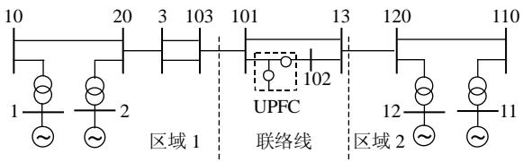  
图7 4机2区域仿真系统  
Fig. 7 4 generators 2 areas test system

系统未安装UPFC时的仿真结果如图8所示。在安装了 UPFC后，对UPFC采用传统的准稳态模型和对UPFC采用本文所建立的动态相量模型得到的结果分别见图 9和 10。从图 9和 10 可见，使用UPFC 动态相量模型得到的结果与传统的准稳态模型得到的结果十分吻合，说明了本文提出的动态相量模型及接口算法的有效性。而动态相量模型的突出优点在于可用开关函数更准确地模拟换流器桥臂的开关动作和推导出完整的三相模型，从而具有对电力系统或 UPFC 装置内部发生三相不对称故障的暂态仿真能力，此优点是传统准稳态模型所不具备的。

当仿真步长都取为0.005s时，基于2种建模方法的仿真过程所需时间分别为109s和108.6s，两者几乎相等。迭代过程中采用了改进欧拉法，在故障发生期间及故障切除后的1~2时步中，每时步最大迭代次数为 10 次左右，其它时步中最大迭代次数为4次左右，且在持续0.1s的三相故障短路后，母线101电压和线路102-13的有功和无功功率都能很快地收敛到稳定值，说明接口算法具有较快的收敛速度和较好的收敛性。

由图 10(a)可知，母线 101 的电压比未安装UPFC 时的情况有了很大的改善，这是因为 UPFC并联侧采取了定交流母线电压控制策略。而在故障后的动态过程中，图 10(b)和(c)所示的线路有功功率和无功功率恢复很快，这是因为UPFC串联侧采取了定线路潮流控制策略。

需要指出的是，在仿真中，由于动态相量模型与机电暂态模型的时间常数往往相差较大，因此需

采用不同的时间步长来协调，二者之间满足整数关系即可。

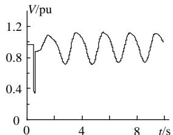  
(a)母线 101 电压

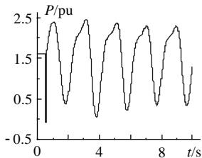  
(b)102-13 的有功功率

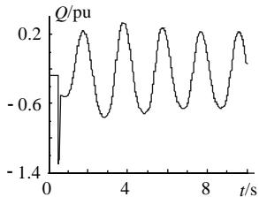  
(c)102-13 的无功功率  
图8 无UPFC时的仿真结果

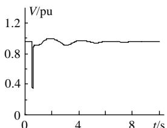  
Fig. 8 The results of the system without UPFC   
(a)母线 101 电压

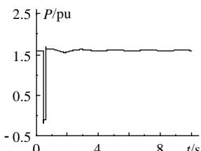  
(b)102-13 的有功功率

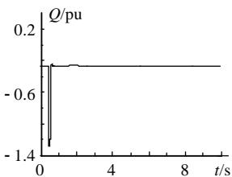  
(c)102-13 的无功功率  
图9 准稳态建模的UPFC的仿真结果

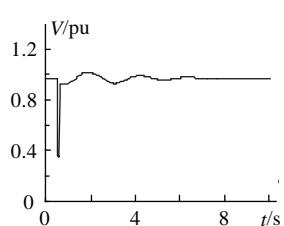  
Fig. 9 The results of the system with UPFC using T.P.   
(a)母线 101 电压

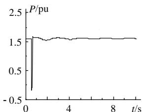  
(b)102-13 的有功功率

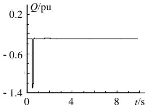  
(c)102-13 的无功功率  
图 10 动态相量建模的 UPFC 的仿真结果  
Fig. 10 The results of the system with UPFC using D.P.

# 5 结论

本文提出了UPFC动态相量模型和交流电力系统机电暂态模型的混合仿真方案。推导了含 UPFC子系统的动态相量模型，讨论了其与网络机电暂态的接口算法。仿真结果表明该混合仿真方案能够分析UPFC控制器引起的快速暂态过程，且具有仿真速度快，精度较高的优点；文中提出的接口算法具有良好的收敛性，可推广至其他 FACTS 装置或特殊控制设备与网络的接口计算。

本文所提混合仿真与全电磁暂态仿真相比，其仿真速度有较大的提高，且具有近似的精度；与传统的基于 FACTS 装置准稳态模型的机电暂态仿真相比，该方案具有更准确的对 FACTS 装置暂态过程的仿真能力，且可进一步用于对含 FACTS 装置的电力系统发生三相不对称故障时的暂态稳定分析，这将是本文后续工作的重点。

# 参考文献

[1] 梁小冰，黄方能．利用 EMTDC 进行长持续时间过程的仿真研究[J]．电网技术，2002，26(9)：55-57．Liang Xiaobing，Huang Fangneng．How to carry out simulation oflong duration processes by use of EMTDC[J] ． Power SystemTechnology，2002，26(9)：55-57  
[2] 郑三立，韩英铎，雷宪章，等．NETOMAC 在电力系统实时仿真中的应用[J]．电网技术，2003，27(1)：18-21，29Zheng Sanli，Han Yingduo，Lei Xianzhang et al．Application ofNETOMAC in real-time simulation of power systems[J]．PowerSystem Technology，2003，27(1)：18-21，29  
[3] Anderson G W J， Watson N R， Arnold C P et al．A new hybrid algorithm for analysis of HVDC and FACTS systems [C] ． Proceedings of the International Conference on Energy Management and Power Delivery，1995(2)：462- 467．   
[4] 毛晓明，管霖，张尧，等．含有多馈入直流的交直流混合电网高压直流建模研究[J]．中国电机工程学报，2004，24(9)：68-73Mao Xiaoming，Guan Lin，Zhang Yao et al．Researches on HVDCmodeling for AC/DC hybrid grid with multi-infeed HVDC[J]．Proceedings of the CSEE，2004，24(9)：68-73  
[5] Wang Liwei，Fang D Z，Chung T S．New techniques for enhancing accuracy of EMTP/TSP hybrid simulation algorithm [C]．Proceedings of the 2004 IEEE International Conference on Electric Utility Deregulation ， Restructuring and Power Technologies ， Hong Kong．April 5-8，2004，2：734-739   
[6] 黄胜利，周孝信．分布参数输电线路的时变动态相量模型及其仿真[J]．中国电机工程学报，2002，22(11)：1-5Huang Shengli，Zhou Xiaoxin．The time-varying phasor model of thedistributed parameter transmission line and its simulation[J]．Proceedings of the CSEE，2002，22(11)：1-5

[7] 黄胜利，宋瑞华，赵宏图，等．应用动态相量模型分析高压直流输电引起的次同步振荡现象[J]．中国电机工程学报，2003，23(7)：1-4．Huang Shengli，Song Ruihua，Zhao Hongtu et al．Analysis andsimulating the SSO caused by HVDC using the time-varying dynamicphasor [J]．Proceedings of the CSEE，2003，23(7)：1-4  
[8] 戚庆茹，焦连伟，严正，等．高压直流输电动态相量建模与仿真[J]．中国电机工程学报，2003，23(12)：28-32Qi Qingru，Jiao Lianwei，Yan Zheng et al． Modeling and simulationof HVDC with dynamic phasors[J]．Proceedings of the CSEE，2003，23(12)：28-32．  
[9] Noroozian M，Angguist L，Ghandhari M et al．Improving powersystem dynamics by series-connected FACTS devices [J]． IEEETrans．on Power Delivery，1997，12(4)：1635-1641  
[10] Mihalic R，Zunko P，Povh D．Improvement of transient stability using unified power flow controller [J]．IEEE Trans．on Power Delivery， 1996，11(1)：485-492．   
[11] Huang Zhengyu，Ni Yixin，Shen C M et al．Application of unified power flow controller in interconnected power systems - modeling， interface，control strategy，and case study [J]．IEEE Trans．on Power Systems，2000，15(2)：817-824   
[12] 戚庆茹，焦连伟，严正，等．统一潮流控制器的动态相量建模与仿真[J]．电力系统自动化，2003，27(15)：10-14Qi Qingru，Jiao Lianwei，Yan Zheng et al．Modeling and simulationof UPFC with dynamic phasors [J]．Automation of Electric PowerSystems，2003，27(15)：10-14．  
[13] Stefanov P C，Stankovic A M．Modeling of UPFC operation under unbalanced conditions with dynamic phasors[J]．IEEE Trans．on Power Systems，2002，17(2)：395-403   
[14] Nabavi-Niaki A，Iravani M R．Steady-state and dynamic models of unified power flow controllers (UPFC) for power system studies [J]．IEEE Trans．on Power Systems，1996，11(4)：1937-1943   
[15] 鞠儒生，陈宝贤，邱晓刚．UPFC 控制方法研究[J]．中国电机工程学报，2003，23(6)：60-65．Ju Rusheng，Chen Baoxian，Qiu Xiaogang．Basic control of unifiedpower slow controller[J]．Proceedings of the CSEE，2003，23(6)：60-65．  
[16] Sanders S R，Noworolski J M，Liu X Z et al．Generalized averaging method for power conversion circuits [J]．IEEE Trans．on Power Electronics，1991，6(2)：251-259   
[17] Kundur P．Power system stability and control[M]．New York： MacGraw-Hill，1994

收稿日期：2005-03-31。

作者简介：

刘皓明（1977-），男，博士，主要研究方向为电力系统分析与控制、电力市场；

朱浩骏（1978-），男，华南理工大学与清华大学联合培养博士研究生，研究方向为电力系统稳定与控制；

倪以信（1946-），女，教授，研究方向为电力系统稳定与控制、FACTS、人工智能技术应用以及电力市场。